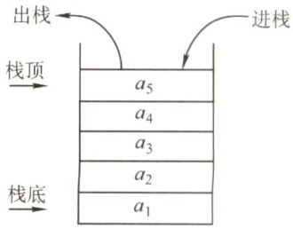
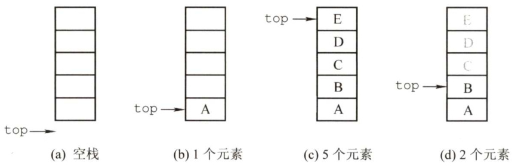
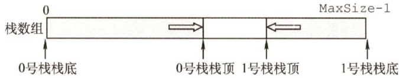
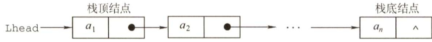
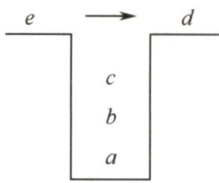
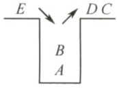

### 3.1栈  

#### 3.1.1 栈的基本概念  

#### 1．栈的定义  

栈（Stack）是只允许在一端进行插入或删除操作的线性表。首先栈是一种线性表，但限定这种线性表只能在某一端进行插入和删除操作，如图3.1所示。  

  
图3.1栈的示意图  

栈顶（Top)。线性表允许进行插入删除的那一端。  

栈底（Bottom)。固定的，不允许进行插入和删除的另一端。  

空栈。不含任何元素的空表。  

假设某个栈 $S=(a_{1},a_{2},a_{3},a_{4},a_{5})$ ，如图3.1所示，则 $a_{1}$ 为栈底元素， $a_{5}$ 为栈顶元素。由于栈只能在栈顶进行插入和删除操作，进栈次序依次为a,a,a3,a4,a5，而出栈次序为 as,a4,a,a,a。由此可见，栈的操作特性可以明显地概括为后进先出（LastInFirstOut，LIFO)。  

注意：我们每接触到一种新的数据结构类型，都应该分别从其逻辑结构、存储结构和对数据的运算三个方面着手，以加深对定义的理解。  

栈的数学性质：n 个不同元素进栈，出栈元素不同排列的个数为— C。上述公式称为卡特兰（Catalan）数，可采用数学归纳法证明，有兴趣的读者可以参考组合数学教材。  

#### 2.栈的基本操作  

各种辅导书中给出的基本操作的名称不尽相同，但所表达的意思大致是一样的。这里我们以严蔚敏编写的教材为准给出栈的基本操作，希望读者能熟记下面的基本操作。  

InitStack(&S)：初始化一个空栈S。  

StackEmpty(S)：判断一个栈是否为空，若栈S为空则返回true，否则返回false。  
Push $(\&S,\mathbf{x})$ ：进栈，若栈S未满，则将 $\mathbf{x}$ 加入使之成为新栈顶。  
Pop(&S，&x)：出栈，若栈S非空，则弹出栈顶元素，并用 $\mathbf{x}$ 返回。  
GetTop(S，&x)：读栈顶元素，若栈S非空，则用 $\mathrm{~\boldmath~x~}$ 返回栈顶元素。  
DestroyStack(&S)：销毁栈，并释放栈S占用的存储空间（“&”表示引用调用)。  
在解答算法题时，若题干未做出限制，则可直接使用这些基本的操作函数。  

#### 3.1.2 栈的顺序存储结构  

栈是一种操作受限的线性表，类似于线性表，它也有对应的两种存储方式。  

#### 1．顺序栈的实现  

采用顺序存储的栈称为顺序栈，它利用一组地址连续的存储单元存放自栈底到栈顶的数据元素，同时附设一个指针（top）指示当前栈顶元素的位置。  

栈的顺序存储类型可描述为  

#define MaxSize 50 //定义栈中元素的最大个数  
typedef struct{Elemtype data[MaxSize]; //存放栈中元素int top; //栈顶指针  
}SqStack;  

栈顶指针：S.top，初始时设置 $\mathrm{S}\cdot\mathrm{top}{=}-1^{\textcircled{1}}$ ；栈顶元素：S.data[S.top]。  

进栈操作：栈不满时，栈顶指针先加1，再送值到栈顶元素。  

出栈操作：栈非空时，先取栈顶元素值，再将栈顶指针减1。  

栈空条件：S.top $\scriptstyle1==-1$ ；栈满条件：S.top $\scriptstyle\left.={\frac{}{}}\right.$ MaxSize-1；栈长：S.top $+1$ 。  

由于顺序栈的入栈操作受数组上界的约束，当对栈的最大使用空间估计不足时，有可能发生栈上溢，此时应及时向用户报告消息，以便及时处理，避免出错。  

注意：栈和队列的判空、判满条件，会因实际给的条件不同而变化，上面提到的方法以及下面的代码实现只是在栈顶指针设定的条件下的相应方法，而其他情况则需具体问题具体分析。  

#### 2．顺序栈的基本运算  

栈操作的示意图如图3.2所示，图3.2(a)是空栈，图3.2(c)是A、B、C、D、E共5个元素依次入栈后的结果，图3.2(d)是在图3.2(c)之后E、D、C的相继出栈，此时栈中还有2个元素，或许最近出栈的元素C、D、E仍在原先的单元存储着，但top指针已经指向了新的栈顶，元素C、D、E已不在栈中，读者应通过该示意图深刻理解栈顶指针的作用。  

  
图3.2栈顶指针和栈中元素之间的关系  

下面是顺序栈上常用的基本运算的实现。  

（1）初始化  

void InitStack(SqStack &S）{ S.top $=-1$ . //初始化栈顶指针  

（2）判栈空  

bool StackEmpty（SqStack S）{ if(s.top $\scriptstyle--1$ ） //栈空 return true; else //不空 return false;   
广  

（3）进栈  

bool Push（SqStack &S,ElemType x）{ if(s.top $\scriptstyle==$ MaxSize-l) //栈满，报错 return false; S.data $[++S,\tt t o p]=x$ //指针先加1，再入栈 returntrue;  

当栈不满时，top先加1，再入栈。若初始时将top 定义为0，函数3和4应如何改写？  

（4）出栈  

bool Pop（SqStack &S,ElemType&x）{ if(s.top $\scriptstyle==-1$ ） //栈空，报错 return false; $\scriptstyle x=S$ .data[s.top--]; //先出栈，指针再减1 return true;  

（5）读栈顶元素  

bool GetTop（SqStack S,ElemType &x）{if(s.top $\scriptstyle--1$ ） //栈空，报错return false;$x=S$ .data[s.top]; //x记录栈顶元素仅为读取栈顶元素，并没有出栈操作，因此原栈顶元素依然保留在栈中。  

注意：这里top 指向的是栈顶元素，所以进栈操作为S.data $[++5.\pm\infty]=\mathbf{x}$ ，出栈操作为$\mathbf{\boldsymbol{x}}{=}\mathbf{\boldsymbol{S}}$ .data[S.top--]。若栈顶指针初始化为S.top $\scriptstyle=0$ ，即top指向栈顶元素的下一位置，则入栈操作变为S.data $[{\mathsf{S}}\cdot\mathrm{top}++]=\mathbf{\vec{x}}$ ；出栈操作变为 $\scriptstyle x=S$ .data[--S.top]。相应的栈空、栈满条件也会发生变化。请读者仔细体会其中的不同之处，做题时要灵活应变。  

#### 3．共享栈  

利用栈底位置相对不变的特性，可让两个顺序栈共享一个一维数组空间，将两个栈的栈底分别设置在共享空间的两端，两个栈顶向共享空间的中间延伸，如图3.3所示。  

  
图3.3两个顺序栈共享存储空间  

两个栈的栈顶指针都指向栈顶元素， $\mathrm{\top0{=}{-}1}$ 时0号栈为空，topl $\c=$ MaxSize时1号栈为空；仅当两个栈顶指针相邻（topl-top0=1）时，判断为栈满。当0号栈进栈时top0先加1再赋值，1号栈进栈时top1先减1再赋值；出栈时则刚好相反。  

共享栈是为了更有效地利用存储空间，两个栈的空间相互调节，只有在整个存储空间被占满时才发生上溢。其存取数据的时间复杂度均为 $O(1)$ ，所以对存取效率没有什么影响。  

#### 3.1.3 栈的链式存储结构  

采用链式存储的栈称为链栈，链栈的优点是便于多个栈共享存储空间和提高其效率，且不存在栈满上溢的情况。通常采用单链表实现，并规定所有操作都是在单链表的表头进行的。这里规定链栈没有头结点，Lhead指向栈顶元素，如图3.4所示。  

  
图3.4栈的链式存储  

栈的链式存储类型可描述为  

typedef struct Linknode{ElemType data; //数据域struct Linknode \*next; //指针域  
}\*LiStack; //栈类型定义  

采用链式存储，便于结点的插入与删除。链栈的操作与链表类似，入栈和出栈的操作都在链表的表头进行。需要注意的是，对于带头结点和不带头结点的链栈，具体的实现会有所不同。  

#### 3.1.4 本节试题精选  

#### 一、单项选择题  

01．栈和队列具有相同的（）。  

A.抽象数据类型 B.逻辑结构 C.存储结构 D.运算  

02.栈是（）。  

A.顺序存储的线性结构 B.链式存储的非线性结构C.限制存取点的线性结构 D.限制存储点的非线性结构  

03.（）不是栈的基本操作。  

A．删除栈顶元素 B．删除栈底元素C．判断栈是否为空 D．将栈置为空栈  

04.假定利用数组a[n]顺序存储一个栈，用top表示栈顶指针，用top $\scriptstyle\scriptstyle\gamma==-1$ 表示栈空，并已知栈未满，当元素 $\mathrm{~x~}$ 进栈时所执行的操作为（）。  

A. $\sf{a}\left[\tau-\tau\mathrm{{o}p\right]=\bf{x}}$ B. $\mathtt{a}\left[\mathtt{t o p\mathrm{-}}\right]=\mathtt{x}\quad\mathrm{~\mathtt{C.~}~\mathtt{a}\left[++\mathtt{t o p}\right]=\mathtt{x}~\mathtt{D.~}\mathtt{a}\left[\mathtt{t o p}++\mathtt{\right]}=\mathtt{x}\left[\mathtt{t o p}+\mathtt{\right]}=\mathtt{x}\quad\mathtt{D.~}\mathtt{a}\left[\mathtt{t o p}++\mathtt{\right]}=\mathtt{x}\quad\mathtt{a}\left[\mathtt{t o p}+\mathtt{\right]}=\mathtt{x}\quad\mathtt{D.~}\mathtt{a}\left[\mathtt{a}+\mathtt{a}+\mathtt{a}+\mathtt{a}\right]=\mathtt{x}\quad\mathtt{a}\left[\mathtt{a}+\mathtt{a}+\mathtt{a}+\mathtt{a}\right]=\mathtt{a}\left[\mathtt{a}+\mathtt{a}+\mathtt{a}+\mathtt{b}\right].$  

05.设有一个空栈，栈顶指针为1000H，每个元素需要一个存储单元，执行Push、Push、Pop、Push、Pop、Push、Pop、Push操作后，栈顶指针的值为（）。  

A.1002H B.1003H C.1004H D.1005H  

D6．和顺序栈相比，链栈有一个比较明显的优势，即（）。  

A.通常不会出现栈满的情况 B.通常不会出现栈空的情况C.插入操作更容易实现 D．删除操作更容易实现  

07．设链表不带头结点且所有操作均在表头进行，则下列最不适合作为链栈的是（）  

A.只有表头结点指针，没有表尾指针的双向循环链表B．只有表尾结点指针，没有表头指针的双向循环链表C．只有表头结点指针，没有表尾指针的单向循环链表D.只有表尾结点指针，没有表头指针的单向循环链表  

08．向一个栈顶指针为top的链栈（不带头结点）中插入一个 $\mathrm{~x~}$ 结点，则执行（）。  

A.top->next $\scriptstyle=_{\mathrm{{X}}}$ B.x->next $\c=$ top->next;top->next $\scriptstyle=_{\mathrm{{X}}}$ C. x->next $\c=$ top；top $\scriptstyle1=\mathbf{X}$ D. x->next $\O=$ top，top $\O_{1}=$ top->next  

09.链栈（不带头结点）执行Pop操作，并将出栈的元素存在×中，应该执行（）。  

A. $x=$ top;top $\L_{1}=$ top->next B. $\mathbf{x}=$ top->data C.top $\O=$ top->next; $\scriptstyle{\mathrm{X}}=$ top->data D. $x=$ top->data; top $\c=$ top->next  

10.经过以下栈的操作后，变量×的值为（）。InitStack(st); Push(st,a); Push(st,b); Pop(st, x); Top(st,x);  

A.a B.b C. NULL D.FALSE  

11.3个不同元素依次进栈，能得到（）种不同的出栈序列。  

A.4 B.5 C.6 D.7  

12.设a,b,c,d,e,f以所给的次序进栈，若在进栈操作时，允许出栈操作，则下面得不到的序列为（）。  

A.fedcba B. bcafed C. dcefba D. cabdef  

13.用S表示进栈操作，用X表示出栈操作，若元素的进栈顺序是1234，为了得到1342的出栈顺序，相应的S和X的操作序列为（）。  

A.SXSXSSXX B.SSSXXSXX C.SXSSXXSX D. SXSSXSXX  

14．若一个栈的输入序列是 $1,2,3,\cdots,n$ ，输出序列的第一个元素是 $n$ ，则第 $i$ 个输出元素是(）。  

A.不确定 B. $n-i$ C. $n-i-1$ D. $n-i+1$  

15.一个栈的输 $\wedge$ 序列为 $1,2,3,\cdots,n$ ，输出序列的第一个元素是 $i,$ 则第 $j$ 个输出元素是（）  

A. $i-j-1$ B. $i-j$ C. $j-i+1$ D.不确定  

16．某栈的输入序列为 $a,b,c,d$ ，下面的4个序列中，不可能为其输出序列的是（）  

A. $a,b,c,d$ B. $c,b,d,a$ C. $d,c,a,b$ D. $a,c,b,d$  

17．若一个栈的输入序列是 $P_{1},P_{2},\cdots,P_{n}$ ，输出序列是 $1,2,3,\cdots,n$ ，若 $P_{3}=1$ ，则 $P_{1}$ 的值（）。  

A.可能是2 B.一定是2  
C.不可能是2 D.不可能是3  

18.已知一个栈的入栈序列是1,2,3,4，其出栈序列为 $P_{1},P_{2},P_{3},P_{4}$ ，则 $P_{2},P_{4}$ 不可能是（）。  

A.2,4 B.2,1 C.4,3 D.3,4  

19．设栈的初始状态为空，当字符序列 $^{\mathfrak{a}_{\mathfrak{n}1},\mathfrak{n}}$ 作为栈的输入时，输出长度为3，且可用做C语言标识符的序列有（）个。  

A.4 B.5 C.3 D.6  

20.采用共享栈的好处是（）。  

A.减少存取时间，降低发生上溢的可能B．节省存储空间，降低发生上溢的可能C．减少存取时间，降低发生下溢的可能D.节省存储空间，降低发生下溢的可能  

21．设有一个顺序共享栈 $\mathtt{S h a r e}[0:\mathtt{n-1}]$ ，其中第一个栈顶指针topl的初值为-1，第二个栈顶指针top2的初值为n，则判断共享栈满的条件是（）。  

A.top2-top1 $\scriptstyle-{\frac{1}{2}}$ B.top1-top2 $\scriptstyle==1$ C.top1 $\scriptstyle==$ top2 D.以上都不对  

22.【2009统考真题】设栈S和队列Q的初始状态均为空，元素abcdefg依次进入栈S。若每个元素出栈后立即进入队列Q，且7个元素出队的顺序是bdcfeag，则栈S的容量至少是（）。  

A.1 B.2 C.3 D.4  

23.【2010统考真题】若元素a,b,c,d,e,f依次进栈，允许进栈、退栈操作交替进行，但不允许连续3次进行退栈操作，不可能得到的出栈序列是（）。  

A. dcebfa B. cbdaef C. bcaefd D. afedcb  

24.【2011统考真题】元素 $a,b,c,d,e$ 依次进入初始为空的栈中，若元素进栈后可停留、可出栈，直到所有元素都出栈，则在所有可能的出栈序列中，以元素 $d$ 开头的序列个数是()。  

A.3 B.4 C.5 D. 6  

25.【2013统考真题】一个栈的入栈序列为 $1,2,3,\cdots,n$ ，出栈序列是 $P_{1},P_{2},P_{3},\cdots,P_{n\circ}$ 若 $P_{2}=$ 3，则 $P_{3}$ 可能取值的个数是（）。  

A.n-3 B.n-2 C.n-1 D．无法确定  

26.【2017统考真题】下列关于栈的叙述中，错误的是（）。  

I．采用非递归方式重写递归程序时必须使用栈II．函数调用时，系统要用栈保存必要的信息III．只要确定了入栈次序，即可确定出栈次序IV．栈是一种受限的线性表，允许在其两端进行操作  

A.仅I B.仅I、Ⅱ、IⅢI C.仅I、IⅢ、IV D、仅、I、IV  

27.【2018统考真题】若栈S1中保存整数，栈S2中保存运算符，函数F（)依次执行下述各步操作：  

1）从S1中依次弹出两个操作数a和b。  
2）从S2中弹出一个运算符op。  
3）执行相应的运算bop a。  
4）将运算结果压入S1中。  
假定S1中的操作数依次是5,8,3,2（2在栈顶），S2中的运算符依次是\*、-、+（+在栈顶）。调用3次F（)后，S1栈顶保存的值是（）。  

A.-15 B.15 C. $-20$ D.20  

28.【2020统考真题】对空栈S进行Push和Pop操作，入栈序列为 $a,b,c,d,e$ ，经过Push、 Push、Pop、Push、Pop、Push、Push、Pop 操作后得到的出栈序列是（）。  

A. b,a, c B. $b,a,e$ C. $b,c,a$ D. b, c, e  

#### 二、综合应用题  

01．有5个元素，其入栈次序为 $A,B,C,D,E$ ，在各种可能的出栈次序中，第一个出栈元素为 $C$ 且第二个出栈元素为 $D$ 的出栈序列有哪几个？  

02.若元素的进栈序列为 $A,B,C,D,E$ ，运用栈操作，能否得到出栈序列 $B,C,A,E,D$ 和 $D,B,$ $\quad A,C,E?$ 为什么？  

03．假设以I和〇分别表示入栈和出栈操作。栈的初态和终态均为空，入栈和出栈的操作序列可表示为仅由I和〇组成的序列，可以操作的序列称为合法序列，否则称为非法序列。  

1）下面所示的序列中哪些是合法的？  

A.IOIOIOO B.IOOIOIIO C.IIIOIOIO D． IIIOOI0O  

2）通过对1）的分析，写出一个算法，判定所给的操作序列是否合法。若合法，返回true，否则返回false（假定被判定的操作序列已存入一维数组中）。  

04.设单链表的表头指针为L，结点结构由data和next两个域构成，其中data域为字符型。试设计算法判断该链表的全部n个字符是否中心对称。例如xyX、xyyx都是中心对称。  

05.设有两个栈sl、s2都采用顺序栈方式，并共享一个存储区[0,…,maxsize-1]，为了尽量利用空间，减少溢出的可能，可采用栈顶相向、迎面增长的存储方式。试设计s1、s2有关入栈和出栈的操作算法。  

#### 3.1.5 答案与解析  

#### 一、单项选择题  

01.B  

栈和队列的逻辑结构都是相同的，都属于线性结构，只是它们对数据的运算不同。  

02.C  

首先栈是一种线性表，所以B、D错。按存储结构的不同可分为顺序栈和链栈，但不可以把栈局限在某种存储结构上，所以A错。栈和队列都是限制存取点的线性结构。  

03.B  

基本操作是指该结构最核心、最基本的运算，其他较复杂的操作可通过基本操作实现。删除栈底元素不属于栈的基本运算，但它可以通过调用栈的基本运算求得。  

第3章 栈、队列和数组  

04.C  

初始时top 为-1，则第一个元素入栈后，top为0，即指向栈顶元素，故入栈时应先将指针top加1，再将元素入栈，只有选项C符合题意。  

05.A  

每个元素需要1个存储单元，所以每入栈一次top加1，出栈一次top减1。指针top 的值依次为1001H,1002H,1001H,1002H,1001H,1002H,1001H,1002H。  

06.A  

顺序栈采用数组存储，数组的大小是固定的，不能动态地分配大小。和顺序栈相比，链栈的最大优势在于它可以动态地分配存储空间，所以答案为A。  

07.C  

对于双向循环链表，不管是表头指针还是表尾指针，都可以很方便地找到表头结点，方便在表头做插入或删除操作。而单循环链表通过尾指针可以很方便地找到表头结点，但通过头指针找尾结点则需要遍历一次链表。对于C，插入和删除结点后，找尾结点需要花费 $O(n)$ 的时间。  

08.C  

链栈采用不带头结点的单链表表示时，进栈操作在首部插入一个结点 $x$ （即x->next $\c=$ top),插入完后需将top指向该插入的结点x。请思考当链栈存在头结点时的情况。  

09.D  

这里假设栈顶指针指向的是栈顶元素，所以选D；而A中首先将top指针赋给了 $\mathrm{~\boldmath~x~}$ ，错误；B中没有修改top指针的值；C为top指针指向栈顶元素的上一个元素时的答案。  

10.A  

执行前3句后，栈st内的值为a,b，其中b为栈顶元素；执行第4句后，栈顶元素b出栈，$\mathbf{x}$ 的值为b；执行最后一句，获取栈顶元素的值， $\mathbf{x}$ 的值为a。  

11.B  

对于 $n$ 个不同元素进栈，出栈序列的个数为  

$$
\frac{1}{n+1}C_{2n}^{n}=\frac{1}{n+1}\frac{(2n)!}{n!\times n!}=\frac{6\times5\times4}{4\times3\times2\times1}=5
$$  

考题中给出的 $n$ 值不会很大，可以根据栈的特点，若 $X_{i}$ 已经出栈，则 $X_{i}$ 前面的尚未出栈的元素一定逆置有序地出栈，因此可采用例举方法。如 $a,b,c$ 依次进栈的出栈序列有abc,acb,bac,bca,cba。另外，在一些考题中可能会问符合某个特定条件的出栈序列有多少种，比如此题中的问以 $b$ 开头的出栈序列有几种，这种类型的题目一般都使用穷举法。  

12.D  

根据栈“先进后出”的特点，且在进栈操作的同时允许出栈操作，显然答案D中 $\mathbf{\Psi}_{c}$ 最先出栈，  

则此时栈内必定为 $\boldsymbol{a}$ 和 $b$ ，但由于 $a$ 先于 $b$ 进栈，故要晚出栈。对于某个出栈的元素，在它之前进栈却晚出栈的元素必定是按逆序出栈的，其余答案均是可能出现的情况。  

此题也可采用将各序列逐个代入的方法来确定是否有对应的进出栈序列（类似下题)。  

13.D  

采用排除法，选项A,B,C得到的出栈序列分别为1243,3241,1324。由1234得到1342的进出栈序列为：1进，1出，2进，3进，3出，4进，4出，2出，故选D。  

14.D  

第 $n$ 个元素第一个出栈，说明前 $n-1$ 个元素都已经按顺序入栈，由“先进后出”的特点可知，此时的输出序列一定是输入序列的逆序，故答案选D。  

15.D  

当第 $i$ 个元素第一个出栈时，则 $i$ 之前的元素可以依次排在 $i$ 之后出栈，但剩余的元素可以在此时进栈并且也会排在 $i$ 之前的元素出栈，所以第 $j$ 个出栈的元素是不确定的。  

16.C  

对于A，可能的顺序是 $a$ 入， $a$ 出， $b$ 入， $b$ 出， $\boldsymbol{c}$ 入， $\scriptstyle{c}$ 出， $d$ 入， $d$ 出。对于B，可能的顺序是 $a$ 入， $b$ 入， $\boldsymbol{\mathbf{\mathit{c}}}$ 入， $\boldsymbol{c}$ 出， $b$ 出， $d$ 入， $d$ 出， $a$ 出。对于D，可能的顺序是 $a$ 入， $a$ 出， $b$ 入，$c$ 入， $\boldsymbol{c}$ 出， $b$ 出， $d$ 入， $d$ 出。C没有对应的序列。  

【另解】若出栈序列的第一个元素为 $d$ ，则出栈序列只能是dcba。该思想通常也适用于出栈序列的局部分析：如12345入栈，问出栈序列34152是否正确？如何分析？若第一个出栈元素是3，则此时12必停留在栈中，它们出栈的相对顺序只能是21，故34152错误。  

17.C  

入栈序列是 $P_{1},P_{2},\cdots,P_{n}$ 。由于 $P_{3}=1$ ，即 $P_{1},P_{2},P_{3}$ 连续入栈后，第一个出栈元素是 $P_{3}$ ，说明 $P_{1},P_{2}$ 已经按序进栈，根据先进后出的特点可知， $P_{2}$ 必定在 $P_{1}$ 之前出栈，而第二个出栈元素是2，而此时 $P_{1}$ 不是栈顶元素，因此 $P_{1}$ 的值不可能是2。思考：哪些 $P_{?}$ 可能是2?  

18.C  

逐个判断每个选项可能的入栈出栈顺序。对于A，可能的顺序是1入，1出，2入，2出，3入，3出，4入，4出。对于B，可能的顺序是1入，2入，3入，3出，2出，4入，4出，1出。对于D，可能的顺序是1入，1出，2入，3入，3出，2出，4入，4出。C没有对应的序列，因为当4在栈中时，意味着前面的所有元素（1、2、3）都已在栈中或曾经入过栈，此时若4第二个出栈，即栈中还有两个元素，且这两个元素是有序的（对应入栈顺序)，只能为(1,2)、(1,3)、(2,3)，若是(1,2)这个序列，则3已在 $p_{1}$ 位置出栈，不可能再在 $p_{4}$ 位置出栈，若是(1,3)和(2,3)这种情况中的任一种，则3一定是下一个出栈元素，即 $p_{3}$ 一定是3，所以 $p_{4}$ 不可能是3。  

【另解】对于D， $p_{2}$ 为最后一个入栈元素4，则只有 $p_{1}$ 或 $p_{3}$ 出栈的元素有可能为3（请读者分两种情况自行思考），而 $p_{4}$ 绝不可能为3。读者在解答此类题时，一定要注意出栈序列中的“最  

后一个入栈元素”，这样可以节省答题的时间。  

19.C  

标识符只能以英文字母或下画线开头，而不能是数字开头。故由n、1、_三个字符组合成的标识符有 ${\scriptstyle\mathrm{n1}}_{-\prime},{\scriptstyle\mathrm{n}}_{-}1,_{-}1{\scriptstyle\mathrm{n}}$ 和_n1四种。第一种：n进栈再出栈，1进栈再出栈，_进栈再出栈。第二种：n进栈再出栈，1进栈，_进栈，_出栈，1出栈。第三种：n进栈，1进栈，_进栈，_出栈，1出栈，n出栈。而根据栈的操作特性，_nl这种情况不可能出现，故选C。  

20.B  

存取栈中的元素都只需要 $O(1)$ 的时间，所以减少存取时间无从谈起。另外，栈的插入和删除操作都是在栈顶进行的，只可能发生上溢（栈顶指针超出了最大范围)，因此本题答案为B。  

21.A  

这种情况就是前面我们所描述的，详细内容请参见本节考点精析部分对共享栈的讲解。另外，读者可以思考若top1的初值为0，top2的初值为n-1时栈满的条件。  

注意：栈顶、队头与队尾的指针的定义是不唯一的，读者务必要仔细审题。  

22.C  

时刻注意栈的特点是先进后出，下表是出入栈的详细过程。  

<html><body><table><tr><td>序号</td><td>说明</td><td>栈内</td><td>栈外</td><td>序号</td><td>说明</td><td>栈内</td><td>栈外</td></tr><tr><td>1</td><td>a入栈</td><td>a</td><td></td><td>8</td><td>e入栈</td><td>ae</td><td>bdc</td></tr><tr><td>2</td><td>b入栈</td><td>ab</td><td></td><td>9</td><td>f入栈</td><td>aef</td><td>bdc</td></tr><tr><td>3</td><td>b出栈</td><td>a</td><td>b</td><td>10</td><td>f出栈</td><td>ae</td><td>bdcf</td></tr><tr><td>4</td><td>c入栈</td><td>ac</td><td>b</td><td>11</td><td>e出栈</td><td>a</td><td>bdcfe</td></tr><tr><td>5</td><td>d入栈</td><td>acd</td><td>b</td><td>12</td><td>a出栈</td><td></td><td>bdcfea</td></tr><tr><td>6</td><td>d出栈</td><td>ac</td><td>bd</td><td>13</td><td>g入栈</td><td>g</td><td>bdcfea</td></tr><tr><td>7</td><td>c出栈</td><td>a</td><td>bdc</td><td>14</td><td>g出栈</td><td></td><td>bdcfeag</td></tr></table></body></html>  

栈内的最大深度为3，故栈S的容量至少是3。  

【另解】元素的出队顺序和入队顺序相同，因此元素的出栈顺序就是 $b,d,c,f,e,a,g,$ ，因此元素的入栈出栈次序为 $\mathrm{Push}(\mathrm{S},a)$ $\mathrm{Push}(\mathrm{S},b)$ ,Pop(S, $b_{.}$ ,Push(S, $\dot{c}$ ， $\mathrm{Push}(\mathrm{S},d)$ ,Pop(S, $d)$ $\mathrm{Pop}(\mathrm{S},c)$ Push(S, e), $\operatorname{Push}(\mathrm{S},f)$ ， $\mathrm{Pop}(\mathrm{S},f)$ , Pop(S, $e^{\cdot}$ ,Pop(S, $a$ ,Push(S, g), $\mathrm{{Pop}}(\mathrm{{S}},g)$ 。假设初始所需容量为0，每做一次Push操作进行加1操作，每做一次Pop操作进行减1操作，记录容量的最大值为3，选C。  

23.D  

选项A可由 $a$ 进， $b$ 进， $\scriptstyle{c}$ 进， $d$ 进， $d$ 出， $\boldsymbol{c}$ 出， $e$ 进， $e$ 出， $b$ 出， $f$ 进， $f$ 出， $a$ 出得到； 选项B可由 $a$ 进， $b$ 进， $\boldsymbol{c}$ 进， $\boldsymbol{c}$ 出， $b$ 出， $d$ 进， $d$ 出， $a$ 出， $e$ 进， $e$ 出， $f$ 进， $f$ 出得到；选项 C可由 $\boldsymbol{a}$ 进， $b$ 进， $b$ 出， $\scriptstyle{c}$ 进， $\boldsymbol{c}$ 出， $a$ 出， $d$ 进， $e$ 进， $e$ 出， $f$ 进， $f$ 出， $d$ 出得到；选项D可 由 $\boldsymbol{a}$ 进， $a$ 出， $b$ 进， $\scriptstyle{c}$ 进， $d$ 进， $e$ 进， $f$ 进， $f$ 出， $e$ 出， $d$ 出， $\boldsymbol{c}$ 出， $b$ 出得到，但要求不允许 连续3次退栈操作，故选 $\mathrm{~D~}$ 。  

24.B  

$d$ 第一个出栈，则c，b, $a$ 出栈的相对顺序是确定的，出栈顺序必为$d\underline{{c}}\underline{{b}}\underline{{a}}_{-}$ ， $e$ 的顺序不定，在任意一个“”上都有可能。  

【另解】 $d$ 首先出栈，则 $a b c$ 停留在栈中，此时栈的状态如右图所示。  

此时可以有如下4种操作： $\textcircled{1}$ $e$ 进栈后出栈，则出栈序列为decba； $\textcircled{2}$ C出栈， $e$ 进栈后出栈，出栈序列为dceba； $\textcircled{3}c b$ 出栈， $e$ 进栈后出栈，出栈序列为dcbea； $\textcircled{4}c b a$ 出栈， $e$ 进栈后出栈，出栈序列为dcbae。思路和上面其实一样。  

  

25.C  

显然，3之后的 $4,5,\cdots,n$ 都是 $P_{3}$ 可取的数（持续进栈直到该数入栈后立即出栈)。接下来分析1和2： $P_{1}$ 可以是3之前入栈的数（可能是1或2)，也可以是4，当 $P_{1}=1$ 时， $P_{3}$ 可取2；当$P_{1}=2$ 时， $P_{3}$ 可取1；当 $P_{1}=4$ 时， $P_{3}$ 可取除1,3,4之外的所有数；故 $P_{3}$ 可能取值的个数为 $n-1$ 。  

26.C  

I的反例：计算斐波拉契数列选代实现只需要一个循环即可实现。III的反例：入栈序列为1,2，进行 Push,Push,Pop,Pop 操作，出栈次序为 2、1；进行Push,Pop,Push,Pop 操作，出栈次序为1,2。IV，栈是一种受限的线性表，只允许在一端进行操作。Ⅱ正确。  

27.B  

解析请扫右侧二维码查阅。  

28.D  

按题意，出入栈操作的过程如下：  

<html><body><table><tr><td>操作</td><td>栈内元素</td><td>出栈元素</td></tr><tr><td>Push</td><td>a</td><td></td></tr><tr><td>Push</td><td>ab</td><td></td></tr><tr><td>Pop</td><td>a</td><td>b</td></tr><tr><td>Push</td><td>ac</td><td></td></tr><tr><td>Pop</td><td>a</td><td>C</td></tr><tr><td>Push</td><td>ad</td><td></td></tr><tr><td>Push</td><td>ade</td><td></td></tr><tr><td>Pop</td><td>ad</td><td>e</td></tr></table></body></html>  

故出栈序列为 $b,c,e$ 0  

#### 二、综合应用题  

01.【解答】  

$C D$ 出栈后的状态如右图所示。  

此时有如下3种操作： $\textcircled{1}E$ 进栈后出栈，出栈序列为CDEBA； $\textcircled{2}$ $B$ 出栈， $E$ 进栈后出栈，出栈序列为CDBEA； $\textcircled{3}$ $B$ 出栈， $A$ 出栈， $E$ 进栈后出栈，出栈序列 为CDBAE。  

  

所以，以 $\boldsymbol{C D}$ 开头的出栈序列有CDEBA、CDBEA、CDBAE三种。  

02.【解答】  

能得到出栈序列BCAED。可由 $A$ 进， $B$ 进， $B$ 出， $c$ 进， $C$ 出， $A$ 出， $D$ 进， $E$ 进， $E$ 出， $D$ 出得到。不能得到出栈序列 $D B A C E$ 。若出栈序列以 $D$ 开头，说明在 $D$ 之前的入栈元素是 $A$ ， $B$ 和 $c$ ，三个元素中 $c$ 是栈顶元素， $B$ 和 $A$ 不可能早于 $c$ 出栈，故不可能得到出栈序列 $D B A C E$ 0  

03.【解答】  

1）A、D合法，而B、C不合法。在B中，先入栈1次，再连续出栈2次，错误。在C中，入栈和出栈次数不一致，会导致最终的栈不空。A、D均为合法序列，请自行模拟。注意：在操作过程中，入栈次数一定大于等于出栈次数；结束时，栈一定为空。  

2）设被判定的操作序列已存入一维数组A中。算法的基本设计思想：依次逐一扫描入栈出栈序列（即由“I”和“O”组成的字符串)，每扫描至任一位置均需检查出栈次数（即“O”的个数）是否小于入栈次数（"I”的个数)，若大于则为非法序列。扫描结束后，再判断入栈和出栈次数是否相等，若不相等则不合题意，为非法序列。  

int Judge（charA[]）{  
//判断字符数组A中的输入输出序列是否是合法序列。如是，返回true，否则返回falseint $\scriptstyle{\dot{\mathbf{1}}}=0$ .int $j=k=0$ ： //i为下标，和 $k$ 分别为字母I和0的个数while(A[i] $:=1101$ ）{ //未到字符数组尾switch（A[i]）{case 'I': $j++$ ;break; //入栈次数增1case'O': $k++$ .if $k>\dot{]}$ ）{printf（"序列非法\n"）;exit（0）；）}$i++$ ： //不论A[i]是“I”或“O”，指针i均后移) //whileif（j $!=k$ {printf（"序列非法\n"）;return false;上else{printf（"序列合法\n"）;return true;子  

【另解】入栈后，栈内元素个数加1；出栈后，栈内元素个数减1，因此可将判定一组出入栈序列是否合法转化为一组由 $+1$ 、-1组成的序列，它的任意前缀子序列的累加和不小于0（每次出栈或入栈操作后判断）则合法；否则非法。  

04.【解答】  

算法思想：使用栈来判断链表中的数据是否中心对称。让链表的前一半元素依次进栈。在处理链表的后一半元素时，当访问到链表的一个元素后，就从栈中弹出一个元素，两个元素比较，若相等，则将链表中的下一个元素与栈中再弹出的元素比较，直至链表到尾。这时若栈是空栈，则得出链表中心对称的结论；否则，当链表中的一个元素与栈中弹出元素不等时，结论为链表非  

中心对称，结束算法的执行。  

int dc（LinkList L,int n）{  
//L是带头结点的n个元素单链表，本算法判断链表是否是中心对称int i;char s[n/2]; //s字符栈$\scriptstyle{\mathrm{p}}={\mathrm{I}}$ ->next; //p是链表的工作指针，指向待处理的当前元素for $\dot{\bar{\boldsymbol{\mathrm{1}}}}=\boldsymbol{0}$ ;i<n/2; $\dot{2}++$ ） //链表前一半元素进栈$S[i]=p->$ data;$\scriptstyle\mathtt{p}=\mathtt{p}$ ->next;)i--; //恢复最后的i值if $n\div2==1$ ） //若n是奇数，后移过中心结点$\scriptstyle\mathtt{p}=\mathtt{p}$ ->next;while(p! $\c=$ NULL&&s[i] $\scriptstyle==$ p->data）{//检测是否中心对称$\dot{2}\mathrm{--}$ ： //i充当栈顶指针$\scriptstyle\mathbf{p}=\mathbf{p}\cdot$ ->next;1if $i=-1$ //栈为空栈return 1; //链表中心对称elsereturn 0; //链表不中心对称  

算法先将“链表的前一半”元素（字符）进栈。当n为偶数时，前一半和后一半的个数相同;当n为奇数时，链表中心结点字符不必比较，移动链表指针到下一字符开始比较。比较过程中遇到不相等时，立即退出while循环，不再进行比较。  

本题也可以先将单链表中的元素全部入栈，然后扫描单链表L并比较，直到比较到单链表L尾为止，但算法需要两次扫描单链表L，效率不及上述算法高。  

05.【解答】  

两个栈共享向量空间，将两个栈的栈底设在向量两端，初始时，s1栈顶指针为-1，s2 栈顶指针为 maxsize。两个栈顶指针相邻时为栈满。两个栈顶相向、迎面增长，栈顶指针指向栈顶元素。  

#define maxsize 100 //两个栈共享顺序存储空间所能达到的最多元素数，//初始化为100  
#define elemtp int //假设元素类型为整型  
typedef struct{elemtp stack[maxsize]; //栈空间int top[2]; //top为两个栈顶指针  
}stk;  
stk s; //s是如上定义的结构类型变量，为全局变量  

本题的关键在于，两个栈入栈和退栈时的栈顶指针的计算。s1栈是通常意义下的栈；而s2栈入栈操作时，其栈顶指针左移(减1)，退栈时，栈顶指针右移（加1)。  

此外，对于所有栈的操作，都要注意“入栈判满、出栈判空”的检查。  

（1）入栈操作  

int push（int i,elemtpx）{  
//入栈操作。i为栈号， $\dot{2}=0$ 表示左边的s1栈， $\dot{\bf1}=1$ 表示右边的s2栈， $x$ 是入栈元素  
//入栈成功返回1，否则返回0if $\mathrm{i}<0\mid\mathsf{I i}>1$ ）printf（"栈号输入不对"）;  

exit(0); J if（s.top[1]-s.top[0] $\scriptstyle==1$ ）{ printf（"栈已满\n"）; return0; } switch（i){ case 0:s.stack[ $++\mathbf{s}$ .top $[0]]=\mathbf{x}$ ；return 1;break; case 1:s.stack[--s.top[1]] $\scriptstyle=\mathbf{x}$ ；return 1; 1  

（2）退栈操作  

elemtp pop（int i）{   
//退栈算法。i代表栈号， $\dot{2}=0$ 时为s1栈， $\dot{\mathsf{1}}=\mathsf{1}$ 时为s2栈   
//退栈成功返回退栈元素，否则返回-1 if（i<0｜｜i>1）{ printf（"栈号输入错误\n"）; exit(0); switch(i){ case 0: if(s.top[0] $\scriptstyle==-1$ ） printf（"栈空\n"）; return -1; 1 else returns.stack[s.top[0]--]; break; case 1: if(s.top[1] $\scriptstyle==$ maxsize)( printf（"栈空\n"）; return-1; 广 else return s.stack[s.top[1] $^{++}$ ]； break; }//switch  
