### 3.2 队列  

#### 3.2.1 队列的基本概念  

#### 1．队列的定义  

队列（Queue）简称队，也是一种操作受限的线性表，只允许在表的一端进行插入，而在表的另一端进行删除。向队列中插入元素称为入队或进队；删除元素称为出队或离队。这和我们日常生活中的排队是一致的，最早排队的也是最早离队的，其操作的特性是先进先出（FirstInFirstOut，FIFO），如图3.5所示。  

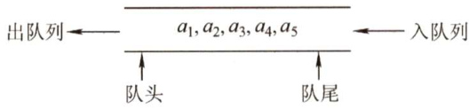  
图3.5 队列示意图  

队头（Front)。允许删除的一端，又称队首。  
队尾（Rear)。允许插入的一端。  
空队列。不含任何元素的空表。  

#### 2.队列常见的基本操作  

InitQueue(&Q)：初始化队列，构造一个空队列Q。QueueEmpty(Q)：判队列空，若队列Q为空返回true，否则返回false。EnQueue(&Q,x)：入队，若队列Q未满，将 $\mathbf{x}$ 加入，使之成为新的队尾。DeQueue（&Q,&x)：出队，若队列Q非空，删除队头元素，并用 $\mathbf{x}$ 返回。GetHead(Q,&x)：读队头元素，若队列Q非空，则将队头元素赋值给 $\mathbf{x}$ o需要注意的是，栈和队列是操作受限的线性表，因此不是任何对线性表的操作都可以作为栈和队列的操作。比如，不可以随便读取栈或队列中间的某个数据。  

#### 3.2.2 队列的顺序存储结构  

#### 1．队列的顺序存储  

队列的顺序实现是指分配一块连续的存储单元存放队列中的元素，并附设两个指针：队头指针front指向队头元素，队尾指针rear指向队尾元素的下一个位置（不同教材对front和rear的定义可能不同，例如，可以让rear指向队尾元素、front指向队头元素。对于不同的定义，出队入队的操作是不同的，本节后面有一些相关的习题，读者可以结合习题思考)。  

队列的顺序存储类型可描述为  

<html><body><table><tr><td>#define Maxsize 50 typedef struct{</td><td>//定义队列中元素的最大个数</td></tr><tr><td>ElemType data[MaxSize]; int front,rear;</td><td>//存放队列元素 //队头指针和队尾指针</td></tr></table></body></html>  

初始状态（队空条件)：Q.front $==0$ .rear $\scriptstyle\cdot==0$ 。  
进队操作：队不满时，先送值到队尾元素，再将队尾指针加1。  
出队操作：队不空时，先取队头元素值，再将队头指针加1。  

图3.6(a)所示为队列的初始状态，有Q.front $==2$ .rear $\scriptstyle\cdot==0$ 成立，该条件可以作为队列判空的条件。但能否用 $\therefore r e a r=\scriptstyle-\mathrm{MaxSiz}$ e 作为队列满的条件呢？显然不能，图3.6(d)中，队列中仅有一个元素，但仍满足该条件。这时入队出现“上溢出”，但这种溢出并不是真正的溢出，在data数组中依然存在可以存放元素的空位置，所以是一种“假溢出”。  

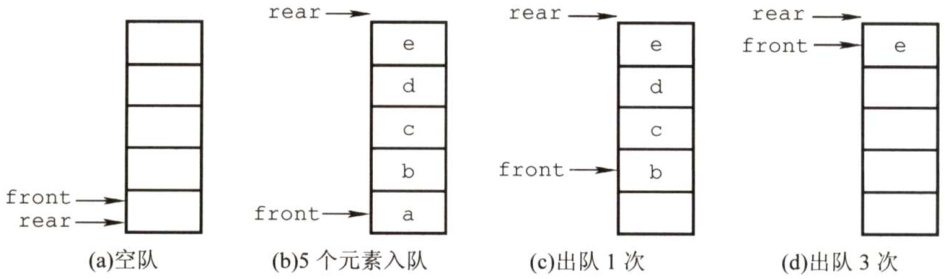  
图3.6 队列的操作  

#### 2.循环队列  

前面已指出了顺序队列的缺点，这里引出循环队列的概念。将顺序队列臆造为一个环状的空  

间，即把存储队列元素的表从逻辑上视为一个环，称为循环队列。当队首指针Q.front $\c=$ MaxSize-1后，再前进一个位置就自动到0，这可以利用除法取余运算（%）来实现。  

初始时：Q.front $\scriptstyle=0$ .rear $=0$ 。  

队首指针进1：Q.front $\O=$ (Q.front $+1$ )%MaxSize。  

队尾指针进1：Q.rear $\mathbf{\bar{\rho}}=\mathbf{\rho}$ (Q.rear $+1$ )%MaxSize。  

队列长度：（Q.rear+MaxSize-Q.front)%MaxSize。  

出队入队时：指针都按顺时针方向进1（如图3.7所示）。  

那么，循环队列队空和队满的判断条件是什么呢？显然，队空的条件是Q.front $==2$ .rear.若入队元素的速度快于出队元素的速度，则队尾指针很快就会赶上队首指针，如图3.7(d1)所示，此时可以看出队满时也有Q.front $==0$ .rear。循环队列出入队示意图如图3.7所示。  

为了区分是队空还是队满的情况，有三种处理方式：  

1）牺牲一个单元来区分队空和队满，入队时少用一个队列单元，这是一种较为普遍的做法，约定以“队头指针在队尾指针的下一位置作为队满的标志”，如图3.7(d2)所示。  

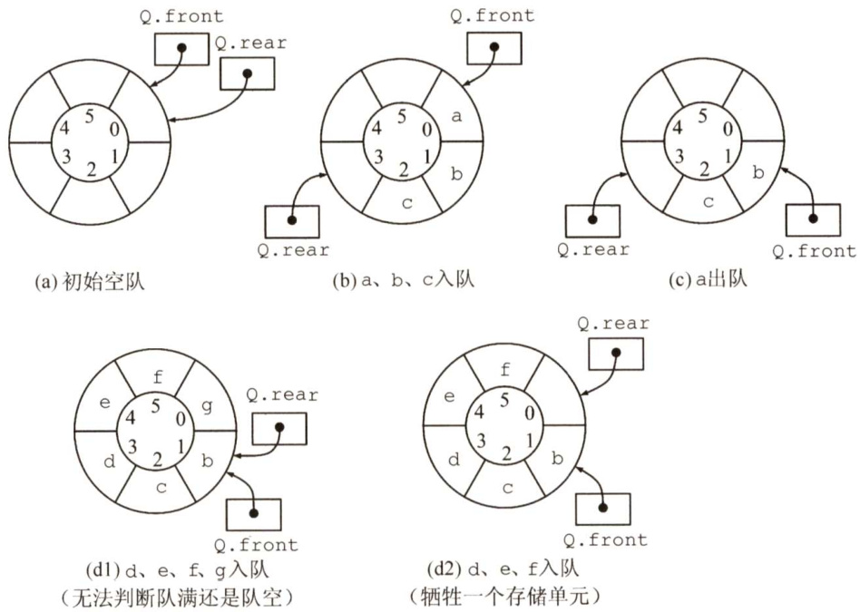  
图3.7 循环队列出入队示意图  

队满条件：（Q.rear $^{+1}$ )%MaxSize $==0$ .front。  
队空条件仍：Q.front $==0$ .rear。  
队列中元素的个数：（Q.rear-Q.front+MaxSize)%MaxSize。  

2）类型中增设表示元素个数的数据成员。这样，队空的条件为Q.size $\scriptstyle==0$ ；队满的条件为Q.size $\scriptstyle==$ MaxSize。这两种情况都有Q.front $==0$ .rear。  

3）类型中增设tag 数据成员，以区分是队满还是队空。tag 等于0时，若因删除导致Q.front $==0$ .rear，则为队空；tag等于1时，若因插入导致Q.front $==2$ .rear,则为队满。  

#### 3．循环队列的操作  

（1）初始化  

void InitQueue（SqQueue&Q）  

Q.rear $=2$ .front $=0$ . //初始化队首、队尾指针  

（2）判队空  

bool isEmpty（SqQueue Q）{ if(Q.rear $==0$ .front)return true; //队空条件 else return false;  

（3）入队  

bool EnQueue（SqQueue &Q,ElemType x）{if((Q.rear $+1$ )%MaxSize $:==0$ .front）returnfalse;//队满则报错Q.data[Q.rear] $\scriptstyle=\mathbf{x}$ ：Q.rear $\mathbf{\Psi}=$ (Q.rear $+1$ ）%MaxSize; //队尾指针加1取模return true;  
十  

（4）出队  

bool DeQueue（SqQueue &Q,ElemType &x){ if(Q.rear $==0$ .front)return false; //队空则报错 $x=0$ .data[Q.front]; Q.front $\c=$ (Q.front $+1$ )%MaxSize; //队头指针加1取模 return true;   
子  

#### 3.2.3 队列的链式存储结构  

#### 1．队列的链式存储  

队列的链式表示称为链队列，它实际上是一个同时带有队头指针和队尾指针的单链表。头指针指向队头结点，尾指针指向队尾结点，即单链表的最后一个结点(注意与顺序存储的不同)。队列的链式存储如图3.8所示。  

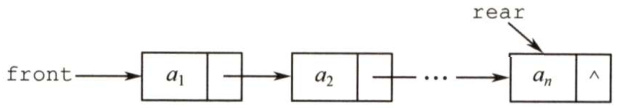  
图3.8不带头结点的链式队列  

队列的链式存储类型可描述为  

typedef struct LinkNode{ //链式队列结点 ElemType data; struct LinkNode \*next;   
}LinkNode;   
typedef struct{ //链式队列 LinkNode \*front,\*rear; //队列的队头和队尾指针   
}LinkQueue;  

当Q.front $\scriptstyle==$ NULL且Q.rear $\scriptstyle==$ NULL时，链式队列为空。  

出队时，首先判断队是否为空，若不空，则取出队头元素，将其从链表中摘除，并让Q.front指向下一个结点（若该结点为最后一个结点，则置Q.front和Q.rear都为NULL)。入队时，建立一个新结点，将新结点插入到链表的尾部，并改让Q.rear 指向这个新插入的结点（若原队  

列为空队，则令Q.front也指向该结点）。  

不难看出，不带头结点的链式队列在操作上往往比较麻烦，因此通常将链式队列设计成一个带头结点的单链表，这样插入和删除操作就统一了，如图3.9所示。  

用单链表表示的链式队列特别适合于数据元素变动比较大的情形，而且不存在队列满且产生溢出的问题。另外，假如程序中要使用多个队列，与多个栈的情形一样，最好使用链式队列，这样就不会出现存储分配不合理和“溢出”的问题。  

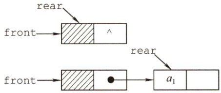  
图3.9带头结点的链式队列  

#### 2.链式队列的基本操作  

（1）初始化  

void InitQueue（LinkQueue &Q）Q.front $=0$ .rear $\L=$ （LinkNode\*）malloc（sizeof（LinkNode））;//建立头结点Q.front->next $\c=$ NULL; //初始为空  

（2）判队空  

bool IsEmpty（LinkQueue Q){ if（Q.front $==0$ .rear) return true; else return false;   
1  

（3）入队  

void EnQueue（LinkQueue &Q,ElemTypex）{LinkNode $\star_{S}=$ (LinkNode $\star$ )malloc（sizeof（LinkNode));s->data $=\times$ ;s->next $\circleddash$ NULL; //创建新结点，插入到链尾Q.rear->next $=_{\mathrm{{s}}}$ ：Q.rear $=_{\mathsf{S}}$ ：  
上  

（4）出队  

bool DeQueue（LinkQueue &Q,ElemType &x）if（Q.front $==0$ .rear)return false;//空队LinkNode $\star_{\mathrm{p}=\mathrm{Q}}$ .front->next;$x=p->$ data;Q.front->next=p->next;if(Q.rear $:==p$ ）Q.rear $=0$ .front; //若原队列中只有一个结点，删除后变空free(p);return true;  
)  

#### 3.2.4 双端队列  

双端队列是指允许两端都可以进行入队和出队操作的队列，如图3.10所示。其元素的逻辑结构仍是线性结构。将队列的两端分别称为前端和后端，两端都可以入队和出队。  

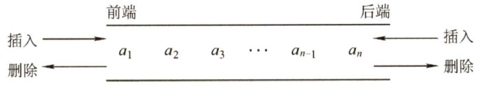  
图3.10 双端队列  

在双端队列进队时，前端进的元素排列在队列中后端进的元素的前面，后端进的元素排列在队列中前端进的元素的后面。在双端队列出队时，无论是前端还是后端出队，先出的元素排列在后出的元素的前面。思考：如何由入队序列a,b,c,d得到出队序列d,c,a,b？  

输出受限的双端队列：允许在一端进行插入和删除，但在另一端只允许插入的双端队列称为输出受限的双端队列，如图3.11所示。  

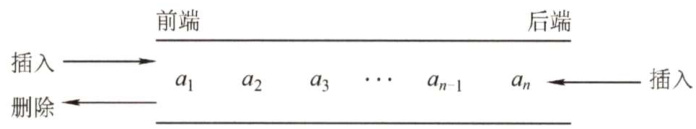  
图3.11 输出受限的双端队列  

输入受限的双端队列：允许在一端进行插入和删除，但在另一端只允许删除的双端队列称为输入受限的双端队列，如图3.12所示。若限定双端队列从某个端点插入的元素只能从该端点删除，则该双端队列就蜕变为两个栈底相邻接的栈。  

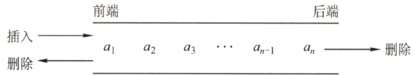  
图3.12 输入受限的双端队列  

例设有一个双端队列，输入序列为1,2,3,4，试分别求出以下条件的输出序列。  

（1）能由输入受限的双端队列得到，但不能由输出受限的双端队列得到的输出序列。  
（2）能由输出受限的双端队列得到，但不能由输入受限的双端队列得到的输出序列。  
（3）既不能由输入受限的双端队列得到，又不能由输出受限的双端队列得到的输出序列。  

解：先看输入受限的双端队列，如图3.13所示。假设end1端输入1,2,3,4，则end2端的输出相当于队列的输出，即1,2,3,4；而end1端的输出相当于栈的输出， $n=4$ 时仅通过end1端有14种输出序列（由Catalan公式得出)，仅通过endl端不能得到的输出序列有 $4!-14=10$ 种：  

1,4,2,3 2,4,1,3 3,4,1,2 3,1,4,2 3,1,2,4   
4,3,1,2 4,1,3,2 4,2,3,1 4,2,1,3 4,1,2,3  

通过endl和end2端混合输出，可以输出这10种中的8种，参看下表。其中， $\mathrm{S}_{\mathrm{L}}$ . $X_{\mathrm{L}}$ 分别代表end1端的进队和出队， $X_{\mathrm{R}}$ 代表end2端的出队。  

<html><body><table><tr><td>输出序列</td><td>进队出队顺序</td><td>输出序列</td><td>进队出队顺序</td></tr><tr><td>1,4,2,3</td><td>SXRSLSLSLXXRXR</td><td>3,1,2,4</td><td>SSSXSXRXRXR</td></tr><tr><td>2,4,1,3</td><td>SSXLSLSLXXRXR</td><td>4,1,2,3</td><td>SLSLSLSLXLXRXRXR</td></tr><tr><td>3,4,1,2</td><td>SLSLSLXLSLXLXRXR</td><td>4,1,3,2</td><td>SLSLSLSLXLXRXLXR</td></tr><tr><td>3,1,4,2</td><td>SLSLSLXLXRSLXLXR</td><td>4,3,1,2</td><td>SLSLSLSXXXRXR</td></tr></table></body></html>  

剩下两种是不能通过输入受限的双端队列输出的，即4,2,3,1和4,2,1,3。  

再看输出受限的双端队列，如图3.14所示。假设endl端和end2端都能输入，仅end2端可以输出。若都从end2端输入，就是一个栈了。当输入序列为1,2,3,4时，输出序列有14种。对于其他10 种不能得到的输出序列，交替从endl和end2 端输入，还可以输出其中8种。设 $\mathrm{\bfS}_{\mathrm{L}}$ 代表end1端的输入， $\mathbf{S}_{\mathrm{R}}$ 、 $X_{\mathrm{R}}$ 分别代表end2端的输入和输出，则可能的输出序列见下表。  

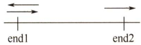  
图3.13输入受限的双端队列  

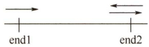  
图3.14输出受限的双端队列  

<html><body><table><tr><td>输出序列</td><td>进队出队顺序</td></tr><tr><td>1,4,2,3</td><td>SLXRSLSLSRXRXRXR</td></tr><tr><td>2,4,1,3</td><td>SLSRXRSLSRXRXRXR</td></tr><tr><td>3,4,1,2</td><td>SLSLSRXRSRXRXRXR</td></tr><tr><td>3,1,4,2</td><td>SLSLSRXRXRSRXRXR</td></tr></table></body></html>  

<html><body><table><tr><td>输出序列</td><td>进队出队顺序</td></tr><tr><td>3,1,2,4</td><td>SLSLSRXRXRSLXRXR</td></tr><tr><td>4,1,2,3</td><td>SLSLSLSRXRXRXRXR</td></tr><tr><td>4,2,1,3</td><td>SLSRSLSRXRXRXRXR</td></tr><tr><td>4,3,1,2</td><td>SLSLSRSRXRXRXRXR</td></tr></table></body></html>  

通过输出受限的双端队列不能得到的两种输出序列是4,1,3,2和4,2,3,1。  

综上所述：  

1）能由输入受限的双端队列得到，但不能由输出受限的双端队列得到的是4,1,3,2。  
2）能由输出受限的双端队列得到，但不能由输入受限的双端队列得到的是 $4,2,1,3$ 。  
3）既不能由输入受限的双端队列得到，又不能由输出受限的双端队列得到的是4,2,3,1。  
实际双端队列的考题不会这么复杂，通常仅判断序列是否满足题设条件，代入验证即可。  

#### 3.2.5 本节试题精选  

#### 一、单项选择题  

01.栈和队列的主要区别在于（）。  

A.它们的逻辑结构不一样 B.它们的存储结构不一样C．所包含的元素不一样 D.插入、删除操作的限定不一样  

02．队列的“先进先出”特性是指（）。  

I．最后插入队列中的元素总是最后被删除II．当同时进行插入、删除操作时，总是插入操作优先III．每当有删除操作时，总要先做一次插入操作IV．每次从队列中删除的总是最早插入的元素  

A.I B.I和IV C.Ⅱ和IⅢI D.IV  

03.允许对队列进行的操作有（）。  

A．对队列中的元素排序 B.取出最近进队的元素C.在队列元素之间插入元素 D．删除队头元素  

04.一个队列的入队顺序是1，2，3，4，则出队的输出顺序是（）。  

A.4,3,2,1 B.1,2,3,4 C.1,4,3,2 D. 3,2,4, 1  

5.循环队列存储在数组A[0...n]中，入队时的操作为（）。  

A.rear $\mathbf{\sigma}=$ rear $+1$ B.rear $\c=$ (rear $^{+1}$ ) mod (n-1) C. rear $\O=$ (rear $+1$ )mod n D. rear $\mathbf{\bar{\rho}}=\mathbf{\rho}$ (rear $+1$ ）mod $(\mathrm{n}{+}1)$  

06.已知循环队列的存储空间为数组A[21]，front指向队头元素的前一个位置，rear 指向队尾元素，假设当前front和rear的值分别为8和3，则该队列的长度为（）。  

A.5 B.6 C.16 D.17  

07.若用数组A[0..5]来实现循环队列，且当前rear和front的值分别为1和5，当从队列中删除一个元素，再加入两个元素后，rear和front的值分别为（）。  

A.3和4 B.3和0 C.5和0 D.5和1  

08．假设一个循环队列Q[MaxSize]的队头指针为front，队尾指针为 rear，队列的最大容量为MaxSize，此外，该队列再没有其他数据成员，则判断该队的列满条件是（）。  

A.Q.front $==2$ .rear B. Q.front $+\mathbb{Q}$ .rear> $\mathbf{\sigma}=$ MaxSize C.Q.front $\scriptstyle==$ (Q.rear $+1$ ）%MaxSize D.Q.rear $\mathbf{\sigma}=$ (Q.front $+1$ )%MaxSize  

09．最适合用作链队的链表是（）。  

A．带队首指针和队尾指针的循环单链表B．带队首指针和队尾指针的非循环单链表C．只带队首指针的非循环单链表D.只带队首指针的循环单链表  

10.最不适合用作链式队列的链表是（）。  

A.只带队首指针的非循环双链表 B．只带队首指针的循环双链表 C.只带队尾指针的循环双链表 D．只带队尾指针的循环单链表  

11．在用单链表实现队列时，队头设在链表的（）位置。  

A.链头 B.链尾 C.链中 D.以上都可以  

12．用链式存储方式的队列进行删除操作时需要（）。  

A.仅修改头指针 B.仅修改尾指针C．头尾指针都要修改 D．头尾指针可能都要修改  

13．在一个链队列中，假设队头指针为front，队尾指针为rear，x所指向的元素需要入队，则需要执行的操作为（）。  

A. front $\scriptstyle=_{\mathsf{X}}$ ，front $\c=$ front->next B. $x->$ next $\c=$ front->next,front $\scriptstyle=_{\mathsf{X}}$ C. rear->next ${\boldsymbol{\mathbf{\mathit{\sigma}}}}=\mathbf{\boldsymbol{\mathbf{\mathit{x}}}}$ ，rear $\scriptstyle\mathbf{\bar{\rho}}=\mathbf{\mathbf{\mathbf{\mathbf{x}}}}$ D. rear->next $\scriptstyle=_{\mathsf{X}}$ ， $x->$ next $\c=$ null，rear $\scriptstyle\mathbf{\bar{\rho}}=\mathbf{\mathbf{\mathbf{\mathbf{x}}}}$  

14.假设循环单链表表示的队列长度为 $n$ ，队头固定在链表尾，若只设头指针，则进队操价的时间复杂度为（）。  

A. O(n) B. $O(1)$ C. $O(n^{2})$ D. O(nlogn)  

15．若以1,2,3,4作为双端队列的输入序列，则既不能由输入受限的双端队列得到，又不能由输出受限的双端队列得到的输出序列是（）。  

A.1,2,3,4 B.4,1,3,2 C.4,2,3,1 D.4,2,1,3  

16.【2010统考真题】某队列允许在其两端进行入队操作，但仅允许在一端进行出队操作。若元素 $a,b,c,d,e$ 依次入此队列后再进行出队操作，则不可能得到的出队序列是（）。  

A. $b,a,c,d,e$ B. d, b, a, c,e C. d, b,c, a, e D. e,c,b,a, d  

17.【2011统考真题】已知循环队列存储在一维数组 $\mathbb{A}\left[0...\mathrm{n-1}\right]$ 中，且队列非空时 front和rear分别指向队头元素和队尾元素。若初始时队列为空，且要求第一个进入队列的元素存储在A[0]处，则初始时front和rear 的值分别是（）。  

A. 0，0 B.0，n-1 C.n-1，0 D. n-1,n-1  

18.【2014统考真题】循环队列放在一维数组A[0..M-1]中，endl指向队头元素，end2指向队尾元素的后一个位置。假设队列两端均可进行入队和出队操作，队列中最多能容纳M-1个元素。初始时为空。下列判断队空和队满的条件中，正确的是（）。  

A．队空：endl $\scriptstyle==$ end2; 队满：endl $\scriptstyle==$ (end2+1)mod M B.队空：endl $\scriptstyle==$ end2; 队满：end2 $==(\mathrm{end1+1}$ )mod (M-1) C.队空：end2 $\scriptstyle==$ (endl+1)mod M; 队满：endl $\cdot=-({\mathrm{end}}2+1$ )mod M D.队空：endl $==({\mathrm{end}}2+1$ ) mod M; 队满：end2 $\scriptstyle==$ (endl+1)mod(M-1)  

19.【2016统考真题】设有如下图所示的火车车轨，入口到出口之间有 $n$ 条轨道，列车的行进方向均为从左至右，列车可驶入任意一条轨道。现有编号为1～9的9列列车，驶入的次序依次是 $8,4,2,5,3,9,1,6,7$ 。若期望驶出的次序依次为 $1\sim9$ ，则 $n$ 至少是（）。  

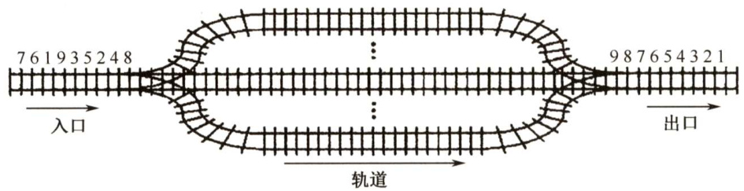  

A.2 B.3 C.4 D.5  

20.【2018统考真题】现有队列Q与栈S，初始时Q中的元素依次是 $1,2,3,4,5,6(1$ 在队头），S为空。若仅允许下列3种操作： $\textcircled{1}$ 出队并输出出队元素； $\textcircled{2}$ 出队并将出队元素入栈；$\textcircled{3}$ 出栈并输出出栈元素，则不能得到的输出序列是（）。  

A.1,2,5,6,4,3 B.2,3,4,5,6,1 C.3,4,5,6,1, 2 D.6,5,4,3,2,1  

21.【2021统考真题】初始为空的队列Q的一端仅能进行入队操作，另外一端既能进行入队操作又能进行出队操作。若Q的入队序列是1,2,3,4,5，则不能得到的出队序列是（）。  

A.5,4,3,1,2 B.5,3,1,2,4 C.4,2, 1,3, 5 D.4,1,3,2,5  

#### 二、综合应用题  

01．若希望循环队列中的元素都能得到利用，则需设置一个标志域tag，并以tag的值为0或1来区分队头指针front和队尾指针rear相同时的队列状态是“空”还是“满”。试编写与此结构相应的入队和出队算法。  

02.Q是一个队列，S是一个空栈，实现将队列中的元素逆置的算法。  

03．利用两个栈S1，S2来模拟一个队列，已知栈的4个运算定义如下：  

Push $(S,x)$ ； //元素x入栈S  
Pop(S,x); //S出栈并将出栈的值赋给 $x$   
StackEmpty（S); //判断栈是否为空  
Stackoverflow（s); //判断栈是否满  
如何利用栈的运算来实现该队列的3个运算（形参由读者根据要求自己设计）？  
Enqueue; //将元素x入队  
Dequeue; //出队，并将出队元素存储在 $x$ 中  
QueueEmpty; //判断队列是否为空  

04.【2019统考真题】请设计一个队列，要求满足： $\textcircled{1}$ 初始时队列为空； $\textcircled{2}$ 入队时，允许增加队列占用空间； $\textcircled{3}$ 出队后，出队元素所占用的空间可重复使用，即整个队列所占用的空间只增不减； $\textcircled{4}$ 入队操作和出队操作的时间复杂度始终保持为 $O(1)_{\circ}$ 请回答下列问题：1）该队列是应选择链式存储结构，还是应选择顺序存储结构？  

2）画出队列的初始状态，并给出判断队空和队满的条件。  
3）画出第一个元素入队后的队列状态。  
4）给出入队操作和出队操作的基本过程。  

#### 3.2.6 答案与解析  

#### 一、单项选择题  

01.D  

栈和队列的逻辑结构都是线性结构，都可以采用顺序存储或链式存储，C显然也错误。只有D才是栈和队列的本质区别，限定表中插入和删除操作位置的不同。  

02.B  

队列“先进先出”的特性表现在：先进队列的元素先出队列，后进队列的元素后出队列，进队列对应的是插入操作，出队列对应的是删除操作。I和IV均正确。  

03.D  

删除队头元素即出队，是队列的基本操作之一，故选D。  

04.B  

队列的入队顺序和出队顺序是一致的，这是和栈不同的。  

05.D  

数组下标范围 $0{\sim}n$ ，因此数组容量为 $n+1$ 。循环队列中元素入队的操作是rear $\mathbf{\bar{\rho}}=\mathbf{\rho}$ (rear+1)MOD maxsize，题中maxsize $=\mathtt{n}+1$ 。因此入队操作应为rear $\mathbf{\sigma}=\mathbf{\sigma}$ (rear $+1$ ) MOD $(\mathrm{n}+1)$ 。  

06.C  

队列的长度为(rear-front+maxsize)%maxsize $\O=$ (rear-front $+21$ ） $\frac{0}{0}21=1$ 6。这种情况和front指向当前元素，rear指向队尾元素的下一个元素的计算是相同的。  

07.B  

循环队列中，每删除一个元素，队首指针front $\O=$ (front $+1$ )%6，每插入一个元素，队尾指针rear $\mathbf{\bar{\rho}}=\mathbf{\rho}$ (rear $+1$ )%6。上述操作后，front $\scriptstyle=0$ ，rear $^{\cdot=3}$ 。  

08.C  

既然不能附加任何其他数据成员，只能采用牺牲一个存储单元的方法来区分是队空还是队满，约定以“队列头指针在队尾指针的下一位置作为队满的标志”，因此选C。选项A 是判断队列是否空的条件，选项B和D都是干扰项。  

注意：考虑这类具体问题时，用一些特殊情况判断往往比直接思考问题能更快地得到答案，并可以画出简单的草图以方便解题。  

09.B  

由于队列需在双端进行操作，选项C和D的链表显然不太适合链队。选项A的链表在完成  

进队和出队后还要修改为循环的，对于队列来讲这是多余的（画蛇添足)。对于选项B，由于有首指针，适合删除首结点；由于有尾指针，适合在其后插入结点，故选B。  

10.A  

由于非循环双链表只带队首指针，在执行入队操作时需要修改队尾结点的指针域，而查找队尾结点需要 $O(n)$ 的时间。B、C和D均可在 $O(1)$ 的时间内找到队首和队尾。  

11.A  

由于在队头做出队操作，为了便于删除队头元素，故总是选择链头作为队头。  

12.D  

队列用链式存储时，删除元素从表头删除，通常仅需修改头指针，但若队列中仅有一个元素，则尾指针也需要被修改，当仅有一个元素时，删除后队列为空，需修改尾指针为rear $\mathbf{\bar{\rho}}=\mathbf{\rho}$ front。  

13.D  

插入操作时，先将结点 $\mathbf{x}$ 插入到链表尾部，再让rear指向这个结点x。C的做法不够严密，因为是队尾，所以队尾 $x->$ next必须置为空。  

14.A  

依题意，进队操作是在队尾进行，即链表表头。题中已明确说明链表只设头指针，也即没有头结点和尾指针，进队后，循环单链表必须保持循环的性质，在只带头指针的循环单链表中寻找表尾结点的时间复杂度为 $O(n)$ ，故进队的时间复杂度为 $O(n)$ 。  

15.C  

使用排除法。先看可由输入受限的双端队列产生的序列：设右端输入受限，1,2,3,4依次左入，则依次左出可得4,3,2,1，排除A；右出、左出、右出、右出可得到4,1,3,2，排除B；再看可由输出受限的双端队列产生的序列：设右端输出受限，1,2,3,4依次左入、左入、右入、左入，依次左出可得到4,2,1,3，排除D。  

16.C  

本题的队列实际上是一个输出受限的双端队列，如图3.11所示。A操作： $a$ 左入（或右入）$b$ 左入、 $\scriptstyle{c}$ 右入、 $d$ 右入、 $e$ 右入。B操作： $a$ 左入（或右入）、 $b$ 左入、 $\scriptstyle{c}$ 右入、 $d$ 左入、 $e$ 右入。D操作： $a$ 左入（或右入）、 $b$ 左入、 $\mathbf{\Psi}_{c}$ 左入、 $d$ 右入、 $e$ 左入。C操作： $a$ 左入（或右入）、 $b$ 右入、因 $d$ 未出，此时只能进队， $\boldsymbol{c}$ 怎么进都不可能在 $b$ 和 $\boldsymbol{a}$ 之间。  

【另解】初始时队列为空，第1个元素 $\boldsymbol{a}$ 左入（或右入）后，第2个元素 $b$ 无论是左入还是右入都必与 $a$ 相邻，而选项C中 $\boldsymbol{a}$ 与 $b$ 不相邻，不合题意。  

17.B  

根据题意，第一个元素进入队列后存储在A[0]处，此时front和rear值都为0。入队时由于要执行（rear $+1$ )%n操作，所以若入队后指针指向0，则rear初值为 $\mathrm{n}{-}1$ ，而由于第一个  

元素在A[0]中，插入操作只改变rear指针，所以front为0不变。  

18.A  

endl 指向队头元素，可知出队操作是先从A[end1]读数，然后 endl再加1。end2 指向队尾元素的后一个位置，可知入队操作是先存数到A[end2]，然后end2再加1。若用A[0]存储第一个元素，队列初始时，入队操作是先把数据放到A[0]中，然后end2 自增，即可知end2初值为0；而end1指向的是队头元素，队头元素在数组A中的下标为0，所以得知end1的初值也为0，可知队空条件为end1 $\scriptstyle==$ end2；然后考虑队列满时，因为队列最多能容纳M-1个元素，假设队列存储在下标为O到M-2 的M-1个区域，队头为A[O]，队尾为A[M-2]，此时队列满，考虑在这种情况下endl和end2的状态，endl指向队头元素，可知end1 $=0$ ，end2指向队尾元素的后一个位置，可知end2 $\?=\mathtt{M}-2+1=\mathtt{M}-1$ ，所以队满的条件为endl $\scriptstyle==$ (end2+1)mod M。  

19.C  

解析请扫右侧二维码查阅。  

20.C  

A 的操作顺序为 $\textcircled{1}\textcircled{1}\textcircled{2}\textcircled{2}\textcircled{1}\textcircled{1}\textcircled{3}\textcircled{3}$ 。B 的操作顺序为 $\textcircled{2}\textcircled{1}\textcircled{1}\textcircled{1}\textcircled{1}\textcircled{1}\textcircled{1}\textcircled{3}$ 。D的操作顺序为 $\textcircled{2}\textcircled{2}\textcircled{2}\textcircled{2}\textcircled{1}\textcircled{3}\textcircled{3}\textcircled{3}\textcircled{3}$ 。对于C：首先输出3，说明1和2必须先依次入栈，而此后2肯定比1先输出，因此无法得到1,2的输出顺序。  

21.D  

假设队列左端允许入队和出队，右端只能入队。对于A，依次从右端入队1,2，再从左端入队 3,4,5。对于B，从右端入队1,2，然后从左端入队3，再从右端入队4，最后从左端入队5。对于C， 从左端入队1,2，然后从右端入队3，再从左端入队4，最后从右端入队5。无法验证D的序列。  

$$
\begin{array}{r}{\begin{array}{c c c c c c}{\overrightarrow{\mathrm{~s~4~3~1~2~}}}&{\longleftarrow}&{\overrightarrow{\mathrm{~s~3~1~2~4~}}}&{\longleftarrow}&{\overrightarrow{\mathrm{~s~4~2~1~3~5~}}}&{\longleftarrow}\\ &{\therefore}&{\overbrace{\mathrm{~s~3~1~2~4~}}^{\infty}}&{\longleftarrow}&{\overrightarrow{\mathrm{~s~4~2~1~3~5~}}}&{\longleftarrow}\end{array}}\end{array}
$$  

【另解】队列两端都可以入队，入队结束后，队列中的序列（或逆序）可视为出队序列。由于入队序列是从小到大的顺序，因此左端入队的子序列满足从大到小的顺序，右端入队的子序列满足从小到大的顺序。A、B和C都满足这样的特点，只有D不满足，故选D。  

#### 二、综合应用题  

01.【解答】  

在循环队列的类型结构中，增设一个tag 的整型变量，进队时置tag 为1，出队时置tag为0(因为只有入队操作可能导致队满，也只有出队操作可能导致队空)。队列Q初始时，置tag $\scriptstyle\cdot=0$ front $\c=$ rear $\scriptstyle\cdot=0$ 。这样队列的4要素如下：  

队空条件：Q.front $==0$ .rear且Q.tag $\scriptstyle\mathbf{\bar{\rho}}==0$ 。   
队满条件：Q.front $==0$ .rear且Q.tag $\scriptstyle\mathbf{\bar{\rho}}==1$ 。   
进队操作：Q.data[Q.rear] $\scriptstyle=\mathbf{x}$ ；Q.rear $\mathbf{\bar{\rho}}=\mathbf{\rho}$ (Q.rear $+1$ )%MaxSize;Q.tag ${\bf\sigma}=1$ o 出队操作： $x=0$ .data[Q.front]；Q.front $\O=$ (Q.front $+1$ )%MaxSize；Q.tag $=0$ 0  

1）设“tag”法的循环队列入队算法：  

int EnQueuel（SqQueue&Q,ElemTypex）  

if（Q.front $==0$ .rear&&Q.tag $\scriptstyle==1$ ）return 0; //两个条件都满足时则队满Q.data[Q.rear] $=\times$ ：Q.rear $\mathbf{\bar{\rho}}=\mathbf{\rho}$ (Q.rear $+1$ ）MaxSize;Q.tag $=1$ . //可能队满return 1;  

2）设“tag”法的循环队列出队算法：  

int DeQueuel（SqQueue &Q,ElemType&x）{ if(Q.front $==0$ .rear&&Q.tag $\scriptstyle==0$ ） return0; //两个条件都满足时则队空 $x=0$ .data[Q.front]; Q.front $\c=$ (Q.front+l)%MaxSize; Q.tag $=0$ . //可能队空 return1;  

02.【解答】  

本题主要考查大家对队列和栈的特性与操作的理解。由于对队列的一系列操作不可能将其中的元素逆置，而栈可以将入栈的元素逆序提取出来，因此我们可以让队列中的元素逐个地出队列，入栈；全部入栈后再逐个出栈，入队列。  

算法的实现如下：  

void Inverser（Stack &S,Queue &Q）{  
//本算法实现将队列中的元素逆置while（!QueueEmpty（Q））{$x=$ DeQueue（Q); //队列中全部元素依次出队Push(S,x); //元素依次入栈)while(!StackEmpty（S)）{Pop(S,x); //栈中全部元素依次出栈EnQueue（Q,x）; //再入队  

03.【解答】  

利用两个栈S1和S2来模拟一个队列，当需要向队列中插入一个元素时，用S1来存放已输入的元素，即 S1执行入栈操作。当需要出队时，则对S2执行出栈操作。由于从栈中取出元素的顺序是原顺序的逆序，所以必须先将S1中的所有元素全部出栈并入栈到S2中，再在S2中执行出栈操作，即可实现出队操作，而在执行此操作前必须判断S2是否为空，否则会导致顺序混乱。当栈S1和S2都为空时队列为空。  

总结如下：  

1）对S2的出栈操作用做出队，若S2为空，则先将S1中的所有元素送入S2。2）对S1的入栈操作用作入队，若S1满，必须先保证S2为空，才能将S1中的元素全部插入S2中。  

入队算法：  

int EnQueue（Stack &Sl,Stack &S2,ElemTypee）{  

if（!Stackoverflow（s1））{Push(sl,e);return 1;  
1  
if（Stackoverflow（S1）&&!StackEmpty（S2））{printf（"队列满"）;return 0;  
子  
if（Stackoveflow（S1）&&StackEmpty（S2)）{while(!StackEmpty（S1））{Pop(S1,x);Push $(S2,x)$ ”)  
}  
Push(S1,e);  
return1;  

出队算法：  

void DeQueue（Stack &Sl,Stack &S2,ElemType &x）{if（!StackEmpty（S2））{Pop $(S2,\mathbf{x})$ ，)elseif（StackEmpty（S1)）{printf（"队列为空"）;}else{while（!StackEmpty（S1））{Pop(S1,x);Push $(S2,x)$ ；1Pop(S2,x);1  

判断队列为空的算法：  

int QueueEmpty（Stack S1,Stack S2){if（StackEmpty（S1)&&StackEmpty（S2)）return 1;elsereturn 0;  
，  

04.【解答】  

1）顺序存储无法满足要求 $\textcircled{2}$ 的队列占用空间随着入队操作而增加。根据要求来分析：要求$\textcircled{1}$ 容易满足；链式存储方便开辟新空间，要求 $\textcircled{2}$ 容易满足；对于要求 $\textcircled{3}$ ，出队后的结点并不真正释放，用队头指针指向新的队头结点，新元素入队时，有空余结点则无须开辟新空间，赋值到队尾后的第一个空结点即可，然后用队尾指针指向新的队尾结点，这就需要设计成一个首尾相接的循环单链表，类似于循环队列的思想。设置队头、队尾指针后，链式队列的入队操作和出队操作的时间复杂度均为 $O(1)$ ，要求 $\textcircled{4}$ 可以满足。因此，采用链式存储结构(两段式单向循环链表)，队头指针为front，队尾指针为rear。  

2）该循环链式队列的实现可以参考循环队列，不同之处在于循环链式队列可以方便地增加空间，出队的结点可以循环利用，入队时空间不够也可以动态增加。同样，循环链式队列也要区分队满和队空的情况，这里参考循环队列牺牲一个单元来判断。初始时，创建只有一个空闲结点的循环单链表，头指针front和尾指针rear均指向空闲结点，如下图所示。  

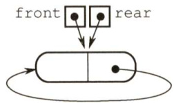  

队空的判定条件：front $\scriptstyle==$ rear。   
队满的判定条件：front $\scriptstyle==$ rear->next。  

3）插入第一个元素后的状态如下图所示。  

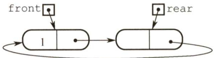  

4）操作的基本过程如下：  

<html><body><table><tr><td>入队操作：</td></tr><tr><td>若（front==rear->next) //队满 则在rear后面插入一个新的空闲结点；</td></tr><tr><td>入队元素保存到rear所指结点中；rear=rear->next；返回。</td></tr><tr><td>出队操作：</td></tr><tr><td>若(front==rear) //队空</td></tr><tr><td>则出队失败，返回；</td></tr><tr><td></td></tr></table></body></html>