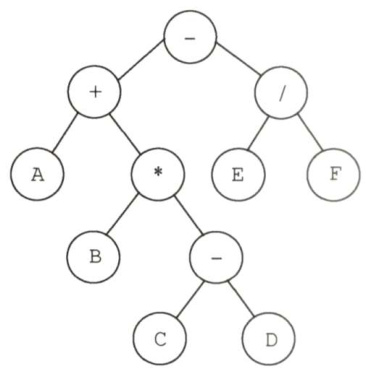
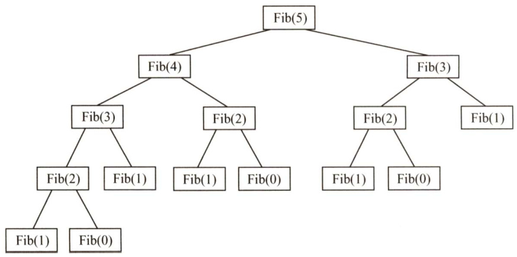
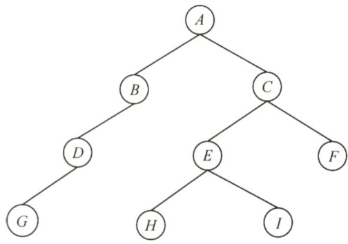
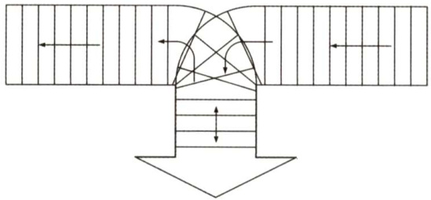

### 3.3 栈和队列的应用  

要熟练掌握栈和队列，必须学习栈和队列的应用，把握其中的规律，然后举一反三。接下来将简单介绍栈和队列的一些常见应用。  

#### 3.3.1 栈在括号匹配中的应用  

假设表达式中允许包含两种括号：圆括号和方括号，其嵌套的顺序任意即([O)或[([)]等均为正确的格式，[(])或([O)或(O]均为不正确的格式。  

考虑下列括号序列：  

分析如下：  

1）计算机接收第1个括号“[”后，期待与之匹配的第8个括号“]”出现。2）获得了第2个括号“（”，此时第1个括号“[”暂时放在一边，而急迫期待与之匹配的第7个括号“)”出现。  

3）获得了第3个括号“[”，此时第2个括号“（”暂时放在一边，而急迫期待与之匹配的第4个括号“]”出现。第3个括号的期待得到满足，消解之后，第2个括号的期待匹配又成为当前最急迫的任务。  

4）以此类推，可见该处理过程与栈的思想吻合。  

算法的思想如下：  
1）初始设置一个空栈，顺序读入括号。  
2）若是右括号，则或者使置于栈顶的最急迫期待得以消解，或者是不合法的情况（括号序列不匹配，退出程序)。  
3）若是左括号，则作为一个新的更急迫的期待压入栈中，自然使原有的在栈中的所有未消解的期待的急迫性降了一级。算法结束时，栈为空，否则括号序列不匹配。  

#### 3.3.2 栈在表达式求值中的应用  

表达式求值是程序设计语言编译中一个最基本的问题，它的实现是栈应用的一个典型范例。中缀表达式不仅依赖运算符的优先级，而且还要处理括号。后缀表达式的运算符在操作数后面，在后缀表达式中已考虑了运算符的优先级，没有括号，只有操作数和运算符。中缀表达式$\mathbb{A}{+}\mathbb{B}^{\star}$ (C-D)-E/F所对应的后缀表达式为ABCD-\*+EF/-。  

中缀表达式转化为后缀表达式的过程，见3.3.6节中习题11的解析，这里不再赘述。  

读者也可将后缀表达式与原运算式对应的表达式树（用来表示算术表达式的二元树，见图3.15）的后序遍历进行比较，可以发现它们有异曲同工之妙。  

通过后缀表示计算表达式值的过程为：顺序扫描表达式的每一项，然后根据它的类型做如下相应操作：若该项是操作数，则将其压入栈中；若该项是操作符<op>，则连续从栈中退出两个操作数Y和X，形成运算指令X<op>Y，并将计算结果重新压入栈中。当表达式的所有项都扫描并处理完后，栈顶存放的就是最后的计算结果。  

  
图3.15 $A+B^{\star}$ (C-D)-E/F对应的表达式  

例如，后缀表达式ABCD-\*+EF/-求值的过程需要12步，见表3.1。  

表3.1后缀表达式ABCD- $\star+\tt E E/$ -求值的过程  

<html><body><table><tr><td>步</td><td>扫描项</td><td>项类型</td><td>动 作</td><td>栈中内容</td></tr><tr><td>1</td><td></td><td></td><td>置空栈</td><td>空</td></tr><tr><td>2</td><td>A</td><td>操作数</td><td>进栈</td><td>A</td></tr><tr><td>3</td><td>B</td><td>操作数</td><td>进栈</td><td>AB</td></tr><tr><td>4</td><td>C</td><td>操作数</td><td>进栈</td><td>ABC</td></tr><tr><td>5</td><td>D</td><td>操作数</td><td>进栈</td><td>ABCD</td></tr><tr><td>6</td><td>-</td><td>操作符</td><td>D、C退栈， 计算C-D，结果R进栈</td><td>ABR1</td></tr><tr><td>7</td><td>*</td><td>操作符</td><td>R、B退栈，计算BxR，结果R进栈</td><td>AR2</td></tr><tr><td>8</td><td>+</td><td>操作符</td><td>R、A退栈，计算A+R，结果R进栈</td><td>R3</td></tr><tr><td>9</td><td>E</td><td>操作数</td><td>进栈</td><td>RE</td></tr><tr><td>10</td><td>F</td><td>操作数</td><td>进栈</td><td>REF</td></tr><tr><td>11</td><td>/</td><td>操作符</td><td>F、E退栈，计算E/F，结果R进栈</td><td>R3R4</td></tr><tr><td>12</td><td>1</td><td>操作符</td><td>R4、R退栈，计算R3-R4，结果R5进栈</td><td>R5</td></tr></table></body></html>  

#### 3.3.3 栈在递归中的应用  

递归是一种重要的程序设计方法。简单地说，若在一个函数、过程或数据结构的定义中又应用了它自身，则这个函数、过程或数据结构称为是递归定义的，简称递归。  

它通常把一个大型的复杂问题层层转化为一个与原问题相似的规模较小的问题来求解，递归策略只需少量的代码就可以描述出解题过程所需要的多次重复计算，大大减少了程序的代码量。但在通常情况下，它的效率并不是太高。  

以斐波那契数列为例，其定义为  

$$
\operatorname{Fib}(n)={\left\{\begin{array}{l l}{\operatorname{Fib}(n-1)+\operatorname{Fib}(n-2),n>1}\\ {1,}\\ {0,}\end{array}\right.}\qquadn=1
$$  

这就是递归的一个典型例子，用程序实现时如下：  

int Fib（intn）{ //斐波那契数列的实现if $n==0$ ）return 0; //边界条件else if $n==1$ ）return 1; //边界条件elsereturn Fib（n-1) $^+$ Fib（n-2); //递归表达式  

必须注意递归模型不能是循环定义的，其必须满足下面的两个条件：  

·递归表达式 (递归体)。  
·边界条件（递归出口）。  

递归的精髓在于能否将原始问题转换为属性相同但规模较小的问题。  

在递归调用的过程中，系统为每一层的返回点、局部变量、传入实参等开辟了递归工作栈来进行数据存储，递归次数过多容易造成栈溢出等。而其效率不高的原因是递归调用过程中包含很多重复的计算。下面以 $n=5$ 为例，列出递归调用执行过程，如图3.16所示。  

  
图3.16Fib(5)的递归执行过程  

显然，在递归调用的过程中，Fib(3)被计算了2次，Fib(2)被计算了3次。Fib(l)被调用了5次，Fib（0)被调用了3次。所以，递归的效率低下，但优点是代码简单，容易理解。在第5章的树中利用了递归的思想，代码变得十分简单。通常情况下，初学者很难理解递归的调用过程，若读者想具体了解递归是如何实现的，可以参阅编译原理教材中的相关内容。  

可以将递归算法转换为非递归算法，通常需要借助栈来实现这种转换。  

#### 3.3.4 队列在层次遍历中的应用  

在信息处理中有一大类问题需要逐层或逐行处理。这类问题的解决方法往往是在处理当前层或当前行时就对下一层或下一行做预处理，把处理顺序安排好，等到当前层或当前行处理完毕，就可以处理下一层或下一行。使用队列是为了保存下一步的处理顺序。下面用二叉树（见图3.17）层次遍历的例子，说明队列的应用。表3.2显示了层次遍历二叉树的过程。  

  
图3.17 二叉树  

该过程的简单描述如下：  

$\textcircled{1}$ 根结点入队。  

$\textcircled{2}$ 若队空（所有结点都已处理完毕)，则结束遍历；否则重复 $\textcircled{3}$ 操作。  

$\textcircled{3}$ 队列中第一个结点出队，并访问之。若其有左孩子，则将左孩子入队；若其有右孩子，则将右孩子入队，返回 $\textcircled{2}$ O  

表3.2层次遍历二叉树的过程  

<html><body><table><tr><td>序</td><td>说明</td><td>队内</td><td>队 外</td></tr><tr><td>1</td><td>A入</td><td>A</td><td></td></tr><tr><td>2</td><td>A出，BC入</td><td>BC</td><td>A</td></tr><tr><td>3</td><td>B出，D入</td><td>CD</td><td>AB</td></tr><tr><td>4</td><td>C出，EF入</td><td>DEF</td><td>ABC</td></tr><tr><td>5</td><td>D出，G入</td><td>EFG</td><td>ABCD</td></tr><tr><td>6</td><td>E出，HI入</td><td>FGHI</td><td>ABCDE</td></tr><tr><td>7</td><td>F出</td><td>GHI</td><td>ABCDEF</td></tr><tr><td>8</td><td>GHI出</td><td></td><td>ABCDEFGHI</td></tr></table></body></html>  

#### 3.3.5 队列在计算机系统中的应用  

队列在计算机系统中的应用非常广泛，以下仅从两个方面来简述队列在计算机系统中的作用：第一个方面是解决主机与外部设备之间速度不匹配的问题，第二个方面是解决由多用户引起的资源竞争问题。  

对于第一个方面，仅以主机和打印机之间速度不匹配的问题为例做简要说明。主机输出数据给打印机打印，输出数据的速度比打印数据的速度要快得多，由于速度不匹配，若直接把输出的数据送给打印机打印显然是不行的。解决的方法是设置一个打印数据缓冲区，主机把要打印输出的数据依次写入这个缓冲区，写满后就暂停输出，转去做其他的事情。打印机就从缓冲区中按照先进先出的原则依次取出数据并打印，打印完后再向主机发出请求。主机接到请求后再向缓冲区写入打印数据。这样做既保证了打印数据的正确，又使主机提高了效率。由此可见，打印数据缓冲区中所存储的数据就是一个队列。  

对于第二个方面，CPU（即中央处理器，它包括运算器和控制器）资源的竞争就是一个典型的例子。在一个带有多终端的计算机系统上，有多个用户需要CPU各自运行自己的程序，它们分别通过各自的终端向操作系统提出占用CPU的请求。操作系统通常按照每个请求在时间上的先后顺序，把它们排成一个队列，每次把CPU分配给队首请求的用户使用。当相应的程序运行结束或用完规定的时间间隔后，令其出队，再把CPU分配给新的队首请求的用户使用。这样既能满足每个用户的请求，又使CPU能够正常运行。  

#### 3.3.6 本节试题精选  

#### 一、单项选择题  

01.栈的应用不包括（）。  

A.递归 B.进制转换 C．迷宫求解 D.缓冲区  

02.表达式 $^{a*}$ (b+c)-d的后缀表达式是（）。  

A.abcd\*+- B.abc+\*d- C. abc\*+d- D. -+\*abcd  

03.下面（）用到了队列。  

A.括号匹配 B.迷宫求解 C.页面替换算法 D.递归  

04.利用栈求表达式的值时，设立运算数栈OPEN。假设OPEN只有两个存储单元，则在下列表达式中，不会发生溢出的是（）。  

A.A-B\*(C-D) B.(A-B)\*C-D C. (A-B\*C)-D D. (A-B)\*(C-D)  

05.执行完下列语句段后，i的值为（）。  

int f（intx）{   
return（ $(x>0)?x^{\star}\pm(x-1):2)$ . )   
inti;   
$\mathrm{i}=\mathrm{f}$ （f（1));  

A.2 B.4 C.8 D．无限递归对于一个问题的递归算法求解和其相对应的非递归算法求解，（）。  

A.递归算法通常效率高一些 B.非递归算法通常效率高一些C．两者相同 D．无法比较  

07.执行函数时，其局部变量一般采用（）进行存储。  

A.树形结构 B．静态链表 C．栈结构 D.队列结构  

08.执行（）操作时，需要使用队列作为辅助存储空间。  

A．查找散列（哈希）表 B．广度优先搜索图C.前序（根）遍历二叉树 D．深度优先搜索图  

09．下列说法中，正确的是（）。  

A.消除递归不一定需要使用栈  
B.对同一输入序列进行两组不同的合法入栈和出栈组合操作，所得的输出序列也一定相同  
C.通常使用队列来处理函数或过程调用  
D.队列和栈都是运算受限的线性表，只允许在表的两端进行运算  

10.【2009统考真题】为解决计算机主机与打印机之间速度不匹配的问题，通常设置一个打印数据缓冲区，主机将要输出的数据依次写入该缓冲区，而打印机则依次从该缓冲区中取出数据。该缓冲区的逻辑结构应该是（）。  

A.栈 B．队列 C.树 D.图  

11.【2012统考真题】已知操作符包括 $^+$ 、-、\*、/、(和)。将中缀表达式 $a+b-a+(1c+d)/e-f)+$ g转换为等价的后缀表达式 $\mathsf{a b}+\mathsf{a c d}+\mathsf{e}/\mathsf{f}-{}^{\star}-\mathsf{g}+$ 时，用栈来存放暂时还不能确定运算次序的操作符。栈初始时为空时，转换过程中同时保存在栈中的操作符的最大个数是（）。  

A.5 B.7 C.8 D.11  

12.【2014统考真题】假设栈初始为空，将中缀表达式 $a/b+(c\times\mathrm{d}-e^{\star}\pounds)/\mathrm{g}$ 转换为等价的后缀表达式的过程中，当扫描到时，栈中的元素依次是（）。  

A. $+({\star}-$ B. $+\left(-^{\star}\right.$ C. $1+(1+\cdots+$ D./+-\*  

13.【2015统考真题】已知程序如下：  

int S(int n)  
{ return $n<=0$ ）？0:s（n-1）+n;}  
voidmain（)  
{ cout<<S（1);}  

程序运行时使用栈来保存调用过程的信息，自栈底到栈顶保存的信息依次对应的是 $()_{\circ}$  

A.main()→S(1)→S(0) B. S(0)→S(1)→main() C.main()→S(0)→S(1) D.S(1)→S(0)→main()  

#### 二、综合应用题  

01．假设一个算术表达式中包含圆括号、方括号和花括号3种类型的括号，编写一个算法来判别表达式中的括号是否配对，以字符 ${^{*}\mathrm{\textperthousand}}$ 作为算术表达式的结束符。  

02．按下图所示铁道进行车厢调度（注意，两侧铁道均为单向行驶道，火车调度站有一个用于调度的“栈道”)，火车调度站的入口处有 $n$ 节硬座和软座车厢（分别用H和S表示）等待调度，试编写算法，输出对这 $n$ 节车厢进行调度的操作（即入栈或出栈操作）序列，以使所有的软座车厢都被调整到硬座车厢之前。  

  

03.利用一个栈实现以下递归函数的非递归计算：  

$$
P_{n}(x)=\left\{\begin{array}{l l}{1,\quad}&{n=0}\\ {2x,\quad}&{n=1}\\ {2x P_{n-1}(x)-2(n-1)P_{n-2}(x),\quad n>1}\end{array}\right.
$$  

04．某汽车轮渡口，过江渡船每次能载10 辆车过江。过江车辆分为客车类和货车类，上渡船有如下规定：同类车先到先上船；客车先于货车上船，且每上4辆客车，才允许放上1辆货车；若等待客车不足4辆，则以货车代替；若无货车等待，允许客车都上船。试设计一个算法模拟渡口管理。  

#### 3.3.7 答案与解析  

#### 一、单项选择题  

01.D  

缓冲区是用队列实现的，A、B、C都是栈的典型应用。  

第3章 栈、队列和数组  

02.B  

后缀表达式中，每个计算符号均直接位于其两个操作数的后面，按照这样的方式逐步根据计算的优先级将每个计算式进行变换，即可得到后缀表达式。  

另解：将两个直接操作数用括号括起来，再将操作符提到括号后，最后去掉括号。如下：$\left(\Phi\left(_{\circ}\mathsf{a}\star\left(_{\circ}\mathsf{b}+\mathsf{c}\right)\right)-\mathsf{d}\right)$ ，提出操作符并去掉括号后，可得后缀表达式为 abo $\mathbf{+\stard-}$ 。  

学完第5章后，可将表达式画成二叉树的形式，再用后序遍历即可求得后缀表达式。  

03.C  

页面替换算法中的FIFO用到了队列。其余的都只用到了栈。  

04.B  

利用栈求表达式的值时，可以分别设立运算符栈和运算数栈，其原理不变。选项B中A入栈，B入栈，计算得R1，C入栈，计算得R2，D入栈，计算得R3，由此得栈深为2。A、C、D依次计算得栈深为4、3、3。因此选B。  

技巧：根据算符优先级，统计已依次进栈，但还没有参与计算的运算符的个数。以选项C为例，’（'、'A'、'-'入栈时，‘（'和'-'还没有参与运算，此时运算符栈大小为2，'B'和'\*!入栈时运算符大小为3，'C入栈时！ $\mathtt{B}^{\star}\mathtt{C}$ 运算，此时运算符栈大小为2，以此类推。  

05.B  

栈与递归有着紧密的联系。递归模型包括递归出口和递归体两个方面。递归出口是递归算法的出口，即终止递归的条件。递归体是一个递推的关系式。根据题意有  

$\mathrm{~f~}(0)=2$ .$\pounds\left(1\right)=1\star\pounds\left(0\right)=2$ .$\pounds\left(\pounds\left(1\right)\ \right)=\pounds\left(2\right)=2\star\pounds\left(1\right)=4\$ 即 $\pounds\left(\pm\left(1\right)\right)=4$ 。因此本题答案为 $\mathbf{B}$ 。  

06.B  

通常情况下，递归算法在计算机实际执行的过程中包含很多的重复计算，所以效率会低。  

07.C  

调用函数时，系统会为调用者构造一个由参数表和返回地址组成的活动记录，并将记录压入系统提供的栈中，若被调用函数有局部变量，也要压入栈中。  

08.B本题涉及第5章和第6章的内容，图的广度优先搜索类似于树的层序遍历，都要借助于队列。  

09.A解析请扫右侧二维码查阅。  

10.B在提取数据时必须保持原来数据的顺序，所以缓冲区的特性是先进先出，答案选B。  

11.A  

考查栈在中缀表达式转化为后缀表达式中的应用。将中缀表达式 $a+b-a+((c+d)/e-f)+g$ 转换为相应的后缀表达式，需要根据操作符<op>的优先级来进行栈的变化，我们用icp来表示当前扫描到的运算符ch的优先级，该运算符进栈后的优先级为isp,则运算符的优先级如下表所示[isp是栈内优先（in stack priority）数，icp 是栈外优先（in coming priority）数]：  

<html><body><table><tr><td>操作符</td><td>#</td><td>(</td><td>/ *，</td><td>+， 一</td><td></td></tr><tr><td>isp</td><td>0</td><td>1</td><td>5</td><td>3</td><td>6</td></tr><tr><td>icp</td><td>0</td><td>6</td><td>4</td><td>2</td><td>1</td></tr></table></body></html>  

我们在表达式后面加上符号 $\#^{*}$ ，表示表达式结束。具体转换过程如下：  

<html><body><table><tr><td>步 骤</td><td>扫描项</td><td>项类型</td><td>动 作</td><td>栈内内容 输</td><td>出</td></tr><tr><td>0</td><td></td><td></td><td>'#'进栈，读下一符号</td><td>#</td><td></td></tr><tr><td>1</td><td>a</td><td>操作数</td><td>直接输出</td><td>#</td><td>a</td></tr><tr><td>2</td><td>+</td><td>操作符</td><td>isp(#')<icp('+')，进栈</td><td>#+</td><td></td></tr><tr><td>3</td><td>b</td><td>操作数</td><td>直接输出</td><td>#+</td><td>b</td></tr><tr><td>4</td><td></td><td>操作符</td><td>isp('+')>icp（'-')，退栈并输出</td><td>#</td><td>+</td></tr><tr><td>5</td><td></td><td></td><td>isp('#')<icp('-')，进栈</td><td>#一</td><td></td></tr><tr><td>6</td><td>a</td><td>操作数</td><td>直接输出</td><td>#-</td><td>a</td></tr><tr><td>7</td><td>*</td><td>操作符</td><td>isp('-')<icp(*)，进栈</td><td>#-*</td><td></td></tr><tr><td>8</td><td>（</td><td>操作符</td><td>isp('*!)<icp('(')，进栈</td><td>#-*(</td><td></td></tr><tr><td>9</td><td>(</td><td>操作符</td><td>isp((')<icp('(')，进栈</td><td>#-*（(</td><td></td></tr><tr><td>10</td><td></td><td>操作数</td><td>直接输出</td><td>#-*（（</td><td>C</td></tr><tr><td>11</td><td>+</td><td>操作符</td><td>isp('(')<icp(+)，进栈</td><td>#-*((+</td><td></td></tr><tr><td>12</td><td>d</td><td>操作数</td><td>直接输出</td><td>#-*((+</td><td>d</td></tr><tr><td>13</td><td>）</td><td>操作符</td><td>isp（'+')>icp（'）')，退栈并输出</td><td>#-*((</td><td>+</td></tr><tr><td>14</td><td></td><td></td><td>isp（'（)==icp(')')，直接退栈</td><td>#-*(</td><td></td></tr><tr><td>15</td><td>/</td><td>操作符</td><td>isp('(')<icp(/')，进栈</td><td>#-*(/</td><td></td></tr><tr><td>16</td><td>e</td><td>操作数</td><td>直接输出</td><td>#-*(/</td><td>e</td></tr><tr><td>17</td><td></td><td>操作符</td><td>isp('/')>icp('-')，退栈并输出</td><td>#-*(</td><td>/</td></tr><tr><td>18</td><td></td><td></td><td>isp('(')<icp(-')，进栈</td><td>#-*(-</td><td></td></tr><tr><td>19</td><td>f</td><td>操作数</td><td>直接输出</td><td>#-*（-</td><td>f</td></tr><tr><td>20</td><td>）</td><td>操作符</td><td>isp('-')>icp(')')，退栈并输出</td><td>#-*(</td><td></td></tr><tr><td>21</td><td></td><td></td><td>isp(()==icp()')， 直接退栈</td><td>#1*</td><td></td></tr><tr><td>22</td><td>+</td><td>操作符</td><td>isp(*)>icp（'+')， 退栈并输出</td><td>#一</td><td>*</td></tr><tr><td>23</td><td></td><td></td><td>isp('-')>icp（'+')， 退栈并输出</td><td>#</td><td>！</td></tr><tr><td>24</td><td></td><td></td><td>isp（'#')<icp（'+')， 进栈</td><td>#+</td><td></td></tr><tr><td>25</td><td>g</td><td>操作数</td><td>直接输出</td><td>#+</td><td>g</td></tr><tr><td>26</td><td>#</td><td>操作符</td><td>isp（'+')>icp（'#')，退栈并输出</td><td>#</td><td>+</td></tr><tr><td>27</td><td></td><td></td><td>isp('#)==icp('#')，退栈，结束</td><td></td><td></td></tr></table></body></html>  

即相应的后缀表达式为 $\mathsf{a b}+\mathsf{a c d}+\mathsf{e}/\mathsf{f}-{}^{\star}-\mathsf{g}+$ 。由上表可以看出，第11、12步时栈中存放的操作符最多，请注意题中明确表示了6种操作符，而‘#’不算，即最大个数为5。  

12.B将中缀表达式转换为后缀表达式的算法思想如下：从左向右开始扫描中缀表达式；遇到数字时，加入后缀表达式；遇到运算符时：a.若为’（'，入栈;b.若为'）'，则依次把栈中的运算符加入后缀表达式，直到出现’（'，从栈中删除’（"；c.若为除括号外的其他运算符，当其优先级高于除’（'外的栈顶运算符时，直接入栈。否则从栈顶开始，依次弹出比当前处理的运算符优先级高和优先级相等的运算符，直到一个比它优先级低的或遇到了一个左括号为止。  

当扫描的中缀表达式结束时，栈中的所有运算符依次出栈加入后缀表达式。  

<html><body><table><tr><td>待处理序列</td><td>栈</td><td>后缀表达式</td><td>当前扫描元素</td><td>动作</td></tr><tr><td>a/b+(c*d-e*f)/g</td><td></td><td></td><td>a</td><td>a加入后缀表达式</td></tr><tr><td>/b+(c*d-e*f)/g</td><td></td><td>a</td><td>/</td><td>/入栈</td></tr><tr><td>b+(c*d-e*f)/g</td><td>/</td><td>a</td><td>b</td><td>b加入后缀表达式</td></tr><tr><td>+(c*d-e*f)/g</td><td>/</td><td>ab</td><td>+</td><td>+优先级低于栈顶的/，弹出/</td></tr><tr><td>+(c*d-e*f)/g</td><td></td><td>ab/</td><td>+</td><td>+入栈</td></tr><tr><td>(c*d-e*f)/g</td><td>+</td><td>ab/</td><td>（</td><td>(入栈</td></tr><tr><td>c*d-e*f)/g</td><td>+(</td><td>ab/</td><td>C</td><td>c加入后缀表达式</td></tr><tr><td>*d-e*f)/g</td><td>+(</td><td>ab/c</td><td>*</td><td>栈顶为(，*入栈</td></tr><tr><td>d-e*f)/g</td><td>+(*</td><td>ab/c</td><td>d</td><td>d 加入后缀表达式</td></tr><tr><td>-e*f)/g</td><td>+（*</td><td>ab/cd</td><td>一</td><td>-优先级低于栈顶的*，弹出*</td></tr><tr><td>-e*f)/g</td><td>+(</td><td>ab/cd*</td><td>1</td><td>栈顶为(，-入栈</td></tr><tr><td>e*f)/g</td><td>+(-</td><td>ab/cd*</td><td>e</td><td>e加入后缀表达式</td></tr><tr><td>*f)/g</td><td>+(-</td><td>ab/cd*e</td><td>*</td><td>*优先级高于栈顶的-，*入栈</td></tr><tr><td>f)/g</td><td>+(-*</td><td>ab/cd*e</td><td>f</td><td>f加入后缀表达式</td></tr><tr><td>)/g</td><td>+(-*</td><td>ab/cd*ef</td><td>）</td><td>把栈中(之前的符号加入表达式</td></tr><tr><td>/g</td><td>+</td><td>ab/cd*ef*-</td><td>/</td><td>/优先级高于栈顶的+，/入栈</td></tr><tr><td>g</td><td>+/</td><td>ab/cd*ef*-</td><td>g</td><td>g加入后缀表达式</td></tr><tr><td></td><td>+/</td><td>ab/cd*ef*-g</td><td></td><td>扫描完毕，运算符依次退栈加入表达式</td></tr><tr><td></td><td></td><td>ab/cd*ef*-g/+</td><td></td><td>完成</td></tr></table></body></html>  

由此可知，当扫描到时，栈中的元素依次是 $+\left(-^{\star}\right.$ ，选B。  

在此，以上面给出的中缀表达式为例，给出中缀表达式转换为前缀或后缀表达式的手工做法。  
步骤1：按照运算符的优先级对所有的运算单位加括号。  
式子变成 $(\mathbf{\Sigma}(\mathsf{a}/\mathsf{b})+(\mathbf{\Sigma}(\mathsf{c}^{\star}\mathrm{d})-(\mathsf{e}^{\star}\pounds)\ )/\mathsf{g})$ 。  
步骤2：转换为前缀或后缀表达式。  
前缀：把运算符号移动到对应的括号前面，式子变成 $^+$ （/(ab)/（-(\*(cd)\*(ef))g)）。  
把括号去掉： $+/{\mathrm{ab/-}}{\star}_{\mathrm{Cd}}{\star}_{\mathrm{efg}}$ 前缀式子出现。  
后缀：把运算符号移动到对应的括号后面，式子变成( $\left(\mathrm{ab}\right)/\left(\left(\left(\mathrm{cd}\right)^{\star}\left(\mathrm{ef}\right)^{\star}\right)-\mathrm{g}\right)/)+\mathrm{e}$ 把括号去掉： $\mathsf{a b}/\mathsf{c d}^{\star}\mathsf{e f}^{\star}-\mathsf{g}/+$ 后缀式子出现。  

当题目要求直接求前缀或后缀表达式时，这种方法会比上一种方法快捷得多。  

13.A  

递归调用函数时，在系统栈中保存的函数信息需满足先进后出的特点，依次调用了main（)，S(l),S(0)，故栈底到栈顶的信息依次是main(),S(1),S（0）。  

注意：在递归调用的过程中，系统为每一层的返回点、局部变量、传入实参等开辟了递归工作栈来进行数据存储。  

#### 二、综合应用题  

01.【解答】  

括号匹配是栈的一个典型应用，给出这道题是希望读者好好掌握栈的应用。算法的基本思想是扫描每个字符，遇到花、中、圆的左括号时进栈，遇到花、中、圆的右括号时检查栈顶元素是否为相应的左括号，若是，退栈，否则配对错误。最后栈若不为空也为错误。  

ool BracketsCheck(char \*str){ InitStack(S); //初始化栈 int $i=0$ ： while(str[i] $\because10^{\prime}$ ）{ switch（str[i]）{ //左括号入栈 case'(':Push(s,'('); break; case'[':push(s,'['); break; case'{':push(s,'{'); break; //遇到右括号，检测栈顶 case ')':Pop(S,e); if( $\mathsf{e}:=:$ (') return false; break; case 'l':Pop(S,e); if(e $!=^{\prime}$ [') return false; break; case'}':Pop（S,e); if $e:="\{^{\prime}\}$ return false; break; default: break; 1//switch i++; }//while if(!IsEmpty（S））{ printf（"括号不匹配\n"）; return false; 1 else{ printf（"括号匹配\n"）; return true;  

02.【解答】  

两侧的铁道均为单向行驶道，且两侧不相通。所有车辆都必须通过“栈道”进行调度。算法的基本设计思想：所有车厢依次前进并逐一检查，若为硬座车厢则入栈，等待最后调度。检查完后，所有的硬座车厢已全部入栈道，车道中的车厢均为软座车厢，此时将栈道的车厢调度出来，调整到软座车厢之后。算法的实现如下：  

void Train_Arrange(char \*train){  
//用字符串train表示火车，H表示硬座，S表示软座char $\star_{\mathbb{P}}=$ train, $\star_{\mathsf{q}}=$ train,c;stack s;InitStack(s); //初始化栈结构while( $\star_{\mathrm{p}}.$ {if $\star_{\mathrm{{P}}}==^{\prime}\mathrm{{H}^{\prime}}$ Push $(s,\star_{\mathbb{P}})$ . //把H存入栈中else$+(y++)=+0$ //把S调到前部$\mathtt{p}++$ ：while（!StackEmpty（s））{Pop(s,c);$+(y++)=c$ //把H接在后部  

03.【解答】  

算法思想：设置一个栈用于保存 $n$ 和对应的 $P_{n}(x)$ 值，栈中相邻元素的 $P_{n}(x)$ 有题中关系。然后边出栈边计算 $P_{n}(x)$ ，栈空后该值就计算出来了。算法的实现如下：  

double p（int n,doublex){ struct stack{ int no; //保存n double val; //保存 $\mathtt{P n}\left(\mathbf{x}\right)$ 值 }st[MaxSize]; int top $=-1$ ,i; //top为栈st的下标值变量 double fvl $=1$ $\mathtt{f}\mathtt{v}2=2^{\star}\mathtt{x}$ ： $1/\mathrm{n}=0$ $\mathrm{n}{=}1$ 时的初值 for( $\dot{2}=n$ . $i>=2$ ;i--）{ $\tt t o p++$ . st[top]. $n0=\dot{1}$ ： } //入栈 while(top> $=0$ ）{ st[top].val $=2$ \*x\*fv2-2\*（st[top].no-1）\*fvl; fv1 $\c=$ fv2; fv2 $\c=$ st[top].val; top--; //出栈 } if $n==0$ ）{ return fvl; 1 return fv2;  

04.【解答】  

算法思想：假设数组q的最大下标为10，恰好是每次载渡的最大量。假设客车的队列为ql，货车的队列为q2。若q1充足，则每取4个q1元素后再取一个q2元素，直到q的长度为10。若q1不充足，则直接用q2补齐。算法的实现如下：  

Queue q; //过江渡船载渡队列  
Queue ql; //客车队列  
Queue q2; //货车队列  
voidmanager（）{int $\mathrm{i}{=}0$ $j=0$ //j表示渡船上的总车辆数while $j<10$ ） //不足10辆时if(!QueueEmpty（q1） $\&\&\dot{2}<4$ //客车队列不空，则未上足4辆DeQueue $(\mathbf{q}\mathbf{1},\mathbf{x})$ ： //从客车队列出队EnQueue（q,x）; //客车上渡船${\dot{\bf{\underline{{1}}}}}++$ ， //客车数加1$j++$ ： //渡船上的总车辆数加1广else if( $i==4\&\&$ !QueueEmpty（q2））{//客车已上足4辆DeQueue $\mathbf{q}2,\mathbf{x})$ “ //从货车队列出队EnQueue（q,x); //货车上渡船$j++$ . //渡船上的总车辆数加1$\dot{\mathsf{1}}=0$ . //每上一辆货车，i重新计数1else{ //其他情况（客车队列空或货车队列空）while( $j<10\&$ &i<4&&！QueueEmpty（q2））{//客车队列空DeQueue(q2,x); //从货车队列出队EnQueue（q,x); //货车上渡船$\dot{2}++$ //i计数，当 $\dot{1}>4$ 时，退出本循环$j++$ ： //渡船上的总车辆数加1广$\dot{\bar{\boldsymbol{\perp}}}=0$ .if（QueueEmpty（ql）&&QueueEmpty（q2））$j=11$ . //若货车和客车加起来不足10辆