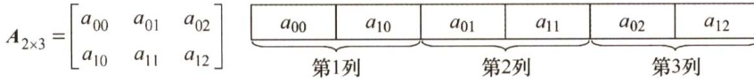
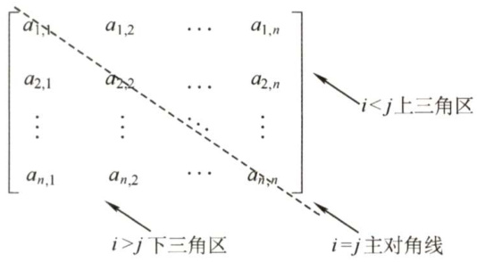
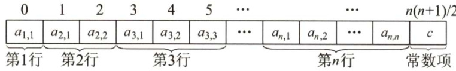
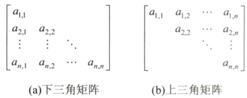
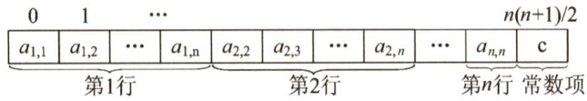
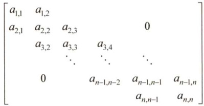
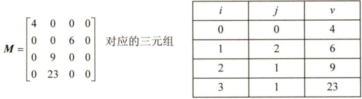

### 3.4 数组和特殊矩阵  

矩阵在计算机图形学、工程计算中占有举足轻重的地位。在数据结构中考虑的是如何用最小的内存空间来存储同样的一组数据。所以，我们不研究矩阵及其运算等，而把精力放在如何将矩阵更有效地存储在内存中，并能方便地提取矩阵中的元素。  

#### 3.4.1 数组的定义  

数组是由 $n$ （ $n\geq1$ ）个相同类型的数据元素构成的有限序列，每个数据元素称为一个数组元素，每个元素在 $n$ 个线性关系中的序号称为该元素的下标，下标的取值范围称为数组的维界。  

数组与线性表的关系：数组是线性表的推广。一维数组可视为一个线性表；二维数组可视为其元素也是定长线性表的线性表，以此类推。数组一旦被定义，其维数和维界就不再改变。因此，  

除结构的初始化和销毁外，数组只会有存取元素和修改元素的操作。  

#### 3.4.2 数组的存储结构  

大多数计算机语言都提供了数组数据类型，逻辑意义上的数组可采用计算机语言中的数组数据类型进行存储，一个数组的所有元素在内存中占用一段连续的存储空间。  

以一维数组 $\mathbb{A}\left[0...\ n-1\right]$ 为例，其存储结构关系式为  

$$
\mathrm{LOC}(a_{i})=\mathrm{LOC}(a_{0})+i\times L(0\leq i<n)
$$  

其中， $L$ 是每个数组元素所占的存储单元。  

对于多维数组，有两种映射方法：按行优先和按列优先。以二维数组为例，按行优先存储的基本思想是：先行后列，先存储行号较小的元素，行号相等先存储列号较小的元素。设二维数组的行下标与列下标的范围分别为 $[0,h_{1}]$ 与 $[0,h_{2}]$ ，则存储结构关系式为  

$$
\mathrm{LOC}(a_{i,j})=\mathrm{LOC}(a_{0,0})+\bigl[i\times(h_{2}+1)+j\bigr]\times L
$$  

例如，对于数组 $A_{2\times3}$ ，它按行优先方式在内存中的存储形式如图3.18所示。  

$$
A_{2\times3}=\left[\begin{array}{c c c}{a_{00}}&{a_{01}}&{a_{02}}\\ {a_{10}}&{a_{11}}&{a_{12}}\end{array}\right]\underbrace{\vphantom{\sum_{i=1}^{n}\sum_{i=1}^{n}a_{i}}{a_{00}}\left[\begin{array}{c c c c c c c}{a_{00}}&{\left[\begin{array}{c c c c c c c}{a_{00}}&{\left[\begin{array}{c c c c c c c}{a_{01}}&{\left[\begin{array}{c c c c c c c}{a_{01}}&{\left[\begin{array}{c c c c c c c}{a_{01}}&{\left[\begin{array}{c c c c c c c c}{a_{01}}&{a_{02}}}&{\left[\begin{array}{c c c c c c c c}{a_{01}}&{a_{10}}&{a_{11}}&{a_{11}}&{a_{2}}&{a_{10}}&{a_{11}}&{a_{0}}&{a_{11}}&{a_{0}}\\ {\sqrt{3^{\ast}}}\end{1\dagger}}\right]}&{\cdots}&{\cdots}&{\cdots}&{\cdots}&{\cdots}&{\cdots}&{\cdots}&{\cdots}\end{array}\right]\right)}\end{array}\right]}}_{\widehat{\mathcal{H}}^{\prime}\right]}}_{\widehat{\mathcal{H}}^{\prime}\mathcal{H}},
$$  

图3.18二维数组按行优先顺序存放  

当以列优先方式存储时，得出存储结构关系式为  

$$
\mathrm{LOC}(a_{i,j})=\mathrm{LOC}(a_{0,0})+\big[j\times(h_{1}+1)+i\big]\times L
$$  

例如，对于数组 $A_{2\times3}$ ，它按列优先方式在内存中的存储形式如图3.19所示。  

  
图3.19二维数组按列优先顺序存放  

#### 3.4.3 特殊矩阵的压缩存储  

压缩存储：指为多个值相同的元素只分配一个存储空间，对零元素不分配存储空间。其目的是节省存储空间。  

特殊矩阵：指具有许多相同矩阵元素或零元素，并且这些相同矩阵元素或零元素的分布有一定规律性的矩阵。常见的特殊矩阵有对称矩阵、上（下）三角矩阵、对角矩阵等。  

特殊矩阵的压缩存储方法：找出特殊矩阵中值相同的矩阵元素的分布规律，把那些呈现规律性分布的、值相同的多个矩阵元素压缩存储到一个存储空间中。  

#### 1．对称矩阵  

若对一个 $n$ 阶方阵A[1...n][1..n]中的任意一个元素 $a_{i,j}$ 都有 $a_{i,j}=a_{j,i}(1\leq i,j\leq n)$ ，则称其为对称矩阵。对于一个 $n$ 阶方阵，其中的元素可以划分为3个部分，即上三角区、主对角线和下三角区，如图3.20所示。  

对于 $n$ 阶对称矩阵，上三角区的所有元素和下三角区的对应元素相同，若仍采用二维数组存放，则会浪费几乎一半的空间，为此将对称矩阵 $\mathbb{A}\left[{\underline{{1\dots}}}\mathrm{n}\right]\left[{\underline{{1\dots}}}\mathrm{n}\right]$ 存放在一维数组 $\mathtt{B}[\mathtt{n}(\mathtt{n}+1)/2]$ 中，即元素 $a_{i,j}$ 存放在 $b_{k}$ 中。只存放下三角部分（含主对角）的元素。  

在数组B中，位于元素 $a_{i,j}$ （ $i{\geq}j$ ）前面的元素个数为  

  
图3.20 $n$  

第1行：1个元素（ $(a_{1,1})$ 。第2行：2个元素（ $(a_{2,1},a_{2,2})$ 。第 $i-1$ 行： $i-1$ 个元素 $(a_{i-1,1},a_{i-1,2},\cdots,a_{i-1,i-1})$ 。第 $i$ 行： $j-1$ 个元素 $(a_{i,1},a_{i,2},\cdots,a_{i,j-1})$ 。因此，元素 $a_{i,j}$ 在数组B中的下标 $k=1+2+\cdots+(i-$ $1)+j-1=i(i-1)/2+j-1$ (数组下标从0开始)。因此，  
·方阵的划分 元素下标之间的对应关系如下：  
$k=\left\{\begin{array}{l l}{\displaystyle\frac{i(i-1)}{2}+j-1,}\\ {\displaystyle\frac{j(j-1)}{2}+i-1,}\end{array}\right.$ $i\geq j$ (下三角区和主对角线元素)$i<j$ （上三角区元素 $\dot{a}_{i j}=a_{j i}$ ）  

当数组下标从1开始时，可以采用同样的推导方法，请读者自行思考。  

#### 2.三角矩阵  

下三角矩阵［见图3.22(a)］中，上三角区的所有元素均为同一常量。其存储思想与对称矩阵类似，不同之处在于存储完下三角区和主对角线上的元素之后，紧接着存储对角线上方的常量一次，故可以将下三角矩阵A[1...n][1...n]压缩存储在 $\mathsf{B}\left[\mathrm{n}\left(\mathrm{n}+1\right)\right./\left.2+1\right]$ 中。  

元素下标之间的对应关系为  

$$
k=\left\{\begin{array}{l l}{\displaystyle\frac{i(i-1)}{2}+j-1,\quad}&{i\geq j\left(\mathbb{Y}\mathop{=}\slash{\mathbb{H}}\mathbb{X}\mathbin{\vrule h\mathop{\pounds}\mathbb{X}\not\int\hat{H}}\frac{\mathscr{L}\hat{\X}}{\mathscr{X}\wedge\tilde{\mathscr{H}}}\right)}\\ {\displaystyle\frac{n(n+1)}{2},\quad}&{i<j\left(\mathrm{L}\mathop{=}\hbar{\underset{\array}{\fint\mathbb{H}}\mathbb{X}}\frac{\partial\to\dots}{\mathscr{L}\wedge\tilde{\mathscr{H}}}\right)}\end{array}\right.
$$  

下三角矩阵在内存中的压缩存储形式如图3.21所示。  

  
图3.21 下三角矩阵的压缩存储  

上三角矩阵［见图3.22(b)］中，下三角区的所有元素均为同一常量。只需存储主对角线、上三角区上的元素和下三角区的常量一次，可将其压缩存储在 $\mathsf{B}\left[\mathrm{n}\left(\mathrm{n}+1\right)\right./\left.2+1\right]$ 中。  

在数组B中，位于元素 $a_{i,j}$ （ $i\le j$ ）前面的元素个数为  

第1行： $n$ 个元素  
第2行： $n-1$ 个元素  
第 $i-1$ 行： $n-i+2$ 个元素  
第 $i$ 行： $j-i$ 个元素  

  
图3.22 三角矩阵  

因此，元素 $a_{i,j}$ 在数组B中的下标 $k=n+(n-1)+\ \cdots\ +(n-i+2)+(j-\ i+1)-1=(i-1)(2n-\ i+1)$ $2)/2+(j-i)$ 。因此，元素下标之间的对应关系如下：  

$$
k=\left\{\begin{array}{l l}{\frac{(i-1)(2n-i+2)}{2}+(j-i),\quad}&{i\leq j\left(\underline{{\mathrm{~E}}}\equiv\#|\underline{{\mathrm{X}}}\vec{\uparrow}|\underline{{\mathrm{1}}}\pm\vec{\mathrm{X}}\mathbf{\mathrm{\}}\mathbf{\hat{\mathcal{H}}}\mathbf{\mathcal{\bar{H}}}\frac{\pm\vec{\mathrm{X}}}{\mathscr{\tilde{\mathcal{H}}}\hat{\mathcal{H}}}\right)}\\ {\frac{n(n+1)}{2},\quad}&{i>j\left(\mathrm{\mathrm{\mathbb{F}}}\equiv\#|\underline{{\mathrm{X}}}\vec{\mathrm{\mathcal{H}}}\vec{\overline{{\mathcal{H}}}}\mathbf{\bar{\hat{\mathcal{H}}}}\right)}\end{array}\right.
$$  

上三角矩阵在内存中的压缩存储形式如图3.23所示。  

  
图3.23上三角矩阵的压缩存储  

以上推导均假设数组的下标从0开始，若题设有具体要求，则应该灵活应对。  

#### 3.三对角矩阵  

对角矩阵也称带状矩阵。对于 $n$ 阶方阵 $A$ 中的任一元素 $a_{i,j}$ ，当 $\vert i^{\mathrm{~-~}}j\vert>1$ 时，有 $a_{i,j}=0$ （ $1\leq$ i $,j\leq n$ )，则称为三对角矩阵，如图3.24所示。在三对角矩阵中，所有非零元素都集中在以主对角线为中心的3条对角线的区域，其他区域的元素都为零。  

  
图3.24三对角矩阵 $A$  

三对角矩阵 $A$ 也可以采用压缩存储，将3条对角线上的元素按行优先方式存放在一维数组B中，且 $a_{1,1}$ 存放于B[0]中，其存储形式如图3.25所示。  

由此可以计算矩阵 $A$ 中3条对角线上的元素 $a_{i,j}(1\leq i,j\leq n$ $|i~-~j|\leq1$ ）在一维数组B中存放的下标为 $k=2i+j-3$ 。  

<html><body><table><tr><td>al.</td><td>a1.2</td><td></td><td>a2</td><td>a23</td><td></td><td>an-1.n</td><td>an.n-1</td><td>ann</td></tr></table></body></html>  

反之，若已知三对角线矩阵中某元素 $a_{i,j}$ 存放于一维数组B的第 $k$ 个位置，则可得 $i=\lfloor(k+1)/$ $3+1\rfloor$ ， $j=k-2i+3$ 。例如，当 $k=0$ 时， $i=\ \lfloor(0+1)/3+1\rfloor=1$ ， $j=0-2\times1+3=1$ ，存放的是 $a_{1,}$ $\mathbf{\Phi}_{1}$ ；当 $k=2$ 时， $i=\ \lfloor(2+1)/3+1\rfloor=2$ ， $j=2-2{\times}2+3=1$ ，存放的是 $a_{2,1}$ ；当 $k=4$ 时， $i=\ \lfloor(4+1)/\$ $3+11=2$ ， $j=4-2{\times}2+3=3$ ，存放的是 $a_{2,3}$ 。  

#### 3.4.4 稀疏矩阵  

矩阵中非零元素的个数 $t$ ，相对矩阵元素的个数 $s$ 来说非常少，即 $s\gg t$ 的矩阵称为稀疏矩阵。例如，一个矩阵的阶为 $100\times100$ ，该矩阵中只有少于100个非零元素。  

若采用常规的方法存储稀疏矩阵，则相当浪费存储空间，因此仅存储非零元素。但通常零元素的分布没有规律，所以仅存储非零元素的值是不够的，还要存储它所在的行和列。因此，将非零元素及其相应的行和列构成一个三元组（行标，列标，值)，如图3.26所示。然后按照某种规律存储这些三元组。稀疏矩阵压缩存储后便失去了随机存取特性。  

  
图3.25三对角矩阵的压缩存储  
图3.26稀疏矩阵及其对应的三元组  

稀疏矩阵的三元组既可以采用数组存储，也可以采用十字链表法存储。  

#### 3.4.5 本节试题精选  

#### 单项选择题  

01．对特殊矩阵采用压缩存储的主要目的是（）。  

A.表达变得简单 B.对矩阵元素的存取变得简单C.去掉矩阵中的多余元素 D．减少不必要的存储空间  

02.对 $n$ 阶对称矩阵压缩存储时，需要表长为（）的顺序表。  

A.n/2 B. $n{\times}n/2$ C. $n(n+1)/2$ D. $n(n-1)/2$  

03.有一个 $\scriptstyle n\times n$ 的对称矩阵A，将其下三角部分按行存放在一维数组B中，而A[0][0]存放于B[O]中，则第 $i+1$ 行的对角元素A[i][i]存放于B中的（）处。  

A. $(i+3)i/2$ B. $(i+1)i/2$   
C. $(2n-i+1)i/2$ D. $(2n-i-1)i/2$  

04.在一个二维数组A中，假设每个数组元素的长度为3个存储单元，行下标 $i$ 为0\~8，列下标 $j$ 为0～9，从首地址SA开始连续存放。在这种情况下，元素A[8][5]的起始地址为（）  

A. $S\mathbb{A}{+}141$ B. $S\mathbb{A}{+}144$ C. $S A+222$ D. $S\mathbb{A}{+}255$  

05．将三对角矩阵A[1...100][1..100]按行优先存入一维数组B[1...298]中，A中元素A[66][65]在数组B中的位置 $k$ 为（）。  

A. 198 B. 195 C. 197 D. 196  

06．若将 $n$ 阶上三角矩阵 $A$ 按列优先级压缩存放在一维数组 $\mathsf{B}[1...\mathsf{n}(\mathsf{n}+1)/2+1]$ 中，则存放到B[k]中的非零元素 $a_{i,j}$ （ $1\leq i,j\leq n$ ）的下标 $i$ ： $j$ 与 $k$ 的对应关系是（）。  

A. $i(i+1)/2+j$ B. $i(i-1)/2+j-1$   
C. $j(j-1)/2+i$ D. $j(j-1)/2+i-1$  

07．若将 $n$ 阶下三角矩阵 $A$ 按列优先顺序压缩存放在一维数组 $\mathsf{B}\left[\mathsf{1...n}\left(\mathsf{n}+\mathsf{1}\right)\big/2+\mathsf{1}\right]$ 中，则存放到B[k]中的非零元素 $a_{i,j}$ （ $1\leq i,j\leq n$ ）的下标 $i,j$ 与 $k$ 的对应关系是（）。  

A. $(j-1)(2n-j+1)/2+i-j$ B. $(j-1)(2n-j+2)/2+i-j+1$   
C. $(j-1)(2n-j+2)/2+i-j$ D. $(j-1)(2n-j+1)/2+i-j-1$  

08.【2016统考真题】有一个100阶的三对角矩阵 $M$ ，其元素 $m_{i,j}$ （ $1\leq i,j\leq100$ ）按行优先依次压缩存入下标从0开始的一维数组N中。元素 $m_{30,30}$ 在 $\mathrm{~N~}$ 中的下标是（）。  

A.86 B.87 C.88 D.89  

09.【2017统考真题】适用于压缩存储稀疏矩阵的两种存储结构是（）。  

A.三元组表和十字链表 B.三元组表和邻接矩阵C.十字链表和二叉链表 D.邻接矩阵和十字链表  

10.【2018统考真题】设有一个 $12\times12$ 的对称矩阵 $M$ ，将其上三角部分的元素 $m_{i,j}\left(\ 1\leq i\leq j\leq$ 12）按行优先存入C语言的一维数组N中，元素 $m_{6,6}$ 在N中的下标是（）。  

A.50 B.51 C.55 D.66  

11.【2020统考真题】将一个 $10\times10$ 对称矩阵 $M$ 的上三角部分的元素 $m_{i,j}$ （ $1\leq i\leq j\leq10$ ）按列优先存入C语言的一维数组 $\mathrm{~\boldmath~N~}$ 中，元素 $m_{7,2}$ 在N中的下标是（）。  

A.15 B.16 C.22 D.23  

12.【2021统考真题】二维数组A按行优先方式存储，每个元素占用1个存储单元。若元素  

A[0][0]的存储地址是100，A[3][3]的存储地址是220，则元素A[5][5]的存储地址是（）  

A.295 B.300 C.301 D. 306  

#### 3.4.6 答案与解析  

#### 单项选择题  

01.D  

特殊矩阵中含有很多相同元素或零元素，故可采用压缩存储，以节省存储空间。  

02.C  

只需要存储其上三角或下三角部分（含对角线)，元素个数为 $n+(n-1)+(n-2)+\cdots+1=$ $n(n+1)/2$ 。  

03.A  

此题要注意3个细节：矩阵的最小下标为0；数组下标也是从0开始的；矩阵按行优先存在数组中。注意到此三点，答案不难得到为A。此外，本类题建议采用特殊值代入法求解，例如，A[1][1]对应的下标应为2，代入后只有A满足条件。  

技巧：对于特殊三角矩阵压缩存储的题，心中应有“平移”搬动的思想，并结合草图，这样会比较形象，在计算时再注意矩阵和数组的起始下标，就不容易出错。  

04.D  

二维数组计算地址（按行优先顺序）的公式为  

$$
\mathrm{LOC}(i,j)=\mathrm{LOC}(0,0)+(i\times m+j)\times L
$$  

其中， $\mathrm{LOC}(0,0)=\mathrm{SA}$ ，是数组存放的首地址； $L=3$ 是每个数组元素的长度； $m=9-0+1=10$   
是数组的列数。因此有 $\operatorname{LOC}(8,5)=\operatorname{SA}+(8\times10+5)\times3=\operatorname{SA}+255$ ，故选 $\mathrm{~D~}$ 。  

05.B  

对于三对角矩阵，将 $\mathbb{A}\left[{\underline{{1}}}...\mathrm{n}\right]\left[{\underline{{1}}}...\mathrm{n}\right]$ 压缩至B[1...3n-2]时， $a_{i,j}$ 与 $b_{k}$ 的对应关系为 $k=2i+j-2$ 0则A中的元素A[66][65]在数组B中的位置 $k$ 为 $2{\times}66+65-2=195$ 9  

06.C  

按列优先存储，故元素 $a_{i,j}$ 前面有 $j-1$ 列，共有 $1+2+3+\cdots+j-1=j(j-1)/2$ 个元素，元素$a_{i,j}$ 在第 $j$ 列上是第 $i$ 个元素，数组B的下标是从1开始，因此 $k=j(j-1)/2+i$ 。  

07.B  

按列优先存储，故元素 $a_{i,j}$ 之前有 $j-1$ 列，共有 $n+(n-1)\cdots+(n-j+2)=(j-1)(2n-j+2)/2$ 个 元素，元素 $a_{i,j}$ 是第 $j$ 列上第 $i-j+1$ 个元素，数组B下标从1开始， $k=(j-1)(2n-j+2)/2+i-j+1$ 。  

08.B  

三对角矩阵如下所示。  

采用压缩存储，将3条对角线上的元素按行优先方式存放在一维数组B中，且 $a_{1,1}$ 存放于B[0]中，其存储形式如下所示：  

<html><body><table><tr><td>a.1</td><td>a1.2</td><td>a2.1</td><td>2</td><td>a23</td><td>.</td><td>an-1,n</td><td>an,n-1</td><td>ann</td></tr><tr><td></td><td></td><td></td><td></td><td></td><td></td><td></td><td></td><td></td></tr></table></body></html>  

可以计算矩阵A中3条对角线上的元素 $a_{i,j}\ (1\leq i,j\leq n,|i-j|\leq1)$ 在一维数组B中存放的下标为 $k=2i+j-3$ ，公式很难记忆，我们通常采用解法二。  

解法一：针对该题，仅需将数字逐一代入公式： $k=2{\times}30+30-3=87$ ，结果为87。  

解法二：观察上图的三对角矩阵不难发现，第一行有两个元素，剩下的在元素 $m_{30,30}$ 所在行之前的28行（注意下标 $1\leq i,j\leq100$ ）中，每行都有3个元素，而 $m_{30,30}$ 之前仅有一个元素 $m_{30,29}$ 不难发现元素 $m_{30,30}$ 在数组N中的下标是 $2+28{\times}3+2-1=87$ 。  

注意：矩阵和数组的下标从0或1开始（如矩阵可能从 $a_{0,0}$ 或 $a_{1,1}$ 开始，数组可能从B[O]或B[1]开始），这时就需要适时调整计算方法（方法无非是多计算1或少计算1的问题）。  

09.A  

三元组表的结点存储了行row、列col、值value三种信息，是主要用来存储稀疏矩阵的一种数据结构。十字链表将行单链表和列单链表结合起来存储稀疏矩阵。邻接矩阵空间复杂度达$O(n^{2})$ ，不适合于存储稀疏矩阵。二叉链表又名左孩子右兄弟表示法，可用于表示树或森林。A正确。  

10.A  

在C语言中，数组N的下标从0开始。第一个元素 $m_{1,1}$ 对应存入 $n_{0}$ ，矩阵 $\pmb{M}$ 的第一行有12个元素，第二行有11个，第三行有10个，第四行有9个，第五行有8个，所以 $m_{6,6}$ 是第 $12+11+$ $10+9+8+1=51$ 个元素，下标应为50。  

11.C  

解析请扫右侧二维码查阅。  

12.B  

二维数组A 按行优先存储，每个元素占用1个存储单元，由A[0][0]和A[3][3]的存储地址可知A[3][3]是二维数组A中的第121个元素，假设二维数组A的每行有 $n$ 个元素，则 $n{\times}3+4=121$ ，求得 $n=39$ ，故元素A[5][5]的存储地址为 $100+39\times5+6-1=300$ ，故选B。  

