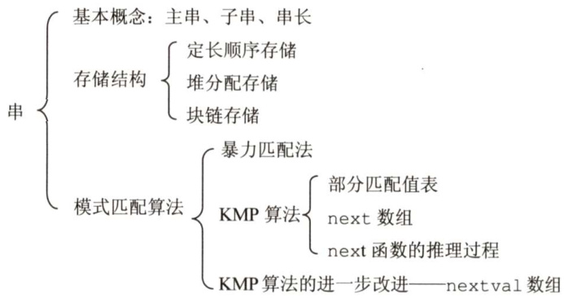

# 第4章  

## 串  

### 【考纲内容】  

字符串模式匹配  

### 【知识框架】  

  

### 【复习提示】  

本章是统考大纲第6章内容，采纳读者建议单独作为一章，大纲只要求掌握字符串模式匹配，重点掌握KMP 匹配算法的原理及 next 数组的推理过程，手工求next 数组可以先计算出部分匹配值表然后变形，或根据公式来求解。了解nextval数组的求解方法。  