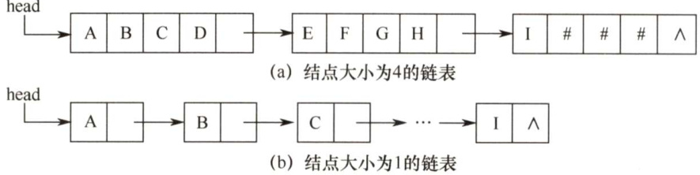

### 4.1 串的定义和实现  

字符串简称串，计算机上非数值处理的对象基本都是字符串数据。我们常见的信息检索系统（如搜索引擎)、文本编辑程序（如Word)、问答系统、自然语言翻译系统等，都是以字符串数据作为处理对象的。本章详细介绍字符串的存储结构及相应的操作。  

#### 4.1.1 串的定义  

串（string）是由零个或多个字符组成的有限序列。一般记为  

$$
S={'}a_{1}a_{2}\cdots a_{n}{'}\quad(n\geq0)
$$  

其中，S是串名，单引号括起来的字符序列是串的值； $a_{i}$ 可以是字母、数字或其他字符；串中字符的个数 $n$ 称为串的长度。 $n=0$ 时的串称为空串（用 $x$ 表示）。  

串中任意多个连续的字符组成的子序列称为该串的子串，包含子串的串称为主串。某个字符在串中的序号称为该字符在串中的位置。子串在主串中的位置以子串的第一个字符在主串中的位置来表示。当两个串的长度相等且每个对应位置的字符都相等时，称这两个串是相等的。  

例如，有串 $A=$ China Beijing'， $B=\ensuremath{\mathrm{^{\prime}B e i j i n g^{\prime}}}$ ， $C='\mathrm{{China}"}$ ，则它们的长度分别为13,7和5。 $B$ 和 $c$ 是 $A$ 的子串， $B$ 在 $A$ 中的位置是7， $c$ 在 $A$ 中的位置是1。  

需要注意的是，由一个或多个空格（空格是特殊字符）组成的串称为空格串（注意，空格串不是空串)，其长度为串中空格字符的个数。  

串的逻辑结构和线性表极为相似，区别仅在于串的数据对象限定为字符集。在基本操作上，串和线性表有很大差别。线性表的基本操作主要以单个元素作为操作对象，如查找、插入或删除某个元素等；而串的基本操作通常以子串作为操作对象，如查找、插入或删除一个子串等。  

#### 4.1.2 串的存储结构  

#### 1．定长顺序存储表示  

类似于线性表的顺序存储结构，用一组地址连续的存储单元存储串值的字符序列。在串的定长顺序存储结构中，为每个串变量分配一个固定长度的存储区，即定长数组。  

#define MAXLEN 255 //预定义最大串长为255  
typedef struct{char ch[MAXLEN]； //每个分量存储一个字符int length; //串的实际长度  
}SString;  

串的实际长度只能小于等于MAXLEN，超过预定义长度的串值会被舍去，称为截断。串长有两种表示方法：一是如上述定义描述的那样，用一个额外的变量len来存放串的长度；二是在串值后面加一个不计入串长的结束标记字符“\0”，此时的串长为隐含值。  

在一些串的操作（如插入、联接等）中，若串值序列的长度超过上界MAXLEN，约定用“截断”法处理，要克服这种端，只能不限定串长的最大长度，即采用动态分配的方式。  

#### 2.堆分配存储表示  

堆分配存储表示仍然以一组地址连续的存储单元存放串值的字符序列，但它们的存储空间是在程序执行过程中动态分配得到的。  

typedef struct{char \*ch; //按串长分配存储区，ch指向串的基地址int length; //串的长度  
}HString;  

在C语言中，存在一个称之为“堆”的自由存储区，并用malloc（)和free（)函数来完成动态存储管理。利用malloc（)为每个新产生的串分配一块实际串长所需的存储空间，若分配成功，则返回一个指向起始地址的指针，作为串的基地址，这个串由ch 指针来指示；若分配失败，则返回NULL。已分配的空间可用free（)释放掉。  

上述两种存储表示通常为高级程序设计语言所采用。块链存储表示仅做简单介绍。  

#### 3.块链存储表示  

类似于线性表的链式存储结构，也可采用链表方式存储串值。由于串的特殊性（每个元素只有一个字符)，在具体实现时，每个结点既可以存放一个字符，也可以存放多个字符。每个结点称为块，整个链表称为块链结构。图4.1(a)是结点大小为4（即每个结点存放4个字符）的链表，  

最后一个结点占不满时通常用“#”补上；图4.1(b)是结点大小为1的链表。  

  
图4.1串值的链式存储方式  

#### 4.1.3 串的基本操作  

·StrAssign（&T,chars)：赋值操作。把串T赋值为chars。  
·StrCopy(&T,S)：复制操作。由串 S复制得到串T。  
·StrEmpty(S)：判空操作。若S 为空串，则返回TRUE，否则返回FALSE。  
StrCompare(S,T)：比较操作。若 $S{>}\mathrm{T}$ ，则返回值 $>0$ ；若 $S{=}\mathrm{T}$ ，则返回值 $\scriptstyle\left.=0\right.$ ；若 $S{<}\mathbb{T}$ 则返回值 $<0$ 。  
·StrLength(S)：求串长。返回串S的元素个数。  
·SubString（&Sub,S,pos,len)：求子串。用Sub返回串S的第pos个字符起长度为len 的子串。  
·Concat（&T,S1,S2)：串联接。用T返回由S1和S2联接而成的新串。  
·Index(S,T)：定位操作。若主串 S 中存在与串T值相同的子串，则返回它在主串 S 中第一次出现的位置；否则函数值为0。  
·ClearString(&S)：清空操作。将s清为空串。  
·DestroyString(&S)：销毁串。将串s销毁。  

不同的高级语言对串的基本操作集可以有不同的定义方法。在上述定义的操作中，串赋值StrAssign、串比较 StrCompare、求串长 StrLength、串联接Concat 及求子串 SubString五种操作构成串类型的最小操作子集，即这些操作不可能利用其他串操作来实现；反之，其他串操作（除串清除ClearString 和串销毁 DestroyString 外）均可在该最小操作子集上实现。