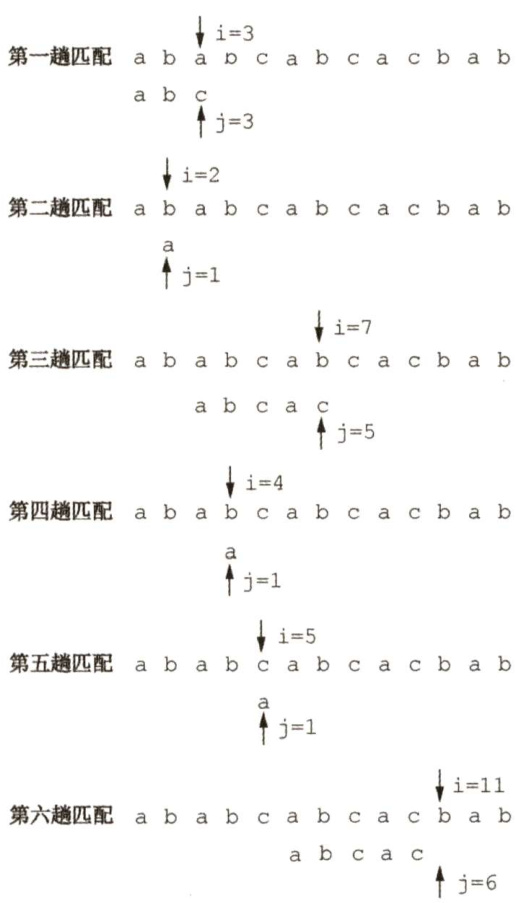
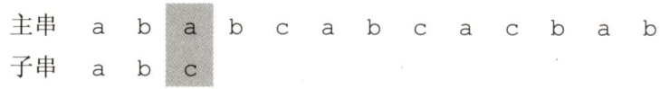
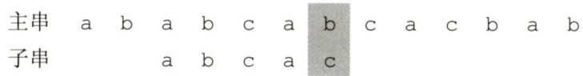
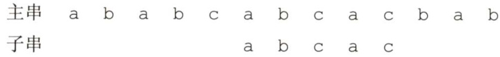
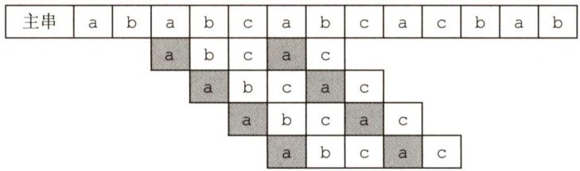
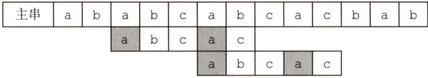
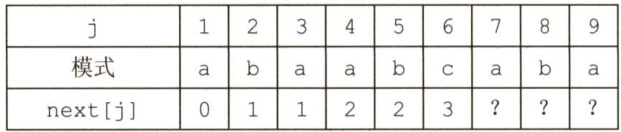
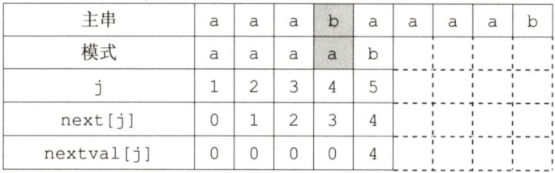

### 4.2 串的模式匹配  

#### 4.2.1 简单的模式匹配算法  

子串的定位操作通常称为串的模式匹配，它求的是子串（常称模式串）在主串中的位置。这里采用定长顺序存储结构，给出一种不依赖于其他串操作的暴力匹配算法。  

int Index(sstring S,sstring T）{ int $\dot{2}=1$ $\dot{\mathsf{J}}=1$ . while( $\scriptstyle{\dot{1}}<={\mathsf{S}}$ .length && $\scriptstyle{\dot{\mathcal{I}}}<=\mathbb{T}$ .length)( if(s.ch[i] $\scriptstyle=={\mathrm{T}}$ .ch[j]）{ $++\mathrm{i}$ . $++j$ . //继续比较后继字符 ) else{ $i=i-j+2$ ; $j=1$ . //指针后退重新开始匹配  

在上述算法中，分别用计数指针i和j指示主串S和模式串T中当前正待比较的字符位置。算法思想为：从主串S的第一个字符起，与模式T的第一个字符比较，若相等，则继续逐个比较后续字符；否则从主串的下一个字符起，重新和模式的字符比较；以此类推，直至模式T中的每个字符依次和主串S 中的一个连续的字符序列相等，则称匹配成功，函数值为与模式T中第一个字符相等的字符在主串S中的序号，否则称匹配不成功，函数值为零。图4.2展示了模式 $\mathrm{T}\mathbf{=}^{\prime}$ abcac'和主串s的匹配过程，每次匹配失败后，都把模式T后移一位。  

简单模式匹配算法的最坏时间复杂度为 $O(n m)$ ，其中$n$ 和 $m$ 分别为主串和模式串的长度。例如，当模式串为'0000001，而主串为'0000000000000000000000000000000000000000000001时，由于模式中前6个字符均为“0”，主串中前45个字符均为“0”，每趟匹配都是比较到模式的最后一个字符时才发现不等，指针i需回溯40次，总比较次数为 $40\times7=280$ 次。  

#### 4.2.2 串的模式匹配算法 KMP算法  

图4.2的匹配过程，在第三趟匹配中， $\mathrm{i}=7$ 、 $\dot{\mathsf{J}}=5$ 的字符比较不等，于是又从 $\dot{1}{=}4$ 、 $\scriptstyle{\dot{\mathsf{J}}}=1$ 重新开始比较。然而，仔细观察会发现， $\mathrm{i}{=}4$ 和 $\scriptstyle{\dot{\mathsf{J}}}={\mathsf{1}}$ ， $\mathrm{i}=5$ 和 $\scriptstyle{\dot{\mathcal{I}}}=1$ 及 $\dot{1}=6$ 和 $\scriptstyle{\dot{\mathsf{J}}}=1$ 这三次比较都是不必进行的。从第三趟部分匹配的结果可知，主串中第4、5和6个字符是'b'、'c'和'a’（即模式中第2、3和4个字符)，因为模式中第一个字符是'a'，因此它无须再和这3个字符进行比较，而仅需将模式向右滑动3个字符的位置，继续进行 $\mathrm{i}=7$ 、 $\scriptstyle{\dot{\mathsf{J}}}=2$ 时的比较即可。  

  
图4.2简单模式匹配算法举例  

在暴力匹配中，每趟匹配失败都是模式后移一位再从头开始比较。而某趟已匹配相等的字符序列是模式的某个前缀，这种频繁的重复比较相当于模式串在不断地进行自我比较，这就是其低效率的根源。因此，可以从分析模式本身的结构着手，如果已匹配相等的前缀序列中有某个后缀正好是模式的前缀，那么就可以将模式向后滑动到与这些相等字符对齐的位置，主串i指针无须回溯，并从该位置开始继续比较。而模式向后滑动位数的计算仅与模式本身的结构有关，与主串无关（这里理解起来会比较困难，没关系，带着这个问题继续往后看)。  

#### 1．字符串的前缀、后缀和部分匹配值  

要了解子串的结构，首先要弄清楚几个概念：前缀、后缀和部分匹配值。前缀指除最后一个字符以外，字符串的所有头部子串；后缀指除第一个字符外，字符串的所有尾部子串；部分匹配值则为字符串的前缀和后缀的最长相等前后缀长度。下面以'ababa'为例进行说明：  

·'a'的前缀和后缀都为空集，最长相等前后缀长度为0。  

·'ab'的前缀为{a}，后缀为{b}， $\{a\}\cap\{b\}=\emptyset$ ，最长相等前后缀长度为0。  
·'aba'的前缀为{a,ab}，后缀为 $\{a,b a\}$ ， $\{a,a b\}\cap\{a,b a\}=\{a\}$ ，最长相等前后缀长度为1。  
·'abab'的前缀{a,ab,aba}n后缀 $\{b,a b,b a b\}=\{a b\}$ ，最长相等前后缀长度为2。  
·'ababa'的前缀{a,ab,aba,abab}n后缀{a,ba,aba,baba} $\mathbf{\Sigma}=\mathbf{\Sigma}$ {a,aba}，公共元素有两个，最长相等前后缀长度为3。  

故字符串'ababa‘的部分匹配值为00123。  

这个部分匹配值有什么作用呢？  

回到最初的问题，主串为ababcabc a c bab，子串为abc a c。  

利用上述方法容易写出子串'abcac'的部分匹配值为00010，将部分匹配值写成数组形式，就得到了部分匹配值（PartialMatch,PM）的表。  

<html><body><table><tr><td>编号</td><td>1</td><td>2</td><td>3</td><td>4</td><td>5</td></tr><tr><td>S</td><td>a</td><td>b</td><td>C</td><td>a</td><td>C</td></tr><tr><td>PM</td><td>0</td><td>0</td><td>0</td><td>1</td><td>0</td></tr></table></body></html>  

下面用PM表来进行字符串匹配：  

  

第一趟匹配过程：  

发现 $\mathrm{~\boldmath~{~c~}~}$ 与a不匹配，前面的2个字符'ab'是匹配的，查表可知，最后一个匹配字符b对应的部分匹配值为0，因此按照下面的公式算出子串需要向后移动的位数：  

移动位数 $\mathbf{\Sigma}=\mathbf{\Sigma}$ 已匹配的字符数－对应的部分匹配值因为 $2-0=2$ ，所以将子串向后移动2位，如下进行第二趟匹配：  

  

第二趟匹配过程：  

发现c与b不匹配，前面4个字符'abca'是匹配的，最后一个匹配字符a对应的部分匹配值为1， $4-1=3$ ，将子串向后移动3位，如下进行第三趟匹配：  

  

第三趟匹配过程：  

子串全部比较完成，匹配成功。整个匹配过程中，主串始终没有回退，故KMP 算法可以在$O(n+m)$ 的时间数量级上完成串的模式匹配操作，大大提高了匹配效率。  

某趟发生失配时，如果对应的部分匹配值为0，那么表示已匹配相等序列中没有相等的前后缀，此时移动的位数最大，直接将子串首字符后移到主串i位置进行下一趟比较；如果已匹配相等序列中存在最大相等前后缀（可理解为首尾重合)，那么将子串向右滑动到和该相等前后缀对齐（这部分字符下一趟显然不需要比较)，然后从主串i位置进行下一趟比较。  

#### 2.KMP算法的原理是什么？  

我们刚刚学会了怎样计算字符串的部分匹配值、怎样利用子串的部分匹配值快速地进行字符串匹配操作，但公式“移动位数 $\mathbf{\Sigma}=\mathbf{\Sigma}$ 已匹配的字符数－对应的部分匹配值”的意义是什么呢？  

如图4.3所示，当c与b不匹配时，已匹配'abca的前缀a和后缀a为最长公共元素。已知前缀a与b、c均不同，与后缀a相同，故无须比较，直接将子串移动“已匹配的字符数－对应的部分匹配值”，用子串前缀后面的元素与主串匹配失败的元素开始比较即可，如图4.4所示。  

  
图4.3 失配后移动情况  

  
图4.4直接移动到合适位置  

对算法的改进方法：  

已知：右移位数 $\mathbf{\Sigma}=\mathbf{\Sigma}$ 已匹配的字符数－对应的部分匹配值。  

写成： $\mathtt{M o v e}=(\mathtt{j}-1)-\mathtt{P M}[\mathtt{j}-1]$ o  

使用部分匹配值时，每当匹配失败，就去找它前一个元素的部分匹配值，这样使用起来有些不方便，所以将PM表右移一位，这样哪个元素匹配失败，直接看它自己的部分匹配值即可。  

将上例中字符串'abcac'的PM表右移一位，就得到了next数组：  

<html><body><table><tr><td>编号</td><td>1</td><td>2</td><td>3</td><td>4</td><td>5</td></tr><tr><td>S</td><td>a</td><td>b</td><td>C</td><td>a</td><td>C</td></tr><tr><td>next</td><td>-1</td><td>0</td><td>0</td><td>0</td><td>1</td></tr></table></body></html>  

我们注意到：  

1）第一个元素右移以后空缺的用-1来填充，因为若是第一个元素匹配失败，则需要将子串向右移动一位，而不需要计算子串移动的位数。  
2）最后一个元素在右移的过程中溢出，因为原来的子串中，最后一个元素的部分匹配值是其下一个元素使用的，但显然已没有下一个元素，故可以舍去。这样，上式就改写为  

$$
\mathtt{M o v e}=(\mathtt{j}-1)-\mathtt{n e x t}[\mathtt{j}]
$$  

相当于将子串的比较指针j回退到  

$$
\mathrm{j=j-Move=j-(\Omega(\mathrm{j-1})-n e x t[j]\Omega)=n e x t[j]+1}
$$  

有时为了使公式更加简洁、计算简单，将next数组整体 $+1$ 0因此，上述子串的next数组也可以写成  

<html><body><table><tr><td>编号</td><td>1</td><td>2</td><td>3</td><td>4</td><td>5</td></tr><tr><td>S</td><td>a</td><td>b</td><td>C</td><td>a</td><td>C</td></tr><tr><td>next</td><td>0</td><td>1</td><td>１</td><td>1</td><td>2</td></tr></table></body></html>  

最终得到子串指针变化公式 $\begin{array}{r}{\dot{\mathsf{J}}=}\end{array}$ next［j]。在实际匹配过程中，子串在内存里是不会移动的，而是指针在变化，书中画图举例只是为了让问题描述得更加形象。next[j]的含义是：在子串的第个字符与主串发生失配时，则跳到子串的next[j]位置重新与主串当前位置进行比较。  

如何推理next数组的一般公式？设主串为 $\mathbf{\L}_{S_{\mathrm{1}}S_{\mathrm{2}}\dots S_{\mathrm{n}}}\cdot\mathbf{\Phi}_{$ ，模式串为 $\cdot_{\tt P1}\tt p_{2...}\tt p_{\mathrm{m}}\cdot$ ，当主串中第i个字符与模式串中第 $\mathrm{j}$ 个字符失配时，子串应向右滑动多远，然后与模式中的哪个字符比较？  

假设此时应与模式中第 $\mathbf{k}$ （ $k<j$ ）个字符继续比较，则模式中前 $\mathrm{k}{-}1$ 个字符的子串必须满足下列条件，且不可能存在 $k^{\prime}>k$ 满足下列条件：  

$$
'\mathrm{p}_{1}\mathrm{p}_{2}...\mathrm{p}_{k-1}"="\mathrm{p}_{\mathrm{j}-\mathrm{k}+1}\mathrm{p}_{\mathrm{j}-\mathrm{k}+2}...\mathrm{p}_{\mathrm{j}-1}"
$$  

若存在满足如上条件的子串，则发生失配时，仅需将模式向右滑动至模式中第 $\mathbf{k}$ 个字符和主串第i个字符对齐，此时模式中前 $\mathbf{k}{-}\mathbb{1}$ 个字符的子串必定与主串中第 $\mathrm{~i~}$ 个字符之前长度为 $\mathbf{k}{-}1$ 的子串相等，由此，只需从模式第 $\boldsymbol{\mathrm{\Sigma}}_{\mathrm{k}}$ 个字符与主串第 $\mathrm{~i~}$ 个字符继续比较即可，如图4.5所示。  

<html><body><table><tr><td>主串</td><td>S1</td><td>·.</td><td>...</td><td></td><td></td><td>·.</td><td>Si-k+1</td><td>.</td><td>Si-1</td><td>S</td><td></td><td></td><td></td><td>..</td><td>Sn</td></tr><tr><td>子串</td><td></td><td></td><td>P1</td><td>..</td><td>Pk-1</td><td></td><td>Pj-k+1</td><td>..</td><td>Pj-1</td><td>Pi</td><td></td><td>Pm</td><td></td><td></td><td></td></tr><tr><td>右移</td><td></td><td></td><td></td><td></td><td></td><td></td><td>P1</td><td>..</td><td>Pk-1</td><td>Pk</td><td></td><td></td><td>Pm</td><td></td><td></td></tr></table></body></html>  

当模式串已匹配相等序列中不存在满足上述条件的子串时（可以看成 $\scriptstyle\mathbf{k}=1$ )，显然应该将模式串右移 $\dot{\mathsf{J}}^{-1}$ 位，让主串第i个字符和模式第一个字符进行比较，此时右移位数最大。  

．当模式串第一个字符（ $\scriptstyle{\dot{\mathsf{J}}}=1$ ）与主串第 $\mathrm{~i~}$ 个字符发生失配时，规定 $\mathtt{n e x t}[1]=0^{\textcircled{1}}$ 。将模式串右移一位，从主串的下一个位置（ $\mathrm{i}+1$ ）和模式串的第一个字符继续比较。  

通过上述分析可以得出next函数的公式：  

$$
\mathrm{next\left[\dot{j}\right]=\left\{\begin{array}{l l}{0,}&{\dot{j}=1}\\ {\operatorname*{max}\left\{k\mid1<k<\dot{j}\right.\mathrm{H}^{\star}\mathfrak{p}_{1}\cdots\mathfrak{p}_{k-1}\mathfrak{\Omega}^{\star}={^{\star}\mathfrak{p}}_{\dot{j}\rightarrow k+1}\cdots\mathfrak{p}_{\dot{j}-1}\mathfrak{\Omega}^{\star}\mathrm{\},}\\ {1,}&{\quad\mathrm{ff}_{\mathrm{\ell}}^{\dot{j}\pm\dot{\ell}}\mathrm{H}^{\dot{j}\pm\dot{\ell}}\mathrm{\mathcal{U}}}\end{array}\right.}
$$  

上述公式不难理解，实际做题求next值时，用之前的方法也很好求，但如果想用代码来实现，貌似难度还真不小，我们来尝试推理求解的科学步骤。  

首先由公式可知  

$$
\mathtt{n e x t}\left[1\right]=0
$$  

设next[j] $\mathbf{\mu}=\mathbf{k}$ ，此时 $\mathbf{k}$ 应满足的条件在上文中已描述。  

此时next $[\dot{]}+1]=?$ 可能有两种情况：  

(1)若 $\mathtt{p_{k}=p_{j}}$ ，则表明在模式串中$\bf{{}^{\prime}p_{1...}p_{k-1}p_{k}.\prime=\bf{{"}}p_{j-k+1...}p_{j-1}}\bf{{p}_{j-1}}\bf{{p}_{j}}\psi_{j},$ 并且不可能存在 $\mathbf{k}^{\prime}>\mathbf{k}$ 满足上述条件，此时next $[\dot{\bf~\ j}+1]={\bf k}+1$ ，即  

$$
\mathtt{n e x t}[\mathtt{j}+1]=\mathtt{n e x t}[\mathtt{j}]+1
$$  

(2)若 $\mathsf{p}_{\mathrm{k}}\neq\mathsf{p}_{\mathrm{j}}$ ，则表明在模式串中  

$$
\bf{{'}\mathrm{{p}_{1}...\mathrm{{p}_{k-1}\mathrm{{p}_{k}\prime\ne{'}\mathrm{{p}_{j-k+1}...\mathrm{{p}_{j-1}\mathrm{{p}_{j}\prime}}}}}}}
$$  

此时可以把求next函数值的问题视为一个模式匹配的问题。用前缀p-Pk去跟后缀pj-k+1$\mathsf{p}_{\mathrm{j}}$ 匹配，则当 $\mathtt{p}_{\mathtt{k}}\neq\mathtt{p}_{\mathtt{j}}$ 时应将 $\mathsf{p}_{1}...\mathsf{p}_{\mathsf{k}}$ 向右滑动至以第next[k]个字符与 $\mathsf{p}_{\mathrm{j}}$ 比较，如果 $\mathtt{p}_{\mathtt{n e x t}[\mathtt{k}]}$ 与$\mathsf{p}_{\mathrm{j}}$ 还是不匹配，那么需要寻找长度更短的相等前后缀，下一步继续用 Pnext[next[k]与 $\mathsf{p}_{\mathrm{j}}$ 比较，以此类推，直到找到某个更小的 ${\bf{k}}^{\prime}=$ next[next...[k]]（ $1<k^{\prime}<k<j$ )，满足条件  

$$
\mathbf{{'}}\mathbf{p}_{1}...\mathbf{p}_{\mathrm{k^{\prime}}}\mathbf{{'}}=\mathbf{{'}}\mathbf{p}_{\mathrm{j-k^{\prime}+1}}...\mathbf{p}_{\mathrm{j}}
$$  

则next $[\dot{\bf{\ j}}+1]=\mathbf{k}^{\prime}+1$ 。  

也可能不存在任何 $\mathbf{k}^{\prime}$ 满足上述条件，即不存在长度更短的相等前缀后缀，令next $[\dot{]}+1]=1$ 。  
理解起来有一点费劲？下面举一个简单的例子。  

图4.6 的模式串中已求得6个字符的next值,现求next[7],因为 next $[6]=3$ ,又 $\mathtt{p}_{6}\neq\mathtt{p}_{3}$ ，则需比较 $\mathtt{p}_{6}$ 和 $\mathsf{p}_{1}$ （因next $[3]=1$ )，由于 $\mathsf{p}_{6}\neq\mathsf{p}_{1}$ ,而next $[1]=0$ ，所以next $[7]=1$ ;求next[8],因 $\mathtt{p}_{7}=\mathtt{p}_{1}$ ，则next $[8]=\pi\mathrm{ext}[7]+1=2$ ；求next[9]，因 $\mathtt{p}_{8}=\mathtt{p}_{2}$ ，则next $[9]=3$ 。  

  
图4.6求模式串的next值  

通过上述分析写出求next值的程序如下：  

void get next（String T,int next[]）{ int $\dot{\mathsf{1}}=1$ ， $j=0$ ： next $[1]=0$ ： while( $\dot{2}<T$ .length){ if( $\scriptstyle{\dot{\mathcal{I}}}==0$ |IT.ch[i] $\scriptstyle==\pmb{\mathrm{T}}$ .ch[j]）( $++\dot{2}$ ； $++j$ ， next $[i]=j$ ；//若 $p_{i}=p_{j}$ ，则next[j+1] $\c=$ next[j]+1 F else $\dot{\mathsf{J}}=$ next[j]；//否则令 $\dot{\mathsf{J}}=$ next[j]，循环继续  

计算机执行起来效率很高，但对于我们手工计算来说会很难。因此，当我们需要手工计算时，还是用最初的方法。  

与 next数组的求解相比，KMP的匹配算法相对要简单很多，它在形式上与简单的模式匹配算法很相似。不同之处仅在于当匹配过程产生失配时，指针i不变，指针」退回到next[j]的位置并重新进行比较，并且当指针j为0时，指针i和j同时加1。即若主串的第i个位置和模式串的第一个字符不等，则应从主串的第 $\mathrm{i}+1$ 个位置开始匹配。具体代码如下：  

int Index KMP（String S,String T,int next[]）{ int $\dot{2}=2$ ， $j=1$ ： while( $\scriptstyle{\dot{1}}<=S$ .length&&j $<=\mathtt{T}$ .length){ if( $\scriptstyle{\dot{\mathcal{I}}}==0$ llS.ch[i] $\scriptstyle=={\mathrm{T}}$ .ch[j]）{ $++\dot{2}$ . $++j$ . //继续比较后继字符 ) else j=next[j]; //模式串向右移动 1 if（j>T.length) return i-T.length; //匹配成功 else return0;   
1  

尽管普通模式匹配的时间复杂度是 $O(m n)$ ，KMP算法的时间复杂度是 $O(m+n)$ ，但在一般情况下，普通模式匹配的实际执行时间近似为 $O(m+n)$ ，因此至今仍被采用。KMP算法仅在主串与子串有很多“部分匹配”时才显得比普通算法快得多，其主要优点是主串不回溯。  

#### 4.2.3 KMP算法的进一步优化  

前面定义的 next 数组在某些情况下尚有缺陷，还可以进一步优化。如图4.7所示，模式'aaaab'在和主串'aaabaaaab'进行匹配时：  

  
图4.7KMP算法进一步优化示例  

当 $\mathrm{i}{=}4$ ， $\scriptstyle{\dot{\mathsf{J}}}=4$ 时， $\boldsymbol{s}_{4}$ 跟 $\mathsf{p}_{4}$ （ $b\neq a$ ）失配，如果用之前的next数组还需要进行 $\mathbf{\sigma}_{S_{4}}$ 与p、S4与 p2、s4与p1这3次比较。事实上，因为Pnext[4]=3=P4=a、Pnext[3]=2=P3=a、Pnext[2]=1=P2=a,显然后面3次用一个和 $\mathsf{p}_{4}$ 相同的字符跟 $\mathbf{\sigma}_{S_{4}}$ 比较毫无意义，必然失配。那么问题出在哪里呢？  

问题在于不应该出现 $\mathtt{p_{j}}\mathtt{=p_{n e x t[j]}}$ 。理由是：当 $\mathsf{p}_{\mathrm{j}}\neq\mathsf{s}_{\mathrm{j}}$ 时，下次匹配必然是Pnext[j跟 ${\bf{s}}_{\mathrm{{j}}}$ 比较，如果 $\scriptstyle\mathtt{p_{j}}=\mathtt{p_{n e x t[j]}}$ ，那么相当于拿一个和 ${\tt p}_{\mathrm{j}}$ 相等的字符跟 $\boldsymbol{s}_{\mathrm{j}}$ 比较，这必然导致继续失配，这样的比较毫无意义。那么如果出现了 $\mathtt{p}_{\mathrm{j}}=\mathtt{p}_{\mathtt{n e x t}[\mathtt{j}]}$ 应该如何处理呢？  

如果出现了，则需要再次递归，将 next［j]修正为 next[next[j]]，直至两者不相等为止，更新后的数组命名为nextval。计算next数组修正值的算法如下，此时匹配算法不变。  

void get_nextval（string T,int nextval[]）{ int $\scriptstyle{\dot{\mathtt{i}}}=1$ ， $j=0$ . nextval $[1]=0$ while( $\scriptstyle{\dot{\mathtt{1}}}<{\mathtt{T}}$ .length){ if( $j==0$ ||T.ch[i] $\scriptstyle=={\mathrm{T}}$ .ch[j]）{ $++\dot{2}$ ； $++j$ . if(T.ch[i] $\scriptstyle{\mathfrak{L}}={\mathfrak{T}}$ .ch[j])nextval[i] $=\dot{]}$ . else nextval[i] $\c=$ nextval[j]; } else $\dot{\mathsf{J}}=$ nextval[j];  

KMP 算法对于初学者来说可能不太容易理解，读者可以尝试多读几遍本章的内容，并参考一些其他教材的相关内容来巩固这个知识点。  

#### 4.2.4 本节试题精选  

#### 一、单项选择题  

01．设有两个串 $S_{1}$ 和 $S_{2}$ ，求 $S_{2}$ 在 $S_{1}$ 中首次出现的位置的运算称为（）。  

A．求子串 B．判断是否相等 C．模式匹配 D.连接  

02.KMP算法的特点是在模式匹配时指示主串的指针（）。  

A．不会变大 B．不会变小 C．都有可能 D．无法判断  

03.设主串的长度为 $n$ ，子串的长度为 $m$ ，则简单的模式匹配算法的时间复杂度为（），KMP算法的时间复杂度为（）。  

A. O(m) B. O(n) C. O(mn) D. O(m+n)  

04.已知串 $S=$ aaab'，其next数组值为（）。  

A.0123 B.0112 C. 0231 D. 1211  

05.串'ababaaababaa'的next数组值为（）。  

A.01234567899 B.012121111212   
C.011234223456 D.0123012322345  

06.串'ababaaababaa'的next数组为（）。  

A. $-1,0,1,2,3,4,5,6,7,8,8,8$ B. $\cdot1,0,1,0,1,0,0,0,0,1,0,1$ C. $-1,0,0,1,2,3,1,1,2,3,4,5$ D.-1,0,1,2,-1,0,1,2,1,1,2,3  

07.串'ababaaababaa'的nextval数组为（）。  

A. $0,1,0,1,1,2,0,1,0,1,0,2$ B. $0,1,0,1,1,4,1,1,0,1,0,2$ C. $0,1,0,1,0,4,2,1,0,1,0,4$ D.0,1,1,1,0,2,1,1,0,1,0,4  

08.【2015统考真题】已知字符串 $s$ 为'abaabaabacacaabaabcc'，模式串 $t$ 为'abaabc'。采用KMP算法进行匹配，第一次出现“失配” $(s[\mathrm{i}]\neq\mathrm{t}[\mathrm{j}])$ ）时， $\dot{1}=\dot{7}=5$ ，则下次开始匹配时，i和j的值分别是（）。  

A. $\mathrm{i}=1$ $\scriptstyle{\dot{\mathsf{J}}}=0$ B. $\mathrm{i}=5$ $\scriptstyle{\dot{\mathsf{J}}}=0$ C. $\mathrm{i}=5$ ！ $\scriptstyle{\dot{\mathcal{I}}}=2$ D. $\dot{1}=6,\dot{]}=2$  

09.【2019统考真题】设主串 $\mathrm{T}\mathrm{=}^{\prime}$ abaabaabcabaabc'，模式串 $S=$ 'abaabc'，采用KMP算法进行模式匹配，到匹配成功时为止，在匹配过程中进行的单个字符间的比较次数是（）。  

A.9 B.10 C.12 D.15  

#### 二、综合应用题  

01.在字符串模式匹配的KMP算法中，求模式的next数组值的定义如下：  

$\mathrm{next\left[\dot{\j}\right]=\left\{\begin{array}{l l}{0,}&{\dot{\ j}=1}\\ {\mathrm{max\left\{\k|\boldsymbol{1}<k<\dot{j}\boldsymbol{\mathrm{H}}^{\star}\mathbf{p}_{1}\cdots\mathbf{p}_{k-1}\mathbf{\mathrm{\Omega}}^{\prime}=\mathbf{\mathrm{}^{\dagger}}\mathbf{p}_{j-k+1}\cdots\mathbf{p}_{j-1}\mathbf{\mathrm{\Omega}}^{\prime}\right\}\mathrm{H}^{\star}\mathbf{p}_{k-1}\mathrm{\Omega}}\\ {1,}&{\quad\ddagger\dot{\sf H}\dot{\boxplus}\dot{\boxplus}\dot{\cal{\mathrm{H}}}}\end{array}\right.}$ ，此集合不空时  

1）当 $\scriptstyle{\dot{\mathcal{I}}}=1$ 时，为什么要取 $\boldsymbol{\mathrm{next}}\left[1\right]\boldsymbol{=}0?$   
2）为什么要取 $\boldsymbol{\mathrm{max}}\{\boldsymbol{\mathrm{k}}\}$ ， $\mathbf{k}$ 最大是多少？  
3）其他情况是什么情况，为什么取 $\boldsymbol{\mathrm{next}}\left[\mathrm{j}\right]=1?$  

02．设有字符串 $S=$ 'aabaabaabaac'， $P="$ aabaac'  

1）求出 $P$ 的next数组。  
2）若 $s$ 作主串， $P$ 作模式串，试给出KMP算法的匹配过程。  

#### 4.2.5 答案与解析  

#### 一、单项选择题  

01.C求子串操作是从串 $s$ 中截取第 $i$ 个字符起长度为 $l$ 的子串，A错。BD明显错。选C。  

02.B在KMP算法的比较过程中，主串不会回溯，所以主串的指针不会变小。选B。  

03.C、D  

尽管实际应用中，一般情况下简单的模式匹配算法的时间复杂度近似为 $O(m+n)$ ，但它的理论时间复杂度还是 $O(m n)$ ，选C。KMP算法的时间复杂度为 $O(m+n)$ ，选 $\mathrm{~D~}$ 。  

04.A  

1）设next $[1]=0$ ，next $[2]=1$ 。  

<html><body><table><tr><td>编号</td><td>1</td><td>2</td><td>3</td><td>4</td></tr><tr><td>S</td><td>a</td><td>a</td><td>a</td><td>b</td></tr><tr><td>next</td><td>0</td><td>1</td><td></td><td></td></tr></table></body></html>  

2) $\scriptstyle{\dot{\mathcal{I}}}=3$ 时 $\mathtt{k}\mathtt{=n e x t}[\mathtt{j}-1]\mathtt{=n e x t}[2]=1$ ，观察S[j-1]（s[2]）与S[k]（S[1])是否相等，$S\left[2\right]=\mathtt{a}$ ， $S\left[1\right]=\mathsf{a}$ ， $S\left[2\right]=S\left[1\right]$ ，所以next[ $\operatorname{j}]=\mathbf{k}+1=2$ 。  

↓j-1=2 a a a b a a a b $\uparrow\mathrm{k}{=}1$  

3) $\scriptstyle{\dot{\mathsf{J}}}=4$ 时 $\mathtt{k}\mathtt{=n e x t}[\mathtt{j}-1]\mathtt{=n e x t}[3]\mathtt{=}2$ ，观察S[j-1]（s[3]）与S[k]（S[2])是否相等，$S\left[3\right]=\mathbf{\bar{a}}$ ， $S\left[2\right]=\mathtt{a}$ ， $S\left[3\right]{=}S\left[2\right]$ ，所以next[j $]=k+1=3$ 。  

→ $j-1=3$ a a a b a a a b $1k=2$  

最后的结果如下，选 $\mathbf{A}$ 。  

<html><body><table><tr><td>编号</td><td>1</td><td>2</td><td>3</td><td>4</td></tr><tr><td>S</td><td>a</td><td>a</td><td>a</td><td>b</td></tr><tr><td>next</td><td>0</td><td>1</td><td>2</td><td>3</td></tr></table></body></html>  

本题采用next的推理原理求解，如果字符串较长，求解过程会比较烦琐。  

05.C  

这道题采用手工求next数组的方法。先求串 $S="$ ababaaababaa·的部分匹配值：  

·'a'的前后缀都为空，最长相等前后缀长度为0。   
·'ab'的前缀{a}n后缀 $\{b\}=0$ ，最长相等前后缀长度为0。   
'aba的前缀{a，ab}n后缀 $\{a,b a\}=\{a\}$ ，最长相等前后缀长度为1。   
'abab'的前缀{a,ab,aba}n后缀{b,ab,bab} $\mathbf{\Psi}=\mathbf{\Psi}$ {ab}，最长相等前后缀长度为2。 .....  

依次求出的部分匹配值如下表第三行所示，将其整体右移一位，低位用-1填充，如下表第四行所示。  

<html><body><table><tr><td>编号</td><td>1</td><td>2</td><td>3</td><td>4</td><td>5</td><td>6</td><td>7</td><td>8</td><td>9</td><td>10</td><td>11</td><td>12</td></tr><tr><td>S</td><td>a</td><td>b</td><td>a</td><td>b</td><td>a</td><td>a</td><td>a</td><td>b</td><td>a</td><td>b</td><td>a</td><td>a</td></tr><tr><td>PM</td><td>0</td><td>0</td><td>1</td><td>2</td><td>3</td><td>1</td><td>1</td><td>2</td><td>3</td><td>4</td><td>5</td><td>6</td></tr><tr><td>next</td><td>-1</td><td>0</td><td>0</td><td>1</td><td>2</td><td>3</td><td>1</td><td>1</td><td>2</td><td>3</td><td>4</td><td>5</td></tr></table></body></html>  

选项中next[1]等于0，故将next数组整体加1，答案选C。  

06.C  

解析见上题，选C。注意，next数组是否整体加1都正确，需根据题意具体分析。  

注意：在实际KMP算法中，为了使公式更简洁、计算简单，如果串的位序是从1开始的，则 next数组才需要整体加1；如果串的位序是从0开始的，则next数组不需要整体加1。  

07.Cnextval从0开始，可知串的位序从1开始。第一步，令nextval[1] $\O=$ next[1]=0。  

<html><body><table><tr><td>编号</td><td>1</td><td>2</td><td>3</td><td>4</td><td>5</td><td>6</td><td>7</td><td>8</td><td>9</td><td>10</td><td>11</td><td>12</td></tr><tr><td>S</td><td>a</td><td>b</td><td>a</td><td>b</td><td>a</td><td>a</td><td>a</td><td>b</td><td>a</td><td>b</td><td>a</td><td>a</td></tr><tr><td>next</td><td>0</td><td>1</td><td>1</td><td>2</td><td>3</td><td>4</td><td>2</td><td>2</td><td>3</td><td>4</td><td>5</td><td>6</td></tr><tr><td>nextval</td><td>0</td><td>1</td><td>01</td><td>1</td><td>0</td><td>4</td><td>2</td><td>1</td><td></td><td>1</td><td>01</td><td>4</td></tr></table></body></html>  

从 $\scriptstyle{\dot{\mathsf{J}}}=2$ 开始，依次判断 ${\tt p}_{\mathrm{j}}$ 是否等于 $\mathtt{p}_{\mathtt{n e x t}[\mathtt{j}]};$ ？若是则将next［j]修正为next[next[j]]，直至两者不相等为止。由下述推理可知，答案选C。  

第2步： $\mathtt{p}_{2}\mathrm{=b}$ $\mathtt{p}_{\mathtt{n e x t}[2]}=\mathtt{a}$ ， $\mathtt{p}_{2}\mathtt{\neq p}_{\mathtt{n e x t}[2]}$ ，nextval[2] $\c=$ next $[2]=1$ 第3步： $\mathtt{p}_{3}=\mathtt{a}$ ， $\mathtt{p}_{\mathtt{n e x t}[3]}=\mathtt{a}$ ， $\mathtt{p}_{3}=\mathtt{p}_{\mathtt{n e x t}[3]}$ ，nextval[3] $\O=$ nextval[next $\left[3\right]]=$ nextval $\left[1\right]=0$ 第4步： $p_{4}=b$ $\mathtt{p}_{\mathtt{n e x t}[4]}=\mathtt{b}$ ， $\mathtt{p}_{4}=\mathtt{p}_{\mathtt{n e x t}[4]}$ ，nextval[4] $\O=$ nextval[next[4]] $\c=$ nextval[2] $\scriptstyle=1$ ，第5步： $\mathtt{p}_{5}\mathtt{=a}$ 、Pnext[5] $=\mathtt{a}$ ， $\mathtt{p}_{5}=\mathtt{p}_{\mathtt{n e x t}[5]}$ ，nextval[5] $\c=$ nextval[next[5]] $\O=$ nextval[3] $\scriptstyle=0$ ，第6步： $\mathtt{p}_{6}mathtt{=a}$ 、Pnext[6] $=5$ ，P6+Pnext[6]，nextval[6] $\c=$ next[6] $^{=4}$ ；第7步： $\mathtt{p}_{7}=\mathtt{a}$ 、Pnext[7]=b，Ppnext[7]nextval[7] $\O=$ next[7]=2;第8步： $p_{8}=b$ 、Pnext [8] $=5$ ， Pa=Pnext[8], nextval[8] $\c=$ nextval[next[8]] $\c=$ nextval[2] $^{=1}$ ，第9步： $\scriptstyle\mathtt{p}_{9}=\mathtt{a}$ 、Pnext[9] $=\mathtt{a}$ ， $\mathrm{p}_{9}\mathrm{=}$ Pnext[9]nextval[9] $\c=$ nextval[next[9]] $\c=$ nextval $[3]=0$ ，第10步： $\mathtt{p}_{10}=\mathtt{b}$ 、Pnext[10] $=5$ ，P10=Pnext[10]，nextval[10] $\c=$ nextval[next[10]] $\c=$ nextval[4] $^{=1}$ 第11步： $\mathtt{p}_{11}=\mathtt{a}$ 、Pnext[11] $=a$ ， $\mathtt{p}_{11}=\mathtt{k}$ Pnext[11] , nextval[11] $\c=$ nextval[next[11]] $\c=$ nextval $[5]=0$ ，第12步： $\mathtt{p}_{12}=\mathtt{a}$ 、Pnext [12] $=\mathtt{a}$ $\mathtt{p}_{10}=\mathtt{p}_{\mathtt{n e x t}[12]}$ ，nextval[12] $\O=$ nextval[next[12]] $\O=$ nextval[6] $\scriptstyle=4$ 在第5步的推理中， $p_{5}=p_{\mathrm{next}(5]}=a$ ，按前面的讲解部分，应该继续让 $\mathrm{~p~}_{3}$ 和Pnext[3]比较（恰好 $\scriptstyle\mathtt{p}_{3}=\mathtt{p}_{\mathrm{next}[3]=1}.$ )，注意到此时nextval[3]的值已存在，故直接将nextval[5]赋值为nextval[3]。  

对于一般情况，nextval数组是从前往后逐步求解的，发生 $p_{j}=p$ next[j]时，因为 nextval[next[j]]早已求得，所以直接将nextval[j]赋值为nextval[next[j]]。  

08.C  

由题中“失配 $\mathbf{s}[\mathrm{i}]\neq\mathrm{t}[\mathrm{j}]$ 时， $\dot{1}=\dot{7}=5$ ”，可知题中的主串和模式串的位序都是从0开始的（要注意灵活应变)。按照next数组生成算法，对于t有  

<html><body><table><tr><td>编号</td><td>0</td><td>1</td><td>2</td><td>3</td><td>4</td><td>5</td></tr><tr><td>t</td><td>a</td><td>b</td><td>a</td><td>a</td><td>b</td><td>C</td></tr><tr><td>next</td><td>-1</td><td>0</td><td>0</td><td>1</td><td>1</td><td>2</td></tr></table></body></html>  

发生失配时，主串指针i不变，子串指针j回退到next［j]位置重新比较，当s［i]［j]时， $\dot{1}=\dot{7}=5$ ，由next表得知next[ $\scriptstyle\mathbf{\vec{J}}=\mathbf{\vec{n}}\epsilon$ ext $[5]=2$ (位序从0开始)。因此， $\mathrm{i}=5$ ， $\scriptstyle{\dot{\mathsf{J}}}=2$ 0  

09.B  

假设位序从0开始的，按照next数组生成算法，对于S有  

<html><body><table><tr><td>编号</td><td>0</td><td>1</td><td>2</td><td>3</td><td>4</td><td>5</td></tr><tr><td>S</td><td>a</td><td>b</td><td>a</td><td>a</td><td>b</td><td>C</td></tr><tr><td>next</td><td>-1</td><td>0</td><td>0</td><td>1</td><td>1</td><td>2</td></tr></table></body></html>  

第一趟连续比较6次，在模式串的5号位和主串的5号位匹配失败，模式串的下一个比较位置为next［5]，即下一次比较从模式串的2号位和主串的5号位开始，然后直到模式串5号位和主串8号位匹配，第二趟比较4次，模式串匹配成功。单个字符的比较次数为10次，因此选B。  

#### 二、综合应用题  

01．【解答】  

1）当模式串中的第一个字符与主串的当前字符比较不相等时， $\mathtt{n e x t}\left[1\right]=0$ ，表示模式串应右移一位，主串当前指针后移一位，再和模式串的第一字符进行比较。  

2）当主串的第i个字符与模式串的第个字符失配时，主串i不回溯，则假定模式串的第$\boldsymbol{\mathrm{\Sigma}}_{\mathrm{k}}$ 个字符与主串的第个字符比较， $\boldsymbol{\mathrm{~k~}}$ 值应满足条件1<k<j且' $\mathsf{p}_{\mathrm{~1~}\cdots\mathsf{p}_{\mathsf{k}-1}}$ $=^{1}{\tt p}_{\mathrm{j-k+1}\cdots\mathrm{p}_{\mathrm{j-1}}}.$ ，即 $\mathbf{k}$ 为模式串的下次比较位置。 $\mathbf{k}$ 值可能有多个，为了不使向右移动丢失可能的匹配，右移距离应该取最小，由于 ${\dot{\mathsf{J}}}-{\mathsf{k}}$ 表示右移的距离，所以取 $\operatorname*{max}\{{\bf k}\}$ 。  

3）除上面两种情况外，发生失配时，主串指针i不回溯，在最坏情况下，模式串从第1个字符开始与主串的第 $\mathrm{~i~}$ 个字符比较。  

02. 【解答】  

1) $\scriptstyle{\mathrm{{}}P={}^{\prime}}$ aabaac'，按照next数组生成算法，对于P有：  

$\textcircled{1}$ 设next $[1]=0$ ， $\mathtt{n e x t}\left[2\right]=1$ 。  

<html><body><table><tr><td>编号</td><td>1</td><td>2</td><td>3</td><td>4</td><td>5</td><td>6</td></tr><tr><td>S</td><td>a</td><td>a</td><td>b</td><td>a</td><td>a</td><td>C</td></tr><tr><td>next</td><td>0</td><td>1</td><td></td><td></td><td></td><td></td></tr></table></body></html>  

$\textcircled{2}$ $\scriptstyle{\dot{\mathsf{J}}}=3$ 时 $\mathtt{k}\mathtt{=n e x t}[\mathtt{j}-1]\mathtt{=n e x t}[2]=1$ ，观察S[j-1]（S[2])与S[k]（S[1])是否相等， $S\left[2\right]=\mathsf{a}$ ， $S\left[1\right]=\mathsf{a}$ ， $S\left[2\right]=S\left[1\right]$ ，所以next[ $\dot{\boldsymbol{\mathrm{~\scriptsize~j~}}}\mathbf{l}=\mathbf{k}+\boldsymbol{1}=\boldsymbol{2}$ 。  

J $\dot{\mathrm{~\scriptsize~j~}}-1=2$ a a b a a C a a b a a C ← $\scriptstyle\mathbf{k}=1$  

$\textcircled{3}$ $\scriptstyle{\dot{\mathsf{J}}}=4$ 时 $\mathtt{k}\mathtt{=n e x t}[\mathtt{j}-1]\mathtt{=n e x t}[3]\mathtt{=}2$ ，观察S[j-1]（S[3])与S[k]（S[2])是否相等，S[3]=b，S[2]=a，S[3]!=S[2]。  

→ $j-1=3$ a a b a a C a a b a a C $1k=2$  

此时 $\scriptstyle\mathbf{k}=\ n\mathbf{ext}\ [\ k]=1$ ，观察S[3]与S[k]（S[1])是否相等， $S[3]=b$ ， $S\left[1\right]=\mathsf{a}$ S[3] $\mathrel{\mathop:}=\mathrm{S}[1]$ 。 $k=$ next $[\mathbf{k}]=0$ ，因为 $\scriptstyle\mathbf{k}=0$ ，所以next[j] $^{=1}$ 。  

$\textcircled{4}$ $\dot{\mathsf{J}}=5$ 时 $\mathtt{k}\mathtt{=n e x t}[\mathtt{j}-1]\mathtt{=n e x t}[4]=1$ ，观察S[j-1]（S[4])与S[k]（S[1])是否相等， $S\left[4\right]=\mathsf{a}$ ， $\mathtt{S}[1]=\mathtt{a}$ ， $S\left[4\right]{=}S\left[1\right]$ ，所以 $\mathtt{n e x t}[\mathtt{j}]=\mathtt{k}+\mathtt{l}=2$ 。  

$\textcircled{5}$ $\dot{\mathsf{J}}=6$ 时 $\mathtt{k}\mathtt{=n e x t}[\mathtt{j}-1]\mathtt{=n e x t}[5]\mathtt{=}2$ ，观察S[j-1]（S[5])与S[k]（S[2])是否相等， $S\left[5\right]=\mathsf{a}$ ， $S\left[2\right]=\mathtt{a}$ ， $S\left[5\right]=S\left[2\right]$ ，所以next[j $=k+1=3$ 。  

最后的结果为  

<html><body><table><tr><td>编号</td><td>1</td><td>2</td><td>3</td><td>4</td><td>5</td><td>6</td></tr><tr><td>S</td><td>a</td><td>a</td><td>b</td><td>a</td><td>a</td><td>C</td></tr><tr><td>next</td><td>0</td><td>1</td><td>2</td><td>1</td><td>2</td><td>3</td></tr></table></body></html>  

也可以通过求部分匹配值表的方法来求next数组。  

2）利用KMP算法的匹配过程如下。  

第一趟：从主串和模式串的第一个字符开始比较，失配时 $\mathrm{i}=6$ 、 ${\dot{\mathsf{J}}}={6}$ 。  

<html><body><table><tr><td>主串</td><td>a</td><td>a</td><td>b</td><td>a</td><td>a</td><td>b</td><td>a</td><td>a</td><td>b</td><td>a</td><td>a</td><td>C</td></tr><tr><td></td><td>a</td><td>a</td><td>b</td><td>a</td><td>a</td><td>C</td><td colspan="7"></td></tr></table></body></html>  

第二趟：next $[6]=3$ ，主串当前位置和模式串的第3个字符继续比较，失配时 $\scriptstyle\mathrm{i}=9$ ， ${\dot{\mathsf{J}}}={6}$ 。  

<html><body><table><tr><td>主串</td><td>a</td><td>a</td><td>b</td><td>a</td><td>a</td><td>b</td><td>a</td><td>a</td><td>b</td><td>a</td><td>a</td><td>C</td></tr><tr><td></td><td></td><td></td><td></td><td>a</td><td>a</td><td>b</td><td>a</td><td>a</td><td>C</td><td></td><td></td><td></td></tr></table></body></html>  

第三趟：next $[6]=3$ ，主串当前位置和模式串的第3个字符继续比较，匹配成功。  

<html><body><table><tr><td>主串</td><td>a</td><td>a</td><td>b</td><td>a</td><td>a</td><td>b</td><td>a</td><td>a</td><td>b</td><td>a</td><td>a</td><td>C</td></tr><tr><td></td><td></td><td></td><td></td><td></td><td></td><td></td><td>a</td><td>a</td><td>b</td><td>a</td><td>a</td><td>C</td></tr></table></body></html>  

