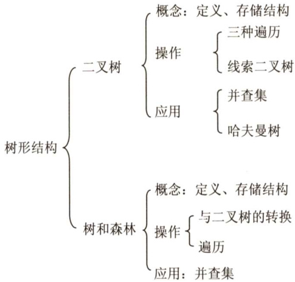

# 第5章  

## 树与二叉树  

### 【考纲内容】  

（一）树的基本概念  

（二）二叉树二叉树的定义及其主要特征；二叉树的顺序存储结构和链式存储结构二叉树的遍历；线索二叉树的基本概念和构造  

（三）树、森林树的存储结构；森林与二叉树的转换；树和森林的遍历  
（四）树与二叉树的应用哈夫曼（Huffman）树和哈夫曼编码；并查集及其应用  

### 【知识框架】  

  

### 【复习提示】  

本章内容多以选择题的形式考查，但也会出涉及树遍历相关的算法题。树和二叉树的性质、遍历操作、转换、存储结构和操作特性等，满二叉树、完全二叉树、线索二叉树、哈夫曼树的定义和性质，二叉排序树和二叉平衡树的性质和操作等，都是选择题必然会涉及的内容。  