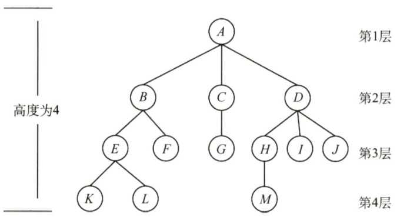
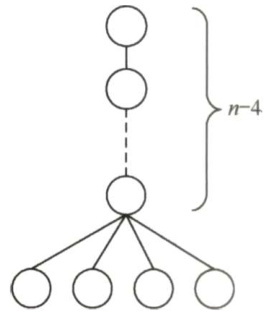
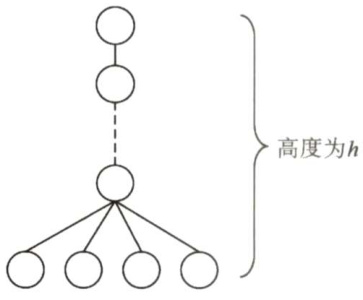

### 5.1 树的基本概念  

#### 5.1.1 树的定义  

树是 $n$ （ $n\geq0$ ）个结点的有限集。当 $n=0$ 时，称为空树。在任意一棵非空树中应满足：1）有且仅有一个特定的称为根的结点。  

2）当 $n>1$ 时，其余结点可分为 $m$ （ $m>0$ ）个互不相交的有限集 $T_{1},T_{2},\cdots,T_{m}$ ，其中每个集合本身又是一棵树，并且称为根的子树。  

显然，树的定义是递归的，即在树的定义中又用到了其自身，树是一种递归的数据结构。树为一种逻辑结构，同时也是一种分层结构，具有以下两个特点：  

1）树的根结点没有前驱，除根结点外的所有结点有且只有一个前驱。  

2）树中所有结点可以有零个或多个后继。  

树适合于表示具有层次结构的数据。树中的某个结点（除根结点外）最多只和上一层的一个结点(即其父结点)有直接关系，根结点没有直接上层结点，因此在 $n$ 个结点的树中有 $n-1$ 条边。而树中每个结点与其下一层的零个或多个结点（即其子女结点）有直接关系。  

#### 5.1.2 基本术语  

下面结合图5.1中的树来说明一些基本术语和概念。  

  
图5.1 树的树形表示  

1）考虑结点 $K$ 。根 $A$ 到结点 $K$ 的唯一路径上的任意结点，称为结点 $K$ 的祖先。如结点 $B$ 是结点 $K$ 的祖先，而结点 $K$ 是结点 $B$ 的子孙。路径上最接近结点 $K$ 的结点 $E$ 称为 $K$ 的双亲，而 $K$ 为结点 $E$ 的孩子。根 $A$ 是树中唯一没有双亲的结点。有相同双亲的结点称为兄弟，如结点 $K$ 和结点 $L$ 有相同的双亲 $E$ ，即 $K$ 和 $L$ 为兄弟。  
2）树中一个结点的孩子个数称为该结点的度，树中结点的最大度数称为树的度。如结点 $B$ 的度为2，结点 $D$ 的度为3，树的度为3。  
3）度大于0的结点称为分支结点（又称非终端结点)；度为0（没有子女结点）的结点称为叶子结点（又称终端结点)。在分支结点中，每个结点的分支数就是该结点的度。  
4）结点的深度、高度和层次。结点的层次从树根开始定义，根结点为第1层，它的子结点为第2层，以此类推。双亲在同一层的结点互为堂兄弟，图5.1中结点G与E,F,H,I,J互为堂兄弟。结点的深度是从根结点开始自顶向下逐层累加的。结点的高度是从叶结点开始自底向上逐层累加的。树的高度（或深度）是树中结点的最大层数。图5.1中树的高度为4。  
5）有序树和无序树。树中结点的各子树从左到右是有次序的，不能互换，称该树为有序树，否则称为无序树。假设图5.1为有序树，若将子结点位置互换，则变成一棵不同的树。  
6）路径和路径长度。树中两个结点之间的路径是由这两个结点之间所经过的结点序列构成的，而路径长度是路径上所经过的边的个数。注意：由于树中的分支是有向的，即从双亲指向孩子，所以树中的路径是从上向下的，  

同一双亲的两个孩子之间不存在路径。  

7）森林。森林是 $m$ （ $m\geq0$ ）棵互不相交的树的集合。森林的概念与树的概念十分相近，因为只要把树的根结点删去就成了森林。反之，只要给 $m$ 棵独立的树加上一个结点，并把这 $m$ 棵树作为该结点的子树，则森林就变成了树。  

注意：上述概念无须刻意记忆，根据实例理解即可。考研不大可能直接考查概念，而都是结合具体的题目考查。做题时，遇到不熟悉的概念可以翻书，练习得多自然就记住了。  

#### 5.1.3 树的性质  

树具有如下最基本的性质：  

1）树中的结点数等于所有结点的度数之和加1。  
2）度为 $m$ 的树中第 $i$ 层上至多有 $m^{i-1}$ 个结点（ $i\geq1$ )。  
3）高度为 $h$ 的 $m$ 叉树至多有 $(m^{h}-1)/(m-1)$ 个结点。  
4）具有 $n$ 个结点的 $m$ 叉树的最小高度为 $\mathsf{\bar{l o g}}_{m}(n(m-1)+1)\mathsf{\bar{l}}_{\mathsf{\ell}}$  

#### 5.1.4 本节试题精选  

#### 一、单项选择题  

01．树最适合用来表示（）的数据。  

A.有序 B．无序C．任意元素之间具有多种联系 D．元素之间具有分支层次关系  

02．一棵有 $n$ 个结点的树的所有结点的度数之和为（）。  

A. $n-1$ B.n C. $n+1$ D.2n  

03.树的路径长度是从树根到每个结点的路径长度的（）。  

A.总和 B．最小值 C．最大值 D．平均值  

04．对于一棵具有 $n$ 个结点、度为4的树来说，（）。  

A.树的高度至多是 $n-3$ B.树的高度至多是 $n{-}4$ C.第 $i$ 层上至多有 $4(i-1)$ 个结点 D.至少在某一层上正好有4个结点  

05．度为4、高度为 $h$ 的树，（）。  

A.至少有 $h+3$ 个结点 B.至多有4h-1个结点C.至多有 $4h$ 个结点 D.至少有 $h+4$ 个结，  

D6．假定一棵度为3的树中，结点数为50，则其最小高度为（）。  

A.3 B.4 C.5 D.(  

07.【2010统考真题】在一棵度为4的树 $T$ 中，若有20个度为4的结点，10个度为3的结点，1个度为2的结点，10个度为1的结点，则树 $T$ 的叶结点个数是（）。  

A.41 B.82 C.113 D. 122  

#### 二、综合应用题  

01.含有 $n$ 个结点的三叉树的最小高度是多少？  

02．已知一棵度为4的树中，度为 $\scriptstyle0,1,2,3$ 的结点数分别为14，4，3，2，求该树的结点总数n和度为4的结点个数，并给出推导过程。  

03.已知一棵度为 $m$ 的树中，有 $n_{1}$ 个度为1的结点，有 $n_{2}$ 个度为2的结点·…有 $n_{m}$ 个度为$m$ 的结点，问该树有多少个叶子结点？  

#### 5.1.5 答案与解析  

#### 一、单项选择题  

01.D  

树是一种分层结构，它特别适合组织那些具有分支层次关系的数据。  

02.A  

除根结点外，其他每个结点都是某个结点的孩子，因此树中所有结点的度数加1等于结点数，也即所有结点的度数之和等于总结点数减1。这是一个重要的结论，做题时经常用到。  

03.A  

树的路径长度是指树根到每个结点的路径长的总和，根到每个结点的路径长度的最大值应是树的高度减1。注意与哈夫曼树的带权路径长度相区别。  

04.A  

要使得具有 $n$ 个结点、度为4的树的高度最大，就要使得每层的结点数尽可能少，类似右图所示的树，除最后一层外，每层的结点数是1，最终该树的高度为 $n-3$ 。树的度为4只能说明存在某结点正好（也最多）有4个孩子结点，D错误。  

  

05.A  

要使得度为4、高度为 $h$ 的树的总结点数最少，需要满足以下两个条件：  

$\textcircled{1}$ 至少有一个结点有4个分支。  
$\textcircled{2}$ 每层的结点数目尽可能少。  

情况类似右图所示的树，结点个数为 $h+3$ 。  

要使得度为4、高度为 $h$ 的树的总结点数最多，应使每个非叶结点的度均为4，即为满树，总结点个数最多为 $1+4+4^{2}+\cdots+4^{h-1}$ 6  

对于上面的两题，应画出草图来求解，一目了然。  

  

06.C  

要求满足条件的树，那么该树是一棵完全三叉树。在度为3的完全三叉树中，第1层有1个结点，第2层有 $3^{1}=3$ 个结点，第3层有 $3^{2}=9$ 个结点，第4层有 $3^{3}=27$ 个结点，因此结点数之和为 $1+3+9+27=40$ ，第5层的结点数 $=50-40=10$ 个，因此最小高度为5。  

07.B  

设树中度为 $\textit{i}\left({i}=0,1,2,3,4\right)$ ）的结点数分别为 $n_{i}$ ，树中结点总数为 $n$ ，则 $n=$ 分支数+1,而分支数又等于树中各结点的度之和，即 $n=1+n_{1}+2n_{2}+3n_{3}+4n_{4}=n_{0}+n_{1}+n_{2}+n_{3}+n_{4}$ 。依题意， $n_{1}+2n_{2}+3n_{3}+4n_{4}=10+2+30+80=122$ ， $n_{1}+n_{2}+n_{3}+n_{4}=10+1+10+20=41$ ，可得出$n_{0}=82$ ，即树 $T$ 的叶结点的个数是82。  

#### 二、综合应用题  

01.【解答】  

要求含有 $n$ 个结点的三叉树的最小高度，那么满足条件的一定是一棵完全三叉树，设含有 $n$ 个结点的完全三叉树的高度为 $h$ ，第 $h$ 层至少有1个结点，至多有 $3^{h-1}$ 个结点。则有  

$$
1+3^{1}+3^{2}+\cdots+3^{h-2}<n\leq1+3^{1}+3^{2}+\cdots+3^{h-2}+3^{h-1}
$$  

印 $(3^{h-1}-1)/2<n\leq(3^{h}-1)/2$ ，得 $3^{h-1}<2n+1\leq3^{h}$ ，也即 $h<\log_{3}(2n+1)+1$ ， $h\geq\log_{3}(2n+1)$  

由于 $h$ 只能为正整数， $h=\lceil\log_{3}(2n+1)\rceil$ ，故这样的三叉树的最小高度是 $\lceil\log_{3}(2n+1)\rceil_{\mathrm{c}}$  

02.【解答】  

设树中度为 $i~(i=0,1,2,3,4)$ ）的结点数为 $n_{i}$ ，那么结点总数 $n=n_{0}+n_{1}+n_{2}+n_{3}+n_{4}$ ，即 $n=$ $23+n_{4}$ ，根据“树中所有结点的度数加1等于结点数”的结论，有 $n=0+n_{1}+2n_{2}+3n_{3}+4n_{4}+1$ ，即有 $n=17+4n_{4}$ 。  

综合两式得 $n_{4}=2,n=25$ 。所以该树的结点总数为25，度为4的结点个数为2。  

03.【解答】  

根据“树中所有结点的度数加1等于结点数”的结论，有 $n=\sum_{i=0}^{m}i n_{i}=n_{1}+2n_{2}+3n_{3}+\cdots+m n_{m}+1,$ 又有 $n=n_{0}+n_{1}+n_{2}+\cdots+n_{m}$ ，所以  

$$
\begin{array}{l}{{\displaystyle n_{0}=(n_{1}+2n_{2}+3n_{3}+\cdots+m n_{m}+1)-(n_{1}+n_{2}+\cdots+n_{m})}}\\ {{\mathrm{~}=n_{2}+2n_{3}+\cdots+(m-1)n_{m}+1=1+\displaystyle\sum_{i=2}^{m}(i-1)n_{i}}}\end{array}
$$  

注意：综合以上几题，常用于求解树结点与度之间关系的有：  

$\textcircled{1}$ 总结点数 $=n_{0}+n_{1}+n_{2}+\cdots+n_{m}\circ$   
$\textcircled{2}$ 总分支数 $=1n_{1}+2n_{2}+\cdots+m n_{m}$ （度为 $m$ 的结点引出 $m$ 条分支)。  
$\textcircled{3}$ 总结点数 $\mathbf{\Sigma}=\mathbf{\Sigma}$ 总分支数 $^+1$ 。  
这个性质经常在选择题中出现，读者对于以上关系应当熟练掌握并灵活应用。