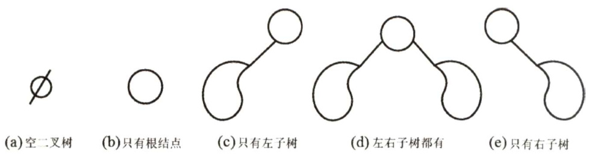
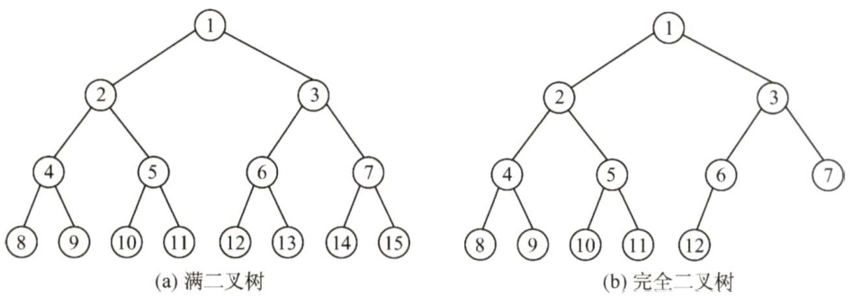
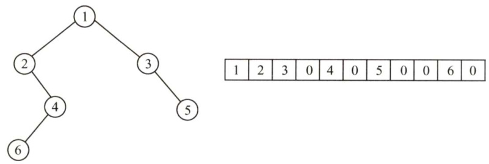
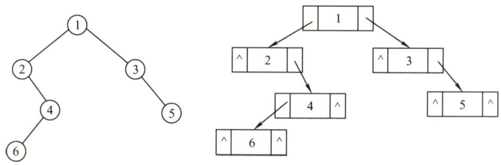
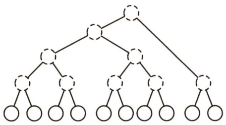
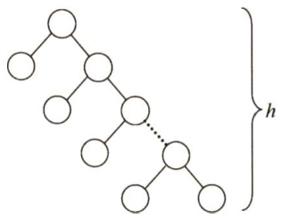
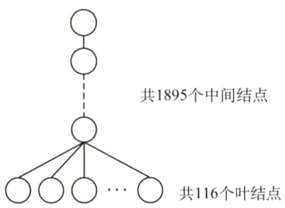
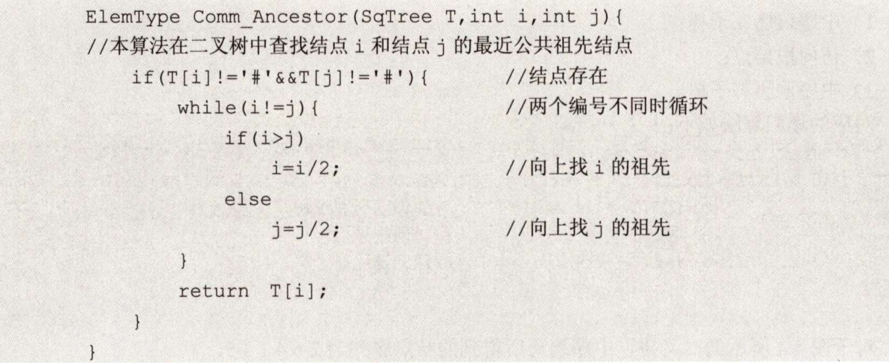

### 5.2 二叉树的概念  

#### 5.2.1 二叉树的定义及其主要特性  

#### 1．二叉树的定义  

二叉树是另一种树形结构，其特点是每个结点至多只有两棵子树（即二叉树中不存在度大于2的结点)，并且二叉树的子树有左右之分，其次序不能任意颠倒。  

与树相似，二叉树也以递归的形式定义。二叉树是 $n$ （ $n\geq0$ ）个结点的有限集合：  

$\textcircled{1}$ 或者为空二叉树，即 $n=0$ o  

$\textcircled{2}$ 或者由一个根结点和两个互不相交的被称为根的左子树和右子树组成。左子树和右子树又分别是一棵二叉树。  

二叉树是有序树，若将其左、右子树颠倒，则成为另一棵不同的二叉树。即使树中结点只有一棵子树，也要区分它是左子树还是右子树。二叉树的5种基本形态如图5.2所示。  

  
图5.2二叉树的5种基本形态  

二叉树与度为2的有序树的区别：  

$\textcircled{1}$ 度为2的树至少有3个结点，而二叉树可以为空。  
$\textcircled{2}$ 度为2的有序树的孩子的左右次序是相对于另一孩子而言的，若某个结点只有一个孩子，则这个孩子就无须区分其左右次序，而二叉树无论其孩子数是否为2，均需确定其左右次序，即二叉树的结点次序不是相对于另一结点而言，而是确定的。  

#### 2.几个特殊的二叉树  

1）满二叉树。一棵高度为 $h$ ，且含有 $2^{h}-1$ 个结点的二叉树称为满二叉树，即树中的每层都含有最多的结点，如图5.3(a)所示。满二叉树的叶子结点都集中在二叉树的最下一层，并且除叶子结点之外的每个结点度数均为2。可以对满二叉树按层序编号：约定编号从根结点（根结点编号为1）起，自上而下，自左向右。这样，每个结点对应一个编号，对于编号为 $i$ 的结点，若有双亲，则其双亲为i2」，若有左孩子，则左孩子为2i；若有右孩子，则右孩子为 $2i+1$ 。  

2）完全二叉树。高度为 $h$ 、有 $n$ 个结点的二叉树，当且仅当其每个结点都与高度为 $h$ 的满二叉树中编号为 $1{\sim}n$ 的结点一一对应时，称为完全二叉树，如图5.3(b)所示。其特点如下：  

  
图5.3两种特殊形态的二叉树  

$\textcircled{1}$ 若 $i\le\lfloor n/2\rfloor$ ，则结点 $i$ 为分支结点，否则为叶子结点。  

$\textcircled{2}$ 叶子结点只可能在层次最大的两层上出现。对于最大层次中的叶子结点，都依次排列在该层最左边的位置上。  
$\textcircled{3}$ 若有度为1的结点，则只可能有一个，且该结点只有左孩子而无右孩子（重要特征)。  
$\textcircled{4}$ 按层序编号后，一旦出现某结点（编号为i）为叶子结点或只有左孩子，则编号大于 $i$ 的结点均为叶子结点。  
$\textcircled{5}$ 若 $n$ 为奇数，则每个分支结点都有左孩子和右孩子；若 $n$ 为偶数，则编号最大的分支结点（编号为 $n/2$ ）只有左孩子，没有右孩子，其余分支结点左、右孩子都有。  

3）二叉排序树。左子树上所有结点的关键字均小于根结点的关键字；右子树上的所有结点的关键字均大于根结点的关键字；左子树和右子树又各是一棵二叉排序树。  

4）平衡二叉树。树上任一结点的左子树和右子树的深度之差不超过1。  

#### 3．二叉树的性质  

1）非空二叉树上的叶子结点数等于度为2的结点数加1，即 $n_{0}=n_{2}+1$ 。  

证明：设度为0,1和2的结点个数分别为 $n_{0},n_{1}$ 和 $n_{2}$ ，结点总数 $n=n_{0}+n_{1}+n_{2}$ 。再看二叉树中的分支数，除根结点外，其余结点都有一个分支进入，设 $B$ 为分支总数，则 $\scriptstyle n=B+1$ 。由于这些分支是由度为1或2的结点射出的，所以又有 $B=n_{1}+2n_{2}$ 。于是得 $n_{0}+n_{1}+n_{2}=n_{1}+2n_{2}+1$ ，则 $n_{0}=n_{2}+1$ 。  

注意：该结论经常在选择题中用到，希望考生牢记并灵活应用。拓展到任意一棵树，若结点数量为 $n$ ，则边的数量为 $n-1$ 。  

2）非空二叉树上第 $k$ 层上至多有 $2^{k-1}$ 个结点 $(k\geq1)$ 。  

第1层至多有 $2^{1-1}=1$ 个结点（根），第2层至多有 $2^{2-1}=2$ 个结点，以此类推，可以证明其为一个公比为2的等比数列 $2^{k-1}$  

3）高度为 $h$ 的二叉树至多有 $2^{h}-1$ 个结点（ $\langle h\geq1$ )。该结论利用性质2求前 $h$ 项的和，即等比数列求和的结果。  

4）对完全二叉树按从上到下、从左到右的顺序依次编号 $1,2,\cdots,n$ ，则有以下关系：  

$\textcircled{1}$ 当 $i>1$ 时，结点 $i$ 的双亲的编号为 $i/2\rfloor$ ，即当 $i$ 为偶数时，其双亲的编号为 $_{i/2}$ ，它是双亲的左孩子；当 $i$ 为奇数时，其双亲的编号为 $(i-1)/2$ ，它是双亲的右孩子。  
$\textcircled{2}$ 当 $2i\leq n$ 时，结点 $i$ 的左孩子编号为2i，否则无左孩子。  
$\textcircled{3}$ 当 $2i+1\leq n$ 时，结点 $i$ 的右孩子编号为 $2i+1$ ，否则无右孩子。  
$\textcircled{4}$ 结点 $i$ 所在层次（深度）为 $\left\lfloor\log_{2}i\right\rfloor+1$ 。  

5）具有 $n$ 个（ $\cdot n>0$ ）结点的完全二叉树的高度为 $\lceil\log_{2}(n+1)\rceil$ 或 $\left\lfloor\log_{2}n\right\rfloor+1$ 。设高度为 $h$ ，根据性质3和完全二叉树的定义有  

得 $2^{h-1}<n+1\leq2^{h}$ ，即 $h-1<\log_{2}(n+1)\leq h$ ，因为 $h$ 为正整数，所以 $h{=}\lceil\log_{2}(n+1)\rceil$ 。  
或得 $h-1\leq\log_{2}n<h$ ，所以 $h{=}\lfloor\log_{2}n\rfloor+1$ 。  

#### 5.2.2 二叉树的存储结构  

#### 1．顺序存储结构  

二叉树的顺序存储是指用一组地址连续的存储单元依次自上而下、自左至右存储完全二叉树上的结点元素，即将完全二叉树上编号为 $i$ 的结点元素存储在一维数组下标为i-1的分量中。  

依据二叉树的性质，完全二叉树和满二叉树采用顺序存储比较合适，树中结点的序号可以唯一地反映结点之间的逻辑关系，这样既能最大可能地节省存储空间，又能利用数组元素的下标值确定结点在二叉树中的位置，以及结点之间的关系。  

但对于一般的二叉树，为了让数组下标能反映二叉树中结点之间的逻辑关系，只能添加一些并不存在的空结点，让其每个结点与完全二叉树上的结点相对照，再存储到一维数组的相应分量中。然而，在最坏情况下，一个高度为 $h$ 且只有 $h$ 个结点的单支树却需要占据近 $2^{h}-1$ 个存储单元。二叉树的顺序存储结构如图5.4所示，其中0表示并不存在的空结点。  

  
图5.4二叉树的顺序存储结构  

注意：这种存储结构建议从数组下标1开始存储树中的结点，若从数组下标0开始存储，则不满足性质4的描述（比如结点 $A$ 存储在0下标位置上时，无法根据性质4来计算出其孩子结点在数组中的位置)，这是考生在书写程序时容易忽略的。  

#### 2.链式存储结构  

由于顺序存储的空间利用率较低，因此二叉树一般都采用链式存储结构，用链表结点来存储二叉树中的每个结点。在二叉树中，结点结构通常包括若干数据域和若干指针域，二叉链表至少包含3个域：数据域data、左指针域lchild和右指针域rchild，如图5.5所示。  

<html><body><table><tr><td>lchild</td><td>data</td><td>rchild</td></tr></table></body></html>  

图5.6所示为常用的二叉链表的存储结构。而实际上在不同的应用中，还可以增加某些指针域，如增加指向父结点的指针后，变为三叉链表的存储结构。  

  
图5.5二叉树链式存储的结点结构  
图5.6二叉链表的存储结构  

二叉树的链式存储结构描述如下：  

typedef struct BiTNode{ElemType data; //数据域structBiTNode\*lchild，\*rchild;//左、右孩子指针  
}BiTNode,\*BiTree;  

使用不同的存储结构时，实现二叉树操作的算法也会不同，因此要根据实际应用场合（二叉树的形态和需要进行的运算）来选择合适的存储结构。  

容易验证，在含有 $n$ 个结点的二叉链表中，含有 $n+1$ 个空链域（重要结论，经常出现在选择题中)。在下一节中，我们将利用这些空链域来组成另一种链表结构一线索链表。  

#### 5.2.3 本节试题精选  

#### 一、单项选择题  

01．下列关于二叉树的说法中，正确的是（）。  

A．度为2的有序树就是二叉树B.含有 $n$ 个结点的二叉树的高度为 $\left\lfloor\log_{2}n\right\rfloor+1$  

C.在完全二叉树中，若一个结点没有左孩子，则它必是叶结点  
D.在任意一棵非空二叉排序树中，删除某结点后又将其插入，则所得二叉排序树与删除前原二叉排序树相同  

02.以下说法中，正确的是（）。  

A．在完全二叉树中，叶子结点的双亲的左兄弟（若存在）一定不是叶子结点B．任何一棵二叉树，叶子结点个数为度为2的结点数减1，即 $n_{0}=n_{2}-1$ C．完全二叉树不适合顺序存储结构，只有满二叉树适合顺序存储结构D．结点按完全二叉树层序编号的二叉树中，第 $i$ 个结点的左孩子的编号为2i  

03．具有10个叶子结点的二叉树中有（）个度为2的结点。  

A.8 B.9 C.10 D.11  

04.设高度为 $h$ 的二叉树上只有度为0和度为2的结点，则此类二叉树中所包含的结点数至少为（）。  

A. $h$ B.2h- 1 C. $2h+1$ D.h+1  

05．假设一棵二叉树的结点个数为50，则它的最小高度是（）。  

A.4 B.5 C.6 D.  

06．设二叉树有 $2n$ 个结点，且 $m<n$ ，则不可能存在（）的结点。  

A. $n$ 个度为0 B. $2m$ 个度为0   
C. $2m$ 个度为1 D. $2m$ 个度为2  

07.一个具有1025个结点的二叉树的高 $h$ 为（）。  

A.11 B.10 C.11\~1025 D.10\~1024  

08．设二叉树只有度为0和2的结点，其结点个数为15，则该二叉树的最大深度为（）  

A.4 B.5 C.8 D.9  

09.高度为 $h$ 的完全二叉树最少有（）个结点。  

A. $2^{h}$ B. $2^{h}+1$ C. 21 D. $2^{h}-1$  

10.已知一棵完全二叉树的第6层（设根为第1层）有8个叶结点，则完全二叉树的结点个数最少是（）。  

A.39 B.52 C. 111 D. 119  

11．若一棵深度为6的完全二叉树的第6层有3个叶子结点，则该二叉树共有（）个叶子结点。  

A.17 B.18 C. 19 D.20  

12．一棵完全二叉树上有1001个结点，其中叶结点的个数是（）。  

A. 250 B.500 C.254 D.50  

13.若一棵二叉树有126个结点，在第7层（根结点在第1层）至多有（）个结点。  

A.32 B.64 C.63 D．不存在第7层  

4.一棵有124个叶子结点的完全二叉树，最多有（）个结点。  

A.247 B.248 C.249 D. 250  

15.一棵有 $n$ 个结点的二叉树采用二叉链存储结点，其中空指针数为（）  

A.n B. $n+1$ C.n-1 D.2n  

16．在一棵完全二叉树中，其根的序号为1，（）可判定序号为 $p$ 和 $q$ 的两个结点是否在同一层。  

A. $\big\lfloor\log_{2}p\big\rfloor=\big\lfloor\log_{2}q\big\rfloor$ B $3.\mathrm{log}_{2}p=\mathrm{log}_{2}q$  

C. $\left\lfloor\log_{2}p\right\rfloor+1=\left\lfloor\log_{2}q\right\rfloor$ $\mathrm{~D.~}\left\lfloor\log_{2}p\right\rfloor{=}\lfloor\log_{2}q\rfloor+1$  

17．假定一棵三叉树的结点数为50，则它的最小高度为（）。  

A.3 B.4 C.5 D.6  

18．已知一棵有2011个结点的树，其叶结点个数是116，该树对应的二叉树中无右孩子的结点个数是（）。  

A.115 B.116 C.1895 D. 1896对于一棵满二叉树，共有 $n$ 个结点和 $m$ 个叶子结点，高度为 $h$ ，则（）。  

A. $n=h+m$ B. $n+m=2h$ C. $m=h-1$ D. $n=2^{h}-1$  

20.【2009统考真题】已知一棵完全二叉树的第6层（设根为第1层）有8个叶结点，则该完全二叉树的结点个数最多是（）。  

A.39 B.52 C. 111 D. 119  

21.【2011统考真题】若一棵完全二叉树有768个结点，则该二叉树中叶结点的个数是（）  

A.257 B.258 C.384 D.385  

22.【2018统考真题】设一棵非空完全二叉树 $T$ 的所有叶结点均位于同一层，且每个非叶结点都有2个子结点。若 $T$ 有 $k$ 个叶结点，则 $T$ 的结点总数是（）。  

A. $2k-1$ B. $2k$ C. $\boldsymbol{k}^{2}$ D. $2^{k}-1$  

23.【2020统考真题】对于任意一棵高度为5且有10个结点的二叉树，若采用顺序存储结构保存，每个结点占1个存储单元（仅存放结点的数据信息），则存放该二叉树需要的存储单元数量至少是（）。  

A.31 B.16 C.15 D. 10  

#### 二、综合应用题  

01．在一棵完全二叉树中，含有 $n_{0}$ 个叶子结点，当度为1的结点数为1时，该树的高度是多少？当度为1的结点数为0时，该树的高度是多少？  

02.一棵有 $n$ 个结点的满二叉树有多少个分支结点和多少个叶子结点？该满二叉树的高度是多少？  

03．已知完全二叉树的第9层有240个结点，则整个完全二叉树有多少个结点？有多少个叶子结点？  

04.一棵高度为 $h$ 的满 $m$ 叉树有如下性质：根结点所在层次为第1层，第 $h$ 层上的结点都是叶结点，其余各层上每个结点都有 $m$ 棵非空子树，若按层次自顶向下，同一层自左向右，顺序从1开始对全部结点进行编号，试问：  

1）各层的结点个数是多少？  
2）编号为 $i$ 的结点的双亲结点（若存在）的编号是多少？  
3）编号为 $i$ 的结点的第 $k$ 个孩子结点（若存在）的编号是多少？  
4）编号为 $i$ 的结点有右兄弟的条件是什么？其右兄弟结点的编号是多少？  

05．已知一棵二叉树按顺序存储结构进行存储，设计一个算法，求编号分别为 $i$ 和 $j$ 的两个结点的最近的公共祖先结点的值。  

#### 5.2.4 答案与解析  

#### 一、单项选择题  

01.C  

在二叉树中，若某个结点只有一个孩子，则这个孩子的左右次序是确定的；而在度为2的有序树中，若某个结点只有一个孩子，则这个孩子就无须区分其左右次序，A错误。选项B仅当是完全二叉树时才有意义，对于任意一棵二叉树，高度可能为 $\left\lfloor\log_{2}n\right\rfloor+1\sim_{n}$ 。在二叉排序树中插入结点时，一定插入在叶结点的位置，故若先删除分支结点再插入，则会导致二叉排序树的重构，其结果就不再相同，D错误。根据完全二叉树的定义，在完全二叉树中，若有度为1的结点，则只可能有一个，且该结点只有左孩子而无右孩子，选项C正确。  

02.A  

在完全二叉树中，叶子结点的双亲的左兄弟的孩子一定在其前面（且一定存在)，故双亲的左兄弟（若存在）一定不是叶结点，A正确。 $n_{0}$ 应等于 $n_{2}+1$ ，B错误。完全二叉树和满二叉树均可以采用顺序存储结构，C错误。第 $i$ 个结点的左孩子不一定存在，D错误。  

选项B的这种通用公式适用于所有二叉树，我们应能立即联想到采用特殊值代入法验证，如画一个只含3个结点的满二叉树的草图来验证是否满足条件。  

03.B  

由二叉树的性质 $n_{0}=n_{2}+1$ ，得 $n_{2}=n_{0}-1=10-1=9$ 。  

【另解】画出草图，如右图所示。首先画出10个叶结点，然后每2个结点向上合并，构造一个新的度为2的分支结点，直到构成如下图所示的二叉树，其中度为2的分支结点数为9。  

  

04.B  

结点最少的情况如下图所示。除根结点层只有1个结点外，其他h-1层均有两个结点，结点总数 $=2(h-1)+1=2h-1$ 。  

  

05.C  

要求满足条件的树，分析可知，当这50个结点构成一棵完全二叉树时高度最小， $h=\lfloor\log_{2}n\rfloor+$ $1=\lfloor\log_{2}50\rfloor+1=6\$ 。  

【另解】第1层最多有1个结点，第2层最多有 $2^{1}$ 个结点，第3层最多有 $2^{2}$ 个结点，第4层最多有 $2^{3}$ 个结点，以此类推，可以得到 $h$ 最少为6。  

06.C  

由二叉树的性质1可知 $n_{0}=n_{2}+1$ ，结点总数 $~=~2n=n_{0}+n_{1}+n_{2}=n_{1}+~2n_{2}+~1$ ，则 $n_{1}=$ $2(n-n_{2})-1$ ，所以 $n_{1}$ 为奇数，说明该二叉树中不可能有 $2m$ 个度为1的结点。  

07.C  

当二叉树为单支树时具有最大高度，即每层上只有一个结点，最大高度为1025。而当树为完  

全二叉树时，其高度最小，最小高度为 $\left\lfloor\log_{2}n\right\rfloor+1=11$ 。  

08.C  

解题思路同第4题，第一层有一个结点，其余 $h-1$ 层上各有两个结点，总结点数 $=1+2(h-1)=$ 15， $h=8$ 。建议画出草图。  

09.C  

高度为 $h$ 的完全二叉树中，第1层 $\sim$ 第 $h-1$ 层构成一个高度为 $h-1$ 的满二叉树，结点个数为 $2^{h-1}-1$ 。第 $h$ 层至少有一个结点，所以最少的结点个数 $=(2^{h-1}-1)+1=2^{h-1}$  

10.A  

第6层有叶结点说明完全二叉树的高度可能为6或7，显然树高为6时结点最少。若第6层上有8个叶结点，则前5层为满二叉树，故完全二叉树的结点个数最少为 $2^{5}-1+8=39$ 个结点。  

11.A  

深度为6的完全二叉树，第5层共有 $2^{4}=16$ 个结点。第6层最左边有3个叶子结点，其对应的双亲结点为第5层最左边的两个结点，所以第5层剩余的结点均为叶子结点，共有 $16-2=14$ 个，加上第6层的3个叶子结点，共有17个叶子结点。  

12.D  

由完全二叉树的性质，最后一个分支结点的序号为 $\lfloor1001/2\rfloor=500$ ，故叶子结点个数为501。  

【另解】 $n=n_{0}+n_{1}+n_{2}=n_{0}+n_{1}+(n_{0}-1)=2n_{0}+n_{1}-1$ ，因为 $n=1001$ ，而在完全二叉树中，$n_{1}$ 只能取0或1。当 $n_{1}=1$ 时， $n_{0}$ 为小数，不符合题意。所以 $n_{1}=0$ ，故 $n_{0}=501$ 。  

13.C  

要使二叉树第7层的结点数最多，只考虑树高为7层的情况，7层满二叉树有127个结点，126仅比127少1个结点，只能少在第7层，故第7层最多有 $2^{6}-1=63$ 个结点。  

14.B  

在非空的二叉树当中，由度为0和2的结点数的关系 $n_{0}=n_{2}+1$ 可知 $n_{2}=123$ ；总结点数 $n=$ $n_{0}+n_{1}+n_{2}=247+n_{1}$ ，其最大值为248（ $n_{1}$ 的取值为1或0，当 $n_{1}=1$ 时结点最多)。注意，由完全二叉树总结点数的奇偶性可以确定 $n_{1}$ 的值，但不能根据 $n_{0}$ 来确定 $n_{1}$ 的值。  

【另解】 $124<2^{7}=128$ ，故第8层没满，前7层为完全二叉树，由此可推算第8层可能有120个叶子结点，第7层的最右4个为叶子结点，考虑最多的情况，这4个叶子结点中的最左边可以有1个左孩子（不改变叶子结点数)，因此结点总数 $=2^{7}-1+120+1=248$ 。  

15.B  

非空指针数 $\mathbf{\Sigma}=\mathbf{\Sigma}$ 总分支数 $\scriptstyle=n-1$ ，空指针数 $=2\times$ 结点总数-非空指针数 $=2n-(n-1)=n+1$ 。  

【另解】在树中，1个指针对应1个分支， $n$ 个结点的树共有 $n-1$ 个分支，即 $n-1$ 个非空指针，每个结点有2个指针域，故空指针数 $=2n-(n-1)=n+1$ 。  

16.A  

由完全二叉树的性质，编号为 $i$ （ $i\geq1$ ）的结点所在的层次为 $\log_{2}i]+1$ ，若两个结点位于同一层，则一定有 $\left\lfloor\log_{2}p\right\rfloor+1=\left\lfloor\log_{2}q\right\rfloor+1$ ，因此有 $\left\lfloor\log_{2}p\right\rfloor=\left\lfloor\log_{2}q\right\rfloor$ 成立。  

17.C  

分析可知，满足条件的三叉树可以是完全三叉树，这棵树的第i $(i\geq1)$ ）层最多有 $3^{i-1}$ 个结点。设高度为 $h$ ，则 $3^{0}+3^{1}+\cdots+3^{h-1}=$ $(3^{h}-1)/2$ 是结点数的上限，问题是求解 $50\le(3^{h}-1)/2$ 的最小 $h$ 值，即 $h\geq\log_{3}101$ ，有 $h=\lceil\log_{3}101\rceil=5.$ 。  

  

18.D  

可采用特殊值法求解。可举如下特例。  

如右图所示，其对应的二叉树中仅有前115个叶结点有右孩子结点，其余1896个结点均无右孩子结点。  

19.D  

对于高度为 $h$ 的满二叉树， $n=2^{0}+2^{1}+\cdots+2^{h-1}=2^{h}-1_{\mathrm{~}}$ 。 $m=2^{h-1}$ ，故选D。  

【另解】特殊值法。如对于高度为3的满二叉树， $n=7$ $m=4$ $h=3$ ，经检验，仅D正确。  

20.C  

第6层有叶结点，完全二叉树的高度可能为6或7，显然树高为7时结点最多。完全二叉树与满二叉树相比，只是在最下一层的右边缺少了部分叶结点，而最后一层之上是个满二叉树，并且只有最后两层上有叶结点。若第6层上有8个叶结点，则前6层为满二叉树，而第7层缺失了$8\times2=16$ 个叶结点，故完全二叉树的结点个数最多为 $2^{7}-1-16=111$ 。  

21.C  

求解过程与第13题类似。由完全二叉树的性质，最后一个分支结点的序号为 $\lfloor768/2\rfloor=384$ 故叶子结点的个数为 $768-384=384$ Q  

【另解】 $n=n_{0}+n_{1}+n_{2}=n_{0}+n_{1}+(n_{0}-1)=2n_{0}+n_{1}-1$ ，其中 $n=768$ ，而在完全二叉树中，$n_{1}$ 只能取0或1，当 $n_{1}=0$ 时， $n$ 为小数，不符合题意。所以 $n_{1}=1$ ，故 $n_{0}=384$ 。  

22.A  

解析请扫右侧二维码查阅。  

23.A  

二叉树采用顺序存储时，用数组下标来表示结点之间的父子关系。对于一棵高度为5的二叉树，为了满足任意性，其 $1{\sim}5$ 层的所有结点都要被存储起来，即考虑为一棵高度为5的满二叉树，共需要存储单元的数量为 $1+2+4+8+16=31$ 。  

#### 二、综合应用题  

01.【解答】  

在非空的二叉树中，由度为0和度为2的结点之间的关系 $n_{0}=n_{2}+1$ ，可知 $n_{2}=n_{0}-1$ 。因此  

总结点数 $n=n_{0}+n_{1}+n_{2}=2n_{0}+n_{1}-1$ o$\textcircled{1}$ 当 $n_{1}=1$ 时， $n=2n_{0},~h=\lceil\log_{2}(n+1)\rceil=\lceil\log_{2}(2n_{0}+1)\rceil_{\circ}$ $\textcircled{2}$ 当 $n_{1}=0$ 时， $n=2n_{0}-1$ ， $h=\lceil\log_{2}(n+1)\rceil{=}\lceil\log_{2}(2n_{0})\rceil{=}\lceil\log_{2}(n_{0})\rceil+1\mathrm{~c~}$  

02.【解答】  

满二叉树中 $n_{1}=0$ ，由二叉树的性质1可知 $n_{0}=n_{2}+1$ ，即 $n_{2}=n_{0}-1$ ， $n=n_{0}+n_{1}+n_{2}=2n_{0}-1,$ 则 $n_{0}=(n+1)/2$ 。分支结点个数 $n_{2}=n-(n+1)/2=(n-1)/2$ 。高度为 $h$ 的满二叉树的结点数 $n=1+$ $2^{1}+2^{2}+\cdots+2^{h-1}=2^{h}-1$ ，即高度 $h=\log_{2}(n+1)$ 。  

03.【解答】  

在完全二叉树中，若第9层是满的，则结点数 $=2^{9-1}=256$ ，而现在第9层只有240个结点，说明第9层未满，是最后一层。 $1{\sim}8$ 层是满的，所以总结点数 $=2^{8}-1+240=495$ 。  

因为第9层是最后一层，所以第9层的结点都是叶子结点。且第9层的240个结点的双亲在第8层中，其双亲个数为120，即第8层有120个分支结点，其余为叶子结点，所以第8层的叶子结点个数为 $2^{8-1}-120=8$ 。因此，总的叶子结点个数 $=8+240=248.$ 。  

【另解】总结点数n=no+n+n， $n_{2}=n_{0}-1$ ， $n=n_{0}+n_{1}+n_{2}=2n_{0}+n_{1}-1$ 。若 $n_{1}=1$ ，则 $2n_{0}$ $+n_{1}-1=2n_{0}=495$ ，不符合；若 $n_{1}=0$ ，则 $2n_{0}+n_{1}-1=2n_{0}-1=495$ ，则 $n_{0}=248$ 。注意：对于本题，应理解完全二叉树中只有最低一层的结点是不满的，其他各层的结点是满的（即第 $i$ 层有$2^{i-1}$ 个结点)。  

04.【解答】  

1)第1层有 $m^{0}=1$ 个结点，第2层有 $m^{1}$ 个结点，第3层有 $m^{2}$ 个结点…一般地，第 $i$ 层有$m^{i-1}$ 个结点 $(1\leq i\leq h)$ 。  
2）在 $m$ 叉树的情形下，结点 $i$ 的第1个子女编号为 $j=(i-1){\times}m+2$ ，反过来，结点 $i$ 的双亲的编号是 $(i-2)/m\rfloor+1$ ，根结点没有双亲，所以要求 $i>1$ 。  
3）因为结点 $i$ 的第1个子女编号为 $(i-1)m+2$ ，若设该结点子女的序号为 $k=1,2,\cdots,m$ ，则第 $k$ 个子女结点的编号为 $(i-1)m+k+1$ （ $1\leq k\leq m)$ 。  
4）结点 $i$ 不是其双亲的第 $m$ 个子女时才有右兄弟。设其双亲编号为 $j$ ，可得 $j=\lfloor(i+m-2)/m\rfloor$ 费结点 $j$ 的第 $m$ 个子女的编号为 $(j-1)m+m+1=j m+1=\lfloor(i+m-2)/m\rfloor\times m+1$ ，所以当结点的编号 $i\le\lfloor(i+m-2)/m\rfloor\times m$ 时才有右兄弟，右兄弟的编号为 $i+1$ 。或者，对于任一双亲结点 $j$ ，其第 $m$ 个子女结点的编号是 $j m+1$ ，故若不为第 $m$ 的子女结点，则 $(i-1)\%m!=0$ 。  

05.【解答】  

首先，必须明确二叉树中任意两个结点必然存在最近的公共祖先结点，最坏的情况下是根结点（两个结点分别在根结点的左右分支中)，而且从最近的公共祖先结点到根结点的全部祖先结点都是公共的。由二叉树顺序存储的性质可知，任一结点 $i$ 的双亲结点的编号为 $i/2$ 。求解 $i$ 和 $j$ 最近公共祖先结点的算法步骤如下(设从数组下标1开始存储)：  

1）若 $i>j$ ，则结点 $i$ 所在层次大于等于结点 $j$ 所在层次。结点 $i$ 的双亲结点为结点 $i/2$ ，若$i/2=j$ ，则结点 $i/2$ 是原结点 $i$ 和结点 $j$ 的最近公共祖先结点，若 $i/2\neq j$ ，则令 $i=i/2$ ，即以该结点 $i$ 的双亲结点为起点，采用递归的方法继续查找。  

2）若 $j>i$ ，则结点 $j$ 所在层次大于等于结点 $i$ 所在层次。结点 $j$ 的双亲结点为结点j/2，若  

$j/2=i$ ，则结点 $j/2$ 是原结点 $i$ 和结点 $j$ 的最近公共祖先结点，若 $j/2\neq i$ ，则令 $j=j/2$ 6重复上述过程，直到找到它们最近的公共祖先结点为止。  

本题代码如下：  

  

由解题中算法的步骤描述可知，本题也很容易地联想到采用递归的方法求解。