### 5.3 二叉树的遍历和线索二叉树  

#### 5.3.1 二叉树的遍历  

二叉树的遍历是指按某条搜索路径访问树中每个结点，使得每个结点均被访问一次，而且仅被访问一次。由于二叉树是一种非线性结构，每个结点都可能有两棵子树，因而需要寻找一种规律，以便使二叉树上的结点能排列在一个线性队列上，进而便于遍历。  

由二叉树的递归定义可知，遍历一棵二叉树便要决定对根结点N、左子树L和右子树R的访问顺序。按照先遍历左子树再遍历右子树的原则，常见的遍历次序有先序（NLR）、中序（LNR)和后序（LRN）三种遍历算法，其中“序”指的是根结点在何时被访问。  

#### 1．先序遍历  

先序遍历（PreOrder）的操作过程如下。  
若二叉树为空，则什么也不做；否则，1）访问根结点；  
2）先序遍历左子树；  
3）先序遍历右子树。  

对应的递归算法如下：  

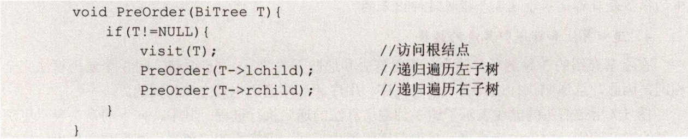  

对于图5.4所示的二叉树，先序遍历所得到的结点序列为124635。  

#### 2.中序遍历  

中序遍历（InOrder）的操作过程如下。若二叉树为空，则什么也不做；否则，  

1）中序遍历左子树;  
2）访问根结点；  
3）中序遍历右子树。  

对应的递归算法如下：  

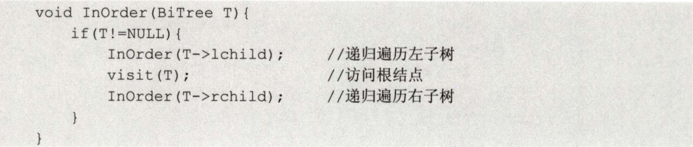  

对于图5.4所示的二叉树，中序遍历所得到的结点序列为264135。  

#### 3．后序遍历  

后序遍历（PostOrder）的操作过程如下。若二叉树为空，则什么也不做；否则，  

1）后序遍历左子树；  
2）后序遍历右子树；  
3）访问根结点。  

对应的递归算法如下：  

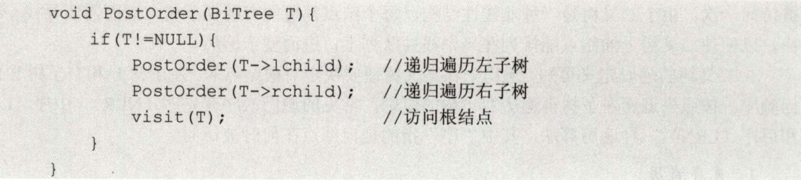  

对于图5.4所示的二叉树，后序遍历所得到的结点序列为 $642531$ 。  

三种遍历算法中，递归遍历左、右子树的顺序都是固定的，只是访问根结点的顺序不同。不管采用哪种遍历算法，每个结点都访问一次且仅访问一次，故时间复杂度都是 $O(n)$ 。在递归遍历中，递归工作栈的栈深恰好为树的深度，所以在最坏情况下，二叉树是有 $n$ 个结点且深度为 $n$ 的单支树，遍历算法的空间复杂度为 $O(n)$ 0  

注意：以上三种遍历方式及算法描述是简单易懂的，读者需要将它们作为模板来记忆，考研中的很多题目都是基于这3个模板延伸出来的。  

#### 4.递归算法和非递归算法的转换  

在上节介绍的3种遍历算法中，暂时抹去和递归无关的visit语句，则3个遍历算法完全相同，因此，从递归执行过程的角度看先序、中序和后序遍历也是完全相同的。  

图5.7用带箭头的虚线表示了这3种遍历算法的递归执行过程。其中，向下的箭头表示更深一层的递归调用，向上的箭头表示从递归调用退出返回；虚线旁的三角形、圆形和方形内的字符分别表示在先序、中序和后序遍历的过程中访问结点时输出的信息。例如，由于中序遍历中访问结点是在遍历左子树之后、遍历右子树之前进行的，则带圆形的字符标在向左递归返回和向右递归调用之间。由此，只要沿虚线从1出发到2结束，将沿途所见的三角形（或圆形或方形）内的字符记下，便得到遍历二叉树的先序（或中序或后序）序列。例如在图5.7中，沿虚线游走可以分别得到先序序列为 $A B D E$ C、中序序列为 $D B E A C,$ 、后序序列为 $D E B C A$ 。  

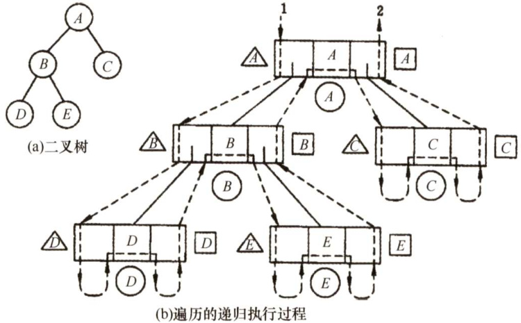  
图5.7三种遍历过程示意图  

借助栈，我们来分析中序遍历的访问过程：  

$\textcircled{1}$ 沿着根的左孩子，依次入栈，直到左孩子为空，说明已找到可以输出的结点，此时栈内元素依次为 $\textit{A B D}$ 。 $\textcircled{2}$ 栈顶元素出栈并访问：若其右孩子为空，继续执行 $\textcircled{2}$ ；若其右孩子不空，将右子树转执行 $\textcircled{1}$ 。栈顶 $D$ 出栈并访问，它是中序序列的第一个结点； $D$ 右孩子为空，栈顶 $B$ 出栈并访问； $B$ 右孩子不空，将其右孩子 $E$ 入栈， $E$ 左孩子为空，栈顶 $E$ 出栈并访问； $E$ 右孩子为空，栈顶 $A$ 出栈并访问； $A$ 右孩子不空，将其右孩子 $c$ 入栈， $c$ 左孩子为空，栈顶 $c$ 出栈并访问。由此得到中序序列 $D B E A C$ 。读者可根据上述分析画出遍历过程的出入栈示意图。  

根据分析可以写出中序遍历的非递归算法如下：  

void InOrder2（BiTree T){  
InitStack(S);BiTree $\scriptstyle{\mathfrak{p}}={\mathfrak{T}}$ ： //初始化栈S；p是遍历指针while(p||!IsEmpty（S)）{ //栈不空或p不空时循环if(p）{ //一路向左Push(S,p); //当前结点入栈p=p->lchild; //左孩子不空，一直向左走1else{ //出栈，并转向出栈结点的右子树Pop（S，p）;visit（p）；//栈顶元素出栈，访问出栈结点p=p->rchild; //向右子树走，p赋值为当前结点的右孩子//返回while循环继续进入if-else语句  

先序遍历和中序遍历的基本思想是类似的，只需把访问结点操作放在入栈操作的前面，读者可以参考中序遍历的过程说明自行模拟出入栈示意图。先序遍历的非递归算法如下：  

void PreOrder2(BiTreeT){  
InitStack（S);BiTree $\scriptstyle{\mathtt{p}}={\mathtt{T}}$ . //初始化栈S；p是遍历指针while（p||!IsEmpty（S））{ //栈不空或p不空时循环if（p）{ //一路向左visit（p）;Push（S，p）;//访问当前结点，并入栈  

<html><body><table><tr><td>p=p->lchild; else{ Pop(S,p); p=p->rchild;</td><td>//左孩子不空，一直向左走 //出栈，并转向出栈结点的右子树</td></tr></table></body></html>  

后序遍历的非递归实现是三种遍历方法中最难的。因为在后序遍历中，要保证左孩子和右孩子都已被访问并且左孩子在右孩子前访问才能访问根结点，这就为流程的控制带来了难题。  

后序非递归遍历算法的思路分析：从根结点开始，将其入栈，然后沿其左子树一直往下搜索，直到搜索到没有左孩子的结点，但是此时不能出栈并访问，因为如果其有右子树，还需按相同的规则对其右子树进行处理。直至上述操作进行不下去，若栈顶元素想要出栈被访问，要么右子树为空，要么右子树刚被访问完（此时左子树早已访问完)，这样就保证了正确的访问顺序。  

后序遍历的非递归算法见本节综合题03的解析部分。  

按后序非递归算法遍历图5.7(a)中的二叉树，当访问到 $E$ 时， $A,B,D$ 都已入过栈，对于后序非递归遍历，当一个结点的左右子树都被访问后才会出栈，图中 $D$ 已出栈，此时栈内还有 $A$ 和 $B$ 这是 $E$ 的全部祖先。实际上，访问一个结点p时，栈中结点恰好是p结点的所有祖先，从栈底到栈顶结点再加上p结点，刚好构成从根结点到p结点的一条路径。在很多算法设计中都可以利用这一思路来求解，如求根到某结点的路径、求两个结点的最近公共祖先等。  

#### 5.层次遍历  

图5.8所示为二叉树的层次遍历，即按照箭头所指方向，按照1,2,3,4的层次顺序，对二叉树中的各个结点进行访问。  

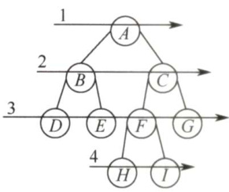  

要进行层次遍历，需要借助一个队列。先将二叉树根结点入队，然后出队，访问出队结点，若它有左子树，则将左子树根结点入队；若它有右子树，则将右子树根结点入队。然后出队，访问出队结点…·如此反复，直至队列为空。  

二叉树的层次遍历算法如下：  

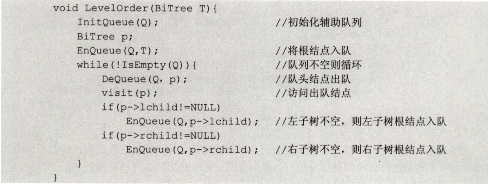  
图5.8二叉树的层次遍历  

上述二叉树层次遍历的算法，读者在复习过程中应将其作为一个模板，在熟练掌握其执行过程的基础上来记忆，并达到熟练手写的程度。这样才能将层次遍历模板应用于各种题目之中。  

注意：遍历是二叉树各种操作的基础，可以在遍历的过程中对结点进行各种操作，例如，对于一棵已知树求结点的双亲、求结点的孩子结点、求二叉树的深度、求二叉树的叶子结点个数、判断两棵二叉树是否相同等。所有这些操作都建立在二叉树遍历的基础上，因此必须掌握二叉树的各种遍历过程，并能灵活运用以解决各种问题。  

#### 6．由遍历序列构造二叉树  

由二叉树的先序序列和中序序列可以唯一地确定一棵二叉树。  

在先序遍历序列中，第一个结点一定是二叉树的根结点；而在中序遍历中，根结点必然将中序序列分割成两个子序列，前一个子序列是根结点的左子树的中序序列，后一个子序列是根结点的右子树的中序序列。根据这两个子序列，在先序序列中找到对应的左子序列和右子序列。在先序序列中，左子序列的第一个结点是左子树的根结点，右子序列的第一个结点是右子树的根结点。如此递归地进行下去，便能唯一地确定这棵二叉树。  

同理，由二叉树的后序序列和中序序列也可以唯一地确定一棵二叉树。  

因为后序序列的最后一个结点就如同先序序列的第一个结点，可以将中序序列分割成两个子序列，然后采用类似的方法递归地进行划分，进而得到一棵二叉树。  

由二叉树的层序序列和中序序列也可以唯一地确定一棵二叉树，实现方法留给读者思考。需要注意的是，若只知道二叉树的先序序列和后序序列，则无法唯一确定一棵二叉树。  

例如，求先序序列（ABCDEFGHI）和中序序列（BCAEDGHFI）所确定的二叉树。  

首先，由先序序列可知 $A$ 为二叉树的根结点。中序序列中 $A$ 之前的 $B C$ 为左子树的中序序列，EDGHFI为右子树的中序序列。然后由先序序列可知 $B$ 是左子树的根结点， $D$ 是右子树的根结点。以此类推，就能将剩下的结点继续分解下去，最后得到的二叉树如图5.9(c)所示。  

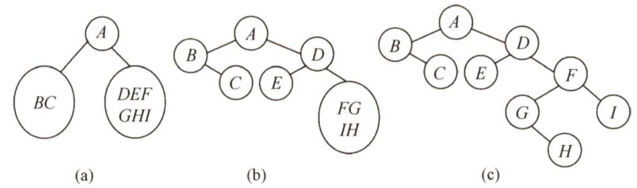  
图5.9一棵二叉树的构造过程  

#### 5.3.2 线索二叉树  

#### 1．线索二叉树的基本概念  

遍历二叉树是以一定的规则将二叉树中的结点排列成一个线性序列，从而得到几种遍历序列，使得该序列中的每个结点（第一个和最后一个结点除外）都有一个直接前驱和直接后继。  

传统的二叉链表存储仅能体现一种父子关系，不能直接得到结点在遍历中的前驱或后继。前面提到，在含 $n$ 个结点的二叉树中，有 $\boldsymbol{n}+\boldsymbol{1}$ 个空指针。这是因为每个叶结点有2个空指针，每个度为1的结点有1个空指针，空指针总数为 $2n_{0}+n_{1}$ ，又 $n_{0}=n_{2}+1$ ，所以空指针总数为 $n_{0}+n_{1}+$ $n_{2}+1=n+1$ 。由此设想能否利用这些空指针来存放指向其前驱或后继的指针？这样就可以像遍历单链表那样方便地遍历二叉树。引入线索二叉树正是为了加快查找结点前驱和后继的速度。  

规定：若无左子树，令lchild指向其前驱结点；若无右子树，令rchild指向其后继结点。如图5.10所示，还需增加两个标志域标识指针域是指向左（右）孩子还是指向前驱（后继)。  

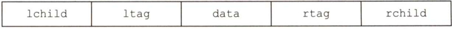  
图5.10线索二叉树的结点结构  

其中，标志域的含义如下：  

线索二叉树的存储结构描述如下：  

typedef struct ThreadNode{ElemType data; //数据元素struct ThreadNode \*lchild,\*rchild; //左、右孩子指针int ltag,rtag; //左、右线索标志  
jThreadNode,\*ThreadTree;  

以这种结点结构构成的二叉链表作为二叉树的存储结构，称为线索链表，其中指向结点前驱和后继的指针称为线索。加上线索的二叉树称为线索二叉树。  

#### 2.中序线索二叉树的构造  

二叉树的线索化是将二叉链表中的空指针改为指向前驱或后继的线索。而前驱或后继的信息只有在遍历时才能得到，因此线索化的实质就是遍历一次二叉树。  

以中序线索二叉树的建立为例。附设指针 pre 指向刚刚访问过的结点，指针p指向正在访问的结点，即pre 指向p的前驱。在中序遍历的过程中，检查 $\mathtt{p}$ 的左指针是否为空，若为空就将它指向pre；检查pre 的右指针是否为空，若为空就将它指向p，如图5.11所示。  

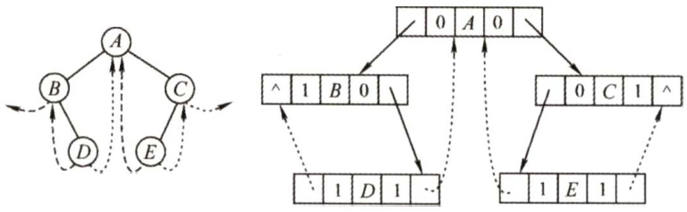  
图5.11中序线索二叉树及其二叉链表示  

通过中序遍历对二叉树线索化的递归算法如下：  

通过中序遍历建立中序线索二叉树的主过程算法如下：  

voidCreateInThread（ThreadTreeT){  

ThreadTreepre $\c=$ NULL;  
if（T!=NULL){ //非空二叉树，线索化InThread(T,pre); //线索化二叉树pre->rchild $\L=$ NULL; //处理遍历的最后一个结点pre->rtag $=1$ ，  

为了方便，可以在二叉树的线索链表上也添加一个头结点，令其lchild域的指针指向二叉树的根结点，其rchild域的指针指向中序遍历时访问的最后一个结点；令二叉树中序序列中的第一个结点的lchild域指针和最后一个结点的rchild域指针均指向头结点。这好比为二叉树建立了一个双向线索链表，方便从前往后或从后往前对线索二叉树进行遍历，如图5.12所示。  

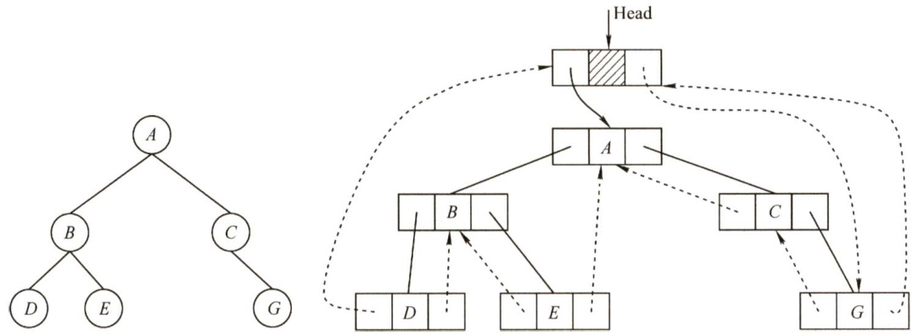  
图5.12带头结点的中序线索二叉树  

#### 3．中序线索二叉树的遍历  

中序线索二叉树的结点中隐含了线索二叉树的前驱和后继信息。在对其进行遍历时，只要先找到序列中的第一个结点，然后依次找结点的后继，直至其后继为空。在中序线索二叉树中找结点后继的规律是：若其右标志为“1”，则右链为线索，指示其后继，否则遍历右子树中第一个访问的结点（右子树中最左下的结点）为其后继。不含头结点的线索二叉树的遍历算法如下。  

1）求中序线索二叉树中中序序列下的第一个结点：  

ThreadNode \*Firstnode(ThreadNode $\star_{\mathrm{{p}}}$ ）{while（p->ltag==0）p=p->lchild;//最左下结点（不一定是叶结点）return p;  

2）求中序线索二叉树中结点p在中序序列下的后继：  

ThreadNode \*Nextnode(ThreadNode $\star_{\mathrm{{p}}}$ Hif(p->rtag $==0$ ）return Firstnode(p->rchild);else return p->rchild;//rtag $\scriptstyle\mathbf{\bar{\rho}}==1$ 直接返回后继线索请读者自行分析并完成求中序线索二叉树的最后一个结点和结点p前驱的运算。  

3）利用上面两个算法，可以写出不含头结点的中序线索二叉树的中序遍历的算法：  

void Inorder(ThreadNode $\star\mathbb{T}$ { for(ThreadNode $+_{p}=$ Firstnode(T); $p!=$ NULL; $\scriptstyle{\mathrm{p}}=$ Nextnode(p)) visit(p);   
1  

#### 4。先序线索二叉树和后序线索二叉树  

上面给出了建立中序线索二叉树的代码，建立先序线索二叉树和后序线索二叉树的代码类似，只需变动线索化改造的代码段与调用线索化左右子树递归函数的位置。  

以图5.13(a)的二叉树为例给出手动求先序线索二叉树的过程：先序序列为 $A B C D F$ ，然后依次判断每个结点的左右链域，如果为空则将其改造为线索。结点 $A,B$ 均有左右孩子；结点 $c$ 无左孩子，将左链域指向前驱 $B$ ，无右孩子，将右链域指向后继 $D$ ；结点 $D$ 无左孩子，将左链域指向前驱 $c$ ，无右孩子，将右链域指向后继 $F$ ；结点 $F$ 无左孩子，将左链域指向前驱 $D$ ，无右孩子，也无后继故置空，得到的先序线索二叉树如图5.13(b)所示。求后序线索二叉树的过程：后序序列为 $C D B F A$ ，结点 $c$ 无左孩子，也无前驱故置空，无右孩子，将右链域指向后继 $D$ ；结点 $D$ 无左孩子，将左链域指向前驱 $c$ ，无右孩子，将右链域指向后继 $B$ ；结点 $F$ 无左孩子，将左链域指向前驱 $B$ ，无右孩子，将右链域指向后继 $A$ ，得到的后序线索二叉树如图5.13(c)所示。  

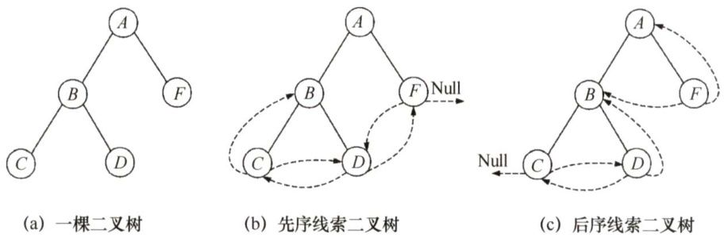  
图5.13先序线索二叉树和后序线索二叉树  

如何在先序线索二叉树中找结点的后继？如果有左孩子，则左孩子就是其后继；如果无左孩子但有右孩子，则右孩子就是其后继；如果为叶结点，则右链域直接指示了结点的后继。  

在后序线索二叉树中找结点的后继较为复杂，可分3种情况： $\textcircled{1}$ 若结点 $x$ 是二叉树的根，则其后继为空； $\textcircled{2}$ 若结点 $x$ 是其双亲的右孩子，或是其双亲的左孩子且其双亲没有右子树，则其后继即为双亲； $\textcircled{3}$ 若结点 $x$ 是其双亲的左孩子，且其双亲有右子树，则其后继为双亲的右子树上按后序遍历列出的第一个结点。图5.13(c)中找结点 $B$ 的后继无法通过链域找到，可见在后序线索二叉树上找后继时需知道结点双亲，即需采用带标志域的三叉链表作为存储结构。  

#### 5.3.3 本节试题精选  

#### 一、单项选择题  

01．在下列关于二叉树遍历的说法中，正确的是（）。  

A．若有一个结点是二叉树中某个子树的中序遍历结果序列的最后一个结点，则它一定是该子树的前序遍历结果序列的最后一个结点  
B．若有一个结点是二叉树中某个子树的前序遍历结果序列的最后一个结点，则它一定是该子树的中序遍历结果序列的最后一个结点  
C．若有一个叶子结点是二叉树中某个子树的中序遍历结果序列的最后一个结点，则它一定是该子树的前序遍历结果序列的最后一个结点  
D．若有一个叶子结点是二叉树中某个子树的前序遍历结果序列的最后一个结点，则它一定是该子树的中序遍历结果序列的最后一个结点  

02．在任何一棵二叉树中，若结点 $\mathbf{\Delta}_{a}$ 有左孩子b、右孩子 $\mid c\mid$ ，则在结点的先序序列、中序序列、后序序列中，（）。  

A.结点 $b$ 一定在结点 $a$ 的前面 B.结点 $a$ 一定在结点 $\boldsymbol{c}$ 的前面C.结点 $b$ 一定在结点 $\mid c\mid$ 的前面 D.结点 $a$ 一定在结点 $b$ 的前面  

03.设 $n,m$ 为一棵二叉树上的两个结点，在中序遍历时， $n$ 在 $m$ 前的条件是（）。  

A. $n$ 在 $m$ 右方 B. $n$ 是 $m$ 祖先 C. $n$ 在 $m$ 左方 D. $n$ 是 $m$ 子孙  

D4.设 $n,m$ 为一棵二叉树上的两个结点，在后序遍历时， $n$ 在 $m$ 前的条件是（）。  

A. $n$ 在 $m$ 右方 B. $n$ 是 $m$ 祖先 C. $n$ 在 $m$ 左方 D. $n$ 是 $m$ 子孙  

05.在二叉树中有两个结点 $m$ 和 $n$ ，若 $m$ 是 $n$ 的祖先，则使用（）可以找到从 $m$ 到 $n$ 的路径。  

A.先序遍历 B.中序遍历 C．后序遍历 D．层次遍历  

6．在二叉树的前序序列、中序序列和后序序列中，所有叶子结点的先后顺序（）  

A．都不相同 B．完全相同C．前序和中序相同，而与后序不同 D．中序和后序相同，而与前序不同  

07.对二叉树的结点从1开始进行连续编号，要求每个结点的编号大于其左、右孩子的编号，同一结点的左、右孩子中，其左孩子的编号小于其右孩子的编号，可采用（）次序的遍历实现编号。  

A.先序遍历 B．中序遍历 C．后序遍历 D.层次遍历  

08.前序为 $A,B,C$ ，后序为 $\mathbf{\delta}_{C,B,A}$ 的二叉树共有（）。  

A.1棵 B.2棵 C.3棵 D.4棵  

09．一棵非空的二叉树的先序遍历序列与后序遍历序列正好相反，则该二叉树一定满足（）。  

A.所有的结点均无左孩子 B.所有的结点均无右孩子C.只有一个叶结点 D.是任意一棵二叉树  

10.设结点 $X$ 和 $Y$ 是二叉树中任意的两个结点。在该二叉树的先序遍历序列中 $X$ 在 $Y$ 之前，而在其后序遍历序列中 $X$ 在 $Y$ 之后，则 $X$ 和Y的关系是（）。  

A. $X$ 是Y的左兄弟 B. $X$ 是Y的右兄弟C. $X$ 是 $Y$ 的祖先 D. $X$ 是Y的后裔  

11.若二叉树中结点的先序序列是 $\dots a\dots b\dots$ ，中序序列是...b...a..，则（）。  

A.结点 $\boldsymbol{a}$ 和结点 $b$ 分别在某结点的左子树和右子树中  
B.结点 $b$ 在结点 $a$ 的右子树中  
C.结点 $b$ 在结点 $a$ 的左子树中  
D.结点 $a$ 和结点 $b$ 分别在某结点的两棵非空子树中  

12.一棵二叉树的前序遍历序列为1234567，它的中序遍历序列可能是（）。  

A.3124567 B.1234567 C.4135627 D.1463572  

13.下列序列中，不能唯一地确定一棵二叉树的是（）。  

A．层次序列和中序序列 B．先序序列和中序序列 C．后序序列和中序序列 D．先序序列和后序序列  

14.已知一棵二叉树的后序序列为DABEC，中序序列为DEBAC，则先序序列为（）  

A.ACBED B.DECAB C. DEABC D. CEDBA  

15.已知一棵二叉树的先序遍历结果为ABCDEF，中序遍历结果为CBAEDF，则后序遍历的结果为（）。  

A.CBEFDA B.FEDCBA C. CBEDFA D.不确定  

16.已知一棵二叉树的层次序列为ABCDEF，中序序列为BADCFE，则先序序列为（）  

A.ACBEDF B.ABCDEF C.BDFECA D.FCEDBA  

17.引入线索二叉树的目的是（）。  

A．加快查找结点的前驱或后继的速度B．为了能在二叉树中方便插入和删除C.为了能方便找到双亲 D.使二叉树的遍历结果唯一  

18.线索二叉树是一种（）结构。  

A．逻辑 B.逻辑和存储 C.物理 D.线性  

19. $n$ 个结点的线索二叉树上含有的线索数为（）。  

A.2n B.n-1 C. $^{n+1}$ D.n  

20.判断线索二叉树中 $^{\star}\mathrm{p}$ 结点有右孩子结点的条件是（）。  

A.p! $\c=$ NULL B.p->rchild! $\c=$ NULL C.p->rtag $\scriptstyle==0$ D.p->rtag $\scriptstyle==1$  

21．一棵左子树为空的二叉树在先序线索化后，其中空的链域的个数是（）。  

A．不确定 B.0个 C.1个 D.2个  

22.在线索二叉树中，下列说法不正确的是（）。  

A．在中序线索树中，若某结点有右孩子，则其后继结点是它的右子树的最左下结点B．在中序线索树中，若某结点有左孩子，则其前驱结点是它的左子树的最右下结点C．线索二叉树是利用二叉树的 $n+1$ 个空指针来存放结点的前驱和后继信息的D.每个结点通过线索都可以直接找到它的前驱和后继  

23．二叉树在线索化后，仍不能有效求解的问题是（）。  

A.先序线索二叉树中求先序后继 B．中序线索二叉树中求中序后继 C．中序线索二叉树中求中序前驱 D.后序线索二叉树中求后序后继  

24.若 $X$ 是二叉中序线索树中一个有左孩子的结点，且 $X$ 不为根，则 $X$ 的前驱为（）  

A. $X$ 的双亲 B. $X$ 的右子树中最左的结点C. $X$ 的左子树中最右的结点 D. $X$ 的左子树中最右的叶结点  

25.（）的遍历仍需要栈的支持。  

A．前序线索树 B．中序线索树 C．后序线索树 D．所有线索树  

26．某二叉树的先序序列和后序序列正好相反，则该二叉树一定是（）。  

A.空或只有一个结点 B.高度等于其结点数C.任一结点无左孩子 D.任一结点无右孩子  

27.【2009统考真题】给定二叉树如右图所示。设N代表二叉树的根，L代表根结点的左子树，R代表根结点的右子树。若遍历后的结点序列是3175624，则其遍历方式是（）。  

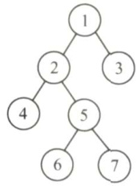  

A. LRN B.NRL C.RLN D. RNL  

28.【2010统考真题】下列线索二叉树中（用虚线表示线索），符合后序线索树定义的是（）。  

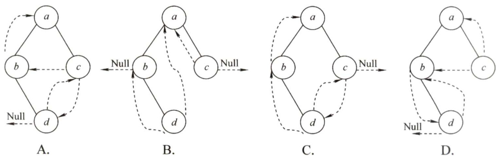  

29.【2011统考真题】一棵二叉树的前序遍历序列和后序遍历序列分别为1,2,3,4和4,3,2,1，该二叉树的中序遍历序列不会是（）。  

A.1,2,3,4 B.2,3,4,1 C. 3,2,4, 1 D.4,3,2,1  

30.【2012统考真题】若一棵二叉树的前序遍历序列为 $a,e,b,d,c$ ，后序遍历序列为 $b,c,d,e_{\ast}$ $a$ ，则根结点的孩子结点（）。  

A.只有 $e$ B.有e、b C.有 $e$ ： $\mathbf{\Psi}_{c}$ D.无法确定  

31.【2013统考真题】若 $X$ 是后序线索二叉树中的叶结点，且 $X$ 存在左兄弟结点Y，则 $X$ 的右线索指向的是（）。  

A. $X$ 的父结点 B.以 $Y$ 为根的子树的最左下结点C. $X$ 的左兄弟结点 $Y$ D.以 $Y$ 为根的子树的最右下结点  

32.【2014统考真题】若对右图所示的二叉树进行中序线索化，则结点 $X$ 的左、右线索指向的结点分别是（）。  

A. e,c B. e,a C. d, c D. $b,a$  

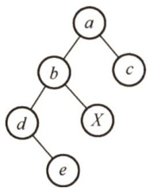  

33.【2015统考真题】先序序列为 $a,b,c,d$ 的不同二叉树的个数是（）。  

A.13 B.14   
C.15 D. 16  

34.【2017统考真题】某二叉树的树形如右图所示，其后序序列为 $e,a,c,b,d,$ $g,f,$ 树中与结点 $a$ 同层的结点是（）。  

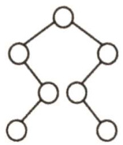  

A. $\boldsymbol{c}$ B.d C. $f$ D.g  

35.【2017统考真题】要使一棵非空二叉树的先序序列与中序序列相同，其所有非叶结点须满足的条件是（）。  

A．只有左子树 B．只有右子树C.结点的度均为1 D.结点的度均为2  

#### 二、综合应用题  

01．若某非空二叉树的先序序列和后序序列正好相反，则该二叉树的形态是什么？  

02．若某非空二叉树的先序序列和后序序列正好相同，则该二叉树的形态是什么？  

03.编写后序遍历二叉树的非递归算法。  

04.试给出二叉树的自下而上、从右到左的层次遍历算法。  

05.假设二叉树采用二叉链表存储结构，设计一个非递归算法求二叉树的高度。  

06.设一棵二叉树中各结点的值互不相同，其先序遍历序列和中序遍历序列分别存于两个一维数组A[1...n]和B[1...n]中，试编写算法建立该二叉树的二叉链表。  

07．二叉树按二叉链表形式存储，写一个判别给定二叉树是否是完全二叉树的算法。  

08．假设二叉树采用二叉链表存储结构存储，试设计一个算法，计算一棵给定二叉树的所有双分支结点个数。  

09.设树 $B$ 是一棵采用链式结构存储的二叉树，编写一个把树 $B$ 中所有结点的左、右子树进行交换的函数。  

10．假设二叉树采用二叉链存储结构存储，设计一个算法，求先序遍历序列中第 $k$ （ $1\leq k\leq$ 二叉树中结点个数）个结点的值。  

11.已知二叉树以二叉链表存储，编写算法完成：对于树中每个元素值为X的结点，删去以它为根的子树，并释放相应的空间。  

12.在二叉树中查找值为 $\mathrm{~\bf~x~}$ 的结点，试编写算法（用C语言）打印值为×的结点的所有祖 先，假设值为X的结点不多于一个。  

13.设一棵二叉树的结点结构为(LLINK,INFO,RLINK)，ROOT为指向该二叉树根结点的指针，P和q分别为指向该二叉树中任意两个结点的指针，试编写算法ANCESTOR(ROOT,p,q,r)，找到p和q的最近公共祖先结点r。  

14.假设二叉树采用二叉链表存储结构，设计一个算法，求非空二叉树 $b$ 的宽度（即具有结点数最多的那一层的结点个数）。  

15.设有一棵满二叉树（所有结点值均不同），已知其先序序列为pre，设计一个算法求其后序序列post。  

16.设计一个算法将二叉树的叶结点按从左到右的顺序连成一个单链表，表头指针为head。二叉树按二叉链表方式存储，链接时用叶结点的右指针域来存放单链表指针。  

17．试设计判断两棵二叉树是否相似的算法。所谓二叉树 $T_{1}$ 和 $T_{2}$ 相似，指的是 $T_{1}$ 和 $T_{2}$ 都是空的二叉树或都只有一个根结点；或 $T_{1}$ 的左子树和 $T_{2}$ 的左子树是相似的，且 $T_{1}$ 的右子树和 $T_{2}$ 的右子树是相似的。  

18.写出在中序线索二叉树里查找指定结点在后序的前驱结点的算法。  

19.【2014统考真题】二叉树的带权路径长度（WPL）是二叉树中所有叶结点的带权路径长度之和。给定一棵二叉树T，采用二叉链表存储，结点结构为  

<html><body><table><tr><td>left</td><td>weight</td><td>right</td></tr></table></body></html>  

其中叶结点的weight域保存该结点的非负权值。设root为指向 $T$ 的根结点的指针，请设计求 $T$ 的WPL的算法，要求：  

1）给出算法的基本设计思想。  
2）使用C或 $\mathbf{C}{+}{+}$ 语言，给出二叉树结点的数据类型定义。  
3）根据设计思想，采用C或 $\scriptstyle{\mathrm{C}}++$ 语言描述算法，关键之处给出注释。  

20.【2017统考真题】请设计一个算法，将给定的表达式树（二叉树）转换为等价的中缀表达式（通过括号反映操作符的计算次序）并输出。例如，当下列两棵表达式树作为算法的输入时：  

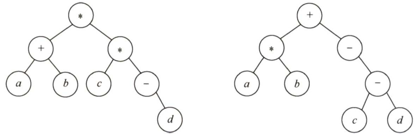  

输出的等价中缀表达式分别为 $a+b$ )\* $\subset^{\star}$ (-d))和 $(a+b)+(-(c-d))$ 。二叉树结点定义如下：  

typedef struct node{ char data[10]; //存储操作数或操作符 struct node \*left,\*right;   
JBTree;  

要求：  

1）给出算法的基本设计思想。  
2）根据设计思想，采用C或 $\mathrm{C}{+}{+}$ 语言描述算法，关键之处给出注释。  

#### 5.3.4 答案与解析  

#### 一、单项选择题  

01.C  

二叉树中序遍历的最后一个结点一定是从根开始沿右子女指针链走到底的结点，设用 $p$ 指示。若结点 $p$ 不是叶子结点（其左子树非空)，则前序遍历的最后一个结点在它的左子树中，A、B错;若结点 $p$ 是叶子结点，则前序与中序遍历的最后一个结点就是它，C正确。若中序遍历的最后一个结点 $p$ 不是叶子结点，它还有一个左子女 $q$ ，结点 $q$ 是叶子结点，那么结点 $q$ 是前序遍历的最后一个结点，但不是中序遍历的最后一个结点，D错。  

02.C  

这三种遍历方式中，无论哪种遍历方式，都先遍历左子树，再遍历右子树，所以结点 $b$ 一定在结点 $\mathbf{\Psi}_{c}$ 的前面访问。  

03.C  

中序遍历时，先访问左子树，再访问根结点，后访问右子树。 $n$ 在 $m$ 前的3种可能性如左图  

所示，从中看出 $n$ 总是在 $m$ 的左方。  

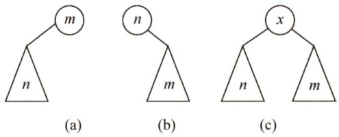  

【另解】设 $n$ 和 $m$ 的最近公共祖先 $p$ ，则有以下可能：情形1， $m$ 和 $n$ 分别在 $p$ 的左、右（右、左）分支上；  
情形2， $m$ 或 $n$ 为 $p$ 结点，另一结点在 $p$ 的分支上。只有  
$n$ 和 $m$ 分别处于 $p$ 的左、右分支上， $m$ 为祖先结点且 $n$  

位于 $m$ 的左分支， $n$ 为祖先结点且 $m$ 位于 $n$ 的右分支，符合题意。  

04.D  

后序遍历的顺序是LRN，若 $n$ 在N的左子树， $m$ 在N的右子树，则在后序遍历的过程中 $n$ 在 $\mathbf{\nabla}_{m}$ 之前访问；若 $n$ 是 $m$ 的子孙，设 $m$ 在 $\mathrm{~\boldmath~N~}$ 的位置，则 $n$ 无论是在 $m$ 的左子树还是在右子树，在后序遍历的过程中 $n$ 都在 $m$ 之前访问。其他都不可以。C要成立，要加上两个结点位于同一层。  

05.C  

在后序遍历退回时访问根结点，就可以从下向上把从 $n$ 到 $m$ 的路径上的结点输出，若采用非递归的算法，则当后序遍历访问到 $n$ 时，栈中把从根到 $n$ 的父指针的路径上的结点都记忆下来，也可以找到从 $m$ 到 $n$ 的路径。  

06.B  

在三种遍历方式中，访问左右子树的先后顺序是不变的，只是访问根结点的顺序不同，因此叶子结点的先后顺序完全相同。此外，读者可以采用特殊值法，画一个结点数为3的满二叉树，采用三种遍历方式来验证答案的正确性。  

07.C  

对每个顶点从1开始按序编号，要求结点编号大于其左、右孩子编号，并且左孩子编号小于右孩子编号。编号越大说明遍历顺序越靠后，因此，三者遍历顺序为先左子树、再右子树、后根  

结点，4个选项中仅后序遍历满足要求。  

08.D  

前序为 $A$ ， $B$ ， $c$ 的不同二叉树共有5种，其中后序为 $\textstyle C,$ $B$ ， $A$ 的有4种(前4种)，都是单支树，如下图所示。  

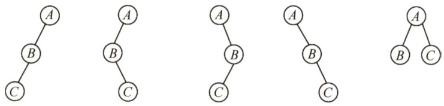  

09.C  

非空树的先序序列和后序序列相反，即“根左右”与“左右根”顺序相反，因此树只有根结点，或者根结点只有左子树或右子树，以此类推，其子树有同样的性质。因此，树中所有非叶结点的度均为1，即二叉树仅有一个叶结点。  

10.C  

设二叉树的前序遍历顺序为NLR，后序遍历顺序为LRN。根据题意，在前序遍历序列中 $X$ 在Y之前，在后序遍历序列中 $X$ 在 $Y$ 之后，若设 $X$ 在根结点的位置，Y在其左子树或右子树中，即满足要求。  

11.C  

先序序列是…a…b…,因此a和b结点的3种情况如下图(a)\~(c)所示。中序序列是ba…，因此 $a$ 和 $b$ 结点的3种情况如下图(d) $\sim$ (f所示，相同部分是 $b$ 在 $a$ 的左子树中。  

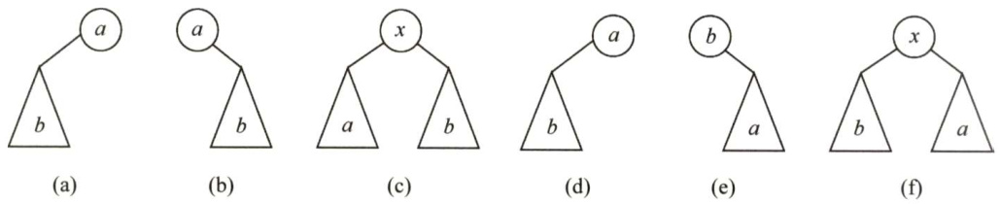  

12.B  

由题可知，1为根结点，2为1的孩子。对于选项A，3应为1的左孩子，前序序列应为 $13\cdots$ 不符。类似的选项C也错误。对于选项B，2为1的右孩子，3为2的右孩子…，满足题意。对于选项D，463572应为1的右子树，2为1的右孩子，46357为2的左子树，3为2的左孩子，46为3的左子树，57为3的右子树，前序序列4、6应相连，5、7应相连，不符。  

解法 2：前序遍历时需要借助栈。二叉树的前序序列和中序序列的关系相当于以前序序列作为入栈次序，以中序序列作为出栈次序。题中以1234567入栈；选项A，第一个出栈的是3，故1不可能在2之前出栈，错误。选项C，1不可能在3之前出栈，错误。选项D，6第三个出栈，此时栈顶元素是5，不是3，错误。故选B。  

解法3：因前序序列和中序序列可以确定一棵二叉树，所以可试着用题目中的序列构造出相应的二叉树，即可得知，只有选项B的序列可以构造出二叉树。  

13.D  

先序序列为NLR，后序序列为LRN，虽然可以唯一确定树的根结点，但无法划分左、右子树。例如，先序序列为 $A B$ ，后序序列为 $B A$ ，则其对应的二叉树如右图所示。  

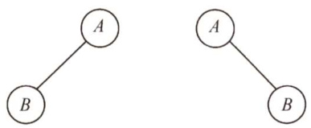  

14.D  

根据后序序列与中序序列可构造出二叉树，如下图所示。由图可知先序序列为CEDBA。  

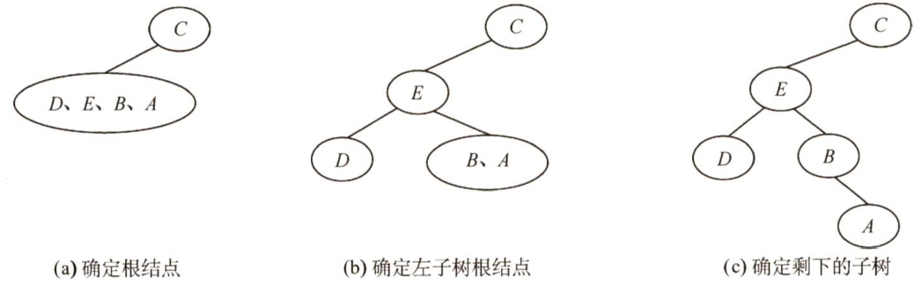  

15.A  

对于这种遍历序列问题，先根据遍历的性质排除若干项，若还无法确定答案，则再根据遍历结果得到二叉树，找到对应遍历序列。例如，在本题中，已知先序和中序遍历结果，可知本树的根结点为 $A$ ，左子树有 $c$ 和 $B$ ，其余为右子树，则后序遍历结果中， $A$ 一定在最后，并且 $c$ 和 $B$ 一定在前面，排除答案B和D。又因先序中有 $D E F$ ，中序中有 $E D F$ ，则 $D$ 为这个子树的根，所以 $D$ 在后序中排在 $E F$ 之后，故答案为A。  

根据二叉树的递归定义，要确定二叉树，就要分别找到根结点和左、右子树。因此，根据遍历结果，必定要确定根结点位置和如何划分左、右子树，才可以确定最终的二叉树。故仅有先序和后序遍历不能唯一确定一棵二叉树，而二者之一加上中序遍历都可以唯一确定一棵二叉树。如在本题中，根据先序和中序遍历的结果确定二叉树的过程如下图所示。  

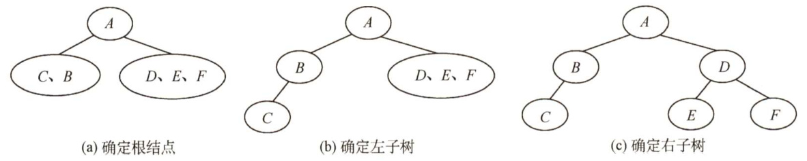  

16.B  

可构造出二叉树如下图所示。因此，先序序列为 $A B C D E F$ 0  

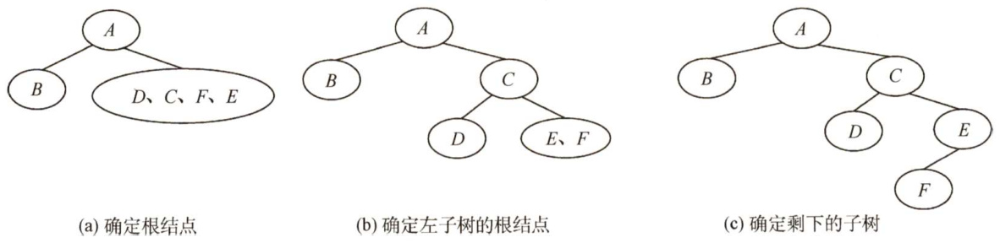  

17.A线索是前驱结点和后继结点的指针，引入线索的目的是加快对二叉树的遍历。  

18.C  

二叉树是一种逻辑结构，但线索二叉树是加上线索后的链表结构，即它是二叉树在计算机内部的一种存储结构，所以是一种物理结构。  

19.C  

$n$ 个结点共有链域指针 $2n$ 个，其中，除根结点外，每个结点都被一个指针指向。剩余的链域建立线索，共 $2n-(n-1)=n+1$ 个线索。  

20.C  

线索二叉树中用ltag/rtag 标识结点的左/右指针域是否为线索，其值为1时，对应指针域为线索，其值为0时，对应指针域为左/右孩子。  

21.D  

对左子树为空的二叉树进行先序线索化，根结点的左子树为空并且也没有前驱结点（先遍历根结点)，先序遍历的最后一个元素为叶结点，左、右子树均为空且有前驱无后继结点，故线索化后，树中空链域有2个。  

22.D  

不是每个结点通过线索都可以直接找到它的前驱和后继。在先序线索二叉树中查找一个结点的先序后继很简单，而查找先序前驱必须知道该结点的双亲结点。同样，在后序线索二叉树中查找一个结点的后序前驱也很简单，而查找后序后继也必须知道该结点的双亲结点，二叉链表中没有存放双亲的指针。  

23.D  

后序线索二叉树不能有效解决求后序后继的问题。如右图所示，结点 $E$ 的右指针指向右孩子，而在后序序列中 $E$ 的后继结点为 $B$ ，在查找 $\boldsymbol{E}$ 的后继时后序线索不能起到任何作用，只能按常规方法来查找。  

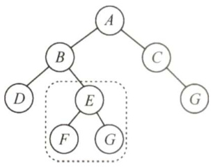  

24.C  

在二叉中序线索树中，某结点若有左孩子，则按照中序“左根右”的顺序，该结点的前驱结点为左子树中最右的一个结点（注意，并不一定是最右叶子结点)。  

25.C  

后序线索树遍历时，最后访问根结点，若从右孩子 $x$ 返回访问父结点，则由于结点 $x$ 的右孩子不一定为空（右指针无法指向其后继)，因此通过指针可能无法遍历整棵树。如下图所示，结点中的数字表示遍历的顺序，图(c)中结点6的右指针指向其右孩子5，而不指向其后序后继结点7，因此后序遍历还需要栈的支持，而图(a)和图(b)均可遍历。  

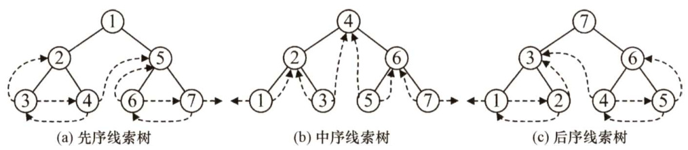  

26.B  

非空二叉树的先序序列和后序序列相反，即“根左右”与“左右根”顺序相反，因此树只有根结点，或根结点只有左子树或右子树，以此类推，其子树具有同样的性质，任意结点只有一个孩子，才能满足先序序列和后序序列正好相反。树形应为一个长链，因此选B。  

27.D  

分析遍历后的结点序列，可以看出根结点是在中间被访问的，而且右子树结点在左子树之前，则遍历的方法是RNL。本题考查的遍历方法并不是二叉树遍历的3种基本遍历方法，对于考生而言，重要的是掌握遍历的思想。  

28.D  

题中所给二叉树的后序序列为dbca。结点 $d$ 无前驱和左子树，左链域空，无右子树，右链域 指向其后继结点 $b$ ；结点 $b$ 无左子树，左链域指向其前驱结点 $d$ ；结点c无左子树，左链域指向其 前驱结点 $b$ ，无右子树，右链域指向其后继结点 $a$ 。正确选项为D。  

29.C  

前序序列为NLR，后序序列为LRN，由于前序序列和后序序列刚好相反，故不可能存在一个结点同时有左右孩子，即二叉树的高度为4。1为根结点，由于根结点只能有左孩子（或右孩子)，因此在中序序列中，1或在序列首或在序列尾，A,B,C,D皆满足要求。仅考虑以1的孩子结点2为根结点的子树，它也只能有左孩子（或右孩子)，因此在中序序列中，2或在序列首或在序列尾，A,B,D皆满足要求，故选C。  

30.A  

前序序列和后序序列不能唯一确定一棵二叉树，但可以确定二叉树中结点的祖先关系：当两个结点的前序序列为 $X Y,$ 后序序列为 $Y X$ 时，则 $X$ 为 $Y$ 的祖先。考虑前序序列 $a,e,b,d,$ $\boldsymbol{c}$ 、后序序列 $b,c,d,e,a$ ，可知 $\mathbf{\Delta}_{a}$ 为根结点， $e$ 为 $\mathbf{\Delta}_{a}$ 的孩子结点；此外，由 $\mathbf{\Delta}_{a}$ 的孩子结点的前序序列 $e,b,d,c$ 和后序序列 $b,c,d,e$ ，可知 $e$ 是bcd的祖先，故根结点的孩子结点只有 $e$ 。故选A。  

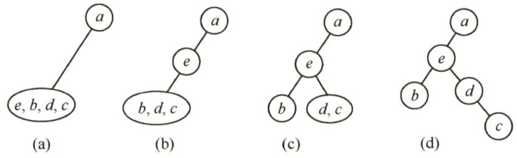  

排除法：显然 $a$ 为根结点，且确定 $e$ 为 $\boldsymbol{a}$ 的孩子结点，排除D。各种遍历算法中左右子树的遍历次序是固定的，若 $b$ 也为 $a$ 的孩子结点，则在前序序列和后序序列中 $\boldsymbol{e},\boldsymbol{b}$ 的相对次序应是不变的，故排除B，同理排除C。  

特殊法：前序序列和后序序列对应多棵不同的二叉树树形，我们只需画出满足该条件的任意一棵二叉树即可，任意一棵二叉树必定满足正确选项的要求。  

显然选A，最终得到的二叉树满足题设中前序序列和后序序列的要求。  

31.A。  

根据后序线索二叉树的定义， $X$ 结点为叶子结点且有左兄弟，因此这个结点为右孩子结点，利用后序遍历的方式可知 $X$ 结点的后序后继是其父结点，即其右线索指向的是父结点。为了更加形象，在解题的过程中可以画出如右所示的草图。  

32.D  

解析请扫右侧二维码查阅。  

33.B  

根据二叉树前序遍历和中序遍历的递归算法中递归工作栈的状态变化得出：前序序列和中序序列的关系相当于以前序序列为入栈次序，以中序序列为出栈次序。  

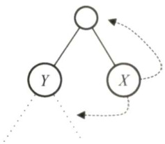  

因为前序序列和中序序列可以唯一地确定一棵二叉树，所以题意相当于“以序列 $a,b,c,d$ 为入栈次序，则出栈序列的个数为？”，对于 $n$ 个不同元素进栈，出栈序列的个数为 $\frac{1}{n+1}C_{2n}^{n}=14$  

34.B  

后序序列是先左子树，接着右子树，最后父结点，递归进行。根结点左子树的叶结点首先被访问，它是 $e$ 。接下来是它的父结点 $a$ ，然后是 $a$ 的父结点 $\scriptstyle{c}$ 。接着访问根结点的右子树。它的叶结点 $b$ 首先被访问，然后是 $b$ 的父结点 $d$ ，再后是 $d$ 的父结点 $g$ ，最后是根结点f，如右图所示。因此 $d$ 与 $a$ 同层，B正确。  

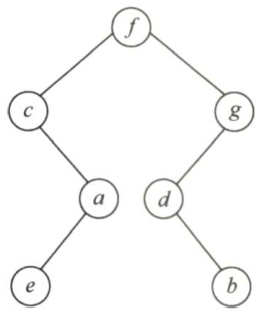  

35.B  

先序序列先父结点，接着左子树，然后右子树。中序序列先左子树，接着父结点，然后右子树，递归进行。若所有非叶结点只有右子树，则先序序列和中序序列都是先父结点，然后右子树，递归进行，因此B正确。  

#### 二、综合应用题  

01.【解答】  

二叉树的先序序列是NLR，后序序列是LRN。要使 $\mathrm{NLR}\ =\ \mathrm{NRL}$ （后序序列反序）成立，L或R应为空，这样的二叉树每层只有一个结点，即二叉树的形态是其高度等于结点个数。以3个结点 $a,b,c$ 为例，其形态如下图所示。  

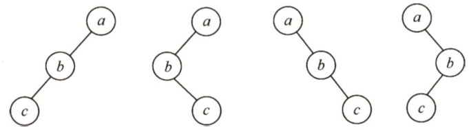  

02.【解答】  

二叉树的先序序列是NLR，后序序列是LRN。要使NLR $\c=$ LRN成立，L和R应均为空，所以满足条件的二叉树只有一个根结点。  

03.【解答】  

算法思想：后序非递归遍历二叉树是先访问左子树，再访问右子树，最后访问根结点。结合图5.7来分析： $\textcircled{1}$ 沿着根的左孩子，依次入栈，直到左孩子为空。此时栈内元素依次为 $A B D$ 。$\textcircled{2}$ 读栈顶元素：若其右孩子不空且未被访问过，将右子树转执行 $\textcircled{1}$ ；否则，栈顶元素出栈并访问。栈顶 $D$ 的右孩子为空，出栈并访问，它是后序序列的第一个结点；栈顶 $B$ 的右孩子不空且未被访问过， $E$ 入栈，栈顶 $E$ 的左右孩子均为空，出栈并访问；栈顶 $B$ 的右孩子不空但已被访问，$B$ 出栈并访问；栈顶 $A$ 的右孩子不空且未被访问过， $c$ 入栈，栈顶 $c$ 的左右孩子均为空，出栈并访问；栈顶 $A$ 的右孩子不空但已被访问， $A$ 出栈并访问。由此得到后序序列 $D E B C A$ o  

在上述思想的第 $\textcircled{2}$ 步中，必须分清返回时是从左子树返回的还是从右子树返回的，因此设定一个辅助指针 $\mathrm{~\boldmath~{~\underline{~}{~r~}~}~}$ ，指向最近访问过的结点。也可在结点中增加一个标志域，记录是否已被访问。  

注意：每次出栈访问完一个结点就相当于遍历完以该结点为根的子树，需将p置NULL。  

04.【解答】  

一般的二叉树层次遍历是自上而下、从左到右，这里的遍历顺序恰好相反。算法思想：利用原有的层次遍历算法，出队的同时将各结点指针入栈，在所有结点入栈后再从栈顶开始依次访问即为所求的算法。具体实现如下：  

1）把根结点入队列。  
2）把一个元素出队列，遍历这个元素。  
3）依次把这个元素的左孩子、右孩子入队列。  

4）若队列不空，则跳到2)，否则结束。  

算法实现如下：  

void InvertLevel(BiTree bt){Stack s; Queue Q;if(bt! $\c=$ NULL){InitStack(s); //栈初始化，栈中存放二叉树结点的指针InitQueue(Q); //队列初始化，队列中存放二叉树结点的指针EnQueue(Q,bt);while(IsEmpty(Q) $\scriptstyle==$ false){ //从上而下层次遍历DeQueue(Q,p);Push(s,p); //出队，入栈if(p->lchild)EnQueue（Q,p->lchild）；//若左子女不空，则入队列if(p->rchild)EnQueue（Q，p->rchild）；//若右子女不空，则入队列while(IsEmpty(s) $\scriptstyle==$ false){Pop(s,p);visit(p->data);//自下而上、从右到左的层次遍历}//i结束  

05.【解答】  

采用层次遍历的算法，设置变量level记录当前结点所在的层数，设置变量last 指向当前层的最右结点，每次层次遍历出队时与last 指针比较，若两者相等，则层数加1，并让last指向下一层的最右结点，直到遍历完成。level的值即为二叉树的高度。  

算法实现如下：  

int Btdepth（BiTree T){  
//采用层次遍历的非递归方法求解二叉树的高度if(!T)return 0; //树空，高度为0int front $=-1$ ,rear $=-1$ ：int last $=0$ ,level $=0$ · //last指向当前层的最右结点BiTree Q[MaxSize]; //设置队列Q，元素是二叉树结点指针且容量足够Q[++rear] $\scriptstyle=\mathtt{T}$ ： //将根结点入队BiTreep;while(front<rear){ //队不空，则循环$_{\mathrm{p}=\mathrm{Q}}$ $^{++}$ front]; //队列元素出队，即正在访问的结点if(p->lchild)Q[ $^{++}$ rear] $\scriptstyle=_{\mathrm{p}}$ ->lchild; //左孩子入队if(p->rchild)Q[++rear] $\O=$ p->rchild; //右孩子入队if(front $\scriptstyle==$ last)( //处理该层的最右结点level++; //层数增1last $\c=$ rear; //last指向下层F1return level;  

求某层的结点个数、每层的结点个数、树的最大宽度等，都采用与此题类似的思想。当然，此题可编写递归算法，其实现如下：  

int Btdepth2（BiTreeT){if $\scriptstyle\mathrm{{T==}}$ NULL)return0; //空树，高度为0ldep $\c=$ Btdepth2（T->lchild); //左子树高度rdep $\O=$ Btdepth2（T->rchild); //右子树高度if(ldep>rdep)return ldep $+1$ ： //树的高度为子树最大高度加根结点elsereturn rdep $+1$ ：  

06.【解答】  

由先序序列和中序序列可以唯一确定一棵二叉树。算法的实现步骤如下。  

1）根据先序序列确定树的根结点。  

2）根据根结点在中序序列中划分出二叉树的左、右子树包含哪些结点，然后根据左、右子树结点在先序序列中的次序确定子树的根结点，即回到步骤1)。如此重复上述步骤，直到每棵子树仅有一个结点（该子树的根结点）为止，如下图所示。  

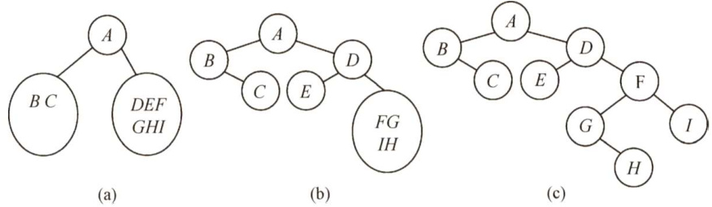  

算法实现如下：  

BiTree PreInCreat（ElemTypeA[],ElemType B[],int ll,int hl,int l2,int h2）{  
//11，h1为先序的第一和最后一个结点下标，12，h2为中序的第一和最后一个结点下标  
//初始调用时， $11=12=1$ ， $h1=h2=n$ root $\c=$ (BiTNode $\star$ )malloc（sizeof（BiTNode)); //建根结点root- $>$ data $\mathtt{\Gamma}=\mathtt{A}$ [11]; //根结点for $i=12$ ;B[i]！ $\c=$ root->data; $\dot{2}++$ ）; //根结点在中序序列中的划分llen $=\dot{2}-22$ . //左子树长度rlen $=\ln2-i$ . //右子树长度if(llen) //递归建立左子树root->lchild $\O=$ PreInCreat（A,B,l1+l,l1+llen,l2,l2+llen-1）;else //左子树为空root->lchild $\c=$ NULL;if(rlen) //递归建立右子树root->rchild $\c=$ PreInCreat（A,B,hl-rlen+l,hl,h2-rlen+l,h2);else //右子树为空root->rchild $\c=$ NULL;return root; //返回根结点指针  
)  

07.【解答】  

根据完全二叉树的定义，具有 $n$ 个结点的完全二叉树与满二叉树中编号从 $1{\sim}n$ 的结点一一对应。算法思想：采用层次遍历算法，将所有结点加入队列（包括空结点)。遇到空结点时，查看其后是否有非空结点。若有，则二叉树不是完全二叉树。  

算法实现如下：  

bool IsComplete(BiTree T){   
//本算法判断给定二叉树是否为完全二叉树 InitQueue（Q）; if(!T) return 1; //空树为满二叉树 EnQueue（Q,T）; while(!IsEmpty（Q））{ DeQueue(Q,p); if（p）{ //结点非空，将其左、右子树入队列 EnQueue(Q,p->lchild）; EnQueue(Q,p->rchild); else //结点为空，检查其后是否有非空结点 while(!IsEmpty(Q））{ DeQueue(Q,p); if(p) //结点非空，则二叉树为非完全二叉树 return 0; return 1;  

08.【解答】  

计算一棵二叉树b中所有双分支结点个数的递归模型f(b)如下：  

$\pounds(\boldsymbol{\mathrm{b}})=0$ 若 $\scriptstyle\mathrm{b=}$ NULL$\pounds\left(\ b\right)=\pounds$ (b->lchild) $+\upepsilon$ (b->rchild) $+1$ 若 $\star\mathrm{b}$ 为双分支结点$\mathbf{f}\ (\mathbf{b})=\mathbf{f}$ (b->lchild) $+\mathtt{f}$ (b->rchild) 其他情况（ $\star\mathrm{b}$ 为单分支结点或叶子结点)  

具体算法实现如下：  

int DsonNodes(BiTree b){ if $b==$ NULL) return 0; else if（b->lchild！ $\c=$ NULL&&b->rchild! $\c=$ NULL）//双分支结点 return DSonNodes $b->$ lchild) $^+$ DsonNodes(b->rchild) $+1$ else return DSonNodes(b->lchild) $^+$ DsonNodes(b->rchild);  

当然，本题也可以设置一个全局变量Num，每遍历到一个结点时，判断每个结点是否为分支结点（左、右结点都不为空，注意是双分支)，若是则 ${\mathrm{Num}}++$ 。  

09.【解答】  

采用递归算法实现交换二叉树的左、右子树，首先交换b结点的左孩子的左、右子树，然后交换b结点的右孩子的左、右子树，最后交换b结点的左、右孩子，当结点为空时递归结束（后序遍历的思想)。算法实现如下：  

void swap（BiTreeb){  

//本算法递归地交换二叉树的左、右子树 if（b）{ swap(b->lchild); //递归地交换左子树 swap(b->rchild); //递归地交换右子树 temp=b->lchild; //交换左、右孩子结点 b->lchild=b->rchild; b->rchild $\circleddash$ temp;  

10.【解答】  

设置一个全局变量i（初值为1）来表示进行先序遍历时，当前访问的是第几个结点。然后可以借用先序遍历的代码模型，先序遍历二叉树。当二叉树b为空时，返回特殊字符'#'；当 $\mathbf{k}==$ i时，该结点即为要找的结点，返回 $b>>$ data；当 $\mathbf{k}{\neq}\mathbf{i}$ 时，递归地在左子树中查找，若找到则返回该值，否则继续递归地在右子树中查找，并返回其结果。对应的递归模型如下：  

$\pounds\left(\ b,\ k\right)=\ \prime\#\cdot$ 当 $b=$ NULL时$\textrm{E}(\mathrm{b},\mathrm{k})=\mathrm{b}->$ data 当 $\mathbf{i}=\mathbf{k}$ 时$\textrm{f}(\mathbf{b},\mathbf{k})=1$ （ $\mathrm{ch}{=}\mathrm{f}$ (b->lchild, $\mathbf{k}$ )） $\scriptstyle==$ '?f(b->rchild,k):ch) 其他情况  

算法的实现如下：  

int $\dot{2}=2$ . //遍历序号的全局变量  
ElemType PreNode（BiTree b,intk）{  
//本算法查找二叉树先序遍历序列中第 $k$ 个结点的值if $b==$ NULL) //空结点，则返回特殊字符return'#';if $i==k$ ） //相等，则当前结点即为第 $k$ 个结点return b->data;$i++$ . //下一个结点ch $\circleddash$ PreNode（b->lchild,k); //左子树中递归寻找if(ch!='#') //在左子树中，则返回该值return ch;ch $\c=$ PreNode（b->rchild,k); //在右子树中递归寻找return ch;  

本题实质上就是一个遍历算法的实现，只不过用一个全局变量来记录访问的序号，求其他遍历序列的第 $\mathbf{k}$ 个结点也采用相似的方法。二叉树的遍历算法可以引申出大量的算法题，因此考生务必要熟练掌握二叉树的遍历算法。  

11.【解答】  

删除以元素值 $\mathbf{x}$ 为根的子树，只要能删除其左、右子树，就可以释放值为 $\mathbf{x}$ 的根结点，因此宜采用后序遍历。算法思想：删除值为 $\mathbf{x}$ 的结点，意味着应将其父结点的左（右）子女指针置空，用层次遍历易于找到某结点的父结点。本题要求删除树中每个元素值为 $\mathbf{x}$ 的结点的子树，因此要遍历完整棵二叉树。算法实现如下：  

void DeletexTree（BiTree &bt）{ //删除以bt为根的子树if（bt){  

DeletexTree（bt->lchild); DeletexTree(bt->rchild); //删除bt的左子树、右子树 free(bt); //释放被删结点所占的存储空间   
//在二叉树上查找所有以 $x$ 为元素值的结点，并删除以其为根的子树   
void Search(BiTree bt,ElemType x){ BiTree Q[]; //Q是存放二叉树结点指针的队列，容量足够大 if（bt){ if(bt->data $==\mathbf{x}$ ）{ //若根结点值为 $x$ ，则删除整棵树 DeletexTree(bt); exit(0); 1 InitQueue(Q); EnQueue(Q,bt); while(!IsEmpty（Q））{ DeQueue(Q,p); if(p->lchild) //若左子女非空 if(p->lchild->data $==\times$ ）{ //左子树符合则删除左子树 DeletexTree(p->lchild); p->lchild $\c=$ NULL; //父结点的左子女置空 else EnQueue（Q,p->lchild）；//左子树入队列 if(p->rchild) //若右子女非空 if(p->rchild->data $\scriptstyle==\displaystyle\mathbf{x}$ ） //右子女符合则删除右子树 DeletexTree(p->rchild); p->rchild $\c=$ NULL; 子 //父结点的右子女置空 else EnQueue（Q,p->rchild）；//右子女入队列  

12.【解答】  

算法思想：采用非递归后序遍历，最后访问根结点，访问到值为 $\mathrm{~\boldmath~x~}$ 的结点时，栈中所有元素均为该结点的祖先，依次出栈打印即可。算法实现如下：  

typedef struct{BiTree t;int tag;  
stack;//tag $=0$ 表示左子女被访问，tag $=1$ 表示右子女被访问  
void Search(BiTree bt,ElemType x){  
//在二叉树bt中，查找值为 $x$ 的结点，并打印其所有祖先stack s[]; //栈容量足够大top $=0$ ，while(bt! $\c=$ NULLIItop $>0$ ）{while(bt! $\c=$ NULL&&bt->data $:1=x$ ）{ //结点入栈  

s[ $^{++}$ topl. $t=$ bt; s[top].tag $=0$ bt $\L=$ bt->lchild; //沿左分支向下 1 if(bt! $\c=$ NULL&&bt->data $==\times$ ）{ printf（"所查结点的所有祖先结点的值为：\n"）；//找到x for $\dot{2}=2$ . $\dot{1}<=$ top; $i++$ ) printf（"%d",s[i].t->data); //输出祖先值后结束 exit(l); while(top!=0&&s[top].tag $\scriptstyle==1$ ） top--; //退栈（空遍历） if(top $:=0$ ）{ s[top].tag $=1$ . bt $=\mathfrak{s}$ [top].t->rchild; //沿右分支向下遍历 }//while(bt！ $\L=$ NULL||top $>0$ ）  

因为查找的过程就是后序遍历的过程，因此使用的栈的深度不超过树的深度。  

13.【解答】  

后序遍历最后访问根结点，即在递归算法中，根是压在栈底的。本题要找p和q的最近公共祖先结点 $\mathrm{~\boldmath~{~\underline{~}{~r~}~}~}$ ，不失一般性，设p在q的左边。算法思想：采用后序非递归算法，栈中存放二叉树结点的指针，当访问到某结点时，栈中所有元素均为该结点的祖先。后序遍历必然先遍历到结点p，栈中元素均为p的祖先。先将栈复制到另一辅助栈中。继续遍历到结点q时，将栈中元素从栈顶开始逐个到辅助栈中去匹配，第一个匹配（即相等）的元素就是结点p和 $\mathsf{q}$ 的最近公共祖先。算法实现如下：  

typedef struct{BiTree t;int tag;//tag $=0$ 表示左子女已被访问，tag $=1$ 表示右子女已被访问  
}stack;  
stacks[],sl[]； //栈，容量足够大  
BiTree Ancestor(BiTree ROOT,BiTNode \*p,BiTNode $\star_{\mathsf{q}}$ {  
//本算法求二叉树中p和q指向结点的最近公共结点top $=0$ ;bt $\c=$ ROOT;while(bt! $\c=$ NULL||top $>0$ ）{while(bt! $\c=$ NULL){s[ $^{++}$ top]. $\mathsf{t}=$ bt;s[top].tag $=0$ Rbt $\c=$ bt->lchild;子 //沿左分支向下while（top!=0&&s[top].tag $\scriptstyle==1$ ）//假定p在q的左侧，遇到p时，栈中元素均为p的祖先if(s[top]. $t=-0$ #for( $\dot{\mathsf{1}}=1$ ; $\cdot<=$ top; $\dot{2}++$ sl[i] $=\mathbf{s}$ [i];topl $\circleddash$ top;) //将栈s的元素转入辅助栈s1保存if(s[top]. $t=-9$ ） //找到q结点  

for( $\dot{\bf{\perp}}=$ top; $\dot{2}>0$ ;i--）（//将栈中元素的树结点到s1中去匹配 for $\dot{\mathsf{J}}=$ topl; $j>0$ ;j--) if(sl[j]. $t==s$ [i].t) returns[i].t；//p和q的最近公共祖先已找到 ， top--; //退栈 }//while if(top $:=0$ ）{ s[top].tag $=1$ . bt $=s$ [top].t->rchild; //沿右分支向下遍历 }//while return NULL; //p和q无公共祖先  

14.【解答】  

采用层次遍历的方法求出所有结点的层次，并将所有结点和对应的层次放在一个队列中。然后通过扫描队列求出各层的结点总数，最大的层结点总数即为二叉树的宽度。算法实现如下：  

typedef struct{BiTree data[MaxSize]; //保存队列中的结点指针int level[MaxSize]; //保存data中相同下标结点的层次int front,rear;  
Qu;  
int BTWidth（BiTree b）{BiTree p;int k,max,i,n;Qu.front $\c=$ Qu.rear $\mathrel{-}1$ . //队列为空Qu.rear++;Qu.data[Qu.rear] $=0$ . //根结点指针入队Qu.level[Qu.rear] $=1$ . //根结点层次为1while（Qu.front<Qu.rear){Qu.front++; //出队$e=\boldsymbol{0}u$ .data[Qu.front]; //出队结点$k=$ Qu.level[Qu.front]; //出队结点的层次if(p->lchild！ $\c=$ NULL) //左孩子进队列Qu.rear++;Qu.data[Qu.rear]=p- $>$ lchild;Qu.level[Qu.rear] $=k+1$ .Tif(p->rchild! $\c=$ NULL){ //右孩子进队列Qu.rear $^{++}$ .Qu.data[Qu.rear] $=p-2$ rchild;Qu.level[Qu.rear] $=k+1$ .}//whilemax $=0$ . $\scriptstyle{\dot{1}}=0$ ： //max保存同一层最多的结点个数$k=1$ . //k表示从第一层开始查找while( $i<=2u$ .rear)( //i扫描队中所有元素$\mathrm{\Delta}\mathrm{n}{=}0$ //n统计第 $k$ 层的结点个数while( $i<=Q u$ .rear&&Qu.level[i] $==k$ ）  

$\nrightarrow+$ ：$\dot{2}++$ .8k=Qu.level[i];if(n>max) max $=\mathtt{n}$ ： //保存最大的n子return max;  

注意：本题队列中的结点，在出队后仍需要保留在队列中，以便求二叉树的宽度，所以设置的队列采用非环形队列，否则在出队后可能被其他结点覆盖，无法再求二叉树的宽度。  

15.【解答】  

对一般二叉树，仅根据先序或后序序列，不能确定另一个遍历序列。但对满二叉树，任意一个结点的左、右子树均含有相等的结点数，同时，先序序列的第一个结点作为后序序列的最后一个结点，由此得到将先序序列 $\mathsf{p r e}[11...\mathsf{h}1]$ 转换为后序序列post[l2..h2]的递归模型如下：  

f(pre,l1,hl,post, $12,\mathrm{h}2)\equiv$ 不做任何事情 $\mathrm{h}1{<}11$ 时f(pre,l1,hl,post,l2,h2) $\equiv$ post[h2] $=$ pre[l1] 其他情况  

取中间位置 $\mathtt{h a l f}{=}\left(\mathtt{h}1{-}11\right)/2$  

将 $\mathtt{p r e}[111+1,11+\mathtt{h a l f}]$ 左子树转换为post[l2,l2+half-1]，即f（pre,l1+1,l1+half,post,l2,l2+half-1);将 $\mathtt{p r e}[\mathtt{l}\mathtt{l}+\mathtt{h a}\mathtt{l}\mathtt{f}+\mathtt{l},\mathtt{h}\mathtt{l}\mathtt{l}]$ 右子树转换为post[ $^{12+}$ half,h2-1],即f(pre,ll+half+l,hl,post, $^{12+}$ half,h2-1)。  

其中， $\mathtt{p o s t}[\mathtt{h}2]=\mathtt{p r e}[\mathtt{l}11]$ 表示后序序列的最后一个结点（根结点）等于先序序列的第一个结点（根结点)。相应的算法实现如下：  

void PreToPost（ElemType pre[],int ll,int hl,ElemType post[],int 12,int h2）{ int half; if $\ln1>=11$ ）{ post[h2] $\c=$ pre[l1]; half $\c=$ (h1-11)/2; PreToPost(pre, $11+1$ $^{11+}$ half,post,12,12+half-1); //转换左子树 PreToPost(pre, $^{11+}$ half $+1$ ,hl,post,12+half,h2-1）; //转换右子树  

例如，有以下代码：  

ElemType\*pre $\c=$ "ABCDEFG";   
ElemType post[MaxSize];   
PreToPost（pre,0,6,post,0,6）;   
printf（"后序序列："）；   
for(int $\dot{\bf\updownarrow}=0$ . $i<=6$ $\dot{2}++$ ） printf（"%c",post[i]);   
printf（"\n");  

执行结果如下：  

后序序列：CDBF  

16.【解答】  

通常我们所用的先序、中序和后序遍历对于叶结点的访问顺序都是从左到右，这里我们选择中序递归遍历。算法思想：设置前驱结点指针pre，初始为空。第一个叶结点由指针head指向，遍历到叶结点时，就将它前驱的rchild指针指向它，最后一个叶结点的rchild 为空。算法实现如下：  

LinkedList head, pre $\c=$ NULL; //全局变量  
LinkedList InOrder（BiTree bt){if(bt){InOrder（bt->lchild); //中序遍历左子树if(bt->lchild $\scriptstyle==$ NULL&&bt->rchild $\scriptstyle==$ NULL) //叶结点if(pre $\scriptstyle==$ NULL)(head $\circleddash$ bt;pre $\c=$ bt;F //处理第一个叶结点else{pre->rchild=bt;pre=bt;//将叶结点链入链表InOrder（bt->rchild); //中序遍历右子树pre->rchild $\c=$ NULL; //设置链表尾return head;  

上述算法的时间复杂度为 $O(n)$ ，辅助变量使用head和pre，栈空间复杂度为 $O(n)$ 0  

17.【解答】  

本题采用递归的思想求解，若 $T_{1}$ 和 $T_{2}$ 都是空树，则相似；若有一个为空另一个不空，则必然不相似；否则递归地比较它们的左、右子树是否相似。递归函数的定义如下：1） $\textrm{f}(\mathrm{T1},\mathrm{T2})=1$ ；若 $scriptstyle\mathrm{T1==T}2==$ NULL。2 $\underline{{\dag}})~\operatorname{f}_{\mathbf{\epsilon}}(\mathrm{T}1,\mathrm{T}2)=0$ ；若T1和T2之一为NULL，另一个不为NULL。3)f(T1,T2) ${}=\operatorname{f}$ (T1->lchild,T2->lchild)&&f(T1->rchild,T2->rchild)；若T1和 T2均不为NULL。  

因此，算法实现如下：  

int similar（BiTree Tl,BiTree T2){   
//采用递归的算法判断两棵二叉树是否相似 int lefts,rights; if $\scriptstyle\mathbf{T}1==$ NULL&&T2 $\scriptstyle==$ NULL) //两树皆空 return1; else if $\mathrm{T}1==$ NULLII $\scriptstyle\mathbf{T}2==$ NULL) //只有一树为空 return 0; else{ //递归判断 lefts $\L=$ similar（Tl->lchild,T2->lchild）; rights $\O=$ similar(Tl->rchild,T2->rchild); return leftS&&rights;  

18.【解答】  

算法思想：在后序序列中，若结点p有右子女，则右子女是其前驱，若无右子女而有左子女，则左子女是其前驱。若结点p左、右子女均无，设其中序左线索指向某祖先结点（p是右子树中按中序遍历的第一个结点)，若有左子女，则其左子女是结点p在后序下的前驱；若f无左子女，则顺其前驱找双亲的双亲，一直找到双亲有左子女（这时左子女是p的前驱)。还有一种情况，若p是中序遍历的第一个结点，则结点p在中序和后序下均无前驱。  

算法代码如下：  

BiThrTree InPostPre（BiThrTree t,BiThrTree p){  
//在中序线索二叉树t中，求指定结点p在后序下的前驱结点qBiThrTree q;if(p->rtag $==0$ ） //若p有右子女，则右子女是其后序前驱q=p->rchild;else if(p->ltag $==0$ //若p只有左子女，则左子女是其后序前驱q=p->lchild;else if（p->lchild $\scriptstyle==$ NULL)9 $\mathbf{\Psi}=$ NULL; //p是中序序列第一结点，无后序前驱else{//顺左线索向上找p的祖先，若存在，再找祖先的左子女while(p->ltag $\mathbf{\bar{\rho}}=\mathbf{\bar{\rho}}.$ l&&p->lchild! $\L=$ NULL)$p=p\rightarrow1$ child;if(p->ltag $==0$ ）$\mathtt{q-p->1}$ child; //p结点的祖先的左子女是其后序前驱else$\mathtt{q}=$ NULL; //仅有单支树（p是叶子），已到根结点，p无后序前驱return q;  

19.【解答】  

考查二叉树的带权路径长度，二叉树的带权路径长度为每个叶结点的深度与权值之积的总和，可以使用先序遍历或层次遍历解决问题(考生只需采用一种思路)。  

1）算法的基本设计思想。  
$\textcircled{1}$ 基于先序递归遍历的算法思想是用一个static 变量记录wpl，把每个结点的深度作为递归函数的一个参数传递，算法步骤如下：若该结点是叶结点，则变量wpl加上该结点的深度与权值之积。若该结点是非叶结点，则左子树不为空时，对左子树调用递归算法，右子树不为空，对右子树调用递归算法，深度参数均为本结点的深度参数加1。最后返回计算出的wpl即可。  
$\textcircled{2}$ 基于层次遍历的算法思想是使用队列进行层次遍历，并记录当前的层数：当遍历到叶结点时，累计wpl。当遍历到非叶结点时，把该结点的子树加入队列。当某结点为该层的最后一个结点时，层数自增1。队列空时遍历结束，返回wpl。  

2）二叉树结点的数据类型定义如下。  

typedef struct BiTNode{ int weight; struct BiTNode \*lchild,\*rchild;   
}BiTNode,\*BiTree;  

3）算法的代码如下。  

$\textcircled{1}$ 基于先序遍历的算法：  

int WPL(BiTree root){ returnwpl Preorder（root,0）;   
)   
int wpl_PreOrder（BiTree root,int deep){ static int $\ensuremath{\mathrm{wp}}1=0$ . //定义变量存储wpl if(root->lchild $\scriptstyle==$ NULL&&root->rchild $\scriptstyle==$ NULL）//若为叶结点，则累积wpl wpl $+=$ deep\*root->weight; if(root->lchild! $\c=$ NULL) //若左子树不空，则对左子树递归遍历 wpl_PreOrder（root->lchild,deep $+1$ ）; if(root->rchild! $\c=$ NULL) //若右子树不空，则对右子树递归遍历 wpl_Preorder(root->rchild,deep $+1$ ）; return wpl;  

$\textcircled{2}$ 基于层次遍历的算法：  

#define MaxSize 100 //设置队列的最大容量  
int wpl_Levelorder(BiTree root){  
BiTree q[MaxSize]; //声明队列，end1为头指针，end2为尾指针  
int endl,end2; //队列最多容纳MaxSize-1个元素  
endl $\c=$ end2 $=0$ . //头指针指向队头元素，尾指针指向队尾的后一个元素  
int wpl $=0$ ,deep $=0$ . //初始化wpl和深度  
BiTree lastNode; //lastNode用来记录当前层的最后一个结点  
BiTree newlastNode; //newlastNode用来记录下一层的最后一个结点  
lastNode $\c=$ root; //lastNode初始化为根结点  
newlastNode $\c=$ NULL; //newlastNode初始化为空  
q[end2 $^{++}$ 1 $\c=$ root; //根结点入队  
while(endl $\mid=$ end2) //层次遍历，若队列不空则循环BiTree t=q[endl $^{++}$ ]； //拿出队列中的头一个元素if(t->lchild $\scriptstyle==$ NULL&&t->rchild $\scriptstyle==$ NULL){wpl $+=$ deep\*t->weight;1 //若为叶结点，则统计wplif(t->lchild！ $\c=$ NULL){ //若非叶结点，则让左结点入队q[end2 $^{++}$ 1 $\c=$ t- $>$ lchild;newlastNode $\c=$ t->lchild;广 //并设下一层的最后一个结点为该结点的左结点if(t->rchild! $\c=$ NULL)( //处理叶结点qlend2 $^{++}$ 1 $\c=$ t->rchild;newlastNode $\c=$ t->rchild;}if( $t==$ lastNode)( //若该结点为本层最后一个结点，则更新lastNodelastNode $\c=$ newlastNode;deep $+{=}1$ . //层数加1  
return wpl; //返回wpl  

注意：当 static关键字用于代码块内部的变量的声明时，用于修改变量的存储类型，即从自动变量修改为静态变量，但变量的链接属性和作用域不受影响。用这种方式声明的变量在程序执行之前创建，并在程序的整个执行期间一直存在，而不是每次在代码块开始执行时创建，在代码块执行完毕后销毁。也就是说，它保持局部变量内容的持久。静态局部变量的生存期虽然为整个源程序，但其作用域仍与局部变量相同，即只能在定义该变量的函数内使用该变量。退出该函数后，尽管该变量还继续存在，但不能使用它。读者在该阶段对此只做了解即可，有兴趣的请查阅相关资料。  

20.【解答】  

1）算法的基本设计思想。  

表达式树的中序序列加上必要的括号即为等价的中缀表达式。可以基于二叉树的中序遍历策略得到所需的表达式。  

表达式树中分支结点所对应的子表达式的计算次序，由该分支结点所处的位置决定。为得到正确的中缀表达式，需要在生成遍历序列的同时，在适当位置增加必要的括号。显然，表达式的最外层（对应根结点）和操作数（对应叶结点）不需要添加括号。  

2）算法实现。  

将二叉树的中序遍历递归算法稍加改造即可得本题的答案。除根结点和叶结点外，遍历到其他结点时在遍历其左子树之前加上左括号，遍历完右子树后加上右括号。  

void BtreeToE（BTree\*root){ BtreeToExp(root,1); //根的高度为1   
)   
void BtreeToExp（BTree \*root,int deep）   
{ if(root $\scriptstyle==$ NULL)return; //空结点返回 else if(root->left $\scriptstyle==$ NULL&&root->right $\scriptstyle==$ NULL）//若为叶结点 printf（"%s",root->data); //输出操作数，不加括号 elsel if(deep>l)printf（"（"); //若有子表达式则加1层括号 BtreeToExp(root->left,deep $+1$ ）; printf（"%s"，root->data); //输出操作符 BtreeToExp(root->right,deep $+1$ ）； if(deep>l)printf（")"); //若有子表达式则加1层括号  

### 5.4树、森林  

#### 5.4.1 树的存储结构  

树的存储方式有多种，既可采用顺序存储结构，又可采用链式存储结构，但无论采用何种存储方式，都要求能唯一地反映树中各结点之间的逻辑关系，这里介绍3种常用的存储结构。  

#### 1．双亲表示法  

这种存储方式采用一组连续空间来存储每个结点，同时在每个结点中增设一个伪指针，指示其双亲结点在数组中的位置。如图5.14所示，根结点下标为0，其伪指针域为-1。  

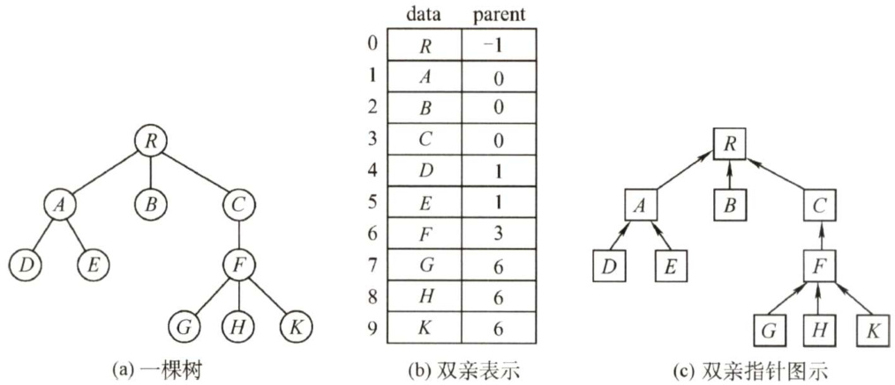  
图5.14树的双亲表示法  

双亲表示法的存储结构描述如下：  

<html><body><table><tr><td>#define MAX TREE SIZE 100 typedefstruct{ ElemType data; int parent; PTNode; typedef struct{ PTNode nOdes[MAX_TREE_SIZE]; int n;</td><td>//树中最多结点数 //树的结点定义 //数据元素 //双亲位置域 //树的类型定义</td></tr></table></body></html>  

该存储结构利用了每个结点（根结点除外）只有唯一双亲的性质，可以很快得到每个结点的双亲结点，但求结点的孩子时需要遍历整个结构。  

注意：区别树的顺序存储结构与二叉树的顺序存储结构。在树的顺序存储结构中，数组下标代表结点的编号，下标中所存的内容指示了结点之间的关系。而在二叉树的顺序存储结构中，数组下标既代表了结点的编号，又指示了二叉树中各结点之间的关系。当然，二叉树属于树，因此二叉树都可以用树的存储结构来存储，但树却不都能用二叉树的存储结构来存储。  

#### 2.孩子表示法  

孩子表示法是将每个结点的孩子结点都用单链表链接起来形成一个线性结构，此时 $n$ 个结点就有 $n$ 个孩子链表（叶子结点的孩子链表为空表)，如图5.15(a)所示。  

这种存储方式寻找子女的操作非常直接，而寻找双亲的操作需要遍历 $n$ 个结点中孩子链表指针域所指向的 $n$ 个孩子链表。  

#### 3.孩子兄弟表示法  

孩子兄弟表示法又称二叉树表示法，即以二叉链表作为树的存储结构。孩子兄弟表示法使每个结点包括三部分内容：结点值、指向结点第一个孩子结点的指针，及指向结点下一个兄弟结点的指针(沿此域可以找到结点的所有兄弟结点)，如图5.15(b)所示。  

孩子兄弟表示法的存储结构描述如下：  

typedef struct csNode{ElemType data; //数据域struct CsNode \*firstchild,\*nextsibling; //第一个孩子和右兄弟指针  
CSNode,\*CsTree;  

这种存储表示法比较灵活，其最大的优点是可以方便地实现树转换为二叉树的操作，易于查找结点的孩子等，但缺点是从当前结点查找其双亲结点比较麻烦。若为每个结点增设一个parent域指向其父结点，则查找结点的父结点也很方便。  

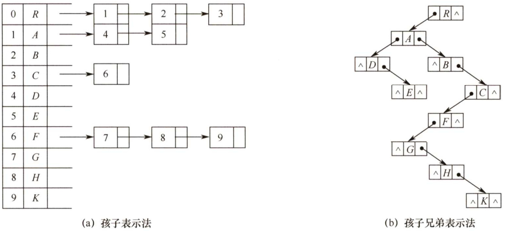  
图5.15树的孩子表示法和孩子兄弟表示法  

#### 5.4.2 树、森林与二叉树的转换  

由于二叉树和树都可以用二叉链表作为存储结构，因此以二叉链表作为媒介可以导出树与二叉树的一个对应关系，即给定一棵树，可以找到唯一的一棵二叉树与之对应。从物理结构上看，它们的二叉链表是相同的，只是解释不同而己。  

树转换为二叉树的规则：每个结点左指针指向它的第一个孩子，右指针指向它在树中的相邻右兄弟，这个规则又称“左孩子右兄弟”。由于根结点没有兄弟，所以对应的二叉树没有右子树，如图5.16所示。  

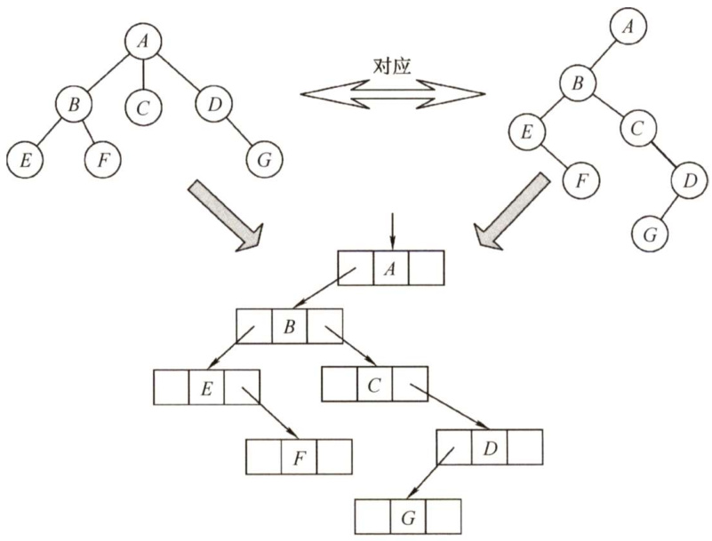  
图5.16树与二叉树的对应关系  

树转换成二叉树的画法： $\textcircled{1}$ 在兄弟结点之间加一连线； $\textcircled{2}$ 对每个结点，只保留它与第一个孩子的连线，而与其他孩子的连线全部抹掉； $\textcircled{3}$ 以树根为轴心，顺时针旋转 $45^{\circ}$ 。  

将森林转换为二叉树的规则与树类似。先将森林中的每棵树转换为二叉树，由于任何一棵和树对应的二叉树的右子树必空，若把森林中第二棵树根视为第一棵树根的右兄弟，即将第二棵树对应的二叉树当作第一棵二叉树根的右子树，将第三棵树对应的二叉树当作第二棵二叉树根的右子树……以此类推，就可以将森林转换为二叉树。  

森林转换成二叉树的画法： $\textcircled{1}$ 将森林中的每棵树转换成相应的二叉树； $\textcircled{2}$ 每棵树的根也可视为兄弟关系，在每棵树的根之间加一根连线； $\textcircled{3}$ 以第一棵树的根为轴心顺时针旋转 $45^{\circ}$ 。  

二叉树转换为森林的规则：若二叉树非空，则二叉树的根及其左子树为第一棵树的二叉树形式，故将根的右链断开。二叉树根的右子树又可视为一个由除第一棵树外的森林转换后的二叉树，应用同样的方法，直到最后只剩一棵没有右子树的二叉树为止，最后再将每棵二叉树依次转换成树，就得到了原森林，如图5.17所示。二叉树转换为树或森林是唯一的。  

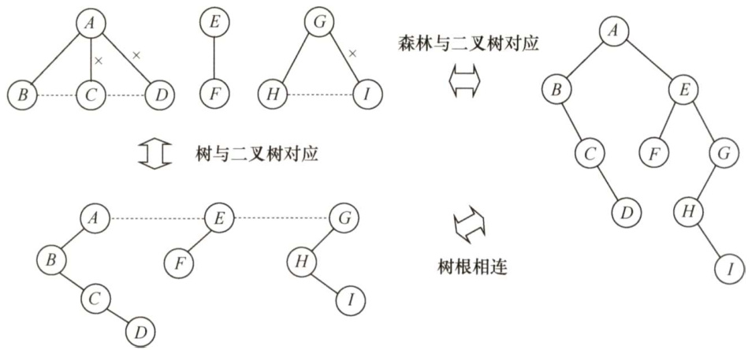  
图5.17森林与二叉树的对应关系  

#### 5.4.3 树和森林的遍历  

树的遍历是指用某种方式访问树中的每个结点，且仅访问一次。主要有两种方式：  

1）先根遍历。若树非空，先访问根结点，再依次遍历根结点的每棵子树，遍历子树时仍遵循先根后子树的规则。其遍历序列与这棵树相应二叉树的先序序列相同。  
2）后根遍历。若树非空，先依次遍历根结点的每棵子树，再访问根结点，遍历子树时仍遵循先子树后根的规则。其遍历序列与这棵树相应二叉树的中序序列相同。  
图5.16的树的先根遍历序列为 $A B E F C D G$ ，后根遍历序列为 $E F B C G D A$ 。  
另外，树也有层次遍历，与二叉树的层次遍历思想基本相同，即按层序依次访问各结点。  
按照森林和树相互递归的定义，可得到森林的两种遍历方法。  

1）先序遍历森林。若森林为非空，则按如下规则进行遍历：  

·访问森林中第一棵树的根结点。  
·先序遍历第一棵树中根结点的子树森林。  
·先序遍历除去第一棵树之后剩余的树构成的森林。  

2）中序遍历森林。森林为非空时，按如下规则进行遍历：  

·中序遍历森林中第一棵树的根结点的子树森林。  
·访问第一棵树的根结点。  
·中序遍历除去第一棵树之后剩余的树构成的森林。  

图5.17的森林的先序遍历序列为 $\textit{A B C D E F G H I}$ ，中序遍历序列为 $B C D A F E H I G$ 当森林转换成二叉树时，其第一棵树的子树森林转换成左子树，剩余树的森林转换成右子树可知森林的先序和中序遍历即为其对应二叉树的先序和中序遍历。  

树和森林的遍历与二叉树的遍历关系见表5.1。  

注意：部分教材也将森林的中根遍历称为后根遍历，称中根遍历是相对其二叉树而言的，称后根遍历是因为根确实是最后才访问的，如遇到这两种称谓，那么都可以理解为同一种遍历方法。  

表5.1树和森林的遍历与二叉树遍历的对应关系  

<html><body><table><tr><td>树</td><td>森林</td><td>二叉树</td></tr><tr><td>先根遍历</td><td>先序遍历</td><td>先序遍历</td></tr><tr><td>后根遍历</td><td>中序遍历</td><td>中序遍历</td></tr></table></body></html>  

#### 5.4.4 本节试题精选  

#### 一、单项选择题  

01．下列关于树的说法中，正确的是（）。  

I．对于有 $n$ 个结点的二叉树，其高度为 $\log_{2}n$ ⅡI．完全二叉树中，若一个结点没有左孩子，则它必是叶结点IⅢI．高度为 $h$ （ $h>0$ ）的完全二叉树对应的森林所含的树的个数一定是 $h$ IV．一棵树中的叶子数一定等于与其对应的二叉树的叶子数  

A.I和III B.IV C.I和Ⅱ D.ⅡI  

12．利用二叉链表存储森林时，根结点的右指针是（）。  

A．指向最左兄弟B．指向最右兄弟 C.一定为空 D.不一定为空  

03．设森林 $F$ 中有3棵树，第一、第二、第三棵树的结点个数分别为 $M_{1},M_{2}$ 和 $M_{3}$ 。与森林$F$ 对应的二叉树根结点的右子树上的结点个数是（）。  

A. $M_{\mathrm{l}}$ B. $M_{1}+M_{2}$ C. $M_{3}$ D. $M_{2}+M_{3}$  

04.设森林 $F$ 对应的二叉树为 $B$ ，它有 $m$ 个结点， $B$ 的根为 $p,\ p$ 的右子树结点个数为 $n$ ，森林 $F$ 中第一棵树的结点个数是（）。  

A. $m-n$ B. $m-n-1$ C. $n+1$ D．条件不足，无法确定  

05．森林 $T=(T_{1},T_{2},\cdots,T_{m})$ 转化为二叉树BT的过程为：若 $m=0$ ，则BT为空，若 $m\neq0$ 则（）。  

A．将中间子树 $T_{\mathrm{mid}}$ （ ${\mathrm{mid}}=(1+m)/2$ ）的根作为BT的根；将 $(T_{1},T_{2},\cdots$ 。 $T_{\mathrm{mid}}-1\rangle$ 转换为BT的左子树；将 $(T_{\mathrm{mid}}+1,\cdots,T_{m})$ 转换为BT的右子树  
B.将子树 $T_{1}$ 的根作为BT的根；将 $T_{1}$ 的子树森林转换成BT的左子树；将 $(T_{2},T_{3},\cdots,T_{m})$ 转换成BT的右子树  
C.将子树 $T_{1}$ 的根作为BT的根；将 $T_{1}$ 的左子树森林转换成BT的左子树；将 $T_{1}$ 的右子树森林转换为BT的右子树；其他以此类推  
D.将森林 $T$ 的根作为BT的根；将 $(T_{1},T_{2},\cdots,T_{m})$ 转化为该根下的结点，得到一棵树，然后将这棵树再转化为二叉树BT  

06.设 $F$ 是一个森林， $B$ 是由 $F$ 变换来的二叉树。若 $F$ 中有 $n$ 个非终端结点，则 $B$ 中右指针域为空的结点有（）个。  

A. $n-1$ B. $n$ C. $n+1$ D. $n+2$  

07.若 $T_{1}$ 是由有序树 $T$ 转换而来的二叉树，则 $T$ 中结点的后根序列就是 $T_{1}$ 中结点的（）序列。  

A．先序 B.中序 C.后序 D．层序  

08．某二叉树结点的中序序列为BDAECF，后序序列为DBEFCA，则该二叉树对应的森林包  

括（）棵树。  

A.1 B.2 C.3 D.4  

09.设 $X$ 是树 $T$ 中的一个非根结点， $B$ 是 $T$ 所对应的二叉树。在 $B$ 中， $X$ 是其双亲结点的右孩子，下列结论中正确的是（）。  

A.在树 $T$ 中， $X$ 是其双亲结点的第一个孩子B.在树 $T$ 中， $X$ 一定无右边兄弟C.在树 $T$ 中， $X$ 一定是叶子结点D.在树 $T$ 中， $X$ 一定有左边兄弟  

10．在森林的二叉树表示中，结点 $M$ 和结点 $N$ 是同一父结点的左儿子和右儿子，则在该森林中（）。  

A. $M$ 和 $N$ 有同一双亲 B. $M$ 和 $N$ 可能无公共祖先C. $M$ 是 $N$ 的儿子 D. $M$ 是 $N$ 的左兄弟  

11.【2009统考真题】将森林转换为对应的二叉树，若在二叉树中，结点 $\boldsymbol{u}$ 是结点 $\nu$ 的父结点的父结点，则在原来的森林中， $\boldsymbol{u}$ 和 $\nu$ 可能具有的关系是（）。  

I．父子关系ⅡI．兄弟关系III $\boldsymbol{u}$ 的父结点与 $\nu$ 的父结点是兄弟关系  

A．只有Ⅱ B.I和Ⅱ C.I和III D.I、和IⅢI  

12.【2011统考真题】已知一棵有2011个结点的树，其叶结点个数为116，该树对应的二叉树中无右孩子的结点个数是（）。  

A.115 B.116 C. 1895 D. 1896  

13.【2014统考真题】将森林 $F$ 转换为对应的二叉树 $T$ 。 $F$ 中叶结点的个数等于（）  

A. $T$ 中叶结点的个数 B. $T$ 中度为1的结点个数C. $T$ 中左孩子指针为空的结点个数 D. $T$ 中右孩子指针为空的结点个数  

14.【2016统考真题】若森林 $F$ 有15条边、25个结点，则 $F$ 包含树的个数是（）。  

A.8 B.9 C.10 D.11  

15.【2019统考真题】若将一棵树 $T$ 转化为对应的二叉树BT，则下列对BT的遍历中，其遍历序列与 $T$ 的后根遍历序列相同的是（）。  

A．先序遍历 B．中序遍历C．后序遍历 D．按层遍历  

16.【2020统考真题】已知森林F及与之对应的二叉树T，若F的先根遍历序列是a,b,c,d,e,f，中根遍历序列是b,a,d,f,e,c，则T的后根遍历序列是（）。  

A. b,a, d,f,e, c B. b, d,f,e, c, a C. b,f,e, d, c, a D. $f,e,d,c,b,a$  

17.【2021统考真题】某森林 $F$ 对应的二叉树为 $T$ ，若 $T$ 的先序遍历序列是a,b,d,c,e,g,f,中序遍历序列是b,d,a,e,g,c,f，则F中树的棵数是（）。  

A.1 B.2 C.3 D.4  

#### 二、综合应用题  

01.给定一棵树的先根遍历序列和后根遍历序列，能否唯一确定一棵树？若能，请举例说明;若不能，请给出反例。  

02.将下面一个由3棵树组成的森林转换为二叉树。  

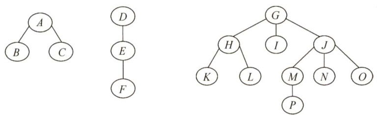  

03．已知某二叉树的先序序列和中序序列分别为ABDEHCFIMGJKL和DBHEAIMFCGKLJ，请画出这棵二叉树，并画出二叉树对应的森林。  

04.编程求以孩子兄弟表示法存储的森林的叶子结点数。  

05.以孩子兄弟链表为存储结构，请设计递归算法求树的深度。  

06.已知一棵树的层次序列及每个结点的度，编写算法构造此树的孩子-兄弟链表  

07.【2016统考真题】若一棵非空 $k$ （ $k\geq2$ ）叉树 $T$ 中的每个非叶结点都有 $k$ 个孩子，则称 $T$ 为正则 $k$ 叉树。请回答下列问题并给出推导过程。  

1）若 $T$ 有 $m$ 个非叶结点，则 $T$ 中的叶结点有多少个？  

2）若 $T$ 的高度为 $h$ （单结点的树 $h=1$ )，则 $T$ 的结点数最多为多少个？最少为多少个？  

#### 5.4.5 答案与解析  

#### 一、单项选择题  

01.D  

若 $n$ 个结点的二叉树是一棵单支树，则其高度为 $n$ 。完全二叉树中最多存在一个度为1的结点且只有左孩子，若不存在左孩子，则一定也不存在右孩子，因此必是叶结点，Ⅱ正确。只有满二叉树才具有性质II，如下图所示。  

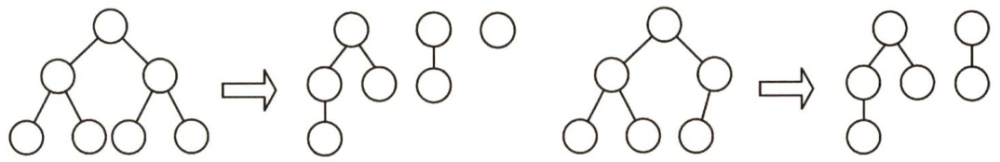  
(a)满二叉树转化为对应的森林 (b）非满二叉树转化为对应的森林  

在树转换为二叉树时，若有几个叶子结点具有共同的双亲，则转换成二叉树后只有一个叶子结点（最右边的叶子结点)，如右图所示，IV错误。注意，若树中的任意两个叶子结点都不存在相同的双亲，则树中的叶子数才有可能与其对应的二叉树中的叶子数相等。  

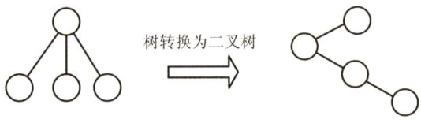  

02.D  

森林与二叉树具有对应关系，因此，我们存储森林时应先将森林转换成二叉树，转换的方法就是“左孩子右兄弟”，与树不同的是，若存在第二棵树，则二叉链表的根结点的右指针指向的是森林中的第二棵树的根结点。若此森林只有一棵树，则根结点的右指针为空。因此，右指针可能为空也可能不为空。  

03.D森林与二叉树的转换规则同样是“左孩子右兄弟”，不过与普通树不同，森林中的每棵树是独立的，因此先要将每棵树的根结点全部视为兄弟结点的关系。所以，题中森林转换后，树2作为树1的根结点的右子树，树3作为树2的根结点的右子树。所以，森林 $F$ 对应的二叉树根结点的右子树上的结点个数是 $M_{2}+M_{3}$ 。  

04.A  

森林转换成二叉树时采用孩子兄弟表示法，根结点及其左子树为森林中的第一棵树。右子树为其他剩余的树。所以，第一棵树的结点个数为 $m-n$ 0  

05.B  

将森林中每棵树的根结点视为兄弟结点的关系，再按照“左孩子右兄弟”的规则来进行转化。  

06.C  

根据森林与二叉树转换规则“左孩子右兄弟”。二叉树 $B$ 中右指针域为空代表该结点没有兄弟结点。森林中每棵树的根结点从第二个开始依次连接到前一棵树的根的右孩子，因此最后一棵树的根结点的右指针为空。另外，每个非终端结点，其所有孩子结点在转换之后，最后一个孩子的右指针也为空，故树 $B$ 中右指针域为空的结点有 $n+1$ 个。  

07.B  

有序树 $T$ 转换成二叉树 $T_{1}$ 时， $T$ 的后根序列是对应 $T_{1}$ 的中序序列还是后序序列呢（显然树的后根序列不可能对应二叉树的先序序列和层序序列）？看右图所示的例子，在树 $T$ 中，叶子结点 $B$ 应最先访问，在 $T_{1}$ 中， $B$ 的右兄弟 $c$ 转换为它的右孩子，若对应 $T_{1}$ 的后序序列，则$c$ 应在 $B$ 的前面访问，所以 $T$ 的后根序列不可能对应 $T_{1}$ 的后序序列。  

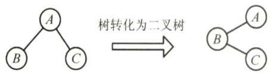  

08.C  

根据二叉树的前序遍历序列和中序遍历序列可以唯一确定一棵二叉树。根据后序遍历序列，$A$ 是二叉树的根结点。根据中序遍历序列，二叉树的形态一定如右图中的(a)所示。  

对于 $A$ 的左子树，由后序遍历序列可知，因为 $B$ 比 $D$ 后被访问，因此 $B$ 必为 $D$ 的父结点，又由中序遍历序列可知， $D$ 是 $B$ 的右儿子。对于 $A$ 的右子树，同理可确定结点 $E$ 、$C,F$ 的关系。此二叉树的形态如右图中的(b)所示。  

再根据二叉树与森林的对应关系，森林中树的棵数即为其对应二叉树（向右上旋转 $45^{\circ}$  

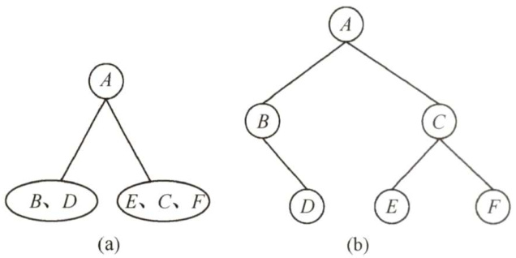  

后）的根结点 $A$ 及其右兄弟数，或解释为：对应二叉树从根结点A开始不断往右孩子访问，所访问到的结点数。可知此森林中有3棵树，根结点分别为 $A,C$ 和 $F$ 。  

09.D  

在二叉树 $B$ 中， $X$ 是其双亲的右孩子，因此在树 $T$ 中， $X$ 必是其双亲结点的右兄弟，换句话说， $X$ 在树中必有左兄弟。  

10.B  

在森林的二叉树表示中，当 $M$ 和 $N$ 的父结点是二叉树根结点时， $M$ 和 $N$ 在不同的树上。因此 $M$ 和 $N$ 可能无公共祖先。  

11.B  

森林与二叉树的转换规则为“左孩子右兄弟”。在最后生成的二叉树中，父子关系在对应的森林关系中可能是兄弟关系或原本就是父子关系。情形I：若结点 $\nu$ 是结点 $u$ 的第二个孩子结点，在转换时，结点 $\nu$ 就变成结点 $u$ 的第一个孩子的右孩子，符合要求。情形ⅡI：结点 $\boldsymbol{u}$ 和 $\nu$ 是兄弟结点的关系，但二者之中还有一个兄弟结点 $k$ ，转换后结点 $\boldsymbol{\nu}$ 就变为结点 $k$ 的右孩子，而结点 $k$ 则是结点 $u$ 的右孩子，符合要求。情形III：结点 $\nu$ 的父结点要么是原先的父结点，要么是兄弟结点。若结点 $u$ 的父结点与 $\boldsymbol{\nu}$ 的父结点是兄弟关系，则转换之后不可能出现结点 $u$ 是结点 $\boldsymbol{\nu}$ 的父结点的父结点的情形。  

12.D  

树转换为二叉树时，树的每个分支结点的所有子结点中的最右子结点无右孩子，根结点转换后也没有右孩子，因此，对应二叉树中无右孩子的结点个数 $\mathbf{\Sigma}=\mathbf{\Sigma}$ 分支结点数 $+\mathrm{~\bf~l~}=\mathrm{~\bf~\underline{~}{~}{~}~}$ $2011-116+1=1896$ 口  

通常本题应采用特殊法求解，设题意中的树是如右图所示的结构，则对应的二叉树中仅有前115个叶结点有右孩子，故无右孩子的结点个数 $=2011-115=1896$ 。  

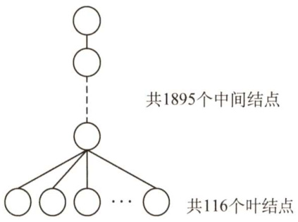  
解析及视频讲解  

13.C  

解析请扫右侧二维码查阅。  

14.C  

解法一：树有一个很重要的性质，即在 $n$ 个结点的树中有 $n-1$ 条边，“那么对于每棵树，其结点数比边数多1”。题中的森林中的结点数比边数多10（即 $25-15=$ 10)，显然共有10棵树。  

解法二：仔细分析后发现，此题考查的也是图的某些方面的性质：生成树和生成森林。此时对于图的生成树有一个重要的性质，即图中顶点数若为 $n$ ，则其生成树含有 $n-1$ 条边。对比解法一中树的性质，不难发现两种解法都用到了性质“树中结点数比边数多1”，接下来的分析如解法一。  

15.B  

后根遍历树可分为两步： $\textcircled{1}$ 从左到右访问双亲结点的每个孩子（转化为二叉树后就是先访问根结点再访问右子树)； $\textcircled{2}$ 访问完所有孩子后再访问它们的双亲结点（转化为二叉树后就是先访问左子树再访问根结点)，因此树 $T$ 的后根遍历序列与其相应二叉树BT的中序遍历序列相同。对于此类题，采用特殊值法求解通常会更便捷，左下图树T转换为二叉树BT的过程如下图所示，树 $T$ 的后序遍历序列显然和其相应二叉树BT的中序遍历序列相同，均为5,6,7,2,3,4,1。  

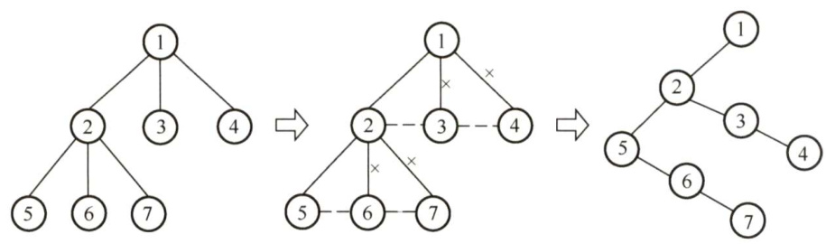  

16.C  

森林 $F$ 的先根遍历序列对应于其二叉树 $T$ 的先序遍历序列，森林 $F$ 的中根遍历序列对应于其二叉树 $T$ 的中序遍历序列。即 $T$ 的先序遍历序列为 $a,b,c,d,e,f,$ ，中序遍历序列为 $b,a,d,f,e,c$ 8根据二叉树 $T$ 的先序序列和中序序列可以唯一确定它的结构，构造过程如下：  

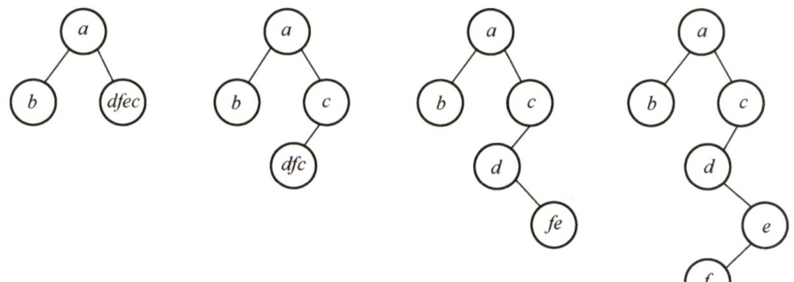  

可以得到二叉树 $T$ 的后序序列为b,f,e,d,c,a。  

17.C  

由二叉树 $T$ 的先序序列和中序序列可以构造出 $T$ ，如下图所示。由森林转化成二叉树的规则可知，森林中每棵树的根结点以右子树的方式相连，所以 $T$ 中的结点a、c、f为 $F$ 中树的根结点，森林 $F$ 中有3棵树，故选C。  

#### 二、综合应用题  

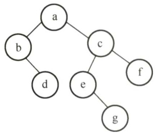  

01.【解答】  

一棵树的先根遍历结果与其对应二叉树的先序遍历结果相同，树的后根遍历结果与其对应二叉树表示的中序遍历结果相同。由于二叉树的先序序列和中序序列能够唯一地确定这棵二叉树，因此，根据题目给出的条件，利用树的先根遍历序列和后根遍历序列能够唯一地确定这棵树。例如，对于右图所示的树，对应二叉树的先序序列为1,2,3,4,5,6,8,7，中序序列为3,4,8,6,7,5,2,1。原树的先根遍历序列为1,2,3,4,5,6,8,7，后根遍历序列为3,4,8,6,7,5,2,1。  

注意：树的先根遍历、后根遍历与对应二叉树的前序遍历、中序遍历对应。  

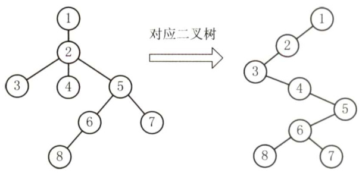  

02.【解答】  

根据树与二叉树“左孩子右兄弟”的转换规则，将森林转换为二叉树的过程如下： $\textcircled{1}$ 将每棵树的根结点也视为兄弟关系，在兄弟结点之间加一连线。 $\textcircled{2}$ 对每个结点，只保留它与第一个子结点的连线，与其他子结点的连线全部抹掉。 $\textcircled{3}$ 以树根为轴心，顺时针旋转 $45^{\circ}$ 。结果如下图所示。  

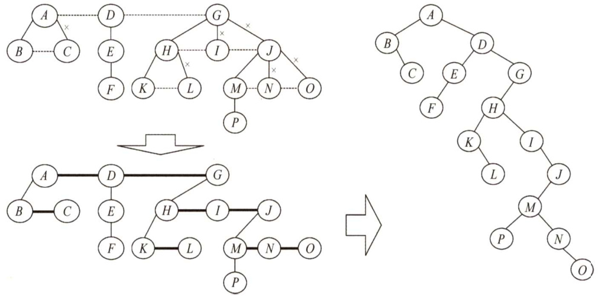  

03.【解答】  

知道二叉树的先序和中序遍历后，可以唯一确定这棵树的结构。然后把二叉树转换到树和森林的方式是，若结点 $x$ 是双亲 $y$ 的左孩子，则把 $x$ 的右孩子、右孩子的右孩子……·都与 $y$ 用连线连起来，最后去掉所有双亲到右孩子的连线。  

最后得到的二叉树及对应的森林如下图所示。  

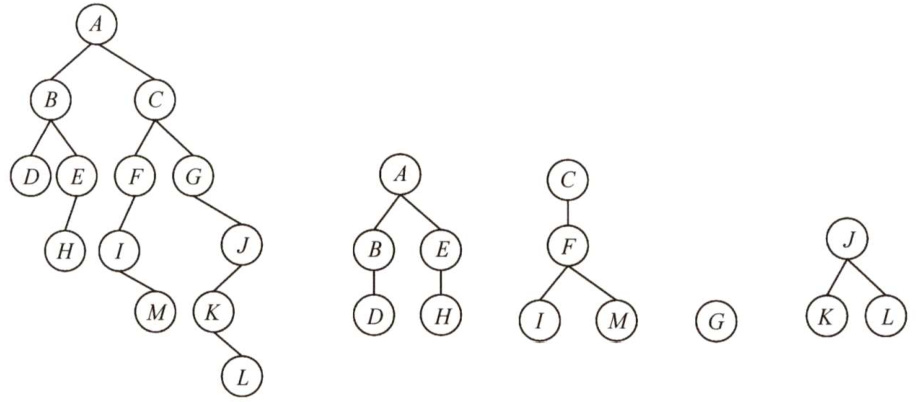  

04.【解答】  

当森林（树）以孩子兄弟表示法存储时，若结点没有孩子（fch $\c=$ null)，则它必是叶子，总的叶子结点个数是孩子子树（fch）上的叶子数和兄弟子树（nsib）上的叶结点个数之和。  

算法代码如下：  

typedef struct node  
1ElemType data; //数据域struct node \*fch,\*nsib; //孩子与兄弟域  
}\*Tree;  
int Leaves(Tree t){ //计算以孩子兄弟表示法存储的森林的叶子数if( $t==$ NULL)return 0; //树空返回0if(t->fch $\scriptstyle==$ NULL) //若结点无孩子，则该结点必是叶子  

return1+Leaves（t->nsib）；//返回叶子结点和其兄弟子树中的叶子结点数else //孩子子树和兄弟子树中叶子数之和return Leaves(t->fch) $^+$ Leaves(t->nsib);  

05.【解答】  

由孩子兄弟链表表示的树，求高度的算法思想如下：采用递归算法，若树为空，高度为零;否则，高度为第一子女树高度加1和兄弟子树高度的大者。其非递归算法使用队列，逐层遍历树，取得树的高度。算法代码如下：  

int Height（CsTree bt){  
//递归求以孩子兄弟链表表示的树的深度int hc,hs;if(bt $\scriptstyle==$ NULL)return0;else{//否则，高度取子女高度 $+1$ 和兄弟子树高度的大者ho $=$ height（bt->firstchild); //第一子女树高hs $=$ height(bt->nextsibling); //兄弟树高if(hc+1>hs)return hc+l;elsereturn hs;  

06.【解答】  

本题与树的层次序列有关。可设立一个辅助数组pointer[]存储新建树的各结点的地址，再根据层次序列与每个结点的度，逐个链接结点。算法描述如下：  

#define maxNodes 15   
void createcsTree_Degree(CsTree&T,DataType e[],int degree[],int n)   
//根据树结点的层次序列e[]和各结点的度degree[]构造树的孩子-兄弟链表   
//参数 $n$ 是树结点个数 CSNode \*pointer $\c=$ newCsNode[maxNodes]；//判断pointer[i]为空的语句未写 inti,j,d, $k=0$ . for( $\scriptstyle{\dot{\underline{{\mathbf{i}}}}}=0$ $\frac{1}{2}<n$ ： $\dot{2}++$ ）{//初始化 pointer[i] $\rightarrow$ data $=_{\mathsf{e}}$ [i]; pointer[i] $\rightarrow$ lchild=pointer[i]->rsibling $\L=$ NULL; for( $\dot{\mathsf{1}}=0$ $\frac{1}{2}<n$ . $\dot{2}++$ ） $d=$ degree[i]; //结点i的度数 if(d）{ $k++$ . //k为子女结点序号 pointer[i]->lchild $\circleddash$ pointer[k]；//建立i与子女 $k$ 间的链接 for $j=2$ $j<=d$ $j++$ ）{ $k++$ . pointer[k-l]->rsibling $\mathbf{\bar{\rho}}=$ pointer[k];  

07.【解答】  

1）正则 $k$ 叉树中仅含有两类结点；叶结点（个数记为 $n_{0}$ ）和度为 $k$ 的分支结点（个数记为 $n_{k}$ )。树 $T$ 中的结点总数 $n=n_{0}+n_{k}=n_{0}+m$ 。树中所含的边数 $e=n-1$ ，这些边均是从 $m$ 个度为 $k$ 的结点发出的，即 $e=m k$ 。整理得 $n_{0}+m=m k+1$ ，故 $n_{0}=\left(k-1\right)m+1$ 0  

2）高度为 $h$ 的正则 $k$ 叉树 $T$ 中，含最多结点的树形为：除第 $h$ 层外，第1到第 $h-1$ 层的结点都是度为 $k$ 的分支结点；而第 $h$ 层均为叶结点，即树是“满”树。此时第 $j$ （ $1\leq j\leq h\}$ 层的结点数为 $k^{j-1}$ ，结点总数 $M_{1}$ 为  

$$
M_{1}=\sum_{j=1}^{h}k^{j-1}=\frac{k^{h}-1}{k-1}
$$  

含最少结点的正则 $k$ 叉树的树形为：第1层只有根结点，第2到第 $h-1$ 层仅含1个分支结点和 $k-1$ 个叶结点，第 $h$ 层有 $k$ 个叶结点。也就是说，除根外，第2到第 $h$ 层中每层的结点数均为 $k$ ，故 $T$ 中所含结点总数 $M_{2}$ 为  

$$
M_{2}=1+(h-1)k
$$