### 5.5 树与二叉树的应用  

#### 5.5.1 哈夫曼树和哈夫曼编码  

#### 1．哈夫曼树的定义  

在许多应用中，树中结点常常被赋予一个表示某种意义的数值，称为该结点的权。从树的根到任意结点的路径长度（经过的边数）与该结点上权值的乘积，称为该结点的带权路径长度。树中所有叶结点的带权路径长度之和称为该树的带权路径长度，记为  

$$
\mathrm{{WPL}}=\sum_{i=1}^{n}w_{i}l_{i}
$$  

式中， $w_{i}$ 是第 $i$ 个叶结点所带的权值， $l_{i}$ 是该叶结点到根结点的路径长度。  

在含有 $n$ 个带权叶结点的二叉树中，其中带权路径长度（WPL）最小的二叉树称为哈夫曼树，也称最优二叉树。例如，图5.18中的3棵二叉树都有4个叶子结点 $a,b,c,d$ ，分别带权7,5,2,4，它们的带权路径长度分别为  

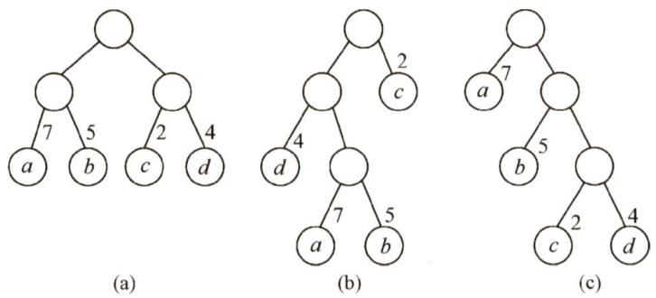  
图5.18具有不同带权长度的二叉树  

(a) ${\mathrm{WPL}}=7{\times}2+5{\times}2+2{\times}2+4{\times}2=36{\mathrm{~c}}$ (b) ${\mathrm{WPL}}=4{\times}2+7{\times}3+5{\times}3+2{\times}1=46{\mathrm{~c}}$ (c) ${\mathrm{WPL}}=7{\times}1+5{\times}2+2{\times}3+4{\times}3=35{\mathrm{_{c}}}$  

其中，图5.18(c)树的WPL最小。可以验证，它恰好为哈夫曼树。  

#### 2.哈夫曼树的构造  

给定 $n$ 个权值分别为 $w_{1},w_{2},\cdots,w_{n}$ 的结点，构造哈天曼树的算法描述如卜：  

1）将这 $n$ 个结点分别作为 $n$ 棵仅含一个结点的二叉树，构成森林 $F$ o  
2）构造一个新结点，从 $F$ 中选取两棵根结点权值最小的树作为新结点的左、右子树，并且将新结点的权值置为左、右子树上根结点的权值之和。  
3）从 $F$ 中删除刚才选出的两棵树，同时将新得到的树加入 $F$ 中。  
4）重复步骤2）和3)，直至 $F$ 中只剩下一棵树为止。  
从上述构造过程中可以看出哈夫曼树具有如下特点：  
1）每个初始结点最终都成为叶结点，且权值越小的结点到根结点的路径长度越大。2）构造过程中共新建了 $n-1$ 个结点（双分支结点)，因此哈夫曼树的结点总数为 $2n-1$ 03）每次构造都选择2棵树作为新结点的孩子，因此哈夫曼树中不存在度为1的结点。例如，权值{7，5，2，4}的哈夫曼树的构造过程如图5.19所示。  

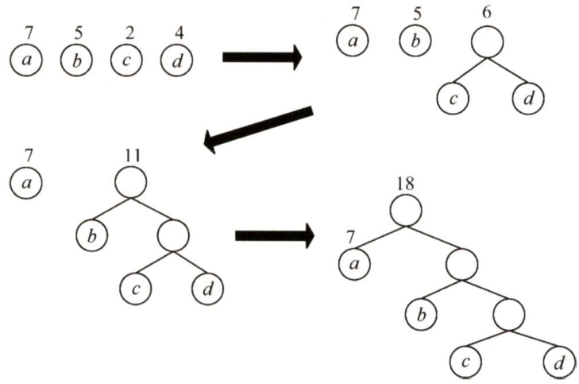  
图5.19哈夫曼树的构造过程  

#### 3.哈夫曼编码  

在数据通信中，若对每个字符用相等长度的二进制位表示，称这种编码方式为固定长度编码。若允许对不同字符用不等长的二进制位表示，则这种编码方式称为可变长度编码。可变长度编码比固定长度编码要好得多，其特点是对频率高的字符赋以短编码，而对频率较低的字符则赋以较长一些的编码，从而可以使字符的平均编码长度减短，起到压缩数据的效果。哈夫曼编码是一种被广泛应用而且非常有效的数据压缩编码。  

若没有一个编码是另一个编码的前缀，则称这样的编码为前缀编码。举例：设计字符 A,B和C对应的编码0,101和100是前缀编码。对前缀编码的解码很简单，因为没有一个编码是其他编码的前缀。所以识别出第一个编码，将它翻译为原码，再对余下的编码文件重复同样的解码操作。例如，码串 00101100可被唯一地翻译为0,0,101和100。另举反例：如果再将字符D的编码设计为00，此时0是00的前缀，那么这样的码串的前两位就无法唯一翻译。  

由哈夫曼树得到哈夫曼编码是很自然的过程。首先，将每个出现的字符当作一个独立的结点，其权值为它出现的频度（或次数)，构造出对应的哈夫曼树。显然，所有字符结点都出现在叶结点中。我们可将字符的编码解释为从根至该字符的路径上边标记的序列，其中边标记为0表示"转向左孩子”，标记为1表示“转向右孩子”。图5.20所示为一个由哈夫曼树构造哈夫曼编码的示例，矩形方块表示字符及其出现的次数。  

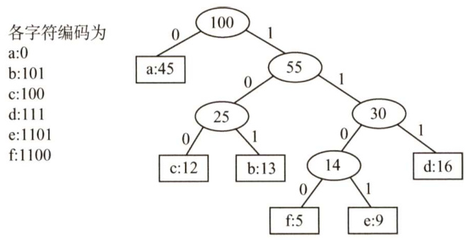  
图5.20由哈夫曼树构造哈夫曼编码  

这棵哈夫曼树的WPL为  

$$
\mathrm{WPL}=1{\times}45+3{\times}(13+12+16)+4{\times}(5+9)=224
$$  

此处的WPL可视为最终编码得到二进制编码的长度，共224位。若采用3位固定长度编码，则得到的二进制编码长度为300位，因此哈夫曼编码共压缩了 $25\%$ 的数据。利用哈夫曼树可以设计出总长度最短的二进制前缀编码。  

注意：0和1究竟是表示左子树还是右子树没有明确规定。左、右孩子结点的顺序是任意的，所以构造出的哈夫曼树并不唯一，但各哈夫曼树的带权路径长度WPL相同且为最优。此外，如有若干权值相同的结点，则构造出的哈夫曼树更可能不同，但WPL必然相同且是最优的。  

#### 5.5.2 并查集  

并查集是一种简单的集合表示，它支持以下3种操作：  

1）Initial(S)：将集合s中的每个元素都初始化为只有一个单元素的子集合。2）Union(S,Root1,Root2)：把集合 S 中的子集合 Root2并入子集合Root1。要求Root1和Root2互不相交，否则不执行合并。3）Find(S,x)：查找集合S中单元素 $\mathbf{x}$ 所在的子集合，并返回该子集合的根结点。通常用树（森林）的双亲表示作为并查集的存储结构，每个子集合以一棵树表示。所有表示子集合的树，构成表示全集合的森林，存放在双亲表示数组内。通常用数组元素的下标代表元素名，用根结点的下标代表子集合名，根结点的双亲结点为负数。  

例如，若设有一个全集合为 $S=\left\{0,1,2,3,4,5,6,\right.$ 7,8，9}，初始化时每个元素自成一个单元素子集合，每个子集合的数组值为-1，如图5.21所示。  

经过一段时间的计算，这些子集合合并为3个更大的子集合 $S_{1}=\{0,6,7,8\}$ ， $S_{2}=\{1,4,9\}$ ， $S_{3}=\{2,3,$ 5，此时并查集的树形表示和存储结构如图5.22所示。  

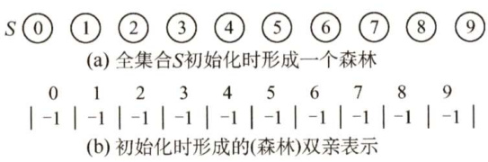  
图5.21 并查集的初始化  

为了得到两个子集合的并，只需将其中一个子集合根结点的双亲指针指向另一个集合的根结点。因此， $S_{1}\cup S_{2}$ 可以具有如图5.23所示的表示。  

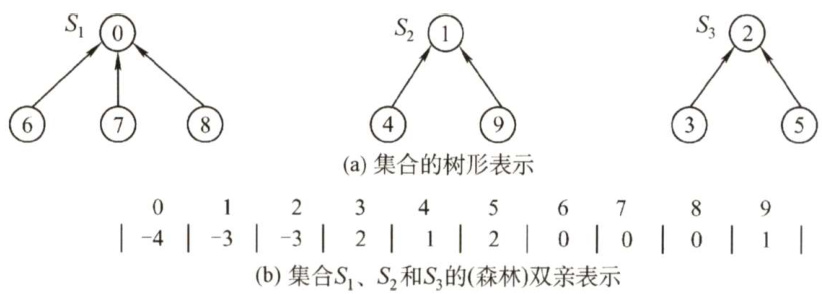  
图5.22 用树表示并查集  

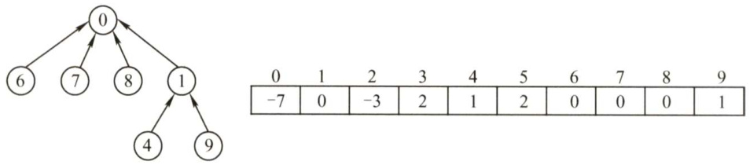  
图5.23 $S_{1}\cup S_{2}$ 可能的表示方法  

在采用树的双亲指针数组表示作为并查集的存储表示时，集合元素的编号从0到size-l。其中size 是最大元素的个数。下面是并查集主要运算的实现。  

并查集的结构定义如下：  

<html><body><table><tr><td>#define SIzE 100 int UFSets[SIZE]; //集合元素数组（双亲指针数组）</td></tr><tr><td>并查集的初始化操作（S即为并查集)： void Initial(int S[]）{ for（inti=0;i<size;i++） //每个自成单元素集合 S[i]=-1;</td></tr><tr><td>Find操作（函数在并查集S中查找并返回包含元素×的树的根)：</td></tr><tr><td>int Find（int S[],int x）{ while(s[x]>=0) //循环寻找x的根 x=S[x]; return x; //根的S[]小于0</td></tr><tr><td>判断两个元素是否属于同一集合，只需分别找到它们的根结点，比较根结点是否相同即可。</td></tr><tr><td>Union操作（函数求两个不相交子集合的并集)： void Union（int S[],int Rootl,int Root2）{ //要求Root1与Root2是不同的，且表示子集合的名字 S[Root2]=Root1; //将根Root2连接到另一根Root1下面</td></tr></table></body></html>  

如果将两个元素所在的集合合并为一个集合，那么就需要先找到两个元素的根结点。  

#### 5.5.3 本节试题精选  

#### 一、单项选择题  

01．在有 $n$ 个叶子结点的哈夫曼树中，非叶子结点的总数是（）。  

A.n-1 B.n C.2n-1 D.2  

02．给定整数集合{3，5,6,9,12}，与之对应的哈夫曼树是（）。  

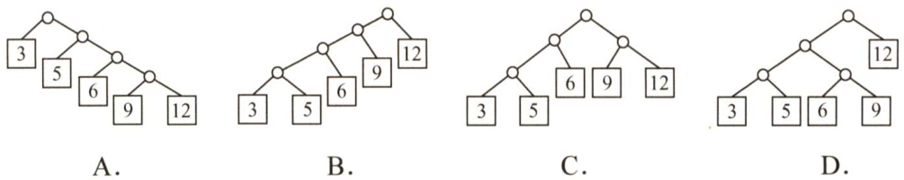  

03．下列编码中，（）不是前缀码。  

A. {00,01, 10, 11} B. {0,1,00, 11} C. {0,10, 110, 111} D.{10, 110, 1110, 1111}  

04.设哈夫曼编码的长度不超过4，若已对两个字符编码为1和01，则还最多可对（）个字符编码。  

A.2 B.3 C.4 D.5  

05.一棵哈夫曼树共有215个结点，对其进行哈夫曼编码，共能得到（）个不同的码字，  

A.107 B.108 C.214 D.215  

06．以下对于哈夫曼树的说法中，错误的是（）  

A.对应一组权值构造出来的哈夫曼树一般不是唯一的  
B．哈夫曼树具有最小的带权路径长度  
C.哈夫曼树中没有度为1的结点  
D.哈夫曼树中除了度为1的结点外，还有度为2的结点和叶结点  

07.若度为 $m$ 的哈夫曼树中，叶子结点个数为 $n$ ，则非叶子结点的个数为（）。  

A. $n-1$ B. $\lfloor n/m\rfloor-1$   
C. $\left\lceil(n-1)/(m-1)\right\rceil$ D. $\lceil n/(m-1)\rceil_{-1}$  

08．并查集的结构是一种（）。  

A.二叉链表存储的二叉树 B．双亲表示法存储的树C.顺序存储的二叉树 D.孩子表示法存储的树  

09.并查集中最核心的两个操作是： $\textcircled{1}$ 查找，查找两个元素是否属于同一个集合； $\textcircled{2}$ 合并，如果两个元素不属于同一个集合，且所在的两个集合互不相交，则合并这两个集合。假设初始长度为10（0\~9）的并查集，按1-2、3-4、5-6、7-8、8-9、1-8、0-5、1-9的顺序进行查找和合并操作，最终并查集共有（）个集合。  

A.1 B.2 C.3 D.4  

10.下列关于并查集的叙述中，（）是错误的（注意，本题涉及图的考点）。  

A．并查集是用双亲表示法存储的树  
B．并查集可用于实现克鲁斯卡尔算法  
C.并查集可用于判断无向图的连通性  
D．在长度为 $n$ 的并查集中进行查找操作的时间复杂度为 $O(\log_{2}n)$  

11.【2010统考真题】 $n$ （ $n\geq2$ ）个权值均不相同的字符构成哈夫曼树，关于该树的叙述中错误的是（）。  

A.该树一定是一棵完全二叉树  
B.树中一定没有度为1的结点  
C.树中两个权值最小的结点一定是兄弟结点  
D.树中任一非叶结点的权值一定不小于下一层任一结点的权值  

12.【2014统考真题】5个字符有如下4种编码方案，不是前缀编码的是（）。  

A. 01,0000,0001,001,1 B. 011,000,001,010,1   
C. 000,001,010,011,100 D. 0,100,110,1110,1100  

13.【2015统考真题】下列选项给出的是从根分别到达两个叶结点路径上的权值序列，属于同一棵哈夫曼树的是（）。  

A.24,10,5和24,10,7 B.24,10,5和24,12,7  
C.24,10,10和24,14,11 D. 24,10,5和24,14,6  
14.【2017统考真题】已知字符集{a,b,c,d,e,f,g,h}，若各字符的哈夫曼编码依次是0100,10,  
0000,0101,001,011,11,0001，则编码序列0100011001001011110101的译码结果是（）。  

A. acgabfh B. adbagbb C. afbeagd D. afeefgd  

15.【2018统考真题】已知字符集{a,b,c,d,e,f，若各字符出现的次数分别为6,3,8,2,10,4，则对应字符集中各字符的哈夫曼编码可能是（）。  

A.00,1011,01,1010,11,100 B. 00,100,110,000,0010,01   
C. 10,1011,11,0011,00,010 D. 0011,10,11,0010,01,000  

16.【2019统考真题】对 $n$ 个互不相同的符号进行哈夫曼编码。若生成的哈夫曼树共有115个结点，则 $n$ 的值是（）。  

A.56 B.57 C.58 D.60  

17.【2021统考真题】若某二叉树有5个叶结点，其权值分别为10,12,16,21,30，则其最小的带权路径长度（WPL）是（）。  

A.89 B.200 C. 208 D. 289  

#### 二、综合应用题  

01．设给定权集 $w=\{5,7,2,3,6,8,9\}$ ，试构造关于 $w$ 的一棵哈夫曼树，并求其加权路径长度WPL。  

02.【2012统考真题】设有6个有序表A,B,C,D,E,F，分别含有10,35,40,50,60和200个数据元素，各表中的元素按升序排列。要求通过5次两两合并，将6个表最终合并为1个升序表，并使最坏情况下比较的总次数达到最小。请回答下列问题：1）给出完整的合并过程，并求出最坏情况下比较的总次数。2）根据你的合并过程，描述 $n$ （ $n\geq2$ ）个不等长升序表的合并策略，并说明理由。  

03.【2020统考真题】若任意一个字符的编码都不是其他字符编码的前缀，则称这种编码具有前缀特性。现有某字符集（字符个数 $\geq2$ ）的不等长编码，每个字符的编码均为二进制的0、1序列，最长为 $L$ 位，且具有前缀特性。请回答下列问题：  

1）哪种数据结构适宜保存上述具有前缀特性的不等长编码？  
2）基于你所设计的数据结构，简述从 $_{0/1}$ 串到字符串的译码过程。  
3）简述判定某字符集的不等长编码是否具有前缀特性的过程。  

#### 5.5.4 答案与解析  

#### 一、单项选择题  

01.A  

由哈夫曼树的构造过程可知，哈夫曼树中只有度为0和2的结点。在非空二叉树中，有 $n_{0}=$ $n_{2}+1$ ，故 $n_{2}=n-1$ 。  

【另解】 $n$ 个结点构造哈夫曼树需要 $n-1$ 次合并过程，每次合并新建一个分支结点，故选A。  

02.C  

首先，3和5构造为一棵子树，其根权值为8，然后该子树与6构造为一棵新子树，根权值为14，再后9与12构造为一棵子树，最后两棵子树共同构造为一棵哈夫曼树。  

03.B  

若没有一个编码是另一个编码的前缀，则称这样的编码为前缀编码。B选项中，0是00的前缀，1是11的前缀。  

04.C  

在哈夫曼编码中，一个编码不能是任何其他编码的前缀。3位编码可能是001，对应的4位编码只能是0000和0001。3位编码也可能是000，对应的4位编码只能是0010和0011。若全采用4位编码，则可以为0000，0001，0010和0011。题中问的是最多，故选C。  

【另解】若哈夫曼编码的长度只允许小于等于4，则哈夫曼树的高度最高是5，已知一个字符编码为1，另一个字符编码是01，这说明第二层和第三层各有一个叶子结点，为使得该树从第3层起能够对尽可能多的字符编码，余下的二叉树应该是满二叉树，如左图所示，底层可以有4个叶结点，最多可以再对4个字符编码。  

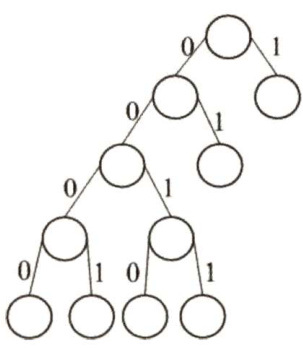  

05.B  

根据上题的结论，叶子结点数为 $(215+1)/2=108$ ，所以共有108个不同的码字。  

【另解】在哈夫曼树中只有度为0和2的结点，结点总数 $n=n_{0}+n_{2}$ ，且 $n_{0}=n_{2}+1$ ，由题知 $n$ $=215$ ， $n_{0}=108$ 。  

06.D  

哈夫曼树通常是指带权路径长度达到最小的扩充二叉树，在其构造过程中每次选根的权值最小的两棵树，一棵作为左子树，一棵作为右子树，生成新的二叉树，新的二叉树根的权值应为其左右两棵子树根结点权值的和。至于谁做左子树，谁做右子树，没有限制，所以构造的哈夫曼树是不唯一的。哈夫曼树只有度为0和2的结点，度为0的结点是外结点，带有权值，没有度为1的结点。  

07.C  

一棵度为 $m$ 的哈夫曼树应只有度为0和 $m$ 的结点，设度为 $m$ 的结点有 $n_{m}$ 个，度为0的结点 有 $n_{0}$ 个，又设结点总数为 $n$ ， $n=n_{0}+n_{m}$ 。因有 $n$ 个结点的哈夫曼树有 $n-1$ 条分支，则 $m n_{m}=n-1=$ $n_{m}+n_{0}-1$ ，整理得 $(m-1)n_{m}=n_{0}-1$ ， $n_{m}=(n-1)/(m-1)$ 。  

08.B  

并查集的存储结构是用双亲表示法存储的树，主要是为了方便两个重要的操作。  

09.C初始时， $0{\sim}9$ 各自成一个集合。查找1-2时，合并{1}和{2}；查找3-4时，合并{3}和{4}；  

查找5-6时，合并{5}和 $\{6\}$ ；查找7-8时，合并{7}和{8}；查找8-9时，合并{7，8}和{9}；查找1-8时，合并{1,2}和{7,8,9}；查找0-5时，合并{0}和{5,6}；查找1-9时，它们属于同一个集合。最终的集合为{0,5,6}、 $\{1,2,7,8,9\}$ 和{3,4}，因此答案选C。  

10.D  

在用并查集实现Kruskal算法求图的最小生成树时：判断是否加入一条边之前，先查找这条边关联的两个顶点是否属于同一个集合（即判断加入这条边之后是否形成回路)，若形成回路，则继续判断下一条边；若不形成回路，则将该边和边对应的顶点加入最小生成树 $T$ ，并继续判断下一条边，直到所有顶点都已加入最小生成树 $T_{\circ}$ ，B正确。用并查集判断无向图连通性的方法：遍历无向图的边，每遍历到一条边，就把这条边连接的两个顶点合并到同一个集合中，处理完所有边后，只要是相互连通的顶点都会被合并到同一个子集合中，相互不连通的顶点一定在不同的子集合中。C正确。未做路径优化的并查集在最坏情况下的高度为 $O(n)$ ，此时查找操作的时间复杂度为 $O(n)$ ，时间复杂度通常指最坏情况下的时间复杂度。D错误。  

11.A  

哈夫曼树为带权路径长度最小的二叉树，不一定是完全二叉树。哈夫曼树中没有度为1的结点，B正确。构造哈夫曼树时，最先选取两个权值最小的结点作为左、右子树构造一棵新的二叉树，C正确。哈夫曼树中任一非叶结点 $P$ 的权值为其左、右子树根结点的权值之和，其权值不小于其左、右子树根结点的权值，可知哈夫曼树中任一非叶结点的权值一定不小于下一层任一结点的权值，D正确。  

12.D  

前缀编码的定义是在一个字符集中，任何一个字符的编码都不是另一个字符编码的前缀。选项D中的编码110是编码1100 的前缀，违反了前缀编码的规则，所以D不是前缀编码。  

13.D  

解析请扫右侧二维码查阅。  

14.D  

哈夫曼编码是前缀编码，各个编码的前缀不同，因此直接拿编码序列与哈夫曼编码一一比对即可。序列可分割为0100011001$001011110101$ ，译码结果是afeefgd。D正确。  

15.A  

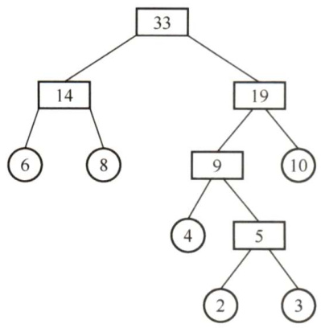  

构造一棵符合题意的哈夫曼树，如右图所示。  
以左子树为0，右子树为1，可知答案为A。  

16.C  

$n$ 个符号构造成哈夫曼树的过程中，共新建了 $n-1$ 个结点（双分支结点)，因此哈夫曼树的结点总数为 $2n-1=115$ ， $n$ 的值为58，答案选C。  

17.B  

对于带权值的结点，构造出哈夫曼树的带权路径长度（WPL）最小，哈夫曼树的构造过程如下图所示。求得其 ${\mathrm{WPL}}=(10+12){\times}3+(30+16+21){\times}2=200$ ，故选B。  

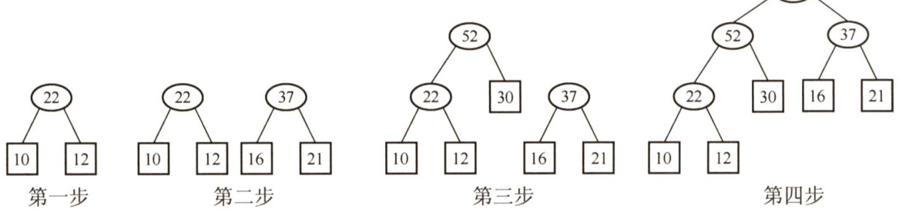  

#### 二、综合应用题  

01.【解答】  

根据哈夫曼树的构造方法，每次从森林中选取两个根结点值最小的树合并成一棵树，将原先的两棵树作为左、右子树，且新根结点的值为左、右孩子关键字之和。构造过程如下图所示。  

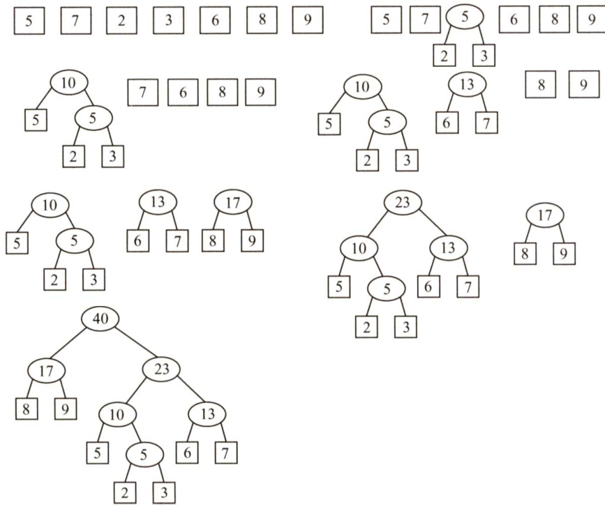  

由构造出的哈夫曼树可得 ${\mathrm{WPL}}=(2+3){\times}4+(5+6+7){\times}3+(8+9){\times}2=108.$ 。  
注意：哈夫曼树并不唯一，但带权路径长度一定是相同的。  

02.【解答】  

1）由于最先合并的表中的元素在后续的每次合并中都会再次参与比较，因此求最小合并次数类似于求最小带权路径长度，此时可立即想到哈夫曼树。根据哈夫曼树的构造过程，每次选择表集合中长度最小的两个表进行合并。6个表的合并顺序如右图所示。  

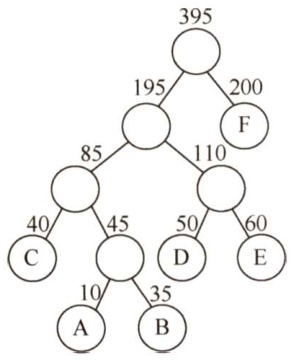  

根据图中的哈夫曼树，6个序列的合并过程如下：  

$\textcircled{1}$ 在表集合{10,35，40,50,60,200}中，选择表A与表B合并，  

生成含45个元素的表AB。  

$\textcircled{2}$ 在表集合{40,45,50,60,200}中，将表AB与表C合并，生成含85个元素的表ABC。$\textcircled{3}$ 在表集合{50,60,85,200}中，表D与表E合并，生成含110个元素的表DE。$\textcircled{4}$ 在表集合{85，110,200}中，表ABC与表DE合并，生成含195个元素的表ABCDE。$\textcircled{5}$ 当前表集合为{195,200}，表ABCDE与表F合并，生成含395个元素的表ABCDEF。由于合并两个长度分别为 $m$ 和 $n$ 的有序表，最坏情况下需要比较 $m+n-1$ 次，故最坏情况下比较的总次数计算如下：  

第1次合并：最多比较次数 $=10+35-1=44$ 。  
第2次合并：最多比较次数 $=40+45-1=84$ Q第3次合并：最多比较次数 $=50+60-1=109$ 。  
第4次合并：最多比较次数 $=85+110-1=194$ 。  
第5次合并：最多比较次数 $=195+200-1=394$ 。  
比较的总次数最多为 $44+84+109+194+394=825\AA$ 。  

2）各表的合并策略是：对多个有序表进行两两合并时，若表长不同，则最坏情况下总的比较次数依赖于表的合并次序。可以借助于哈夫曼树的构造思想，依次选择最短的两个表进行合并，此时可以获得最坏情况下的最佳合并效率。  

03.【解答】  

1）使用一棵二叉树保存字符集中各字符的编码，每个编码对应于从根开始到达某叶结点的一条路径，路径长度等于编码位数，路径到达的叶结点中保存该编码对应的字符。  

2）从左至右依次扫描0/1串中的各位。从根开始，根据串中当前位沿当前结点的左子指针或右子指针下移，直到移动到叶结点时为止。输出叶结点中保存的字符。然后从根开始重复这个过程，直到扫描到0/1串结束，译码完成。  

3）二叉树既可用于保存各字符的编码，又可用于检测编码是否具有前缀特性。判定编码是否具有前缀特性的过程，也是构建二叉树的过程。初始时，二叉树中仅含有根结点，其左子指针和右子指针均为空。  

依次读入每个编码C，建立/寻找从根开始对应于该编码的一条路径，过程如下：  

对每个编码，从左至右扫描C的各位，根据C的当前位（0或1）沿结点的指针（左子指针或右子指针）向下移动。当遇到空指针时，创建新结点，让空指针指向该新结点并继续移动。沿指针移动的过程中，可能遇到三种情况：  

$\textcircled{1}$ 若遇到了叶结点（非根)，则表明不具有前缀特性，返回。  

$\textcircled{2}$ 若在处理C的所有位的过程中，均没有创建新结点，则表明不具有前缀特性，返回。  

$\textcircled{3}$ 若在处理C的最后一个编码位时创建了新结点，则继续验证下一个编码。  

若所有编码均通过验证，则编码具有前缀特性。  

