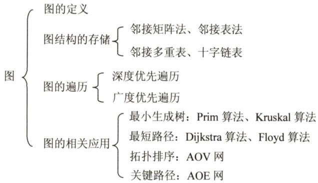

# 第6章  

## 图  

### 【考纲内容】  

（一）图的基本概念  
（二）图的存储及基本操作邻接矩阵；邻接表；邻接多重表；十字链表  
（三）图的遍历深度优先搜索；广度优先搜索  
（四）图的基本应用最小（代价）生成树；最短路径；拓扑排序；关键路径  

### 【知识框架】  

  

### 【复习提示】  

图算法的难度较大，主要掌握深度优先搜索与广度优先搜索。掌握图的基本概念及基本性质、图的存储结构（邻接矩阵、邻接表、邻接多重表和十字链表）及其特性、存储结构之间的转化、基于存储结构上的遍历操作和各种应用（拓扑排序、最小生成树、最短路径和关键路径）等。图的相关算法较多、易混，通常只要求掌握其基本思想和实现步骤，而算法的具体实现不是重点。  
