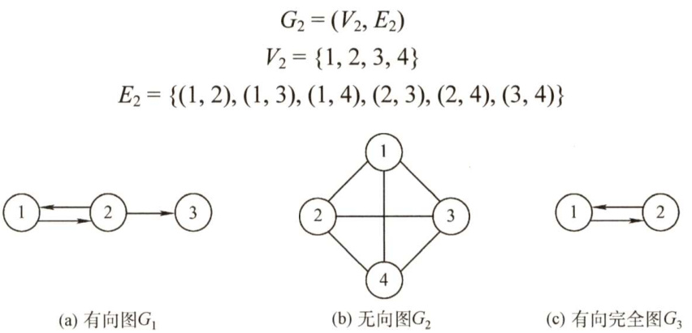
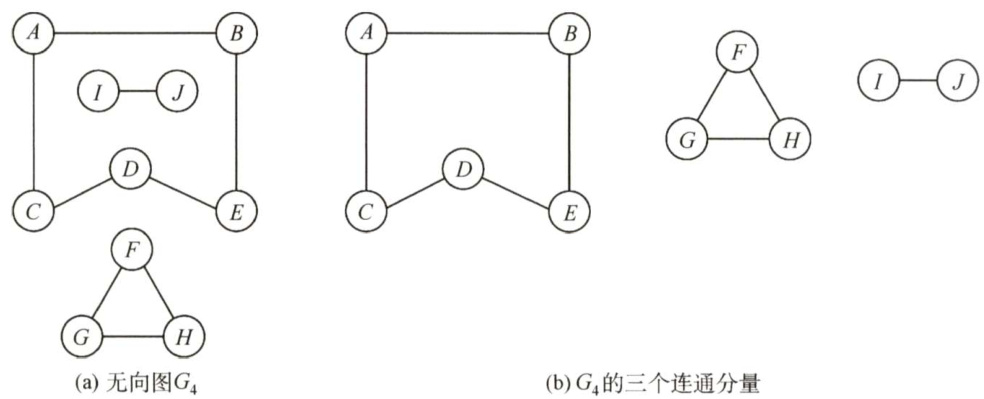
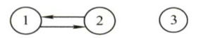
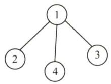

### 6.1 图的基本概念  

#### 6.1.1 图的定义  

图 $G$ 由顶点集 $V$ 和边集 $E$ 组成，记为 $G=(V,E)$ ，其中 $V(G)$ 表示图 $G$ 中顶点的有限非空集;$E(G)$ 表示图 $G$ 中顶点之间的关系（边）集合。若 $V=\{\nu_{1},\nu_{2},\cdots,\nu_{n}\}$ ，则用V表示图 $G$ 中顶点的个数， $E=\{(u,\nu)|u\in V,\nu\in V\}$ ，用 $|E|$ 表示图 $G$ 中边的条数。  

注意：线性表可以是空表，树可以是空树，但图不可以是空图。就是说，图中不能一个顶点也没有，图的顶点集 $V$ 一定非空，但边集 $E$ 可以为空，此时图中只有顶点而没有边。  

下面是图的一些基本概念及术语。  

#### 1.有向图  

若 $E$ 是有向边（也称弧）的有限集合时，则图 $G$ 为有向图。弧是顶点的有序对，记为 $<\nu,w>$ ，其中 $\nu,w$ 是顶点， $\nu$ 称为弧尾， $w$ 称为弧头， $<\nu,w>$ 称为从 $\boldsymbol{\nu}$ 到 $w$ 的弧，也称 $\nu$ 邻接到 $w$ 0  

图6.1(a)所示的有向图 $G_{1}$ 可表示为  

$$
G_{1}=(V_{1},E_{1})
$$  

$$
V_{1}=\{1,2,3\}
$$  

$$
E_{1}=\{<1,2>,<2,1>,<2,3>\}
$$  

#### 2.无向图  

若 $E$ 是无向边（简称边）的有限集合时，则图 $G$ 为无向图。边是顶点的无序对，记为 $(\nu,\ w)$ 或 $(w,\nu)$ 。可以说 $w$ 和 $\nu$ 互为邻接点。边 $(\nu,w)$ 依附于 $w$ 和 $\nu$ ，或称边 $(\nu,w)$ 和 $\nu,w$ 相关联。  

图6.1(b)所示的无向图 $G_{2}$ 可表示为  

  
图6.1图的示例  

#### 3．简单图、多重图  

一个图 $G$ 如果满足： $\textcircled{1}$ 不存在重复边； $\textcircled{2}$ 不存在顶点到自身的边，那么称图 $G$ 为简单图。图6.1中 $G_{1}$ 和 $G_{2}$ 均为简单图。若图 $G$ 中某两个顶点之间的边数大于1条，又允许顶点通过一条边和自身关联，则称图 $G$ 为多重图。多重图和简单图的定义是相对的。数据结构中仅讨论简单图。  

#### 4.完全图（也称简单完全图）  

对于无向图， $|E|$ 的取值范围为0到 $n(n-1)/2$ ，有 $n(n-1)/2$ 条边的无向图称为完全图，在完全图中任意两个顶点之间都存在边。对于有向图， $|E|$ 的取值范围为0到 $n(n-1)$ ，有 $n(n\not-1)$ 条弧的有向图称为有向完全图，在有向完全图中任意两个顶点之间都存在方向相反的两条弧。图6.1中 $G_{2}$ 为无向完全图，而 $G_{3}$ 为有向完全图。  

#### 5.子图  

设有两个图 $G=(V,E)$ 和 $G^{\prime}=(V,E^{\prime})$ ，若 $\boldsymbol{V}$ 是 $V$ 的子集，且 $E^{\prime}$ 是 $E$ 的子集，则称 $G^{\prime}$ 是 $G$ 的子图。若有满足 $V(G^{\prime})=V(G)$ 的子图 $G^{\prime}$ ，则称其为 $G$ 的生成子图。图6.1中 $G_{3}$ 为 $G_{1}$ 的子图。  

注意：并非 $V$ 和 $E$ 的任何子集都能构成 $G$ 的子图，因为这样的子集可能不是图，即 $E$ 的子集中的某些边关联的顶点可能不在这个 $V$ 的子集中。  

#### 6.连通、连通图和连通分量  

在无向图中，若从顶点 $\nu$ 到顶点 $w$ 有路径存在，则称 $\nu$ 和 $w$ 是连通的。若图 $G$ 中任意两个顶点都是连通的，则称图 $G$ 为连通图，否则称为非连通图。无向图中的极大连通子图称为连通分量，在图6.2(a)中，图 $G_{4}$ 有3个连通分量如图6.2(b)所示。假设一个图有 $n$ 个顶点，如果边数小于 $n-1$ ，那么此图必是非连通图；思考，如果图是非连通图，那么最多可以有多少条边？①  

  
图6.2无向图及其连通分量  

#### 7．强连通图、强连通分量  

在有向图中，如果有一对顶点 $\nu$ 和 $w$ ，从 $\nu$ 到 $w$ 和从 $w$ 到 $\nu$ 之间都有路径，则称这两个顶点是强连通的。若图中任何一对顶点都是强连通的，则称此图为强连通图。有向图中的极大强连通子图称为有向图的强连通分量，图 $G_{1}$ 的强连通分量如图6.3所示。思考，假设一个有向图有 $n$ 个顶点，如果是强连通图，那么最少需要有多少条边？②  

注意：在无向图中讨论连通性，在有向图中讨论强连通性。  

#### 8．生成树、生成森林  

连通图的生成树是包含图中全部顶点的一个极小连通子图。若图中顶点数为 $n$ ，则它的生成树含有 $n-1$ 条边。包含图中全部顶点的极小连通子图，只有生成树满足这个极小条件，对生成树而言，若砍去它的一条边，则会变成非连通图，若加上一条边则会形成一个回路。在非连通图中，连通分量的生成树构成了非连通图的生成森林。图 $G_{2}$ 的一个生成树如图6.4所示。  

  
图6.3图 $G_{1}$ 的强连通分量  

  
图6.4图 $G_{2}$ 的一个生成树  

注意：区分极大连通子图和极小连通子图。极大连通子图是无向图的连通分量，极大即要求该连通子图包含其所有的边；极小连通子图是既要保持图连通又要使得边数最少的子图。  

#### 9．顶点的度、入度和出度  

在无向图中，顶点 $\nu$ 的度是指依附于顶点 $\nu$ 的边的条数，记为 $\mathrm{TD}(\nu)$ 。在图6.1(b)中，每个顶点的度均为3。对于具有 $n$ 个顶点、 $e$ 条边的无向图， $\sum_{i=1}^{n}\mathrm{TD}(\nu_{i})=2e$ ，即无向图的全部顶点的度的和等于边数的2倍，因为每条边和两个顶点相关联。  

在有向图中，顶点 $\nu$ 的度分为入度和出度，入度是以顶点 $\nu$ 为终点的有向边的数目，记为 $\mathrm{ID}(\nu)$ .而出度是以顶点 $\nu$ 为起点的有向边的数目，记为 $\mathrm{OD}(\nu)$ 。在图6.1(a)中，顶点2的出度为2、入度为1。顶点 $\boldsymbol{\nu}$ 的度等于其入度与出度之和，即 $\mathrm{TD}(\nu)=\mathrm{ID}(\nu)+\mathrm{OD}(\nu)$ 。对于具有 $n$ 个顶点、 $e$ 条边的有向图， $\sum_{i=1}^{n}\mathrm{ID}(\nu_{i})=\sum_{i=1}^{n}\mathrm{OD}(\nu_{i})=e\qquad$ ，即有向图的全部顶点的入度之和与出度之和相等，并且等于边数，这是因为每条有向边都有一个起点和终点。  

#### 10.边的权和网  

在一个图中，每条边都可以标上具有某种含义的数值，该数值称为该边的权值。这种边上带有权值的图称为带权图，也称网。  

#### 11．稠密图、稀疏图  

边数很少的图称为稀疏图，反之称为稠密图。稀疏和稠密本身是模糊的概念，稀疏图和稠密图常常是相对而言的。一般当图 $G$ 满足 $|E|<|V|\log|V|$ 时，可以将 $G$ 视为稀疏图。  

#### 12．路径、路径长度和回路  

顶点 $\nu_{p}$ 到顶点 $\nu_{q}$ 之间的一条路径是指顶点序列 $\nu_{p},\nu_{i_{1}},\nu_{i_{2}},\cdots,\nu_{i_{m}},\nu_{q}$ ，当然关联的边也可理解为路径的构成要素。路径上边的数目称为路径长度。第一个顶点和最后一个顶点相同的路径称为回路或环。若一个图有 $n$ 个顶点，并且有大于 $n-1$ 条边，则此图一定有环。  

#### 13．简单路径、简单回路  

在路径序列中，顶点不重复出现的路径称为简单路径。除第一个顶点和最后一个顶点外，其余顶点不重复出现的回路称为简单回路。  

#### 14.距离  

从顶点 $u$ 出发到顶点 $\nu$ 的最短路径若存在，则此路径的长度称为从 $u$ 到 $\nu$ 的距离。若从 $u$ 到$\nu$ 根本不存在路径，则记该距离为无穷（）。  

#### 15.有向树  

一个顶点的入度为0、其余顶点的入度均为1的有向图，称为有向树。  

#### 6.1.2 本节试题精选  

#### 一、单项选择题  

01．图中有关路径的定义是（）。  

A.由顶点和相邻顶点序偶构成的边所形成的序列  
B．由不同顶点所形成的序列  
C．由不同边所形成的序列  
D.上述定义都不是  

02.一个有 $n$ 个顶点和 $n$ 条边的无向图一定是（）。  

A.连通的 B.不连通的 C．无环的 D．有环的  

03．若从无向图的任意顶点出发进行一次深度优先搜索即可访问所有顶点，则该图一定是（）  

A.强连通图 B.连通图 C．有回路 D．一棵树  

04．以下关于图的叙述中，正确的是（）。  

A．图与树的区别在于图的边数大于等于顶点数  
B．假设有图 $G=\{V,\{E\}\}$ ，顶点集 $V\subseteq V$ 。 $E^{\prime}\subseteq E$ ，则 $\boldsymbol{V}$ 和 $\{E^{\prime}\}$ 构成 $G$ 的子图  
C.无向图的连通分量是指无向图中的极大连通子图  
D．图的遍历就是从图中某一顶点出发访遍图中其余顶点  

05．以下关于图的叙述中，正确的是（）。  

A.强连通有向图的任何顶点到其他所有顶点都有弧  
B.图的任意顶点的入度等于出度  
C.有向完全图一定是强连通有向图  
D.有向图的边集的子集和顶点集的子集可构成原有向图的子图  

06.一个有28条边的非连通无向图至少有（）个顶点。  

A.7 B.8 C.9 D.10  

07．对于一个有 $n$ 个顶点的图：若是连通无向图，其边的个数至少为（）；若是强连通有向图，其边的个数至少为（）。  

A. $n^{-}1,n$ B. $n^{-}1,n(n^{-}1)$ C. n,n D. n, n(n-1)  

08.无向图 $G$ 有23条边，度为4的顶点有5个，度为3的顶点有4个，其余都是度为2的 顶点，则图 $G$ 有（）个顶点。  

A.11 B.12 C.15 D.16  

09.在有 $n$ 个顶点的有向图中，每个顶点的度最大可达（）。  

A. $n$ B. $n^{-1}$ C. $2n$ D. $2n^{-}2$  

D具有6个顶点的无向图，当有（）条边时能确保是一个连通图。  

A.8 B.9 C.10 D. 11  

11．设有无向图 $G=(V,E)$ 和 $G^{\prime}=(V,E^{\prime})$ ，若 $G^{\prime}$ 是 $G$ 的生成树，则下列不正确的是（）  

I. $G^{\prime}$ 为 $G$ 的连通分量  
II. $G^{\prime}$ 为 $G$ 的无环子图  
III. $G^{\prime}$ 为 $G$ 的极小连通子图且 $V=V$  

A.I、Ⅱ B．只有IⅢI C.、IⅢI D.只有I  

2．若具有 $n$ 个顶点的图是一个环，则它有（）棵生成树。  

A.n² B. $n$ C. $n^{-}1$ D.1  

13．若一个具有 $n$ 个顶点、 $e$ 条边的无向图是一个森林，则该森林中必有（）棵树。  

A.n B.e C. $n^{-}e$ D.1  

1.【2009统考真题】下列关于无向连通图特性的叙述中，正确的是（）  

I．所有顶点的度之和为偶数ⅡI．边数大于顶点个数减1IⅢI．至少有一个顶点的度为1  

A.只有I B．只有Ⅱ C.I和Ⅱ D.I和IⅢI  

15.【2010统考真题】若无向图 $G=(V,E)$ 中含有7个顶点，要保证图 $G$ 在任何情况下都是连通的，则需要的边数最少是（）。  

A.6 B.15 C.16 D.21  

16.【2011统考真题】下列关于图的叙述中，正确的是（）。  

I．回路是简单路径II.存储稀疏图，用邻接矩阵比邻接表更省空间III．若有向图中存在拓扑序列，则该图不存在回路  

A.仅Ⅱ B.仅I、Ⅱ C.仅IⅢI D.仅I、III  

17.【2013统考真题】设图的邻接矩阵 $A$ 如下所示，各顶点的度依次是（）。  

$$
\scriptstyle A={\left[\begin{array}{l l l l}{0}&{1}&{0}&{1}\\ {0}&{0}&{1}&{1}\\ {0}&{1}&{0}&{0}\\ {1}&{0}&{0}&{0}\end{array}\right]}
$$  

A.1,2,1,2 B.2,2,1,1 C.3,4,2,3 D.4,4,2,2  

18.【2017统考真题】已知无向图 $G$ 含有16条边，其中度为4的顶点个数为3，度为3的顶点个数为4，其他顶点的度均小于3。图 $G$ 所含的顶点个数至少是（）。  

A.10 B.11 C.13 D.15  

#### 二、综合应用题  

01.图 $G$ 是一个非连通无向图，共有28条边，该图至少有多少个顶点？  

02.如何对无环有向图中的顶点号重新安排可使得该图的邻接矩阵中所有的1都集中到对角线以上？  

#### 6.1.3 答案与解析  

#### 一、单项选择题  

01.A  

参考路径的定义。  

02.D  

若一个无向图有 $n$ 个顶点和 $n-1$ 条边，可以使它连通但没有环（即生成树)，但若再加一条边，在不考虑重边的情形下，则必然会构成环。  

03.B  

强连通图是有向图，与题意矛盾，选项A错误；对无向连通图做一次深度优先搜索，可以访问到该连通图的所有顶点，选项B正确；有回路的无向图不一定是连通图，因为回路不一定包含图的所有结点，选项C错误；连通图可能是树，也可能存在环，选项D错误。  

04.C  

图与树的区别是逻辑上的区别，而不是边数的区别，图的边数也可能小于树的边数，故选项A错；若 $E^{\prime}$ 中的边对应的顶点不是V的元素，V和 $\{E^{\prime}\}$ 无法构成图，故选项B错；无向图的极大连通子图称为连通分量，选项C正确；图的遍历要求每个结点只能被访问一次，且若图非连通，则从某一顶点出发无法访问到其他全部顶点，选项D的说法不准确。  

05.C强连通有向图的任何顶点到其他所有顶点都有路径，但未必有弧；无向图任意顶点的入度等  

于出度，但有向图未必满足；若边集中的某条边对应的某个顶点不在对应的顶点集中，则有向图的边集的子集和顶点集的子集无法构成子图。  

06.C  

此题的解题思路和第7题的恰好相反。考查至少有多少个顶点的情形，我们考虑该非连通图最极端的情况，即它由一个完全图加一个独立的顶点构成，此时若再加一条边，则必然使图变成连通图。在 $28=n(n-1)/2=8{\times}7/2$ 条边的完全无向图中，总共有8个顶点，再加上1个不连通的顶点，共9个顶点。  

07.A  

对于连通无向图，边最少即构成一棵树的情形；对于强连通有向图，边最少即构成一个有向环的情形。  

08.D  

由于在具有 $n$ 个顶点、 $e$ 条边的无向图中，有 $\sum_{i=1}^{n}\mathrm{TD}(\nu_{i})=2e$ ，故可求得度为2的顶点数为7，从而共有16个顶点。  

09.D  

在有向图中，顶点的度等于入度与出度之和。 $n$ 个顶点的有向图中，任意一个顶点最多还可以与其他 $n-1$ 个顶点有一对指向相反的边相连。  

10.D  

解题思路与第7题类似。5个顶点构成一个完全无向图，需要10条边；再加上 $^1$ 条边后，能保证第6个顶点必然与此完全无向图构成一个连通图，故共需11条边。  

11.D  

一个连通图的生成树是一个极小连通子图，显然它是无环的，故Ⅱ、ⅢI正确。极大连通子图称为连通分量， $G^{\prime}$ 连通但非连通分量。这里再补充一下“极大连通子图”：如果图本来就不是连通的，那么每个子部分若包含它本身的所有顶点和边，则它就是极大连通子图。  

12.B  

$n$ 个顶点的生成树是具有 $n-1$ 条边的极小连通子图，因为 $n$ 个顶点构成的环共有 $n$ 条边，去掉任意一条边就是一棵生成树，所以共有 $n$ 种情况，所以可以有 $n$ 棵不同的生成树。  

13.C  

$n$ 个结点的树有 $n-1$ 条边，假设森林中有 $x$ 棵树，将每棵树的根连到一个添加的结点，则成为一棵树，结点数是 $n+1$ ，边数是 $e+x$ ，从而可知 $x=n-e$ 。  

另解：设森林中有 $x$ 棵树，则再用 $x-1$ 条边就能把所有的树连接成一棵树，此时，边数 $+1=$ 顶点数，即 $e+(x-1)+1=n$ ，故 $x=n-e$ o  

14.A  

无向连通图对应的生成树也是无向连通图，但此时边数等于顶点数减1，故ⅡI错误。考虑一个无向连通图的顶点恰好构成一个回路的情况，此时每个顶点的度都是2，故III错误。在无向图中，所有顶点的度之和为边数的2倍，故I正确。  

15.C  

解析请扫右侧二维码查阅。  

16.C  

回路对应于路径，简单回路对应于简单路径，故I错误；稀疏图是边比较少的情况，此时用邻接矩阵必将浪费大量的空间，应选用邻接表，故ⅡI错误。存在回路的图不存在拓扑序列，III正确。ⅡI和III中所涉知识点请参阅后面的内容。  

17.C  

邻接矩阵 $A$ 为非对称矩阵，说明图是有向图，度为入度与出度之和。各顶点的度是矩阵中此结点对应的行（对应出度）和列（对应入度）的非零元素之和。  

18.B  

无向图边数的2倍等于各顶点度数的总和。由于其他顶点的度均小于3，设它们的度都为2，设它们的数量是 $x$ ，列出这方程 $4{\times}3+3{\times}4+2x=16{\times}2$ ，解得 $x=4$ 。 $4+4+3=11$ ，B正确。  

#### 二、综合应用题  

01.【解答】  

由于图 $G$ 是一个非连通无向图，在边数固定时，顶点数最少的情况是该图由两个连通子图构成，且其中之一只含一个顶点，另一个为完全图。其中只含一个顶点的子图没有边，另一个完全图的边数为 $n(n-1)/2=28$ ，得 $n=8$ 。所以该图至少有 $1+8=9$ 个顶点。  

02.【解答】  

按各顶点的出度进行排序。 $n$ 个顶点的有向图，其顶点的最大出度是 $n{-}1$ ，最小出度为0。这样排序后，出度最大的顶点编号为1，出度最小的顶点编号为 $n$ 。之后，进行调整，即只要存在弧 $\cdot<i,j>$ ，就不管顶点 $j$ 的出度是否大于顶点 $i$ 的出度，都把 $i$ 编号在顶点 $j$ 的编号之前，因为只有 $i\le j$ ，弧 $\cdot<i,j>$ 对应的1才能出现在邻接矩阵的上三角。  

通过后面小节的学习，会发现采用拓扑排序并依次编号是一种更为简便的方法。