### 6.2 图的存储及基本操作  

图的存储必须要完整、准确地反映顶点集和边集的信息。根据不同图的结构和算法，采用不同的存储方式将对程序的效率产生相当大的影响，因此所选的存储结构应适合于待求解的问题。  

#### 6.2.1 邻接矩阵法  

所谓邻接矩阵存储，是指用一个一维数组存储图中顶点的信息，用一个二维数组存储图中边  

的信息（即各顶点之间的邻接关系)，存储顶点之间邻接关系的二维数组称为邻接矩阵。  

结点数为 $n$ 的图 $G=(V,E)$ 的邻接矩阵 $A$ 是 $\boldsymbol{n}\times\boldsymbol{n}$ 的。将 $G$ 的顶点编号为 $\nu_{1},\nu_{2},\cdots,\nu_{n^{\circ}}$ 若 $(\nu_{i},\nu_{j})\in$ $E$ ，则 $\boldsymbol{A}[i][j]=1$ ，否则 $\boldsymbol{A}[i][j]=0$ 。  

$$
\begin{array}{r}{A[i][j]=\binom{1,}{0,}}\end{array}
$$  

对于带权图而言，若顶点 $\nu_{i}$ 和 $\nu_{j}$ 之间有边相连，则邻接矩阵中对应项存放着该边对应的权值，若顶点 $V_{i}$ 和 $V_{j}$ 不相连，则用 $\infty$ 来代表这两个顶点之间不存在边：  

$$
\begin{array}{r}{A[i][j]=\left\{{\begin{array}{l}{w_{i j},}\\ {0\not\equiv\not\emptyset\not=0,}\end{array}}\right.}\end{array}
$$  

有向图、无向图和网对应的邻接矩阵示例如图6.5所示。  

图的邻接矩阵存储结构定义如下：  

#define MaxVertexNum 100 //顶点数目的最大值  
typedef char VertexType; //顶点的数据类型  
typedef int EdgeType; //带权图中边上权值的数据类型  
typedef struct{VertexType Vex[MaxVertexNum]; //顶点表EdgeTypeEdge[MaxVertexNum][MaxVertexNum]；//邻接矩阵，边表int vexnum,arcnum; //图的当前顶点数和弧数  

MGraph;  

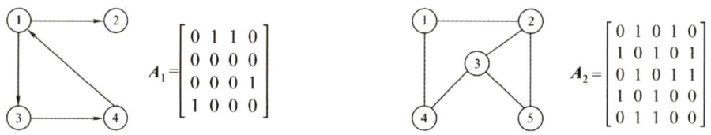  

(a)有向图 $G_{1}$ 及其邻接矩阵(b)无向图 $G_{2}$ 及其邻接矩阵  

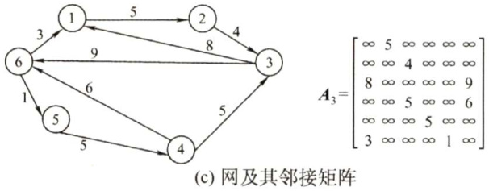  
图6.5有向图、无向图及网的邻接矩阵  

注意：  

$\textcircled{1}$ 在简单应用中，可直接用二维数组作为图的邻接矩阵（顶点信息等均可省略)。  

$\textcircled{2}$ 当邻接矩阵的元素仅表示相应边是否存在时，EdgeType可采用值为0和1的枚举类型。  

$\textcircled{3}$ 无向图的邻接矩阵是对称矩阵，对规模特大的邻接矩阵可采用压缩存储。  

$\textcircled{4}$ 邻接矩阵表示法的空间复杂度为 $O(n^{2})$ ，其中 $n$ 为图的顶点数 $|\boldsymbol{\eta}|$ 。  

图的邻接矩阵存储表示法具有以下特点：  

$\textcircled{1}$ 无向图的邻接矩阵一定是一个对称矩阵（并且唯一)。因此，在实际存储邻接矩阵时只需存储上（或下）三角矩阵的元素。  

$\textcircled{2}$ 对于无向图，邻接矩阵的第 $i$ 行（或第 $i$ 列）非零元素（或非 $\infty$ 元素）的个数正好是顶点$i$ 的度 $\mathrm{TD}(\nu_{i})$ 。  
$\textcircled{3}$ 对于有向图，邻接矩阵的第 $i$ 行非零元素(或非 $\infty$ 元素)的个数正好是顶点 $i$ 的出度 $\mathrm{OD}(\nu_{i})$ .第 $i$ 列非零元素（或非 $\infty$ 元素）的个数正好是顶点 $i$ 的入度 $\mathrm{ID}(\nu_{i})$ 。  
$\textcircled{4}$ 用邻接矩阵存储图，很容易确定图中任意两个顶点之间是否有边相连。但是，要确定图中有多少条边，则必须按行、按列对每个元素进行检测，所花费的时间代价很大。  
$\textcircled{5}$ 稠密图适合使用邻接矩阵的存储表示。  
$\textcircled{6}$ 设图 $G$ 的邻接矩阵为 $A$ ， $A^{n}$ 的元素 $\boldsymbol{A}^{n}[i][j]$ 等于由顶点 $i$ 到顶点 $j$ 的长度为 $n$ 的路径的数目。该结论了解即可，证明方法请参考离散数学教材。  

#### 6.2.2 邻接表法  

当一个图为稀疏图时，使用邻接矩阵法显然要浪费大量的存储空间，而图的邻接表法结合了顺序存储和链式存储方法，大大减少了这种不必要的浪费。  

所谓邻接表，是指对图 $G$ 中的每个顶点 $\nu_{i}$ 建立一个单链表，第 $i$ 个单链表中的结点表示依附于顶点 $\nu_{i}$ 的边（对于有向图则是以顶点 $\nu_{i}$ 为尾的弧)，这个单链表就称为顶点 $\nu_{i}$ 的边表（对于有向图则称为出边表)。边表的头指针和顶点的数据信息采用顺序存储（称为顶点表)，所以在邻接表中存在两种结点：顶点表结点和边表结点，如图6.6所示。  

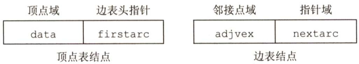  
图6.6顶点表和边表结点结构  

顶点表结点由顶点域（data）和指向第一条邻接边的指针（firstarc）构成，边表（邻接表）结点由邻接点域（adjvex）和指向下一条邻接边的指针域（nextarc）构成。无向图和有向图的邻接表的实例分别如图6.7和图6.8所示。  

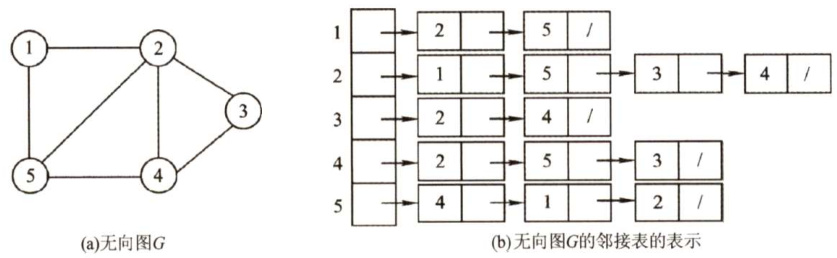  
图6.7无向图邻接表表示法实例  

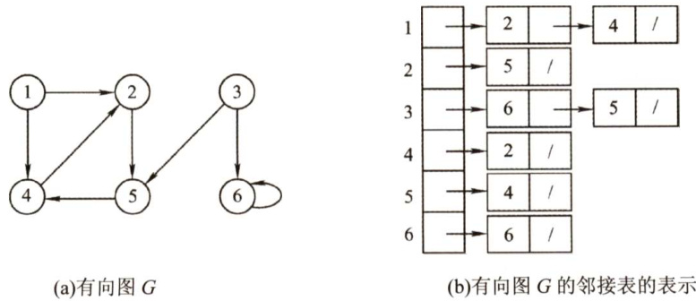  
图6.8有向图邻接表表示法实例  

图的邻接表存储结构定义如下：  

#define MaxVertexNum 100 //图中顶点数目的最大值  
typedef struct ArcNode{ //边表结点int adjvex; //该弧所指向的顶点的位置struct ArcNode \*next; //指向下一条弧的指针//InfoType info; //网的边权值  
}ArcNode;  
typedef struct VNode{ //顶点表结点VertexType data; //顶点信息ArcNode \*first; //指向第一条依附该顶点的弧的指针  
}VNode,AdjList[MaxVertexNum];  
typedef struct{AdjList vertices; //邻接表int vexnum,arcnum; //图的顶点数和弧数  
}ALGraph; //ALGraph是以邻接表存储的图类型  

图的邻接表存储方法具有以下特点：  

$\textcircled{1}$ 若 $G$ 为无向图，则所需的存储空间为 $O(|V|+2|E|)$ ；若 $G$ 为有向图，则所需的存储空间为$O(|V|+|E|)$ 。前者的倍数2是由于无向图中，每条边在邻接表中出现了两次。  
$\textcircled{2}$ 对于稀疏图，采用邻接表表示将极大地节省存储空间。  
$\textcircled{3}$ 在邻接表中，给定一顶点，能很容易地找出它的所有邻边，因为只需要读取它的邻接表。在邻接矩阵中，相同的操作则需要扫描一行，花费的时间为 $O(n)$ 。但是，若要确定给定的两个顶点间是否存在边，则在邻接矩阵中可以立刻查到，而在邻接表中则需要在相应结点对应的边表中查找另一结点，效率较低。  
$\textcircled{4}$ 在有向图的邻接表表示中，求一个给定顶点的出度只需计算其邻接表中的结点个数；但求其顶点的入度则需要遍历全部的邻接表。因此，也有人采用逆邻接表的存储方式来加速求解给定顶点的入度。当然，这实际上与邻接表存储方式是类似的。  
$\textcircled{5}$ 图的邻接表表示并不唯一，因为在每个顶点对应的单链表中，各边结点的链接次序可以是任意的，它取决于建立邻接表的算法及边的输入次序。  

#### 6.2.3 十字链表  

十字链表是有向图的一种链式存储结构。在十字链表中，对应于有向图中的每条弧有一个结点，对应于每个顶点也有一个结点。这些结点的结构如下图所示。  

<html><body><table><tr><td colspan="6">弧结点</td><td colspan="2">顶点结点</td></tr><tr><td>tailvex</td><td>headvex</td><td>hlink</td><td>tlink</td><td>info</td><td>data</td><td>firstin</td><td>firstout</td></tr><tr><td></td><td></td><td></td><td></td><td></td><td></td><td></td><td></td></tr></table></body></html>  

弧结点中有5个域：尾域（tailvex）和头域（headvex）分别指示弧尾和弧头这两个顶点在图中的位置；链域hlink指向弧头相同的下一条弧；链域tlink指向弧尾相同的下一条弧;info域指向该弧的相关信息。这样，弧头相同的弧就在同一个链表上，弧尾相同的弧也在同一个链表上。  

顶点结点中有3个域：data 域存放顶点相关的数据信息，如顶点名称；firstin 和firstout两个域分别指向以该顶点为弧头或弧尾的第一个弧结点。  

图6.9为有向图的十字链表表示法。注意，顶点结点之间是顺序存储的。  

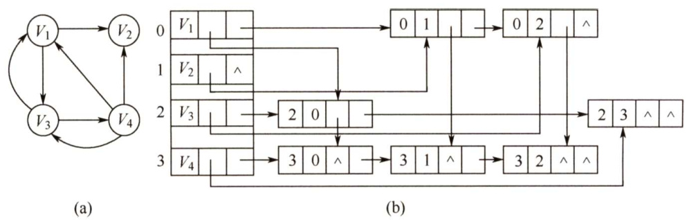  
图6.9有向图的十字链表表示  

在十字链表中，既容易找到 $V_{i}$ 为尾的弧，又容易找到 $V_{i}$ 为头的弧，因而容易求得顶点的出度和入度。图的十字链表表示是不唯一的，但一个十字链表表示确定一个图。  

#### 6.2.4 邻接多重表  

邻接多重表是无向图的另一种链式存储结构。  

在邻接表中，容易求得顶点和边的各种信息，但在邻接表中求两个顶点之间是否存在边而对边执行删除等操作时，需要分别在两个顶点的边表中遍历，效率较低。  

与十字链表类似，在邻接多重表中，每条边用一个结点表示，其结构如下所示。  

<html><body><table><tr><td>mark</td><td>ivex</td><td>ilink</td><td>jvex</td><td>jlink</td><td>info</td></tr><tr><td></td><td></td><td></td><td></td><td></td><td></td></tr></table></body></html>  

其中，mark为标志域，可用以标记该条边是否被搜索过；ivex和jvex为该边依附的两个顶点在图中的位置；ilink指向下一条依附于顶点ivex的边；jlink指向下一条依附于顶点jvex的边，info为指向和边相关的各种信息的指针域。  

每个顶点也用一个结点表示，它由如下所示的两个域组成。  

<html><body><table><tr><td>data</td><td>firstedge</td></tr></table></body></html>  

其中，data域存储该顶点的相关信息，firstedge域指示第一条依附于该顶点的边。  

在邻接多重表中，所有依附于同一顶点的边串联在同一链表中，由于每条边依附于两个顶点，因此每个边结点同时链接在两个链表中。对无向图而言，其邻接多重表和邻接表的差别仅在于，同一条边在邻接表中用两个结点表示，而在邻接多重表中只有一个结点。  

图6.10为无向图的邻接多重表表示法。邻接多重表的各种基本操作的实现和邻接表类似。  

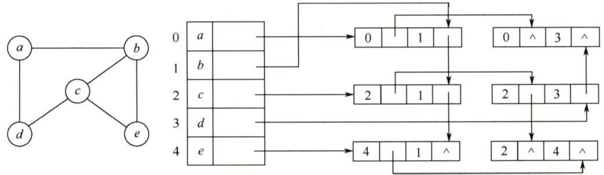  
第6章图  
图6.10无向图的邻接多重表表示  

#### 6.2.5 图的基本操作  

图的基本操作是独立于图的存储结构的。而对于不同的存储方式，操作算法的具体实现会有着不同的性能。在设计具体算法的实现时，应考虑采用何种存储方式的算法效率会更高。  

图的基本操作主要包括（仅抽象地考虑，故忽略掉各变量的类型)：  

·Adjacent $(\mathsf{G},\mathsf{x},\mathsf{y})$ ：判断图 $G$ 是否存在边 $_{<x}$ y>或 $(x,y)$ o  
· Neighbors $(\mathsf{G},\mathsf{x})$ ：列出图 $G$ 中与结点 $x$ 邻接的边。  
）InsertVertex $(\mathsf{G},\mathsf{x})$ ：在图 $G$ 中插入顶点 $x$ 0  
）DeleteVertex $(\mathsf{G},\mathsf{x})$ ：从图 $G$ 中删除顶点 $x$ o  
AddEdge $(\mathsf{G},\mathsf{x},\mathsf{y})$ ：若无向边 $(x,y)$ 或有向边 $<x,y>$ 不存在，则向图 $G$ 中添加该边。RemoveEdge $(\mathsf{G},\mathsf{x},\mathsf{y})$ ：若无向边 $(x,y)$ 或有向边 $<x,y>$ 存在，则从图 $G$ 中删除该边。  
FirstNeighbor $(\mathsf{G},\mathsf{x})$ ：求图 $G$ 中顶点 $x$ 的第一个邻接点，若有则返回顶点号。若 $x$ 没有邻接点或图中不存在 $x$ ，则返回-1。  
·NextNeighbor $(\mathsf{G},\mathsf{x},\mathsf{y})$ ：假设图 $G$ 中顶点 $y$ 是顶点 $x$ 的一个邻接点，返回除 $_y$ 外顶点$x$ 的下一个邻接点的顶点号，若 $y$ 是 $x$ 的最后一个邻接点，则返回-1。  
· Get_edge_value $(\mathsf{G},\mathsf{x},\mathsf{y})$ ：获取图 $G$ 中边 $(x,y)$ 或 $_{<x}$ y>对应的权值。  
· Set_edge_value $(\mathsf{G},\mathsf{x},\mathsf{y},\mathsf{v})$ ：设置图 $G$ 中边 $(x,y)$ 或 $_{<x}$ ,y>对应的权值为 $\nu$ 0  

此外，还有图的遍历算法：按照某种方式访问图中的每个顶点且仅访问一次。图的遍历算法包括深度优先遍历和广度优先遍历，具体见下一节的内容。  

#### 6.2.6 本节试题精选  

#### 一、单项选择题  

01．关于图的存储结构，（）是错误的。  

A．使用邻接矩阵存储一个图时，在不考虑压缩存储的情况下，所占用的存储空间大小只与图中的顶点数有关，与边数无关B.邻接表只用于有向图的存储，邻接矩阵适用于有向图和无向图C．若一个有向图的邻接矩阵的对角线以下的元素为0，则该图的拓扑序列必定存在D.存储无向图的邻接矩阵是对称的，故只需存储邻接矩阵的下（或上）三角部分  

02.若图的邻接矩阵中主对角线上的元素皆为0，其余元素全为1，则可以断定该图一定（）。  

A.是无向图 B．是有向图 C．是完全图 D．不是带权图在含有 $n$ 个顶点和 $e$ 条边的无向图的邻接矩阵中，零元素的个数为（）。  

A. $e$ B. $2e$ C. $n^{2}-e$ D. $n^{2}-2e$  

04．带权有向图 $G$ 用邻接矩阵存储，则 $\nu_{i}$ 的入度等于邻接矩阵中（）。  

A.第 $i$ 行非 $\infty$ 的元素个数 B.第 $i$ 列非 $\infty$ 的元素个数 C.第 $i$ 行非 $\infty$ 且非0的元素个数 D.第 $i$ 列非 $\infty$ 且非0的元素个数  

05.一个有 $n$ 个顶点的图用邻接矩阵 $\pmb{A}$ 表示，若图为有向图，顶点 $\nu_{i}$ 的入度是（）；若图为无向图，顶点 $\nu_{i}$ 的度是（）。  

A. $\sum_{i=1}^{n}A[i][j]$ $\begin{array}{r l}{{\mathrm{\bf~B}.}}&{{}{\displaystyle\sum_{j=1}^{n}{\cal A}[j][i]}}\\ {{\mathrm{\bf~D}.}}&{{}{\displaystyle\sum_{j=1}^{n}{\cal A}[j][i]\apropto\sum_{j=1}^{n}{\cal A}[i][j]}}\end{array}$   
C. $\sum_{i=1}^{n}A[j][i]$  

06．下列哪种图的邻接矩阵是对称矩阵？（）  

A.有向网 B．无向网 C.AOV网 D.AOE网  

07．从邻接矩阵 $A={\left[\begin{array}{l l l}{0}&{1}&{0}\\ {1}&{0}&{1}\\ {0}&{1}&{0}\end{array}\right]}.$ 可以看出，该图共有（ $\textcircled{1}$ ）个顶点；若是有向图，则该图共有（ $\textcircled{2}$ ）条弧；若是无向图，则共有（ $\textcircled{3}$ ）条边。  

$\textcircled{1}$ A.9 B.3 C.6 D.1 E．以上答案均不正确 $\textcircled{2}$ A.5 B.4 C.3 D.2 E．以上答案均不正确 $\textcircled{3}$ A.5 B.4 C.3 D.2 E．以上答案均不正确  

08.以下关于图的存储结构的叙述中，正确的是（）。  

A.一个图的邻接矩阵表示唯一，邻接表表示唯一B.一个图的邻接矩阵表示唯一，邻接表表示不唯一C.一个图的邻接矩阵表示不唯一，邻接表表示唯一D.一个图的邻接矩阵表示不唯一，邻接表表示不唯一  

09.用邻接表法存储图所用的空间大小（）。  

A.与图的顶点数和边数有关 B.只与图的边数有关C.只与图的顶点数有关 D．与边数的平方有关  

10.若邻接表中有奇数个边表结点，则（）。  

A.图中有奇数个结点 B．图中有偶数个结点C.图为无向图 D．图为有向图  

11.在有向图的邻接表存储结构中，顶点 $\nu$ 在边表中出现的次数是（）。  

A.顶点 $\nu$ 的度 B.顶点 $\nu$ 的出度C.顶点 $\nu$ 的入度 D.依附于顶点 $\nu$ 的边数  

12. $n$ 个顶点的无向图的邻接表最多有（）个边表结点。  

A. $n^{2}$ B. $n(n\mathrm{~-~}1)$ C. $n(n+1)$ D. $n(n\mathrm{~-~}1)/2$  

13．假设有 $n$ 个顶点、 $e$ 条边的有向图用邻接表表示，则删除与某个顶点 $\nu$ 相关的所有边的时间复杂度为（）。  

A. $O(n)$ B. O(e) C. $O(n+e)$ D. O(ne)  

14.对邻接表的叙述中，（）是正确的。  

A.无向图的邻接表中，第 $i$ 个顶点的度为第 $i$ 个链表中结点数的两倍  
B.邻接表比邻接矩阵的操作更简便  
C．邻接矩阵比邻接表的操作更简便  
D.求有向图结点的度，必须遍历整个邻接表  

15．邻接多重表是（）的存储结构。  

A．无向图 B.有向图C.无向图和有向图 D．都不是  

16．十字链表是（）的存储结构。  

A．无向图 B.有向图C.无向图和有向图 D．都不是  

#### 二、综合应用题  

01．已知带权有向图 $G$ 的邻接矩阵如下图所示，请画出该带权有向图 $G_{\circ}$  

<html><body><table><tr><td rowspan="2">0</td><td rowspan="2">15</td><td rowspan="2">2</td><td rowspan="2">12</td><td rowspan="2">8</td><td rowspan="2">8</td><td rowspan="2">8</td></tr><tr><td></td></tr><tr><td>8</td><td>0</td><td>8</td><td>8</td><td>6</td><td>8</td><td>8</td></tr><tr><td>8</td><td>8</td><td>0</td><td>8</td><td>8</td><td>4</td><td>8</td></tr><tr><td>8</td><td>8</td><td>8</td><td>0</td><td>8</td><td>8</td><td>3</td></tr><tr><td>8</td><td>8</td><td>8</td><td>8</td><td>0</td><td>8</td><td>9</td></tr><tr><td>8</td><td>8</td><td>8</td><td>5</td><td>8</td><td>0</td><td>10</td></tr><tr><td>8</td><td>4</td><td>8</td><td>8</td><td>8</td><td>8</td><td>0</td></tr></table></body></html>  

02.设图 $G=(V,E)$ 以邻接表存储，如下图所示。画出其邻接矩阵存储及图 $G_{\circ}$  

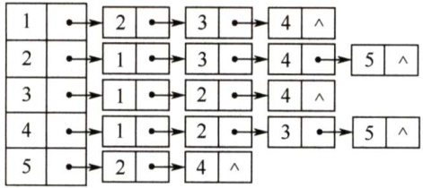  

03.对 $n$ 个顶点的无向图和有向图，分别采用邻接矩阵和邻接表表示时，试问：  

1）如何判别图中有多少条边？  
2）如何判别任意两个顶点 $i$ 和 $j$ 是否有边相连？  
3）任意一个顶点的度是多少？  

04.写出从图的邻接表表示转换成邻接矩阵表示的算法。  

05.【2015统考真题】已知含有5个顶点的图 $G$ 如下图所示。  

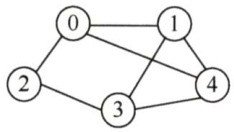  

请回答下列问题：  

1）写出图 $G$ 的邻接矩阵 $\pmb{A}$ （行、列下标从0开始）。  
2）求 $A^{2}$ ，矩阵 $A^{2}$ 中位于0行3列元素值的含义是什么？  
3）若已知具有 $n$ （ $n\geq2$ ）个顶点的图的邻接矩阵为 $\pmb{B}$ ，则 $\pmb{B}^{m}$ （ $2\leq m\leq n$ ）中非零元素的含义是什么？  

06.【2021统考真题】已知无向连通图 $G$ 由顶点集 $V$ 和边集 $E$ 组成， $|E|>0$ ，当 $G$ 中度为奇数的顶点个数为不大于2的偶数时， $G$ 存在包含所有边且长度为 $|E|$ 的路径（称为EL路径)。设图 $G$ 采用邻接矩阵存储，类型定义如下：  

typedef struct{ //图的定义 int numVertices,numEdges; //图中实际的顶点数和边数 char VerticesList[MAXV]; //顶点表。MAXV为已定义常量 int Edge[MAXV][MAXV]； //邻接矩阵 }MGraph;  

请设计算法 intIsExistEL(MGraph G)，判断G是否存在EL路径，若存在，则返回1，否则返回0。要求：  

1）给出算法的基本设计思想。  
2）根据设计思想，采用C或 $^{C++}$ 语言描述算法，关键之处给出注释。  
3）说明你所设计算法的时间复杂度和空间复杂度。  

#### 6.2.7 答案与解析  

#### 一、单项选择题  

01.B  

$n$ 个顶点的图，若采用邻接矩阵表示，不考虑压缩存储，则存储空间大小为 $O(n^{2})$ ，A正确。邻接表可用于存储无向图，只是把每条边都视为两条方向相反的有向边，因此需要存储两次，B错误。由于邻接矩阵中对角线以下的元素全为0，若存在 $<i,j>$ ，则必然有 $i<j$ ，由传递性可知图中路径的顶点编号是依次递增的，假设存在环 $k{\rightarrow}\cdots{\rightarrow}j{\rightarrow}k$ ，由题设可知 $k<j<k$ ，矛盾，故不存在环，拓扑序列必定存在，C正确。选项D显然正确。  

注意：若邻接矩阵对角线以下（或以上）的元素全为0，则图中必然不存在环，即拓扑序列一定存在，但这并不能说明拓扑序列是唯一的。  

02.C  

除主对角线上的元素外，其余元素全为1，说明任意两个顶点之间都有边相连，因此该图一定是完全图。  

03.D  

无向图的邻接矩阵中，矩阵大小为 $n^{2}$ ，非零元素的个数为 $2e$ ，故零元素的个数为 $n^{2}-2e$ 。读者应掌握此题的变体，即当无向图变为有向图时，能够求出零的个数和非零的个数。  

04.D  

有向图的邻接矩阵中，0和 $\infty$ 表示的都不是有向边，而入度是由邻接矩阵的列中元素计算出来的；出度是由邻接矩阵的行中元素计算出来的。  

05.B、D  

有向图的入度是其第 $i$ 列的非0元素之和，无向图的度是第 $i$ 行或第 $i$ 列的非0元素之和。  

06.B  

无向图的邻接矩阵存储中，每条边存储两次，且A[]]=A[][]。  

07.B、B、D  

邻接矩阵的顶点数等于矩阵的行（列）数，有向图的边数等于矩阵中非零元素的个数，无向图的边数等于矩阵中非零元素个数的一半。  

注意：本题中所给的矩阵为对称矩阵，若不是对称矩阵，则必然不可能是无向图。  

08.B  

邻接矩阵表示唯一是因为图中边的信息在矩阵中有确定的位置，邻接表不唯一是因为邻接表的建立取决于读入边的顺序和边表中的插入算法。  

09.A  

邻接表存储时，顶点数 $n$ 决定了顶点表的大小，边数 $e$ 决定了边表结点的个数，且无向图的  

每条边存储两次，总存储空间为 $O(n+2e)$ ，故选A。而邻接矩阵只与图的顶点数有关，为 $O(n^{2})$ 8  

10.D  

无向图采用邻接表表示时，每条边存储两次，所以其边表结点的个数为偶数。题中边表结点为奇数个，故必然是有向图，且有奇数条边。  

11.C  

题中的边表是不包括顶点表的。因为任何顶点 $\boldsymbol{u}$ 对应的边表中存放的都是以 $\boldsymbol{u}$ 为起点的边所对应的另一个顶点 $\nu$ 。从而 $\nu$ 在边表中出现的次数也就是它的入度。  

12.B  

$n$ 个顶点的无向图最多有 $n(n{-}1)/2$ 条边，每条边在邻接表中存储两次，所以边表结点最多为 $n(n-1)$ 个。  

13.C  

与顶点 $\nu$ 相关的边包括出边和入边，对于出边，只需遍历 $\nu$ 的顶点表结点和其指向的边表；对于入边，则需遍历整个边表。先删除出边：删除 $\boldsymbol{\nu}$ 的顶点表结点的单链表，出边数最多为 $n-1$ ，时间复杂度为 $O(n)$ ；再删除入边：扫描整个边表（即扫描剩余全部顶点表结点及其指向的边表)，删除所有的顶点 $\nu$ 的入边，时间复杂度为 $O(n+e)$ 。故总的时间复杂度为 $O(n+e)$ 。  

14.D  

无向图的邻接表中，第 $i$ 个顶点的度为第 $i$ 个链表中的结点数，故A错。邻接表和邻接矩阵对于不同的操作各有优势，B和C都不准确。有向图结点的度包括出度和入度，对于出度，需要遍历顶点表结点所对应的边表；对于入度，则需要遍历剩下的全部边表，故D正确。  

15.A  

邻接多重表是无向图的存储结构，选A。  

16.B十字链表是有向图的存储结构，选B。  

#### 二、综合应用题  

01.【解答】带权有向图 $G$ 如下图所示。  

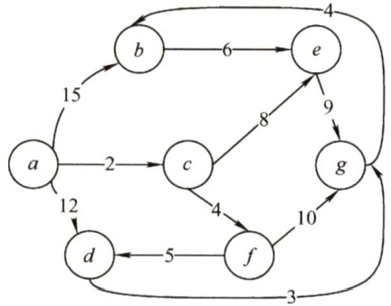  

02.【解答】  

其邻接矩阵存储如下所示。  

$$
\left[\begin{array}{l l l l l}{0}&{1}&{1}&{1}&{0}\\ {1}&{0}&{1}&{1}&{1}\\ {1}&{1}&{0}&{1}&{0}\\ {1}&{1}&{1}&{0}&{1}\\ {0}&{1}&{0}&{1}&{0}\end{array}\right]
$$  

在邻接表中，每条边存储了2次，在没有特殊说明时，通常默认其为无向图（当然，无向图也可视为具有对边的有向图)。该邻接表对应的图 $G$ 如右图所示。  

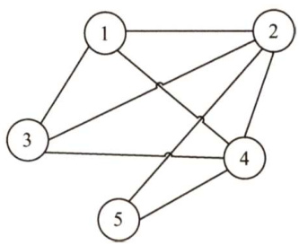  

03.【解答】  

1）对于邻接矩阵表示的无向图，边数等于矩阵中1的个数除以  
2；对于邻接表表示的无向图，边数等于边结点的个数除以2。  

对于邻接矩阵表示的有向图，边数等于矩阵中1的个数；对于邻接表表示的有向图，边数等于边结点的个数。  
2）在邻接矩阵表示的无向图或有向图中，对于任意两个顶点 $i$ 和 $j$ ，邻接矩阵中arcs[][]或arcs[j][]为1表示有边相连，否则表示无边相连。在邻接表表示的无向图或有向图中，对于任意两个顶点 $i$ 和 $j$ ，若从顶点表结点 $i$ 出发找到编号为 $j$ 的边表结点或从顶点表结点 $j$ 出发找到编号为 $i$ 的边表结点，表示有边相连；否则为无边相连。  
3）对于邻接矩阵表示的无向图，顶点 $i$ 的度等于第 $i$ 行中1的个数；对于邻接矩阵表示的有向图，顶点 $i$ 的出度等于第 $i$ 行中1的个数；入度等于第 $i$ 列中1的个数；度数等于它们的和。对于邻接表表示的无向图，顶点 $i$ 的度等于顶点表结点 $i$ 的单链表中边表结点的个数；对于邻接表表示的有向图，顶点 $i$ 的出度等于顶点表结点 $i$ 的单链表中边表结点的个数，顶点 $i$ 的入度等于邻接表中所有编号为 $i$ 的边表结点数；度数等于入度与出度之和。  

04.【解答】  

算法的基本思想：设图的顶点分别存储在数组v[n]中。首先初始化邻接矩阵。遍历邻接表，在依次遍历顶点 $\boldsymbol{\mathbf{\check{v}}}\left[\mathrm{i}\right]$ 的边链表时，修改邻接矩阵的第i行的元素值。若链表边结点的值为j，则置arcs[i][j] ${\bf\varepsilon}=1\$ 。遍历完邻接表时，整个转换过程结束。此算法对于无向图、有向图均适用。  

算法实现如下：  

void Convert（ALGraph &G,int arcs[M][N]）  
//此算法将邻接表方式表示的图G转换为邻接矩阵arcsfor $:i=0;i<n;i++)$ { //依次遍历各顶点表结点为头的边链表$p=(G\rightarrow v[i]$ ).firstarc; //取出顶点i的第一条出边while(p! $\c=$ NULL) //遍历边链表arcs[i][p->adjvex] $=1$ ：$p=p$ ->nextarc; //取下一条出边//while//for  

05.【解答】  

考查图的邻接矩阵的性质。1）图 $G$ 的邻接矩阵 $A$ 如下：  

2) $A^{2}$ 如下：  

$$
\scriptstyle A^{2}={\left[\begin{array}{l l l l}{3}&{1}&{0}&{3}&{1}\\ {1}&{3}&{2}&{1}&{2}\\ {0}&{2}&{2}&{0}&{2}\\ {3}&{1}&{0}&{3}&{1}\\ {1}&{2}&{2}&{1}&{3}\end{array}\right]}
$$  

0行3列的元素值3表示从顶点0到顶点3之间长度为2的路径共有3条。  

3) $\pmb{B}^{m}$ （ $2\leq m\leq n$ ）中位于 $i$ 行 $j$ 列（ $0\leq i,$ $j\leq n-1$ ）的非零元素的含义是，图中从顶点 $i$ 到顶点 $j$ 的长度为 $m$ 的路径条数。  

06.【解答】  

1）算法的基本设计思想  

本算法题属于送分题，题干已经告诉我们算法的思想。对于采用邻接矩阵存储的无向图，在邻接矩阵的每一行（列）中，非零元素的个数为本行（列）对应顶点的度。可以依次计算连通图$G$ 中各顶点的度，并记录度为奇数的顶点个数，若个数为0或2，则返回1，否则返回0。  

#### 2）算法实现  

int IsExistEL(MGraph G){ //采用邻接矩阵存储，判断图是否存在EL路径 int degree,i,j,count $=0$ ： for( $\dot{2}=0$ . $\dot{\mathsf{1}}<G$ .numVertices; $\dot{2}++$ ）{ degree $\scriptstyle=0$ . for $j=0$ $j<G$ .numVertices; $j++$ ） degree $+=G$ .Edge[i][j]; //依次计算各个顶点的度 if(degree%2 $:=0$ ） count $^{++}$ . //对度为奇数的顶点计数 } if(count $==0$ llcount $==2$ return 1; //存在EL路径，返回1 else return 0; //不存在EL路径，返回0  

3）时间复杂度和空间复杂度  

算法需要遍历整个邻接矩阵，所以时间复杂度是 $O(n^{2})$ ，空间复杂度是 $O(1)$ 0