### 6.3 图的遍历  

图的遍历是指从图中的某一顶点出发，按照某种搜索方法沿着图中的边对图中的所有顶点访问一次且仅访问一次。注意到树是一种特殊的图，所以树的遍历实际上也可视为一种特殊的图的遍历。图的遍历算法是求解图的连通性问题、拓扑排序和求关键路径等算法的基础。  

图的遍历比树的遍历要复杂得多，因为图的任一顶点都可能和其余的顶点相邻接，所以在访问某个顶点后，可能沿着某条路径搜索又回到该顶点上。为避免同一顶点被访问多次，在遍历图的过程中，必须记下每个已访问过的顶点，为此可以设一个辅助数组visited[]来标记顶点是否被访问过。图的遍历算法主要有两种：广度优先搜索和深度优先搜索。  

#### 6.3.1 广度优先搜索  

广度优先搜索（Breadth-First-Search，BFS）类似于二叉树的层序遍历算法。基本思想是：首先访问起始顶点 $\nu$ ，接着由 $\nu$ 出发，依次访问 $\nu$ 的各个未访问过的邻接顶点 $w_{1},w_{2},\cdots,w_{i},$ 然后依次访问 $w_{1}$ ， $w_{2},\cdots$ 。 $w_{i}$ 的所有未被访问过的邻接顶点；再从这些访问过的顶点出发，访问它们所有未被访问过的邻接顶点，直至图中所有顶点都被访问过为止。若此时图中尚有顶点未被访问，则另选图中一个未曾被访问的顶点作为始点，重复上述过程，直至图中所有顶点都被访问到为止。Dijkstra单源最短路径算法和 $\mathrm{Prim}$ 最小生成树算法也应用了类似的思想。  

换句话说，广度优先搜索遍历图的过程是以 $\boldsymbol{\nu}$ 为起始点，由近至远依次访问和 $\nu$ 有路径相通且路径长度为1，2，·的顶点。广度优先搜索是一种分层的查找过程，每向前走一步可能访问一批顶点，不像深度优先搜索那样有往回退的情况，因此它不是一个递归的算法。为了实现逐层的访问，算法必须借助一个辅助队列，以记忆正在访问的顶点的下一层顶点。  

广度优先搜索算法的伪代码如下：  

boolVisited[MAXVERTEXNUM]；//访问标记数组  
void BFsTraverse（Graph G){ //对图G进行广度优先遍历for $i=0$ $\frac{i}{2}<G$ .vexnum; $++\dot{2}$ ）visited[i] $\c=$ FALSE; //访问标记数组初始化InitQueue（Q）; //初始化辅助队列Qfor( $i=0$ ;i<G.vexnum; $++\dot{2}$ ) //从0号顶点开始遍历if(!visited[i]) //对每个连通分量调用一次BFSBFS(G,i); $1/\uptau_{\mathrm{i}}$ 未访问过，从 $\mathtt{v_{i}}$ 开始BFS  
)  
void BFS（Graph G,int v）{ //从顶点 $v$ 出发，广度优先遍历图Gvisit(v); //访问初始顶点vvisited[v] $\L=$ TRUE; //对 $v$ 做已访问标记Enqueue(Q,v）; //顶点 $v$ 入队列while（!isEmpty（Q））{DeQueue（Q,v); //顶点 $v$ 出队列for $w=$ FirstNeighbor（G,v); $w>=0$ $w=$ NextNeighbor（G,V,w))//检测 $v$ 所有邻接点if(!visited[w]）{ //w为 $v$ 的尚未访问的邻接顶点visit(w); //访问顶点wvisited[w] $\L=$ TRUE;//对 $w$ 做已访问标记EnQueue（Q,w）;//顶点 $w$ 入队列  

<html><body><table><tr><td>}//if }//while</td></tr></table></body></html>  

辅助数组visited[]标志顶点是否被访问过，其初始状态为FALSE。在图的遍历过程中，一旦某个顶点 $\nu_{i}$ 被访问，就立即置visited[i]为TRUE，防止它被多次访问。  

下面通过实例演示广度优先搜索的过程，给定图 $G$ 如图6.11所示。  

假设从 $a$ 结点开始访问， $a$ 先入队。此时队列非空，取出队头元素 $a$ 由于 $b,c$ 与 $a$ 邻接且未被访问过，于是依次访问 $b,c$ ，并将 $b,c$ 依次入队。队列非空，取出队头元素 $b$ ，依次访问与 $b$ 邻接且未被访问的顶点 $\scriptstyle d,e$ ，并将 $d,e$ 入队（注意： $a$ 与 $b$ 也邻接，但 $a$ 已置访问标记，故不再重复访问)。此时队列非空，取出队头元素 $\scriptstyle{c}$ ，访问与 $\scriptstyle{c}$ 邻接且未被访问的顶点 $f,g$ ，并将 $f,g$ 入队。此时，取出队头元素 $d$ ，但与 $d$ 邻接且未被访问的顶点为空，故不进行任何操作。继续取出队头元素 $e$ ，将 $h$ 入队列…最终取出队头元素 $h$ 后，队列为空，从而循环自动跳出。遍历结果为abcdefgh。  

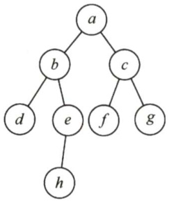  
图6.11一个无向图 $G$  

从上例不难看出，图的广度优先搜索的过程与二叉树的层序遍历是完全一致的，这也说明了图的广度优先搜索遍历算法是二叉树的层次遍历算法的扩展。  

图的广度优先遍历还可用于求一些问题的最优解，但初试方面很难涉及。  

#### 1.BFS算法的性能分析  

无论是邻接表还是邻接矩阵的存储方式，BFS算法都需要借助一个辅助队列 $\varrho$ ， $n$ 个顶点均需入队一次，在最坏的情况下，空间复杂度为 $O(|V|)$ o  

采用邻接表存储方式时，每个顶点均需搜索一次（或入队一次)，故时间复杂度为 $O(|V|)$ ，在搜索任一顶点的邻接点时，每条边至少访问一次，故时间复杂度为 $O(|E|)$ ，算法总的时间复杂度为 $O(|V|+|E|)$ 。采用邻接矩阵存储方式时，查找每个顶点的邻接点所需的时间为 $O(|V|)$ ，故算法总的时间复杂度为 $O(|V|^{2})$ o  

#### 2.BFS算法求解单源最短路径问题  

若图 $G=(V,E)$ 为非带权图，定义从顶点 $\boldsymbol{u}$ 到顶点 $\nu$ 的最短路径 $d(u,\nu)$ 为从 $\boldsymbol{u}$ 到 $\nu$ 的任何路径中最少的边数；若从 $u$ 到 $\nu$ 没有通路，则 $d(u,\nu)=\infty$ 。  

使用BFS，我们可以求解一个满足上述定义的非带权图的单源最短路径问题，这是由广度优先搜索总是按照距离由近到远来遍历图中每个顶点的性质决定的。  

BFS算法求解单源最短路径问题的算法如下：  

void BFS_MIN_Distance（Graph G,int u){  
//d[i]表示从u到i结点的最短路径for $\scriptstyle{\dot{\underline{{\mathbf{i}}}}}=0$ . $\frac{1}{2}<G$ .vexnum; $++\dot{2}$ ）$\mathrm{d}[\mathrm{i}]=\infty$ ： //初始化路径长度visited[u] $\c=$ TRUE;d[u] $=0$ ·EnQueue（Q,u）;while(!isEmpty（Q）） //BFS算法主过程DeQueue（Q,u）; //队头元素u出队for $w=$ FirstNeighbor（G,u); $w>=0$ $w=$ NextNeighbor（G,u,w))if(!visited[w]){ //w为u的尚未访问的邻接顶点visited[w] $\L=$ TRUE; //设已访问标记$\alpha[w]=\alpha[u]+1$ .. //路径长度加1  

  

#### 3．广度优先生成树  

在广度遍历的过程中，我们可以得到一棵遍历树，称为广度优先生成树，如图6.12所示。需要注意的是，一给定图的邻接矩阵存储表示是唯一的，故其广度优先生成树也是唯一的，但由于邻接表存储表示不唯一，故其广度优先生成树也是不唯一的。  

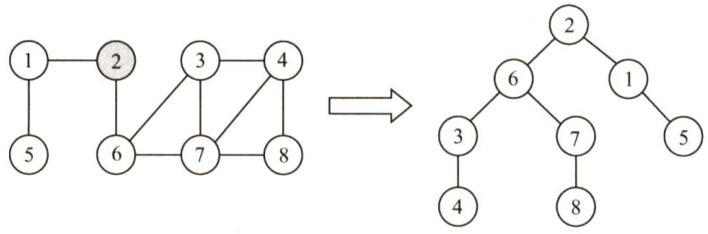  
图6.12 图的广度优先生成树  

#### 6.3.2 深度优先搜索  

与广度优先搜索不同，深度优先搜索（Depth-First-Search，DFS）类似于树的先序遍历。如其名称中所暗含的意思一样，这种搜索算法所遵循的搜索策略是尽可能“深”地搜索一个图。  

它的基本思想如下：首先访问图中某一起始顶点 $\nu$ ，然后由 $\nu$ 出发，访问与 $\nu$ 邻接且未被访问的任一顶点 $w_{1}$ ，再访问与 $w_{1}$ 邻接且未被访问的任一顶点 $w_{2}$ ……·重复上述过程。当不能再继续向下访问时，依次退回到最近被访问的顶点，若它还有邻接顶点未被访问过，则从该点开始继续上述搜索过程，直至图中所有顶点均被访问过为止。  

一般情况下，其递归形式的算法十分简洁，算法过程如下：  

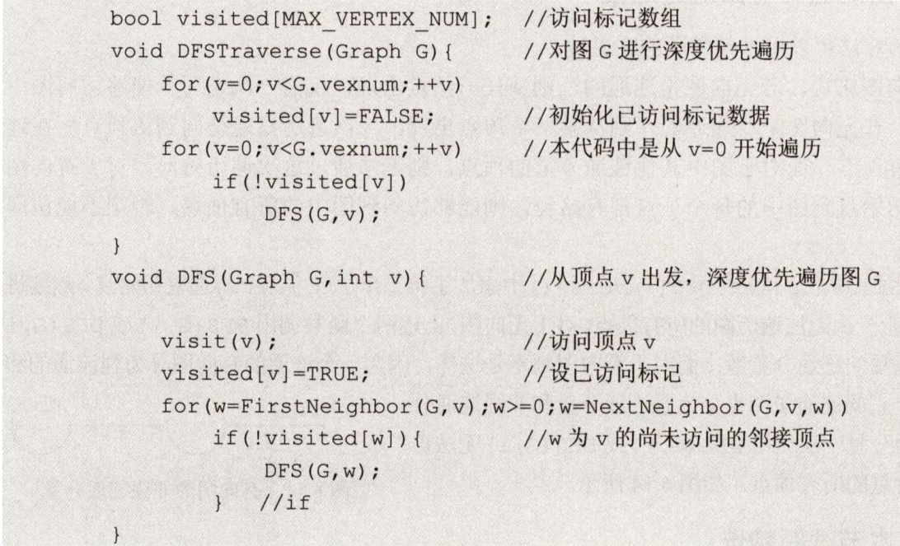  

以图6.11的无向图为例，深度优先搜索的过程：首先访问 $a$ ，并置 $a$ 访问标记；然后访问与$a$ 邻接且未被访问的顶点 $b$ ，置 $b$ 访问标记；然后访问与 $b$ 邻接且未被访问的顶点 $d$ ，置 $d$ 访问标记。此时 $d$ 已没有未被访问过的邻接点，故返回上一个访问过的顶点 $b$ ，访问与其邻接且未被访问的顶点 $e$ ，置 $e$ 访问标记…以此类推，直至图中所有的顶点都被访问一次。遍历结果为abdehcfg。  

注意：图的邻接矩阵表示是唯一的，但对于邻接表来说，若边的输入次序不同，生成的邻接表也不同。因此，对于同样一个图，基于邻接矩阵的遍历所得到的DFS序列和BFS序列是唯一的，基于邻接表的遍历所得到的DFS序列和BFS序列是不唯一的。  

#### 1.DFS算法的性能分析  

DFS 算法是一个递归算法，需要借助一个递归工作栈，故其空间复杂度为 $O(|V|)$  

遍历图的过程实质上是对每个顶点查找其邻接点的过程，其耗费的时间取决于所用的存储结构。以邻接矩阵表示时，查找每个顶点的邻接点所需的时间为 $O(|V|)$ ，故总的时间复杂度为 $O(|V|^{2})$ 。以邻接表表示时，查找所有顶点的邻接点所需的时间为 $O(|E|)$ ，访问顶点所需的时间为 $O(|V|)$ ，此时，总的时间复杂度为 $O(|V|+|E|)$ 0  

#### 2.深度优先的生成树和生成森林  

与广度优先搜索一样，深度优先搜索也会产生一棵深度优先生成树。当然，这是有条件的，即对连通图调用DFS 才能产生深度优先生成树，否则产生的将是深度优先生成森林，如图 6.13所示。与BFS类似，基于邻接表存储的深度优先生成树是不唯一的。  

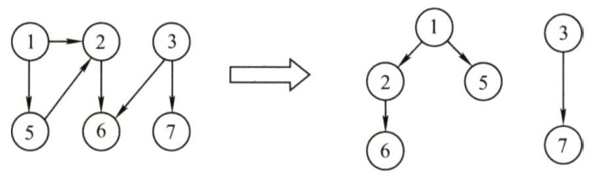  
图6.13图的深度优先生成森林  

#### 6.3.3 图的遍历与图的连通性  

图的遍历算法可以用来判断图的连通性。  

对于无向图来说，若无向图是连通的，则从任一结点出发，仅需一次遍历就能够访问图中的所有顶点；若无向图是非连通的，则从某一个顶点出发，一次遍历只能访问到该顶点所在连通分量的所有顶点，而对于图中其他连通分量的顶点，则无法通过这次遍历访问。对于有向图来说，若从初始点到图中的每个顶点都有路径，则能够访问到图中的所有顶点，否则不能访问到所有顶点。  

故在 BFSTraverse()或DFSTraverse()中添加了第二个for 循环，再选取初始点，继续进行遍历，以防止一次无法遍历图的所有顶点。对于无向图，上述两个函数调用BFS(G,i)或DFS（G,i）的次数等于该图的连通分量数；而对于有向图则不是这样，因为一个连通的有向图分为强连通的和非强连通的，它的连通子图也分为强连通分量和非强连通分量，非强连通分量一次调用BFS(G，i)或DFS(G，i)无法访问到该连通分量的所有顶点，如图6.14所示。  

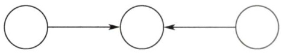  
图6.14有向图的非强连通分量  

#### 6.3.4 本节试题精选  

#### 一、单项选择题  

01．下列关于广度优先算法的说法中，正确的是（）。  

I．当各边的权值相等时，广度优先算法可以解决单源最短路径问题II．当各边的权值不等时，广度优先算法可用来解决单源最短路径问题III．广度优先遍历算法类似于树中的后序遍历算法IV．实现图的广度优先算法时，使用的数据结构是队列  

A.I、IV B、Ⅱ、、IV C.Ⅱ、IV D.I、II、IV  

02.对于一个非连通无向图 $G$ ，采用深度优先遍历访问所有顶点，在DFSTraVerSe函数（见考点讲解DFS部分）中调用DFS的次数正好等于（）。  

A．顶点数 B．边数 C．连通分量数 D.不确定  

03.对一个有 $n$ 个顶点、 $e$ 条边的图采用邻接表表示时，进行DFS遍历的时间复杂度为（），空间复杂度为（）；进行BFS遍历的时间复杂度为（），空间复杂度为（）。  

A. $O(n)$ B. O(e) C. $O(n+e)$ D. 0(1)  

04.对有 $n$ 个顶点、 $e$ 条边的图采用邻接矩阵表示时，进行DFS遍历的时间复杂度为（），进行BFS遍历的时间复杂度为（）。  

A. $O(n^{2})$ B. O(e) C. $O(n+e)$ D. O(e2)  

05.无向图 $G=(V,E)$ ，其中 $V=\{a,b,c,d,e,f\},\ E=\{(a,b),(a,e),(a,c),(b,e),(c,f),(f,d),(e,f)\},$ $\left.d\right\rangle\right\}$ ，对该图从 $a$ 开始进行深度优先遍历，得到的顶点序列正确的是（）。  

$$
\begin{array}{r l}{\iota,b,e,c,d,f\quad}&{{}\mathrm{B.}a,c,f,e,b,d\qquad\mathrm{C.}a,e,b,c,f,d\qquad\mathrm{D.}a,e,d,f,c,b}\end{array}
$$  

如下图所示，在下面的5个序列中，符合深度优先遍历的序列个数是（）。  

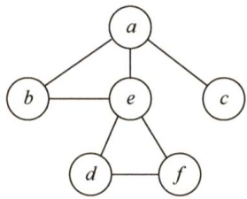  

1. aebfdc 2. acfdeb 3. aedfcb 4. aefdbc 5. aecfdb  

A.5 B.4 C.3 D.2  

07．用邻接表存储的图的深度优先遍历算法类似于树的（），而其广度优先遍历算法类似于树的（）。  

A．中序遍历 B．先序遍历 C．后序遍历 D．按层次遍历  

08．一个有向图 $G$ 的邻接表存储如下图所示，从顶点1出发，对图 $G$ 调用深度优先遍历所得顶点序列是（）；按广度优先遍历所得顶点序列是（）。  

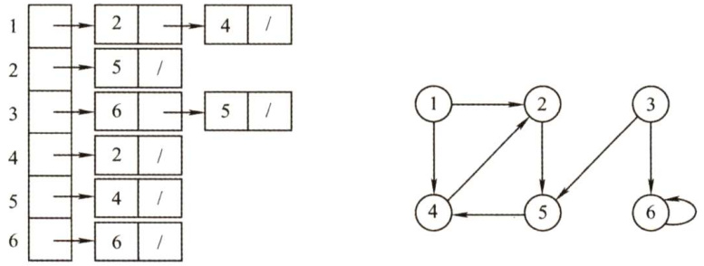  

A.125436 B.124536 C.124563 D.362514  

09.无向图 $G=(V,E)$ ，其中 $V=\{a,b,c,d,e,f\}$ ， $E=\{(a,b)$ ， $(a,e)$ ,(a,c)，(b,e),(c,f），(f,d),(e，$\left.d\right\rangle\right\}$ 。对该图进行深度优先遍历，不能得到的序列是（）。  

A.acfdeb B. aebdfc C. aedfcb D. abecdf  

10．判断有向图中是否存在回路，除可以利用拓扑排序外，还可以利用（）。  

A.求关键路径的方法 B．求最短路径的Dijkstra算法C.深度优先遍历算法 D.广度优先遍历算法  

11.使用DFS算法递归地遍历一个无环有向图，并在退出递归时输出相应顶点，这样得到的顶点序列是（）。  

A.逆拓扑有序 B．拓扑有序 C．无序的 D.都不是  

2.设无向图 $G=(V,E)$ 和 $G^{\prime}=(V^{\prime},E^{\prime})$ ，若 $G$ 是 $G$ 的生成树，则下列说法中错误的是（）  

A. $G^{\prime}$ 为 $G$ 的子图 B. $G^{\prime}$ 为 $G$ 的连通分量C. $G$ 为 $G$ 的极小连通子图且 $V=V^{\prime}$ D. $G$ 是 $G$ 的一个无环子图  

13．图的广度优先生成树的树高比深度优先生成树的树高（）。  

A．小或相等 B.小 C．大或相等 D.大  

14.对有 $n$ 个顶点、 $e$ 条边且使用邻接表存储的有向图进行广度优先遍历，其算法的时间复杂度是（）。  

A. $O(n)$ B. O(e) C. $O(n+e)$ D. O(ne)  

15.【2013统考真题】若对如下无向图进行遍历，则下列选项中，不是广度优先遍历序列的是（）。  

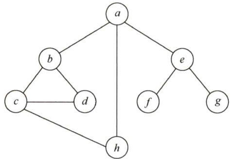  

A. $h,c,a,b,d,e,g,f$ B. $e,a,f,g,b,h,c,d$   
C. d, b, c,a,h,e,f,g D. $a,b,c,d,h,e,f,g$  

16.【2015统考真题】设有向图 $G=(V,E)$ 顶点集 $V=\{V_{0},V_{1},V_{2},V_{3}\},$ 边集 $E=\{<\nu_{0},\nu_{1}>,<\nu_{0},\nu_{2}>,$ $<\nu_{0},\nu_{3}>$ 。 $<\nu_{1},\nu_{3}>\}$ 。若从顶点 $V_{0}$ 开始对图进行深度优先遍历，则可能得到的不同遍历序列个数是（）。  

A.2 B.3 C.4 D.5  

17.【2016统考真题】下列选项中，不是下图深度优先搜索序列的是（）。  

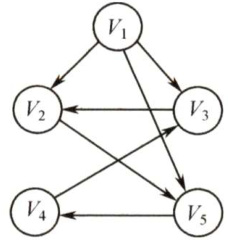  

A. $V_{1},V_{5},V_{4},V_{3},V_{2}$ B. $V_{1},V_{3},V_{2},V_{5},V_{4}$   
C. $V_{1},V_{2},V_{5},V_{4},V_{3}$ D. $V_{1},V_{2},V_{3},V_{4},V_{5}$  

#### 二、综合应用题  

01.图 $G=(V,E)$ 以邻接表存储，如下图所示，试画出图 $G$ 的深度优先生成树和广度优先生  

成树（假设从结点1开始遍历）。  

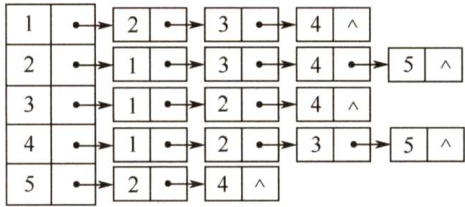  

02．试设计一个算法，判断一个无向图 $G$ 是否为一棵树。若是一棵树，则算法返回true，否则返回false。  

03.写出图的深度优先搜索DFS算法的非递归算法（图采用邻接表形式）。  

04.分别采用基于深度优先遍历和广度优先遍历算法判别以邻接表方式存储的有向图中是否存在由顶点 $\nu_{\mathrm{i}}$ 到顶点 $\nu_{j}$ 的路径（ $i\neq j$ )。注意，算法中涉及的图的基本操作必须在此存储结构上实现。  

05．假设图用邻接表表示，设计一个算法，输出从顶点 $V_{i}$ 到顶点 $V_{j}$ 的所有简单路径。  

#### 6.3.5 答案与解析  

#### 一、单项选择题  

01.A  

广度优先搜索以起始结点为中心，一层一层地向外层扩展遍历图的顶点，因此无法考虑到边权值，只适合求边权值相等的图的单源最短路径。广度优先搜索相当于树的层序遍历，II错误。广度优先搜索需要用到队列，深度优先搜索需要用到栈，IV正确。  

02.C  

DFS（或BFS）可用来计算图的连通分量数，因为一次遍历必然会将一个连通图中的所有顶点都访问到，而对于已被访问的顶点将不再调用DFS，故计算图的连通分量数正好是DFSTraverse（)中DFS被调用的次数。  

03.C、A、C、A  

深度优先遍历时，每个顶点表结点和每个边表结点均查找一次，每个顶点递归调用一次，需要借助一个递归工作栈；而广度优先遍历时，也是每个顶点表结点和每个边表结点均查找一次，每个顶点进入队列一次。故都是选C,A。  

04.A、A  

采用邻接矩阵表示时，查找一个顶点所有出边的时间复杂度为 $O(n)$ ，共有 $n$ 个顶点，故时间复杂度均为 $O(n^{2})$ 。  

05.D  

画出草图后，此类题可以根据边的邻接关系快速排除错误选项。以A为例，在遍历到 $e$ 之后，应该访问与 $e$ 邻接但未被访问的结点， $(e,c)$ 显然不在边集中。  

06.D  

仅1和4正确。以2为例，遍历到 $\scriptstyle{\begin{array}{l}{c}\end{array}}$ 之后，与 $\mathbf{\Psi}_{c}$ 邻接且未被访问的结点为空集，所以应为 $a$  

的邻接点 $b$ 或e入栈。以3为例，因为遍历要按栈退回，所以是先 $b$ 后 $\mid c\mid$ ，而不能先 $\mathbf{\Psi}_{c}$ 后 $b_{\circ}$  

07.B、D  

图的深度优先搜索类似于树的先根遍历，即先访问结点，再递归向外层结点遍历，都采用回溯算法。图的广度优先搜索类似于树的层序遍历，即一层一层向外层扩展遍历，都需要采用队列来辅助算法的实现。  

08.A、B  

DFS序列产生的路径为 $^{<1}$ $2>$ $<2$ . $5>$ $<5$ 。 $^{4>}$ 。 $^{<3}$ $_{6>}$ ;BFS序列产生的路径为 $^{<1}$ $2>$ $\angle1,4>,<2\$ $5>$ $^{<3}$ $6>$ 。  

09.D  

画出 $V$ 和 $E$ 对应的图 $G$ ，然后根据搜索算法求解。  

这里应注意：为什么本题序列是不唯一的，而上题却是唯一的呢？  

因为上题给出了具体的存储结构，此时就必须按照算法的过程来执行，每个顶点的邻接点的顺序已固定，但本题中每个顶点的邻接点的顺序是非固定的。  

10. C  

利用深度优先遍历可以判断图 $G$ 中是否存在回路。对于无向图来说，若深度优先遍历过程中遇到了回边，则必定存在环；对于有向图来说，这条回边可能是指向深度优先森林中另一棵生成树上的顶点的弧；但是，从有向图的某个顶点 $\nu$ 出发进行深度优先遍历时，若在DFS(v)结束之前出现一条从顶点 $\boldsymbol{u}$ 到顶点 $\nu$ 的回边，且 $\boldsymbol{u}$ 在生成树上是 $\nu$ 的子孙，则有向图必定存在包含顶点 $\mathbf{\Lambda}_{\nu}$ 和顶点 $\boldsymbol{u}$ 的环。  

11.A  

对一个有向图做深度优先遍历，并未专门判断有向图是否有环（有向回路）存在，无论图中是否有环，都得到一个顶点序列。若无环，在退出递归过程中输出的应是逆拓扑有序序列。对有向无环图利用深度优先搜索进行拓扑排序的例子如下：如下图所示，退出DFS 栈的顺序为efgdcahb，此图的一个拓扑序列为bhacdgfe。该方法的每一步均是先输出当前无后继的结点，即对每个结点 $\nu$ ，先递归地求出 $\nu$ 的每个后继的拓扑序列。对于一个AOV网，按此方法输出的序列是一个逆拓扑序列。  

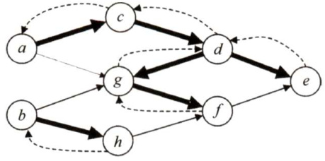  

12.B  

连通分量是无向图的极大连通子图，其中极大的含义是将依附于连通分量中顶点的所有边都加上，所以连通分量中可能存在回路，这样就不是生成树了。  

注意：极大连通子图是无向图（不一定连通）的连通分量，极小连通子图是连通无向图的生成树。极小和极大是在满足连通的前提下，针对边的数目而言的。极大连通子图包含连通分量的全部边；极小连通子图（生成树）包含连通图的全部顶点，且使其连通的边数最少。  

13.A  

对于无向图的广度优先搜索生成树，起点到其他顶点的路径是图中对应的最短路径，即所有生成树中树高最小。此外，深度优先总是尽可能“深”地搜索图，因此其路径也尽可能长，故深度优先生成树的树高总是大于等于广度优先生成树的树高。  

14.C  

广度优先遍历需要借助队列实现。采用邻接表存储方式对图进行广度优先遍历时，每个顶点均需入队一次（顶点表遍历)，故时间复杂度为 $O(n)$ ，在搜索所有顶点的邻接点的过程中，每条边至少访问一次（出边表遍历)，所以时间复杂度为 $O(e)$ ，算法总的时间复杂度为 $O(n+e)$ 。  

15.D  

只要掌握DFS和BFS的遍历过程，便能轻易解决。逐个代入，手工模拟，选项D是深度优先遍历，而不是广度优先遍历。  

16.D  

画出该有向图的图形，如右图所示。采用图的深度优先遍历，共有5种可能： $<\nu_{0},$ $\nu_{1}$ $\nu_{3}$ ， $\nu_{2}>$ ， ${<}\nu_{0}$ $\nu_{2}$ 。 $\nu_{3}$ $\nu_{1}>$ ${<}\nu_{0}$ 。 $\nu_{2}$ 。 $\nu_{1}$ 。 $\nu_{3}>$ ${<}\nu_{0}$ $\nu_{3}$ ， $\nu_{2}$ 。 $\nu_{1}>$ ${<}\nu_{0}$ $\nu_{3}$ ， $\nu_{1}$ $\nu_{2}>$ ，选D。  

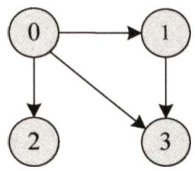  

17.D  

对于本题，只需按深度优先遍历的策略进行遍历。对于A：先访问 $V_{1}$ ，然后访问与 $V_{1}$ 邻接且未被访问的任一顶点（满足的有 $V_{2},V_{3}$ 和 $V_{5}$ )，此时访问 $V_{5}$ ，然后从 $V_{5}$ 出发，访问与 $V_{5}$ 邻接且未被访问的任一顶点（满足的只有 $V_{4}$ )，然后从 $V_{4}$ 出发，访问与 $V_{4}$ 邻接且未被访问的任一顶点（满足的只有 $V_{3}$ )，然后从 $V_{3}$ 出发，访问与 $V_{3}$ 邻接且未被访问的任一顶点（满足的只有 $V_{2}$ )，结束遍历。B和C的分析方法与A相同，不再赘述。对于D，首先访问 $V_{1}$ ，然后从 $V_{1}$ 出发，访问与 $V_{1}$ 邻接且未被访问的任一顶点（满足的有 $V_{2},V_{3}$ 和 $V_{5}$ )，然后从 $V_{2}$ 出发，访问与 $V_{2}$ 邻接且未被访问的任一顶点（满足的只有 $V_{5}$ )，按规则本应该访问 $V_{5}$ ，但D却访问了 $V_{3}$ ，错误。  

#### 二、综合应用题  

01.【解答】  

根据 $G$ 的邻接表不难画出图(a)。  

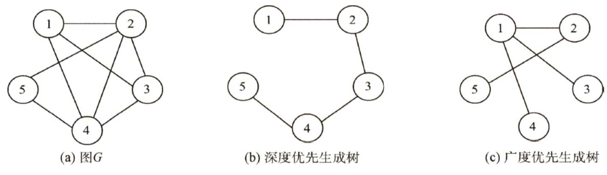  

1）采用深度优先遍历。深度优先搜索总是尽可能“深”地搜索图，根据存储结构可知深度优先搜索的路径次序为(1,2),(2,3),(3,4),(4,5)，深度优先生成树如图(b)所示。需要注意的是，当存储结构固定时，生成树的树形也就固定了，比如不能先搜索(1,3)。  
2）采用广度优先遍历。广度优先搜索总是尽可能“广”地搜索图，一层一层地向外扩展，根据存储结构可知广度优先搜索的路径次序为(1,2),(1,3),(1,4),(2,5)，广度优先生成树如图(c)所示。  

02. 【解答】  

一个无向图 $G$ 是一棵树的条件是，G必须是无回路的连通图或有 $n-1$ 条边的连通图。这里采用后者作为判断条件。对连通的判定，可用能否遍历全部顶点来实现。可以采用深度优先搜索算法在遍历图的过程中统计可能访问到的顶点个数和边的条数，若一次遍历就能访问到 $n$ 个顶点和 $n-1$ 条边，则可断定此图是一棵树。算法实现如下：  

bool isTree（Graph& G）{for( $\dot{2}=2$ $\therefore c=G$ .vexnum; ${\dot{\bf{\widehat{\bf{1}}}}}++\mathbf{\beta}$ ）visited $[\dot{\bf~i~}]=$ FALSE; //访问标记visited[]初始化intVnum $_{1=0}$ ,Enum $_{1=0}$ · //记录顶点数和边数DFS（G,1,Vnum,Enum,visited）;if(Vnum $\scriptstyle1==G$ .vexnum&&Enum $==2+$ (G.vexnum-1))return true; //符合树的条件elsereturn false; //不符合树的条件  
void DFs（Graph& G,int V,int& Vnum,int& Enum,int visited[]）{  
//深度优先遍历图G，统计访问过的顶点数和边数，通过Vnum和Enum返回visited[v] $\c=$ TRUE;Vnum $^{++}$ //作访问标记，顶点计数int $w=$ FirstNeighbor（G,v); //取v的第一个邻接顶点while $W!=-1$ ( //当邻接顶点存在Enum $^{++}$ . //边存在，边计数if(!visited[w]) //当该邻接顶点未访问过DFS(G,w,Vnum,Enum,visited);$w=$ NextNeighbor $(G,v,w)$ ；  

03.【解答】  

在深度优先搜索的非递归算法中使用了一个栈S来记忆下一步可能访问的顶点，同时使用了一个访问标记数组visited［i]来记忆第i个顶点是否在栈内或曾经在栈内，若是则它以后不能再进栈。图采用邻接表形式，算法的实现如下：  

void DFS_Non_RC（AGraph& G,int v）{  
//从顶点 $v$ 开始进行深度优先搜索，一次遍历一个连通分量的所有顶点int w; //顶点序号InitStack(S); //初始化栈Sfor( $\dot{2}=0$ ： $\frac{1}{2}<G$ .vexnum; $\dot{2}++$ ）visited[i] $\c=$ FALSE; //初始化visitedPush（S,v);visited[v] $\c=$ TRUE; //v入栈并置visited[v]while(!IsEmpty（S)）{$k=$ Pop(S); //栈中退出一个顶点