### 6.4 图的应用  

本节是历年考查的重点。图的应用主要包括：最小生成（代价）树、最短路径、拓扑排序和关键路径。一般而言，这部分内容直接以算法设计题形式考查的可能性很小，而更多的是结合图的实例来考查算法的具体操作过程，读者必须学会手工模拟给定图的各个算法的执行过程。此外，还需掌握对给定模型建立相应的图去解决问题的方法。  

#### 6.4.1 最小生成树  

一个连通图的生成树包含图的所有顶点，并且只含尽可能少的边。对于生成树来说，若砍去它的一条边，则会使生成树变成非连通图；若给它增加一条边，则会形成图中的一条回路。  

对于一个带权连通无向图 $G=(V,E)$ ，生成树不同，每棵树的权（即树中所有边上的权值之和）也可能不同。设为 $G$ 的所有生成树的集合，若 $T$ 为中边的权值之和最小的那棵生成树，则 $T$ 称为 $G$ 的最小生成树（Minimum-Spanning-Tree,MST）。  

不难看出，最小生成树具有如下性质：  

1）最小生成树不是唯一的，即最小生成树的树形不唯一， $\Re$ 中可能有多个最小生成树。当图$G$ 中的各边权值互不相等时， $G$ 的最小生成树是唯一的；若无向连通图 $G$ 的边数比顶点数少1，即 $G$ 本身是一棵树时，则 $G$ 的最小生成树就是它本身。  
2）最小生成树的边的权值之和总是唯一的，虽然最小生成树不唯一，但其对应的边的权值之和总是唯一的，而且是最小的。  

3）最小生成树的边数为顶点数减1。  

构造最小生成树有多种算法，但大多数算法都利用了最小生成树的下列性质：假设 $G=(V,E)$ 是一个带权连通无向图， $U$ 是顶点集 $V$ 的一个非空子集。若 $(u,\nu)$ 是一条具有最小权值的边，其中$u\in U$ $\nu\in V-U$ ，则必存在一棵包含边 $(u,\nu)$ 的最小生成树。  

基于该性质的最小生成树算法主要有 $\mathrm{Prim}$ 算法和Kruskal算法，它们都基于贪心算法的策略。对这两种算法应主要掌握算法的本质含义和基本思想，并能够手工模拟算法的实现步骤。  

下面介绍一个通用的最小生成树算法：  

GENERIC_MST（G){T $\mathbf{\bar{\rho}}=\mathbf{\rho}$ NULL;whileT未形成一棵生成树；do找到一条最小代价边（u，v）并且加入T后不会产生回路；$\scriptstyle\mathrm{{T=T}}\cup(\mathbf{u},\mathbf{v})$ ·  

通用算法每次加入一条边以逐渐形成一棵生成树，下面介绍两种实现上述通用算法的途径。  

#### 1.Prim算法  

$\mathrm{Prim}$ （普里姆）算法的执行非常类似于寻找图的最短路径的Dijkstra算法（见下一节)。  

$\mathrm{Prim}$ 算法构造最小生成树的过程如图6.15所示。初始时从图中任取一顶点（如顶点1）加入树 $T$ ，此时树中只含有一个顶点，之后选择一个与当前 $T$ 中顶点集合距离最近的顶点，并将该顶点和相应的边加入T，每次操作后 $T$ 中的顶点数和边数都增1。以此类推，直至图中所有的顶点都并入T，得到的 $T$ 就是最小生成树。此时 $T$ 中必然有 $n-1$ 条边。  

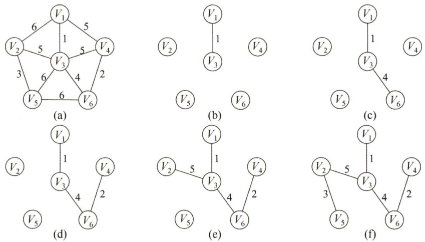  
图6.15Prim算法构造最小生成树的过程  

Prim算法的步骤如下：  

假设 $G=\{V,E\}$ 是连通图，其最小生成树 $T=(U,E_{T})$ ， $E_{T}$ 是最小生成树中边的集合。  

初始化：向空树 $T=(U,E_{T})$ 中添加图 $G=(V,E)$ 的任一顶点 $u_{0}$ ，使 $U=\{u_{0}\}$ ， $E_{T}=\emptyset$ o  

循环（重复下列操作直至 $U=V)$ ：从图 $G$ 中选择满足 $\{(u,\nu)|u\in U,\nu\in V-U\}$ 且具有最小权值的边 $(u,\nu)$ ，加入树 $T$ ，置 $U=U\cup\{\nu\}$ ， $E_{T}=E_{T}\cup\{(u,\nu)\}$ 。  

$\mathrm{Prim}$ 算法的简单实现如下：  

void Prim（G,T）{$\scriptstyle\mathbf{T}=\varnothing$ . //初始化空树$U=\{w\}$ . //添加任一顶点 $w$ while((V-U) $:=0$ //若树中不含全部顶点设 $(\sqcup,\bigtriangledown)$ 是使uEU与 $\boldsymbol{\mathsf{v}}\in$ (V-U），且权值最小的边；$T=T\cup\{(\boldsymbol{\mathbf{u}},\boldsymbol{\mathbf{v}})\}$ · //边归入树$v=v\cup v\mid$ ： //顶点归入树  

Prim 算法的时间复杂度为 $O(|V|^{2})$ ，不依赖于 $|E|$ ，因此它适用于求解边稠密的图的最小生成树。虽然采用其他方法能改进 $\mathrm{Prim}$ 算法的时间复杂度，但增加了实现的复杂性。  

#### 2.Kruskal算法  

与 $\mathrm{Prim}$ 算法从顶点开始扩展最小生成树不同，Kruskal（克鲁斯卡尔）算法是一种按权值的递增次序选择合适的边来构造最小生成树的方法。  

Kruskal算法构造最小生成树的过程如图6.16所示。初始时为只有 $n$ 个顶点而无边的非连通图 $T=\{V,\{\}\}$ ，每个顶点自成一个连通分量，然后按照边的权值由小到大的顺序，不断选取当前未被选取过且权值最小的边，若该边依附的顶点落在 $T$ 中不同的连通分量上，则将此边加入 $T$ ，否则舍弃此边而选择下一条权值最小的边。以此类推，直至 $T$ 中所有顶点都在一个连通分量上。  

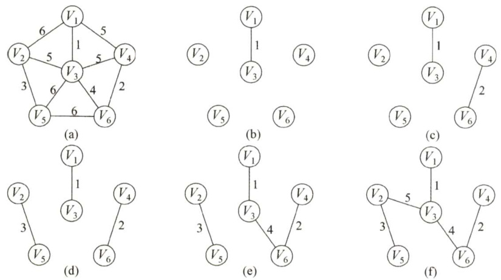  
图6.16Kruskal算法构造最小生成树的过程  

Kruskal算法的步骤如下：  

假设 $G=(V,E)$ 是连通图，其最小生成树 $T=(U,E_{T})$ 0  

初始化： $U=V,E_{T}=\emptyset$ 。即每个顶点构成一棵独立的树， $T$ 此时是一个仅含V个顶点的森林。循环（重复下列操作直至 $T$ 是一棵树)：按 $G$ 的边的权值递增顺序依次从 $E-E_{T}$ 中选择一条边，若这条边加入 $T$ 后不构成回路，则将其加入 $E_{T}$ ，否则舍弃，直到 $E_{T}$ 中含有 $n-1$ 条边。  

Kruskal算法的简单实现如下：  

void Kruskal（V,T）{$\scriptstyle\mathrm{{T=V}}$ . //初始化树T，仅含顶点nums $\scriptstyle=\mathtt{n}$ //连通分量数while（num $s{>}1$ ）{ //若连通分量数大于1从E中取出权值最小的边（v,u）；if（v和u属于T中不同的连通分量）（$T=T\cup\{(\nabla,\ u)\}$ ： //将此边加入生成树中numS--; //连通分量数减1，  

根据图的相关性质，若一条边连接了两棵不同树中的顶点，则对这两棵树来说，它必定是连通的，将这条边加入森林中，完成两棵树的合并，直到整个森林合并成一棵树。  

通常在Kruskal算法中，采用堆（见第7章）来存放边的集合，因此每次选择最小权值的边只需 $O(\log|E|)$ 的时间。此外，由于生成树 $T$ 中的所有边可视为一个等价类，因此每次添加新的边的过程类似于求解等价类的过程，由此可以采用并查集的数据结构来描述T，从而构造 $T$ 的时间复杂度为 $O(|E|\mathrm{log}|E|)$ 。因此，Kruskal算法适合于边稀疏而顶点较多的图。  

#### 6.4.2 最短路径  

6.3节所述的广度优先搜索查找最短路径只是对无权图而言的。当图是带权图时，把从一个顶点 $\nu_{0}$ 到图中其余任意一个顶点 $\nu_{i}$ 的一条路径（可能不止一条）所经过边上的权值之和，定义为该路径的带权路径长度，把带权路径长度最短的那条路径称为最短路径。  

求解最短路径的算法通常都依赖于一种性质，即两点之间的最短路径也包含了路径上其他顶点间的最短路径。带权有向图 $G$ 的最短路径问题一般可分为两类：一是单源最短路径，即求图中某一顶点到其他各顶点的最短路径，可通过经典的Dijkstra（迪杰斯特拉）算法求解；二是求每对顶点间的最短路径，可通过Floyd（弗洛伊德）算法来求解。  

#### 1.Dijkstra算法求单源最短路径问题  

Dijkstra算法设置一个集合 $s$ 记录已求得的最短路径的顶点，初始时把源点 $\nu_{0}$ 放入 $s$ ，集合 $s$ 每并入一个新顶点 $\nu_{i}$ ，都要修改源点 $\nu_{0}$ 到集合 $V{-}S$ 中顶点当前的最短路径长度值（这里可能不太好理解？没关系，等下就会清楚)。  

在构造的过程中还设置了两个辅助数组：  

·dist［]：记录从源点 $\nu_{0}$ 到其他各顶点当前的最短路径长度，它的初态为：若从 $\nu_{0}$ 到 $\nu_{i}$ 有弧，则dist[i]为弧上的权值；否则置dist[i]为。  
·path[]：path[i]表示从源点到顶点 $i$ 之间的最短路径的前驱结点。在算法结束时，可根据其值追溯得到源点 $\nu_{0}$ 到顶点 $\nu_{i}$ 的最短路径。  

假设从顶点0出发，即 $\nu_{0}=0$ ，集合 $s$ 最初只包含顶点0，邻接矩阵arcs表示带权有向图，arcs[i][j]表示有向边 ${<}\mathrm{i}$ ！ ${\dot{\mathsf{J}}}>$ 的权值，若不存在有向边 ${<}\mathrm{i}$ $j>$ ，则arcs[i][j]为。  

Dijkstra算法的步骤如下（不考虑对path[]的操作）：  

1)初始化：集合 $s$ 初始为 $\{0\}$ ,dist[]的初始值dist[i] $\c=$ arcs[0][i], $\mathrm{i}=1,2,\cdots,\mathrm{n-1}$ 。   
2）从顶点集合 $\scriptstyle{V-S}$ 中选出 $\nu_{j}$ ，满足dist[j] $\c=$ Min{dist[i] $\vert\nu_{\mathrm{i}}\in\mathsf{V}-S\ \}$ ， $\nu_{j}$ 就是当前求得  

的一条从 $\nu_{0}$ 出发的最短路径的终点，令 $S{=}S\cup\{j\}$ 。  

3）修改从 $\nu_{0}$ 出发到集合 $\scriptstyle{V-S}$ 上任一顶点 $\nu_{k}$ 可达的最短路径长度：若dist[j] $^+$ arcs[j][k] $<$ dist[k]，则更新dist[k] $\O=$ dist[j] $^+$ arcs[j][k]。  

4）重复2） ${\sim}3$ ）操作共 $n{-}1$ 次，直到所有的顶点都包含在 $s$ 中。  

步骤3）也就是开头留下的疑问，每当一个顶点加入 $s$ 后，可能需要修改源点 $\nu_{0}$ 到集合 $V{-}S$ 中可达顶点当前的最短路径长度，下面举一简单例子证明。如下图所示，源点为 $\nu_{0}$ ，初始时 $S=\{\nu_{0}\}$ ，dist $\left[1\right]=3$ ，dist $[2]=7$ ，当将 $\nu_{1}$ 并入集合 $s$ 后，dist[2]需要更新为4。  

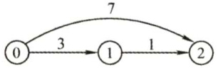  

思考：Dijkstra算法与 $\mathrm{Prim}$ 算法有何相似之处？  

例如，对图6.17中的图应用Dijkstra算法求从顶点1出发至其余顶点的最短路径的过程，如表6.1所示。算法执行过程的说明如下。  

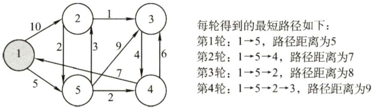  
图6.17应用Dijkstra算法图  

表6.1从 $\nu_{1}$ 到各终点的dist值和最短路径的求解过程  

<html><body><table><tr><td>顶点</td><td>第1轮</td><td>第2轮</td><td>第3轮</td><td>第4轮</td></tr><tr><td>2</td><td>10 V→V</td><td>8 V→V5→V2</td><td>8 V1→V5→V</td><td></td></tr><tr><td>3</td><td>8</td><td>14 V→V5→V3</td><td>13 V→V5→V4→V3</td><td>9 V1→V5→V→V3</td></tr><tr><td>4</td><td>8</td><td>7 V1→V5→V4</td><td></td><td></td></tr><tr><td>5</td><td>5 V1→V5</td><td></td><td></td><td></td></tr><tr><td>集合S</td><td>{1,5}</td><td>{1,5,4}</td><td>{1,5,4,2}</td><td>{1,5,4,2,3}</td></tr></table></body></html>  

初始化：集合 $s$ 初始为 $\left\{\nu_{1}\right\}$ ， $\nu_{1}$ 可达 $\nu_{2}$ 和 $\nu_{5}$ ， $\nu_{1}$ 不可达 $\nu_{3}$ 和 $\nu_{4}$ ，因此dist[数组各元素的初值依次设置为dist $[2]=10$ ，dist $[3]=\infty$ ，dist $[4]=\infty$ ，dist $[5]=5$ 。  

第一轮：选出最小值dist[5]，将顶点 $\nu_{5}$ 并入集合 $s$ ，即此时已找到 $\nu_{1}$ 到 $\nu_{5}$ 的最短路径。当 $\nu_{5}$ 加入 $s$ 后，从 $\nu_{1}$ 到集合 $\b{V}{-}\b{S}$ 中可达顶点的最短路径长度可能会产生变化。因此需要更新dist[]数组。 $\nu_{5}$ 可达 $\nu_{2}$ ，因 $\nu_{1}{\rightarrow}\nu_{5}{\rightarrow}\nu_{2}$ 的距离8比dist $[2]=10$ 小，更新dist $[2]=8$ $\nu_{5}$ 可达 $\nu_{3},\nu_{1}\mathrm{\longrightarrow}\nu_{5}\mathrm{\longrightarrow}\nu_{3}$ 的距离14，更新dist $[3]=14$ ；， $\nu_{5}$ 可达 $\nu_{4}$ ， $\nu_{1}{\rightarrow}\nu_{5}{\rightarrow}\nu_{4}$ 的距离7，更新dist $[4]=7$ 。  

第二轮：选出最小值dist[4]，将顶点 $\nu_{4}$ 并入集合 $S_{\circ}$ 继续更新 dist[]数组。 $\nu_{4}$ 不可达$\nu_{2}$ ，dist[2]不变； $\nu_{4}$ 可达 $\nu_{3}$ ， $\nu_{1}{\longrightarrow}\nu_{5}{\longrightarrow}\nu_{4}{\longrightarrow}\nu_{3}$ 的距离13比dist[3]小，故更新dist $[3]=13$ 。  

第三轮：选出最小值dist[2]，将顶点 $\nu_{2}$ 并入集合 $S_{\circ}$ 继续更新dist[]数组。 $\nu_{2}$ 可达 $\nu_{3}$ $\nu_{1}{\rightarrow}\nu_{5}{\rightarrow}\nu_{2}{\rightarrow}\nu_{3}$ 的距离9比dist[3]小，更新dist[3]=9。  

第四轮：选出唯一最小值dist[3]，将顶点 $\nu_{3}$ 并入集合 $s$ ，此时全部顶点都已包含在 $s$ 中。  

显然，Dijkstra算法也是基于贪心策略的。  

使用邻接矩阵表示时，时间复杂度为 $O(|V|^{2})$ 。使用带权的邻接表表示时，虽然修改dist［]的时间可以减少，但由于在dist[]中选择最小分量的时间不变，时间复杂度仍为 $O(|V|^{2})$ 0  

人们可能只希望找到从源点到某个特定顶点的最短路径，但这个问题和求解源点到其他所有顶点的最短路径一样复杂，时间复杂度也为 $O(|V|^{2})$ 。  

值得注意的是，边上带有负权值时，Dijkstra 算法并不适用。若允许边上带有负权值，则在与 S（已求得最短路径的顶点集，归入 $s$ 内的结点的最短路径不再变更）内某点（记为 $a$ ）以负  

边相连的点（记为 $b$ ）确定其最短路径时，其最短路径长度加上这条负边的权值结果可能小于 $a$ 原先确定的最短路径长度，而此时 $a$ 在Dijkstra算法下是无法更新的。例如，对于图6.18所示的带权有向图，利用Dijkstra算法不一定能得到正确的结果。  

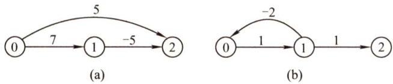  
图6.18边上带有负权值的有向带权图  

#### 2.Floyd算法求各顶点之间最短路径问题  

求所有顶点之间的最短路径问题描述如下：已知一个各边权值均大于0的带权有向图，对任意两个顶点 $\nu_{i}\neq\nu_{j}$ ，要求求出 $\nu_{i}$ 与 $\nu_{j}$ 之间的最短路径和最短路径长度。  

Floyd算法的基本思想是:递推产生一个 $n$ 阶方阵序列 $A^{(-1)},A^{(0)},\cdots,A^{(k)},\cdots,A^{(n-1)},$ 其中 $\boldsymbol{A}^{(k)}[\boldsymbol{i}][\boldsymbol{j}]$ 表示从顶点 $\nu_{i}$ 到顶点 $\nu_{j}$ 的路径长度， $k$ 表示绕行第 $k$ 个顶点的运算步骤。初始时，对于任意两个顶点 $\nu_{i}$ 和 $\nu_{j}$ ，若它们之间存在边，则以此边上的权值作为它们之间的最短路径长度；若它们之间不存在有向边，则以 $\infty$ 作为它们之间的最短路径长度。以后逐步尝试在原路径中加入顶点 $k(k=0$ 1,.， $n-1$ ）作为中间顶点。若增加中间顶点后，得到的路径比原来的路径长度减少了，则以此新路径代替原路径。算法描述如下：  

定义一个 $n$ 阶方阵序列 $A^{(-1)},A^{(0)},\cdots,A^{(n-1)}$ ，其中，  

$$
A^{(-1)}[i][j]=\operatorname{arcs}[i][j]
$$  

$\begin{array}{r}{A^{(k)}[i][j]=\operatorname{Min}\{A^{(k-1)}[i][j],~A^{(k-1)}[i][k]+A^{(k-1)}[k][j]\},\quad k=0,1,\cdots,n-1}\end{array}$ 式中， $\boldsymbol{A}^{(0)}[i][j]$ 是从顶点 $\nu_{i}$ 到 $\nu_{j}$ 、中间顶点是 $\nu_{0}$ 的最短路径的长度， $\boldsymbol{A}^{(k)}[i][j]$ 是从顶点 $\nu_{i}$ 到 $\nu_{j\setminus}$ 中间顶点的序号不大于 $k$ 的最短路径的长度。Floyd 算法是一个选代的过程，每迭代一次，在从 $\nu_{i}$ 到 $\nu_{j}$ 的最短路径上就多考虑了一个顶点；经过 $n$ 次迭代后，所得到的 $\boldsymbol{A}^{(n-1)}[i][j]$ 就是 $\nu_{i}$ 到 $\nu_{j}$ 的最短路径长度，即方阵 $A^{(n-1)}$ 中就保存了任意一对顶点之间的最短路径长度。  

图6.19所示为带权有向图 $G$ 及其邻接矩阵。应用Floyd算法求所有顶点之间的最短路径长度的过程如表6.2所示。算法执行过程的说明如下。  

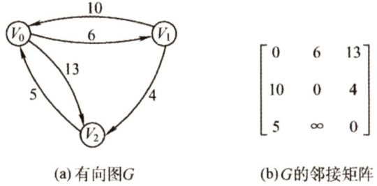  
图6.19带权有向图 $G$ 及其邻接矩阵  

初始化：方阵 $\boldsymbol{A}^{(-1)}[i][j]=$ arcs[][]。第一轮：将 $\nu_{0}$ 作为中间顶点，对于所有顶点对 $\{i,j\}$ ，如果有 $\boldsymbol{A}^{-1}[i][j]>\boldsymbol{A}^{-1}[i][0]+\boldsymbol{A}^{-1}[0][j]$ 则将 $\boldsymbol{A}^{-1}[i][j]$ 更新为 $\boldsymbol{A}^{-1}[i][0]+\boldsymbol{A}^{-1}[0][\boldsymbol{j}].$ 有 $\boldsymbol{A}^{-1}[2][1]\boldsymbol{>}\boldsymbol{A}^{-1}[2][\boldsymbol{0}]+\boldsymbol{A}^{-1}[\boldsymbol{0}][1]=1\boldsymbol{1},$ 更新 $\boldsymbol{A}^{-1}[2][1]=11$ 更新后的方阵标记为 $\boldsymbol{A}^{0}$ 。  

第二轮：将 $\nu_{1}$ 作为中间顶点，继续检测全部顶点对 $\{i,j\}$ 。有 $\begin{array}{r}{A^{0}[0][2]>A^{0}[0][1]+A^{0}[1][2]=10,}\end{array}$ 更新 $A^{0}[0][2]=10$ ，更新后的方阵标记为 $A^{1}$ 。  

第三轮：将 $\nu_{2}$ 作为中间顶点，继续检测全部顶点对 $\{i,j\}$ 。有 $\begin{array}{r}{A^{1}[1][0]>A^{1}[1][2]+A^{1}[2][0]=9,}\end{array}$ 更新 $A^{1}[1][0]=9\$ ，更新后的方阵标记为 $A^{2}$ 。此时 $A^{2}$ 中保存的就是任意顶点对的最短路径长度。  

表6.2Floyd算法的执行过程  

<html><body><table><tr><td>A</td><td colspan="3">A(-1)</td><td colspan="3">A()</td><td colspan="3">A(1)</td><td colspan="3">4(2</td></tr><tr><td></td><td>Vo</td><td>V</td><td>V</td><td>Vo</td><td>V</td><td>V</td><td>Vo</td><td>V</td><td>V</td><td>V</td><td>V</td><td>V</td></tr><tr><td>Vo</td><td>0</td><td>6</td><td>13</td><td>0</td><td>6</td><td>13</td><td>0</td><td>6</td><td>10</td><td>0</td><td>6</td><td>10</td></tr><tr><td>V</td><td>10</td><td>0</td><td>4</td><td>10</td><td>0</td><td>4</td><td>10</td><td>0</td><td>4</td><td>91</td><td>0</td><td>4</td></tr><tr><td>V</td><td>5</td><td>8</td><td>0</td><td>5</td><td>11</td><td>0</td><td>5</td><td>11</td><td>0</td><td>5</td><td>11</td><td>0</td></tr></table></body></html>  

Floyd算法的时间复杂度为 $O(|V|^{3})$ 。不过由于其代码很紧凑，且并不包含其他复杂的数据结构，因此隐含的常数系数是很小的，即使对于中等规模的输入来说，它仍然是相当有效的。  

Floyd算法允许图中有带负权值的边，但不允许有包含带负权值的边组成的回路。Floyd算法同样适用于带权无向图，因为带权无向图可视为权值相同往返二重边的有向图。  

也可以用单源最短路径算法来解决每对顶点之间的最短路径问题。轮流将每个顶点作为源点，并且在所有边权值均非负时，运行一次Dijkstra算法，其时间复杂度为 $O(|V|^{2}){\cdot}|V|=O(|V|^{3})$  

#### 6.4.3 有向无环图描述表达式  

有向无环图：若一个有向图中不存在环，则称为有向无环图，简称DAG图。  

有向无环图是描述含有公共子式的表达式的有效工具。例如表达式  

$$
((a+b)^{*}(b^{*}(c+d))+(c+d)^{*}e)^{*}((c+d)^{*}e)
$$  

可以用上一章描述的二叉树来表示，如图6.20所示。仔细观察该表达式，可发现有一些相同的子表达式 $(c+d)$ 和 $(c+d)^{*}e$ ，而在二叉树中，它们也重复出现。若利用有向无环图，则可实现对相同子式的共享，从而节省存储空间，图6.21所示为该表达式的有向无环图表示。  

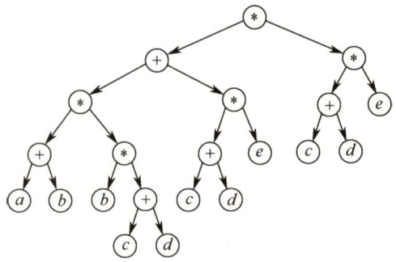  
图6.20二叉树描述表达式  

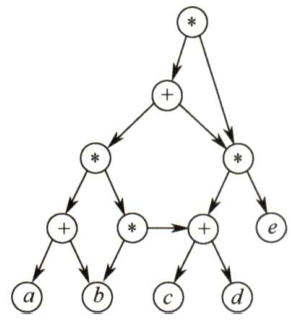  
图6.21有向无环图描述表达式  

#### 6.4.4 拓扑排序  

AOV网：若用DAG图表示一个工程，其顶点表示活动，用有向边 ${<}V_{i},$ V>表示活动 $V_{i}$ 必须先于活动 $V_{j}$ 进行的这样一种关系，则将这种有向图称为顶点表示活动的网络，记为AOV网。在AOV网中，活动 $V_{i}$ 是活动 $V_{j}$ 的直接前驱，活动 $V_{j}$ 是活动 $V_{i}$ 的直接后继，这种前驱和后继关系具有传递性，且任何活动 $V_{i}$ 不能以它自己作为自己的前驱或后继。  

拓扑排序：在图论中，由一个有向无环图的顶点组成的序列，当且仅当满足下列条件时，称为该图的一个拓扑排序：  

$\textcircled{1}$ 每个顶点出现且只出现一次。  

$\textcircled{2}$ 若顶点 $A$ 在序列中排在顶点 $B$ 的前面，则在图中不存在从顶点 $B$ 到顶点 $A$ 的路径。  

或定义为：拓扑排序是对有向无环图的顶点的一种排序，它使得若存在一条从顶点 $A$ 到顶点$B$ 的路径，则在排序中顶点 $B$ 出现在顶点 $A$ 的后面。每个AOV网都有一个或多个拓扑排序序列。  

对一个AOV网进行拓扑排序的算法有很多，下面介绍比较常用的一种方法的步骤：  

$\textcircled{1}$ 从AOV网中选择一个没有前驱的顶点并输出。  
$\textcircled{2}$ 从网中删除该顶点和所有以它为起点的有向边。  
$\textcircled{3}$ 重复 $\textcircled{1}$ 和 $\textcircled{2}$ 直到当前的AOV网为空或当前网中不存在无前驱的顶点为止。后一种情况说明有向图中必然存在环。  

图6.22所示为拓扑排序过程的示例。每轮选择一个入度为0的顶点并输出，然后删除该顶点和所有以它为起点的有向边，最后得到拓扑排序的结果为 $\{1,2,4,3,5\}$ 。  

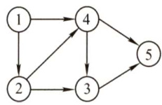  

<html><body><table><tr><td>结点号</td><td>1</td><td>2</td><td>3</td><td>4</td><td>5</td></tr><tr><td>初始入度</td><td>0</td><td>1</td><td>2</td><td>2</td><td>2</td></tr><tr><td>第一轮</td><td></td><td>0</td><td>2</td><td></td><td>2</td></tr><tr><td>第二轮</td><td></td><td></td><td>1</td><td>0</td><td>2</td></tr><tr><td>第三轮</td><td></td><td></td><td>0</td><td></td><td>1</td></tr><tr><td>第四轮</td><td></td><td></td><td></td><td></td><td>0</td></tr><tr><td>第五轮</td><td></td><td></td><td></td><td></td><td></td></tr></table></body></html>  

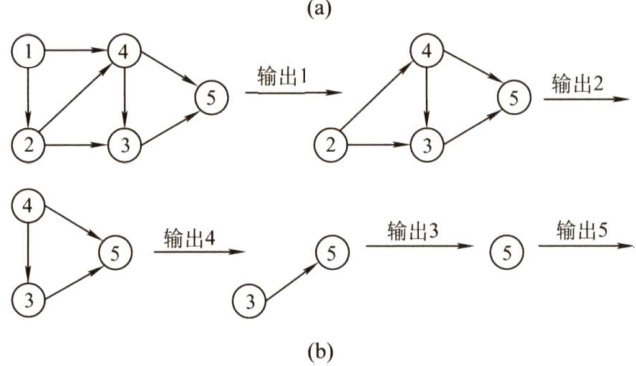  
图6.22有向无环图的拓扑排序过程  

拓扑排序算法的实现如下：  

bool TopologicalSort(Graph G）{InitStack(S); //初始化栈，存储入度为0的顶点for(int $i=0$ . $\frac{i}{1}<G$ .vexnum; $\dot{2}++$ ）if(indegree[i] $\scriptstyle==0$ ）Push(s,i); //将所有入度为0的顶点进栈int count $=0$ ： //计数，记录当前已经输出的顶点数while(!IsEmpty（S）） //栈不空，则存在入度为0的顶点Pop(s,i); //栈顶元素出栈print[count $++]=i$ . //输出顶点ifor $\scriptstyle\mathtt{p}=\mathtt{G}$ .vertices[i].firstarcip; $\scriptstyle{\mathrm{p}}=$ p->nextarc)(//将所有i指向的顶点的入度减1，并且将入度减为0的顶点压入栈Sv=p->adjvex;if(!（--indegree[v])）  

<html><body><table><tr><td>Push(S,v); }//while</td><td>//入度为0，则入栈</td></tr><tr><td>if（count<G.vexnum) return false;</td><td>//排序失败，有向图中有回路</td></tr><tr><td>else return true;</td><td>//拓扑排序成功</td></tr></table></body></html>  

由于输出每个顶点的同时还要删除以它为起点的边，故采用邻接表存储时拓扑排序的时间复杂度为 $O(|V|+|E|)$ ，采用邻接矩阵存储时拓扑排序的时间复杂度为 $O(|V|^{2})$ 。此外，利用上一节的深度优先遍历也可实现拓扑排序，请读者仔细思考其原因及实现方法（见综合题9)。  

对一个AOV网，如果采用下列步骤进行排序，则称之为逆拓扑排序：  

$\textcircled{1}$ 从AOV网中选择一个没有后继（出度为0）的顶点并输出。  

$\textcircled{2}$ 从网中删除该顶点和所有以它为终点的有向边。  

$\textcircled{3}$ 重复 $\textcircled{1}$ 和 $\textcircled{2}$ 直到当前的AOV网为空。  

用拓扑排序算法处理AOV网时，应注意以下问题：  

$\textcircled{1}$ 入度为零的顶点，即没有前驱活动的或前驱活动都已经完成的顶点，工程可以从这个顶点所代表的活动开始或继续。  
$\textcircled{2}$ 若一个顶点有多个直接后继，则拓扑排序的结果通常不唯一；但若各个顶点已经排在一个线性有序的序列中，每个顶点有唯一的前驱后继关系，则拓扑排序的结果是唯一的。  
$\textcircled{3}$ 由于AOV网中各顶点的地位平等，每个顶点编号是人为的，因此可以按拓扑排序的结果重新编号，生成AOV网的新的邻接存储矩阵，这种邻接矩阵可以是三角矩阵；但对于一般的图来说，若其邻接矩阵是三角矩阵，则存在拓扑序列；反之则不一定成立。  

#### 6.4.5 关键路径  

在带权有向图中，以顶点表示事件，以有向边表示活动，以边上的权值表示完成该活动的开销（如完成活动所需的时间)，称之为用边表示活动的网络，简称AOE网。AOE网和AOV网都是有向无环图，不同之处在于它们的边和顶点所代表的含义是不同的，AOE网中的边有权值；而AOV网中的边无权值，仅表示顶点之间的前后关系。  

AOE网具有以下两个性质：  

$\textcircled{1}$ 只有在某顶点所代表的事件发生后，从该顶点出发的各有向边所代表的活动才能开始；  
$\textcircled{2}$ 只有在进入某顶点的各有向边所代表的活动都已结束时，该顶点所代表的事件才能发生。  

在AOE网中仅有一个入度为0的顶点，称为开始顶点（源点)，它表示整个工程的开始；网中也仅存在一个出度为0的顶点，称为结束顶点（汇点)，它表示整个工程的结束。  

在 AOE网中，有些活动是可以并行进行的。从源点到汇点的有向路径可能有多条，并且这些路径长度可能不同。完成不同路径上的活动所需的时间虽然不同，但是只有所有路径上的活动都已完成，整个工程才能算结束。因此，从源点到汇点的所有路径中，具有最大路径长度的路径称为关键路径，而把关键路径上的活动称为关键活动。  

完成整个工程的最短时间就是关键路径的长度，即关键路径上各活动花费开销的总和。这是因为关键活动影响了整个工程的时间，即若关键活动不能按时完成，则整个工程的完成时间就会延长。因此，只要找到了关键活动，就找到了关键路径，也就可以得出最短完成时间。  

下面给出在寻找关键活动时所用到的几个参量的定义。  

#### 1．事件 $\nu_{k}$ 的最早发生时间 $\nu e(k)$  

它是指从源点 $\nu_{1}$ 到顶点 $\nu_{k}$ 的最长路径长度。事件 $\nu_{k}$ 的最早发生时间决定了所有从 $\nu_{k}$ 开始的活动能够开工的最早时间。可用下面的递推公式来计算：  

$$
\nu e(\dot{\mathbb{W}}^{\sharp}\mathbb{H})_{\cdots}^{\sharp})=0
$$  

$\nu e(k)=\mathrm{Max}\{\nu\mathrm{e}(j)+\mathrm{Weight}(\nu_{j},\nu_{k})\},$ $\nu_{k}$ 为 $\nu_{j}$ 的任意后继，Weight $(\nu_{j},\nu_{k})$ 表示 ${<}\nu_{j}$ $\nu_{k}>$ 上的权值计算 $\nu e()$ 值时，按从前往后的顺序进行，可以在拓扑排序的基础上计算：  

$\textcircled{1}$ 初始时，令 $\nu e[1...n]=0$ 0$\textcircled{2}$ 输出一个入度为0的顶点 $\nu_{j}$ 时，计算它所有直接后继顶点 $\nu_{k}$ 的最早发生时间，若ve[] $^+$ $\mathrm{Weight}(\nu_{j},\nu_{k})>\nu e[k]$ ，则 $\nu e[k]=\nu e[j]+\mathrm{Weight}(\nu_{j},\nu_{k})$ 。以此类推，直至输出全部顶点。  

#### 2.事件 $\nu_{k}$ 的最迟发生时间 $\nu l(k)$  

它是指在不推迟整个工程完成的前提下，即保证它的后继事件 $\nu_{j}$ 在其最迟发生时间 $\nu l(j)$ 能够发生时，该事件最迟必须发生的时间。可用下面的递推公式来计算：  

vl(汇点) $\mathbf{\Sigma}=\mathbf{\Sigma}$ ve(汇点) $\nu l(k)=\mathrm{Min}\{\nu l(j)-\mathrm{Weight}(\nu_{k},\nu_{j})\},\nu_{k}$ 为 $\nu_{j}$ 的任意前驱  

注意：在计算 $\nu l(k)$ 时，按从后往前的顺序进行，可以在逆拓扑排序的基础上计算。  

计算 $\nu l()$ 值时，按从后往前的顺序进行，在上述拓扑排序中，增设一个栈以记录拓扑序列，拓扑排序结束后从栈顶至栈底便为逆拓扑有序序列。过程如下：  

$\textcircled{1}$ 初始时，令 $\nu l[1...n]=\nu e[n]$ ®$\textcircled{2}$ 栈顶顶点 $\nu_{j}$ 出栈，计算其所有直接前驱顶点 $\nu_{k}$ 的最迟发生时间，若 $\nu l[j]\mathrm{-Weight}(\nu_{k},\nu_{j})<$ $\nu l[k]$ ，则 $\begin{array}{r}{\nu l[k]=\nu l[j]-\mathrm{Weight}(\nu_{k},\nu_{j})}\end{array}$ 。以此类推，直至输出全部栈中顶点。  

#### 3.活动 $\mathbf{\delta}_{\mathbf{{\alpha}}}\mathbf{{\vec{a}}}_{i}$ 的最早开始时间 $e(i)$  

它是指该活动弧的起点所表示的事件的最早发生时间。若边 ${<\nu_{k},\nu_{j}>}$ 表示活动 $a_{i},$ 则有 $e(i)=\nu e(k)$ o  

#### 4.活动 $\mathbf{\delta}_{\mathbf{\alpha}}\mathbf{\delta}_{\mathbf{\alpha}}\mathbf{\delta}_{\mathbf{\alpha}}\mathbf{\delta}_{\mathbf{\alpha}}\mathbf{\delta}_{\mathbf{\alpha}}\mathbf{\delta}_{\mathbf{\alpha}}\mathbf{\delta}_{\mathbf{\alpha}}\mathbf{\delta}_{\mathbf{\alpha}}\mathbf{\delta}_{\mathbf{\alpha}}\mathbf{\delta}_{\mathbf{\alpha}}\mathbf{\delta}_{\mathbf{\alpha}}\mathbf{\delta}_{\mathbf{\alpha}}\mathbf{\delta}_{\mathbf{\alpha}}\mathbf{\delta}_{\mathbf{\alpha}}\mathbf{\delta}_{\mathbf{\alpha}}\mathbf{\delta}_{\mathbf{\alpha}}\mathbf{\delta}_{\mathbf{\alpha}}\mathbf{\delta}_{\mathbf{\alpha}}\mathbf{\delta}_{\mathbf{\alpha}}\mathbf{\delta}_{\mathbf{\alpha}}\mathbf{\delta}_{\mathbf{\alpha}}$ 的最迟开始时间 $\boldsymbol{l}(\boldsymbol{i})$  

它是指该活动弧的终点所表示事件的最迟发生时间与该活动所需时间之差。若边 $<\nu_{k},\nu_{j}>$ 表示活动 $a_{i}$ ，则有 $l(i)=\nu l(j)-\mathrm{Weight}(\nu_{k},\nu_{j})$ 。  

5.一个活动 $\mathbf{\delta}_{\pmb{a}_{i}}$ 的最迟开始时间 $\boldsymbol{I}(i)$ 和其最早开始时间 $e(i)$ 的差额 $d(i)=l(i)-e(i)$  

它是指该活动完成的时间余量，即在不增加完成整个工程所需总时间的情况下，活动 $a_{i}$ 可以拖延的时间。若一个活动的时间余量为零，则说明该活动必须要如期完成，否则就会拖延整个工程的进度，所以称 $l(i)-e(i)=0$ 即 $\boldsymbol{l}(i)=e(i)$ 的活动 $a_{i}$ 是关键活动。  

求关键路径的算法步骤如下：  

1）从源点出发，令 $\nu e(\dot{\mathfrak{x}}\mathbb{\ R},\dot{\mathfrak{x}}_{\mathfrak{x}})=0$ ，按拓扑有序求其余顶点的最早发生时间 $\nu e()$ 6  
2）从汇点出发，令(汇点） $\mathbf{\Sigma}=\mathbf{\Sigma}$ ve(汇点)，按逆拓扑有序求其余顶点的最迟发生时间 $\nu l()$ 6  
3）根据各顶点的 $\nu e()$ 值求所有弧的最早开始时间 $e()$ 。  
4）根据各顶点的 $\nu l()$ 值求所有弧的最迟开始时间 $l(\u)$ 。  
5）求AOE网中所有活动的差额 $d()$ ，找出所有 $d()=0$ 的活动构成关键路径。  

图6.23所示为求解关键路径的过程，简单说明如下：  

1）求 $\nu e()$ ：初始 $\nu e(1)=0$ ，在拓扑排序输出顶点过程中，求得 $\nu e(2)=3,\nu e(3)=2,\nu e(4)=$ $\operatorname*{max}\{\nu e(2)+2,\nu e(3)+4\}=\operatorname*{max}\{5,6\}=6$ ， $\nu e(5)=6$ $\nu e(6)=\operatorname*{max}\left\{\nu e(5)+1,\nu e(4)+2,\nu e(3)+\right.$ $3\}=\operatorname*{max}\{7,8,5\}=8$ 。  

如果这是一道选择题，根据上述求 $\nu e()$ 的过程就已经能知道关键路径。  

2）求 $\nu l()$ ：初始 $\nu l(6)=8$ ，在逆拓扑排序出栈过程中，求得 $\nu l(5)=7,\nu l(4)=6,\nu l(3)=\mathrm{min}$ $\{\nu l(4)-4,\nu l(6)-3\}=\operatorname*{min}\{2,5\}=2,\nu l(2)=\operatorname*{min}\{\nu l(5)-3,\nu l(4)-2\}=\operatorname*{min}\{4,4\}=4$ ，vl(1)必然为0而无须再求。  

3）弧的最早开始时间 $e()$ 等于该弧的起点的顶点的 $\nu e()$ ，求得结果如下表所示。  

4）弧的最迟开始时间(i)等于该弧的终点的顶点的 $\nu l()$ 减去该弧持续的时间，求得结果如下表所示。  

5）根据 $l(i)-e(i)=0$ 的关键活动，得到的关键路径为 $(\nu_{1},\nu_{3},\nu_{4},\nu_{6})$ 0对于关键路径，需要注意以下几点：  

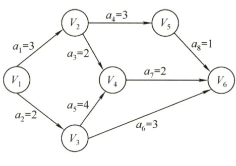  
图6.23求解关键路径的过程  

<html><body><table><tr><td></td><td>V1</td><td>V2</td><td>V3</td><td>V4</td><td>V5</td><td>V6</td></tr><tr><td>ve(i)</td><td>0</td><td>3</td><td>2</td><td>6</td><td>6</td><td>8</td></tr><tr><td>vl(i)</td><td>0</td><td>4</td><td>2</td><td>6</td><td>7</td><td>8</td></tr></table></body></html>  

<html><body><table><tr><td></td><td>a</td><td>a2</td><td>a3</td><td>a4</td><td>a5</td><td>a6</td><td>a</td><td>a8</td></tr><tr><td>e(i)</td><td>0</td><td>0</td><td>3</td><td>3</td><td>2</td><td>2</td><td>6</td><td>6</td></tr><tr><td>1(i)</td><td>1</td><td>0</td><td>4</td><td>4</td><td>2</td><td>5</td><td>6</td><td>7</td></tr><tr><td>l(i)-e(i)</td><td></td><td>0</td><td>1</td><td>1</td><td>0</td><td>3</td><td>0</td><td>1</td></tr></table></body></html>  

1）关键路径上的所有活动都是关键活动，它是决定整个工程的关键因素，因此可通过加快关键活动来缩短整个工程的工期。但也不能任意缩短关键活动，因为一旦缩短到一定的程度，该关键活动就可能会变成非关键活动。  
2）网中的关键路径并不唯一，且对于有几条关键路径的网，只提高一条关键路径上的关键活动速度并不能缩短整个工程的工期，只有加快那些包括在所有关键路径上的关键活动才能达到缩短工期的目的。  

#### 6.4.6 本节试题精选  

#### 一、单项选择题  

01.任何一个无向连通图的最小生成树（）。  

A．有一棵或多棵 B．只有一棵C.一定有多棵 D.可能不存在  

02.用Prim算法和Kruskal算法构造图的最小生成树，所得到的最小生成树（）  

A.相同 B．不相同C．可能相同，可能不同 D．无法比较  

03．以下叙述中，正确的是（）。  

A．只要无向连通图中没有权值相同的边，则其最小生成树唯一 B．只要无向图中有权值相同的边，则其最小生成树一定不唯一 C.从 $n$ 个顶点的连通图中选取 $n^{-1}$ 条权值最小的边，即可构成最小生成树 D.设连通图 $G$ 含有 $n$ 个顶点，则含有 $n$ 个顶点、 $n^{-}1$ 条边的子图一定是 $G$ 的生成树  

04.以下叙述中，正确的是（）。  

A.最短路径一定是简单路径  

B.Dijkstra算法不适合求有回路的带权图的最短路径C.Dijkstra算法不适合求任意两个顶点的最短路径D.Floyd算法求两个顶点的最短路径时， $\mathrm{path}_{k-1}$ 一定是 $\mathrm{path}_{k}$ 的子集  

05.已知带权连通无向图 $G=(V,E)$ ，其中 $V=\left\{\nu_{1},\nu_{2},\nu_{3},\nu_{4},\nu_{5},\nu_{6},\nu_{7}\right\},\ E=\left\{(\nu_{1},\nu_{2})10,(\nu_{1},\nu_{3})2,\right.$ $(\nu_{3},\nu_{4})2,(\nu_{3},\nu_{6})11,(\nu_{2},\nu_{5})1,(\nu_{4},\nu_{5})4,(\nu_{4},\nu_{6})6,(\nu_{5},\nu_{7})7,(\nu_{6},\nu_{7})3\}$ （注：顶点偶对括号外的数据表示边上的权值），从源点 $\nu_{1}$ 到顶点 $\nu_{7}$ 的最短路径上经过的顶点序列是（）。  

A.V,V2,V5,V7 B. $\nu_{1},\nu_{3},\nu_{4},\nu_{6},\nu_{7}$ C. $\nu_{1},\nu_{3},\nu_{4},\nu_{5},\nu_{7}$ D. V1, V2, V5, V4, V6,V7  

06.下面的（）方法可以判断出一个有向图是否有环（回路）。  

I．深度优先遍历I．拓扑排序III．求最短路径IV．求关键路径  

A.I、Ⅱ、IV B.I、ⅢII、IV C.I、I、III D.全部可以  

07．在有向图 $G$ 的拓扑序列中，若顶点 $\nu_{i}$ 在顶点 $\nu_{j}$ 之前，则下列情形不可能出现的是（）。  

A. $G$ 中有弧 ${<}\nu_{i},\nu_{j}{>}$ B. $G$ 中有一条从 $\nu_{i}$ 到 $\nu_{j}$ 的路径C. $G$ 中没有弧 ${<\nu_{i},\nu_{j}>}$ D. $G$ 中有一条从 $\nu_{j}$ 到 $\nu_{i}$ 的路径  

08.若一个有向图的顶点不能排在一个拓扑序列中，则可判定该有向图（）。  

A．是一个有根的有向图 B.是一个强连通图C.含有多个入度为0的顶点 D．含有顶点数目大于1的强连通分量  

09．以下关于拓扑排序的说法中，错误的是（）。  

I．若某有向图存在环路，则该有向图一定不存在拓扑排序Ⅱ．在拓扑排序算法中为暂存入度为零的顶点，可以使用栈，也可以使用队列III．若有向图的拓扑有序序列唯一，则图中每个顶点的入度和出度最多为1  

A.I、II B.、IⅢI C.ⅡI D.IⅢI  

10.若一个有向图的顶点不能排成一个拓扑序列，则判定该有向图（）。  

A.含有多个出度为0的顶点 B.是个强连通图 C.含有多个入度为0的顶点 D.含有顶点数大于1的强连通分量  

11．下图所示有向图的所有拓扑序列共有（）个。  

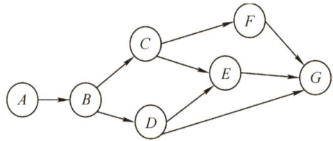  

A.4 B.6 C.5 D.7  

2.若一个有向图具有有序的拓扑排序序列，则它的邻接矩阵必定为（）。  

A．对称 B.稀疏 C.三角 D.一般  

13．下列关于图的说法中，正确的是（）。  

I.有向图中顶点 $V$ 的度等于其邻接矩阵中第 $V$ 行中1的个数II．无向图的邻接矩阵一定是对称矩阵，有向图的邻接矩阵一定是非对称矩阵IⅢI.在图 $G$ 的最小生成树 $G_{1}$ 中，某条边的权值可能会超过未选边的权值IV．若有向无环图的拓扑序列唯一，则可以唯一确定该图  

A.I、Ⅱ和Ⅲ B.III和IV C.III D.IV  

14．若某带权图为 $G=(V,E)$ ，其中 $V=\left\{\nu_{1},\nu_{2},\nu_{3},\nu_{4},\nu_{5},\nu_{6},\nu_{7},\nu_{8},\nu_{9},\nu_{10}\right\},E=\left\{<\nu_{1},\nu_{2}>5,<\nu_{1},\right.$ $\nu_{3}{>}6$ $<\nu_{2}$ 。 $\nu_{5}{>}3$ ${<}\nu_{3}$ $\nu_{5}{>}6$ ${<}\nu_{3}$ $\nu_{4}{>}3$ ${<}\nu_{4}$ $\nu_{5}{>}3$ ${<}\nu_{4}$ $\nu_{7}{>}1$ ${<}\nu_{4}$ 。 $\nu_{8}{>}4$ 。 ${<}\nu_{5}$ 。 $\nu_{6}{>}4$ ， $<\nu_{5},\nu_{7}{>}2$ ， ${<}\nu_{6}$ $\nu_{10}{>}4$ D ${<}\nu_{7}$ $\nu_{9}>5$ $<\nu_{8}$ 。 $\nu_{9}{>}2$ D ${<}\nu_{9}$ D $\nu_{10}{>}2\}$ （注：边括号外的数据表示边上的权值），则 $G$ 的关键路径的长度为（）。  

A.19 B. 20 C.21 D. 22  

15．下面关于求关键路径的说法中，不正确的是（）。  

A．求关键路径是以拓扑排序为基础的  
B．一个事件的最早发生时间与以该事件为始的孤的活动的最早开始时间相同  
C．一个事件的最迟发生时间是以该事件为尾的弧的活动的最迟开始时间与该活动的持续时间的差  
D.关键活动一定位于关键路径上  

16．下列关于关键路径的说法中，正确的是（）。  

I．改变网上某一关键路径上的任一关键活动后，必将产生不同的关键路径II．在AOE图中，关键路径上活动的时间延长多少，整个工程的时间也就随之延长多少III．缩短关键路径上任意一个关键活动的持续时间可缩短关键路径长度IV．缩短所有关键路径上共有的任意一个关键活动的持续时间可缩短关键路径长度  

V．缩短多条关键路径上共有的任意一个关键活动的持续时间可缩短关键路径长度  

A.Ⅱ和V B.I、Ⅱ和IV C.Ⅱ和IV D.I和IV  

17．用DFS遍历一个无环有向图，并在DFS 算法退栈返回时打印相应的顶点，则输出的顶点序列是（）。  

A.逆拓扑有序 B．拓扑有序 C.无序的 D.无法确定  

18.【2010统考真题】对下图进行拓扑排序，可得不同拓扑序列的个数是（）。  

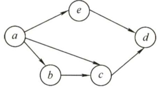  

A.4 B.3 C.2 D.1  

19.【2012统考真题】下列关于最小生成树的叙述中，正确的是（）。  

I．最小生成树的代价唯一II．所有权值最小的边一定会出现在所有的最小生成树中III．使用Prim算法从不同顶点开始得到的最小生成树一定相同IV．使用Prim算法和Kruskal算法得到的最小生成树总不相同  

A.仅I B.仅Ⅱ C.仅I、II D.仅Ⅱ、IV  

20.【2012统考真题】对下图所示的有向带权图，若采用Dijkstra算法求从源点 $a$ 到其他各顶点的最短路径，则得到的第一条最短路径的目标顶点是 $b$ ，第二条最短路径的目标顶点是 $\boldsymbol{c}$ ，后续得到的其余各最短路径的目标顶点依次是（）。  

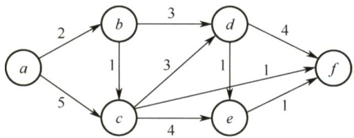  

A. d,e,f B. e,d,f C. f,d,e D. f,e, d  

21.【2013统考真题】下列AOE网表示一项包含8个活动的工程。通过同时加快若干活动的进度可以缩短整个工程的工期。下列选项中，加快其进度就可以缩短工程工期的是（）。  

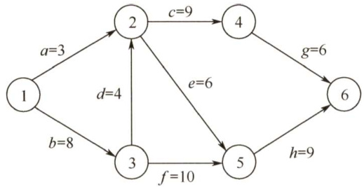  

A.c和 $e$ B.d和 $\boldsymbol{c}$ C. $f$ 和d D.f和h  

22.【2012统考真题】若用邻接矩阵存储有向图，矩阵中主对角线以下的元素均为零，则关于该图拓扑序列的结论是（）。  

A.存在，且唯一 B.存在，且不唯一C.存在，可能不唯一 D.无法确定是否存在  

23.【2014统考真题】对下图所示的有向图进行拓扑排序，得到的拓扑序列可能是（）  

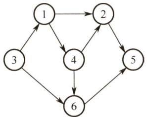  

A.3,1,2,4,5,6 B.3,1,2,4,6,5 C.3,1,4,2,5,6 D.3,1,4,2,6,5  

24.【2015统考真题】求下面的带权图的最小（代价）生成树时，可能是Kruskal算法第2次选中但不是 $\mathrm{Prim}$ 算法（从 $V_{4}$ 开始）第2次选中的边是（）。  

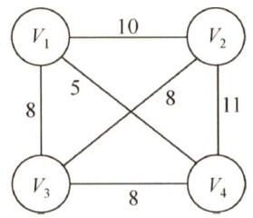  

A. $(V_{1},V_{3})$ B. $(V_{1},V_{4})$ C. $(V_{2},V_{3})$ D. $(V_{3},V_{4})$  

25.【2016统考真题】使用Dijkstra算法求下图中从顶点1到其他各顶点的最短路径，依次得到的各最短路径的目标顶点是（）。  

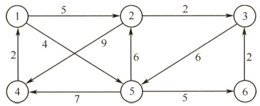  

A.5,2,3,4,6 B.5,2,3,6,4 C.5,2,4,3,6 D.5,2,6,3,4  

26.【2016统考真题】若对 $n$ 个顶点、 $e$ 条弧的有向图采用邻接表存储，则拓扑排序算法的时间复杂度是（）。  

A. O(n) B. $O(n+e)$ C. $O(n^{2})$ D. O(ne)  

7.【2018统考真题】下列选项中，不是如下有向图的拓扑序列的是（）。  

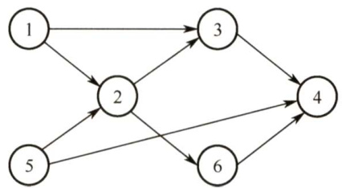  

A.1,5,2,3,6,4 B. 5,1,2,6,3,4   
C. 5,1,2,3,6,4 D. 5,2, 1,6,3, 4  

28.【2019统考真题】下图所示的AOE网表示一项包含8个活动的工程。活动 $d$ 的最早开始时间和最迟开始时间分别是（）。  

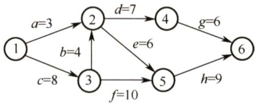  

A.3和7 B.12和12 C.12和14 D.15和15  

29.【2019统考真题】用有向无环图描述表达式 $(x+y)((x+y)/x)$ ，需要的顶点个数至少是（）。  

A.5 B.6 C.8 D.9  

30.【2020统考真题】已知无向图G如下所示，使用克鲁斯卡尔（Kruskal）算法求图G的最小生成树，加到最小生成树中的边依次是（）。  

A. $(b,f),(b,d),(a,e),(c,e),(b,e)$   
B. $(b,f),(b,d),(b,e),(a,e),(c,e)$   
C. $(a,e),(b,e),(c,e),(b,d),(b,f)$   
D. $(a,e),(c,e),(b,e),(b,f),(b,d)$  

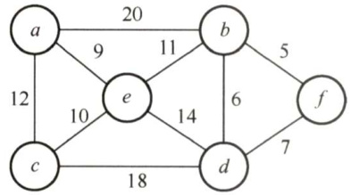  

31.【2020统考真题】修改递归方式实现的图的深度优先搜索（DFS）算法，将输出（访问）顶点信息的语句移到退出递归前（即执行输出语句后立刻退出递归）。采用修改后的算法遍历有向无环图G，若输出结果中包含G中的全部顶点，则输出的顶点序列是G的（）。  

A．拓扑有序序列 B．逆拓扑有序序列 C．广度优先搜索序列 D．深度优先搜索序列  

32.【2020统考真题】若使用AOE网估算工程进度，则下列叙述中正确的是（）  

A．关键路径是从源点到汇点边数最多的一条路径B．关键路径是从源点到汇点路径长度最长的路径C．增加任一关键活动的时间不会延长工程的工期D．缩短任一关键活动的时间将会缩短工程的工期  

33.【2021统考真题】给定如下有向图，该图的拓扑有序序列的个数是（）。  

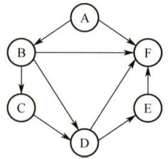  

A.1 B.2 C.3 D.4  

34.【2021统考真题】使用Dijkstra算法求下图中从顶点1到其余各顶点的最短路径，将当前找到的从顶点1到顶点2,3,4,5的最短路径长度保存在数组dist中，求出第二条最短路径后，dist中的内容更新为（）。  

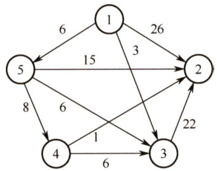  

A.26,3,14,6 B. 25,3,14,6 C.21,3,14,6 D.15,3,14,6  

#### 二、综合应用题  

01.下面是一种称为“破圈法”的求解最小生成树的方法：所谓“破圈法”，是指“任取一圈，去掉圈上权最大的边”，反复执行这一步骤，直到没有圈为止。试判断这种方法是否正确。若正确，说明理由；若不正确，举出反例(注：圈就是回路)。  

02.已知有向图如下图所示。  

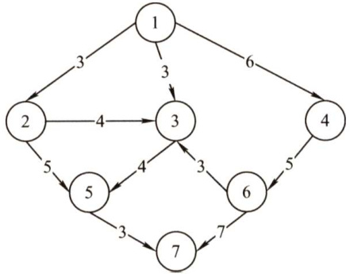  

1）写出该图的邻接矩阵表示并据此给出从顶点1出发的深度优先遍历序列。  
2）求该有向图的强连通分量的数目。  
3）给出该图的任意两个拓扑序列。  
4）若将该图视为无向图，分别用 $\mathrm{Prim}$ 算法和Kruskal算法求最小生成树。  

03.对下图所示的无向图，按照Dijkstra算法，写出从顶点1到其他各个顶点的最短路径和最短路径长度（顺序不能颠倒）。  

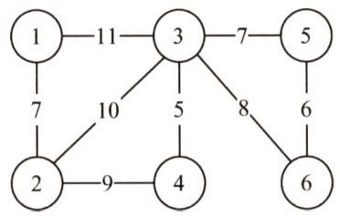  

04.下图所示为一个用AOE网表示的工程。  

1）画出此图的邻接表表示。  
2）完成此工程至少需要多少时间？  
3）指出关键路径。  

4）哪些活动加速可以缩短完成工程所需的时间？  

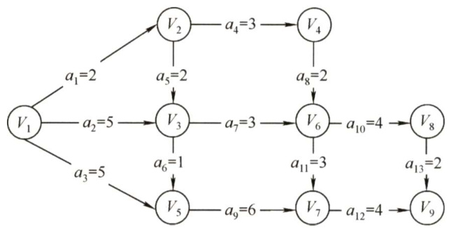  

05．下表给出了某工程各工序之间的优先关系和各工序所需的时间（其中“一”表示无先驱工序），请完成以下各题：  

1）画出相应的AOE网。  
2）列出各事件的最早发生时间和最迟发生时间。  
3）求出关键路径并指明完成该工程所需的最短时间。  

<html><body><table><tr><td>工序代号</td><td>A</td><td>B</td><td>C</td><td>D</td><td>E</td><td>F</td><td>G</td><td>H</td></tr><tr><td>所需时间</td><td>3</td><td>2</td><td>2</td><td>3</td><td>4</td><td>3</td><td>2</td><td>1</td></tr><tr><td>先驱工序</td><td></td><td>一</td><td>A</td><td>A</td><td>B</td><td>A</td><td>C、E</td><td>D</td></tr></table></body></html>  

06.试说明利用DFS如何实现有向无环图拓扑排序。  

07．一连通无向图，边非负权值，问用Dijkstra 最短路径算法能否给出一棵生成树，该树是否一定是最小生成树？说明理由。  

08.【2009统考真题】带权图（权值非负，表示边连接的两顶点间的距离）的最短路径问题是找出从初始顶点到目标顶点之间的一条最短路径。假设从初始顶点到目标顶点之间存在路径，现有一种解决该问题的方法：  

$\textcircled{1}$ 设最短路径初始时仅包含初始顶点，令当前顶点 $\boldsymbol{u}$ 为初始顶点。  
$\textcircled{2}$ 选择离 $\boldsymbol{u}$ 最近且尚未在最短路径中的一个顶点 $\nu$ ，加入最短路径，修改当前顶点 $u=\nu$ 。  
$\textcircled{3}$ 重复步骤 $\textcircled{2}$ ，直到 $\boldsymbol{u}$ 是目标顶点时为止。  
请问上述方法能否求得最短路径？若该方法可行，请证明；否则，请举例说明。  

09.【2011统考真题】已知有6个顶点（顶点编号为0～5）的有向带权图 $G$ ，其邻接矩阵 $A$ 为上三角矩阵，按行为主序（行优先）保存在如下的一维数组中。  

<html><body><table><tr><td>4</td><td>6</td><td>8</td><td>8</td><td>8</td><td>5</td><td>8</td><td>8</td><td>8</td><td>4</td><td>3</td><td>8</td><td></td><td>8</td><td>3</td><td>3</td></tr></table></body></html>  

要求：  

1）写出图 $G$ 的邻接矩阵 $A$ 。  
2）画出有向带权图 $G$ 。  
3）求图 $G$ 的关键路径，并计算该关键路径的长度。  

10.【2014统考真题】某网络中的路由器运行OSPF路由协议，下表是路由器R1维护的主要链路状态信息（LSI)，R1构造的网络拓扑图（见下图）是根据题下表及R1的接口名构造出来的网络拓扑。  

第6章图  

<html><body><table><tr><td></td><td>R1的LSI</td><td>R2的LSI</td><td colspan="2">R3的LSI</td><td>R4的LSI</td><td>备注</td></tr><tr><td>Router ID</td><td>10.1.1.1</td><td>10.1.1.2</td><td colspan="2">10.1.1.5</td><td>10.1.1.6</td><td>标识路由器的IP地址</td></tr><tr><td rowspan="3">Link1</td><td>ID</td><td>10.1.1.2</td><td>10.1.1.1</td><td>10.1.1.6</td><td>10.1.1.5</td><td>所连路由器的RouterID</td></tr><tr><td>IP</td><td>10.1.1.1</td><td>10.1.1.2</td><td>10.1.1.5</td><td>10.1.1.6</td><td>Link1的本地IP地址</td></tr><tr><td>Metric</td><td>3</td><td>3</td><td>6</td><td>6</td><td>Link1的费用</td></tr><tr><td rowspan="3">Link2</td><td>ID</td><td>10.1.1.5</td><td>10.1.1.6</td><td>10.1.1.1</td><td>10.1.1.2</td><td>所连路由器的RouterID</td></tr><tr><td>IP</td><td>10.1.1.9</td><td>10.1.1.13</td><td>10.1.1.10</td><td>10.1.1.14</td><td>Link2的本地IP地址</td></tr><tr><td>Metric</td><td>2</td><td>4</td><td>2</td><td>4</td><td>Link2的费用</td></tr><tr><td rowspan="2">Net1</td><td>Prefix</td><td>192.1.1.0/24</td><td>192.1.6.0/24</td><td>192.1.5.0/24</td><td>192.1.7.0/24</td><td>直连网络Netl的网络前缀</td></tr><tr><td>Metric</td><td>1</td><td>1</td><td>1</td><td>1</td><td>到达直连网络Net1的费用</td></tr></table></body></html>  

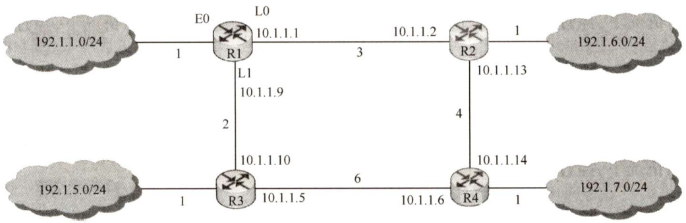  

请回答下列问题。  

1）本题中的网络可抽象为数据结构中的哪种逻辑结构？  
2）针对表中的内容，设计合理的链式存储结构，以保存表中的链路状态信息（LSI)。要求给出链式存储结构的数据类型定义，并画出对应表的链式存储结构示意图（示意图中可仅以ID标识结点）。  
3）按照Dijkstra算法的策略，依次给出R1到达子网192.l.x.x的最短路径及费用。  

11.【2017统考真题】使用Prim算法求带权连通图的最小（代价）生成树（MST）。请回答下列问题：  

1）对下列图 $G$ ，从顶点 $A$ 开始求 $G$ 的MST，依次给出按算法选出的边。  
2）图 $G$ 的MST是唯一的吗？  
3）对任意的带权连通图，满足什么条件时，其MST是唯一的？  

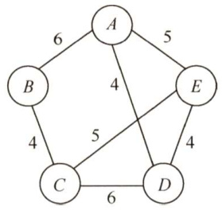  

12.【2018统考真题】拟建设一个光通信骨干网络连通BJ,CS,XA,QD,JN,NJ,TL和WH等8个城市，下图中无向边上的权值表示两个城市之间备选光缆的铺设费用。  

请回答下列问题：  

1）仅从铺设费用角度出发，给出所有可能的最经济的光缆铺设方案（用带权图表示），并计算相应方案的总费用。  

2）该图可采用图的哪种存储结构？给出求解问题1）所用的算法名称。  

3）假设每个城市采用一个路由器按1）中得到的最经济方案组网，主机H1直接连接在TL的路由器上，主机H2直接连接在BJ的路由器上。若H1向H2发送一个 $\mathrm{TTL}=5$ 的IP分组，则H2是否可以收到该IP分组？  

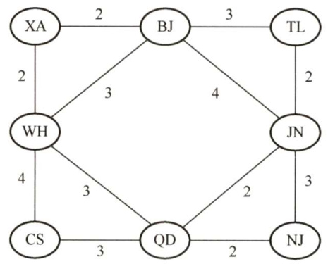  

#### 6.4.7 答案与解析  

#### 一、单项选择题  

01.A  

当无向连通图存在权值相同的多条边时，最小生成树可能是不唯一的；另外，由于这是一个无向连通图，故最小生成树必定存在，从而选A。  

02.C  

由于无向连通图的最小生成树不一定唯一，所以用不同算法生成的最小生成树可能不同，但当无向连通图的最小生成树唯一时，不同算法生成的最小生成树必定是相同的。  

03.A  

选项A显然正确；选项B，若无向图本身就是一棵树，则最小生成树就是它本身，这时就是唯一的；选项C，选取的 $n-1$ 条边可能构成回路；选项D，含有 $n$ 个顶点、 $n-1$ 条边的子图可能构成回路，也可能不连通。  

04.A  

选项A正确，见严蔚敏的教材《数据结构》。Dijkstra算法适合求解有回路的带权图的最短路径，也可以求任意两个顶点的最短路径，不适合求带负权值的最短路径问题。在用Floyd 算法求两个顶点的最短路径时，当最短路径发生更改时， $\mathrm{path}_{k-1}$ 就不是 $\mathrm{path}_{k}$ 的子集。  

05.B  

题干内容所述的图 $G$ 如下图所示。A,B，C,D对应的路径长度分别为18，13，15，24。应用Dijkstra 算法不难求出最短路径为 $\nu_{1}{\rightarrow}\nu_{3}{\rightarrow}\nu_{4}{\rightarrow}\nu_{6}{\rightarrow}\nu_{7}{\rightarrow}\nu_{8}$  

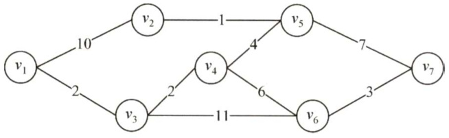  

06.A  

使用深度优先遍历，若从有向图上的某个顶点 $u$ 出发，在 $\mathrm{DFS}(u)$ 结束之前出现一条从顶点 $\boldsymbol{\nu}$ 到 $u$ 的边，由于 $\nu$ 在生成树上是 $u$ 的子孙，则图中必定存在包含 $u$ 和 $\nu$ 的环，因此深度优先遍历可以检测一个有向图是否有环。拓扑排序时，当某顶点不为任何边的头时才能加入序列，存在环时环中的顶点一直是某条边的头，不能加入拓扑序列。也就是说，还存在无法找到下一个可以加入拓扑序列的顶点，则说明此图存在回路。求最短路径是允许图有环的。至于关键路径能否判断一个图有环，则存在一些争议。关键路径本身虽然不允许有环，但求关键路径的算法本身无法判断是否有环，判断是否有环是求关键路径的第一步—拓扑排序。所以这个问题的答案主要取决于你从哪个角度出发看问题，考生需要理解问题本身，真正统考时是不会涉及一些模棱两可的问题的。  

07.D  

若图 $G$ 中存在一条从 $\nu_{j}$ 到 $\nu_{i}$ 的路径，说明 $V_{j}$ 是 $V_{i}$ 的前驱，则要把 $V_{j}$ 消去以后才能消去 $V_{i}$ 从而拓扑序列中必然先输出 $\nu_{j}$ ，再输出 $\nu_{i}$ ，这显然与题意矛盾。  

08.D  

若不存在拓扑排序，则表示图中必定存在回路，该回路构成一个强连通分量（不难理解顶点数目大于1的强连通分量中必然存在回路)。  

09.D  

I中，对于一个存在环路的有向图，使用拓扑排序算法运行后，肯定会出现有环的子图，在此环中无法再找到入度为0的结点，拓扑排序也就进行不下去。Ⅱ中，注意，若两个结点之间不存在祖先或子孙关系，则它们在拓扑序列中的关系是任意的（即前后关系任意)，因此使用栈和队列都可以，因为进栈或队列的都是入度为0的结点，此时入度为0的所有结点是没有关系的。III 是难点，若拓扑有序序列唯一，则很自然地让人联想到一个线性的有向图（错误)，下图的拓扑序列也是唯一的，但度却不满足条件。  

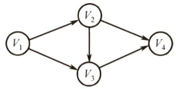  

10.D  

一个有向图中的顶点不能排成一个拓扑序列，表明其中存在一个顶点数目大于 $^1$ 的回路(环),该回路构成一个强连通分量，从而答案选D。  

11.C  

本图的拓扑排序序列有ABCFDEG,ABCDFEG,ABCDEFG,ABDCFEG和ABDCEFG。读者应能把这一类经典习题的拓扑序列全部写出来。  

12.C  

此题一直以来争议较大，因为有些书中漏掉了“有序”二字。可以证明，对有向图中的顶点适当地编号，使其邻接矩阵为三角矩阵且主对角元全为零的充分必要条件是，该有向图可以进行  

拓扑排序。若这个题目把“有序”二字去掉，显然应该选D。但此题题干中已经指出是“有序的拓扑序列”，因此应该选C。需要注意的是，若一个有向图的邻接矩阵为三角矩阵（对角线上元素为0)，则图中必不存在环，因此其拓扑序列必然存在。  

13.C  

有向图邻接矩阵的第 $V$ 行中1的个数是顶点 $V$ 的出度，而有向图中顶点的度为入度与出度之和，I错。无向图的邻接矩阵一定是对称矩阵，但当有向图中任意两个顶点之间有边相连，且是两条方向相反的有向边（无向图也可视为有两条方向相反的有向边的特殊有向图）时，有向图的邻接矩阵也是一个对称矩阵，Ⅱ错。最小生成树中的 $n-1$ 条边并不能保证是图中权值最小的 $n-1$ 条边，因为权值最小的 $n-1$ 条边并不一定能使图连通。在下图中，左图的最小生成树如右图所示，权值为3的边并不在其最小生成树中。  

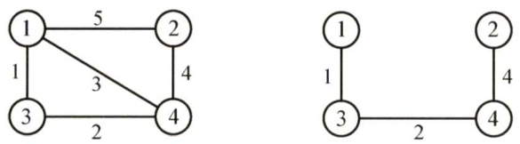  

有向无环图的拓扑序列唯一并不能唯一确定该图。在下图所示的两个有向无环图中，拓扑序列都为 $V_{1},V_{2},V_{3},V_{4}$ ，IV错。注意，很多辅导书对该命题的判断是错误的。  

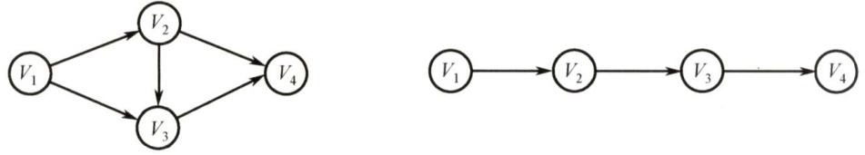  

14.C画出题目所表示的图如下，可得到关键路径的长度为21。图中所示的两条路径都是关键路径。  

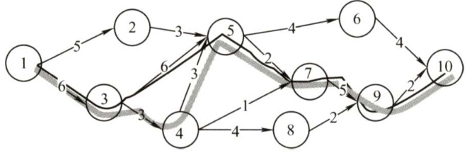  

15.C  

一个事件的最迟发生时间等于Min{以该事件为尾的弧的活动的最迟开始时间，最迟结束时间与该活动的持续时间的差)。  

16.C  

若改变的是所有关键路径上的公共活动，则不一定会产生不同的关键路径（延长必然不会导致，只有缩短才有可能导致)。根据关键路径的定义，可知ⅡI正确。关键路径是源点到终点的最长路径，只有所有关键路径的长度都缩短时，整个图的关键路径才能有效缩短，但也不能任意缩短，一旦缩短到一定程度，该关键活动就可能会变成非关键活动。  

17.A  

设在图中有顶点 $\nu_{i}$ ，它有后继顶点 $\nu_{j}$ ，即存在边 ${<}\nu_{i},\nu_{j}{>}$ 。根据DFS 的规则， $\nu_{i}$ 入栈后，必先遍历完其后继顶点后 $\nu_{i}$ 才会出栈，也就是说 $\nu_{i}$ 会在 $\nu_{j}$ 之后出栈，在如题所指的过程中， $\nu_{i}$ 在 $\nu_{j}$ 后打印。由于 $\nu_{i}$ 和 $\nu_{j}$ 具有任意性，可以从上面的规律看出，输出顶点的序列是逆拓扑有序序列。  

18.B  

可以得到3种不同的拓扑序列，即abced,abecd和aebcd，故选B。  

19.A  

最小生成树的树形可能不唯一（因为可能存在权值相同的边)，但代价一定是唯一的，I正确。若权值最小的边有多条并且构成环状，则总有权值最小的边将不出现在某棵最小生成树中，Ⅱ错误。设 $N$ 个结点构成环， $N^{-}1$ 条边权值相等，另一条边权值较小，则从不同的顶点开始Prim算法会得到 $N^{-}1$ 种不同的最小生成树，IⅢI错误。当最小生成树唯一时（各边的权值不同)，Prim算法和Kruskal算法得到的最小生成树相同，IV错误。  

20.C  

从 $a$ 到各顶点的最短路径的求解过程下：  

<html><body><table><tr><td>顶点</td><td>第1轮</td><td>第2轮</td><td>第3轮</td><td>第4轮</td><td>第5轮</td></tr><tr><td>b</td><td>(a,b）2</td><td></td><td></td><td></td><td></td></tr><tr><td>C</td><td>(a,c)5</td><td>（a,b,c）3</td><td></td><td></td><td></td></tr><tr><td>d</td><td>8</td><td>(a,b，d）5</td><td>(a，b，d）5</td><td>(a,b,d）5</td><td></td></tr><tr><td>e</td><td>8</td><td>8</td><td>(a,b,c,e)7</td><td>(a,b,c,e) 7</td><td>(a,b,d,e）6</td></tr><tr><td>f</td><td>8</td><td>8</td><td>(a,b,c,f）4</td><td></td><td></td></tr><tr><td>集合S</td><td>{a，b}</td><td>{a，b,c}</td><td>{a，b,c,f}</td><td>{a，b,c,f，d}</td><td>{a，b,c,f，d,e}</td></tr></table></body></html>  

后续目标顶点依次为 $f,d,e$ 。  

本题也可用排除法：对于A，若下一个顶点为 $d$ ，路径 $a,b,d$ 的长度为5，而 $a,b,c,f$ 的长度仅为4，显然错误。同理可排除选项 $\mathbf{B}$ 。将 $f$ 加入集合 $s$ 后，采用上述方法也可排除选项D。  

21.C  

找出AOE 网的全部关键路径为bdcg、bdeh和 bfh。根据定义，只有关键路径上的活动时间同时减少时，才能缩短工期。选项A、B和D并不包含在所有的关键路径中，只有C包含，因此只有加快 $f$ 和 $d$ 的进度才能缩短工期(建议读者在图中检验)。  

22.C  

对角线以下的元素均为零，表明只有从顶点 $i$ 到顶点 $j$ （ $i<j$ ）可能有边，而从顶点 $j$ 到顶点$i$ 一定无边，即有向图是一个无环图，因此一定存在拓扑序列。对于拓扑序列是否唯一，试举一例：设有向图的邻接矩阵为 ${\left[\begin{array}{l l l}{0}&{1}&{1}\\ {0}&{0}&{0}\\ {0}&{0}&{0}\end{array}\right]},$ 则存在两个拓扑序列，因此该图存在可能不唯一的拓扑序列。若题目中说对角线以上的元素均为1，以下的元素均为0，则拓扑序列唯一。  

23.D  

按照拓扑排序的算法，每次都选择入度为0的结点从图中删除，此图中一开始只有结点3的入度为0；删除结点3后，只有结点1的入度为0；删除结点1后，只有结点4的入度为0；删除结点4后，结点2和结点6的入度都为0，此时选择删除不同的结点，会得出不同的拓扑序列，分别处理完毕后可知可能的拓扑序列为3,1,4,2,6,5和3,1,4,6,2,5，选D。  

24.C解析请扫右侧二维码查阅。  

25.B  

根据Dijkstra算法，从顶点1到其余各顶点的最短路径如下表所示。  

<html><body><table><tr><td>顶 点</td><td>第1轮</td><td>第2轮</td><td>第3轮</td><td>第4轮</td><td>第5轮</td></tr><tr><td>2</td><td>5 V→V</td><td>5 V1→V2</td><td></td><td></td><td></td></tr><tr><td>3</td><td>8</td><td>8</td><td>7 V→V→V3</td><td></td><td></td></tr><tr><td>4</td><td>8</td><td>11 V→V5→V4</td><td>11 V→V5→V4</td><td>11 V→V5→V4</td><td>11 V1→V5→V4</td></tr><tr><td>5</td><td>4 VI→V5</td><td></td><td></td><td></td><td></td></tr><tr><td>6</td><td>8</td><td>9 V→V5→V6</td><td>9 V→V5→V6</td><td>9 V1→V5→V6</td><td></td></tr><tr><td>集合S</td><td>{1,5}</td><td>{1,5,2}</td><td>{1,5,2,3}</td><td>{1,5,2,3,6}</td><td>{1,5,2,3,6,4}</td></tr></table></body></html>  

26.B  

采用邻接表作为AOV网的存储结构进行拓扑排序，需要对 $n$ 个顶点做进栈、出栈、输出各一次，在处理 $e$ 条边时，需要检测这 $n$ 个顶点的边链表的 $e$ 个边结点，共需要的时间代价为 $O(n+$ e)。若采用邻接矩阵作为AOV网的存储结构进行拓扑排序，在处理 $e$ 条边时需对每个顶点检测相应矩阵中的某一行，寻找与它相关联的边，以便对这些边的入度减1，需要的时间代价为 $O(n^{2})$ 8  

27.D  

拓扑排序每次选取入度为0的结点输出，经观察不难发现拓扑序列前两位一定是1,5或5,1，（因为只有1和5的入度均为0，且其他结点都不满足仅有1或仅有5作为前驱)。D错误。  

28.C  

活动 $d$ 的最早开始时间等于该活动弧的起点所表示的事件的最早发生时间，活动 $d$ 的最早开始时间等于事件2的最早发生时间 $\operatorname*{max}\left\{a,b+c\right\}=\operatorname*{max}\left\{3,12\right\}=12$ 。活动 $d$ 的最迟开始时间等于该活动弧的终点所表示的事件的最迟发生时间与该活动所需时间之差，先算出图中关键路径长度为27（对于不复杂的选择题，找出所有路径计算长度)，那么事件4的最迟发生时间为 $\operatorname*{min}\{27-g\}=$ $\operatorname*{min}\{27-6\}=21$ ，活动 $d$ 的最迟开始时间为 $21-d=21-7=14$ 。  

常规方法：按照关键路径算法算得到下表。