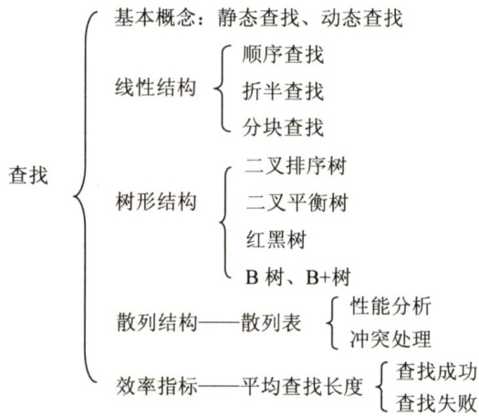

# 第7章  

## 查找  

### 【考纲内容】  

（一）查找的基本概念  
（二）顺序查找法  
（三）分块查找法  
（四）折半查找法  
（五）树型查找二叉搜索树；平衡二叉树；红黑树  
（六）B树及其基本操作、 $\mathrm{B}+$ 树的基本概念  
（七）散列（Hash）表  
（八）查找算法的分析及应用  

### 【知识框架】  

  

### 【复习提示】  

本章是考研命题的重点。对于散列查找，应掌握散列表的构造、冲突处理方法（各种方法的处理过程）、查找成功和查找失败的平均查找长度、散列查找的特征和性能分析。对于折半查找，应掌握折半查找的过程、构造判定树、分析平均查找长度等。B树和 $\mathrm{B}+$ 树是本章的难点。对于B树，考研大纲要求掌握插入、删除和查找的操作过程；对于 $\mathrm{B}+$ 树，仅要求了解其基本概念和性质。  
