### 7.2 顺序查找和折半查找  

#### 7.2.1 顺序查找  

顺序查找又称线性查找，它对顺序表和链表都是适用的。对于顺序表，可通过数组下标递增来顺序扫描每个元素；对于链表，可通过指针next来依次扫描每个元素。顺序查找通常分为对一般的无序线性表的顺序查找和对按关键字有序的线性表的顺序查找。下面分别进行讨论。  

#### 1．一般线性表的顺序查找  

作为一种最直观的查找方法，其基本思想是从线性表的一端开始，逐个检查关键字是否满足给定的条件。若查找到某个元素的关键字满足给定条件，则查找成功，返回该元素在线性表中的位置；若已经查找到表的另一端，但还没有查找到符合给定条件的元素，则返回查找失败的信息。下面给出其算法，主要是为了说明其中引入的“哨兵”的作用。  

typedef struct{ //查找表的数据结构 ElemType \*elem; //元素存储空间基址，建表时按实际长度分配，0号单元留空 int TableLen; //表的长度   
SSTable;   
int Search_Seq(SsTable ST,ElemType key){ ST.elem[0] $\L=$ key; //“哨兵” for( $\dot{\bf\updownarrow}=\mathbf{S}\mathbb{T}$ .TableLen;ST.elem[i]! $\L=$ key;--i); //从后往前找 returni；//若表中不存在关键字为key的元素，将查找到i为0时退出for循环  

在上述算法中，将 ST.elem[0]称为“哨兵”。引入它的目的是使得Search_Seq内的循环不必判断数组是否会越界，因为满足 $\scriptstyle\dot{1}==0$ 时，循环一定会跳出。需要说明的是，在程序中引入“哨兵”并不是这个算法独有的。引入“哨兵”可以避免很多不必要的判断语句，从而提高程序效率。  

对于有 $n$ 个元素的表，给定值 $\operatorname{key}$ 与表中第 $i$ 个元素相等，即定位第 $i$ 个元素时，需进行 $n-i$ $^+1$ 次关键字的比较，即 $C_{i}=n-i+1$ 。查找成功时，顺序查找的平均长度为  

$$
\mathrm{ASL}_{_{j\backslash(\vec{x},\vec{y})}}{=}\sum_{i=1}^{n}P_{i}(n-i+1)
$$  

当每个元素的查找概率相等，即 $P_{i}=1/n$ 时，有  

$$
\mathrm{ASL}_{_{h\hat{\mathbb{X}}^{1}}}=\sum_{i=1}^{n}P_{i}(n-i+1)={\frac{n+1}{2}}
$$  

查找不成功时，与表中各关键字的比较次数显然是 $^{n+1}$ 次，从而顺序查找不成功的平均查找长度为ASL $\chi_{\dot{\mu}\dot{\chi},\dot{\varsigma}\dot{\jmath}}=n+1$ 。  

通常，查找表中记录的查找概率并不相等。若能预先得知每个记录的查找概率，则应先对记录的查找概率进行排序，使表中记录按查找概率由大至小重新排列。  

综上所述，顺序查找的缺点是当 $n$ 较大时，平均查找长度较大，效率低；优点是对数据元素的存储没有要求，顺序存储或链式存储皆可。对表中记录的有序性也没有要求，无论记录是否按关键字有序，均可应用。同时还需注意，对线性的链表只能进行顺序查找。  

#### 2．有序表的顺序查找  

若在查找之前就已经知道表是关键字有序的，则查找失败时可以不用再比较到表的另一端就能返回查找失败的信息，从而降低顺序查找失败的平均查找长度。  

假设表是按关键字从小到大排列的，查找的顺序是从前往后，待查找元素的关键字为 key，当查找到第i个元素时，发现第 $i$ 个元素对应的关键字小于key，但第 $i+1$ 个元素对应的关键字大于key，这时就可返回查找失败的信息，因为第 $i$ 个元素之后的元素的关键字均大于key，所以表中不存在关键字为key的元素。  

可以用如图7.1所示的判定树来描述有序线性表的查找过程。树中的圆形结点表示有序线性表中存在的元素；树中的矩形结点称为失败结点（若有 $n$ 个结点，则相应地有 $n+1$ 个查找失败结点)，它描述的是那些不在表中的数据值的集合。若查找到失败结点，则说明查找不成功。  

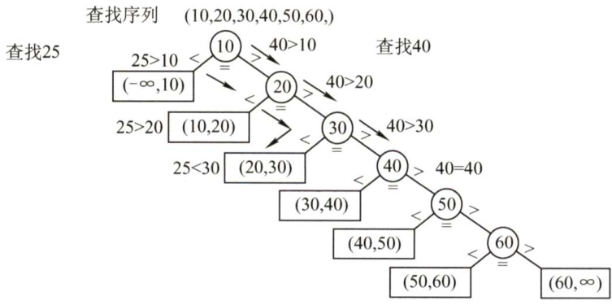  
图7.1有序顺序表上的顺序查找判定树  

在有序线性表的顺序查找中，查找成功的平均查找长度和一般线性表的顺序查找一样。查找失败时，查找指针一定走到了某个失败结点。这些失败结点是我们虚构的空结点，实际上是不存在的，所以到达失败结点时所查找的长度等于它上面的一个圆形结点的所在层数。查找不成功的平均查找长度在相等查找概率的情形下为  

$$
\operatorname{ASL}_{{\mathcal{T}}\to R{\bar{\mathbb{X}}}^{+}{\mathcal{Y}}}=\sum_{j=1}^{n}q_{j}(l_{j}-1)={\frac{1+2+\cdots+n+n}{n+1}}={\frac{n}{2}}+{\frac{n}{n+1}}
$$  

式中， $q_{j}$ 是到达第 $j$ 个失败结点的概率，在相等查找概率的情形下，它为 $1/(n+1)$ ， $l_{j}$ 是第 $j$ 个失败结点所在的层数。当 $n=6$ 时， $\mathrm{ASL}_{\mathcal{K P M}_{\mathit{t h}}}=6/2+6/7=3.86$ ，比一般的顺序查找算法好一些。  

注意，有序线性表的顺序查找和后面的折半查找的思想是不一样的，且有序线性表的顺序查找中的线性表可以是链式存储结构。  

#### 7.2.2 折半查找  

折半查找又称二分查找，它仅适用于有序的顺序表。  

折半查找的基本思想：首先将给定值key与表中中间位置的元素比较，若相等，则查找成功，返回该元素的存储位置；若不等，则所需查找的元素只能在中间元素以外的前半部分或后半部分（例如，在查找表升序排列时，若给定值key大于中间元素，则所查找的元素只可能在后半部分)。然后在缩小的范围内继续进行同样的查找，如此重复，直到找到为止，或确定表中没有所需要查找的元素，则查找不成功，返回查找失败的信息。算法如下：  

int Binary_Search（SeqList L,ElemType key){intlow $=0$ ,high $\scriptstyle=\mathtt{I}$ .TableLen-l,mid;while(low $<=$ high){mid $\c=$ （low+high)/2; //取中间位置if(L.elem[mid] $\scriptstyle==$ key)return mid; //查找成功则返回所在位置else if(L.elem[mid]>key)high $\c=$ mid-1; //从前半部分继续查找elselow=mid+1; //从后半部分继续查找}return -1; //查找失败，返回-1  
)  

例如，已知11个元素的有序表{7,10,13,16,19,29,32,33,37,41,43}，要查找值为11和32的元素，指针low 和 high 分别指向表的下界和上界，mid 则指向表的中间位置L(low+high）/2」。以下说明查找11的过程（查找32的过程请读者自行分析)：  

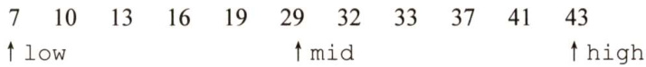  

第一次查找，将中间位置元素与key值比较。因为 $11<29$ ，说明待查元素若存在，则必在范围[low,mid-1]内，令指针high 指向位置 mid-1，high $\c=$ mid- $\cdot1=5$ ，重新求得 mid $\mathbf{\Sigma}=\mathbf{\Sigma}$ $(1+5)/2=3$ ，第二次的查找范围为[1,5]。  

第二次查找，同样将中间位置元素与key值比较。因为 $11<13$ ，说明待查元素若存在，则必在范围[low,mid-1]内，令指针high 指向位置mid-1，high $\scriptstyle.=1$ mid- $\scriptstyle1=2$ ，重新求得→ ${\mathrm{\nid}}=(1+2)/2{=}1$ ，第三次的查找范围为[1,2]。  

第三次查找，将中间位置元素与key值比较。因为 $11>7$ ，说明待查元素若存在，则必在范围[mid+1,high]内。令 $\scriptstyle1\circ w=\operatorname*{mid}+1=2$ ，mid $\v{x}=$ (2+2)/ $2=2$ ，第四次的查找范围为[2,2]。  

7 10 13 16 19 29 32 33 37 41 43   
low↑↑high ↑mid  

第四次查找，此时子表只含有一个元素，且 $\scriptstyle10\neq11$ ，故表中不存在待查元素。  

折半查找的过程可用图7.2所示的二叉树来描述，称为判定树。树中每个圆形结点表示一个记录，结点中的值为该记录的关键字值；树中最下面的叶结点都是方形的，它表示查找不成功的情况。从判定树可以看出，查找成功时的查找长度为从根结点到目的结点的路径上的结点数，而查找不成功时的查找长度为从根结点到对应失败结点的父结点的路径上的结点数；每个结点值均大于其左子结点值，且均小于于其右子结点值。若有序序列有 $n$ 个元素，则对应的判定树有 $n$ 个圆形的非叶结点和 $n+1$ 个方形的叶结点。显然，判定树是一棵平衡二叉树。  

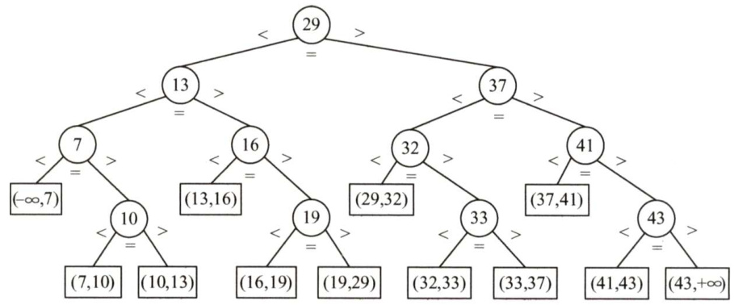  
图7.2描述折半查找过程的判定树  

由上述分析可知，用折半查找法查找到给定值的比较次数最多不会超过树的高度。在等概率查找时，查找成功的平均查找长度为  

$$
\mathrm{ASL}={\frac{1}{n}}\sum_{i=1}^{n}l_{i}={\frac{1}{n}}(1\times1+2\times2+\cdots+h\times2^{h-1})={\frac{n+1}{n}}\log_{2}(n+1)-1\approx\log_{2}(n+1)-1
$$  

式中， $h$ 是树的高度，并且元素个数为 $n$ 时树高 $h=\lceil\log_{2}(n+1)\rceil_{*}$ 。所以，折半查找的时间复杂度为 $O(\log_{2}n)$ ，平均情况下比顺序查找的效率高。  

在图7.2所示的判定树中，在等概率情况下，查找成功（圆形结点）的 ${\mathrm{ASL}}=(1\times1+2\times2+3\times4+$ $4\times4)/11=3$ ，查找不成功（方形结点）的 ${\mathrm{ASL}}=(3{\times}4+4{\times}8)/12=11/3$ 。  

因为折半查找需要方便地定位查找区域，所以它要求线性表必须具有随机存取的特性。因此，该查找法仅适合于顺序存储结构，不适合于链式存储结构，且要求元素按关键字有序排列。  

#### 7.2.3 分块查找  

分块查找又称索引顺序查找，它吸取了顺序查找和折半查找各自的优点，既有动态结构，又适于快速查找。  

分块查找的基本思想：将查找表分为若干子块。块内的元素可以无序，但块之间是有序的，即第一个块中的最大关键字小于第二个块中的所有记录的关键字，第二个块中的最大关键字小于第三个块中的所有记录的关键字，以此类推。再建立一个索引表，索引表中的每个元素含有各块的最大关键字和各块中的第一个元素的地址，索引表按关键字有序排列。  

分块查找的过程分为两步：第一步是在索引表中确定待查记录所在的块，可以顺序查找或折半查找索引表；第二步是在块内顺序查找。  

例如，关键码集合为{88,24,72,61,21,6,32,11,8,31,22,83,78,54}，按照关键码值24,54,78,3，分为4个块和索引表，如图7.3所示。  

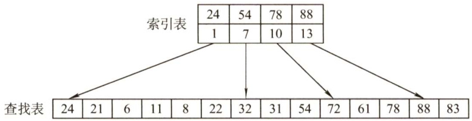  
图7.3 分块查找示意图  

分块查找的平均查找长度为索引查找和块内查找的平均长度之和。设索引查找和块内查找的平均查找长度分别为 $L_{\mathrm{I}},L_{\mathrm{S}}$ ，则分块查找的平均查找长度为  

$$
\mathrm{ASL}=L_{\mathrm{I}}+L_{\mathrm{S}}
$$  

将长度为 $n$ 的查找表均匀地分为 $b$ 块，每块有 $s$ 个记录，在等概率情况下，若在块内和索引表中均采用顺序查找，则平均查找长度为  

$$
{\mathrm{ASL}}=L_{\mathrm{{l}}}+L_{\mathrm{{s}}}={\frac{b+1}{2}}+{\frac{s+1}{2}}={\frac{s^{2}+2s+n}{2s}}
$$  

此时，若 $s={\sqrt{n}}$ ，则平均查找长度取最小值 ${\sqrt{n}}+1$ ；若对索引表采用折半查找时，则平均查找长度为  

$$
{\mathrm{ASL}}=L_{\mathrm{l}}+L_{\mathrm{S}}=\ \left\lceil\log_{2}(b+1)\right\rceil+{\frac{s+1}{2}}
$$  

#### 7.2.4 本节试题精选  

#### 一、单项选择题  

01．顺序查找适合于存储结构为（）的线性表。  

A.顺序存储结构或链式存储结构 B．散列存储结构C.索引存储结构 D.压缩存储结构  

02.由 $n$ 个数据元素组成的两个表：一个递增有序，一个无序。采用顺序查找算法，对有序表从头开始查找，发现当前元素已不小于待查元素时，停止查找，确定查找不成功，已知查找任一元素的概率是相同的，则在两种表中成功查找（）。  

A．平均时间后者小 B.平均时间两者相同C．平均时间前者小 D．无法确定  

03．对长度为 $n$ 的有序单链表，若查找每个元素的概率相等，则顺序查找表中任一元素的查找成功的平均查找长度为（）。  

A. n/2 B. $(n+1)/2$ C. $(n-1)/2$ D. n/4  

04．对长度为3的顺序表进行查找，若查找第一个元素的概率为1/2，查找第二个元素的概率为1/3，查找第三个元素的概率为1/6，则查找任一元素的平均查找长度为（）。  

A.5/3 B.2 C. 7/3 D. 4/3  

05．下列关于二分查找的叙述中，正确的是（）。  

A.表必须有序，表可以顺序方式存储，也可以链表方式存储B．表必须有序且表中数据必须是整型、实型或字符型C．表必须有序，而且只能从小到大排列  

D.表必须有序，且表只能以顺序方式存储  

06.在一个顺序存储的有序线性表上查找一个数据时，既可以采用折半查找，也可以采用顺序查找，但前者比后者的查找速度（）。  

A.必然快 B.取决于表是递增还是递减 C．在大部分情况下要快 D.必然不快  

07．折半查找过程所对应的判定树是一棵（）。  

A．最小生成树 B．平衡二叉树 C.完全二叉树 D.满二叉树  

08.折半查找和二叉排序树的时间性能（）。  

A.相同 B．有时不相同 C.完全不同 D．无法比较  

09．在有11个元素的有序表 $\mathbb{A}[1,2,...,11]$ 中进行折半查找（L(low+high）/2」)，查找元素A[11]时，被比较的元素下标依次是（）。  

A. 6,8,10,11 B. 6,9,10,11 C.6,7,9,11 D. 6,8,9, 11  

10.已知有序表(13,18,24,35,47,50,62,83,90,115,134)，当二分查找值为90的元素时，查找成功的比较次数为（）。  

A.1 B.2 C.4 D.（l1．对表长为 $n$ 的有序表进行折半查找，其判定树的高度为（）。  

A. $\lceil\log_{2}(n+1)\rceil$ B. $\left\lfloor\log_{2}(n+1)\right\rfloor-1$ C.1ogn] D.Llogn」-1  

12．已知一个长度为16的顺序表，其元素按关键字有序排列，若采用折半查找算法查找一个不存在的元素，则比较的次数至少是（），至多是（）。  

A.4 B.5 C.6 D.7  

13．具有12个关键字的有序表中，对每个关键字的查找概率相同，折半查找算法查找成功的平均查找长度为（），折半查找查找失败的平均查找长度为（）。  

A.37/12 B.35/12 C.39/13 D.49/13  

14．采用分块查找时，数据的组织方式为（）。  

A．数据分成若干块，每块内数据有序  
B．数据分成若干块，每块内数据不必有序，但块间必须有序，每块内最大（或最小）的数据组成索引块  
C．数据分成若干块，每块内数据有序，每块内最大（或最小）的数据组成索引块  
D．数据分成若干块，每块（除最后一块外）中数据个数需相同  

15.对有2500个记录的索引顺序表（分块表）进行查找，最理想的块长为（）。  

A.50 B.125 C. 500 D.「log2500]  

16.设顺序存储的某线性表共有123个元素，按分块查找的要求等分为3块。若对索引表采用顺序查找法来确定子块，且在确定的子块中也采用顺序查找法，则在等概率情况下，分块查找成功的平均查找长度为（）。  

A.21 B.23 C.41 D. 62  

17．为提高查找效率，对有65025个元素的有序顺序表建立索引顺序结构，在最好情况下查找到表中已有元素最多需要执行（）次关键字比较。  

A.10 B.14 C.16 D.21  

18.【2010统考真题】已知一个长度为16的顺序表L，其元素按关键字有序排列，若采用折半查找法查找一个L中不存在的元素，则关键字的比较次数最多是（）。  

A.4 B.5 C.6 D.7  

19.【2015统考真题】下列选项中，不能构成折半查找中关键字比较序列的是（）。  

A.500,200,450,180 B.500,450,200,180   
C.180,500,200,450 D. 180,200,500,450  

20.【2016统考真题】在有 $n$ （ $n>1000$ ）个元素的升序数组A中查找关键字X。查找算法的伪代码如下所示。  

$k=0$ .  
while $k<n$ 且 $\mathbb{A}\left[\mathbf{k}\right]<\mathbf{x}$ ） $k=k+3$ .  
if $k<n$ 且 $\mathbb{A}\left[\mathbb{k}\right]==\mathbb{x}$ 查找成功；  
else if $k-1<n$ 且 $\mathbb{A}\left[\mathbb{k}-1\right]==\mathbf{x}$ 查找成功；else if $k-2<n$ 且 $A[k-2]=-2$ 查找成功；else查找失败；  

本算法与折半查找算法相比，有可能具有更少比较次数的情形是（）。  

A.当x不在数组中 B.当×接近数组开头处C.当×接近数组结尾处 D.当×位于数组中间位置  

21.【2017统考真题】下列二叉树中，可能成为折半查找判定树（不含外部结点）的是（）  

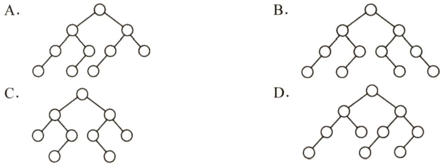  

#### 二、综合应用题  

01．若对有 $n$ 个元素的有序顺序表和无序顺序表进行顺序查找，试就下列三种情况分别讨论两者在相等查找概率时的平均查找长度是否相同。  

1）查找失败。  
2）查找成功，且表中只有一个关键字等于给定值k的元素。  
3）查找成功，且表中有若干关键字等于给定值 $\mathbf{k}$ 的元素，要求一次查找能找出所有元素。  

02.有序顺序表中的元素依次为017,094,154,170,275,503,509,512,553,612,677,765,897,908。  

1）试画出对其进行折半查找的判定树。  
2）若查找275或684的元素，将依次与表中的哪些元素比较？  
3）计算查找成功的平均查找长度和查找不成功的平均查找长度。  

03．类比二分查找算法，设计 $k$ 分查找算法（ $k$ 为大于2的整数）如下：首先检查 ${{n}/{k}}$ 处（n为查找表的长度）的元素是否等于要搜索的值，然后检查 $2n/k$ 处的元素…这样，或者找到要查找的元素，或者把集合缩小到原来的 $1/k$ ，若未找到要查找的元素，则继续在得到的集合上进行 $k$ 分查找；如此进行，直到找到要查找的元素或查找失败。试求查找成功和查找失败的时间复杂度。  

04.已知一个有序顺序表 $\mathbb{A}\left[0...8\mathrm{n}-1\right]$ 的表长为 $8\ensuremath{\mathrm{n}}$ ，并且表中没有关键字相同的数据元素。假设按下述方法查找一个关键字值等于给定值X的数据元素：先在A[7],A[15]，$\mathbb{A}[23],...,\mathbb{A}[8\mathbf{k-1}],...,\mathbb{A}[8\mathbf{n-1}]$ 中进行顺序查找，若查找成功，则算法报告成功位置并返回；若不成功，当 $\mathbb{A}\left[8\mathrm{K}-1\right]<\mathrm{X}<\mathbb{A}\left[\mathbb{8}\times\left(\mathrm{k}+1\right)-1\right]$ 时，则可确定一个缩小的查找范围 $\mathbb{A}\left[\left.8\right|\mathrm{\sf{B}}\right]\sim\mathrm{\sf{A}}\left[\mathrm{\sf{8}}\times\mathrm{\boldmath~\tau~}\left(\mathrm{k}+1\right)-2\right]$ ，然后可在这个范围内执行折半查找。特殊情况：若  

$X{>}\mathbb{A}\left[8\mathrm{n}{-}1\right]$ 的关键字，则查找失败。  

1）画出描述上述查找过程的判定树。  
2）计算相等查找概率下查找成功的平均查找长度。  

05.写出折半查找的递归算法。初始调用时，low为1，high为ST.length。  

06．线性表中各结点的检索概率不等时，可用如下策略提高顺序检索的效率：若找到指定的结点，则将该结点和其前驱结点（若存在）交换，使得经常被检索的结点尽量位于表的前端。试设计在顺序结构和链式结构的线性表上实现上述策略的顺序检索算法。  

07.【2013统考真题】设包含4个数据元素的集合 $S=\{^{\prime}\mathrm{d}\mathrm{o}^{\prime}$ ,'for','repeat','while'}，各元素的查找概率依次为 $p_{1}=0.35,p_{2}=0.15,p_{3}=0.15,p_{4}=0.35,$ 将 $s$ 保存在一个长度为4的顺序表中，采用折半查找法，查找成功时的平均查找长度为2.2。  

1）若采用顺序存储结构保存 $s$ ，且要求平均查找长度更短，则元素应如何排列？应使用何种查找方法？查找成功时的平均查找长度是多少？  
2）若采用链式存储结构保存 $s$ ，且要求平均查找长度更短，则元素应如何排列？应使用何种查找方法？查找成功时的平均查找长度是多少？  

#### 7.2.5 答案与解析  

#### 一、单项选择题  

01.A  

顺序查找是指从表的一端开始向另一端查找。它不要求查找表具有随机存取的特性，可以是顺序存储结构或链式存储结构。  

02.B  

对于顺序查找，不管线性表是有序的还是无序的，成功查找第一个元素的比较次数为1，成功查找第二个元素的比较次数为2，以此类推，即每个元素查找成功的比较次数只与其位置有关（与是否有序无关)，因此查找成功的平均时间两者相同。  

03.B  

在有序单链表上做顺序查找，查找成功的平均查找长度与在无序顺序表或有序顺序表上做顺序查找的平均查找长度相同，都是 $(n+1)/2$ 。  

04.A  

在长度为3的顺序表中，查找第一个元素的查找长度为1，查找第二个元素的查找长度为2，查找第三个元素的查找长度为3，故有  

$$
{\mathrm{ASL}}_{_{\mathtt{A S M}}={\frac{1}{2}}\times1+{\frac{1}{3}}\times2+{\frac{1}{6}}\times3}={\frac{5}{3}}
$$  

05.D  

二分查找通过下标来定位中间位置元素，故应采用顺序存储，且二分查找能够进行的前提是查找表是有序的，但具体是从大到小还是从小到大的顺序则不做要求。  

06.C  

折半查找的快体现在一般情况下，在大部分情况下要快，但是对于某些特殊情况，顺序查找可能会快于折半查找。例如，查找一个含1000个元素的有序表中的第一个元素时，顺序查找的比较次数为1次，而折半查找的比较次数却将近10次。  

07.B  

A显然排除。对于选项C，考点精析示例中的判定树就不是完全二叉树。由选项C也可排除选项D，且满二叉树对结点数有要求。只可能选B。事实上，由折半查找的定义不难看出，每次把一个数组从中间结点分割时，总是把数组分为结点数相差最多不超过1的两个子数组，从而使得对应的判定树的两棵子树高度差的绝对值不超过1，所以应是平衡二叉树。  

08.B  

折半查找的性能分析可以用二叉判定树来衡量，平均查找长度和最大查找长度都是 $O(\log_{2}n)$ 二叉排序树的查找性能与数据的输入顺序有关，最好情况下的平均查找长度与折半查找相同，但最坏情况即形成单支树时，其查找长度为 $O(n)$ 。  

09.B  

依据折半查找算法的思想，第一次 $\mathrm{mid}{=}\lfloor(1+11)/2\rfloor{=}6$ ，第二次mic $\!=\left\lfloor\left[(6+1)+11\right]/2\right\rfloor=9$ 第三次m $\scriptstyle{\mathrm{1id}}=\left\lfloor[(9+1)+11]/2\right\rfloor=10$ ，第四次mid $=11$ 。  

10.B  

开始时low指向13，high指向134，mid指向50，比较第一次 $90>50$ ，所以将low指向62，high指向134，mid指向90，第二次比较找到90。  

11.A  

对 $n$ 个结点的判定树，设结点总数 $n=2^{h}-1$ ，则 $h=\ \lceil\log_{2}(n+1)\rceil_{\circ}$ 另解：特殊值代入法。直接将 $n=1$ 和 $n=2$ 的情况代入，仅有A满足要求。  

12.A、B  

对于此类题，有两种做法：一种方法是，画出查找过程中构成的判定树，让最小的分支高度对应于最少的比较次数，让最大的分支高度对应于最多的比较次数，出现类似于长度为15的顺序表时，判定树刚好是一棵满树，此时最多比较次数与最少比较次数相等；另一种方法是，直接用公式求出最小的分支高度和最大分支高度，从前面的讲解不难看出最大分支高度为 $H=\lceil\log_{2}(n+$ $1)7=5$ ，这对应的就是最多比较次数，然后由于判定树不是一棵满树，所以至少应该是4（由判定树的各分支高度最多相差1得出）。  

注意，若是求查找成功或查找失败的平均查找长度，则需要画出判定树进行求解。此外，对长度为 $n$ 的有序表，采用折半查找时，查找成功和查找失败的最多比较次数相同，均为$\lceil\log_{2}(n+1)\rceil$ 。  

13.A、D  

假设有序表中元素为A[0...1]，不难画出对它进行折半查找的判定树如下图所示，圆圈是查找成功结点，方形是虚构的查找失败结点。从而可以求出查找成功的 ${\mathrm{ASL}}=(1+2{\times}2+3{\times}4+$ $4\times5)/12=37/12$ ，查找失败的 $\mathrm{ASL}=(3{\times}3+4{\times}10)/13$ 。  

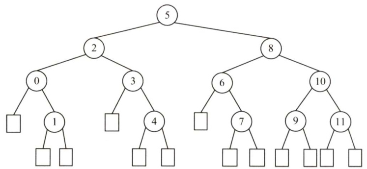  

注意：对于本类题目，应先根据所给 $n$ 的值，画出如上图的折半查找判定树。另外，查找失败结点的ASL不是图中的方形结点，而是方形结点上一层的圆形结点。  

14.B  

通常情况下，在分块查找的结构中，不要求每个索引块中的元素个数都相等。  

15.A  

设块长为 $b$ ，索引表包含 $n/b$ 项，索引表的 $\mathrm{ASL}=(n/b+1)/2$ ，块内的 $\mathrm{ASL}=(b+1)/2$ ，总 $\mathrm{ASL}=$ 索引表的ASL $^+$ 块内的 $\mathrm{ASL}=(b+n/b+2)/2$ ，其中对于 $b+n/b$ ，由均值不等式知 $b=n/b$ 时有最小值，此时 $b={\sqrt{n}}$ 。则最理想块长为 ${\sqrt{2500}}=50$ 。  

16.B  

根据公式 ${\mathrm{ASL}}=L_{\mathrm{{l}}}+L_{\mathrm{{s}}}={\frac{b+1}{2}}+{\frac{s+1}{2}}={\frac{s^{2}+2s+n}{2\mathrm{{s}}}}$ +s+1s²+2s+n，其中b=n/s,s=123/3,n=123，代入难得出ASL为23。故选 $\mathbf{B}$ 。另一方面，可根据穷举法来一步步模拟。对于A块中的元素，查找过程的第一步是先找到A块，由于是顺序查找，找到A块只需一步，然后在A块中顺序查找。因此，A块内各元素查找长度分别为 $2,3,4,\cdots,42$ 。对于B块，采用类似的方法，但查找到B块要比查找到A块多一步，因此B块内各元素查找长度为3,4,5,,43。同理，C块中各个元素查找长度为4,5,6,,44。所以平均查找长度为 $(2+3+4+\cdots+42+3+4+5+\cdots+43+4+5+6+\cdots+44)/123=23$ 。  

17.C  

为使查找效率最高，每个索引块的大小应是 $\sqrt{65025}=255$ ，为每个块建立索引，则索引表中索引项的个数为 255。若对索引项和索引块内部都采用折半查找，则查找效率最高，为 $\left\lceil\log_{2}(255+1)\right\rceil+$ $\begin{array}{r}{\left\lceil\log_{2}(255+1)\right\rceil=16}\end{array}$  

18.B  

折半查找法在查找不成功时和给定值进行关键字的比较次数最多为树的高度，即 $\mathrm{~\underline{{~l~o~g~}}}_{2}n\mathrm{~\underline{{~l~}}~+~1~}$ 或 $\log_{2}(n+1)]$ 。在本题中， $n=16$ ，故比较次数最多为5。  

注意：在折半查找判定树中的方形结点是虚构的，它并不计入比较的次数中。  

19.A  

如下图所示，画出查找路径图，因为折半查找的判定树是一棵二叉排序树，因此看其是否满足二叉排序树的要求。  

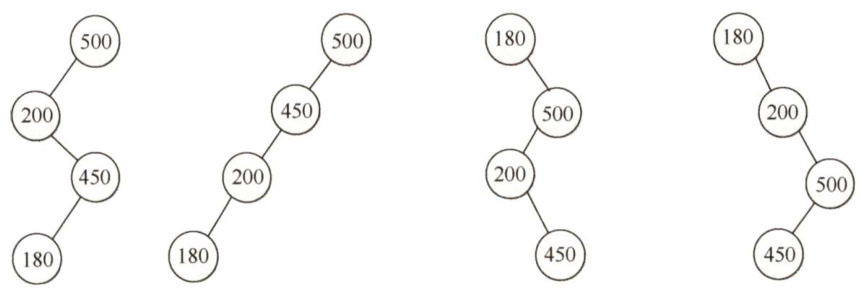  

显然，选项A的查找路径不满足。  

扫一扫  

20.B  

解析请扫右侧二维码查阅。  

21.A  

折半查找判定树实际上是一棵二叉排序树，它的中序序列是一个有序序列。可以在树结点上依次填上相应的元素，符合折半查找规则的树即为所求，如下图所示。  

B选项4、5相加除以2向上取整，7、8相加除以2向下取整，矛盾。C选项，3、4相加除 以2向上取整，6、7相加除以2向下取整，矛盾。D选项，1、10相加除以2向下取整，6、7相 加除以2向上取整，矛盾。A选项符合折半查找规则，正确。  

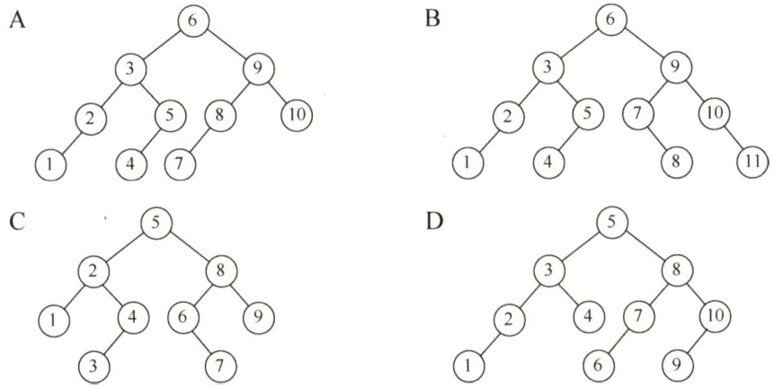  

#### 二、综合应用题  

01.【解答】  

1）平均查找长度不同。因为有序顺序表查找到其关键字值比要查找值大的元素时就停止查找，并报告失败信息，不必查找到表尾；而无序顺序表必须查找到表尾才能确定查找失败。  

2）平均查找长度相同。两者查找到表中元素的关键字值等于给定值时就停止查找。  

3）平均查找长度不同。有序顺序表中关键字相等的元素相继排列在一起，只要查找到第一个就可以连续查找到其他关键字相同的元素。而无序顺序表必须查找全部表中的元素才能找出相同关键字的元素，因此所需的时间不同。  

02.【解答】  

1）判定树如下图所示。  

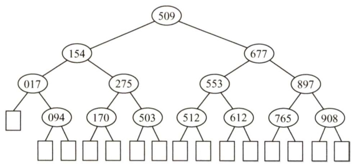  

2）若查找275，依次与表中元素509,154,275进行比较，共比较3次。若查找684，依次与表中元素509,677,897，765进行比较，共比较4次。  

3）在查找成功时，会找到图中的某个圆形结点，其平均查找长度为  

$$
\operatorname{ASL}_{_{\mathrm{\tiny{h\backslash5\cdotE}\}}}=\frac{1}{14}\sum_{i=1}^{14}C_{i}=\frac{1}{14}(1+2\times2+3\times4+4\times7)=\frac{45}{14}
$$  

在查找失败时，会找到图中的某个方形结点，但这个结点是虚构的，最后一次的比较元素为其父结点（圆形结点)，故其平均查找长度为  

$$
{\mathrm{ASL}}_{_{\mathcal{M N N},\mathcal{G N}}}={\frac{1}{15}}\sum_{i=0}^{14}C_{i}^{\prime}={\frac{1}{15}}(3\times1+4\times14)={\frac{59}{15}}
$$  

03.【解答】  

与二分查找类似， $k$ 分查找法可用 $k$ 叉树来描述。在最坏情况下，从第2层开始每层都比较$k-1$ 次，具有 $n$ 个结点的 $k$ 叉树的深度为 $\left\lfloor\log_{k}n\right\rfloor+1$ ，所以 $k$ 分查找法在查找成功时和给定关键字进行比较的次数至多为 $(k-1)\times\lfloor\log_{k}{n}\rfloor$ ，即时间复杂度为 $O(\log_{k}n)$ 。同理，查找不成功时，和给定关键字进行比较的次数也至多为 $(k-1)\times\lfloor\log_{k}n\rfloor$ ，故时间复杂度也为 $O(\log_{k}n)$ 。  

04.【解答】  

1）先在A[7] $,\mathbb{A}[15],\ldots,\mathbb{A}[8\mathrm{n}-1]$ 内顺序查找，再在区间内折半查找。相应的判定树如下图所示。其中，每个关键字下的数字为其查找成功时的关键字比较次数。  

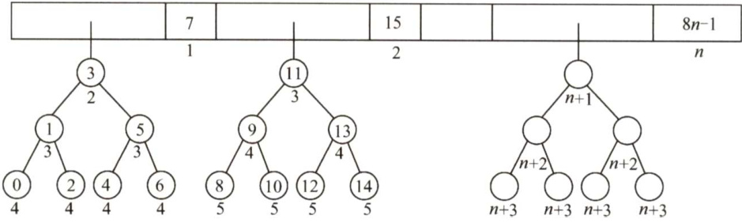  

2）等查找概率下，平均每个关键字查找成功的概率为 $1/8n$ .， $0{\sim}7$ 之间的关键字，顺序比较1次后，进行折半查找，查找成功的平均查找长度为 $2+3\times2+4\times4$ ， $8\sim15$ 之间的关键字，先顺序比较2次后，再进入折半查找；以此类推， $8(n-1)\sim8n-1$ 之间的关键字，先顺序比较 $n$ 次，再进入折半查找，如上图所示。故查找成功的平均查找长度为  

$$
\begin{array}{l}{{\displaystyle\mathrm{ASL}_{_{I R E J\backslash J}}=\frac1{8n}\sum_{i=0}^{n-1}C_{i}=\frac1{8n}\Biggl(\sum_{i=1}^{n}i+\sum_{i=2}^{n+1}i+2\sum_{i=3}^{n+2}i+4\sum_{i=4}^{n+3}i\Biggr)}}\\ {~=\frac1{8n}\Biggl(\sum_{i=1}^{n}(i+(i+1)+2(i+2)+4(i+3))\Biggr)}}\\ {~=\frac1{8n}\sum_{i=1}^{n}(8i+17)=\frac1n\sum_{i=1}^{n}i+\frac{17}{8}=\frac{n+1}{2}+\frac{17}{8}}\end{array}
$$  

05.【解答】  

算法的基本思想：根据查找的起始位置和终止位置，将查找序列一分为二，判断所查找的关键字在哪一部分，然后用新的序列的起始位置和终止位置递归求解。  

算法代码如下：  

typedef struct{ //查找表的数据结构ElemType \*elem; //存储空间基址，建表时按实际长度分配，0号留空int length; //表的长度  
SSTable;  
int BinSearchRec(ssTable ST,ElemType key,int low,int high）{  
//在有序表中递归折半查找其关键字为key的元素，返回其在表中序号if(low>high)return0;mid $\c=$ （low+high)/2; //取中间位置if(key>sT.elem[mid]) //向后半部分查找Search（sT,key,mid+l,high);elseif(key<sT.elem[mid]) //向前半部分查找Search（sT,key,low,mid-1);else //查找成功return mid;  

算法把规模为 $n$ 的复杂问题经过多次递归调用转化为规模减半的子问题求解。时间复杂度为$O(\log_{2}n)$ ，算法中用到了一个递归工作栈，其规模与递归深度有关，也是 $O(\log_{2}n)$ 。  

06.【解答】  

算法的基本思想：检索时可先从表头开始向后顺序扫描，若找到指定的结点，则将该结点和其前趋结点（若存在）交换。采用顺序表存储结构的算法实现如下：  

intSeqSrch（RcdType R[],ElemTypek）{  
//顺序查找线性表，找到后和其前面的元素交换int $\dot{2}=0$ .while(（R[i].key $!=k$ ）&&（ $\mathrm{i}<n$ ））$\dot{2}++$ 中 //从前向后顺序查找指定结点if $\therefore\sin\alpha\&\dot{1}>0$ ） //若找到，则交换temp $\scriptstyle\mathbf{\alpha=R}$ [i];R[i] $\mathbf{\tau}=\mathbf{R}$ [i-1];R[i-1] $\c=$ temp;return --i; //交换成功，返回交换后的位置1 elsereturn $-1$ . //交换失败  

链表的实现方式请读者自行思考。注意，链表方式实现的基本思想与上述思想相似，但要注意用链表实现时，在交换两个结点之前需要保存指向前一结点的指针。  

07.【解答】  

1）折半查找要求元素有序顺序存储，若各个元素的查找概率不同，折半查找的性能不一定优于顺序查找。采用顺序查找时，元素按其查找概率的降序排列时查找长度最小。采用顺序存储结构，数据元素按其查找概率降序排列。采用顺序查找方法。查找成功时的平均查找长度 $=0.35{\times}1+0.35{\times}2+0.15{\times}3+0.15{\times}4=2.1$ o此时，显然查找长度比折半查找的更短。  

2）答案一：采用链式存储结构时，只能采用顺序查找，其性能和顺序表一样，类似于上题。数据元素按其查找概率降序排列，构成单链表。采用顺序查找方法。查找成功时的平均查找长度 $=0.35{\times}1+0.35{\times}2+0.15{\times}3+0.15{\times}4=2.1$ 。  

答案二：还可以构造成二叉排序树的形式。采用二叉链表的存储结构，构造二叉排序树，元素的存储方式见下图。采用二叉排序树的查找方法。  

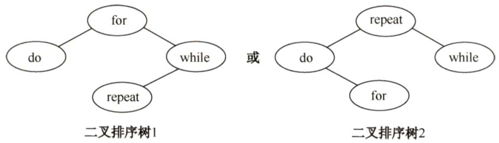  

查找成功时的平均查找长度 $=0.15{\times}1+0.35{\times}2+0.35{\times}2+0.15{\times}3=2.0$ o