### 7.3 树型查找  

#### 7.3.1 二叉排序树（BST)  

#### 1．二叉排序树的定义  

二叉排序树（也称二叉查找树）或者是一棵空树，或者是具有下列特性的二叉树：  

1）若左子树非空，则左子树上所有结点的值均小于根结点的值。  
2）若右子树非空，则右子树上所有结点的值均大于根结点的值。  
3）左、右子树也分别是一棵二叉排序树。  

根据二叉排序树的定义，左子树结点值 $<$ 根结点值 $<$ 右子树结点值，所以对二叉排序树进行中序遍历，可以得到一个递增的有序序列。例如，图7.4所示二叉排序树的中序遍历序列为123468。  

#### 2．二叉排序树的查找  

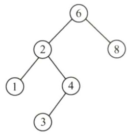  
图7.4一棵二叉排序树  

二叉排序树的查找是从根结点开始，沿某个分支逐层向下比较的过程。若二叉排序树非空，先将给定值与根结点的关键字比较，若相等，则查找成功；若不等，如果小于根结点的关键字，则在根结点的左子树上查找，否则在根结点的右子树上查找。这显然是一个递归的过程。  

二叉排序树的非递归查找算法：  

BSTNode \*BST_Search(BiTree T,ElemType key){while $T!=$ NULL&&key！ $\scriptstyle=\mathtt{T}->$ data）{//若树空或等于根结点值，则结束循环if(key<T->data)T=T->lchild; //小于，则在左子树上查找else $\scriptstyle\mathtt{T}=\mathtt{T}\dotsc>$ rchild; //大于，则在右子树上查找return T;  

例如，在图7.4中查找值为4的结点。首先4与根结点6比较。由于4小于6，所以在根结点6的左子树中继续查找。由于4大于2，所以在结点2的右子树中查找，查找成功。  

同样，二叉排序树的查找也可用递归算法实现，递归算法比较简单，但执行效率较低。具体的代码实现，留给读者思考。  

#### 3.二叉排序树的插入  

二叉排序树作为一种动态树表，其特点是树的结构通常不是一次生成的，而是在查找过程中，当树中不存在关键字值等于给定值的结点时再进行插入的。  

插入结点的过程如下：若原二叉排序树为空，则直接插入结点；否则，若关键字k小于根结点值，则插入到左子树，若关键字 $\mathbf{k}$ 大于根结点值，则插入到右子树。插入的结点一定是一个新添加的叶结点，且是查找失败时的查找路径上访问的最后一个结点的左孩子或右孩子。如图7.5所示在一个二叉排序树中依次插入结点28和结点58，虚线表示的边是其查找的路径。  

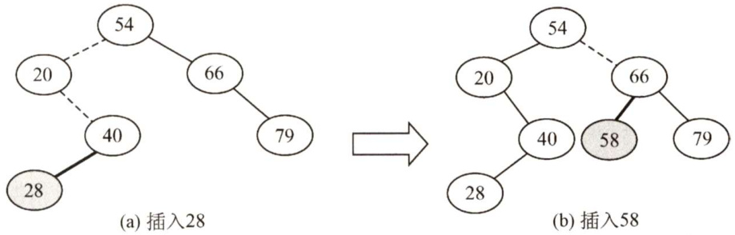  
图7.5向二叉排序树中插入结点  

二叉排序树插入操作的算法描述如下：  

int BST Insert（BiTree &T,KeyTypek）{ if( $\scriptstyle\mathrm{{T==}}$ NULL){ //原树为空，新插入的记录为根结点 $\ \mathrm{{T}=}$ (BiTree)malloc（sizeof（BsTNode)); T->data $=10$ . T->lchild $\c=$ T->rchild $=$ NULL; return 1; //返回1，插入成功 } elseif $k==T\rightarrow$ data) //树中存在相同关键字的结点，插入失败 return0; else if（ $k<T->$ data) //插入到T的左子树 return BSTInsert（T->lchild,k); else //插入到T的右子树 return BST_Insert（T->rchild,k);   
卜  

#### 4.二叉排序树的构造  

从一棵空树出发，依次输入元素，将它们插入二叉排序树中的合适位置。设查找的关键字序列为{45,24,53，45,12,24}，则生成的二叉排序树如图7.6所示。  

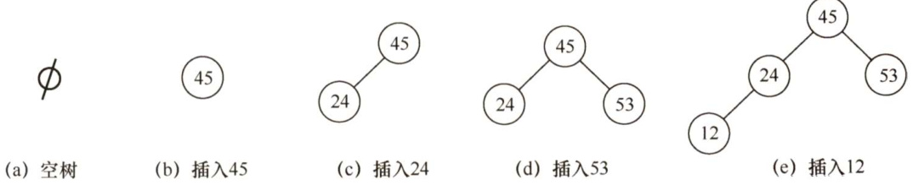  
图7.6二叉排序树的构造过程  

构造二叉排序树的算法描述如下：  

void Creat_BST（BiTree &T,KeyType str[],int n）{ $\scriptstyle\mathbf{T}=$ NULL; //初始时T为空树 int $\dot{2}=0$ while( $\frac{1}{2}<n$ ）{ //依次将每个关键字插入到二叉排序树中 BST_Insert(T,str[i]); $\dot{2}++$ 1  

#### 5.二叉排序树的删除  

在二叉排序树中删除一个结点时，不能把以该结点为根的子树上的结点都删除，必须先把被删除结点从存储二叉排序树的链表上摘下，将因删除结点而断开的二叉链表重新链接起来，同时确保二叉排序树的性质不会丢失。删除操作的实现过程按3种情况来处理：  

$\textcircled{1}$ 若被删除结点 $z$ 是叶结点，则直接删除，不会破坏二叉排序树的性质。$\textcircled{2}$ 若结点 $z$ 只有一棵左子树或右子树，则让 $z$ 的子树成为 $z$ 父结点的子树，替代 $z$ 的位置。$\textcircled{3}$ 若结点 $z$ 有左、右两棵子树，则令 $z$ 的直接后继（或直接前驱）替代 $z$ ，然后从二叉排序树中删去这个直接后继（或直接前驱)，这样就转换成了第一或第二种情况。  

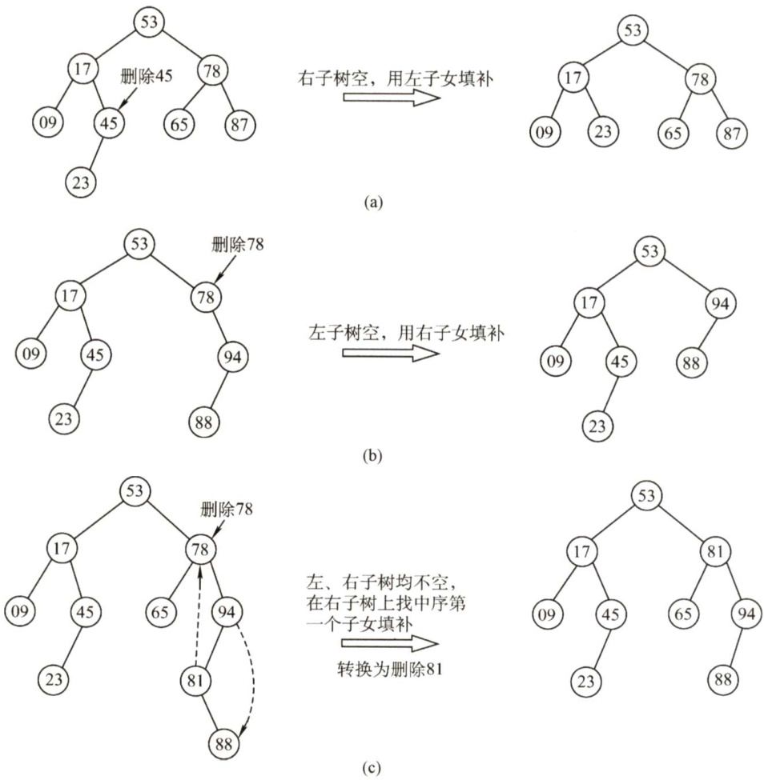  
图7.7显示了在3种情况下分别删除结点45，78，78的过程。  
图7.73种情况下的删除过程  

思考：若在二叉排序树中删除并插入某结点，得到的二叉排序树是否和原来的相同？  

#### 6．二叉排序树的查找效率分析  

二叉排序树的查找效率，主要取决于树的高度。若二叉排序树的左、右子树的高度之差的绝对值不超过1，则这样的二叉排序树称为平衡二叉树，它的平均查找长度为 $O(\log_{2}n)$ 。若二叉排序树是一个只有右（左）孩子的单支树（类似于有序的单链表)，则其平均查找长度为 $O(n)$ 。  

在最坏情况下，即构造二叉排序树的输入序列是有序的，则会形成一个倾斜的单支树，此时二叉排序树的性能显著变坏，树的高度也增加为元素个数 $n$ ，如图7.8(b)所示。  

在等概率情况下，图7.8(a)查找成功的平均查找长度为  

$$
{\mathrm{ASL}}_{\mathrm{a}}{=}(1+2{\times}2+3{\times}4+4{\times}3)/10{=}2.9
$$  

而图7.8(b)查找成功的平均查找长度为  

$$
\mathrm{ASL}_{\mathrm{b}}=(1+2+3+4+5+6+7+8+9+10)/10=5.5
$$  

从查找过程看，二叉排序树与二分查找相似。就平均时间性能而言，二叉排序树上的查找和二分查找差不多。但二分查找的判定树唯一，而二叉排序树的查找不唯一，相同的关键字其插入顺序不同可能生成不同的二叉排序树，如图7.8所示。  

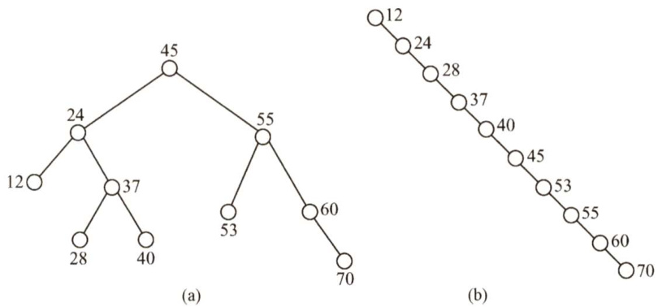  
图7.8相同关键字组成的不同二叉排序树  

就维护表的有序性而言，二叉排序树无须移动结点，只需修改指针即可完成插入和删除操作，平均执行时间为 $O(\log_{2}n)$ 。二分查找的对象是有序顺序表，若有插入和删除结点的操作，所花的代价是 $O(n)$ 。当有序表是静态查找表时，宜用顺序表作为其存储结构，而采用二分查找实现其查找操作；若有序表是动态查找表，则应选择二叉排序树作为其逻辑结构。  

#### 7.3.2 平衡二叉树  

#### 1．平衡二叉树的定义  

为避免树的高度增长过快，降低二叉排序树的性能，规定在插入和删除二叉树结点时，要保证任意结点的左、右子树高度差的绝对值不超过1，将这样的二叉树称为平衡二叉树（BalancedBinaryTree)，简称平衡树。定义结点左子树与右子树的高度差为该结点的平衡因子，则平衡二叉树结点的平衡因子的值只可能是-1、0或1。  

因此，平衡二叉树可定义为或者是一棵空树，或者是具有下列性质的二叉树：它的左子树和右子树都是平衡二叉树，且左子树和右子树的高度差的绝对值不超过1。图7.9(a)所示是平衡二叉树，图7.9(b)所示是不平衡的二叉树。结点中的值为该结点的平衡因子。  

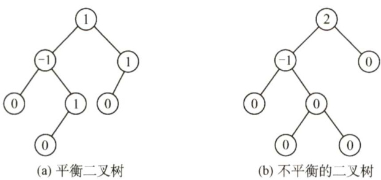  
图7.9平衡二叉树和不平衡的二叉树  

的位置关系，使之重新达到平衡。  

#### 2.平衡二叉树的插入  

二叉排序树保证平衡的基本思想如下：每当在二叉排序树中插入（或删除）一个结点时，首先检查其插入路径上的结点是否因为此次操作而导致了不平衡。若导致了不平衡，则先找到插入路径上离插入结点最近的平衡因子的绝对值大于1的结点 $A$ ，再对以 $A$ 为根的子树，在保持二叉排序树特性的前提下，调整各结点  

注意：每次调整的对象都是最小不平衡子树，即以插入路径上离插入结点最近的平衡因子的绝对值大于1的结点作为根的子树。图7.10中的虚线框内为最小不平衡子树。  

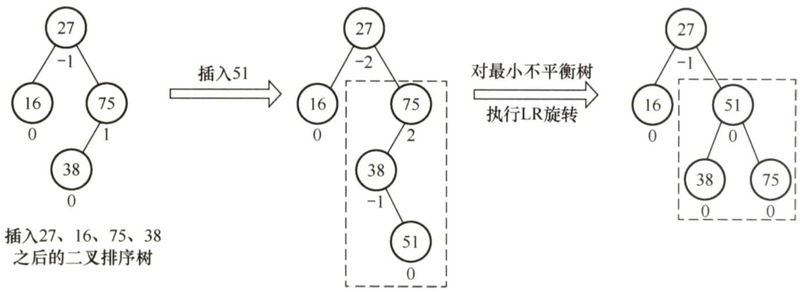  
图7.10最小不平衡子树示意  

平衡二叉树的插入过程的前半部分与二叉排序树相同，但在新结点插入后，若造成查找路径上的某个结点不再平衡，则需要做出相应的调整。可将调整的规律归纳为下列4种情况：  

1）LL平衡旋转(右单旋转)。由于在结点 $A$ 的左孩子（L）的左子树（L）上插入了新结点，$A$ 的平衡因子由1增至2，导致以 $A$ 为根的子树失去平衡，需要一次向右的旋转操作。将$A$ 的左孩子 $B$ 向右上旋转代替 $A$ 成为根结点，将 $A$ 结点向右下旋转成为 $B$ 的右子树的根结点，而 $B$ 的原右子树则作为 $A$ 结点的左子树。  

如图7.11所示，结点旁的数值代表结点的平衡因子，而用方块表示相应结点的子树，下方数值代表该子树的高度。  

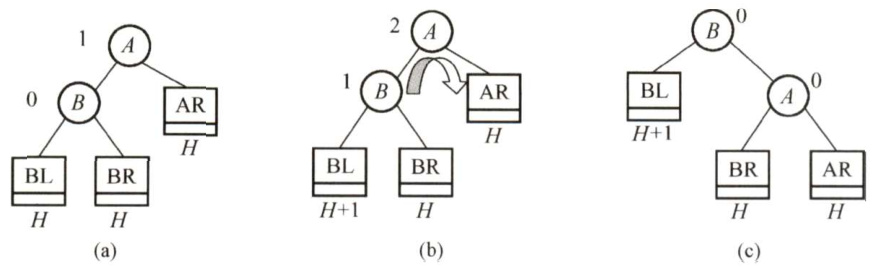  
图7.11 LL平衡旋转  

2）RR平衡旋转（左单旋转)。由于在结点 $A$ 的右孩子（R）的右子树（R）上插入了新结点，$A$ 的平衡因子由-1减至-2，导致以 $A$ 为根的子树失去平衡，需要一次向左的旋转操作。将 $A$ 的右孩子 $B$ 向左上旋转代替 $A$ 成为根结点，将 $A$ 结点向左下旋转成为 $B$ 的左子树的根结点，而 $B$ 的原左子树则作为 $A$ 结点的右子树，如图7.12所示。  

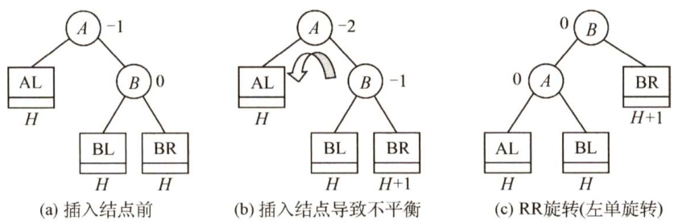  
图7.12 RR平衡旋转  

3）LR平衡旋转（先左后右双旋转)。由于在 $A$ 的左孩子（L）的右子树（R）上插入新结点，$A$ 的平衡因子由1增至2，导致以 $A$ 为根的子树失去平衡，需要进行两次旋转操作，先左旋转后右旋转。先将 $A$ 结点的左孩子 $B$ 的右子树的根结点 $c$ 向左上旋转提升到 $B$ 结点的位置，然后把该 $c$ 结点向右上旋转提升到 $A$ 结点的位置，如图7.13所示。  

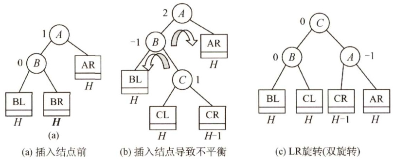  
图7.13 LR平衡旋转  

4）RL平衡旋转（先右后左双旋转)。由于在 $A$ 的右孩子（R）的左子树（L）上插入新结点，$A$ 的平衡因子由-1减至-2，导致以 $A$ 为根的子树失去平衡，需要进行两次旋转操作，先右旋转后左旋转。先将 $A$ 结点的右孩子 $B$ 的左子树的根结点 $c$ 向右上旋转提升到 $B$ 结点的位置，然后把该 $c$ 结点向左上旋转提升到 $A$ 结点的位置，如图7.14所示。  

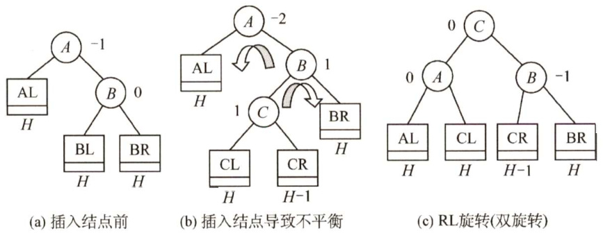  
图7.14RL平衡旋转  

注意：LR和RL旋转时，新结点究竟是插入 $c$ 的左子树还是插入 $c$ 的右子树不影响旋转过程，而图7.13和图7.14中以插入 $c$ 的左子树中为例。  

假设关键字序列为{15,3,7,10,9,8}，通过该序列生成平衡二叉树的过程如图7.15所示。图7.15(d)插入7后导致不平衡，最小不平衡子树的根为15，插入位置为其左孩子的右子树，故执行LR旋转，先左后右双旋转，调整后的结果如图7.15(e)所示。图7.15(g)插入9后导致不平衡，最小不平衡子树的根为15，插入位置为其左孩子的左子树，故执行LL旋转，右单旋转，调整后的结果如图7.15(h)所示。图7.15(i)插入8后导致不平衡，最小不平衡子树的根为7，插入位置为其右孩子的左子树，故执行 RL旋转，先右后左双旋转，调整后的结果如图7.15(j)所示。  

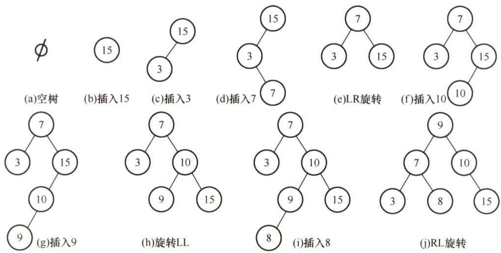  
图7.15平衡二叉树的生成过程  

#### 3．平衡二叉树的删除  

与平衡二叉树的插入操作类似，以删除结点W为例来说明平衡二叉树删除操作的步骤：  

1）用二叉排序树的方法对结点W执行删除操作。  
2）从结点W开始，向上回溯，找到第一个不平衡的结点z（即最小不平衡子树)；y为结点z的高度最高的孩子结点；x是结点y的高度最高的孩子结点。  
3）然后对以 $\textbf{z}$ 为根的子树进行平衡调整，其中x、y和z可能的位置有4种情况：  
·y是z的左孩子，x是y的左孩子（LL，右单旋转);  
·y是z的左孩子，x是y的右孩子（LR，先左后右双旋转);  
·y是z的右孩子，x是y的右孩子（RR，左单旋转);  
·y是z的右孩子，x是y的左孩子（RL，先右后左双旋转)。  

这四种情况与插入操作的调整方式一样。不同之处在于，插入操作仅需要对以z为根的子树进行平衡调整；而删除操作就不一样，先对以z为根的子树进行平衡调整，如果调整后子树的高度减1，则可能需要对 $\textbf{z}$ 的祖先结点进行平衡调整，甚至回溯到根结点(导致树高减1)。  

以删除图7.16(a)的结点32为例，由于32为叶结点，直接删除即可，向上回溯找到第一个不平衡结点44（即 $\textbf{z}$ ， $\textbf{z}$ 的高度最高的孩子结点为78（y)，y的高度最高的孩子结点为50（x)，满足RL情况，先右后左双旋转，调整后的结果如图7.16(c)所示。  

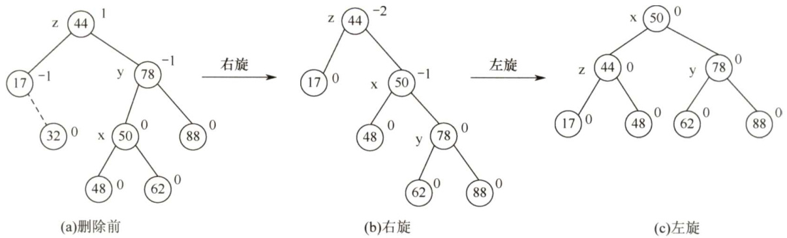  
图7.16平衡二叉树的删除  

#### 4.平衡二叉树的查找  

在平衡二叉树上进行查找的过程与二叉排序树的相同。因此，在查找过程中，与给定值进行比较的关键字个数不超过树的深度。假设以 $n_{h}$ 表示深度为 $h$ 的平衡树中含有的最少结点数。显然，有 $n_{0}=0,n_{1}=1,n_{2}=2$ ，并且有 $n_{h}=n_{h-1}+n_{h-2}+1$ 。可以证明，含有 $n$ 个结点的平衡二叉树的最大深度为 $O(\log_{2}n)$ ，因此平衡二叉树的平均查找长度为 $O(\log_{2}n)$ ，如图7.17所示。  

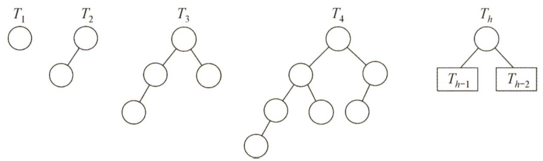  
图7.17结点个数 $n$ 最少的平衡二叉树  

注意：该结论可用于求解给定结点数的平衡二叉树的查找所需的最多比较次数（或树的最大高度）。在含有12个结点的平衡二叉树中查找某个结点的最多比较次数是多少？  

#### 7.3.3 红黑树  

#### 1．红黑树的定义  

为了保持AVL树的平衡性，插入和删除操作后，非常频繁地调整全树整体拓扑结构，代价较大。为此在AVL树的平衡标准上进一步放宽条件，引入了红黑树的结构。  

一棵红黑树是满足如下红黑性质的二叉排序树：  

$\textcircled{1}$ 每个结点或是红色，或是黑色的。  
$\textcircled{2}$ 根结点是黑色的。  
$\textcircled{3}$ 叶结点（虚构的外部结点、NULL结点）都是黑色的。  
$\textcircled{4}$ 不存在两个相邻的红结点（即红结点的父结点和孩子结点均是黑色的）。  
$\textcircled{5}$ 对每个结点，从该结点到任一叶结点的简单路径上，所含黑结点的数量相同。  

与折半查找树和B树类似，为了便于对红黑树的实现和理解，引入了 $n+1$ 个外部叶结点，以保证红黑树中每个结点（内部结点）的左、右孩子均非空。图7.18所示是一棵红黑树。  

从某结点出发（不含该结点）到达一个叶结点的任一简单路径上的黑结点总数称为该结点的黑高（记为bh)，黑高的概念是由性质 $\textcircled{5}$ 确定的。根结点的黑高称为红黑树的黑高。  

结论1：从根到叶结点的最长路径不大于最短路径的2倍。  

由性质 $\textcircled{5}$ ，当从根到任一叶结点的简单路径最短时，这条路径必然全由黑结点构成。由性质 $\textcircled{4}$ ，当某条路径最长时，这条路径必然是由黑结点和红结点相间构成的，此时红结点和黑结点的数量相同。图7.18中的6-2和6-15-18-20就是这样的两条路径。  

结论2：有 $n$ 个内部结点的红黑树的高度 $h\leq2\log_{2}(n+1).$  

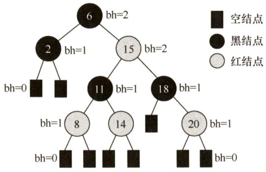  
图7.18一棵红黑树  

证明：由结论1可知，从根到叶结点（不含叶结点）的任何一条简单路径上都至少有一半是黑结点，因此，根的黑高至少为 $h/2$ ，于是有 $n\geq2^{h/2}-1$ ，即可求得结论。  

可见，红黑树的“适度平衡”，由AVL树的“高度平衡”，降低到“任一结点左右子树的高度，相差不超过2倍”，也降低了动态操作时调整的频率。对于一棵动态查找树，如果插入和删除操作比较少，查找操作比较多，采用AVL树比较合适，否则采用红黑树更合适。但由于维护这种高度平衡所付出的代价比获得的效益大得多，红黑树的实际应用更广泛， $\mathrm{C}{+}{+}$ 中的map 和 set（Java中的TreeMap和TreeSet）就是用红黑树实现的。  

#### 2.红黑树的插入  

红黑树的插入过程和二叉查找树的插入过程基本类似，不同之处在于，红黑树中插入新结点后需要进行调整（主要通过重新着色或旋转操作进行)，以满足红黑树的性质。  

结论3：新插入红黑树中的结点初始着为红色。  

假设新插入的结点初始着为黑色，那么这个结点所在的路径比其他路径多出一个黑结点（几乎每次插入都破坏性质 $\textcircled{5}$ )，调整起来也比较麻烦。如果插入的结点是红色的，此时所有路径上的黑结点数量不变，仅在出现连续两个红结点时才需要调整，而且这种调整也比较简单。  

设结点 $z$ 为新插入的结点。插入过程描述如下：  

1）用二叉查找树插入法插入，并将结点z着为红色。若结点z的父结点是黑色的，无须做任何调整，此时就是一棵标准的红黑树。  
2）如果结点z是根结点，将z着为黑色（树的黑高增1)，结束。  
3）如果结点 $\textbf{z}$ 不是根结点，并且z的父结点z.p是红色的，则分为下面三种情况，区别在于$\textbf{z}$ 的叔结点y的颜色不同，因z.p是红色的，插入前的树是合法的，根据性质 $\textcircled{2}$ 和 $\textcircled{4}$ ，爷结点z.p.p必然存在且为黑色。性质 $\textcircled{4}$ 只在z和z.p之间被破坏了。  

情况1：z的叔结点y是黑色的，且z是一个右孩子。  

情况2：z的叔结点y是黑色的，且z是一个左孩子。  

每棵子树 $T_{1}$ ， $T_{2}$ ， $T_{3}$ 和 $T_{4}$ 都有一个黑色根结点，且具有相同的黑高。  

情况1（LR，先左旋，再右旋)，即 $\textbf{z}$ 是爷结点的左孩子的右孩子。先做一次左旋将此情形转变为情况2（变为情况2后再做一次右旋)，左旋后z和父结点z.p交换位置。因为 $\textbf{z}$ 和z.p都是红色的，所以左旋操作对结点的黑高和性质 $\textcircled{5}$ 都无影响。  

情况2（LL，右单旋)，即 $z$ 是爷结点的左孩子的左孩子。做一次右旋，并交换z的原父结点和原爷结点的颜色，就可以保持性质 $\textcircled{5}$ ，也不会改变树的黑高。这样，红黑树中也不再有连续两个红结点，结束。情况1和情况2的调整方式如图7.19所示。  

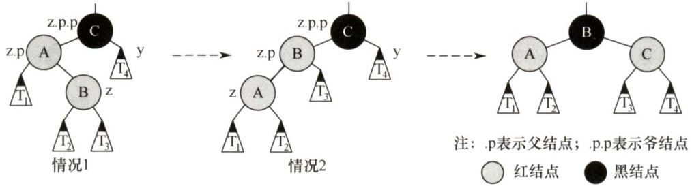  
图7.19情况1和情况2的调整方式  

若父结点z.p 是爷结点z.p.p 的右孩子，则还有两种对称的情况：RL（先右旋，再左旋）和RR（右单旋)，这里不再赘述。红黑树的调整方法和AVL的调整方法有异曲同工之秒。  

情况3：如果 $\textbf{x}$ 的叔结点y是红色。  

情况3（ $z$ 是左孩子或右孩子无影响)，z的父结点z.p和叔结点y都是红色的，因为爷结点z.p.p 是黑色的，将z.p和y都着为黑色，将z.p.p着为红色，以在局部保持性质 $\textcircled{4}$ 和 $\textcircled{5}$ 。然后，把z.p.p作为新结点 $\textbf{z}$ 来重复循环，指针 $\textbf{z}$ 在树中上移两层。调整方式如图7.20所示。  

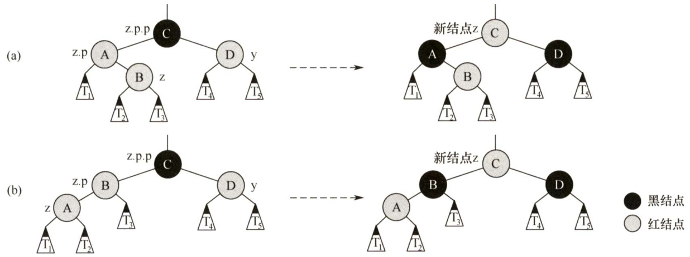  
图7.20情况3的调整方式  

若父结点z.p是爷结点z.p.p的右孩子，也还有两种对称的情况，不再赘述。  

只要满足情况3的条件，就会不断循环，每次循环指针z都会上移两层，直到满足2）（表示z上移到根结点）或情况1或情况2的条件。  

可能的疑问：虽然插入的初始位置一定是红黑树的某个叶结点，但因为在情况3中，结点z存在不断上升的可能，所以对于三种情况，结点z都有存在子树的可能。  

以图7.21(a)中的红黑树为例（虚线表示插入后的状态)，先后插入5、4和12的过程如图7.21所示。插入5，为情况3，将5的父结点3和叔结点10着为黑色，将5的爷结点变为红色，此时因为7已是根，故着为黑色，树的黑高加1，结束。插入4，为情况1的对称情况（RL)，此时特别注意虚构黑色空叶结点的存在，先对5做右旋；转变为情况2的对称情况（RR)，交换3和4的颜色，再对3做左旋，结束。插入12，父结点是黑色的，无须任何调整，结束。  

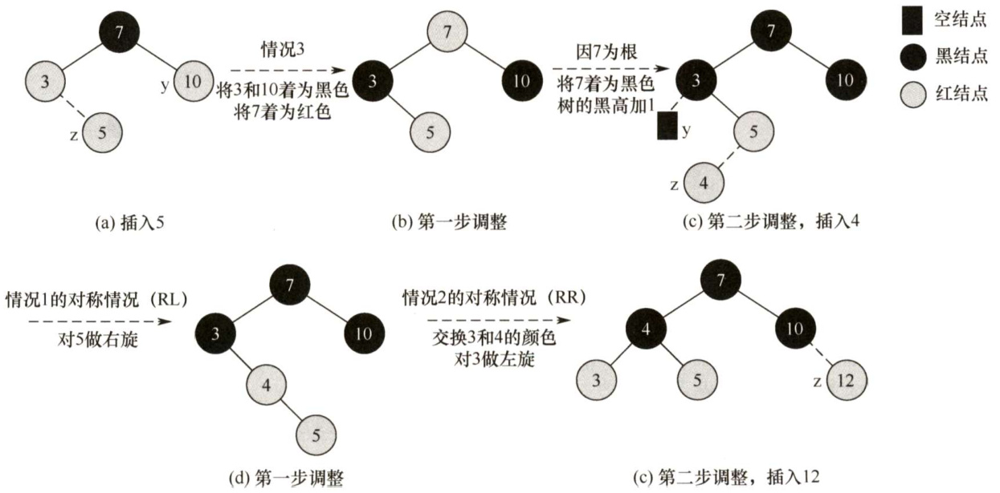  
图7.21 红黑树的插入过程  

#### 3.红黑树的删除  

红黑树的插入操作容易导致连续的两个红结点，破坏性质 $\textcircled{4}$ 。而删除操作容易造成子树黑高的变化（删除黑结点会导致根结点到叶结点间的黑结点数量减少)，破坏性质 $\textcircled{5}$ 。  

删除过程也是先执行二叉查找树的删除方法。若待删结点有两个孩子，不能直接删除，而要找到该结点的中序后继（或前驱）填补，即右子树中最小的结点，然后转换为删除该后继结点。由于后继结点至多只有一个孩子，这样就转换为待删结点是叶结点或仅有一个孩子的情况。  

最终，删除一个结点有以下两种情况：  

待删结点没有孩子。  
待删结点只有右子树或左子树。  

1）如果待删结点只有右子树或左子树，则只有两种情况，如图7.22所示。  

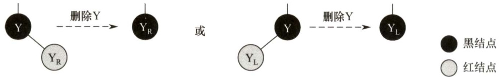  
图7.22只有右子树或左子树的删除情况  

只有这两种情况存在。子树只有一个结点，且必然是红色，否则会破坏性质 $\textcircled{5}$ 0  

2）如果待删结点没有孩子，若该结点是红色的，直接删除，无须做任何调整。  

3）如果待删结点没有孩子，并且该结点是黑色的。假设待删结点为y，x是用来替换y的结点（注意，当y是终端结点时，x是黑色的NULL结点)。删除y后将导致先前包含y的任何路径上的黑结点数量减1，因此y的任何祖先都不再满足性质 $\textcircled{5}$ ，简单的修正办法就是将替换y的结点x视为还有额外一重黑色，定义为双黑结点。也就是说，如果将任何包含结点 $\textbf{x}$ 的路径上的黑结点数量加1，在此假设下，性质 $\textcircled{5}$ 得到满足，但破坏了性质 $\textcircled{1}$ 0于是，删除操作的任务就转化为将双黑结点恢复为普通结点。  

分为以下四种情况，区别在于 $\mathbf{x}$ 的兄弟结点w及W的孩子结点的颜色不同。  

情况1：x的兄弟结点W是红色的。  

情况1，w必须有黑色左右孩子和父结点。交换w 和父结点x.p的颜色，然后对x.p做一次左旋，而不会破坏红黑树的任何规则。现在，x的新兄弟结点是旋转之前w的某个孩子结点，其颜色为黑色，这样，就将情况1转换为情况2、3或4处理。调整方式如图7.23所示。  

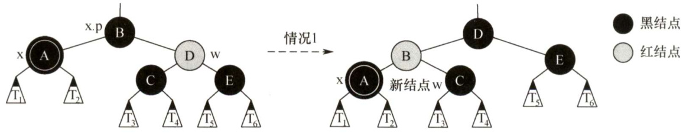  
图7.23 情况1的调整方式  

情况2：x的兄弟结点W是黑色的，W的左孩子是红色的，W的右孩子是黑色的。  

情况3：x的兄弟结点W是黑色的，且W的右孩子是红色的。  

情况2（RL，先右旋，再左旋)，即红结点是其爷结点的右孩子的左孩子。交换W 和其左孩子的颜色，然后对w做一次右旋，而不破坏红黑树的任何性质。现在，x的新兄弟结点w的右孩子是红色的，这样就将情况2转换为了情况3。调整方式如图7.24所示。  

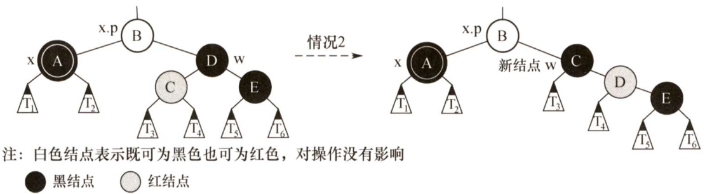  
图7.24情况2的调整方式  

情况3（RR，左单旋)，即红结点是其爷结点的右孩子的右孩子。交换W和父结点x.p的颜色，把w的右孩子着为黑色，并对x的父结点x.p做一次左旋，将x变为单重黑色，此时不再破坏红黑树的任何性质，结束。调整方式如图7.25所示。  

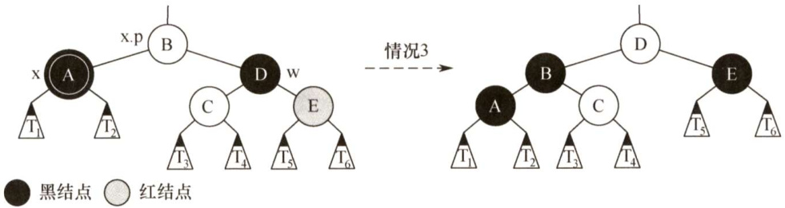  
图7.25 情况3的调整方式  

情况4：x的兄弟结点W是黑色的，且W的两个孩子结点都是黑色的。  

情况4中，因w也是黑色的，故可从 $\mathbf{x}$ 和w上去掉一重黑色，使得 $\mathbf{x}$ 只有一重黑色而w变为红色。为了补偿从 $\mathbf{x}$ 和w中去掉的一重黑色，把x的父结点x.p额外着一层黑色，以保持局部的黑高不变。通过将x.p作为新结点 $\textbf{x}$ 来循环，x上升一层。如果是通过情况1进入情况4的，因为原来的x.p是红色的，将新结点 $\textbf{x}$ 变为黑色，终止循环，结束。调整方式如图7.26所示。  

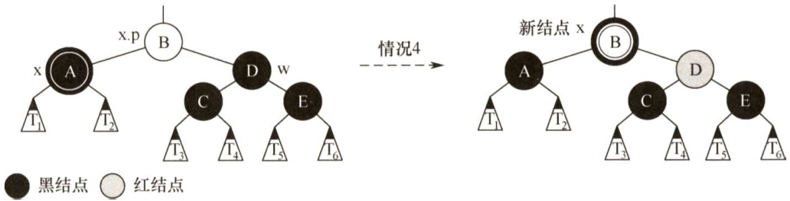  
图7.26情况4的调整方式  

若×是父结点x.p的右孩子，则还有四种对称的情况，处理方式类似，不再赘述。  

归纳总结：在情况4中，因x的兄弟结点w及左右孩子都是黑色，可以从 $\mathbf{x}$ 和w中各提取一重黑色（以让 $\textbf{x}$ 变为普通黑结点)，不会破坏性质 $\textcircled{4}$ ，并把调整任务向上“推”给它们的父结点x.p。在情况1、2和3中，因为 $\mathbf{x}$ 的兄弟结点w或w左右孩子中有红结点，所以只能在x.p子树内用调整和重新着色的方式，且不能改变 $\textbf{x}$ 原根结点的颜色（否则向上可能破坏性质 $\textcircled{4}$ )。情况1虽然可能会转换为情况4，但因为新 $\mathbf{x}$ 的父结点 $\mathbf{x}.\mathbf{p}$ 是红色的，所以执行一次情况4就会结束。情况1、2和3在各执行常数次的颜色改变和至多3次旋转后便终止，情况4是可能重复执行的唯一情况，每执行一次指针x上升一层，至多 $O(\log_{2}n)$ 次。  

以图7.27(a)中的红黑树为例（虚线表示删除前的状态)，依次删除5和15的过程如图7.27所示。删除5，用虚构的黑色NULL结点替换，视为双黑NULL结点，为情况1，交换兄弟结点12和父结点8的颜色，对8做一次左旋；转变为情况4，从双黑NULL结点和10中各提取一重黑色（提取后，双黑NULL结点变为普通NULL结点，图中省略，10变为红色)，因原父结点8是红色，故将8变为黑色，结束。删除15，为情况2的对称情况（LR)，交换8和10的颜色，对8做左旋；转变为情况2的对称情况（LL)，交换10和12的颜色（两者颜色一样，无变化)，将10的左孩子8着为黑色，对12做右旋，结束。  

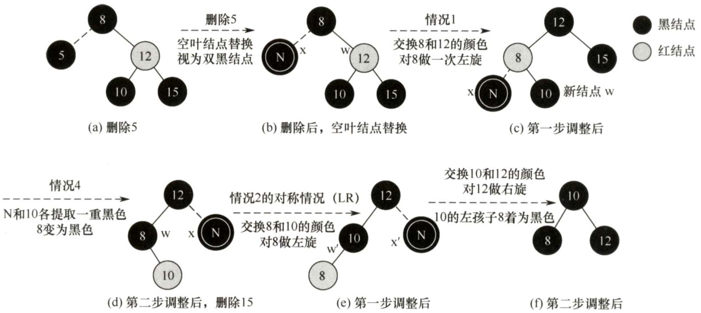  
图7.27红黑树的删除过程  

#### 7.3.4 本节试题精选  

#### 一、单项选择题  

01．对于二叉排序树，下面的说法中，（）是正确的。  

A．二叉排序树是动态树表，查找失败时插入新结点，会引起树的重新分裂和组合B．对二叉排序树进行层序遍历可得到有序序列C．用逐点插入法构造二叉排序树，若先后插入的关键字有序，二叉排序树的深度最大D.在二叉排序树中进行查找，关键字的比较次数不超过结点数的1/2  

02.按（）遍历二叉排序树得到的序列是一个有序序列。  

A．先序 B.中序 C．后序 D.层次  

03.在二叉排序树中进行查找的效率与（）有关。  

A．二叉排序树的深度 B．二叉排序树的结点的个数C.被查找结点的度 D.二叉排序树的存储结构  

04.在常用的描述二叉排序树的存储结构中，关键字值最大的结点（）。  

A．左指针一定为空 B.右指针一定为空C．左右指针均为空 D.左右指针均不为空  

05．设二叉排序树中关键字由1到1000的整数构成，现要查找关键字为363 的结点，下述关键字序列中，不可能是在二叉排序树上查找的序列是（）。  

A.2,252,401,398,330,344,397,363 B.924,220,911,244,898,258,362,363   
C. 925,202,911,240,912,245,363 D.2,399,387,219,266,382,381,278,363  

06．分别以下列序列构造二叉排序树，与用其他3个序列所构造的结果不同的是（）。  

A. (100,80,90,60, 120, 110, 130) B. (100, 120,110,130,80,60,90) C. (100,60,80,90,120, 110, 130) D. (100,80,60,90, 120, 130, 110)  

07.从空树开始，依次插入元素52,26,14,32,71,60,93,58,24和41后构成了一棵二叉排序树。在该树查找60要进行比较的次数为（）。  

A.3 B.4 C.5 D.6  

08．在含有n个结点的二叉排序树中查找某个关键字的结点时，最多进行（）次比较  

A. n/2 B. logn C. $\log_{2}n+1$ D.n  

09．构造一棵具有 $n$ 个结点的二叉排序树时，最理想情况下的深度为（）。  

A.n/2 B.n C. $\left\lfloor\log_{2}(n+1)\right\rfloor$ D. $\lceil\log_{2}(n+1)\rceil$  

0．不可能生成如下图所示的二叉排序树的关键字序列是（）。  

A.{4,2,1,3,5} B.{4,2,5,3,1} C.{4,5,2,1,3} D.{4,5,1,2,3}  

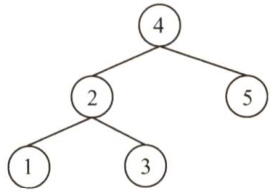  

11．含有20个结点的平衡二叉树的最大深度为（）。  

A.4 B.5 C.6 D.7  

12.具有5层结点的AVL至少有（）个结点。  

A.10 B.12 C.15 D.17  

13．下列关于红黑树的说法中，不正确的是（）。  

A．一棵含有 $n$ 个结点的红黑树的高度至多为 $2\log_{2}(n+1)$ B.如果一个结点是红色的，则它的父结点和孩子结点都是黑色的C.从一个结点到其子孙结点的所有路径上包含相同数量的黑结点D.红黑树的查询效率一般要优于含有相同结点数的AVL树  

14.下列关于红黑树和AVL树的描述中，不正确的是（）。  

A.两者都属于自平衡的二叉树 B．两者查找、插入、删除的时间复杂度都相同 C.红黑树插入和删除过程至多有2次旋转操作 D.红黑树的任一结点的左右子树高度之差不超过2倍  

15.下列关于红黑树的说法中，正确的是（）。  

A.红黑树是一种特殊的平衡二叉树  
B．如果红黑树的所有结点都是黑色的，那么它一定是一棵满二叉树  
C．红黑树的任何一个分支结点都有两个非空孩子结点  
D.红黑树的子树也一定是红黑树  

16．将关键字 $1,2,3,4,5,6,7$ 依次插入初始为空的红黑树T，则 $T$ 中红结点的个数是（）。  

A.1 B.2 C.3 D.4．将关键字5，4，3，2，1依次插入初始为空的红黑树 $T,$ 则 $T$ 的最终形态是（）  

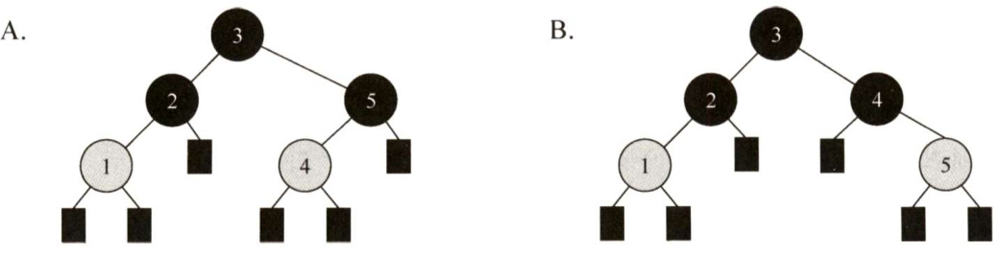  

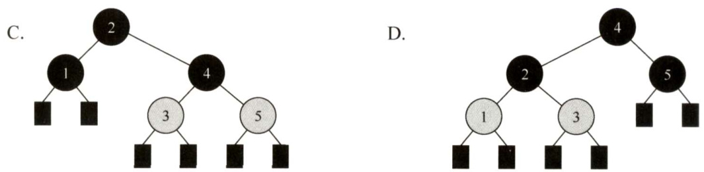  

18.【2009统考真题】下列二叉排序树中，满足平衡二叉树定义的是（）。  

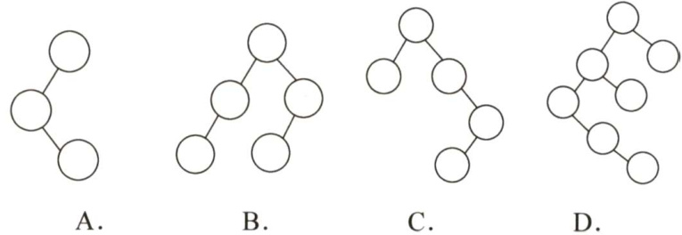  

19.【2010统考真题】在下图所示的平衡二叉树中插入关键字48后得到一棵新平衡二叉树，在新平衡二叉树中，关键字37所在结点的左、右子结点中保存的关键字分别是（）。  

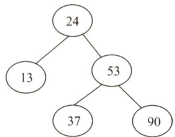  

A.13,48 B.24,48 C.24,53 D.24,90  

20.【2011统考真题】对下列关键字序列，不可能构成某二叉排序树中一条查找路径的是（）  

A.95,22,91,24,94,71 B.92,20,91,34,88,35   
C. 21,89,77,29,36,38 D.12,25,71,68,33,34  

21.【2012统考真题】若平衡二叉树的高度为6，且所有非叶子结点的平衡因子均为1，则该平衡二叉树的结点总数为（）。  

A.12 B.20 C.32 D.33  

22.【2013统考真题】在任意一棵非空二叉排序树 $T_{1}$ 中，删除某结点 $\nu$ 之后形成二叉排序树$T_{2}$ ，再将 $\nu$ 插入 $T_{2}$ 形成二叉排序树 $T_{3}$ 。下列关于 $T_{1}$ 与 $T_{3}$ 的叙述中，正确的是（）。  

I．若 $\nu$ 是 $T_{1}$ 的叶结点，则 $T_{1}$ 与 $T_{3}$ 不同ⅡI.若 $\nu$ 是 $T_{1}$ 的叶结点，则 $T_{1}$ 与 $T_{3}$ 相同III.若 $\nu$ 不是 $T_{1}$ 的叶结点，则 $T_{1}$ 与 $T_{3}$ 不同IV.若 $\nu$ 不是 $T_{1}$ 的叶结点，则 $T_{1}$ 与 $T_{3}$ 相同  

A.仅I、III B.仅I、IV C.仅Ⅱ、ⅢI D.仅Ⅱ、IV  

23.【2013统考真题】若将关键字1,2,3,4,5,6,7依次插入初始为空的平衡二叉树 $T,$ 则 $T$ 中平衡因子为0的分支结点的个数是（）。  

A.0 B.1 C.2 D.3  

24.【2015统考真题】现有一棵无重复关键字的平衡二叉树（AVL），对其进行中序遍历可得到一个降序序列。下列关于该平衡二叉树的叙述中，正确的是（）。  

A.根结点的度一定为2 B．树中最小元素一定是叶结点C.最后插入的元素一定是叶结点 D．树中最大元素一定是无左子树  

25.【2018统考真题】已知二叉排序树如下图所示，元素之间应满足的大小关系是（）。  

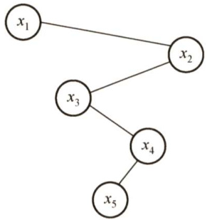  

A. $x_{1}<x_{2}<x_{5}$ B. $x_{1}<x_{4}<x_{5}$ C. $x_{3}<x_{5}<x_{4}$ D. $x_{4}<x_{3}<x_{5}$  

26.【2019统考真题】在任意一棵非空平衡二叉树（AVL树） $T_{1}$ 中，删除某结点 $\nu$ 之后形成平衡二叉树 $T_{2}$ ，再将 $\nu$ 插入 $T_{2}$ 形成平衡二叉树 $T_{3}$ 。下列关于 $T_{1}$ 与 $T_{3}$ 的叙述中，正确的是（）。  

I.若 $\nu$ 是 $T_{1}$ 的叶结点，则 $T_{1}$ 与 $T_{3}$ 可能不相同ⅡI.若 $\nu$ 不是 $T_{1}$ 的叶结点，则 $T_{1}$ 与 $T_{3}$ 一定不相同IⅢI.若 $\nu$ 不是 $T_{1}$ 的叶结点，则 $T_{1}$ 与 $T_{3}$ 一定相同  

A.仅I B.仅Ⅱ C.仅I、ⅡI D.仅I、IⅢI  

27.【2020统考真题】下列给定的关键字输入序列中，不能生成右边二叉排序树的是（）。  

A.4，5,2，1，3 B.4,5，1，2，3  
C.4,2，5，3，1 D.4,2，1，3，5  

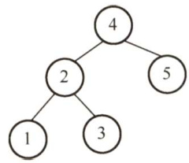  

28.【2021统考真题】给定平衡二叉树如下图所示，插入关键字23后，根中的关键字是（）。  

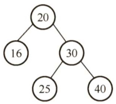  

A.16 B.20 C.23 D. 25  

#### 二、综合应用题  

01.一棵二叉排序树按先序遍历得到的序列为(50,38,30,45,40,48,70,60,75,80)，试画出该二叉排序树，并求出等概率下查找成功和查找失败的平均查找长度。  

02．按照序列(40,72,38,35,67,51,90,8,55,21)建立一棵二叉排序树，画出该树，并求出在等概率的情况下，查找成功的平均查找长度。  

03．依次把结点(34,23,15,98,115,28,107)插入初始状态为空的平衡二叉排序树，使得在每次插入后保持该树仍然是平衡二叉树。请依次画出每次插入后所形成的平衡二叉排序树。  

04.给定一个关键字集合{25,18,34,9,14,27,42,51,38}，假定查找各关键字的概率相同，请画出其最佳二叉排序树。  

05．画出一个二叉树，使得它既满足大根堆的要求又满足二叉排序树的要求。  

06．试编写一个算法，判断给定的二叉树是否是二叉排序树。  

07.设计一个算法，求出指定结点在给定二叉排序树中的层次。  

08.利用二叉树遍历的思想编写一个判断二叉树是否是平衡二叉树的算法。  

09.设计一个算法，求出给定二叉排序树中最小和最大的关键字。  

10．设计一个算法，从大到小输出二叉排序树中所有值不小于 $k$ 的关键字  

11．编写一个递归算法，在一棵有 $n$ 个结点的、随机建立起来的二叉排序树上查找第 $k$ （ $1\leq$ $k\leq n$ ）小的元素，并返回指向该结点的指针。要求算法的平均时间复杂度为 $O(\log_{2}n)$ 。二叉排序树的每个结点中除 data，lchild,rchild等数据成员外，增加一个count成员，保存以该结点为根的子树上的结点个数。  

#### 7.3.5 答案与解析  

#### 一、单项选择题  

01.C  

二叉排序树插入新结点时不会引起树的分裂组合。对二叉排序树进行中序遍历可得到有序序列。当插入的关键字有序时，二叉排序树会形成一个长链，此时深度最大。在此种情况下进行查找，有可能需要比较每个结点的关键字，超过总结点数的1/2。  

02.B  

由二叉排序树的定义不难得出中序遍历二叉树得到的序列是一个有序序列。  

03.A  

二叉排序树的查找路径是自顶向下的，其平均查找长度主要取决于树的高度。  

04.B  

在二叉排序树的存储结构中，每个结点由三部分构成，其中左（或右）指针指向比该结点的关键字值小（或大）的结点。关键字值最大的结点位于二叉排序树的最右位置，因此它的右指针一定为空（有可能不是叶子结点)。还可用反证法，若右指针不为空，则右指针上的关键字肯定比原关键字大，所以原关键字结点一定不是值最大的，与条件矛盾，所以右指针一定为空。  

05.C  

在二叉排序树上查找时，先与根结点值进行比较，若相同，则查找结束，否则根据比较结果，沿着左子树或右子树向下继续查找。根据二叉排序树的定义，有左子树结点值 $\leq$ 根结点值 $\leq$ 右子树结点值。C序列中，比较911关键字后，应转向其左子树比较240，左子树中不应出现比911更大的数值，但240竟有一个右孩子结点值为912，所以不可能是正确的序列。  

06.C  

按照二叉排序树的构造方法，不难得到A,B,D序列的构造结果相同。  

07.A  

以第一个元素为根结点，依次将元素插入树，生成的二叉排序树如右图所示。进行查找时，先与根结点比较，然后根据比较结果，继续在左子树或右子树上进行查找。比较的结点依次为52,71,60。  

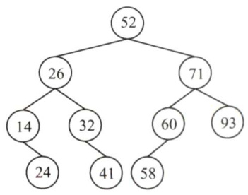  

08.D  

当输入序列是一个有序序列时，构造的二叉排序树是一个单支树，当查找一个不存在的关键字值或最后一个结点的关键字值时，需要 $n$ 次比较。  

09.D  

当二叉排序树的叶子结点全部都在相邻的两层内时，深度最小。理想情况是从第一层到倒数第二层为满二叉树。类比完全二叉树，可得深度为 $\lceil\log_{2}(n+1)\rceil.$ 。  

10.D  

选项D中，插入1后，再插入2，2应作为1的右孩子结点，再插入3，3应作为2的右孩子结点。故选 $\mathrm{~D~}$ 。选项D对应的二叉排序树如右图所示。  

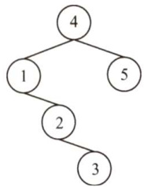  

11.C  

平衡二叉树结点数的递推公式为 $n_{0}=0$ ， $n_{1}=1$ ， $n_{2}=2$ ， $n_{h}=1+n_{h-1}+n_{h-2}$ （ $h$ 为平衡二叉树高度， $n_{h}$ 为构造此高度的平衡二叉树所需的最少结点数)。通过递推公式可得，构造5层平衡二叉树至少需12个结点，构造6层至少需要20个结点。  

12.B  

设 $n_{h}$ 表示高度为 $h$ 的平衡二叉树中含有的最少结点数，则有 $n_{1}=1$ $n_{2}=2,n_{h}=n_{h-1}+n_{h-2}+1$ ，由此求出 $n_{5}=12$ ，对应的AVL如右图所示。  

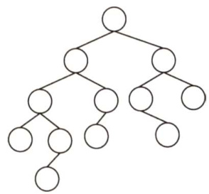  

13.D  

选项A、B和C都是红黑树的性质。AVL是高度平衡的二叉查找树，红黑树是适度平衡的二叉查找树，从这一点也可以看出AVL的查询效率往往更优。  

14.C  

自平衡的二叉排序树是指在插入和删除时能自动调整以保持其所定义的平衡性，红黑树和AVL都属于自平衡二叉树，A正确。在红黑树中删除结点时，情况1可能变为情况2、3或4，情况2会变为情况3，可能会出现旋转次数超过2次的情况，C错误。  

15.B  

解析请扫右侧二维码查阅。  

16.C  

关键字 $1,2,3,4,5,6,7$ 依次插入红黑树后的形态变化如下：  

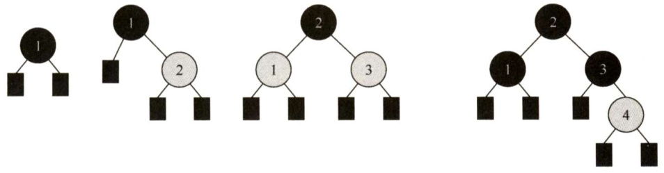  

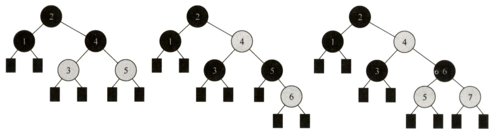  

17.D  

关键字5,4,3，2,1依次插入红黑树后的形态变化如下：  

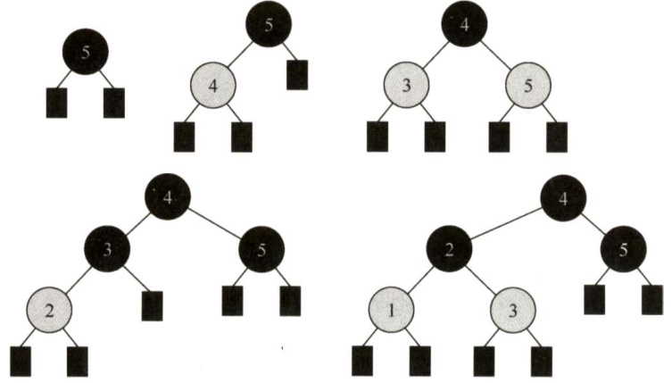  

18.B  

根据平衡二叉树的定义有，任意结点的左、右子树高度差的绝对值不超过1。而其余3个答案均可以找到不满足条件的结点。  

19.C  

插入48后，该二叉树根结点的平衡因子由-1变为-2，失去平衡，需进行两次旋转（先右旋后左旋）操作。  

20.A  

在二叉排序树中，左子树结点值小于根结点，右子树结点值大于根结点。在选项A中，当查找到91后再向24查找，说明这一条路径（左子树）之后查找的数都要比91小，而后面却查找到了94，因此错误，故选A。  

21.B  

所有非叶结点的平衡因子均为1，即平衡二叉树满足平衡的最少结点情况，如下图所示。对于高度为 $n$ 、左右子树的高度分别为 $n-1$ 和 $n-2、$ 所有非叶结点的平衡因子均为1的平衡二叉树，计算总结点数的公式为 $C_{n}=C_{n-1}+C_{n-2}+1$ 。 $C_{1}=1$ $C_{2}=2$ ， $C_{3}=2+1+1=4$ ，可推出 $C_{6}=20$ 。  

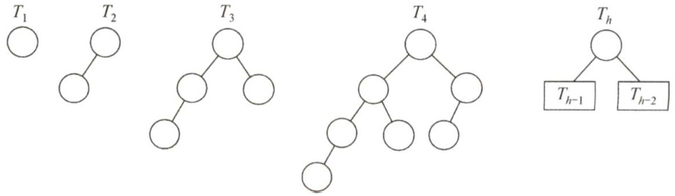  

画图法：先画出 $T_{1}$ 和 $T_{2}$ ；然后新建一个根结点，连接 $T_{2}$ 、 $T_{1}$ 构成 $T_{3}$ ；新建一个根结点，连接 $T_{3}$ 、 $T_{2}$ 构成 $T_{4}$ ……直到画出 $T_{6}$ ，可知 $T_{6}$ 的结点数为20。  

排除法：对于选项A，高度为6、结点数为12的树怎么也无法达到平衡。对于选项C，结点较多时，考虑较极端的情形，即第6层只有最左叶子的完全二叉树刚好有32个结点，虽然满足平衡的条件，但显然再删去部分结点依然不影响平衡，不是最少结点的情况。同理D错误。只可能选B。  

22.C  

在一棵二叉排序树中删除一个结点后，再将此结点插入二叉排序树，若删除的是叶子结点，则插入结点后的二叉排序树与删除之前的相同。若删除的不是叶子结点，则在插入结点后的二叉排序树会发生变化，不完全相同。  

23.D  

利用7个关键字构建平衡二叉树T，平衡因子为0的分支结点个数为3，构建的平衡二叉树及构造与调整过程如下图所示。  

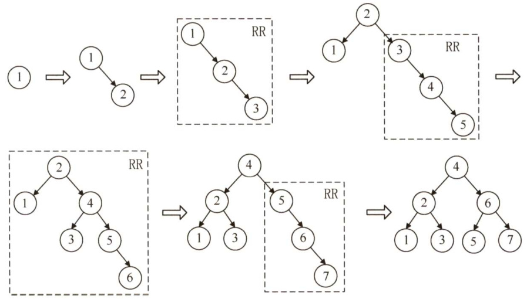  

24.D  

只有两个结点的平衡二叉树的根结点的度为1，A错误。中序遍历后可以得到一个降序序列，树中最小元素一定无左子树（可能有右子树)，因此不一定是叶结点，B错误。最后插入的结点可能会导致平衡调整，而不一定是叶结点，C错误。  

25.C  

根据二叉排序树的特性：中序遍历（LNR）得到的是一个递增序列。图中二叉排序树的中序遍历序列为 $x_{1},x_{3},x_{5},x_{4},x_{2}$ ，可知 $x_{3}<x_{5}<x_{4}$ 。  

26.A  

在非空平衡二叉树中插入结点，在失去平衡调整前，一定插入在叶结点的位置。  

若删除的是 $T_{1}$ 的叶结点，则删除后平衡二叉树可能不会失去平衡，即不会发生调整，再插入此结点得到的二叉平衡树 $T_{1}$ 与 $T_{3}$ 相同；若删除后平衡二叉树失去平衡而发生调整，再插入结点  

得到的二叉平衡树 $T_{3}$ 与 $T_{1}$ 可能不同。I正确。例如，如下图所示，删除结点0，平衡二叉树失衡调整，再插入结点0后，平衡二叉树和以前不同。  

对于比较绝对的说法ⅡI和III，通常只需举出反例即可。  

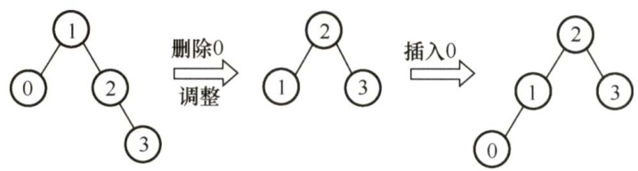  

若删除的是 $T_{1}$ 的非叶结点，且删除和插入操作均没有导致平衡二叉树的调整（这时可以首先想到删除的结点只有一个孩子的情况)，则该结点从非叶结点变成了叶结点， $T_{1}$ 与 $T_{3}$ 显然不同。例如，如下图所示，删除结点2，用右孩子结点3填补，再插入结点2，平衡二叉树和以前不同。  

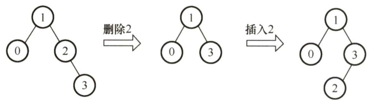  

若删除的是 $T_{1}$ 的非叶结点，且删除和插入操作后导致了平衡二叉树的调整，则该结点有可能通过旋转后继续变成非叶结点， $T_{1}$ 与 $T_{3}$ 相同。例如，如下图所示，删除结点2，用右孩子结点3填补，再插入结点2，平衡二叉树失衡调整，调整后的平衡二叉树和以前相同。  

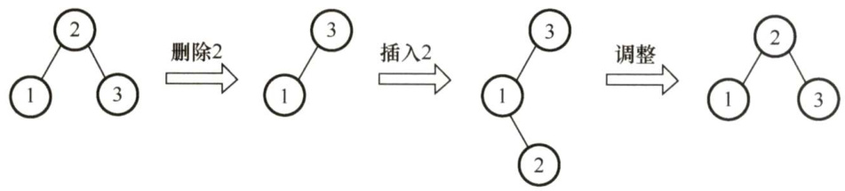  

27.B  

每个选项都逐一验证，选项B生成二叉排序树的过程如下：  

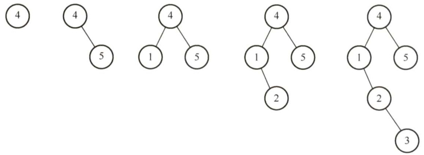  

显然B错误。  

28.D  

关键字23的插入位置为25的左孩子，此时破坏了平衡的性质，需要对平衡二叉树进行调整。最小不平衡子树就是该树本身，插入位置在根结点的右子树的左子树上，因此需要进行RL 旋转，RL旋转过程如下图所示，旋转完成后根结点的关键字为25，故选D。  

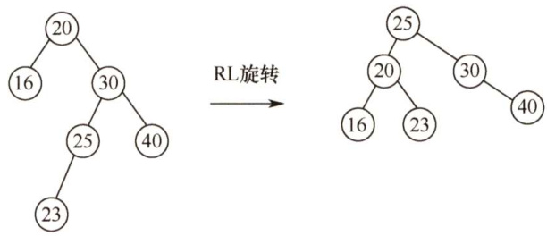  

#### 二、综合应用题  

01.【解答】  

先序序列为(50,38,30,45,40,48,70,60,75,80)，二叉树的中序序列是一个有序序列，故为(30,38,40,45,48,50,60,70,75,80)，由先序序列和中序序列可以构造出对应的二叉树，如下图所示。  

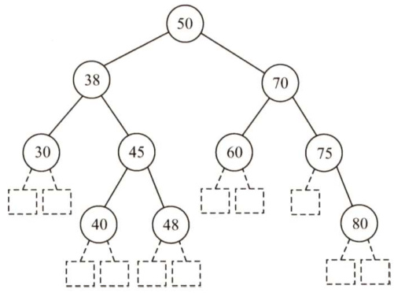  

查找成功的平均查找长度为  

$$
{\mathrm{ASL}}=(1\times1+2\times2+3\times4+4\times3)/10=2.9
$$  

图中的方块结点为虚构的查找失败结点，其查找路径为从根结点到其父结点（圆形结点）的结点序列，故对应的查找失败平均长度为  

$$
\mathrm{ASL}=(3{\times}5+4{\times}6)/11=39/11
$$  

02.【解答】  

根据二叉排序树的定义，该序列所对应的二叉排序树如下图所示。  

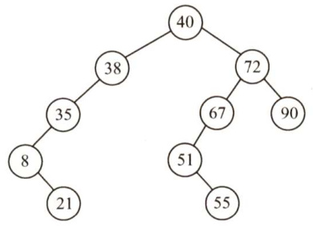  

平均查找长度为 ${\mathrm{ASL}}=(1+2{\times}2+3{\times}3+4{\times}2+5{\times}2)/10=3.2$ 。  

03.【解答】  

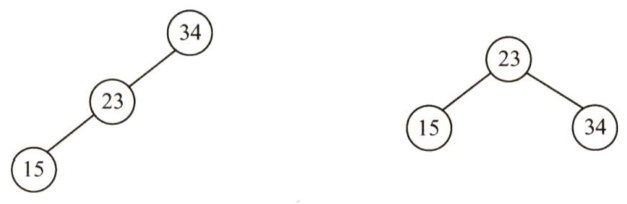  

第一步：插入结点34,23，15后，需要根结点34的子树做LL调整。  

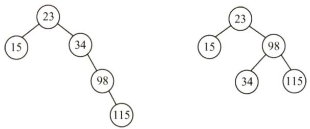  

第二步：插入结点98,115后，需要根结点34的子树做RR调整。  

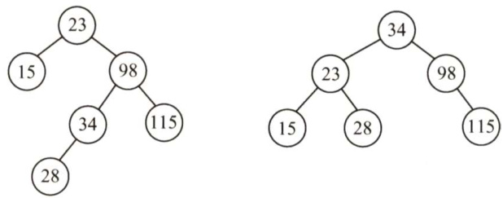  

第三步：插入结点28后，需要根结点23的子树做RL调整。  

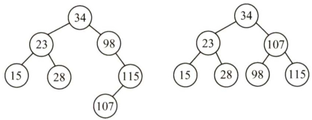  

第四步：插入结点107后，需要根结点98的子树做RL调整。  

04.【解答】  

当各关键字的查找概率相等时，最佳二叉排序树应是高度最小的二叉排序树。构造过程分两步走：首先对各关键字按值从小到大排序，然后仿照折半查找的判定树的构造方法构造二叉排序树。这样得到的就是最佳二叉排序树，结果如下图所示。  

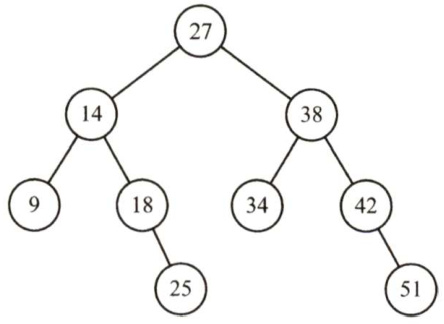  

05.【解答】  

大根堆要求根结点的关键字值既大于等于左子女的关键字值，又大于等于右子女的关键字值。二叉排序树要求根结点的关键字值大于左子女的关键字值，同时小于右子女的关键字值。两者的交集是：根结点的关键字值大于左子女的关键字值。这意味着它是一棵左斜单支树，但大根堆要求是完全二叉树，因此最后得到的只能是如右图所示的两个结点的二叉树。  

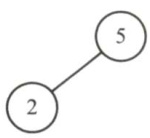  

读者也可能会注意到，当只有一个结点时，显然是满足题意的，但我们不举一个结点的例子是为了体现出排序树与大根堆的区别。  

06.【解答】  

对二叉排序树来说，其中序遍历序列为一个递增有序序列。因此，对给定的二叉树进行中序遍历，若始终能保持前一个值比后一个值小，则说明该二叉树是一棵二叉排序树。算法实现如下：  

KeyType predt $=-32767$ . //predt为全局变量，保存当前结点中序前驱 的值，初值为-   
int JudgeBsT（BiTree bt){ intbl,b2; if(bt $\scriptstyle==$ NULL) //空树 return1; else{ b1 $\c=$ JudgeBsT（bt->lchild); //判断左子树是否是二叉排序树 if $b1==0$ llpredt> $\c=$ bt->data) //若左子树返回值为0或前驱大于等于当前结点 return 0; //则不是二叉排序树 predt $\c=$ bt->data; //保存当前结点的关键字 $b2=$ JudgeBsT(bt->rchild); //判断右子树 return b2; //返回右子树的结果  

07.【解答】  

算法思想：设二叉树采用二叉链表存储结构。在二叉排序树中，查找一次就下降一层。因此，查找该结点所用的次数就是该结点在二叉排序树中的层次。采用二叉排序树非递归查找算法，用$n$ 保存查找层次，每查找一次， $n$ 就加1，直到找到相应的结点。算法如下：  

int level（BiTree bt,BsTNode $\star_{\mathrm{p}}$ ）{   
int $\scriptstyle\mathrm{n=0}$ //统计查找次数   
BiTree $t=b t$ .   
if(bt $\L=$ NULL) $\ n++$ . while(t->data!=p->data){ if(p->data<t->data) //在左子树中查找 t=t->lchild; else //在右子树中查找 t=t->rchild; $\mathrm{n}++$ ， //层次加1 return n;  

08.【解答】  

设置二叉树的平衡标记balance，以标记返回二叉树bt是否为平衡二叉树，若为平衡二叉树，则返回1，否则返回0；h为二叉树bt的高度。采用后序遍历的递归算法：  

1）若bt为空，则高度为0，balance $:=1$ 。  
2）若bt仅有根结点，则高度为1，balance ${}=1$ 。  
3）否则，对bt 的左、右子树执行递归运算，返回左、右子树的高度和平衡标记，bt 的高度为最高子树的高度加1。若左、右子树的高度差大于1，则balance $_{:=0}$ ；若左、右子树的高度差小于等于1，且左、右子树都平衡时，balance $:=1$ ，否则balance $\scriptstyle=0$ o  

算法如下：  

void Judge_AvL（BiTree bt,int &balance,int &h）{ int bl $=0$ ,br $=0$ $\mathbf{h}1=0$ $\scriptstyle\ln\mathbf{r}=0$ . //左、右子树的平衡标记和高度 if(bt $\scriptstyle==$ NULL)( //空树，高度为0 $h=0$ . balance $=1$ else if(bt->lchild $\scriptstyle==$ NULL&&bt->rchild $\scriptstyle==$ NULL）{//仅有根结点，则高度为1 $h=1$ . balance $=1$ . 广 else{ Judge_AvL(bt->lchild,bl,hl); //递归判断左子树 Judge_AvL(bt->rchild,br,hr); //递归判断右子树 $\mathrm{h}=$ (hl>hr?hl:hr) $+1$ · if(abs（hl-hr) $<2$ ） //若子树高度差的绝对值<2，则看左、右子树是否都平衡 balance $\c=$ bl&&br；//&&为逻辑与，即左、右子树都平衡时，二叉树平衡 else balance $=0$  

09.【解答】  

在一棵二叉排序树中，最左下结点即为关键字最小的结点，最右下结点即为关键字最大的结点，本算法只要找出这两个结点即可，而不需要比较关键字。算法如下：  

KeyType MinKey（BSTNode\*bt）{ while(bt->lchild! $\c=$ NULL) bt $\c=$ bt->lchild; return bt->data;   
}   
KeyType MaxKey（BSTNode \*bt){   
//求出二叉排序树中最大关键字结点 while(bt->rchild! $\c=$ NULL) bt $\O=$ bt->rchild; returnbt->data;  

10.【解答】  

由二叉排序树的性质可知，右子树中所有的结点值均大于根结点值，左子树中所有的结点值均小于根结点值。为了从大到小输出，先遍历右子树，再访问根结点，后遍历左子树。算法如下：  

void OutPut（BSTNode \*bt,KeyType k）   
{//本算法从大到小输出二叉排序树中所有值不小于 $k$ 的关键字   
if（bt $\scriptstyle==$ NULL) return;   
if(bt->rchild! $\c=$ NULL) OutPut（bt->rchild,k); //递归输出右子树结点   
if(bt->data> $\mathbf{\tau}=\mathbf{k}$ ） printf（"%d"，bt->data）;//只输出大于等于 $k$ 的结点值   
if(bt->lchild! $\c=$ NULL) OutPut（bt->lchild,k); //递归输出左子树的结点  

本题也可采用中序遍历加辅助栈的方法实现。  

11.【解答】  

设二叉排序树的根结点为\*七，根据结点存储的信息，有以下几种情况：t->lchild为空时，情况如下：  

1）若t->rchild非空且 $k{=}{=}1$ ，则 $^{\star}\t$ 即为第 $\mathbf{k}$ 小的元素，查找成功。  
2）若t->rchild非空且 $\mathrm{~k~}!=1$ ，则第 $\boldsymbol{\mathrm{\Sigma}}_{\mathrm{k}}$ 小的元素必在 $\star\ t$ 的右子树。  

若t->lchild非空时，情况如下：  

1）t->lchild->count $\scriptstyle==\mathbf{k}-1$ ， $\star\ t$ 即为第 $\mathbf{k}$ 小的元素，查找成功  
2）t->lchild- $>$ count>k-1，第 $\mathrm{~k~}$ 小的元素必在 $\star\sf{t}$ 的左子树，继续到\*七的左子树中查找。  
3）t->lchild- $>$ count<k-1,第 $\mathbf{k}$ 小的元素必在右子树，继续搜索右子树，寻找第k-(t->lchild- $\mathrm{>}$ count $+1$ )小的元素。  

对左右子树的搜索采用相同的规则，递归实现的算法描述如下：  

BSTNode\*SearchSmall（BsTNode\*t,intk）{   
//在以t为根的子树上寻找第 $k$ 小的元素，返回其所在结点的指针。k从11开始计算   
//在树结点中增加一个count数据成员，存储以该结点为根的子树的结点个数 if( $k<1$ |/k>t->count)returnNULL; if(t->lchild $\scriptstyle==$ NULL){ if $k==1$ )return t; else return Search Small（t->rchild,k-1); } else{ if(t->lchild->count $==k-1$ ）return t; if（t->lchild->count>k-1)return Search_Small（t->lchild,k); if(t->lchild->count<k-1） return Search Small(t->rchild, $k-$ (t->lchild->count $+1$ ））;  

最大查找长度取决于树的高度。由于二叉排序树是随机生成的，其高度应是 $O(\log_{2}n)$ ，算法的时间复杂度为 $O(\log_{2}n)$ 。  

### 7.4B树和 $\mathbf{B}+$ 树  

考研大纲对B树和 $\mathrm{B}+$ 树的要求各不相同，重点在于考查B树，不仅要求理解B树的基本特点，还要求掌握B树的建立、插入和删除操作，而对 $\mathbf{B}+$ 树则只考查基本概念。  

#### 7.4.1 B树及其基本操作  

B树，又称多路平衡查找树，B树中所有结点的孩子个数的最大值称为B树的阶，通常用 $m$ 表示。一棵 $m$ 阶B树或为空树，或为满足如下特性的 $m$ 叉树：  

1）树中每个结点至多有 $m$ 棵子树，即至多含有 $m-1$ 个关键字。  

2）若根结点不是终端结点，则至少有两棵子树。  

3）除根结点外的所有非叶结点至少有 $\lceil m/2\rceil$ 棵子树，即至少含有 $\left\lceil m/2\right\rceil-1$ 个关键字。  

4）所有非叶结点的结构如下：  

<html><body><table><tr><td>n</td><td>Po</td><td>K</td><td>P</td><td>K</td><td>P2</td><td>…</td><td>Kn</td><td>Pn</td></tr></table></body></html>  

其中， $K_{i}$ $(i=1,2,\cdots,n)$ 为结点的关键字，且满足 $K_{1}<K_{2}<\cdots<K_{n}$ ， $P_{i}$ $\stackrel{\prime}{,}i=0,1,\cdots,n)$ 为指向子树根结点的指针，且指针 $P_{i-1}$ 所指子树中所有结点的关键字均小于 $K_{i}$ ， $P_{i}$ 所指子树中所有结点的关键字均大于 $K_{i}$ ， $n$ $n~(\lceil m/2\rceil-1\leq n\leq m-1)$ 为结点中关键字的个数。  

5）所有的叶结点都出现在同一层次上，并且不带信息（可以视为外部结点或类似于折半查找判定树的查找失败结点，实际上这些结点不存在，指向这些结点的指针为空)。  

B树是所有结点的平衡因子均等于0的多路平衡查找树。  

图7.28所示为一棵5阶B树。按B树的定义，5阶B树中所有结点的最大孩子数 $m=5$ 。可以借助该实例来分析上述性质：  

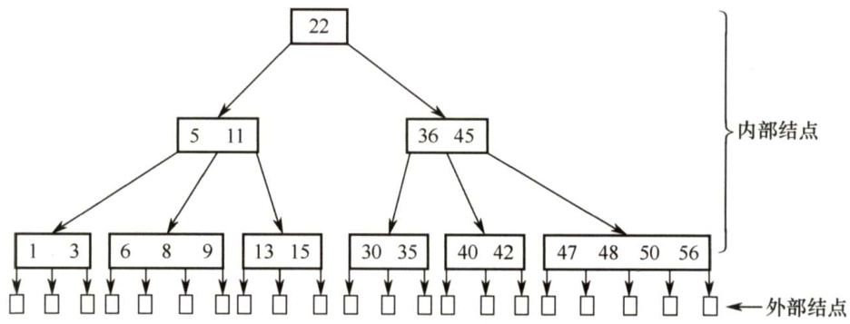  
图7.28一棵5阶B树的实例  

1）结点的孩子个数等于该结点中关键字个数加1。  

2）如果根结点没有关键字就没有子树，此时B树为空；如果根结点有关键字，则其子树必然大于等于两棵，因为子树个数等于关键字个数加1。  
3）除根结点外的所有非终端结点至少有 $\dot{m}/2\vert=\lceil5/2\rceil=3$ 棵子树（即至少有 $m/27-1=\left\lceil5/2\right\rceil-1$ $=2$ 个关键字)，至多有5棵子树（即至多有4个关键字)。  
4）结点中关键字从左到右递增有序，关键字两侧均有指向子树的指针，左边指针所指子树的所有关键字均小于该关键字，右边指针所指子树的所有关键字均大于该关键字。或者看成下层结点关键字总是落在由上层结点关键字所划分的区间内，如第二层最左结点的关键字划分成了3个区间： $(-\infty,5)$ ,(5,11), $(11,+\infty)$ ，该结点3个指针所指子树的关键字均落在这3个区间内。  

5）所有叶结点均在第4层，代表查找失败的位置。  

#### 1.B树的高度（磁盘存取次数）  

由下一节将得知，B树中的大部分操作所需的磁盘存取次数与B树的高度成正比。  

下面来分析B树在不同情况下的高度。当然，首先应该明确B树的高度不包括最后的不带任何信息的叶结点所处的那一层（有些书对B树的高度的定义中，包含最后的那一层)。  

若 $n\geq1$ ，则对任意一棵包含 $n$ 个关键字、高度为 $h$ 、阶数为 $m$ 的B树：  

1）因为B树中每个结点最多有 $m$ 棵子树， $m-1$ 个关键字，所以在一棵高度为 $h$ 的 $m$ 阶B树中关键字的个数应满足 $n\leq(m-1)(1+m+m^{2}+\cdots+m^{h-1})=m^{h}-1$ ，因此有$h\geq\log_{m}(n+1)$  

2）若让每个结点中的关键字个数达到最少，则容纳同样多关键字的B树的高度达到最大。由B树的定义：第一层至少有1个结点；第二层至少有2个结点；除根结点外的每个非终端结点至少有 $\lceil m/2\rceil$ 棵子树，则第三层至少有 $2\left\lceil m/2\right\rceil$ 个结点…第 $h+1$ 层至少有$2(\left\lceil m/2\right\rceil)^{h-1}$ 个结点，注意到第 $h+1$ 层是不包含任何信息的叶结点。对于关键字个数为 $n$ 的B树，叶结点即查找不成功的结点为 $n+1$ ，由此有 $n+1\geq2(\lceil m/2\rceil)^{h-1}$ ，即 $h\leq\log\lceil{m\slash2}\rceil$ $((n+1)/2)+1$ 。  

例如，假设一棵3阶B树共有8个关键字，则其高度范围为 $2\leq h\leq3.17$ o  

#### 2.B树的查找  

在B树上进行查找与二叉查找树很相似，只是每个结点都是多个关键字的有序表，在每个结点上所做的不是两路分支决定，而是根据该结点的子树所做的多路分支决定。  

B树的查找包含两个基本操作： $\textcircled{1}$ 在B树中找结点； $\textcircled{2}$ 在结点内找关键字。由于B树常存储在磁盘上，因此前一个查找操作是在磁盘上进行的，而后一个查找操作是在内存中进行的，即在找到目标结点后，先将结点信息读入内存，然后在结点内采用顺序查找法或折半查找法。  

在B树上查找到某个结点后，先在有序表中进行查找，若找到则查找成功，否则按照对应的指针信息到所指的子树中去查找（例如，在图7.28中查找关键字42，首先从根结点开始，根结点只有一个关键字，且 $42>22$ ，若存在，必在关键字22的右边子树上，右孩子结点有两个关键字，而 $36<42<45$ ，则若存在，必在36和45中间的子树上，在该子结点中查到关键字42，查找成功)。查找到叶结点时（对应指针为空指针)，则说明树中没有对应的关键字，查找失败。  

#### 3.B树的插入  

与二叉查找树的插入操作相比，B树的插入操作要复杂得多。在二叉查找树中，仅需查找到需插入的终端结点的位置。但是，在B树中找到插入的位置后，并不能简单地将其添加到终端结点中，因为此时可能会导致整棵树不再满足B树定义中的要求。将关键字key插入B树的过程如下：  

1）定位。利用前述的B树查找算法，找出插入该关键字的最低层中的某个非叶结点（在B树中查找key时，会找到表示查找失败的叶结点，这样就确定了最底层非叶结点的插入位置。注意：插入位置一定是最低层中的某个非叶结点)。  
2）插入。在B树中，每个非失败结点的关键字个数都在区间 $[\Tilde{|}m/2]_{-1}$ 。 $m-1]$ 内。插入后的结点关键字个数小于 $m$ ，可以直接插入；插入后检查被插入结点内关键字的个数，当插入后的结点关键字个数大于 $m-1$ 时，必须对结点进行分裂。  

分裂的方法是：取一个新结点，在插入key后的原结点，从中间位置 $(\lceil m/2\rceil)$ ）将其中的关键字分为两部分，左部分包含的关键字放在原结点中，右部分包含的关键字放到新结点中，中间位置 $[m/2])$ 的结点插入原结点的父结点。若此时导致其父结点的关键字个数也超过了上限，则继续进行这种分裂操作，直至这个过程传到根结点为止，进而导致B树高度增1。  

对于 $m=3$ 的B树，所有结点中最多有 $m-1=2$ 个关键字，若某结点中已有两个关键字，则结点已满，如图7.29(a)所示。插入一个关键字60后，结点内的关键字个数超过了 $m-1,$ 如图7.29(b)所示，此时必须进行结点分裂，分裂的结果如图7.29(c)所示。  

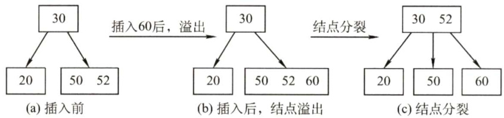  
图7.29结点的“分裂”示意  

#### 4.B树的删除  

B 树中的删除操作与插入操作类似，但要稍微复杂一些，即要使得删除后的结点中的关键字个数 $\geq\lceil m/2\rceil-1$ ，因此将涉及结点的“合并”问题。  

当被删关键字 $k$ 不在终端结点（最低层非叶结点）中时，可以用 $k$ 的前驱（或后继) $k$ 来替代 $k$ ，然后在相应的结点中删除 $k^{\prime}$ ，关键字 $k$ 必定落在某个终端结点中，则转换成了被删关键字在终端结点中的情形。在图7.30的4阶B树中，删除关键字80，用其前驱78替代，然后在终端结点中删除78。因此只需讨论删除终端结点中关键字的情形。  

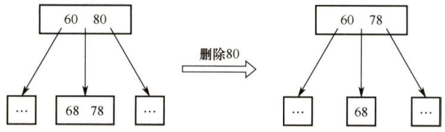  
图7.30B树中删除非终端结点关键字的取代  

当被删关键字在终端结点（最低层非叶结点）中时，有下列三种情况：  

1）直接删除关键字。若被删除关键字所在结点的关键字个数 $\geq\left\lceil m/2\right\rceil$ ，表明删除该关键字后仍满足B树的定义，则直接删去该关键字。  
2）兄弟够借。若被删除关键字所在结点删除前的关键字个数 $=\left\lceil m/2\right\rceil-1$ ，且与此结点相邻的右（或左）兄弟结点的关键字个数 $\geq\left\lceil m/2\right\rceil$ ，则需要调整该结点、右（或左）兄弟结点及其双亲结点（父子换位法)，以达到新的平衡。在图7.31(a)中删除4阶B树的关键字65，右兄弟关键字个数 $\geq\lceil m/2\rceil=2$ ，将71取代原65的位置，将74调整到71的位置。  

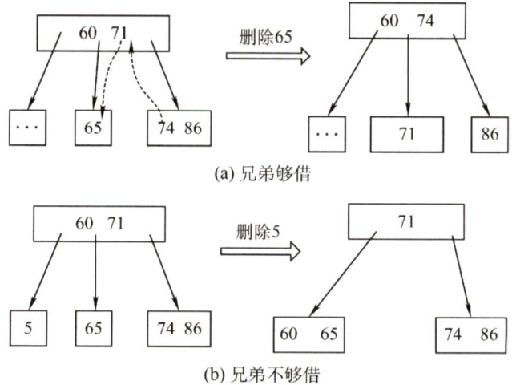  
图7.31B树中删除终端结点关键字的示意图  

3）兄弟不够借。若被删除关键字所在结点删除前的关键字个数 $=\lceil m/2\rceil-1$ ，且此时与该结点相邻的左、右兄弟结点的关键字个数均 $=\lceil m/2\rceil-1$ ，则将关键字删除后与左（或右)兄弟结点及双亲结点中的关键字进行合并。在图7.31(b)中删除4阶B树的关键字5，它及其右兄弟结点的关键字个数 $:=\lceil m/2\rceil-1=1$ ，故在5删除后将60合并到65结点中。  

在合并过程中，双亲结点中的关键字个数会减1。若其双亲结点是根结点且关键字个数减少至0（根结点关键字个数为1时，有2棵子树），则直接将根结点删除，合并后的新结点成为根；若双亲结点不是根结点，且关键字个数减少到 $\left\lceil m/2\right\rceil-2$ ，则又要与它自己的兄弟结点进行调整或合并操作，并重复上述步骤，直至符合B树的要求为止。  

#### 7.4.2 $\mathbf{B}+$ 树的基本概念  

$\mathrm{B}+$ 树是应数据库所需而出现的一种B树的变形树。  

一棵 $m$ 阶的 $\mathrm{B}+$ 树需满足下列条件：  

1）每个分支结点最多有 $m$ 棵子树(孩子结点)。  
2）非叶根结点至少有两棵子树，其他每个分支结点至少有 $\lceil m/2\rceil$ 棵子树。  
3）结点的子树个数与关键字个数相等。  
4）所有叶结点包含全部关键字及指向相应记录的指针，叶结点中将关键字按大小顺序排列，并且相邻叶结点按大小顺序相互链接起来。  
5）所有分支结点（可视为索引的索引）中仅包含它的各个子结点（即下一级的索引块）中关键字的最大值及指向其子结点的指针。  

$m$ 阶的 $\mathrm{B}+$ 树与 $m$ 阶的B树的主要差异如下：  

1）在 $\mathrm{B}+$ 树中，具有 $n$ 个关键字的结点只含有 $n$ 棵子树，即每个关键字对应一棵子树；而在B树中，具有 $n$ 个关键字的结点含有 $n+1$ 棵子树。  

2）在 $\mathrm{B}+$ 树中，每个结点（非根内部结点）的关键字个数 $n$ 的范围是 $\lceil m/2\rceil\leq n\leq m$ （根结点：$2\leq n\leq m,$ ；在B树中，每个结点（非根内部结点）的关键字个数 $n$ 的范围是 $\lceil m/2\rceil-1\leq n\leq$ $m-1$ （根结点： $1\leq n\leq m-1)$ 。  

3）在 ${\mathrm{B}}+$ 树中，叶结点包含信息，所有非叶结点仅起索引作用，非叶结点中的每个索引项只含有对应子树的最大关键字和指向该子树的指针，不含有该关键字对应记录的存储地址。  

4）在 $\mathrm{B}{+}$ 树中，叶结点包含了全部关键字，即在非叶结点中出现的关键字也会出现在叶结点中；而在B树中，叶结点（最外层内部结点)包含的关键字和其他结点包含的关键字是不重复的。  

图7.32所示为一棵4阶 $\mathrm{B}{+}$ 树。可以看出，分支结点的某个关键字是其子树中最大关键字的副本。通常在 $\mathrm{B}+$ 树中有两个头指针：一个指向根结点，另一个指向关键字最小的叶结点。因此，可以对 $\mathbf{B}+$ 树进行两种查找运算：一种是从最小关键字开始的顺序查找，另一种是从根结点开始的多路查找。  

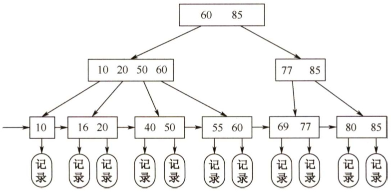  
图7.32 $\mathbf{B}+$ 树结构示意图  

$\mathrm{B}+$ 树的查找、插入和删除操作和B 树的基本类似。只是在查找过程中，非叶结点上的关键字值等于给定值时并不终止，而是继续向下查找，直到叶结点上的该关键字为止。所以，在 $\mathrm{B}+$ 树中查找时，无论查找成功与否，每次查找都是一条从根结点到叶结点的路径。  

#### 7.4.3 本节试题精选  

#### 一、单项选择题  

01．下图所示是一棵（）。  

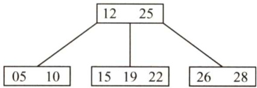  

A.4阶B树 B.4阶 $\mathrm{B}+$ 树 C.3阶B树 D.3阶 $\mathrm{B}+$ 树  

02．下列关于 $m$ 阶B树的说法中，错误的是（）。  

A．根结点至多有 $m$ 棵子树  
B．所有叶结点都在同一层次上  
C．非叶结点至少有 $m/2$ （ $m$ 为偶数）或 $(m+1)/2$ （ $m$ 为奇数）棵子树  
D.根结点中的数据是有序的  

03.以下关于 $m$ 阶B树的说法中，正确的是（）。  

I．每个结点至少有两棵非空子树  
ⅡI．树中每个结点至多有 $m-1$ 个关键字  
III．所有叶结点在同一层  
IV．插入一个元素引起B树结点分裂后，树长高一层  

A.I、ⅡI B.Ⅱ、III C.IⅢI、IV D.I、Ⅱ、IV  

04.在一棵 $m$ 阶B树中做插 $\lambda$ 操作前，若一个结点中的关键字个数等于（），则必须分裂成两个结点；向一棵 $m$ 阶的B树做删除操作前，若一个结点中的关键字个数等于（），则可能需要同它的左兄弟或右兄弟结点合并成一个结点。  

A. $m$ ， $\left\lceil m/2\right\rceil-2$ B.m-1，[m/2]-1C. $m+1$ ， $\lceil m/2\rceil$ D. m/2， $\left\lceil m/2\right\rceil+1$  

05．具有 $n$ 个关键字的 $m$ 阶B树，应有（）个叶结点。  

A. $n+1$ B. $n-1$ C. mn D. nm/2  

06．高度为5的3阶B树至少有（）个结点，至多有（）个结点。  

A.32 B.31 C.120 D. 121  

7.含有 $n$ 个非叶结点的 $m$ 阶B树中至少包含（）个关键字。  

A. $n(m+1)$ B. $n$ C. $n(\lceil m/2\rceil-1)$ D. $(n-1)(\lceil m/2\rceil-1)+1$  

18．已知一棵5阶B树中共有53个关键字，则树的最大高度为（），最小高度为（）。  

A.2 B.3 C.4 D.5  

09．已知一棵3阶B树中有2047个关键字，则此B树的最大高度为（），最小高度为（）  

A.11 B.10 C.8 D.7  

10．下列关于B树和 $\mathrm{B}+$ 树的叙述中，不正确的是（）。  

A.B树和 $\mathrm{B}+$ 树都能有效地支持顺序查找B.B树和 $\mathrm{B}+$ 树都能有效地支持随机查找  

C.B树和 $\mathrm{B}+$ 树都是平衡的多叉树D.B树和 $\mathrm{B}+$ 树都可以用于文件索引结构  

11.【2009统考真题】下列叙述中，不符合 $m$ 阶B树定义要求的是（）。  

A.根结点至多有 $m$ 棵子树 B.所有叶结点都在同一层上C.各结点内关键字均升序或降序排列D．叶结点之间通过指针链接  

12.【2012统考真题】已知一棵3阶B树，如下图所示。删除关键字78得到一棵新B树，其最右叶结点中的关键字是（）。  

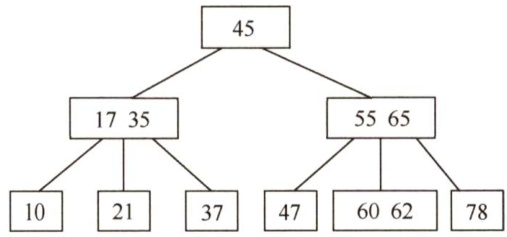  

A.60 B. 60,62 C. 62,65 D.65  

13.【2013统考真题】在一棵高度为2的5阶B树中，所含关键字的个数至少是（）  

A.5 B.7 C.8 D.14【2014统考真题】在一棵有15个关键字的4阶B树中，含关键字的结点个数最多是（）。  

A.5 B.6 C.10 D.15  

15.【2016统考真题】 $\mathrm{B}+$ 树不同于B树的特点之一是（）。  

A.能支持顺序查找 B.结点中含有关键字C.根结点至少有两个分支 D．所有叶结点都在同一层上  

16.【2017统考真题】下列应用中，适合使用 $\mathbf{B}+.$ 树的是（）。  

A．编译器中的词法分析 B.关系数据库系统中的索引C．网络中的路由表快速查找 D.操作系统的磁盘空闲块管理  

7.【2018统考真题】高度为5的3阶B树含有的关键字个数至少是（）。  

A.15 B.31 C. 62 D. 242  

18.【2020统考真题】依次将关键字5，6，9，13，8，2，12，15插入初始为空的4阶B树后，根结点中包含的关键字是（）。  

A.8 B.6，9 C.8，13 D.9，12  

19.【2021统考真题】在一棵高度为3的3阶B树中，根为第1层，若第2层中有4个关键字，则该树的结点数最多是（）。  

A.11 B.10 C.9 D.8  

#### 二、综合应用题  

01.给定一组关键字{20,30,50,52，60,68，70}，给出创建一棵3阶B树的过程。  

02.对如下图所示的3阶B树，依次执行下列操作，画出各步操作的结果。  

1）插入90 2）插入25 3）插入45 4）删除60 5）删除80  

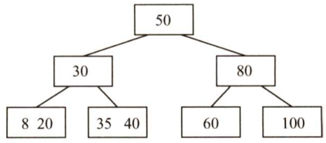  

03．利用B树做文件索引时，若假设磁盘页块的大小是4000B（实际应是2的次幂，此处是为了计算方便），指示磁盘地址的指针需要5B。现有20000000个记录构成的文件，每个记录为200B，其中包括关键字5B。试问在这个采用B树作索引的文件中，B树的阶数应为多少？假定文件数据部分未按关键字有序排列，则索引部分需要占用多少磁盘页块？  

#### 7.4.4 答案与解析  

#### 一、单项选择题  

01.A  

关键字数量比子树数量少1，所以不是 $\mathbf{B}+$ 树，而是B树。又因为 $m$ 阶B树结点关键字数最多为 $m-1$ ，有一个结点关键字个数为3，所以不可能为3阶。  

02.C  

除根结点外的所有非终端结点至少有 $\dot{m}/2$ 棵子树。对于根结点，最多有 $m$ 棵子树，若其不是叶结点，则至少有2棵子树。  

03.B  

每个非根的内部结点必须至少有 $\lceil m/2\rceil$ 棵子树，而根结点至少要有两棵子树，所以I不正确。I、IⅢI显然正确。对于IV，插入一个元素引起B树结点分裂后，只要从根结点到该元素插入位置的路径上至少有一个结点未满，B树就不会长高，如图1所示；只有当结点的分裂传到根结点，并使根结点也分裂时，才会导致树高增1，如图2所示，因此IV错误。  

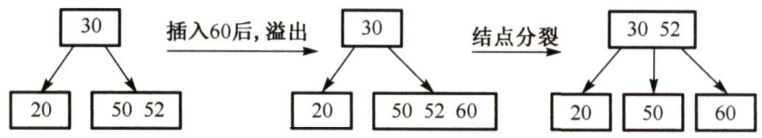  
图1结点分裂不导致树高增1(3阶B树)  

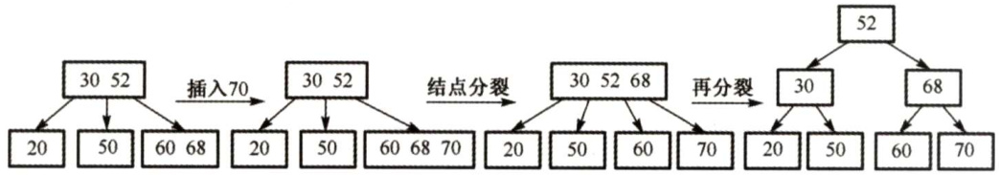  
图2结点分裂导致树高增1（3阶B树）  

04.B  

由于B树中每个结点内的关键字个数最多为 $m-1$ ，所以当关键字个数大于 $m-1$ 时，就应该分裂。而每个结点内的关键字个数至少为 $\lceil m/2\rceil-1$ 个，所以当关键字个数少于 $\left\lceil m/2\right\rceil-1$ 时，应与其他结点合并。若将本题题干改为 $\mathbf{B}+\mathbf{\delta}$ 树，请读者自行思考上述问题的解答。  

05.A  

B 树的叶结点对应查找失败的情况，对有 $n$ 个关键字的查找集合进行查找，失败可能性有 $n+$ 1种。  

06.B、D  

由 $m$ 阶B树的性质可知，根结点至少有2棵子树；根结点外的所有非终端结点至少有 $\lceil m/2\rceil$ 棵子树，结点数最少时，3阶B树形状至少类似于一棵满二叉树，即高度为5的B树至少有 $2^{5}-1=$ 31个结点。由于每个结点最多有 $m$ 棵子树，所以当结点数最多时，3阶B树形状类似于满三叉树，结点数为 $(3^{5}-1)/2=121$ （注意，这里求的是结点数而非关键字数，若求的是关键字数，则还应把每个结点中关键字数的上下界确定出来)。  

07.D  

除根结点外， $m$ 阶B树中的每个非叶结点至少有 $\left\lceil m/2\right\rceil-1$ 个关键字，根结点至少有一个关键字，所以总共包含的关键字最少个数 $=(n-1)(\lceil m/2\rceil-1)+1$ o  

注意：由以上题目可知B树和 $\mathrm{B}+$ 树的定义与性质尤为重要，需要熟练掌握。  

08.C、B  

5阶B树中共有53个关键字，由最大高度公式 $H\leq\log_{m/2}((n+1)/2)+1$ 得最大高度 $H\leq$ $\log_{3}[(53+1)/2]+1=4$ ，即最大高度为4；由最小高度公式 $h\geq\log_{m}(n+1)$ 得最小高度 $h\geq\log_{5}54=$ 2.5，从而最小高度为3。  

09.A、D  

利用前面的公式即最小高度 $h\geq\log_{m}(n+1)$ 和最大高度 $H\leq\log\lceil{m/2}\rceil\left[(n+1)/2\right]+1$ ，易算出最大高度 $H\leq\log_{2}[(2047+1)/2]+1=11$ ，最小高度 $h\geq\log_{3}2048=6.9$ ，从而最小高度取7（注意，有些辅导书针对本题算出的高度要比这里给出的答案多1，因为它们在对B树的高度定义中，把最低层不包含任何关键字的叶结点也算进去了）。  

10.A  

B树和 ${\mathrm{B}}+$ 树的差异主要体现在： $\textcircled{1}$ 结点关键字和子树的个数； $\textcircled{2}\textcircled{8}+$ 树非叶结点仅起索引作用； $\textcircled{3}\mathbf{B}$ 树叶结点关键字和其他结点包含的关键字是不重复的； $\textcircled{4}\textcircled{1}\textcircled{4}\textcircled{1}\textcircled{1}\textcircled{4}\textcircled{1}\textcircled{2}\textcircled{1}\textcircled{2}\textcircled{1}\textcircled{2}\textcircled{4}\textcircled{1}\textcircled{2}\textcircled{4}\textcircled{1}\textcircled{2}\textcircled{4}$ 树支持顺序查找和随机查找，而B树仅支持随机查找。由于 $\mathbf{B}+$ 树的所有叶结点中包含了全部的关键字信息，且叶结点本身依关键字从小到大顺序链接，因此可以进行顺序查找，而B树不支持顺序查找。  

11.D$m$ 阶B树不要求将各叶结点之间用指针链接。选项D描述的实际上是 $\mathrm{B}+$ 树。  

12.D  

对于图中所示的3阶B树，被删关键字78所在的结点在删除前的关键字个数 $=1=\left\lceil3/2\right\rceil-1$ ，且其左兄弟结点的关键字个数 $=2\geq\left\lceil3/2\right\rceil$ ，属于“兄弟够借”的情况，因此要把该结点的左兄弟结点中的最大关键字上移到双亲结点中，同时把双亲结点中大于上移关键字的关键字下移到要删除关键字的结点中，这样就达到了新的平衡，如下图所示。  

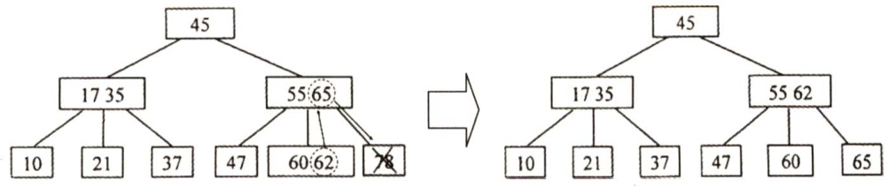  

13.A 扫一扫  

解析请扫右侧二维码查阅。  

14.D  

关键字数量不变，要求结点数量最多，即要求每个结点中含关键字的数量最少。  

根据4阶B树的定义，根结点最少含1个关键字，非根结点中最少含 $\left\lceil4/2\right\rceil-1=1$ 个关键字，所以每个结点中关键字数量最少都为1个，即每个结点都有2个分支，类似于排序二叉树，而15个结点正好可以构造一个4层的4阶B树，使得终端结点全在第四层，符合B树的定义，因此选D。  

15.A  

由于 $\mathbf{B}+$ 树的所有叶结点中包含了全部的关键字信息，且叶结点本身依关键字从小到大顺序链接，因此可以进行顺序查找，而B树不支持顺序查找（只支持多路查找)。  

16.B  

$\mathbf{B}+$ 树是应文件系统所需而产生的B树的变形，前者比后者更加适用于实际应用中的操作系统的文件索引和数据库索引，因为前者的磁盘读写代价更低，查询效率更加稳定。编译器中的词法分析使用有穷自动机和语法树。网络中的路由表快速查找主要靠高速缓存、路由表压缩技术和快速查找算法。系统一般使用空闲空间链表管理磁盘空闲块。所以选项B正确。  

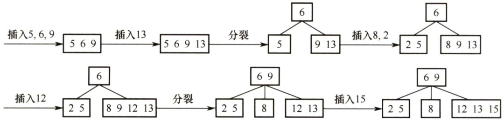  
解析及视频讲解  

17.B  

$m$ 阶B树的基本性质：根结点以外的非叶结点最少含有 $\mathbf{{\bar{\rho}}}_{m/2}\mathbf{\vec{\tau}}]_{-1}$ 个关键字，代入 $m=3$ 得到每个非叶结点中最少包含1个关键字，而根结点含有1个关键字，因此所有非叶结点都有两个孩子。此时其树形与 $h=5$ 的满二叉树相同，可求得关键字最少为31个。  

18.B  

一个4阶B树的任意非叶结点至多含有 $m-1=3$ 个关键字，在关键字依次插入的过程中，会导致结点的不断分裂，插入过程如下所示。  

得到根结点包含的关键字为6,9。  

19.A  

在阶为3的B树中，每个结点至多含有2个关键字（至少1个)，至多有3棵子树。本题规定第二层有4个关键字，欲使B树的结点数达到最多，则这4个关键字包含在3个结点中，B树树形如下图所示，其中A,B,C,…,M表示关键字，最多有11个结点，故选A。  

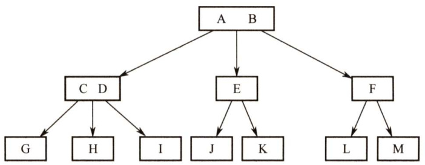  

#### 二、综合应用题  

01.【解答】  

$m=3$ ，因此除根结点外，非叶子结点关键字个数为 $1{\sim}2$ o  

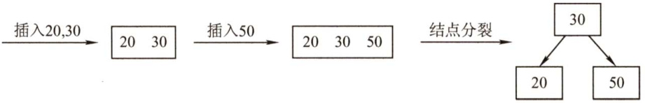  

如上图所示，首先插入20,30，结点内关键字个数不超过 $\left\lceil m/2\right\rceil=2$ ，不会引起分裂；插入50，插入20,30所在的结点，引起分裂，结点内第 $\lceil m/2\rceil$ 个关键字30上升为父结点。  

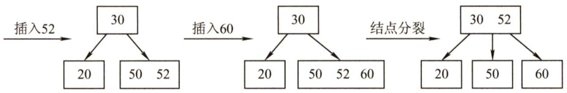  

如上图所示，插入52，插入50所在的结点，不会引起分裂；继续插入60，插入50,52所在的结点，引起分裂，52上升到父结点中，不会引起父结点的分裂。  

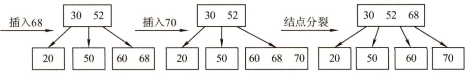  

如上图所示，插入68，插入60所在的结点，不会引起分裂；继续插入70，插入60,68所在的结点，引起分裂，68上升为新的父结点，68上升到30，52所在的结点后，会继续引起该结点的分裂，故52上升为新的根结点。最后得到的B树如下图所示。  

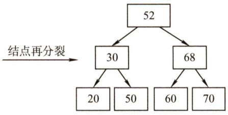  

02.【解答】  

1）插入90：将90插入100所在的结点，插入90后该结点中的元素个数不超过 $\left\lceil3/2\right\rceil=2$ 不会引起结点的分裂，插入后的B树如下图所示。  

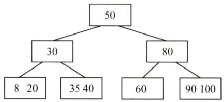  

2）插入25：将25插入8，20所在的结点，插入后结点内的元素个数为3，引起分裂。故将结点内的中间元素20上升到父结点中，此时父结点中的元素个数为2（元素20和30)，不会引起继续分裂，插入25后的B树如下图所示。  

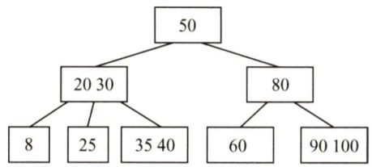  

3）插入45：将45插入35，40所在的结点，引起分裂，中间元素40上升到父结点（20，30所在的结点）中，引起父结点分裂，中间元素30上升到父结点（50所在的结点）中，两次分裂后的B树如下图所示。  

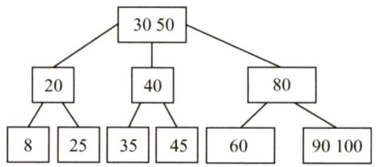  

4）删除60：删除60后，其所在的结点元素为空，从而导致借用右兄弟结点的元素，调整后的B树如下图所示。  

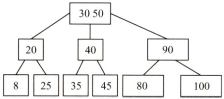  

5）删除80：删除80后，导致80所在结点的父结点与其右兄弟结点合并，这时父结点元素个数为0，再次对父结点进行调整。将50与40合并成一个新结点，则90,100所在结点为这个结点的子结点。从而构造的B树如下图所示。注意，这次调整的过程实际上包含多次调整过程，希望读者对照考点讲解中的删除过程仔细思考。  

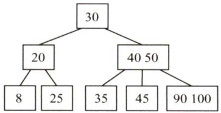  

注意：B树中结点的插入、删除操作（特别是插入、删除后的结点分裂与合并）是本节的重点，也是难点，请读者务必熟练掌握。  

03.【解答】  

根据B树的概念，一个索引结点应适应操作系统一次读写的物理记录大小，其大小应取不超过但最接近一个磁盘页块的大小。假设B树为 $m$ 阶，一个B树结点最多存放 $m-1$ 个关键字（5B）和对应的记录地址（5B）、 $m$ 个子树指针（5B）和1个指示结点中的实际关键字个数的整数（2B)，则有  

$$
(2\times(m-1)+m){\times}5+2\leq4000
$$  

计算结果为 $m\leq267$ 。  

一个索引结点最多可以存放 $m-1=266$ 个索引项，最少可以存放 $\lceil m/2\rceil-1=133$ 个索引项。全部有 $n=20000000$ 个记录，每个记录占用空间 $200\mathrm{B}$ ，每个页块可以存放 $4000/200=20\$ 个记录，则全部记录分布在 $20000000/20=1000000$ 个页块中，最多需要占用 $1000000/133=7519$ 个磁盘页块作为B树索引，最少需要占用 $100000/266=3760$ 个磁盘页块作为B树索引（注意B树与 $\mathbf{B}+$ 树的不同，B树所有对数据记录的索引项分布在各个层次的结点中， $\mathbf{B}+$ 树所有对数据记录的索引项都在叶结点中)。