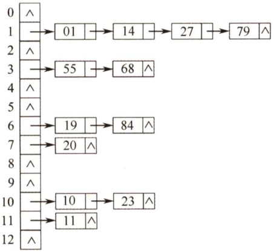
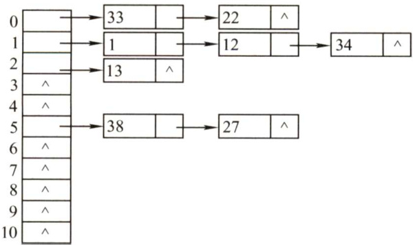
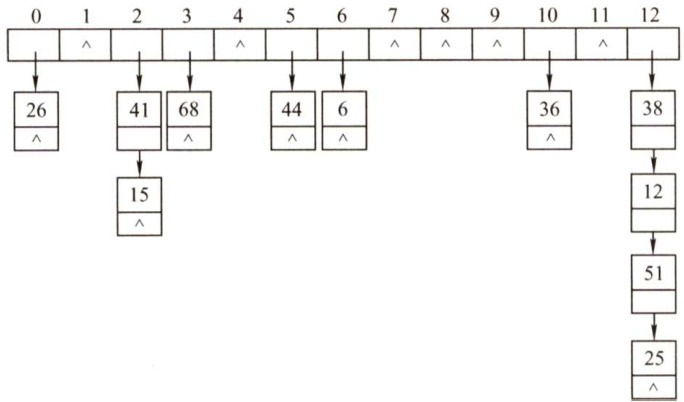

### 7.5 散列表  

#### 7.5.1 散列表的基本概念  

在前面介绍的线性表和树表的查找中，记录在表中的位置与记录的关键字之间不存在确定关系，因此，在这些表中查找记录时需进行一系列的关键字比较。这类查找方法建立在“比较”的基础上，查找的效率取决于比较的次数。  

散列函数：一个把查找表中的关键字映射成该关键字对应的地址的函数，记为Hash(key) $\mathbf{\Sigma}=\mathbf{\Sigma}$ Addr（这里的地址可以是数组下标、索引或内存地址等)。  

散列函数可能会把两个或两个以上的不同关键字映射到同一地址，称这种情况为冲突，这些发生碰撞的不同关键字称为同义词。一方面，设计得好的散列函数应尽量减少这样的冲突；另一方面，由于这样的冲突总是不可避免的，所以还要设计好处理冲突的方法。  

散列表：根据关键字而直接进行访问的数据结构。也就是说，散列表建立了关键字和存储地址之间的一种直接映射关系。  

理想情况下，对散列表进行查找的时间复杂度为 $O(1)$ ，即与表中元素的个数无关。下面分别介绍常用的散列函数和处理冲突的方法。  

#### 7.5.2 散列函数的构造方法  

在构造散列函数时，必须注意以下几点：  

1）散列函数的定义域必须包含全部需要存储的关键字，而值域的范围则依赖于散列表的大小或地址范围。  
2）散列函数计算出来的地址应该能等概率、均匀地分布在整个地址空间中，从而减少冲突的发生。  
3）散列函数应尽量简单，能够在较短的时间内计算出任一关键字对应的散列地址。  
下面介绍常用的散列函数。  

#### 1．直接定址法  

直接取关键字的某个线性函数值为散列地址，散列函数为  

$H(\mathbf{key})=\mathbf{key}$ 或 $H(\mathbf{key})=a{\times}\mathbf{key}+b$  

式中， $a$ 和 $b$ 是常数。这种方法计算最简单，且不会产生冲突。它适合关键字的分布基本连续的情况，若关键字分布不连续，空位较多，则会造成存储空间的浪费。  

#### 2.除留余数法  

这是一种最简单、最常用的方法，假定散列表表长为 $m$ ，取一个不大于 $m$ 但最接近或等于 $m$ 的质数 $p$ ，利用以下公式把关键字转换成散列地址。散列函数为  

$$
H(\mathbf{key})=\mathbf{key}\%p
$$  

除留余数法的关键是选好 $p$ ，使得每个关键字通过该函数转换后等概率地映射到散列空间上的任一地址，从而尽可能减少冲突的可能性。  

#### 3．数字分析法  

设关键字是 $\boldsymbol{r}$ 进制数（如十进制数)，而 $\boldsymbol{r}$ 个数码在各位上出现的频率不一定相同，可能在某些位上分布均匀一些，每种数码出现的机会均等；而在某些位上分布不均匀，只有某几种数码经常出现，此时应选取数码分布较为均匀的若干位作为散列地址。这种方法适合于已知的关键字集合，若更换了关键字，则需要重新构造新的散列函数。  

#### 4.平方取中法  

顾名思义，这种方法取关键字的平方值的中间几位作为散列地址。具体取多少位要视实际情况而定。这种方法得到的散列地址与关键字的每位都有关系，因此使得散列地址分布比较均匀，适用于关键字的每位取值都不够均匀或均小于散列地址所需的位数。  

在不同的情况下，不同的散列函数具有不同的性能，因此不能笼统地说哪种散列函数最好。在实际选择中，采用何种构造散列函数的方法取决于关键字集合的情况，但目标是尽量降低产生冲突的可能性。  

#### 7.5.3 处理冲突的方法  

应该注意到，任何设计出来的散列函数都不可能绝对地避免冲突。为此，必须考虑在发生冲突时应该如何处理，即为产生冲突的关键字寻找下一个“空”的Hash地址。用 $H_{i}$ 表示处理冲突中第 $i$ 次探测得到的散列地址，假设得到的另一个散列地址 $H_{1}$ 仍然发生冲突，只得继续求下一个地址 $H_{2}$ ，以此类推，直到 $H_{k}$ 不发生冲突为止，则 $H_{k}$ 为关键字在表中的地址。  

#### 1．开放定址法  

所谓开放定址法，是指可存放新表项的空闲地址既向它的同义词表项开放，又向它的非同义词表项开放。其数学递推公式为  

$$
H_{i}=(H(\mathbf{key})+d_{i})\%m
$$  

式中， $H(\mathrm{key})$ 为散列函数； $i=0,1,2,^{\cdots},k(k\leq m-1)$ ； $m$ 表示散列表表长； $d_{i}$ 为增量序列。  

取定某一增量序列后，对应的处理方法就是确定的。通常有以下4种取法：  

1）线性探测法。当 $d_{i}=0,1,2,\cdots,m-1$ 时，称为线性探测法。这种方法的特点是：冲突发生时，顺序查看表中下一个单元（探测到表尾地址 $m-1$ 时，下一个探测地址是表首地址0)，直到找出一个空闲单元（当表未填满时一定能找到一个空闲单元）或查遍全表。线性探测法可能使第 $i$ 个散列地址的同义词存入第 $i+1$ 个散列地址，这样本应存入第 $i+$ 1个散列地址的元素就争夺第 $i+2$ 个散列地址的元素的地址…从而造成大量元素在相邻的散列地址上“聚集”（或堆积）起来，大大降低了查找效率。  

2）平方探测法。当 $d_{i}=0^{2},1^{2},-1^{2},2^{2},-2^{2},\ \cdots,k^{2},-k^{2}$ 时，称为平方探测法，其中 $k\leq m/2$ ，散列表长度 $m$ 必须是一个可以表示成 $4k+3$ 的素数，又称二次探测法。平方探测法是一种处理冲突的较好方法，可以避免出现“堆积”问题，它的缺点是不能探测到散列表上的所有单元，但至少能探测到一半单元。  

3）双散列法。当 $d_{i}=\mathrm{Hash}_{2}(\mathrm{key})$ 时，称为双散列法。需要使用两个散列函数，当通过第一个散列函数 $H(\mathrm{key})$ 得到的地址发生冲突时，则利用第二个散列函数 $\mathrm{Hash}_{2}(\mathbf{key})$ 计算该关键字的地址增量。它的具体散列函数形式如下：  

$$
H_{i}=(H(\mathbf{key})+i\times\mathrm{Hash}_{2}(\mathbf{key}))\%m
$$  

初始探测位置 $H_{0}=H(\mathrm{key})\ \%\ m$ 。 $i$ 是冲突的次数，初始为0。在再散列法中，最多经过$m-1$ 次探测就会遍历表中所有位置，回到 $H_{0}$ 位置。  

4）伪随机序列法。当 $d_{i}=$ 伪随机数序列时，称为伪随机序列法。  

注意：在开放定址的情形下，不能随便物理删除表中的已有元素，因为若删除元素，则会截断其他具有相同散列地址的元素的查找地址。因此，要删除一个元素时，可给它做一个删除标记，进行逻辑删除。但这样做的副作用是：执行多次删除后，表面上看起来散列表很满，实际上有许多位置未利用，因此需要定期维护散列表，要把删除标记的元素物理删除。  

#### 2.拉链法（链接法，chaining）  

显然，对于不同的关键字可能会通过散列函数映射到同一地址，为了避免非同义词发生冲突，可以把所有的同义词存储在一个线性链表中，这个线性链表由其散列地址唯一标识。假设散列地址为 $i$ 的同义词链表的头指针存放在散列表的第 $i$ 个单元中，因而查找、插入和删除操作主要在同义词链中进行。拉链法适用于经常进行插入和删除的情况。  

例如，关键字序列为{19,14,23,01,68,20,84,27,55,11，10,79}，散列函数 $\mathrm{~H~}(\mathrm{key})=\mathrm{key}\frac{\circ}{\circ}13$ ，用拉链法处理冲突，建立的表如图7.33所示（学完下节内容后，可以尝试计算本例的平均查找长度ASL)。  

  
图7.33拉链法处理冲突的散列表  
图7.34用线性探测法得到的散列表L  

#### 7.5.4 散列查找及性能分析  

散列表的查找过程与构造散列表的过程基本一致。对于一个给定的关键字key，根据散列函数可以计算出其散列地址，执行步骤如下：  

初始化：Addr $\mathbf{\sigma}=\mathbf{\sigma}$ Hash(key);  

$\textcircled{1}$ 检测查找表中地址为Addr的位置上是否有记录，若无记录，返回查找失败；若有记录，比较它与key的值，若相等，则返回查找成功标志，否则执行步骤 $\textcircled{2}$ 0$\textcircled{2}$ 用给定的处理冲突方法计算“下一个散列地址”，并把Addr置为此地址，转入步骤 $\textcircled{1}$ o例如，关键字序列{19,14,23,01,68,20,84,27,55,11,10,79}按散列函数 $\mathrm{~H~}(\mathrm{~key})=\mathrm{key}\frac{\circ}{\circ}13$ 和线性探测处理冲突构造所得的散列表L如图7.34所示。  

<html><body><table><tr><td>0</td><td>1</td><td>2</td><td>3</td><td>4</td><td>5</td><td></td><td>6</td><td>7</td><td>8</td><td>9</td><td>10</td><td>11</td><td>12</td><td>13</td><td>14</td><td>15</td></tr><tr><td></td><td>14</td><td>01</td><td>68</td><td></td><td>27</td><td>55</td><td>19</td><td>20</td><td>84</td><td>79</td><td>23</td><td>11</td><td>10</td><td></td><td></td><td></td></tr></table></body></html>  

给定值84的查找过程为：首先求得散列地址 $\mathrm{~H~}(84)=6$ ，因L[6]不空且 $\mathrm{I}[6]\neq84$ ，则找第一次冲突处理后的地址 $\mathrm{H}_{1}=(6+1)\ \frac{\circ}{\circ}16=7$ ，而L[7]不空且 $\mathrm{I}[7]\neq84$ ，则找第二次冲突处理后的地址 $H_{2}=(6+2)\div16=8$ ，L[8]不空且 $\mathbb{L}\left[8\right]=84$ ，查找成功，返回记录在表中的序号8。  

给定值38的查找过程为：先求散列地址 $\mathrm{~H~}(38)=12$ ，L[12]不空且 $\mathtt{L}[12]\neq38$ ，则找下一地址 $\mathrm{H}_{1}=(12+1)\stackrel{\circ}{\circ}16=13$ ，由于L[13]是空记录，故表中不存在关键字为38的记录。  

查找各关键字的比较次数如图7.35所示。  

<html><body><table><tr><td>关键字</td><td>14</td><td>01</td><td>68</td><td>27</td><td>55</td><td>19</td><td>20</td><td>84</td><td>79</td><td>23</td><td>11</td><td>10</td></tr><tr><td>比较次数</td><td>1</td><td>2</td><td></td><td>4</td><td>3</td><td>1</td><td>1</td><td>3</td><td>9</td><td>一</td><td>1</td><td>3</td></tr></table></body></html>  

平均查找长度ASL为  

$$
{\mathrm{ASL}}{=}(1\times6+2+3\times3+4+9)/12=2.5\
$$  

对同一组关键字，设定相同的散列函数，则不同的处理冲突的方法得到的散列表不同，它们的平均查找长度也不同，本例与上节采用拉链法的平均查找长度不同。  

从散列表的查找过程可见：  

（1）虽然散列表在关键字与记录的存储位置之间建立了直接映像，但由于“冲突”的产生，使得散列表的查找过程仍然是一个给定值和关键字进行比较的过程。因此，仍需要以平均查找长度作为衡量散列表的查找效率的度量。  

（2）散列表的查找效率取决于三个因素：散列函数、处理冲突的方法和装填因子。装填因子。散列表的装填因子一般记为 $\alpha$ ，定义为一个表的装满程度，即  

$$
\alpha=\ \frac{\ddagger{\boxplus}\ i{\boxplus}\ j}{\#\ j}\neq\ j\neq m
$$  

散列表的平均查找长度依赖于散列表的装填因子α，而不直接依赖于n或m。直观地看，α越大，表示装填的记录越“满”，发生冲突的可能性越大，反之发生冲突的可能性越小。  

读者应能在给出散列表的长度、元素个数及散列函数和解决冲突的方法后，在求出散列表的基础上计算出查找成功时的平均查找长度和查找不成功的平均查找长度。  

#### 7.5.5 本节试题精选  

#### 一、单项选择题  

01.只能在顺序存储结构上进行的查找方法是（）。  

A.顺序查找法 B．折半查找法 C．树型查找法 D.散列查找法  

02.散列查找一般适用于（）的情况下的查找。  

A．查找表为链表  
B．查找表为有序表  
C．关键字集合比地址集合大得多  
D.关键字集合与地址集合之间存在对应关系  

03．下列关于散列表的说法中，正确的是（）。  

I．若散列表的填装因子 $\alpha<1$ ，则可避免碰撞的产生ⅡI．散列查找中不需要任何关键字的比较III．散列表在查找成功时平均查找长度与表长有关  

IV．若在散列表中删除一个元素，不能简单地将该元素删除  

A.I和IV B.和II C.IⅢI D.IV  

14.在开放定址法中散列到同一个地址而引起的“堆积”问题是由于（）引起的  

A.同义词之间发生冲突  
B．非同义词之间发生冲突  
C.同义词之间或非同义词之间发生冲突  
D.散列表“溢出”  

05．下列关于散列冲突处理方法的说法中，正确的有（）。  

I．采用再散列法处理冲突时不易产生聚集  
ⅡI．采用线性探测法处理冲突时，所有同义词在散列表中一定相邻  
II．采用链地址法处理冲突时，若限定在链首插入，则插入任一个元素的时间是相同的  
IV.采用链地址法处理冲突易引起聚集现象  

A.I和III B.I、Ⅱ和IⅢI C.Ⅲ和IV D.I和IV  

06.设有一个含有200个表项的散列表，用线性探测法解决冲突，按关键字查询时找到一个表项的平均探测次数不超过1.5，则散列表项应能够容纳（）个表项（设查找成功的平均查找长度为 $\mathrm{ASL}=[1+1/(1-\alpha)]/2$ ，其中 $\alpha$ 为装填因子）。  

A. 400 B.526 C. 624 D. 676  

07．假定有 $K$ 个关键字互为同义词，若用线性探测法把这 $K$ 个关键字填入散列表，至少要进行（）次探测。  

A. $\textstyle K-1$ B. $K$ C. $K+1$ D. $K(K+1)/2$  

08.对包含 $n$ 个元素的散列表进行查找，平均查找长度（）。  

A.为 $O(\log_{2}n)$ B.为 $O(1)$ C.不直接依赖于 $n$ D．直接依赖于表长  

19.采用开放定址法解决冲突的散列查找中，发生聚集的原因主要是（）。  

A．数据元素过多 B．负载因子过大C.散列函数选择不当 D.解决冲突的方法选择不当  

10.一组记录的关键字为 $\{19,14,23,1,68,20,84,27,55,11,10,79\}$ ，用链地址法构造散列表，散列函数为 $\mathrm{~H~}(\mathrm{~key~})=\mathrm{key}$ MOD13，散列地址为1的链中有（）个记录。  

A.1 B.2 C.3 D.4  

11．在采用链地址法处理冲突所构成的散列表上查找某一关键字，则在查找成功的情况下，所探测的这些位置上的键值（）；若采用线性探测法，则（）。  

A.一定都是同义词 B.不一定都是同义词C．都相同 D.一定都不是同义词  

12．若采用链地址法构造散列表，散列函数为 $\mathrm{~H~}(\mathrm{~key~})=\mathrm{key}$ MOD17，则需（ $\textcircled{1}$ ）个链表。这些链的链首指针构成一个指针数组，数组的下标范围为（ $\textcircled{2}$ ）。  

$\textcircled{1}\mathrm{A}$ .17 B.13 C.16 D.任意 $\textcircled{2}$ A. 0\~17 B.1\~17 C.0\~16 D.1\~16  

13．设散列表长 $m=14$ ，散列函数为 $\mathrm{~H~}(\mathrm{key})=\mathrm{key}\frac{\circ}{\circ}11$ ，表中仅有4个结点 $\mathrm{~H~}(\mathrm{~1~5~})=4$ ，$\mathrm{~H~}(38)=5$ ， $\mathrm{~H~}(\mathrm{~6~1~})=6$ ， $\mathrm{~H~}(84)=7$ ，若采用线性探测法处理冲突，则关键字为49的结点地址是（）。  

A.8 B.3 C.5 D.9  

14.将10个元素散列到100000个单元的散列表中，则（）产生冲突。  

A．一定会 B.一定不会 C．仍可能会 D．不确定  

15.【2011统考真题】为提高散列表的查找效率，可以采取的正确措施是（）。  

I．增大装填（载）因子  
ⅡI．设计冲突（碰撞）少的散列函数  
III处理冲突（碰撞）时避免产生聚集（堆积）现象  

A.仅I B.仅Ⅱ C.仅I、Ⅱ D.仅Ⅱ、III  

16.【2014统考真题】用哈希（散列）方法处理冲突（碰撞）时可能出现堆积（聚集）现象，下列选项中，会受堆积现象直接影响的是（）。  

A．存储效率 B．散列函数C．装填（装载）因子 D．平均查找长度  

17.【2018统考真题】现有长度为7、初始为空的散列表HT，散列函数 $\mathrm{~H~}(\boldsymbol{\textbf{k}})=\mathbf{k}$ %7，用线性探测再散列法解决冲突。将关键字22，43，15依次插入HT后，查找成功的平均查找长度是（）。  

A.1.5 B.1.6 C.2 D.3  

18.【2019统考真题】现有长度为11且初始为空的散列表HT，散列函数是 $\mathrm{~H~}(\mathrm{~key})=\mathrm{key}\frac{\circ}{\circ}7$ ，采用线性探查（线性探测再散列）法解决冲突。将关键字序列87,40,30,6,11,22,98,20依次插入HT后，HT查找失败的平均查找长度是（）。  

A.4 B. 5.25 C.6 D. 6.29  

#### 二、综合应用题  

01．若要在散列表中删除一个记录，应如何操作？为什么？  

02．假定把关键字key散列到有 $n$ 个表项（从0到 $n-1$ 编址）的散列表中。对于下面的每个函数H(key）（key为整数），这些函数能够当作散列函数吗？若能，它是一个好的散列函数吗？说明理由。设函数random(n)返回一个0到 $n-1$ 之间的随机整数（包括0与 $n-1$ 在内）。  

1） $\mathrm{~H~}(\mathrm{key}){=}\mathrm{key}/\mathrm{n},$   
2）H $({\mathrm{key}})=1$ 。  
3）H(key) $\mathbf{\Sigma}=\mathbf{\Sigma}$ (key+random(n))%n。  
4)H $1(\mathrm{key})=\mathrm{key}\frac{\circ}{\circ}\mathsf{p}(\mathrm{n})$ ；其中 ${\mathfrak{p}}({\mathfrak{n}})$ 是不大于 $n$ 的最大素数。  

03.使用散列函数H $(\mathrm{key})\mathop{=}\mathrm{key}\frac{\circ}{\circ}11$ ，把一个整数值转换成散列表下标，现在要把数据{1,13,12,34,38,33，27,22}依次插入散列表。1）使用线性探测法来构造散列表。2）使用链地址法构造散列表。试针对这两种情况，分别确定查找成功所需的平均查找长度，及查找不成功所需的平均查找长度。  

04.已知一组关键字为{26,36,41,38,44,15,68,12,6,51,25}，用链地址法解决冲突，假设装填因子 $\alpha=0.75$ ，散列函数的形式为 $\mathrm{~H~}(\mathrm{~key})=\mathrm{key}\frac{\circ}{\circ}\mathrm{P}$ ，回答以下问题：  

1）构造出散列函数。  

2）分别计算出等概率情况下查找成功和查找失败的平均查找长度（查找失败的计算中只将与关键字的比较次数计算在内即可）。  

05.设散列表为HT[O...12]，即表的大小为 $m=13$ 。现采用双散列法解决冲突，散列函数和再散列函数分别为：$\mathrm{H}_{0}\left(\mathrm{key}\right){=}\mathrm{key}{\stackrel{\circ}{\circ}}13$ 注：%是求余数运算（ $\scriptstyle=\mathrm{MOD}$ ）$\mathrm{H}_{\mathrm{i}}=(\mathtt{H}_{\mathrm{i}-1}+\mathtt{R E V}(\mathtt{k e y}+1)\overset{\circ}{\circ}11+1)\overset{\circ}{\circ}13;\quad i=1,2,3,\cdots,m-1$ 其中，函数REV(x)表示颠倒十进制数X的各位，如REV $(37)=73$ ，REV(7)=7等。若插入的关键码序列为(2,8,31,20,19,18,53,27)，请回答：1）画出插入这8个关键码后的散列表。2）计算查找成功的平均查找长度ASL。  

06.【2010统考真题】将关键字序列(7,8,30,11,18,9,14)散列存储到散列表中。散列表的存储空间是一个下标从0开始的一维数组，散列函数为 ${\mathrm{~H~}}({\mathrm{~key}})=({\mathrm{~key}}\times3)$ MOD7，处理冲突采用线性探测再散列法，要求装填（载）因子为0.7。  

1）请画出所构造的散列表。  
2）分别计算等概率情况下，查找成功和查找不成功的平均查找长度。  

#### 7.5.6 答案与解析  

#### 一、单项选择题  

01.B  

顺序查找可以是顺序存储或链式存储；折半查找只能是顺序存储且要求关键字有序；树形查找法要求采用树的存储结构，既可以采用顺序存储也可以采用链式存储；散列查找中的链地址法解决冲突时，采用的是顺序存储与链式存储相结合的方式。  

02.D  

关键字集合与地址集合之间存在对应关系时，通过散列函数表示这种关系。这样，查找以计算散列函数而非比较的方式进行查找。  

03.D  

冲突（碰撞）是不可避免的，与装填因子无关，因此需要设计处理冲突的方法，I错误。散列查找的思想是计算出散列地址来进行查找，然后比较关键字以确定是否查找成功，ⅡI错误。散列查找成功的平均查找长度与装填因子有关，与表长无关，I错误。在开放定址的情形下，不能随便删除散列表中的某个元素，否则可能会导致搜索路径被中断（因此通常的做法是在要删除的地方做删除标记，而不是直接删除)，IV正确。  

04.C  

在开放定址法中散列到同一个地址而产生的“堆积”问题，是同义词冲突的探查序列和非同义词之间不同的探查序列交织在一起，导致关键字查询需要经过较长的探测距离，降低了散列的效率。因此要选择好的处理冲突的方法来避免“堆积”。  

05.A  

利用再散列法处理冲突时，按一定的距离，跳跃式地寻找“下一个”空闲位置，减少了发生聚集的可能，I正确。散列地址i的关键字，和为解决冲突形成的某次探测地址为 $i$ 的关键字，都  

争夺地址i $,i+1,\cdots$ ，因此不一定相邻，Ⅱ错误。III正确。同义词冲突不等于聚集，链地址法处理冲突时将同义词放在同一个链表中，不会引起聚集现象，IV错误。  

06.A  

若有200个表项要放入散列表，采用线性探测法解决冲突，限定查找成功的平均查找长度不超过1.5，则  

$$
\mathbf{ASL}_{\mathbb{n}\mathbb{Q},\mathbb{Q}}={\frac{1}{2}}{\left(1+{\frac{1}{1-\alpha}}\right)}\leq1.5\Rightarrow\alpha={\frac{200}{m}}\leq{\frac{1}{2}}\Rightarrow m\geq400
$$  

07.D  

$K$ 个关键字在依次填入的过程中，只有第一个不会发生冲突，故探测次数为 $(1+2+3+\cdots+K)=$ $K(K+1)/2$ ，即选 $\mathrm{~D~}$ 。  

08.C  

在散列表中，平均查找长度与装填因子 $\alpha$ 直接相关，表的查找效率不直接依赖于表中已有表项个数 $n$ 或表长 $m$ 。若散列表中存放的记录全部是某个地址的同义词，则平均查找长度为 $O(n)$ 而非 $O(1)$ 。  

09.D  

聚集是因选取不当的处理冲突的方法，而导致不同关键字的元素对同一散列地址进行争夺的现象。用线性再探测法时，容易引发聚集现象。  

10.D  

由散列函数计算可知，14,1,27,79散列后的地址都是1，所以有4个记录。  

11.A，B  

因为在链地址法中，映射到同一地址的关键字都会链到与此地址相对应的链表上，所以探测过程一定是在此链表上进行的，从而这些位置上的关键字均为同义词；但在线性探测法中出现两个同义关键字时，会把该关键字对应地址的下一个地址也占用掉，两个地址分别记为 Addr、Addr $+1$ ，查找一个满足 $\mathrm{~H~}(\mathrm{key}){=}\mathrm{Addr}{+}1$ 的关键字key时，显然首次探测到的不是key 的同义词。  

12.A，C  

$H$ 的取值有17种可能，对应到不同的链表中，所以链表的个数应为17。由于H(key)的取值范围是 $0\sim16$ ，所以数组下标为 $0\sim16$ 。  

13.A  

线性探测法的公式为 $H_{i}=(H(\mathbf{key})+d_{i})\%m$ ，其中 $d_{i}=1,2,3,\cdots,m-1$ 。 $H(49)=49\%11=5$ ，发生冲突； $H_{1}=(H(49)+1)\%14=6$ ，发生冲突； $H_{2}=(H(49)+2)\%14=7$ ，发生冲突； $H_{3}=(H(49)+$ $3)\%14=8$ ，无冲突。选A。  

14.C由于散列函数的选取，仍然有可能产生地址冲突，冲突不能绝对地避免。  

15.D解析请扫右侧二维码查阅。  

16.D  

产生堆积现象，即产生了冲突，它对存储效率、散列函数和装填因子均不会有影响，而平均查找长度会因为堆积现象而增大，选D。  

17.C  

根据题意，得到的HT如下：  

<html><body><table><tr><td>0</td><td>1</td><td>2</td><td>3</td><td>4</td><td>5</td><td>6</td></tr><tr><td></td><td>22</td><td>43</td><td>15</td><td></td><td></td><td></td></tr></table></body></html>  

ASL $\O_{\B{135};\mathscr{X}_{1}}=(1+2+3)/3=2$ 。  

18.C  

采用线性探查法计算每个关键字的存放情况如下表所示。  

<html><body><table><tr><td>散列地址</td><td>0</td><td>1</td><td>2</td><td>3</td><td>4</td><td>5</td><td>6</td><td>7</td><td>8</td><td>9</td><td>10</td></tr><tr><td>关键字</td><td>98</td><td>22</td><td>30</td><td>87</td><td>11</td><td>40</td><td>6</td><td>20</td><td></td><td></td><td></td></tr></table></body></html>  

由于 $H(\mathrm{key})=0\sim6\$ ，查找失败时可能对应的地址有7个，对于计算出地址为0的关键字key0，只有比较完 $0{\sim}8$ 号地址后才能确定该关键字不在表中，比较次数为9；对于计算出地址为1的关键字keyl，只有比较完 $1{\sim}8$ 号地址后才能确定该关键字不在表中，比较次数为8；以此类推。需要特别注意的是，散列函数不可能计算出地址7，因此有  

$$
_{\tiny\begin{array}{c}{{\begin{array}{r l r}\end{array}}}&{{\chi\ast\mathbb{W}}}\end{array}}=(9+8+7+6+5+4+3)/7=6
$$  

#### 二、综合应用题  

01. 【解答】  

在散列表中删除一个记录，在拉链法情况下可以物理地删除。但在开放定址法情况下，不能物理地删除，只能做删除标记。该地址可能是该记录的同义词查找路径上的地址，物理地删除就中断了查找路径，因为查找时碰到空地址就认为是查找失败。  

02.【解答】  

1）不能作为散列函数，因为key/n可能大于 $n$ ，这样就无法找到适合的位置。  
2）能够作为散列函数，但不是一个好的散列函数，因为所有关键字都映射到同一位置，造  
成大量的冲突机会。  
3）不能当作散列函数，因为该函数的返回值不确定，这样无法进行正常的查找。  
4）能够作为散列函数，是一个好的散列函数。  

03.【解答】  

由散列函数可知散列地址的范围为 $0\sim10$ o  

采用线性探测法构造散列表时，首先应计算出关键字对应的散列地址，然后检查散列表中对应的地址是否已经有元素。若没有元素，则直接将该关键字放入散列表对应的地址中；若有元素，则采用线性探测的方法查找下一个地址，从而决定该关键字的存放位置。  

采用链地址法构造散列表时，在直接计算出关键字对应的散列地址后，将关键字结点插入此散列地址所在的链表。  

具体解答如下。  

1）线性探测法。  

$H(1)=1$ ，无冲突，地址1存放关键字1。 $H(13)=2$ ，无冲突，地址2存放关键字13。 $H(12)=$ 1，发生冲突，根据线性探测法： $H_{1}=2$ ，发生冲突，继续探测 $H_{2}=3$ ，无冲突，于是12存放在地址为3的表项中。 ${\cal H}(34)=1$ ，发生冲突，根据线性探测法： $H_{1}=2$ ，发生冲突， $H_{2}=3$ ，发生冲突， $H_{3}=4$ ，没有冲突，于是34存放在地址为4的表项中。  

同理，可以计算其他的数据存放情况，最后结果如下表所示。  

<html><body><table><tr><td>散列地址</td><td>0</td><td>1</td><td>2</td><td>3</td><td>4</td><td>5</td><td>6</td><td>7</td><td>8</td><td>9</td><td>10</td></tr><tr><td>关键字</td><td>33</td><td>１</td><td>13</td><td>12</td><td>34</td><td>38</td><td>27</td><td>22</td><td></td><td></td><td></td></tr><tr><td>冲突次数</td><td>0</td><td>0</td><td>0</td><td>2</td><td>3</td><td>0</td><td>1</td><td>7</td><td></td><td></td><td></td></tr></table></body></html>  

下面计算平均查找长度：  

查找成功时，显然查找每个元素的概率都是1/8。对于33，由于冲突次数为0，所以仅需1次比较便可查找成功；对于22，由于计算出的地址为0，但需要8次比较才能查找成功，所以22的查找长度为8；其他元素的分析类似。因此有  

$$
\mathrm{ASL}_{\mathbb R^{3/3}}=(1+1+1+3+4+1+2+8)/8=21/8
$$  

查找失败时，由于 $H(\mathbf{key})=0\sim10$ ，因此对每个位置查找的概率都是1/11，对于计算出的地址为0的关键字key0，只有探测完 $0{\sim}8$ 号地址后才能确定该元素不在表中，比较次数为9；对于计算出的地址为1的关键字keyl，只有探测完 $1{\sim}8$ 号地址后，才能确定该元素不在表中，比较次数为8，以此类推。而对于计算出的地址为8,9,10的关键字，这些单元中没有存放元素，所以只需比较1次便可确定查找失败，因此有  

$$
,...,.,..=(9+8+7+6+5+4+3+2+1+1+1)/11=47/11
$$  

2）链地址法构造的表如下：  

  

在链地址表中查找成功时，查找关键字为33的记录需进行1次比较，查找关键字为22的记录需进行2次比较，以此类推。因此有  

$$
\mathrm{ASL}_{\mathbb{A}^{1/2}}=(1\times4+2\times3+3)/8=13/8
$$  

查找失败时，对于地址0，比较3次后确定元素不在表中（空指针算1次)，所以其查找长度为3；对于地址1，其查找长度为4；对于地址2，查找长度为2；以此类推。因此有  

$$
\mathrm{ASL}_{\sun}=(3+4+2+1+1+3+1+1+1+1+1)/11=19/11
$$  

值得注意的是，求查找失败的平均查找长度有两种观点：其一，认为比较到空结点才算失败，所以比较次数等于冲突次数加1；其二，认为只有与关键字的比较才算比较次数。  

04.【解答】  

由装填因子的计算公式 $\alpha=n/N$ C $n$ 为关键字个数， $N$ 为表长)，不难得出表长，而根据散列函数的选择要求， $P$ 应该取不大于表长的最大素数，从而可以确定 $P$ 的大小，也就构造出了散列函数。这里采用链地址法解决冲突，两种情况下的平均查找长度的计算过程与上一题完全相似。  

具体解答如下。  

1）由 $\alpha=n/N$ 得 $N=n/\alpha$ ，由于 $N$ 为整数，故应该向上取整，即 $N{=}\lceil n/\alpha\rceil{=}15$ ，从而 $P=13$ o因此散列函数为 $\mathrm{~H~}(\mathrm{key})=\mathrm{key}\frac{\circ}{\circ}13$ 。  

2）由1）求出的散列函数，计算各关键字对应的散列地址如下表所示。  

<html><body><table><tr><td>关键字</td><td>26</td><td>36</td><td>41</td><td>38</td><td>44</td><td>15</td><td>68</td><td>12</td><td>6</td><td>51</td><td>25</td></tr><tr><td>散列地址</td><td>0</td><td>10</td><td>2</td><td>12</td><td>5</td><td>2</td><td>3</td><td>12</td><td>6</td><td>12</td><td>12</td></tr></table></body></html>  

由此构造的链地址法处理冲突的散列表为  

  

由上图不难计算出  

$$
\mathrm{ASL}_{\mathbb H\times\mathbb H}=(1\times7+2\times2+3\times1+4\times1)/11=18/11
$$  

$$
\mathrm{ASL}_{\mathcal{K W}}=(1+0+2+1+0+1+1+0+0+0+1+0+4)/13=11/13
$$  

05.【解答】  

1) $\begin{array}{r}{\mathrm{H}_{0}\left(2\right)=2,\mathrm{H}_{0}\left(8\right)=8,\mathrm{H}_{0}\left(31\right)=5,\mathrm{H}_{0}\left(20\right)=7,\mathrm{H}_{0}\left(19\right)=6,}\end{array}$ 没有冲突。 $\mathrm{H}_{0}\left(18\right)=5$ ，发生冲突，$\mathrm{~H_{1}\left(18\right)=\left(H_{0}\left(18\right)+R E V\left(18+1\right)\mathring{\circ}11+1\right)\mathring{\circ}13=(5+3+1)\mathring{\circ}13=9,}$ ，没有冲突。 $\mathrm{H}_{0}(53)=1$ ，没有冲突。 $\mathrm{H}_{0}\left(27\right)=1$ ，发生冲突， $\mathrm{~H_{1}}\left(27\right)=\left(\mathrm{H_{0}}\left(27\right)+\mathrm{REV}\left(27+1\right)\stackrel{\circ}{\circ}11+1\right)\stackrel{\circ}{\circ}13=\left(1+5+1\right)$ $\frac{0}{0}\geq3=7$ ，发生冲突， $\mathrm{H}_{2}\left(27\right)=\left(\mathrm{H}_{1}\left(27\right)+\mathrm{REV}\left(27+1\right)\mathfrak{s}11+1\right)$ 0 $\frac{0}{0}\geq3=0$ ，没有冲突。构造的散列表如下：  

<html><body><table><tr><td>散列地址</td><td>0</td><td>1</td><td>2</td><td>3</td><td>4</td><td>5</td><td>6</td><td>7</td><td>8</td><td>9</td><td>10</td><td>11</td><td>12</td></tr><tr><td>关键字</td><td>27</td><td>53</td><td>2</td><td></td><td></td><td>31</td><td>19</td><td>20</td><td>8</td><td>18</td><td></td><td></td><td></td></tr><tr><td>比较次数</td><td>3</td><td>1</td><td>1</td><td></td><td></td><td>1</td><td>1</td><td>1</td><td>1</td><td>2</td><td></td><td></td><td></td></tr></table></body></html>  

2）由1）中散列表的构造过程，各个关键字查找成功的比较次数如上表所示，故有  

$$
_{\mathrm{R};\mathrm{p}}=(3+1+1+1+1+1+1+2)/8=11/8
$$  

06.【解答】  

1）由装填因子0.7和数据总数7，得一维数组大小为 $7/0.7=10\$ ，数组下标为 $0{\sim}9$ 。所构造的散列函数值如下所示：  

<html><body><table><tr><td>key</td><td>7</td><td>8</td><td>30</td><td>11</td><td>18</td><td>9</td><td>14</td></tr><tr><td>H(key)</td><td>0</td><td>3</td><td>6</td><td>5</td><td>5</td><td>6</td><td>0</td></tr></table></body></html>  

采用线性探测再散列法处理冲突，所构造的散列表为  

<html><body><table><tr><td>地址</td><td>0</td><td>1</td><td>2</td><td>3</td><td>4</td><td>5</td><td>6</td><td>7</td><td>8</td><td>9</td></tr><tr><td>关键字</td><td>7</td><td>14</td><td></td><td>8</td><td></td><td>11</td><td>30</td><td>18</td><td>9</td><td></td></tr></table></body></html>  

2）查找成功时，在等概率情况下，查找每个表中元素的概率是相等的。因此，根据表中元素的个数来计算平均查找长度，各关键字的比较次数如下所示：  

<html><body><table><tr><td>key</td><td>7</td><td>8</td><td>30</td><td>11</td><td>18</td><td>9</td><td>14</td></tr><tr><td>次数</td><td>1</td><td>1</td><td>1</td><td>1</td><td>3</td><td>3</td><td>2</td></tr></table></body></html>  

故ASL $\mu(\lambda)=$ 查找次数/元素个数 $=(1+2+1+1+1+3+3)/7=12/7\mathrm{{\AA}}$ 在计算查找失败时的平均查找长度时，要特别注意防止思维定式，在查找失败的情况下既不是根据表中的元素个数，也不是根据表长来计算平均查找长度的。查找失败时，在等概率情况下，经过散列函数计算后只可能映射到表中的 $0{\sim}6$ 位置，且映射到 $0{\sim}6$ 中任一位置的概率是相等的。因此，是根据散列函数（MOD后面的数字）来计算平均查找长度的。在等概率情况下，查找失败的比较次数如下所示：  

<html><body><table><tr><td>H(key)</td><td>0</td><td>1</td><td>2</td><td>3</td><td>4</td><td>5</td><td>6</td></tr><tr><td>次数</td><td>3</td><td>2</td><td>1</td><td>2</td><td>1</td><td>5</td><td>4</td></tr></table></body></html>  

故ASL $\chi_{\mathrm{p}\hbar\lambda}=$ 查找次数/散列后的地址个数 $=(3+2+1+2+1+5+4)/7=18/7.$ 。  

