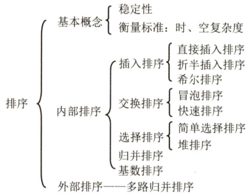

# 第8章  

## 排序  

### 【考纲内容】  

（一）排序的基本概念  
（二）插入排序直接插入排序；折半插入排序；希尔排序（shellsort）  
（三）交换排序冒泡排序（bubblesort）；快速排序  
（四）选择排序简单选择排序；堆排序  
（五）二路归并排序（merge sort）  
（六）基数排序  
（七）外部排序  
（八）排序算法的分析和应用  

### 【知识框架】  

  

### 【复习提示】  

堆排序、快速排序和归并排序是本章的重难点。读者应深入掌握各种排序算法的思想、排序过程（能动手模拟）和特征（初态的影响、复杂度、稳定性、适用性等)，通常以选择题的形式考查不同算法之间的对比。此外，对于一些常用排序算法的关键代码，要达到熟练编写的程度;看到某特定序列，读者应具有选择最优排序算法（根据排序算法特征）的能力。  