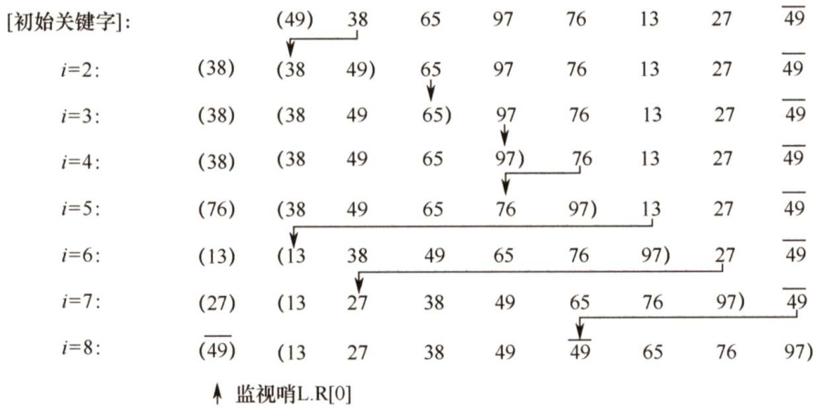
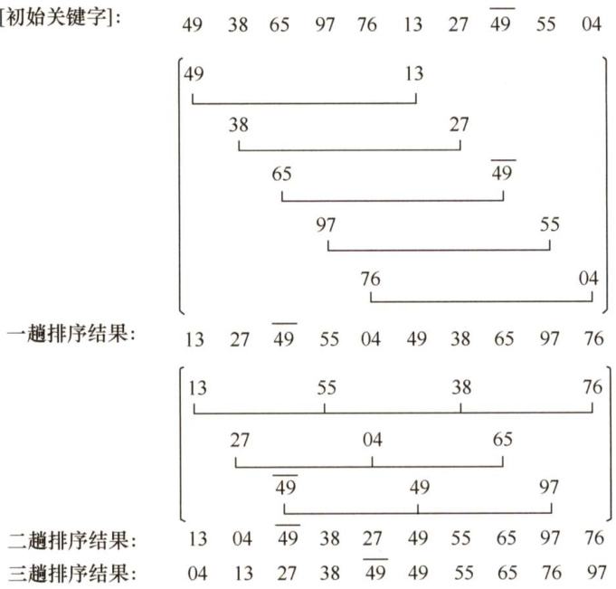
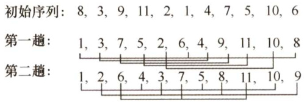

### 8.2 插入排序  

插入排序是一种简单直观的排序方法，其基本思想是每次将一个待排序的记录按其关键字大小插入前面已排好序的子序列，直到全部记录插入完成。由插入排序的思想可以引申出三个重要的排序算法：直接插入排序、折半插入排序和希尔排序。  

#### 8.2.1 直接插入排序  

根据上面的插入排序思想，不难得出一种最简单也最直观的直接插入排序算法。假设在排序过程中，待排序表L[1.n]在某次排序过程中的某一时刻状态如下：  

<html><body><table><tr><td>有序序列L[1..i-1]</td><td>L(i)</td><td>无序序列L[i+1...n]</td></tr></table></body></html>  

要将元素L(i)插入已有序的子序列L[1..i-1]，需要执行以下操作（为避免混淆，下面用  

L[]表示一个表，而用L()表示一个元素)：  

1）查找出L(i)在L[1...i-1]中的插入位置 $\mathrm{~k~}$ o  
2）将L[k.i-1]中的所有元素依次后移一个位置。  
3）将L（i)复制到L（k)。  

为了实现对L[1.n]的排序，可以将 $\mathtt{L}(2)\sim\mathtt{L}(\mathtt{n})$ 依次插入前面已排好序的子序列，初始L[1]可以视为是一个已排好序的子序列。上述操作执行 $n-1$ 次就能得到一个有序的表。插入排序在实现上通常采用就地排序（空间复杂度为 $O(1)$ )，因而在从后向前的比较过程中，需要反复把已排序元素逐步向后挪位，为新元素提供插入空间。  

下面是直接插入排序的代码，其中再次用到了我们前面提到的“哨兵”（作用相同)。  

void InsertSort（ElemType A[],intn）{int i,j;for( $i=2$ ： $\scriptstyle{\dot{1}}<=1$ ： $\dot{2}++$ ) //依次将 $A[2]\sim\Delta[n]$ 插入前面已排序序列if（A[i]<A[i-1]）{ //若A[i]关键码小于其前驱，将A[i]插入有序表$A[0]=A[\dot{2}]$ · //复制为哨兵，A[0]不存放元素for（j=i-1;A[0]<A[j];--j）//从后往前查找待插入位置$A[j+1]=A$ [j]； //向后挪位$A[j+1]=A[0]$ ： //复制到插入位置  

假定初始序列为49,38,65,97,76,13,27，49，初始时49可以视为一个已排好序的子序列，按照上述算法进行直接插入排序的过程如图8.1所示，括号内是已排好序的子序列。  

  
图8.1直接插入排序示例  

直接插入排序算法的性能分析如下：  

空间效率：仅使用了常数个辅助单元，因而空间复杂度为 $O(1)$ o  

时间效率：在排序过程中，向有序子表中逐个地插入元素的操作进行了 $n-1$ 趟，每趟操作都分为比较关键字和移动元素，而比较次数和移动次数取决于待排序表的初始状态。  

在最好情况下，表中元素已经有序，此时每插入一个元素，都只需比较一次而不用移动元素，因而时间复杂度为 $O(n)$ o  

在最坏情况下，表中元素顺序刚好与排序结果中的元素顺序相反（逆序)，总的比较次数达到最大，为 $\sum_{i=2}^{n}i$ ，总的移动次数也达到最大，为 $\sum_{i=2}^{n}(i+1)$ 。  

平均情况下，考虑待排序表中元素是随机的，此时可以取上述最好与最坏情况的平均值作为平均情况下的时间复杂度，总的比较次数与总的移动次数均约为 $n^{2}/4$ 8因此，直接插入排序算法的时间复杂度为 $O(n^{2})$ 0  

稳定性：由于每次插入元素时总是从后向前先比较再移动，所以不会出现相同元素相对位置发生变化的情况，即直接插入排序是一个稳定的排序方法。  

适用性：直接插入排序算法适用于顺序存储和链式存储的线性表。为链式存储时，可以从前往后查找指定元素的位置。  

注意：大部分排序算法都仅适用于顺序存储的线性表。  

#### 8.2.2 折半插入排序  

从直接插入排序算法中，不难看出每趟插入的过程中都进行了两项工作： $\textcircled{1}$ 从前面的有序子表中查找出待插入元素应该被插入的位置； $\textcircled{2}$ 给插入位置腾出空间，将待插入元素复制到表中的插入位置。注意到在该算法中，总是边比较边移动元素。下面将比较和移动操作分离，即先折半查找出元素的待插入位置，然后统一地移动待插入位置之后的所有元素。当排序表为顺序表时，可以对直接插入排序算法做如下改进：由于是顺序存储的线性表，所以查找有序子表时可以用折半查找来实现。确定待插入位置后，就可统一地向后移动元素。算法代码如下：  

void InsertSort（ElemType A[],int n）{  

int i,j,low,high,mid;  
for( $i=2$ ： $i<=n$ . $\dot{2}++$ ）{ //依次将 $A[2]\sim\Delta[n]$ 插入前面的已排序序列$A[0]=A[i]$ · //将A[i]暂存到A[0]low $^{\circ}$ ;high $=\dot{2}-1$ . //设置折半查找的范围while(low $<=$ high){ //折半查找（默认递增有序）mid $\L=$ （low+high）/2; //取中间点if（A[mid]>A[0])high $\scriptstyle=$ mid-1；//查找左半子表elselow $\c=$ mid $^{+1}$ · //查找右半子表广for $j=i-1$ ;j>=high $+1$ ;--j）$A[j+1]=A$ [j]； //统一后移元素，空出插入位置A[high $+1]=A1$ 0]; //插入操作  

从上述算法中，不难看出折半插入排序仅减少了比较元素的次数，约为 $O(n\mathrm{log}_{2}n)$ ，该比较次数与待排序表的初始状态无关，仅取决于表中的元素个数 $n$ ；而元素的移动次数并未改变，它依赖于待排序表的初始状态。因此，折半插入排序的时间复杂度仍为 $O(n^{2})$ ，但对于数据量不很大的排序表，折半插入排序往往能表现出很好的性能。折半插入排序是一种稳定的排序方法。  

#### 8.2.3 希尔排序  

从前面的分析可知，直接插入排序算法的时间复杂度为 $O(n^{2})$ ，但若待排序列为“正序”时，其时间复杂度可提高至 $O(n)$ ，由此可见它更适用于基本有序的排序表和数据量不大的排序表。希尔排序正是基于这两点分析对直接插入排序进行改进而得来的，又称缩小增量排序。  

希尔排序的基本思想是：先将待排序表分割成若干形如 $L[i,i+d,i+2d,\cdots,i+k d]$ 的“特殊”子表，即把相隔某个“增量”的记录组成一个子表，对各个子表分别进行直接插入排序，当整个表中的元素已呈“基本有序”时，再对全体记录进行一次直接插入排序。  

希尔排序的过程如下：先取一个小于 $n$ 的步长 $d_{1}$ ，把表中的全部记录分成 $d_{1}$ 组，所有距离为$d_{1}$ 的倍数的记录放在同一组，在各组内进行直接插入排序；然后取第二个步长 $d_{2}<d_{1}$ ，重复上述过程，直到所取到的 $d_{t}=1$ ，即所有记录已放在同一组中，再进行直接插入排序，由于此时已经具有较好的局部有序性，故可以很快得到最终结果。到目前为止，尚未求得一个最好的增量序列。仍以8.2.1节的关键字为例，第一趟取增量 $d_{1}=5$ ，将该序列分成5个子序列，即图中第2行至第6行，分别对各子序列进行直接插入排序，结果如第7行所示；第二趟取增量 $d_{2}=3$ ，分别对3个子序列进行直接插入排序，结果如第11行所示；最后对整个序列进行一趟直接插入排序，整个排序过程如图8.2所示。  

  
图8.2希尔排序示例  

希尔排序算法的代码如下：  

void Shellsort（ElemType A[],intn）{  
//A[0]只是暂存单元，不是哨兵，当 $j<=0$ 时，插入位置已到for $d k=n/2$ . $\mathrm{d}\mathbf{k}>=1$ $\scriptstyle{\mathrm{dk}=\mathrm{dk}}/2$ ） //步长变化for( $i=\mathrm{d}k+1$ ： $\scriptstyle{\dot{1}}<=1$ . $++\dot{2}$ ）if（A[i] $<\tt A$ [i-dk]）{ //需将A[i]插入有序增量子表$A[0]=A[\dot{1}]$ . //暂存在A[0]for( $\dot{\b{\mathscr{I}}}=\dot{\b{\mathscr{I}}}$ -dk;j>0&&A[0]<A[j]；j $-=d k$ )$A[j+d k]=A[j$ ]； //记录后移，查找插入的位置$A[j+d k]=A[0]$ ： //插入}//if  

希尔排序算法的性能分析如下：  

空间效率：仅使用了常数个辅助单元，因而空间复杂度为 $O(1)$ 0  

时间效率：由于希尔排序的时间复杂度依赖于增量序列的函数，这涉及数学上尚未解决的难题，所以其时间复杂度分析比较困难。当 $n$ 在某个特定范围时，希尔排序的时间复杂度约为 $O(n^{1.3})$ o在最坏情况下希尔排序的时间复杂度为 $O(n^{2})$ 0  

稳定性：当相同关键字的记录被划分到不同的子表时，可能会改变它们之间的相对次序，因此希尔排序是一种不稳定的排序方法。例如，图8.2中49与49的相对次序已发生了变化。  

适用性：希尔排序算法仅适用于线性表为顺序存储的情况。  

#### 8.2.4 本节试题精选  

#### 一、单项选择题  

01．对5个不同的数据元素进行直接插入排序，最多需要进行的比较次数是（）。  

A.8 B.10 C.15 D. 25  

2.在待排序的元素序列基本有序的前提下，效率最高的排序方法是（）。  

A．直接插入排序B．简单选择排序 C．快速排序 D.归并排序  

03．对有 $n$ 个元素的顺序表采用直接插入排序算法进行排序，在最坏情况下所需的比较次数是（）；在最好情况下所需的比较次数是（）。  

A. $n-1$ B. $n+1$ C. n/2 D. $n(n-1)/2$  

数据序列{8，10,13，4,6,7,22,2,3}只能是（）两趟排序后的结果。  

A．简单选择排序B．起泡排序 C.直接插入排序 D.堆排序  

)5．用直接插入排序算法对下列4个表进行（从小到大）排序，比较次数最少的是（）。  

A.94,32,40,90,80,46,21,69 B. 21,32,46,40,80,69,90,94   
C.32,40,21,46,69,94,90,80 D. 90,69,80,46,21,32,94, 40  

06．在下列算法中，（）算法可能出现下列情况：在最后一趟开始之前，所有元素都不在最终位置上。  

A．堆排序 B．冒泡排序 C．直接插入排序 D．快速排序  

07．希尔排序属于（）。  

A．插入排序 B．交换排序 C．选择排序 D.归并排序  

08．对序列{15,9,7,8,20,-1,4}用希尔排序方法排序，经一趟后序列变为{15,-1,4,8,20,9,7}，则该次采用的增量是（）。  

A.1 B.4 C.3 D.2  

09．若对于第9题中的序列，经一趟排序后序列变成 $\{9,15,7,8,20,-1,4\}$ ，则采用的是下列的（）。  

A.选择排序 B.快速排序 C．直接插入排序 D．冒泡排序  

10.对序列{98,36,-9,0,47,23,1,8,10,7}采用希尔排序，下列序列（）是增量为4的一趟排序结果。  

A.{10, 7,-9,0,47,23,1,8,98,36} B.{-9,0,36,98, 1,8,23,47, 7,10}C.{36,98,-9, 0,23, 47, 1,8, 7, 10} D.以上都不对  

11．折半插入排序算法的时间复杂度为（）。  

A. O(n) B. $O(n\mathrm{log}_{2}n)$ C. $O(n^{2})$ D. $O(n^{3})$  

12.有些排序算法在每趟排序过程中，都会有一个元素被放置到其最终位置上，（）算法不会出现此种情况。  

A．希尔排序 B．堆排序 C.冒泡排序 D.快速排序  

13．以下排序算法中，不稳定的是（）。  

A．冒泡排序 B．直接插入排序 C．希尔排序 D.归并排序  

14.以下排序算法中，稳定的是（）。  

A.快速排序 B．堆排序 C．直接插入排序D．简单选择排序  

15.【2009统考真题】若数据元素序列{11,12,13,7,8,9,23,4,5}是采用下列排序方法之一得到的第二趟排序后的结果，则该排序算法只能是（）。  

A．冒泡排序 B．插入排序 C．选择排序 D.2路归并排序  

16.【2012统考真题】对同一待排序序列分别进行折半插入排序和直接插入排序，两者之间可能的不同之处是（）。  

A.排序的总趟数 B.元素的移动次数C.使用辅助空间的数量 D．元素之间的比较次数  

17.【2014统考真题】用希尔排序方法对一个数据序列进行排序时，若第1趟排序结果为9,1，4,13，7,8,20，23，15，则该趟排序采用的增量（间隔）可能是（）。  

A.2 B.3 C.4 D.5  

18.【2015统考真题】希尔排序的组内排序采用的是（）。  

A．直接插入排序B．折半插入排序 C．快速排序 D.归并排序  

19.【2018统考真题】对初始数据序列(8,3,9,11,2,1,4,7,5,10,6)进行希尔排序。若第一趟排序结果为(1,3,7,5,2,6,4,9,11,10,8)，第二趟排序结果为(1,2,6,4,3,7,5,8,11,10,9)，则两趟排序采用的增量（间隔）依次是（）。  

A.3,1 B.3,2 C.5,2 D.5,3  

#### 二、综合应用题  

01.给出关键字序列{4，5，1，2，6，3}的直接插入排序过程。  

02.给出关键字序列{50,26,38,80,70,90,8,30,40,20}的希尔排序过程（取增量序列为 $d=\{5,$ 3,1}，排序结果为从小到大排列）。  

#### 8.2.5 答案与解析  

#### 一、单项选择题  

01.B  

直接插入排序在最坏的情况下要做 $n(n-1)/2$ 次关键字的比较，当 $n=5$ 时，关键字的比较次数为10(未考虑与哨兵的比较)。  

02.A  

由于这里的序列基本有序，使用直接插入排序算法的时间复杂度接近 $O(n)$ ，而使用其他算法的时间复杂度均大于 $O(n)$ 0  

03.D、A  

待排序表为反序时，直接插入排序需要进行 $n(n-1)/2$ 次比较（从前往后依次需要比较 $1,2,\cdots$ 。$n-1$ 次)；待排序表为正序时，只需进行 $n-1$ 次比较。  

04.C  

冒泡排序和选择排序经过两趟排序后，应该有两个最大（或最小）元素放在其最终位置；插入排序经过两趟排序后，前3个元素应该是局部有序的。只有可能是快速排序。  

注意：在排序过程中，每趟都能确定一个元素在其最终位置的有冒泡排序、简单选择排序、堆排序、快速排序，其中前三者能形成全局有序的子序列，后者能确定枢轴元素的最终位置。  

05.B  

首先，越接近正序的序列，比较次数应是越少的；而越接近逆序，比较次数越多。不难得出  

B 和C 是比较接近正序的，然后分别判断两个序列的比较次数，以B为例：第一趟，插入32，比较1次；第二趟，插入46，比较1次；第三趟，插入40，由于40比46小但比32大，所以比较2次；第四趟，插入80，比较1次；第五趟，插入69，比较2次共比较9次。同理求出C的比较次数为11次。故选B。  

06.C  

在直接插入排序中，若待排序列中的最后一个元素应插入表中的第一个位置，则前面的有序子序列中的所有元素都不在最终位置上。  

07.A  

希尔排序是对直接插入排序算法改进后提出来的，本质上仍属于插入排序的范畴。  

08.B  

希尔排序将序列分成若干组，记录只在组内进行交换。由观察可知，经过一趟后9和-1交换，7和4交换，可知增量为4。  

09.C  

前两个元素局部已经有序，很明显一趟直接插入排序算法有效。再排除其他算法即可。  

10.A  

增量为4意味着所有相距为4的记录构成一组，然后在组内进行直接插入排序，经观察，只有选项A满足要求。  

11.C  

虽然折半插入排序是对直接插入排序的改进，但它改进的只是比较的次数，而移动次数未发生变化，时间复杂度仍为 $O(n^{2})$ 。  

12.A  

由于希尔排序是基于插入排序算法而提出的，它不一定在每趟排序过程后将某一元素放置到最终位置上。  

13.C  

希尔排序是一种复杂的插入排序方法，它是一种不稳定的排序方法。  

14. C  

基于插入、交换、选择的三类排序方法中，通常简单方法是稳定的（直接插入、折半插入、冒泡)，但有一个例外就是简单选择，复杂方法都是不稳定的(希尔、快排、堆排)。  

15.B  

每趟冒泡和选择排序后，总会有一个元素被放置在最终位置上。显然，这里{11,12)和{4,5)所处的位置并不是最终位置，因此不可能是冒泡和选择排序。2路归并算法经过第二趟后应该是  

每4个元素有序的，但{11,12,13,7并非有序，因此也不可能是2路归并排序。  

16.D  

折半插入排序与直接插入排序都将待插入元素插入前面的有序子表，区别是：确定当前记录在前面有序子表中的位置时，直接插入排序采用顺序查找法，而折半插入排序采用折半查找法。排序的总趟数取决于元素个数 $n$ ，两者都是 $n-1$ 趟。元素的移动次数都取决于初始序列，两者相同。使用辅助空间的数量也都是 $O(1)$ 。折半插入排序的比较次数与序列初态无关，为 $O(n\mathrm{log}_{2}n)$ .而直接插入排序的比较次数与序列初态有关，为 $O(n){\sim}O(n^{2})$ 。  

17.B  

首先，第二个元素为1，是整个序列中的最小元素，因此可知该希尔排序为从小到大排序。然后考虑增量问题，若增量为2，则第1+2个元素4明显比第1个元素9要小，A排除；若增量为3，则第 $i,i+3,i+6$ （ $i=1,2,3$ ）个元素都为有序序列，符合希尔排序的定义；若增量为4，则第1个元素9比第 $1+4$ 个元素7要大，C排除；若增量为5，则第1个元素9比第1+5个元素8要大，D排除，选 $\mathbf{B}$ 0  

18.A  

希尔排序的思想是：先将待排元素序列分割成若干子序列（由相隔某个“增量”的元素组成)，分别进行直接插入排序，然后依次缩减增量再进行排序，待整个序列中的元素基本有序（增量足够小）时，再对全体元素进行一次直接插入排序。  

19.D  

如下图所示。  

第一趟分组：8,1,6；3,4；9,7；11,5；2,10；间隔为5，排序后组内递增。  
第二趟分组：1,5,4,10；3,2,9,8；7,6,11；间隔为3，排序后组内递增。  

  

故答案选D。  

#### 二、综合应用题  

01.【解答】  

直接插入排序过程如下。  

初始序列： $\begin{array}{r l}&{4,5,1,2,6,3}\\ &{4,5,1,2,6,3}\\ &{1,4,5,2,6,3}\\ &{1,2,4,5,6,3}\\ &{1,2,4,5,6,3}\\ &{1,2,3,4,5,6,}\\ &{1,2,3,4,5,6}\end{array}$ 第一趟： （将5插入{4})第二趟： （将1插入{4,5})第三趟： （将2插入{1,4,5}）第四趟： （将6插入{1,2,4,5}）第五趟： （将3插入{1,2,4,5,6}）  

02.【解答】  

原始序列： $\begin{array}{l}{50,26,38,80,70,90,8,30,40,20}\\ {50,8,30,40,20,90,26,38,80,70}\\ {26,8,30,40,20,80,50,38,90,70}\\ {8,20,26,30,38,40,50,70,80,90}\end{array}$   
第一趟(增量5)：  
第二趟 (增量3)：  
第三趟(增量1)：