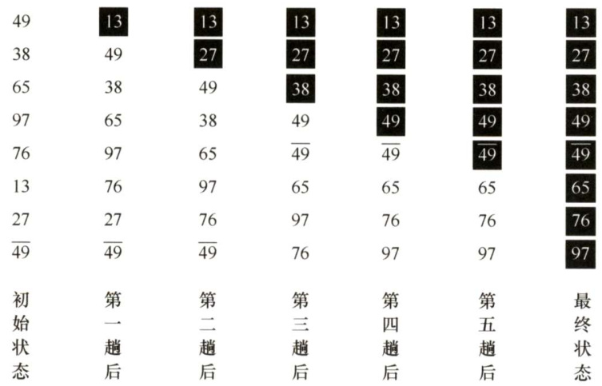
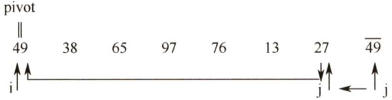
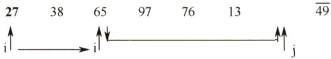
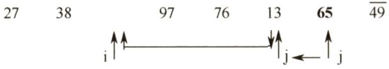
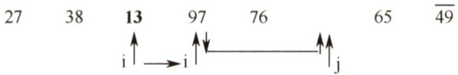
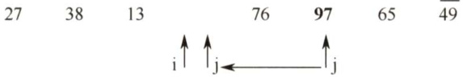
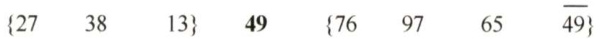

### 8.3 交换排序  

所谓交换，是指根据序列中两个元素关键字的比较结果来对换这两个记录在序列中的位置。基于交换的排序算法很多，本书主要介绍冒泡排序和快速排序，其中冒泡排序算法比较简单，一般不会单独考查，通常会重点考查快速排序算法的相关内容。  

#### 8.3.1 冒泡排序  

冒泡排序的基本思想是：从后往前（或从前往后）两两比较相邻元素的值，若为逆序（即$\mathbb{A}[\mathrm{i}-1]>\mathbb{A}[\mathrm{i}])$ ，则交换它们，直到序列比较完。我们称它为第一趟冒泡，结果是将最小的元素交换到待排序列的第一个位置（或将最大的元素交换到待排序列的最后一个位置)，关键字最小的元素如气泡一般逐渐往上“漂浮”直至“水面”（或关键字最大的元素如石头一般下沉至水底)。下一趟冒泡时，前一趟确定的最小元素不再参与比较，每趟冒泡的结果是把序列中的最小元素（或最大元素）放到了序列的最终位置……这样最多做 $n-1$ 趟冒泡就能把所有元素排好序。  

图8.3所示为冒泡排序的过程，第一趟冒泡时： $27<{\overline{{49}}}$ ，不交换； $13<27$ ，不交换； $76>13$ ，交换； $97>13$ ，交换； $65>13$ ，交换； $38>13$ ，交换； $49>13$ ，交换。通过第一趟冒泡后，最小元素已交换到第一个位置，也是它的最终位置。第二趟冒泡时对剩余子序列采用同样方法进行排序，以此类推，到第五趟结束后没有发生交换，说明表已有序，冒泡排序结束。  

  
图8.3 冒泡排序示例  

冒泡排序算法的代码如下：  

void BubbleSort（ElemType A[],int n）{for $\scriptstyle{\dot{1}}=0$ ;i<n-1; $\dot{2}++$ ）flag $\mathbf{\Sigma}=$ false; //表示本趟冒泡是否发生交换的标志for $\scriptstyle{\dot{\mathcal{I}}}={\boldsymbol{\mathrm{n}}}-1$ $j>i$ ;j--） //一趟冒泡过程  

if（A[j-1]>A[j]）{ //若为逆序swap（A[j-1],A[j]）；//交换flag $\c=$ true;if(flag $\scriptstyle==$ false)return; //本趟遍历后没有发生交换，说明表已经有序  

冒泡排序的性能分析如下：  

空间效率：仅使用了常数个辅助单元，因而空间复杂度为 $O(1)$ 。  

时间效率：当初始序列有序时，显然第一趟冒泡后flag依然为false（本趟冒泡没有元素交换)，从而直接跳出循环，比较次数为 $n-1$ ，移动次数为0，从而最好情况下的时间复杂度为$O(n)$ ；当初始序列为逆序时，需要进行 $n-1$ 趟排序，第 $i$ 趟排序要进行 $n-i$ 次关键字的比较，而且每次比较后都必须移动元素3次来交换元素位置。这种情况下，  

从而，最坏情况下的时间复杂度为 $O(n^{2})$ ，其平均时间复杂度也为 $O(n^{2})$ 6稳定性：由于 $i>j$ 且 $\boldsymbol{A}[i]=\boldsymbol{A}[j]$ 时，不会发生交换，因此冒泡排序是一种稳定的排序方法。  

注意：冒泡排序中所产生的有序子序列一定是全局有序的（不同于直接插入排序），也就是说，有序子序列中的所有元素的关键字一定小于或大于无序子序列中所有元素的关键字，这样每趟排序都会将一个元素放置到其最终的位置上。  

#### 8.3.2 快速排序  

快速排序的基本思想是基于分治法的：在待排序表L[1..n]中任取一个元素pivot 作为枢轴（或基准，通常取首元素)，通过一趟排序将待排序表划分为独立的两部分L[1.k-1]和$\mathbb{L}\left[\mathbb{k}{+}1...\mathbb{n}\right]$ ，使得L[1..k-1]中的所有元素小于pivot， $\mathbb{I}\left[\mathbb{k}{+}\mathbb{1}...\mathbb{n}\right]$ 中的所有元素大于等于pivot，则pivot放在了其最终位置L(k)上，这个过程称为一趟快速排序（或一次划分）。然后分别递归地对两个子表重复上述过程，直至每部分内只有一个元素或空为止，即所有元素放在了其最终位置上。  

一趟快速排序的过程是一个交替搜索和交换的过程，下面通过实例来介绍，附设两个指针i和j，初值分别为low和high，取第一个元素49为枢轴赋值到变量pivot。  

指针j从high往前搜索找到第一个小于枢轴的元素27，将27交换到i所指位置。  

  

指针i从1ow往后搜索找到第一个大于枢轴的元素65，将65交换到j所指位置。  

  

指针」继续往前搜索找到小于枢轴的元素13，将13交换到i所指位置。  

  

指针i继续往后搜索找到大于枢轴的元素97，将97交换到j所指位置。  

  

指针」继续往前搜索小于枢轴的元素，直至 $\scriptstyle\dot{1}==\dot{]}$ 。  

  

此时，指针i（ $\scriptstyle=={\dot{\operatorname{J}}}$ ）之前的元素均小于49，指针i之后的元素均大于等于49，将49放在i所指位置即其最终位置，经过一趟划分，将原序列分割成了前后两个子序列。  

  

按照同样的方法对各子序列进行快速排序，若待排序列中只有一个元素，显然已有序。  

{13} 27 {38} {49 65 76 {97}结束 结束 $\overline{{49}}$ $\{65\}$ 结束结束{13 27 38 49 49 65 76 97}对算法的最好理解方式是手动地模拟一遍这些算法。  

假设划分算法已知，记为 Partition()，返回的是上述的 k，注意到L(k)已在最终的位置，因此可以先对表进行划分，而后对两个表调用同样的排序操作。因此可以递归地调用快速排序算法进行排序，具体的程序结构如下：  

void QuickSort（ElemType A[],int low,int high）{if（low<high）{ //递归跳出的条件//Partition（）就是划分操作，将表A[low..high]划分为满足上述条件的两个子表int pivotpos $\c=$ Partition（A,low,high); //划分QuickSort（A，low，pivotpos-1）；//依次对两个子表进行递归排序QuickSort(A,pivotpos $+1$ ,high);  

从上面的代码不难看出快速排序算法的关键在于划分操作，同时快速排序算法的性能也主要取决于划分操作的好坏。从快速排序算法提出至今，已有许多不同的划分操作版本，但考研所考查的快速排序的划分操作基本以严蔚敏的教材《数据结构》为主。假设每次总以当前表中第一个元素作为枢轴来对表进行划分，则将表中比枢轴大的元素向右移动，将比枢轴小的元素向左移动，使得一趟Partition（)操作后，表中的元素被枢轴值一分为二。代码如下：  

int Partition（ElemType A[]，int low，int high）{//-趟划分ElemType pivot $\mathtt{=A}$ [low]；//将当前表中第一个元素设为枢轴，对表进行划分while（low<high）{ //循环跳出条件while（low<high&&A[high] $>=$ pivot)--high;A[low] $\mathtt{\Gamma}=\mathtt{A}$ [high]; //将比枢轴小的元素移动到左端while（low<high&&A[low] $<=$ pivot) $++10w$ .A[high] $\mathtt{\Gamma}=\mathtt{A}$ [low]; //将比枢轴大的元素移动到右端1A[low] $\c=$ pivot; //枢轴元素存放到最终位置return low; //返回存放枢轴的最终位置  
)  

快速排序算法的性能分析如下：  

空间效率：由于快速排序是递归的，需要借助一个递归工作栈来保存每层递归调用的必要信息，其容量应与递归调用的最大深度一致。最好情况下为 $O(\log_{2}n)$ ；最坏情况下，因为要进行 $n-1$ 次递归调用，所以栈的深度为 $O(n)$ ；平均情况下，栈的深度为 $O(\log_{2}n)$ 。  

时间效率：快速排序的运行时间与划分是否对称有关，快速排序的最坏情况发生在两个区域分别包含 $n-1$ 个元素和0个元素时，这种最大限度的不对称性若发生在每层递归上，即对应于初始排序表基本有序或基本逆序时，就得到最坏情况下的时间复杂度为 $O(n^{2})$ 。 2  

有很多方法可以提高算法的效率：一种方法是尽量选取一个可以将数据中分的枢轴元素，如从序列的头尾及中间选取三个元素，再取这三个元素的中间值作为最终的枢轴元素；或者随机地从当前表中选取枢轴元素，这样做可使得最坏情况在实际排序中几乎不会发生。  

在最理想的状态下，即Partition（)可能做到最平衡的划分，得到的两个子问题的大小都不可能大于 $n/2$ ，在这种情况下，快速排序的运行速度将大大提升，此时，时间复杂度为 $O(n\mathrm{log}_{2}n)$ 。好在快速排序平均情况下的运行时间与其最佳情况下的运行时间很接近，而不是接近其最坏情况下的运行时间。快速排序是所有内部排序算法中平均性能最优的排序算法。  

稳定性：在划分算法中，若右端区间有两个关键字相同，且均小于基准值的记录，则在交换到左端区间后，它们的相对位置会发生变化，即快速排序是一种不稳定的排序方法。例如，表 $L=$ {3,2,2}，经过一趟排序后 $L=\{2,2,3\}$ ，最终排序序列也是 $L=\{2,2,3\}$ ，显然，2与2的相对次序已发生了变化。  

注意：在快速排序算法中，并不产生有序子序列，但每趟排序后会将枢轴（基准）元素放到其最终的位置上。  

#### 8.3.3 本节试题精选  

#### 一、单项选择题  

01.对 $n$ 个不同的元素利用冒泡法从小到大排序，在（）情况下元素交换的次数最多。  

A.从大到小排列好的 B．从小到大排列好的C.元素无序 D．元素基本有序  

02．若用冒泡排序算法对序列{10,14,26,29,41,52}从大到小排序，则需进行（）次比较。  

A.3 B. 10 C.15 D.25  

03.用某种排序方法对线性表{25,84,21,47,15,27,68,35,20}进行排序时，元素序列的变化情况如下：1)25,84,21,47,15,27,68,35,202）20,15,21,25,47,27,68,35,843）15,20,21,25,35,27,47,68,844）15,20,21,25,27,35,47,68,84则所采用的排序方法是（）。  

A．选择排序 B．插入排序 C.2路归并排序 D.快速排序  

04.一组记录的关键码为(46,79,56,38,40,84)，则利用快速排序的方法，以第一个记录为基准，从小到大得到的一次划分结果为（）。  

A.(38,40,46,56,79,84) B.(40,38,46,79,56,84) C. (40,38,46,56,79,84) D.(40,38,46,84,56,79)  

05.快速排序算法在（）情况下最不利于发挥其长处。  

A．要排序的数据量太大 B．要排序的数据中含有多个相同值  

C.要排序的数据个数为奇数 D.要排序的数据已基本有序  

06.就平均性能而言，目前最好的内部排序方法是（）。  

A．冒泡排序 B．直接插入排序 C．希尔排序 D.快速排序  

07．数据序列 $F=\left\{2,1,4,9,8,10,6,20\right\}$ 只能是下列排序算法中的（）两趟排序后的结果。  

A．快速排序 B．冒泡排序 C．选择排序 D.插入排序  

08．对数据序列 $\{8,9,10,4,5,6,20,1,2\}$ 采用冒泡排序（从后向前次序进行，要求升序），需要进行的趟数至少是（）。  

A.3 B.4 C.5 D.8  

09.对下列关键字序列用快排进行排序时，速度最快的情形是（），速度最慢的情形是（）。  

A.{21,25,5,17,9,23,30} B.{25,23,30,17,21,5,9} C.{21,9,17,30,25,23,5} D.{5,9,17,21,23,25,30}  

10.对下列4个序列，以第一个关键字为基准用快速排序算法进行排序，在第一趟过程中移动记录次数最多的是（）。  

A. 92,96,88,42,30,35,110,100 B. 92,96,100,110,42,35,30,88   
C. 100,96,92,35,30, 110,88, 42 D. 42,30,35,92, 100,96,88, 110  

11．下列序列中，（）可能是执行第一趟快速排序后所得到的序列。  

I.{68,11,18,69,23,93,73} 'II.{68,11,69,23, 18,93, 73} III.{93, 73,68,11,69,23,18} IV.{68,11,69,23,18,73,93}  

A.I、IV B．Ⅱ、IⅢI C.III、IV D.只有IV对 $n$ 个关键字进行快速排序，最大递归深度为（），最小递归深度为（）  

A.1 B. n C. $\log_{2}n$ D. nlogn  

13.【2010统考真题】对一组数据(2,12,16,88,5,10)进行排序，若前3趟排序结果如下：第一趟排序结果：2,12,16,5,10,88第二趟排序结果：2,12,5,10,16,88第三趟排序结果：2,5,10,12,16,88则采用的排序方法可能是（）。  

A．冒泡排序 B．希尔排序 C．归并排序 D．基数排序  

14.【2010统考真题】采用递归方式对顺序表进行快速排序。下列关于递归次数的叙述中，正确的是（）。  

A．递归次数与初始数据的排列次序无关B．每次划分后，先处理较长的分区可以减少递归次数C．每次划分后，先处理较短的分区可以减少递归次数D．递归次数与每次划分后得到的分区的处理顺序无关  

15.【2011统考真题】为实现快速排序算法，待排序序列宜采用的存储方式是（）  

A．顺序存储 B．散列存储 C.链式存储 D.索引存储  

6.【2014统考真题】下列选项中，不可能是快速排序第2趟排序结果的是（）。  

A.2,3,5,4,6,7,9 B.2,7,5,6,4,3,9   
C. 3,2, 5,4, 7,6,9 D.4,2,3,5,7,6,9  

17.【2019统考真题】排序过程中，对尚未确定最终位置的所有元素进行一遍处理称为一“趟”。下列序列中，不可能是快速排序第二趟结果的是（）。  

A.5,2,16,12,28,60,32,72 B.2,16,5,28,12,60,32,72   
C. 2,12,16,5,28,32,72,60 D.5,2,12,28,16,32,72,60  

#### 二、综合应用题  

01．在使用非递归方法实现快速排序时，通常要利用一个栈记忆待排序区间的两个端点。能否用队列来实现这个栈？为什么？  

02．编写双向冒泡排序算法，在正反两个方向交替进行扫描，即第一趟把关键字最大的元素放在序列的最后面，第二趟把关键字最小的元素放在序列的最前面，如此反复进行。  

03．已知线性表按顺序存储，且每个元素都是不相同的整数型元素，设计把所有奇数移动到所有偶数前边的算法（要求时间最少，辅助空间最少）。  

04.试重新编写考点精析中的快速排序的划分算法，使之每次选取的枢轴值都是随机地从当前子表中选择的。  

05.试编写一个算法，使之能够在数组L[1...n]中找出第 $k$ 小的元素（即从小到大排序后处于第 $k$ 个位置的元素）。  

06．荷兰国旗问题：设有一个仅由红、白、蓝三种颜色的条块组成的条块序列，请编写一个时间复杂度为 $O(n)$ 的算法，使得这些条块按红、白、蓝的顺序排好，即排成荷兰国旗图案。  

07.【2016统考真题】已知由 $n$ （ $n\geq2$ ）个正整数构成的集合 $A=\{a_{k}|0\leq k<n\}$ ，将其划分为两个不相交的子集 $\scriptstyle A_{1}$ 和 $A_{2}$ ，元素个数分别是 $n_{1}$ 和 $n_{2}$ ， $\scriptstyle A_{1}$ 和 $\mathbf{\nabla}A_{2}$ 中的元素之和分别为 $S_{1}$ 和 $S_{2}$ 。设计一个尽可能高效的划分算法，满足 $|n_{1}-n_{2}|$ 最小且 $\cdot|S_{1}-S_{2}|$ 最大。要求：  

1）给出算法的基本设计思想。  
2）根据设计思想，采用C或 $\mathrm{C}{+}{+}$ 语言描述算法，关键之处给出注释。  
3）说明你所设计算法的平均时间复杂度和空间复杂度。  

#### 8.3.4 答案与解析  

#### 一、单项选择题  

01.A  

通常情况下，冒泡排序最少进行1次冒泡，最多进行 $n-1$ 次冒泡。初始序列为逆序时，需进行 $n-1$ 次冒泡，并且需要交换的次数最多。初始序列为正序时，进行1次冒泡（无交换）就可以终止算法。  

02.C  

冒泡排序始终在调整“逆序”，因此交换次数为排列中逆序的个数。对逆序序列进行冒泡排序，每个元素向后调整时都需要进行比较，因此共需要比较 $5+4+3+2+1=15$ 次。  

03.D  

选择排序在每趟结束后可以确定一个元素的最终位置，不对。插入排序，第 $i$ 趟后前 $i+1$ 个元素应该是有序的，不对。第2趟{20,15}和{21,25}是反序的，因此不是归并排序。快速排序每趟都将基准元素放在其最终位置，然后以它为基准将序列划分为两个子序列。观察题中的排序过程，可知是快速排序。  

04.C  

以46为基准元素，首先从后向前扫描比46小的元素，并与之进行交换，而后从前向后扫描比46大的元素并将46与该元素交换，得到(40,46,56,38,79,84)。此后，继续重复从后向前扫描与从前往后扫描的操作，直到46处于最终位置，答案选C。  

05.D  

当待排序数据为基本有序时，每次选取第 $n$ 个元素为基准，会导致划分区间分配不均匀，不利于发挥快速排序算法的优势。相反，当待排序数据分布较为随机时，基准元素能将序列划分为两个长度大致相等的序列，这时才能发挥快速排序的优势。  

06.D  

这里问的是平均性能，A、B的平均性能都会达到 $O(n^{2})$ ，而希尔排序虽然大大降低了直接插入排序的时间复杂度，但其平均性能不如快速排序。另外，虽然众多排序算法的平均时间复杂度也是 $O(n\log_{2}n)$ ，但快速排序算法的常数因子是最小的。  

07.A  

若为插入排序，则前三个元素应该是有序的，显然不对。而冒泡排序和选择排序经过两趟排序后应该有两个元素处于最终位置（最左/右端)，无论是按从小到大还是从大到小排序，数据序列中都没有两个满足这样的条件的元素，因此只可能选A。  

【另解】先写出排好序的序列，并和题中的序列做对比。  

题中序列：2 1 4 9 8 10 6 20  

已排好序序列：1 2 4 6 8 9 10 20  

在已排好序的序列中，与题中序列相同元素的有4、8和20，最左和最右两个元素与题中的序列不同，故不可能是冒泡排序、选择排序或插入排序。  

08.C  

从后向前“冒泡”的过程为，第1趟{1,8,9,10,4,5,6,20,2}，第2趟{1,2,8,9,10,4,5,6,20}，第3趟{1,2,4,8,9,10,5,6,20}，第4趟{1,2,4,5,8,9,10,6,20}，第5趟 $\{1,2,4,5,6,8,9,10,20\}$ ，经过第5趟冒泡后，序列已经全局有序，故选C。实际每趟冒泡发生交换后可以判断是否会导致新的逆序对，如果不会产生，则本趟冒泡之后序列全局有序，所以最少5趟即可。  

09.A、D  

由考点精析可知，当每次的枢轴都把表等分为长度相近的两个子表时，速度是最快的；当表本身已经有序或逆序时，速度最慢。选项D中的序列已按关键字排好序，因此它是最慢的，而A中第一趟枢轴值21将表划分为两个子表{9,17,5}和{25,23,30}，而后对两个子表划分时，枢轴值再次将它们等分，所以该序列是快速排序最优的情况，速度最快。其他选项可以类似分析。  

10.B  

对各序列分别执行一趟快速排序，可做如下分析（以A为例)：由于枢轴值为92，因此 35移动到第一个位置，96移动到第六个位置，30移动到第二个位置，再将枢轴值移动到30所在的单元，即第五个位置，所以A中序列移动的次数为4。同样，可以分析出B中序列的移动次数为  

8，C中序列的移动次数为4，D中序列的移动次数为2。  

11.C  

显然，若按从小到大排序，则最终有序的序列是{11,18,23,68,69,73,93}；若按从大到小排序，则最终有序的序列是{93,73,69,68,23,18,11}。对比可知I、ⅡI中没有处于最终位置的元素，故I、Ⅱ都不可能。II中73和93处于从大到小排序后的最终位置，而且73将序列分割成大于73 和小于73 的两部分，故ⅡII是有可能的。IV中73和93处于从小到大排列后的最终位置，73也将序列分割成大于73和小于73的两部分。  

12.B、C  

快速排序过程构成一个递归树，递归深度即递归树的高度。枢轴值每次都将子表等分时，递归树的高为 $\log_{2}n$ ；枢轴值每次都是子表的最大值或最小值时，递归树退化为单链表，树高为 $n$ o  

13.A  

分别用其他3种排序算法执行数据，归并排序第一趟后的结果为(2,12,16,88,5,10)，基数排序第一趟后的结果为(10,2,12,5,16,88)，希尔排序显然是不符合的。只有冒泡排序符合条件。  

【另解】由题干可以看出每趟都产生一个最大的数排在后面，可直接定位冒泡排序。  

14.D  

递归次数与各元素的初始排列有关。若每次划分后分区比较平衡，则递归次数少；若分区不平衡，递归次数多。递归次数与处理顺序是没有关系的。  

15.A  

绝大部分内部排序只适用于顺序存储结构。快速排序在排序的过程中，既要从后向前查找，又要从前向后查找，因此宜采用顺序存储。  

16.C  

快排的阶段性排序结果的特点是，第 $i$ 趟完成时，会有 $i$ 个以上的数出现在它最终将要出现的位置，即它左边的数都比它小，它右边的数都比它大。题目问第二趟排序的结果，即要找不存在两个这样的数的选项。A选项中2,3,6,7,9均符合，所以A排除；B选项中，2,9均符合，所以B排除；D选项中5,9均符合，所以D排除；最后看C选项，只有9一个数符合，所以C不可能是快速排序第二趟的结果。  

17.D  

解析请扫右侧二维码查阅。  

#### 二、综合应用题  

01.【解答】  

可以用队列来代替栈。在快速排序的过程中，通过一趟划分，可以把一个待排序区间分为两个子区间，然后分别对这两个子区间施行同样的划分。栈的作用是在处理一个子区间时，保存另一个子区间的上界和下界（排序过程中可能产生新的左、右子区间)，待该区间处理完后再从栈中取出另一子区间的边界，对其进行处理。这个功能用队列也可以实现，只不过处理子区间的顺序有所变动而已。  

02.【解答】  

这种排序方法又称双向起泡。奇数趟时，从前向后比较相邻元素的关键字，遇到逆序即交换，直到把序列中关键字最大的元素移动到序列尾部。偶数趟时，从后往前比较相邻元素的关键字，遇到逆序即交换，直到把序列中关键字最小的元素移动到序列前端。程序代码如下：  

void BubbleSort（ElemType A[],intn）{  
//双向起泡排序，交替进行正反两个方向的起泡过程intlow $=0$ ,high $=n-1$ ·bool flag $\mathbf{\Psi}=$ true; //一趟冒泡后记录元素是否交换标志while（low<high&&flag）{ //循环跳出条件，当flag为false说明已没有逆序flag $\circleddash$ false; //每趟初始置flag为falsefor( $\dot{2}=$ low;i<high; $i++$ ） //从前向后起泡if（a[i]>a[i+1]）{ //发生逆序swap（a[i],a[i+l]）；//交换flag $\c=$ true; //置flag)high--; //更新上界for( $\dot{\bf{\varphi}}_{\dot{\bf{\varphi}}}(\dot{\bf{\varphi}}_{\dot{\bf{\varphi}}})=$ high;i>low;i--) //从后往前起泡if（a[i]<a[i-1]）{ //发生逆序swap(a[i],a[i-1])；//交换flag $\L=$ true; //置flaglow++; //修改下界  

03.【解答】  

本题可采用基于快速排序的划分思想来设计算法，只需遍历一次即可，其时间复杂度为 $O(n)$ 空间复杂度为 $O(1)$ 。假设表为L[1..n]，基本思想是：先从前向后找到一个偶数元素L(i)，再从后向前找到一个奇数元素L(j)，将二者交换；重复上述过程直到i大于j。  

算法的实现如下：  

void move（ElemType A[],int len){  
//对表A按奇偶进行一趟划分int $\dot{\bf\updownarrow}=0$ $\scriptstyle{\dot{\mathsf{J}}}=1\ e{\mathsf{n}}-1$ · //i表示左端偶数元素的下标；j表示右端奇数元素的下标while $\frac{1}{2}<j$ ）#while（i<j&&A[i] $\frac{0}{0}\geq!=0$ ） $\dot{2}++$ ；//从前向后找到一个偶数元素while（i<j&&A[j] $\frac{0}{0}2!=1$ ） $j\mathrm{--}$ ；//从后向前找到一个奇数元素if $\frac{1}{2}<j$ #Swap（A[i],A[j]）; //交换这两个元素$\dot{2}++$ ；j--;}  

04.【解答】  

这类题目比较简单，为方便起见，可直接先随机地求出枢轴的下标，然后将枢轴值与A[low]交换，而后的思想就与前面的划分算法一样。算法的实现如下：  

int Partition2（ElemType A[],int low,int high){int rand Index $\circleddash$ low+rand（）%（high-low $+1$ ）;Swap（A[rand_Index],A[low]); //将枢轴值交换到第一个元素ElemType pivot $\mathtt{=A}$ [low]; //置当前表中的第一个元素为枢轴值int $\dot{2}=20w$ ： //使得表A[low.i]中的所有元素小于pivot，初始为空表for（int j=low+l;j $<=$ high; $j++$ ） //从第二个元素开始寻找小于基准的元素if（A[j]<pivot) //找到后，交换到前面swap（A[++i],A[j]）；swap（A[i],A[low]）; //将基准元素插入最终位置return i; //返回基准元素的位置  

注意：本题代码中的比较方法和考点精析中的两种方法均不相同，请读者仔细模拟各种划分算法的执行步骤，做到真正掌握。对于下一题，读者可以尝试采用这三种比较方法来分别解决。  

05.【解答】  

显然，本题最直接的做法是用排序算法对数组先进行从小到大的排序，然后直接提取 L(k)便得到了第 $k$ 小元素，但其平均时间复杂度将达到 $O(n\mathrm{log}_{2}n)$ 以上。此外，还可采用小顶堆的方法，每次堆顶元素都是最小值元素，时间复杂度为 $O(n+k\log_{2}n)$ 。下面介绍一个更精彩的算法，它基于快速排序的划分操作。  

这个算法的主要思想如下：从数组L[1..n]中选择枢轴pivot（随机或直接取第一个）进行和快速排序一样的划分操作后，表 L[1..n]被划分为 $\mathbb{L}\left[1....\mathrm{m}-1\right]$ 和 $\mathbb{L}\left[\mathfrak{m}+1...\mathfrak{n}\right]$ ，其中$\mathbb{L}\left(\mathrm{m}\right)=$ pivot。  

讨论 $m$ 与 $k$ 的大小关系：  

1）当 $m=k$ 时，显然pivot就是所要寻找的元素，直接返回pivot即可。  
2）当 $m<k$ 时，所要寻找的元素一定落在 $\mathbb{L}\left[\mathfrak{m}{+}1...\mathfrak{n}\right]$ 中，因此可对 $\mathbb{L}\left[\mathfrak{m}{+}\mathbb{1}...\mathbb{n}\right]$ 递归地查找第$k-m$ 小的元素。  
3）当 $m>k$ 时，所要寻找的元素一定落在L[1...m-1]中，因此可对L[1...m-1]递归地查找第$k$ 小的元素。  

该算法的时间复杂度在平均情况下可以达到 $O(n)$ ，而所占空间的复杂度则取决于划分的方法。算法的实现如下：  

int kth_elem（int a[],int low,int high,int k){int pivot $=a$ [low];int low_temp $\mid=$ low; //由于下面会修改low与high，在递归时又要用到它们int high_temp $\L_{1}=$ high;while（low<high）{while（low<high&&a[high] $>=$ pivot)--high;a[low] $\L=$ a[high];while（low<high&&a[low] $<=$ pivot)$^{++}$ low;a[high] $=\mathtt{a}$ [low];1a[low] $=$ pivot;  

//上面即为快速排序中的划分算法  
//以下就是本算法思想中所述的内容  
if（low $==k$ ） //由于与 $k$ 相同，直接返回pivot元素return a[low];  
elseif（low>k) //在前一部分表中递归寻找return kth_elem（a,low_temp,low-1,k）;  
else //在后一部分表中递归寻找return kth_elem（a,low $+1$ ,high_temp,k）;  

06.【解答】  

算法思想：顺序扫描线性表，将红色条块交换到线性表的最前面，蓝色条块交换到线性表的最后面。为此，设立三个指针，其中， $j$ 为工作指针，表示当前扫描的元素， $i$ 以前的元素全部为红色， $k$ 以后的元素全部为蓝色。根据 $j$ 所指示元素的颜色，决定将其交换到序列的前部或尾部。初始时 $i=0$ ， $k=n-1$ ，算法的实现如下：  

typedefenum{RED,WHITE，BLUE}color;//设置枚举数组  
void Flag_Arrange（color a[],int n）{int $\dot{2}=0$ $j=0$ $k=n-1$ ：while $j<=k$ ）switch（a[j]）{//判断条块的颜色case RED:Swap（a[i],a[j]); $\dot{2}++$ ;j++;break;//红色，则和i交换case WHITE: $j++$ ;break;case BLUE:Swap（a[j],a[k]);k--;//蓝色，则和 $k$ 交换//这里没有 $j++$ 语句以防止交换后a[j]仍为蓝色的情况  

例如，将元素值正数、负数和零排序为前面都是负数，接着是0，最后是正数，也用同样的方法。思考：为什么case RED 时不用考虑交换后 a[j]仍为红色，而case BLUE 却需要考虑交换后a[j]仍为蓝色？  

07.【解答】  

1）算法的基本设计思想  

由题意知，将最小的 $_{n/2}$ 个元素放在 $\scriptstyle A_{1}$ 中，其余的元素放在 $\mathbf{\nabla}A_{2}$ 中，分组结果即可满足题目要求。仿照快速排序的思想，基于枢轴将 $n$ 个整数划分为两个子集。根据划分后枢轴所处的位置$i$ 分别处理：  

$\textcircled{1}$ 若 $\scriptstyle i=\left\lfloor n/2\right\rfloor$ ，则分组完成，算法结束。$\textcircled{2}$ 若 $\scriptstyle i<\lfloor n/2\rfloor$ ，则枢轴及之前的所有元素均属于 $\scriptstyle A_{1}$ ，继续对 $i$ 之后的元素进行划分。$\textcircled{3}$ 若 $i>\lfloor n/2\rfloor$ ，则枢轴及之后的所有元素均属于 $\mathbf{\nabla}A_{2}$ ，继续对 $i$ 之前的元素进行划分。基于该设计思想实现的算法，无须对全部元素进行全排序，其平均时间复杂度是 $O(n)$ ，空间复杂度是 $O(1)$ 。  

2）算法实现  

int setPartition（int a[],int n）{ int pivotkey,low $=0$ $I O w O=0$ ,high $=n-1$ ,high0=n-1,flag $=1$ ,k=n/2,i; int $\mathbf{s}1=0$ $\mathbf{s}2=0$  

while(flag){ piovtkey $=a$ [low]; //选择枢轴 while（low<high）{ //基于枢轴对数据进行划分 while（low<high && a[high] $>=$ pivotkey)--high; if(low! $\c=$ high)a[low] $=a$ [high]; while（low<high &&a[low] $<=$ pivotkey) $++20w$ if(low! $\c=$ high)a[high] $=a$ [low]; //end of while（low<high) a[low] $\c=$ pivotkey; if(low $==k-1$ ） //若枢轴是第n/2小元素，划分成功 flag $=0$ ， else{ //是否继续划分 if（low<k-1）{ low0=++low; high $\c=$ higho; 1 else{ higho $\scriptstyle\left.={\cdot}\right.$ --high; low $\L=$ low0;   
)   
for( $i=0$ ： $\dot{2}<k$ . $\dot{2}++$ ） $\mathbf{s}\det+\mathbf{=}\det$ [i];   
for $\dot{2}=k$ ： $\frac{1}{2}<n$ . $\dot{2}++$ ） $S2+=a[i]$ ：   
return s2-s1;  

3）本答案给出的算法平均时间复杂度是 $O(n)$ ，空间复杂度是 $O(1)$ o