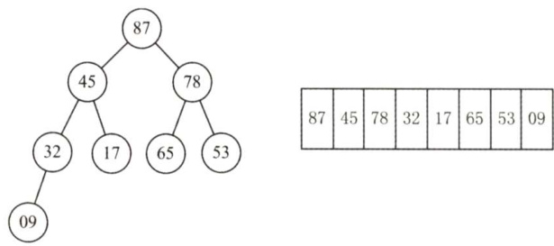
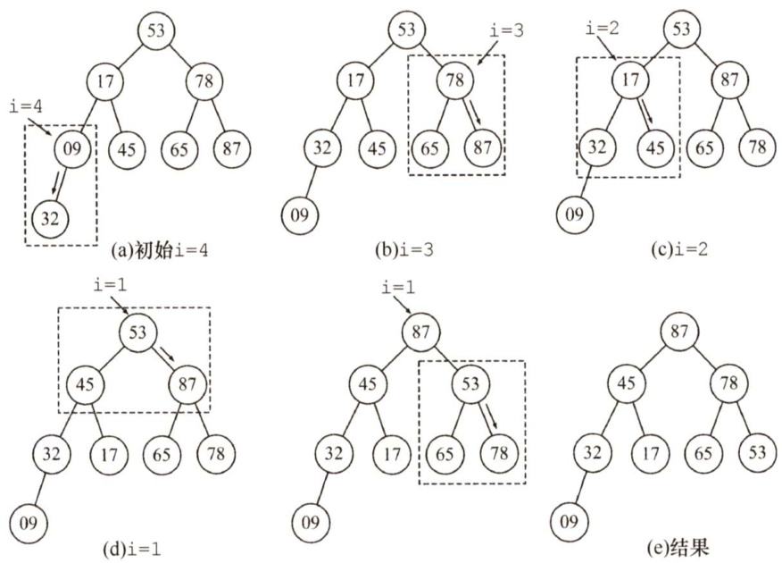
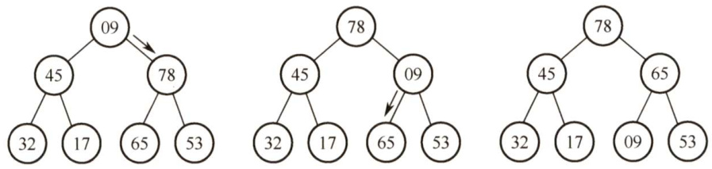
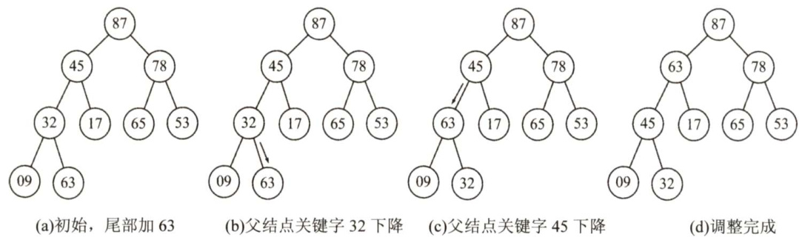
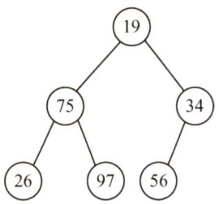
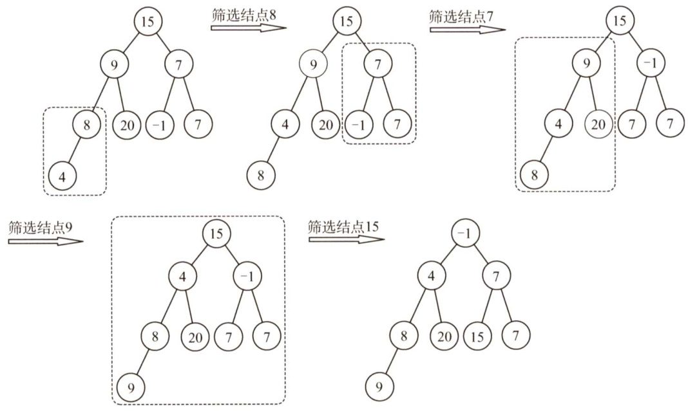
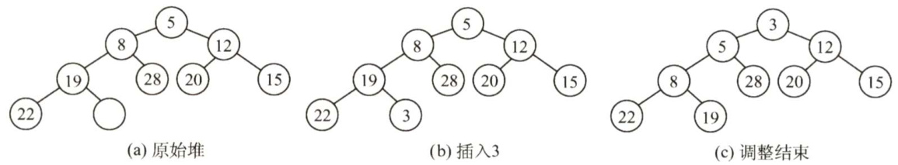
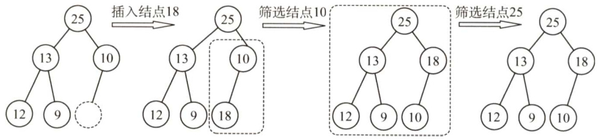
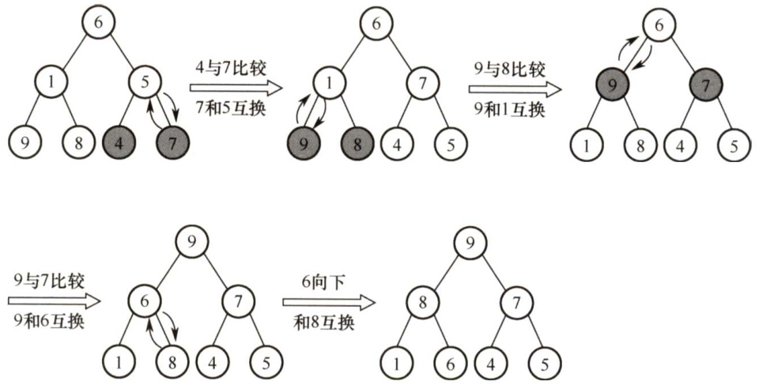
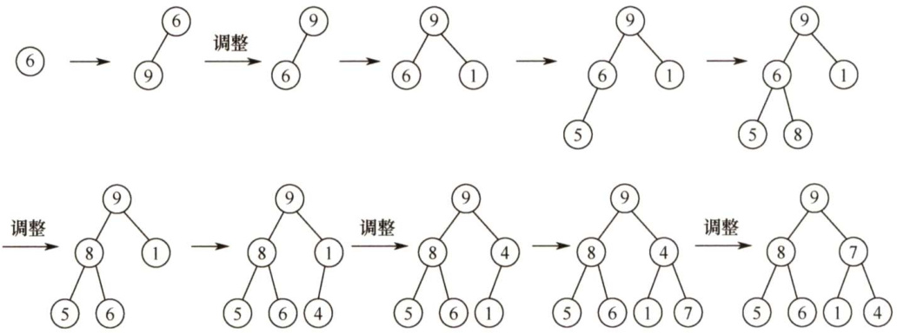

### 8.4 选择排序  

选择排序的基本思想是：每一趟（如第 $i$ 趟）在后面 $\begin{array}{r}{n-i+1}\end{array}$ C $\mathbf{\Phi}_{i}^{\prime}=1,2,\cdots,n-1\$ ）个待排序元素中选取关键字最小的元素，作为有序子序列的第 $i$ 个元素，直到第 $n-1$ 趟做完，待排序元素只剩下1个，就不用再选了。选择排序中的堆排序算法是历年考查的重点。  

#### 8.4.1 简单选择排序  

根据上面选择排序的思想，可以很直观地得出简单选择排序算法的思想：假设排序表为L[1..n]，第i趟排序即从L[i..n]中选择关键字最小的元素与L(i)交换，每一趟排序可以确定一个元素的最终位置，这样经过 $n-1$ 趟排序就可使得整个排序表有序。  

简单选择排序算法的代码如下：  

void SelectSort（ElemType A[],intn）{for( $\dot{\underline{{\mathbf{1}}}}=0$ ;i<n-1; $\dot{2}++$ ） //一共进行 $n-1$ 趟min $=\dot{2}$ ： //记录最小元素位置for $j=i+1$ $j<n$ $j++$ ） //在A[i...n-1]中选择最小的元素if（A[j] $<\tt A$ [min]）min $=\dot{]}$ . //更新最小元素位置if(min $!=\dot{2}$ ）swap（A[i],A[min]）； //封装的swap（）函数共移动元素3次  

简单选择排序算法的性能分析如下：  

空间效率：仅使用常数个辅助单元，故空间效率为 $O(1)$ o  

时间效率：从上述伪码中不难看出，在简单选择排序过程中，元素移动的操作次数很少，不会超过 $3(n-1)$ 次，最好的情况是移动0次，此时对应的表已经有序；但元素间比较的次数与序列的初始状态无关，始终是 $n(n-1)/2$ 次，因此时间复杂度始终是 $O(n^{2})$ o  

稳定性：在第 $i$ 趟找到最小元素后，和第 $i$ 个元素交换，可能会导致第 $i$ 个元素与其含有相同关键字元素的相对位置发生改变。例如，表 $L=\{2,2,1\}$ ，经过一趟排序后 $L=\{1,2,2\}$ ，最终排序序列也是 $L=\{1,2,2\}$ ，显然，2与2的相对次序已发生变化。因此，简单选择排序是一种不稳定的排序方法。  

#### 8.4.2 堆排序  

堆的定义如下， $n$ 个关键字序列L[1..n]称为堆，当且仅当该序列满足：  

$\textcircled{1}\textrm{L}(\textrm{i})>=\mathrm{{L}}$ (2i)且 $\mathrm{L}\left(\mathrm{i}\right)>=\mathrm{L}$ (2i+1）或$\textcircled{2}\textrm{L}(\textrm{i})<=\mathrm{L}$ (2i)且 $\mathtt{L}\left(\mathrm{i}\right)<=\mathtt{L}\left(2\mathrm{i}+1\right)$ $\left(1\leq i\leq\lfloor n/2\rfloor\right)$ ）  

可以将该一维数组视为一棵完全二叉树，满足条件 $\textcircled{1}$ 的堆称为大根堆（大顶堆)，大根堆的最大元素存放在根结点，且其任一非根结点的值小于等于其双亲结点值。满足条件 $\textcircled{2}$ 的堆称为小根堆（小顶堆），小根堆的定义刚好相反，根结点是最小元素。图8.4所示为一个大根堆。  

堆排序的思路很简单：首先将存放在L[1..n]中的 $n$ 个元素建成初始堆，由于堆本身的特点（以大顶堆为例)，堆顶元素就是最大值。输出堆顶元素后，通常将堆底元素送入堆顶，此时根结点已不满足大顶堆的性质，堆被破坏，将堆顶元素向下调整使其继续保持大顶堆的性质，再输出堆顶元素。如此重复，直到堆中仅剩一个元素为止。可见堆排序需要解决两个问题： $\textcircled{1}$ 如何将无序序列构造成初始堆？ $\textcircled{2}$ 输出堆顶元素后，如何将剩余元素调整成新的堆？  

  
图8.4一个大根堆示意图  

堆排序的关键是构造初始堆。 $n$ 个结点的完全二叉树，最后一个结点是第 $\lfloor n/2\rfloor$ 个结点的孩子。对第 $\lfloor n/2\rfloor$ 个结点为根的子树筛选（对于大根堆，若根结点的关键字小于左右孩子中关键字较大者，则交换)，使该子树成为堆。之后向前依次对各结点 $(\lfloor n/2\rfloor-1{\sim}1)$ 为根的子树进行筛选，看该结点值是否大于其左右子结点的值，若不大于，则将左右子结点中的较大值与之交换，交换后可能会破坏下一级的堆，于是继续采用上述方法构造下一级的堆，直到以该结点为根的子树构成堆为止。反复利用上述调整堆的方法建堆，直到根结点。  

如图8.5所示，初始时调整L（4)子树， $09<32$ ，交换，交换后满足堆的定义；向前继续调整L(3)子树， $78<$ 左右孩子的较大者87，交换，交换后满足堆的定义；向前调整L(2)子树，$17<$ 左右孩子的较大者45，交换后满足堆的定义；向前调整至根结点L（1)， $53<$ 左右孩子的较大者87，交换，交换后破坏了L(3)子树的堆，采用上述方法对L(3)进行调整， $53<$ 左右孩子的较大者78，交换，至此该完全二叉树满足堆的定义。  

输出堆顶元素后，将堆的最后一个元素与堆顶元素交换，此时堆的性质被破坏，需要向下进行筛选。将09和左右孩子的较大者78交换，交换后破坏了L(3)子树的堆，继续对L(3)子树向下筛选，将09 和左右孩子的较大者65交换，交换后得到了新堆，调整过程如图8.6所示。  

  
图8.5自下往上逐步调整为大根堆  

  
图8.6输出堆顶元素后再将剩余元素调整成新堆  

下面是建立大根堆的算法：  

void BuildMaxHeap（ElemType A[],int len){for（inti=len/2; $\dot{1}>0$ ;i--) //从 $\dot{\bf1}=[{\bf n}/{\bf2}]\sim{\bf1}$ ，反复调整堆HeadAdjust（A,i,len);  
)  
void HeadAdjust（ElemType A[],int $k$ intlen){  
//函数HeadAdjust将元素 $k$ 为根的子树进行调整$A[0]=A[k]$ ， //A[0]暂存子树的根结点for( $i=2+k$ ： $\mathrm{i}<=1\mathrm{en}$ 、 $\dot{1}+=2$ ）{ //沿key较大的子结点向下筛选if $\mathrm{i<1en\&\&A\left[i\right]<A\left[i+1\right]}\ \mathrm{i}$ $\dot{2}++$ //取key较大的子结点的下标if $A[0]>=A$ [i]）break；//筛选结束else{$\mathbb{A}\left[\mathbf{k}\right]=\mathbb{A}$ [i]; //将A[i]调整到双亲结点上$k{=}\mathrm{i}$ ： //修改 $k$ 值，以便继续向下筛选}$A[k]=A[0]$ . //被筛选结点的值放入最终位置  

调整的时间与树高有关，为 $O(h)$ 。在建含 $n$ 个元素的堆时，关键字的比较总次数不超过 $4n$ ，时间复杂度为 $O(n)$ ，这说明可以在线性时间内将一个无序数组建成一个堆。  

下面是堆排序算法：  

void HeapSort（ElemType A[],int len）{BuildMaxHeap（A,len); //初始建堆for $\scriptstyle{\dot{1}}=1\ e n$ ;i>l;i--){ //n-1趟的交换和建堆过程Swap（A[i],A[1]); //输出堆顶元素（和堆底元素交换）HeadAdjust（A,l,i-1); //调整，把剩余的i-1个元素整理成堆  

同时，堆也支持插入操作。对堆进行插入操作时，先将新结点放在堆的末端，再对这个新结点向上执行调整操作。大根堆的插入操作示例如图8.7所示。  

  
图8.7大根堆的插入操作示例  

堆排序适合关键字较多的情况。例如，在1亿个数中选出前100个最大值？首先使用一个大小为100的数组，读入前100个数，建立小顶堆，而后依次读入余下的数，若小于堆顶则舍弃，否则用该数取代堆顶并重新调整堆，待数据读取完毕，堆中100个数即为所求。  

堆排序算法的性能分析如下：  

空间效率：仅使用了常数个辅助单元，所以空间复杂度为 $O(1)$ 。  

时间效率：建堆时间为 $O(n)$ ，之后有 $n-1$ 次向下调整操作，每次调整的时间复杂度为 $O(h)$ ，故在最好、最坏和平均情况下，堆排序的时间复杂度为 $O(n\mathrm{log}_{2}n)$ 。  

稳定性：进行筛选时，有可能把后面相同关键字的元素调整到前面，所以堆排序算法是一种不稳定的排序方法。例如，表 $L=\{1,2,2\}$ ，构造初始堆时可能将2交换到堆顶，此时 $L=\{2,1,2\}$ ，最终排序序列为 $L=\{1,2,2\}$ ，显然，2与2的相对次序已发生变化。  

#### 8.4.3 本节试题精选  

#### 一、单项选择题  

01．在以下排序算法中，每次从未排序的记录中选取最小关键字的记录，加入已排序记录的末尾，该排序方法是（）。  

A．简单选择排序B．冒泡排序 C．堆排序 D.直接插入排序  

02．简单选择排序算法的比较次数和移动次数分别为（）。  

A. $O(n)$ ， $O(\log_{2}n)$ B. $O(\log_{2}n)$ ， $O(n^{2})$ C. $O(n^{2})$ ， $O(n)$ D. $O(n\mathrm{log}_{2}n)$ ， $O(n)$  

03.设线性表中每个元素有两个数据项 $k_{1}$ 和 $k_{2}$ ，现对线性表按以下规则进行排序：先看数据项 $k_{1}$ ， $k_{1}$ 值小的元素在前，大的元素在后；在 $k_{1}$ 值相同的情况下，再看 $k_{2}$ ， $k_{2}$ 值小的在前，大的元素在后。满足这种要求的排序方法是（）。  

A.先按 $k_{1}$ 进行直接插入排序，再按 $k_{2}$ 进行简单选择排序  

B.先按 $k_{2}$ 进行直接插入排序，再按 $k_{1}$ 进行简单选择排序C.先按 $k_{1}$ 进行简单选择排序，再按 $k_{2}$ 进行直接插入排序D.先按 $k_{2}$ 进行简单选择排序，再按 $k_{1}$ 进行直接插入排序  

04.若只想得到1000个元素组成的序列中第10个最小元素之前的部分排序的序列，用（方法最快。  

A．冒泡排序 B．快速排序 C．希尔排序 D．堆排序  

05．下列（）是一个堆。  

A.19,75,34,26,97,56 B.97,26,34,75,19,56   
C.19,56,26,97,34,75 D.19,34,26,97,56,75  

06.有一组数据(15,9,7,8,20,-1,7,4)，用堆排序的筛选方法建立的初始小根堆为（）。  

A. $-1,4,8,9,20,7,15,7$ B.-1,7,15,7,4,8,20,9 C.-1,4,7,8,20,15,7,9 D.A、B、C均不对  

07.在含有 $n$ 个关键字的小根堆中，关键字最大的记录有可能存储在（）位置。  

A. n/2 B. $n/2+2$ C.1 D. n/2-1  

08．向具有 $n$ 个结点的堆中插入一个新元素的时间复杂度为（），删除一个元素的时间复杂度为（）。  

A. $O(1)$ B. O(n) C. $O(\log_{2}n)$ D. O(nlogn)  

09.构建 $n$ 个记录的初始堆，其时间复杂度为（）；对 $n$ 个记录进行堆排序，最坏情况下其时间复杂度为（）。  

A. $O(n)$ B. $O(n^{2})$ C. $O(\log_{2}n)$ D. O(nlogn)  

10.对关键码序列{23,17,72,60,25,8,68,71,52}进行堆排序，输出两个最小关键码后的剩余堆是（）。  

A.{23,72,60,25,68,71,52} B.{23,25,52,60,71,72,68} C.{71,25,23,52,60,72,68} D.{23,25,68,52,60,72,71}  

11.【2009统考真题】已知关键字序列5,8,12,19,28,20,15,22是小根堆，插入关键字3，调整好后得到的小根堆是（）。  

A.3,5,12,8,28,20,15,22,19 B.3,5,12,19,20,15,22,8,28   
C.3,8,12,5,20,15,22,28,19 D.3,12,5,8,28,20,15,22,19  

12.【2011统考真题】已知序列25,13,10,12,9是大根堆，在序列尾部插入新元素18，将其再调整为大根堆，调整过程中元素之间进行的比较次数是（）。  

A.1 B.2 C.4 D.5  

3.下列4种排序方法中，排序过程中的比较次数与序列初始状态无关的是（）。  

A.选择排序法 B.插入排序法 C.快速排序法 D.冒泡排序法  

14.【2015统考真题】已知小根堆为8,15,10,21,34,16,12，删除关键字8之后需重建堆，在此过程中，关键字之间的比较次数是（）。  

A.1 B.2 C.3 D.4  

15.【2018统考真题】在将序列 $(6,1,5,9,8,4,7,$ 建成大根堆时，正确的序列变化过程是（）  

A. $6,1,7,9,8,4,5\rightarrow6,9,7,1,8,4,5\rightarrow9,6,7,1,8,4,5\rightarrow9,8,7,1,6,4,5$   
B. $6,9,5,1,8,4,7\rightarrow6,9,7,1,8,4,5\rightarrow9,6,7,1,8,4,5\rightarrow9,8,7,1,6,4,5$   
C. $6,9,5,1,8,4,7\rightarrow9,6,5,1,8,4,7\rightarrow9,6,7,1,8,4,5\rightarrow9,8,7,1,6,4,5$  

D. $6,1,7,9,8,4,5\to7,1,6,9,8,4,5\to7,9,6,1,8,4,5\to9,7,6,1,8,4,5\to9,8,6,1,7,$ 4,5  

6.【2020统考真题】下列关于大根堆（至少含2个元素）的叙述中，正确的是（）。  

I．可以将堆视为一棵完全二叉树ⅡI．可以采用顺序存储方式保存堆IⅢI．可以将堆视为一棵二叉排序树IV．堆中的次大值一定在根的下一层  

A.仅I、Ⅱ B.仅Ⅱ、III C.仅I、Ⅱ和IV D.I、IⅢ和IV  

17.【2021统考真题】将关键字6,9,1,5,8,4,7依次插入到初始为空的大根堆 $\mathrm{~H~}$ 中，得到的H是（）。  

A.9,8,7,6,5,4, 1 B. 9,8,7,5,6, 1,4   
C. 9,8,7, 5,6,4, 1 D. 9,6,7,5,8,4,1  

#### 二、综合应用题  

01.指出堆和二叉排序树的区别？  

02．若只想得到一个序列中第 $k$ （ $k\geq5$ ）个最小元素之前的部分排序序列，则最好采用什么排序方法？  
03.有 $n$ 个元素已构成一个小根堆，现在要增加一个元素 $K_{n+1}$ ，请用文字简要说明如何在 $\log_{2}n$ 的时间内将其重新调整为一个堆。  
04.编写一个算法，在基于单链表表示的待排序关键字序列上进行简单选择排序。  
05．试设计一个算法，判断一个数据序列是否构成一个小根堆。  

#### 8.4.4 答案与解析  

#### 一、单项选择题  

01.A  

02.C  

注意：读者应熟练掌握各种排序算法的思想、过程和特点。  

03.D  

本题思路来自基数排序的LSD，首先应确定 $k_{1}$ ， $k_{2}$ 的排序顺序，若先排 $k_{1}$ 再排 $k_{2}$ ，则排序结果不符合题意，排除A和C。再考虑算法的稳定性，当 $k_{2}$ 排好序后，再对 $k_{1}$ 排序，若对$k_{1}$ 排序采用的算法是不稳定的，则对于 $k_{1}$ 相同而 $k_{2}$ 不同的元素可能会改变相对次序，从而不一定能满足题设要求。直接插入排序算法是稳定的，而简单选择排序算法是不稳定的，故只能选D。  

04.D  

希尔排序和快速排序要等排序全部完成之后才能确定最小的10 个元素。冒泡排序需要从后向前执行10趟冒泡才能得到10个最小的元素，而堆排序只需调整10次小根堆，调整时间与树高成正比。显然堆排序所需的时间更短。  

通常，取一大堆数据中的 $k$ 个最大（最小）的元素时，都优先采用堆排序。  

05.D  

可将每个选项中的序列表示成完全二叉树，再看父结点与子结点的关系是否全部满足堆的定义。例如，选项A中序列对应的完全二叉树如右图所示。显然，最小元素19在根结点，因此可能是小根堆，但75与26的关系却不满足小根堆的定义，所以选项A中的序列不是一个堆。其他选项采用类似的过程分析。  

  

06.C  

从 $\lfloor n/2\rfloor{\sim}1$ 依次筛选堆的过程如下图所示，显然选C。  

  

07.B  

这是小根堆，关键字最大的记录一定存储在这个堆所对应的完全二叉树的叶子结点中；又因为二叉树中的最后一个非叶子结点存储在 $n/2$ 中，所以关键字最大记录的存储范围为 $\lfloor n/2\rfloor+1\sim$ $n$ ，所以应该选B。  

08.C、C  

在向有 $n$ 个元素的堆中插入一个新元素时，需要调用一个向上调整的算法，比较次数最多等于树的高度减1，由于树的高度为 $\left\lfloor\log_{2}n\right\rfloor+1$ ，所以堆的向上调整算法的比较次数最多等于 $\lfloor\log_{2}n\rfloor_{\mathrm{{c}}}$ 此处需要注意，调整堆和建初始堆的时间复杂度是不一样的，读者可以仔细分析两个算法的具体执行过程。  

09.A、D  

建堆过程中，向下调整的时间与树高 $h$ 有关，为 $O(h)$ 。每次向下调整时，大部分结点的高度都较小。因此，可以证明在元素个数为 $n$ 的序列上建堆，其时间复杂度为 $O(n)$ 。无论是在最好情况下还是在最坏情况下，堆排序的时间复杂度均为 $O(n\mathrm{log}_{2}n)$ 。  

10.D  

筛选法初始建堆为{8,17,23,52,25,72,68,71,60}，输出8后重建的堆为{17,25,23,52,60,72, 68,71}，输出17后重建的堆为{23,25,68,52,60,72,71}。  

11.A  

插入关键字3后，堆的变化过程如下图所示。  

  

12.B  

首先18与10比较，交换位置，再与25比较，不交换位置。共比较了2次，调整的过程如下图所示。  

  

13.A  

选择排序算法的比较次数始终为 $n(n-1)/2$ ，与序列状态无关。  

14.C解析请扫右侧二维码查阅。  

15.A  

要熟练掌握建堆和调整堆的方法，从序列末尾开始向前遍历，变换过程如下图所示。  

  

16.C  

这是一道简单的概念题。堆是一棵完全树，采用一维数组存储，故I正确，Ⅱ正确。大根堆只要求根结点值大于左右孩子值，并不要求左右孩子值有序，ⅡII错误。堆的定义是递归的，所以其左右子树也是大根堆，所以堆的次大值一定是其左孩子或右孩子，IV正确。  

17.B  

要熟练掌握调整堆的方法，建堆的过程如下图所示，故答案选B。  

  

#### 二、综合应用题  

01.【解答】  

以小根堆为例，堆的特点是双亲结点的关键字必然小于等于该孩子结点的关键字，而两个孩子结点的关键字没有次序规定。在二叉排序树中，每个双亲结点的关键字均大于左子树结点的关键字，均小于右子树结点的关键字，也就是说，每个双亲结点的左、右孩子的关键字有次序关系。这样，当对两种树执行中序遍历后，二叉排序树会得到一个有序的序列，而堆则不一定能得到一个有序的序列。  

02.【解答】  

在基于比较的排序方法中，插入排序、快速排序和归并排序只有在将元素全部排完序后，才能得到前 $k$ 小的元素序列，算法的效率不高。  

冒泡排序、堆排序和简单选择排序可以，因为它们在每一趟中都可以确定一个最小的元素。采用堆排序最合适，对于 $n$ 个元素的序列，建立初始堆的时间不超过 $4n$ ，取得第 $k$ 个最小元素之前的排序序列所花的时间为 $k\mathrm{log}_{2}n$ ，总时间为 $4n+k\log_{2}n$ ；冒泡和简单选择排序完成此功能所花时间为 $k n$ ，当 $k\geq5$ 时，通过比较可以得出堆排序最优。  

注意：从本题可以得出结论，只需得到前 $k$ 小元素的顺序排列可采用的排序算法有冒泡排序、堆排序和简单选择排序。  

03.【解答】  

将 $K_{n+1}$ 插入数组的第 $n+1$ 个位置（即作为一个树叶插入)，然后将其与双亲比较，若它大于其双亲则停止调整，否则将 $K_{n+1}$ 与其双亲交换，重复地将 $K_{n+1}$ 与其新的双亲比较，算法终止于$K_{n+1}$ 大于等于其双亲或 $K_{n+1}$ 本身已上升为根。  

04.【解答】  

算法的思想是：每趟在原始链表中摘下关键字最大的结点，把它插入结果链表的最前端。  

由于在原始链表中摘下的关键字越来越小，在结果链表前端插入的关键字也越来越小，因此最后形成的结果链表中的结点将按关键字非递减的顺序有序链接。  

单链表的定义如第2章所述，假设它不带表头结点。  

void selectSort（LinkedList& L）{  
//对不带表头结点的单链表L执行简单选择排序LinkNode $\star\mathrm{h}=\mathrm{I},\star_{\mathrm{p}},\star_{\mathrm{q}},\star_{\mathrm{r}},\star_{\mathrm{S}};$ $L=$ NULL;while $\mathbf{h}!=$ NULL){ //持续扫描原链表$_{p=s=h}$ . $\scriptstyle\mathbf{q}=\mathbf{r}=$ NULL;//指针 $s$ 和 $\boldsymbol{\mathbf{\mathit{r}}}$ 记忆最大结点和其前驱；p为工作指针，q为其前驱while(p! $\c=$ NULL){ //扫描原链表寻找最大结点sif $_{\mathrm{p\rightarrow}}$ data>s->data){ $\scriptstyle{s=p}$ $\scriptstyle\mathbf{r}=\mathbf{q}$ ) //找到更大的，记忆它和它的前驱$a=p$ $\mathsf{\Lambda}_{\mathsf{P}}=\mathsf{p}$ ->link; //继续寻找}if( $s{=}{=}{\mathrm{h}}$ ）$h=h$ ->link; //最大结点在原链表前端elser->link $\c=$ s->link; //最大结点在原链表表内s->link $=\mathtt{I}$ $I_{1}=S$ . //结点s插入结果链前端  

05.【解答】  

将顺序表L[1.n]视为一个完全二叉树，扫描所有分支结点，遇到孩子结点的关键字小于根结点的关键字时返回false，扫描完后返回true。算法的实现如下：  

boolIsMinHeap（ElemTypeA[],int len）{if(len $82==0$ ） //len为偶数，有一个单分支结点if（A[len/2] $>A$ [len]) //判断单分支结点return false;for（i=len/2-1; $i>=1$ ;i--）//判断所有双分支结点if $(\mathbb{A}[\dot{\textrm{i}}]>\mathbb{A}[2^{\star}\dot{\textrm{i}}]\ |\ \mathbb{A}[\dot{\textrm{i}}]>\mathbb{A}[2^{\star}\dot{\textrm{i}}+1]\ ,$ return false;子else{ //len为奇数时，没有单分支结点for $\dot{1}=1\mathrm{en}/2$ $\scriptstyle{\dot{1}}>=1$ ;i--) //判断所有双分支结点if $(A[i]>A[2^{\star}\dot{1}]\mid1\mid A[i]>A[2^{\star}\dot{1}+1]\ )$ return false;子return true;