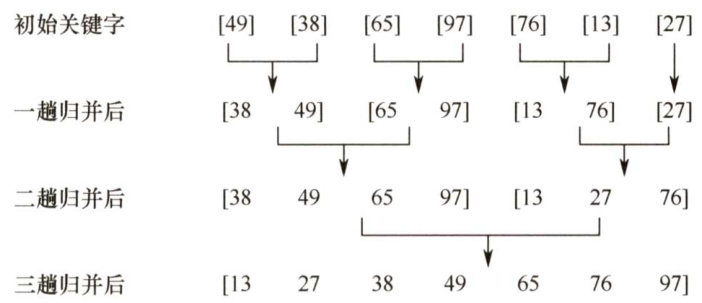
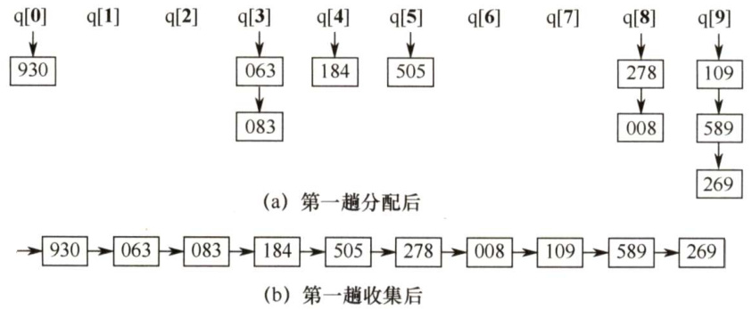
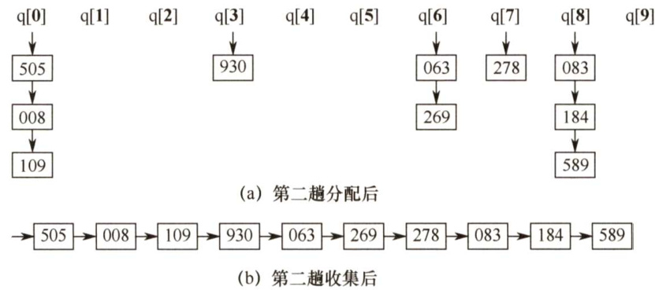
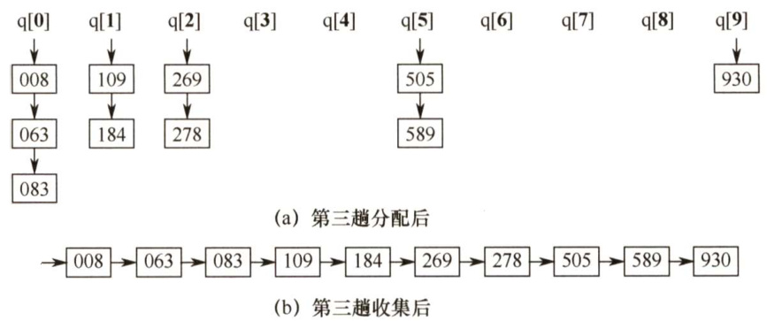
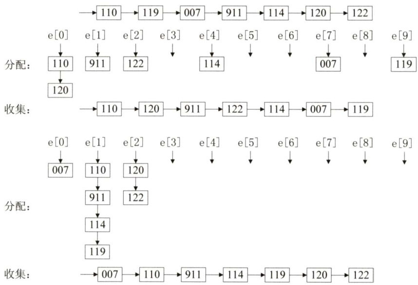
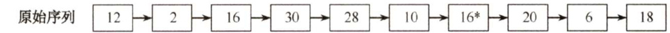
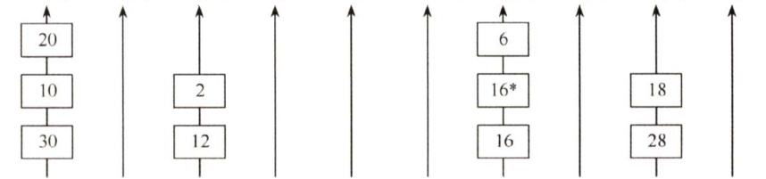
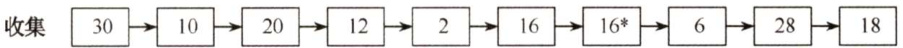
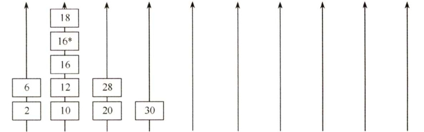
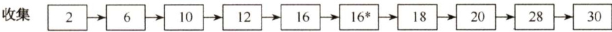

### 8.5 归并排序和基数排序  

#### 8.5.1 归并排序  

归并排序与上述基于交换、选择等排序的思想不一样，“归并”的含义是将两个或两个以上的有序表组合成一个新的有序表。假定待排序表含有 $n$ 个记录，则可将其视为 $n$ 个有序的子表，每个子表的长度为1，然后两两归并，得到 $\lceil n/2\rceil$ 个长度为2或1的有序表；继续两两归并……·如此重复，直到合并成一个长度为 $n$ 的有序表为止，这种排序方法称为2路归并排序。  

图8.8所示为2路归并排序的一个例子，经过三趟归并后合并成了有序序列。  

  
图8.82路归并排序示例  

Merge(）的功能是将前后相邻的两个有序表归并为一个有序表。设两段有序表A[low...mid]、A[mid $^+$ 1...high]存放在同一顺序表中的相邻位置，先将它们复制到辅助数组B中。每次从对应B中的两个段取出一个记录进行关键字的比较，将较小者放入A中，当数组B中有一段的下标超出其对应的表长（即该段的所有元素都已复制到A中）时，将另一段中的剩余部分直接复制到A中。算法如下：  

ElemType $+\cdot B=$ (ElemType\*)malloc( $(n+1$ \*sizeof（ElemType））;//辅助数组B  
void Merge（ElemType A[]，int low,int mid,int high）{  
//表A的两段A[low..mid]和A[mid $^+$ 1...high]各自有序，将它们合并成一个有序表for(int $k=10W$ $k<=$ high; $k++$ ）$B[k]=A[k]$ . //将A中所有元素复制到B中for( $\dot{\mathsf{I}}=1\mathsf{o w}$ $j=m i d+1$ $k=\dot{\tt1}$ ： $\dot{2}<=$ mid&&j $<=$ high; $k++$ ）{if $\mathsf{B}[\mathrm{i}]<=\mathsf{B}$ [j]） //比较B的左右两段中的元素$A[k]=B[i++]$ . //将较小值复制到A中else$A[k]=B[j++1$ .}//forwhile( $\scriptstyle{\dot{1}}<={\bmod{d}}$ ) $A[k++]=B[i++]$ ；//若第一个表未检测完，复制while $\scriptstyle{\dot{\mathcal{I}}}<=$ high） $A[k++]=B[j++]$ ；//若第二个表未检测完，复制  

注意：上面的代码中，最后两个while循环只有一个会执行。  

一趟归并排序的操作是，调用 $\lceil n/2h\rceil$ 次算法merge（)，将L[1...n]中前后相邻且长度为 $h$ 的有序段进行两两归并，得到前后相邻、长度为 $2h$ 的有序段，整个归并排序需要进行 $\mathbf{\dot{log}}_{2}{\dot{n}}$ 趟。  

递归形式的2路归并排序算法是基于分治的，其过程如下。  

分解：将含有 $n$ 个元素的待排序表分成各含 $n/2$ 个元素的子表，采用2路归并排序算法对两个子表递归地进行排序。  

合并：合并两个已排序的子表得到排序结果。  

void MergeSort（ElemType A[],int low,int high）{if（low<high）{int mid $\c=$ （low+high）/2; //从中间划分两个子序列MergeSort（A,low,mid); //对左侧子序列进行递归排序MergeSort（A,mid+l,high); //对右侧子序列进行递归排序Merge（A,low,mid,high）; //归并}//if  

2路归并排序算法的性能分析如下：  

空间效率：Merge()操作中，辅助空间刚好为 $n$ 个单元，所以算法的空间复杂度为 $O(n)$ 。  

时间效率：每趟归并的时间复杂度为 $O(n)$ ，共需进行 $\lceil\log_{2}n\rceil$ 趟归并，所以算法的时间复杂度为 $O(n\mathrm{log}_{2}n)$ 。  

稳定性：由于Merge()操作不会改变相同关键字记录的相对次序，所以2路归并排序算法是一种稳定的排序方法。  

注意：一般而言，对于 $N$ 个元素进行 $k$ 路归并排序时，排序的趟数 $m$ 满足 ${{k}^{m}}=N$ ，从而 $m=$ $\log_{k}N$ ，又考虑到 $m$ 为整数，所以 $m=\lceil\log_{k}N\rceil$ 。这和前面的2路归并是一致的。  

#### 8.5.2 基数排序  

基数排序是一种很特别的排序方法，它不基于比较和移动进行排序，而基于关键字各位的大小进行排序。基数排序是一种借助多关键字排序的思想对单逻辑关键字进行排序的方法。  

假设长度为 $n$ 的线性表中每个结点 $a_{j}$ 的关键字由 $d$ 元组 $(k_{j}^{d-1},k_{j}^{d-2},\cdots,k_{j}^{1},k_{j}^{0})$ 组成，满足$0\leq k_{j}^{i}\leq r-1$ （ $0\leq j<n$ $0\leq i\leq d-1)$ 。其中 $k_{j}^{d-1}$ 为最主位关键字， $k_{j}^{0}$ 为最次位关键字。  

为实现多关键字排序，通常有两种方法：第一种是最高位优先（MSD）法，按关键字位权重递减依次逐层划分成若干更小的子序列，最后将所有子序列依次连接成一个有序序列。第二种是最低位优先（LSD）法，按关键字权重递增依次进行排序，最后形成一个有序序列。  

下面描述以 $\boldsymbol{r}$ 为基数的最低位优先基数排序的过程，在排序过程中，使用 $\boldsymbol{r}$ 个队列 $\boldsymbol{Q}_{0},\boldsymbol{Q}_{1},\cdots$ $\scriptstyle Q_{r-1}$ 。基数排序的过程如下：  

对 $i=0,1,\cdots,d-1$ ，依次做一次“分配”和“收集”（其实是一次稳定的排序过程)。  

分配：开始时，把 $Q_{0},\ Q_{1},\cdots,\ Q_{r-1}$ 各个队列置成空队列，然后依次考察线性表中的每个结点$a_{j}$ $(j=0,1,\cdots,n-1)$ ，若 $a_{j}$ 的关键字 $k_{j}^{i}=k$ ，就把 $a_{j}$ 放进 $Q_{k}$ 队列中。  

收集：把 $Q_{0},$ $,\varrho_{1},\cdots$ $\scriptstyle Q_{r-1}$ 各个队列中的结点依次首尾相接，得到新的结点序列，从而组成新的线性表。  

通常采用链式基数排序，假设对如下10个记录进行排序：  

$$
\rightarrow=\left[278\right]\rightarrow=\left[100\right]\rightarrow=\left[063\right]\rightarrow=\left[930\right]\rightarrow=\left[589\right]\rightarrow=\left[184\right]\rightarrow=\left[505\right]\rightarrow=\left[269\right]\rightarrow=\left[008\right]\rightarrow=\left[083\right]
$$  

每个关键字是1000以下的正整数，基数 $r=10$ ，在排序过程中需要借助10个链队列，每个关键字由3位子关键字构成 $\mathrm{K}^{1}\mathrm{K}^{2}\mathrm{K}^{3}$ ，分别代表百位、十位和个位，一共需要进行三趟“分配”和“收集”操作。第一趟分配用最低位子关键字 $\mathrm{~K}^{3}$ 进行，将所有最低位子关键字（个位）相等的记录分配到同一个队列，如图8.9(a)所示，然后进行收集操作，第一趟收集后的结果如图8.9(b)所示。  

  
图8.9第一趟链式基数排序操作  

第二趟分配用次低位子关键字 $\mathrm{K}^{2}$ 进行，将所有次低位子关键字（十位）相等的记录分配到同一个队列，如图8.10(a)所示，第二趟收集后的结果如图8.10(b)所示。  

  
图8.10第二趟链式基数排序操作  

第三趟分配用最高位子关键字 $\mathbf{K}^{1}$ 进行，将所有最高位子关键字（百位）相等的记录分配到同一个队列，如图8.11(a)所示，第三趟收集后的结果如图8.11(b)所示，至此整个排序结束。  

  
图8.11第三趟链式基数排序操作  

基数排序算法的性能分析如下。  

空间效率：一趟排序需要的辅助存储空间为 $\boldsymbol{r}~(\boldsymbol{r}$ 个队列： $\boldsymbol{r}$ 个队头指针和 $\boldsymbol{r}$ 个队尾指针)，但以后的排序中会重复使用这些队列，所以基数排序的空间复杂度为 $O(r)$ o  

时间效率：基数排序需要进行 $d$ 趟分配和收集，一趟分配需要 $O(n)$ ，一趟收集需要 $O(r)$ ，所以基数排序的时间复杂度为 $O(d(n+r))$ ，它与序列的初始状态无关。  

稳定性：对于基数排序算法而言，很重要一点就是按位排序时必须是稳定的。因此，这也保证了基数排序的稳定性。  

#### 8.5.3 本节试题精选  

#### 一、单项选择题  

1.以下排序方法中，（）在一趟结束后不一定能选出一个元素放在其最终位置上。  

A．简单选择排序B．冒泡排序 C.归并排序 D．堆排序  

02.以下排序算法中，（）不需要进行关键字的比较。  

A．快速排序 B．归并排序 C．基数排序 D．堆排序  

03.在下列排序算法中，平均情况下空间复杂度为 $O(n)$ 的是（）；最坏情况下空间复杂度为O(n)的是（）。  

I．希尔排序 ⅡI．堆排序 III．冒泡排序  

IV．归并排序 V.快速排序 VI．基数排序  

A.I、IV、VI B.ⅡI、V C.IV、V D.IV  

D4.下列排序方法中，排序过程中比较次数的数量级与序列初始状态无关的是（）  

A．归并排序 B．插入排序 C.快速排序 D．冒泡排序  

5.若对27个元素只进行三趟多路归并排序，则选取的归并路数最少为（）。  

A.2 B.3 C.4 D.5  

06.2路归并排序中，归并趟数的数量级是（）。  

A. O(n) B. $O(\log_{2}n)$ C. $O(n\mathrm{log}_{2}n)$ D. $O(n^{2})$  

07.将两个各有 $N$ 个元素的有序表合并成一个有序表，最少的比较次数是（），最多的比较次数是（）。  

A. $N$ B.2N-1 C.2N D.N-1  

08.一组经过第一趟2路归并排序后的记录的关键字为{25,50,15,35,80,85,20,40,36,70}，其中包含5个长度为2的有序表，用2路归并排序方法对该序列进行第二趟归并后的结果为（）。  

A.15,25,35,50,80,20,85,40,70,36 B.15,25,35,50,20,40,80,85,36,70   
C. 15,25,50,35,80,85,20,36,40,70 D. 15,25,35,50,80,20,36,40,70,85  

09．若将中国人按照生日（不考虑年份，只考虑月、日）来排序，则使用下列排序算法时，最快的是（）。  

A．归并排序 B．希尔排序 C.快速排序 D．基数排序  

0.对{05,46,13,55,94,17,42}进行基数排序，一趟排序的结果是（）。  

A.05,46,13,55,94,17,42 B. 05,13,17,42,46, 55,94   
C.42,13,94,05,55,46,17 D.05,13,46,55,17,42,94  

11.【2013统考真题】对给定的关键字序列110,119,007,911,114,120,122进行基数排序，第2趟分配收集后得到的关键字序列是（）。  

A.007,110,119,114,911,120,122 B.007,110,119,114,911,122,120   
C. 007, 110,911,114,119,120,122 D. 110,120,911,122,114,007,119  

2.【2016统考真题】对10TB的数据文件进行排序，应使用的方法是（）。  

A．希尔排序 B．堆排序 C．快速排序 D.归并排序  

13.【2017统考真题】在内部排序时，若选择了归并排序而未选择插入排序，则可能的理由是（）。  

I.归并排序的程序代码更短 ⅡI.归并排序的占用空间更少III.归并排序的运行效率更高  

A.仅Ⅱ B.仅IⅢI C.仅I、Ⅱ D.仅I、III  

14.【2021统考真题】设数组S[] $\mathbf{\Psi}=\mathbf{\Psi}$ {93,946,372,9,146,151,301,485,236,327,43,892}，采用最低位优先（LSD）基数排序将S排列成升序序列。第一趟分配、收集后，元素372之前、之后紧邻的元素分别是（）。  

A.43,892 B. 236,301 C. 301,892 D.485,301  

#### 二、综合应用题  

01.已知序列{503,87,512,61,908,170,897,275,653,462}，采用2路归并排序法对该序列 做升序排序时需要几趟排序？给出每一趟的结果。  

02.设待排序的排序码序列为{12,2,16,30,28,10,16,20,6,18}，试写出使用基数排序方法每趟排序后的结果，并说明做了多少次排序码比较。  

#### 8.5.4 答案与解析  

#### 一、单项选择题  

01.C  

前面我们知道插入排序不能保证在一趟结束后一定有元素放在最终位置上。事实上，归并排序也不能保证。例如，序列{6,5,7,8,2,1,4,3}进行一趟2路归并排序（从小到大）后为{5,6,7,8,1,2,3,4}，显然它们都未被放在最终位置上。  

02.C  

基数排序是基于关键字各位的大小进行排序的，而不是基于关键字的比较进行的。  

03.D、C  

归并排序算法在平均情况下和最坏情况下的空间复杂度都会达到 $O(n)$ ，快速排序只在最坏情况下才会达到 $O(n)$ ，平均情况下为 $O(\log_{2}n)$ 。所以归并排序算法可视为本章所有算法中占用辅助空间最多的排序算法。  

04.A  

前面已讲过选择排序的比较次数与序列初始状态无关，归并排序也与序列的初始状态无关，读者还应能从算法的原理方面来考虑为什么和初始状态无关。  

05.B  

利用上述公式，这里要求的是 $k$ ，代入可得 $k=3$ o  

06.B  

对于 $N$ 个元素进行 $k$ 路归并排序时，排序的趟数 $m$ 满足 $k^{m}=N$ ，所以 $m=\lceil\log_{k}N\rceil$ ，本题中即为 $\lceil\log_{2}n\rceil$ 。  

07.A、B  

注意到当一个表中的最小元素比另一个表中的最大元素还大时，比较的次数是最少的，仅比较 $N$ 次；而当两个表中的元素依次间隔地比较时，即 $a_{1}<b_{1}<a_{2}<b_{2}<\cdots<a_{n}<b_{n}$ 时，比较的次数是最多的，为 $2N-1$ 次。  

建议读者对此举一反三：若将本题的中的两个有序表的长度分别设为 $M$ 和 $N$ ，则最多（或最少）的比较次数是多少？时间复杂度又是多少？  

08.B  

由于这里采用2路归并排序算法，而且是第二趟排序，因此每4个元素放在一起归并，可将序列划分为{25,50,15,35}，{80,85,20,40}和{36,70}，分别对它们进行排序后有{15,25,35,50}，{20,40,80,85}和{36,70}，故选B。  

09.D  

按照所有中国人的生日排序，一方面 $N$ 是非常大的，另一方面关键字所含的排序码数为2，  

且一个排序码的基数为12，另一个排序码的基数为31，都是较小的常数值，因此采用基数排序可以在 $O(N)$ 内完成排序过程。  

10.C  

基数排序有MSD 和LSD两种，且基数排序是稳定的。对于A，不符合LSD和 MSD;对于B，符合MSD，但关键字4、42、46的相对位置发生了变化；对于D，不符合LSD 和MSD。  

11.C  

基数排序的第1趟排序是按照个位数字的大小来进行的，第2趟排序是按照十位数字的大小来进行的，排序的过程如下图所示。  

  

12.D  

解析请扫右侧二维码查阅。  

13.B  

归并排序代码比选择插入排序更复杂，前者的空间复杂度是 $O(n)$ ，后者的是$O(1)$ 。但前者的时间复杂度是 $O(n\mathrm{log}n)$ ，后者的是 $O(n^{2})$ 。所以B正确。  

14.C  

基数排序是一种稳定的排序方法。由于采用最低位优先（LSD）的基数排序，即第一趟对个位进行分配和收集操作，因此第一趟分配和收集后的结果是{151,301,372,892,93,43,485,946,146,236,327,9}，元素372之前、之后紧邻的元素分别是301和892。  

#### 二、综合应用题  

01.【解答】  

$n=10$ ，需要排序的趟数 $=\left\lceil\log_{2}10\right\rceil=4$ ，各趟的排序结果如下：初始序列：503,87,512,61,908,170,897,275,653,462  

第一趟：87,503,61,512,170,908,275,897,462,653（长度为2）第二趟：61,87,503,512,170,275,897,908,462,653（长度为4）第三趟：61,87,170,275,503,512,897,908,462,653（长度为8）第四趟：61,87,170,275,462,503,512,653,897,908（长度为10）  

02.【解答】  

使用链式队列的基数排序的排序过程如下图所示。  

  

按最低位分配  

rear[0] rear[1] rear[2] rear[3] rear[4] rear[5] rear[6] rear[7] rear[8] rear[9]  

  

front[0] front[1] front[2] front[3] front[4] front[5]front[6] front7] front[8] front[  

  

按最高位分配  

rear[0] rear[l] rear[2] rear[3] rear[4] rear[5] rear[6] rear[7] rear[8] rear[9]  

  
front[0] front[1] front[2] front[3] front[4] front[5] front[6] front7]front[8] front[9]  

  

需要通过2次“分配”和“收集”完成排序。