### 8.7 外部排序  

外部排序可能会考查相关概念、方法和排序过程，外部排序的算法比较复杂，不会在算法设计上进行考查。本节的主要内容有：  

$\textcircled{1}$ 外部排序指待排序文件较大，内存一次放不下，需存放在外存的文件的排序。  
$\textcircled{2}$ 为减少平衡归并中外存读写次数所采取的方法：增大归并路数和减少归并段个数。  
$\textcircled{3}$ 利用败者树增大归并路数。  
$\textcircled{4}$ 利用置换-选择排序增大归并段长度来减少归并段个数。  
$\textcircled{5}$ 由长度不等的归并段，进行多路平衡归并，需要构造最佳归并树。  

#### 8.7.1 外部排序的基本概念  

前面介绍过的排序方法都是在内存中进行的（称为内部排序)。而在许多应用中，经常需要对大文件进行排序，因为文件中的记录很多、信息量庞大，无法将整个文件复制进内存中进行排序。因此，需要将待排序的记录存储在外存上，排序时再把数据一部分一部分地调入内存进行排序，在排序过程中需要多次进行内存和外存之间的交换。这种排序方法就称为外部排序。  

#### 8.7.2 外部排序的方法  

文件通常是按块存储在磁盘上的，操作系统也是按块对磁盘上的信息进行读写的。因为磁盘读/写的机械动作所需的时间远远超过内存运算的时间（相比而言可以忽略不计)，因此在外部排序过程中的时间代价主要考虑访问磁盘的次数，即I/O次数。  

外部排序通常采用归并排序法。它包括两个相对独立的阶段： $\textcircled{1}$ 根据内存缓冲区大小，将外存上的文件分成若干长度为的子文件，依次读入内存并利用内部排序方法对它们进行排序，并将排序后得到的有序子文件重新写回外存，称这些有序子文件为归并段或顺串； $\textcircled{2}$ 对这些归并段进行逐趟归并，使归并段（有序子文件）逐渐由小到大，直至得到整个有序文件为止。  

例如，一个含有2000个记录的文件，每个磁盘块可容纳125个记录，首先通过8次内部排序得到8个初始归并段 ${\bf R}1\sim{\bf R}8$ ，每个段都含250个记录。然后对该文件做如图8.13所示的两两归并，直至得到一个有序文件。  

把内存工作区等分为3个缓冲区，如图8.12所示，其中的两个为输入缓冲区，一个为输出缓冲区。首先，从两个输入归并段R1和R2中分别读入一个块，放在输入缓冲区1和输入缓冲区2中。然后，在内存中进行2路归并，归并后的对象顺序存放在输出缓冲区中。若输出缓冲区中对象存满，则将其顺序写到输出归并段（R1'）中，再清空输出缓冲区，继续存放归并后的对象。若某个输入缓冲区中的对象取空，则从对应的输入归并段中再读取下一块，继续参加归并。如此继续，直到两个输入归并段中的对象全部读入内存并都归并完成为止。当R1和R2 归并完后，再归并 R3和R4、R5和R6、最后归并R7和R8，这是一趟归并。再把上趟的结果R1'和 ${\bf R}2^{\prime}$ 、R3'和R4'两两归并，这又是一趟归并。最后把R1"和R2"两个归并段归并，结果得到最终的有序文件，一共进行了3趟归并。  

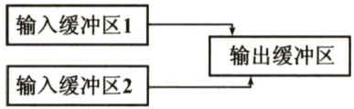  
图8.122路归并  

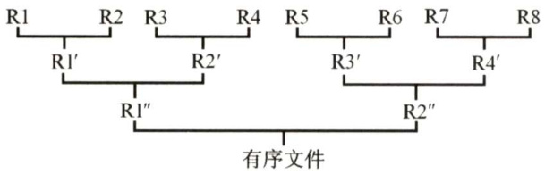  
图8.132路平衡归并的排序过程  

在外部排序中实现两两归并时，由于不可能将两个有序段及归并结果段同时存放在内存中，因此需要不停地将数据读出、写入磁盘，而这会耗费大量的时间。一般情况下：  

外部排序的总时间 $\mathbf{\Sigma}=\mathbf{\Sigma}$ 内部排序所需的时间 $^+$ 外存信息读写的时间 $^+$ 内部归并所需的时间  

显然，外存信息读写的时间远大于内部排序和内部归并的时间，因此应着力减少I/O次数。由于外存信息的读/写是以“磁盘块”为单位的，可知每一趟归并需进行16次“读”和16次“写”，3 趟归并加上内部排序时所需进行的读/写，使得总共需进行 $32\times3+32=128$ 次读写。  

若改用4路归并排序，则只需2趟归并，外部排序时的总读/写次数便减至 $32\times2+32=96$ 。因此，增大归并路数，可减少归并趟数，进而减少总的磁盘I/O次数，如图8.14所示。  

一般地，对 $\boldsymbol{r}$ 个初始归并段，做 $k$ 路平衡归并，归并树可用严格 $k$ 叉树（即只有度为 $k$ 与度为0的结点的 $k$ 叉树）来表示。第一趟可将 $\boldsymbol{r}$ 个初始归并段归并为 $\overline{{\boldsymbol{r}/k\boldsymbol{\rceil}}}$ 个归并段，以后每趟归并将 $m$ 个归并段归并成 $\dot{m}/k\rceil$ 个归并段，直至最后形成一个大的归并段为止。树的高度 $-1=\left\lceil\log_{k}\tau\right\rceil=$ 归并趟数 $s$ 。可见，只要增大归并路数 $k$ ，或减少初始归并段个数 $\boldsymbol{r}$ ，都能减少归并趟数S，进而减少读写磁盘的次数，达到提高外部排序速度的目的。  

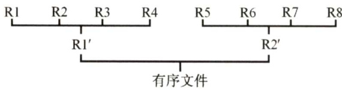  
图8.144路平衡归并的排序过程  

#### 8.7.3 多路平衡归并与败者树  

上节讨论过，增加归并路数 $k$ 能减少归并趟数 $s$ ，进而减少I/O次数。然而，增加归并路数 $k$ 时，内部归并的时间将增加。做内部归并时，在 $k$ 个元素中选择关键字最小的记录需要比较 $k-1$ 次。每趟归并 $n$ 个元素需要做 $(n-1)(k-1)$ 次比较， $s$ 趟归并总共需要的比较次数为  

$$
S(n-1)(k-1)={\big\lceil}\log_{k}r{\big\rceil}(n-1)(k-1)={\big\lceil}\log_{2}r{\big\rceil}(n-1)(k-1)/{\big\lceil}\log_{2}k{\big\rceil}
$$  

式中， $(k-1)\bar{\Lambda}\log_{2}k7$ 随 $k$ 增长而增长，因此内部归并时间亦随 $k$ 的增长而增长。这将抵消由于增大 $k$ 而减少外存访问次数所得到的效益。因此，不能使用普通的内部归并排序算法。  

为了使内部归并不受 $k$ 的增大的影响，引入了败者树。败者树是树形选择排序的一种变体，可视为一棵完全二叉树。 $k$ 个叶结点分别存放 $k$ 个归并段在归并过程中当前参加比较的记录，内部结点用来记忆左右子树中的“失败者”，而让胜者往上继续进行比较，一直到根结点。若比较两个数，大的为失败者、小的为胜利者，则根结点指向的数为最小数。  

如图8.15(a)所示，b3与b4比较，b4是败者，将段号4写入父结点ls[4]。b1与b2比较，b2 是败者，将段号2写入ls[3]。b3 与b4 的胜者 b3 与b0比较，b0是败者，将段号0写入ls[2]。最后两个胜者 b3 与b1比较，bl是败者，将段号1写入ls[1]。而将胜者b3的段号3写入Is[0]。此时，根结点ls[0]所指的段的关键字最小。b3 中的6 输出后，将下一关键字填入b3，继续比较。  

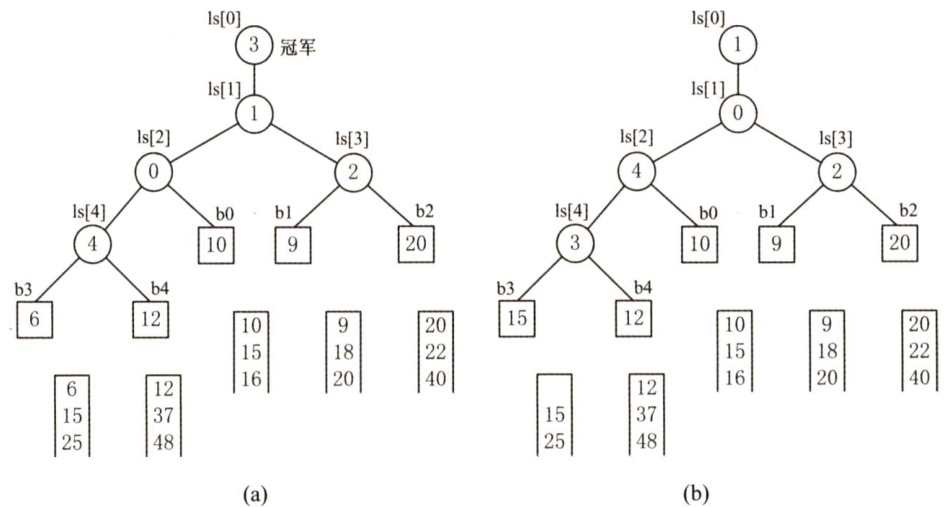  
图8.15实现5路归并的败者树  

因为 $k$ 路归并的败者树深度为 $\mathbf{\bar{\log_{2}}}k\mathbf{\rceil}$ ，因此 $k$ 个记录中选择最小关键字，最多需要 $\stackrel{\cdot}{\log_{2}k}$ 次比较。所以总的比较次数为  

$$
S(n-1)\left\lceil\log_{2}k\right\rceil=\left\lceil\log_{k}r\right\rceil(n-1)\left\lceil\log_{2}k\right\rceil=(n-1)\left\lceil\log_{2}r\right\rceil
$$  

可见，使用败者树后，内部归并的比较次数与 $k$ 无关了。因此，只要内存空间允许，增大归并路数 $k$ 将有效地减少归并树的高度，从而减少IO次数，提高外部排序的速度。  

值得说明的是，归并路数 $k$ 并不是越大越好。归并路数 $k$ 增大时，相应地需要增加输入缓冲区的个数。若可供使用的内存空间不变，势必要减少每个输入缓冲区的容量，使得内存、外存交换数据的次数增大。当 $k$ 值过大时，虽然归并趟数会减少，但读写外存的次数仍会增加。  

#### 8.7.4 置换-选择排序（生成初始归并段）  

从8.7.2节的讨论可知，减少初始归并段个数 $\boldsymbol{r}$ 也可以减少归并趟数S。若总的记录个数为 $n$ 每个归并段的长度为 $\ell$ ，则归并段的个数 $\scriptstyle r={\lceil n/\ell\rceil_{\circ}}$ 采用内部排序方法得到的各个初始归并段长度都相同（除最后一段外)，它依赖于内部排序时可用内存工作区的大小。因此，必须探索新的方法，用来产生更长的初始归并段，这就是本节要介绍的置换-选择算法。  

设初始待排文件为FI，初始归并段输出文件为FO，内存工作区为WA，FO和WA的初始状态为空，WA可容纳 $w$ 个记录。置换-选择算法的步骤如下：  

1）从FI输入 $w$ 个记录到工作区WA。  

2）从WA中选出其中关键字取最小值的记录，记为MINIMAX记录。  

3）将MINIMAX记录输出到FO中去。  

4）若FI不空，则从FI输入下一个记录到WA中。  

5）从WA中所有关键字比MINIMAX记录的关键字大的记录中选出最小关键字记录，作为新的MINIMAX记录。  

6）重复3） $\sim5$ )，直至在WA中选不出新的MINIMAX记录为止，由此得到一个初始归并段，输出一个归并段的结束标志到FO中去。  

7）重复2） ${\sim}6^{\cdot}$ ，直至WA为空。由此得到全部初始归并段。  
设待排文件 $\mathrm{FI}=\{17,21,05,44,10,12,56,32,29\}$ ，WA容量为3。排序过程如表8.2所示。  

表8.2置换-选择排序过程示例  

<html><body><table><tr><td>输出文件FO</td><td>工作区WA</td><td>输入文件FI</td></tr><tr><td>一</td><td>一</td><td>17,21,05,44,10,12,56,32,29</td></tr><tr><td>一</td><td>172105</td><td>44,10,12,56,32,29</td></tr><tr><td>05</td><td>172144</td><td>10,12,56,32,29</td></tr><tr><td>0517</td><td>10244</td><td>12,56,32,29</td></tr><tr><td>051721</td><td>1012</td><td>56,32,29</td></tr><tr><td>05172144</td><td>1012</td><td>32,29</td></tr><tr><td>0517214456</td><td>101232</td><td>29</td></tr><tr><td>0517214456#</td><td>1232</td><td>29</td></tr><tr><td>10</td><td>291232</td><td>一</td></tr><tr><td>1012</td><td>32</td><td>一</td></tr><tr><td>101229</td><td>32</td><td>一</td></tr><tr><td>10122932</td><td>一</td><td>一</td></tr><tr><td>10122932#</td><td>一</td><td></td></tr></table></body></html>  

上述算法，在WA中选择MINIMAX记录的过程需利用败者树来实现。  

#### 8.7.5 最佳归并树  

文件经过置换-选择排序后，得到的是长度不等的初始归并段。下面讨论如何组织长度不等的初始归并段的归并顺序，使得I/O次数最少？假设由置换-选择得到9个初始归并段，其长度（记录数）依次为9,30,12,18,3,17,2,6,24。现做3路平衡归并，其归并树如图8.16所示。  

在图8.16中，各叶结点表示一个初始归并段，上面的权值表示该归并段的长度，叶结点到根的路径长度表示其参加归并的趟数，各非叶结点代表归并成的新归并段，根结点表示最终生成的归并段。树的带权路径长度WPL为归并过程中的总读记录数，故I/O次数 ${\bf\dot{\theta}}=2{\times}\bf{W P L}=484$ 。  

显然，归并方案不同，所得归并树亦不同，树的带权路径长度（I/O 次数）亦不同。为了优化归并树的WPL，可将第4章中哈夫曼树的思想推广到 $m$ 叉树的情形，在归并树中，让记录数少的初始归并段最先归并，记录数多的初始归并段最晚归并，就可以建立总的IO次数最少的最佳归并树。上述9个初始归并段可构造成一棵如图8.17所示的归并树，按此树进行归并，仅需对外存进行446次读/写，这棵归并树便称为最佳归并树。  

图 8.17中的哈夫曼树是一棵严格3叉树，即树中只有度为3或0的结点。若只有8个初始归并段，如上例中少了一个长度为30 的归并段。若在设计归并方案时，缺额的归并段留在最后，即除最后一次做2路归并外，其他各次归并仍是3路归并，此归并方案的外存读/写次数为386。显然，这不是最佳方案。  

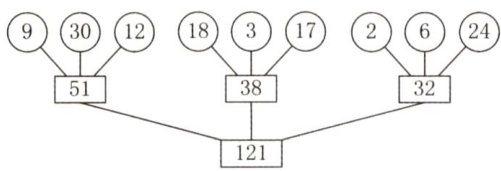  
图8.163路平衡归并的归并树  

正确的做法是：若初始归并段不足以构成一棵严格 $k$ 叉树时，需添加长度为0的“虚段”，按照哈夫曼树的原则，权为0的叶子应离树根最远。因此，最佳归并树应如图8.18所示。  

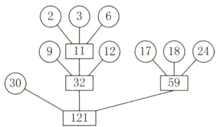  
图8.173路平衡归并的最佳归并树  

如何判定添加虚段的数目？  

设度为0的结点有 $n_{0}~(=n)$ 个，度为 $k$ 的结点有 $n_{k}$ 个，则对严格 $k$ 叉树有 $n_{0}=(k-1)n_{k}+1$ ，由此可得 $n_{k}=(n_{0}-1)/(k-1)$ 。  

·若 $(n_{0}-1)\%(k-1)=0$ C $0\%$ 为取余运算)，则说明这 $n_{0}$ 个叶结点（初始归并段）正好可以构造 $k$ 叉归并树。此时，内结点有 $n_{k}$ 个。  

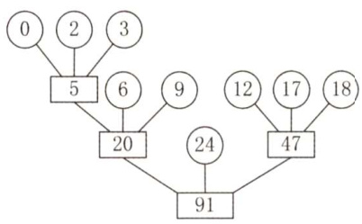  
图8.188个归并段的最佳归并树  

·若 $(n_{0}-1)\%(k-1)=u\neq0$ ，则说明对于这 $n_{0}$ 个叶结点，其中有 $\boldsymbol{u}$ 个多余，不能包含在 $k$ 叉归并树中。为构造包含所有 $n_{0}$ 个初始归并段的 $k$ 叉归并树，应在原有 $n_{k}$ 个内结点的基础上再增加1个内结点。它在归并树中代替了一个叶结点的位置，被代替的叶结点加上刚才多出的 $\boldsymbol{u}$ 个叶结点，即再加上 $k-u-1$ 个空归并段，就可以建立归并树。  

以图8.18为例，用8个归并段构成3叉树， $(n_{\scriptscriptstyle0}-1)^{\scriptscriptstyle0}/\scriptscriptstyle0(k-1)=(8-1)^{\scriptscriptstyle0}/\scriptscriptstyle0(3-1)=1$ ，说明7个归并段刚好可以构成一棵严格3叉树（假设把以5为根的树视为一个叶子)。为此，将叶子5变成一个内结点，再添加 $3-1-1=1$ 个空归并段，就可以构成一棵严格 $k$ 叉树。  

#### 8.7.6 本节试题精选  

#### 一、单项选择题  

01．设在磁盘上存放有375000个记录，做5路平衡归并排序，内存工作区能容纳600个记录，为把所有记录排好序，需要做（）趟归并排序。  

A.3 B.4 C.5 D.6  

02．设有5个初始归并段，每个归并段有20个记录，采用5路平衡归并排序，若不采用败者树，使用传统的顺序选出最小记录（简单选择排序）的方法，总的比较次数为（ $\textcircled{1}$ ）若采用败者树最小的方法，总的比较次数约为（ $\textcircled{2}$ ）。  

A.20 B.300 C. 396 D. 500  

03.置换-选择排序的作用是（）。  

A．用于生成外部排序的初始归并段  
B．完成将一个磁盘文件排序成有序文件的有效的外部排序算法  
C．生成的初始归并段的长度是内存工作区的2倍  
D.对外部排序中输入/归并/输出的并行处理  

04.最佳归并树在外部排序中的作用是（）。  

A.完成 $m$ 路归并排序 B.设计 $m$ 路归并排序的优化方案C.产生初始归并段 D.与锦标赛树的作用类似  

05.在下列关于外部排序过程输入/输出缓冲区作用的叙述中，不正确的是（）。  

A．暂存输入/输出记录 B.内部归并的工作区C.产生初始归并段的工作区 D.传送用户界面的消息  

06.在做 $m$ 路平衡归并排序的过程中，为实现输入/内部归并/输出的并行处理，需要设置( $\textcircled{1}$ )个输入缓冲区和（ $\textcircled{2}$ ）个输出缓冲区。  

A. 2 B. m C. 2m-1 D. 2m  

07.【2013统考真题】已知三叉树 $T$ 中6个叶结点的权分别是2，3，4，5，6,7， $T$ 的带权（外部）路径长度最小是（）。  

A.27 B.46 C.54 D.56  

08.【2019统考真题】设外存上有120个初始归并段，进行12路归并时，为实现最佳归并，需要补充的虚段个数是（）。  

A.1 B.2 C.3 D.4  

#### 二、综合应用题  

01．多路平衡归并排序是外部排序的主要方法，试问多路平衡归并排序包括哪两个相对独立的阶段？每个阶段完成何种工作？  

02．若某个文件经内部排序得到80个初始归并段，试问：  

1）若使用多路平衡归并执行3趟完成排序，则应取得的归并路数至少应为多少？2)若操作系统要求一个程序同时可用的输入/输出文件的总数不超过15个，则按多路归并至少需要几趟可以完成排序？若限定趟数，可取的最低路数是多少？  

03．假设文件有 4500个记录，在磁盘上每个块可放75个记录。计算机中用于排序的内存区可容纳450个记录。试问：  

1）可以建立多少个初始归并段？每个初始归并段有多少记录？存放于多少个块中？  
2）应采用几路归并？请写出归并过程及每趟需要读写磁盘的块数。  

04.设初始归并段为(10,15,31),(9,20),(22,34,37),(6,15,42),(12,37),(84,95)。试利用败者树进行 $m$ 路归并，手工执行选择最小的5个关键字的过程。  

05．给出12个初始归并段，其长度分别为30,44,8,6,3,20,60,18,9,62,68,85。现要做4路外归并排序，试画出表示归并过程的最佳归并树，并计算该归并树的带权路径长度WPL。  

#### 8.7.7 答案与解析  

#### 一、单项选择题  

01.B  

初始归并段的个数 $r=375000/600=625$ ，因此，归并趟数 $S={\big\lceil}\log_{m}r{\big\rceil}={\big\lceil}\log_{5}625{\big\rceil}=4$ 。第一趟把625个归并段归并成 $625/5=125$ 个；第二趟把125个归并段归并成 $125/5=25$ 个；第三趟把25个归并段归并成 $25/5=5$ 个；第四趟把5个归并段归并成 $5/5=1$ 个。  

02.C、B  

$\textcircled{1}$ 不采用败者树时，在5个记录中选出最小的需要做4次比较，共有100个记录，需要做99 次选择最小记录的操作，所以需要的比较次数为 $4\times99=396$ ，故选C。  
$\textcircled{2}$ 采用败者树时，5路归并意味着败者树的外结点有5个，败者树的高度 $h=\lceil\log_{2}5\rceil=3$ o每次在参加比较的记录中选择一个关键字最小的记录，比较次数不超过 $h$ ，共100个记录，需要的比较次数不超过 $100\times3=300$ ，故选B。  

03.A  

置换-选择排序是外部排序中生成初始归并段的方法，用此方法得到的初始归并段的长度是不等长的，其长度平均是传统等长初始归并段的2倍，从而使得初始归并段数减少到原来的近二分之一。但是，置换-选择排序不是一种完整的生成有序文件的外部排序算法。  

04.B  

最佳归并树在外部排序中的作用是设计 $m$ 路归并排序的优化方案，仿照构造哈夫曼树的方法，以初始归并段的长度为权值，构造具有最小带权路径长度的 $m$ 叉哈夫曼树，可以有效地减少归并过程中的读写记录数，加快外部排序的速度。  

05.D  

在外部排序过程中输入/输出缓冲区就是排序的内存工作区，例如做 $m$ 路平衡归并需要 $m$ 个输入缓冲区和1个输出缓冲区，用以存放参加归并的和归并完成的记录。在产生初始归并段时也可用作内部排序的工作区。它没有传送用户界面的消息的任务。  

06.D、A  

在做 $m$ 路平衡归并排序的过程中，为实现输入/内部归并/输出的并行处理，需要设置 $2m$ 个输入缓冲区和2个输出缓冲区，以便在执行内部归并时，能同时进行输入/输出操作。若仅设置 $m$ 个输入缓冲区，则仅能进行串行操作，无法并行处理。注重理解2路归并排序并在解题中留心题眼是正确解答的关键。  

07.B  

将哈夫曼树的思想推广到三叉树的情形。为了构成严格的三叉树，需添加权为0的虚叶结点，对  

于严格的三叉树， $(n_{0}-1)\%(3-1)=$ $u=1\neq0$ ，需要添加 $m-u-1~=$ $3-1-1\:=\:1$ 个叶结点，说明7个叶结点刚好可以构成一棵严格的三叉树。按照哈夫曼树的原则，权为0的叶结点应离树根最远，构造最小带权生成树的过程如右图所示。  

最小的带权路径长度为 $(2{\bf\alpha}+{\bf\beta}$ $3){\times}3+(4+5){\times}2+(6+7){\times}1=46$ 。  

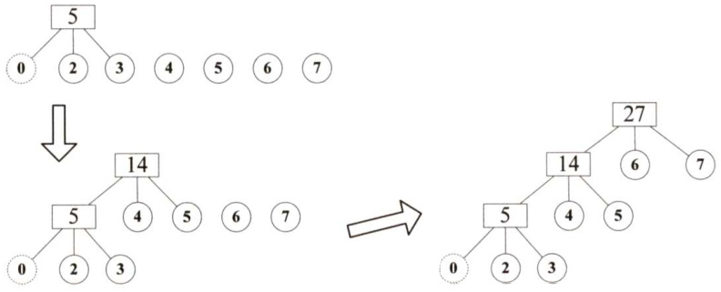  

08.B  

在12路归并树中只存在度为0和度为12的结点，设度为0的结点数、度为12的结点数和要补充的结点数分别为 $n_{0},n_{12}$ 和 $n_{\ast\vert}$ ，则有 $n_{\mathrm{0}}=120+n_{\mathrm{*h}}$ ， $n_{0}=(12-1)n_{12}+1$ ，可得 $n_{\scriptscriptstyle{12}}=(120-1+n_{\scriptscriptstyle{\frac{1}{16}}})/$ (12-1)。由于结点数 $n_{12}$ 为整数，所以 $n_{\ast\vert}$ 是使上式整除的最小整数，求得 $n_{\ast\vert}=2$ ，所以答案选B。  

#### 二、综合应用题  

01.【解答】  

多路平衡归并排序由两个相对独立的阶段组成：生成初始归并段阶段和多趟归并排序阶段。生成初始归并段阶段根据内存工作区的大小，将有 $n$ 个记录的磁盘文件分批输入内存，采用有效的内部排序方法分别进行排序，生成若干有序的子文件，即初始归并段。多趟归并排序阶段采用多路归并方法将这些归并段逐趟归并，最后归并成一个有序文件。  

02.【解答】  

1）设归并路数为 $m$ ，初始归并段个数 $r=80$ ，根据归并趟数计算公式 $S=\bigl\lceil\log_{m}r\bigr\rceil=\bigl\lceil\log_{m}80\bigr\rceil=$ 3，得 $\log_{m}80\leq3$ ， $m^{3}\geq80$ 。由此解得 $m\geq5$ ，即应取的归并路数至少为5。  

2）设多路归并的归并路数为 $\mathbf{\nabla}_{m}$ ，需要 $m$ 个输入缓冲区和1个输出缓冲区。一个缓冲区对应一个文件，有 $m+1=15$ ，因此 $m=14$ ，可做14路归并。由 $S={\bigl\lceil}\log_{m}r{\bigr\rceil}={\bigl\lceil}\log_{14}80{\bigr\rceil}=2$ 即至少需要2趟归并可完成排序。若限定趟数为2，由 $S=\bigl\lceil\log_{m}80\bigr\rceil=2$ ，有 $80\leq m^{2}$ ，可取的最低路数为9。即要在2趟内完成排序，进行9路归并排序即可。  

03.【解答】  

1）文件有 4500 个记录，用于排序的内存区可容纳 450 个记录，可建立的初始归并段有$4500/450=10$ 个。每个初始归并段中有450个记录，存于 $450/75=6$ 个块中。  

2）内存区可容纳6个块，可建立6个缓冲区，其中5个缓冲区用于输入，1个缓冲区用于输出，因此可采用5路归并，归并过程如下图所示。  

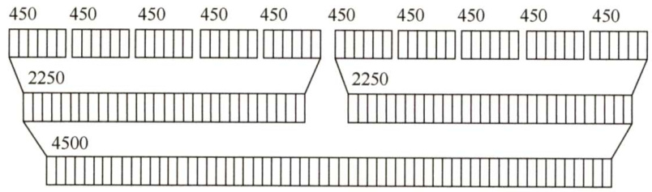  

共做了2趟归并，每趟需要读60块、写60块。  

04.【解答】  

做6路归并排序，选择最小的5个关键字的败者树如下图所示。  

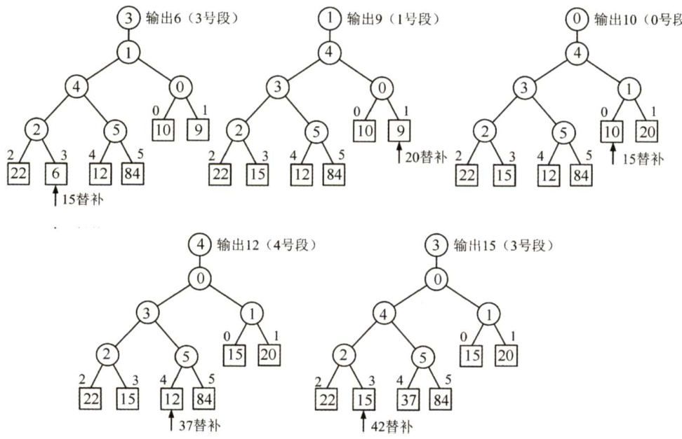  

05.【解答】  

设初始归并段个数 $n=12$ ，外归并路数 $k=4$ ，计算 $(n-1)\%(k-1)=11\%3=2\neq0$ ，说明不能做完全的4路归并，因为多出了2个初始归并段，必须添加 $k-2-1=1$ 个长度为0的空归并段，才能构成严格的4路归并树，即每次归并都有 $k$ 个归并段参加归并。  

此时，归并树的内结点应有 $(n-1+1)/(k-1)=12/3=4$ 个，如下图所示。  

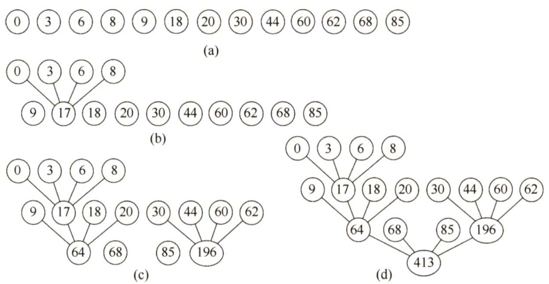  

$$
\mathrm{WPL}=(3+6+8)\times3+(9+18+20+30+44+60+62)\times2+(68+85)\times1=51+486+153
$$  

### 归纳总结  

下面对本章所介绍的排序算法进行一次系统的比较和复习。  

1．直接插入排序、冒泡排序和简单选择排序是基本的排序方法，它们主要用于元素个数 n不是很大（ $n<10000$ ）的情形。  

它们的平均时间复杂度均为 $O(n^{2})$ ，实现也都非常简单。直接插入排序对于规模很小的元素序列（ $n\leq25$ ）非常有效。它的时间复杂度与待排序元素序列的初始排列有关。在最好情况下，直接插入排序只需要 $n-1$ 次比较操作就可以完成，且不需要交换操作。在平均情况下和最差情况下，直接插入排序的比较和交换操作都是 $O(n^{2})$ 。冒泡排序在最好情况下只需要一趟排序过程就可以完成，此时也只需要 $n-1$ 次比较操作，不需要交换操作。简单选择排序的关键字比较次数与待排序元素序列的初始排列无关，其比较次数总是 $O(n^{2})$ ，但元素移动次数则与待排序元素序列的初始排列有关，最好情况下数据不需要移动，最坏情况下元素移动次数不超过 $3(n-1)$ 0  

从空间复杂度来看，这三种基本的排序方法除一个辅助元素外，都不需要其他额外空间。从稳定性来看，直接插入排序和冒泡排序都是稳定的，但简单选择排序不是。  

2.对于中等规模的元素序列（ $n\leq1000$ )，希尔排序是一种很好的选择。  

在希尔排序中，开始时增量较大，分量较多，每个组内的记录数较少，因而记录的比较和移动次数较少，且移动距离较远；到后来步长越来越小（最后一步为1)，分组越少，每个组内的记录数越多，但同时记录次序也越来越接近有序，因而记录的比较和移动次数也都比较少。从理论上和实验上都已证明，在希尔排序中，记录的总比较次数和总移动次数比直接插入排序时少得多，特别是当 $n$ 越大时效果越明显。而且，希尔排序代码简单，基本上不需要什么额外内存，但希尔排序是一种不稳定的排序算法。  

3．对于元素个数 $n$ 很大的情况，可以采用快排、堆排序、归并排序或基数排序，其中快排和堆排序都是不稳定的，而归并排序和基数排序是稳定的排序算法。  

快速排序是最通用的高效内部排序算法，特别是它的划分思想经常在很多算法设计题中出现。平均情况下它的时间复杂度为 $O(n\mathrm{log}_{2}n)$ ，一般情况下所需要的额外空间也是 $O(\log_{2}n)$ 。但是快速排序在有些情况下也可能会退化（如元素序列已经有序时)，时间复杂度会增加到 $O(n^{2})$ ，空间复杂度也会增加到 $O(n)$ 。但我们可以通过“三者取中”法来避免最坏情况的发生。  

堆排序也是一种高效的内部排序算法，它的时间复杂度是 $O(n\mathrm{log}_{2}n)$ ，而且没有什么最坏情况会导致堆排序的运行明显变慢，并且堆排序基本上不需要额外的空间。但堆排序不大可能提供比快速排序更好的平均性能。  

归并排序也是一个重要的高效排序算法，它的一个重要特性是性能与输入元素序列无关，时间复杂度总是 $O(n\mathrm{log}_{2}n)$ 。归并排序的主要缺点是需要 $O(n)$ 的额外存储空间。  

基数排序是一种相对特殊的排序算法，这类算法不仅是对元素序列的关键字进行比较，更重要的是它们对关键字的不同位部分进行处理和比较。虽然基数排序具有线性增长的时间复杂度，但由于在常规编程环境中，基数排序的线性时间开销实际上并不比快速排序的时间开销小很多，并且由于基数排序基于的关键字抽取算法受到操作系统和排序元素的影响，其适应性远不如普通的进行比较和交换操作的排序方法。因此，在实际工作中，常规的高效排序算法如快速排序的应用要比基数排序广泛得多。基数排序需要的额外存储空间包括和待排序元素序列规模相同的存储空间及与基数数目相等的一系列桶（一般用队列实现)。  

#### 4．混合使用。  

我们可以混合使用不同的排序算法，这也是得到普遍应用的一种算法改进方法，例如，可以将直接插入排序集成到归并排序的算法中。这种混合算法能够充分发挥不同算法各自的优势，从而在整体上得到更好的性能。  

### 思维拓展  

下面是一道看起来很吓人的题目：对 $n$ 个整数进行排序，要求时间复杂度为 $O(n)$ ，空间复杂度为 $O(1)$ 。  

（提示：假设待排序整数的范围为 $0{\sim}65535$ ，设定一个数组intcount[65535]并初始化为0，则所需空间与 $n$ 无关，为 $O(1)$ 。扫描一遍待排序列X[]，count $\left[\mathrm{X}\left[\mathrm{i}\right]\right]++$ ，时间复杂度为 $O(n)$ ；再扫描一次count[]，当count[i] ${>}0$ 时，输出count[i]个i，排序完毕所需的时间复杂度也为 $O(n)$ ；故总的时间复杂度为 $O(n)$ ，空间复杂度为 $O(1)$ 。另外，读者可能会问假如有负整数怎么办，这种情况下可以给所有整数都加上一个偏移量，使之都变成正整数，再使用上述方法即可。）  

