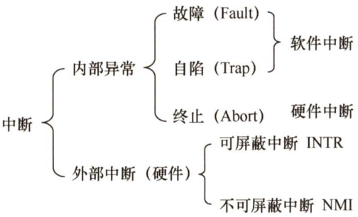
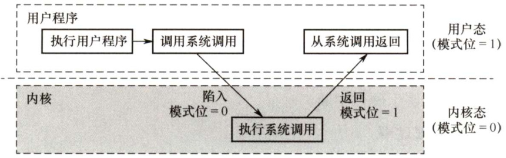

#### 1.3 操作系统运行环境  

#### 1.3.1 处理器运行模式  

计算机系统中，通常CPU执行两种不同性质的程序：一种是操作系统内核程序；另一种是用户自编程序（即系统外层的应用程序，或简称“应用程序")。对操作系统而言，这两种程序的作用不同，前者是后者的管理者，因此“管理程序”（即内核程序）要执行一些特权指令，而“被管理程序”（即用户自编程序）出于安全考虑不能执行这些指令。  

1）特权指令，是指不允许用户直接使用的指令，如I/O指令、置中断指令，存取用于内存保护的寄存器、送程序状态字到程序状态字寄存器等的指令。  

2）非特权指令，是指允许用户直接使用的指令，它不能直接访问系统中的软硬件资源，仅限于访问用户的地址空间，这也是为了防止用户程序对系统造成破坏。  

在具体实现上，将CPU的运行模式划分为用户态（目态）和核心态（又称管态、内核态)。可以理解为CPU内部有一个小开关，当小开关为0时，CPU处于核心态，此时CPU可以执行特权指令，切换到用户态的指令也是特权指令。当小开关为1时，CPU 处于用户态，此时CPU 只能执行非特权指令。用户自编程序运行在用户态，操作系统内核程序运行在核心态。  

在软件工程思想和结构化程序设计方法影响下诞生的现代操作系统，几乎都是分层式的结构。操作系统的各项功能分别被设置在不同的层次上。一些与硬件关联较紧密的模块，如时钟管理、中断处理、设备驱动等处于最低层。其次是运行频率较高的程序，如进程管理、存储器管理和设备管理等。这两部分内容构成了操作系统的内核。这部分内容的指令操作工作在核心态。  

内核是计算机上配置的底层软件，它管理着系统的各种资源，可以看作是连接应用程序和硬件的一座桥梁，大多数操作系统的内核包括4方面的内容。  

#### 1．时钟管理  

在计算机的各种部件中，时钟是最关键的设备。时钟的第一功能是计时，操作系统需要通过时钟管理，向用户提供标准的系统时间。另外，通过时钟中断的管理，可以实现进程的切换。例如，在分时操作系统中采用时间片轮转调度，在实时系统中按截止时间控制运行，在批处理系统中通过时钟管理来衡量一个作业的运行程度等。因此，系统管理的方方面面无不依赖于时钟。  

#### 2.中断机制  

引入中断技术的初衷是提高多道程序运行环境中CPU 的利用率，而且主要是针对外部设备的。后来逐步得到发展，形成了多种类型，成为操作系统各项操作的基础。例如，键盘或鼠标信息的输入、进程的管理和调度、系统功能的调用、设备驱动、文件访问等，无不依赖于中断机制。可以说，现代操作系统是靠中断驱动的软件。  

中断机制中，只有一小部分功能属于内核，它们负责保护和恢复中断现场的信息，转移控制权到相关的处理程序。这样可以减少中断的处理时间，提高系统的并行处理能力。  

#### 3.原语  

按层次结构设计的操作系统，底层必然是一些可被调用的公用小程序，它们各自完成一个规定的操作。它们的特点如下：  

1）处于操作系统的最低层，是最接近硬件的部分。  
2）这些程序的运行具有原子性，其操作只能一气呵成（出于系统安全性和便于管理考虑)。  
3）这些程序的运行时间都较短，而且调用频繁。  

通常把具有这些特点的程序称为原语（AtomicOperation）。定义原语的直接方法是关闭中断，让其所有动作不可分割地完成后再打开中断。系统中的设备驱动、CPU切换、进程通信等功能中的部分操作都可定义为原语，使它们成为内核的组成部分。  

#### 4.系统控制的数据结构及处理  

系统中用来登记状态信息的数据结构很多，如作业控制块、进程控制块（PCB）、设备控制块、各类链表、消息队列、缓冲区、空闲区登记表、内存分配表等。为了实现有效的管理，系统需要一些基本的操作，常见的操作有以下3种：  

1）进程管理。进程状态管理、进程调度和分派、创建与撤销进程控制块等。  
2）存储器管理。存储器的空间分配和回收、内存信息保护程序、代码对换程序等。  
3）设备管理。缓冲区管理、设备分配和回收等。  

从上述内容可以了解，核心态指令实际上包括系统调用类指令和一些针对时钟、中断和原语的操作指令。  

#### 1.3.2 中断和异常的概念  

在操作系统中引入核心态和用户态这两种工作状态后，就需要考虑这两种状态之间如何切换。操作系统内核工作在核心态，而用户程序工作在用户态。系统不允许用户程序实现核心态的功能，而它们又必须使用这些功能。因此，需要在核心态建立一些“门”，以便实现从用户态进入核心态。在实际操作系统中，CPU运行上层程序时唯一能进入这些“门”的途径就是通过中断或异常。发生中断或异常时，运行用户态的CPU会立即进入核心态，这是通过硬件实现的（例如，用一个特殊寄存器的一位来表示CPU所处的工作状态，0表示核心态，1表示用户态。若要进入核心态，则只需将该位置0即可)。中断是操作系统中非常重要的一个概念，对一个运行在计算机上的实用操作系统而言，缺少了中断机制，将是不可想象的。原因是，操作系统的发展过程大体上就是一个想方设法不断提高资源利用率的过程，而提高资源利用率就需要在程序并未使用某种资源时，把它对那种资源的占有权释放，而这一行为就需要通过中断实现。  

#### 1．中断和异常的定义  

中断（Interruption）也称外中断，是指来自CPU执行指令外部的事件，通常用于信息输入/输出，如设备发出的I/O结束中断，表示设备输入/输出处理已经完成。时钟中断，表示一个固定的时间片已到，让处理机处理计时、启动定时运行的任务等。  

异常（Exception）也称内中断，是指来自CPU执行指令内部的事件，如程序的非法操作码、地址越界、运算溢出、虚存系统的缺页及专门的陷入指令等引起的事件。异常不能被屏蔽，一旦出现，就应立即处理。关于内中断和外中断的联系与区别如图1.2所示。  

#### 2．中断和异常的分类  

外中断可分为可屏蔽中断和不可屏蔽中断。可屏蔽中断是指通过INTR线发出的中断请求，通过改变屏蔽字可以实现多重中断，从而使得中断处理更加灵活。不可屏蔽中断是指通过NMI线发出的中断请求，通常是紧急的硬件故障，如电源掉电等。此外，异常也是不能被屏蔽的。  

  
图1.2内中断和外中断的联系与区别  

异常可分为故障、自陷和终止。故障（Fault）通常是由指令执行引起的异常，如非法操作码、缺页故障、除数为0、运算溢出等。自陷（Trap）是一种事先安排的“异常”事件，用于在用户态下调用操作系统内核程序，如条件陷阱指令。终止（Abort）是指出现了使得CPU无法继续执行的硬件故障，如控制器出错、存储器校验错等。故障异常和自陷异常属于软件中断（程序性异常)，终止异常和外部中断属于硬件中断。  

#### 3.中断和异常的处理过程  

中断和异常处理过程的大致描述如下：当CPU在执行用户程序的第 $i$ 条指令时检测到一个异常事件，或在执行第 $i$ 条指令后发现一个中断请求信号，则CPU打断当前的用户程序，然后转到相应的中断或异常处理程序去执行。若中断或异常处理程序能够解决相应的问题，则在中断或异  

常处理程序的最后，CPU通过执行中断或异常返回指令，回到被打断的用户程序的第 $i$ 条指令或第 $i+1$ 条指令继续执行；若中断或异常处理程序发现是不可恢复的致命错误，则终止用户程序。通常情况下，对中断和异常的具体处理过程由操作系统（和驱动程序）完成。  

#### 1.3.3 系统调用  

所谓系统调用，是指用户在程序中调用操作系统所提供的一些子功能，系统调用可视为特殊的公共子程序。系统中的各种共享资源都由操作系统统一掌管，因此在用户程序中，凡是与资源有关的操作（如存储分配、进行I/O传输及管理文件等)，都必须通过系统调用方式向操作系统提出服务请求，并由操作系统代为完成。通常，一个操作系统提供的系统调用命令有几十条乃至上百条之多。这些系统调用按功能大致可分为如下几类。  

·设备管理。完成设备的请求或释放，以及设备启动等功能。  
）文件管理。完成文件的读、写、创建及删除等功能。  
·进程控制。完成进程的创建、撤销、阻塞及唤醒等功能。  
·进程通信。完成进程之间的消息传递或信号传递等功能。  
·内存管理。完成内存的分配、回收以及获取作业占用内存区大小及始址等功能。  

显然，系统调用相关功能涉及系统资源管理、进程管理之类的操作，对整个系统的影响非常大，因此必定需要使用某些特权指令才能完成，所以系统调用的处理需要由操作系统内核程序负责完成，要运行在核心态。用户程序可以执行陷入指令（又称访管指令或trap指令）来发起系统调用，请求操作系统提供服务。可以这么理解，用户程序执行“陷入指令”，相当于把CPU的使用权主动交给操作系统内核程序（CPU状态会从用户态进入核心态)，之后操作系统内核程序再对系统调用请求做出相应处理。处理完成后，操作系统内核程序又会把CPU的使用权还给用户程序（即CPU状态会从核心态回到用户态)。这么设计的目的是：用户程序不能直接执行对系统影响非常大的操作，必须通过系统调用的方式请求操作系统代为执行，以便保证系统的稳定性和安全性，防止用户程序随意更改或访问重要的系统资源，影响其他进程的运行。  

这样，操作系统的运行环境就可以理解为：用户通过操作系统运行上层程序（如系统提供的命令解释程序或用户自编程序)，而这个上层程序的运行依赖于操作系统的底层管理程序提供服务支持，当需要管理程序服务时，系统则通过硬件中断机制进入核心态，运行管理程序；也可能是程序运行出现异常情况，被动地需要管理程序的服务，这时就通过异常处理来进入核心态。管理程序运行结束时，用户程序需要继续运行，此时通过相应的保存的程序现场退出中断处理程序或异常处理程序，返回断点处继续执行，如图1.3所示。  

  
图1.3系统调用执行过程  

在操作系统这一层面上，我们关心的是系统核心态和用户态的软件实现与切换，对于硬件层面的具体理解，可以结合“计算机组成原理”课程中有关中断的内容进行学习。  

下面列举一些由用户态转向核心态的例子：  

1）用户程序要求操作系统的服务，即系统调用。  
2）发生一次中断。  
3）用户程序中产生了一个错误状态。  
4）用户程序中企图执行一条特权指令。  
5）从核心态转向用户态由一条指令实现，这条指令也是特权命令，一般是中断返回指令。  

注意：由用户态进入核心态，不仅状态需要切换，而且所用的堆栈也可能需要由用户堆栈切换为系统堆栈，但这个系统堆栈也是属于该进程的。  

若程序的运行由用户态转到核心态，则会用到访管指令，访管指令是在用户态使用的，所以它不可能是特权指令。  

#### 1.3.4 本节习题精选  

#### 一、单项选择题  

01.下列关于操作系统的说法中，错误的是（）。  

I.在通用操作系统管理下的计算机上运行程序，需要向操作系统预订运行时间  
ⅡI．在通用操作系统管理下的计算机上运行程序，需要确定起始地址，并从这个地址开始执行  
III．操作系统需要提供高级程序设计语言的编译器  
IV.管理计算机系统资源是操作系统关心的主要问题  

A.I、IⅢI B.Ⅱ、IIC.I、、II、IV D.以上答案都正确  

02．下列说法中，正确的是（）。  

I.批处理的主要缺点是需要大量内存  
Ⅱ．当计算机提供了核心态和用户态时，输入/输出指令必须在核心态下执行  
III．操作系统中采用多道程序设计技术的最主要原因是提高CPU和外部设备的可靠性  
IV．操作系统中，通道技术是一种硬件技术  

A.I、Ⅱ B.I、IⅢI C.、IV D、Ⅱ、Ⅲ、IV  

03.下列关于系统调用的说法中，正确的是（）。  

I.用户程序设计时，使用系统调用命令，该命令经过编译后，形成若干参数和陷入（trap）指令  
II．用户程序设计时，使用系统调用命令，该命令经过编译后，形成若干参数和屏蔽中断指令  
III．系统调用功能是操作系统向用户程序提供的接口  
IV.用户及其应用程序和应用系统是通过系统调用提供的支持和服务来使用系统资源完成其操作的  

A.I、III B.ⅡI、IV C.I、III、IV D.、Ⅲ、IV  

04.（）是操作系统必须提供的功能。  

A.图形用户界面（GUI） B．为进程提供系统调用命令C.中断处理 D.编译源程序  

05．用户程序在用户态下要使用特权指令引起的中断属于（）。  

A．硬件故障中断 B．程序中断 C.外部中断 D.访管中断  

6．处理器执行的指令被分为两类，其中有一类称为特权指令，它只允许（）使用。  

A．操作员 B．联机用户 C．目标程序 D.操作系统  

17.下列操作系统的各个功能组成部分中，（）可不需要硬件的支持。  

A．进程调度 B．时钟管理 C．地址映射 D.中断系统  

08．在中断发生后，进入中断处理的程序属于（）。  

A．用户程序  
B．可能是用户程序，也可能是OS程序  
C.操作系统程序  
D.单独的程序，即不是用户程序也不是OS程序  

09.计算机区分核心态和用户态指令后，从核心态到用户态的转换是由操作系统程序执行后完成的，而用户态到核心态的转换则是由（）完成的。  

A.硬件 B．核心态程序 C.用户程序 D．中断处理程序[0.在操作系统中，只能在核心态下运行的指令是（）。  

A．读时钟指令 B．置时钟指令 C．取数指令 D．寄存器清零  

11.“访管”指令（）使用。  

A．仅在用户态下 B.仅在核心态下 C．在规定时间内 D.在调度时间内  

12．当CPU执行操作系统代码时，处理器处于（）。  

A．自由态 B.用户态 C.核心态 D.就绪态  

13．在操作系统中，只能在核心态下执行的指令是（）。  

A．读时钟 B.取数 C．广义指令 D.寄存器清“0”  

14.下列选项中，必须在核心态下执行的指令是（）。  

A.从内存中取数 B．将运算结果装入内存C.算术运算 D.输入/输出  

15.CPU处于核心态时，它可以执行的指令是（）。  

A．只有特权指令 B．只有非特权指令C．只有“访管”指令 D.除“访管”指令的全部指令  

16.（）程序可执行特权指令。  

A.同组用户 B．操作系统 C．特权用户 D.一般用户  

17.【2011统考真题】下列选项中，在用户态执行的是（）。  

A．命令解释程序 B．缺页处理程序C.进程调度程序 D．时钟中断处理程序  

3.【2012统考真题】下列选项中，不可能在用户态发生的事件是（）。  

A．系统调用 B．外部中断 C.进程切换 D.缺页  

19.【2012统考真题】中断处理和子程序调用都需要压栈以保护现场，中断处理一定会保存而子程序调用不需要保存其内容的是（）。  

A．程序计数器 B．程序状态字寄存器C.通用数据寄存器 D.通用地址寄存器  

20.【2013统考真题】下列选项中，会导致用户进程从用户态切换到内核态的操作是（）。  

I．整数除以零 II． sin()函数调用 III．read系统调用  

A.仅I、ⅡI B.仅I、III C.仅Ⅱ、IⅢI D.I、Ⅱ和III  

21.【2014统考真题】下列指令中，不能在用户态执行的是（）。  

A.trap指令 B．跳转指令 C．压栈指令 D.关中断指令  

22.【2015统考真题】处理外部中断时，应该由操作系统保存的是（）。  

A．程序计数器（PC）的内容 B.通用寄存器的内容C．块表（TLB）中的内容 D.Cache中的内容  

23.【2015统考真题】假定下列指令已装入指令寄存器，则执行时不可能导致CPU从用户态变为内核态（系统态）的是（）。  

A. DIVRO,R1 ; (R0)/(R1)→RO  
B. INT n ；产生软中断  
C. NOT RO ；寄存器RO的内容取非  
D. MOV RO, addr ；把地址addr处的内存数据放入寄存器R0  

24.【2016统考真题】异常是指令执行过程中在处理器内部发生的特殊事件，中断是来自处理器外部的请求事件。下列关于中断或异常情况的叙述中，错误的是（）。  

A．“访存时缺页”属于中断 B．“整数除以0”属于异常 C.“DMA传送结束”属于中断 D．“存储保护错”属于异常  

25.【2017统考真题】执行系统调用的过程包括如下主要操作：  

$\textcircled{1}$ 返回用户态 $\textcircled{2}$ 执行陷入（trap）指令$\textcircled{3}$ 传递系统调用参数 $\textcircled{4}$ 执行相应的服务程序  

正确的执行顺序是（）。  

A. $\textcircled{2}\to\textcircled{3}\to\textcircled{1}\to\textcircled{4}$ B. $\textcircled{2}\rightarrow\textcircled{4}\rightarrow\textcircled{3}\rightarrow\textcircled{1}$   
C. $\textcircled{3}\to\textcircled{2}\to\textcircled{4}\to\textcircled{1}$ D. $\textcircled{3}\rightarrow\textcircled{4}\rightarrow\textcircled{2}\rightarrow\textcircled{1}$  

26.【2018统考真题】定时器产生时钟中断后，由时钟中断服务程序更新的部分内容是（）  

I．内核中时钟变量的值  
II．当前进程占用CPU的时间  
III．当前进程在时间片内的剩余执行时间  

A.仅I、Ⅱ B.仅I、IⅢI C.仅I、ⅢI D.I、Ⅱ、III  

27.【2019统考真题】下列关于系统调用的叙述中，正确的是（）。  

I．在执行系统调用服务程序的过程中，CPU处于内核态II．操作系统通过提供系统调用避免用户程序直接访问外设II．不同的操作系统为应用程序提供了统一的系统调用接口IV．系统调用是操作系统内核为应用程序提供服务的接口  

A.仅I、IV B．仅、ⅢI C.仅I、、IV D.仅I、IⅢ、IV  

28.【2020统考真题】下列与中断相关的操作中，由操作系统完成的是（）。  

I．保存被中断程序的中断点 II．提供中断服务III．初始化中断向量表 IV．保存中断屏蔽字A.仅I、ⅡI B.仅I、Ⅱ、IV C.仅IⅢ、IV D.仅、IⅢ、IV  

29.【2021统考真题】下列指令中，只能在内核态执行的是（）。  

A.trap指令 B.I/O指令 C．数据传送指令 D.设置断点指令  

#### 二、综合应用题  

01．处理器为什么要区分核心态和用户态两种操作方式？在什么情况下进行两种方式的切换？  
02．为什么说直到出现中断和通道技术后，多道程序概念才变得有用？  

#### 1.3.5 答案与解析  

#### 一、单项选择题  

01.A  

I：通用操作系统使用时间片轮转调度算法，用户运行程序并不需要预先预订运行时间，因此I项错误；II：操作系统执行程序时，必须从起始地址开始执行，因此Ⅱ项正确；I：编译器是操作系统的上层软件，不是操作系统需要提供的功能，因此III项错误；IV：操作系统是计算机资源的管理者，管理计算机系统资源是操作系统关心的主要问题，因此IV项正确。综合分析，I和IⅢ是错误项，因此选A。  

02.C  

I错误：批处理的主要缺点是缺少交互性。批处理系统的主要缺点是常考点，读者对此要非常敏感。Ⅱ正确：输入/输出指令需要中断操作，中断必须在核心态下执行。III错误：多道性是为了提高系统利用率和吞吐量而提出的。IV正确：I/O通道实际上是一种特殊的处理器，它具有执行IO指令的能力，并通过执行通道程序来控制IO操作。综上分析，ⅡI、IV正确。  

03.C  

I正确：系统调用需要触发trap指令，如基于 $\mathbf{x}86$ 的Linux系统，该指令为int0x80或sysenter。Ⅱ是干扰项，程序设计无法形成屏蔽中断指令。II正确：系统调用的概念。IV正确：操作系统是一层接口，对上层提供服务，对下层进行抽象。它通过系统调用向其上层的用户、应用程序和应用系统提供对系统资源的使用。  

04.C  

中断是操作系统必须提供的功能，因为计算机的各种错误都需要中断处理，核心态与用户态切换也需要中断处理。  

05.D  

因操作系统不允许用户直接执行某些“危险性高”的指令，因此用户态运行这些指令的结果会转成操作系统的核心态去运行。这个过程就是访管中断。  

06.D  

内核可以执行处理器能执行的任何指令，用户程序只能执行除特权指令外的指令。所以特权指令只能由内核即操作系统使用。  

07.A  

中断处理流程的前三个步骤是由硬件直接实现（隐指令）的。地址映射中需要基地址（或页表）寄存器和地址加法器的支持。而在时钟管理中，需要硬件计数器保持时钟的运行。进程调度由调度算法决定CPU使用权，由操作系统实现，不需要硬件的支持。  

对于此类题型，需要掌握各个选项的基本原理才能解答。  

08.C  

当中断或异常发生时，通过硬件实现将运行在用户态的CPU立即转入核心态。中断发生时，  

若被中断的是用户程序，则系统将从目态转入管态，在管态下进行中断的处理；若被中断的是低级中断，则仍然保持在管态，而用户程序只能在目态下运行，因此进入中断处理的程序只能是OS程序。中断程序本身可能是用户程序，但是进入中断的处理程序一定是OS程序。  

09.A  

计算机通过硬件中断机制完成由用户态到核心态的转换。B显然不正确，核心态程序只有在操作系统进入核心态后才可以执行。D中的中断处理程序一般也在核心态执行，因此无法完成“转换成核心态”这一任务。若由用户程序将操作系统由用户态转换到核心态，则用户程序中就可使用核心态指令，这就会威胁到计算机的安全，所以C不正确。  

计算机通过硬件完成操作系统由用户态到核心态的转换，这是通过中断机制来实现的。发生中断事件时（有可能是用户程序发出的系统调用)，触发中断，硬件中断机制将计算机状态置为核心态。  

10.B  

大多数计算机操作系统的内核包括四个方面的内容，即时钟管理、中断机制、原语和系统控制的数据结构及处理，其中第4部分实际上是系统调用类的指令（广义指令)。A、C和D三项均可以在汇编语言中涉及，因此都可以运行在用户态。从另外的角度考虑，若在用户态下允许执行“置时钟指令”，则一个用户进程可在时间片还未到之前把时钟改回去，从而导致时间片永远不会用完，进而导致该用户进程一直占用CPU，这显然是不合理的。  

注意：操作系统的主要功能是为应用程序的运行创建良好的环境，为了达到这个目的，内核提供一系列具备预定功能的多内核函数，通过一组称为系统调用（systemcall）的接口呈现给用户。系统调用把应用程序的请求传给内核，调用相应的内核函数完成所需的处理，将处理结果返回给应用程序，如果没有系统调用和内核函数，那么用户将不能编写大型应用程序。  

11.A  

“访管”指令仅在用户态下使用，执行“访管”指令将用户态转变为核心态。  

12.C  

运行操作系统代码的状态为核心态。  

13.C  

广义指令即系统调用命令，它必然工作在核心态，所以答案为C。要注意区分“调用”和“执行”，广义指令的调用可能发生在用户态，调用广义指令的那条指令不一定是特权指令，但广义指令存在于核心态中，所以执行一定在核心态。  

14.D  

输入/输出指令涉及中断操作，而中断处理是由系统内核负责的，工作在核心态。而A、B、C选项均可通过使用汇编语言编程来实现，因此它们可在用户态下执行。当然，读者也可用前面提到的“水杯”例子思考如何排除A、B、C。操作系统管理内存时，管理的是内存中的数据放在哪里、哪里可以放数据、哪里不可以放数据（内存保护）、哪里空闲等问题，而内存中的数据是什么、怎么读和写，都不是核心态关心的。就好像操作系统管理的是杯子摆在哪里、哪些杯  

子中的水可以喝、哪些杯子中的水不能喝，而杯子中是水还是饮料、你是拿起杯子喝还是把吸管插进去吸，都不是操作系统关心的问题。“杯子”的例子可以帮助我们准确理解操作系统的任务，后续章节中的很多问题采用这个例子进行对比，就会十分清晰。  

15.D  

访管指令在用户态下使用，是用户程序“自愿进管”的手段，用户态下不能执行特权指令。在核心态下，CPU可以执行指令系统中的任何指令。  

16.B  

特权指令是指仅能由操作系统使用的指令，选B。  

17.A  

缺页处理和时钟中断都属于中断，在核心态执行；进程调度是操作系统内核进程，无须用户干预，在核心态执行；命令解释程序属于命令接口，是4个选项中唯一能面对用户的，它在用户态执行。  

18.C  

解析请扫右侧二维码查阅。  

19.B  

子程序调用只需保存程序断点，即该指令的下一条指令的地址；中断处理不仅要保存断点（PC的内容)，还要保存程序状态字寄存器（PSW）的内容。在中断处理中，最重要的两个寄存器是PC和PSWR。  

20.B  

需要在系统内核态执行的操作是整数除零操作（需要中断处理）和read 系统调用函数，sin()函数调用是在用户态下进行的。  

21.D  

trap 指令、跳转指令和压栈指令均可以在用户态执行，其中trap指令负责由用户态转换为内核态。关中断指令为特权指令，必须在核心态才能执行，选D。注意，在操作系统中，关中断指令是权限非常大的指令，因为中断是现代操作系统正常运行的核心保障之一，能把它关掉，说明执行这条指令的一定是权限非常大的机构(管态)。  

22.B  

外部中断处理过程，PC 值由中断隐指令自动保存，而通用寄存器内容由操作系统保存。  

23.C  

考虑到部分指令可能出现异常（导致中断)，从而转到核心态。指令A有除零异常的可能，指令B为中断指令，指令D有缺页异常的可能，指令C不会发生异常。  

24.A  

中断是指来自CPU执行指令以外事件的发生，如设备发出的I/O结束中断，表示设备输入/输出处理已经完成，希望处理机能够向设备发出下一个输入/输出请求，同时让完成输入/输出后的程序继续运行。时钟中断，表示一个固定的时间片已到，让处理机处理计时、启动定时运行的任务等。这一类中断通常是与当前程序运行无关的事件，即它们与当前处理机运行的程序无关。异常也称内中断，指源自CPU执行指令内部的事件，如程序的非法操作码、地址越界、算术溢出、虚存系统的缺页及专门的陷入指令等引起的事件。A错误。  

25.C  

执行系统调用的过程如下：正在运行的进程先传递系统调用参数，然后由陷入（trap）指令负责将用户态转换为内核态，并将返回地址压入堆栈以备后用，接下来CPU执行相应的内核态服务程序，最后返回用户态。所以选项C正确。  

26.D  

时钟中断的主要工作是处理和时间有关的信息及决定是否执行调度程序。和时间有关的所有信息包括系统时间、进程的时间片、延时、使用CPU的时间、各种定时器，因此I、I、III均正确。  

27.C  

用户可以在用户态调用操作系统的服务，但执行具体的系统调用服务程序是处于内核态的，I正确；设备管理属于操作系统的职能之一，包括对输入/输出设备的分配、初始化、维护等，用户程序需要通过系统调用使用操作系统的设备管理服务，ⅡI正确；操作系统不同，底层逻辑、实现方式均不相同，为应用程序提供的系统调用接口也不同，II错误；系统调用是用户在程序中调用操作系统提供的子功能，IV正确。  

28.D  

当CPU检测到中断信号后，由硬件自动保存被中断程序的断点（即程序计数器PC)，I错误。之后，硬件找到该中断信号对应的中断向量，中断向量指明中断服务程序入口地址（各中断向量统一存放在中断向量表中，该表由操作系统初始化，III正确)。接下来开始执行中断服务程序，保存PSW、保存中断屏蔽字、保存各通用寄存器的值，并提供与中断信号对应的中断服务，中断服务程序属于操作系统内核，ⅡI和IV正确。  

29.B  

在内核态下，CPU可执行任何指令，在用户态下CPU只能执行非特权指令，而特权指令只能在内核态下执行。常见的特权指令有： $\textcircled{1}$ 有关对I/O设备操作的指令； $\textcircled{2}$ 有关访问程序状态的指令； $\textcircled{3}$ 存取特殊寄存器的指令； $\textcircled{4}$ 其他指令。A、C和D都是提供给用户使用的指令，可以在用户态执行，只是可能会使CPU从用户态切换到内核态。故选B。  

#### 二、综合应用题  

01.【解答】  

区分执行态的主要目的是保护系统程序。用户态到核心态的转换发生在中断产生时，而核心  

态到用户态的转换则发生在中断返回用户程序时。  

02.【解答】  

多道程序并发执行是指有的程序正在CPU上执行，而另一些程序正在I/O设备上进行传输，即通过CPU操作与外设传输在时间上的重叠必须有中断和通道技术的支持，原因如下：  

1）通道是一种控制一台或多台外部设备的硬件机构，它一旦被启动就独立于CPU运行，因而做到了输入/输出操作与CPU并行工作。但早期CPU与通道的联络方法是由CPU 向通道发出询问指令来了解通道工作是否完成的。若未完成，则主机就循环询问直到通道工作结束为止。因此，这种询问方式是无法真正做到CPU与IO设备并行工作的。  
2）在硬件上引入了中断技术。所谓中断，就是在输入/输出结束时，或硬件发生某种故障时，由相应的硬件（即中断机构）向CPU发出信号，这时CPU立即停下工作而转向处理中断请求，待处理完中断后再继续原来的工作。  

因此，通道技术和中断技术结合起来就可实现CPU与I/O设备并行工作，即CPU启动通道传输数据后便去执行其他程序的计算工作，而通道则进行输入/输出操作；当通道工作结束时，再通过中断机构向CPU 发出中断请求，CPU 则暂停正在执行的操作，对出现的中断进行处理，处理完后再继续原来的工作。这样，就真正做到了CPU与I/O设备并行工作。此时，多道程序的概念才变为现实。