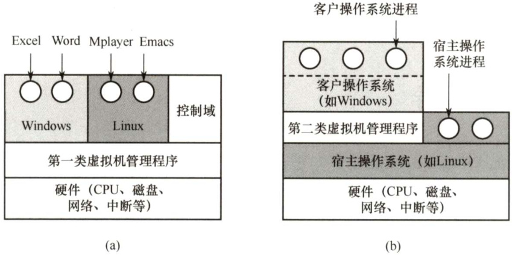

#### 1.6 虚拟机  

#### 1.6.1 虚拟机的基本概念  

虚拟机是一台逻辑计算机，是指利用特殊的虚拟化技术，通过隐藏特定计算平台的实际物理特性，为用户提供抽象的、统一的、模拟的计算环境。有两类虚拟化方法。  

#### 1．第一类虚拟机管理程序  

从技术上讲，第一类虚拟机管理程序就像一个操作系统，因为它是唯一一个运行在最高特权级的程序。它在裸机上运行并且具备多道程序功能。虚拟机管理程序向上层提供若干台虚拟机，这些虚拟机是裸机硬件的精确复制品。由于每台虚拟机都与裸机相同，所以在不同的虚拟机上可以运行任何不同的操作系统。图1.7(a)中显示了第一类虚拟机管理程序。  

  
图1.7两类虚拟机管理程序在系统中的位置  

虚拟机作为用户态的一个进程运行，不允许执行敏感指令。然而，虚拟机上的操作系统认为自己运行在内核态（实际上不是)，称为虚拟内核态。虚拟机中的用户进程认为自己运行在用户态（实际上确实是)。当虚拟机操作系统执行了一条CPU处于内核态才允许执行的指令时，会陷入虚拟机管理程序。在支持虚拟化的CPU上，虚拟机管理程序检查这条指令是由虚拟机中的操作系统执行的还是由用户程序执行的。如果是前者，虚拟机管理程序将安排这条指令功能的正确执行。否则，虚拟机管理程序将模拟真实硬件面对用户态执行敏感指令时的行为。  

在过去不支持虚拟化的CPU上，真实硬件不会直接执行虚拟机中的敏感指令，这些敏感指令被转为对虚拟机管理程序的调用，由虚拟机管理程序模拟这些指令的功能。  

#### 2．第二类虚拟机管理程序  

图1.7(b)中显示了第二类虚拟机管理程序。它是一个依赖于Windows、Linux等操作系统分配和调度资源的程序，很像一个普通的进程。第二类虚拟机管理程序仍然伪装成具有CPU和各种设备的完整计算机。VMwareWorkstation 是首个X86平台上的第二类虚拟机管理程序。  

运行在两类虚拟机管理程序上的操作系统都称为客户操作系统。对于第二类虚拟机管理程序，运行在底层硬件上的操作系统称为宿主操作系统。  

首次启动时，第二类虚拟机管理程序像一台刚启动的计算机那样运转，期望找到的驱动器可以是虚拟设备。然后将操作系统安装到虚拟磁盘上（其实只是宿主操作系统中的一个文件)。客户操作系统安装完成后，就能启动并运行。  

虚拟化在Web主机领域很流行。没有虚拟化，服务商只能提供共享托管（不能控制服务器的软件）和独占托管（成本较高)。当服务商提供租用虚拟机时，一台物理服务器就可以运行多个虚拟机，每个虚拟机看起来都是一台完整的服务器，客户可以在虚拟机上安装自己想用的操作系统和软件，但是只需支付较低的费用。这就是市面上常见的“云”主机。  

有的教材将第一类虚拟化技术称为裸金属架构，将第二类虚拟化技术称为寄居架构。  

#### 1.6.2 本节习题精选  

#### 一、单项选择题  

01.用（）设计的操作系统结构清晰且便于调试。  

A．分层式构架 B．模块化构架 C.微内核构架 D.宏内核构架  

02．下列关于分层式结构操作系统的说法中，（）是错误的。  

A.各层之间只能是单向依赖或单向调用  
B．容易实现在系统中增加或替换一层而不影响其他层  
C.具有非常灵活的依赖关系  
D.系统效率较低  

03.相对于微内核系统，（）不属于大内核操作系统的缺点。  

A.占用内存空间大 B.缺乏可扩展性而不方便移植 C.内核切换太慢 D.可靠性较低  

04.下列说法中，（）不适合描述微内核操作系统。  

A．内核足够小 B．功能分层设计C.基于C/S模式 D．策略与机制分离  

05．对于以下四种服务，在采用微内核结构的操作系统中，（）不宜放在微内核中，  

I.进程间通信机制 II．低级I/O III.低级进程管理和调度IV．中断和陷入处理 V．文件系统服务  

A.I、Ⅱ和I B.Ⅱ和V C.仅V D.IV和V  

06.相对于传统操作系统结构，采用微内核结构设计和实现操作系统有诸多好处，下列（）是微内核结构的特点。  

I．使系统更高效 II.添加系统服务时，不必修改内核  

III．微内核结构没有单一内核稳定 IV.使系统更可靠  

A.I、IⅢ、IV B.I、Ⅱ、IV C.Ⅱ、IV D.I、IV  

07.下列关于操作系统结构的说法中，正确的是（）。  

I.当前广泛使用的WindowsXP操作系统，采用的是分层式OS结构  
II.模块化的OS结构设计的基本原则是，每一层都仅使用其底层所提供的功能和服务，这样就使系统的调试和验证都变得容易  
III．由于微内核结构能有效支持多处理机运行，故非常适合于分布式系统环境  
IV.采用微内核结构设计和实现操作系统具有诸多好处，如添加系统服务时，不必修改内核、使系统更高效。  

A.I和ⅡI B.I和III C.II D.IⅢ和IV  

08.对于计算机操作系统引导，描述不正确的是（）。  

A．计算机的引导程序驻留在ROM中，开机后自动执行B．引导程序先做关键部位的自检，并识别已连接的外设C.引导程序会将硬盘中存储的操作系统全部加载到内存中D.若计算机中安装了双系统，引导程序会与用户交互加载有关系统  

09.计算机操作系统的引导程序位于（）中。  

A．主板BIOS B．片外Cache C.主存ROM区 D.硬盘  

10．计算机的启动过程是（）。 $\textcircled{1}$ CPU 加电，CS:IP指向FFFFOH； $\textcircled{2}$ 进行操作系统引导；$\textcircled{3}$ 执行JMP指令跳转到BIOS； $\textcircled{4}$ 登记BIOS中断例程入口地址； $\textcircled{5}$ 硬件自检。  

A. $\textcircled{1}\textcircled{2}\textcircled{3}\textcircled{4}\textcircled{5}$ B. $\textcircled{1}\textcircled{3}\textcircled{5}\textcircled{4}\textcircled{2}$ C. $\textcircled{1}\textcircled{3}\textcircled{4}\textcircled{5}\textcircled{2}$ D. $\textcircled{1}\textcircled{5}\textcircled{3}\textcircled{4}\textcircled{2}$  

11．检查分区表是否正确，确定哪个分区为活动分区，并在程序结束时将该分区的启动程序（操作系统引导扇区）调入内存加以执行，这是（）的任务。  

A.MBR B．引导程序 C.操作系统 D.BIOS  

12．下列关于虚拟机的说法中，正确的是（）。  

I．虚拟机可以用软件实现 ⅡI．虚拟机可以用硬件实现  

II多台虚拟机可同时运行在同一物理机器上，它实现了真正的并行  

A.I和Ⅱ B.I和IⅢI C.仅I D.I、Ⅱ和IⅢI  

13．下列关于VMwareworkstation虚拟机的说法中，错误的是（）。  

A．真实硬件不会直接执行虚拟机中的敏感指令  
B.虚拟机中只能安装一种操作系统  
C．虚拟机是运行在计算机中的一个应用程序  
D．虚拟机文件封装在一个文件夹中，并存储在数据存储器中  

#### 1.6.3 答案与解析  

#### 一、单项选择题  

01.A  

分层式结构简化了系统的设计和实现，每层只能调用紧邻它的低层的功能和服务；便于系统的调试和验证，在调试某层时发现错误，那么错误应在这层上，这是因为其低层都已调试好。  

02.C  

单向依赖是分层式OS 的特点。分层式OS中增加或替换一个层中的模块或整层时，只要不改变相应层间的接口，就不会影响其他层，因而易于扩充和维护。层次定义好后，相当于各层之间的依赖关系也就固定了，因此往往显得不够灵活，C错误。每执行一个功能，通常都要自上而下地穿越多层，增加了额外的开销，导致系统效率降低。  

03.C  

微内核和宏内核作为两种对立的结构，它们的优缺点也是对立的。微内核OS 的主要缺点是性能问题，因为需要频繁地在核心态和用户态之间进行切换，因而切换开销偏大。  

04.B  

功能分层设计是分层式OS的特点。通常可以从四个方面来描述微内核OS： $\textcircled{1}$ 内核足够小；  

$\textcircled{2}$ 基于客户/服务器模式； $\textcircled{3}$ 应用“机制与策略分离”原理； $\textcircled{4}$ 采用面向对象技术。  

05.C  

进程（线程）之间的通信功能是微内核最频繁使用的功能，因此几乎所有微内核OS都将其放入微内核。低级I/O和硬件紧密相关，因此应放入微内核。低级进程管理和调度属于调度功能的机制部分，应将它放入微内核。微内核OS 将与硬件紧密相关的一小部分放入微内核处理，此时微内核的主要功能是捕获所发生的中断和陷入事件，并进行中断响应处理，识别中断或陷入的事件后，再发送给相关的服务器处理，故中断和陷入处理也应放入微内核。而文件系统服务是放在微内核外的文件服务器中实现的，故仅V不宜放在微内核中。  

06.C  

微内核结构需要频繁地在管态和目态之间进行切换，操作系统的执行开销相对偏大，那些移出内核的操作系统代码根据分层的原则被划分成若干服务程序，它们的执行相互独立，交互则都借助于微内核进行通信，影响了系统的效率，因此I不是优势。由于内核的服务变少，且一般来说内核的服务越少内核越稳定，所以III错误。而ⅡI、IV正是微内核结构的优点。  

07.C  

Windows是宏内核操作系统，I错误。ⅡI描述的是层次化构架的原则。在微内核构架中，客户和服务器之间、服务器和服务器之间的通信采用消息传递机制，这就使得微内核系统能很好地支持分布式系统，II正确。添加系统服务时不必修改内核，这就使得微内核构架的可扩展性和灵活性更强；微内核构架的主要问题是性能问题，“使系统更高效”显然错误。  

08.C  

常驻内存的只是操作系统内核，其他部分仅在需要时才调入。  

09.D  

操作系统的引导程序位于磁盘活动分区的引导扇区中。引导程序分为两种：一种是位于ROM中的自举程序（BIOS的组成部分)，用于启动具体的设备；另一种是位于装有操作系统硬盘的活动分区的引导扇区中的引导程序（称为启动管理器)，用于引导操作系统。  

10.C  

解析请扫右侧二维码查阅。  

11.A  

BIOS将控制权交给排在首位的启动设备后，CPU将该设备主引导扇区的内容（主引导记录MBR）加载到内存中，然后由MBR检查分区表，查找活动分区，并将该分区的引导扇区的内容（分区引导记录PBR）加载到内存加以执行。  

12.A  

软件能实现的功能也能由硬件实现，因为虚拟机软件能实现的功能也能由硬件实现，软件和硬件的分界面是系统结构设计者的任务，I和Ⅱ正确。实现真正并行的是多核处理机，多台虚拟机同时运行在同一物理机器上，类似于多个程序运行在同一个系统中。  

13.B  

WMwareworkstation虚拟机属于第二类虚拟机管理程序，如果真实硬件直接执行虚拟机中的敏感指令，那么该指令非法时可能会导致宿主操作系统崩溃，而这是不可能的，实际上是由第二类虚拟机管理程序模拟真实硬件环境。虚拟机看起来和真实物理计算机没什么两样，因此当然可以安装多个操作系统。WMware workstation就是一个安装在计算机上的程序，在创建虚拟机时，会为该虚拟机创建一组文件，这些虚拟机文件都存储在主机的磁盘上。