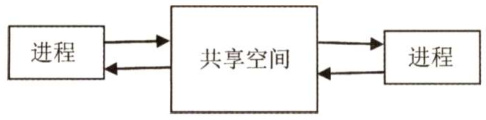
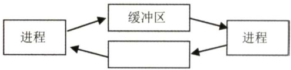
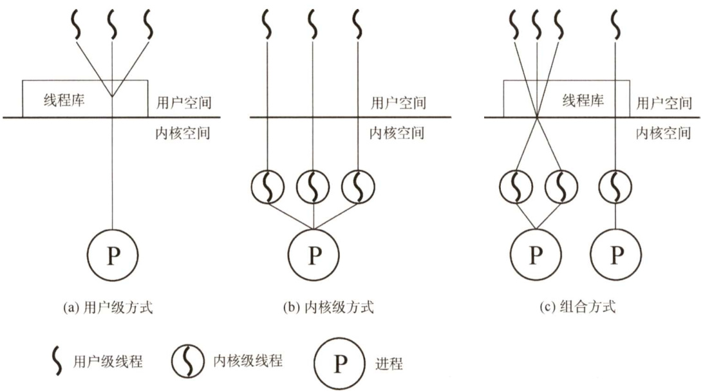
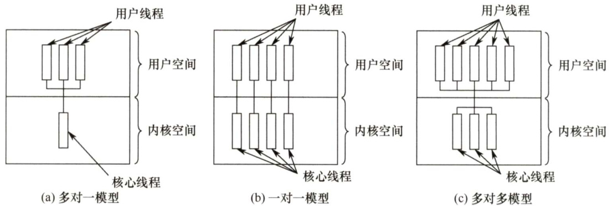
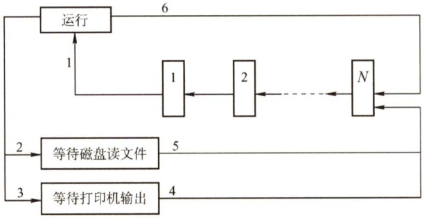

### 2.1 进程与线程  

在学习本节时，请读者思考以下问题：  

1）为什么要引入进程？  
2）什么是进程？进程由什么组成？  
3）进程是如何解决问题的？  

希望读者带着上述问题去学习本节内容，并在学习的过程中多思考，从而更深入地理解本节内容。进程本身是一个比较抽象的概念，它不是实物，看不见、摸不着，初学者在理解进程概念时存在一定困难，在介绍完进程的相关知识后，我们会用比较直观的例子帮助大家理解。  

#### 2.1.1 进程的概念和特征  

#### 1.进程的概念  

在多道程序环境下，允许多个程序并发执行，此时它们将失去封闭性，并具有间断性及不可再现性的特征。为此引入了进程（Process）的概念，以便更好地描述和控制程序的并发执行，实现操作系统的并发性和共享性（最基本的两个特性)。  

为了使参与并发执行的每个程序（含数据）都能独立地运行，必须为之配置一个专门的数据结构，称为进程控制块（Process ControlBlock，PCB）。系统利用PCB来描述进程的基本情况和运行状态，进而控制和管理进程。相应地，由程序段、相关数据段和PCB三部分构成了进程实体（又称进程映像)。所谓创建进程，实质上是创建进程实体中的PCB；而撤销进程，实质上是撤销进程的PCB。值得注意的是，进程映像是静态的，进程则是动态的。  

注意：PCB是进程存在的唯一标志！  

从不同的角度，进程可以有不同的定义，比较典型的定义有：  

1）进程是程序的一次执行过程。  
2）进程是一个程序及其数据在处理机上顺序执行时所发生的活动。  
3）进程是具有独立功能的程序在一个数据集合上运行的过程，它是系统进行资源分配和调度的一个独立单位。  

引入进程实体的概念后，我们可以把传统操作系统中的进程定义为：“进程是进程实体的运行过程，是系统进行资源分配和调度的一个独立单位。”  

读者要准确理解这里说的系统资源。它指处理机、存储器和其他设备服务于某个进程的“时间”，例如把处理机资源理解为处理机的时间片才是准确的。因为进程是这些资源分配和调度的独立单位，即“时间片”分配的独立单位，这就决定了进程一定是一个动态的、过程性的概念。  

#### 2.进程的特征  

进程是由多道程序的并发执行而引出的，它和程序是两个截然不同的概念。进程的基本特征是对比单个程序的顺序执行提出的，也是对进程管理提出的基本要求。  

1）动态性。进程是程序的一次执行，它有着创建、活动、暂停、终止等过程，具有一定的生命周期，是动态地产生、变化和消亡的。动态性是进程最基本的特征。  
2）并发性。指多个进程实体同存于内存中，能在一段时间内同时运行。引入进程的目的就是使进程能和其他进程并发执行。并发性是进程的重要特征，也是操作系统的重要特征。  
3）独立性。指进程实体是一个能独立运行、独立获得资源和独立接受调度的基本单位。凡未建立PCB的程序，都不能作为一个独立的单位参与运行。  
4）异步性。由于进程的相互制约，使得进程按各自独立的、不可预知的速度向前推进。异步性会导致执行结果的不可再现性，为此在操作系统中必须配置相应的进程同步机制。  

通常不会直接考查进程有什么特性，所以读者对上面的4个特性不必记忆，只求理解。  

#### 2.1.2 进程的状态与转换  

进程在其生命周期内，由于系统中各进程之间的相互制约及系统的运行环境的变化，使得进程的状态也在不断地发生变化。通常进程有以下5种状态，前3种是进程的基本状态。  

1）运行态。进程正在处理机上运行。在单处理机中，每个时刻只有一个进程处于运行态。  
2）就绪态。进程获得了除处理机外的一切所需资源，一旦得到处理机，便可立即运行。系统中处于就绪状态的进程可能有多个，通常将它们排成一个队列，称为就绪队列。  
3）阻塞态，又称等待态。进程正在等待某一事件而暂停运行，如等待某资源为可用（不包括处理机）或等待输入/输出完成。即使处理机空闲，该进程也不能运行。系统通常将处于阻塞态的进程也排成一个队列，甚至根据阻塞原因的不同，设置多个阻塞队列。  
4）创建态。进程正在被创建，尚未转到就绪态。创建进程需要多个步骤：首先申请一个空白PCB，并向PCB中填写用于控制和管理进程的信息；然后为该进程分配运行时所必须的资源；最后把该进程转入就绪态并插入就绪队列。但是，如果进程所需的资源尚不能得到满足，如内存不足，则创建工作尚未完成，进程此时所处的状态称为创建态。  
5）结束态。进程正从系统中消失，可能是进程正常结束或其他原因退出运行。进程需要结束运行时，系统首先将该进程置为结束态，然后进一步处理资源释放和回收等工作。  

注意区别就绪态和等待态：就绪态是指进程仅缺少处理器，只要获得处理机资源就立即运行；而等待态是指进程需要其他资源（除了处理机）或等待某一事件。之所以把处理机和其他资源划分开，是因为在分时系统的时间片轮转机制中，每个进程分到的时间片是若干毫秒。也就是说，进程得到处理机的时间很短且非常频繁，进程在运行过程中实际上是频繁地转换到就绪态的；而其他资源（如外设）的使用和分配或某一事件的发生（如I/O操作的完成）对应的时间相对来说很长，进程转换到等待态的次数也相对较少。这样来看，就绪态和等待态是进程生命周期中两个完全不同的状态，显然需要加以区分。  

图2.1说明了5种进程状态的转换，而3种基本状态之间的转换如下：  

·就绪态→运行态：处于就绪态的进程被调度后，获得处理机资源（分派处理机时间片)，于是进程由就绪态转换为运行态。  
·运行态 $\rightarrow$ 就绪态：处于运行态的进程在时间片用完后，不得不让出处理机，从而进程由运行态转换为就绪态。此外，在可剥夺的操作系统中，当有更高优先级的进程就绪时，调度程序将正在执行的进程转换为就绪态，让更高优先级的进程执行。  
·运行态 $\rightarrow$ 阻塞态：进程请求某一资源（如外设）的使用和分配或等待某一事件的发生（如I/O 操作的完成）时，它就从运行态转换为阻塞态。进程以系统调用的形式请求操作系统提供服务，这是一种特殊的、由运行用户态程序调用操作系统内核过程的形式。  
·阻塞态→就绪态：进程等待的事件到来时，如I/O操作结束或中断结束时，中断处理程序必须把相应进程的状态由阻塞态转换为就绪态。  

  
图2.15种进程状态的转换  

需要注意的是，一个进程从运行态变成阻塞态是主动的行为，而从阻塞态变成就绪态是被动的行为，需要其他相关进程的协助。  

#### 2.1.3 进程的组织  

进程是一个独立的运行单位，也是操作系统进行资源分配和调度的基本单位。它由以下三部分组成，其中最核心的是进程控制块（PCB）。  

#### 1．进程控制块  

进程创建时，操作系统为它新建一个PCB，该结构之后常驻内存，任意时刻都可以存取，并在进程结束时删除。PCB是进程实体的一部分，是进程存在的唯一标志。  

进程执行时，系统通过其PCB了解进程的现行状态信息，以便操作系统对其进行控制和管理；进程结束时，系统收回其PCB，该进程随之消亡。  

当操作系统欲调度某进程运行时，要从该进程的PCB中查出其现行状态及优先级；在调度到某进程后，要根据其PCB中所保存的处理机状态信息，设置该进程恢复运行的现场，并根据其PCB中的程序和数据的内存始址，找到其程序和数据；进程在运行过程中，当需要和与之合作的进程实现同步、通信或访问文件时，也需要访问PCB；当进程由于某种原因而暂停运行时，又需将其断点的处理机环境保存在PCB中。可见，在进程的整个生命期中，系统总是通过PCB对进程进行控制的，亦即系统唯有通过进程的PCB才能感知到该进程的存在。  

表2.1是一个PCB的实例。PCB主要包括进程描述信息、进程控制和管理信息、资源分配清单和处理机相关信息等。各部分的主要说明如下：  

表2.1PCB通常包含的内容  

<html><body><table><tr><td>进程描述信息</td><td>进程控制和管理信息</td><td>资源分配清单</td><td>处理机相关信息</td></tr><tr><td>进程标识符（PID）</td><td>进程当前状态</td><td>代码段指针</td><td>通用寄存器值</td></tr><tr><td>用户标识符（UID）</td><td>进程优先级</td><td>数据段指针</td><td>地址寄存器值</td></tr><tr><td></td><td>代码运行入口地址</td><td>堆栈段指针</td><td>控制寄存器值</td></tr><tr><td></td><td>程序的外存地址</td><td>文件描述符</td><td>标志寄存器值</td></tr><tr><td></td><td>进入内存时间</td><td>键盘</td><td>状态字</td></tr><tr><td></td><td>处理机占用时间</td><td>鼠标</td><td></td></tr><tr><td></td><td>信号量使用</td><td></td><td></td></tr></table></body></html>  

1）进程描述信息。进程标识符：标志各个进程，每个进程都有一个唯一的标识号。用户标识符：进程归属的用户，用户标识符主要为共享和保护服务。  
2）进程控制和管理信息。进程当前状态：描述进程的状态信息，作为处理机分配调度的依据。进程优先级：描述进程抢占处理机的优先级，优先级高的进程可优先获得处理机。  
3）资源分配清单，用于说明有关内存地址空间或虚拟地址空间的状况，所打开文件的列表和所使用的输入/输出设备信息。  
4）处理机相关信息，也称处理机的上下文，主要指处理机中各寄存器的值。当进程处于执行态时，处理机的许多信息都在寄存器中。当进程被切换时，处理机状态信息都必须保存在相应的PCB中，以便在该进程重新执行时，能从断点继续执行。  

在一个系统中，通常存在着许多进程的PCB，有的处于就绪态，有的处于阻塞态，而且阻塞的原因各不相同。为了方便进程的调度和管理，需要将各进程的PCB用适当的方法组织起来。目前，常用的组织方式有链接方式和索引方式两种。链接方式将同一状态的PCB链接成一个队列，不同状态对应不同的队列，也可把处于阻塞态的进程的PCB，根据其阻塞原因的不同，排成多个阻塞队列。索引方式将同一状态的进程组织在一个索引表中，索引表的表项指向相应的PCB，不同状态对应不同的索引表，如就绪索引表和阻塞索引表等。  

#### 2．程序段  

程序段就是能被进程调度程序调度到CPU执行的程序代码段。注意，程序可被多个进程共享，即多个进程可以运行同一个程序。  

#### 3.数据段  

一个进程的数据段，可以是进程对应的程序加工处理的原始数据，也可以是程序执行时产生的中间或最终结果。  

#### 2.1.4 进程控制  

进程控制的主要功能是对系统中的所有进程实施有效的管理，它具有创建新进程、撤销已有进程、实现进程状态转换等功能。在操作系统中，一般把进程控制用的程序段称为原语，原语的特点是执行期间不允许中断，它是一个不可分割的基本单位。  

#### 1．进程的创建  

允许一个进程创建另一个进程，此时创建者称为父进程，被创建的进程称为子进程。子进程可以继承父进程所拥有的资源。当子进程被撤销时，应将其从父进程那里获得的资源归还给父进程。此外，在撤销父进程时，通常也会同时撤销其所有的子进程。  

在操作系统中，终端用户登录系统、作业调度、系统提供服务、用户程序的应用请求等都会引起进程的创建。操作系统创建一个新进程的过程如下（创建原语)：  

1）为新进程分配一个唯一的进程标识号，并申请一个空白PCB（PCB是有限的)。若PCB申请失败，则创建失败。  
2）为进程分配其运行所需的资源，如内存、文件、I/O设备和CPU时间等（在PCB中体现)。这些资源或从操作系统获得，或仅从其父进程获得。如果资源不足（如内存)，则并不是创建失败，而是处于创建态，等待内存资源。  
3）初始化PCB，主要包括初始化标志信息、初始化处理机状态信息和初始化处理机控制信息，以及设置进程的优先级等。  
4）若进程就绪队列能够接纳新进程，则将新进程插入就绪队列，等待被调度运行。  

#### 2.进程的终止  

引起进程终止的事件主要有： $\textcircled{1}$ 正常结束，表示进程的任务已完成并准备退出运行。 $\textcircled{2}$ 异常结束，表示进程在运行时，发生了某种异常事件，使程序无法继续运行，如存储区越界、保护错、非法指令、特权指令错、运行超时、算术运算错、I/O故障等。 $\textcircled{3}$ 外界干预，指进程应外界的请求而终止运行，如操作员或操作系统干预、父进程请求和父进程终止。  

操作系统终止进程的过程如下（终止原语)：  

1）根据被终止进程的标识符，检索出该进程的PCB，从中读出该进程的状态。  
2）若被终止进程处于执行状态，立即终止该进程的执行，将处理机资源分配给其他进程。  
3）若该进程还有子孙进程，则应将其所有子孙进程终止。  
4）将该进程所拥有的全部资源，或归还给其父进程，或归还给操作系统。  
5）将该PCB从所在队列（链表）中删除。  

#### 3.进程的阻塞和唤醒  

正在执行的进程，由于期待的某些事件未发生，如请求系统资源失败、等待某种操作的完成、新数据尚未到达或无新任务可做等，进程便通过调用阻塞原语（Block)，使自己由运行态变为阻  

塞态。可见，阻塞是进程自身的一种主动行为，也因此只有处于运行态的进程（获得CPU)，才可能将其转为阻塞态。阻塞原语的执行过程如下：  

1）找到将要被阻塞进程的标识号对应的PCB。  

2）若该进程为运行态，则保护其现场，将其状态转为阻塞态，停止运行。  

3）把该PCB插入相应事件的等待队列，将处理机资源调度给其他就绪进程。  

当被阻塞进程所期待的事件出现时，如它所启动的I/O操作已完成或其所期待的数据已到达，由有关进程（比如，释放该I/O设备的进程，或提供数据的进程）调用唤醒原语（Wakeup），将等待该事件的进程唤醒。唤醒原语的执行过程如下：  

1）在该事件的等待队列中找到相应进程的PCB。  

2）将其从等待队列中移出，并置其状态为就绪态。  

3）把该PCB插入就绪队列，等待调度程序调度。  

应当注意，Block原语和Wakeup原语是一对作用刚好相反的原语，必须成对使用。如果在某进程中调用了Block 原语，则必须在与之合作的或其他相关的进程中安排一条相应的Wakeup原语，以便唤醒阻塞进程；否则，阻塞进程将会因不能被唤醒而永久地处于阻塞状态。  

#### 2.1.5 进程的通信  

进程通信是指进程之间的信息交换。PV操作是低级通信方式，高级通信方式是指以较高的效率传输大量数据的通信方式。高级通信方法主要有以下三类。  

#### 1．共享存储  

在通信的进程之间存在一块可直接访问的共享空间，通过对这片共享空间进行写/读操作实现进程之间的信息交换，如图2.2所示。在对共享空间进行写/读操作时，需要使用同步互斥工具（如P 操作、V操作)，对共享空间的写/读进行控制。共享存储又分为两种：低级方式的共享是基于数据结构的共享；高级方式的共享则是基于存储区的共享。操作系统只负责为通信进程提供可共享使用的存储空间和同步互斥工具，而数据交换则由用户自己安排读/写指令完成。  

注意，进程空间一般都是独立的，进程运行期间一般不能访问其他进程的空间，想让两个进程共享空间，必须通过特殊的系统调用实现，而进程内的线程是自然共享进程空间的。  

简单理解就是，甲和乙中间有一个大布袋，甲和乙交换物品是通过大布袋进行的，甲把物品放在大布袋里，乙拿走。但乙不能直接到甲的手中拿东西，甲也不能直接到乙的手中拿东西。  

#### 2.消息传递  

在消息传递系统中，进程间的数据交换以格式化的消息（Message）为单位。若通信的进程之间不存在可直接访问的共享空间，则必须利用操作系统提供的消息传递方法实现进程通信。进程通过系统提供的发送消息和接收消息两个原语进行数据交换。这种方式隐藏了通信实现细节，使通信过程对用户透明，简化了通信程序的设计，是当前应用最广泛的进程间通信机制。在微内核操作系统中，微内核与服务器之间的通信就采用了消息传递机制。由于该机制能很好地支持多处理机系统、分布式系统和计算机网络，因此也成为这些领域最主要的通信工具。  

1）直接通信方式。发送进程直接把消息发送给接收进程，并将它挂在接收进程的消息缓冲队列上，接收进程从消息缓冲队列中取得消息，如图2.3所示。  

  
图2.2共享存储  

  
图2.3消息传递  

2）间接通信方式。发送进程把消息发送到某个中间实体，接收进程从中间实体取得消息。  

这种中间实体一般称为信箱。该通信方式广泛应用于计算机网络中。  

简单理解就是，甲要告诉乙某些事情，就要写信，然后通过邮差送给乙。直接通信就是邮差把信直接送到乙的手上；间接通信就是乙家门口有一个邮箱，邮差把信放到邮箱里。  

#### 3.管道通信  

管道通信是消息传递的一种特殊方式（见图2.4)。所谓“管道”，是指用于连接一个读进程和一个写进程以实现它们之间的通信的一个共享文件，又名pipe文件。向管道（共享文件）提供输入的发送进程（即写进程)，以字符流形式将大量的数据送入（写）管道；而接收管道输出的接收进程（即读进程）则从管道中接收（读）数据。为了协调双方的通信，管道机制必须提供以下三方面的协调能力：互斥、同步和确定对方的存在。  

  
图2.4 管道通信  

在Linux中，管道是一种使用非常频繁的通信机制。从本质上说，管道也是一种文件，但它又和一般的文件有所不同，管道可以克服使用文件进行通信的两个问题，具体表现如下：  

1）限制管道的大小。实际上，管道是一个固定大小的缓冲区。在Linux 中，该缓冲区的大小为 4KB，这使得它的大小不像文件那样不加检验地增长。使用单个固定缓冲区也会带来问题，比如在写管道时可能变满，这种情况发生时，随后对管道的write()调用将默认地被阻塞，等待某些数据被读取，以便腾出足够的空间供write(调用写。  
2）读进程也可能工作得比写进程快。当所有当前进程数据已被读取时，管道变空。当这种情况发生时，一个随后的read(调用将默认地被阻塞，等待某些数据被写入，这解决了 read()调用返回文件结束的问题。  

注意：从管道读数据是一次性操作，数据一旦被读取，就释放空间以便写更多数据。管道只能采用半双工通信，即某一时刻只能单向传输。要实现父子进程互动通信，需定义两个管道。  

管道可以理解为共享存储的优化和发展，因为在共享存储中，若某进程要访问共享存储空间，则必须没有其他进程在该共享存储空间中进行写操作，否则访问行为就会被阻塞。而管道通信中，存储空间进化成了缓冲区，缓冲区只允许一边写入、另一边读出，因此只要缓冲区中有数据，进程就能从缓冲区中读出，而不必担心会因为其他进程在其中进行写操作而遭到阻塞，因为写进程会先把缓冲区写满，然后才让读进程读，当缓冲区中还有数据时，写进程不会往缓冲区写数据。当然，这也决定了管道通信必然是半双工通信。  

#### 2.1.6 线程和多线程模型  

#### 1．线程的基本概念  

引入进程的目的是更好地使多道程序并发执行，提高资源利用率和系统吞吐量；而引入线程的目的则是减小程序在并发执行时所付出的时空开销，提高操作系统的并发性能。  

线程最直接的理解就是“轻量级进程”，它是一个基本的CPU执行单元，也是程序执行流的最小单元，由线程ID、程序计数器、寄存器集合和堆栈组成。线程是进程中的一个实体，是被系统独立调度和分派的基本单位，线程自己不拥有系统资源，只拥有一点儿在运行中必不可少的资源，但它可与同属一个进程的其他线程共享进程所拥有的全部资源。一个线程可以创建和撤销另一个线程，同一进程中的多个线程之间可以并发执行。由于线程之间的相互制约，致使线程在运行中呈现出间断性。线程也有就绪、阻塞和运行三种基本状态。  

引入线程后，进程的内涵发生了改变，进程只作为除CPU 外的系统资源的分配单元，而线程则作为处理机的分配单元。由于一个进程内部有多个线程，若线程的切换发生在同一个进程内部，则只需要很少的时空开销。下面从几个方面对线程和进程进行比较。  

#### 2.线程与进程的比较  

1）调度。在传统的操作系统中，拥有资源和独立调度的基本单位都是进程，每次调度都要进行上下文切换，开销较大。在引入线程的操作系统中，线程是独立调度的基本单位，而线程切换的代价远低于进程。在同一进程中，线程的切换不会引起进程切换。但从一个进程中的线程切换到另一个进程中的线程时，会引起进程切换。  
2）并发性。在引入线程的操作系统中，不仅进程之间可以并发执行，而且一个进程中的多个线程之间亦可并发执行，甚至不同进程中的线程也能并发执行，从而使操作系统具有更好的并发性，提高了系统资源的利用率和系统的吞吐量。  
3）拥有资源。进程是系统中拥有资源的基本单位，而线程不拥有系统资源（仅有一点必不可少、能保证独立运行的资源)，但线程可以访问其隶属进程的系统资源，这主要表现在属于同一进程的所有线程都具有相同的地址空间。要知道，若线程也是拥有资源的单位，则切换线程就需要较大的时空开销，线程这个概念的提出就没有意义。  
4）独立性。每个进程都拥有独立的地址空间和资源，除了共享全局变量，不允许其他进程访问。某进程中的线程对其他进程不可见。同一进程中的不同线程是为了提高并发性及进行相互之间的合作而创建的，它们共享进程的地址空间和资源。  
5）系统开销。在创建或撤销进程时，系统都要为之分配或回收进程控制块PCB及其他资源，如内存空间、I/O设备等。操作系统为此所付出的开销，明显大于创建或撤销线程时的开销。类似地，在进程切换时涉及进程上下文的切换，而线程切换时只需保存和设置少量寄存器内容，开销很小。此外，由于同一进程内的多个线程共享进程的地址空间，因此这些线程之间的同步与通信非常容易实现，甚至无须操作系统的干预。  
6）支持多处理机系统。对于传统单线程进程，不管有多少处理机，进程只能运行在一个处理机上。对于多线程进程，可以将进程中的多个线程分配到多个处理机上执行。  

3.线程的属性  

多线程操作系统中的进程已不再是一个基本的执行实体，但它仍具有与执行相关的状态。所谓进程处于“执行”状态，实际上是指该进程中的某线程正在执行。线程的主要属性如下：  

1）线程是一个轻型实体，它不拥有系统资源，但每个线程都应有一个唯一的标识符和一个线程控制块，线程控制块记录了线程执行的寄存器和栈等现场状态。  
2）不同的线程可以执行相同的程序，即同一个服务程序被不同的用户调用时，操作系统把它们创建成不同的线程。  
3）同一进程中的各个线程共享该进程所拥有的资源。  
4）线程是处理机的独立调度单位，多个线程是可以并发执行的。在单CPU的计算机系统中，各线程可交替地占用CPU；在多CPU的计算机系统中，各线程可同时占用不同的CPU，若各个CPU同时为一个进程内的各线程服务，则可缩短进程的处理时间。  
5）一个线程被创建后，便开始了它的生命周期，直至终止。线程在生命周期内会经历阻塞态、就绪态和运行态等各种状态变化。  

为什么线程的提出有利于提高系统并发性？可以这样来理解：由于有了线程，线程切换时，有可能会发生进程切换，也有可能不发生进程切换，平均而言每次切换所需的开销就变小了，因  

此能够让更多的线程参与并发，而不会影响到响应时间等问题。  

#### 4.线程的状态与转换  

与进程一样，各线程之间也存在共享资源和相互合作的制约关系，致使线程在运行时也具有间断性。相应地，线程在运行时也具有下面三种基本状态。  

执行状态：线程已获得处理机而正在运行。  
就绪状态：线程已具备各种执行条件，只需再获得CPU便可立即执行。  
阻塞状态：线程在执行中因某事件受阻而处于暂停状态。  
线程这三种基本状态之间的转换和进程基本状态之间的转换是一样的。  

#### 5.线程的组织与控制  

（1）线程控制块  

与进程类似，系统也为每个线程配置一个线程控制块TCB，用于记录控制和管理线程的信息。线程控制块通常包括： $\textcircled{1}$ 线程标识符； $\textcircled{2}$ 一组寄存器，包括程序计数器、状态寄存器和通用寄存器； $\textcircled{3}$ 线程运行状态，用于描述线程正处于何种状态； $\textcircled{4}$ 优先级； $\textcircled{5}$ 线程专有存储区，线程切换时用于保存现场等； $\textcircled{6}$ 堆栈指针，用于过程调用时保存局部变量及返回地址等。  

同一进程中的所有线程都完全共享进程的地址空间和全局变量。各个线程都可以访问进程地址空间的每个单元，所以一个线程可以读、写或甚至清除另一个线程的堆栈。  

#### （2）线程的创建  

线程也是具有生命期的，它由创建而产生，由调度而执行，由终止而消亡。相应地，在操作系统中就有用于创建线程和终止线程的函数(或系统调用)。  

用户程序启动时，通常仅有一个称为“初始化线程”的线程正在执行，其主要功能是用于创建新线程。在创建新线程时，需要利用一个线程创建函数，并提供相应的参数，如指向线程主程序的入口指针、堆栈的大小、线程优先级等。线程创建函数执行完后，将返回一个线程标识符。  

#### （3）线程的终止  

当一个线程完成自己的任务后，或线程在运行中出现异常而要被强制终止时，由终止线程调用相应的函数执行终止操作。但是有些线程（主要是系统线程）一旦被建立，便一直运行而不会被终止。通常，线程被终止后并不立即释放它所占有的资源，只有当进程中的其他线程执行了分离函数后，被终止线程才与资源分离，此时的资源才能被其他线程利用。  

被终止但尚未释放资源的线程仍可被其他线程调用，以使被终止线程重新恢复运行。  

#### 6.线程的实现方式  

线程的实现可以分为两类：用户级线程（User-LevelThread，ULT）和内核级线程（Kemel-LevelThread，KLT)。内核级线程又称内核支持的线程。  

（1）用户级线程（ULT）  

在用户级线程中，有关线程管理（创建、撤销和切换等）的所有工作都由应用程序在用户空间中完成，内核意识不到线程的存在。应用程序可以通过使用线程库设计成多线程程序。通常，应用程序从单线程开始，在该线程中开始运行，在其运行的任何时刻，可以通过调用线程库中的派生例程创建一个在相同进程中运行的新线程。图2.5(a)说明了用户级线程的实现方式。  

对于设置了用户级线程的系统，其调度仍是以进程为单位进行的，各个进程轮流执行一个时间片。假设进程A包含1个用户级线程，进程B包含100个用户级线程，这样，进程A中线程的运行时间将是进程B中各线程运行时间的100倍，因此对线程来说实质上是不公平的。  

这种实现方式的优点如下： $\textcircled{1}$ 线程切换不需要转换到内核空间，节省了模式切换的开销。 $\textcircled{2}$  

调度算法可以是进程专用的，不同的进程可根据自身的需要，对自己的线程选择不同的调度算法。  
$\textcircled{3}$ 用户级线程的实现与操作系统平台无关，对线程管理的代码是属于用户程序的一部分。  

这种实现方式的缺点如下： $\textcircled{1}$ 系统调用的阻塞问题，当线程执行一个系统调用时，不仅该线程被阻塞，而且进程内的所有线程都被阻塞。 $\textcircled{2}$ 不能发挥多处理机的优势，内核每次分配给一个进程的仅有一个CPU，因此进程中仅有一个线程能执行。  

  
图2.5用户级线程和内核级线程  

（2）内核级线程（KLT）  

在操作系统中，无论是系统进程还是用户进程，都是在操作系统内核的支持下运行的，与内核紧密相关。内核级线程同样也是在内核的支持下运行的，线程管理的所有工作也是在内核空间内实现的。内核空间也为每个内核级线程设置一个线程控制块，内核根据该控制块感知某线程的存在，并对其加以控制。图2.5(b)说明了内核级线程的实现方式。  

这种实现方式的优点如下： $\textcircled{1}$ 能发挥多处理机的优势，内核能同时调度同一进程中的多个线程并行执行。 $\textcircled{2}$ 如果进程中的一个线程被阻塞，内核可以调度该进程中的其他线程占用处理机，也可运行其他进程中的线程。 $\textcircled{3}$ 内核支持线程具有很小的数据结构和堆栈，线程切换比较快、开销小。 $\textcircled{4}$ 内核本身也可采用多线程技术，可以提高系统的执行速度和效率。  

这种实现方式的缺点如下：同一进程中的线程切换，需要从用户态转到核心态进行，系统开销较大。这是因为用户进程的线程在用户态运行，而线程调度和管理是在内核实现的。  

#### （3）组合方式  

有些系统使用组合方式的多线程实现。在组合实现方式中，内核支持多个内核级线程的建立、调度和管理，同时允许用户程序建立、调度和管理用户级线程。一些内核级线程对应多个用户级线程，这是用户级线程通过时分多路复用内核级线程实现的。同一进程中的多个线程可以同时在多处理机上并行执行，且在阻塞一个线程时不需要将整个进程阻塞，所以组合方式能结合KLT和ULT的优点，并且克服各自的不足。图2.5(c)展示了这种组合实现方式。  

在线程实现方式的介绍中，提到了通过线程库来创建和管理线程。线程库（thread library）是为程序员提供创建和管理线程的API。实现线程库主要的方法有如下两种：  

$\textcircled{1}$ 在用户空间中提供一个没有内核支持的库。这种库的所有代码和数据结构都位于用户空间中。这意味着，调用库内的一个函数只导致用户空间中的一个本地函数的调用。  

$\textcircled{2}$ 实现由操作系统直接支持的内核级的一个库。对于这种情况，库内的代码和数据结构位于内核空间。调用库中的一个API函数通常会导致对内核的系统调用。  

目前使用的三种主要线程库是：POSIXPthreads、Windows API、Java。Pthreads作为POSIX标准的扩展，可以提供用户级或内核级的库。Windows线程库是用于Windows 操作系统的内核级线程库。Java 线程API允许线程在Java程序中直接创建和管理。然而，由于JVM实例通常运行在宿主操作系统之上，Java线程API通常采用宿主系统的线程库来实现，因此在Windows系统中Java线程通常采用WindowsAPI来实现，在类UNIX系统中采用Pthreads来实现。  

#### 7．多线程模型  

有些系统同时支持用户线程和内核线程，由于用户级线程和内核级线程连接方式的不同，从而形成了下面三种不同的多线程模型。  

1）多对一模型。将多个用户级线程映射到一个内核级线程，如图2.6(a)所示。这些用户线程一般属于一个进程，线程的调度和管理在用户空间完成。仅当用户线程需要访问内核时，才将其映射到一个内核级线程上，但是每次只允许一个线程进行映射。优点：线程管理是在用户空间进行的，因而效率比较高。缺点：如果一个线程在访问内核时发生阻塞，则整个进程都会被阻塞；在任何时刻，只有一个线程能够访问内核，多个线程不能同时在多个处理机上运行。  

2）一对一模型。将每个用户级线程映射到一个内核级线程，如图2.6(b)所示。优点：当一个线程被阻塞后，允许调度另一个线程运行，所以并发能力较强。缺点：每创建一个用户线程，相应地就需要创建一个内核线程，开销较大。  

3）多对多模型。将 $n$ 个用户线程映射到 $m$ 个内核级线程上，要求 $n\geq m$ ，如图2.6(c)所示。特点：既克服了多对一模型并发度不高的缺点，又克服了一对一模型的一个用户进程占用太多内核级线程而开销太大的缺点。此外，还拥有上述两种模型各自的优点。  

  
图2.6 多线程模型  

#### 2.1.7 本节小结  

本节开头提出的问题的参考答案如下。  

1）为什么要引入进程？  

在多道程序同时运行的背景下，进程之间需要共享系统资源，因此会导致各程序在执行过程中出现相互制约的关系，程序的执行会表现出间断性的特征。这些特征都是在程序的执行过程中发生的，是动态的过程，而传统的程序本身是一组指令的集合，是一个静态的概念，无法描述程序在内存中的执行情况，即我们无法从程序的字面上看出它何时执行、何时停顿，也无法看出它与其他执行程序的关系，因此，程序这个静态概念已不能如实反映程序并发执行过程的特征。为了深刻描述程序动态执行过程的性质乃至更好地支持和管理多道程序的并发执行，人们引入了进程的概念。  

2）什么是进程？进程由什么组成？  

进程是一个具有独立功能的程序关于某个数据集合的一次运行活动。它可以申请和拥有系统资源，是一个动态的概念，是一个活动的实体。它不只是程序的代码本身，还包括当前的活动，通过程序计数器的值和处理寄存器的内容来表示。  

一个进程实体由程序段、相关数据段和PCB三部分构成，其中PCB 是标志一个进程存在的唯一标识，程序段是进程运行的程序的代码，数据段则存储程序运行过程中相关的一些数据。  

3）进程是如何解决问题的？  

进程把能够识别程序运行态的一些变量存放在PCB中，通过这些变量系统能够更好地了解进程的状况，并在适当时进行进程的切换，以避免一些资源的浪费，甚至划分为更小的调度单位一线程来提高系统的并发度。  

本节主要介绍什么是进程，并围绕这个问题进行一些阐述和讨论，为下一节讨论的内容做铺垫，但之前未学过相关课程的读者可能会比较费解，到现在为止对进程这个概念还未形成比较清晰的认识。接下来，我们再用一个比较熟悉的概念来类比进程，以便大家能彻底理解本节的内容到底在讲什么，到底解决了什么问题。  

我们用“人的生命历程”来类比进程。首先，人的生命历程一定是一个动态的、过程性的概念，要研究人的生命历程，先要介绍经历这个历程的主体是什么。主体当然是人，相当于经历进程的主体是进程映像，人有自己的身份，相当于进程映像里有PCB；人生历程会经历好几种状态：出生的时候、弥留的时候、充满斗志的时候、发奋图强的时候及失落的时候，相当于进程有创建、撤销、就绪、运行、阻塞等状态，这几种状态会发生改变，人会充满斗志而转向发奋图强，发奋图强获得进步之后又会充满斗志预备下一次发奋图强，或者发奋图强后遇到阻碍会进入失落状态，然后在别人的开导之下又重新充满斗志。类比进程，会由就绪态转向运行态，运行态转向就绪态，或者运行态转向阻塞态，然后在别的进程帮助下返回就绪态。  

若我们用“人生历程”这个过程的概念去类比进程，则对进程的理解就会更深一层。前面生活化的例子可以帮我们理解进程的实质，但它毕竟有不严谨的地方。一种较好的方式是，在类比进程和“人生历程”后，再看一遍前面较为严谨的书面阐述和讨论，这样对知识的掌握会更加准确而全面。  

这里再给出一些学习计算机科学知识的建议。学习科学知识时，很多同学会陷入一个误区，即只注重对定理、公式的应用，而忽视对基础概念的理解。这是我们从小到大为了应付考试而培养出的一个毛病，因为熟练应用公式和定理对考试有立竿见影的效果。公式、定理的应用固然重要，但基础概念的理解能让我们透彻地理解一门学科，更利于我们产生兴趣，培养创造性思维。  

#### 2.1.8 本节习题精选  

#### 一、单项选择题  

01．一个进程映像是（）。  

A．由协处理器执行的一个程序 B．一个独立的程序 $^+$ 数据集C.PCB结构与程序和数据的组合 D．一个独立的程序  

02．下列关于线程的叙述中，正确的是（）。  

A．线程包含CPU现场，可以独立执行程序  

B．每个线程有自己独立的地址空间C.进程只能包含一个线程D.线程之间的通信必须使用系统调用函数  

03．进程之间交换数据不能通过（）途径进行。  

A．共享文件 B.消息传递 C.访问进程地址空间 D.访问共享存储区  

04.进程与程序的根本区别是（）。  

A.静态和动态特点 B.是不是被调入内存C.是不是具有就绪、运行和等待三种状态D．是不是占有处理器  

05．下面的叙述中，正确的是（）。  

A.进程获得处理器运行是通过调度得到的B．优先级是进程调度的重要依据，一旦确定不能改动C.在单处理器系统中，任何时刻都只有一个进程处于运行态D.进程申请处理器而得不到满足时，其状态变为阻塞态  

06.操作系统是根据（）来对并发执行的进程进行控制和管理的。  

A．进程的基本状态 B．进程控制块C.多道程序设计 D.进程的优先权  

7．在任何时刻，一个进程的状态变化（）引起另一个进程的状态变化。  

A.必定 B.一定不 C.不一定 D.不可能  

18．在单处理器系统中，若同时存在10个进程，则处于就绪队列中的进程最多有（）个。  

A.1 B.8 C.9 D.10  

09．一个进程释放了一台打印机，它可能会改变（）的状态。  

A．自身进程 B.输入/输出进程C．另一个等待打印机的进程 D．所有等待打印机的进程  

10．系统进程所请求的一次I/O操作完成后，将使进程状态从（）。  

A.运行态变为就绪态 B.运行态变为阻塞态 C.就绪态变为运行态 D.阻塞态变为就绪态  

11．一个进程的基本状态可以从其他两种基本状态转变过去，这个基本的状态一定是（）  

A．执行状态 B．阻塞态 C．就绪态 D．完成状态  

12．并发进程失去封闭性，是指（）。  

A．多个相对独立的进程以各自的速度向前推进B．并发进程的执行结果与速度无关C．并发进程执行时，在不同时刻发生的错误D．并发进程共享变量，其执行结果与速度有关  

13.通常用户进程被建立后，（）。  

A.便一直存在于系统中，直到被操作人员撤销B.随着进程运行的正常或不正常结束而撤销C.随着时间片轮转而撤销与建立D.随着进程的阻塞或者唤醒而撤销与建立  

14.进程在处理器上执行时，（）。  

A．进程之间是无关的，具有封闭特性  

B．进程之间都有交互性，相互依赖、相互制约，具有并发性C．具有并发性，即同时执行的特性D.进程之间可能是无关的，但也可能是有交互性的  

15.下面的说法中，正确的是（）。  

A.不论是系统支持的线程还是用户级线程，其切换都需要内核的支持B.线程是资源分配的单位，进程是调度和分派的单位C.不管系统中是否有线程，进程都是拥有资源的独立单位D.在引入线程的系统中，进程仍是资源调度和分派的基本单位  

16．在多对一的线程模型中，当一个多线程进程中的某个线程被阻塞后，（）。  

A.该进程的其他线程仍可继续运行 B.整个进程都将阻塞C．该阻塞线程将被撤销 D.该阻塞线程将永远不可能再执行  

17.用信箱实现进程间互通信息的通信机制要有两个通信原语，它们是（）。  

A.发送原语和执行原语 B.就绪原语和执行原语 C.发送原语和接收原语 D.就绪原语和接收原语  

18．下列几种关于进程的叙述，（）最不符合操作系统对进程的理解。  

A.进程是在多程序环境中的完整程序  
B．进程可以由程序、数据和PCB描述  
C.线程（Thread）是一种特殊的进程  
D.进程是程序在一个数据集合上的运行过程，它是系统进行资源分配和调度的一个独立单元  

19.支持多道程序设计的操作系统在运行过程中，不断地选择新进程运行来实现CPU的共享，但其中（）不是引起操作系统选择新进程的直接原因。  

A.运行进程的时间片用完 B.运行进程出错C.运行进程要等待某一事件发生 D.有新进程被创建进入就绪态  

20.若一个进程实体由PCB、共享正文段、数据堆段和数据栈段组成，请指出下列C语言程序中的内容及相关数据结构各位于哪一段中。  

I．全局赋值变量（） ⅡI．未赋值的局部变量（）  

III函数调用实参传递值（）IV．用malloc(要求动态分配的存储区（）  

V.常量值（如1995、"string"）（） VI．进程的优先级（）  

A.PCB B．正文段 C.堆段 D．栈段同一程序经过多次创建，运行在不同的数据集上，形成了（）的进程。  

A．不同 B.相同 C.同步 D.互斥  

22．系统动态DLL库中的系统线程，被不同的进程所调用，它们是（）的线程。  

A.不同 B.相同C.可能不同，也可能相同 D．不能被调用  

23.PCB是进程存在的唯一标志，下列（）不属于PCB。  

A．进程ID B.CPU状态 C．堆栈指针 D.全局变量  

24.一个计算机系统中，进程的最大数目主要受到（）限制。  

A．内存大小 B.用户数目 C．打开的文件数 D.外部设备数量  

15．进程创建完成后会进入一个序列，这个序列称为（）。  

A．阻塞队列 B．挂起序列 C．就绪队列 D.运行队列  

6．在一个多道系统中，若就绪队列不空，就绪的进程数目越多，处理器的效率（）。  

A.越高 B.越低 C.不变 D.不确定  

27．在具有通道设备的单处理器系统中实现并发技术后，（）。  

A．各进程在某一时刻并行运行，CPU与IO设备间并行工作B.各进程在某一时间段内并行运行，CPU与IO设备间串行工作C.各进程在某一时间段内并发运行，CPU与IO设备间并行工作D．各进程在某一时刻并发运行，CPU与I/O设备间串行工作  

28.进程自身决定（）。  

A．从运行态到阻塞态 B．从运行态到就绪态 C.从就绪态到运行态 D.从阻塞态到就绪态  

29.对进程的管理和控制使用（）。  

A.指令 B.原语 C.信号量 D.信箱  

30.下面的叙述中，正确的是（）。  

A.引入线程后，处理器只能在线程间切换B．引入线程后，处理器仍在进程间切换C．线程的切换，不会引起进程的切换D．线程的切换，可能引起进程的切换  

31.下面的叙述中，正确的是（）。  

A．线程是比进程更小的能独立运行的基本单位，可以脱离进程独立运行  
B．引入线程可提高程序并发执行的程度，可进一步提高系统效率  
C．线程的引入增加了程序执行时的时空开销  
D.一个进程一定包含多个线程  

32.下面的叙述中，正确的是（）。  

A.同一进程内的线程可并发执行，不同进程的线程只能串行执行B．同一进程内的线程只能串行执行，不同进程的线程可并发执行C.同一进程或不同进程内的线程都只能串行执行D.同一进程或不同进程内的线程都可以并发执行  

33.在以下描述中，（）并不是多线程系统的特长。  

A．利用线程并行地执行矩阵乘法运算  
B.Web服务器利用线程响应HTTP请求  
C．键盘驱动程序为每个正在运行的应用配备一个线程，用以响应该应用的键盘输入  
D．基于GUI的调试程序用不同的线程分别处理用户输入、计算和跟踪等操作  

34.在进程转换时，下列（）转换是不可能发生的。  

A.就绪态→运行态 B.运行态→就绪态 C.运行态 $\rightarrow$ 阻塞态 D.阻塞态 $\rightarrow$ 运行态  

35．当（）时，进程从执行状态转变为就绪态。  

A.进程被调度程序选中 B.时间片到C．等待某一事件 D．等待的事件发生  

36．两个合作进程（CooperatingProcesses）无法利用（）交换数据。  

A.文件系统 B．共享内存C．高级语言程序设计中的全局变量 D.消息传递系统  

37.以下可能导致一个进程从运行态变为就绪态的事件是（）。  

A.一次I/O操作结束 B.运行进程需做I/O操作C.运行进程结束 D.出现了比现在进程优先级更高的进程  

38.（）必会引起进程切换。  

A．一个进程创建后，进入就绪态 B.一个进程从运行态变为就绪态C.一个进程从阻塞态变为就绪态 D.以上答案都不对  

39．进程处于（）时，它处于非阻塞态。  

A．等待从键盘输入数据 B．等待协作进程的一个信号C.等待操作系统分配CPU时间 D．等待网络数据进入内存  

40．一个进程被唤醒，意味着（）。  

A.该进程可以重新竞争CPU B．优先级变大 C.PCB移动到就绪队列之首 D．进程变为运行态  

41.进程创建时，不需要做的是（）。  

A.填写一个该进程的进程表项 B.分配该进程适当的内存C.将该进程插入就绪队列 D.为该进程分配CPU  

42.计算机两个系统中两个协作进程之间不能用来进行进程间通信的是（）。  

A．数据库 B．共享内存 C.消息传递机制 D.管道  

43．下列说法中，不正确的是（）。  

A.一个进程可以创建一个或多个线程 B．一个线程可以创建一个或多个线程C.一个线程可以创建一个或多个进程 D.一个进程可以创建一个或多个进程  

44.下面关于用户级线程和内核级线程的描述中，错误的是（）。  

A．采用轮转调度算法，进程中设置内核级线程和用户级线程的效果完全不同B.跨进程的用户级线程调度也不需要内核参与，控制简单C.用户级线程可以在任何操作系统中运行D.若系统中只有用户级线程，则处理机的调度对象是进程  

45.在内核级线程相对于用户级线程的优点的如下描述中，错误的是（）  

A．同一进程内的线程切换，系统开销小  
B．当内核线程阻塞时，CPU将会调度同一进程中的其他内核线程执行C.内核级线程的程序实体可以在内核态运行  
D.对多处理器系统，核心可以同时调度同一进程的多个线程并行运行  

46．在用户级线程相对于内核级线程的优点的如下描述中，错误的是（）  

A.一个线程阻塞不影响另一个线程的运行  
B.线程的调度不需要内核直接参与，控制简单  
C．线程切换代价小  
D.允许每个进程定制自己的调度算法，线程管理比较灵活  

47.【2010统考真题】下列选项中，导致创建新进程的操作是（）。  

I．用户登录成功 ⅡI.设备分配 III．启动程序执行  

A.仅I和Ⅱ B.仅Ⅱ和IⅢ C.仅I和III D.I、、Ⅱ  

48.【2010统考真题】下列选项中，降低进程优先级的合理时机是（）。  

A.进程时间片用完 B.进程刚完成I/O操作，进入就绪队列C.进程长期处于就绪队列 D.进程从就绪态转为运行态  

49.【2011统考真题】在支持多线程的系统中，进程P创建的若干线程不能共享的是（）。  

A.进程P的代码段 B．进程P中打开的文件C.进程P的全局变量 D．进程P中某线程的栈指针  

50.【2012统考真题】下列关于进程和线程的叙述中，正确的是（）。  

A．不管系统是否支持线程，进程都是资源分配的基本单位B．线程是资源分配的基本单位，进程是调度的基本单位C．系统级线程和用户级线程的切换都需要内核的支持D.同一进程中的各个线程拥有各自不同的地址空间  

51.【2014统考真题】一个进程的读磁盘操作完成后，操作系统针对该进程必做的是（）。  

A.修改进程状态为就绪态 B.降低进程优先级C.给进程分配用户内存空间 D.增加进程时间片大  

52.【2014统考真题】下列关于管道（Pipe）通信的叙述中，正确的是（）。  

A.一个管道可实现双向数据传输  
B．管道的容量仅受磁盘容量大小限制  
C.进程对管道进行读操作和写操作都可能被阻塞  
D．一个管道只能有一个读进程或一个写进程对其操作  

53.【2015统考真题】下列选项中，会导致进程从执行态变为就绪态的事件是（）  

A.执行P(wait)操作 B．申请内存失败 C．启动IO设备 D.被高优先级进程抢占  

54.【2018统考真题】下列选项中，可能导致当前进程P阻塞的事件是（）。  

I．进程P申请临界资源  
II．进程P从磁盘读数据  
III．系统将CPU分配给高优先权的进程  

A.仅I B.仅Ⅱ C.仅I、Ⅱ D.I、、II  

55.【2019统考真题】下列选项中，可能会将进程唤醒的事件是（）。  

I.I/O结束 II．某进程退出临界区 III．当前进程的时间片用完A.仅I B.仅IⅢII C.仅I、Ⅱ D.I、、II  

56.【2019统考真题】下列关于线程的描述中，错误的是（）。  

A.内核级线程的调度由操作系统完成B．操作系统为每个用户级线程建立一个线程控制块C．用户级线程间的切换比内核级线程间的切换效率高D.用户级线程可以在不支持内核级线程的操作系统上实现  

57.【2020统考真题】下列关于父进程与子进程的叙述中，错误的是（）。  

A．父进程与子进程可以并发执行B．父进程与子进程共享虚拟地址空间C.父进程与子进程有不同的进程控制块D.父进程与子进程不能同时使用同一临界资源  

58.【2021统考真题】下列操作中，操作系统在创建新进程时，必须完成的是（）。  

I．申请空白的进程控制块 ⅡI．初始化进程控制块 III．设置进程状态为执行态  

A.仅I B.仅I、Ⅱ C.仅I、II D.仅Ⅱ、IⅢI  

#### 二、综合应用题  

01．进程和程序之间可以形成一对一、一对多、多对一、多对多的关系，请分别举例说明在什么情况下会形成这样的关系。  

02.父进程创建子进程和主程序调用子程序有何不同？  

03．为何进程之间的通信必须借助于操作系统内核功能？简单说明进程通信的几种主要方式。  

04.什么是多线程？多线程与多任务有什么区别？  

05.回答下列问题：  

1）若系统中没有运行进程，是否一定没有就绪进程？为什么？  
2）若系统中既没有运行进程，又没有就绪进程，系统中是否就没有进程？为什么？  
3）在采用优先级进程调度时，运行进程是否一定是系统中优先级最高的进程？  

06.现代操作系统一般都提供多进程（或称多任务）运行环境，回答以下问题：  

1）为支持多进程的并发执行，系统必须建立哪些关于进程的数据结构？  
2）为支持进程状态的变迁，系统至少应提供哪些进程控制原语？  
3)执行每个进程控制原语时，进程状态发生什么变化？相应的数据结构发生什么变化？  

07.某分时系统中的进程可能出现如下图所示的状态变化，请回答下列问题：  

1）根据图示，该系统应采用什么进程调度策略？  
2）把图中每个状态变化的可能原因填写在下表中。  

  

<html><body><table><tr><td>变化</td><td>原 因</td></tr><tr><td>1</td><td></td></tr><tr><td>2</td><td></td></tr><tr><td>3</td><td></td></tr><tr><td>4</td><td></td></tr><tr><td>5</td><td></td></tr><tr><td>6</td><td></td></tr></table></body></html>  

#### 2.1.9 答案与解析  

#### 一、单项选择题  

01.C  

进程映像是PCB、程序段和数据的组合，其中PCB是进程存在的唯一标志。  

02.A  

线程是处理机调度的基本单位，当然可以独立执行程序，A对；线程没有自己独立的地址空间，它共享其所属进程的空间，B错；进程可以创建多个线程，C错；与进程之间线程的通信可以直接通过它们共享的存储空间，D错。  

03.C  

每个进程包含独立的地址空间，进程各自的地址空间是私有的，只能执行自己地址空间中的程序，且只能访问自己地址空间中的数据，相互访问会导致指针的越界错误（学完内存管理将会有更好的认识)。因此，进程之间不能直接交换数据，但可利用操作系统提供的共享文件、消息传递、共享存储区等进行通信。  

04.A  

动态性是进程最重要的特性，以此来区分文件形式的静态程序。操作系统引入进程的概念，是为了从变化的角度动态地分析和研究程序的执行。  

05.A  

选项B错在优先级分静态和动态两种，动态优先级是根据运行情况而随时调整的。选项C错在系统发生死锁时有可能进程全部都处于阻塞态，或无进程任务，CPU 空闲。选项D错在进程申请处理器得不到满足时就处于就绪态，等待处理器的调度。  

06.B  

在进程的整个生命周期中，系统总是通过其PCB对进程进行控制。也就是说，系统是根据进程的PCB而非任何其他因素来感知到进程存在的，PCB是进程存在的唯一标志。同时 PCB 常驻内存。A和D选项的内容都包含在进程PCB中。  

07.C  

一个进程的状态变化可能会引起另一个进程的状态变化。例如，一个进程时间片用完，可能会引起另一个就绪进程的运行。同时，一个进程的状态变化也可能不会引起另一个进程的状态变化。例如，一个进程由阻塞态转变为就绪态就不会引起其他进程的状态变化。  

08.C  

不可能出现这样一种情况。单处理器系统的10个进程都处于就绪态，但9个处于就绪态、1个正在运行是可能存在的。还要想到，可能10个进程都处于阻塞态。  

09.C  

由于打印机是独占资源，当一个进程释放打印机后，另一个等待打印机的进程就可能从阻塞态转到就绪态。  

当然，也存在一个进程执行完毕后由运行态转为结束态时释放打印机的情况，但这并不是由于释放打印机引起的，相反是因为运行完成才释放了打印机。  

10.DI/O操作完成之前进程在等待结果，状态为阻塞态；完成后进程等待事件就绪，变为就绪态。  

11.C  

只有就绪态可以既由运行态转变过去又能由阻塞态转变过去。时间片到，运行态变为就绪态；当所需要资源到达时，进程由阻塞态转变为就绪态。  

12.D  

程序封闭性是指进程执行的结果只取决于进程本身，不受外界影响。也就是说，进程在执行过程中不管是不停顿地执行，还是走走停停，进程的执行速度都不会改变它的执行结果。失去封闭性后，不同速度下的执行结果不同。  

13.B  

进程有它的生命周期，不会一直存在于系统中，也不一定需要用户显式地撤销。进程在时间片结束时只是就绪，而不是撤销。阻塞和唤醒是进程生存期的中间状态。进程可在完成时撤销，或在出现内存错误等时撤销。  

14.D  

A 和B都说得太绝对，进程之间有可能具有相关性，也有可能是相互独立的。C错在“同时”。  

15.C  

引入线程后，进程仍然是资源分配的单位。内核级线程是处理器调度和分派的单位，线程本身不具有资源，它可以共享所属进程的全部资源，C 对，B、D 明显是错的。至于A，可以这样来理解：假如有一个内核进程，它映射到用户级后有多个线程，那么这些线程之间的切换不需要在内核级切换进程，也就不需要内核的支持。  

16.B  

在多对一的线程模型中，由于只有一个内核级线程，用户级线程的“多”对操作系统透明，因此操作系统内核只能感知到一个调度单位的存在。因此该进程的一个线程被阻塞后，该进程就被阻塞，进程的其他线程当然也都被阻塞。  

注意：作为对比，在一对一模型中将每个用户级线程都映射到一个内核级线程，所以当某个线程被阻塞时，不会导致整个进程被阻塞。  

17.C用信箱实现进程间互通信息的通信机制要有两个通信原语，它们是发送原语和接收原语。  

18.A  

进程是一个独立的运行单位，也是操作系统进行资源分配和调度的基本单位，它包括PCB、程序和数据以及执行栈区，仅仅说进程是在多程序环境下的完整程序是不合适的，因为程序是静态的，它以文件形式存放于计算机硬盘内，而进程是动态的。  

19.D  

需要掌握不能进行进程调度与切换的情况（处理中断的过程、访问临界区、原子操作)，以及应该进行进程调度与切换的情况。运行的进程由于时间片用完、运行结束、需要等待事件的发生（如等待键盘响应）、出错、自我阻塞等，均可以激活调度程序进行重新调度，选择一个新的就绪进程投入运行。新进程加入就绪队列不是引起调度的直接原因，当CPU正在运行其他进程时，该进程仍然需要等待。即使是在采用高优先级调度算法的系统中，一个最高优先级的进程进入就绪队列，也需要考虑是否允许抢占，当不允许抢占时，仍然需要等待。  

20.B、D、D、C、B、A  

C语言编写的程序在使用内存时一般分为三个段，它们一般是正文段（即代码和赋值数据段）数据堆段和数据栈段。二进制代码和常量存放在正文段，动态分配的存储区在数据堆段，临时使用的变量在数据栈段。由此，我们可以确定全局赋值变量在正文段赋值数据段，未赋值的局部变量和实参传递在栈段，动态内存分配在堆段，常量在正文段，进程的优先级只能在PCB内。  

21.A  

一个进程是程序在一个数据集上的一次运行过程。运行于不同的数据集，将会形成不同的进程。  

22.B  

进程是暂时的，程序是永久的；进程是动态的，程序是静态的；进程至少由代码、数据和PCB组成，程序仅需代码和数据即可；程序代码经过多次创建可对应不同进程，而同一个系统的进程（或线程）可以由系统调用的方法被不同的进程（或线程）多次使用。  

23.D  

进程实体主要是代码、数据和PCB。因此，要清楚了解PCB内所含的数据结构内容，主要有四大类：进程标志信息、进程控制信息、进程资源信息、CPU现场信息。由上述可知，全局变量与PCB无关，它只与用户代码有关。  

24.A  

进程创建需要占用系统内存来存放PCB的数据结构，所以一个系统能够创建的进程总数是有限的，进程的最大数目取决于系统内存的大小，它在系统安装时就已确定（若后期内存增加，系统能够创建的进程总数也应增加，但一般需要重新启动)。而用户数目、外设数量和文件等均与此无关。  

25.C  

我们先要考虑创建进程的过程，当该进程所需的资源分配完成只等CPU时，进程的状态为就绪态，因此所有的就绪PCB一般以链表方式链成一个序列，称为就绪队列。  

26.C  

由进程的状态图（见图2.1）可以看出，进程的就绪数目越多，争夺CPU的进程就越多，但只要就绪队列不为空，CPU就总是可以调度进程运行，保持繁忙。这与就绪进程的数目没有关系，除非就绪队列为空，此时CPU进入等待态，导致CPU的效率下降。  

27.C  

由于是单处理器，在某一时刻只有一个进程能获得处理器资源，所以是某一时间段内并发运行。此外，也正是因为CPU和I/O设备的并行运行，才使各进程能并发执行。  

28.A  

只有从运行态到阻塞态的转换是由进程自身决定的。从运行态到就绪态的转换是由于进程的时间片用完，“主动”调用程序转向就绪态。虽然从就绪态到运行态的转换同样是由调度程序决定的，但进程是“被动的”。从阻塞态到就绪态的转换是由协作进程决定的。  

29.B  

对进程的管理和控制功能是通过执行各种原语来实现的，如创建原语等。  

30.D  

在同一进程中，线程的切换不会引起进程的切换。当从一个进程中的线程切换到另一个进程中的线程时，才会引起进程的切换，因此A、B、C错误。  

31.B  

线程是进程内一个相对独立的执行单元，但不能脱离进程单独运行，只能在进程中运行。引入线程是为了减少程序执行时的时空开销。一个进程可包含一个或多个线程。  

32.D  

在无线程的系统中，进程是资源调度和并发执行的基本单位。在引入线程的系统中，进程退化为资源分配的基本单位，而线程代替了进程被操作系统调度，因而线程可以并发执行。  

33.C  

整个系统只有一个键盘，而且键盘输入是人的操作，速度比较慢，完全可以使用一个线程来处理整个系统的键盘输入。  

34.D  

阻塞的进程在获得所需资源时只能由阻塞态转变为就绪态，并插入就绪队列，而不能直接转变为运行态。  

35.B  

当进程的时间片到时，进程由运行态转变为就绪态，等待下一个时间片的到来。  

36.C  

不同的进程拥有不同的代码段和数据段，全局变量是对同一进程而言的，在不同的进程中是不同的变量，没有任何联系，所以不能用于交换数据。此题也可用排除法做，A、B、D均是课本上所讲的。管道是一种文件。  

37.D  

进程处于运行态时，它必须已获得所需的资源，在运行结束后就撤销。只有在时间片到或出现了比现在进程优先级更高的进程时才转变成就绪态。选项A使进程从阻塞态到就绪态，选项B使进程从运行态到阻塞态，选项C使进程撤销。  

38.B  

进程切换是指CPU调度不同的进程执行，当一个进程从运行态变为就绪态时，CPU调度另一个进程执行，引起进程切换。  

39.C  

进程有三种基本状态，处于阻塞态的进程由于某个事件不满足而等待。这样的事件一般是IO操作，如键盘等，或是因互斥或同步数据引起的等待，如等待信号或等待进入互斥临界区代码段等，等待网络数据进入内存是为了进程同步。而等待CPU调度的进程处于就绪态，只有它是非阻塞态。  

40.A  

当一个进程被唤醒时，这个进程就进入了就绪态，等待进程调度而占有CPU运行。进程被唤醒在某种情形下优先级可以增大，但一般不会变为最大，而由固定的算法来计算。也不会在唤醒后位于就绪队列的队首，就绪队列是按照一定的规则赋予其位置的，如先来先服务，或者高优先级优先，或者短进程优先等，更不能直接占有处理器运行。  

41.D  

进程创建原语完成的工作是：向系统申请一个空闲PCB，为被创建进程分配必要的资源，然后将其PCB初始化，并将此PCB插入就绪队列，最后返回一个进程标志号。当调度程序为进程分配CPU后，进程开始运行。所以进程创建的过程中不会包含分配CPU 的过程，这不是进程创建者的工作，而是调度程序的工作。  

42.A  

进程间的通信主要有管道、消息传递、共享内存、文件映射和套接字等。数据库不能用于进程间通信。  

43.C进程可以创建进程或线程，线程也可以创建线程，但线程不能创建进程。  

44.B  

解析请扫右侧二维码查阅。  

45.A  

在内核级线程中，同一进程中的线程切换，需要从用户态转到核心态进行，系统开销较大，A 错误。CPU 调度是在内核进行的，在内核级线程中，调度是在线程一级进行的，因此内核可以同时调度同一进程的多个线程在多CPU上并行运行（用户级线程则不行)，B正确、D正确。当进程中的内核级线程运行在内核态时，说明该进程也运行在内核态，C正确。  

46.A  

进程中的某个用户级线程被阻塞，则整个进程也被阻塞，即进程中的其他用户级线程也被阻塞，A错误。用户级线程的调度是在用户空间进行的，节省了模式切换的开销，不同进程可以根据自身的需要，对自己的线程选择不同的调度算法，因此B、C和D都正确。  

47.C  

I．用户登录成功后，系统要为此创建一个用户管理的进程，包括用户桌面、环境等。所有用户进程都会在该进程下创建和管理。ⅡI．设备分配是通过在系统中设置相应的数据结构实现的，不需要创建进程，这是操作系统中I/O 核心子系统的内容。III．启动程序执行是引起创建进程的典型事件。  

48.A  

A 中进程时间片用完，可降低其优先级以让其他进程被调度进入执行状态。B中进程刚完成  

IO，进入就绪队列等待被处理机调度，为了让其尽快处理I/O结果，因此应提高优先级。C中进程长期处于就绪队列，为不至于产生饥饿现象，也应适当提高优先级。D中进程的优先级不应该在此时降低，而应在时间片用完后再降低。  

49.D  

进程中的线程共享进程内的全部资源，但进程中某线程的栈指针对其他线程是透明的，不能与其他线程共享。  

50.A  

在引入线程后，进程依然是资源分配的基本单位，线程是调度的基本单位，同一进程中的各个线程共享进程的地址空间。在用户级线程中，有关线程管理的所有工作都由应用程序完成，无须内核的干预，内核意识不到线程的存在。  

51.A  

进程申请读磁盘操作时，因为要等待I/O操作完成，会把自身阻塞，此时进程变为阻塞态；I/O操作完成后，进程得到了想要的资源，会从阻塞态转换到就绪态（这是操作系统的行为）。而降低进程优先级、分配用户内存空间和增加进程的时间片大小都不一定会发生，选A。  

52.C  

解析请扫右侧二维码查阅。  

53.D  

P(wait)操作表示进程请求某一资源，A、B和C都因为请求某一资源会进入阻塞态，而D只是被剥夺了处理机资源，进入就绪态，一旦得到处理机即可运行。  

54.C  

进程等待某资源为可用（不包括处理机）或等待输入/输出完成均会进入阻塞态，因此I、ⅡI正确；II中情况发生时，进程进入就绪态，因此IⅢI错误，答案选C。  

55.C  

当被阻塞进程等待的某资源（不包括处理机）可用时，进程将会被唤醒。I/O结束后，等待该IO结束而被阻塞的有关进程会被唤醒，I正确；某进程退出临界区后，之前因需要进入该临界区而被阻塞的有关进程会被唤醒，ⅡI正确；当前进程的时间片用完后进入就绪队列等待重新调度，优先级最高的进程获得处理机资源从就绪态变成执行态，III错误。  

56.B  

应用程序没有进行内核级线程管理的代码，只有一个到内核级线程的编程接口，内核为进程及其内部的每个线程维护上下文信息，调度也是在内核中由操作系统完成的，A正确。在多线程模型中，用户级线程和内核级线程的连接方式分为多对一、一对一、多对多，“操作系统为每个用户线程建立一个线程控制块”属于一对一模型，B错误。用户级线程的切换可以在用户空间完成，内核级线程的切换需要操作系统帮助进行调度，因此用户级线程的切换效率更高，C正确。  

用户级线程的管理工作可以只在用户空间中进行，因此可以在不支持内核级线程的操作系统上实现，D正确。  

57.B  

父进程与子进程当然可以并发执行，A正确。父进程可与子进程共享一部分资源，但不能共享虚拟地址空间，在创建子进程时，会为子进程分配资源，如虚拟地址空间等，B错误。临界资源一次只能为一个进程所用，D正确。进程控制块（PCB）是进程存在的唯一标志，每个进程都有自己的PCB，C正确。  

#### 58.B  

操作系统感知进程的唯一方式是通过进程控制块（PCB)，所以创建一个新进程就是为其申请一个空白的进程控制块，并且初始化一些必要的进程信息，如初始化进程标志信息、初始化处理机状态信息、设置进程优先级等。I、ⅡI正确。创建一个进程时，一般会为其分配除CPU 外的大多数资源，所以一般将其设置为就绪态，让它等待调度程序的调度。  

#### 二、综合应用题  

01.【解答】  

从进程的概念、进程与程序之间的关系来考虑问题的解答。进程是程序的执行过程，进程代表执行中的程序，因此进程与程序的差别就隐含在“执行”之中。程序是静态的指令集合，进程是程序的动态执行过程。静态的程序除占用磁盘空间外，不需要其他系统资源，只有执行中的进程才需要分配内存、CPU等系统资源。  

进程的定义说明了两点：  

1）进程与程序相关，进程包含了程序。程序是进程的核心内容，没有程序就没有进程。  

2）进程不仅仅是程序，还包含程序在执行过程中使用的全部资源。没有资源，程序就无法执行，因此进程是程序执行的载体。  

运行一个程序时，操作系统首先要创建一个进程，为进程分配内存等资源，然后加入进程队列中执行。对单个进程在某个时刻而言，一个进程只能执行一个程序，进程与程序之间是一对一的关系。但对整个系统中的进程集合及进程的生命周期而言，进程与程序之间可以形成一对一、多对一、一对多、多对多的关系。  

具体解答如下。  

执行一条命令或运行一个应用程序时，进程和程序之间形成一对一的关系。进程在执行过程中可以加载执行不同的应用程序，从而形成一对多的关系；以不同的参数或数据多次执行同一个应用程序时，形成多对一的关系；并发地执行不同的应用程序时，形成多对多的关系。  

02.【解答】  

父进程创建子进程后，父进程与子进程同时执行（并发)。主程序调用子程序后，主程序暂停在调用点，子程序开始执行，直到子程序返回，主程序才开始执行。  

03.【解答】  

在操作系统中，进程是竞争和分配计算机系统资源的基本单位。每个进程都有自己的独立地址空间。为了保证多个进程能够彼此互不干扰地共享物理内存，操作系统利用硬件地址机制对进程的地址空间进行了严格的保护，限制每个进程只能访问自己的地址空间。  

具体解答如下。  

每个进程有自己独立的地址空间。在操作系统和硬件的地址保护机制下，进程无法访问其他进程的地址空间，所以必须借助于操作系统的系统调用函数实现进程之间的通信。进程通信的主要方式有：  

1）共享内存区。通过系统调用创建共享内存区。多个进程可以（通过系统调用）连接同一个共享内存区，通过访问共享内存区实现进程之间的数据交换。使用共享内存区时需要利用信号量解决同步互斥问题。  
2）消息传递。通过发送/接收消息，系统调用实现进程之间的通信。当进程发送消息时，系统将消息从用户缓冲区复制到内核中的消息缓冲区，然后将消息缓冲区挂入消息队列。进程发送的消息保持在消息队列中，直到被另一进程接收。当进程接收消息时，系统从消息队列中解挂消息缓冲区，将消息从内核的消息缓冲区中复制到用户缓冲区，然后释放消息缓冲区。  
3）管道系统。管道是先进先出（FIFO）的信息流，允许多个进程向管道写入数据，允许多个进程从管道读出数据。在读/写过程中，操作系统保证数据的写入顺序和读出顺序是一致的。进程通过读/写管道文件或管道设备实现彼此之间的通信。  
4）共享文件。利用操作系统提供的文件共享功能实现进程之间的通信。这时，也需要信号量来解决文件共享操作中的同步和互斥问题。  

04.【解答】  

多线程是指在一个程序中可以定义多个线程并同时运行它们，每个线程可以执行不同的任务。  

多线程与多任务的区别：多任务是针对操作系统而言的，代表操作系统可以同时执行的程序个数；多线程是针对一个程序而言的，代表一个程序可以同时执行的线程个数，而每个线程可以完成不同的任务。  

05.【解答】  

1）是。若系统中未运行进程，则系统很快会选择一个就绪进程运行。只有就绪队列中无进程时，CPU才可能处于空闲状态。  
2）不一定。因为系统中的所有进程可能都处于等待态，可能处于死锁状态，也有可能因为等待的事件未发生而进入循环等待态。  
3）不一定。因为高优先级的进程有可能正处在等待队列中，进程调度会从就绪队列中选择一个进程占用CPU，这个被选中的进程可能优先级较低。  

06.【解答】  

1）为支持多进程的并发执行，系统为每个进程建立了一个数据结构：进程控制块（PCB)，用于进程的管理和控制。PCB中记录了有关进程的一些描述信息和控制信息，包括进程标识符、进程当前的状态、优先级、进程放弃CPU时的现场信息，以及指示组成进程的程序和数据在存储器中存放位置的信息、资源使用信息、进程各种队列的连接指针和反映进程之间的隶属关系的信息等。  
2）在进程的整个生命周期中，会经历多种状态。进程控制的主要职能是对系统中所有进程实施有效的管理，它具有创建新进程、撤销已有进程、实现进程的状态转换等功能。在  

操作系统内核中，有一组程序专门用于完成对进程的控制，这些原语至少需要包括创建新进程原语、阻塞进程原语、唤醒进程原语、终止进程原语等操作。系统服务对用户开放，即用户可以通过相应的接口来使用它们。  

3）进程创建原语：从PCB集合中申请一个空白的PCB，将调用者参数（如进程外部标识符、初始CPU状态、进程优先数、初始内存及申请资源清单等）添入该PCB，设置记账数据。置新进程为“就绪”态。  

终止进程原语：用于终止完成的进程，回收其所占资源。包括消去其资源描述块，消去进程的PCB。  

阻塞原语：将进程从运行态变为阻塞态。进程被插入等待事件的队列，同时修改PCB中相应的表项，如进程状态和等待队列指针等。  

唤醒原语：将进程从阻塞态变为就绪态。进程从阻塞队列中移出，插入就绪队列，等待调度，同时修改PCB中相应的表项，如进程状态等。  

07.【解答】  

根据题意，首先由图进行分析，进程由运行态可以直接回到就绪队列的末尾，而且就绪队列中是先来先服务。那么，什么情况才能发生这样的变化呢？只有采用单一时间片轮转的调度系统，当分配的时间片用完时，才会发生上述情况。因此，该系统一定采用时间片轮转调度算法，采用时间片轮转算法的操作系统一般均为交互式操作系统。由图可知，进程被阻塞时，可以进入不同的阻塞队列，等待打印机输出结果和等待磁盘读取文件。所以，它是一个多阻塞队列的时间片轮转法的调度系统。  

具体解答如下。  

1）根据题意，该系统采用的是时间片轮转法调度进程策略。  

2）可能的变化见下表。  

<html><body><table><tr><td>变 化</td><td>原 因</td></tr><tr><td>1</td><td>进程被调度，获得CPU，进入运行态</td></tr><tr><td>2</td><td>进程需要读文件，因I/O操作进入阻塞态</td></tr><tr><td>3</td><td>进程打印输出结果，因打印机未结束而阻塞</td></tr><tr><td>4</td><td>打印机打印结束，进程重新回归就绪态，并排在尾部</td></tr><tr><td>5</td><td>进程所需数据已从磁盘进入内存，进程回到就绪态</td></tr><tr><td>6</td><td>运行的进程因为时间片用完而让出CPU，排到就绪队列尾部</td></tr></table></body></html>