### 2.2 处理机调度  

在学习本节时，请读者思考以下问题：  

1）为什么要进行处理机调度？  

2）调度算法有哪几种？结合第1章学习的分时操作系统和实时操作系统，思考哪种调度算法比较适合这两种操作系统。  

希望读者能够在学习调度算法前，先自己思考一些调度算法，在学习的过程中注意把自己的想法与这些经典的算法进行比对，并学会计算一些调度算法的周转时间。  

#### 2.2.1 调度的概念  

#### 1.调度的基本概念  

在多道程序系统中，进程的数量往往多于处理机的个数，因此进程争用处理机的情况在所难免。处理机调度是对处理机进行分配，即从就绪队列中按照一定的算法（公平、高效的原则）选择一个进程并将处理机分配给它运行，以实现进程并发地执行。  

处理机调度是多道程序操作系统的基础，是操作系统设计的核心问题。  

#### 2.调度的层次  

一个作业从提交开始直到完成，往往要经历以下三级调度，如图2.7所示。  

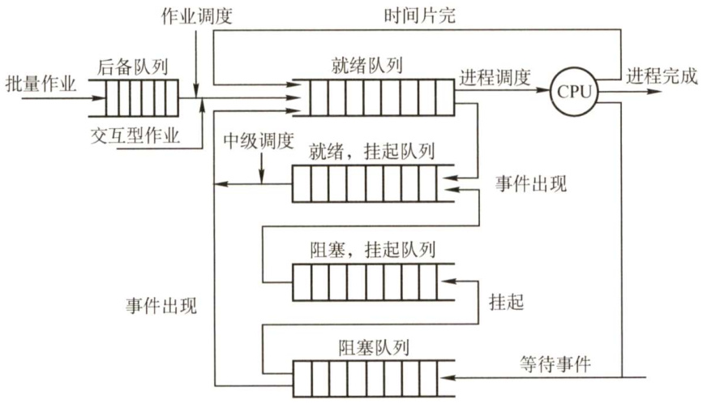  
图2.7处理机的三级调度  

（1）高级调度（作业调度）  

按照一定的原则从外存上处于后备队列的作业中挑选一个（或多个)，给它（们）分配内存、输入/输出设备等必要的资源，并建立相应的进程，以使它（们）获得竞争处理机的权利。简言之，作业调度就是内存与辅存之间的调度。对于每个作业只调入一次、调出一次。  

多道批处理系统中大多配有作业调度，而其他系统中通常不需要配置作业调度。  

（2）中级调度（内存调度）  

引入中极调度的目的是提高内存利用率和系统吞吐量。为此，将那些暂时不能运行的进程调至外存等待，此时进程的状态称为挂起态。当它们已具备运行条件且内存又稍有空闲时，由中级调度来决定把外存上的那些已具备运行条件的就绪进程再重新调入内存，并修改其状态为就绪态，挂在就绪队列上等待。中级调度实际上是存储器管理中的对换功能。  

（3）低级调度（进程调度）  

按照某种算法从就绪队列中选取一个进程，将处理机分配给它。进程调度是最基本的一种调度，在各种操作系统中都必须配置这级调度。进程调度的频率很高，一般几十毫秒一次。  

3.三级调度的联系  

作业调度从外存的后备队列中选择一批作业进入内存，为它们建立进程，这些进程被送入就绪队列，进程调度从就绪队列中选出一个进程，并把其状态改为运行态，把CPU分配给它。中级调度是为了提高内存的利用率，系统将那些暂时不能运行的进程挂起来。  

1）作业调度为进程活动做准备，进程调度使进程正常活动起来。  

2）中级调度将暂时不能运行的进程挂起，中级调度处于作业调度和进程调度之间。  
3）作业调度次数少，中级调度次数略多，进程调度频率最高。  
4）进程调度是最基本的，不可或缺。  

#### 2.2.2 调度的目标  

不同的调度算法具有不同的特性，在选择调度算法时，必须考虑算法的特性。为了比较处理机调度算法的性能，人们提出了很多评价标准，下面介绍其中主要的几种：  

I）CPU利用率。CPU是计算机系统中最重要和昂贵的资源之一，所以应尽可能使CPU 保持“忙”状态，使这一资源利用率最高。CPU利用率的计算方法如下：  

2）系统吞吐量。表示单位时间内CPU完成作业的数量。长作业需要消耗较长的处理机时间，因此会降低系统的吞吐量。而对于短作业，需要消耗的处理机时间较短，因此能提高系统的吞吐量。调度算法和方式的不同，也会对系统的吞吐量产生较大的影响。  

3）周转时间。指从作业提交到作业完成所经历的时间，是作业等待、在就绪队列中排队、在处理机上运行及输入/输出操作所花费时间的总和。周转时间的计算方法如下：  

周转时间 $\mathbf{\Sigma}=\mathbf{\Sigma}$ 作业完成时间－作业提交时间平均周转时间是指多个作业周转时间的平均值：  

平均周转时间 $\O=$ （作业1的周转时间 $\left.+\cdots+\right.$ 作业 $n$ 的周转时间)/n带权周转时间是指作业周转时间与作业实际运行时间的比值：  

平均带权周转时间是指多个作业带权周转时间的平均值：  

平均带权周转时间 $\mathbf{\Sigma}=\mathbf{\Sigma}$ （作业1的带权周转时间 $\cdot...+$ 作业 $n$ 的带权周转时间)/n4）等待时间。指进程处于等处理机的时间之和，等待时间越长，用户满意度越低。处理机调度算法实际上并不影响作业执行或输入/输出操作的时间，只影响作业在就绪队列中等待所花的时间。因此，衡量一个调度算法的优劣，常常只需简单地考察等待时间。  

5）响应时间。指从用户提交请求到系统首次产生响应所用的时间。在交互式系统中，周转时间不是最好的评价准则，一般采用响应时间作为衡量调度算法的重要准则之一。从用户角度来看，调度策略应尽量降低响应时间，使响应时间处在用户能接受的范围之内。  

要想得到一个满足所有用户和系统要求的算法几乎是不可能的。设计调度程序，一方面要满足特定系统用户的要求（如某些实时和交互进程的快速响应要求)，另一方面要考虑系统整体效率（如减少整个系统的进程平均周转时间)，同时还要考虑调度算法的开销。  

#### 2.2.3 调度的实现  

#### 1.调度程序（调度器）  

在操作系统中，用于调度和分派CPU的组件称为调度程序，它通常由三部分组成，如图2.8所示。  

1）排队器。将系统中的所有就绪进程按照一定的策略排成一个或多个队列，以便于调度程序选择。每当有一个进程转变为就绪态时，排队器便将它插入到相应的就绪队列中。  

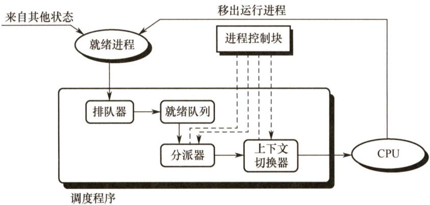  
图2.8 调度程序的结构  

2）分派器。依据调度程序所选的进程，将其从就绪队列中取出，将CPU分配给新进程。  

3）上下文切换器。在对处理机进行切换时，会发生两对上下文的切换操作：第一对，将当前进程的上下文保存到其PCB中，再装入分派程序的上下文，以便分派程序运行；第二对，移出分派程序的上下文，将新选进程的CPU现场信息装入处理机的各个相应寄存器。  

在上下文切换时，需要执行大量load和 store 指令，以保存寄存器的内容，因此会花费较多时间。现在已有硬件实现的方法来减少上下文切换时间。通常采用两组寄存器，其中一组供内核使用，一组供用户使用。这样，上下文切换时，只需改变指针，让其指向当前寄存器组即可。  

#### 2.调度的时机、切换与过程  

调度程序是操作系统内核程序。请求调度的事件发生后，才可能运行调度程序，调度了新的就绪进程后，才会进行进程切换。理论上这三件事情应该顺序执行，但在实际的操作系统内核程序运行中，若某时刻发生了引起进程调度的因素，则不一定能马上进行调度与切换。  

现代操作系统中，不能进行进程的调度与切换的情况有以下几种：  

1）在处理中断的过程中。中断处理过程复杂，在实现上很难做到进程切换，而且中断处理是系统工作的一部分，逻辑上不属于某一进程，不应被剥夺处理机资源。  
2）进程在操作系统内核临界区中。进入临界区后，需要独占式地访问，理论上必须加锁，以防止其他并行进程进入，在解锁前不应切换到其他进程，以加快临界区的释放。  
3）其他需要完全屏蔽中断的原子操作过程中。如加锁、解锁、中断现场保护、恢复等原子操作。在原子过程中，连中断都要屏蔽，更不应该进行进程调度与切换。  

若在上述过程中发生了引起调度的条件，则不能马上进行调度和切换，应置系统的请求调度标志，直到上述过程结束后才进行相应的调度与切换。  

应该进行进程调度与切换的情况如下：  

1）发生引起调度条件且当前进程无法继续运行下去时，可以马上进行调度与切换。若操作系统只在这种情况下进行进程调度，则是非剥夺调度。  
2）中断处理结束或自陷处理结束后，返回被中断进程的用户态程序执行现场前，若置上请求调度标志，即可马上进行进程调度与切换。若操作系统支持这种情况下的运行调度程序，则实现了剥夺方式的调度。  

进程切换往往在调度完成后立刻发生，它要求保存原进程当前断点的现场信息，恢复被调度进程的现场信息。现场切换时，操作系统内核将原进程的现场信息推入当前进程的内核堆栈来保存它们，并更新堆栈指针。内核完成从新进程的内核栈中装入新进程的现场信息、更新当前运行进程空间指针、重设PC寄存器等相关工作之后，开始运行新的进程。  

#### 3.进程调度方式  

所谓进程调度方式，是指当某个进程正在处理机上执行时，若有某个更为重要或紧迫的进程需要处理，即有优先权更高的进程进入就绪队列，此时应如何分配处理机。  

通常有以下两种进程调度方式：  

1）非抢占调度方式，又称非剥夺方式。是指当一个进程正在处理机上执行时，即使有某个更为重要或紧迫的进程进入就绪队列，仍然让正在执行的进程继续执行，直到该进程运行完成或发生某种事件而进入阻塞态时，才把处理机分配给其他进程。非抢占调度方式的优点是实现简单、系统开销小，适用于大多数的批处理系统，但它不能用于分时系统和大多数的实时系统。  
2）抢占调度方式，又称剥夺方式。是指当一个进程正在处理机上执行时，若有某个更为重要或紧迫的进程需要使用处理机，则允许调度程序根据某种原则去暂停正在执行的进程，将处理机分配给这个更为重要或紧迫的进程。抢占调度方式对提高系统吞吐率和响应效率都有明显的好处。但“抢占”不是一种任意性行为，必须遵循一定的原则，主要有优先权、短进程优先和时间片原则等。  

#### 4.闲逛进程  

在进程切换时，如果系统中没有就绪进程，就会调度闲逛进程（idle）运行，如果没有其他进程就绪，该进程就一直运行，并在执行过程中测试中断。闲逛进程的优先级最低，没有就绪进程时才会运行闲逛进程，只要有进程就绪，就会立即让出处理机。  

闲逛进程不需要CPU之外的资源，它不会被阻塞。  

#### 5.两种线程的调度  

1）用户级线程调度。由于内核并不知道线程的存在，所以内核还是和以前一样，选择一个进程，并给予时间控制。由进程中的调度程序决定哪个线程运行。  

2）内核级线程调度。内核选择一个特定线程运行，通常不用考虑该线程属于哪个进程。对被选择的线程赋予一个时间片，如果超过了时间片，就会强制挂起该线程。  

用户级线程的线程切换在同一进程中进行，仅需少量的机器指令；内核级线程的线程切换需要完整的上下文切换、修改内存映像、使高速缓存失效，这就导致了若干数量级的延迟。  

#### 2.2.4 典型的调度算法  

操作系统中存在多种调度算法，有的调度算法适用于作业调度，有的调度算法适用于进程调度，有的调度算法两者都适用。下面介绍几种常用的调度算法。  

#### 1．先来先服务（FCFS）调度算法  

FCFS 调度算法是一种最简单的调度算法，它既可用于作业调度，又可用于进程调度。在作业调度中，算法每次从后备作业队列中选择最先进入该队列的一个或几个作业，将它们调入内存，分配必要的资源，创建进程并放入就绪队列。  

在进程调度中，FCFS 调度算法每次从就绪队列中选择最先进入该队列的进程，将处理机分配给它，使之投入运行，直到运行完成或因某种原因而阻塞时才释放处理机。  

下面通过一个实例来说明FCFS调度算法的性能。假设系统中有4个作业，它们的提交时间分别是8,8.4,8.8,9，运行时间依次是2,1,0.5,0.2，系统采用FCFS调度算法，这组作业的平均等待时间、平均周转时间和平均带权周转时间见表2.2。  

表2.2FCFS调度算法的性能  

<html><body><table><tr><td>作业号</td><td>提交时间</td><td>运行时间</td><td>开始时间</td><td>等待时间</td><td>完成时间</td><td>周转时间</td><td>带权周转时间</td></tr><tr><td>1</td><td>8</td><td>2</td><td>8</td><td>0</td><td>10</td><td>2</td><td>1</td></tr><tr><td>2</td><td>8.4</td><td>1</td><td>10</td><td>1.6</td><td>11</td><td>2.6</td><td>2.6</td></tr><tr><td>3</td><td>8.8</td><td>0.5</td><td>11</td><td>2.2</td><td>11.5</td><td>2.7</td><td>5.4</td></tr><tr><td>4</td><td>9</td><td>0.2</td><td>11.5</td><td>2.5</td><td>11.7</td><td>2.7</td><td>13.5</td></tr><tr><td colspan="8">平均等待时间t=(0+1.6+2.2+2.5)/4=1.575；平均周转时间T=(2+2.6+2.7+2.7)/4=2.5; 平均带权周转时间W=(1+2.6+5.4+13.5)/4=5.625。</td></tr></table></body></html>  

FCFS 调度算法属于不可剥夺算法。从表面上看，它对所有作业都是公平的，但若一个长作业先到达系统，就会使后面的许多短作业等待很长时间，因此它不能作为分时系统和实时系统的主要调度策略。但它常被结合在其他调度策略中使用。例如，在使用优先级作为调度策略的系统中，往往对多个具有相同优先级的进程按FCFS原则处理。  

FCFS 调度算法的特点是算法简单，但效率低；对长作业比较有利，但对短作业不利（相对SJF 和高响应比)；有利于CPU繁忙型作业，而不利于I/O繁忙型作业。  

#### 2.短作业优先（SJF）调度算法  

短作业（进程）优先调度算法是指对短作业（进程）优先调度的算法。短作业优先（SJF）调度算法从后备队列中选择一个或若干估计运行时间最短的作业，将它们调入内存运行；短进程优先（SPF）调度算法从就绪队列中选择一个估计运行时间最短的进程，将处理机分配给它，使之立即执行，直到完成或发生某事件而阻塞时，才释放处理机。  

例如，考虑表2.2中给出的一组作业，若系统采用短作业优先调度算法，其平均等待时间、平均周转时间和平均带权周转时间见表2.3。  

表2.3SJF调度算法的性能  

<html><body><table><tr><td>作业号</td><td>提交时间</td><td>运行时间</td><td>开始时间</td><td>等待时间</td><td>完成时间</td><td>周转时间</td><td>带权周转时间</td></tr><tr><td>1</td><td>8</td><td>2</td><td>8</td><td>0</td><td>10</td><td>2</td><td>1</td></tr><tr><td>2</td><td>8.4</td><td>1</td><td>10.7</td><td>2.3</td><td>11.7</td><td>3.3</td><td>3.3</td></tr><tr><td>3</td><td>8.8</td><td>0.5</td><td>10.2</td><td>1.4</td><td>10.7</td><td>1.9</td><td>3.8</td></tr><tr><td>4</td><td>9</td><td>0.2</td><td>10</td><td>1</td><td>10.2</td><td>1.2</td><td>6</td></tr><tr><td colspan="8">平均等待时间t=(0+2.3+1.4+1)/4=1.175；平均周转时间T=(2+3.3+1.9+1.2)/4=2.1； 平均带权周转时间W=(1+3.3+3.8+6)/4=3.525。</td></tr></table></body></html>  

SJF调度算法也存在不容忽视的缺点：  

1）该算法对长作业不利，由表2.2和表2.3可知，SJF调度算法中长作业的周转时间会增加。更严重的是，若有一长作业进入系统的后备队列，由于调度程序总是优先调度那些（即使是后进来的）短作业，将导致长作业长期不被调度（“饥饿”现象，注意区分“死锁”，后者是系统环形等待，前者是调度策略问题)。  

2）该算法完全未考虑作业的紧迫程度，因而不能保证紧迫性作业会被及时处理。  

3）由于作业的长短是根据用户所提供的估计执行时间而定的，而用户又可能会有意或无意地缩短其作业的估计运行时间，致使该算法不一定能真正做到短作业优先调度。注意，SJF调度算法的平均等待时间、平均周转时间最少。  

#### 3.优先级调度算法  

优先级调度算法既可用于作业调度，又可用于进程调度。该算法中的优先级用于描述作业的紧迫程度。在作业调度中，优先级调度算法每次从后备作业队列中选择优先级最高的一个或几个作业，将它们调入内存，分配必要的资源，创建进程并放入就绪队列。在进程调度中，优先级调度算法每次从就绪队列中选择优先级最高的进程，将处理机分配给它，使之投入运行。  

根据新的更高优先级进程能否抢占正在执行的进程，可将该调度算法分为如下两种：  

1）非抢占式优先级调度算法。当一个进程正在处理机上运行时，即使有某个优先级更高的进程进入就绪队列，仍让正在运行的进程继续运行，直到由于其自身的原因而让出处理机时（任务完成或等待事件)，才把处理机分配给就绪队列中优先级最高的进程。  
2）抢占式优先级调度算法。当一个进程正在处理机上运行时，若有某个优先级更高的进程进入就绪队列，则立即暂停正在运行的进程，将处理机分配给优先级更高的进程。而根据进程创建后其优先级是否可以改变，可以将进程优先级分为以下两种：  
1）静态优先级。优先级是在创建进程时确定的，且在进程的整个运行期间保持不变。确定静态优先级的主要依据有进程类型、进程对资源的要求、用户要求。  
2）动态优先级。在进程运行过程中，根据进程情况的变化动态调整优先级。动态调整优先级的主要依据有进程占有CPU时间的长短、就绪进程等待CPU时间的长短。一般来说，进程优先级的设置可以参照以下原则：  
1）系统进程 $>$ 用户进程。系统进程作为系统的管理者，理应拥有更高的优先级。  
2）交互型进程 $>$ 非交互型进程（或前台进程 $>$ 后台进程)。大家平时在使用手机时，在前台运行的正在和你交互的进程应该更快速地响应你，因此自然需要被优先处理。  
3）I/O型进程 $>$ 计算型进程。所谓I/O型进程，是指那些会频繁使用IO设备的进程，而计算型进程是那些频繁使用CPU的进程（很少使用I/O设备）。我们知道，IO设备（如打印机）的处理速度要比CPU慢得多，因此若将I/O型进程的优先级设置得更高，就更有可能让I/O设备尽早开始工作，进而提升系统的整体效率。  

#### 4.高响应比优先调度算法  

高响应比优先调度算法主要用于作业调度，是对FCFS 调度算法和SJF 调度算法的一种综合平衡，同时考虑了每个作业的等待时间和估计的运行时间。在每次进行作业调度时，先计算后备作业队列中每个作业的响应比，从中选出响应比最高的作业投入运行。  

响应比的变化规律可描述为  

根据公式可知： $\textcircled{1}$ 作业的等待时间相同时，要求服务时间越短，响应比越高，有利于短作业，因而类似于SJF。 $\textcircled{2}$ 要求服务时间相同时，作业的响应比由其等待时间决定，等待时间越长，其响应比越高，因而类似于FCFS。 $\textcircled{3}$ 对于长作业，作业的响应比可以随等待时间的增加而提高，当其等待时间足够长时，也可获得处理机，克服了“饥饿”现象。  

#### 5.时间片轮转调度算法  

时间片轮转调度算法主要适用于分时系统。在这种算法中，系统将所有就绪进程按FCFS 策略排成一个就绪队列，调度程序总是选择就绪队列中的第一个进程执行，但仅能运行一个时间片，如 $50\mathrm{ms}$ 。在使用完一个时间片后，即使进程并未运行完成，它也必须释放出（被剥夺）处理机给下一个就绪进程，而被剥夺的进程返回到就绪队列的末尾重新排队，等候再次运行。  

在时间片轮转调度算法中，时间片的大小对系统性能的影响很大。若时间片足够大，以至于所有进程都能在一个时间片内执行完毕，则时间片轮转调度算法就退化为先来先服务调度算法。若时间片很小，则处理机将在进程间过于频繁地切换，使处理机的开销增大，而真正用于运行用户进程的时间将减少。因此，时间片的大小应选择适当，时间片的长短通常由以下因素确定：系统的响应时间、就绪队列中的进程数目和系统的处理能力。  

#### 6．多级队列调度算法  

前述的各种调度算法，由于系统中仅设置一个进程的就绪队列，即调度算法是固定且单一的，无法满足系统中不同用户对进程调度策略的不同要求。在多处理机系统中，这种单一调度策略实现机制的缺点更为突出，多级队列调度算法能在一定程度上弥补这一缺点。  

该算法在系统中设置多个就绪队列，将不同类型或性质的进程固定分配到不同的就绪队列。每个队列可实施不同的调度算法，因此，系统针对不同用户进程的需求，很容易提供多种调度策略。同一队列中的进程可以设置不同的优先级，不同的队列本身也可以设置不同的优先级。在多处理机系统中，可以很方便为每个处理机设置一个单独的就绪队列，每个处理机可实施各自不同的调度策略，这样就能根据用户需求将多个线程分配到一个或多个处理机上运行。  

#### 7．多级反馈队列调度算法（融合了前几种算法的优点）  

多级反馈队列调度算法是时间片轮转调度算法和优先级调度算法的综合与发展，如图2.9所示。通过动态调整进程优先级和时间片大小，多级反馈队列调度算法可以兼顾多方面的系统目标。例如，为提高系统吞吐量和缩短平均周转时间而照顾短进程；为获得较好的I/O设备利用率和缩短响应时间而照顾I/O型进程；同时，也不必事先估计进程的执行时间。  

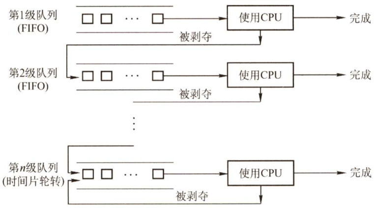  
图2.9多级反馈队列调度算法  

多级反馈队列调度算法的实现思想如下：  

1）设置多个就绪队列，并为每个队列赋予不同的优先级。第1级队列的优先级最高，第2级队列的优先级次之，其余队列的优先级逐个降低。  
2）赋予各个队列的进程运行时间片的大小各不相同。在优先级越高的队列中，每个进程的时间片就越小。例如，第 $i+1$ 级队列的时间片要比第 $i$ 级队列的时间片长1倍。  
3）每个队列都采用FCFS算法。当新进程进入内存后，首先将它放入第1级队列的末尾，按FCFS原则等待调度。当轮到该进程执行时，如它能在该时间片内完成，便可撤离系统。若它在一个时间片结束时尚未完成，调度程序将其转入第2级队列的末尾等待调度；若它在第2级队列中运行一个时间片后仍未完成，再将它放入第3级队列，依此类推。当进程最后被降到第 $n$ 级队列后，在第 $n$ 级队列中便采用时间片轮转方式运行。  

4)按队列优先级调度。仅当第1级队列为空时，才调度第2级队列中的进程运行；仅当第 $1\sim$ i-1级队列均为空时，才会调度第 $i$ 级队列中的进程运行。若处理机正在执行第 $i$ 级队列中的某进程时，又有新进程进入任一优先级较高的队列，此时须立即把正在运行的进程放回到第 $i$ 级队列的末尾，而把处理机分配给新到的高优先级进程。  

多级反馈队列的优势有以下几点：  

1）终端型作业用户：短作业优先。  

2）短批处理作业用户：周转时间较短。  

3）长批处理作业用户：经过前面几个队列得到部分执行，不会长期得不到处理下表总结了几种常见进程调度算法的特点，读者要在理解的基础上掌握。  

<html><body><table><tr><td></td><td>先来先服务</td><td>短作业优先</td><td>高响应比优先</td><td>时间片轮转</td><td>多级反馈队列</td></tr><tr><td>能否是可抢占</td><td>否</td><td>能</td><td>能</td><td>能</td><td>队列内算法不一定</td></tr><tr><td>能否是不可抢占</td><td>能</td><td>能</td><td>能</td><td>否</td><td>队列内算法不一定</td></tr><tr><td>优点</td><td>公平，实现简单</td><td>平均等待时间最少，效率 最高</td><td>兼顾长短作业</td><td>兼顾长短作业</td><td>兼顾长短作业，有较好 的响应时间，可行性强</td></tr><tr><td>缺点</td><td>不利于短作业</td><td>长作业会饥饿，估计时间 计算响应比的开 不易确定</td><td>销大</td><td>平均等待时间较长，上 下文切换浪费时间</td><td>无</td></tr><tr><td>适用于</td><td>无</td><td>作业调度，批处理系统</td><td>无</td><td>分时系统</td><td>相当通用</td></tr><tr><td>默认决策模式</td><td>非抢占</td><td>非抢占</td><td>非抢占</td><td>抢占</td><td>抢占</td></tr></table></body></html>  

#### 2.2.5 进程切换  

对于通常的进程而言，其创建、撤销及要求由系统设备完成的I/O操作，都是利用系统调用而进入内核，再由内核中的相应处理程序予以完成的。进程切换同样是在内核的支持下实现的，因此可以说，任何进程都是在操作系统内核的支持下运行的，是与内核紧密相关的。  

#### （1）上下文切换  

切换CPU 到另一个进程需要保存当前进程状态并恢复另一个进程的状态，这个任务称为上下文切换。上下文是指某一时刻CPU 寄存器和程序计数器的内容。进行上下文切换时，内核会将旧进程状态保存在其PCB中，然后加载经调度而要执行的新进程的上下文。  

上下文切换实质上是指处理机从一个进程的运行转到另一个进程上运行，在这个过程中，进程的运行环境产生了实质性的变化。上下文切换的流程如下：  

1）挂起一个进程，保存CPU上下文，包括程序计数器和其他寄存器。  

2）更新PCB信息。  

3）把进程的PCB移入相应的队列，如就绪、在某事件阻塞等队列。  

4）选择另一个进程执行，并更新其PCB。  

5）跳转到新进程PCB中的程序计数器所指向的位置执行。  

6）恢复处理机上下文。  

（2）上下文切换的消耗  

上下文切换通常是计算密集型的，即它需要相当可观的CPU 时间，在每秒几十上百次的切换中，每次切换都需要纳秒量级的时间，所以上下文切换对系统来说意味着消耗大量的CPU 时间。有些处理器提供多个寄存器组，这样，上下文切换就只需要简单改变当前寄存器组的指针。  

#### （3）上下文切换与模式切换  

模式切换与上下文切换是不同的，模式切换时，CPU逻辑上可能还在执行同一进程。用户进  

程最开始都运行在用户态，若进程因中断或异常进入核心态运行，执行完后又回到用户态刚被中断的进程运行。用户态和内核态之间的切换称为模式切换，而不是上下文切换，因为没有改变当前的进程。上下文切换只能发生在内核态，它是多任务操作系统中的一个必需的特性。  

注意：调度和切换的区别。调度是指决定资源分配给哪个进程的行为，是一种决策行为;切换是指实际分配的行为，是执行行为。一般来说，先有资源的调度，然后才有进程的切换。  

#### 2.2.6 本节小结  

本节开头提出的问题的参考答案如下。  

1）为什么要进行处理机调度？  

若没有处理机调度，意味着要等到当前运行的进程执行完毕后，下一个进程才能执行，而实际情况中，进程时常需要等待一些外部设备的输入，而外部设备的速度与处理机相比是非常缓慢的，若让处理机总是等待外部设备，则对处理机的资源是极大的浪费。而引进处理机调度后，可在运行进程等待外部设备时，把处理机调度给其他进程，从而提高处理机的利用率。用一句简单的话说，就是为了合理地处理计算机的软/硬件资源。  

2）调度算法有哪几种？结合第1章学习的分时操作系统和实时操作系统，思考有没有哪种调度算法比较适合这两种操作系统。  

本节介绍的调度算法有先来先服务调度算法、短作业优先调度算法、优先级调度算法、高响应比优先调度算法、时间片轮转调度算法、多级反馈队列调度算法6种。  

先来先服务算法和短作业优先算法无法保证及时地接收和处理问题，因此无法保证在规定的时间间隔内响应每个用户的需求，也同样无法达到实时操作系统的及时性需求。优先级调度算法按照任务的优先级进行调度，对于更紧急的任务给予更高的优先级，适合实时操作系统。  

高响应比优先调度算法、时间片轮转调度算法、多级反馈队列调度算法都能保证每个任务在一定时间内分配到时间片，并轮流占用CPU，适合分时操作系统。  

本节主要介绍了处理机调度的概念。操作系统主要管理处理机、内存、文件、设备几种资源，只要对资源的请求大于资源本身的数量，就会涉及调度。例如，在单处理机系统中，处理机只有一个，而请求服务的进程却有多个，所以就有处理机调度的概念出现。而出现调度的概念后，又有了一个问题，即如何调度、应该满足谁、应该让谁等待，这是调度算法所回答的问题；而应该满足谁、应该让谁等待，要遵循一定的准则，即调度的准则。调度这一概念贯穿于操作系统的始终，读者在接下来的学习中，将接触到几种资源的调度问题和相应的调度算法。将它们与处理机调度的内容相对比，将会发现它们有异曲同工之妙。  

#### 2.2.7 本节习题精选  

#### 一、单项选择题  

01.时间片轮转调度算法是为了（）。  

A.多个用户能及时干预系统 B.使系统变得高效C.优先级较高的进程得到及时响应 D.需要CPU时间最少的进程最先做  

02.在单处理器的多进程系统中，进程什么时候占用处理器及决定占用时间的长短是由（）决定的。  

A.进程相应的代码长度 B.进程总共需要运行的时间C.进程特点和进程调度策略 D.进程完成什么功能  

03.（）有利于CPU繁忙型的作业，而不利于I/O繁忙型的作业。  

A.时间片轮转调度算法 B．先来先服务调度算法C.短作业（进程）优先算法 D.优先权调度算法  

04.下面有关选择进程调度算法的准则中，不正确的是（）。  

A.尽快响应交互式用户的请求 B.尽量提高处理器利用率C.尽可能提高系统吞吐量 D.适当增长进程就绪队列的等待时间  

05．进程（线程）调度的时机有（）。  

I.运行的进程（线程）运行完毕 II.运行的进程（线程）所需资源未准备好III.运行的进程（线程）的时间片用完 IV．运行的进程（线程）自我阻塞V.运行的进程（线程）出现错误  

A.Ⅱ、III、IV和VB.I和III C.II、IV和V D.全部都是  

06.设有4个作业同时到达，每个作业的执行时间均为2h，它们在一台处理器上按单道式运行，则平均周转时间为（）。  

A.1h B.5h C. 2.5h D.8h  

07.若每个作业只能建立一个进程，为了照顾短作业用户，应采用（）；为了照顾紧急作业用户，应采用（）；为了能实现人机交互，应采用（）；而能使短作业、长作业和交互作业用户都满意，应采用（）。  

A.FCFS调度算法 B．短作业优先调度算法C.时间片轮转调度算法 D．多级反馈队列调度算法E．剥夺式优先级调度算法  

08.（）优先级是在创建进程时确定的，确定之后在整个运行期间不再改变。  

A．先来先服务 B.动态 C.短作业 D.静态  

09.现在有三个同时到达的作业 ${\bf J}_{1},{\bf J}_{2}$ 和 ${\bf J}_{3}$ ，它们的执行时间分别是 $T_{1},T_{2},T_{3}$ ，且 $T_{1}<T_{2}<T_{3\circ}$ 系统按单道方式运行且采用短作业优先调度算法，则平均周转时间是（）。  

A. $T_{1}+T_{2}+T_{3}$ B. $(3T_{1}+2T_{2}+T_{3})/3$   
C. $(T_{1}+T_{2}+T_{3})/3$ D. $(T_{1}+2T_{2}+3T_{3})/3$  

10.设有三个作业，其运行时间分别是2h,5h,3h，假定它们同时到达，并在同一台处理器上以单道方式运行，则平均周转时间最小的执行顺序是（）。  

A. $\mathbf{J}_{1}$ ， $\mathbf{J}_{2}$ ， ${\bf J}_{3}$ B. $\mathbf{J}_{3}$ ， $\mathbf{J}_{2}$ ， ${\bf J}_{1}$ C. $\mathbf{J}_{2}$ ， $\mathbf{J}_{1}$ ， $\mathbf{J}_{3}$ D. $\mathbf{J}_{1}$ ， $\mathbf{J}_{3}$ ， $\mathbf{J}_{2}$  

11．采用时间片轮转调度算法分配CPU时，当处于运行态的进程用完一个时间片后，它的状态是（）状态。  

A．阻塞 B.运行 C.就绪 D.消亡  

12.一个作业 $8:00$ 到达系统，估计运行时间为1h。若 $10:00$ 开始执行该作业，其响应比是()。  

A.2 B.1 C.3 D.0.5  

13．关于优先权大小的论述中，正确的是（）。  

A．计算型作业的优先权，应高于IO型作业的优先权B．用户进程的优先权，应高于系统进程的优先权C．在动态优先权中，随着作业等待时间的增加，其优先权将随之下降D．在动态优先权中，随着进程执行时间的增加，其优先权降低  

14.下列调度算法中，（）调度算法是绝对可抢占的。  

A．先来先服务 B.时间片轮转 C.优先级 D.短进程优先  

15.作业是用户提交的，进程是由系统自动生成的，除此之外，两者的区别是（）。  

A.两者执行不同的程序段  
B．前者以用户任务为单位，后者以操作系统控制为单位  
C．前者是批处理的，后者是分时的  
D.后者是可并发执行，前者则不同  

16.进程调度算法采用固定时间片轮转调度算法，当时间片过大时，就会使时间片轮转法算法转化为（）调度算法。  

A．高响应比优先 B．先来先服务C.短进程优先 D.以上选项都不对  

17.有以下的进程需要调度执行（见下表）：  

1）若用非抢占式短进程优先调度算法，问这5个进程的平均周转时间是多少？  

2）若采用抢占式短进程优先调度算法，问这5个进程的平均周转时间是多少？  

A.8.62; 6.34 B. 8.62; 6.8   
C.10.62;6.34 D. 10.62; 6.8  

18.有5个批处理作业A，B,C,D,E几乎同时到达，其预计运行时间分别为10，6，2，4，8，其优先级（由外部设定）分别为3，5，2，1，4，这里5为最高优先级。以下各种调度算法中，平均周转时间为14的是（）调度算法。  

<html><body><table><tr><td>进程名</td><td>到达时间</td><td>运行时间</td></tr><tr><td>P1</td><td>0.0</td><td>9</td></tr><tr><td>P2</td><td>0.4</td><td>4</td></tr><tr><td>P3</td><td>1.0</td><td>1</td></tr><tr><td>P4</td><td>5.5</td><td>4</td></tr><tr><td>P5</td><td>7</td><td>2</td></tr></table></body></html>  

A.时间片轮转（时间片为1） B.优先级调度C.先来先服务（按照顺序10，6,2，4,8） D.短作业优先  

19.分时操作系统通常采用（）调度算法来为用户服务。  

A.时间片轮转 B．先来先服务 C.短作业优先 D．优先级  

20.在进程调度算法中，对短进程不利的是（）。  

A.短进程优先调度算法 B.先来先服务调度算法C.高响应比优先调度算法 D．多级反馈队列调度算法  

21.假设系统中所有进程同时到达，则使进程平均周转时间最短的是（）调度算法。  

A．先来先服务 B.短进程优先 C.时间片轮转 D．优先级  

22．下列说法中，正确的是（）。  

I．分时系统的时间片固定，因此用户数越多，响应时间越长  
ⅡI.UNIX是一个强大的多用户、多任务操作系统，支持多种处理器架构，按照操作系统分类，属于分时操作系统  
III中断向量地址是中断服务例行程序的入口地址  
IV．中断发生时，由硬件保护并更新程序计数器（PC），而不是由软件完成，主要是为了提高处理速度  

A.I、Ⅱ B．I、II C.III、IV D.仅IV  

23.【2009统考真题】下列进程调度算法中，综合考虑进程等待时间和执行时间的是（）。  

A.时间片轮转调度算法 B.短进程优先调度算法C．先来先服务调度算法 D.高响应比优先调度算法  

24.【2011统考真题】下列选项中，满足短作业优先且不会发生饥饿现象的是（）调度算法。  

A．先来先服务 B．高响应比优先C.时间片轮转 D.非抢占式短作业优先  

25.【2012统考真题】一个多道批处理系统中仅有 ${\bf P}_{1}$ 和 ${\bf P}_{2}$ 两个作业， ${\bf P}_{2}$ 比 ${\bf P}_{1}$ 晚5ms到达，它的计算和I/O操作顺序如下：${\bf P}_{1}$ ：计算 $60\mathrm{{ms}}$ ， $\mathrm{I/O80ms}$ ，计算 $20\mathrm{ms}$ ${\bf P}_{2}$ ：计算 $120\mathrm{ms}$ ， $\mathrm{I/O40ms}$ ，计算 $40\mathrm{ms}$ 若不考虑调度和切换时间，则完成两个作业需要的时间最少是（）。  

A. $240\mathrm{{ms}}$ B.260ms C. 340ms D. 360ms  

26.【2012统考真题】若某单处理器多进程系统中有多个就绪态进程，则下列关于处理机调度的叙述中，错误的是（）。  

A．在进程结束时能进行处理机调度  
B．创建新进程后能进行处理机调度  
C．在进程处于临界区时不能进行处理机调度  
D.在系统调用完成并返回用户态时能进行处理机调度  

27.【2013统考真题】某系统正在执行三个进程 ${\bf P}_{1}$ 。 ${\bf P}_{2}$ 和 ${\bf P}_{3}$ ，各进程的计算（CPU）时间和I/O时间比例如下表所示。为提高系统资源利用率，合理的进程优先级设置应为（）。  

A. $\mathbf{P}_{1}>\mathbf{P}_{2}>\mathbf{P}_{3}$ B. $\mathrm{P}_{3}>\mathrm{P}_{2}>\mathrm{P}_{1}$   
C. $\mathbf{P}_{2}>\mathbf{P}_{1}=\mathbf{P}_{3}$ D. $\mathbf{P}_{1}>\mathbf{P}_{2}=\mathbf{P}_{3}$  

<html><body><table><tr><td>进程</td><td>计算时间</td><td>I/O时间</td></tr><tr><td>P</td><td>90%</td><td>10%</td></tr><tr><td>P</td><td>50%</td><td>50%</td></tr><tr><td>P</td><td>15%</td><td>85%</td></tr></table></body></html>  

28.【2014统考真题】下列调度算法中，不可能导致饥饿现象的是（）。  

A.时间片轮转 B．静态优先数调度C．非抢占式短任务优先 D.抢占式短任务优先  

29.【2016统考真题】某单CPU系统中有输入和输出设备各1台，现有3个并发执行的作业，每个作业的输入、计算和输出时间均分别为2ms,3ms和 $4\mathrm{ms}$ ，且都按输入、计算和输出的顺序执行，则执行完3个作业需要的时间最少是（）。  

A. $15\mathrm{ms}$ B. $17\mathrm{ms}$ C. $22\mathrm{ms}$ D. 27ms  

30.【2017统考真题】假设4个作业到达系统的时刻和运行时间如下表所示。系统在 $t=2$ 时开始作业调度。若分别采用先来先服务和短作业优先调度算法，则选中的作业分别是（）。  

A. ${\bf J}_{2},{\bf J}_{3}$ B. ${\bf J}_{1},{\bf J}_{4}$   
C. ${\bf J}_{2},{\bf J}_{4}$ D. ${\bf J}_{1},{\bf J}_{3}$  

<html><body><table><tr><td>作业</td><td>到达时刻t</td><td>运行时间</td></tr><tr><td>J</td><td>0</td><td>3</td></tr><tr><td>J</td><td>1</td><td>3</td></tr><tr><td>J</td><td>1</td><td>2</td></tr><tr><td>J4</td><td>3</td><td>1</td></tr></table></body></html>  

31.【2017统考真题】下列有关基于时间片的进程调度的叙述中，错误的是（）。  

A.时间片越短，进程切换的次数越多，系统开销越大B．当前进程的时间片用完后，该进程状态由执行态变为阻塞态C．时钟中断发生后，系统会修改当前进程在时间片内的剩余时间D.影响时间片大小的主要因素包括响应时间、系统开销和进程数量等  

32.【2018统考真题】某系统采用基于优先权的非抢占式进程调度策略，完成一次进程调度和进程切换的系统时间开销为 $1\upmu\mathrm{s}$ 。在 $T$ 时刻就绪队列中有3个进程 ${\bf P}_{1}$ ${\bf P}_{2}$ 和 ${\bf P}_{3}$ ，其在就绪队列中的等待时间、需要的CPU时间和优先权如下表所示。  

若优先权值大的进程优先获得CPU，从 $T$ 时刻起系统开始进程调度，则系统的平均周转时间为（）。  

A. $54\upmu\mathrm{s}$ B. $73\upmu\mathrm{s}$   
C. $74\upmu\mathrm{s}$ D. $75\upmu\mathrm{s}$  

<html><body><table><tr><td>进程</td><td>等待时间</td><td>需要的CPU时间</td><td>优先权</td></tr><tr><td>P1</td><td>30us</td><td>12μs</td><td>10</td></tr><tr><td>P2</td><td>15μs</td><td>24μs</td><td>30</td></tr><tr><td>P3</td><td>18us</td><td>36us</td><td>20</td></tr></table></body></html>  

33.【2019统考真题】系统采用二级反馈队列调度算法进行进程调度。就绪队列 $\mathbf{Q}_{1}$ 采用时间片轮转调度算法，时间片为 $10\mathrm{ms}$ ；就绪队列 $\mathbf{Q}_{2}$ 采用短进程优先调度算法；系统优先调度 $\mathbf{Q}_{1}$ 队列中的进程，当 $\scriptstyle\mathbf{Q}_{1}$ 为空时系统才会调度 $\mathbf{Q}_{2}$ 中的进程；新创建的进程首先进入$\mathbf{Q}_{1}$ . $\mathbf{Q}_{1}$ 中的进程执行一个时间片后，若未结束，则转入 $\mathbf{Q}_{2}$ 。若当前 $\mathbf{Q}_{1}$ ， $\mathbf{Q}_{2}$ 为空，系统依次创建进程 ${\bf P}_{1}$ ${\bf P}_{2}$ 后即开始进程调度， ${\bf P}_{1}$ ${\bf P}_{2}$ 需要的CPU时间分别为 $30\mathrm{ms}$ 和 $20\mathrm{ms}$ 则进程 ${\bf P}_{1}$ ， ${\bf P}_{2}$ 在系统中的平均等待时间为（）。  

A. $25\mathrm{ms}$ B. $20\mathrm{ms}$ C. $15\mathrm{ms}$ D.10ms  

34.【2020统考真题】下列与进程调度有关的因素中，在设计多级反馈队列调度算法时需要考虑的是（）。  

I．就绪队列的数量 II．就绪队列的优先级III．各就绪队列的调度算法 IV．进程在就绪队列间的迁移条件A.仅I、Ⅱ B.仅II、IV C.仅I、IⅢ、IV D.I、I、IⅢ和IV  

35.【2021统考真题】在下列内核的数据结构或程序中，分时系统实现时间片轮转调度需要使用的是（）。  

I．进程控制块 II时钟中断处理程序 IⅢI．进程就绪队列 IV.进程阻塞队列A.仅、IⅢI B.仅I、IV C.仅I、Ⅱ、IⅢ D.仅I、Ⅱ、IV  

36.【2021统考真题】下列事件中，可能引起进程调度程序执行的是（）。  

I．中断处理结束 ⅡI．进程阻塞 III．进程执行结束 IV.进程的时间片用完A.仅I、IⅢI B.仅II、IV C.仅III、IV D.I、I、ⅢI和IV  

#### 二、综合应用题  

01．为什么说多级反馈队列调度算法能较好地满足各类用户的需要？  

02.将一组进程分为4类，如下图所示。各类进程之间采用优先级调度算法，而各类进程的内部采用时间片轮转调度算法。请简述 $\mathrm{P_{1},P_{2},P_{3},P_{4},P_{5},P_{6},P_{7},P_{8}}$ 进程的调度过程。  

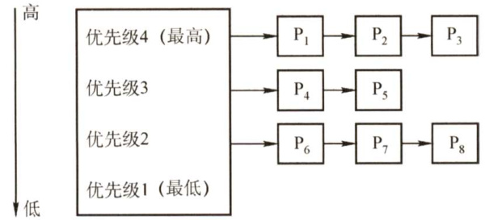  

03．设某计算机系统有一个CPU、一台输入设备、一台打印机。现有两个进程同时进入就绪态，且进程A先得到CPU运行，进程B后运行。进程A的运行轨迹为：计算 $50\mathrm{ms}$ ，打印信息 $100\mathrm{{ms}}$ ，再计算 $50\mathrm{ms}$ ，打印信息 $100\mathrm{{ms}}$ ，结束。进程B的运行轨迹为：计算$50\mathrm{ms}$ ，输入数据 $80\mathrm{ms}$ ，再计算 $100\mathrm{{ms}}$ ，结束。试画出它们的甘特图，并说明：  

1）开始运行后，CPU有无空闲等待？若有，在哪段时间内等待？计算CPU的利用率。  
2）进程A运行时有无等待现象？若有，在什么时候发生等待现象？  
3）进程B运行时有无等待现象？若有，在什么时候发生等待现象？  

04.有一个CPU和两台外设 $\mathrm{D}_{1},\mathrm{D}_{2}$ ，且在能够实现抢占式优先级调度算法的多道程序环境中，同时进入优先级由高到低的 $\mathbf{P}_{1},\mathbf{P}_{2},\mathbf{P}_{3}$ 三个作业，每个作业的处理顺序和使用资源的时间如下：${\bf P}_{1}$ . $\mathbf{D}_{2}$ （ $30\mathrm{ms}$ ，CPU（ $10\mathrm{ms},$ ， $\mathbf{D}_{1}$ （ $30\mathrm{ms}$ )，CPU（ $10\mathrm{ms}$ )${\bf P}_{2}$ ： $\mathbf{D}_{1}$ （ $20\mathrm{ms}$ )，CPU（ $20\mathrm{ms}.$ ， $\mathbf{D}_{2}$ （ $40\mathrm{ms}$ ）${\bf P}_{3}$ ：CPU（ $30\mathrm{ms})$ ， $\mathbf{D}_{1}$ （ $20\mathrm{ms}$ )假设忽略不计其他辅助操作的时间，每个作业的周转时间 $T_{1},T_{2},T_{3}$ 分别为多少？CPU和$\mathbf{D}_{1}$ 的利用率各是多少？  

05.有三个作业A,B，C，它们分别单独运行时的CPU和 $\mathrm{I}/\mathrm{O}$ 占用时间如下图所示。  

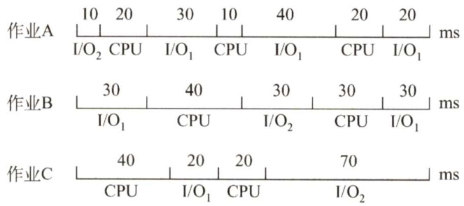  

现在请考虑三个作业同时开始执行。系统中的资源有一个CPU和两台输入/输出设备（ $\mathrm{I}/\mathrm{O}_{1}$ 和 $\mathrm{I}/\mathrm{O}_{2}$ ）同时运行。三个作业的优先级为A最高、B次之、C最低，一旦低优先级的进程开始占用CPU，高优先级进程也要等待到其结束后方可占用CPU，请回答下面的问题：  

1）最早结束的作业是哪个？  
2）最后结束的作业是哪个？  
3）计算这段时间CPU的利用率（三个作业全部结束为止）。  

06．假定要在一台处理器上执行下表所示的作业，且假定这些作业在时刻0以1,2,3,4,5的顺序到达。说明分别使用FCFS、RR（时间片 $^{=1}$ )、SJF及非剥夺式优先级调度算法时，这些作业的执行情况（优先级的高低顺序依次为1到5）。针对上述每种调度算法，给出平均周转时间和平均带权周转时间。  

<html><body><table><tr><td>作业</td><td>执行时间</td><td>优先级</td></tr><tr><td>1</td><td>10</td><td>3</td></tr><tr><td>2</td><td>1</td><td></td></tr><tr><td>3</td><td>2</td><td>3</td></tr><tr><td>4</td><td></td><td>4</td></tr><tr><td>5</td><td>5</td><td>2</td></tr></table></body></html>  

07．有一个具有两道作业的批处理系统，作业调度采用短作业优先调度算法，进程调度采用抢占式优先级调度算法。作业的运行情况见下表，其中作业的优先数即进程的优先数，优先数越小，优先级越高。  

<html><body><table><tr><td>作业名</td><td>到达时间</td><td>运行时间</td><td>优先数</td></tr><tr><td>1</td><td>8:00</td><td>40分钟</td><td>5</td></tr><tr><td>2</td><td>8:20</td><td>30分钟</td><td>3</td></tr><tr><td>3</td><td>8:30</td><td>50分钟</td><td>4</td></tr><tr><td>4</td><td>8:50</td><td>20分钟</td><td>6</td></tr></table></body></html>  

1）列出所有作业进入内存的时间及结束的时间（以分为单位）。  
2）计算平均周转时间。  

08.假设某计算机系统有4个进程，各进程的预计运行时间和到达就绪队列的时刻见下表（相对时间，单位为“时间配额”）。试用可抢占式短进程优先调度算法和时间片轮转调度算法进行调度（时间配额为2)。分别计算各个进程的调度次序及平均周转时间。  

<html><body><table><tr><td>进程</td><td>到达就绪队列时刻</td><td>预计运行时间</td></tr><tr><td>P</td><td>0</td><td>8</td></tr><tr><td>P2</td><td>1</td><td>4</td></tr><tr><td>P3</td><td>2</td><td>9</td></tr><tr><td>P4</td><td>3</td><td>5</td></tr></table></body></html>  

09.假设一个计算机系统具有如下性能特征：处理一次中断平均需要 $500\upmu\mathrm{s}$ ，一次进程调度平均需要花费1ms，进程的切换平均需要花费 $2\mathrm{ms}$ 。若该计算机系统的定时器每秒发出120次时钟中断，忽略其他I/O中断的影响，请问：  

1）操作系统将百分之几的CPU时间分配给时钟中断处理程序？  
2）若系统采用时间片轮转调度算法，24个时钟中断为一个时间片，操作系统每进行一次进程的切换，需要花费百分之几的CPU时间？  
3）根据上述结果，说明为了提高CPU的使用效率，可以采用什么对策。  

10.设有4个作业 ${\bf J}_{1},{\bf J}_{2},{\bf J}_{3},{\bf J}_{4}$ ，它们的到达时间和计算时间见下表。若这4个作业在一台处理器上按单道方式运行，采用高响应比优先调度算法，试写出各作业的执行顺序、各作业的周转时间及平均周转时间。  

<html><body><table><tr><td>作业</td><td>到达时间</td><td>计算时间</td></tr><tr><td>J</td><td>8:00</td><td>2h</td></tr><tr><td></td><td>8:30</td><td>40min</td></tr><tr><td>J</td><td>9:00</td><td>25min</td></tr><tr><td>J4</td><td>9:30</td><td>30min</td></tr></table></body></html>  

11.在一个有两道作业的批处理系统中，有一作业序列，其到达时间及估计运行时间见下表。系统作业采用最高响应比优先调度算法[响应比 $\mathbf{\Sigma}=\mathbf{\Sigma}$ （等待时间 $^+$ 估计运行时间)/估计运行时间]。进程的调度采用短进程优先的抢占式调度算法。  

<html><body><table><tr><td>作业</td><td>到达时间/min</td><td>估计运行时间/min</td></tr><tr><td>J</td><td>10:00</td><td>35</td></tr><tr><td>J2</td><td>10:10</td><td>30</td></tr><tr><td>J</td><td>10:15</td><td>45</td></tr><tr><td>J4</td><td>10:20</td><td>20</td></tr><tr><td>J5</td><td>10:30</td><td>30</td></tr></table></body></html>  

1）列出各作业的执行时间（即列出每个作业运行的时间片段，如作业 $i$ 的运行时间序列为 $10:00{\mathrm{-}}10:40$ ，11:00—11:20，11:30—11:50结束）。  

2）计算这批作业的平均周转时间。  

12.【2016统考真题】某进程调度程序采用基于优先数（priority）的调度策略，即选择优先数最小的进程运行，进程创建时由用户指定一个nice作为静态优先数。为了动态调整优先数，引入运行时间cpuTime和等待时间waitTime，初值均为0。进程处于执行态时，cpuTime定时加1，且waitTime置0；进程处于就绪态时，cpuTime置0，waitTime定时加1。请回答下列问题：  

1）若调度程序只将nice的值作为进程的优先数，即priority $\mathbf{\Sigma}=\mathbf{\Sigma}$ nice，则可能会出现饥饿现象。为什么？  
2）使用nice,cpuTime和waitTime设计一种动态优先数计算方法，以避免产生饥饿现象，并说明waitTime的作用。  

#### 2.2.8 答案与解析  

#### 一、单项选择题  

01.A  

时间片轮转的主要目的是，使得多个交互的用户能够得到及时响应，使得用户以为“独占”计算机的使用，因此它并没有偏好，也不会对特殊进程做特殊服务。时间片轮转增加了系统开销，所以不会使得系统高效运转，吞吐量和周转时间均不如批处理。但其较快速的响应时间使得用户能够与计算机进行交互，改善了人机环境，满足用户需求。  

02.C  

进程调度的时机与进程特点有关，如进程是CPU繁忙型还是I/O 繁忙型、自身的优先级等。但仅有这些特点是不够的，能否得到调度还取决于进程调度策略，若采用优先级调度算法，则进程的优先级才起作用。至于占用处理器运行时间的长短，则要看进程自身，若进程是I/O繁忙型，运行过程中要频繁访问I/O 端口，即可能会频繁放弃CPU，所以占用CPU 的时间不会长，一旦放弃CPU，则必须等待下次调度。若进程是CPU繁忙型，则一旦占有CPU，就可能会运行很长时间，但运行时间还取决于进程调度策略，大部分情况下，交互式系统为改善用户的响应时间，大多数采用时间片轮转的算法，这种算法在进程占用CPU达到一定时间后，会强制将其换下，以保证其他进程的CPU使用权。因此选C。  

03.B  

FCFS 调度算法比较有利于长作业，而不利于短作业。所谓CPU 繁忙型作业，是指该类作业需要大量的CPU时间进行计算，而很少请求I/O操作，故采用FCFS可从容完成计算。I/O 繁忙型作业是指CPU处理时，需频繁地请求I/O操作，导致操作完成后还要重新排队等待调度。所以CPU 繁忙型作业更接近于长作业，若采用FCFS，则等待时间过长。时间片轮转法对于短作业和长作业的时间片都一样，所以地位也几乎一样。优先级调度有利于优先级高的进程，而优先级和作业时间长度是没有什么必然联系的。因此选B。  

04.D  

在选择进程调度算法时应考虑以下几个准则： $\textcircled{1}$ 公平：确保每个进程获得合理的CPU份额；  

$\textcircled{2}$ 有效：使CPU尽可能地忙碌； $\textcircled{3}$ 响应时间：使交互用户的响应时间尽可能短； $\textcircled{4}$ 周转时间：使批处理用户等待输出的时间尽可能短； $\textcircled{5}$ 吞吐量：使单位时间处理的进程数尽可能最多。由此可见D不正确。  

05.D  

进程（线程）调度的时机包括：运行的进程（线程）运行完毕、运行的进程（线程）自我阻塞、运行的进程（线程）的时间片用完、运行的进程（线程）所需的资源没有准备好、运行的进程（线程）出现错误。以上时机都在CPU方式为不可抢占方式时引起进程（线程）调度。在CPU方式是可抢占方式时，就绪对列中的某个进程（线程）的优先级高于当前运行进程（线程）的优先级时，也会发生进程（线程）调度。故I、ⅡI、III、IV和V都正确。  

06.B  

4个作业的周转时间分别是2h,4h,6h,8h，所以4个作业的总周转时间为 $2+4+6+8=20\mathrm{h}$ o此时，平均周转时间 $\mathbf{\Sigma}=\mathbf{\Sigma}$ 各个作业周转时间之和/作业数 $=20/4=5$ 小时。  

07.B、E、C、D  

照顾短作业用户，选择短作业优先调度算法；照顾紧急作业用户，即选择优先级高的作业优先调度，采用基于优先级的剥夺调度算法；实现人机交互，要保证每个作业都能在一定时间内轮到，采用时间片轮转法；使各种作业用户满意，要处理多级反馈，所以选择多级反馈队列调度算法。  

08.D  

优先级调度算法分静态和动态两种。静态优先级在进程创建时确定，之后不再改变。  

09.B  

系统采用短作业优先调度算法，作业的执行顺序为 ${\bf J}_{1},{\bf J}_{2},{\bf J}_{3}$ ， ${\bf J}_{1}$ 的周转时间为 $T_{1}$ ， ${\bf J}_{2}$ 的周转时间为 $T_{1}+T_{2}$ ， ${\bf J}_{3}$ 的周转时间为 $T_{1}+T_{2}+T_{3}$ ，则平均周转时间为 $(T_{1}+T_{1}+T_{2}+T_{1}+T_{2}+T_{3})/3=(3T_{1}+$ $2T_{2}+T_{3})/3$ 。  

10.D  

在同一台处理器上以单道方式运行时，要想获得最短的平均周转时间，用短作业优先调度算法会有较好的效果。就本题目而言：A选项的平均周转时间 $=(2+7+10)/3\mathrm{h}=19/3\mathrm{h}$ ；B选项的平均周转时间 $=(3+8+10)/3\mathrm{h}=7\mathrm{h}$ 。C选项的平均周转时间 $=(5+7+10)/3\mathrm{h}=22/3\mathrm{h}$ ；D选项的平均周转时间 $=(2+5+10)/3\mathrm{h}=17/3\mathrm{h}$ 。  

11.C  

处于运行态的进程用完一个时间片后，其状态会变为就绪态，等待下一次处理器调度。进程执行完最后的语句并使用系统调用exit请求操作系统删除它或出现一些异常情况时，进程才会终止。  

12.C  

13.D  

优先级算法中，I/O繁忙型作业要优于计算繁忙型作业，系统进程的优先权应高于用户进程的优先权。作业的优先权与长作业、短作业或系统资源要求的多少没有必然的关系。在动态优先权中，随着进程执行时间的增加其优先权随之降低，随着作业等待时间的增加其优先权相应上升。  

14.B  

时间片轮转算法是按固定的时间配额来运行的，时间一到，不管是否完成，当前的进程必须撤下，调度新的进程，因此它是由时间配额决定的、是绝对可抢占的。而优先级算法和短进程优先算法都可分为抢占式和不可抢占式。  

15.B  

作业是从用户角度出发的，它由用户提交，以用户任务为单位；进程是从操作系统出发的，由系统生成，是操作系统的资源分配和独立运行的基本单位。  

16.B  

时间片轮转调度算法在实际运行中也按先后顺序使用时间片，时间片过大时，我们可以认为其大于进程需要的运行时间，即转变为先来先服务调度算法。  

17.D  

对于这种类型的题目，我们可以采用广义甘特图来求解，甘特图的画法在1.2节的习题中已经有所介绍。我们直接给出甘特图（见下图)，以非抢占为例。  

在0时刻，进程 ${\bf P}_{1}$ 到达，于是处理器分配给 ${\bf P}_{1}$ ，由于是不可抢占的，所以 $\mathbf{P}_{1}$ 一旦获得处理器，就会运行直到结束；在9时刻，所有进程已经到达，根据短进程优先调度，会把处理器分配给 ${\bf P}_{3}$ ，接下来就是 ${\bf P}_{5}$ ；然后，由于 $\mathbf{P}_{2}$ ， ${\bf P}_{4}$ 的预计运行时间一样，所以在 $\mathbf{P}_{2}$ 和 ${\bf P}_{4}$ 之间用先来先服务调度，优先把处理器分配给 ${\bf P}_{2}$ ，最后再分配给 ${\mathrm{{P}}}_{4}$ ，完成任务。  

周转时间 $\mathbf{\Sigma}=\mathbf{\Sigma}$ 完成时间－作业到达时间，从图中显然可以得到各进程的完成时间，于是 ${\bf P}_{1}$ 的周转时间是 $9-0=9$ ； ${\bf P}_{2}$ 的周转时间是 $16-0.4=15.6$ ， ${\bf P}_{3}$ 的周转时间是 $10-1=9$ ， ${\bf P}_{4}$ 的周转时间是 $20-5.5=14.5$ ， ${\bf P}_{5}$ 的周转时间是 $12-7=5$ ；平均周转时间为 $(9+15.6+9+14.5+5)/5=10.62\:$ 。  

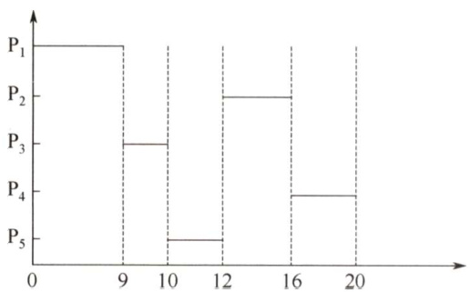  

同理，抢占式的周转时间也可通过画甘特图求得，而且直观、不易出错。  

抢占式的平均周转时间为6.8。  

甘特图在操作系统中有着广泛的应用，本节习题中会有不少这种类型的题目，若读者按照上面的方法求解，则解题时就可以做到胸有成竹。  

18.D  

这5个批处理作业采用短作业优先调度算法时，平均周转时间 $=[2+(2+4)+(2+4+6)+(2+$ $4+6+8)+(2+4+6+8+10)]/5=14\AA$ 。  

这道题主要考查读者对各种优先调度算法的认识。若按照18题中的方法求解，则可能要花  

费一定的时间，但这是值得的，因为可以起到熟练基本方法的效果。在考试中很少会遇到操作量和计算量如此大的题目，所以读者不用担心。  

19.A  

分时系统需要同时满足多个用户的需要，因此把处理器时间轮流分配给多个用户作业使用，即采用时间片轮转调度算法。  

20.B  

先来先服务调度算法中，若一个长进程（作业）先到达系统，则会使后面的许多短进程（作业）等待很长的时间，因此对短进程（作业）不利。  

21.B  

短进程优先调度算法具有最短的平均周转时间。平均周转时间 $\mathbf{\Sigma}=\mathbf{\Sigma}$ 各进程周转时间之和/进程数。因为每个进程的执行时间都是固定的，所以变化的是等待时间，只有短进程优先算法能最小化等待时间。  

22.A  

I选项正确，分时系统中，响应时间与时间片和用户数成正比。Ⅱ选项正确。II选项错误，中断向量本身是用于存放中断服务例行程序的入口地址，因此中断向量地址就应是该入口地址的地址。IV选项错误，中断由硬件保护并完成，主要是为了保证系统运行可靠、正确。提高处理速度也是一个好处，但不是主要目的。综上分析，III、IV选项错误。  

23.D  

响应比 $R=$ （等待时间 $^+$ 执行时间)/执行时间。它综合考虑了每个进程的等待时间和执行时间，对于同时到达的长进程和短进程，短进程会优先执行，以提高系统吞吐量；而长进程的响应比可以随等待时间的增加而提高，不会产生进程无法调度的情况。  

24.B  

响应比 $\mathbf{\Sigma}=\mathbf{\Sigma}$ (等待时间 $^+$ 执行时间)/执行时间。高响应比优先算法在等待时间相同的情况下，作业执行时间越短，响应比越高，满足短任务优先。随着长作业等待时间的增加，响应比会变大，执行机会也会增大，因此不会发生饥饿现象。先来先服务和时间片轮转不符合短任务优先，非抢占式短任务优先会产生饥饿现象。  

25.B  

由于 ${\bf P}_{2}$ 比 ${\bf P}_{1}$ 晚5ms到达， ${\bf P}_{1}$ 先占用CPU，作业运行的甘特图如下。  

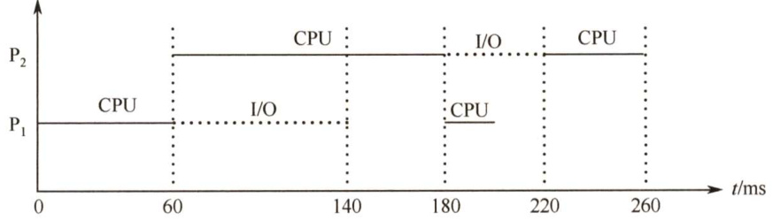  

26.C  

选项A、B、D 显然属于可以进行处理机调度的情况。对于选项C，当进程处于临界区时，说明进程正在占用处理机，只要不破坏临界资源的使用规则，就不会影响处理机的调度。比如，通常访问的临界资源可能是慢速的外设（如打印机)，若在进程访问打印机时，不能进行处理机调度，则系统的性能将非常差。  

27.B  

为了合理地设置进程优先级，应综合考虑进程的CPU时间和I/O时间。对于优先级调度算法，一般来说，I/O型作业的优先权高于计算型作业的优先权，这是由于IO操作需要及时完成，它没有办法长时间地保存所要输入/输出的数据，所以考虑到系统资源利用率，要选择I/O繁忙型作业有更高的优先级。  

28.A  

采用静态优先级调度且系统总是出现优先级高的任务时，优先级低的任务总是得不到处理机而产生饥饿现象；而短任务优先调度不管是抢占式的还是非抢占的，当系统总是出现新来的短任务时，长任务会总是得不到处理机，产生饥饿现象，因此选项B、C、D都错误。  

29.B  

这类调度题目最好画图。因CPU、输入设备、输出设备都只有一个，因此各操作步骤不能重叠，画出运行时的甘特图后，就能清楚地看到不同作业间的时序关系，如下图所示。  

<html><body><table><tr><td>作业\时间</td><td>1</td><td colspan="2">2</td><td>3 4</td><td>5</td><td>6</td><td colspan="2">7</td><td>8</td><td>9</td><td></td><td>10</td><td>11</td><td>12</td><td>13 14</td><td>15</td><td></td><td>16 17</td></tr><tr><td>1</td><td colspan="2">输入</td><td colspan="3">计算</td><td colspan="3"></td><td colspan="3">输出</td><td></td><td></td><td></td><td></td><td></td><td></td><td></td></tr><tr><td>2</td><td></td><td colspan="2"></td><td colspan="3">输入</td><td colspan="3">计算</td><td colspan="3"></td><td>输出</td><td></td><td></td><td></td><td></td></tr><tr><td>3</td><td></td><td></td><td></td><td></td><td colspan="3">输入</td><td></td><td colspan="3"></td><td>计算</td><td></td><td colspan="5">输出</td></tr></table></body></html>  

30.D  

先来先服务调度算法是作业来得越早，优先级越高，因此会选择 ${\bf J}_{1}$ 。短作业优先调度算法是作业运行时间越短，优先级越高，因此会选择 ${\bf J}_{3}$ 。所以D正确。  

扫一扫  

31.B  

解析请扫右侧二维码查阅。  

32.D  

由优先权可知，进程的执行顺序为 $\mathrm{P}_{2}\mathrm{\rightarrowP}_{3}\mathrm{\rightarrowP}_{1}$ 。 ${\bf P}_{2}$ 的周转时间为 $1+15+24=40\upmu\mathrm{s}$ ， ${\bf P}_{3}$ 的周转时间为 $18+1+24+1+36=80upmu\mathrm{s}$ ， ${\bf P}_{1}$ 的周转时间为 $30+1+24+1+36+1+12=105{\mathrm{{\textperthousand}}}$ ；平均周转时间为 $(40+80+105)/3=225/3=75\upmu\mathrm{s}$ ，因此选 $\mathrm{~D~}$ 。  

33.C  

进程 $\mathbf{P}_{1}$ ， ${\bf P}_{2}$ 依次创建后进入队列 $\scriptstyle\mathbf{Q}_{1}$ ，根据时间片调度算法的规则，进程 ${\bf P}_{1}$ ， ${\bf P}_{2}$ 将依次被分配 $10\mathrm{ms}$ 的CPU时间，两个进程分别执行完一个时间片后都会被转入队列 $\mathbf{Q}_{2}$ ，就绪队列 $\mathbf{Q}_{2}$ 采用短进程优先调度算法，此时 ${\bf P}_{1}$ 还需要 $20\mathrm{ms}$ 的CPU时间， ${\bf P}_{2}$ 还需要 $10\mathrm{ms}$ 的CPU时间，所以 ${\bf P}_{2}$ 会被优先调度执行， $10\mathrm{ms}$ 后进程 ${\bf P}_{2}$ 执行完成，之后${\bf P}_{1}$ 再调度执行，再过 $20\mathrm{ms}$ 后 ${\bf P}_{1}$ 也执行完成。运行图表述如下。  

进程 ${\bf P}_{1}$ 。 ${\bf P}_{2}$ 的等待时间分别为图中的虚横线部分，平均等待时间 $\mathbf{\Phi}=\mathbf{\Phi}(\mathbf{P}_{1} $ 等待时间+ ${\bf P}_{2}$ 等待时间) $/2=\left(20~+~10~\right)/2=15$ ，因此答案选C。  

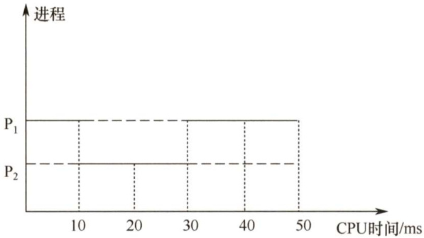  

34.D  

多级反馈队列调度算法需要综合考虑优先级数量、优先级之间的转换规则等，就绪队列的数量会影响长进程的最终完成时间，I正确；就绪队列的优先级会影响进程执行的顺序，ⅡI正确；各就绪队列的调度算法会影响各队列中进程的调度顺序，II正确；进程在就绪队列中的迁移条件会影响各进程在各队列中的执行时间，IV正确。  

35.C  

在分时系统的时间片轮转调度中，当系统检测到时钟中断时，会引出时钟中断处理程序，调度程序从就绪队列中选择一个进程为其分配时间片，并且修改该进程的进程控制块中的进程状态等信息，同时将时间片用完的进程放入就绪队列或让其结束运行。I、ⅡI、III正确。阻塞队列中的进程只有被唤醒并进入就绪队列后，才能参与调度，所以该调度过程不使用阻塞队列。  

36.D  

在时间片调度算法中，中断处理结束后，系统检测当前进程的时间片是否用完，如果用完，就将其设为就绪态或让其结束运行，若就绪队列不空，则调度就绪队列的队首进程执行，I可能。当前进程阻塞时，将其放入阻塞队列，若就绪队列不空，则调度新进程执行，ⅡI可能。进程执行结束会导致当前进程释放CPU，并从就绪队列中选择一个进程获得CPU，II可能。进程时间片用完，会导致当前进程让出CPU，同时选择就绪队列的队首进程获得CPU，IV可能。  

#### 二、综合应用题  

01.【解答】  

多级反馈队列调度算法能较好地满足各种类型用户的需要。对终端型作业用户而言，由于它们提交的作业大多属于交互型作业，作业通常比较短小，系统只要能使这些作业在第1级队列所规定的时间片内完成，便可使终端型作业用户感到满意；对于短批处理作业用户而言，它们的作业开始时像终端型作业一样，若仅在第1级队列中执行一个时间片即可完成，便可获得与终端型作业一样的响应时间，对于稍长的作业，通常也只需要在第2级队列和第3级队列中各执行一个时间片即可完成，其周转时间仍然较短；对于长批处理作业用户而言，它们的长作业将依次在第 $1,2,\cdots,n$ 级队列中运行，然后按时间片轮转方式运行，用户不必担心其作业长期得不到处理。  

02.【解答】  

由题意可知，各类进程之间采用优先级调度算法，而同类进程内部采用时间片轮转调度算法。因此，系统首先对优先级为4的进程 $\mathbf{P}_{1},\mathbf{P}_{2},\mathbf{P}_{3}$ 采用时间片轮转调度算法运行；当 $\mathbf{P}_{1},\mathbf{P}_{2},\mathbf{P}_{3}$ 均运行结束或没有可运行的进程（即 $\mathbf{P}_{1},\mathbf{P}_{2},\mathbf{P}_{3}$ 都处于等待态；或其中部分进程已运行结束，其余进程处于等待态）时，对优先级为3的进程 ${\mathrm{\bf~P}}_{4}$ 。 $\mathbf{P}_{5}$ 采用时间片轮转调度算法运行。在此期间，若未结束的 $\mathbf{P}_{1},\mathbf{P}_{2},\mathbf{P}_{3}$ 有一个转为就绪态，则当前时间片用完后又回到优先级4进行调度。类似地，当 ${\bf{P}}_{1}\sim$ ${\bf P}_{5}$ 均运行结束或没有可运行进程（即 ${\bf P}_{1}{\sim}{\bf P}_{5}$ 都处于等待态；或其中部分进程已运行结束，其余进程处于等待态）时，对优先级为2的进程 ${\bf{P}}_{6},$ $\mathbf{P}_{7}.$ $\mathbf{P}_{8}$ 采用时间片轮转调度算法运行，一旦 ${\bf P}_{1}{\sim}{\bf P}_{5}$ 中有一个转为就绪态，当前时间片用完后立即回到相应的优先级进行时间片轮转调度。  

03.【解答】  

这类实际的CPU和输入/输出设备调度的题目一定要画图，画出运行时的甘特图后就能清楚地看到不同进程间的时序关系，如下图所示。  

<html><body><table><tr><td>0 CPU</td><td>50 A</td><td>100 B</td><td>150 空闲</td><td>200 A</td><td>300 B</td></tr><tr><td>输入设备</td><td colspan="2">空闲</td><td colspan="2">B</td></tr><tr><td>打印机</td><td>空闲</td><td>A</td><td>空闲</td><td>空闲 A</td></tr></table></body></html>  

根据图中的进程时序关系：  

1）有，在 $100{\sim}150\mathrm{ms}$ 等待，利用率 $=[300-(150-100)]/300\times100\%=83.3\%$ 。2）无。3）有，在 $0\mathrm{\sim}50\mathrm{ms}$ ， $180{\sim}200\mathrm{ms}$ 时发生等待现象。这里要提醒读者的是，甘特图的画法不止一种，上面用到的就是不常见的画法，但它起到的效果是一样的。若读者比较熟悉前面介绍的画法，则这道题用前面的画法也可轻松解决。  

04.【解答】  

抢占式优先级调度算法，三个作业执行的顺序如下图所示。  

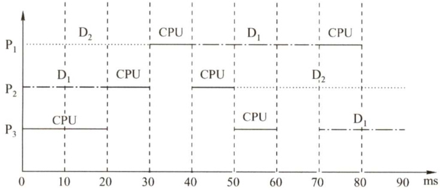  

作业 ${\bf P}_{1}$ 的优先级最高，周转时间等于运行时间， $T_{1}=80\mathrm{{ms}}$ ；作业 ${\bf P}_{2}$ 的等待时间为 $10\mathrm{ms}$ ，运行时间为 $80\mathrm{ms}$ ，周转时间 $T_{2}=(10+80)\mathrm{ms}=90\mathrm{ms}$ ；作业 ${\bf P}_{3}$ 的等待时间为 $40\mathrm{ms}$ ，运行时间为 $50\mathrm{ms}$ ，因此周转时间 $T_{3}=90\mathrm{ms}$ 。  

三个作业从进入系统到全部运行结束，时间为 $90\mathrm{ms}$ 。CPU与外设都是独占设备，运行时间分别为各作业的使用时间之和。CPU运行时间为 $[(10+10)+20+30]\mathrm{ms}=70\mathrm{ms}$ ， $\mathbf{D}_{1}$ 为 $(30+20+$ $20)\mathrm{ms}=70\mathrm{ms}$ ， $\mathbf{D}_{2}$ 为 $(30+40)\mathrm{ms}=70\mathrm{ms}$ ，因此利用率均为 $70/90=77.8\%$ 0  

05.【解答】  

作业A、B、C的优先级依次递减，采用不可抢占的优先级调度。  

在时刻40，作业C释放CPU，优先级较高的作业A获得CPU；在时刻60，作业A释放CPU，优先级较高的作业B获得CPU；在时刻100，作业B释放CPU，优先级高的作业A获得CPU；在时刻110，作业A释放CPU，作业C获得CPU；在时刻130，作业C释放CPU，作业B获得CPU；在时刻160，作业B释放CPU，作业A获得CPU。运行图如下所示。  

1）最早结束的是作业B。  

2）最后结束的是作业A。  

3）三个作业从开始到全部执行结束，经历时间为 $210\mathrm{{ms}}$ ，由于是单CPU系统，CPU运行时间为各个作业的CPU运行时间之和，即 $[(20+10+20)+(40+30)+(40+20)]\mathrm{ms}=180\mathrm{ms}$ 。因此CPU的利用率为 $180/210=85.7\%$ 。  

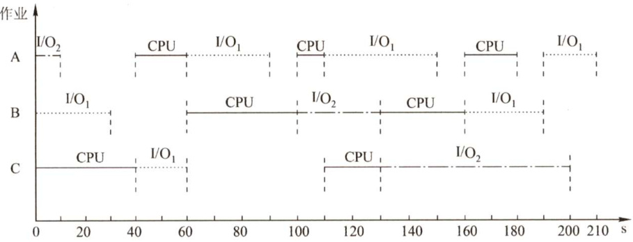  

06.【解答】  

1）作业执行情况可以用如下的甘特图来表示。  

FCFS:   

<html><body><table><tr><td></td><td>2</td><td>3</td><td>4</td><td>5</td></tr><tr><td></td><td></td><td></td><td></td><td></td></tr></table></body></html>  

RR:   

<html><body><table><tr><td>1</td><td>2</td><td>3</td><td>4</td><td>5</td><td>1</td><td>3</td><td>5</td><td>1</td><td>5</td><td>1</td><td>5</td><td>1</td><td>5</td><td>一</td></tr></table></body></html>  

SJF:   

<html><body><table><tr><td>2</td><td>4</td><td>3</td><td>5</td><td>1</td></tr></table></body></html>  

优先级：  

<html><body><table><tr><td>2</td><td>5</td><td>1</td><td>3</td><td>4</td></tr></table></body></html>  

2）各个作业对应于各个算法的周转时间和加权周转时间见下表。  

<html><body><table><tr><td rowspan="2">算法</td><td>时间类型</td><td>P1</td><td>P2</td><td>P3</td><td>P4</td><td>P5</td><td>平均时间</td></tr><tr><td>运行时间</td><td>10</td><td>1</td><td>2</td><td>1</td><td>5</td><td>3.8</td></tr><tr><td rowspan="2">FCFS</td><td>周转时间</td><td>10</td><td>11</td><td>13</td><td>14</td><td>19</td><td>13.4</td></tr><tr><td>加权周转时间</td><td>1</td><td>11</td><td>6.5</td><td>14</td><td>3.8</td><td>7.26</td></tr><tr><td rowspan="2">RR</td><td>周转时间</td><td>19</td><td>2</td><td>7</td><td>4</td><td>14</td><td>9.2</td></tr><tr><td>加权周转时间</td><td>1.9</td><td>2</td><td>3.5</td><td>4</td><td>2.8</td><td>2.84</td></tr><tr><td rowspan="2">SJF</td><td>周转时间</td><td>19</td><td>1</td><td>4</td><td>2</td><td>9</td><td>7</td></tr><tr><td>加权周转时间</td><td>1.9</td><td>1</td><td>2</td><td>2</td><td>1.8</td><td>1.74</td></tr><tr><td rowspan="2">优先级</td><td>周转时间</td><td>16</td><td>1</td><td>18</td><td>19</td><td>6</td><td>12</td></tr><tr><td>加权周转时间</td><td>1.6</td><td>1</td><td>9</td><td>19</td><td>1.2</td><td>6.36</td></tr></table></body></html>  

所以，FCFS的平均周转时间为13.4，平均加权周转时间为7.26。  
RR的平均周转时间为9.2，平均加权周转时间为2.84。  
SJF的平均周转时间为7，平均加权周转时间为1.74。  
非剥夺式优先级调度算法的平均周转时间为12，平均加权周转时间为6.36。  

注意：SJF的平均周转时间肯定是最短的，计算完毕后可以利用这个性质进行检验。  

07.【解答】  

1）具有两道作业的批处理系统，内存只存放两道作业，它们采用抢占式优先级调度算法竞争CPU，而将作业调入内存采用的是短作业优先调度。 $8:00$ ，作业1到来，此时内存和处理机空闲，作业1进入内存并占用处理机； $8:20$ ，作业2到来，内存仍有一个位置空闲，因此将作业2调入内存，又由于作业2的优先数高，相应的进程抢占处理机，在此期间8:30作业3到来，但内存此时已无空闲，因此等待。直至 $8:50$ ，作业2执行完毕，此时作业3、4 竞争空出的一道内存空间，作业4的运行时间短，因此先调入，但它的优先数低于作业1，因此作业1先执行。到 $9:10$ 时，作业1执行完毕，再将作业3调入内存，且由于作业3的优先数高而占用CPU。所有作业进入内存的时间及结束的时间见下表。  

<html><body><table><tr><td>作业</td><td>到达时间</td><td>运行时间</td><td>优先数</td><td>进入内存时间</td><td>结束时间</td><td>周转时间</td></tr><tr><td>1</td><td>8:00</td><td>40min</td><td>5</td><td>8:00</td><td>9:10</td><td>70min</td></tr><tr><td>2</td><td>8:20</td><td>30min</td><td>3</td><td>8:20</td><td>8:50</td><td>30min</td></tr><tr><td>3</td><td>8:30</td><td>50min</td><td>4</td><td>9:10</td><td>10:00</td><td>90min</td></tr><tr><td>4</td><td>8:50</td><td>20min</td><td>6</td><td>8:50</td><td>10:20</td><td>90min</td></tr></table></body></html>  

2）平均周转时间为 $(70+30+90+90)/4=70\mathrm{{min}}$ 0  

08.【解答】  

1）按照可抢先式短进程优先调度算法，进程运行时间见下表。  

<html><body><table><tr><td>进程</td><td>到达就绪队列时刻</td><td>预计执行时间</td><td>执行时间段</td><td>周转时间</td></tr><tr><td>P</td><td>0</td><td>8</td><td>0~1；10~17</td><td>17</td></tr><tr><td>P2</td><td>1</td><td>4</td><td>1~5</td><td>4</td></tr><tr><td>P3</td><td>2</td><td>9</td><td>17~26</td><td>24</td></tr><tr><td>P4</td><td>3</td><td>5</td><td>5~10</td><td>7</td></tr></table></body></html>  

·时刻0，进程 ${\bf P}_{1}$ 到达并占用处理器运行。  

·时刻1，进程 ${\bf P}_{2}$ 到达，因其预计运行时间短，因此抢夺处理器进入运行， ${\bf P}_{1}$ 等待。  
·时刻2，进程 ${\bf P}_{3}$ 到达，因其预计运行时间长于正在运行的进程，进入就绪队列等待。  
·时刻3，进程 ${\bf P}_{4}$ 到达，因其预计运行时间长于正在运行的进程，进入就绪队列等待。  
·时刻5，进程 ${\bf P}_{2}$ 运行结束，调度器在就绪队列中选择短进程， ${\mathrm{P}}_{4}$ 符合要求，进入运行，进程 ${\bf P}_{1}$ 和进程 ${\bf P}_{3}$ 则还在就绪队列等待。  
·时刻10，进程 ${\bf P}_{4}$ 运行结束，调度器在就绪队列中选择短进程， ${\bf P}_{1}$ 符合要求，再次进入运行，而进程 ${\bf P}_{3}$ 则还在就绪队列等待。  
·时刻17，进程 ${\bf P}_{1}$ 运行结束，只剩下进程P3，调度其运行。  
·时刻26，进程 ${\bf P}_{3}$ 运行结束。  

平均周转时间 $=[(17-0)+(5-1)+(26-2)+(10-3)]/4=13\mathrm{{.}}$  

2）时间片轮转算法按就绪队列的FCFS进行轮转，在时刻2， $\mathbf{P}_{1}$ 被挂到就绪队列队尾，队列顺序为 $\mathbf{P}_{2},\mathbf{P}_{3},\mathbf{P}_{1}$ ，此时 ${\mathrm{{P}}}_{4}$ 还未到达。按时间片轮转算法的进程时间分配见下表。  

<html><body><table><tr><td>进程</td><td>到达就绪队列时刻</td><td>预计执行时间</td><td>执行时间段</td><td>周转时间</td></tr><tr><td>P1</td><td>0</td><td>8</td><td>0~2；6~8；14~16；20~22</td><td>22</td></tr><tr><td>P2</td><td>1</td><td>4</td><td>2~4；10~12</td><td>11</td></tr><tr><td>P3</td><td>2</td><td>9</td><td>4~6；12~14；18~20；23~25；25~26</td><td>24</td></tr><tr><td>P4</td><td>3</td><td>5</td><td>8~10:16~18；22~23</td><td>20</td></tr></table></body></html>  

平均周转时间 $=((22-0)+(12-1)+(26-2)+(23-3))/4=19.25\$ .  

09.【解答】  

在时间片轮转调度算法中，系统将所有就绪进程按到达时间的先后次序排成一个队列。进程调度程序总是选择队列中的第一个进程运行，且仅能运行一个时间片。在使用完一个时间片后，即使进程并未完成其运行，也必须将处理器交给下一个进程。时间片轮转调度算法是绝对可抢先的算法，由时钟中断来产生。  

时间片的长短对计算机系统的影响很大。若时间片大到让一个进程足以完成其全部工作，则这种算法就退化为先来先服务算法。若时间片很小，则处理器在进程之间的转换工作会过于频繁，处理器真正用于运行用户程序的时间将减少，系统开销将增大。时间片的大小应能使分时用户得到好的响应时间，同时也使系统具有较高的效率。  

由题目给定条件可知：  

1）每秒产生120个时钟中断，每次中断的时间为 $1/120\approx8.3\mathrm{ms}$ ，其中中断处理耗时为 $500\upmu\mathrm{s}$ 那么其开销为 $500\upmu\mathrm{s}/8.3\mathrm{ms}=6\%$ o  
2）每次进程切换需要1次调度、1次切换，所以需要耗时 $1\mathrm{ms}+2\mathrm{ms}=3\mathrm{ms}$ ，每24个时钟为一个时间片， $24{\times}8.3\mathrm{ms}=200\mathrm{ms}$ 。一次切换所占CPU的时间比 $3\mathrm{ms}/200\mathrm{ms}=1.5\%$ O  
3）为提高CPU的效率，一般情况下要尽量减少时钟中断的次数，如由每秒120次降低到100次，以延长中断的时间间隔。或将每个时间片的中断数量（时钟数）加大，如由24个中断加大到36个。也可优化中断处理程序，减少中断处理开销，如将每次 $500\upmu\mathrm{s}$ 的时间降低到 $400\upmu\mathrm{s}$ 。若能这样，则时钟中断和进程切换的总开销占CPU的时间比为 $(36\times400\upmu\mathrm{s}\ +$ $1\mathrm{ms}+2\mathrm{ms})/(1/100{\times}36){\approx}4.8\%$ 。  

10.【解答】作业的响应比可表示为  

在时刻 $8:00$ ，系统中只有一个作业 ${\bf J}_{1}$ ，因此系统将它投入运行。在 ${\bf J}_{1}$ 完成（即 $10:00$ ）时，$\mathbf{J}_{2},\mathbf{J}_{3},\mathbf{J}_{4}$ 的响应比分别为 $(90+40)/40,(60+25)/25,(30+30)/30$ ，即3.25,3.4,2，因此应先将 ${\bf J}_{3}$ 投入运行。在 ${\bf J}_{3}$ 完成（即 $10:25$ ）时， ${\bf J}_{2},{\bf J}_{4}$ 的响应比分别为 $(115+40)/40$ ， $(55+30)/30$ ，即3.875,2.83，因此应先将 ${\bf J}_{2}$ 投入运行，待它运行完毕时（即 $11:05$ ，再将 $\mathrm{J}_{4}$ 投入运行， $\mathrm{J}_{4}$ 的结束时间为 $11:35$ 。  

可见作业的执行次序为 ${\bf J}_{1},{\bf J}_{3},{\bf J}_{2},{\bf J}_{4}$ ，各作业的运行情况见下表，它们的周转时间分别为 $120\mathrm{min}$ $155\mathrm{min}$ 。 $85\mathrm{min}$ ， $125\mathrm{min}$ ，平均周转时间为 $121.25\mathrm{{min}}$ 。  

口口  

<html><body><table><tr><td>作业号</td><td>提交时间</td><td>开始时间</td><td>执行时间</td><td>结束时间</td><td>周转时间</td></tr><tr><td>1</td><td>8:00</td><td>8:00</td><td>2h</td><td>10:00</td><td>120min</td></tr><tr><td>2</td><td>8:30</td><td>10:25</td><td>40min</td><td>11:05</td><td>155min</td></tr><tr><td>3</td><td>9:00</td><td>10:00</td><td>25min</td><td>10:25</td><td>85min</td></tr><tr><td>4</td><td>9:30</td><td>11:05</td><td>30min</td><td>11:35</td><td>125min</td></tr></table></body></html>  

11.【解答】  

上述5个作业的运行情况如下图所示。  

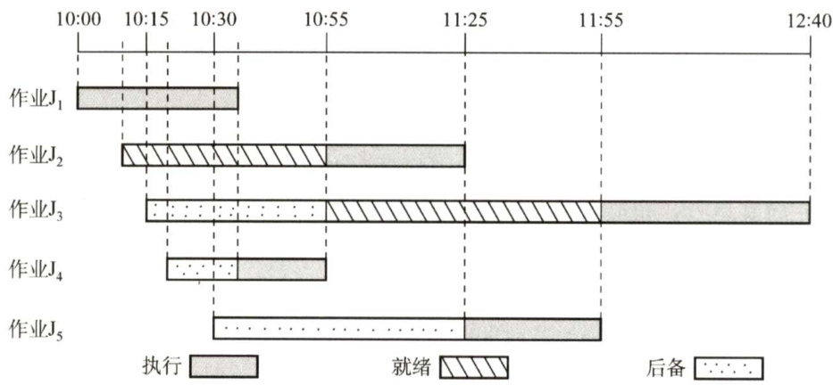  

在 $10:00$ ，因为只有 ${\bf J}_{1}$ 到达，因此将它调入内存，并将CPU调度给它。  

在 $10:10$ ， $\mathbf{J}_{2}$ 到达，因此将 ${\bf J}_{2}$ 调入内存，但由于 ${\bf J}_{1}$ 只需再执行 $25\mathrm{{min}}$ ，因此 ${\bf J}_{1}$ 继续执行。  

虽然 ${\bf J}_{3},{\bf J}_{4},{\bf J}_{5}$ 分别在 $10:15,10:20$ 和 $10:30$ 到达，但因当时内存中已存放了两道作业，因此不能马上将它们调入内存。  

在 $10:35$ ， ${\bf J}_{1}$ 结束。此时 ${\bf J}_{3},{\bf J}_{4},{\bf J}_{5}$ 的响应比[根据题意，响应比 $\mathbf{\Sigma}=\mathbf{\Sigma}$ (等待时间 $^+$ 估计运行时间)估计运行时间］分别为65/45，35/20,35/30，因此将 $\mathrm{J}_{4}$ 调入内存，并将CPU分配给内存中运行时间最短者，即 $\mathrm{J}_{4}$ 。  

在10:55， $\mathrm{J}_{4}$ 结束。此时 ${\bf J}_{3},{\bf J}_{5}$ 的响应比分别为85/45,55/30，因此将 ${\bf J}_{3}$ 调入内存，并将CPU分配给估计运行时间较短的 ${\bf J}_{2}$ 。  

在 $11:25$ ， ${\bf J}_{2}$ 结束，作业调度程序将 ${\bf J}_{5}$ 调入内存，并将CPU 分配给估计运行时间较短的 ${\bf J}_{5}$ 。  

在11:55， ${\bf J}_{5}$ 结束，将CPU分配给 ${\bf J}_{3}$ o在 $12:40$ ， ${\bf J}_{3}$ 结束。  

通过上述分析，可知：  

1）作业1的执行时间片段为 $10:00\cdot$ 10:35(结束）。作业2的执行时间片段为10：55—11：25（结束）。作业3的执行时间片段为11：55—12：40（结束）。作业4的执行时间片段为10：35—10：55（结束）。作业5的执行时间片段为11：25—11：55（结束）。  

2）它们的周转时间分别为 $35\mathrm{min}$ $75\mathrm{{min}}$ ， $145\mathrm{min}$ $35\mathrm{min}$ 。 $85\mathrm{min}$ ，因此它们的平均周转时间为$75\mathrm{{min}}$ o  

12.【解答】  

1）由于采用了静态优先数，当就绪队列中总有优先数较小的进程时，优先数较大的进程一直没有机会运行，因而会出现饥饿现象。  
2）优先数priority的计算公式为priority $\O=$ nice + kxcpuTime $\phantom{}-k_{2}\times$ waitTime，其中 $k_{1}>0$ ， $k_{2}>$ 0，用于分别调整cpuTime和waitTime在priority中所占的比例。waitTime可使长时间等待的进程优先数减少，从而避免出现饥饿现象。