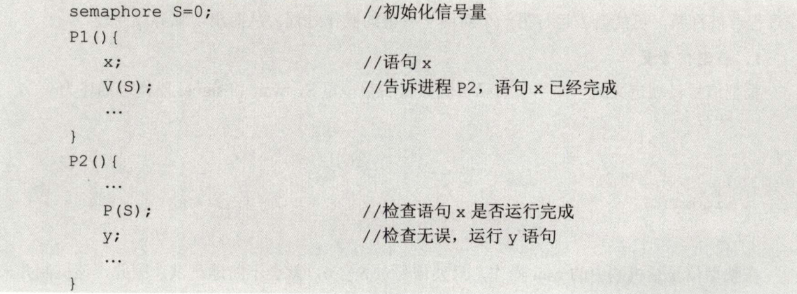
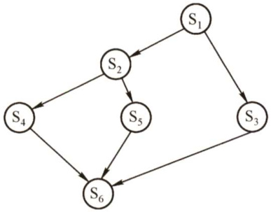
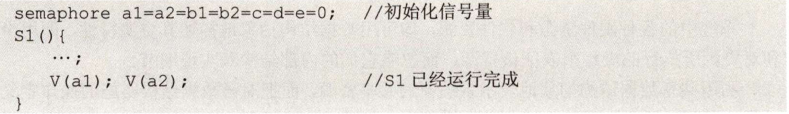
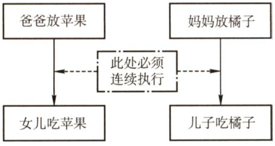
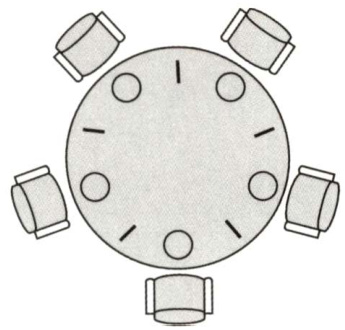
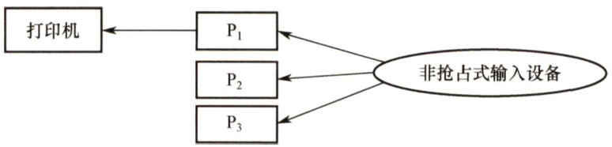
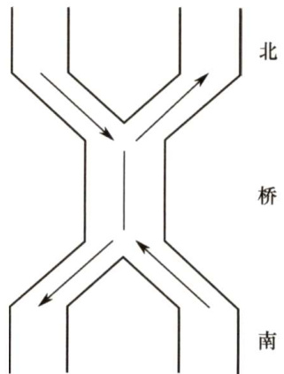
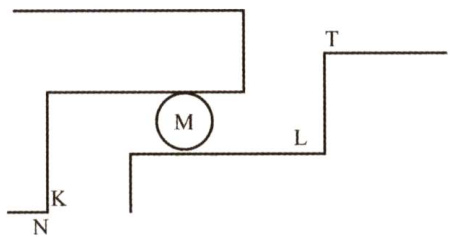
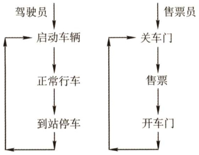

### 2.3 同步与互斥  

在学习本节时，请读者思考以下问题：  

1）为什么要引入进程同步的概念？2）不同的进程之间会存在什么关系？3）当单纯用本节介绍的方法解决这些问题时会遇到什么新的问题吗？用PV操作解决进程之间的同步互斥问题是这一节的重点，考试已经多次考查过这一内容，读者务必多加练习，掌握好求解问题的方法。  

#### 2.3.1 同步与互斥的基本概念  

在多道程序环境下，进程是并发执行的，不同进程之间存在着不同的相互制约关系。为了协调进程之间的相互制约关系，引入了进程同步的概念。下面举一个简单的例子来帮大家理解这个概念。例如，让系统计算 $1+2\times3$ ，假设系统产生两个进程：一个是加法进程，一个是乘法进程。要让计算结果是正确的，一定要让加法进程发生在乘法进程之后，但实际上操作系统具有异步性，若不加以制约，加法进程发生在乘法进程之前是绝对有可能的，因此要制定一定的机制去约束加法进程，让它在乘法进程完成之后才发生，而这种机制就是本节要讨论的内容。  

#### 1.临界资源  

虽然多个进程可以共享系统中的各种资源，但其中许多资源一次只能为一个进程所用，我们将一次仅允许一个进程使用的资源称为临界资源。许多物理设备都属于临界资源，如打印机等。此外，还有许多变量、数据等都可以被若干进程共享，也属于临界资源。  

对临界资源的访问，必须互斥地进行，在每个进程中，访问临界资源的那段代码称为临界区。为了保证临界资源的正确使用，可把临界资源的访问过程分成4个部分：  

1）进入区。为了进入临界区使用临界资源，在进入区要检查可否进入临界区，若能进入临  
界区，则应设置正在访问临界区的标志，以阻止其他进程同时进入临界区。  
2）临界区。进程中访问临界资源的那段代码，又称临界段。  
3）退出区。将正在访问临界区的标志清除。  
4）剩余区。代码中的其余部分。  

do{ entry section; //进入区 critical section; //临界区 exit section; //退出区 remainder section; //剩余区   
}while（true)  

#### 2.同步  

同步亦称直接制约关系，是指为完成某种任务而建立的两个或多个进程，这些进程因为需要在某些位置上协调它们的工作次序而等待、传递信息所产生的制约关系。进程间的直接制约关系源于它们之间的相互合作。  

例如，输入进程A通过单缓冲向进程B提供数据。当该缓冲区空时，进程B不能获得所需数据而阻塞，一旦进程A将数据送入缓冲区，进程B就被唤醒。反之，当缓冲区满时，进程A被阻塞，仅当进程B取走缓冲数据时，才唤醒进程A。  

#### 3.互斥  

互斥也称间接制约关系。当一个进程进入临界区使用临界资源时，另一个进程必须等待，当占用临界资源的进程退出临界区后，另一进程才允许去访问此临界资源。  

例如，在仅有一台打印机的系统中，有两个进程A和进程B，若进程A需要打印时，系统已将打印机分配给进程B，则进程A 必须阻塞。一旦进程B将打印机释放，系统便将进程A 唤醒，并将其由阻塞态变为就绪态。  

为禁止两个进程同时进入临界区，同步机制应遵循以下准则：  

1）空闲让进。临界区空闲时，可以允许一个请求进入临界区的进程立即进入临界区。  
2）忙则等待。当已有进程进入临界区时，其他试图进入临界区的进程必须等待。  
3）有限等待。对请求访问的进程，应保证能在有限时间内进入临界区。  
4）让权等待。当进程不能进入临界区时，应立即释放处理器，防止进程忙等待。  

#### 2.3.2 实现临界区互斥的基本方法  

#### 1．软件实现方法  

在进入区设置并检查一些标志来标明是否有进程在临界区中，若已有进程在临界区，则在进入区通过循环检查进行等待，进程离开临界区后则在退出区修改标志。  

1）算法一：单标志法。该算法设置一个公用整型变量 tum，用于指示被允许进入临界区的进程编号，即若 $\mathrm{{turn}}=0$ ，则允许 ${\bf P}_{0}$ 进程进入临界区。该算法可确保每次只允许一个进程进入临界区。但两个进程必须交替进入临界区，若某个进程不再进入临界区，则另一个进程也将无法进入临界区（违背“空闲让进")。这样很容易造成资源利用不充分。若 ${\bf P}_{0}$ 顺利进入临界区并从临界区离开，则此时临界区是空闲的，但 ${\bf P}_{1}$ 并没有进入临界区的打算， $\mathrm{{turn}}=1$ 一直成立， ${\bf P}_{0}$ 就无法再次进入临界区（一直被while死循环困住)。  

${\bf P}_{0}$ 进程： ${\bf P}_{1}$ 进程： while(turn $\!=0$ ）; while(turn $\mathrel{\mathop:}=1$ ； //进入区 critical section; critical section; //临界区 turn $\scriptstyle=1$ . turn $=0$ . //退出区 remainder section; remainder section; //剩余区  

2）算法二：双标志法先检查。该算法的基本思想是在每个进程访问临界区资源之前，先查看临界资源是否正被访问，若正被访问，该进程需等待；否则，进程才进入自己的临界区。为此，设置一个数据flag[]，如第 $i$ 个元素值为FALSE，表示 $\mathbf{P}_{i}$ 进程未进入临界区，值为TRUE，表示 $\mathbf{P}_{i}$ 进程进入临界区。  

$\mathbf{P}_{i}$ 进程： ${\bf P}_{j}$ 进程：while(flag[j]）; $\textcircled{1}$ while(flag[i]); $\textcircled{2}$ //进入区flag[i] $\c=$ TRUE; $\textcircled{3}$ flag[j] $\c=$ TRUE; $\textcircled{4}$ //进入区critical section; critical section; //临界区优点：不用交替进入，可连续使用；缺点： $\mathbf{P}_{i}$ 和P可能同时进入临界区。按序列 $\textcircled{1}\textcircled{2}\textcircled{3}\textcircled{4}$ 执行时，会同时进入临界区（违背“忙则等待")。即在检查对方的flag后和切换自己的flag前有一段时间，结果都检查通过。这里的问题出在检查和修改操作不能一次进行。  

<html><body><table><tr><td>flag[i]=FALSE; flag[j]=FALSE; remainder section; remainder section;</td></tr></table></body></html>  

3）算法三：双标志法后检查。算法二先检测对方的进程状态标志，再置自己的标志，由于在检测和放置中可插入另一个进程到达时的检测操作，会造成两个进程在分别检测后同时进入临界区。为此，算法三先将自己的标志设置为TRUE，再检测对方的状态标志，若对方标志为TRUE，则进程等待；否则进入临界区。  

$\mathbf{P}_{i}$ 进程： ${\bf P}_{j}$ 进程：flag[i] $\c=$ TRUE; flag[j] $\c=$ TRUE; //进入区while（flag[j]）; while(flag[i]); //进入区critical section; critical section; //临界区flag[i] $\c=$ FALSE; flag[j] $\c=$ FALSE; //退出区remainder section; remainder section; //剩余区两个进程几乎同时都想进入临界区时，它们分别将自己的标志值flag设置为TRUE，并且同时检测对方的状态（执行while语句)，发现对方也要进入临界区时，双方互相谦让，结果谁也进不了临界区，从而导致“饥饿”现象。  

4）算法四：Peterson's Algorithm。为了防止两个进程为进入临界区而无限期等待，又设置了变量tum，每个进程在先设置自己的标志后再设置tum标志。这时，再同时检测另一个进程状态标志和允许进入标志，以便保证两个进程同时要求进入临界区时，只允许一个进程进入临界区。  

$\mathbf{P}_{i}$ 进程： ${\bf P}_{j}$ 进程：flag[i] $\c=$ TRUE;turn $=\dot{]}$ · flag[j] $=$ TRUE;turn $\vDash\dot{\boldsymbol{\mathrm{1}}}$ · //进入区while（flag[j]&&turn $\mathrel{\mathop=}\mathrel{=}\dot{\mathrm{\Im}}$ ）； while（flag[i]&&turn $\scriptstyle=={\dot{\bar{1}}}$ ）； //进入区critical section; critical section; //临界区flag[i] $\c=$ FALSE; flag[j] $\c=$ FALSE; //退出区remainder section; remainder section; //剩余区具体如下：考虑进程 ${\mathrm{\bf~P}}_{i},$ ，一旦设置 $\mathrm{{flag}}[i]=$ true，就表示它想要进入临界区，同时 $\mathrm{{turn}}=j$ 此时若进程 ${\bf P}_{j}$ 已在临界区中，符合进程 $\mathrm{\bfP}_{i}$ 中的while循环条件，则 $\mathbf{P}_{i}$ 不能进入临界区。若 ${\bf P}_{j}$ 不想要进入临界区，即 $\mathrm{{flag}}[j]=$ false，循环条件不符合，则 $\mathbf{P}_{i}$ 可以顺利进入，反之亦然。本算法的基本思想是算法一和算法三的结合。利用flag解决临界资源的互斥访问，而利用turn解决“饥饿”现象。  

理解Peterson'sAlgorithm的最好方法就是手动模拟。  

#### 2.硬件实现方法  

理解本节介绍的硬件实现，对学习后面的信号量很有帮助。计算机提供了特殊的硬件指令，允许对一个字中的内容进行检测和修正，或对两个字的内容进行交换等。通过硬件支持实现临界段问题的方法称为低级方法，或称元方法。  

#### （1）中断屏蔽方法  

当一个进程正在执行它的临界区代码时，防止其他进程进入其临界区的最简方法是关中断。因为CPU只在发生中断时引起进程切换，因此屏蔽中断能够保证当前运行的进程让临界区代码顺利地执行完，进而保证互斥的正确实现，然后执行开中断。其典型模式为  

  

这种方法限制了处理机交替执行程序的能力，因此执行的效率会明显降低。对内核来说，在它执行更新变量或列表的几条指令期间，关中断是很方便的，但将关中断的权力交给用户则很不明智，若一个进程关中断后不再开中断，则系统可能会因此终止。  

#### （2）硬件指令方法  

TestAndSet指令：这条指令是原子操作，即执行该代码时不允许被中断。其功能是读出指定标志后把该标志设置为真。指令的功能描述如下：  

booleanTestAndSet（boolean\*lock){ boolean old; old $\scriptstyle=\star$ lock; \*lock $\c=$ true; return old;  

可以为每个临界资源设置一个共享布尔变量lock，表示资源的两种状态：true表示正被占用，初值为false。进程在进入临界区之前，利用 TestAndSet检查标志lock，若无进程在临界区，则其值为false，可以进入，关闭临界资源，把lock置为true，使任何进程都不能进入临界区；若有进程在临界区，则循环检查，直到进程退出。利用该指令实现互斥的过程描述如下：  

whileTestAndSet（&lock);  
进程的临界区代码段；  
lock $\c=$ false;  
进程的其他代码；  

Swap 指令：该指令的功能是交换两个字（字节）的内容。其功能描述如下：  

Swap（boolean\*a,boolean\*b){ boolean temp; Temp $\v{x}$ a; $\star a=\star b$ . $\star\mathrm{b}=$ temp;  

注意：以上对 TestAndSet和Swap 指令的描述仅是功能实现，而并非软件实现的定义。事实上，它们是由硬件逻辑直接实现的，不会被中断。  

用 Swap指令可以简单有效地实现互斥，为每个临界资源设置一个共享布尔变量lock，初值为 false；在每个进程中再设置一个局部布尔变量key，用于与lock交换信息。在进入临界区前，先利用Swap指令交换lock与key的内容，然后检查key的状态；有进程在临界区时，重复交换和检查过程，直到进程退出。其处理过程描述如下：  

key=true;  
while(key! $\c=$ false)Swap（&lock，&key）;  
进程的临界区代码段；  
lock=false;  
进程的其他代码；  

硬件方法的优点：适用于任意数目的进程，而不管是单处理机还是多处理机；简单、容易验证其正确性。可以支持进程内有多个临界区，只需为每个临界区设立一个布尔变量。  

硬件方法的缺点：进程等待进入临界区时要耗费处理机时间，不能实现让权等待。从等待进程中随机选择一个进入临界区，有的进程可能一直选不上，从而导致“饥饿”现象。  

无论是软件实现方法还是硬件实现方法，读者只需理解它的执行过程即可，关键是软件实现方法。实际练习和考试中很少让读者写出某种软件和硬件实现方法，因此读者并不需要默写或记忆。以上的代码实现与我们平时在编译器上写的代码意义不同，以上的代码实现是为了表述进程实现同步和互斥的过程，并不是说计算机内部实现同步互斥的就是这些代码。  

#### 2.3.3 互斥锁  

解决临界区最简单的工具就是互斥锁（mutexlock)。一个进程在进入临界区时应获得锁；在退出临界区时释放锁。函数acquire()获得锁，而函数release()释放锁。  

每个互斥锁有一个布尔变量available，表示锁是否可用。如果锁是可用的，调用acqiure()会成功，且锁不再可用。当一个进程试图获取不可用的锁时，会被阻塞，直到锁被释放。  

acquire(） while(!available) ; //忙等待 available $\mathbf{\Sigma}=$ false; //获得锁   
1   
release（){ available $\mathbf{\Sigma}=\mathbf{\Sigma}$ true; //释放锁   
)  

acquire(或release()的执行必须是原子操作，因此互斥锁通常采用硬件机制来实现。  

互斥锁的主要缺点是忙等待，当有一个进程在临界区中，任何其他进程在进入临界区时必须连续循环调用acquire()。当多个进程共享同一CPU时，就浪费了CPU周期。因此，互斥锁通常用于多处理器系统，一个线程可以在一个处理器上等待，不影响其他线程的执行。  

本节后面，将会研究如何使用互斥锁解决经典同步问题。  

#### 2.3.4 信号量  

信号量机制是一种功能较强的机制，可用来解决互斥与同步问题，它只能被两个标准的原语wait(S)和signal(S)访问，也可记为“P操作”和“V操作”。  

原语是指完成某种功能且不被分割、不被中断执行的操作序列，通常可由硬件来实现。例如，前述的Test-and-Set和Swap指令就是由硬件实现的原子操作。原语功能的不被中断执行特性在单处理机上可由软件通过屏蔽中断方法实现。原语之所以不能被中断执行，是因为原语对变量的操作过程若被打断，可能会去运行另一个对同一变量的操作过程，从而出现临界段问题。  

#### 1．整型信号量  

整型信号量被定义为一个用于表示资源数目的整型量S，wait和signal操作可描述为  

wait(S)while( $s<=0$ ）;$s{=}s{-}1$ ，  
1  
signal(S）{$s{=}s+1$ ·  

在整型信号量机制中的wait操作，只要信号量 $S\le0$ ，就会不断地测试。因此，该机制并未遵循“让权等待”的准则，而是使进程处于“忙等”的状态。  

#### 2.记录型信号量  

记录型信号量机制是一种不存在“忙等”现象的进程同步机制。除了需要一个用于代表资源数目的整型变量value 外，再增加一个进程链表L，用于链接所有等待该资源的进程。记录型信号量得名于采用了记录型的数据结构。记录型信号量可描述为  

typedef struct{ int value; struct process \*L;   
}semaphore;  

相应的wait(S)和 signal(S)的操作如下：  

void wait(semaphore S){ //相当于申请资源 S.value--; if(s.value $<0$ ） add this process to S.L; block(S.L);  

wait 操作，S.value--表示进程请求一个该类资源，当S.value $<0$ 时，表示该类资源已分配完毕，因此进程应调用block 原语，进行自我阻塞，放弃处理机，并插入该类资源的等待队列 S.L，可见该机制遵循了“让权等待”的准则。  

void signal（semaphore S）{ //相当于释放资源 S.value $^{++}$ if(s.value $<=0$ ）{ remove a process P from S.L; wakeup（P);  

signal操作，表示进程释放一个资源，使系统中可供分配的该类资源数增1，因此有S.value $^{++}$ 。若加1后仍是S.value≤0，则表示在S.L中仍有等待该资源的进程被阻塞，因此还应调用 wakeup原语，将S.L中的第一个等待进程唤醒。  

#### 3.利用信号量实现同步  

信号量机制能用于解决进程间的各种同步问题。设S为实现进程 ${\bf P}_{1}$ 。 ${\bf P}_{2}$ 同步的公共信号量，初值为0。进程 $\mathbf{P}_{2}$ 中的语句y要使用进程 ${\bf P}_{1}$ 中语句 $\mathbf{x}$ 的运行结果，所以只有当语句 $\mathbf{x}$ 执行完成之后语句y才可以执行。其实现进程同步的算法如下：  

  

若 ${\bf P}_{2}$ 先执行到P(S)时，S 为0，执行P操作会把进程 ${\bf P}_{2}$ 阻塞，并放入阻塞队列；当进程 $\mathbf{P}_{1}$  

中的x执行完后，执行V操作，把 $\mathbf{P}_{2}$ 从阻塞队列中放回就绪队列，当 ${\bf P}_{2}$ 得到处理机时，就得以继续执行。  

#### 4.利用信号量实现进程互斥  

信号量机制也能很方便地解决进程互斥问题。设S为实现进程 ${\bf P}_{1}$ 。 ${\bf P}_{2}$ 互斥的信号量，由于每次只允许一个进程进入临界区，所以S 的初值应为1(即可用资源数为1)。只需把临界区置于P(S)和V(S)之间，即可实现两个进程对临界资源的互斥访问。其算法如下：  

semaphore $s{=}1$ . //初始化信号量   
P1(）{ P(S); //准备开始访问临界资源，加锁 进程P1的临界区； V(S); //访问结束，解锁   
}   
P2(）{ · P(S); //准备开始访问临界资源，加锁 进程P2的临界区； V(S); //访问结束，解锁  

当没有进程在临界区时，任意一个进程要进入临界区，就要执行P操作，把S的值减为0，然后进入临界区；当有进程存在于临界区时，S的值为0，再有进程要进入临界区，执行P操作时将会被阻塞，直至在临界区中的进程退出，这样便实现了临界区的互斥。  

互斥是不同进程对同一信号量进行P,V操作实现的，一个进程成功对信号量执行了P操作后进入临界区，并在退出临界区后，由该进程本身对该信号量执行V操作，表示当前没有进程进入临界区，可以让其他进程进入。  

下面简单总结一下PV操作在同步互斥中的应用：在同步问题中，若某个行为要用到某种资源，则在这个行为前面P这种资源一下；若某个行为会提供某种资源，则在这个行为后面√这种资源一下。在互斥问题中，P，V操作要紧夹使用互斥资源的那个行为，中间不能有其他穴余代码。  

#### 5.利用信号量实现前驱关系  

信号量也可用来描述程序之间或语句之间的前驱关系。图2.10给出了一个前驱图，其中 $\mathrm{S}_{1},\mathrm{S}_{2},\mathrm{S}_{3},\cdots,\mathrm{S}_{6}$ 是最简单的程序段（只有一条语句)。为使各程序段能正确执行，应设置若干初始值为“0”的信号量。例如，为保证 $\mathrm{S}_{1}{\rightarrow}\mathrm{S}_{2}.$ ${\bf S}_{1}{\rightarrow}{\bf S}_{3}$ 的前驱关系，应分别设置信号量al,a2。同样，为保证 ${\mathrm{S}}_{2}{\mathrm{-}}{\mathrm{S}}_{4}$ 。 ${\bf S}_{2}{\rightarrow}{\bf S}_{5}$ P ${\mathrm{S}}_{3}{\mathrm{\to}}{\mathrm{S}}_{6}$ $\mathrm{S}_{4}{\rightarrow}\mathrm{S}_{6},$ ${\mathrm{S}}_{5}{\mathrm{{\to}}}{\mathrm{S}}_{6}$ ，应设置信号量bl,b2,c,d,e。  

实现算法如下：  

  
图2.10 前驱图举例  

  

S2(）P(al); //检查S1是否运行完成.;V(b1);v(b2); //S2已经运行完成  
)  
S3(）P(a2); //检查S1是否已经运行完成.;V(c); //S3已经运行完成  
六  
S4(）{P(b1); //检查S2是否已经运行完成..;v(d); //S4已经运行完成  
}  
S5(）P(b2); //检查S2是否已经运行完成.;V(e); //S5已经运行完成  
1  
S6(）P(C); //检查S3是否已经运行完成P(d）; //检查S4是否已经运行完成P(e); //检查S5是否已经运行完成..:  

#### 6.分析进程同步和互斥问题的方法步骤  

1）关系分析。找出问题中的进程数，并分析它们之间的同步和互斥关系。同步、互斥、前驱关系直接按照上面例子中的经典范式改写。  
2）整理思路。找出解决问题的关键点，并根据做过的题目找出求解的思路。根据进程的操作流程确定P操作、V操作的大致顺序。  

3）设置信号量。根据上面的两步，设置需要的信号量，确定初值，完善整理。  

这是一个比较直观的同步问题，以 $\mathbf{S}_{2}$ 为例，它是 $\mathrm{S}_{1}$ 的后继，所以要用到 $\mathbf{S}_{1}$ 的资源，在前面的简单总结中我们说过，在同步问题中，要用到某种资源，就要在行为（题中统一抽象成L）前面P这种资源一下。 $\mathbf{S}_{2}$ 是 $\mathrm{S}_{4},$ ${\bf S}_{5}$ 的前驱，给 $\mathrm{S}_{4},$ ${\bf S}_{5}$ 提供资源，所以要在L行为后面√由 $\mathrm{S}_{4}$ 和 ${\bf S}_{5}$ 代表的资源一下。  

#### 2.3.5 管程  

在信号量机制中，每个要访问临界资源的进程都必须自备同步的PV操作，大量分散的同步操作给系统管理带来了麻烦，且容易因同步操作不当而导致系统死锁。于是，便产生了一种新的进程同步工具—管程。管程的特性保证了进程互斥，无须程序员自己实现互斥，从而降低了死锁发生的可能性。同时管程提供了条件变量，可以让程序员灵活地实现进程同步。  

#### 1．管程的定义  

系统中的各种硬件资源和软件资源，均可用数据结构抽象地描述其资源特性，即用少量信息和对资源所执行的操作来表征该资源，而忽略它们的内部结构和实现细节。  

利用共享数据结构抽象地表示系统中的共享资源，而把对该数据结构实施的操作定义为一组过程。进程对共享资源的申请、释放等操作，都通过这组过程来实现，这组过程还可以根据资源情况，或接受或阻塞进程的访问，确保每次仅有一个进程使用共享资源，这样就可以统一管理对共享资源的所有访问，实现进程互斥。这个代表共享资源的数据结构，以及由对该共享数据结构实施操作的一组过程所组成的资源管理程序，称为管程（monitor）。管程定义了一个数据结构和能为并发进程所执行（在该数据结构上）的一组操作，这组操作能同步进程和改变管程中的数据。  

由上述定义可知，管程由4部分组成：  

$\textcircled{1}$ 管程的名称；  
$\textcircled{2}$ 局部于管程内部的共享数据结构说明；  
$\textcircled{3}$ 对该数据结构进行操作的一组过程（或函数）；  
$\textcircled{4}$ 对局部于管程内部的共享数据设置初始值的语句。  

管程的定义描述举例如下：  

monitor Demo{// $\textcircled{1}$ 定义一个名称为“Demo”的管程// $\textcircled{2}$ 定义共享数据结构，对应系统中的某种共享资源共享数据结构S；/1 $\textcircled{4}$ 对共享数据结构初始化的语句init_code（）{$s{=}5$ . //初始资源数等于5// $\textcircled{3}$ 过程1：申请一个资源take_away（）{对共享数据结构 $x$ 的一系列处理；S--; //可用资源数-1// $\textcircled{3}$ 过程2：归还一个资源give_back（）{对共享数据结构 $x$ 的一系列处理；$^{S++}$ . //可用资源数 $+1$  

熟悉面向对象程序设计的读者看到管程的组成后，会立即联想到管程很像一个类（class）。  

1）管程把对共享资源的操作封装起来，管程内的共享数据结构只能被管程内的过程所访问。一个进程只有通过调用管程内的过程才能进入管程访问共享资源。对于上例，外部进程只能通过调用take_awayO过程来申请一个资源；归还资源也一样。  

2）每次仅允许一个进程进入管程，从而实现进程互斥。若多个进程同时调用 take_away(),give_back()，则只有某个进程运行完它调用的过程后，下个进程才能开始运行它调用的过程。也就是说，各个进程只能串行执行管程内的过程，这一特性保证了进程“互斥”访问共享数据结构S。  

#### 2．条件变量  

当一个进程进入管程后被阻塞，直到阻塞的原因解除时，在此期间，如果该进程不释放管程，那么其他进程无法进入管程。为此，将阻塞原因定义为条件变量condition。通常，一个进程被阻塞的原因可以有多个，因此在管程中设置了多个条件变量。每个条件变量保存了一个等待队列，用于记录因该条件变量而阻塞的所有进程，对条件变量只能进行两种操作，即wait和 signal。  

x.wait：当 $\textbf{x}$ 对应的条件不满足时，正在调用管程的进程调用x.wait将自己插入x条件的等待队列，并释放管程。此时其他进程可以使用该管程。  

x.signal：x对应的条件发生了变化，则调用x.signal，唤醒一个因x条件而阻塞的进程。下面给出条件变量的定义和使用：  

monitor Demo{共享数据结构S;condition x; //定义一个条件变量 $x$ init_code（）{...)take_away（）{if $s<=0$ ）x.wait（）; //资源不够，在条件变量 $x$ 上阻塞等待资源足够，分配资源，做一系列相应处理；1give_back（）{归还资源，做一系列相应处理；if（有进程在等待）x.signal；//唤醒一个阻塞进程  

条件变量和信号量的比较：  

相似点：条件变量的wait/signal操作类似于信号量的P/V操作，可以实现进程的阻塞/唤醒。不同点：条件变量是“没有值”的，仅实现了“排队等待”功能；而信号量是“有值”的，信号量的值反映了剩余资源数，而在管程中，剩余资源数用共享数据结构记录。  

#### 2.3.6 经典同步问题  

#### 1.生产者-消费者问题  

问题描述：一组生产者进程和一组消费者进程共享一个初始为空、大小为 $n$ 的缓冲区，只有缓冲区没满时，生产者才能把消息放入缓冲区，否则必须等待；只有缓冲区不空时，消费者才能从中取出消息，否则必须等待。由于缓冲区是临界资源，它只允许一个生产者放入消息，或一个消费者从中取出消息。  

#### 问题分析：  

1）关系分析。生产者和消费者对缓冲区互斥访问是互斥关系，同时生产者和消费者又是一个相互协作的关系，只有生产者生产之后，消费者才能消费，它们也是同步关系。  
2）整理思路。这里比较简单，只有生产者和消费者两个进程，正好是这两个进程存在着互斥关系和同步关系。那么需要解决的是互斥和同步PV操作的位置。  
3）信号量设置。信号量mutex作为互斥信号量，用于控制互斥访问缓冲池，互斥信号量初值为1；信号量full用于记录当前缓冲池中的“满”缓冲区数，初值为0。信号量 empty用于记录当前缓冲池中的“空”缓冲区数，初值为 $n$ 0  

我们对同步互斥问题的介绍是一个循序渐进的过程。上面介绍了一个同步问题的例子和一个互斥问题的例子，下面来看生产者-消费者问题的例子是什么样的。  

生产者-消费者进程的描述如下：  

semaphore mutex $=1$ . //临界区互斥信号量  
semaphore empty $=\mathtt{n}$ . //空闲缓冲区  
semaphore full $=0$ ： //缓冲区初始化为空  
producer（）{ //生产者进程while(1)(produce an item in nextp; //生产数据P（empty）；（要用什么，P一下） //获取空缓冲区单元P（mutex）；（互斥夹紧） //进入临界区addnextptobuffer;（行为） //将数据放入缓冲区V（mutex）；（互斥夹紧） //离开临界区，释放互斥信号量V（full）；（提供什么，V-下） //满缓冲区数加1+  
}  
consumer（）( //消费者进程while(l)(P(full); //获取满缓冲区单元P(mutex); //进入临界区remove an item from buffer; //从缓冲区中取出数据V(mutex); //离开临界区，释放互斥信号量V(empty); //空缓冲区数加1consume the item; //消费数据}  

该类问题要注意对缓冲区大小为 $n$ 的处理，当缓冲区中有空时，便可对empty变量执行P操作，一旦取走一个产品便要执行V操作以释放空闲区。对empty 和full变量的P操作必须放在对mutex 的P操作之前。若生产者进程先执行P(mutex)，然后执行P(empty)，消费者执行P(mutex)，然后执行P(full)，这样可不可以？答案是否定的。设想生产者进程已将缓冲区放满，消费者进程并没有取产品，即 $\mathrm{empty}=0$ ，当下次仍然是生产者进程运行时，它先执行P(mutex)封锁信号量，再执行P(empty)时将被阻塞，希望消费者取出产品后将其唤醒。轮到消费者进程运行时，它先执行P(mutex)，然而由于生产者进程已经封锁mutex信号量，消费者进程也会被阻塞，这样一来生产者、消费者进程都将阻塞，都指望对方唤醒自己，因此陷入了无休止的等待。同理，若消费者进程已将缓冲区取空，即 $\mathrm{full}=0$ ，下次若还是消费者先运行，也会出现类似的死锁。不过生产者释放信号量时，mutex,full先释放哪一个无所谓，消费者先释放mutex或empty 都可以。  

根据对同步互斥问题的简单总结，我们发现，其实生产者-消费者问题只是一个同步互斥问题的综合而已。  

下面再看一个较为复杂的生产者-消费者问题。  

问题描述：桌子上有一个盘子，每次只能向其中放入一个水果。爸爸专向盘子中放苹果，妈妈专向盘子中放橘子，儿子专等吃盘子中的橘子，女儿专等吃盘子中的苹果。只有盘子为空时，爸爸或妈妈才可向盘子中放一个水果；仅当盘子中有自己需要的水果时，儿子或女儿可以从盘子中取出。  

#### 问题分析：  

1）关系分析。这里的关系要稍复杂一些。由每次只能向其中放入一只水果可知，爸爸和妈妈是互斥关系。爸爸和女儿、妈妈和儿子是同步关系，而且这两对进程必须连起来，儿子和女儿之间没有互斥和同步关系，因为他们是选择条件执行，不可能并发，如图2.11所示。  

  
图2.11 进程之间的关系  

2）整理思路。这里有4个进程，实际上可抽象为两个生产者和两个消费者被连接到大小为1的缓冲区上。  
3）信号量设置。首先将信号量plate设置互斥信号量，表示是否允许向盘子放入水果，初值为1表示允许放入，且只允许放入一个。信号量apple表示盘子中是否有苹果，初值为0表示盘子为空，不许取，apple $=1$ 表示可以取。信号量orange表示盘子中是否有橘子，  

初值为0表示盘子为空，不许取，orange $=1$ 表示可以取。  

解决该问题的代码如下：  

semaphore plate $=1$ ， $\mathsf{a p p l e}=0$ ,orange $=0$ .   
dad(){ //父亲进程 while（l){ prepare an apple; P(plate); //互斥向盘中取、放水果 put the apple on the plate; //向盘中放苹果 V(apple); //允许取苹果 }   
mom（）{ //母亲进程 while（1){ preparean orange; P(plate); //互斥向盘中取、放水果 put the orange on the plate; //向盘中放橘子 V(orange); //允许取橘子 子   
1   
son（）{ //儿子进程 while(1)( P(orange); //互斥向盘中取橘子 take an orange from the plate; V(plate); //允许向盘中取、放水果 eat the orange;   
daughter（）( //女儿进程 while(l）{ P(apple); //互斥向盘中取苹果 take an apple from the plate; V(plate); //允许向盘中取、放水果 eat the apple; )  

进程间的关系如图 2.11 所示。dad()和 daughter()、mom()和 son)必须连续执行，正因为如此，也只能在女儿拿走苹果后或儿子拿走橘子后才能释放盘子，即V(plate)操作。  

#### 2.读者-写者问题  

问题描述：有读者和写者两组并发进程，共享一个文件，当两个或以上的读进程同时访问共享数据时不会产生副作用，但若某个写进程和其他进程（读进程或写进程）同时访问共享数据时则可能导致数据不一致的错误。因此要求： $\textcircled{1}$ 允许多个读者可以同时对文件执行读操作； $\textcircled{2}$ 只允许一个写者往文件中写信息； $\textcircled{3}$ 任一写者在完成写操作之前不允许其他读者或写者工作； $\textcircled{4}$ 写者执行写操作前，应让已有的读者和写者全部退出。  

#### 问题分析：  

1）关系分析。由题目分析读者和写者是互斥的，写者和写者也是互斥的，而读者和读者不存在互斥问题。  
2）整理思路。两个进程，即读者和写者。写者是比较简单的，它和任何进程互斥，用互斥信号量的P操作、V操作即可解决。读者的问题比较复杂，它必须在实现与写者互斥的  

同时，实现与其他读者的同步，因此简单的一对P操作、V操作是无法解决问题的。这里用到了一个计数器，用它来判断当前是否有读者读文件。当有读者时，写者是无法写文件的，此时读者会一直占用文件，当没有读者时，写者才可以写文件。同时，这里不同读者对计数器的访问也应该是互斥的。  

3）信号量设置。首先设置信号量count为计数器，用于记录当前读者的数量，初值为0；设置mutex为互斥信号量，用于保护更新count变量时的互斥；设置互斥信号量rw，用于保证读者和写者的互斥访问。  

代码如下：  

int count $=0$ .· //用于记录当前的读者数量  
semaphore mutex $=1$ . //用于保护更新count变量时的互斥  
semaphore rw $=1$ ， //用于保证读者和写者互斥地访问文件  
writer(){ //写者进程while(1){P(rw); //互斥访问共享文件writing; //写入V(rw); //释放共享文件8  
F  
reader（）{ //读者进程while(1){P(mutex); //互斥访问count变量if(count $==0$ //当第一个读进程读共享文件时P(rw); //阻止写进程写count++; //读者计数器加1V(mutex); //释放互斥变量countreading; //读取P(mutex); //互斥访问count变量count--; //读者计数器减1if(count $\scriptstyle==0$ ） //当最后一个读进程读完共享文件V(rw); //允许写进程写V(mutex); //释放互斥变量count  

在上面的算法中，读进程是优先的，即当存在读进程时，写操作将被延迟，且只要有一个读进程活跃，随后而来的读进程都将被允许访问文件。这样的方式会导致写进程可能长时间等待，且存在写进程“饿死”的情况。  

若希望写进程优先，即当有读进程正在读共享文件时，有写进程请求访问，这时应禁止后续读进程的请求，等到已在共享文件的读进程执行完毕，立即让写进程执行，只有在无写进程执行的情况下才允许读进程再次运行。为此，增加一个信号量并在上面程序的writer()和reader(函数中各增加一对PV操作，就可以得到写进程优先的解决程序。  

int count $=0$ . //用于记录当前的读者数量  
semaphore mutex $=1$ . //用于保护更新count变量时的互斥  
semaphorerw $=1$ · //用于保证读者和写者互斥地访问文件  
semaphore $w=1$ · //用于实现“写优先”  
writer（）{ //写者进程while(1){P(w); //在无写进程请求时进入  

P(rw); //互斥访问共享文件writing; //写入V(rw); //释放共享文件V(w); //恢复对共享文件的访问子reader(）{ //读者进程while(1){P(W); //在无写进程请求时进入P(mutex); //互斥访问count变量if（count $\scriptstyle==0$ ) //当第一个读进程读共享文件时P(rw); //阻止写进程写count++; //读者计数器加1V(mutex); //释放互斥变量countV(W); //恢复对共享文件的访问reading; //读取P(mutex); //互斥访问count变量count--; //读者计数器减1if(count $\scriptstyle==0$ ） //当最后一个读进程读完共享文件V(rw); //允许写进程写V(mutex); //释放互斥变量count  

这里的写进程优先是相对而言的，有些书上把这个算法称为读写公平法，即读写进程具有一样的优先级。当一个写进程访问文件时，若先有一些读进程要求访问文件，后有另一个写进程要求访问文件，则当前访问文件的进程结束对文件的写操作时，会是一个读进程而不是一个写进程占用文件（在信号量w的阻塞队列上，因为读进程先来，因此排在阻塞队列队首，而V操作唤醒进程时唤醒的是队首进程)，所以说这里的写优先是相对的，想要了解如何做到真正写者优先，  

可参考其他相关资料。  

读者-写者问题有一个关键的特征，即有一个互斥访问的计数器count，因此遇到一个不太好解决的同步互斥问题时，要想一想用互斥访问的计数器count能否解决问题。  

#### 3.哲学家进餐问题  

  
图2.125名哲学家进餐  

问题描述：一张圆桌边上坐着5名哲学家，每两名哲学家之间的桌上摆一根筷子，两根筷子中间是一碗米饭，如图2.12所示。哲学家们倾注毕生精力用于思考和进餐，哲学家在思考时，并不影响他人。只有当哲学家饥饿时，才试图拿起左、右两根筷子（一根一根地拿起)。若筷子已在他人手上，则需要等待。饥饿的哲学家只有同时拿到了两根筷子才可以开始进餐，进餐完毕后，放下筷子继续思考。  

#### 问题分析：  

1）关系分析。5名哲学家与左右邻居对其中间筷子的访问是互斥关系。  
2）整理思路。显然，这里有5个进程。本题的关键是如何让一名哲学家拿到左右两根筷子而不造成死锁或饥饿现象。解决方法有两个：一是让他们同时拿两根筷子；二是对每名哲学家的动作制定规则，避免饥饿或死锁现象的发生。  
3）信号量设置。定义互斥信号量数组chopstick[5] $=\{1,1,1,1,1,1\}$ ，用于对5个筷子的互斥访问。哲学家按顺序编号为 $0{\sim}4$ ，哲学家 $i$ 左边筷子的编号为 $i$ ，哲学家右边筷子的编号为  
$(i+1)\%5$ o  
semaphore chopstick $[5]=\{1,1,1,1,1,1\}$ ；//定义信号量数组chopstick[5]，并初始化  
Pi(）{ //i号哲学家的进程do{P(chopstick[i]); //取左边筷子P（chopstick[（i+1）%5]); //取右边筷子eat; //进餐V(chopstick[i]); //放回左边筷子V（chopstick[（i+1）%5]）; //放回右边筷子think; //思考}while(1);  

该算法存在以下问题：当5名哲学家都想要进餐并分别拿起左边的筷子时（都恰好执行完wait(chopstick[i]);)筷子已被拿光，等到他们再想拿右边的筷子时（执行wait(chopstick $[(\mathrm{i}+1)\%5],$ ;)就全被阻塞，因此出现了死锁。  

为防止死锁发生，可对哲学家进程施加一些限制条件，比如至多允许4名哲学家同时进餐；仅当一名哲学家左右两边的筷子都可用时，才允许他抓起筷子；对哲学家顺序编号，要求奇数号哲学家先拿左边的筷子，然后拿右边的筷子，而偶数号哲学家刚好相反。  

制定的正确规则如下：假设采用第二种方法，当一名哲学家左右两边的筷子都可用时，才允许他抓起筷子。  

semaphore chopstick $[5]=\{1,1,1,1,1,1\}$ ；//初始化信号量  
semaphore mutex $=1$ ： //设置取筷子的信号量  
Pi(）{ //i号哲学家的进程do{P(mutex); //在取筷子前获得互斥量P(chopstick[i]); //取左边筷子P（chopstick[（i+1）%5]); //取右边筷子V(mutex); //释放取筷子的信号量eat; //进餐V(chopstick[i]); //放回左边筷子V（chopstick[（i+1）%5]）; //放回右边筷子think; //思考}while（l);  

此外，还可采用AND型信号量机制来解决哲学家进餐问题，有兴趣的读者可以查阅相关资料，自行思考。  

熟悉ACM或有过相关训练的读者都应知道贪心算法，哲学家进餐问题的思想其实与贪心算法的思想截然相反，贪心算法强调争取眼前认为最好的，而不考虑后续会有什么后果。若哲学家进餐问题用贪心算法来解决，即只要眼前有筷子能拿起就拿起的话，就会出现死锁。然而，若不仅考虑眼前的一步，而且考虑下一步，即不因为有筷子能拿起就拿起，而考虑能不能一次拿起两根筷子才做决定的话，就会避免死锁问题，这就是哲学家进餐问题的思维精髓。  

大部分练习题和真题用消费者-生产者模型或读者-写者问题就能解决，但对于哲学家进餐问题和吸烟者问题仍然要熟悉。考研复习的关键在于反复多次和全面，“偷工减料”是要吃亏的。  

#### 4.吸烟者问题  

问题描述：假设一个系统有三个抽烟者进程和一个供应者进程。每个抽烟者不停地卷烟并抽掉它，但要卷起并抽掉一支烟，抽烟者需要有三种材料：烟草、纸和胶水。三个抽烟者中，第一个拥有烟草，第二个拥有纸，第三个拥有胶水。供应者进程无限地提供三种材料，供应者每次将两种材料放到桌子上，拥有剩下那种材料的抽烟者卷一根烟并抽掉它，并给供应者一个信号告诉已完成，此时供应者就会将另外两种材料放到桌上，如此重复（让三个抽烟者轮流地抽烟)。  

#### 问题分析：  

1）关系分析。供应者与三个抽烟者分别是同步关系。由于供应者无法同时满足两个或以上的抽烟者，三个抽烟者对抽烟这个动作互斥(或由三个抽烟者轮流抽烟得知)。  
2）整理思路。显然这里有4个进程。供应者作为生产者向三个抽烟者提供材料。  
3）信号量设置。信号量offerl,offer2,offer3分别表示烟草和纸组合的资源、烟草和胶水组合的资源、纸和胶水组合的资源。信号量finish用于互斥进行抽烟动作。  

代码如下：  

int num $_{1}=0$ . //存储随机数  
semaphore offer $\mathsf{L}=0$ . //定义信号量对应烟草和纸组合的资源  
semaphore offer2 $:=0$ //定义信号量对应烟草和胶水组合的资源  
semaphore offer $3=0$ . //定义信号量对应纸和胶水组合的资源  
semaphore finish $=0$ . //定义信号量表示抽烟是否完成  
process Pl(){ //供应者  
while(1)(num $^{++}$ .num $\vDash$ num%3;if(num $\scriptstyle1==0$ 一V(offerl); //提供烟草和纸else if(num $\scriptstyle==1$ ）V(offer2); //提供烟草和胶水elseV(offer3); //提供纸和胶水任意两种材料放在桌子上；P(finish);  
}  
processP2（）{ //拥有烟草者  
while(1){P(offer3);拿纸和胶水，卷成烟，抽掉；V(finish);}  
)  
process P3（){ //拥有纸者  
while(l){P(offer2);拿烟草和胶水，卷成烟，抽掉；V(finish);)  
，  
process P4（) //拥有胶水者  
while(l){P(offerl);拿烟草和纸，卷成烟，抽掉；V(finish);1  

#### 2.3.7 本节小结  

本节开头提出的问题的参考答案如下。  

1）为什么要引入进程同步的概念？  

在多道程序共同执行的条件下，进程与进程是并发执行的，不同进程之间存在不同的相互制约关系。为了协调进程之间的相互制约关系，引入了进程同步的概念。  

2）不同的进程之间会存在什么关系？  

进程之间存在同步与互斥的制约关系。  

同步是指为完成某种任务而建立的两个或多个进程，这些进程因为需要在某些位置上协调它们的工作次序而等待、传递信息所产生的制约关系。  

互斥是指当一个进程进入临界区使用临界资源时，另一个进程必须等待，当占用临界资源的进程退出临界区后，另一进程才允许去访问此临界资源。  

3）当单纯用本节介绍的方法解决这些问题时会遇到什么新的问题吗？  

当两个或两个以上的进程在执行过程中，因占有一些资源而又需要对方的资源时，会因为争夺资源而造成一种互相等待的现象，若无外力作用，它们都将无法推进下去。这种现象称为死锁，具体介绍和解决方案请参考下一节。  

#### 2.3.8 本节习题精选  

#### 一、单项选择题  

01．下列对临界区的论述中，正确的是（）。  

A.临界区是指进程中用于实现进程互斥的那段代码B.临界区是指进程中用于实现进程同步的那段代码C．临界区是指进程中用于实现进程通信的那段代码D.临界区是指进程中用于访问临界资源的那段代码  

02.不需要信号量就能实现的功能是（）。  

A.进程同步 B.进程互斥C.执行的前驱关系 D．进程的并发执行  

03．若一个信号量的初值为3，经过多次PV操作后当前值为-1，这表示等待进入临界区的进程数是（）。  

A.1 B.2 C.3 D.4  

1.一个正在访问临界资源的进程由于申请等待I/O操作而被中断时，它（）。  

A.允许其他进程进入与该进程相关的临界区  
B.不允许其他进程进入任何临界区  
C．允许其他进程抢占处理器，但不得进入该进程的临界区  
D．不允许任何进程抢占处理器  

05.两个旅行社甲和乙为旅客到某航空公司订飞机票，形成互斥资源的是（）。  

A．旅行社 B．航空公司C.飞机票 D．旅行社与航空公司  

06.临界区是指并发进程访问共享变量段的（）。  

A．管理信息 B．信息存储 C．数据 D．代码程序  

07.以下不是同步机制应遵循的准则的是（）。  

A．让权等待 B.空闲让进 C．忙则等待 D．无限等待  

08．以下（）不属于临界资源。  

A.打印机 B．非共享数据 C．共享变量 D．共享缓冲区  

09．以下（）属于临界资源。  

A．磁盘存储介质 B．公用队列C.私用数据 D．可重入的程序代码  

10．在操作系统中，要对并发进程进行同步的原因是（）。  

A.进程必须在有限的时间内完成 B．进程具有动态性C.并发进程是异步的 D.进程具有结构性  

11．进程A和进程B通过共享缓冲区协作完成数据处理，进程A负责产生数据并放入缓冲区，进程B从缓冲区读数据并输出。进程A和进程B之间的制约关系是（）。  

A.互斥关系 B.同步关系 C.互斥和同步关系 D.无制约关系  

12.在操作系统中，P,V操作是一种（）。  

A.机器指令 B.系统调用命令C.作业控制命令 D.低级进程通信原语  

13.P操作可能导致（）。  

A．进程就绪 B．进程结束 C．进程阻塞 D．新进程创建  

14.原语是（）。  

A.运行在用户态的过程 B.操作系统的内核C.可中断的指令序列 D.不可分割的指令序列  

15.（）定义了共享数据结构和各种进程在该数据结构上的全部操作。  

A.管程 B．类程 C.线程 D.程序  

16．用V操作唤醒一个等待进程时，被唤醒进程变为（）态。  

A.运行 B．等待 C.就绪 D.完成  

17．在用信号量机制实现互斥时，互斥信号量的初值为（）。  

A.0 B.1 C.2 D.3  

18．用P,V操作实现进程同步，信号量的初值为（）。  

A.-1 B.0 C.1 D.由用户确定  

19.可以被多个进程在任意时刻共享的代码必须是（）。  

A．顺序代码 B．机器语言代码C．不允许任何修改的代码 D.无转移指令代码  

20．一个进程映像由程序、数据及PCB组成，其中（）必须用可重入编码编写。  

A.PCB B.程序 C．数据 D.共享程序段  

1．用来实现进程同步与互斥的PV操作实际上是由（）过程组成的。  

A．一个可被中断的 B．一个不可被中断的C.两个可被中断的 D．两个不可被中断的  

22．有三个进程共享同一程序段，而每次只允许两个进程进入该程序段，若用PV操作同步机制，则信号量 $s$ 的取值范围是（）。  

A.2,1,0,-1 B.3,2,1,0 C. 2,1,0,-1,-2 D. 1,0,-1,-2  

3．对于两个并发进程，设互斥信号量为mutex（初值为1），若mutex $=0$ ，则表示（）。  

A.没有进程进入临界区  

B.有一个进程进入临界区  
C．有一个进程进入临界区，另一个进程等待进入  
D.有一个进程在等待进入  

24.对于两个并发进程，设互斥信号量为mutex（初值为 $^1$ )，若mutex $=-1$ ，则（）。  

A．表示没有进程进入临界区  
B．表示有一个进程进入临界区  
C．表示有一个进程进入临界区，另一个进程等待进入  
D．表示有两个进程进入临界区  

25.一个进程因在互斥信号量mutex上执行V(mutex)操作而导致唤醒另一个进程时，执行V操作后mutex的值为（）。  

A．大于0 B.小于0 C．大于等于0 D.小于等于0  

26．一个系统中共有5个并发进程涉及某个相同的变量A，变量A的相关临界区是由（）个临界区构成的。  

A.1 B.3 C.5 D.6  

27．下述（）选项不是管程的组成部分。  

A．局限于管程的共享数据结构B.对管程内数据结构进行操作的一组过程C.管程外过程调用管程内数据结构的说明D.对局限于管程的数据结构设置初始值的语句  

28.以下关于管程的叙述中，错误的是（）。  

A.管程是进程同步工具，解决信号量机制大量同步操作分散的问题B．管程每次只允许一个进程进入管程C.管程中signal操作的作用和信号量机制中的V操作相同D.管程是被进程调用的，管程是语法范围，无法创建和撤销  

29．对信号量 $s$ 执行P操作后，使该进程进入资源等待队列的条件是（）。  

A.S.value $<0$ B. S.value $<=0$ C. S.value $>0$ D. S.value $>=0$  

30.若系统有 $n$ 个进程，则就绪队列中进程的个数最多有（ $\textcircled{1}$ ）个；阻塞队列中进程的个数 最多有（ $\textcircled{2}$ ）个。  

$\textcircled{1}$ A. $n+1$ B.n C.n-1 D. 1   
$\textcircled{2}$ A. $n+1$ B. n C. $n-1$ D. 1  

31.下列关于PV操作的说法中，正确的是（）。  

I.PV操作是一种系统调用命令II.PV操作是一种低级进程通信原语III.PV操作是由一个不可被中断的过程组成IV.PV操作是由两个不可被中断的过程组成  

A.I、III B.Ⅱ、IV C.I、Ⅱ、IV D.I、IV  

32.下列关于临界区和临界资源的说法中，正确的是（）。  

I．银行家算法可以用来解决临界区（CriticalSection）问题  
ⅡI．临界区是指进程中用于实现进程互斥的那段代码  
III．公用队列属于临界资源  
IV．私用数据属于临界资源  

A.I、Ⅱ B.I、IVC.仅ⅢI D．以上答案都错误  

33.有一个计数信号量S：  

1）假如若干进程对 $s$ 进行28次P操作和18次V操作后，信号量 $s$ 的值为0。2）假如若干进程对信号量 $s$ 进行了15次P操作和2次V操作。请问此时有多少个进程等待在信号量 $s$ 的队列中？（）  

A.2 B.3 C.5 D.7  

34.有两个并发进程 ${\bf P}_{1}$ 和 ${\bf P}_{2}$ ，其程序代码如下：  

P1(){ P2(){   
$\scriptstyle\mathbf{x}=1$ . //A1 $x=-3$ · //B1 $y=2$ · $\scriptstyle\mathbf{C}=\mathbf{X}^{\star}\mathbf{X}$ .   
$scriptstyle z=\mathbf{x}+\mathbf{y}$ . print c; //B2 print z; //A2 }   
}  

可能打印出的 $\textbf{z}$ 值有（），可能打印出的c值有（）（其中 $\textbf{x}$ 为 $\mathbf{P}_{1},\mathbf{P}_{2}$ 的共享变量)。  

A. $z=1,-3;\ c=-1,9$ B. $\ z=-1,3;\ \mathrm{c}=1,9$   
C. $\mathbf{z}=-1,3,1$ . $\mathsf{c}=\mathsf{9}$ D. $\ z=3;\ \mathrm{c}=1,9$  

35.并发进程之间的关系是（）。  

A．无关的 B．相关的C．可能相关的 D．可能是无关的，也可能是有交往的  

36．若有4个进程共享同一程序段，每次允许3个进程进入该程序段，若用P,V操作作为同步机制，则信号量的取值范围是（）。  

A.4,3,2,1,-1 B. $2,1,0,-1,-2$ C.3,2,1,0,-1 D. $2,1,0,-2,-3$  

37．在9个生产者、6个消费者共享容量为8的缓冲器的生产者-消费者问题中，互斥使用缓冲器的信号量初始值为（）。  

A.1 B.6 C.8 D.9  

38.信箱通信是一种（）通信方式。  

A.直接通信 B．间接通信 C.低级通信 D.信号量  

39.有两个优先级相同的并发程序 ${\bf P}_{1}$ 和 ${\bf P}_{2}$ ，它们的执行过程如下所示。假设当前信号量 $\mathbf{s}1=$ 0， $\mathbf{s}2=0$ 。当前的 $z=2$ ，进程运行结束后，x,y和z的值分别是（）。  

进程P1 进程P2 … … $y:=1$ 、 $\mathbf{x}:=1$ $y:=y+2$ · $\mathbf{x}:=\mathbf{x}+1$ · $z:=y+1$ . P(s1); V(s1); $\mathbf{\boldsymbol{x}}:=\mathbf{\boldsymbol{x}}+\mathbf{\boldsymbol{y}}:$ P(s2); $z:=x+z$ · $y:=z+y$ . V(s2); … ...  

A.5,9,9 B.5,9,4 C.5,12,9 D.5,12,4  

40.【2010统考真题】设与某资源关联的信号量初值为3，当前值为1。若 $M$ 表示该资源的可用个数， $N$ 表示等待该资源的进程数，则 $M,N$ 分别是（）。  

A.0,1 B.1,0 C.1,2 D.2,0  

41.【2010统考真题】进程 ${\bf P}_{0}$ 和进程 ${\bf P}_{1}$ 的共享变量定义及其初值为： boolean flag[2]; int turn $_{.=0}$ ： flag $[0]=$ false;flag $\left[1\right]=$ false; 若进程 ${\bf P}_{0}$ 和进程 ${\bf P}_{1}$ 访问临界资源的类C代码实现如下： void PO() //进程PO void P1() //进程P1 { { while(true) while(true) { { flag[0] $\c=$ true;turn ${\bf\varepsilon}=1$ · flag[1] $\c=$ true;turn $=0$ · while（flag[l]&&（turn $\scriptstyle\cdot==1$ )）； while(flag[0]&&(turn $\scriptstyle==0$ )）; 临界区； 临界区; flag[0] $\mathbf{\Sigma}=\mathbf{\Sigma}$ false; flag[1] $\c=$ false; } } } }  

则并发执行进程 ${\bf P}_{0}$ 和进程 ${\bf P}_{1}$ 时产生的情况是（）。  

A．不能保证进程互斥进入临界区，会出现“饥饿”现象B.不能保证进程互斥进入临界区，不会出现“饥饿”现象C．能保证进程互斥进入临界区，会出现“饥饿”现象D．能保证进程互斥进入临界区，不会出现“饥饿”现象  

42.【2011统考真题】有两个并发执行的进程 ${\bf P}_{1}$ 和进程 ${\bf P}_{2}$ ，共享初值为1的变量x。 ${\bf P}_{1}$ 对x加1， ${\bf P}_{2}$ 对 $\textbf{x}$ 减1。加1和减1操作的指令序列分别如下：  

//加1操作 //减1操作  
load R1, $\mathbf{x}$ //取 $\mathbf{x}$ 到寄存器R1 load R2, $\mathbf{x}$ //取 $\mathbf{x}$ 到寄存器R2inc R1 dec R2  
store x,R1//将R1的内容存入x store $\mathbf{x}$ ,R2//将R2的内容存入x  

两个操作完成后， $\textbf{x}$ 的值（）。  

A.可能为-1或3 B．只能为1  
C.可能为0,1或2 D.可能为-1,0,1或2  

43.【2016统考真题】进程 ${\bf P}_{1}$ 和 ${\bf P}_{2}$ 均包含并发执行的线程，部分伪代码描述如下所示。  

<html><body><table><tr><td>//进程P1</td><td>//进程P2</td></tr><tr><td>int x=0;</td><td>int x=0;</td></tr><tr><td>Thread1（）</td><td>Thread3（）</td></tr><tr><td>int a;</td><td>{ int a;</td></tr><tr><td>a=1； x+=1;</td><td>a=x; x+=3;</td></tr><tr><td></td><td></td></tr><tr><td>Thread2（）</td><td>Thread4（）</td></tr><tr><td>{ int a;</td><td>{ int b;</td></tr><tr><td>a=2； x+=2;</td><td>b=x； x+=4;</td></tr><tr><td>}</td><td></td></tr></table></body></html>  

下列选项中，需要互斥执行的操作是（）。  

A. $\mathbf{a}=1$ 与 $\mathbf{a}=2$ B. $\mathbf{a}=\mathbf{x}$ 与 $\mathbf{b}=\mathbf{x}$ C. $\mathbf{x}+=1$ 与 $\mathbf{x}+=2$ D. $\mathbf{x}+=1$ 与 $\mathbf{x}+=3$  

44.【2016统考真题】使用TSL（TestandSetLock）指令实现进程互斥的伪代码如下所示。do{  

while（TSL（&lock)）; critical section; lock $\c=$ FALSE; }while(TRUE);  

下列与该实现机制相关的叙述中，正确的是（）。  

A．退出临界区的进程负责唤醒阻塞态进程 B．等待进入临界区的进程不会主动放弃CPU C．上述伪代码满足“让权等待”的同步准则 D.while(TSL(&lock))语句应在关中断状态下执行  

45.【2016统考真题】下列关于管程的叙述中，错误的是（）。  

A.管程只能用于实现进程的互斥B.管程是由编程语言支持的进程同步机制C.任何时候只能有一个进程在管程中执行D.管程中定义的变量只能被管程内的过程访问  

46.【2018统考真题】属于同一进程的两个线程thread1和thread2并发执行，共享初值为0的全局变量 $\mathbf{X}_{\circ}$ threadl和thread2实现对全局变量 $\textbf{x}$ 加1的机器级代码描述如下。  

<html><body><table><tr><td colspan="2">threadl</td><td colspan="2">thread2</td></tr><tr><td>mov R1,x</td><td>//(x)→R1</td><td>mov R2,x</td><td>// (x)→R2</td></tr><tr><td>inc R1</td><td>//(R1)+1→R1</td><td>inc R2</td><td>//(R2)+1→R2</td></tr><tr><td>mov x,R1</td><td>//(R1)→X</td><td>mov x,R2</td><td>//(R2)→X</td></tr></table></body></html>  

在所有可能的指令执行序列中，使 $\mathbf{x}$ 的值为2的序列个数是（）。  

A.1 B.2 C.3 D.4  

47.【2018统考真题】若 $\textbf{x}$ 是管程内的条件变量，则当进程执行x.wait(时所做的工作是（  

A.实现对变量x的互斥访问  
B.唤醒一个在X上阻塞的进程  
C．根据x的值判断该进程是否进入阻塞态  
D．阻塞该进程，并将之插入x的阻塞队列中  

48.【2018统考真题】在下列同步机制中，可以实现让权等待的是（）。  

A.Peterson 方法 B．swap 指令 C．信号量方法 D.TestAndSet指令  

19.【2020统考真题】下列准则中，实现临界区互斥机制必须遵循的是（）。  

I.两个进程不能同时进入临界区  
II．允许进程访问空闲的临界资源  
IⅢI．进程等待进入临界区的时间是有限的  
IV．不能进入临界区的执行态进程立即放弃CPU  

A.仅I、IV B.仅Ⅱ、IⅢI C.仅I、Ⅱ、IⅢI D.仅I、III、IV  

#### 二、综合应用题  

01．何谓管程？管程由几部分组成？说明引入管程的必要性。  
02.进程间存在哪几种制约关系？各是什么原因引起的？以下活动各属于哪种制约关系？  
1）若干学生去图书馆借书。  
2）两队进行篮球比赛。  
3）流水线生产的各道工序。  
4）商品生产和消费。  

03.下面是两个并发执行的进程，它们能正确运行吗？若不能请举例说明并改正。  

int $\mathbf{x}$ . process_P1{ process_P2{ int y,z; int t,u; $\scriptstyle\mathbf{x}=1$ · $\scriptstyle\mathbf{x}=0$ . $\scriptstyle{\mathtt{Y}}=0$ . $t=0$ . if( $\mathbf{x}{>}{=}1$ ） if( $\mathbf{x}<=1$ ） $\scriptstyle{\boldsymbol{Y}}={\boldsymbol{\mathrm{y}}}+1$ . $t=t+2$ . $z{=}Y$ · $u=t$ . } }  

04.有两个并发进程 $\mathbf{P}_{1},\mathbf{P}_{2}$ ，其程序代码如下：  

P1(){ P2(){  
$\scriptstyle x=1$ . $\scriptstyle\mathbf{x}=-1$ ·$y=2$ · $a=x+3$ .if（ $\mathbf{x}{>}0$ j $\mathtt{X}=\mathtt{a}+\mathtt{X}$ .$\scriptstyle z=\mathbf{x}+\mathbf{y}$ $b=a+x$ ·else $c=b+b$ .$\scriptstyle z=\mathbf{x}\star\mathbf{y}.$ print c;  
print z; }  
}  
1）可能打印出的 $\textbf{z}$ 值有多少？（假设每条赋值语句是一个原子操作）  
2）可能打印出的c值有多少？（其中 $\textbf{x}$ 为 ${\bf P}_{1}$ 和 ${\bf P}_{2}$ 的共享变量）  

05.在一个仓库中可以存放A和B两种产品，要求：$\textcircled{1}$ 每次只能存入一种产品。$\textcircled{2}\mathbf{A}$ 产品数量-B产品数量 $<M_{\circ}$ $\textcircled{3}\mathbf{B}$ 产品数量-A产品数量 $<N_{\circ}$ 其中， $M,N$ 是正整数，试用P操作、V操作描述产品A与产品B的入库过程。  

06．面包师有很多面包，由 $n$ 名销售人员推销。每名顾客进店后取一个号，并且等待叫号，当一名销售人员空闲时，就叫下一个号。试设计一个使销售人员和顾客同步的算法。  

07．某工厂有两个生产车间和一个装配车间，两个生产车间分别生产A，B两种零件，装配车间的任务是把A，B两种零件组装成产品。两个生产车间每生产一个零件后，都要分别把它们送到专配车间的货架 $\mathrm{F}_{1},\mathrm{F}_{2}$ 上。 $\mathrm{F}_{1}$ 存放零件A， $\mathrm{F}_{2}$ 存放零件B， $\mathrm{F}_{1}$ 和 $\mathrm{F}_{2}$ 的容量均可存放10个零件。装配工人每次从货架上取一个零件A和一个零件B后组装成产品。请用P,V操作进行正确管理。  

08．某寺庙有小和尚、老和尚若干，有一水缸，由小和尚提水入缸供老和尚饮用。水缸可容10桶水，水取自同一井中。水井径窄，每次只能容一个桶取水。水桶总数为3个。每次入缸取水仅为1桶水，且不可同时进行。试给出有关从缸取水、入水的算法描述。  

09．如下图所示，三个合作进程 $\mathbf{P}_{1},\mathbf{P}_{2},\mathbf{P}_{3}$ ，它们都需要通过同一设备输入各自的数据a,b,c，该输入设备必须互斥地使用，而且其第一个数据必须由 ${\bf P}_{1}$ 进程读取，第二个数据必须由 $\mathbf{P}_{2}$ 进程读取，第三个数据必须由 ${\bf P}_{3}$ 进程读取。然后，三个进程分别对输入数据进行下列计算：  

  

$\begin{array}{r}{\mathrm{P}_{1}\colon\mathrm{x}=\mathfrak{a}+\mathfrak{b};}\\ {\mathrm{P}_{2}\colon\mathrm{y}=\mathfrak{a}*\mathfrak{b};}\end{array}$   
${\bf P}_{3}$ $\begin{array}{r}{{\bf z}={\bf y}+{\bf c}-{\bf a};}\end{array}$   
最后， ${\bf P}_{1}$ 进程通过所连接的打印机将计算结果x,y,Z的值打印出来。请用信号量实现它们的同步。  

10．有桥如下图所示。车流方向如箭头所示。回答如下问题：  

1）假设桥上每次只能有一辆车行驶，试用信号灯的P,V操作实现交通管理。2）假设桥上不允许两车交会，但允许同方向多辆车一次通过（即桥上可有多辆同方向行驶的车）。试用信号灯的P,V操作实现桥上的交通管理。  

  

11.假设有两个线程（编号为0和1）需要去访问同一个共享资源，为避免竞争状态的问题，我们必须实现一种互斥机制，使得在任何时候只能有一个线程访问这个资源。假设有如下一段代码：  

bool flag[2]; //flag数组，初始化为FALSE   
Enter_Critical_Section(int my_thread_id,int other_thread_id){ while(flag[other_thread_id] $\scriptstyle==$ TRUE); //空循环语句   
flag[my_thread_id] $\c=$ TRUE;   
}   
Exit_Critical_Section(int my_thread_id,int other_thread_id){ flag[my_thread_id] $\c=$ FALSE;   
}  

当一个线程想要访问临界资源时，就调用上述的这两个函数。例如，线程0的代码可能是这样的：  

Enter_Critical_Section(0,1);  
使用这个资源;  
Exit_Critical_Section(0,1);  
做其他的事情;  

试问：  

1）以上的这种机制能够实现资源互斥访问吗？为什么？  
2）若把Enter_Critical_Section()函数中的两条语句互换一下位置，结果会如何？  

12．设自行车生产线上有一个箱子，其中有 $N$ 个位置（ $N\geq3$ )，每个位置可存放一个车架或一个车轮；又设有3名工人，其活动分别为：  

工人1活动： 工人2活动： 工人3活动：do{ do{ do{箱中取一个车架；加工一个车架； 加工一个车轮； 箱中取二个车轮；车架放入箱中； 车轮放入箱中； 组装为一台车；}while(1) jwhile(l) }while(l)  

试分别用信号量与PV操作实现三名工人的合作，要求解中不含死锁。  

13．设P,Q,R共享一个缓冲区，P,Q构成一对生产者-消费者，R既为生产者又为消费者。使用P,V操作实现其同步。  

14.理发店里有一位理发师、一把理发椅和 $n$ 把供等候理发的顾客坐的椅子。若没有顾客理发师便在理发椅上睡觉，一位顾客到来时，顾客必须叫醒理发师，若理发师正在理发时又有顾客来到，若有空椅子可坐，则坐下来等待，否则就离开。试用P,V操作实现，并说明信号量的定义和初值。  

15.假设一个录像厅有1,2,3三种不同的录像片可由观众选择放映，录像厅的放映规则如下：  

1）任一时刻最多只能放映一种录像片，正在放映的录像片是自动循环放映的，最后一名观众主动离开时结束当前录像片的放映。  
2）选择当前正在放映的录像片的观众可立即进入，允许同时有多位选择同一种录像片的观众同时观看，同时观看的观众数量不受限制。  
3）等待观看其他录像片的观众按到达顺序排队，当一种新的录像片开始放映时，所有等待观看该录像片的观众可依次序进入录像厅同时观看。用一个进程代表一个观众，要求：用信号量方法PV操作实现，并给出信号量定义和初始值。  

16.南开大学和天津大学之间有一条弯曲的路，每次只允许一辆自行车通过，但中间有小的安全岛M（同时允许两辆车通过），可供已进入两端的两辆小车错车，如下图所示。设计算法并使用P,V操作实现。  

  

17.设公共汽车上驾驶员和售票员的活动分别如下图所示。驾驶员的活动：启动车辆，正常行车，到站停车；售票员的活动：关车门，售票，开车门。在汽车不断地到站、停车、行驶的过程中，这两个活动有什么同步关系？用信号量和P,V操作实现它们的同步。  

  

18.【2009统考真题】三个进程 $\mathbf{P}_{1},\mathbf{P}_{2},\mathbf{P}_{3}$ 互斥使用一个包含 $N$ （ $N>0$ ）个单元的缓冲区。 ${\bf P}_{1}$ 每次用produce()生成一个正整数并用put()送入缓冲区某一空单元； ${\bf P}_{2}$ 每次用getodd()从该缓冲区中取出一个奇数并用countodd()统计奇数个数； ${\bf P}_{3}$ 每次用geteven()从该缓冲区中取出一个偶数并用counteven(统计偶数个数。请用信号量机制实现这三个进程的同步与互斥活动，并说明所定义的信号量的含义（要求用伪代码描述）。  

9.【2011统考真题】某银行提供1个服务窗口和10个供顾客等待的座位。顾客到达银行时，若有空座位，则到取号机上领取一个号，等待叫号。取号机每次仅允许一位顾客使用。当营业员空闲时，通过叫号选取一位顾客，并为其服务。顾客和营业员的活动过程描述如下：cobegin{process 顾客i{从取号机获取一个号码;等待叫号；获取服务；}process 营业员{While(TRUE){叫号；为客户服务；}}}coend请添加必要的信号量和P,V[或wait(),signal()]操作，实现上述过程中的互斥与同步。要求写出完整的过程，说明信号量的含义并赋初值。  

20.【2013统考真题】某博物馆最多可容纳500人同时参观，有一个出入口，该出入口一次仅允许一人通过。参观者的活动描述如下：cobegin参观者进程i：{进门。…参观；.出门；…}coend请添加必要的信号量和P,V[或wait(),signal()]操作，以实现上述过程中的互斥与同步。要求写出完整的过程，说明信号量的含义并赋初值。  

21.【2014统考真题】系统中有多个生产者进程和多个消费者进程，共享一个能存放1000件产品的环形缓冲区（初始为空）。缓冲区未满时，生产者进程可以放入其生产的一件产品，否则等待；缓冲区未空时，消费者进程可从缓冲区取走一件产品，否则等待。要求一个消费者进程从缓冲区连续取出10件产品后，其他消费者进程才可以取产品。请使用信号量P,V（wait(),signal()）操作实现进程间的互斥与同步，要求写出完整的过程，并说明所用信号量的含义和初值。  

22.【2015统考真题】有A，B两人通过信箱进行辩论，每个人都从自己的信箱中取得对方的问题。将答案和向对方提出的新问题组成一个邮件放入对方的邮箱中。假设A的信箱最多放 $M$ 个邮件，B的信箱最多放 $N$ 个邮件。初始时A的信箱中有 $x$ 个邮件（ $0<x<M)$ ，B的信箱中有 $y$ 个邮件（ $0<y<N$ )。辩论者每取出一个邮件，邮件数减1。A和B两人的操作过程描述如下：  

<html><body><table><tr><td colspan="2">CoBegin</td></tr><tr><td>A{</td><td>B{</td></tr><tr><td>while(TRUE){</td><td>while(TRUE){</td></tr><tr><td>从A的信箱中取出一个邮件；</td><td>从B的信箱中取出一个邮件；</td></tr><tr><td>回答问题并提出一个新问题；</td><td>回答问题并提出一个新问题；</td></tr><tr><td>将新邮件放入B的信箱；</td><td>将新邮件放入A的信箱；</td></tr><tr><td>} }</td><td>}</td></tr></table></body></html>  

CoEnd  

当信箱不为空时，辩论者才能从信箱中取邮件，否则等待。当信箱不满时，辩论者才能将新邮件放入信箱，否则等待。请添加必要的信号量和P,V[或wait(),signal()]操作，以实现上述过程的同步。要求写出完整的过程，并说明信号量的含义和初值。  

23.【2017统考真题】某进程中有3个并发执行的线程threadl，thread2和thread3，其伪代码如下所示。  

<html><body><table><tr><td>//复数的结构类型定义</td><td>thread1</td><td>thread3</td></tr><tr><td>typedef struct</td><td>~</td><td></td></tr><tr><td>{</td><td>cnumw;</td><td>cnumw;</td></tr><tr><td>float a;</td><td>w=add(x，y);</td><td>w.a=1;</td></tr><tr><td>float b;</td><td></td><td>w.b=1;</td></tr><tr><td>）cnum;</td><td></td><td>z=add(z，w);</td></tr><tr><td>cnumx，y，z；//全局变量</td><td>thread2</td><td>y=add(y，w);</td></tr><tr><td>/计算两个复数之和</td><td>{</td><td></td></tr><tr><td>cnum add (cnum p, cnum q)</td><td>cnumw;</td><td></td></tr><tr><td></td><td></td><td></td></tr><tr><td></td><td>w=add(y，z);</td><td></td></tr><tr><td>cnums;</td><td></td><td></td></tr><tr><td>s.a=p.a+q.a;</td><td>}</td><td></td></tr><tr><td>s.b=p.b+q.b;</td><td></td><td></td></tr><tr><td></td><td></td><td></td></tr><tr><td>return s;</td><td></td><td></td></tr></table></body></html>  

请添加必要的信号量和P,V[或wait(),signal()]操作，要求确保线程互斥访问临界资源，并且最大限度地并发执行。  

24.【2019统考真题】有 $n$ （ $n\geq3$ ）名哲学家围坐在一张圆桌边，每名哲学家交替地就餐和思考。在圆桌中心有 $m$ （ $m\geq1$ ）个碗，每两名哲学家之间有一根筷子。每名哲学家必须取到一个碗和两侧的筷子后，才能就餐，进餐完毕，将碗和筷子放回原位，并继续思考。为使尽可能多的哲学家同时就餐，且防止出现死锁现象，请使用信号量的P,V操作[wait(),signal(操作]描述上述过程中的互斥与同步，并说明所用信号量及初值的含义。  

25.【2020统考真题】现有5个操作A、B、C、D和E，操作C必须在A和B完成后执行，操作E必须在C和D完成后执行，请使用信号量的wait()、signal(操作（P、V操作）描述上述操作之间的同步关系，并说明所用信号量及其初值。  

26.【2021统考真题】下表给出了整型信号量S的wait(和signal()操作的功能描述，以及采用开/关中断指令实现信号量操作互斥的两种方法。  

<html><body><table><tr><td>功能描述</td><td>方法1</td><td>方法2</td></tr><tr><td>Semaphore S;</td><td>Semaphore S;</td><td>Semaphore S;</td></tr><tr><td>wait(S){ while(S<=0);</td><td>wait(S){ 关中断；</td><td>wait(S){ 关中断；</td></tr><tr><td>S=S-1;</td><td>while(S<=0);</td><td>while(S<=0){</td></tr><tr><td rowspan="3"></td><td>S=S-1;</td><td>开中断；</td></tr><tr><td>开中断;</td><td>关中断；</td></tr><tr><td></td><td>S=S-1;</td></tr></table></body></html>  

请回答下列问题。  

1）为什么在wait()和signal()操作中对信号量S的访问必须互斥执行？  
2）分别说明方法1和方法2是否正确。若不正确，请说明理由。  
3）用户程序能否使用开/关中断指令实现临界区互斥？为什么？  

#### 2.3.9 答案与解析  

#### 一、单项选择题  

01.D  

多个进程可以共享系统中的资源，一次仅允许一个进程使用的资源称为临界资源。访问临界资源的那段代码称为临界区。  

02.D  

在多道程序技术中，信号量机制是一种有效实现进程同步和互斥的工具。进程执行的前趋关系实质上是指进程的同步关系。除此之外，只有进程的并发执行不需要信号量来控制，因此正确答案为D。  

03.A  

信号量是一个特殊的整型变量，只有初始化和PV操作才能改变其值。通常，信号量分为互斥量和资源量，互斥量的初值一般为1，表示临界区只允许一个进程进入，从而实现互斥。当互斥量等于0时，表示临界区已有一个进程进入，临界区外尚无进程等待；当互斥量小于0时，表示临界区中有一个进程，互斥量的绝对值表示在临界区外等待进入的进程数。同理，资源信号量的初值可以是任意整数，表示可用的资源数，当资源量小于0时，表示所有资源已全部用完，而且还有进程正在等待使用该资源，等待的进程数就是资源量的绝对值。  

04.C  

进程进入临界区必须满足互斥条件，当进程进入临界区但尚未离开时就被迫进入阻塞是可以的，系统中经常出现这样的情形。在此状态下，只要其他进程在运行过程中不寻求进入该进程的临界区，就应允许其运行，即分配CPU。该进程所锁定的临界区是不允许其他进程访问的，其他进程若要访问，必定会在临界区的“锁”上阻塞，期待该进程下次运行时可以离开并将临界区交给它。所以正确答案为C。  

05.C  

一张飞机票不能售给不同的旅客，因此飞机票是互斥资源，其他因素只是为完成飞机票订票的中间过程，与互斥资源无关。  

06.D  

所谓临界区，并不是指临界资源，如共享的数据、代码或硬件设备等，而是指访问临界资源的那段代码程序，如P/V操作、加减锁等。操作系统访问临界资源时，关心的是临界区的操作过程，具体对临界资源做何操作是应用程序的事情，操作系统并不关心。  

07.D  

同步机制的4个准则是空闲让进、忙则等待、让权等待和有限等待。  

08.B  

临界资源是互斥共享资源，非共享数据不属于临界资源。打印机、共享变量和共享缓冲区都只允许一次供一个进程使用。  

09.B  

临界资源与共享资源的区别在于，在一段时间内能否允许被多个进程访问（并发使用)，显然磁盘属于共享设备。公用队列可供多个进程使用，但一次只可供一个进程使用，试想若多个进程同时使用公用队列，势必造成队列中的数据混乱而无法使用。私用数据仅供一个进程使用，不存在临界区问题，可重入的程序代码一次可供多个进程使用。  

10.C  

进程同步是指进程之间一种直接的协同工作关系，这些进程的并发是异步的，它们相互合作，共同完成一项任务。  

11.C  

并发进程因为共享资源而产生相互之间的制约关系，可以分为两类： $\textcircled{1}$ 互斥关系，指进程之间因相互竞争使用独占型资源（互斥资源）所产生的制约关系； $\textcircled{2}$ 同步关系，指进程之间为协同工作需要交换信息、相互等待而产生的制约关系。本题中两个进程之间的制约关系是同步关系，进程B必须在进程A将数据放入缓冲区后才能从缓冲区中读出数据。此外，共享的缓冲区一定是互斥访问的，所以它们也具有互斥关系。  

12.DP、V操作是一种低级的进程通信原语，它是不能被中断的。  

13.C  

P操作即wait操作，表示等待某种资源直到可用。若这种资源暂时不可用，则进程进入阻塞态。注意，执行P操作时的进程处于运行态。  

14.D  

原语（Primitive/Atomic Action），顾名思义，就是原子性的、不可分割的操作。其严格定义为：由若干机器指令构成的完成某种特定功能的一段程序，其执行必须是连续的，在执行过程中不允许被中断。  

15.A  

管程定义了一个数据结构和能为并发进程所执行（在该数据结构上）的一组操作，这组操作能同步进程并改变管程中的数据。  

16.C  

只有就绪进程能获得处理器资源，被唤醒的进程并不能直接转换为运行态。  

17.B  

互斥信号量的初值设置为1，P操作成功则将其减1，禁止其他进程进入；V操作成功则将其加1，允许等待队列中的一个进程进入。  

18.D  

与互斥信号量初值一般置1不同，用P,V操作实现进程同步时，信号量的初值应根据具体情况来确定。若期望的消息尚未产生，则对应的初值应设为0；若期望的消息已存在，则信号量的初值应设为一个非0的正整数。  

19.C  

若代码可被多个进程在任意时刻共享，则要求任一个进程在调用此段代码时都以同样的方式运行；而且进程在运行过程中被中断后再继续执行，其执行结果不受影响。这必然要求代码不能被任何进程修改，否则无法满足共享的要求。这样的代码就是可重入代码，也称纯代码，即允许多个进程同时访问的代码。  

20.D共享程序段可能同时被多个进程使用，所以必须可重入编码，否则无法实现共享的功能。  

21.DP操作和V操作都属于原语操作，不可被中断。  

22.A  

因为每次允许两个进程进入该程序段，信号量最大值取2。至多有三个进程申请，则信号量最小为-1，所以信号量可以取 $2,1,0,-1$ 。  

23.B  

mutex 的初值为1，表示允许一个进程进入临界区，当有一个进程进入临界区且没有进程等待进入时，mutex减1，变为0。mutex为等待进入的进程数。因此选B。  

24.C  

当有一个进程进入临界区且有另一个进程等待进入临界区时，mutex $=-1$ 。mutex小于0时，其绝对值等于等待进入临界区的进程数。  

25.D  

由题意可知，系统原来存在等待进入临界区的进程，mutex小于等于-1，因此在执行V(mutex)操作后，mutex的值小于等于0。  

26.C  

这里的临界区是指访问临界资源A的那段代码（临界区的定义)。那么5个并发进程共有5个操作共享变量A的代码段。  

27.C  

管程由局限于管程的共享变量说明、对管程内的数据结构进行操作的一组过程及对局限于管程的数据设置初始值的语句组成。  

28.C  

管程的signal操作与信号量机制中的V操作不同，信号量机制中的V操作一定会改变信号量的值 $S=S+1$ 。而管程中的signal操作是针对某个条件变量的，若不存在因该条件而阻塞的进程，则 signal不会产生任何影响。  

29.A  

参见记录型信号量的解析。此处极易出S.value的物理概念题，现总结如下：  

S.value $>0$ ，表示某类可用资源的数量。每次P操作，意味着请求分配一个单位的资源。  

S.value $<=0$ ，表示某类资源已经没有，或者说还有因请求该资源而被阻塞的进程。  

S.value $<=0$ 时的绝对值，表示等待进程数目。  
一定要看清题目中的陈述是执行P操作前还是执行P操作后。  

30. $\textcircled{1}\mathrm{C}$ $\textcircled{2}\mathbf{B}$  

$\textcircled{1}$ 系统中有 $n$ 个进程，其中至少有一个进程正在执行（处理器至少有一个)，因此就绪队列中的进程个数最多有 $n-1$ 个。B选项容易被错选，以为出现了处理器为空、就绪队列全满的情况，实际调度无此状态。  

注意：系统中有 $n$ 个进程，其中至少有一个进程正在执行（处理器至少有一个），其实这句话对于一般情况是错误的，但我们只需考虑就绪队列中进程最多这种特殊情况即可。  

$\textcircled{2}$ 此题C选项容易被错选，阻塞队列有 $n-1$ 个进程这种情况是可能发生的，但不是最多的情况。可能不少读者会忽视死锁的情况，死锁就是 $n$ 个进程都被阻塞，所以最多可以有 $n$ 个进程在阻塞队列。  

31.B  

PV 操作是一种低级的进程通信原语，不是系统调用，因此ⅡI正确；P操作和V操作都属于原子操作，所以PV操作由两个不可被中断的过程组成，因此IV正确。  

32.C  

临界资源是指每次仅允许一个进程访问的资源。每个进程中访问临界资源的那段代码称为临界区。I错误，银行家算法是避免死锁的算法。ⅡI 错误，每个进程中访问临界资源的那段代码称为临界区。III正确，公用队列可供多个进程使用，但一次只可供一个程序使用。IV 错误，私用数据仅供一个进程使用，不存在临界区问题。综上分析，正确答案为C。  

33.B  

对 $s$ 进行了28次P操作和18次V操作，即 $S-28+18=0$ ，得信号量的初值为10；然后，对信号量 $s$ 进行了15次P操作和2次V操作，即 $S-15+2=10-15+2=-3$ ， $s$ 信号量的负值的绝对值表示等待队列中的进程数。所以有3个进程等待在信号量 $s$ 的队列中。  

34.B  

本题的关键是，输出语句A2,B2中读取的 $\textbf{x}$ 的值不同，由于A1,B1执行有先后问题，使得在执行A2,B2前， $\mathbf{x}$ 的可能取值有两个，即1,-3；这样，输出 $\textbf{z}$ 的值可能是 $1+2=3$ 或 $(-3)+2$ $=-1$ ；输出c的值可能是 $1\times1=1$ 或 $(-3)\times(-3)=9$ 。  

35.D  

并发进程之间的关系没有必然的要求，只有执行时间上的偶然重合，可能无关也可能有交往。  

36.C  

由于每次允许三个进程进入该程序段，因此可能出现的情况是：没有进程进入，有一个进程进入，有两个进程进入，有三个进程进入，有三个进程进入并有一个在等待进入，因此这5种情况对应的信号量值为 $3,2,1,0,-1$ 。  

37.A  

所谓互斥使用某临界资源，是指在同一时间段只允许一个进程使用此资源，所以互斥信号量  

的初值都为1。  

38.B  

信箱通信是一种间接通信方式。  

39.C  

由于进程并发，因此进程的执行具有不确定性，在 $\mathbf{P}_{1},\mathbf{P}_{2}$ 执行到第一个P,V操作前，应该是相互无关的。现在考虑第一个对 $\mathbf{s}_{1}$ 的P,V操作，由于进程 ${\bf P}_{2}$ 是 $\mathrm{P}(\mathbf{s}_{1})$ 操作，因此它必须等待 ${\bf P}_{1}$ 执行完 $\mathrm{V}({\mathrm{s}_{1}})$ 操作后才可继续运行，此时的 $\mathbf{x},\mathbf{y},\mathbf{z}$ 值分别是2,3,4，当进程 ${\bf P}_{1}$ 执行完 $\mathrm{V}({\mathrm{s}_{1}})$ 后便在 $\mathrm P(\mathbf s_{2})$ 上阻塞，此时 $\mathbf{P}_{2}$ 可以运行直到 $\mathrm{V}({\mathsf{s}}_{2})$ ，此时的 $\mathbf{x},\mathbf{y},\mathbf{z}$ 值分别是5,3,9，进程 ${\bf P}_{1}$ 继续运行到结束，最终的 $\mathbf{x},\mathbf{y},{z}$ 值分别为5,12,9。  

40.B  

信号量表示相关资源的当前可用数量。当信号量 $K>0$ 时，表示还有 $K$ 个相关资源可用，所以该资源的可用个数是1。而当信号量 $K<0$ 时，表示有 $|K|$ 个进程在等待该资源。由于资源有剩余，可见没有其他进程等待使用该资源，因此进程数为0。  

41.D  

解析请扫右侧二维码查阅。  

42.C  

将 ${\bf P}_{1}$ 中的3条语句依次编号为1，2，3，将 ${\bf P}_{2}$ 中的3条语句依次编号为4，5，6，则依次执行$1,2,3,4,5,6$ 得结果1，依次执行1,2,4,5,6,3得结果2，依次执行4,5,1,2,3,6得结果0。结果-1不可能得出。  

43.C  

${\bf P}_{1}$ 中对a进行赋值，并不影响最终的结果，因此 $\mathbf{a}=1$ 与 $\mathbf{a}=2$ 不需要互斥执行； $\mathbf{a}=\mathbf{x}$ 与 $\mathbf{b}=\mathbf{x}$ 执行先后不影响a与b的结果，无须互斥执行； $\mathbf{x}+=1$ 与 $\mathbf{x}+=2$ 执行先后会影响 $\mathbf{x}$ 的结果，需要互斥执行； ${\bf P}_{1}$ 中的 $\textbf{x}$ 和 ${\bf P}_{2}$ 中的 $\textbf{x}$ 是不同范围中的 $\textbf{x}$ ，互不影响，不需要互斥执行。  

44.B  

当进程退出临界区时置lock为FALSE，会负责唤醒处于就绪态的进程，A错误。等待进入临界区的进程会一直停留在执行while(TSL(&lock))的循环中，不会主动放弃CPU，B正确。让权等待，即进程不能进入临界区时，应立即释放处理器，防止进程忙等待。通过B的分析发现，上述伪代码并不满足“让权等待”的同步准则，C错误。while(TSL(&lock))在关中断状态下执行时，若TSL(&lock)一直为true，不再开中断，则系统可能会因此终止，D错误。  

45.A  

管程是由一组数据及定义在这组数据之上的对这组数据的操作组成的软件模块，这组操作能初始化并改变管程中的数据和同步进程。管程不仅能实现进程间的互斥，而且能实现进程间的同  

步，因此A错误、B正确；管程具有如下特性： $\textcircled{1}$ 局部于管程的数据只能被局部于管程内的过程所访问； $\textcircled{2}$ 一个进程只有通过调用管程内的过程才能进入管程访问共享数据； $\textcircled{3}$ 每次仅允许一个进程在管程内执行某个内部过程，因此C和D正确。  

46.B  

仔细阅读两个线程代码可知，thread1和thread2均是对 $\textbf{x}$ 进行加1操作，x的初始值为0，若要使得最终 $\mathbf{x}=2$ ，只能先执行完threadl再执行thread2，或先执行完thread2再执行threadl，因此仅有2种可能，选B。  

47.D  

解析请扫右侧二维码查阅。  

48.C  

硬件方法实现进程同步时不能实现让权等待，B和D错误；Peterson 算法满足有限等待但不满足让权等待，A错误；记录型信号量由于引入阻塞机制，消除了不让权等待的情况，C正确。  

49.C  

实现临界区互斥需满足多个准则。“忙则等待”准则，即两个进程不能同时访问临界区，I正确。“空闲让进”准则，若临界区空闲，则允许其他进程访问，Ⅱ正确。“有限等待”准则，即进程应该在有限时间内访问临界区，II正确。I、ⅡI和I是互斥机制必须遵循的原则。IV是“让权等待”准则，不一定非得实现，如皮特森算法。  

#### 二、综合应用题  

01.【解答】  

当共享资源用共享数据结构表示时，资源管理程序可用对该数据结构进行操作的一组过程来表示，如资源的请求和释放过程request 和release。把这样一组相关的数据结构和过程一并归为管程。Hansan 为管程所下的定义是：“一个管程定义了一个数据结构和能为并发进程所执行（在该数据结构上）的一组操作，这组操作能同步进程和改变管程中的数据。”由定义可知，管程由三部分组成：  

1）局部于管程的共享变量说明。  
2）该数据结构进行操作的一组过程。  
3）对局部于管程的数据设置初始值的语句；此外，还需为该管程赋予一个名字。  

管程的引入是为了解决临界区分散所带来的管理和控制问题。在没有管程之前，对临界区的访问分散在各个进程之中，不易发现和纠正分散在用户程序中的不正确使用P,V操作等问题。管程将这些分散在各进程中的临界区集中起来，并加以控制和管理，管程一次只允许一个进程进入管程内，从而既便于系统管理共享资源，又能保证互斥。  

02.【解答】  

进程之间存在两种制约关系，即同步和互斥。  

同步是由于并发进程之间需要协调完成同一个任务时引起的一种关系，是一个进程等待另一个进程向它直接发送消息或数据时的一种制约关系。  

互斥是由并发进程之间竞争系统的临界资源引起的，是一个进程等待另一个进程已经占有的必须互斥使用的资源时的一种制约关系。  

1）是互斥关系，同一本书只能被一名学生借阅，或任何时刻只能有一名学生借阅一本书。  
2）是互斥关系，篮球是互斥资源，只可被一个队伍获得。  
3）是同步关系，一个工序完成后开始下一个工序。  
4）是同步关系，生产商品后才能消费。  

03.【解答】  

${\bf P}_{1}$ 和 ${\bf P}_{2}$ 两个并发进程的执行结果是不确定的，它们都对同一变量X进程操作，X是一个临界资源，而没有进行保护。例如：  

1）若先执行完 ${\bf P}_{1}$ 再执行 ${\bf P}_{2}$ ，结果是 $\mathbf{\boldsymbol{x}}=0$ D $\mathbf{y}=1$ 。 $\mathbf{z}=1$ $\mathbf{t}=2$ $\mathbf{u}=2$ 。  

2）若先执行 ${\bf P}_{1}$ 到“ $\mathbf{x}=1^{\prime}$ ”，然后一个中断去执行完 ${\bf P}_{2}$ ，再一个中断回来执行完 ${\bf P}_{1}$ ，结果是$\mathbf{x}=0$ $\mathbf{y}=0$ $\mathbf{z}=0$ $\mathbf{t}=2$ $\mathbf{u}=2$ 。  

显然，两次执行结果不同，所以这两个并发进程不能正确运行。可将这个程序改为：  

int x;   
semaphore $s{=}1$ ： //访问X的互斥信号量   
process_P1{ process_P2{ int y,z; int t,u; P(S); P(S); $x=1$ ： $\scriptstyle x=0$ . $y=0$ . $t=0$ . if $x>=1$ ） if $x<=1$ ) y=y+ 1; $t=t$ +2; V(S); V(S); $z=y$ ： $u=t$ .  

04.【解答】  

1) $\textbf{z}$ 的值有：-2,1,2,3,5,7。  
2）c的值有：9,25,81。  

05.【解答】  

使用信号量mutex控制两个进程互斥访问临界资源（仓库），使用同步信号量Sa和Sb（分别代表产品A与B的还可容纳的数量差，以及产品B与A的还可容纳的数量差）满足条件2和条件3。代码如下：  

Semaphore $s a=M-1$ $S b=N-1$ .  
Semaphore mutex $=1$ . //访问仓库的互斥信号量  
process_A(){ process B（){while（l){ while(1){P(Sa); P(Sb);P(mutex); P(mutex);A产品入库； B产品入库；V(mutex); V(mutex);V(Sb); V(Sa);  

06.【解答】  

顾客进店后按序取号，并等待叫号；销售人员空闲后也按序叫号，并销售面包。因此同步算法只要对顾客取号和销售人员叫号进行合理同步即可。我们使用两个变量i和j分别记录当前的取号值和叫号值，并各自使用一个互斥信号量用于对i和j进行访问和修改。  

int $\dot{\bf\updownarrow}=0$ $j=0$ ：  
semaphore mutex_ $\dot{\mathsf{1}}=1$ ,mutex_j ${\bf\varepsilon}=1\mathrm{\Omega}$   
Consumer（）{ //顾客进入面包店；P(mutex_i); //互斥访问i取号i；$\dot{2}++$ .V(mutex_i); //释放对i的访问等待叫号i并购买面包；  
F  
Seller(){ //销售人员while(1)(P(mutex_j); //互斥访问if（j<i）{ //号已有顾客取走并等待叫号；j++;V(mutex_j); //释放对j的访问销售面包；)else{ //暂时没有顾客在等待V(mutex_j); //释放对的访问休息片刻；  

07.【解答】  

本题是生产者-消费者问题的变体，生产者“车间A”和消费者“装配车间”共享缓冲区“货架F1”；生产者“车间B”和消费者“装配车间”共享缓冲区“货架F2”。因此，可为它们设置6个信号量：emptyl对应货架F1上的空闲空间，初值为10；fulll对应货架F1上面的A产品，初值为0；empty2对应货架F2上的空闲空间，初值为10；full2对应货架F2上面的B产品，初值为0；mutex1用于互斥地访问货架F1，初值为1；mutex2用于互斥地访问货架F2，初值为1。  

A车间的工作过程可描述为：  

while（l){生产一个产品A；P(emptyl); //判断货架F1是否有空P(mutex1); //互斥访问货架F1将产品A存放到货架F1上；V(mutex1); //释放货架F1V(full1); //货架F1上的零件A的个数加1  

B车间的工作过程可描述为：  

while(l){生产一个产品B；P(empty2); //判断货架F2是否有空  

P(mutex2); //互斥访问货架F2将产品B存放到货架F2上；V(mutex2); //释放货架F2V(ful12); //货架F2上的零件B的个数加1  

装配车间的工作过程可描述为：  

while（l){P(full1); //判断货架F1上是否有产品AP(mutexl); //互斥访问货架F1从货架F1上取一个A产品；V(mutex1); //释放货架F1V(emptyl); //货架F1上的空闲空间数加1P(full2); //判断货架F2上是否有产品BP(mutex2); //互斥访问货架F2从货架F2上取一个B产品；V(mutex2); //释放货架F2V(empty2); //货架F2上的空闲空间数加1将取得的A产品和B产品组装成产品；  

08.【解答】  

从井中取水并放入水缸是一个连续的动作，可视为一个进程；从缸中取水可视为另一个进程。设水井和水缸为临界资源，引入well和vat；三个水桶无论是从井中取水还是将水倒入水缸都是一次一个，应该给它们一个信号量pail，抢不到水桶的进程只好等待。水缸满时，不可以再放水，设置empty信号量来控制入水量；水缸空时，不可以取水，设置full信号量来控制。本题需要设置5个信号量来进行控制：  

semaphore $\mathrm{wel1=1}$ . //用于互斥地访问水井  
semaphore vat $=1$ ： //用于互斥地访问水缸  
semaphore empty $=10$ ： //用于表示水缸中剩余空间能容纳的水的桶数  
semaphore full $=0$ ： //表示水缸中的水的桶数  
semaphore pail $=3$ ： //表示有多少个水桶可以用，初值为3  
//老和尚  
while(l){P(full);P(pail);P(vat);从水缸中打一桶水；V(vat);V(empty);喝水；V(pail);  
//小和尚  
while（1){P(empty);P(pail);P(well);从井中打一桶水；V(well);P(vat);  

  

09.【解答】  

为了控制三个进程依次使用输入设备进行输入，需分别设置三个信号量S1,S2,S3，其中 S1的初值为1，S2和S3的初值为0。使用上述信号量后，三个进程不会同时使用输入设备，因此不必再为输入设备设置互斥信号量。另外，还需要设置信号量Sb,Sy,Sz来表示数据b是否已经输入，以及y,z是否已计算完成，它们的初值均为0。三个进程的动作可描述为：  

P1(）{P(S1);从输入设备输入数据a；V(S2);P(Sb);$x=a+b$ ：P(Sy);P(Sz);使用打印机打印出 $x$ ，y，z的结果;  
1  
P2(）(P(S2);从输入设备输入数据b；V(S3);V(Sb);$y=a+b$ .V(Sy);V(Sy);  
1  
P3(）{P(S3);从输入设备输入数据c；P(Sy);$z=y+c-a$ .V(Sz);  

10.【解答】  

1）桥上每次只能有一辆车行驶，所以只要设置一个信号量bridge 就可判断桥是否使用，若在使用中，等待；若无人使用，则执行P操作进入；出桥后，执行V操作。  

semaphore bridge $=1$ //用于互斥地访问桥  
NtoS(){ //从北向南P(bridge);通过桥；V(bridge);  
1  
StoN(){ //从南向北P(bridge);通过桥；  
V(bridge);  

2）桥上可以同方向多车行驶，需要设置bridge，还需要对同方向车辆计数。为了防止同方向计数中同时申请bridge造成同方向不可同时行车的问题，要对计数过程加以保护，因此设置信号量mutexSN和mutexNS。  

int countSN $=0$ . //用于表示从南到北的汽车数量  
int countNs $\scriptstyle1=0$ . //用于表示从北到南的汽车数量  
semaphoremutex $\mathrm{SN=1}$ ： //用于保护countSN  
semaphore mutexNs $=1$ //用于保护countNS  
semaphore bridge $=1$ . //用于互斥地访问桥  
StoN(）{ //从南向北P(mutexSN);if(countSN $==0$ ）P(bridge);countSN++;V(mutexSN);过桥：P(mutexSN);countSN--;if(countSN $\scriptstyle==0$ ）V(bridge);V(mutexSN);  
}  
NtoS(）{ //从北向南P(mutexNS);if(countNs $\scriptstyle==0$ ）P(bridge);countNS $^{++}$ .V(mutexNS);过桥；P(mutexNS);countNS--;if(countNs $\scriptstyle==0$ ）V(bridge);V(mutexNS);  

11.【解答】  

1）这种机制不能实现资源的互斥访问。考虑如下情形：  
$\textcircled{1}$ 初始化时，flag数组的两个元素值均为FALSE。  
$\textcircled{2}$ 线程0先执行，执行while循环语句时，由于flag[1]为FALSE，所以顺利结束，不会被卡住。假设这时来了一个时钟中断，打断了它的运行。  
$\textcircled{3}$ 线程1去执行，执行while 循环语句时，由于flag[0]为FALSE，所以顺利结束，不会被卡住，然后进入临界区。  
$\textcircled{4}$ 后来当线程0再执行时，也进入临界区，这样就同时有两个线程在临界区。  
总结：不能成功的根本原因是无法保证Enter_Critical_Section(函数执行的原子性。我们从上  

面的软件实现方法中可以看出，对于两个进程间的互斥，最主要的问题是标志的检查和修改不能作为一个整体来执行，因此容易导致无法保证互斥访问的问题。  

2）可能会出现死锁。考虑如下情形：  

$\textcircled{1}$ 初始化时，flag数组的两个元素值均为FALSE。  
$\textcircled{2}$ 线程0先执行，flag[0]为TRUE，假设这时来了一个时钟中断，打断了它的运行。  
$\textcircled{3}$ 线程1去执行，flag[1]为TRUE，在执行while 循环语句时，由于 $\mathrm{{flag}[0]=}$ TRUE，所以在这个地方被卡住，直到时间片用完。  
$\textcircled{4}$ 线程0再执行时，由于flag[1]为TRUE，它也在while循环语句的地方被卡住，因此这两个线程都无法执行下去，从而死锁。  

12.【解答】  

用信号量与PV操作实现三名工人的合作。  

首先不考虑死锁问题，工人1与工人3、工人2与工人3构成生产者与消费者关系，这两对生产/消费关系通过共同的缓冲区相联系。从资源的角度来看，箱子中的空位置相当于工人1和工人2的资源，而车架和车轮相当于工人3的资源。  

分析上述解法易见，当工人1推进速度较快时，箱中空位置可能完全被车架占满或只留有一个存放车轮的位置，此时工人3同时取2个车轮将无法得到，而工人2又无法将新加工的车轮放入箱中；当工人2推进速度较快时，箱中空位置可能完全被车轮占满，而此时工人3取车架将无法得到，而工人1又无法将新加工的车架放入箱中。上述两种情况都意味着死锁。为防止死锁的发生，箱中车架的数量不可超过N-2，车轮的数量不可超过N-1，这些限制可以用两个信号量来表达。具体解答如下。  

semaphore empty ${\boldsymbol{\mathbf{\rho}}}=\boldsymbol{\mathbf{N}}$ · //空位置  
semaphore wheel $=0$ ， //车轮  
semaphore frame $=0$ . //车架  
semaphore $S1=N-2$ ： //车架最大数  
semaphore $S2=N-1$ · //车轮最大数  
工人1活动：  
do{加工一个车架；P(s1); //检查车架数是否达到最大值P(empty); //检查是否有空位车架放入箱中；V(frame); //车架数加1  
jwhile(l);  
工人2活动：  
do{加工一个车轮；P(s2); //检查车轮数是否达到最大值P(empty); //检查是否有空位车轮放入箱中；V(wheel); //车轮数加1  
Iwhile(1);  
工人3活动：  
dotP(frame); //检查是否有车架箱中取一车架；  

<html><body><table><tr><td>V(empty); V(sl); P(wheel); P(wheel); 箱中取二车轮； V(empty); V(empty); V(s2); V(s2); //可装入车轮数再加1 组装为一台车； }while(1);</td><td>//空位数加1 //可装入车架数加1 //检查是否有一个车轮 //检查是否有另一个车轮 //取走一个车轮，空位数加1 //取走另一个车轮，空位数加1 //可装入车轮数加1</td></tr></table></body></html>  

13.【解答】  

P,Q构成消费者-生产者关系，因此设三个信号量 full,empty,mutex。full和 empty 用来控制缓冲池状态，mutex 用来互斥进入。R既为消费者又为生产者，因此必须在执行前判断状态，若empty $==1$ ，则执行生产者功能；若ful $\scriptstyle1==1$ ，执行消费者功能。  

<html><body><table><tr><td>semaphore full=0; semaphoreempty=1; semaphore mutex=1; Procedure P { while(TRUE){</td><td>//表示缓冲区的产品 //表示缓冲区的空位 //互斥信号量 Procedure Q { { while(TRUE){ p(full);</td><td colspan="2">Procedure R if(empty==1）{ p(empty); P(mutex); product one; v(mutex);</td></tr><tr><td>p(empty); P(mutex); Product one; v(mutex); v(full);</td><td>P(mutex); consume one; v(mutex); v(empty);</td><td>v(full); if（full==1){ p（full); p(mutex); v(mutex); v(empty);</td><td>consume one;</td></tr></table></body></html>  

14.【解答】  

1）控制变量waiting用来记录等候理发的顾客数，初值为0，进来一个顾客时，waiting加1，一个顾客理发时，waiting 减1。  

2）信号量customers用来记录等候理发的顾客数，并用作阻塞理发师进程，初值为0。  

3）信号量barbers用来记录正在等候顾客的理发师数，并用作阻塞顾客进程，初值为0  

4）信号量mutex用于互斥，初值为1。  

int waiting $=0$ · //等候理发的顾客数int chairs $=\mathtt{n}$ //为顾客准备的椅子数semaphore customers $\scriptstyle=0$ ,barbers $=0$ ,mutex $=1$ ：barber（）( //理发师进程while(l){ //理完一人，还有顾客吗？  

P(customers); //若无顾客，理发师睡眠P(mutex); //进程互斥waiting $\L=$ waiting-l; //等候顾客数少一个V(barbers); //理发师去为一个顾客理发V(mutex); //开放临界区Cut_hair(); //正在理发H  
customer(){ //顾客进程  
P(mutex); //进程互斥if(waiting<chairs) //若有空的椅子，就找到椅子坐下等待waiting $\c=$ waiting $+1$ ： //等候顾客数加1V(customers); //唤醒理发师V(mutex); //开放临界区P(barbers); //无理发师，顾客坐着get_haircut（); //一个顾客坐下等待理发8  
elseV(mutex); //人满，离开  

15.【解答】  

电影院一次只能放映一部影片，希望观看的观众可能有不同的爱好，但每次只能满足部分观众的需求，即希望观看另外两部影片的用户只能等待。分别为三部影片设置三个信号量s0,sl,s2，初值分别为1,1,1。电影院一次只能放一部影片，因此需要互斥使用。由于观看影片的观众有多个，因此必须分别设置三个计数器（初值都是0)，用来统计观众个数。当然，计数器是个共享变量，需要互斥使用。  

int $s{=}1$ $\scriptstyle{s0=1}$ $\mathbf{\sigma}_{s1=1}$ $\mathbf{s}2\mathop{=}1$ .   
int count $0=0$ ,count $\scriptstyle1=0$ ,count $2=0$ .   
process videoshowl{ //看第一部影片的观众 P(s0); count $0=$ count $0+1$ . if(count $0==1$ ） P(s); V(s0); 看影片； P(s0); count0=count0-1; if(count $0==0$ ） //没人看了，就结束放映 V(s); V(s0);   
广   
process videoshow2{ //看第二部影片的观众 P(s1); count1 $=$ countl+1; if(count $1==1$ ） P(s); V(s1);   
看影片；   
P(s1); countl $=$ countl-1; if(count $\scriptstyle1==0$ ） //没人看了，就结束放映 V(s);   
V(s1);   
)   
process videoshow3{ //看第三部影片的观众   
P(s2); count2 $\vDash$ count2+1; if(count2 $\scriptstyle:==1$ ） P(s);   
V(s2);   
看影片； P(s2); countl=count1-1; if(count2 $\scriptstyle\sum==0$ 一 //没人看了，就结束放映 V(s);   
V(s2);  

16.【解答】  

由于安全岛M仅允许两辆车停留，本应作为临界资源而设置信号量，但根据题意，任意时刻进入安全岛的车不会超过两辆（两个方向最多各有一辆)，因此不需要为M设置信号量，而要在路口T和路口N都设置信号量，以控制来自两个方向的车对路口资源的争夺。这两个信号量的初值都是1。此外，由于从N到T的一段路只允许一辆车通过，所以还需要设置另外的信号量用于控制，由于M的存在，可为两端的小路分别设置一个互斥信号量。  

int $\texttt{T}2\Nu=1$ //从T到N的互斥信号量 int $N2\mathrm{T}=1$ . //从N到T的互斥信号量 int $I_{1}=1$ //经过L路段的互斥信号量 int $\mathtt{K}{=}1$ . //经过K路段的互斥信号量 Procedure Bike T2N{   
P(T2N);   
P(L);   
go T to L;   
go into M;   
V(L);   
P(k);   
go K to N;   
V(k);   
V(T2N);   
广   
Procedure Bike N2T{   
P(N2T);   
p(k);   
go N to k;   
go into M;   
V(k);  

<html><body><table><tr><td>P(L); goLtoT; V(L);</td></tr><tr><td>V(N2T);</td></tr></table></body></html>  

17.【解答】  

在汽车行驶过程中，驾驶员活动与售票员活动之间的同步关系为：售票员关车门后，向驾驶员发开车信号，驾驶员接到开车信号后启动车辆，在汽车正常行驶过程中售票员售票，到站时驾驶员停车，售票员在车停后开门让乘客上下车。因此，驾驶员启动车辆的动作必须与售票员关车门的动作同步；售票员开车门的动作也必须与驾驶员停车同步。应设置两个信号量S1,S2：S1表示是否允许驾驶员启动汽车（初值为0)；S2表示是否允许售票员开门（初值为0)。  

<html><body><table><tr><td colspan="2">semaphore Sl=S2=0; Procedure driver {</td></tr><tr><td colspan="2">while(l) { P(S1);</td></tr></table></body></html>  

18.【解答】  

互斥资源：缓冲区只能互斥访问，因此设置互斥信号量mutex。  

同步问题： $\mathbf{P}_{1},$ ${\bf P}_{2}$ 因为奇数的放置与取用而同步，设同步信号量odd; $\mathbf{P}_{1},$ ${\bf P}_{3}$ 因为偶数的放置与取用而同步，设置同步信号量even； $\mathbf{P}_{1:}$ ${\bf P}_{2}$ ${\bf P}_{3}$ 因为共享缓冲区，设同步信号量empty，初值为$N$ 。程序如下：  

semaphore mutex $=1$ · //缓冲区操作互斥信号量  
semaphoreodd $=0$ ,even $_{!=0}$ . //奇数、偶数进程的同步信号量  
semaphore empty $\boldsymbol{\mathbf{\rho}}=\boldsymbol{\mathbf{N}}$ ： //空缓冲区单元个数信号量  
cobegin{Process P1()while(True){$x=$ produce(); //生成一个数P(empty); //判断缓冲区是否有空单元P(mutex); //缓冲区是否被占用Put();V(mutex); //释放缓冲区if $x\div2==0$ ）V(even); //若是偶数，向P3发出信号elseV(odd); //若是奇数，向P2发出信号  

Process P2()while(True){P(odd); //收到P1发来的信号，已产生一个奇数P(mutex); //缓冲区是否被占用getodd();V(mutex); //释放缓冲区V(empty); //向P1发信号，多出一个空单元countodd();上Process P3()while(True){P(even); //收到P1发来的信号，已产生一个偶数P(mutext); //缓冲区是否被占用geteven();V(mutex); //释放缓冲区V(empty); //向P1发信号，多出一个空单元counteven（);1}coend  

19.【解答】  

互斥资源：取号机（一次只有一位顾客领号)，因此设置互斥信号量mutex。  

同步问题：顾客需要获得空座位等待叫号。营业员空闲时，将选取一位顾客并为其服务。空座位的有、无影响等待顾客的数量，顾客的有无决定了营业员是否能开始服务，因此分别设置信号量empty 和full来实现这一同步关系。另外，顾客获得空座位后，需要等待叫号和被服务。这样，顾客与营业员就服务何时开始又构成了一个同步关系，定义信号量service来完成这一同步过程。  

semaphore empty $=10$ · //空座位的数量，初值为10  
semaphore mutex $:=1$ · //互斥使用取号机  
semaphore full $=0$ ： //已占座位的数量，初值0  
semaphore service $=0$ //等待叫号  
cobegin  
{Process 顾客i{P(empty); //等空位P(mutex); //申请使用取号机从取号机上取号；V(mutex); //取号完毕V(full); //通知营业员有新顾客P(service); //等待营业员叫号接受服务；}Process营业员{while(True){P(full); //没有顾客则休息V(empty); //离开座位V(service); //叫号  

为顾客服务；}coend  

20.【解答】  

出入口一次仅允许一个人通过，设置互斥信号量 mutex，初值为1。博物馆最多可同时容纳500人，因此设置信号量empty，初值为500。  

Semaphore empty $=500$ //博物馆可以容纳的最多人数  
Semaphore mutex $=1$ · //用于出入口资源的控制  
cobegin  
参观者进程i：  
{P(empty); //可容纳人数减1P(mutex); //互斥使用门1进门；V(mutex);参观；P(mutex); //互斥使用门出门；V(mutex);V(empty); //可容纳人数增1coend  

21.【解答】  

这是典型的生产者和消费者问题，只对典型问题加了一个条件，只需在标准模型上新加一个信号量，即可完成指定要求。  

设置4个变量mutexl,mutex2,empty 和full,mutex1用于控制一个消费者进程在一个周期（10次）内对缓冲区的访问，初值为1；mutex2用于控制进程单次互斥地访问缓冲区，初值为1；empty代表缓冲区的空位数，初值为1000；full代表缓冲区的产品数，初值为0，具体进程描述如下：  

semaphore mutex $\beth=\beth$ ·  
semaphoremutex $2=1$ ：  
semaphore empty $=\mathtt{n}$ ：  
semaphore full $=0$ ：  
producer（）{while(l){生产一个产品；P(empty); //判断缓冲区是否有空位P(mutex2); //互斥访问缓冲区把产品放入缓冲区；V(mutex2); //互斥访问缓冲区V(full); //产品的数量加1  
consumer（）{  
while(l){P(mutexl) //连续取10次for(int $\dot{\bf\updownarrow}=0$ ； $\dot{2}<20$ ； $++\dot{I}$ ）{P(full); //判断缓冲区是否有产品P(mutex2); //互斥访问缓冲区从缓冲区取出一件产品；V(mutex2); //互斥访问缓冲区V(empty); //腾出一个空位消费这件产品；V(mutexl)子  

22.【解答】  

semaphore Full_A ${\bf\mu}={\bf x}$ //Full_A表示A的信箱中的邮件数量semaphoreEmpty $\mathbf{A}=\mathbf{M}-\mathbf{X}$ 。 //Empty_A表示A的信箱中还可存放的邮件数量semaphore Full $\mathbf B=\mathbf y$ 。 //FullB表示B的信箱中的邮件数量semaphoreEmpty $\underline{{\mathbf{B}}}=\mathbf{N-y}$ 。 //Empty_B表示B的信箱中还可存放的邮件数量semaphore mutex_ $\mathbf{A}=1$ ， //mutex_A用于A的信箱互斥semaphore mutex_ $\mathbf{B}=1$ //mutex_B用于B的信箱互斥  

Cobegin  

<html><body><table><tr><td>A{ while(TRUE){</td><td>B{ while(TRUE){</td></tr><tr><td>P(Full_A);</td><td>P(Full_B);</td></tr><tr><td>P(mutex_A);</td><td>P(mutex_B);</td></tr><tr><td>从A的信箱中取出一个邮件；</td><td>从B的信箱中取出一个邮件；</td></tr><tr><td>V(mutex_A);</td><td>V(mutex_B);</td></tr><tr><td>V(Empty_A);</td><td>V(Empty_B);</td></tr><tr><td>回答问题并提出一个新问题；</td><td>回答问题并提出一个新问题；</td></tr><tr><td>P(Empty_B);</td><td>P(Empty_A);</td></tr><tr><td>P(mutex_B);</td><td>P(mutex_A);</td></tr><tr><td>将新邮件放入B的信箱；</td><td>将新邮件放入A的信箱；</td></tr><tr><td>V(mutex_B);</td><td>V(mutex_A);</td></tr><tr><td>V(Full_B);</td><td>V(Full_A);</td></tr><tr><td></td><td>}</td></tr><tr><td></td><td></td></tr><tr><td></td><td></td></tr></table></body></html>  

Coend  

23.【解答】  

先找出线程对在各个变量上的互斥、并发关系。若为一读一写或两个都为写，则为互斥关系。每个互斥关系都需要一个信号量进行调节。  

semaphore mutex $\mathbf{\nabla}\mathbf{y}\mathbf{1}=\mathbf{1}$ ；//mutex_yl用于threadl与thread3对变量y的互斥访问semaphore mutex $y2=1$ ；//mutex_y2用于thread2与thread3对变量y的互斥访问semaphore mutex $z=1$ ；//mutexz用于变量z的互斥访问  

互斥代码如下：  

<html><body><table><tr><td>thread1</td><td>thread2 {</td><td>thread3</td></tr><tr><td>cnum w;</td><td>cnum w;</td><td>cnum w;</td></tr><tr><td>wait(mutex_yl);</td><td>wait(mutex_y2);</td><td>w.a=1;</td></tr><tr><td>w=add(x，y);</td><td>wait(mutex_z);</td><td>w.b=1;</td></tr><tr><td></td><td>w=add(y，z);</td><td>wait(mutex_z);</td></tr><tr><td>signal(mutex_y1);</td><td></td><td></td></tr><tr><td>…</td><td>signal(mutex_z);</td><td>z=add(z，w);</td></tr><tr><td></td><td>signal(mutex_y2);</td><td>signal(mutex_z);</td></tr><tr><td></td><td></td><td>wait(mutex_y1);</td></tr><tr><td></td><td></td><td>wait(mutex_y2);</td></tr><tr><td></td><td></td><td>y=add(y，w);</td></tr><tr><td></td><td></td><td>signal(mutex_y1);</td></tr><tr><td></td><td></td><td>signal(mutex_y2);</td></tr><tr><td></td><td></td><td>….</td></tr></table></body></html>  

24.【解答】  

回顾传统的哲学家问题，假设餐桌上有 $n$ 名哲学家、 $n$ 根筷子，那么可以用这种方法避免死锁（本书考点讲解中提供了这一思路)：限制至多允许 $n-1$ 名哲学家同时“抢”筷子，那么至少会有1名哲学家可以获得两根筷子并顺利进餐，于是不可能发生死锁的情况。  

本题可以用碗这个限制资源来避免死锁：当碗的数量 $m$ 小于哲学家的数量 $n$ 时，可以直接让碗的资源量等于 $\mathbf{\nabla}_{m}$ ，确保不会出现所有哲学家都拿一侧筷子而无限等待另一侧筷子进而造成死锁的情况；当碗的数量 $m$ 大于等于哲学家的数量 $n$ 时，为了让碗起到同样的限制效果，我们让碗的资源量等于 $n-1$ ，这样就能保证最多只有 $n-1$ 名哲学家同时进餐，所以得到碗的资源量为$\mathrm{min}\{n-1,~m\}$ 。在进行PV操作时，碗的资源量起限制哲学家取筷子的作用，所以需要先对碗的资源量进行P操作。具体过程如下：  

//信号量  
semaphore bowl; //用于协调哲学家对碗的使用  
semaphore chopsticks[n]; //用于协调哲学家对筷子的使用  
for(int $i=0;i<n;i++1$ chopsticks $[\dot{\bf\~i}]=1$ ： //设置两名哲学家之间筷子的数量  
bowl $\c=$ min $(n-1,m)$ . //bowl≤n-1，确保不死锁  
CoBegin  
while（TRUE){ //哲学家i的程序思考；P(bowl); //取碗P(chopsticks[i]); //取左边筷子P(chopsticks[ $(i+1)\div n]$ ）；//取右边筷子就餐：V(chopsticks[i]);V（chopsticks[（i+1）%n]）;V(bowl);  
1  
CoEnd  

25.【解答】  

本题要求实现操作的先后顺序，没有互斥关系，是一个简单的同步问题。  

本题虽然有5个操作，但是只有4个同步关系，因此分别设置信号量SAC、SBC、SCE 和SDE对应4个同步关系。  

Semaphore SAC $=0$ ： //控制A和C的执行顺序Semaphore SBC $=0$ ： //控制B和C的执行顺序Semaphore SCE $=0$ ： //控制C和E的执行顺序Semaphore SDE $=0$ . //控制D和E的执行顺序  

5个操作可描述为如下。  

CoBegin  
A(）(完成动作A；V(SAC); //实现A、C之间的同步关系  
1  
B（）[完成动作B；V(SBC); //实现B、C之间的同步关系  
1  
C(）{//C必须在A、B都完成后才能完成P(SAC);P(SBC);完成动作C；V(SCE); //实现C、E之间的同步关系  
1  
D(）完成动作D；V(SDE); //实现D、E之间的同步关系  
}  
E(）{//E必须在完成C、D之后执行P(SCE);P(SDE)完成动作E；+  
CoEnd  

26.【解答】  

1）信号量S是能被多个进程共享的变量，多个进程都可通过wait()和signal（)对S进行读、写操作。所以，wait（)和signal（)操作中对S的访问必须是互斥的。  
2）方法1错误。在wait（)中，当 $\mathrm{{\le{\le{\frac{\d}{\d t}}}}}$ 时，关中断后，其他进程无法修改S的值，while语句陷入死循环。方法2正确。方法2在循环体中有一个开中断操作，这样就可以使其他进程修改S的值，从而避免while语句陷入死循环。  
3）用户程序不能使用开/关中断指令实现临界区互斥。因为开中断和关中断指令都是特权指令，不能在用户态下执行，只能在内核态下执行。