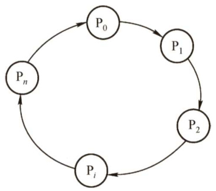
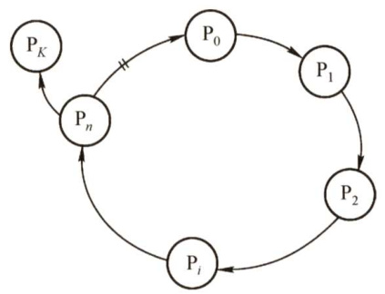
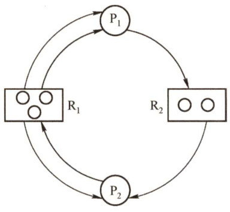
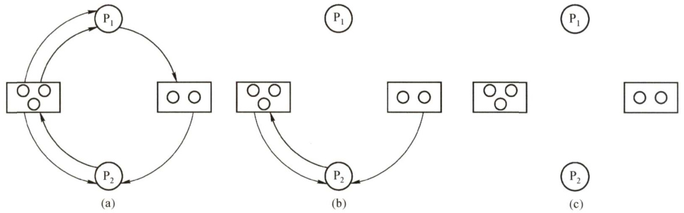
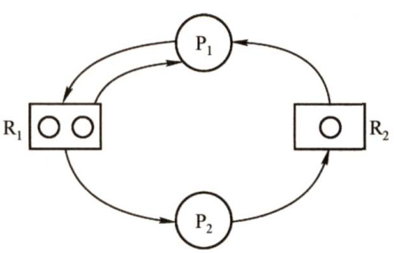

### 2.4 死锁  

在学习本节时，请读者思考以下问题：  

1）为什么会产生死锁？产生死锁有什么条件？  
2）有什么办法可以解决死锁问题？  
学完本节，读者应了解死锁的由来、产生条件及基本解决方法，区分避免死锁和预防死锁。  

#### 2.4.1 死锁的概念  

#### 1.死锁的定义  

在多道程序系统中，由于多个进程的并发执行，改善了系统资源的利用率并提高了系统的处理能力。然而，多个进程的并发执行也带来了新的问题一死锁。所谓死锁，是指多个进程因竞争资源而造成的一种僵局（互相等待)，若无外力作用，这些进程都将无法向前推进。  

下面通过一些实例来说明死锁现象。  

先看生活中的一个实例。在一条河上有一座桥，桥面很窄，只能容纳一辆汽车通行。若有两辆汽车分别从桥的左右两端驶上该桥，则会出现下述冲突情况：此时，左边的汽车占有桥面左边的一段，要想过桥还需等待右边的汽车让出桥面右边的一段；右边的汽车占有桥面右边的一段，要想过桥还需等待左边的汽车让出桥面左边的一段。此时，若左右两边的汽车都只能向前行驶，则两辆汽车都无法过桥。  

在计算机系统中也存在类似的情况。例如，某计算机系统中只有一台打印机和一台输入设备，进程 ${\bf P}_{1}$ 正占用输入设备，同时又提出使用打印机的请求，但此时打印机正被进程 $\mathbf{P}_{2}$ 所占用，而$\mathbf{P}_{2}$ 在未释放打印机之前，又提出请求使用正被 ${\bf P}_{1}$ 占用的输入设备。这样，两个进程相互无休止地等待下去，均无法继续执行，此时两个进程陷入死锁状态。  

#### 2.死锁产生的原因  

（1）系统资源的竞争  

通常系统中拥有的不可剥夺资源，其数量不足以满足多个进程运行的需要，使得进程在运行过程中，会因争夺资源而陷入僵局，如磁带机、打印机等。只有对不可剥夺资源的竞争才可能产生死锁，对可剥夺资源的竞争是不会引起死锁的。  

#### （2）进程推进顺序非法  

进程在运行过程中，请求和释放资源的顺序不当，也同样会导致死锁。例如，并发进程 $\mathbf{P}_{1},\mathbf{P}_{2}$ 分别保持了资源 ${\sf R}_{1},{\sf R}_{2}$ ，而进程 ${\bf P}_{1}$ 申请资源 ${\bf R}_{2}$ 、进程 ${\bf P}_{2}$ 申请资源 $\mathbf{R}_{1}$ 时，两者都会因为所需资源被占用而阻塞，于是导致死锁。  

信号量使用不当也会造成死锁。进程间彼此相互等待对方发来的消息，也会使得这些进程间无法继续向前推进。例如，进程A等待进程B发的消息，进程B又在等待进程A发的消息，可以看出进程A和B不是因为竞争同一资源，而是在等待对方的资源导致死锁。  

#### （3）死锁产生的必要条件  

产生死锁必须同时满足以下4个条件，只要其中任意一个条件不成立，死锁就不会发生。  

1）互斥条件：进程要求对所分配的资源（如打印机）进行排他性使用，即在一段时间内某资源仅为一个进程所占有。此时若有其他进程请求该资源，则请求进程只能等待。  

2）不剥夺条件：进程所获得的资源在未使用完之前，不能被其他进程强行夺走，即只能由获得该资源的进程自己来释放（只能是主动释放）。3）请求并保持条件：进程已经保持了至少一个资源，但又提出了新的资源请求，而该资源已被其他进程占有，此时请求进程被阻塞，但对自己已获得的资源保持不放。4）循环等待条件：存在一种进程资源的循环等待链，链中每个进程已获得的资源同时被链中下一个进程所请求。即存在一个处于等待态的进程集合 $\{\mathbf{P}_{1},\mathbf{P}_{2},\cdots,\mathbf{P}_{n}\}$ ，其中 $\mathbf{P}_{i}$ 等待的资源被 $\mathbf{P}_{i+1}$ （ $i=$ $0,1,\cdots,n-1\rangle$ ）占有， $\mathbf{P}_{n}$ 等待的资源被 ${\bf P}_{0}$ 占有，如图2.13所示。  

直观上看，循环等待条件似乎和死锁的定义一样，其实不然。按死锁定义构成等待环所要求的条件更严，它要求 $\mathrm{\bfP}_{i}$ 等待的资源必须由 $\mathbf{P}_{i+1}$ 来满足，而循环等待条件则无此限制。例如，系统中有两台输出设备， ${\bf P}_{0}$ 占有一台， $\mathbf{P}_{K}$ 占有另一台，且 $K$ 不属于集合 $\{0,1,\ \cdots,n\}$ 。 ${\bf P}_{n}$ 等待一台输出设备，它可从 ${\bf P}_{0}$ 获得，也可能从 ${\bf P}_{K}$ 获得。因此，虽然 $\mathbf{P}_{n},$ ${\bf P}_{0}$ 和其他一些进程形成了循环等待圈，但 ${\bf P}_{K}$ 不在圈内，若 ${\bf P}_{K}$ 释放了输出设备，则可打破循环等待，如图2.14所示。因此循环等待只是死锁的必要条件。  

  
图2.13 循环等待  

  
图2.14满足条件但无死锁  

资源分配图含圈而系统又不一定有死锁的原因是，同类资源数大于1。但若系统中每类资源都只有一个资源，则资源分配图含圈就变成了系统出现死锁的充分必要条件。  

要注意区分不剥夺条件与请求并保持条件。下面用一个简单的例子进行说明：若你手上拿着一个苹果（即便你不打算吃)，别人不能把你手上的苹果拿走，则这就是不剥夺条件；若你左手拿着一个苹果，允许你右手再去拿一个苹果，则这就是请求并保持条件。  

#### 3.死锁的处理策略  

为使系统不发生死锁，必须设法破坏产生死锁的4个必要条件之一，或允许死锁产生，但当死锁发生时能检测出死锁，并有能力实现恢复。  

1）死锁预防。设置某些限制条件，破坏产生死锁的4个必要条件中的一个或几个。2）避免死锁。在资源的动态分配过程中，用某种方法防止系统进入不安全状态。3）死锁的检测及解除。无须采取任何限制性措施，允许进程在运行过程中发生死锁。通过系统的检测机构及时地检测出死锁的发生，然后采取某种措施解除死锁。  

预防死锁和避免死锁都属于事先预防策略，预防死锁的限制条件比较严格，实现起来较为简单，但往往导致系统的效率低，资源利用率低；避免死锁的限制条件相对宽松，资源分配后需要通过算法来判断是否进入不安全状态，实现起来较为复杂。  

死锁的几种处理策略的比较见表2.4。  

表2.4死锁处理策略的比较  

<html><body><table><tr><td></td><td>资源分配策略</td><td>各种可能模式</td><td>主要优点</td><td>主要缺点</td></tr><tr><td>死锁 预防</td><td>保守，宁可资源闲置</td><td>一次请求所有资源，资源剥 夺，资源按序分配</td><td>适用于突发式处理的进 程，不必进行剥夺</td><td>效率低，进程初始化时 间延长；剥夺次数过多； 不便灵活申请新资源</td></tr><tr><td>死锁 避免</td><td>是“预防”和“检测”的折 中（在运行时判断是否可能 死锁）</td><td>寻找可能的安全允许顺序</td><td>不必进行剥夺</td><td>必须知道将来的资源需 求；进程不能被长时间 阻塞</td></tr><tr><td>死锁 检测</td><td>宽松，只要允许就分配资源</td><td>定期检查死锁是否已经发生</td><td>不延长进程初始化时间， 允许对死锁进行现场处理</td><td>通过剥夺解除死锁，造 成损失</td></tr></table></body></html>  

#### 2.4.2 死锁预防  

防止死锁的发生只需破坏死锁产生的4个必要条件之一即可。  

#### 1.破坏互斥条件  

若允许系统资源都能共享使用，则系统不会进入死锁状态。但有些资源根本不能同时访问，如打印机等临界资源只能互斥使用。所以，破坏互斥条件而预防死锁的方法不太可行，而且在有的场合应该保护这种互斥性。  

#### 2.破坏不剥夺条件  

当一个已保持了某些不可剥夺资源的进程请求新的资源而得不到满足时，它必须释放已经保持的所有资源，待以后需要时再重新申请。这意味着，一个进程已占有的资源会被暂时释放，或者说是被剥夺，或从而破坏了不剥夺条件。  

该策略实现起来比较复杂，释放已获得的资源可能造成前一阶段工作的失效，反复地申请和释放资源会增加系统开销，降低系统吞吐量。这种方法常用于状态易于保存和恢复的资源，如CPU的寄存器及内存资源，一般不能用于打印机之类的资源。  

#### 3.破坏请求并保持条件  

采用预先静态分配方法，即进程在运行前一次申请完它所需要的全部资源，在它的资源未满足前，不把它投入运行。一旦投入运行，这些资源就一直归它所有，不再提出其他资源请求，这样就可以保证系统不会发生死锁。  

这种方式实现简单，但缺点也显而易见，系统资源被严重浪费，其中有些资源可能仅在运行初期或运行快结束时才使用，甚至根本不使用。而且还会导致“饥饿”现象，由于个别资源长期被其他进程占用时，将致使等待该资源的进程迟迟不能开始运行。  

#### 4.破坏循环等待条件  

为了破坏循环等待条件，可采用顺序资源分配法。首先给系统中的资源编号，规定每个进程必须按编号递增的顺序请求资源，同类资源一次申请完。也就是说，只要进程提出申请分配资源$\mathbf{R}_{i}$ ，则该进程在以后的资源申请中就只能申请编号大于 $\mathbf{R}_{i}$ 的资源。  

这种方法存在的问题是，编号必须相对稳定，这就限制了新类型设备的增加；尽管在为资源编号时已考虑到大多数作业实际使用这些资源的顺序，但也经常会发生作业使用资源的顺序与系统规定顺序不同的情况，造成资源的浪费；此外，这种按规定次序申请资源的方法，也必然会给用户的编程带来麻烦。  

#### 2.4.3 死锁避免  

避免死锁同样属于事先预防策略，但并不是事先采取某种限制措施破坏死锁的必要条件，而是在资源动态分配过程中，防止系统进入不安全状态，以避免发生死锁。这种方法所施加的限制条件较弱，可以获得较好的系统性能。  

#### 1.系统安全状态  

避免死锁的方法中，允许进程动态地申请资源，但系统在进行资源分配之前，应先计算此次分配的安全性。若此次分配不会导致系统进入不安全状态，则允许分配；否则让进程等待。  

所谓安全状态，是指系统能按某种进程推进顺序 $(\mathbf{P}_{1},\mathbf{P}_{2},\cdots,\mathbf{P}_{n})$ 为每个进程 $\mathrm{\bfP}_{i}$ 分配其所需的资源，直至满足每个进程对资源的最大需求，使每个进程都可顺序完成。此时称 $\mathbf{P}_{1},$ $\mathbf{P}_{2},\cdots$ ， $\mathbf{P}_{n}$ 为安全序列。若系统无法找到一个安全序列，则称系统处于不安全状态。  

假设系统中有三个进程 ${\bf P}_{1}$ 。 ${\bf P}_{2}$ 和 ${\bf P}_{3}$ ，共有12台磁带机。进程 ${\bf P}_{1}$ 共需要10台磁带机， $\mathbf{P}_{2}$ 和${\bf P}_{3}$ 分别需要4台和9台。假设在 $T_{0}$ 时刻，进程 $\mathbf{P}_{1},$ 。 ${\bf P}_{2}$ 和${\bf P}_{3}$ 已分别获得5台、2台和2台，尚有3台未分配，见表2.5。  

在 $T_{0}$ 时刻是安全的，因为存在一个安全序列 $\mathrm{P}_{2},\mathrm{P}_{1},$ ${\bf P}_{3}$ ，只要系统按此进程序列分配资源，那么每个进程都能顺利完成。也就是说，当前可用磁带机为3台，先把  

表2.5资源分配  

<html><body><table><tr><td>进程</td><td>最大需求</td><td>已分配</td><td>可用</td></tr><tr><td>P1</td><td>10</td><td>5</td><td>3</td></tr><tr><td>P2</td><td>4</td><td>2</td><td></td></tr><tr><td>P3</td><td>9</td><td>2</td><td></td></tr></table></body></html>  

3台磁带机分配给 ${\bf P}_{2}$ 以满足其最大需求， ${\bf P}_{2}$ 结束并归还资源后，系统有5台磁带机可用；接下来给 ${\bf P}_{1}$ 分配5台磁带机以满足其最大需求， ${\bf P}_{1}$ 结束并归还资源后，剩余10台磁带机可用；最后分配7台磁带机给 ${\bf P}_{3}$ ，这样 ${\bf P}_{3}$ 也能顺利完成。  

若在 $T_{0}$ 时刻后，系统分配1台磁带机给 ${\bf P}_{3}$ ，系统剩余可用资源数为2，此时系统进入不安全状态，因为此时已无法再找到一个安全序列。当系统进入不安全状态后，便可能导致死锁。例如，把剩下的2台磁带机分配给 ${\bf P}_{2}$ ，这样， ${\bf P}_{2}$ 完成后只能释放4台磁带机，既不能满足 ${\bf P}_{1}$ 又不能满足 ${\bf P}_{3}$ ，致使它们都无法推进到完成，彼此都在等待对方释放资源，陷入僵局，即导致死锁。  

并非所有的不安全状态都是死锁状态，但当系统进入不安全状态后，便可能进入死锁状态；反之，只要系统处于安全状态，系统便可避免进入死锁状态。  

#### 2．银行家算法  

银行家算法是最著名的死锁避免算法，其思想是：把操作系统视为银行家，操作系统管理的资源相当于银行家管理的资金，进程向操作系统请求分配资源相当于用户向银行家贷款。操作系统按照银行家制定的规则为进程分配资源。进程运行之前先声明对各种资源的最大需求量，当进程在执行中继续申请资源时，先测试该进程已占用的资源数与本次申请的资源数之和是否超过该进程声明的最大需求量。若超过则拒绝分配资源，若未超过则再测试系统现存的资源能否满足该进程尚需的最大资源量，若能满足则按当前的申请量分配资源，否则也要推迟分配。  

#### （1）数据结构描述  

可利用资源向量Available：含有 $m$ 个元素的数组，其中每个元素代表一类可用的资源数目。Available[] $={K}$ 表示系统中现有 ${\bf R}_{j}$ 类资源 $K$ 个。  

最大需求矩阵Max： $\boldsymbol{n}\times\boldsymbol{m}$ 矩阵，定义系统中 $n$ 个进程中的每个进程对 $m$ 类资源的最大需求。  

简单来说，一行代表一个进程，一列代表一类资源。 $\mathbf{Max}[i,j]=K$ 表示进程 $i$ 需要 ${\bf R}_{j}$ 类资源的最大数目为 $K$ 。  

分配矩阵Allocation： $\boldsymbol{n}\times\boldsymbol{m}$ 矩阵，定义系统中每类资源当前已分配给每个进程的资源数。Allocation $[i,j]=K$ 表示进程 $i$ 当前已分得 ${\bf R}_{j}$ 类资源的数目为 $K$ 。初学者容易混淆Available向量和Allocation矩阵，在此特别提醒。  

需求矩阵Need: $\boldsymbol{n}\times\boldsymbol{m}$ 矩阵，表示每个进程接下来最多还需要多少资源。1 $\operatorname{veed}[i,j]=K$ 表示进程 $i$ 还需要 ${\bf R}_{j}$ 类资源的数目为 $K$ 。  

上述三个矩阵间存在下述关系：  

$$
\mathrm{Need}=\mathrm{Max}-\mathrm{Allocation}
$$  

一般情况下，在银行家算法的题目中，Max矩阵和Allocation 矩阵是已知条件，而求出 Need矩阵是解题的第一步。  

（2）银行家算法描述  

设Request;是进程 $\mathbf{P}_{i}$ 的请求向量，Request;[] $=K$ 表示进程 $P_{i}$ 需要 $j$ 类资源 $K$ 个。当 ${\bf P}_{i}$ 发出资源请求后，系统按下述步骤进行检查：  

$\textcircled{1}$ 若Request;[] $\leq\mathrm{Need}[i,j]$ ，则转向步骤 $\textcircled{2}$ ；否则认为出错，因为它所需要的资源数已超过它所宣布的最大值。  

$\textcircled{2}$ 若Request;[] $\leq$ Available[]，则转向步骤 $\textcircled{3}$ ；否则，表示尚无足够资源， $\mathbf{P}_{i}$ 须等待。  

$\textcircled{3}$ 系统试探着把资源分配给进程 $\mathbf{P}_{i}$ ，并修改下面数据结构中的数值：  

Available $\l=$ Available-Request;; $\mathrm{Allocation}[i,j]=\mathrm{Allocation}[i,j]+\mathrm{Request}_{i}[j];$ $\mathrm{Need}[i,j]=\mathrm{Need}[i,j]-\mathrm{Request}_{i}[j];$  

$\textcircled{4}$ 系统执行安全性算法，检查此次资源分配后，系统是否处于安全状态。若安全，才正式将资源分配给进程 $\mathbf{P}_{i}$ ，以完成本次分配；否则，将本次的试探分配作废，恢复原来的资源分配状态，让进程 $\mathbf{P}_{i}$ 等待。  

（3）安全性算法  

设置工作向量Work，有 $m$ 个元素，表示系统中的剩余可用资源数目。在执行安全性算法开始时，Work $\c=$ Available。  

$\textcircled{1}$ 初始时安全序列为空。  

$\textcircled{2}$ 从Need矩阵中找出符合下面条件的行：该行对应的进程不在安全序列中，而且该行小于等于Work向量，找到后，把对应的进程加入安全序列；若找不到，则执行步骤 $\textcircled{4}$ o  

$\textcircled{3}$ 进程 $\mathbf{P}_{i}$ 进入安全序列后，可顺利执行，直至完成，并释放分配给它的资源，因此应执行Work $\mathbf{\Sigma}=\mathbf{\Sigma}$ Work $^+$ Allocation[i]，其中Allocation[i]表示进程 $\mathbf{P}_{i}$ 代表的在Allocation矩阵中对应的行，返回步骤 $\textcircled{2}$ 。  

$\textcircled{4}$ 若此时安全序列中已有所有进程，则系统处于安全状态，否则系统处于不安全状态。  
看完上面对银行家算法的过程描述后，可能会有眼花缭乱的感觉，现在通过举例来加深理解。  

#### 3．安全性算法举例  

假定系统中有5个进程 $\{\mathbf{P}_{0},\mathbf{P}_{1},\mathbf{P}_{2},\mathbf{P}_{3},\mathbf{P}_{4}\}$ 和三类资源{A,B,C}，各种资源的数量分别为10,5,7，在 $T_{0}$ 时刻的资源分配情况见表2.6。  

$T_{0}$ 时刻的安全性。利用安全性算法对 $T_{0}$ 时刻的资源分配进行分析。  

表2.6 $T_{0}$ 时刻的资源分配表  

<html><body><table><tr><td>资源情况</td><td>Max</td><td>Allocation</td><td>Available A B C</td></tr><tr><td>进程 Po</td><td>AB C 7 5 3</td><td>A B C 0 1 0</td><td rowspan="2"></td></tr><tr><td>P1</td><td>3 2 2</td><td>0 0</td></tr><tr><td></td><td></td><td>2 (3 0 2)</td><td>3 3 2 (2 3 0)</td></tr><tr><td>P2</td><td>9 0 2</td><td>3 0 2</td><td></td></tr><tr><td>P3</td><td>2 22</td><td>2 一 1</td><td></td></tr><tr><td>P4</td><td>4 33</td><td>0 0 2</td><td></td></tr></table></body></html>  

$\textcircled{1}$ 从题目中我们可以提取Max矩阵和Allocation矩阵，这两个矩阵相减可得到Need矩阵：  

$\textcircled{2}$ 然后，将Work向量与Need矩阵的各行进行比较，找出比Work矩阵小的行。例如，在初始时，  

$$
\begin{array}{c}{{(3,3,2)>(1,2,2)}}\\ {{(3,3,2)>(0,1,1)}}\end{array}
$$  

对应的两个进程分别为 ${\bf P}_{1}$ 和 ${\bf P}_{3}$ ，这里我们选择 ${\bf P}_{1}$ （也可以选择 ${\bf P}_{3}$ ）暂时加入安全序列。$\textcircled{3}$ 释放 $\mathbf{P}_{1}$ 所占的资源，即把 ${\bf P}_{1}$ 进程对应的Allocation矩阵中的一行与Work向量相加：  

$$
{\left({3\mathrm{~\3~}2}\right)}+{\left({2\mathrm{~\0~}0}\right)}={\left({5\mathrm{~\3~}2}\right)}=\mathrm{Work}
$$  

此时需求矩阵更新为（去掉了 ${\bf P}_{1}$ 对应的一行)：  

$$
\begin{array}{r}{\begin{array}{r}{\mathrm{P}_{0}\left[7\quad4\quad3\right]}\\ {\mathrm{P}_{2}\left[6\quad0\quad0\right]}\\ {\mathrm{P}_{3}\left[0\quad1\quad1\right]}\\ {\mathrm{P}_{4}\left[4\quad3\quad1\right]}\end{array}}\end{array}
$$  

再用更新的Work向量和Need矩阵重复步骤 $\textcircled{2}$ 。利用安全性算法分析 $T_{0}$ 时刻的资源分配情况如表2.7所示，最后得到一个安全序列 $\{\mathrm{P}_{1},\mathrm{P}_{3},\mathrm{P}_{4},\mathrm{P}_{2},\mathrm{P}_{0}\}$ 。  

表2.7 $T_{0}$ 时刻的安全序列的分析  

<html><body><table><tr><td rowspan="2">资源情况 进程</td><td colspan="3">Work</td><td colspan="3">Need</td><td colspan="3">Allocation</td><td colspan="3">Work+Allocation</td></tr><tr><td>A</td><td>B</td><td>C</td><td>A</td><td>B</td><td>C</td><td>A</td><td>B</td><td>C</td><td>A</td><td>B</td><td>C</td></tr><tr><td>P1</td><td>3</td><td>3</td><td>2</td><td>1</td><td>2</td><td>2</td><td>2</td><td>0</td><td>0</td><td>5</td><td>3</td><td>2</td></tr><tr><td>P3</td><td>5</td><td>3</td><td>2</td><td>0</td><td>1</td><td></td><td>2</td><td>1</td><td>1</td><td>7</td><td>4</td><td>3</td></tr><tr><td>P4</td><td>7</td><td>4</td><td>3</td><td>4</td><td>3</td><td>1</td><td>0</td><td>0</td><td>2</td><td>7</td><td>4</td><td>5</td></tr><tr><td>P2</td><td>7</td><td>4</td><td>5</td><td>6</td><td>0</td><td>0</td><td>3</td><td>0</td><td>2</td><td>10</td><td>4</td><td>7</td></tr><tr><td>Po</td><td>10</td><td>4</td><td>7</td><td>7</td><td>4</td><td>3</td><td>0</td><td>1</td><td>0</td><td>10</td><td>5</td><td>7</td></tr></table></body></html>  

#### 4.银行家算法举例  

安全性算法是银行家算法的核心，在银行家算法的题目中，一般会有某个进程的一个资源请求向量，读者只要执行上面所介绍的银行家算法的前三步，马上就会得到更新的Alocation 矩阵和Need矩阵，再按照上例的安全性算法判断，就能知道系统能否满足进程提出的资源请求。  

假设当前系统中资源的分配和剩余情况如表2.6所示。  

(1) $\mathbf{P}_{1}$ 请求资源： ${\bf P}_{1}$ 发出请求向量Request $\phantom{}_{1}(1,0,2)$ ，系统按银行家算法进行检查：Request $(1,0,2)\le\mathrm{Need}_{1}(1,2,2)$   
Request $_{1}(1,0,2)\leq\mathrm{Available}_{1}(3,3,2)$   
系统先假定可为 ${\bf P}_{1}$ 分配资源，并修改  
Available $\mathbf{\beta}=\mathrm{Available}-\mathrm{Request_{1}}=(2,3,0)$   
Alloc $\mathrm{\ation_{1}=A l l o c a t i o n_{1}+R e q u e s t_{1}=(3,0,2)}$   
$\mathrm{Need_{1}}=\mathrm{Need_{1}}-\mathrm{Request_{1}}=(0,2,0)$   
由此形成的资源变化情况如表2.6中的圆括号所示。  

令Work $\O=$ Available $\mathbf{\lambda}=(2,3,0)$ ，再利用安全性算法检查此时系统是否安全，如表2.8所示。  

 表2.8 $\mathbf{P_{1}}$ 申请资源时的安全性检查  

<html><body><table><tr><td rowspan="2">资源情况 进程</td><td colspan="3">Work</td><td colspan="3">Need</td><td colspan="3">Allocation</td><td colspan="3">Work+Allocation</td></tr><tr><td>A</td><td>B</td><td>C</td><td>A</td><td>B</td><td>C</td><td>A</td><td>B</td><td>C</td><td>A</td><td>B</td><td>C</td></tr><tr><td>P1</td><td>2</td><td>3</td><td>0</td><td>0</td><td>2</td><td>0</td><td>3</td><td>0</td><td>2</td><td>5</td><td>3</td><td>2</td></tr><tr><td>P3</td><td>5</td><td>3</td><td>2</td><td>0</td><td>1</td><td></td><td>2</td><td>1</td><td>1</td><td>7</td><td>4</td><td>3</td></tr><tr><td>P4</td><td>7</td><td>4</td><td>3</td><td>4</td><td>3</td><td>1</td><td>0</td><td>0</td><td>２</td><td>7</td><td>4</td><td>5</td></tr><tr><td>Po</td><td>7</td><td>4</td><td>5</td><td>7</td><td>4</td><td>3</td><td>0</td><td>1</td><td>0</td><td>7</td><td>5</td><td>5</td></tr><tr><td>P</td><td>7</td><td>5</td><td>5</td><td>６</td><td>0</td><td>0</td><td>3</td><td>0</td><td>2</td><td>10</td><td>5</td><td>7</td></tr></table></body></html>  

由所进行的安全性检查得知，可找到一个安全序列 $\{\mathrm{P}_{1},\mathrm{P}_{3},\mathrm{P}_{4},\mathrm{P}_{2},\mathrm{P}_{0}\}$ 。因此，系统是安全的，可以立即将 ${\bf P}_{1}$ 所申请的资源分配给它。分配后系统中的资源情况如表2.9所示。  

表2.9为 $\mathbf{P}_{1}$ 分配资源后的有关资源数据  

<html><body><table><tr><td rowspan="2">进程</td><td colspan="3">资源情况 Allocation</td><td colspan="3">Need</td><td colspan="3">Available</td></tr><tr><td></td><td>A</td><td>B</td><td>C</td><td>A</td><td>B</td><td>C A</td><td>B</td><td>C</td></tr><tr><td colspan="2">Po</td><td>0</td><td>1</td><td>0</td><td>7</td><td>4</td><td>3</td><td>2 3</td><td>0</td></tr><tr><td colspan="2">P1</td><td>3</td><td>0</td><td>2</td><td>0</td><td>2</td><td>0</td><td></td><td></td></tr><tr><td colspan="2">P</td><td>3</td><td>0</td><td>2</td><td>6</td><td>0</td><td>0</td><td></td><td></td></tr><tr><td colspan="2">P3</td><td>2</td><td>1</td><td>1</td><td>0</td><td>1</td><td>1</td><td></td><td></td></tr><tr><td colspan="2">P4</td><td>0</td><td>0</td><td>2</td><td>4</td><td>3</td><td>1</td><td></td><td></td></tr></table></body></html>  

(2) ${\mathrm{P}}_{4}$ 请求资源： ${\bf P}_{4}$ 发出请求向量Request4(3,3,0)，系统按银行家算法进行检查：Request ${\mathfrak{q}}(3,3,0)\leq\mathrm{Need}_{4}(4,3,1)$   
Request4 $(3,3,0)\$ Available(2,3,0)，让 ${\bf P}_{4}$ 等待。  
(3) ${\bf P}_{0}$ 请求资源： ${\bf P}_{0}$ 发出请求向量 $\mathtt{R e q u s t}_{0}(0,2,0)$ ，系统按银行家算法进行检查：Request $_{0}(0,2,0)\leq\mathrm{Need}_{0}(7,4,3);$   
Request $_0(0,2,0)\leq$ Available(2, 3, 0)  

系统暂时先假定可为 ${\bf P}_{0}$ 分配资源，并修改有关数据：Availab $\mathrm{\Delta\ye=Available-Request_{0}=(2,1,0)}$ All $\mathrm{\ocation_{0}=A l l o c a t i o n_{0}+R e q u e s t_{0}=(0,3,0)}$ $\mathrm{Need_{0}}=\mathrm{\Need_{0}}-\mathrm{Request{_{0}}}=(7,2,3)$ ，结果如表2.10所示。  

表2.10为 $\mathbf{P_{0}}$ 分配资源后的有关资源数据  

<html><body><table><tr><td rowspan="2">资源情况 进程</td><td colspan="3">Allocation</td><td colspan="3">Need</td><td colspan="3">Available</td></tr><tr><td></td><td>A</td><td>B</td><td>C</td><td>A</td><td>B</td><td>C A</td><td>B</td><td>C</td></tr><tr><td></td><td>Po</td><td>0</td><td>3</td><td>0</td><td>7</td><td>2</td><td>3 2</td><td>1</td><td>0</td></tr><tr><td></td><td>P</td><td>3</td><td>0</td><td>2</td><td>0</td><td>2</td><td>0</td><td></td><td></td></tr><tr><td></td><td>P2</td><td>3</td><td>0</td><td>2</td><td>6</td><td>0</td><td>0</td><td></td><td></td></tr><tr><td></td><td>P3</td><td>2</td><td>1</td><td></td><td>0</td><td>1</td><td></td><td></td><td></td></tr><tr><td></td><td>P4</td><td>0</td><td>0</td><td>2</td><td>4</td><td>3</td><td></td><td></td><td></td></tr></table></body></html>  

进行安全性检查：可用资源Available $(2,1,0)$ 已不能满足任何进程的需要，因此系统进入不安全状态，因此拒绝 ${\bf P}_{0}$ 的请求，让 ${\bf P}_{0}$ 等待，并将Available,Allocationo,Needo恢复为之前的值。  

#### 2.4.4 死锁检测和解除  

前面介绍的死锁预防和避免算法，都是在为进程分配资源时施加限制条件或进行检测，若系统为进程分配资源时不采取任何措施，则应该提供死锁检测和解除的手段。  

#### 1.资源分配图  

系统死锁可利用资源分配图来描述。如图2.15所示，用圆圈代表一个进程，用框代表一类资源。由于一种类型的资源可能有多个，因此用框中的一个圆代表一类资源中的一个资源。从进程到资源的有向边称为请求边，表示该进程申请一个单位的该类资源；从资源到进程的边称为分配边，表示该类资源已有一个资源分配给了该进程。  

在图2.15所示的资源分配图中，进程 ${\bf P}_{1}$ 已经分得了两个 $\mathbf{R}_{1}$ 资源，并又请求一个 $\mathbf{R}_{2}$ 资源；进程 ${\bf P}_{2}$ 分得了一个 $\mathbf{R}_{1}$ 资源和一个${\bf R}_{2}$ 资源，并又请求一个 $\mathbb{R}_{1}$ 资源。  

  
图2.15资源分配示例  

#### 2.死锁定理  

简化资源分配图可检测系统状态S是否为死锁状态。简化方法如下：  

1）在资源分配图中，找出既不阻塞又不孤点的进程 $\mathbf{P}_{i}$ （即找出一条有向边与它相连，且该有向边对应资源的申请数量小于等于系统中已有的空闲资源数量，如在图2.15中， $\mathbf{R}_{1}$ 没有空闲资源， ${\bf R}_{2}$ 有一个空闲资源。若所有连接该进程的边均满足上述条件，则这个进程能继续运行直至完成，然后释放它所占有的所有资源)。消去它所有的请求边和分配边，使之成为孤立的结点。在图2.16(a)中， ${\bf P}_{1}$ 是满足这一条件的进程结点，将 ${\bf P}_{1}$ 的所有边消去，便得到图2.16(b)所示的情况。  

这里要注意一个问题，判断某种资源是否有空闲，应该用它的资源数量减去它在资源分配图中的出度，例如在图2.15中， $\mathbf{R}_{1}$ 的资源数为3，而出度也为3，所以 $\mathbb{R}_{1}$ 没有空闲资源， ${\bf R}_{2}$ 的资源数为2，出度为1，所以 ${\bf R}_{2}$ 有一个空闲资源。  

2）进程 $\mathbf{P}_{i}$ 所释放的资源，可以唤醒某些因等待这些资源而阻塞的进程，原来的阻塞进程可能变为非阻塞进程。在图2.15中，进程 $\mathbf{P}_{2}$ 就满足这样的条件。根据1）中的方法进行一系列简化后，若能消去图中所有的边，则称该图是可完全简化的，如图2.16(c)所示。  

  
图2.16资源分配图的化简  

S 为死锁的条件是当且仅当S状态的资源分配图是不可完全简化的，该条件为死锁定理。  

#### 3.死锁解除  

一旦检测出死锁，就应立即采取相应的措施来解除死锁。死锁解除的主要方法有：  

1）资源剥夺法。挂起某些死锁进程，并抢占它的资源，将这些资源分配给其他的死锁进程。但应防止被挂起的进程长时间得不到资源而处于资源乏的状态。  
2）撤销进程法。强制撤销部分甚至全部死锁进程并剥夺这些进程的资源。撤销的原则可以按进程优先级和撤销进程代价的高低进行。  
3）进程回退法。让一（或多）个进程回退到足以回避死锁的地步，进程回退时自愿释放资源而非被剥夺。要求系统保持进程的历史信息，设置还原点。  

#### 2.4.5 本节小结  

本节开头提出的问题的参考答案如下。  

1）为什么会产生死锁？产生死锁有什么条件？  

由于系统中存在一些不可剥夺资源，当两个或两个以上的进程占有自身的资源并请求对方的资源时，会导致每个进程都无法向前推进，这就是死锁。死锁产生的必要条件有4个，分别是互斥条件、不剥夺条件、请求并保持条件和循环等待条件。  

互斥条件是指进程要求分配的资源是排他性的，即最多只能同时供一个进程使用。  

不剥夺条件是指进程在使用完资源之前，资源不能被强制夺走。  

请求并保持条件是指进程占有自身本来拥有的资源并要求其他资源。  

循环等待条件是指存在一种进程资源的循环等待链。  

2）有什么办法可以解决死锁问题？  

死锁的处理策略可以分为预防死锁、避免死锁及死锁的检测与解除。  

死锁预防是指通过设立一些限制条件，破坏死锁的一些必要条件，让死锁无法发生。  

死锁避免指在动态分配资源的过程中，用一些算法防止系统进入不安全状态，从而避免死锁。死锁的检测和解除是指在死锁产生前不采取任何措施，只检测当前系统有没有发生死锁，若有，则采取一些措施解除死锁。  

#### 2.4.6 本节习题精选  

#### 一、单项选择题  

01．下列情况中，可能导致死锁的是（）。  

A．进程释放资源 B.一个进程进入死循环C.多个进程竞争资源出现了循环等待 D．多个进程竞争使用共享型的设备  

02．在操作系统中，死锁出现是指（）。  

A.计算机系统发生重大故障  
B.资源个数远远小于进程数  
C.若干进程因竞争资源而无限等待其他进程释放已占有的资源  
D.进程同时申请的资源数超过资源总数  

03．一次分配所有资源的方法可以预防死锁的发生，它破坏死锁4个必要条件中的（）。  

A.互斥 B．占有并请求 C．非剥夺 D．循环等待  

04.系统产生死锁的可能原因是（）。  

A.独占资源分配不当 B.系统资源不足C.进程运行太快 D.CPU内核太多  

05.死锁的避免是根据（）采取措施实现的。  

A.配置足够的系统资源 B.使进程的推进顺序合理C．破坏死锁的四个必要条件之一 D.防止系统进入不安全状态  

06．死锁预防是保证系统不进入死锁状态的静态策略，其解决办法是破坏产生死锁的四个必要条件之一。下列方法中破坏了“循环等待”条件的是（）。  

A．银行家算法 B.一次性分配策略C．剥夺资源法 D.资源有序分配策略  

07.某系统中有三个并发进程都需要四个同类资源，则该系统必然不会发生死锁的最少资源是（）。  

A.9 B.10 C.11 D.12  

08．某系统中共有11台磁带机， $X$ 个进程共享此磁带机设备，每个进程最多请求使用3台，则系统必然不会死锁的最大 $X$ 值是（）。  

A.4 B.5 C.6 D.7  

09.解除死锁通常不采用的方法是（）。  

A.终止一个死锁进程 B.终止所有死锁进程C．从死锁进程处抢夺资源 D.从非死锁进程处抢夺资源  

10.采用资源剥夺法可以解除死锁，还可以采用（）方法解除死锁。  

A.执行并行操作 B．撤销进程C.拒绝分配新资源 D.修改信号量  

11．在下列死锁的解决方法中，属于死锁预防策略的是（）。  

A．银行家算法 B．资源有序分配算法C.死锁检测算法 D.资源分配图化简法  

12．引入多道程序技术的前提条件之一是系统具有（）。  

A．多个CPU B．多个终端 C．中断功能 D．分时功能  

13.三个进程共享四个同类资源，这些资源的分配与释放只能一次一个。已知每个进程最多需要两个该类资源，则该系统（）。  

A.有些进程可能永远得不到该类资源 B．必然有死锁C.进程请求该类资源必然能得到 D.必然是死锁  

14.以下有关资源分配图的描述中，正确的是（）。  

A.有向边包括进程指向资源类的分配边和资源类指向进程申请边两类B．矩形框表示进程，其中圆点表示申请同一类资源的各个进程C.圆圈结点表示资源类D．资源分配图是一个有向图，用于表示某时刻系统资源与进程之间的状态  

15．死锁的四个必要条件中，无法破坏的是（）。  

A．环路等待资源 B.互斥使用资源C.占有且等待资源 D．非抢夺式分配  

16．死锁与安全状态的关系是（）。  

A．死锁状态有可能是安全状态 B．安全状态有可能成为死锁状态C.不安全状态就是死锁状态 D.死锁状态一定是不安全状态  

17．死锁检测时检查的是（）。  

A.资源有向图 B．前驱图 C.搜索树 D．安全图  

18.某个系统采用下列资源分配策略。若一个进程提出资源请求得不到满足，而此时没有由于等待资源而被阻塞的进程，则自己就被阻塞。而当此时已有等待资源而被阻塞的进程，则检查所有由于等待资源而被阻塞的进程。若它们有申请进程所需要的资源，则将这些资源取出并分配给申请进程。这种分配策略会导致（）。  

A．死锁 B.颠簸 C.回退 D．饥饿  

19．系统的资源分配图在下列情况下，无法判断是否处于死锁状态的有（）。  

I．出现了环路 II．没有环路  
III．每种资源只有一个，并出现环路 IV．每个进程结点至少有一条请求边  
A.I、、ⅢII、IV B.I、III、IV  
C.I、IV D.以上答案都不正确  

20．下列关于死锁的说法中，正确的有（）。  

I．死锁状态一定是不安全状态II.产生死锁的根本原因是系统资源分配不足和进程推进顺序非法III．资源的有序分配策略可以破坏死锁的循环等待条件IV．采用资源剥夺法可以解除死锁，还可以采用撤销进程方法解除死锁  

A.I、IⅢI B.II C.IV D．四个说法都对  

21．下面是一个并发进程的程序代码，正确的是（）。  

Semaphore $\scriptstyle\mathbf{x}1=\mathbf{x}2=\mathbf{y}=1$ .   
int $\mathtt{c l}=\mathtt{c}2=0$ .   
P1() P2()   
{ { while(1){ while(1){ P(x1); P(x2); if( $++\mathbf{c}1{=}{=}1$ )P(y); if( $++{\bf c}{\boldsymbol2}==1$ )P(y); V(x1); V(x2);  

computer(A); computer(B); P(x1); P(x2); if( $--c1==0$ )V(y); if( $\scriptstyle--\subset{2}==0$ )V(y); V(x1); V(x2); j } } }  

A．进程不会死锁，也不会“饥饿” B.进程不会死锁，但是会“饥饿”C．进程会死锁，但是不会“饥饿” D.进程会死锁，也会“饥饿”  

22.有两个并发进程，对于如下这段程序的运行，正确的说法是（）。  

int $\mathbf{x},\mathbf{y},\mathbf{z},{\mathrm{t}},\mathbf{u}$ ：   
P1() P2()   
{ { while(1){ while(l){ $\scriptstyle\mathbf{x}=1$ . $\scriptstyle\mathbf{x}=0$ . $\scriptstyle{\mathtt{Y}}=0$ · $\scriptstyle{\mathrm{t}}=0$ if $\mathbf{x}{>}{=}1$ then $scriptstyle{\underline{{Y}}}=_{\underline{{Y}}+1}$ · if $\mathbf{x}<=1$ then $t=t+2$ . $z{=}Y$ . $\mathtt{u}=\mathtt{t}$ . } }   
} }  

A.程序能正确运行，结果唯一 B．程序不能正确运行，可能有两种结果C.程序不能正确运行，结果不确定 D．程序不能正确运行，可能会死锁  

23.一个进程在获得资源后，只能在使用完资源后由自己释放，这属于死锁必要条件的（）。  

A．互斥条件 B.请求和释放条件C．不剥夺条件 D.防止系统进入不安全状态  

24.死锁定理是用于处理死锁的（）方法。  

A．预防死锁 B．避免死锁 C.检测死锁 D．解除死锁  

25．假设具有5个进程的进程集合 $\mathbf{P}=\{\mathrm{P}_{0},\mathrm{P}_{1},\mathrm{P}_{2},\mathrm{P}_{3},\mathrm{P}_{4}\}$ ，系统中有三类资源A,B,C，假设在某时刻有如下状态，见下表。  

<html><body><table><tr><td rowspan="2"></td><td>Allocation</td><td>Max</td><td>Available</td></tr><tr><td>A B C</td><td>A B C</td><td></td></tr><tr><td>Po</td><td>0 0 3</td><td>0 0 4</td><td></td></tr><tr><td>P1</td><td>1 0 0</td><td>1 7 5</td><td>A B C</td></tr><tr><td>P2</td><td>1 3 5</td><td>2 3 5</td><td>X y Z</td></tr><tr><td>P3</td><td>0 0 2</td><td>0 6 4</td><td></td></tr><tr><td>P4</td><td>0 0 1</td><td>0 6 5</td><td></td></tr></table></body></html>  

请问当x,y,z取下列哪些值时，系统是处于安全状态的？  

I. 1,4,0 II. 0,6,2 III.1,1,1 IV. 0,4,7A.、III B.I、Ⅱ C.仅I D.I、IⅢI  

26.【2009统考真题】某计算机系统中有8台打印机，由 $K$ 个进程竞争使用，每个进程最多需要3台打印机。该系统可能会发生死锁的 $K$ 的最小值是（）。  

A.2 B.3 C.4 D.5  

27.【2011统考真题】某时刻进程的资源使用情况见下表，此时的安全序列是（）。  

A. $\mathbf{P}_{1},\mathbf{P}_{2},\mathbf{P}_{3},\mathbf{P}_{4}$ B. $\mathbf{P}_{1},\mathbf{P}_{3},\mathbf{P}_{2},\mathbf{P}_{4}$  

C. P, P4,P3,P2 D.不存在  

<html><body><table><tr><td rowspan="2">进程</td><td colspan="3">已分配资源</td><td colspan="3">尚需分配</td><td colspan="3">可用资源</td></tr><tr><td>R</td><td>R</td><td>R3</td><td>R</td><td>R</td><td>R</td><td>R</td><td>R</td><td>R3</td></tr><tr><td>P1</td><td>2</td><td>0</td><td>0</td><td>0</td><td>0</td><td>1</td><td rowspan="4">0</td><td rowspan="4">2</td><td rowspan="4"></td><td rowspan="4">1</td></tr><tr><td>P2</td><td>1</td><td>2</td><td>0</td><td>1</td><td>3</td><td>2</td></tr><tr><td>P3</td><td>0</td><td>1</td><td>1</td><td>1</td><td>3</td><td>1</td></tr><tr><td>P4</td><td>0</td><td>0</td><td>1</td><td>2</td><td>0</td><td>0</td></tr></table></body></html>  

28.【2012统考真题】假设5个进程 ${\bf P}_{0}$ ${\bf P}_{1}$ D ${\bf P}_{2}$ 。 ${\bf P}_{3}$ 。 ${\bf P}_{4}$ 共享三类资源 $\mathbf{R}_{1},\mathbf{R}_{2},\mathbf{R}_{3}$ ，这些资源总数分别为18,6,22。 $T_{0}$ 时刻的资源分配情况如下表所示，此时存在的一个安全序列是()。  

<html><body><table><tr><td rowspan="2">进程</td><td colspan="3">已分配资源</td><td colspan="3">资源最大需求</td></tr><tr><td>R</td><td>R</td><td>R3</td><td>R</td><td>R</td><td>R3</td></tr><tr><td>Po</td><td>3</td><td>2</td><td>3</td><td>5</td><td>5</td><td>10</td></tr><tr><td>P1</td><td>4</td><td>0</td><td>3</td><td>5</td><td>3</td><td>6</td></tr><tr><td>P2</td><td>4</td><td>0</td><td>5</td><td>4</td><td>0</td><td>11</td></tr><tr><td>P3</td><td>2</td><td>0</td><td>4</td><td>4</td><td>2</td><td>5</td></tr><tr><td>P4</td><td>3</td><td>一</td><td>4</td><td>4</td><td>2</td><td>4</td></tr></table></body></html>  

A. $\mathrm{P}_{0},\mathrm{P}_{2},\mathrm{P}_{4},\mathrm{P}_{1},\mathrm{P}_{3}$ B. $\mathbf{P}_{1},\mathbf{P}_{0},\mathbf{P}_{3},\mathbf{P}_{4},\mathbf{P}_{2}$ C. P2,P, Po, P3, ${\bf P}_{4}$ D. P3, P4,P2,P, Po  

9.【2013统考真题】下列关于银行家算法的叙述中，正确的是（）。  

A．银行家算法可以预防死锁B．当系统处于安全状态时，系统中一定无死锁进程C．当系统处于不安全状态时，系统中一定会出现死锁进程D．银行家算法破坏了死锁必要条件中的“请求和保持”条件  

30.【2014统考真题】某系统有 $n$ 台互斥使用的同类设备，三个并发进程分别需要3,4,5台设备，可确保系统不发生死锁的设备数 $n$ 最小为（）。  

A.9 B.10 C.11 D.12  

31.【2015统考真题】若系统 $\mathbf{S}_{1}$ 采用死锁避免方法， $\mathbf{S}_{2}$ 采用死锁检测方法。下列叙述中，正确的是（）。  

I. $\mathbf{S}_{1}$ 会限制用户申请资源的顺序，而 $\mathbf{S}_{2}$ 不会II. $\mathbf{S}_{1}$ 需要进程运行所需的资源总量信息，而 $\mathbf{S}_{2}$ 不需要III. $\mathbf{S}_{1}$ 不会给可能导致死锁的进程分配资源，而 $\mathbf{S}_{2}$ 会  

A.仅I、Ⅱ B.仅、IⅢI C.仅I、III D.I、Ⅱ、IⅢI  

32.【2016统考真题】系统中有3个不同的临界资源 $\mathbf{R}_{1}$ ， ${\bf R}_{2}$ 和 ${\bf R}_{3}$ ，被4个进程 ${\bf P}_{1}$ ${\bf P}_{2}$ ${\bf P}_{3}$ ， ${\bf P}_{4}$ 共享。各进程对资源的需求为： $\mathbf{P}_{1}$ 申请 $\mathbf{R}_{1}$ 和 ${\bf R}_{2}$ ， ${\bf P}_{2}$ 申请 ${\bf R}_{2}$ 和 ${\bf R}_{3}$ ， ${\bf P}_{3}$ 申请 $\mathbf{R}_{1}$ 和 ${\bf R}_{3}$ ， ${\bf P}_{4}$ 申请 ${\bf R}_{2}$ 。若系统出现死锁，则处于死锁状态的进程数至少是（）。  

A.1 B.2 C.3 D.4  

33.【2018统考真题】假设系统中有4个同类资源，进程 $\mathbf{P}_{1}$ 。 ${\bf P}_{2}$ 和 ${\bf P}_{3}$ 需要的资源数分别为4,3和1， $\mathbf{P}_{1},\mathbf{P}_{2}$ 和 ${\bf P}_{3}$ 已申请到的资源数分别为2,1和 $\mathbf{\boldsymbol{0}}$ ，则执行安全性检测算法的结果是（）。  

A.不存在安全序列，系统处于不安全状态  

B.存在多个安全序列，系统处于安全状态C.存在唯一安全序列 $\mathbf{P}_{3},\mathbf{P}_{1},\mathbf{P}_{2}$ ，系统处于安全状态D.存在唯一安全序列 $\mathbf{P}_{3},\mathbf{P}_{2},\mathbf{P}_{1}$ ，系统处于安全状态  

34.【2019统考真题】下列关于死锁的叙述中，正确的是（）。  

I．可以通过剥夺进程资源解除死锁  
ⅡI．死锁的预防方法能确保系统不发生死锁  
IⅢI．银行家算法可以判断系统是否处于死锁状态  
IV．当系统出现死锁时，必然有两个或两个以上的进程处于阻塞态  

A.仅、ⅢI B.仅I、Ⅱ、IV C.仅I、I、ⅢI D.仅、III、IV  

35.【2020统考真题】某系统中有A、B两类资源各6个， $t$ 时刻的资源分配及需求情况如下 表所示。  

<html><body><table><tr><td>进程</td><td>A已分配数量</td><td>B已分配数量</td><td>A需求总量</td><td>B需求总量</td></tr><tr><td>P</td><td>2</td><td>3</td><td>4</td><td>4</td></tr><tr><td>P2</td><td>2</td><td>1</td><td>3</td><td>1</td></tr><tr><td>P3</td><td>1</td><td>2</td><td>3</td><td>4</td></tr></table></body></html>  

$t$ 时刻安全性检测结果是（）。  

A．存在安全序列 ${\bf P}_{1}$ ， ${\bf P}_{2}$ ， ${\bf P}_{3}$ B．存在安全序列 ${\bf P}_{2}$ ${\bf P}_{1}$ ， ${\bf P}_{3}$ C．存在安全序列 ${\bf P}_{2}$ ， ${\bf P}_{3}$ ， ${\bf P}_{1}$ D．不存在安全序列  

36.【2021统考真题】若系统中有 $n$ （ $n\geq2$ ）个进程，每个进程均需要使用某类临界资源2个，则系统不会发生死锁所需的该类资源总数至少是（）。  

A.2 B.n C. $n+1$ D.2n  

#### 二、综合应用题  

01.设系统中有下述解决死锁的方法：  

1）银行家算法。  
2）检测死锁，终止处于死锁状态的进程，释放该进程占有的资源。  
3）资源预分配。  
简述哪种办法允许最大的并发性，即哪种办法允许更多的进程无等待地向前推进。请按“并发性”从大到小对上述三种办法排序。  

02.某银行计算机系统要实现一个电子转账系统，基本业务流程是：首先对转出方和转入方的账户进行加锁，然后进行转账业务，最后对转出方和转入方的账户进行解锁。若不采取任何措施，系统会不会发生死锁？为什么？请设计一个能够避免死锁的办法。  

03.设有进程 ${\bf P}_{1}$ 和进程 ${\bf P}_{2}$ 并发执行，都需要使用资源 $\mathbb{R}_{1}$ 和 ${\bf R}_{2}$ ，使用资源的情况见下表。  

<html><body><table><tr><td>进程P</td><td>进程P</td></tr><tr><td>申请资源R</td><td>申请资源R</td></tr><tr><td>申请资源R2</td><td>申请资源R</td></tr><tr><td>释放资源R</td><td>释放资源R</td></tr></table></body></html>  

试判断是否会发生死锁，并解释和说明产生死锁的原因与必要条件。  

04.系统有同类资源 $m$ 个，供 $n$ 个进程共享，若每个进程对资源的最大需求量为 $k$ ，试问：当 $m,n,k$ 的值分别为下列情况时（见下表），是否会发生死锁？  

<html><body><table><tr><td>序号</td><td>m</td><td>n</td><td></td><td>是否会死锁</td><td>说明</td></tr><tr><td>1</td><td>6</td><td>3</td><td>3</td><td></td><td></td></tr><tr><td>2</td><td>9</td><td>3</td><td>3</td><td></td><td></td></tr><tr><td>3</td><td>13</td><td>6</td><td>3</td><td></td><td></td></tr></table></body></html>  

05.有三个进程 ${\bf P}_{1}$ 。 ${\bf P}_{2}$ 和 ${\bf P}_{3}$ 并发工作。进程 ${\bf P}_{1}$ 需要资源 ${\bf S}_{3}$ 和资源 $\mathbf{S}_{1}$ ；进程 ${\bf P}_{2}$ 需要资源 $\mathbf{S}_{2}$ 和资源 $\mathbf{S}_{1}$ ；进程 ${\bf P}_{3}$ 需要资源 ${\bf S}_{3}$ 和资源 $\mathbf{S}_{2}$ 。问：  

1）若对资源分配不加限制，会发生什么情况？为什么？  
2）为保证进程正确运行，应采用怎样的分配策略？列出所有可能的方法。  

06．某系统有 ${\bf R}_{1},{\bf R}_{2}$ 和 ${\bf R}_{3}$ 共三种资源，在 $T_{0}$ 时刻 $\mathbf{P}_{1},\mathbf{P}_{2},\mathbf{P}_{3}$ 和 ${\bf P}_{4}$ 这四个进程对资源的占用和需求情况见下表，此时系统的可用资源向量为(2,1,2)。试问：  

1）系统是否处于安全状态？若安全，则请给出一个安全序列。  

2）若此时进程 ${\bf P}_{1}$ 和进程 ${\bf P}_{2}$ 均发出资源请求向量Request(1,0,1)，为了保证系统的安全性，应如何分配资源给这两个进程？说明所采用策略的原因。  

<html><body><table><tr><td rowspan="2">资源情况 进程</td><td rowspan="2"></td><td colspan="3">最大资源需求量</td><td colspan="3">已分配资源数量</td></tr><tr><td>R1</td><td>R</td><td>R3</td><td>R1</td><td>R</td><td>R3</td></tr><tr><td>P1</td><td></td><td>3</td><td>2</td><td>2</td><td>1</td><td>0</td><td>0</td></tr><tr><td>P2</td><td>6</td><td>1</td><td></td><td>3</td><td>4</td><td>1</td><td></td></tr><tr><td>P3</td><td>3</td><td>1</td><td></td><td>4</td><td>2</td><td>1</td><td>1</td></tr><tr><td>P4</td><td>4</td><td>2</td><td></td><td>2</td><td>0</td><td>0</td><td>2</td></tr></table></body></html>  

3）若2）中两个请求立即得到满足后，系统此刻是否处于死锁状态？07．考虑某个系统在下表时刻的状态。  

<html><body><table><tr><td rowspan="2"></td><td colspan="4">Allocation</td><td colspan="4">Max</td><td colspan="4">Available</td></tr><tr><td>A</td><td>B</td><td>C</td><td>D</td><td>A</td><td>B</td><td>C</td><td>D</td><td>A</td><td>B</td><td>C</td><td>D</td></tr><tr><td>Po</td><td>0</td><td>0</td><td>1</td><td>2</td><td>0</td><td>0</td><td>1</td><td>2</td><td rowspan="4">1</td><td rowspan="4">5</td><td rowspan="4">2</td><td rowspan="4">0</td></tr><tr><td>P1</td><td>1</td><td>0</td><td>0</td><td>0</td><td>1</td><td>7</td><td>5</td><td>0</td></tr><tr><td>P2</td><td>1</td><td>3</td><td>5</td><td>4</td><td>2</td><td>3</td><td>5</td><td>6</td></tr><tr><td>P3</td><td>0</td><td>0</td><td>1</td><td>4</td><td>0</td><td>6</td><td>5</td><td>6</td></tr></table></body></html>  

使用银行家算法回答下面的问题：  

1）Need矩阵是怎样的？  
2）系统是否处于安全状态？如安全，请给出一个安全序列。  
3）若从进程 ${\bf P}_{1}$ 发来一个请求(0,4,2,0)，这个请求能否立刻被满足？如安全，请给出一个安全序列。  

08．假设具有5个进程的进程集合 $\mathbf{P}=\{\mathrm{P}_{0},\mathrm{P}_{1},\mathrm{P}_{2},\mathrm{P}_{3},\mathrm{P}_{4}\}$ ，系统中有三类资源A,B,C，假设在某时刻有如下状态：  

<html><body><table><tr><td></td><td colspan="3">Allocation</td><td colspan="3">Max</td><td colspan="3">Available</td></tr><tr><td></td><td>A</td><td>B</td><td>C</td><td>A</td><td>B</td><td>C</td><td>A</td><td>B</td><td>C</td></tr><tr><td>Po</td><td>0</td><td>0</td><td>3</td><td>0</td><td>0</td><td>4</td><td>1</td><td>4</td><td>0</td></tr><tr><td>P1</td><td>1</td><td>0</td><td>0</td><td>1</td><td>7</td><td>5</td><td></td><td></td><td></td></tr><tr><td>P2</td><td>1</td><td>3</td><td>5</td><td>2</td><td>3</td><td>5</td><td></td><td></td><td></td></tr><tr><td>P3</td><td>0</td><td>0</td><td>2</td><td>0</td><td>6</td><td>4</td><td></td><td></td><td></td></tr><tr><td>P4</td><td>0</td><td>0</td><td>1</td><td>0</td><td>6</td><td>5</td><td></td><td></td><td></td></tr></table></body></html>  

当前系统是否处于安全状态？若系统中的可利用资源Available为(0,6,2)，系统是否安全？若系统处在安全状态，请给出安全序列；若系统处在非安全状态，简要说明原因。09.假定某计算机系统有 $\mathbb{R}_{1}$ 和 ${\bf R}_{2}$ 两类可使用资源（其中 $\mathbf{R}_{1}$ 有两个单位， ${\bf R}_{2}$ 有一个单位），它们被进程 ${\bf P}_{1}$ 和 ${\bf P}_{2}$ 所共享，且已知两个进程均以下列顺序使用两类资源：申请 ${\bf R}_{1}\mathrm{\to}$ 申请 ${\bf R}_{2}\rightarrow$ 申请 $\mathbb{R}_{1}\to$ 释放 $\mathrm{R}_{1}\rightarrow$ 释放 ${\bf R}_{2}\rightarrow$ 释放 $\mathrm{R}_{1\mathrm{~e~}}$ 试求出系统运行过程中可能到达的死锁点，并画出死锁点的资源分配图（或称进程资源图）。  

#### 2.4.7 答案与解析  

#### 一、单项选择题  

01.C  

引起死锁的4个必要条件是：互斥、占有并等待、非剥夺和循环等待。本题中，出现了循环等待的现象，意味着可能会导致死锁。进程释放资源不会导致死锁，进程自己进入死循环只能产生“饥饿”，不涉及其他进程。共享型设备允许多个进程申请使用，因此不会造成死锁。再次提醒，死锁一定要有两个或两个以上的进程才会导致，而饥饿可能由一个进程导致。  

02.C  

死锁是指多个进程因竞争系统资源或相互通信而处于永久阻塞态，若无外力作用，这些进程都将无法推进。  

03.B  

发生死锁的4个必要条件：互斥、占有并请求、非剥夺和循环等待。一次分配所有资源的方法是当进程需要资源时，一次性提出所有的请求，若请求的所有资源均满足则分配，只要有一项不满足，就不分配任何资源，该进程阻塞，直到所有的资源空闲后，满足进程的所有需求时再分配。这种分配方式不会部分地占有资源，因此打破了死锁的4个必要条件之一，实现了对死锁的预防。但是，这种分配方式需要凑齐所有资源，因此当一个进程所需的资源较多时，资源的利用率会较低，甚至会造成进程“饥饿”。  

04.A  

系统死锁的可能原因主要是时间上和空间上的。时间上由于进程运行中推进顺序不当，即调度时机不合适，不该切换进程时进行了切换，可能会造成死锁；空间上的原因是对独占资源分配不当，互斥资源部分分配又不可剥夺，极易造成死锁。那么，为什么系统资源不足不是造成死锁的原因呢？系统资源不足只会对进程造成“饥饿”。例如，某系统只有三台打印机，若进程运行中要申请四台，显然不能满足，该进程会永远等待下去。若该进程在创建时便声明需要四台打印机，则操作系统立即就会拒绝，这实际上是资源分配不当的一种表现。不能以系统资源不足来描述剩余资源不足的情形。  

05.D  

死锁避免是指在资源动态分配过程中用某些算法加以限制，防止系统进入不安全状态从而避免死锁的发生。选项B是避免死锁后的结果，而不是措施的原理。  

06.D  

资源有序分配策略可以限制循环等待条件的发生。选项A判断是否为不安全状态；选项B破坏了占有请求条件；选项C破坏了非剥夺条件。  

07.B  

资源数为9时，存在三个进程都占有三个资源，为死锁；资源数为10时，必然存在一个进程能拿到4个资源，然后可以顺利执行完其他进程。  

08.B  

考虑一下极端情况：每个进程已经分配了两台磁带机，那么其中任何一个进程只要再分配一台磁带机即可满足它的最大需求，该进程总能运行下去直到结束，然后将磁带机归还给系统再次分配给其他进程使用。因此，系统中只要满足 $2X+1=11$ 这个条件即可认为系统不会死锁，解得$X=5$ ，也就是说，系统中最多可以并发5个这样的进程是不会死锁的。  

09.D  

解除死锁的方法有， $\textcircled{1}$ 剥夺资源法：挂起某些死锁进程，并抢占它的资源，将这些资源分配给其他的死锁进程； $\textcircled{2}$ 撤销进程法：强制撤销部分甚至全部死锁进程并剥夺这些进程的资源。  

10.B  

资源剥夺法允许一个进程强行剥夺其他进程所占有的系统资源。而撤销进程强行释放一个进程已占有的系统资源，与资源剥夺法同理，都通过破坏死锁的“请求和保持”条件来解除死锁。拒绝分配新资源只能维持死锁的现状，无法解除死锁。  

11.B  

其中，银行家算法为死锁避免算法，死锁检测算法和资源分配图化简法为死锁检测，根据排除法可以得出资源有序分配算法为死锁预防策略。  

12.C  

多道程序技术要求进程间能实现并发，需要实现进程调度以保证CPU 的工作效率，而并发性的实现需要中断功能的支持。  

13.C  

不会发生死锁。因为每个进程都分得一个资源时，还有一个资源可以让任意一个进程满足，这样这个进程可以顺利运行完成进而释放它的资源。  

14.D  

进程指向资源的有向边称为申请边，资源指向进程的有向边称为分配边，A选项张冠李戴；矩形框表示资源，其中的圆点表示资源的数目，选项B错；圆圈结点表示进程，选项C错；选项D的说法是正确的。  

15.B  

所谓破坏互斥使用资源，是指允许多个进程同时访问资源，但有些资源根本不能同时访问，  

如打印机只能互斥使用。因此，破坏互斥条件而预防死锁的方法不太可行，而且在有的场合应该保护这种互斥性。其他三个条件都可以实现。  

16.D  

如右图所示，并非所有不安全状态都是死锁状态，但当系统进入不安全状态后，便可能进入死锁状态；反之，只要系统处于安全状态，系统便可避免进入死锁状态；死锁状态必定是不安全状态。  

  

17.A  

死锁检测一般采用两种方法：资源有向图法和资源矩阵法。前驱图只是说明进程之间的同步关系，搜索树用于数据结构的分析，安全图并不存在。注意死锁避免和死锁检测的区别：死锁避免是指避免死锁发生，即死锁没有发生；死锁检测是指死锁已出现，要把它检测出来。  

18.D  

某个进程主动释放资源不会导致死锁，因为破坏了请求并保持条件，选项A错。  

颠簸也就是抖动，这是请求分页系统中页面调度不当而导致的现象，是下一章讨论的问题，这里权且断定选项B是错的。  

回退是指从此时此刻的状态退回到一分钟之前的状态，假如一分钟之前拥有资源X，它有可能释放了资源X，那就不称回到一分钟之前的状态，也就不是回退，选项C错。  

由于进程过于“慷慨”，不断把自己已得到的资源送给别人，导致自己长期无法完成，所以是饥饿，选项D对。  

19.C  

出现了环路，只是满足了循环等待的必要条件，而满足必要条件不一定会导致死锁，I对；没有环路，破坏了循环等待条件，一定不会发生死锁，ⅡI错；每种资源只有一个，又出现了环路，这是死锁的充分条件，可以确定是否有死锁，I错；即使每个进程至少有一条请求边，若资源足够，则不会发生死锁，但若资源不充足，则有发生死锁的可能，IV对。  

综上所述，选C。  

20.D  

I正确：见16题答案解析图。  

ⅡI正确：这是产生死锁的两大原因。  

III正确：在对资源进行有序分配时，进程间不可能出现环形链，即不会出现循环等待。  

IV正确：资源剥夺法允许一个进程强行剥夺其他进程占有的系统资源。而撤销进程强行释放一个进程已占有的系统资源，与资源剥夺法同理，都通过破坏死锁的“请求和保持”条件来解除死锁，所以选D。  

21.B  

遇到这种问题时千万不要慌张，下面我们来慢慢分析，给读者一个清晰的解题过程：  

仔细考察程序代码，可以看出这是一个扩展的单行线问题。也就是说，某单行线只允许单方向的车辆通过，在单行线的入口设置信号量y，在告示牌上显示某一时刻各方向来车的数量c1和c2，要修改告示牌上的车辆数量必须互斥进行，为此设置信号量x1和 $\mathbf{x}2$ 。若某方向的车辆需要通过时，则首先要将该方向来车数量c1或c2增加1，并查看自己是否是第一个进入单行线的车辆，若是，则获取单行线的信号量y，并进入单行线。通过此路段以后出单行线时，将该方向的车辆数c1或c2减1（当然是利用 $\mathbf{x}1$ 或 $\mathbf{x}2$ 来互斥修改)，并查看自己是否是最后一辆车，若是，则释放单行线的互斥量y，否则保留信号量 $\mathbf{y}$ ，让后继车辆继续通过。双方的操作如出一辙。考虑出现一个极端情况，即当某方向的车辆首先占据单行线并后来者络绎不绝时，另一个方向的车辆就再没有机会通过该单行线了。而这种现象是由于算法本身的缺陷造成的，不属于因为特殊序列造成的饥饿，所以它是真正的饥饿现象。由于有信号量的控制，因此死锁的可能性没有了（即双方同时进入单行线，在中间相遇，造成双方均无法通过的情景)。  

$\textcircled{1}$ 假设 $\mathbf{P}_{1}$ 进程稍快， ${\bf P}_{2}$ 进程稍慢，同时运行； $\textcircled{2}\mathbf{P}_{1}$ 进程首先进入if条件语句，因此获得了y的互斥访问权， $\mathbf{P}_{2}$ 被阻塞； $\textcircled{3}$ 在第一个 ${\bf P}_{1}$ 进程未释放y之前，又有另一个 ${\bf P}_{1}$ 进入，cl的值变成2，当第一个 ${\bf P}_{1}$ 离开时， $\mathbf{P}_{2}$ 仍然被阻塞，这种情形不断发生； $\textcircled{4}$ 在这种情况下会发生什么事？ $\mathbf{P}_{1}$ 顺利执行， $\mathbf{P}_{2}$ 很郁闷，长期被阻塞。  

综上所述，不会发生死锁，但会出现饥饿现象。因此选B。  

22.C  

本题中两个进程不能正确地工作，运行结果的可能性详见下面的说明。  

1. $\mathbf{x}=1$ ， 5. $\mathbf{x}=0$   
2. $\mathbf{y}=0$ ， 6. $\mathbf{\boldsymbol{\mathfrak{t}}}=\mathbf{\boldsymbol{0}}$   
3.If $\mathbf{x}{>}{=}1$ then $\scriptstyle\mathbf{y}=\mathbf{y}+1$ 7.if $\scriptstyle\mathbf{x}<=1$ then $t=t+2$   
4.z=y; 8.u=t;  

不确定的原因是由于使用了公共变量 $\mathbf{x}$ ，考查程序中与变量 $\mathbf{x}$ 有关的语句共四处，执行的顺序是 $1{\rightarrow}2{\rightarrow}3{\rightarrow}4{\rightarrow}5{\rightarrow}6{\rightarrow}7{\rightarrow}8$ 时，结果是 $\mathbf{y}{=}1$ ， $z=1$ ， $\mathbf{t}=2$ ， $\mathbf{u}=2$ ， $\mathbf{x}=0$ ；并发执行过程是 $_{1\rightarrow2}$ $\rightarrow5{\rightarrow}6{\rightarrow}3{\rightarrow}4{\rightarrow}7{\rightarrow}8$ 时，结果是 $\mathbf{y}=0$ 。 $\mathbf{z}=0$ 。 $\mathbf{t}=2$ ， $\mathbf{u}=2$ 。 $\mathbf{x}=0$ ；执行的顺序是 $5{\rightarrow}6{\rightarrow}7{\rightarrow}8\ \rightarrow$ $1{\rightarrow}2{\rightarrow}3{\rightarrow}4$ 时，结果是 $\mathbf{y}=1$ $z=1$ $\mathbf{t}=2$ $\mathbf{u}=2$ 。 $\mathbf{x}=1$ ；执行的顺序是 $5\to6\to1\to\ 2\to7\to8\to3\to4$ 时，结果是 $\mathbf{y}=1$ $\mathbf{z}=1$ $\mathbf{t}=2$ $\mathbf{u}=2$ $\mathbf{x}=1$ 。可见结果有多种可能性。  

很明显，无论执行顺序如何，x的结果只能是0或1，因此语句7的条件一定成立，即t=u=2 的结果是一定的；而 $\mathbf{y}=\mathbf{z}$ 必定成立，只可能有0,1两种情况，又不可能出现 $\mathbf{x}=1,\mathbf{y}=\mathbf{z}=0$ 的情况，所以总共只有3种结果（答案中的3种)。  

23.C  

一个进程在获得资源后，只能在使用完资源后由自已释放，即它的资源不能被系统剥夺，答案为C选项。  

24.C  

死锁定理是用于检测死锁的方法。  

25.C  

$$
{\mathrm{Need}}={\mathrm{Max}}-{\mathrm{~Allocation}}={\left[\begin{array}{l l l}{0}&{0}&{4}\\ {1}&{7}&{5}\\ {2}&{3}&{5}\\ {0}&{6}&{4}\\ {0}&{6}&{5}\end{array}\right]}-{\left[\begin{array}{l l l}{0}&{0}&{3}\\ {1}&{0}&{0}\\ {1}&{3}&{5}\\ {0}&{0}&{2}\\ {0}&{0}&{1}\end{array}\right]}={\left[\begin{array}{l l l}{0}&{0}&{1}\\ {0}&{7}&{5}\\ {1}&{0}&{0}\\ {0}&{6}&{2}\\ {0}&{6}&{4}\end{array}\right]}
$$  

I：根据need矩阵可知，当Available为(1，4,0)时，可满足 $\mathbf{P}_{2}$ 的需求； $\mathbf{P}_{2}$ 结束后释放资源，Available为(2,7,5)可以满足 $\mathbf{P}_{0},$ $\boldsymbol{\mathbf{\rho}}_{0},\boldsymbol{\mathbf{P}}_{1},\boldsymbol{\mathbf{P}}_{3},$ ${\bf P}_{4}$ 中任一进程的需求，所以系统不会出现死锁，处于安全状态。ⅡI：当Available为(0,6,2)时，可以满足进程 $\mathrm{P}_{0},\mathrm{P}_{3}$ 的需求；这两个进程结束后释放资源，Available为(0，6，7)，仅可以满足进程4的需求； ${\bf P}_{4}$ 结束并释放后，Available为(0,6,8)，此时不能满足余下任一进程的需求，因此当前处在非安全状态。III：当Available为(1，1，1)时，可以满足进程 $\mathbf{P}_{0},\mathbf{P}_{2}$ 的需求；这两个进程结束后释放资源，Available为(2,4,9)，此时不能满足余下任一进程的需求，处于非安全状态。IV：当Available为(0,4，7)时，可以满足 ${\bf P}_{0}$ 的需求，进程结束后释放资源，Available为(0,4,10)，此时不能满足余下任一进程的需求，处于非安全状态。  

综上分析：只有I处于安全状态。  

26.C  

这种题要用到组合数学中鸽巢原理的思想。考虑最极端的情况，因为每个进程最多需要3台打印机，若每个进程已经占有了2台打印机，则只要还有多的打印机，总能满足一个进程达到3台的条件，然后顺利执行，所以将8台打印机分给 $K$ 个进程，每个进程有2台打印机，这个情况就是极端情况， $K$ 为4。  

27.D  

本题应采用排除法，逐个代入分析。剩余资源分配给 ${\bf P}_{1}$ ，待 ${\bf P}_{1}$ 执行完后，可用资源数为(2,2,1)，此时仅能满足 ${\bf P}_{4}$ 的需求，排除选项A、B；接着分配给 ${\bf P}_{4}$ ，待 ${\bf P}_{4}$ 执行完后，可用资源数为(2,2,2)，此时已无法满足任何进程的需求，排除选项C。  

此外，本题还可以使用银行家算法求解（对选择题来说显得过于复杂)。  

28.D首先求得各进程的需求矩阵Need与可利用资源向量Available：  

<html><body><table><tr><td rowspan="2">进程</td><td colspan="3">Need</td></tr><tr><td>R1</td><td>R</td><td>R3</td></tr><tr><td>Po</td><td>2</td><td>3</td><td>7</td></tr><tr><td>P1</td><td>1</td><td>3</td><td>3</td></tr><tr><td>P2</td><td>0</td><td>0</td><td>6</td></tr><tr><td>P3</td><td>2</td><td>2</td><td>1</td></tr><tr><td>P4</td><td>1</td><td>1</td><td>0</td></tr></table></body></html>  

<html><body><table><tr><td rowspan="2">Available</td><td>R</td><td>R</td><td>R</td></tr><tr><td>2</td><td>3</td><td>3</td></tr></table></body></html>  

比较Need和Available发现，初始时进程 $\mathbf{P}_{1}$ 与 ${\bf P}_{3}$ 可满足需求，排除A、C。尝试给 ${\bf P}_{1}$ 分配资源时， ${\bf P}_{1}$ 完成后Available将变为(6，3，6)，无法满足 ${\bf P}_{0}$ 的需求，排除B。尝试给 ${\bf P}_{3}$ 分配资源时，${\bf P}_{3}$ 完成后Available将变为(4,3，7)，该向量能满足其他所有进程的需求。因此，以 ${\bf P}_{3}$ 开头的所有  

序列都是安全序列。  

29.B  

银行家算法是避免死锁的方法，选项A、D错。  
根据16题的答案解析图，选项B对，选项C错。  

30.B  

三个并发进程分别需要3,4,5台设备，当系统只有 $(3-1)+(4-1)+(5-1)=9$ 台设备时，第一个进程分配2台，第二个进程分配3台，第三个进程分配4台。这种情况下，三个进程均无法继续执行下去，发生死锁。当系统中再增加1台设备，即共10台设备时，最后1台设备分配给任意一个进程都可以顺利执行完成，因此保证系统不发生死锁的最小设备数为10。  

31.B  

死锁的处理采用三种策略：死锁预防、死锁避免、死锁检测和解除。  

死锁预防采用破坏产生死锁的4个必要条件中的一个或几个来防止发生死锁。其中之一的"破坏循环等待条件”，一般采用顺序资源分配法，首先给系统的资源编号，规定每个进程必须按编号递增的顺序请求资源，即限制了用户申请资源的顺序，因此I的前半句属于死锁预防的范畴。  

银行家算法是最著名的死锁避免算法，其中的最大需求矩阵Max定义了每个进程对 $m$ 类资源的最大需求量，系统在执行安全性算法中都会检查此次资源试分配后，系统是否处于安全状态，若不安全则将本次的试探分配作废。在死锁的检测和解除中，系统为进程分配资源时不采取任何措施，但提供死锁的检测和解除手段，因此ⅡI、II正确。  

32.C  

对于本题，先满足一个进程的资源需求，再看其他进程是否出现死锁状态。因为 ${\bf P}_{4}$ 只申请一个资源，当将 ${\bf R}_{2}$ 分配给 ${\bf P}_{4}$ 后， ${\bf P}_{4}$ 执行完后将 ${\bf R}_{2}$ 释放，这时使得系统满足死锁的条件是 $\mathbf{R}_{1}$ 分配给$\mathbf{P}_{1}$ ， ${\bf R}_{2}$ 分配给 ${\bf P}_{2}$ ， $\mathbf{R}_{3}$ 分配给 ${\bf P}_{3}$ （或者 ${\bf R}_{2}$ 分配给 ${\bf P}_{1}$ ， ${\bf R}_{3}$ 分配给 $\mathbf{P}_{2}$ ， $\mathbf{R}_{1}$ 分配给 ${\bf P}_{3}$ )。穷举其他情况如${\bf P}_{1}$ 申请的资源 $\mathbf{R}_{1}$ 和 ${\bf R}_{2}$ ，先都分配给 $\mathbf{P}_{1}$ ，运行完并释放占有的资源后，可分别将 ${\sf R}_{1},{\sf R}_{2}$ 和 ${\bf R}_{3}$ 分配给$\mathbf{P}_{3},\mathbf{P}_{4}$ 和 ${\bf P}_{2}$ ，不满足系统死锁的条件。各种情况需要使得处于死锁状态的进程数至少为3。  

33.A  

由题意可知，仅剩最后一个同类资源，若将其分给 ${\bf P}_{1}$ 或 ${\bf P}_{2}$ ，则均无法正常执行；若分给 ${\bf P}_{3}$ 则 ${\bf P}_{3}$ 正常执行完成后，释放的这一个资源仍无法使 $\mathbf{P}_{1},\mathbf{P}_{2}$ 正常执行，因此不存在安全序列。  

34.B  

解析请扫右侧二维码查阅。  

35.B  

首先求出需求矩阵：  

$$
{\mathrm{Need}}={\mathrm{Max}}-{\mathrm{Allocation}}={\left[\begin{array}{l l}{4}&{4}\\ {3}&{1}\\ {3}&{4}\end{array}\right]}-{\left[\begin{array}{l l}{2}&{3}\\ {2}&{1}\\ {1}&{2}\end{array}\right]}={\left[\begin{array}{l l}{2}&{1}\\ {1}&{0}\\ {2}&{2}\end{array}\right]}
$$  

由Allocation得知当前Available为(1，0)。由需求矩阵可知，初始只能满足 ${\bf P}_{2}$ 的需求，A错误。 ${\bf P}_{2}$ 释放资源后Available变为(3,1)，此时仅能满足 ${\bf P}_{1}$ 的需求，C错误。 ${\bf P}_{1}$ 释放资源后Available变为(5,4)，可以满足 ${\bf P}_{3}$ 的需求，得到的安全序列为 $\mathrm{P}_{2},\mathrm{P}_{1},\mathrm{P}_{3}$ ，B正确，D错误。  

36.C  

考虑极端情况，当临界资源数为 $n$ 时，每个进程都拥有1个临界资源并等待另一个资源，会发生死锁。当临界资源数为 $\boldsymbol{n}+\boldsymbol{1}$ 时，则 $n$ 个进程中至少有一个进程可以获得2个临界资源，顺利运行完后释放自己的临界资源，使得其他进程也能顺利运行，不会产生死锁。  

#### 二、综合应用题  

01.【解答】  

死锁在系统中不可能完全消灭，但我们要尽可能地减少死锁的发生。对死锁的处理有4种方法：忽略、检测与恢复、避免和预防，每种方法对死锁的处理从宽到严，同时系统并发性由大到小。这里银行家算法属于避免死锁，资源预分配属于预防死锁。  

死锁检测方法可以获得最大的并发性。并发性排序：死锁检测方法、银行家算法、资源预分配法。  

02.【解答】  

系统会死锁。因为对两个账户进行加锁操作是可以分割进行的，若此时有两个用户同时进行转账， ${\bf P}_{1}$ 先对账户A进行加锁，再申请账户B； ${\bf P}_{2}$ 先对账户B进行加锁，再申请账户A，此时产生死锁。解决的办法是：可以采用资源顺序分配法对A、B账户进行编号，用户转账时只能按照编号由小到大进行加锁；也可采用资源预分配法，要求用户在使用资源前将所有资源一次性申请到。  

03.【解答】  

这段程序在不同的运行推进速度下，可能会产生死锁。例如，进程 ${\bf P}_{1}$ 先申请资源 $\mathbb{R}_{1}$ ，得到资源 $\mathbf{R}_{1}$ ，然后进程 ${\bf P}_{2}$ 申请资源 ${\bf R}_{2}$ ，得到资源 ${\bf R}_{2}$ ，进程 ${\bf P}_{1}$ 又申请资源 ${\bf R}_{2}$ ，因资源 ${\bf R}_{2}$ 已分配，使得进程 ${\bf P}_{1}$ 阻塞。进程 ${\bf P}_{1}$ 和进程 ${\bf P}_{2}$ 都因申请不到资源而形成死锁。若改变进程的运行顺序，则这两个进程就不会出现死锁现象。  

产生死锁的原因可归结为两点：  

1）竞争资源。  
2）进程推进顺序非法。  
产生死锁的必要条件：  
1）互斥条件。  
2）请求并保持条件。  
3）不剥夺条件。  
4）环路等待条件。  

04.【解答】  

不发生死锁要求，必须保证至少有一个进程能得到所需的全部资源并执行完毕， $m\geq n(k-1)+$ 1时，一定不会发生死锁。  

<html><body><table><tr><td>序号</td><td>m</td><td>n</td><td>k</td><td>是否会死锁</td><td>说明</td></tr><tr><td>1</td><td>6</td><td>3</td><td>3</td><td>可能会</td><td>6<3(3-1)+1</td></tr><tr><td>2</td><td>9</td><td>3</td><td>3</td><td>不会</td><td>9 >3(3-1)+ 1</td></tr><tr><td>3</td><td>13</td><td>6</td><td>3</td><td>不会</td><td>13=6(3-1)+ 1</td></tr></table></body></html>  

05.【解答】  

1）可能会发生死锁。满足发生死锁的4大条件，例如， ${\bf P}_{1}$ 占有 $\mathbf{S}_{1}$ 申请 ${\bf S}_{3}$ ， ${\bf P}_{2}$ 占有 $\mathbf{S}_{2}$ 申请 $\mathbf{S}_{1}$ ， ${\bf P}_{3}$ 占有 ${\bf S}_{3}$ 申请 $\mathbf{S}_{2}$ 。  

2）可有以下几种答案：  

A.采用静态分配：由于执行前已获得所需的全部资源，因此不会出现占有资源又等待别的资源的现象（或不会出现循环等待资源的现象）。  
B．采用按序分配：不会出现循环等待资源的现象。  
C．采用银行家算法：因为在分配时，保证了系统处于安全状态。  

06.【解答】  

1）利用安全性算法对 $T_{0}$ 时刻的资源分配情况进行分析，可得到如下表所示的安全性检测情况。可以看出，此时存在一个安全序列 $\{\mathbf{P}_{2},\mathbf{P}_{3},\mathbf{P}_{4},\mathbf{P}_{1}\}$ ，故该系统是安全的。  

<html><body><table><tr><td>资源情况</td><td colspan="3">Work</td><td colspan="3">Need</td><td colspan="3">Allocation</td><td colspan="3">Work + Allocation</td><td rowspan="2">Finish</td></tr><tr><td>进程</td><td>R</td><td>R</td><td>R</td><td>R</td><td>R</td><td>R3</td><td>R</td><td>R</td><td>R3</td><td>R</td><td>R</td><td>R3</td></tr><tr><td>P2</td><td>2</td><td>1</td><td>2</td><td>2</td><td>0</td><td>2</td><td>4</td><td>1</td><td>1</td><td>6</td><td>2</td><td>3</td><td>True</td></tr><tr><td>P3</td><td>6</td><td>2</td><td>3</td><td>1</td><td>0</td><td>3</td><td>2</td><td>1</td><td>1</td><td>8</td><td>3</td><td>4</td><td>True</td></tr><tr><td>P4</td><td>8</td><td>3</td><td>4</td><td>4</td><td>2</td><td>0</td><td>0</td><td>0</td><td>2</td><td>8</td><td>3</td><td>6</td><td>True</td></tr><tr><td>P1</td><td>8</td><td>3</td><td>６</td><td>2</td><td>2</td><td>2</td><td>1</td><td>0</td><td>0</td><td>9</td><td>3</td><td>6</td><td>True</td></tr></table></body></html>  

此处要注意，一般大多数题目中的安全序列并不唯一。  

2）若此时 ${\bf P}_{1}$ 发出资源请求Request $_1(1,0,1)$ ，则按银行家算法进行检查：Request $_{1}(1,0,1)\leq\mathrm{Need}_{1}(2,2,2)$ Request $(1,0,1)\leq$ Available(2, 1, 2)试分配并修改相应数据结构，由此形成的进程 $\mathbf{P}_{1}$ 请求资源后的资源分配情况见下表。  

<html><body><table><tr><td>资源情况 进程</td><td colspan="3">Allocation</td><td colspan="3">Need</td><td colspan="3">Available</td></tr><tr><td>P1</td><td>2</td><td>0</td><td>1</td><td>1</td><td>2</td><td>1</td><td rowspan="4">1</td><td rowspan="4">1</td><td rowspan="4"></td><td rowspan="4">1</td></tr><tr><td>P2</td><td>4</td><td>1</td><td>1</td><td>2</td><td>0</td><td>2</td></tr><tr><td>P3</td><td>2</td><td></td><td>1</td><td>1</td><td>0</td><td>3</td></tr><tr><td>P4</td><td>0</td><td>0</td><td>2</td><td>4</td><td>2</td><td>0</td></tr></table></body></html>  

再利用安全性算法检查系统是否安全，可用资源Available(1,1,1)已不能满足任何进程，系统进入不安全状态，此时系统不能将资源分配给进程P。  
若此时进程 $\mathbf{P}_{2}$ 发出资源请求Request $_{2}(1,0,1)$ ，则按银行家算法进行检查：  
Request $\mathfrak{i}_{2}(1,0,1)\le\mathrm{Need}_{2}(2,0,2)$  

Request ${\phantom{}_{2}}(1,0,1)\leq$ Available(2, 1, 2)  

试分配并修改相应数据结构，由此形成的进程 ${\bf P}_{2}$ 请求资源后的资源分配情况下表：  

<html><body><table><tr><td>资源情况 进程</td><td colspan="3">Allocation</td><td colspan="3">Need</td><td colspan="3">Available</td></tr><tr><td>P1</td><td>1</td><td>0</td><td>0</td><td>2</td><td>2</td><td>2</td><td rowspan="3">1</td><td rowspan="3">1</td><td rowspan="3">1</td></tr><tr><td>P2</td><td>5</td><td>1</td><td>2</td><td>1</td><td>0</td><td>1</td></tr><tr><td>P</td><td>2</td><td>1</td><td>1</td><td>１</td><td>0</td><td>3</td></tr><tr><td>P4</td><td>0</td><td>0</td><td>2</td><td>4</td><td>2</td><td>0</td><td></td><td></td><td></td></tr></table></body></html>  

再利用安全性算法检查系统是否安全，可得到如下表中所示的安全性检测情况。注意表中各个进程对应的Work+Allocation向量表示在该进程释放资源之后更新的Work向量。  

<html><body><table><tr><td>资源情况 进程</td><td colspan="3">Work</td><td colspan="3">Need</td><td colspan="3">Allocation</td><td colspan="3">9</td></tr><tr><td>P2</td><td>1</td><td>1</td><td></td><td>1</td><td>0</td><td>1</td><td>5</td><td>1</td><td>2</td><td>6</td><td>2</td><td>3</td></tr><tr><td>P3</td><td>6</td><td>2</td><td>3</td><td>1</td><td>0</td><td>3</td><td>2</td><td>1</td><td>1</td><td>8</td><td>3</td><td>4</td></tr><tr><td>P4</td><td>8</td><td>3</td><td>4</td><td>4</td><td>2</td><td>0</td><td>0</td><td>0</td><td>2</td><td>8</td><td>3</td><td>6</td></tr><tr><td>P1</td><td>8</td><td>3</td><td>6</td><td>2</td><td>2</td><td>2</td><td>1</td><td>0</td><td>0</td><td>9</td><td>3</td><td>6</td></tr></table></body></html>  

从上表中可以看出，此时存在一个安全序列 $\{{\bf P}_{2},{\bf P}_{3},{\bf P}_{4},{\bf P}_{1}\}$ ，因此该状态是安全的，可以立即将进程 ${\bf P}_{2}$ 所申请的资源分配给它。  

3）若2）中的两个请求立即得到满足，则此刻系统并未立即进入死锁状态，因为这时所有的进程未提出新的资源申请，全部进程均未因资源请求没有得到满足而进入阻塞态。只有当进程提出资源申请且全部进程都进入阻塞态时，系统才处于死锁状态。  

07.【解答】  

1)  

$$
{\mathrm{Need}}={\mathrm{Max}}-{\mathrm{Allocation}}={\left[\begin{array}{l l l l}{0}&{0}&{1}&{2}\\ {1}&{7}&{5}&{0}\\ {2}&{3}&{5}&{6}\\ {0}&{6}&{5}&{6}\end{array}\right]}-{\left[\begin{array}{l l l l}{0}&{0}&{1}&{2}\\ {1}&{0}&{0}&{0}\\ {1}&{3}&{5}&{4}\\ {0}&{0}&{1}&{4}\end{array}\right]}={\left[\begin{array}{l l l l}{0}&{0}&{0}&{0}\\ {0}&{7}&{5}&{0}\\ {1}&{0}&{0}&{2}\\ {0}&{6}&{4}&{2}\end{array}\right]}
$$  

2）Work向量初始化值 $\mathbf{\Sigma}=\mathbf{\Sigma}$ Available(1,5,2,0)。  

系统安全性分析：  

<html><body><table><tr><td>资源情况</td><td colspan="4">Work</td><td colspan="4">Need</td><td colspan="4">Allocation</td><td colspan="4">Work+Allocation</td></tr><tr><td>进程</td><td>A</td><td>B</td><td>C</td><td>D</td><td>A</td><td>B</td><td>C</td><td>D</td><td>A</td><td>B</td><td>C</td><td>D</td><td>A</td><td>B</td><td>C</td><td>D</td></tr><tr><td>Po</td><td>1</td><td>5</td><td>2</td><td>0</td><td>0</td><td>0</td><td>0</td><td>0</td><td>0</td><td>0</td><td>1</td><td>2</td><td>1</td><td>5</td><td>3</td><td>2</td></tr><tr><td>P2</td><td>1</td><td>5</td><td>3</td><td>2</td><td>1</td><td>0</td><td>0</td><td>2</td><td>1</td><td>3</td><td>5</td><td>4</td><td>2</td><td>8</td><td>8</td><td>6</td></tr><tr><td>P1</td><td>2</td><td>8</td><td>8</td><td>6</td><td>0</td><td>7</td><td>5</td><td>0</td><td>1</td><td>0</td><td>0</td><td>0</td><td>3</td><td>8</td><td>8</td><td>6</td></tr><tr><td>P3</td><td>3</td><td>8</td><td>8</td><td>6</td><td>0</td><td>6</td><td>4</td><td>2</td><td>0</td><td>0</td><td>1</td><td>4</td><td>3</td><td>8</td><td>9</td><td>10</td></tr></table></body></html>  

因为存在一个安全序列 $<{\bf P}_{0},{\bf P}_{2},{\bf P}_{1},{\bf P}_{3}>$ ，所以系统处于安全状态。  

3）Request $(0,4,2,0)<\mathrm{Need}_{1}(0,7,5,0)$ Request $(0,4,2,0)<$ Available(1, 5,2,0)  

假设先试着满足进程 ${\bf P}_{1}$ 的这个请求，则Available变为 $(1,1,0,0)$ 8系统状态变化见下表：  

<html><body><table><tr><td rowspan="2">资源情况 进程</td><td colspan="4">Max</td><td colspan="4">Allocation</td><td colspan="4">Need</td><td colspan="4">Available</td></tr><tr><td>A</td><td>B</td><td>C</td><td>D</td><td>A</td><td>B</td><td>C</td><td>D</td><td>A</td><td>B</td><td>C</td><td>D</td><td>A</td><td>B</td><td>C D</td></tr><tr><td>Po</td><td>0</td><td>0</td><td>1</td><td>2</td><td>0</td><td>0</td><td></td><td>2</td><td>0</td><td>0</td><td>0</td><td>0</td><td rowspan="4"></td><td rowspan="4"></td><td rowspan="4">0</td></tr><tr><td>P1</td><td>1</td><td>7</td><td>5</td><td>0</td><td>1</td><td>4</td><td>2</td><td>0</td><td>0</td><td>3</td><td>3</td><td>0</td></tr><tr><td>P2</td><td>2</td><td>3</td><td>5</td><td>6</td><td>1</td><td>3</td><td>5</td><td>4</td><td>1</td><td>0</td><td>0</td><td>2</td></tr><tr><td>P3</td><td>0</td><td>6</td><td>5</td><td>6</td><td>0</td><td>0</td><td></td><td>4</td><td>0</td><td>6</td><td>4</td><td>2</td></tr></table></body></html>  

再对系统进行安全性分析，见下表：  

<html><body><table><tr><td>资源情况</td><td colspan="4">Work</td><td colspan="4">Need</td><td colspan="4">Allocation</td><td colspan="4">Work+ Allocation</td></tr><tr><td>进程</td><td>A</td><td>B</td><td>C</td><td>D</td><td>A</td><td>B</td><td>C</td><td>D</td><td>A</td><td>B</td><td>C</td><td>D</td><td>A</td><td>B</td><td>C</td><td>D</td></tr><tr><td>Po</td><td>1</td><td>1</td><td>0</td><td>0</td><td>0</td><td>0</td><td>0</td><td>0</td><td>0</td><td>0</td><td>1</td><td>2</td><td></td><td>1</td><td>1</td><td>2</td></tr><tr><td>P2</td><td>一</td><td>1</td><td>1</td><td>2</td><td>1</td><td>0</td><td>0</td><td>2</td><td>一</td><td>3</td><td>5</td><td>4</td><td>2</td><td>4</td><td>6</td><td>6</td></tr><tr><td>P</td><td>2</td><td>4</td><td>6</td><td>6</td><td>0</td><td>3</td><td>3</td><td>0</td><td>1</td><td>4</td><td>2</td><td>0</td><td>3</td><td>8</td><td>8</td><td>6</td></tr><tr><td>P3</td><td>3</td><td>8</td><td>8</td><td>６</td><td>0</td><td>6</td><td>4</td><td>2</td><td>0</td><td>0</td><td>1</td><td>4</td><td>3</td><td>8</td><td>9</td><td>10</td></tr></table></body></html>  

因为存在一个安全序列 $<{\bf P}_{0},{\bf P}_{2},{\bf P}_{1},{\bf P}_{3}>$ ，所以系统仍处于安全状态。所以进程 ${\bf P}_{1}$ 的这个请求应该马上被满足。  

08.【解答】  

1）根据Need矩阵可知，初始Work等于Available为(1,4,0)，可以满足进程 ${\bf P}_{2}$ 的需求；进程 $\mathbf{P}_{2}$ 结束后释放资源，Work为(2,7,5)，可以满足 $\mathbf{P}_{0}$ 。 ${\bf P}_{1}$ 。 ${\bf P}_{3}$ 和 ${\bf P}_{4}$ 中任一进程的需求，所以系统不会出现死锁，当前处于安全状态。  

$$
{\mathrm{Need}}={\mathrm{Max}}-{\mathrm{Allocation}}={\left[\begin{array}{l l l}{0}&{0}&{4}\\ {1}&{7}&{5}\\ {2}&{3}&{5}\\ {0}&{6}&{4}\\ {0}&{6}&{5}\end{array}\right]}-{\left[\begin{array}{l l l}{0}&{0}&{3}\\ {1}&{0}&{0}\\ {1}&{3}&{5}\\ {0}&{0}&{2}\\ {0}&{0}&{1}\end{array}\right]}={\left[\begin{array}{l l l}{0}&{0}&{1}\\ {0}&{7}&{5}\\ {1}&{0}&{0}\\ {0}&{6}&{2}\\ {0}&{6}&{4}\end{array}\right]}
$$  

2）若初始Work $\c=$ Available为(0,6,2)，可满足进程 $\mathbf{P}_{0},\mathbf{P}_{3}$ 的需求；这两个进程结束后释放资源，Work为 $(0,6,7)$ ，仅可满足进程 ${\bf P}_{4}$ 的需求； ${\bf P}_{4}$ 结束后释放资源，Work为(0,6,8)，此时不能满足余下任一进程的需求，系统出现死锁，因此当前系统处在非安全状态。  

注意：在银行家算法中，实际计算分析系统安全状态时，并不需要逐个进程进行。如本题中，在1）的情况下，当计算至进程 ${\bf P}_{2}$ 结束并释放资源时，系统当前空闲资源可满足余下任一进程的最大需求量，这时已经不需要考虑进程的执行顺序。系统分配任意一个进程所需的最大需求资源，在其执行结束释放资源后，系统当前空闲资源会增加，所以余下的进程仍然可以满足最大需求量。因此，在这里可以直接判断系统处于安全状态。在2）的情况下，系统当前可满足进程 $\mathbf{P}_{0},\mathbf{P}_{3}$ 的需求，所以可以直接让系统推进到 ${\bf P}_{0}$ 。 ${\bf P}_{3}$ 执行完并释放资源后的情形，这时系统出现死锁；由于此时是系统空闲资源所能达到的最大值，所以按照其他方式推进，系统必然还是出现死锁。因此，在计算过程中，将每步中可满足需求的进程作为一个集合，同时执行并释放资源，可以简化银行家算法的计算。  

09.【解答】  

在本题中，当两个进程都执行完第一步后，即进程 ${\bf P}_{1}$ 和进程 $\mathbf{P}_{2}$ 都申请到了一个 $\mathbf{R}_{1}$ 类资源时，系统进入不安全状态。随着两个进程向前推进，无论哪个进程执行完第二步，系统都将进入死锁状态。可能达到的死锁点是：进程 ${\bf P}_{1}$ 占有一个单位的 $\mathbf{R}_{1}$ 类资源及一个单位的 ${\bf R}_{2}$ 类资源，进程 $\mathbf{P}_{2}$ 占有一个单位的 $\mathbf{R}_{1}$ 类资源，此时系统内已无空闲资源，而两个进程都在保持已占有资源不释放的情况下继续申请资源，从而造成死锁；或进程 $\mathbf{P}_{2}$ 占有一个单位的 $\mathbf{R}_{1}$ 类资源和一个单位的 ${\bf R}_{2}$ 类资源，进程 ${\bf P}_{1}$ 占有一个单位的 $\mathbf{R}_{1}$ 类资源，此时系统内已无空闲资源，而两个进程都在保持已占有资源不释放的情况下继续申请资源，从而造成死锁。  

假定进程 ${\bf P}_{1}$ 成功执行了第二步，则死锁点的资源分配如右图所示。  

