### 3.1 内存管理概念  

在学习本节时，请读者思考以下问题：  

1）为什么要进行内存管理？  
2）页式管理中每个页表项大小的下限如何决定？  
3）多级页表解决了什么问题？又会带来什么问题？  

在学习经典的管理方法前，同样希望读者先思考，自己给出一些内存管理的想法，并在学习过程中和经典方案进行比较。注意本节给出的内存管理是循序渐进的，后一种方法通常会解决前一种方法的不足。希望读者多多思考，比较每种方法的异同，着重掌握页式管理。  

#### 3.1.1 内存管理的基本原理和要求  

内存管理（MemoryManagement）是操作系统设计中最重要和最复杂的内容之一。虽然计算机硬件技术一直在飞速发展，内存容量也在不断增大，但仍然不可能将所有用户进程和系统所需要的全部程序与数据放入主存，因此操作系统必须对内存空间进行合理的划分和有效的动态分配。操作系统对内存的划分和动态分配，就是内存管理的概念。  

有效的内存管理在多道程序设计中非常重要，它不仅可以方便用户使用存储器、提高内存利用率，还可以通过虚拟技术从逻辑上扩充存储器。  

内存管理的主要功能有：  

·内存空间的分配与回收。由操作系统完成主存储器空间的分配和管理，使程序员摆脱存储  

分配的麻烦，提高编程效率。  

·地址转换。在多道程序环境下，程序中的逻辑地址与内存中的物理地址不可能一致，因此存储管理必须提供地址变换功能，把逻辑地址转换成相应的物理地址。  
·内存空间的扩充。利用虚拟存储技术或自动覆盖技术，从逻辑上扩充内存。  
·内存共享。指允许多个进程访问内存的同一部分。例如，多个合作进程可能需要访问同一块数据，因此必须支持对内存共享区域进行受控访问。  
·存储保护。保证各道作业在各自的存储空间内运行，互不干扰。  
在进行具体的内存管理之前，需要了解进程运行的基本原理和要求。  

#### 1．程序的链接与装入  

创建进程首先要将程序和数据装入内存。将用户源程序变为可在内存中执行的程序，通常需要以下几个步骤：  

·编译。由编译程序将用户源代码编译成若干目标模块。  
·链接。由链接程序将编译后形成的一组目标模块及它们所需的库函数链接在一起，形成一个完整的装入模块。  
·装入。由装入程序将装入模块装入内存运行。  
这三步过程如图3.1所示。  

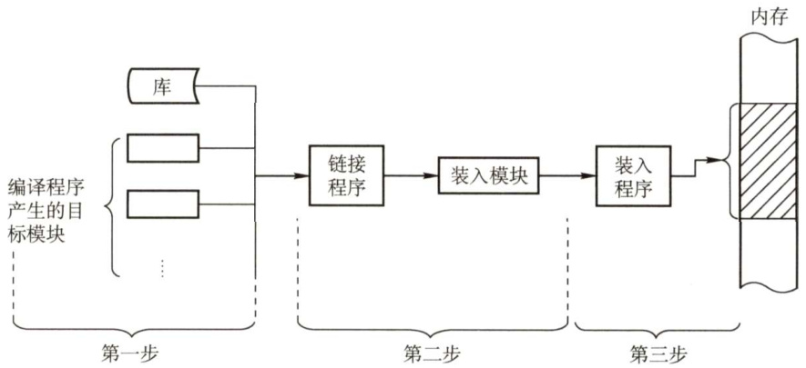  
图3.1将用户程序变为可在内存中执行的程序的步骤  

程序的链接有以下三种方式。  

#### （1）静态链接  

在程序运行之前，先将各目标模块及它们所需的库函数链接成一个完整的装配模块，以后不再拆开。将几个目标模块装配成一个装入模块时，需要解决两个问题： $\textcircled{1}$ 修改相对地址，编译后的所有目标模块都是从0开始的相对地址，当链接成一个装入模块时要修改相对地址。 $\textcircled{2}$ 变换外部调用符号，将每个模块中所用的外部调用符号也都变换为相对地址。  

#### （2）装入时动态链接  

将用户源程序编译后所得到的一组目标模块，在装入内存时，采用边装入边链接的方式。其优点是便于修改和更新，便于实现对目标模块的共享。  

#### （3）运行时动态链接  

对某些目标模块的链接，是在程序执行中需要该目标模块时才进行的。凡在执行过程中未被用到的目标模块，都不会被调入内存和被链接到装入模块上。其优点是能加快程序的装入过程，还可节省大量的内存空间。  

内存的装入模块在装入内存时，同样有以下三种方式：  

（1）绝对装入  

绝对装入方式只适用于单道程序环境。在编译时，若知道程序将驻留在内存的某个位置，则编译程序将产生绝对地址的目标代码。绝对装入程序按照装入模块中的地址，将程序和数据装入内存。由于程序中的逻辑地址与实际内存地址完全相同，因此不需对程序和数据的地址进行修改。  

另外，程序中所用的绝对地址，可在编译或汇编时给出，也可由程序员直接赋予。而通常情况下在程序中采用的是符号地址，编译或汇编时再转换为绝对地址。  

#### （2）可重定位装入  

在多道程序环境下，多个目标模块的起始地址通常都从0开始，程序中的其他地址都是相对于起始地址的，此时应采用可重定位装入方式。根据内存的当前情况，将装入模块装入内存的适当位置。在装入时对目标程序中指令和数据地址的修改过程称为重定位，又因为地址变换通常是在进程装入时一次完成的，故称为静态重定位，如图3.2(a)所示。  

当一个作业装入内存时，必须给它分配要求的全部内存空间，若没有足够的内存，则无法装入。此外，作业一旦进入内存，整个运行期间就不能在内存中移动，也不能再申请内存空间。  

（3）动态运行时装入  

也称动态重定位。程序在内存中若发生移动，则需要采用动态的装入方式。装入程序把装入模块装入内存后，并不立即把装入模块中的相对地址转换为绝对地址，而是把这种地址转换推迟到程序真正要执行时才进行。因此，装入内存后的所有地址均为相对地址。这种方式需要一个重定位寄存器的支持，如图3.2(b)所示。  

动态重定位的优点：可以将程序分配到不连续的存储区；在程序运行之前可以只装入部分代码即可投入运行，然后在程序运行期间，根据需要动态申请分配内存；便于程序段的共享。  

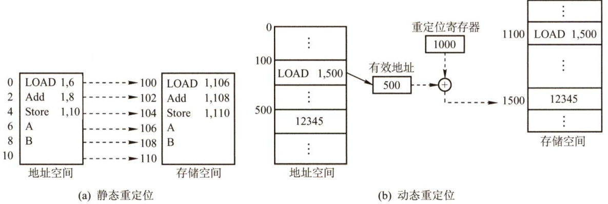  
图3.2 重定位类型  

#### 2.逻辑地址与物理地址  

编译后，每个目标模块都从0号单元开始编址，这称为该目标模块的相对地址(或逻辑地址)。当链接程序将各个模块链接成一个完整的可执行目标程序时，链接程序顺序依次按各个模块的相对地址构成统一的从0号单元开始编址的逻辑地址空间（或虚拟地址空间），对于32位系统，逻辑地址空间的范围为 $0^{\sim2^{32}-1}$ 。进程在运行时，看到和使用的地址都是逻辑地址。用户程序和程序员只需知道逻辑地址，而内存管理的具体机制则是完全透明的。不同进程可以有相同的逻辑地址，因为这些相同的逻辑地址可以映射到主存的不同位置。  

物理地址空间是指内存中物理单元的集合，它是地址转换的最终地址，进程在运行时执行指令和访问数据，最后都要通过物理地址从主存中存取。当装入程序将可执行代码装入内存时，必须通过地址转换将逻辑地址转换成物理地址，这个过程称为地址重定位。  

操作系统通过内存管理部件（MMU）将进程使用的逻辑地址转换为物理地址。进程使用虚拟内存空间中的地址，操作系统在相关硬件的协助下，将它“转换”成真正的物理地址。逻辑地址通过页表映射到物理内存，页表由操作系统维护并被处理器引用。  

#### 3．进程的内存映像  

不同于存放在硬盘上的可执行程序文件，当一个程序调入内存运行时，就构成了进程的内存映像。一个进程的内存映像一般有几个要素：  

·代码段：即程序的二进制代码，代码段是只读的，可以被多个进程共享。  
）数据段：即程序运行时加工处理的对象，包括全局变量和静态变量。  
·进程控制块（PCB)：存放在系统区。操作系统通过PCB来控制和管理进程。  
·堆：用来存放动态分配的变量。通过调用malloc函数动态地向高地址分配空间。  
·栈：用来实现函数调用。从用户空间的最大地址往低地址方向增长。  

代码段和数据段在程序调入内存时就指定了大小，而堆和栈不一样。当调用像malloc 和 free这样的C标准库函数时，堆可以在运行时动态地扩展和收缩。用户栈在程序运行期间也可以动态地扩展和收缩，每次调用一个函数，栈就会增长；从一个函数返回时，栈就会收缩。  

图3.3是一个进程在内存中的映像。其中，共享库用来存放进程用到的共享函数库代码，如printf(函数等。在只读代码段中，.init是程序初始化时调用的_init函数；.text是用户程序的机器代码；.rodata是只读数据。在读/写数据段中，.data是已初始化的全局变量和静态变量；.bss 是未初始化及所有初始化为0的全局变量和静态变量。  

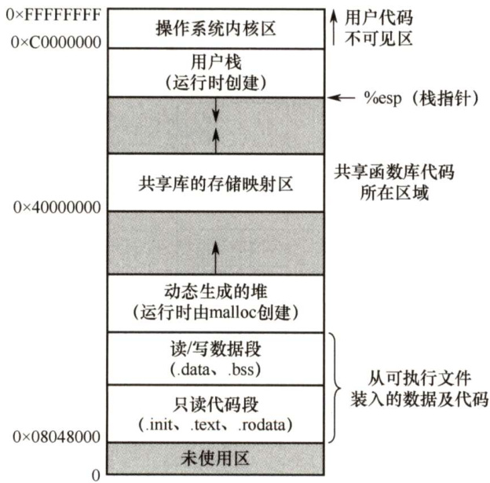  
图3.3内存中的一个进程  

#### 4．内存保护  

确保每个进程都有一个单独的内存空间。内存分配前，需要保护操作系统不受用户进程的影响，同时保护用户进程不受其他用户进程的影响。内存保护可采取两种方法：  

1）在CPU 中设置一对上、下限寄存器，存放用户作业在主存中的下限和上限地址，每当CPU要访问一个地址时，分别和两个寄存器的值相比，判断有无越界。  

2）采用重定位寄存器（又称基地址寄存器）和界地址寄存器（又称限长寄存器）来实现这种保护。重定位寄存器含最小的物理地址值，界地址寄存器含逻辑地址的最大值。内存管理机构动态地将逻辑地址与界地址寄存器进行比较，若未发生地址越界，则加上重定位寄存器的值后映射成物理地址，再送交内存单元，如图3.4所示。  

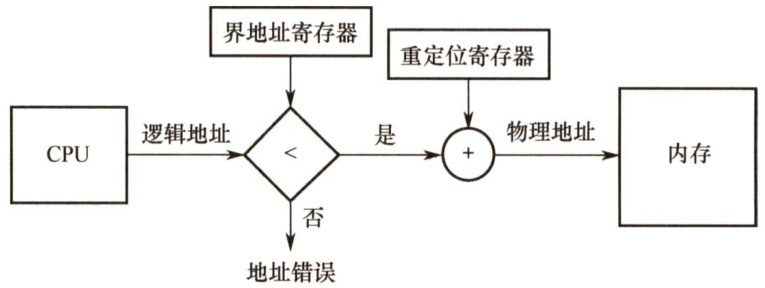  
图3.4重定位寄存器和界地址寄存器的硬件支持  

实现内存保护需要重定位寄存器和界地址寄存器，因此要注意两者的区别。重定位寄存器是用来“加”的，逻辑地址加上重定位寄存器中的值就能得到物理地址；界地址寄存器是用来“比”的，通过比较界地址寄存器中的值与逻辑地址的值来判断是否越界。  

加载重定位寄存器和界地址寄存器时必须使用特权指令，只有操作系统内核才可以加载这两个存储器。这种方案允许操作系统内核修改这两个寄存器的值，而不允许用户程序修改。  

#### 5．内存共享  

并不是所有的进程内存空间都适合共享，只有那些只读的区域才可以共享。可重入代码又称纯代码，是一种允许多个进程同时访问但不允许被任何进程修改的代码。但在实际执行时，也可以为每个进程配以局部数据区，把在执行中可能改变的部分复制到该数据区，这样，程序在执行时只需对该私有数据区中的内存进行修改，并不去改变共享的代码。  

下面通过一个例子来说明内存共享的实现方式。考虑一个可以同时容纳40个用户的多用户系统，他们同时执行一个文本编辑程序，若该程序有160KB代码区和40KB数据区，则共需8000KB的内存空间来支持40个用户。如果160KB代码是可分享的纯代码，则不论是在分页系统中还是在分段系统中，整个系统只需保留一份副本即可，此时所需的内存空间仅为 $40\mathrm{KB}\times40+160\mathrm{KB}=$ 1760KB。对于分页系统，假设页面大小为4KB，则代码区占用40个页面、数据区占用10个页面。为实现代码共享，应在每个进程的页表中都建立40个页表项，它们都指向共享代码区的物理页号。此外，每个进程还要为自己的数据区建立10个页表项，指向私有数据区的物理页号。对于分段系统，由于是以段为分配单位的，不管该段有多大，都只需为该段设置一个段表项（指向共享代码段始址，以及段长160KB)。由此可见，段的共享非常简单易行。  

此外，在第2章中我们介绍过基于共享内存的进程通信，由操作系统提供同步互斥工具。在本章的后面，还将介绍一种内存共享的实现——内存映射文件。  

#### 6．内存分配与回收  

存储管理方式随着操作系统的发展而发展。在操作系统由单道向多道发展时，存储管理方式便由单一连续分配发展为固定分区分配。为了能更好地适应不同大小的程序要求，又从固定分区分配发展到动态分区分配。为了更好地提高内存的利用率，进而从连续分配方式发展到离散分配方式——页式存储管理。引入分段存储管理的目的，主要是为了满足用户在编程和使用方面的要求，其中某些要求是其他几种存储管理方式难以满足的。  

#### $^{*}3.1.2$ 覆盖与交换  

覆盖与交换技术是在多道程序环境下用来扩充内存的两种方法。  

#### （1）覆盖  

早期的计算机系统中，主存容量很小，虽然主存中仅存放一道用户程序，但存储空间放不下用户进程的现象也经常发生，这一矛盾可以用覆盖技术来解决。  

覆盖的基本思想如下：由于程序运行时并非任何时候都要访问程序及数据的各个部分（尤其是大程序)，因此可把用户空间分成一个固定区和若干覆盖区。将经常活跃的部分放在固定区，其余部分按调用关系分段。首先将那些即将要访问的段放入覆盖区，其他段放在外存中，在需要调用前，系统再将其调入覆盖区，替换覆盖区中原有的段。  

覆盖技术的特点是，打破了必须将一个进程的全部信息装入主存后才能运行的限制，但当同时运行程序的代码量大于主存时仍不能运行，此外，内存中能够更新的地方只有覆盖区的段，不在覆盖区中的段会常驻内存。覆盖技术对用户和程序员不透明。  

#### （2）交换  

交换（对换）的基本思想是，把处于等待状态（或在CPU调度原则下被剥夺运行权利）的程序从内存移到辅存，把内存空间腾出来，这一过程又称换出；把准备好竞争CPU运行的程序从辅存移到内存，这一过程又称换入。第2章介绍的中级调度采用的就是交换技术。  

例如，有一个CPU 采用时间片轮转调度算法的多道程序环境。时间片到，内存管理器将刚刚执行过的进程换出，将另一进程换入刚刚释放的内存空间。同时，CPU 调度器可以将时间片分配给其他已在内存中的进程。每个进程用完时间片都与另一进程交换。在理想情况下，内存管理器的交换过程速度足够快，总有进程在内存中可以执行。  

有关交换，需要注意以下几个问题：  

·交换需要备份存储，通常是磁盘。它必须足够大，并提供对这些内存映像的直接访问。  
·为了有效使用CPU，需要使每个进程的执行时间比交换时间长。  
·若换出进程，则必须确保该进程完全处于空闲状态。  
·交换空间通常作为磁盘的一整块，且独立于文件系统，因此使用起来可能很快。  
·交换通常在有许多进程运行且内存空间吃紧时开始启动，而在系统负荷降低时就暂停。  
·普通的交换使用不多，但交换策略的某些变体在许多系统（如UNIX）中仍发挥作用。  

交换技术主要在不同进程（或作业）之间进行，而覆盖则用于同一个程序或进程中。对于主存无法存放用户程序的矛盾，现代操作系统是通过虚拟内存技术来解决的，覆盖技术则已成为历史；而交换技术在现代操作系统中仍具有较强的生命力。  

#### 3.1.3 连续分配管理方式  

连续分配方式是指为一个用户程序分配一个连续的内存空间，譬如某用户需要100MB 的内存空间，连续分配方式就在内存空间中为用户分配一块连续的100MB 空间。连续分配方式主要包括单一连续分配、固定分区分配和动态分区分配。  

#### 1．单一连续分配  

内存在此方式下分为系统区和用户区，系统区仅供操作系统使用，通常在低地址部分；在用户区内存中，仅有一道用户程序，即整个内存的用户空间由该程序独占。  

这种方式的优点是简单、无外部碎片，无须进行内存保护，因为内存中永远只有一道程序。缺点是只能用于单用户、单任务的操作系统中，有内部碎片，存储器的利用率极低。  

#### 2.固定分区分配  

固定分区分配是最简单的一种多道程序存储管理方式，它将用户内存空间划分为若干固定大小的区域，每个分区只装入一道作业。当有空闲分区时，便可再从外存的后备作业队列中选择适当大小的作业装入该分区，如此循环。在划分分区时有两种不同的方法。  

·分区大小相等。程序太小会造成浪费，程序太大又无法装入，缺乏灵活性。  
·分区大小不等。划分为多个较小的分区、适量的中等分区和少量大分区。  

为便于内存分配，通常将分区按大小排队，并为之建立一张分区说明表，其中各表项包括每个分区的始址、大小及状态，如图3.5所示。当有用户程序要装入时，便检索该表，以找到合适的分区给予分配并将其状态置为“已分配”；未找到合适分区时，则拒绝为该程序分配内存。  

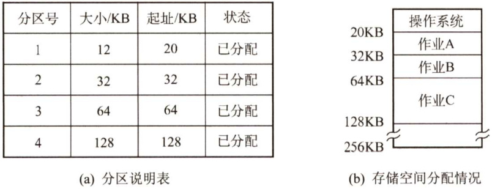  
图3.5固定分区说明表和内存分配情况  

这种方式存在两个问题：一是程序可能太大而放不进任何一个分区，这时就需要采用覆盖技术来使用内存空间；二是当程序小于固定分区大小时，也要占用一个完整的内存分区，这样分区内部就存在空间浪费，这种现象称为内部碎片。固定分区是可用于多道程序设计的最简单的存储分配，无外部碎片，但不能实现多进程共享一个主存区，所以存储空间利用率低。  

在固定分区分配中，为了便于分配，建立一张分区使用表，通常按分区大小排队，各表项包括每个分区的起始地址、大小及状态（是否已分配)。分配内存时，检索分区使用表，找到一个能满足要求且尚未分配的分区分配给装入程序，并将对应表项的状态置为“已分配”；若找不到这样的分区，则拒绝分配。回收内存时，只需将对应表项的状态置为“未分配”即可。  

#### 3.动态分区分配  

又称可变分区分配，它是在进程装入内存时，根据进程的实际需要，动态地为之分配内存，并使分区的大小正好适合进程的需要。因此，系统中分区的大小和数目是可变的。  

如图3.6所示，系统有64MB内存空间，其中低8MB固定分配给操作系统，其余为用户可用内存。开始时装入前三个进程，它们分别分配到所需的空间后，内存仅剩4MB，进程4无法装入。在某个时刻，内存中没有一个就绪进程，CPU出现空闲，操作系统就换出进程2，换入进程4。由于进程4比进程2小，这样在主存中就产生了一个6MB的内存块。之后CPU又出现空闲，需要换入进程2，而主存无法容纳进程2，操作系统就换出进程1，换入进程2。  

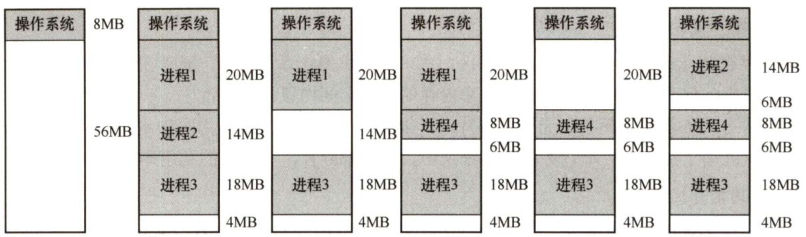  
图3.6 动态分区分配  

动态分区在开始时是很好的，但随着时间的推移，内存中会产生越来越多小的内存块，内存的利用率也随之下降。这些小的内存块称为外部碎片，它存在于所有分区的外部，这与固定分区中的内部碎片正好相对。克服外部碎片可以通过紧凑技术来解决，即操作系统不时地对进程进行移动和整理。但这需要动态重定位寄存器的支持，且相对费时。紧凑的过程实际上类似于Windows系统中的磁盘碎片整理程序，只不过后者是对外存空间的紧凑。  

在进程装入或换入主存时，若内存中有多个足够大的空闲块，则操作系统必须确定分配哪个内存块给进程使用，这就是动态分区的分配策略。考虑以下几种算法：  

1）首次适应（FirstFit）算法。空闲分区以地址递增的次序链接。分配内存时，从链首开始顺序查找，找到大小能满足要求的第一个空闲分区分配给作业。  
2）邻近适应（NextFit）算法。又称循环首次适应算法，由首次适应算法演变而成。不同之处是，分配内存时从上次查找结束的位置开始继续查找。  
3）最佳适应（BestFit）算法。空闲分区按容量递增的次序形成空闲分区链，找到第一个能满足要求且最小的空闲分区分配给作业，避免“大材小用”。  
4）最坏适应（WorstFit）算法。空闲分区以容量递减的次序链接，找到第一个能满足要求的，即最大的分区，从中分割一部分存储空间给作业。  

首次适应算法最简单，通常也是最好和最快的。不过，首次适应算法会使得内存的低地址部分出现很多小的空闲分区，而每次分配查找时都要经过这些分区，因此增加了开销。  

邻近适应算法试图解决这个问题。但它常常导致在内存空间的尾部（因为在一遍扫描中，内存前面部分使用后再释放时，不会参与分配）分裂成小碎片。通常比首次适应算法要差。  

最佳适应算法虽然称为“最佳”，但是性能通常很差，因为每次最佳的分配会留下很小的难以利用的内存块，会产生最多的外部碎片。  

最坏适应算法与最佳适应算法相反，它选择最大的可用块，这看起来最不容易产生碎片，但是却把最大的连续内存划分开，会很快导致没有可用的大内存块，因此性能也非常差。  

在动态分区分配中，与固定分区分配类似，设置一张空闲分区链（表)，并按始址排序。分配内存时，检索空闲分区链，找到所需的分区，若其大小大于请求大小，便从该分区中按请求大小分割一块空间分配给装入进程（若剩余部分小到不足以划分，则无须分割)，余下部分仍留在空闲分区链中。回收内存时，系统根据回收分区的始址，从空闲分区链中找到相应的插入点，此时可能出现四种情况： $\textcircled{1}$ 回收区与插入点的前一空闲分区相邻，将这两个分区合并，并修改前一分区表项的大小为两者之和； $\textcircled{2}$ 回收区与插入点的后一空闲分区相邻，将这两个分区合并，并修改后一分区表项的始址和大小； $\textcircled{3}$ 回收区同时与插入点的前、后两个分区相邻，此时将这三个分区合并，修改前一分区表项的大小为三者之和，取消后一分区表项； $\textcircled{4}$ 回收区没有相邻的空闲分区，此时应为回收区新建一个表项，填写始址和大小，并插入空闲分区链。  

以上三种内存分区管理方法有一个共同特点，即用户程序在主存中都是连续存放的。  

在连续分配方式中，我们发现，即使内存有超过1GB的空闲空间，但若没有连续的1GB 空间，则需要1GB空间的作业仍然是无法运行的；但若采用非连续分配方式，则作业所要求的1GB内存空间可以分散地分配在内存的各个区域，当然，这也需要额外的空间去存储它们（分散区域）的索引，使得非连续分配方式的存储密度低于连续分配方式。非连续分配方式根据分区的大小是否固定，分为分页存储管理和分段存储管理。在分页存储管理中，又根据运行作业时是否要把作业的所有页面都装入内存才能运行，分为基本分页存储管理和请求分页存储管理。  

#### 3.1.4 基本分页存储管理  

固定分区会产生内部碎片，动态分区会产生外部碎片，这两种技术对内存的利用率都比较低。我们希望内存的使用能尽量避免碎片的产生，这就引入了分页的思想：把主存空间划分为大小相等且固定的块，块相对较小，作为主存的基本单位。每个进程也以块为单位进行划分，进程在执行时，以块为单位逐个申请主存中的块空间。  

分页的方法从形式上看，像分区相等的固定分区技术，分页管理不会产生外部碎片。但它又有本质的不同点：块的大小相对分区要小很多，而且进程也按照块进行划分，进程运行时按块申请主存可用空间并执行。这样，进程只会在为最后一个不完整的块申请一个主存块空间时，才产生主存碎片，所以尽管会产生内部碎片，但这种碎片相对于进程来说也是很小的，每个进程平均只产生半个块大小的内部碎片（也称页内碎片）。  

#### 1.分页存储的几个基本概念  

（1）页面和页面大小  

进程中的块称为页或页面（Page)，内存中的块称为页框或页帧（PageFrame)。外存也以同样的单位进行划分，直接称为块或盘块（Block)。进程在执行时需要申请主存空间，即要为每个页面分配主存中的可用页框，这就产生了页和页框的一一对应。  

为方便地址转换，页面大小应是2的整数幂。同时页面大小应该适中，页面太小会使进程的页面数过多，这样页表就会过长，占用大量内存，而且也会增加硬件地址转换的开销，降低页面换入/换出的效率；页面过大又会使页内碎片增多，降低内存的利用率。  

（2）地址结构  

分页存储管理的逻辑地址结构如图3.7所示。  

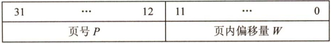  
图3.7分页存储管理的逻辑地址结构  

地址结构包含两部分：前一部分为页号 $P$ ，后一部分为页内偏移量 $W$ 。地址长度为32位，其中 $0{\sim}11$ 位为页内地址，即每页大小为4KB； $12{\sim}31$ 位为页号，即最多允许 $2^{20}$ 页。  

注意，地址结构决定了虚拟内存的寻址空间有多大。在实际问题中，页号、页内偏移、逻辑地址可能是用十进制数给出的，若题目用二进制地址的形式给出时，读者要会转换。  

#### （3）页表  

为了便于在内存中找到进程的每个页面所对应的物理块，系统为每个进程建立一张页表，它记录页面在内存中对应的物理块号，页表一般存放在内存中。  

在配置页表后，进程执行时，通过查找该表，即可找到每页在内存中的物理块号。可见，页  

表的作用是实现从页号到物理块号的地址映射，如图3.8所示。  

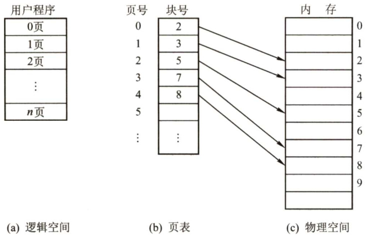  
图3.8 页表的作用  

页表是由页表项组成的，初学者容易混淆页表项与地址结构，页表项与地址都由两部分构成，而且第一部分都是页号，但页表项的第二部分是物理内存中的块号，而地址的第二部分是页内偏移；页表项的第二部分与地址的第二部分共同组成物理地址。  

#### 2.基本地址变换机构  

地址变换机构的任务是将逻辑地址转换为内存中的物理地址。地址变换是借助于页表实现的。图3.9给出了分页存储管理系统中的地址变换机构。  

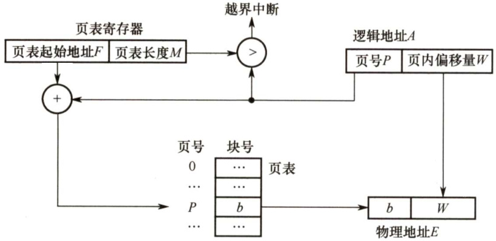  
图3.9分页存储管理系统中的地址变换机构  

在系统中通常设置一个页表寄存器（PTR)，存放页表在内存的起始地址 $F$ 和页表长度 $M_{\circ}$ 平时，进程未执行时，页表的始址和页表长度存放在本进程的PCB中，当进程被调度执行时，才将页表始址和页表长度装入页表寄存器中。设页面大小为 $L$ ，逻辑地址 $A$ 到物理地址 $E$ 的变换过程如下（假设逻辑地址、页号、每页的长度都是十进制数)：  

$\textcircled{1}$ 计算页号 $P$ （ $\scriptstyle\cdot P=A/L$ ）和页内偏移量 $W$ （ $W=A\%L$ 。  
$\textcircled{2}$ 比较页号 $P$ 和页表长度 $M$ ，若 $P\geq M$ ，则产生越界中断，否则继续执行。  
$\textcircled{3}$ 页表中页号 $P$ 对应的页表项地址 $\mathbf{\Sigma}=\mathbf{\Sigma}$ 页表始址 $F+$ 页号 $P\times$ 页表项长度，取出该页表项内容 $b$ ，即为物理块号。注意区分页表长度和页表项长度。页表长度是指一共有多少页，页表项长度是指页地址占多大的存储空间。  

$\textcircled{4}$ 计算 $E=b\times L+W$ ，用得到的物理地址 $E$ 去访问内存。  

以上整个地址变换过程均是由硬件自动完成的。例如，若页面大小 $L$ 为1KB，页号2对应的物理块为 $b=8$ ，计算逻辑地址 $A=2500$ 的物理地址 $E$ 的过程如下： $P=2500/1\mathrm{K}=2$ ， $W=2500\%1\mathrm{K}=$ 452，查找得到页号2对应的物理块的块号为8， $E=8{\times}1024+452=8644$ 。  

计算条件用十进制数和用二进制数给出，过程会稍有不同。页式管理只需给出一个整数就能确定对应的物理地址，因为页面大小 $L$ 是固定的。因此，页式管理中地址空间是一维的。  

页表项的大小不是随意规定的，而是有所约束的。如何确定页表项的大小？  

页表项的作用是找到该页在内存中的位置。以32位逻辑地址空间、字节编址单位、一页4KB为例，地址空间内一共有 $2^{32}\mathrm{B}/4\mathrm{KB}=1\mathrm{M}$ 页，因此需要 $\log_{2}1\mathbf{M}=20$ 位才能保证表示范围能容纳所有页面，又因为以字节作为编址单位，即页表项的大小 $\geq\left\lceil20/8\right\rceil=3\mathrm{B}$ 。所以在这个条件下，为了保证页表项能够指向所有页面，页表项的大小应该大于等于3B，当然，也可选择更大的页表项让一个页面能够正好容下整数个页表项，进而方便存储（如取成4B，这样一页正好可以装下1K个页表项)，或增加一些其他信息。  

下面讨论分页管理方式存在的两个主要问题： $\textcircled{1}$ 每次访存操作都需要进行逻辑地址到物理地址的转换，地址转换过程必须足够快，否则访存速度会降低； $\textcircled{2}$ 每个进程引入页表，用于存储映射机制，页表不能太大，否则内存利用率会降低。  

#### 3．具有快表的地址变换机构  

由上面介绍的地址变换过程可知，若页表全部放在内存中，则存取一个数据或一条指令至少要访问两次内存：第一次是访问页表，确定所存取的数据或指令的物理地址；第二次是根据该地址存取数据或指令。显然，这种方法比通常执行指令的速度慢了一半。  

为此，在地址变换机构中增设一个具有并行查找能力的高速缓冲存储器—快表，又称相联存储器（TLB)，用来存放当前访问的若干页表项，以加速地址变换的过程。与此对应，主存中的页表常称为慢表。具有快表的地址变换机构如图3.10所示。  

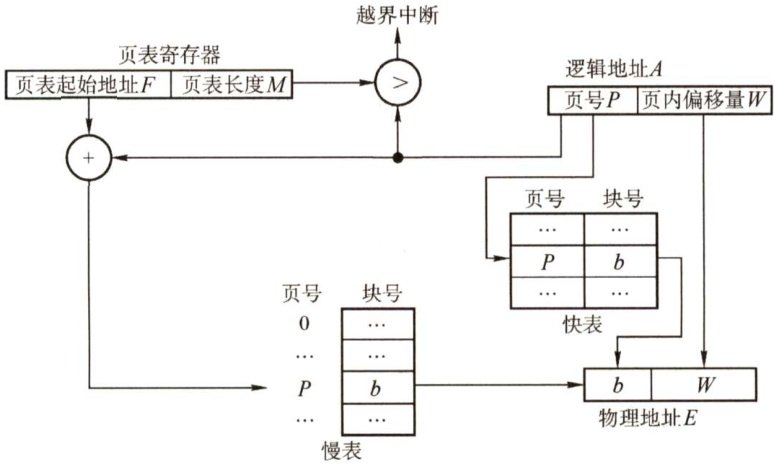  
图 $3.10^{\cdot}$ 具有快表的地址变换机构  

在具有快表的分页机制中，地址的变换过程如下：  

$\textcircled{1}$ CPU给出逻辑地址后，由硬件进行地址转换，将页号送入高速缓存寄存器，并将此页号与快表中的所有页号进行比较。  
$\textcircled{2}$ 若找到匹配的页号，说明所要访问的页表项在快表中，则直接从中取出该页对应的页框号，与页内偏移量拼接形成物理地址。这样，存取数据仅一次访存便可实现。  
$\textcircled{3}$ 若未找到匹配的页号，则需要访问主存中的页表，读出页表项后，应同时将其存入快表，以便后面可能的再次访问。若快表已满，则须按特定的算法淘汰一个旧页表项。  

注意：有些处理机设计为快表和慢表同时查找，若在快表中查找成功则终止慢表的查找。  

一般快表的命中率可达 $90\%$ 以上，这样分页带来的速度损失就可降低至 $10\%$ 以下。快表的有效性基于著名的局部性原理，后面讲解虚拟内存时将会具体讨论它。  

#### 4.两级页表  

由于引入了分页管理，进程在执行时不需要将所有页调入内存页框，而只需将保存有映射关系的页表调入内存。但是，我们仍然需要考虑页表的大小。以32位逻辑地址空间、页面大小4KB、页表项大小4B为例，若要实现进程对全部逻辑地址空间的映射，则每个进程需要 $2^{20}$ 即约100万个页表项。也就是说，每个进程仅页表这一项就需要4MB主存空间，而且还要求是连续的，显然这是不切实际的。即便不考虑对全部逻辑地址空间进行映射的情况，一个逻辑地址空间稍大的进程，其页表大小也可能是过大的。以一个40MB的进程为例，页表项共40KB（40MB/4KB $\scriptstyle\times4\mathrm{B}$ )，若将所有页表项内容保存在内存中，则需要10个内存页框来保存整个页表。整个进程大小约为1万个页面，而实际执行时只需要几十个页面进入内存页框就可运行，但若要求10个页面大小的页表必须全部进入内存，则相对实际执行时的几十个进程页面的大小来说，肯定降低了内存利用率；从另一方面来说，这10页的页表项也并不需要同时保存在内存中，因为在大多数情况下，映射所需要的页表项都在页表的同一个页面中。  

为了压缩页表，我们进一步延伸页表映射的思想，就可得到二级分页，即使用层次结构的页表：将页表的10 页空间也进行地址映射，建立上一级页表，用于存储页表的映射关系。这里对页表的10个页面进行映射只需要10个页表项，所以上一级页表只需要1页就已足够（可以存储$2^{10}=1024$ 个页表项)。在进程执行时，只需要将这一页的上一级页表调入内存即可，进程的页表和进程本身的页面可在后面的执行中再调入内存。根据上面提到的条件（32位逻辑地址空间、页面大小4KB、页表项大小4B，以字节为编址单位)，我们来构造一个适合的页表结构。页面大小为4KB，页内偏移地址为 $\log_{2}4\mathbf{K}=12$ 位，页号部分为20位，若不采用分级页表，则仅页表就要占用 $2^{20}{\times}4\mathrm{B}/4\mathrm{KB}=1024$ 页，这大大超过了许多进程自身需要的页面，对于内存来说是非常浪费资源的，而且查询页表工作也会变得十分不便、试想若把这些页表放在连续的空间内，查询对应页的物理页号时可以通过页表首页地址 $^+$ 页号 $\times4\mathrm{B}$ 的形式得到，而这种方法查询起来虽然相对方便，但连续的1024页对于内存的要求实在太高，并且上面也说到了其中大多数页面都是不会用到的，所以这种方法并不具有可行性。若不把这些页表放在连续的空间里，则需要一张索引表来告诉我们第几张页表该上哪里去找，这能解决页表的查询问题，且不用把所有的页表都调入内存，只在需要它时才调入（下节介绍的虚拟存储器思想)，因此能解决占用内存空间过大的问题。读者也许发现这个方案就和当初引进页表机制的方式一模一样，实际上就是构造一个页表的页表，也就是二级页表。为查询方便，顶级页表最多只能有1个页面（一定要记住这个规定)，因此顶级页表总共可以容纳 $4\mathrm{KB}/4\mathrm{B}=1\mathrm{K}$ 个页表项，它占用的地址位数为 $\log_{2}1{\sf K}=10$ 位，而之前已经计算出页内偏移地址占用了12位，因此一个32位的逻辑地址空间就剩下了10位，正好使得二级页表的大小在一页之内，这样就得到了逻辑地址空间的格式，如图3.11所示。  

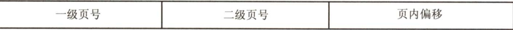  
图3.11 逻辑地址空间的格式  

二级页表实际上是在原有页表结构上再加上一层页表，示意结构如图3.12所示。  

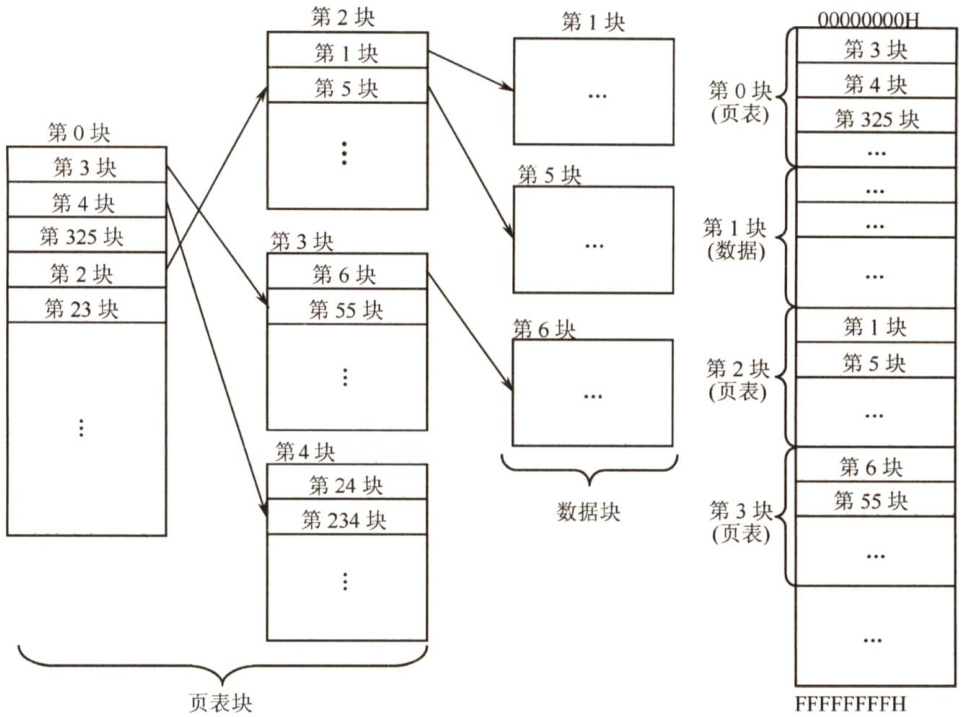  
图3.12二级页表结构示意图  

建立多级页表的目的在于建立索引，以便不用浪费主存空间去存储无用的页表项，也不用盲目地顺序式查找页表项。  

#### 3.1.5 基本分段存储管理  

分页管理方式是从计算机的角度考虑设计的，目的是提高内存的利用率，提升计算机的性能。分页通过硬件机制实现，对用户完全透明。分段管理方式的提出则考虑了用户和程序员，以满足方便编程、信息保护和共享、动态增长及动态链接等多方面的需要。  

#### 1.分段  

段式管理方式按照用户进程中的自然段划分逻辑空间。例如，用户进程由主程序段、两个子程序段、栈段和数据段组成，于是可以把这个用户进程划分为5段，每段从0开始编址，并分配一段连续的地址空间（段内要求连续，段间不要求连续，因此整个作业的地址空间是二维的)，其逻辑地址由段号S与段内偏移量 $W$ 两部分组成。  

在图3.13中，段号为16位，段内偏移量为16位，因此一个作业最多有 $2^{16}=65536$ 段，最大段长为64KB。  

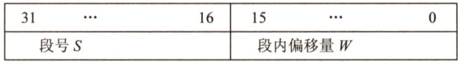  
图3.13分段系统中的逻辑地址结构  

在页式系统中，逻辑地址的页号和页内偏移量对用户是透明的，但在段式系统中，段号和段内偏移量必须由用户显式提供，在高级程序设计语言中，这个工作由编译程序完成。  

#### 2.段表  

每个进程都有一张逻辑空间与内存空间映射的段表，其中每个段表项对应进程的一段，段表项记录该段在内存中的始址和长度。段表的内容如图3.14所示。  

  
图3.14段表的内容  

配置段表后，执行中的进程可通过查找段表，找到每段所对应的内存区。可见，段表用于实现从逻辑段到物理内存区的映射，如图3.15所示。  

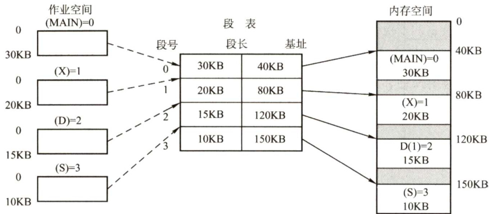  
图3.15利用段表实现物理内存区映射  

#### 3.地址变换机构  

分段系统的地址变换过程如图3.16所示。为了实现进程从逻辑地址到物理地址的变换功能，在系统中设置了段表寄存器，用于存放段表始址 $F$ 和段表长度 $M_{\sun}$ ，从逻辑地址A到物理地址 $E$ 之间的地址变换过程如下：  

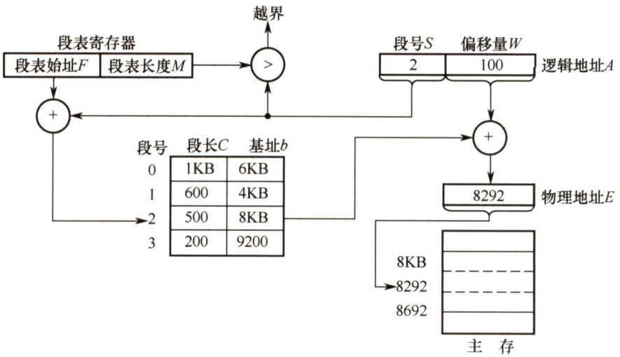  
图3.16分段系统的地址变换过程  

$\textcircled{1}$ 从逻辑地址A中取出前几位为段号 $s$ ，后几位为段内偏移量 $W$ 。注意，在地址变换的题目中，要注意逻辑地址是用二进制数还是用十进制数给出的。  

$\textcircled{2}$ 比较段号 $s$ 和段表长度 $M$ ，若 $S\geq M$ ，则产生越界中断，否则继续执行。  

$\textcircled{3}$ 段表中段号 $s$ 对应的段表项地址 $\mathbf{\Sigma}=\mathbf{\Sigma}$ 段表始址 $F+$ 段号 $s\times$ 段表项长度，取出该段表项的前几位得到段长 $C$ 。若段内偏移量 $\geq C$ ，则产生越界中断，否则继续执行。从这句话我们可以看出，段表项实际上只有两部分，前几位是段长，后几位是始址。  

$\textcircled{4}$ 取出段表项中该段的始址 $b$ ，计算 $E=b+W$ ，用得到的物理地址 $E$ 去访问内存。  

#### 4.段的共享与保护  

在分段系统中，段的共享是通过两个作业的段表中相应表项指向被共享的段的同一个物理副本来实现的。当一个作业正从共享段中读取数据时，必须防止另一个作业修改此共享段中的数据。不能修改的代码称为纯代码或可重入代码（它不属于临界资源)，这样的代码和不能修改的数据可以共享，而可修改的代码和数据不能共享。  

与分页管理类似，分段管理的保护方法主要有两种：一种是存取控制保护，另一种是地址越界保护。地址越界保护将段表寄存器中的段表长度与逻辑地址中的段号比较，若段号大于段表长度，则产生越界中断；再将段表项中的段长和逻辑地址中的段内偏移进行比较，若段内偏移大于段长，也会产生越界中断。分页管理只需要判断页号是否越界，页内偏移是不可能越界的。  

与页式管理不同，段式管理不能通过给出一个整数便确定对应的物理地址，因为每段的长度是不固定的，无法通过整数除法得出段号，无法通过求余得出段内偏移，所以段号和段内偏移一定要显式给出（段号，段内偏移)，因此分段管理的地址空间是二维的。  

#### 3.1.6 段页式管理  

分页存储管理能有效地提高内存利用率，而分段存储管理能反映程序的逻辑结构并有利于段的共享和保护。将这两种存储管理方法结合起来，便形成了段页式存储管理方式。  

在段页式系统中，作业的地址空间首先被分成若干逻辑段，每段都有自已的段号，然后将每段分成若干大小固定的页。对内存空间的管理仍然和分页存储管理一样，将其分成若干和页面大小相同的存储块，对内存的分配以存储块为单位，如图3.17所示。  

在段页式系统中，作业的逻辑地址分为三部分：段号、页号和页内偏移量，如图3.18所示。  

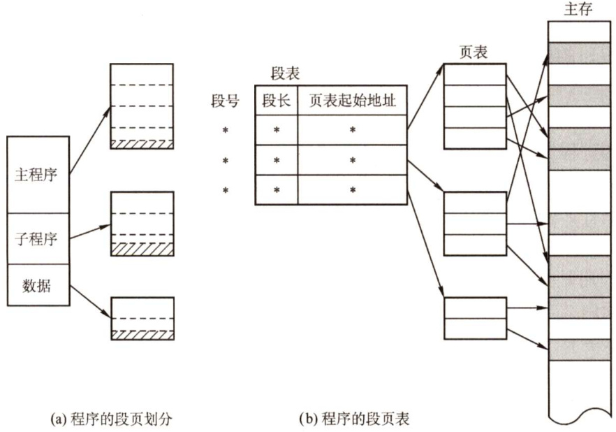  
图3.17段页式管理方式  
图3.18段页式系统的逻辑地址结构  

<html><body><table><tr><td>段号S</td><td>页号P</td><td>页内偏移量W</td></tr></table></body></html>  

为了实现地址变换，系统为每个进程建立一张段表，每个分段有一张页表。段表表项中至少包括段号、页表长度和页表始址，页表表项中至少包括页号和块号。此外，系统中还应有一个段  

表寄存器，指出作业的段表始址和段表长度（段表寄存器和页表寄存器的作用都有两个，一是在段表或页表中寻址，二是判断是否越界)。  

注意：在一个进程中，段表只有一个，而页表可能有多个。  

在进行地址变换时，首先通过段表查到页表始址，然后通过页表找到页帧号，最后形成物理地址。如图3.19所示，进行一次访问实际需要三次访问主存，这里同样可以使用快表来加快查找速度，其关键字由段号、页号组成，值是对应的页帧号和保护码。  

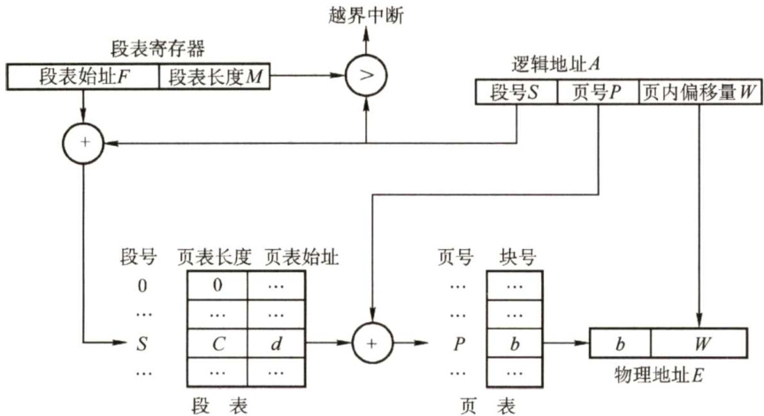  
图3.19段页式系统的地址变换机构  

结合上面对段式和页式管理地址空间的分析，得出结论：段页式管理的地址空间是二维的。  

#### 3.1.7 本节小结  

本节开头提出的问题的参考答案如下。  

1）为什么要进行内存管理？  

在单道系统阶段，一个系统在一个时间段内只执行一个程序，内存的分配极其简单，即仅分配给当前运行的进程。引入多道程序后，进程之间共享的不仅仅是处理机，还有主存储器。然而，共享主存会形成一些特殊的挑战。若不对内存进行管理，则容易导致内存数据的混乱，以至于影响进程的并发执行。因此，为了更好地支持多道程序并发执行，必须进行内存管理。  

2）页式管理中每个页表项大小的下限如何决定？  

页表项的作用是找到该页在内存中的位置。以32位逻辑地址空间、字节编址单位、一页4KB为例，地址空间内共含有 $2^{32}\mathrm{B}/4\mathrm{KB}=1\mathrm{M}$ 页，需要 $\log_{2}1\mathbf{M}=20$ 位才能保证表示范围能容纳所有页面，又因为以字节作为编址单位，即页表项的大小 $\geq\left\lceil20/8\right\rceil=3\mathbf{B}$ 。当然，也可选择更大的页表项大小，让一个页面能够正好容下整数个页表项，以方便存储（例如取成4B，一页正好可以装下1K个页表项)，或增加一些其他信息。  

3）多级页表解决了什么问题？又会带来什么问题？  

多级页表解决了当逻辑地址空间过大时，页表的长度会大大增加的问题。而采用多级页表时，一次访盘需要多次访问内存甚至磁盘，会大大增加一次访存的时间。  

无论是段式管理、页式管理还是段页式管理，读者都只需要掌握下面三个关键问题： $\textcircled{1}$ 逻辑地址结构， $\textcircled{2}$ 表项结构， $\textcircled{3}$ 寻址过程。搞清楚这三个问题，就相当于搞清楚了上面几种存储管理方式。再次提醒读者区分逻辑地址结构和表项结构。  

#### 3.1.8 本节习题精选  

#### 一、单项选择题  

01．下面关于存储管理的叙述中，正确的是（）。  

A.存储保护的目的是限制内存的分配  
B．在内存为 $M.$ 有 $N$ 个用户的分时系统中，每个用户占用M/N的内存空间  
C．在虚拟内存系统中，只要磁盘空间无限大，作业就能拥有任意大的编址空间  
D．实现虚拟内存管理必须有相应硬件的支持  

02．在使用交换技术时，若一个进程正在（），则不能交换出主存。  

A.创建 B.IO操作 C．处于临界段 D.死锁  

03．在存储管理中，采用覆盖与交换技术的目的是（）。  

A.节省主存空间 B.物理上扩充主存容量 C.提高CPU效率 D．实现主存共享  

04.段页式存储管理中，地址映射表是（）。  

A．每个进程一张段表，两张页表B．每个进程的每个段一张段表，一张页表C．每个进程一张段表，每个段一张页表D．每个进程一张页表，每个段一张段表  

05．内存保护需要由（）完成，以保证进程空间不被非法访问。  

A.操作系统 B.硬件机构C.操作系统和硬件机构合作 D.操作系统或者硬件机构独立完成  

06．存储管理方案中，（）可采用覆盖技术。  

A.单一连续存储管理 B．可变分区存储管理C.段式存储管理 D.段页式存储管理  

07．在可变分区分配方案中，某一进程完成后，系统回收其主存空间并与相邻空闲区合并，为此需修改空闲区表，造成空闲区数减1的情况是（）。  

A.无上邻空闲区也无下邻空闲区 B.有上邻空闲区但无下邻空闲区 C.有下邻空闲区但无上邻空闲区 D.有上邻空闲区也有下邻空闲区  

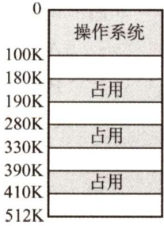  

08．设内存的分配情况如右图所示。若要申请一块40KB的内存空间，采用最佳适应算法，则所得到的分区首址为（）。  

A.100K B. 190K C.330K D. 410K  

09．某段表的内容见右表，一逻辑地址为(2，154)，它对应的物理地址为（）。  

A. $120\mathrm{K}+2$ B. $480\mathrm{K}+154$   
C. $30\mathrm{K}+154$ D. $480\mathrm{K}+2$  

<html><body><table><tr><td>段号</td><td>段首址</td><td>段长度</td></tr><tr><td>0</td><td>120K</td><td>40K</td></tr><tr><td>1</td><td>760K</td><td>30K</td></tr><tr><td>2</td><td>480K</td><td>20K</td></tr><tr><td>3</td><td>370K</td><td>20K</td></tr></table></body></html>  

10．动态重定位是在作业的（）中进行的。  

A．编译过程 B．装入过程 C.链接过程 D.执行过程l1．下面的存储管理方案中，（）方式可以采用静态重定位。  

A．固定分区 B．可变分区 C.页式 D.段式  

12.在可变分区管理中，采用拼接技术的目的是（）。  

A．合并空闲区 B．合并分配区 C.增加主存容量 D.便于地址转换  

13．在一页式存储管理系统中，页表内容见右表。若页的大小为4KB，则地址转换机构将逻辑地址0转换成的物理地址为（块号从0开始计算）（）。  

A.8192 B. 4096   
C. 2048 D. 1024  

<html><body><table><tr><td>页号</td><td>块号</td></tr><tr><td>0</td><td>2</td></tr><tr><td>一</td><td>1</td></tr><tr><td>3</td><td>3</td></tr><tr><td>4</td><td>7</td></tr></table></body></html>  

14.不会产生内部碎片的存储管理是（）。  

A．分页式存储管理 B.分段式存储管理C.固定分区式存储管理 D．段页式存储管理l5.多进程在主存中彼此互不干扰的环境下运行，操作系统是通过（）来实现的。  

A．内存分配 B．内存保护 C.内存扩充 D．地址映射  

5.分区管理中采用最佳适应分配算法时，把空闲区按（）次序登记在空闲区表中。  

A．长度递增 B.长度递减 C．地址递增 D.地址递减  

17．首次适应算法的空闲分区（）。  

A.按大小递减顺序连在一起 B.按大小递增顺序连在一起C．按地址由小到大排列 D．按地址由大到小排列  

18．采用分页或分段管理后，提供给用户的物理地址空间（）。  

A．分页支持更大的物理地址空间 B.分段支持更大的物理地址空间C．不能确定 D.一样大  

19.分页系统中的页面是为（）。  

A．用户所感知的 B.操作系统所感知的C.编译系统所感知的 D.连接装配程序所感知的  

20．页式存储管理中，页表的始地址存放在（）中。  

A.内存 B．存储页表 C.快表 D.寄存器  

21．对重定位存储管理方式，应（）。  

A.在整个系统中设置一个重定位寄存器B．为每道程序设置一个重定位寄存器C．为每道程序设置两个重定位寄存器D.为每道程序和数据都设置一个重定位寄存器  

22．采用段式存储管理时，一个程序如何分段是在（）时决定的。  

A.分配主存 B.用户编程 C.装作业 D．程序执行  

23．下面的（）方法有利于程序的动态链接。  

A．分段存储管理 B．分页存储管理C．可变式分区管理 D.固定式分区管理  

24.当前编程人员编写好的程序经过编译转换成目标文件后，各条指令的地址编号起始一般定为（），称为（）地址。  

1)A.1 B.0 C.IP D. CS   
2）A.绝对 B.名义 C.逻辑 D.实  

25.可重入程序是通过（）方法来改善系统性能的。  

A．改变时间片长度 B.改变用户数C.提高对换速度 D.减少对换数量  

26．操作系统实现（）存储管理的代价最小。  

A.分区 B.分页 C.分段 D.段页式．动态分区又称可变式分区，它是系统运行过程中（）动态建立的。  

A．在作业装入时 B．在作业创建时C．在作业完成时 D.在作业未装入时  

28.对外存对换区的管理应以（）为主要目标。  

A.提高系统吞吐量 B.提高存储空间的利用率C.降低存储费用 D.提高换入、换出速度  

29.下列关于虚拟存储器的论述中，正确的是（）。  

A．作业在运行前，必须全部装入内存，且在运行过程中也一直驻留内存B.作业在运行前，不必全部装入内存，且在运行过程中也不必一直驻留内存C．作业在运行前，不必全部装入内存，但在运行过程中必须一直驻留内存D.作业在运行前，必须全部装入内存，但在运行过程中不必一直驻留内存  

30.在页式存储管理中选择页面的大小，需要考虑下列（）因素。  

I．页面大的好处是页表比较少  
ⅡI．页面小的好处是可以减少由内碎片引起的内存浪费  
III影响磁盘访问时间的主要因素通常不是页面大小，所以使用时优先考虑较大的页面  

A.I和IⅢI B.Ⅱ和IⅢI C.I和Ⅱ D.I、和  

51．某个操作系统对内存的管理采用页式存储管理方法，所划分的页面大小（）。  

A.要根据内存大小确定 B.必须相同C.要根据CPU的地址结构确定 D.要依据外存和内存的大小确定  

32.引入段式存储管理方式，主要是为了更好地满足用户的一系列要求。下面选项中不属于这一系列要求的是（）。  

A．方便操作 B．方便编程C．共享和保护 D．动态链接和增长  

33.存储管理的目的是（）。  

A．方便用户 B.提高内存利用率C.方便用户和提高内存利用率 D.增加内存实际容量  

34.对主存储器的访问，（）。  

A．以块（即页）或段为单位 B．以字节或字为单位C.随存储器的管理方案不同而异 D.以用户的逻辑记录为单位  

5.把作业空间中使用的逻辑地址变为内存中的物理地址称为（）。  

A.加载 B．重定位 C．物理化 D.逻辑化  

36．以下存储管理方式中，不适合多道程序设计系统的是（）。  

A．单用户连续分配 B．固定式分区分配C.可变式分区分配 D．分页式存储管理方式  

37．在分页存储管理中，主存的分配（）。  

A．以物理块为单位进行 B．以作业的大小进行C.以物理段进行 D．以逻辑记录大小进行  

38．在段式分配中，CPU每次从内存中取一次数据需要（）次访问内存。  

A.1 B.3 C.2 D.4  

9.在段页式分配中，CPU每次从内存中取一次数据需要（）次访问内存。  

A.1 B.3 C.2 D.4  

40.（）存储管理方式提供一维地址结构。  

A.分段 B.分页C．分段和段页式 D.以上答案都不正确  

41.操作系统采用分页存储管理方式，要求（）。  

A．每个进程拥有一张页表，且进程的页表驻留在内存中  
B．每个进程拥有一张页表，但只有执行进程的页表驻留在内存中  
C．所有进程共享一张页表，以节约有限的内存空间，但页表必须驻留在内存中  
D．所有进程共享一张页表，只有页表中当前使用的页面必须驻留在内存中，以最大限度地节省有限的内存空间  

42．在分段存储管理方式中，（）。  

A．以段为单位，每段是一个连续存储区 B.段与段之间必定不连续C.段与段之间必定连续 D．每段是等长的  

43．段页式存储管理汲取了页式管理和段式管理的长处，其实现原理结合了页式和段式管理的基本思想，即（）。  

A．用分段方法来分配和管理物理存储空间，用分页方法来管理用户地址空间B．用分段方法来分配和管理用户地址空间，用分页方法来管理物理存储空间C．用分段方法来分配和管理主存空间，用分页方法来管理辅存空间D．用分段方法来分配和管理辅存空间，用分页方法来管理主存空间  

44.以下存储管理方式中，会产生内部碎片的是（）。  

I．分段虚拟存储管理 ⅡI．分页虚拟存储管理III．段页式分区管理 IV．固定式分区管理A.I、Ⅱ、II B.III、IV C.仅Ⅱ D.Ⅱ、Ⅲ、IV  

45．下列关于页式存储的论述中，正确的是（）。  

I．在页式存储管理中，若关闭TLB，则每当访问一条指令或存取一个操作数时都要访问2次内存  
II．页式存储管理不会产生内部碎片  
III．页式存储管理中的页面是为用户所感知的  
IV．页式存储方式可以采用静态重定位  

A.I、I、IV B.I、IV C.仅I D.全都正确  

16.【2009统考真题】分区分配内存管理方式的主要保护措施是（）。  

A．界地址保护 B．程序代码保护 C．数据保护 D．栈保护  

47.【2009统考真题】一个分段存储管理系统中，地址长度为32位，其中段号占8位，则最大段长是（）。  

A. $2^{8}\mathbf{B}$ B. $2^{16}\mathrm{{B}}$ C. $2^{24}\mathrm{{B}}$ D. $2^{32}\mathrm{B}$  

48.【2010统考真题】某基于动态分区存储管理的计算机，其主存容量为55MB（初始为空），采用最佳适配（BestFit）算法，分配和释放的顺序为：分配15MB，分配30MB，释放15MB，分配8MB，分配6MB，此时主存中最大空闲分区的大小是（）。  

A.7MB B.9MB C. 10MB D.15MB  

49.【2010统考真题】某计算机采用二级页表的分页存储管理方式，按字节编址，页大小为$2^{10}\mathrm{{B}}$ ，页表项大小为2B，逻辑地址结构为  

<html><body><table><tr><td>页目录号</td><td>页号</td><td>页内偏移量</td></tr></table></body></html>  

逻辑地址空间大小为 $2^{16}$ 页，则表示整个逻辑地址空间的页目录表中包含表项的个数至少是（）。  

A.64 B.128 C.256 D.512  

50.【2011统考真题】在虚拟内存管理中，地址变换机构将逻辑地址变换为物理地址，形成该逻辑地址的阶段是（）。  

A.编辑 B.编译 C.链接 D.装载  

51.【2014统考真题】现有一个容量为10GB的磁盘分区，磁盘空间以簇为单位进行分配，簇的大小为4KB，若采用位图法管理该分区的空闲空间，即用一位标识一个簇是否被分配，则存放该位图所需的簇为（）个。  

A.80 B.320 C. 80K D.320K  

52.【2014统考真题】下列选项中，属于多级页表优点的是（）。  

A．加快地址变换速度 B.减少缺页中断次数C.减少页表项所占字节数 D.减少页表所占的连续内存空间  

53.【2016统考真题】某进程的段表内容如下所示。  

<html><body><table><tr><td>段号</td><td>段长</td><td>内存起始地址</td><td>权限</td><td>状态</td></tr><tr><td rowspan="2">0 1</td><td>100</td><td>6000</td><td>只读</td><td>在内存</td></tr><tr><td>200</td><td></td><td>读写</td><td>不在内存</td></tr><tr><td>2</td><td>300</td><td>4000</td><td>读写</td><td>在内存</td></tr></table></body></html>  

访问段号为2、段内地址为400的逻辑地址时，进行地址转换的结果是（）。  

A．段缺失异常 B.得到内存地址4400 C．越权异常 D．越界异常  

54.【2017统考真题】某计算机按字节编址，其动态分区内存管理采用最佳适应算法，每次分配和回收内存后都对空闲分区链重新排序。当前空闲分区信息如下表所示。  

<html><body><table><tr><td>分区始址</td><td>20K</td><td>500K</td><td>1000K</td><td>200K</td></tr><tr><td>分区大小</td><td>40KB</td><td>80KB</td><td>100KB</td><td>200KB</td></tr></table></body></html>  

回收始址为60K、大小为140KB的分区后，系统中空闲分区的数量、空闲分区链第一个分区的始址和大小分别是（）。  

A.3,20K,380KB B.3,500K,80KB C. 4,20K,180KB D.4,500K,80KB  

55.【2019统考真题】在分段存储管理系统中，用共享段表描述所有被共享的段。若进程 ${\bf P}_{1}$ 和 ${\bf P}_{2}$ 共享段S，则下列叙述中，错误的是（）。  

A．在物理内存中仅保存一份段S的内容  
B.段S在 ${\bf P}_{1}$ 和 ${\bf P}_{2}$ 中应该具有相同的段号  
C. ${\bf P}_{1}$ 和 ${\bf P}_{2}$ 共享段S在共享段表中的段表项  
D. ${\bf P}_{1}$ 和 ${\bf P}_{2}$ 都不再使用段S时才回收段S所占的内存空间  

56.【2019统考真题】某计算机主存按字节编址，采用二级分页存储管理，地址结构如下：  

<html><body><table><tr><td>页目录号(10位)</td><td>页号（10位）</td><td>页内偏移 (12位）</td></tr></table></body></html>  

虚拟地址20501225H对应的页目录号、页号分别是（）。  

A.081H，101H B.081H，401H C. 201H，101H D.201H，401]  

7.【2019统考真题】在下列动态分区分配算法中，最容易产生内存碎片的是（）。  

A．首次适应算法 B．最坏适应算法C．最佳适应算法 D.循环首次适应算法  

58.【2021统考真题】在采用二级页表的分页系统中，CPU页表基址寄存器中的内容是（）  

A.当前进程的一级页表的起始虚拟地址 B.当前进程的一级页表的起始物理地址C.当前进程的二级页表的起始虚拟地址 D．当前进程的二级页表的起始物理地址  

#### 二、综合应用题  

01.动态分区与固定分区分配方式相比，是否解决了碎片问题？  

02．某系统的空闲分区见下表，采用可变式分区管理策略，现有如下作业序列：96KB,20KB,200KB。若用首次适应算法和最佳适应算法来处理这些作业序列，则哪种算法能满足该作业序列请求？为什么？  

<html><body><table><tr><td>分区号</td><td>大小</td><td>始址</td></tr><tr><td>1</td><td>32KB</td><td>100K</td></tr><tr><td>2</td><td>10KB</td><td>150K</td></tr><tr><td>3</td><td>5KB</td><td>200K</td></tr><tr><td>4</td><td>218KB</td><td>220K</td></tr><tr><td>5</td><td>96KB</td><td>530K</td></tr></table></body></html>  

03．某操作系统采用段式管理，用户区主存为512KB，空闲块链入空块表，分配时截取空块的前半部分（小地址部分)。初始时全部空闲。执行申请、释放操作序列 reg(300KB),reg(100KB), release(300KB), reg(150KB), reg(50KB), reg(90KB）后:  

1）采用最先适配，空块表中有哪些空块？（指出大小及始址）  
2）采用最佳适配，空块表中有哪些空块？（指出大小及始址）  
3）若随后又要申请80KB，针对上述两种情况会产生什么后果？这说明了什么问题？  

04.【2013统考真题】某计算机主存按字节编址，逻辑地址和物理地址都是32位，页表项大小为4B。请回答下列问题：  

1）若使用一级页表的分页存储管理方式，逻辑地址结构为则页的大小是多少字节？页表最大占用多少字节？  

<html><body><table><tr><td>页号(20位）</td><td>页内偏移量（12位)</td></tr></table></body></html>  

2）若使用二级页表的分页存储管理方式，逻辑地址结构为设逻辑地址为LA，请分别给出其对应的页目录号和页表索引的表达式。  

<html><body><table><tr><td>页目录号（10位)</td><td>页表索引（10位）</td><td>页内偏移量（12位)</td></tr></table></body></html>  

3）采用1）中的分页存储管理方式，一个代码段的起始逻辑地址为 $0000~8000\mathrm{H}$ ，其长度为 $8~\mathrm{KB}$ ，被装载到从物理地址 $0090\ 0000\mathrm{H}$ 开始的连续主存空间中。页表从主存$00200000\mathrm{H}$ 开始的物理地址处连续存放，如下图所示（地址大小自下向上递增）。请计算出该代码段对应的两个页表项的物理地址、这两个页表项中的页框号，以及代码页面2的起始物理地址。  

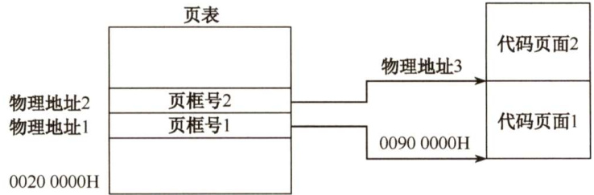  

05.下图给出了页式和段式两种地址变换示意（假定段式变换对每段不进行段长越界检查，即段表中无段长信息)。  

1）指出这两种变换各属于何种存储管理。  
2）计算出这两种变换所对应的物理地址。  

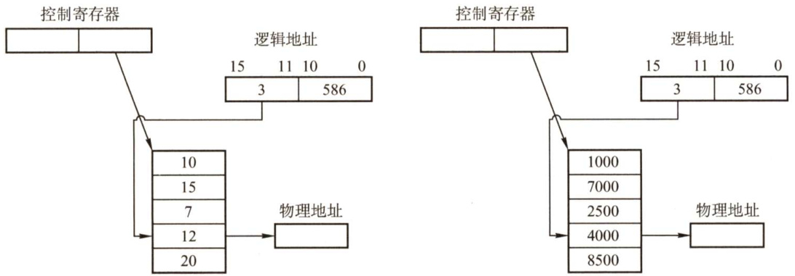  

06.在一个段式存储管理系统中，其段表见下表A。试求表B中的逻辑地址所对应的物理地址。  

表A段表  

<html><body><table><tr><td>段号</td><td>内存始址</td><td>段 长</td></tr><tr><td>0</td><td>210</td><td>500</td></tr><tr><td>1</td><td>2350</td><td>20</td></tr><tr><td>2</td><td>100</td><td>90</td></tr><tr><td>3</td><td>1350</td><td>590</td></tr><tr><td>4</td><td>1938</td><td>95</td></tr></table></body></html>  

表B逻辑地址  

<html><body><table><tr><td>段号</td><td>段内位移</td></tr><tr><td>0</td><td>430</td></tr><tr><td>1</td><td>10</td></tr><tr><td>2</td><td>500</td></tr><tr><td>3</td><td>400</td></tr><tr><td>4</td><td>112</td></tr><tr><td>5</td><td>32</td></tr></table></body></html>  

07．页式存储管理允许用户的编程空间为32个页面（每页1KB)，主存为16KB。如有一用户程序为10页长，且某时刻该用户程序页表见右表。若分别遇到三个逻辑地址0AC5H，1AC5H，3AC5H处的操作，计算并说明存储管理系统将如何处理。  

<html><body><table><tr><td>逻辑页号</td><td>物理块号</td></tr><tr><td>0</td><td>8</td></tr><tr><td>1</td><td>7</td></tr><tr><td>2</td><td>4</td></tr><tr><td>3</td><td>10</td></tr></table></body></html>  

08.在某页式管理系统中，假定主存为64KB，分成16块，块号为 $0,1,2,\cdots$ ，15。设某进程有4页，其页号为0,1，2,3，被分别装入主存的第9,0,1,14块。  

1）该进程的总长度是多大？  
2）写出该进程每页在主存中的始址。  

3）若给出逻辑地址(0,0),(1,72),(2,1023),(3,99)，请计算出相应的内存地址(括号内的第一个数为十进制页号，第二个数为十进制页内地址)。  

09．某操作系统存储器采用页式存储管理，页面大小为64B，假定一进程的代码段的长度为702B，页表见表A，该进程在快表中的页表见表B。现进程有如下访问序列：其逻辑地址为八进制的0105,0217,0567,01120,02500。试问给定的这些地址能否进行转换？  

表A进程页表  

<html><body><table><tr><td>页号</td><td>页帧号</td><td>页号</td><td>页帧号</td></tr><tr><td>0</td><td>F0</td><td>6</td><td>F6</td></tr><tr><td></td><td>F1</td><td>7</td><td>F7</td></tr><tr><td>2</td><td>F2</td><td>8</td><td>F8</td></tr><tr><td>3</td><td>F3</td><td>9</td><td>F9</td></tr><tr><td>4</td><td>F4</td><td>10</td><td>F10</td></tr><tr><td>5</td><td>F5</td><td>6</td><td>F6</td></tr></table></body></html>  

表B快表  

<html><body><table><tr><td colspan="2">衣B 快表</td></tr><tr><td>页号</td><td>页帧号</td></tr><tr><td>0</td><td>F0</td></tr><tr><td>1</td><td>F1</td></tr><tr><td>2</td><td>F2</td></tr><tr><td>3</td><td>F3</td></tr><tr><td>4</td><td>F4</td></tr></table></body></html>  

10.某一页式系统，其页表存放在主存中：  

1）若对主存的一次存取需 $1.5\upmu\mathrm{s}$ ，问实现一次页面访问时存取时间是多少？  

2）若系统有快表且其平均命中率为 $85\%$ ，而页表项在快表中的查找时间可忽略不计，试问此时的存取时间为多少？  

11．在页式、段式和段页式存储管理中，当访问一条指令或数据时，各需要访问内存几次？其过程如何？假设一个页式存储系统具有快表，多数活动页表项都可以存在其中。若页表存放在内存中，内存访问时间是 $1\upmu\mathrm{s}$ ，检索快表的时间为 $0.2\upmu\up s$ ，若快表的命中率是$85\%$ ，则有效存取时间是多少？若快表的命中率为 $50\%$ ，则有效存取时间是多少？  

12．在一个分页存储管理系统中，地址空间分页（每页1KB），物理空间分块，设主存总容量是256KB，描述主存分配情况的位示图如下图所示（0表示未分配，1表示已分配），此时作业调度程序选中一个长为5.2KB的作业投入内存。试问：  

1）为该作业分配内存后（分配内存时，首先分配低地址的内存空间），请填写该作业的页表内容。  

2）页式存储管理有无内存碎片存在？若有，会存在哪种内存碎片？为该作业分配内存后，会产生内存碎片吗？如果产生，那么大小为多少？  

3）假设一个64MB内存容量的计算机，采用页式存储管理（页面大小为4KB），内存分配采用位示图方式管理，请问位示图将占用多大的内存？  

<html><body><table><tr><td>1 1 1 1 1 1 1 1 1 1 1 1 1 1 1 1</td></tr><tr><td>1 一 1 0 1 1 1 1 1 0 0 0 1 1</td></tr><tr><td>1 一 0 0 0 0 0 0 0 0 0 0 1 1 1 1</td></tr><tr><td>1 1 1 1 一 0 0 0 0 一 0 0 0 1 0 1</td></tr><tr><td>0 1 0 1 1 0 1 1 0 一 一 0 一 1 0 1</td></tr><tr><td>0 0 0 0 0 0 0 0 0 0 0 0 0 0 0</td></tr><tr><td>0 1 1 1 1 1 1 0 0 0 0 0 0 0 0 0</td></tr><tr><td>1</td></tr></table></body></html>  

<html><body><table><tr><td>页号</td><td>块号（从0开始编址）</td></tr><tr><td></td><td></td></tr><tr><td></td><td></td></tr><tr><td></td><td></td></tr><tr><td></td><td></td></tr><tr><td></td><td></td></tr></table></body></html>  

#### 3.1.9 答案与解析  

#### 一、单项选择题  

01.D  

选项A、B显然错误，选项C中编址空间的大小取决于硬件的访存能力，一般由地址总线宽度决定。选项D中虚拟内存的管理需要由相关的硬件和软件支持，有请求分页页表机制、缺页中断机构、地址变换机构等。  

02.B  

进程正在进行I/O操作时不能换出主存，否则其I/O数据区将被新换入的进程占用，导致错误。不过可以在操作系统中开辟I/O缓冲区，将数据从外设输入或将数据输出到外设的I/O活动在系统缓冲区中进行，这时系统缓冲区与外设IO时，进程交换不受限制。  

03.A  

覆盖和交换的提出就是为了解决主存空间不足的问题，但不是在物理上扩充主存，只是将暂时不用的部分换出主存，以节省空间，从而在逻辑上扩充主存。  

04.C  

段页式系统中，进程首先划分为段，每段再进一步划分为页。  

05.C  

内存保护是内存管理的一部分，是操作系统的任务，但是出于安全性和效率考虑，必须由硬件实现，所以需要操作系统和硬件机构的合作来完成。  

06.A  

覆盖技术是早期在单一连续存储管理中使用的扩大存储容量的一种技术，它同样可用于固定分区分配的存储管理。  

07.D  

将上邻空闲区、下邻空闲区和回收区合并为一个空闲区，因此空闲区数反而减少了一个。而仅有上邻空闲区或下邻空闲区时，空闲区数并不减少。  

08.C  

最佳适配算法是指，每次为作业分配内存空间时，总是找到能满足空间大小需要的最小空闲分区给作业，可以产生最小的内存空闲分区。从图中可以看出应选择大小为60KB的空闲分区，其首地址为 $330\mathrm{K}$ 。  

09.B  

段号为2，其对应的首地址为480K，段长度为20K，大于154，所以逻辑地址(2,154)对应的物理地址为 $480\mathrm{K}+154$ 。  

10.D  

静态装入是指在编程阶段就把物理地址计算好。  

可重定位是指在装入时把逻辑地址转换成物理地址，但装入后不能改变  

动态重定位是指在执行时再决定装入的地址并装入，装入后有可能会换出，所以同一个模块在内存中的物理地址是可能改变的。  

动态重定位是指在作业运行过程中执行到一条访存指令时，再把逻辑地址转换为主存中的物理地址，实际中是通过硬件地址转换机制实现的。  

11.A  

固定分区方式中，作业装入后位置不再改变，可以采用静态重定位。其余三种管理方案均可能在运行过程中改变程序位置，静态重定位不能满足其要求。  

12.A  

在可变分区管理中，回收空闲区时采用拼接技术对空闲区进行合并。  

13.A  

按页表内容可知，逻辑地址0对应块号2，页大小为4KB，因此转换成的物理地址为 $2{\times}4\mathsf{K}=$ $8\mathsf{K}=8192$ o  

14.B  

分页式存储管理有内部碎片，分段式存储管理有外部碎片，固定分区存储管理方式有内部碎片，段页式存储管理方式有内部碎片。  

15.B  

多进程的执行通过内存保护实现互不干扰，如页式管理中有页地址越界保护，段式管理中有段地址越界保护。  

16.A  

最佳适应算法要求从剩余的空闲分区中选出最小且满足存储要求的分区，空闲区应按长度递增登记在空闲区表中。  

17.C  

首次适应算法的空闲分区按地址递增的次序排列。  

18.C  

页表和段表同样存储在内存中，系统提供给用户的物理地址空间为总空间大小减去页表或段表的长度。由于页表和段表的长度不能确定，所以提供给用户的物理地址空间大小也不能确定。  

19.B  

内存分页管理是在硬件和操作系统层面实现的，对用户、编译系统、连接装配程序等上层是不可见的。  

20.D  

页表的功能由一组专门的存储器实现，其始址放在页表基址寄存器（PTBR）中。这样才能满足在地址变换时能够较快地完成逻辑地址和物理地址之间的转换。  

21.A  

为使地址转换不影响到指令的执行速度，必须有硬件地址变换结构的支持，即需在系统中增设一个重定位寄存器，用它来存放程序（数据）在内存中的始址。在执行程序或访问数据时，真正访问的内存地址由相对地址与重定位寄存器中的地址相加而成，这时将始址存入重定位寄存器，之后的地址访问即可通过硬件变换实现。因为系统处理器在同一时刻只能执行一条指令或访问数据，所以为每道程序（数据）设置一个寄存器没有必要（同时也不现实，因为寄存器是很昂贵的硬件，而且程序的道数是无法预估的)，而只需在切换程序执行时重置寄存器内容。  

22.B  

分段是指在用户编程时，将程序按照逻辑划分为几个逻辑段。  

23.A  

程序的动态链接与程序的逻辑结构相关，分段存储管理将程序按照逻辑段进行划分，因此有利于其动态链接。其他的内存管理方式与程序的逻辑结构无关。  

24.B、C  

编译后一个目标程序所限定的地址范围称为该作业的逻辑地址空间。换句话说，地址空间仅指程序用来访问信息所用的一系列地址单元的集合。这些单元的编号称为逻辑地址。通常，编译地址都是相对始址“0”的，因而也称逻辑地址为相对地址。  

注意：区分编译后形成的逻辑地址和链接后形成的最终逻辑地址。  

25.D  

可重入程序主要是通过共享来使用同一块存储空间的，或通过动态链接的方式将所需的程序段映射到相关进程中去，其最大的优点是减少了对程序段的调入/调出，因此减少了对换数量。  

26.A  

实现分页、分段和段页式存储管理需要特定的数据结构支持，如页表、段表等。为了提高性能，还需要硬件提供快存和地址加法器等，代价高。分区存储管理是满足多道程序设计的最简单的存储管理方案，特别适合嵌入式等微型设备。  

27.A  

动态分区时，在系统启动后，除操作系统占据一部分内存外，其余所有内存空间是一个大空闲区，称为自由空间。若作业申请内存，则从空闲区中划出一个与作业需求量相适应的分区分配给该作业，将作业创建为进程，在作业运行完毕后，再收回释放的分区。  

28.D  

内存管理是为了提高内存的利用率，引入覆盖和交换技术，即在较小的内存空间中采用重复  

使用的方法来节省存储空间，但它付出的代价是需要消耗更多的处理器时间，因此实际上是一种以时间换空间的技术。为此，从节省处理器时间上来讲，换入、换出速度越快，付出的时间代价就越小，反之就越大，当时间代价大到一定程度时，覆盖和交换技术就没有了意义。  

29.B  

在非虚拟存储器中，作业必须全部装入内存且在运行过程中也一直驻留内存；在虚拟存储器中，作业不必全部装入内存且在运行过程中也不用一直驻留内存，这是虚拟存储器和非虚拟存储器的主要区别之一。  

30.C  

页面大，用于管理页面的页表就少，但是页内碎片会比较大；页面小，用于管理页面的页表就大，但是页内碎片小。通过适当的计算可以获得较佳的页面大小和较小的系统开销。  

31.B  

页式管理中很重要的一个问题是页面大小如何确定。确定页面大小有很多因素，如进程的平均大小、页表占用的长度等。而一旦确定，所有的页面就是等长的（一般取2的整数幂倍)，以便易于系统管理。  

32.A  

引入段式存储管理方式，主要是为了满足用户的下列要求：方便编程、分段共享、分段保护动态链接和动态增长。  

33.C  

存储管理的目的有两个：一个是方便用户，二是提高内存利用率。  

34.B  

这里是指主存的访问，不是主存的分配。对主存的访问是以字节或字为单位的。例如，在页式管理中，不仅要知道块号，而且要知道页内偏移。  

35.B  

在一般情况下，一个作业在装入时分配到的内存空间和它的地址空间是不一致的，因此，作业在CPU上运行时，其所要访问的指令、数据的物理地址和逻辑地址是不同的。显然，若在作业装入或执行时，不对有关的地址部分加以相应的修改，则会导致错误的结果。这种将作业的逻辑地址变为物理地址的过程称为地址重定位。  

36.A  

单用户连续分配管理方式只适用于单用户、单任务的操作系统，不适用于多道程序设计。  

37.A  

在分页存储管理中，逻辑地址分配是按页为单位进行分配的，而主存的分配即物理地址分配是以内存块为单位分配的。  

38.C  

在段式分配中，取一次数据时先从内存查找段表，再拼成物理地址后访问内存，共需要2次内存访问。  

39.B  

在段页式分配中，取一次数据时先从内存查找段表，再访问内存查找相应的页表，最后拼成物理地址后访问内存，共需要3次内存访问。  

40.B  

分页存储管理中，作业地址空间是一维的，即单一的线性地址空间，程序员只需要一个记忆符来表示地址。在分段存储分配管理中，段之间是独立的，而且段长不定长，而页长是固定的，因此作业地址空间是二维的，程序员在标识一个地址时，既需给出段名，又需给出段内地址。简言之，确定一个地址需要几个参数，作业地址空间就是几维的。  

41.A  

在多个进程并发执行时，所有进程的页表大多数驻留在内存中，在系统中只设置一个页表寄存器（PTR)，它存放页表在内存中的始址和长度。平时，进程未执行时，页表的始址和页表长度存放在本进程的PCB中，当调度到某进程时，才将这两个数据装入页表寄存器中。每个进程都有一个单独的逻辑地址，有一张属于自己的页表。  

42.A  

在分段存储管理方式中，以段为单位进行分配，每段是一个连续存储区，每段不一定等长，段与段之间可连续，也可不连续。  

43.B  

段页式存储管理兼有页式管理和段式管理的优点，采用分段方法来分配和管理用户地址空间，采用分页方法来管理物理存储空间。但它的开销要比段式和页式管理的开销大。  

44.D  

解析请扫右侧二维码查阅。  

45.C  

I正确：关闭TLB后，每当访问一条指令或存取一个操作数时都要先访问页表（内存中），得到物理地址后，再访问一次内存进行相应操作。Ⅱ错误：记住，凡是分区固定的都会产生内部碎片，而无外部碎片。II错误：页式存储管理对于用户是透明的。IV错误：静态重定位是在程序运行之前由装配程序完成的，必须分配其要求的全部连续内存空间。而页式存储管理方案是将程序离散地分成若干页（块)，从而可以将程序装入不连续的内存空间，显然静态重定位不能满足其要求。  

46.A  

每个进程都拥有自已独立的进程空间，若一个进程在运行时所产生的地址在其地址空间之外，则发生地址越界，因此需要进行界地址保护，即当程序要访问某个内存单元时，由硬件检查  

是否允许，若允许则执行，否则产生地址越界中断。  

47.C  

分段存储管理的逻辑地址分为段号和位移量两部分，段内位移的最大值就是最大段长。地址长度为32位，段号占8位，因此位移量占 $32-8=24$ 位，因此最大段长为 $2^{24}\mathrm{B}$ o  

48.B  

最佳适配算法是指每次为作业分配内存空间时，总是找到能满足空间大小需要的最小空闲分区给作业，可以产生最小的内存空闲分区。下图显示了这个过程的主存空间变化。  

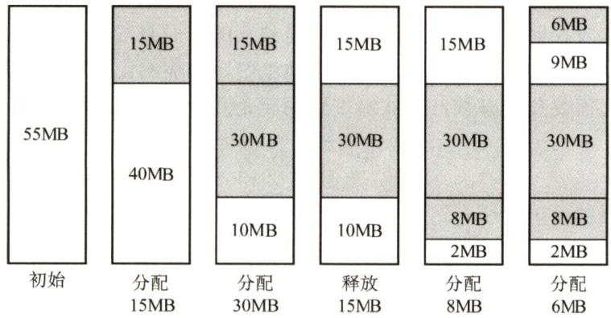  

图中，灰色部分为分配出去的空间，白色部分为空闲区。这样，容易发现，此时主存中最大空闲分区的大小为9MB。  

49.B  

页大小为 $2^{10}\mathbf{B}$ ，页表项大小为2B，因此一页可以存放 $2^{9}$ 个页表项，逻辑地址空间大小为 $2^{16}$ 页，即共需 $2^{16}$ 个页表项，因此需要 $2^{16}/2^{9}=2^{7}=128$ 个页面保存页表项，即页目录表中包含表项的个数至少是128。  

50.A  

簇的总数为 $10\mathrm{GB}/4\mathrm{KB}=2.5\mathrm{M}$ ，用一位标识一簇是否被分配，整个磁盘共需要 $2.5\mathrm{Mb}$ ，即需要 $2.5\mathrm{M}/8=320\mathrm{KB}$ ，因此共需要 $320\mathrm{KB}/4\mathrm{KB}=80$ 簇，选A。  

51.D  

解析请扫右侧二维码查阅。  

52.C  

编译后的程序需要经过链接才能装载，而链接后形成的目标程序中的地址也就是逻辑地址。以C语言为例：C程序经过预处理 $\rightarrow$ 编译 $\rightarrow$ 汇编 $\rightarrow$ 链接产生了可执行文件，其中链接的前一步是产生可重定位的二进制目标文件。C语言采用源文件独立编译的方法，如程序main.c,filel.c,file2.c,filel.h,file2.h在链接的前一步生成了main.o,filel.o,file2.o,这些目标模块的逻辑地址都从0开始，但只是相对于该模块的逻辑地址。链接器将这三个文件、libc 和其库文件链接成一个可执行文件，从而形成整个程序的完整逻辑地址空间。  

例如，filel.o 的逻辑地址为 $0\sim1023$ ，main.o 的逻辑地址为 $0\sim1023$ ，假设链接时将 filel.o链接在main.o之后，则链接之后filel.o对应的逻辑地址应为 $1024{\sim}2047$ 。  

53.D  

分段系统的逻辑地址 $A$ 到物理地址 $E$ 之间的地址变换过程如下：  

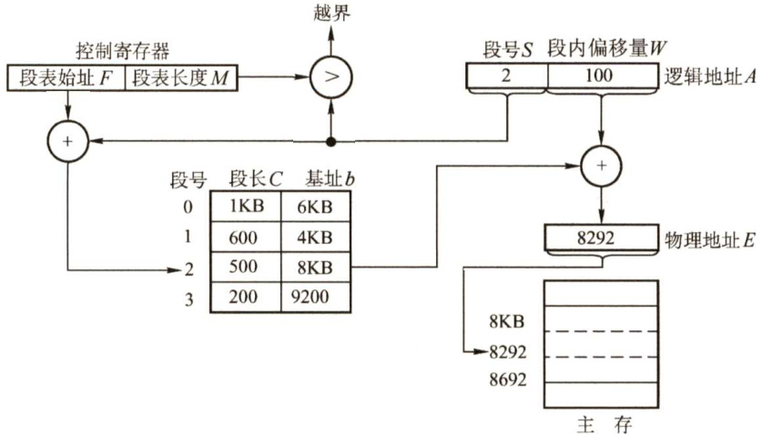  

$\textcircled{1}$ 从逻辑地址 $A$ 中取出前几位为段号S，后几位为段内偏移量W，注意段式存储管理的题目中，逻辑地址一般以二进制数给出，而在页式存储管理中，逻辑地址一般以十进制数给出，读者要具体问题具体分析。  

$\textcircled{2}$ 比较段号 $s$ 和段表长度 $M$ ，若 $S{\ge}M$ ，则产生越界异常，否则继续执行。  

$\textcircled{3}$ 段表中段号 $s$ 对应的段表项地址 $\mathbf{\Sigma}=\mathbf{\Sigma}$ 段表始址 $F+$ 段号 $s\times$ 段表项长度 $M$ ，取出该段表项的前几位得到段长 $c$ 。若段内偏移量 $\geq C$ ，则产生越界异常，否则继续执行。从这句话可以看出，段表项实际上只有两部分，前几位是段长，后几位是始址。  

$\textcircled{4}$ 取出段表项中该段的基址 $b$ ，计算 $E=b+W$ ，用得到的物理地址 $E$ 去访问内存。  
题目中段号为2的段长为300，小于段内地址400，因此发生越界异常，D正确。  

54.B  

回收始址为 $60\mathrm{K}$ 、大小为140KB的分区时，它与表中第一个分区和第四个分区合并，成为始址为20K、大小为380KB的分区，剩余3个空闲分区。在回收内存后，算法会对空闲分区链按分区大小由小到大进行排序，表中的第二个分区排第一，所以选择B。  

55.B  

段的共享是通过两个作业的段表中相应表项指向被共享的段的同一个物理副本来实现的，因此在内存中仅保存一份段S的内容，A正确。段S对于进程 $\mathbf{P}_{1}$ $\mathbf{P}_{2}$ 来说，使用位置可能不同，所以在不同进程中的逻辑段号可能不同，B错误。段表项存放的是段的物理地址（包括段始址和段长度)，对于共享段S来说物理地址唯一，C正确。为了保证进程可以顺利使用段S，段S必须确保在没有任何进程使用它（可在段表项中设置共享进程计数）后才能被删除，D正确。  

56.A  

题中给出的是十六进制地址，首先将它转化为二进制地址，然后用二进制地址去匹配题中对  

应的地址结构。转换为二进制地址和地址结构的对应关系如下图所示。  

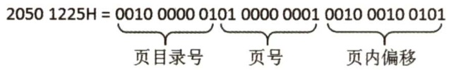  

前10位、 $11\sim20$ 位、 $21\sim32$ 位分别对应页目录号、页号和页内偏移。把页目录号、页号单独拿出，转换为十六进制时缺少的位数在高位补零，00001000 0001，000100000001分别对应081H，101H，选项A正确。  

57.C  

最佳适应算法总是匹配与当前大小要求最接近的空闲分区，但是大多数情况下空闲分区的大小不可能完全和当前要求的大小相等，几乎每次分配内存都会产生很小的难以利用的内存块，所以最佳适应算法最容易产生最多的内存碎片，C正确。  

58.B  

在多级页表中，页表基址寄存器存放的是顶级页表的起始物理地址，故存放的是一级页表的起始物理地址。  

#### 二、综合应用题  

01.【解答】  

动态分区和固定分区分配方式相比，内存空间的利用率要高一些。但是，总会存在一些分散的较小空闲分区，即外部碎片，它们存在于已分配的分区之间，不能充分利用。可以采用拼接技术加以解决。固定分区分配方式存在内部碎片，而无外部碎片；动态分区分配方式存在外部碎片，无内部碎片。  

02.【解答】  

采用首次适应算法时，96KB大小的作业进入4号空闲分区，20KB大小的作业进入1号空闲分区，这时空闲分区如下表所示。  

<html><body><table><tr><td>分区号</td><td>大小</td><td>始址</td></tr><tr><td>1</td><td>12KB</td><td>120K</td></tr><tr><td>2</td><td>10KB</td><td>150K</td></tr><tr><td>3</td><td>5KB</td><td>200K</td></tr><tr><td>4</td><td>122KB</td><td>316K</td></tr><tr><td>5</td><td>96KB</td><td>530K</td></tr></table></body></html>  

此时再无空闲分区可以满足 $200\mathrm{KB}$ 大小的作业，所以该作业序列请求无法满足。  

采用最佳适应算法时，作业序列分别进入5,1,4号空闲分区，可以满足其请求。分配处理之后的空闲分区表见下表：  

<html><body><table><tr><td>分区号</td><td>大小</td><td>始址</td></tr><tr><td>1</td><td>12KB</td><td>120K</td></tr><tr><td>2</td><td>10KB</td><td>150K</td></tr><tr><td>3</td><td>5KB</td><td>200K</td></tr><tr><td>4</td><td>18KB</td><td>420K</td></tr></table></body></html>  

03.【解答】  

1）最先适配的内存分配情况如下图中的(a)所示。内存中的空块为：第一块：始址290K，大小10KB；第二块：始址400K，大小112KB。  

2）最佳适配的内存分配情况如下图中的(b)所示。内存中的空块为：第一块：始址240K，大小60KB；第二块：超始地址450K，大小62KB。  

3）若随后又要申请80KB，则最先适配算法可以分配成功，而最佳适配算法则没有足够大的空闲区分配。这说明最先适配算法尽可能地使用了低地址部分的空闲区域，留下了高地址部分的大的空闲区，更有可能满足进程的申请。  

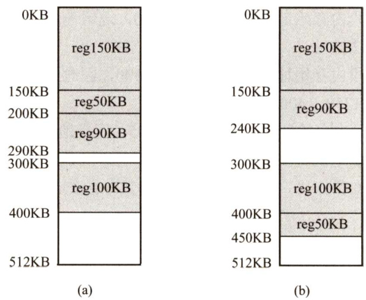  

04.【解答】  

1）因为主存按字节编址，页内偏移量是12位，所以页大小为 $2^{12}\mathrm{B}=4\mathrm{KB}$ o页表项数为 $2^{20}$ ，因此该一级页表最大为 $2^{20}\times4\mathrm{B}=4\mathrm{MB}$ 。  

2）页目录号可表示为((unsignedint)(LA)) $1>>22$ & $0\mathrm{x}3\mathrm{FF}$ 。 页表索引可表示为(((unsignedint)(LA)) $_{1>>12}$ & $0\mathrm{x}3\mathrm{FF}$ 。  

3）代码页面1的逻辑地址为 $0000~8000\mathrm{H}$ ，表明其位于第8个页处，对应页表中的第8个页表项，所以第8个页表项的物理地址 $\mathbf{\Sigma}=\mathbf{\Sigma}$ 页表始址 $+8\times$ 页表项的字节数 $=002000000+$ $8{\times}4=00200020\mathrm{H}$ 。由此可得如下图所示的答案。  

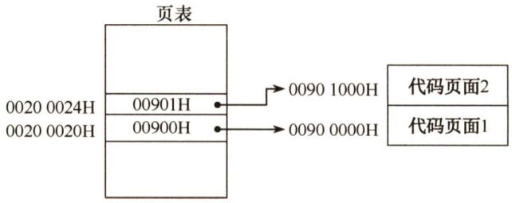  

05.【解答】  

1）由题图所示的逻辑地址结构可知：页或段的最大个数为 $2^{5}=32$ 。如果左图是段式管理，那么段始址12加上偏移量586，远超第1段的段始址15，超过第4段的段始址20，所以左图是页式变换，而右图满足段式变换。对于页式管理，由逻辑地址的位移量位数可知，一页的大小为2KB。  

2）对图中的页式地址变换，其物理地址为 $12{\times}2048+586=25162$ ；对图中的段式地址变换，其物理地址为 $4000+586=4586$ 。  

06.【解答】  

1）由段表知，第0段内存始址为210，段长为500，因此逻辑地址(0,430)是合法地址，对应的物理地址为 $210+430=640$ 。  
2）由段表知，第1段内存始址为2350，段长为20，因此逻辑地址(1，10)是合法地址，对应的物理地址为 $2350+10=2360$ 。  
3）由段表知，第2段内存始址为100，段长为90，逻辑地址(2，500)的段内位移500超过了段长，因此为非法地址。  
4）由段表知，第3段内存始址为1350，段长为590，因此逻辑地址(3，400)是合法地址，对应的物理地址为 $1350+400=1750$ 。  
5）由段表知，第4段内存始址为1938，段长为95，逻辑地址(4,112)的段内位移112超过了段长，因此为非法地址。  
6）由段表知，不存在第5段，因此逻辑地址(5,32)为非法地址。  

07.【解答】  

页面大小为1KB，所以低10位为页内偏移地址；用户编程空间为32个页面，即逻辑地址高5位为虚页号；主存为16个页面，即物理地址高4位为物理块号。  

逻辑地址0AC5H转换为二进制是000101011000101B，虚页号为2(00010B)，映射至物理块号4，因此系统访问物理地址12C5H(0100101100 0101B)。  

逻辑地址1AC5H转换为二进制是00110101100 0101B，虚页号为6(00110B)，不在页面映射表中，会产生缺页中断，系统进行缺页中断处理。  

逻辑地址3AC5H转换为二进制是011101011000101B，页号为14，而该用户程序只有10页，因此系统产生越界中断。  

注意：在将十六进制地址转换为二进制地址时，我们可能会习惯性地写为16 位，这是容易犯错的细节。例如，题中的逻辑地址为15 位，物理地址为14位。逻辑地址0AC5H的二进制表示为 $000\ 1010\ 1100\ 0101\mathrm{B}$ ，对应物理地址12C5H的二进制表示为 $01001011000101\mathbf{B}$ 。这一点应该引起注意。  

08.【解答】  

1)页面的大小为 $(64/16)\mathrm{KB}=4\mathrm{KB}$ ，该进程共有4页，所以该进程的总长度为 $4{\times}4\mathrm{KB}=16\mathrm{KB}$ o  
2）页面大小为4KB，因此低12位为页内偏移地址；主存分为16块，因此内存物理地址高4位为主存块号。页号为0的页面被装入主存的第9块，因此该地址在内存中的始址为10010000 00000000B，即 $9000\mathrm{H}$ o  

页号为1的页面被装入主存的第0块，因此该地址在内存中的始址为 0000 0000 00000000B，即 $0000\mathrm{H}$ 0页号为2的页面被装入主存的第1块，因此该地址在内存中的始址为 00010000 00000000，即 $1000\mathrm{H}$ 0页号为3的页面被装入主存的第14块，因此该地址在内存中的始址为1110 0000 00000000，即 $\mathrm{E000H}$ 。3）逻辑地址为 $(0,0)$ ，因此内存地址为 $\mathbf{(9,0)}=1001000000000000000\mathbf{B}$ ，即 $9000\mathrm{H}$ 0逻辑地址为(1,72)，因此内存地址为 $(0,72)={\bf0000000001001000B}$ ，即 $0048\mathrm{H}$ 。逻辑地址为(2,1023)，因此内存地址为 $(1,1023)={\bf00010011111111111}11111$ 1，即13FFH。逻辑地址为(3,99)，因此内存地址为 $(14,99)={\bf1110000}1100011$ ，即 $\mathrm{E0}63\mathrm{H}$ 。  

09.【解答】  

要注意题目中的逻辑地址使用哪种进制的数给出，若是十进制，则一般通过整数除法和求余得到页号和页内偏移，若用其他进制给出，则一般转换成二进制，然后按照地址结构划分为页号部分和页内偏移部分，再把页号和页内偏移计算出来。  

页面大小为64B，因此页内位移为6位，进程代码段长度为702B，因此需要11个页面，编号为 $0{\sim}10$ o  

1）八进制逻辑地址0105的二进制表示为001000101B。逻辑页号为1，此页号可在快表中查找到，得页帧号为F1；页内位移为5，因此物理地址为(F1,5)。  
2）八进制逻辑地址0217的二进制表示为010001111B。逻辑页号为2，此页号可在快表中查找到，得页帧号为F2；页内位移为15，因此物理地址为(F2,15)。  
3）八进制逻辑地址0567的二进制表示为 $101110111\mathbf{B}$ 。逻辑页号为5，此页号不在快表中，在内存页表中可以查找到，得页帧号为F5；页内位移为55，因此物理地址为(F5,55)。  
4）八进制逻辑地址01120的二进制表示为 $0010\ 0101\ 0000\mathrm{B}$ 。逻辑页号为9，此页号不在快表中，在内存页表中可以查找到，得页帧号为F9;页内位移为16,因此物理地址为(F9,16)。  
5）八进制逻辑地址02500的二进制表示为010101000000B。逻辑页号为21，此页号已超过页表的最大页号10，因此产生越界中断。  

注意：根据题中条件无法得知逻辑地址位数，所以在其二进制表示中，其位数并不一致，只是根据八进制表示进行转换。若已知逻辑地址空间大小或位数，则二进制表示必须保持一致。  

10.【解答】  

页表在主存时，实现一次存取需要访问主存两次：第一次是访问页表，获得所需访问数据所在页面的物理地址；第二次才是根据这个物理地址存取数据。  

1）因为页表在主存，所以CPU必须访问主存两次，即实现一次页面访问的存取时间是  

$$
1.5{\times}2=3\upmu\mathrm{s}
$$  

2）系统增加快表后，在快表中找到页表项的概率为 $85\%$ ，所以实现一次页面访问的存取时间为  

$$
0.85{\times}(0+1.5)+(1^{-}0.85){\times}2{\times}1.5=1.725{\upmu}{\mathrm{s}}
$$  

11.【解答】  

1）在页式存储管理中，访问指令或数据时，首先要访问内存中的页表，查找到指令或数据  

所在页面对应的页表项，然后根据页表项查找访问指令或数据所在的内存页面。需要访问内存2次。  
段式存储管理同理，需要访问内存2次。  
段页式存储管理，首先要访问内存中的段表，然后访问内存中的页表，最后访问指令或数据所在的内存页面，需要访问内存3次。  
对于比较复杂的情况，如多级页表，若页表划分为 $N$ 级，则需要访问内存 $N+1$ 次。若系统中有快表，则在快表命中时，只需要访问内存1次。  

2）按1）中的访问过程分析，有效存取时间为  

$$
(0.2+1){\times}85\%+(0.2+1+1){\times}(1-85\%)=1.35\upmu\mathrm{s}
$$  

3）同理可计算得  

$$
(0.2+1){\times}50\%+(0.2+1+1){\times}(1-50\%)=1.7\upmu\mathrm{s}
$$  

从结果可以看出，快表的命中率对访存时间影响非常大。当命中率从 $85\%$ 降低到 $50\%$ 时，有效存取时间增加 $0.35\upmu\mathrm{s}$ 。因此在页式存储系统中，应尽可能地提高快表的命中率，从而提高系统效率。  

注意：在有快表的分页存储系统中，计算有效存取时间时，需注意访问快表与访问内存的时间关系。通常的系统中，先访问快表，未命中时再访问内存；在有些系统中，快表与内存的访问同时进行，当快表命中时就停止对内存的访问。这里题中未具体指明，我们按照前者进行计算。但若题中有具体的说明，计算时就应注意区别。  

12.【解答】  

1）位示图是利用二进制的一位来表示磁盘中一个盘块的使用情况，其值为“0”时表示对应盘块空闲，为“1”时表示已分配，地址空间分页，每页为1KB，则对应的盘块大小也为1KB，主存总容量为256KB，可分成256个盘块，长5.2KB的作业需要占用6页空间，假设页号与物理块号都从0开始，则根据位示图可得到页表内容如下：  

<html><body><table><tr><td>页号</td><td>块号</td></tr><tr><td>0</td><td>21</td></tr><tr><td>1</td><td>27</td></tr><tr><td>2</td><td>28</td></tr><tr><td>3</td><td>29</td></tr><tr><td>4</td><td>34</td></tr><tr><td>5</td><td>35</td></tr></table></body></html>  

2）页式存储管理中有内存碎片的存在，会存在内部碎片。为该作业分配内存后，会产生内存碎片，因为此作业大小为5.2KB，占6页，前5页满，最后一页只占0.2KB的空间，因此内存碎片得大小为 $1\mathrm{KB}-0.2\mathrm{KB}=0.8\mathrm{KB}$ 。  

3）64MB内存，一页大小为4KB，共可分成 $64\mathrm{K}\times1\mathrm{K}/4\mathrm{K}=2^{14}$ 个物理盘块，在位示图中每个盘块占1位，共占 $2^{14}$ 位空间，因为 $1\mathrm{B}=8$ 位，所以此位示图共占2KB空间的内存。