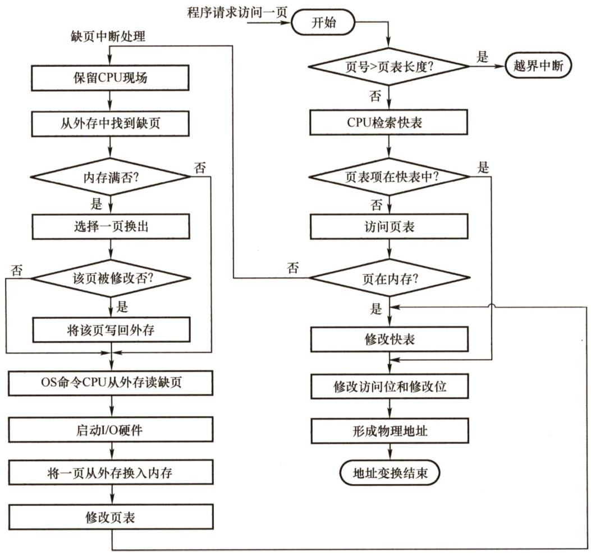
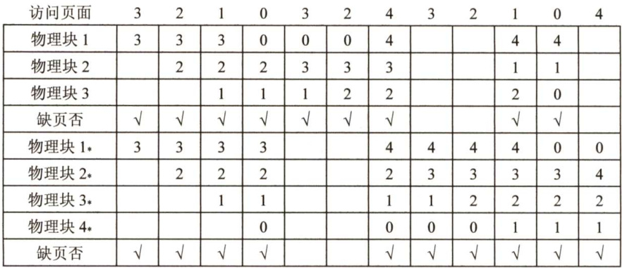
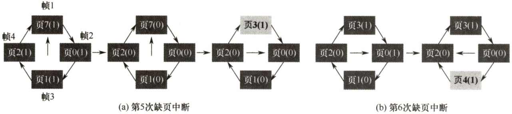
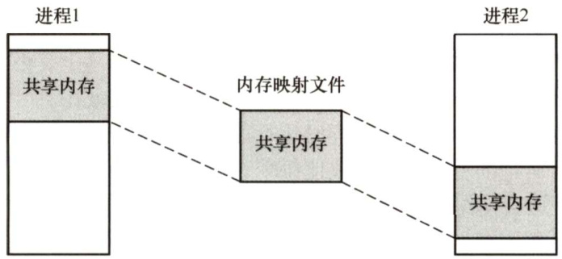
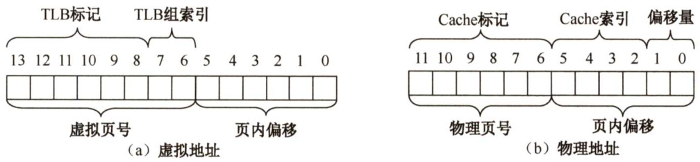
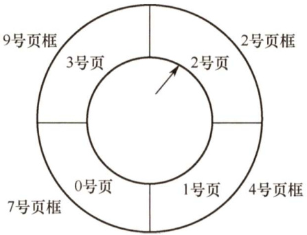
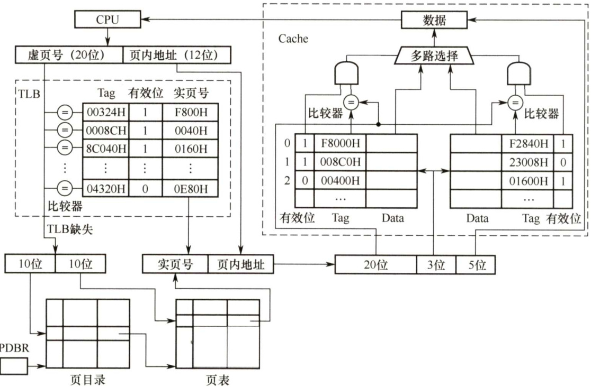
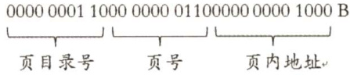

### 3.2 虚拟内存管理  

在学习本节时，请读者思考以下问题：  

1）为什么要引入虚拟内存？  
2）虚拟内存空间的大小由什么因素决定？  
3）虚拟内存是怎么解决问题的？会带来什么问题？  
读者要掌握虚拟内存解决问题的思想，了解各种替换算法的优劣，掌握虚实地址的变换方法。  

#### 3.2.1 虚拟内存的基本概念  

#### 1．传统存储管理方式的特征  

3.1节讨论的各种内存管理策略都是为了同时将多个进程保存在内存中，以便允许进行多道程序设计。它们都具有以下两个共同的特征：1）一次性。作业必须一次性全部装入内存后，才能开始运行。这会导致两种情况： $\textcircled{1}$ 当作业很大而不能全部被装入内存时，将使该作业无法运行； $\textcircled{2}$ 当大量作业要求运行时，由于内存不足以容纳所有作业，只能使少数作业先运行，导致多道程序度的下降。2）驻留性。作业被装入内存后，就一直驻留在内存中，其任何部分都不会被换出，直至作业运行结束。运行中的进程会因等待I/O而被阻塞，可能处于长期等待状态。由以上分析可知，许多在程序运行中不用或暂时不用的程序（数据）占据了大量的内存空间，而一些需要运行的作业又无法装入运行，显然浪费了宝贵的内存资源。  

#### 2.局部性原理  

要真正理解虚拟内存技术的思想，首先须了解著名的局部性原理。从广义上讲，快表、页高速缓存及虚拟内存技术都属于高速缓存技术，这个技术所依赖的原理就是局部性原理。局部性原理既适用于程序结构，又适用于数据结构（更远地讲，Dijkstra关于“goto 语句有害”的著名论文也出于对程序局部性原理的深刻认识和理解)。  

局部性原理表现在以下两个方面：  

1）时间局部性。程序中的某条指令一旦执行，不久后该指令可能再次执行；某数据被访问过，不久后该数据可能再次被访问。产生的原因是程序中存在着大量的循环操作。  
2）空间局部性。一旦程序访问了某个存储单元，在不久后，其附近的存储单元也将被访问，即程序在一段时间内所访问的地址，可能集中在一定的范围之内，因为指令通常是顺序存放、顺序执行的，数据也一般是以向量、数组、表等形式簇聚存储的。  

时间局部性通过将近来使用的指令和数据保存到高速缓存中，并使用高速缓存的层次结构实现。空间局部性通常使用较大的高速缓存，并将预取机制集成到高速缓存控制逻辑中实现。虚拟内存技术实际上建立了“内存-外存”的两级存储器结构，利用局部性原理实现高速缓存。  

#### 3。虚拟存储器的定义和特征  

基于局部性原理，在程序装入时，仅须将程序当前要运行的少数页面或段先装入内存，而将其余部分暂留在外存，便可启动程序执行。在程序执行过程中，当所访问的信息不在内存时，由操作系统将所需要的部分调入内存，然后继续执行程序。另一方面，操作系统将内存中暂时不使用的内容换出到外存上，从而腾出空间存放将要调入内存的信息。这样，系统好像为用户提供了一个比实际内存容量大得多的存储器，称为虚拟存储器。  

之所以将其称为虚拟存储器，是因为这种存储器实际上并不存在，只是由于系统提供了部分装入、请求调入和置换功能后（对用户透明)，给用户的感觉是好像存在一个比实际物理内存大得多的存储器。但容量大只是一种错觉，是虚的。虚拟存储器有以下三个主要特征：  

1）多次性。是指无须在作业运行时一次性地全部装入内存，而允许被分成多次调入内存运行，即只需将当前要运行的那部分程序和数据装入内存即可开始运行。以后每当要运行到尚未调入的那部分程序时，再将它调入。多次性是虚拟存储器最重要的特征。  

2）对换性。是指无须在作业运行时一直常驻内存，在进程运行期间，允许将那些暂不使用的程序和数据从内存调至外存的对换区（换出)，待以后需要时再将它们从外存调至内存(换进)。正是由于对换性，才使得虚拟存储器得以正常运行。  

3）虚拟性。是指从逻辑上扩充内存的容量，使用户所看到的内存容量远大于实际的内存容量。这是虚拟存储器所表现出的最重要特征，也是实现虚拟存储器的最重要目标。  

#### 4.虚拟内存技术的实现  

虚拟内存技术允许将一个作业分多次调入内存。采用连续分配方式时，会使相当一部分内存空间都处于暂时或“永久”的空闲状态，造成内存资源的严重浪费，而且也无法从逻辑上扩大内存容量。因此，虚拟内存的实现需要建立在离散分配的内存管理方式的基础上。  

虚拟内存的实现有以下三种方式：）请求分页存储管理。  
，请求分段存储管理。  
）请求段页式存储管理。  

不管哪种方式，都需要有一定的硬件支持。一般需要的支持有以下几个方面：  

·一定容量的内存和外存。  
）页表机制（或段表机制)，作为主要的数据结构。  
·中断机构，当用户程序要访问的部分尚未调入内存时，则产生中断。  
·地址变换机构，逻辑地址到物理地址的变换。  

#### 3.2.2 请求分页管理方式  

请求分页系统建立在基本分页系统基础之上，为了支持虚拟存储器功能而增加了请求调页功能和页面置换功能。请求分页是目前最常用的一种实现虚拟存储器的方法。  

在请求分页系统中，只要求将当前需要的一部分页面装入内存，便可以启动作业运行。在作业执行过程中，当所要访问的页面不在内存中时，再通过调页功能将其调入，同时还可通过置换功能将暂时不用的页面换出到外存上，以便腾出内存空间。  

为了实现请求分页，系统必须提供一定的硬件支持。除了需要一定容量的内存及外存的计算机系统，还需要有页表机制、缺页中断机构和地址变换机构。  

#### 1．页表机制  

请求分页系统的页表机制不同于基本分页系统，请求分页系统在一个作业运行之前不要求全部一次性调入内存，因此在作业的运行过程中，必然会出现要访问的页面不在内存中的情况，如何发现和处理这种情况是请求分页系统必须解决的两个基本问题。为此，在请求页表项中增加了4个字段，如图3.20所示。  

<html><body><table><tr><td>页号</td><td>物理块号</td><td>状态位P</td><td>访问字段A</td><td>修改位M</td><td>外存地址</td></tr></table></body></html>  

增加的4个字段说明如下：  

·状态位 $P$ 。用于指示该页是否已调入内存，供程序访问时参考。·访问字段A。用于记录本页在一段时间内被访问的次数，或记录本页最近已有多长时间未  

被访问，供置换算法换出页面时参考。  

·修改位M。标识该页在调入内存后是否被修改过，以确定页面置换时是否写回外存。  
·外存地址。用于指出该页在外存上的地址，通常是物理块号，供调入该页时参考。  

#### 2.缺页中断机构  

在请求分页系统中，每当所要访问的页面不在内存中时，便产生一个缺页中断，请求操作系统将所缺的页调入内存。此时应将缺页的进程阻塞（调页完成唤醒)，若内存中有空闲块，则分配一个块，将要调入的页装入该块，并修改页表中的相应页表项，若此时内存中没有空闲块，则要淘汰某页（若被淘汰页在内存期间被修改过，则要将其写回外存)。  

缺页中断作为中断，同样要经历诸如保护CPU环境、分析中断原因、转入缺页中断处理程序、恢复CPU环境等几个步骤。但与一般的中断相比，它有以下两个明显的区别：  

·在指令执行期间而非一条指令执行完后产生和处理中断信号，属于内部异常。  
·一条指令在执行期间，可能产生多次缺页中断。  

#### 3.地址变换机构  

请求分页系统中的地址变换机构，是在分页系统地址变换机构的基础上，为实现虚拟内存，又增加了某些功能而形成的，如产生和处理缺页中断，及从内存中换出一页的功能等等。  

如图3.21所示，在进行地址变换时，先检索快表：  

  
图3.21请求分页中的地址变换过程  

·若找到要访问的页，则修改页表项中的访问位（写指令还需要重置修改位)，然后利用页表项中给出的物理块号和页内地址形成物理地址。  
·若未找到该页的页表项，则应到内存中去查找页表，再对比页表项中的状态位 $P$ ，看该页是否已调入内存，若页面已调入，则将该页的页表写入快表，若快表已满，则需采用某种算法替换。若页面未调入，则产生缺页中断，请求从外存把该页调入内存。  

#### 3.2.3 页框分配  

#### 1．驻留集大小  

对于分页式的虚拟内存，在进程准备执行时，不需要也不可能把一个进程的所有页都读入主存。因此，操作系统必须决定读取多少页，即决定给特定的进程分配几个页框。给一个进程分配的物理页框的集合就是这个进程的驻留集。需要考虑以下几点：  

1）分配给一个进程的页框越少，驻留在主存中的进程就越多，从而可提高CPU的利用率。  
2）若一个进程在主存中的页面过少，则尽管有局部性原理，缺页率仍相对较高。  
3）若分配的页框过多，则由于局部性原理，对该进程的缺页率没有太明显的影响。  

#### 2．内存分配策略  

在请求分页系统中，可采取两种内存分配策略，即固定和可变分配策略。在进行置换时，也可采取两种策略，即全局置换和局部置换。于是可组合出下面三种适用的策略。  

#### （1）固定分配局部置换  

为每个进程分配一定数目的物理块，在进程运行期间都不改变。所谓局部置换，是指如果进程在运行中发生缺页，则只能从分配给该进程在内存的页面中选出一页换出，然后再调入一页，以保证分配给该进程的内存空间不变。实现这种策略时，难以确定应为每个进程分配的物理块数目：太少会频繁出现缺页中断，太多又会降低CPU和其他资源的利用率。  

#### （2）可变分配全局置换  

先为每个进程分配一定数目的物理块，在进程运行期间可根据情况适当地增加或减少。所谓全局置换，是指如果进程在运行中发生缺页，系统从空闲物理块队列中取出一块分配给该进程，并将所缺页调入。这种方法比固定分配局部置换更加灵活，可以动态增加进程的物理块，但也存在端，如它会盲目地给进程增加物理块，从而导致系统多道程序的并发能力下降。  

#### （3）可变分配局部置换  

为每个进程分配一定数目的物理块，当某进程发生缺页时，只允许从该进程在内存的页面中选出一页换出，因此不会影响其他进程的运行。若进程在运行中频繁地发生缺页中断，则系统再为该进程分配若干物理块，直至该进程的缺页率趋于适当程度；反之，若进程在运行中的缺页率特别低，则可适当减少分配给该进程的物理块，但不能引起其缺页率的明显增加。这种方法在保证进程不会过多地调页的同时，也保持了系统的多道程序并发能力。当然它需要更复杂的实现，也需要更大的开销，但对比频繁地换入/换出所浪费的计算机资源，这种牺牲是值得的。  

页面分配策略在 2015 年的统考选择题中出现过，考查的是这三种策略的名称。往年很多读者看到这里时，由于认为不是重点，复习时便一带而过，最后在考试中失分。在这种基础题上失分是十分可惜的。再次提醒读者，考研成功的秘诀在于“反复多次”和“全面”。  

#### 3.物理块调入算法  

采用固定分配策略时，将系统中的空闲物理块分配给各个进程，可采用下述几种算法。  

1）平均分配算法，将系统中所有可供分配的物理块平均分配给各个进程。  

2）按比例分配算法，根据进程的大小按比例分配物理块。3）优先权分配算法，为重要和紧迫的进程分配较多的物理块。通常采取的方法是把所有可分配的物理块分成两部分：一部分按比例分配给各个进程；一部分则根据优先权分配。  

#### 4.调入页面的时机  

为确定系统将进程运行时所缺的页面调入内存的时机，可采取以下两种调页策略：  

1）预调页策略。根据局部性原理，一次调入若干相邻的页会比一次调入一页更高效。但若调入的一批页面中的大多数都未被访问，则又是低效的。因此，需要采用以预测为基础的预调页策略，将那些预计在不久之后便会被访问的页面预先调入内存。但目前预调页的成功率仅约 $50\%$ 。因此这种策略主要用于进程的首次调入，由程序员指出应先调入哪些页。  
2）请求调页策略。进程在运行中需要访问的页面不在内存，便提出请求，由系统将其所需页面调入内存。由这种策略调入的页一定会被访问，且这种策略比较易于实现，因此目前的虚拟存储器大多采用此策略。其缺点是每次仅调入一页，增加了磁盘I/O开销。  
预调入实际上就是运行前的调入，请求调页实际上就是运行期间调入。  

#### 5.从何处调入页面  

请求分页系统中的外存分为两部分：用于存放文件的文件区和用于存放对换页面的对换区。对换区采用连续分配方式，而文件区采用离散分配方式，因此对换区的磁盘IO速度比文件区的更快。这样，当发生缺页请求时，系统从何处将缺页调入内存就分为三种情况：  

1）系统拥有足够的对换区空间。可以全部从对换区调入所需页面，以提高调页速度。为此，在进程运行前，需将与该进程有关的文件从文件区复制到对换区。  
2）系统缺少足够的对换区空间。凡是不会被修改的文件都直接从文件区调入；而当换出这些页面时，由于它们未被修改而不必再将它们换出。但对于那些可能被修改的部分，在将它们换出时须调到对换区，以后需要时再从对换区调入（因为读比写的速度快)。  
3）UNIX方式。与进程有关的文件都放在文件区，因此未运行过的页面都应从文件区调入。曾经运行过但又被换出的页面，由于是放在对换区，因此在下次调入时应从对换区调入。进程请求的共享页面若被其他进程调入内存，则无须再从对换区调入。  

#### 6.如何调入页面  

当进程所访问的页面不在内存中时（存在位为0)，便向CPU发出缺页中断，中断响应后便转入缺页中断处理程序。该程序通过查找页表得到该页的物理块，此时如果内存未满，则启动磁盘IO，将所缺页调入内存，并修改页表。如果内存已满，则先按某种置换算法从内存中选出一页准备换出；如果该页未被修改过（修改位为0)，则无须将该页写回磁盘；但是，如果该页已被修改（修改位为1)，则必须将该页写回磁盘，然后将所缺页调入内存，并修改页表中的相应表项，置其存在位为1。调入完成后，进程就可利用修改后的页表形成所要访问数据的内存地址。  

#### 3.2.4 页面置换算法  

进程运行时，若其访问的页面不在内存中而需将其调入，但内存已无空闲空间时，就需要从内存中调出一页程序或数据，送入磁盘的对换区。  

选择调出页面的算法就称为页面置换算法。好的页面置换算法应有较低的页面更换频率，也就是说，应将以后不会再访问或以后较长时间内不会再访问的页面先调出。  

常见的置换算法有以下4种。  

#### 1.最佳（OPT）置换算法  

最佳置换算法选择的被淘汰页面是以后永不使用的页面，或是在最长时间内不再被访问的页面，以便保证获得最低的缺页率。然而，由于人们目前无法预知进程在内存下的若干页面中哪个是未来最长时间内不再被访问的，因而该算法无法实现。但可利用该算法去评价其他算法。  

假定系统为某进程分配了三个物理块，并考虑有页面号引用串：  

$\begin{array}{r}{7,0,1,2,0,3,0,4,2,3,0,3,2,1,2,0,1,7,0,1}\end{array}$  

进程运行时，先将7,0,1三个页面依次装入内存。当进程要访问页面2时，产生缺页中断，根据最佳置换算法，选择将第18次访问才需调入的页面7淘汰。然后，访问页面0时，因为它已在内存中，所以不必产生缺页中断。访问页面3时，又会根据最佳置换算法将页面1淘汰以此类推，如图3.22所示，从图中可以看出采用最佳置换算法时的情况。  

<html><body><table><tr><td>访问页面</td><td>7</td><td>0</td><td>1</td><td>2</td><td>0</td><td>3</td><td>0</td><td>4</td><td>2</td><td>3</td><td>0</td><td>3</td><td>2</td><td>1</td><td>2</td><td>0</td><td>1</td><td></td><td>7</td><td>0</td><td></td></tr><tr><td>物理块1</td><td>7</td><td>7</td><td>7</td><td>2</td><td></td><td>2</td><td></td><td>2</td><td></td><td></td><td>2</td><td></td><td></td><td>2</td><td></td><td></td><td></td><td></td><td>7</td><td></td><td></td></tr><tr><td>物理块2</td><td></td><td>0</td><td>0</td><td>0</td><td></td><td>0</td><td></td><td>4</td><td></td><td></td><td>0</td><td></td><td></td><td>0</td><td></td><td></td><td></td><td></td><td>0</td><td></td><td></td></tr><tr><td>物理块3</td><td></td><td></td><td>1</td><td>1</td><td></td><td>3</td><td></td><td>3</td><td></td><td></td><td>3</td><td></td><td></td><td>1</td><td></td><td></td><td></td><td></td><td>1</td><td></td><td></td></tr><tr><td>缺页否</td><td>√</td><td>√</td><td>√</td><td>√</td><td></td><td></td><td></td><td>√</td><td></td><td></td><td>√</td><td></td><td></td><td>√</td><td></td><td></td><td></td><td></td><td>√</td><td></td><td></td></tr></table></body></html>  

可以看到，发生缺页中断的次数为9，页面置换的次数为6。  

最长时间不被访问和以后被访问次数最小是不同的概念，在理解OPT算法时千万不要混淆。  

#### 2.先进先出（FIFO）页面置换算法  

优先淘汰最早进入内存的页面，即淘汰在内存中驻留时间最久的页面。该算法实现简单，只需把已调入内存的页面根据先后次序链接成队列，设置一个指针总是指向最老的页面。但该算法与进程实际运行时的规律不适应，因为在进程中，有的页面经常被访问。  

这里仍用上面的例子采用FIFO 算法进行页面置换。当进程访问页面2时，把最早进入内存的页面7换出。然后访问页面3时，把2,0,1中最先进入内存的页面0换出。由图3.23可以看出，利用FIFO 算法时进行了12次页面置换，比最佳置换算法正好多一倍。  

FIFO 算法还会产生所分配的物理块数增大而页故障数不减反增的异常现象，称为Belady 异常。只有FIFO 算法可能出现Belady异常，LRU 和OPT 算法永远不会出现Belady异常。  

<html><body><table><tr><td>访问页面</td><td>7</td><td>0</td><td>1</td><td>2</td><td>0</td><td>3</td><td>0</td><td>4</td><td>2</td><td>3</td><td>0</td><td>3</td><td>2</td><td>1</td><td>2</td><td>0</td><td>1</td><td>7</td><td>0</td><td>1</td></tr><tr><td>物理块1</td><td>7</td><td>7</td><td>7</td><td>2</td><td></td><td>2</td><td>2</td><td>4</td><td>4</td><td>4</td><td>0</td><td></td><td></td><td>0</td><td>0</td><td></td><td></td><td>7</td><td>7</td><td>7</td></tr><tr><td>物理块2</td><td></td><td>0</td><td>0</td><td>0</td><td></td><td>3</td><td>3</td><td>3</td><td>2</td><td>2</td><td>2</td><td></td><td></td><td>1</td><td>1</td><td></td><td></td><td>1</td><td></td><td>0</td></tr><tr><td>物理块3</td><td></td><td></td><td>1</td><td>1</td><td></td><td>1</td><td>0</td><td>0</td><td>0</td><td>3</td><td>3</td><td></td><td></td><td>3</td><td>2</td><td></td><td></td><td>2</td><td>2</td><td>1</td></tr><tr><td>缺页否</td><td>√</td><td>√</td><td>√</td><td>√</td><td></td><td>√</td><td>√</td><td>√</td><td>√</td><td>√</td><td>√</td><td></td><td></td><td>√</td><td>√</td><td></td><td></td><td>√</td><td>√</td><td></td></tr></table></body></html>  

如图3.24所示，页面访问顺序为 $3,2,1,0,3,2,4,3,2,1,0,4,$ 。若采用FIFO置换算法，当分配的物理块为3个时，缺页次数为9次；当分配的物理块为4个时，缺页次数为10次。分配给进程的物理块增多，但缺页次数不减反增。  

  
图3.24Belady异常  
图3.25LRU页面置换算法时的置换图  

#### 3.最近最久未使用（LRU）置换算法  

选择最近最长时间未访问过的页面予以淘汰，它认为过去一段时间内未访问过的页面，在最近的将来可能也不会被访问。该算法为每个页面设置一个访问字段，用来记录页面自上次被访问以来所经历的时间，淘汰页面时选择现有页面中值最大的予以淘汰。  

再对上面的例子采用LRU算法进行页面置换，如图3.25所示。进程第一次对页面2访问时，将最近最久未被访问的页面7置换出去。然后在访问页面3时，将最近最久未使用的页面1换出。  

<html><body><table><tr><td>访问页面</td><td>7</td><td>0</td><td>1</td><td>2</td><td>0</td><td>3</td><td>0</td><td>4</td><td>2</td><td>3</td><td>0</td><td>3</td><td>2</td><td>1</td><td>2</td><td>0</td><td>1</td><td>7</td><td>0</td><td></td><td>1</td></tr><tr><td>物理块1</td><td>7</td><td>7</td><td>7</td><td>2</td><td></td><td>2</td><td></td><td>4</td><td>4</td><td>4</td><td>0</td><td></td><td></td><td></td><td>1</td><td></td><td>1</td><td></td><td>1</td><td></td><td></td></tr><tr><td>物理块2</td><td></td><td>0</td><td>0</td><td>0</td><td></td><td>0</td><td></td><td>0</td><td>0</td><td>3</td><td>3</td><td></td><td></td><td></td><td>3</td><td></td><td>0</td><td></td><td>0</td><td></td><td></td></tr><tr><td>物理块3</td><td></td><td></td><td>1</td><td>1</td><td></td><td>3</td><td></td><td>3</td><td>2</td><td>2</td><td>2</td><td></td><td></td><td></td><td>2</td><td></td><td>2</td><td></td><td>7</td><td></td><td></td></tr><tr><td>缺页否</td><td>√</td><td>√</td><td>√</td><td></td><td></td><td>√</td><td></td><td>√</td><td>√</td><td>√</td><td>√</td><td></td><td></td><td></td><td>√</td><td></td><td>√</td><td></td><td>√</td><td></td><td></td></tr></table></body></html>  

在图3.25中，前5次置换的情况与最佳置换算法相同，但两种算法并无必然联系。实际上，LRU算法根据各页以前的使用情况来判断，是“向前看”的，而最佳置换算法则根据各页以后的使用情况来判断，是“向后看”的。而页面过去和未来的走向之间并无必然联系。  

LRU算法的性能较好，但需要寄存器和栈的硬件支持。LRU是堆栈类的算法。理论上可以证明，堆栈类算法不可能出现Belady异常。FIFO算法基于队列实现，不是堆栈类算法。  

#### 4.时钟（CLOCK）置换算法  

LRU算法的性能接近OPT算法，但实现起来的开销大。因此，操作系统的设计者尝试了很多算法，试图用比较小的开销接近LRU算法的性能，这类算法都是CLOCK算法的变体。  

（1）简单的CLOCK置换算法  

为每帧设置一位访问位，当某页首次被装入或被访问时，其访问位被置为1。对于替换算法，将内存中的所有页面视为一个循环队列，并有一个替换指针与之相关联，当某一页被替换时，该指针被设置指向被替换页面的下一页。在选择一页淘汰时，只需检查页的访问位。若为0，就选择该页换出；若为1，则将它置为0，暂不换出，给予该页第二次驻留内存的机会，再依次顺序检查下一个页面。当检查到队列中的最后一个页面时，若其访问位仍为1，则返回到队首去循环检查。由于该算法是循环地检查各个页面的使用情况，故称CLOCK算法。但是，因为该算法只有一位访问位，而置换时将未使用过的页面换出，故又称最近未用（NRU）算法。  

假设页面访问顺序为 $\left.7,0,1,2,0,3,0,4,2,3,0,3,2,1,3,2\right.$ ，采用简单CLOCK置换算法，分配4个页帧，每个页对应的结构为（页面号，访问位)，置换过程如图3.26所示。  

<html><body><table><tr><td>访问顺序</td><td></td><td>7</td><td>0</td><td></td><td>1</td><td></td><td>2</td><td></td><td>0</td><td>3</td><td></td><td>0</td><td></td><td>4</td><td></td><td>2</td><td></td><td>3</td><td></td><td>0</td><td>3</td><td></td><td>2</td><td></td><td></td><td></td><td>3</td><td></td><td></td><td>2</td></tr><tr><td>帧1</td><td>7</td><td>1</td><td>7</td><td>1</td><td>7</td><td>1 7</td><td>1</td><td>7</td><td>1</td><td>3</td><td>1 3</td><td>1</td><td>3</td><td>1</td><td>3</td><td>1</td><td>3</td><td>1</td><td>3</td><td>1</td><td>3</td><td>1 3</td><td>1</td><td></td><td>3</td><td>0</td><td>3 1</td><td>3</td><td></td><td>1</td></tr><tr><td>帧2</td><td></td><td></td><td>0</td><td>1</td><td>。</td><td>1</td><td>1</td><td></td><td>1</td><td></td><td>0</td><td>0</td><td>1</td><td></td><td>0</td><td>0</td><td></td><td>0</td><td>。</td><td>1</td><td></td><td>一</td><td>0</td><td>1</td><td></td><td></td><td></td><td>0</td><td>2</td><td>1</td></tr><tr><td>帧3</td><td></td><td></td><td></td><td></td><td>1</td><td>1 一</td><td>1</td><td>一</td><td>1</td><td>1</td><td>0</td><td>一</td><td>0</td><td>4 1</td><td>4</td><td>1</td><td>4</td><td>1</td><td>4</td><td>一</td><td>4</td><td>1</td><td>4</td><td>1</td><td>4</td><td>0</td><td>4</td><td>0</td><td>4</td><td>0</td></tr><tr><td>帧4</td><td></td><td></td><td></td><td></td><td></td><td>2</td><td>1</td><td>2</td><td>一</td><td>2</td><td>0</td><td>2</td><td>0</td><td>2 0</td><td>2</td><td>1</td><td>2</td><td>1</td><td>2</td><td>1</td><td>2</td><td>1</td><td>2</td><td>1</td><td></td><td>1</td><td></td><td>1</td><td>一</td><td>1</td></tr><tr><td>缺页否</td><td>√</td><td></td><td>√</td><td></td><td>√</td><td></td><td></td><td></td><td></td><td>√</td><td></td><td></td><td></td><td></td><td></td><td></td><td></td><td></td><td></td><td></td><td></td><td></td><td></td><td></td><td></td><td></td><td></td><td></td><td>√</td><td></td></tr></table></body></html>  

首次访问7,0,1,2时，产生缺页中断，依次调入主存，访问位都置为1。访问0时，已存在，访问位置为1。访问3时，产生第5次缺页中断，替换指针初始指向帧1，此时所有帧的访问位均为1，则替换指针完整地扫描一周，把所有帧的访问位都置为0，然后回到最初的位置（帧1)，替换帧1中的页（包括置换页面和置访问位为1)，如图3.27(a)所示。访问0时，已存在，访问位置为1。访问4时，产生第6次缺页中断，替换指针指向帧2（上次替换位置的下一帧)，帧2的访问位为1，将其修改为0，继续扫描，帧3的访问位为0，替换帧3中的页，如图3.27(b)所示。然后依次访问2,3,0,3,2，均已存在，每次访问都将其访问位置为1。访问1时，产生缺页中断，替换指针指向帧4，此时所有帧的访问位均为1，又完整扫描一周并置访问位为0，回到帧4，替换之。访问3时，已存在，访问位置为1。访问2时，产生缺页中断，替换指针指向帧1，帧1的访问位为1，将其修改为0，继续扫描，帧2的访问位为0，替换帧2中的页。  

  
图3.26CLOCK算法时的置换图  
图3.27缺页中断时替换指针扫描示意图  

（2）改进型CLOCK置换算法  

将一个页面换出时，若该页已被修改过，则要将该页写回磁盘，若该页未被修改过，则不必将它写回磁盘。可见，对于修改过的页面，替换代价更大。在改进型CLOCK算法中，除考虑页面使用情况外，还增加了置换代价——修改位。在选择页面换出时，优先考虑既未使用过又未修改过的页面。由访问位 $A$ 和修改位 $M$ 可以组合成下面四种类型的页面：  

·1类 $A=0$ 。 $M=0$ ：最近未被访问且未被修改，是最佳淘汰页。  

$\bullet2$ 类 $A=0$ D $M=1$ ：最近未被访问，但已被修改，不是很好的淘汰页。  

$\bullet3$ 类 $A=1$ $M=0$ ：最近已被访问，但未被修改，可能再被访问。  

·4类 $A=1$ P $M=1$ ：最近已被访问且已被修改，可能再被访问。  

内存中的每页必定都是这四类页面之一。在进行页面置换时，可采用与简单CLOCK算法类似的算法，差别在于该算法要同时检查访问位和修改位。算法执行过程如下：  

）从指针的当前位置开始，扫描循环队列，寻找 $A=0$ 且 $M=0$ 的1类页面，将遇到的第一个1类页面作为选中的淘汰页。在第一次扫描期间不改变访问位 $A$ 。  

2）若第1）步失败，则进行第二轮扫描，寻找 $A=0$ 且 $M=1$ 的2类页面。将遇到的第一个2类页面作为淘汰页。在第二轮扫描期间，将所有扫描过的页面的访问位都置为0。  

3）若第2）步也失败，则将指针返回到开始的位置，并将所有帧的访问位置为0。重复第1)步，并且若有必要，重复第2）步，此时一定能找到被淘汰的页。  

改进型CLOCK算法优于简单CLOCK算法的地方在于，可减少磁盘的I/O 操作次数。但为了找到一个可置换的页，可能要经过几轮扫描，即实现算法本身的开销将有所增加。  

操作系统中的页面置换算法都有一个原则，即尽可能保留访问过的页面，而淘汰未访问的页面。简单的CLOCK算法只考虑页面是否被访问过；改进型CLOCK算法对这两类页面做了细分，分为修改过的页面和未修改的页面。因此，若有未使用过的页面，则当然优先将其中未修改过的页面换出。若全部页面都用过，还是优先将其中未修改过的页面换出。  

#### 3.2.5 抖动和工作集  

#### 1．抖动  

在页面置换过程中，一种最糟糕的情形是，刚刚换出的页面马上又要换入主存，刚刚换入的页面马上又要换出主存，这种频繁的页面调度行为称为抖动或颠簸。  

系统发生抖动的根本原因是，系统中同时运行的进程太多，由此分配给每个进程的物理块太少，不能满足进程正常运行的基本要求，致使每个进程在运行时频繁地出现缺页，必须请求系统将所缺页面调入内存。这会使得在系统中排队等待页面调入/调出的进程数目增加。显然，对磁盘的有效访问时间也随之急剧增加，造成每个进程的大部分时间都用于页面的换入/换出，而几乎不能再去做任何有效的工作，进而导致发生处理机的利用率急剧下降并趋于零的情况。  

抖动是进程运行时出现的严重问题，必须采取相应的措施解决它。由于抖动的发生与系统为进程分配物理块的多少有关，于是又提出了关于进程工作集的概念。  

#### 2.工作集  

工作集是指在某段时间间隔内，进程要访问的页面集合。基于局部性原理，可以用最近访问过的页面来确定工作集。一般来说，工作集 $W$ 可由时间 $t$ 和工作集窗口大小4来确定。例如，某进程对页面的访问次序如下：  

$$
\begin{array}{r l r}{1,\ 4,\lefteqn{\frac{2,3,5,3,2,\sqrt{2},1,1,1,3,4,5,4,\sqrt{4,2,1,1,3,\sqrt{3}}}{\hbar}}}\\ &{}&{\underset{t_{1}}{\uparrow}\qquadt_{1}\qquad\frac{1}{t_{2}}\qquad}\end{array}
$$  

假设系统为该进程设定的工作集窗口大小4为5，则在 $t_{1}$ 时刻，进程的工作集为{2,3,5}，在 $t_{2}$ 时刻，进程的工作集为{1,2,3,4}。  

实际应用中，工作集窗口会设置得很大，即对于局部性好的程序，工作集大小一般会比工作集窗口A小很多。工作集反映了进程在接下来的一段时间内很有可能会频繁访问的页面集合，因此，若分配给进程的物理块小于工作集大小，则该进程就很有可能频繁缺页，所以为了防止这种抖动现象，一般来说分配给进程的物理块数（即驻留集大小）要大于工作集大小。  

工作集模型的原理是，让操作系统跟踪每个进程的工作集，并为进程分配大于其工作集的物理块。落在工作集内的页面需要调入驻留集中，而落在工作集外的页面可从驻留集中换出。若还有空闲物理块，则可再调一个进程到内存。若所有进程的工作集之和超过了可用物理块总数，则操作系统会暂停一个进程，将其页面调出并将物理块分配给其他进程，防止出现抖动现象。  

#### 3.2.6 内存映射文件  

内存映射文件（Memory-MappedFiles）与虚拟内存有些相似，将磁盘文件的全部或部分内容与进程虚拟地址空间的某个区域建立映射关系，便可以直接访问被映射的文件，而不必执行文件  

IO操作，也无须对文件内容进行缓存处理。这种特性非常适合用来管理大尺寸文件。  

使用内存映射文件所进行的任何实际交互都是在内存中进行的，并且是以标准的内存地址形式来访问的。磁盘的周期性分页是由操作系统在后台隐蔽实现的，对应用程序而言是完全透明的。系统内存中的所有页面都由虚拟存储器负责管理，虚拟存储器以统一的方式处理所有磁盘I/O。当进程退出或显式地解除文件映射时，所有被改动的页面会被写回磁盘文件。  

多个进程允许并发地内存映射同一文件，以便允许数据共享。实际上，很多时候，共享内存是通过内存映射来实现的。进程可以通过共享内存来通信，而共享内存是通过映射相同文件到通信进程的虚拟地址空间实现的。内存映射文件充当通信进程之间的共享内存区域，如图3.28所示。一个进程在共享内存上完成了写操作，此刻当另一个进程在映射到这个文件的虚拟地址空间上执行读操作时，就能立刻看到上一个进程写操作的结果。  

  
图3.28采用内存映射I/O的共享内存  

#### 3.2.7 虚拟存储器性能影响因素  

“抖动和工作集”一节原本是2017年统考大纲中已删除的考点，但是2022年的统考大纲中新增了考点“虚拟存储器性能影响因素及改进方式”。缺页率（缺页率高即为抖动）是影响虚拟存储器性能的主要因素，且缺页率又受到页面大小、分配给进程的物理块数（取决于工作集）页面置换算法以及程序的编制方法的影响。因此，该考点也与本节的内容相关。  

根据局部性原理，页面较大则缺页率较低，页面较小则缺页率较高。页面较小时，一方面减少了内存碎片，有利于提高内存利用率；另一方面，也会使每个进程要求较多的页面，导致页表过长，占用大量内存。页面较大时，虽然可以减少页表长度，但会使页内碎片增大。  

分配给进程的物理块数越多，缺页率就越低，但是当物理块超过某个数目时，再为进程增加一个物理块对缺页率的改善是不明显的。可见，此时已没有必要再为它分配更多的物理块，否则也只能是浪费内存空间。只要保证活跃页面在内存中，保持缺页率在一个很低的范围即可。  

好的页面置换算法可使进程在运行过程中具有较低的缺页率。选择LRU、CLOCK等置换算法，将未来有可能访问的页面尽量保留在内存中，从而提高页面的访问速度。  

写回磁盘（见《计算机组成原理考研复习指导》）的频率。换出已修改过的页面时，应当写回磁盘，如果每当一个页面被换出时就将它写回磁盘，那么每换出一个页面就需要启动一次磁盘，效率极低。为此在系统中建立一个已修改换出页面的链表，对每个要被换出的页面（已修改)，可以暂不将它们写回磁盘，而将它们挂在该链表上，仅当被换出页面数达到给定值时，才将它们一起写回磁盘，这样就可显著减少磁盘I/O 的次数，即减少已修改页面换出的开销。此外，如果有进程在这批数据还未写回磁盘时需要再次访问这些页面，就不需从外存调入，而直接从已修改换出页面链表上获取，这样也可以减少页面从磁盘读入内存的频率，减少页面换进的开销。  

编写程序的局部化程度越高，执行时的缺页率就越低。如果存储采用的是按行存储，访问时就要尽量采用相同的访问方式，避免按列访问造成缺页率过高的现象。  

#### 3.2.8 地址翻译  

考虑到统考真题越来越喜欢考查学科综合的趋势，这里结合“计算机组成原理”的Cache 部分，来说明虚实地址的变换过程。对于不参加统考的读者，可视情况跳过本节；对于参加统考却尚未复习计算机组成原理的读者，可在复习之后，再回过头来学习本节内容。  

设某系统满足以下条件：  

·有一个TLB与一个dataCache  
存储器以字节为编址单位虚拟地址14位物理地址12位页面大小为64B  
·TLB为四路组相联，共有16个条目  
·dataCache是物理寻址、直接映射的，行大小为4B，共有16组  

写出访问地址为 $0\mathbf{x}03\mathrm{d}4,0\mathbf{x}00\mathrm{f}1$ 和 $0\mathbf{x}0229$ 的过程。  

因为本系统以字节编址，页面大小为64B，则页内偏移地位为 $\log_{2}(64\mathrm{B}/1\mathrm{B})=6$ 位，所以虚拟页号为 $14-6=8\$ 位，物理页号为 $12-6=6$ 位。因为TLB为四路组相联，共有16个条目，则TLB共有 $16/4=4$ 组，因此虚拟页号中低 $\log_{2}4=2$ 位就为组索引，高6位就为TLB标记。又因为Cache行大小为4B，因此物理地址中低 $\log_{2}4=2$ 位为块偏移，Cache共有16组，可知接下来$\log_{2}16=4$ 位为组索引，剩下高6位作为标记。地址结构如图3.29所示。  

  
图3.29 地址结构  

TLB、页表、dataCache内容如表3.1、表3.2及表3.3所示。  

表3.1 TLB  

<html><body><table><tr><td>索引</td><td>标记位</td><td>物理 页号</td><td>有效位</td><td>标记位</td><td>物理 页号</td><td>有效 位</td></tr><tr><td rowspan="2">0</td><td>03</td><td>一</td><td>0</td><td>09</td><td>OD</td><td>1</td></tr><tr><td>00</td><td>一</td><td>0</td><td>07</td><td>02</td><td>1</td></tr><tr><td rowspan="2">1</td><td>03</td><td>2D</td><td>1</td><td>02</td><td>一</td><td>0</td></tr><tr><td>04</td><td>一</td><td>0</td><td>0A</td><td>一</td><td>0</td></tr><tr><td rowspan="2">2</td><td>02</td><td>一</td><td>0</td><td>08</td><td></td><td>0</td></tr><tr><td>06</td><td>一</td><td>0</td><td>03</td><td>一</td><td>0</td></tr><tr><td rowspan="2">3</td><td>07</td><td>一</td><td>0</td><td>03</td><td>OD</td><td>1</td></tr><tr><td>0A</td><td>34</td><td>1</td><td>02</td><td>一</td><td>0</td></tr></table></body></html>  

表3.2部分页表  

<html><body><table><tr><td>虚拟 页号</td><td>物理 页号</td><td>有效位</td><td>虚拟 页号</td><td>物理 页号</td><td>有效位</td></tr><tr><td>00</td><td>28</td><td>1</td><td>08</td><td>一</td><td>0</td></tr><tr><td>01</td><td>一</td><td>0</td><td>09</td><td>17</td><td>1</td></tr><tr><td>02</td><td>33</td><td>1</td><td>0A</td><td>09</td><td>1</td></tr><tr><td>03</td><td>02</td><td>1</td><td>OB</td><td>一</td><td>0</td></tr><tr><td>04</td><td>一</td><td>0</td><td>0C</td><td>一</td><td>0</td></tr><tr><td>05</td><td>16</td><td>1</td><td>OD</td><td>2D</td><td>1</td></tr><tr><td>06</td><td>一</td><td>0</td><td>OE</td><td>11</td><td>1</td></tr><tr><td>07</td><td>一</td><td>0</td><td>OF</td><td>OD</td><td>1</td></tr></table></body></html>  

表3.3 data Cache内容  

<html><body><table><tr><td>索引</td><td>标记位</td><td>有效位</td><td>块0</td><td>块1</td><td>块2</td><td>块3</td><td>索引</td><td>标记位</td><td>有效位</td><td>块0</td><td>块1</td><td>块2</td><td>块3</td></tr><tr><td>0</td><td>19</td><td>1</td><td>99</td><td>11</td><td>23</td><td>11</td><td>8</td><td>24</td><td>1</td><td>3A</td><td>00</td><td>51</td><td>89</td></tr><tr><td>1</td><td>15</td><td>0</td><td>一</td><td>一</td><td>一</td><td>一</td><td>9</td><td>2D</td><td>0</td><td>一</td><td></td><td>一</td><td>一</td></tr><tr><td>2</td><td>1B</td><td>1</td><td>00</td><td>02</td><td>04</td><td>08</td><td>A</td><td>2D</td><td></td><td>93</td><td>15</td><td>DA</td><td>3B</td></tr><tr><td>3</td><td>36</td><td>0</td><td>一</td><td>一</td><td>一</td><td>一</td><td>B</td><td>OB</td><td>0</td><td>一</td><td>一</td><td>一</td><td>一</td></tr><tr><td>4</td><td>32</td><td>1</td><td>43</td><td>6D</td><td>8F</td><td>09</td><td>C</td><td>02</td><td>0</td><td>一</td><td>一</td><td>一</td><td>一</td></tr><tr><td>5</td><td>OD</td><td>1</td><td>36</td><td>72</td><td>F0</td><td>1D</td><td>D</td><td>16</td><td>1</td><td>04</td><td>96</td><td>34</td><td>15</td></tr><tr><td>6</td><td>31</td><td>0</td><td>一</td><td>一</td><td>一</td><td>一</td><td>E</td><td>13</td><td></td><td>83</td><td>77</td><td>1B</td><td>D3</td></tr><tr><td>7</td><td>16</td><td>1</td><td>11</td><td>C2</td><td>DF</td><td>03</td><td>F</td><td>14</td><td>0</td><td>一</td><td>一</td><td>一</td><td>一</td></tr></table></body></html>  

先把十六进制的虚拟地址 $0\mathbf{x}03\mathrm{d}4,0\mathbf{x}00\mathrm{f}1$ 和 $0\mathbf{x}0229$ 转化为二进制形式，如表3.4所示。  

表3.4 虚拟地址结构  

<html><body><table><tr><td>虚拟地址</td><td colspan="6">TLB标记</td><td colspan="2">组索引</td><td colspan="7"></td></tr><tr><td></td><td>13</td><td>12</td><td>11</td><td>10</td><td>9</td><td>8</td><td>7</td><td>6</td><td>5</td><td>4</td><td>3</td><td>2</td><td>1</td><td>0</td></tr><tr><td>0x03d4</td><td>0</td><td>0</td><td>0</td><td>0</td><td>1</td><td>1</td><td>1</td><td>1</td><td>0</td><td></td><td>0</td><td>1</td><td>0</td><td>0</td></tr><tr><td>0x00f1</td><td>0</td><td>0</td><td>0</td><td>0</td><td>0</td><td>0</td><td>1</td><td>1</td><td>1</td><td></td><td>0</td><td>0</td><td>0</td><td>1</td></tr><tr><td>0x0229</td><td>0</td><td>0</td><td>0</td><td>0</td><td>1</td><td>0</td><td>0</td><td>0</td><td>1</td><td>0</td><td>1</td><td>0</td><td>0</td><td>1</td></tr><tr><td></td><td colspan="10">虚拟页号 页内偏移</td></tr></table></body></html>  

得到每个地址的组索引和TLB标记，接下来就要找出每个地址的页面在不在主存中，若在主存中，则还要找出物理地址。  

对于 $0\mathbf{x}03\mathbf{d}4$ ，组索引为3，TLB标记为0x03，查TLB，第3组中正好有标记为03的项，有效位为1，可知页面在主存中，对应的物理页号为0d（001101)，再拼接页内地址010100，可得物理地址为 $0\times354$ （001101010100)。  

对于 $0\mathrm{{x}00f1}$ ，组索引为3，TLB标记为0x00，查TLB，第3组中没有标记为00的项，再去找页表，虚拟页号为0x03，页表第3行的有效位为1，可知页面在主存中，物理页号为02（000010)，再拼接页内地址110001，可得物理地址为0x0b1（000010110001）。  

对于 $0\mathbf{x}0229$ ，组索引为0，TLB标记为0x02，查TLB，第0组中没有标记为02的项，再去找页表，虚拟页号为0x08，页表第8行的有效位为0，页面不在主存中，产生缺页中断。  

找出在主存中的页面的物理地址后，就要通过物理地址访问数据，接下来要找该物理地址的内容在不在Cache中，物理地址结构如表3.5所示。  

表3.5 物理地址结构  

<html><body><table><tr><td>物理地址</td><td colspan="6">Cache标记</td><td colspan="4">Cache索引</td><td colspan="2">偏移</td></tr><tr><td></td><td>11</td><td>10</td><td>9</td><td>8</td><td>7</td><td>6</td><td>5</td><td>4</td><td>3</td><td>2</td><td>1</td><td>0</td></tr><tr><td>0x354</td><td>0</td><td>0</td><td>1</td><td>1</td><td>0</td><td>1</td><td>0</td><td>1</td><td>0</td><td>1</td><td>0</td><td>0</td></tr><tr><td>0x0b1</td><td>0</td><td>0</td><td>0</td><td>0</td><td>1</td><td>0</td><td>1</td><td>1</td><td>0</td><td>0</td><td>0</td><td>1</td></tr><tr><td></td><td colspan="6">物理页号</td><td colspan="6">页内偏移</td></tr></table></body></html>  

对于 $0\mathbf{x}354$ ，Cache索引为5，Cache标记为 $0\mathrm{{x}0d}$ ，对照Cache中索引为5的行，标记正好为  

0d，有效位为1，可知该块在Cache中，偏移0，即块0，可得虚拟地址0x03d4的内容为 $36\mathrm{H}$ 。对于0x0bl，Cache索引为c，Cache标记为Ox02，对照Cache中索引为c的行，有效位为0，可知该块不在Cache中，要去主存中查找物理页号为2、偏移为0x31的内容。  

以上例子基本覆盖了从虚拟地址到Cache查找内容的所有可能出现的情况，读者务必要掌握此节的内容，查找顺序是从TLB到页表（TLB不命中)，再到Cache和主存，最后到外存。  

#### 3.2.9 本节小结  

本节开头提出的问题的参考答案如下。  

1）为什么要引入虚拟内存？  

上一节提到过，多道程序并发执行不仅使进程之间共享了处理器，而且同时共享了主存。然而，随着对处理器需求的增长，进程的执行速度会以某种合理平滑的方式慢下来。但是，若同时运行的进程太多，则需要很多的内存，当一个程序没有内存空间可用时，那么它甚至无法运行。所以，在物理上扩展内存相对有限的条件下，应尝试以一些其他可行的方式在逻辑上扩充内存。  

2）虚拟内存（虚存）空间的大小由什么因素决定？  

虚存的容量要满足以下两个条件：  

$\textcircled{1}$ 虚存的实际容量 $\leq$ 内存容量和外存容量之和，这是硬件的硬性条件规定的，若虚存的实际容量超过了这个容量，则没有相应的空间来供虚存使用。  
$\textcircled{2}$ 虚存的最大容量 $\leq$ 计算机的地址位数能容纳的最大容量。假设地址是32位的，按字节编址，一个地址代表 1B 存储空间，则虚存的最大容量 $\leqslant$ 4GB（ $2^{32}\mathrm{B}$ )。这是因为若虚存的最大容量超过4GB，则32位的地址将无法访问全部虚存，也就是说4GB以后的空间被浪费了，相当于没有一样，没有任何意义。  

实际虚存的容量是取条件 $\textcircled{1}$ 和 $\textcircled{2}$ 的交集，即两个条件都要满足，仅满足一个条件是不行的。3）虚拟内存是怎么解决问题的？会带来什么问题？  

虚拟内存使用外存上的空间来扩充内存空间，通过一定的换入/换出，使得整个系统在逻辑上能够使用一个远远超出其物理内存大小的内存容量。因为虚拟内存技术调换页面时需要访问外存，会导致平均访存时间增加，若使用了不合适的替换算法，则会大大降低系统性能。  

本节学习了4种页面置换算法，要把它们与处理机调度算法区分开。当然，这些调度算法之间也是有联系的，它们都有一个共同点，即通过一定的准则决定资源的分配对象。在处理机调度算法中这些准则比较多，有优先级、响应比、时间片等，而在页面调度算法中就比较简单，即是否被用到过或近段时间内是否经常使用。在操作系统中，几乎每类资源都会有相关的调度算法，读者通过将这些调度算法作为线索，可把整个操作系统的课程连成一个整体。  

#### 3.2.10 本节习题精选  

#### 一、单项选择题  

01．请求分页存储管理中，若把页面尺寸增大一倍而且可容纳的最大页数不变，则在程序顺序执行时缺页中断次数会（）。  

A．增加 B.减少C.不变 D．可能增加也可能减少  

02．进程在执行中发生了缺页中断，经操作系统处理后，应让其执行（）指令。  

A．被中断的前一条 B.被中断的那一条C.被中断的后一条 D．启动时的第一条  

03.虚拟存储技术是（）。  

A.补充内存物理空间的技术 B.补充内存逻辑空间的技术C.补充外存空间的技术 D.扩充输入/输出缓冲区的技术  

04.以下不属于虚拟内存特征的是（）。  

A.一次性 B．多次性 C．对换性 D.离散性．为使虚存系统有效地发挥其预期的作用，所运行的程序应具有的特性是（）。  

A.该程序不应含有过多的IO操作B．该程序的大小不应超过实际的内存容量C．该程序应具有较好的局部性D.该程序的指令相关性不应过多  

06.（）是请求分页存储管理方式和基本分页存储管理方式的区别。  

A．地址重定向 B．不必将作业全部装入内存C．采用快表技术 D．不必将作业装入连续区域  

07．下面关于请求页式系统的页面调度算法中，说法错误的是（）。  

A．一个好的页面调度算法应减少和避免抖动现象  
B.FIFO算法实现简单，选择最先进入主存储器的页面调出  
C.LRU算法基于局部性原理，首先调出最近一段时间内最长时间未被访问过的页面  
D.CLOCK算法首先调出一段时间内被访问次数多的页面  

08．考虑页面置换算法，系统有 $m$ 个物理块供调度，初始时全空，页面引用串长度为 $p$ ，包含了 $n$ 个不同的页号，无论用什么算法，缺页次数不会少于（）。  

A.m B.p C. n D. $\operatorname*{min}(m,n)$  

09．在请求分页存储管理中，若采用FIFO页面淘汰算法，则当可供分配的页帧数增加时，缺页中断的次数（）。  

A.减少 B.增加C.无影响 D．可能增加也可能减少  

10.设主存容量为1MB，外存容量为400MB，计算机系统的地址寄存器有32位，那么虚拟存储器的最大容量是（）。  

A.1MB B.401MB C. $1\mathbf{MB}+2^{32}\mathbf{MB}$ D. $2^{32}\mathrm{B}$  

11．虚拟存储器的最大容量（）。  

A．为内外存容量之和 B．由计算机的地址结构决定C．是任意的 D．由作业的地址空间决定  

12.某虚拟存储器系统采用页式内存管理，使用LRU页面替换算法，考虑页面访问地址序列18178272183821317137。假定内存容量为4个页面，开始时是空的，则页面失效次数是（）。  

A.4 B.5 C.6 D.7  

13.导致LRU算法实现起来耗费高的原因是（）。  

A.需要硬件的特殊支持 B.需要特殊的中断处理程序C.需要在页表中标明特殊的页类型 D．需要对所有的页进行排序  

14.在虚拟存储器系统的页表项中，决定是否会发生页故障的是（）。  

A．合法位 B．修改位 C．页类型 D.保护码  

15.在页面置换策略中，（）策略可能引起抖动。  

A.FIFO B.LRU C.没有一种 D．所有  

16．虚拟存储管理系统的基础是程序的（）理论。  

A．动态性 B．虚拟性 C.局部性 D.全局性  

17．使用（）方法可以实现虚拟存储。  

A．分区合并 B．覆盖、交换 C.快表 D．段合并  

18.请求分页存储管理的主要特点是（）。  

A．消除了页内零头 B.扩充了内存C．便于动态链接 D.便于信息共享  

19.在请求分页存储管理的页表中增加了若干项信息，其中修改位和访问位供（）参考。  

A．分配页面 B.调入页面 C．置换算法 D.程序访问  

20．产生内存抖动的主要原因是（）。  

A.内存空间太小 B.CPU运行速度太慢C.CPU调度算法不合理 D.页面置换算法不合理  

21.在页面置换算法中，存在Belady现象的算法是（）。  

A.最佳页面置换算法（OPT） B.先进先出置换算法（FIFO）C.最近最久未使用算法（LRU） D．最近未使用算法（NRU）  

22.页式虚拟存储管理的主要特点是（）。  

A.不要求将作业装入主存的连续区域  
B．不要求将作业同时全部装入主存的连续区域  
C．不要求进行缺页中断处理  
D．不要求进行页面置换  

23．提供虚拟存储技术的存储管理方法有（）。  

A．动态分区存储管理 B．页式存储管理C.请求段式存储管理 D．存储覆盖技术  

24.在计算机系统中，快表用于（）。  

A．存储文件信息 B.与主存交换信息C．地址变换 D．存储通道程序  

25.在虚拟分页存储管理系统中，若进程访问的页面不在主存中，且主存中没有可用的空闲帧时，系统正确的处理顺序为（）。  

A.决定淘汰页→页面调出→缺页中断→页面调入B.决定淘汰页→页面调入→缺页中断→页面调出C.缺页中断 $\rightarrow$ 决定淘汰页 $\rightarrow$ 页面调出 $\rightarrow$ 页面调入D.缺页中断 $\rightarrow$ 决定淘汰页→页面调入→页面调出  

26．已知系统为32位实地址，采用48位虚拟地址，页面大小为4KB，页表项大小为8B。假设系统使用纯页式存储，则要采用（）级页表，页内偏移（）位。  

A.3，12 B.3，14 C. 4，12 D.4，14  

27．下列说法中，正确的是（）。  

I．先进先出（FIFO）页面置换算法会产生Belady现象  
ⅡI．最近最少使用（LRU）页面置换算法会产生Belady现象  
III．在进程运行时，若其工作集页面都在虚拟存储器内，则能够使该进程有效地运行，否则会出现频繁的页面调入/调出现象  

IV．在进程运行时，若其工作集页面都在主存储器内，则能够使该进程有效地运行，否则会出现频繁的页面调入/调出现象  

A.I、II B.I、IV C.、II D.ⅡI、IV  

28.测得某个采用按需调页策略的计算机系统的部分状态数据为：CPU利用率为 $20\%$ ，用于交换空间的磁盘利用率为 $97.7\%$ ，其他设备的利用率为 $5\%$ 。由此判断系统出现异常，这种情况下（）能提高系统性能。  

A．安装一个更快的硬盘 B.通过扩大硬盘容量增加交换空间C.增加运行进程数 D.加内存条来增加物理空间容量  

29.假定有一个请求分页存储管理系统，测得系统各相关设备的利用率为：CPU的利用率为$10\%$ ，磁盘交换区的利用率为 $99.7\%$ ，其他I/O设备的利用率为 $5\%$ 。下面（）措施将可能改进CPU的利用率。  

I．增大内存的容量 II．增大磁盘交换区的容量IⅢI．减少多道程序的度数 IV．增加多道程序的度数V.使用更快速的磁盘交换区 VI.使用更快速的CPU  

A.I、Ⅱ、II、IV B.I、IⅢI C.I、IⅢ、V D.Ⅱ、VI  

30.【2011统考真题】在缺页处理过程中，操作系统执行的操作可能是（）。  

I．修改页表 II．磁盘I/O IⅢI．分配页框A.仅I、Ⅱ B.仅Ⅱ C.仅III D.I、Ⅱ和Ⅲ  

1.【2011统考真题】当系统发生抖动时，可以采取的有效措施是（）。  

I．撤销部分进程 ⅡI．增加磁盘交换区的容量III.提高用户进程的优先级  

A.仅I B.仅Ⅱ C.仅ⅢI D.仅I、Ⅱ  

32.【2012统考真题】下列关于虚拟存储器的叙述中，正确的是（）。  

A.虚拟存储只能基于连续分配技术 B．虚拟存储只能基于非连续分配技术C.虚拟存储容量只受外存容量的限制 D．虚拟存储容量只受内存容量的限制  

33.【2013统考真题】若用户进程访问内存时产生缺页，则下列选项中，操作系统可能执行的操作是（）。  

I．处理越界错 II．置换页 III．分配内存A.仅I、Ⅱ B.仅Ⅱ、IⅢI C.仅I、IⅢI D.I、Ⅱ和III  

34.【2014统考真题】下列措施中，能加快虚实地址转换的是（）。  

I．增大快表（TLB）容量 ⅡI．让页表常驻内存II.增大交换区（swap）  

A.仅I B.仅Ⅱ C.仅I、Ⅱ D.仅、IⅢI  

35.【2014统考真题】在页式虚拟存储管理系统中，采用某些页面置换算法会出现Belady异常现象，即进程的缺页次数会随着分配给该进程的页框个数的增加而增加。下列算法中，可能出现Belady异常现象的是（）。  

I．LRU算法 II．FIFO算法 III.OPT算法A.仅Ⅱ B.仅I、Ⅱ C.仅I、III D.仅Ⅱ、IⅢI  

36.【2016统考真题】某系统采用改进型CLOCK置换算法，页表项中字段 $A$ 为访问位， $M$ 为修改位。 $A=0$ 表示页最近没有被访问， $A=1$ 表示页最近被访问过。 $M=0$ 表示页未被修改过， $M=1$ 表示页被修改过。按 $(A,M)$ 所有可能的取值，将页分为(0,0),(1,0),(0,  

$1)\mathscr{F}^{\v{}_{\alpha}}(1,1)$ 四类，则该算法淘汰页的次序为（）。  

A. $(0,0),(0,1),(1,0),(1,1)$ B. $(0,0),(1,0),(0,1),(1,1)$   
C. $(0,0),(0,1),(1,1),(1,0)$ D. $(0,0),(1,1),(0,1),(1,0)$  

37.【2015统考真题】在请求分页系统中，页面分配策略与页面置换策略不能组合使用的是()。  

A．可变分配，全局置换 B．可变分配，局部置换 C．固定分配，全局置换 D．固定分配，局部置换  

38.【2015统考真题】系统为某进程分配了4个页框，该进程已访问的页号序列为 $2,0,2,9,3$ D4,2,8,2,4,8,4,5。若进程要访问的下一页的页号为7，依据LRU算法，应淘汰页的页号是（）。  

A.2 B.3 C.4 D.8  

39.【2016统考真题】某进程访问页面的序列如下所示。  

$$
\overbrace{\phantom{\left.\sum_{i},1,3,4,5,6,0,3,2,3,2,_{\ell}\right\}}^{\substack{\dots,1,3,4,5,6,0,3,0,3,2,3,2,_{\ell}\mathrm{~0,~4,~0,~3,~2,~9,~2,~1,\dots~}}}.
$$  

若工作集的窗口大小为6，则在 $t$ 时刻的工作集为（）。  

A.{6,0,3,2} B.{2,3,0,4} C. $\{0,4,3,2,9\}$ $\mathrm{D}.\quad\{4,5,6,0,3,2\}$  

40.【2019统考真题】某系统采用LRU页置换算法和局部置换策略，若系统为进程P预分配了4个页框，进程P访问页号的序列为 $0,1,2,7,0,5,3,5,0,2,7,6$ ，则进程访问上述页的过程中，产生页置换的总次数是（）。  

A.3 B.4 C.5 D.6  

41.【2020统考真题】下列因素中，影响请求分页系统有效（平均）访存时间的是（）  

I.缺页率 II．磁盘读写时间 III.内存访问时间IV．执行缺页处理程序的CPU时间  

A．仅Ⅱ、IⅢI B.仅I、IV C.仅I、III、IV D.I、Ⅱ、IⅢ和IV  

42.【2021统考真题】某请求分页存储系统的页大小为4KB，按字节编址。系统给进程P分配2个固定的页框，并采用改进型Clock置换算法，进程P页表的部分内容见下表。  

<html><body><table><tr><td>页号</td><td>页框号</td><td>存在位 1：存在，0：不存在</td><td>访问位 1：访问，0：未访问</td><td>修改位 1：修改，0：未修改</td></tr><tr><td rowspan="4">2 3</td><td></td><td></td><td>….</td><td></td></tr><tr><td>20H</td><td>0</td><td>0</td><td>0</td></tr><tr><td>60H</td><td>1</td><td></td><td>0</td></tr><tr><td>80H</td><td>一</td><td>一</td><td>1</td></tr><tr><td></td><td></td><td>…</td><td></td><td></td></tr></table></body></html>  

若P访问虚拟地址为02A01H的存储单元，则经地址变换后得到的物理地址是（）。  

A.00A01H B.20A01H C. 60A01H D.80A01H  

13.【2021统考真题】下列选项中，通过系统调用完成的操作是（）。  

A.页置换 B.进程调度 C.创建新进程 D．生成随机整数  

#### 二、综合应用题  

01．覆盖技术与虚拟存储技术有何本质上的不同？交换技术与虚拟存储技术中使用的调入/调出技术有何相同与不同之处？  

02．假定某操作系统存储器采用页式存储管理，一个进程在相联存储器中的页表项见表A，不在相联存储器的页表项见表B。  

表A相联存储器中的页表  

<html><body><table><tr><td>页号</td><td>页帧号</td></tr><tr><td>0</td><td>f1</td></tr><tr><td>1</td><td>f2</td></tr><tr><td>2</td><td>f3</td></tr><tr><td>3</td><td>f4</td></tr></table></body></html>  

表B内存中的页表  

<html><body><table><tr><td>页号</td><td>页帧号</td></tr><tr><td>4</td><td>f5</td></tr><tr><td>5</td><td>f6</td></tr><tr><td>6</td><td>f7</td></tr><tr><td>7</td><td>f8</td></tr><tr><td>8</td><td>f9</td></tr><tr><td>9</td><td>f10</td></tr></table></body></html>

注：只列出不在相联存储器中的页表项。  

假定该进程长度为320B，每页 $32\mathrm{B}$ 。现有逻辑地址（八进制）为101，204，576，若上述逻辑地址能转换成物理地址，说明转换的过程，并指出具体的物理地址；若不能转换，说明其原因。  

03．某分页式虚拟存储系统，用于页面交换的磁盘的平均访问及传输时间是 $20\mathrm{ms}$ 。页表保存在主存中，访问时间为 $1\upmu\mathrm{s}$ ，即每引用一次指令或数据，需要访问内存两次。为改善性能，可以增设一个关联寄存器，若页表项在关联寄存器中，则只需访问一次内存。假设 $80\%$ 的访问的页表项在关联寄存器中，剩下的 $20\%$ 中， $10\%$ 的访问（即总数的 $2\%$ ）会产生缺页。请计算有效访问时间。  

04.在页式虚存管理系统中，假定驻留集为 $m$ 个页帧（初始所有页帧均为空），在长为 $p$ 的引用串中具有 $n$ 个不同页号（ $n>m$ )，对于FIFO、LRU两种页面置换算法，试给出页故障数的上限和下限，说明理由并举例说明。  

05．在一个请求分页存储管理系统中，一个作业的页面走向为 $4,3,2,1,4,3,5,4,3,2,1,5,$ 当分配给作业的物理块数分别为3和4时，试计算采用下述页面淘汰算法时的缺页率（假设开始执行时主存中没有页面)，并比较结果。  

1）最佳置换算法。  
2）先进先出置换算法。  
3）最近最久未使用算法。  

06．一个页式虚拟存储系统，其并发进程数固定为4个。最近测试了它的CPU利用率和用于页面交换的磁盘的利用率，得到的结果就是下列3组数据中的一组。针对每组数据，说明系统发生了什么事情。增加并发进程数能提升CPU的利用率吗？页式虚拟存储系统有用吗？  

1）CPU利用率为 $13\%$ ；磁盘利用率为 $97\%$ 0  
2）CPU利用率为 $87\%$ ；磁盘利用率为 $3\%$ 。  
3）CPU利用率为 $13\%$ ；磁盘利用率为 $3\%$  

07．现有一请求页式系统，页表保存在寄存器中。若有一个可用的空页或被置换的页未被修改，则它处理一个缺页中断需要8ms；若被置换的页已被修改，则处理一缺页中断因增加写回外存时间而需要 $20\mathrm{ms}$ ，内存的存取时间为 $1\upmu\mathrm{s}$ 。假定 $70\%$ 被置换的页被修改过，为保证有效存取时间不超过 $2\upmu\mathrm{s}$ ，可接受的最大缺页中断率是多少？  

08.已知系统为32位实地址，采用48位虚拟地址，页面大小为4KB，页表项大小为8B，每段最大为4GB。  

1）假设系统使用纯页式存储，则要采用多少级页表？页内偏移多少位？  

2）假设系统采用一级页表，TLB命中率为 $98\%$ ，TLB访问时间为10ns，内存访问时间为 $100\mathrm{{ns}}$ ，并假设当TLB访问失败时才开始访问内存，问平均页面访问时间是多少？  

3）若是二级页表，页面平均访问时间是多少？  
4）上题中，若要满足访问时间小于 $120\mathrm{ns}$ ，则命中率至少需要为多少？  
5）若系统采用段页式存储，则每用户最多可以有多少个段？段内采用几级页表？  

09.在一个请求分页系统中，采用LRU页面置换算法时，假如一个作业的页面走向为1,3,2,1,1,3,5,1,3,2，1,5，当分配给该作业的物理块数分别为3和4时，试计算在访问过程中发生的缺页次数和缺页率。  

10．一个进程分配给4个页帧，见下表（所有数字均为十进制，均从0开始计数）。时间均为从进程开始到该事件之前的时钟值，而不是从事件发生到当前的时钟值。请回答：  

<html><body><table><tr><td>虚拟页号</td><td>页帧</td><td>装入时间</td><td>最近访问时间</td><td>访问位</td><td>修改位</td></tr><tr><td>2</td><td>0</td><td>60</td><td>161</td><td>0</td><td>一</td></tr><tr><td>1</td><td>1</td><td>130</td><td>160</td><td>0</td><td>0</td></tr><tr><td>0</td><td>2</td><td>26</td><td>162</td><td>1</td><td>0</td></tr><tr><td>3</td><td>3</td><td>20</td><td>163</td><td>1</td><td>1</td></tr></table></body></html>  

1）当进程访问虚页4时，产生缺页中断，请分别用FIFO（先进先出）LRU（最近最少使用）、改进型CLOCK算法，决定缺页中断服务程序选择换出的页面。  

2）在缺页之前给定上述的存储器状态，考虑虚页访问串 $4,0,0,0,2,4,2,1,0,3,2$ ，如果使用LRU页面置换算法，分给4个页帧，那么会发生多少缺页？  

11．在页式虚拟管理的页面替换算法中，对于任何给定的驻留集大小，在什么样的访问串情况下，FIFO与LRU替换算法一样（即被替换的页面和缺页情况完全一样）？  

12.某系统有4个页框，某个进程的页面使用情况见下表，问采用FIFO、LRU、简单CLOCK和改进型CLOCK置换算法，将会替换哪一页？  

<html><body><table><tr><td>页号</td><td>装入时间</td><td>上次引用时间</td><td>R</td><td>M</td></tr><tr><td>0</td><td>126</td><td>279</td><td>0</td><td>0</td></tr><tr><td>1</td><td>230</td><td>260</td><td>1</td><td>0</td></tr><tr><td>2</td><td>120</td><td>272</td><td></td><td>1</td></tr><tr><td>3</td><td>160</td><td>280</td><td>1</td><td>1</td></tr></table></body></html>  

其中， $R$ 是读标志位， $M$ 是修改标志位。  

13．有一个矩阵intA[100，100]以行优先方式进行存储。计算机采用虚拟存储系统，物理内存共有三页，其中一页用来存放程序，其余两页用于存放数据。假设程序已在内存中占一页，其余两页空闲。若每页可存放200个整数，程序1、程序2执行的过程中各会发生多少次缺页？每页只能存放100个整数时，会发生多少次缺页？以上结果说明了什么问题？  

程序1： 程序2：for( $\scriptstyle\dot{1}=0$ ； $\scriptstyle{\mathrm{i}<100}$ ； ${\dot{\bf1}}+{\dot{\bf+}}$ ） for( $\scriptstyle{\dot{\mathcal{I}}}=0$ ； $\scriptstyle{\dot{\mathsf{J}}}<100$ ； ${\dot{\mathsf{J}}}++$ ）for $\scriptstyle{\dot{\mathsf{J}}}=0$ ； $\scriptstyle{\dot{\mathsf{J}}}<100$ ； ${\dot{\mathsf{J}}}++$ for( $\mathrm{i}=0$ ； $\mathrm{i}<100$ ； ${\dot{\bf{\varphi}}}_{1++}$ ）$\mathbb{A}\left[\mathrm{\i},\mathrm{\j}\right]=0$ · A[i,j] $\scriptstyle=0$ ·  

14.Gribble公司正在开发一款64位的计算机体系结构，也就是说，在访问内存时，最多可以使用64位的地址。假设采用的是虚拟页式存储管理，现在要为这款机器设计相应的地址映射机制。  

1）假设页面的大小是4KB，每个页表项的长度是4B，而且必须采用三级页表结构，每级页表结构中的每个页表都必须正好存放在一个物理页面中，请问在这种情形下，如何实现地址的映射？具体来说，对于给定的一个虚拟地址，应该把它划分为几部分，每部分的长度分别是多少，功能是什么？另外，采用这种地址映射机制后，可以访问的虚拟地址空间有多大？（提示：64位地址并不一定全部用上。）  

2）假设每个页表项的长度变成了8B，而且必须采用四级页表结构，每级页表结构中的页表都必须正好存放在一个物理页面中，请问在这种情形下，系统能够支持的最大的页面大小是多少？此时，虚拟地址应该如何划分？  

15.【2009统考真题】请求分页管理系统中，假设某进程的页表内容如下表所示。  

页面大小为4KB，一次内存的访问时间是$100\mathrm{{ns}}$ ，一次快表（TLB）的访问时间是10ns，处理一次缺页的平均时间为 $10^{8}\mathrm{ns}(\$ 已含更新TLB和页表的时间），进程的驻留集大小固定为2，采用最近最少使用（LRU）  

<html><body><table><tr><td>页号</td><td>页框（PageFrame）号</td><td>有效位（存在位）</td></tr><tr><td>0</td><td>101H</td><td>1</td></tr><tr><td>一</td><td>一</td><td>0</td></tr><tr><td>2</td><td>254H</td><td>1</td></tr></table></body></html>  

置换算法和局部淘汰策略。假设： $\textcircled{1}$ TLB初始为空； $\textcircled{2}$ 地址转换时先访问TLB，若TLB未命中，再访问页表（忽略访问页表后的TLB更新时间）； $\textcircled{3}$ 有效位为0表示页面不在内存，产生缺页中断，缺页中断处理后，返回到产生缺页中断的指令处重新执行。设有虚地址访问序列2362H，1565H,25A5H，请问：  

1）依次访问上述三个虚拟地址，各需多少时间？给出计算过程。  
2）基于上述访问序列，虚地址1565H的物理地址是多少？请说明理由。  

16.【2010统考真题】设某计算机的逻辑地址空间和物理地址空间均为64KB，按字节编址。若某进程最多需要6页（Page）数据存储空间，页的大小为1KB，操作系统采用固定分配局部置换策略为此进程分配4个页框（PageFrame），见下表。在装入时刻260前，该进程的访问情况也见下表（访问位即使用位）。  

<html><body><table><tr><td>页号</td><td>页框号</td><td>装入时刻</td><td>访问位</td></tr><tr><td>0</td><td>7</td><td>130</td><td></td></tr><tr><td>1</td><td>4</td><td>230</td><td>1</td></tr><tr><td>2</td><td>2</td><td>200</td><td>1</td></tr><tr><td>3</td><td>9</td><td>160</td><td>1</td></tr></table></body></html>  

当该进程执行到时刻260时，要访问逻辑地址为17CAH的数据。回答下列问题：  

1）该逻辑地址对应的页号是多少？2）若采用先进先出（FIFO）置换算法，则该逻辑地址对应的物理地址是多少？要求给出计算过程。若采用时钟（Clock）置换算法，则该逻辑地址对应的物理地址是多少？  

要求给出计算过程。设搜索下一页的指针沿顺时针方向移动，且当前指向2号页框，如下图所示。  

  

17.【2012统考真题】某请求分页系统的页面置换策略如下：从0时刻开始扫描，每隔5个时间单位扫描一轮驻留集（扫描时间忽略不计)且本轮未被访问过的页框将被系统回收，并放入空闲页框链尾，其中内容在下一次分配之前不清空。当发生缺页时，若该页曾被使用过且还在空闲页链表中，则重新放回进程的驻留集中；否则，从空闲页框链表头部取出一个页框。  

忽略其他进程的影响和系统开销。初始时进程驻留集为空。目前系统空闲页的页框号依次为32，15,21，41。进程P依次访问的 $<$ 虚拟页号，访问时刻 $>$ 为 $^{<1}$ $,1>,<3,2>,<0,4>,<0,$ $6{>},<1,11>,<0,13>,<2,14>.$ 。请回答下列问题：  

1）当虚拟页为 $<0,4>$ 时，对应的页框号是什么？  
2）当虚拟页为 $^{<1}$ $11>$ 时，对应的页框号是什么？说明理由。  
3）当虚拟页为 $<2$ $14>$ 时，对应的页框号是什么？说明理由。  
4）这种方法是否适合于时间局部性好的程序？说明理由。  

18.【2015统考真题】某计算机系统按字节编址，采用二级页表的分页存储管理方式，虚拟地址格式如下所示：  

<html><body><table><tr><td>10位</td><td>10位</td><td>12位</td></tr><tr><td>页目录号</td><td>页表索引</td><td>页内偏移量</td></tr></table></body></html>  

请回答下列问题：  

1）页和页框的大小各为多少字节？进程的虚拟地址空间大小为多少页？2）若页目录项和页表项均占4B，则进程的页目录和页表共占多少页？写出计算过程。3）若某指令周期内访问的虚拟地址为 $01000000\mathrm{H}$ 和01112048H，则进行地址转换时共访问多少个二级页表？说明理由。  

19.【2017统考真题】假定2017年题 $44^{\mathfrak{Q}}$ 给出的计算机M采用二级分页虚拟存储管理方式，虚拟地址格式如下：  

<html><body><table><tr><td>页目录号（10位）</td><td>页表索引(10位)</td><td>页内偏移量(12位)</td></tr></table></body></html>  

请针对2017年题43的函数f1和题44中的机器指令代码，回答下列问题。  

1）函数fl的机器指令代码占多少页？  

2）取第一条指令（pushebp）时，若在进行地址变换的过程中需要访问内存中的页目录和页表，则会分别访问它们各自的第几个表项（编号从0开始）？  
3）M的I/O采用中断控制方式。若进程P在调用fl前通过scanf()获取n的值，则在执行scanf(的过程中，进程P的状态会如何变化？CPU是否会进入内核态？  

20.【2018统考真题】某计算机采用页式虚拟存储管理方式，按字节编址，CPU进行存储访问的过程如下图所示，回答下列问题。1）某虚拟地址对应的页目录号为6，在相应的页表中对应的页号为6，页内偏移量为8，该虚拟地址的十六进制表示是什么？2）寄存器PDBR用于保存当前进程的页目录起始地址，该地址是物理地址还是虚拟地址？进程切换时，PDBR的内容是否会变化？说明理由。同一进程的线程切换时，PDBR的内容是否会变化？说明理由。  

3）为了支持改进型CLOCK置换算法，需要在页表项中设置哪些字段？  

  

21.【2020统考真题】某32位系统采用基于二级页表的请求分页存储管理方式，按字节编址，页目录项和页表项长度均为4字节，虚拟地址结构如下所示。  

<html><body><table><tr><td>页目录号（10位）</td><td>页号（10位)</td><td>页内偏移量（12位）</td></tr></table></body></html>  

某C程序中数组a[1024][1024]的起始虚拟地址为 $1080\ 0000\mathrm{H}$ ，数组元素占4字节，该程序运行时，其进程的页目录起始物理地址为 $0020~1000\mathrm{H}$ ，请回答下列问题。  

1）数组元素 a[l][2]的虚拟地址是什么？对应的页目录号和页号分别是什么？对应的页目录项的物理地址是什么？若该目录项中存放的页框号为 $00301\mathrm{H}$ ，则a[1][2]所在页对应的页表项的物理地址是什么？  

2）数组a在虚拟地址空间中所占的区域是否必须连续？在物理地址空间中所占的区域是否必须连续？  

3）已知数组a按行优先方式存放，若对数组a分别按行遍历和按列遍历，则哪种遍历方式的局部性更好？  

#### 3.2.11 答案与解析  

#### 一、单项选择题  

01.B  

在请求分页存储器中，由于页面尺寸增大，存放程序需要的页帧数就会减少，因此缺页中断的次数也会减少。  

02.B  

缺页中断是访存指令引起的，说明所要访问的页面不在内存中，进行缺页中断处理并调入所要访问的页后，访存指令显然应该重新执行。  

03.B虚拟存储技术并未实际扩充内存、外存，而是采用相关技术相对地扩充主存。  

04.A多次性、对换性和离散性是虚拟内存的特征，一次性则是传统存储系统的特征。  

05.C虚拟存储技术基于程序的局部性原理。局部性越好，虚拟存储系统越能更好地发挥作用。  

06.B  

请求分页存储管理方式和基本分页存储管理方式的区别是，前者采用虚拟技术，因此开始运行时，不必将作业全部一次性装入内存，而后者不是。  

07.DCLOCK算法选择将最近未使用的页面置换出去，因此又称NRU算法。  

08.C  

无论采用什么页面置换算法，每种页面第一次访问时不可能在内存中，必然发生缺页，所以缺页次数大于等于 $n$ 。  

09.D  

请求分页存储管理中，若采用FIFO页面淘汰算法，可能会产生当驻留集增大时页故障数不减反增的Belady异常。然而，还有另外一种情况。例如，页面序列为 $1,2,3,1,2,3$ ，当页帧数为2时产生6次缺页中断，当页帧数为3时产生3次缺页中断。所以在请求分页存储管理中，若采用FIFO页面淘汰算法，则当可供分配的页帧数增加时，缺页中断的次数可能增加，也可能减少。  

10.D  

虚拟存储器的最大容量是由计算机的地址结构决定的，与主存容量和外存容量没有必然的联系，其虚拟地址空间为 $2^{32}\mathrm{B}$ 。  

11.B  

虽然从实际使用来说，虚拟存储器能使得进程的可用内存扩大到内外存容量之和，但进程的内存寻址仍由计算机的地址结构决定，这就决定了虚拟存储器理论上的最大容量。比如，64位系统环境下，虚拟内存技术使得进程可用内存空间达 $2^{64}\mathrm{B}$ ，但外存显然是达不到这个大小的。  

12.C  

利用LRU置换算法时的置换如下图所示。  

<html><body><table><tr><td>访问页面</td><td></td><td>8</td><td>1</td><td>7</td><td>8</td><td>2</td><td>7</td><td>2</td><td>1</td><td>8</td><td>3</td><td>8</td><td>2</td><td>1</td><td>3</td><td>1</td><td>7</td><td>1</td><td>3 7</td></tr><tr><td>物理块1</td><td>1</td><td>1</td><td></td><td>1</td><td></td><td>1</td><td></td><td></td><td></td><td>1</td><td></td><td></td><td></td><td></td><td></td><td>一</td><td></td><td></td><td></td></tr><tr><td>物理块2</td><td></td><td>8</td><td></td><td>8</td><td>8</td><td></td><td></td><td></td><td></td><td>8</td><td></td><td></td><td></td><td></td><td></td><td>7</td><td></td><td></td><td></td></tr><tr><td>物理块3</td><td></td><td></td><td></td><td>7</td><td>7</td><td></td><td></td><td></td><td></td><td>3</td><td></td><td></td><td></td><td></td><td></td><td>3</td><td></td><td></td><td></td></tr><tr><td>物理块4</td><td></td><td></td><td></td><td></td><td>2</td><td></td><td></td><td></td><td></td><td>2</td><td></td><td></td><td></td><td></td><td></td><td>2</td><td></td><td></td><td></td></tr><tr><td>缺页否</td><td>√</td><td>√</td><td></td><td></td><td></td><td>√</td><td></td><td></td><td></td><td>√</td><td></td><td></td><td></td><td></td><td></td><td></td><td></td><td></td><td></td></tr></table></body></html>  

分别在访问第1个、第2个、第4个、第6个、第11个、第17个页面时产生中断，共产生6次中断。  

13.D  

LRU 算法需要对所有页最近一次被访问的时间进行记录，查找时间最久的进行替换，这涉及排序，对置换算法而言，开销太大。为此需要在页表项中增加LRU位，选项A可看作是“耗费高”这一结果，选项D才是造成选项A的原因。  

14.A  

页表项中的合法位信息显示本页面是否在内存中，即决定了是否会发生页面故障。  

15.D  

抖动是进程的页面置换过程中，频繁的页面调度（缺页中断）行为，所有的页面调度策略都不可能完全避免抖动。  

16.C  

基于局部性原理：在程序装入时，不必将其全部读入内存，而只需将当前需要执行的部分页或段读入内存，就可让程序开始执行。在程序执行过程中，若需执行的指令或访问的数据尚未在内存（称为缺页或缺段）中，则由处理器通知操作系统将相应的页或段调入内存，然后继续执行程序。由于程序具有局部性，虚拟存储管理在扩充逻辑地址空间的同时，对程序执行时内存调换的代价很小。  

17.B  

虚拟存储扩充内存的基本方法是将一些页或段从内存中调入、调出，而调入、调出的基本手段是覆盖与交换。  

18.B  

请求分页存储管理就是为了解决内存容量不足而使用的方法，它基于局部性原理实现了以时间换取空间的目的。它的主要特点自然是间接扩充了内存。  

19.C  

当需要置换页面时，置换算法根据修改位和访问位选择调出内存的页面。  

20.D  

内存抖动是指频繁地引起主存页面淘汰后又立即调入，调入后又很快淘汰的现象。这是由页面置换算法不合理引起的一种现象，是页面置换算法应当尽量避免的。  

21.B  

FIFO是队列类算法，有Belady现象；选项C、D均为堆栈类算法，理论上可以证明不会出现Belady现象。  

22.B  

页式虚拟存储管理的主要特点是，不要求将作业同时全部装入主存的连续区域，一般只装入$10\%\sim30\%$ 。不要求将作业装入主存连续区域是所有离散式存储管理（包括页式存储管理）的特点；页式虚拟存储管理需要进行缺页中断处理和页面置换。  

23.C  

虚拟存储技术是基于页或段从内存的调入/调出实现的，需要有请求机制的支持。  

24.C  

计算机系统中，为了提高系统的存取速度，在地址映射机制中增加一个小容量的硬件部件一一快表（又称相联存储器)，用来存放当前访问最频繁的少数活动页面的页号。快表查找内存块的物理地址消耗的时间大大降低，使得系统效率得到很大提高。  

25.C  

根据缺页中断的处理流程，产生缺页中断后，首先去内存寻找空闲物理块，若内存没有空闲物理块，则使用页面置换算法决定淘汰页面，然后调出该淘汰页面，最后再调入该进程欲访问的页面。整个流程可归纳为缺页中断 $\rightarrow$ 决定淘汰页 $\rightarrow$ 页面调出 $\rightarrow$ 页面调入。  

26.C  

页面大小为4KB，因此页内偏移为12位。系统采用48位虚拟地址，因此虚页号 $48-12=36$ 位。采用多级页表时，最高级页表项不能超出一页大小；每页能容纳的页表项数为 $4\mathrm{KB}/8\mathrm{B}=512=$ $2^{9}$ ， $36/9=4$ ，因此应采用4级页表，最高级页表项正好占据一页空间，所以本题选择C。  

27.B  

FIFO算法可能产生Belady现象，例如页面走向为 $1,2,3,4,1,2,5,1,2,3,4,5$ 时，当分配3帧时产生9次缺页中断，分配4帧时产生10次缺页中断，I正确。最近最少使用法不会产生Belady现象，Ⅱ错误。若页面在内存中，则不会产生缺页中断，即不会出现页面的调入/调出，而不是虚拟存储器（包括作为虚拟内存那部分硬盘)，故III错误、IV正确。  

28.D  

用于交换空间的磁盘利用率已达 $97.7\%$ ，其他设备的利用率为 $5\%$ ，CPU的利用率为 $20\%$ 说明在任务作业不多的情况下交换操作非常频繁，因此判断物理内存严重短缺。  

29.B  

I正确：增大内存的容量。增大内存可使每个程序得到更多的页框，能减少缺页率，进而减少换入/换出过程，可提高CPU 的利用率。ⅡI错误：增大磁盘交换区的容量。因为系统实际已处于频繁的换入/换出过程中，不是因为磁盘交换区容量不够，因此增大磁盘交换区的容量无用。II正确：减少多道程序的度数。可以提高CPU的利用率，因为从给定的条件知道磁盘交换区的利用率为 $99.7\%$ ，说明系统现在已经处于频繁的换入/换出过程中，可减少主存中的程序。IV 错误：增加多道程序的度数。系统处于频繁的换入/换出过程中，再增加主存中的用户进程数，只能导致系统的换入/换出更频繁，使性能更差。V错误：使用更快速的磁盘交换区。因为系统现在处于频繁的换入/换出过程中，即使采用更快的磁盘交换区，其换入/换出频率也不会改变，因此没用。VI错误：使用更快速的CPU。系统处于频繁的换入/换出过程中，CPU 处于空闲状态，利用率不高，提高CPU的速度无济于事。综上分析：I、III可以改进CPU的利用率。  

30.D  

缺页中断调入新页面，肯定要修改页表项和分配页框，所以I、III可能发生，同时内存没有页面，需要从外存读入，会发生磁盘I/O。  

31.A  

在具有对换功能的操作系统中，通常把外存分为文件区和对换区。前者用于存放文件，后者用于存放从内存换出的进程。抖动现象是指刚刚被换出的页很快又要被访问，为此又要换出其他页，而该页又很快被访问，如此频繁地置换页面，以致大部分时间都花在页面置换上，导致系统性能下降。撤销部分进程可以减少所要用到的页面数，防止抖动。对换区大小和进程优先级都与抖动无关。  

32.B  

采用连续分配方式时，会使相当一部分内存空间都处于暂时或“永久”的空闲状态，造成内存资源的严重浪费，也无法从逻辑上扩大内存容量，因此虚拟内存的实现只能建立在离散分配的内存管理的基础上。有以下三种实现方式：请求分页；请求分段；请求段页式。虚存的实际容量受外存和内存容量之和限制，虚存的最大容量是由计算机的地址位数决定的。  

33.B  

用户进程访问内存时缺页，会发生缺页中断。发生缺页中断时，系统执行的操作可能是置换  

页面或分配内存。系统内没有越界错误，不会进行越界出错处理。  

34.C  

虚实地址转换是指逻辑地址和物理地址的转换。增大快表容量能把更多的表项装入快表，会加快虚实地址转换的平均速率；让页表常驻内存可以省去一些不在内存中的页表从磁盘上调入的过程，也能加快虚实地址转换；增大交换区对虚实地址转换速度无影响，因此I、ⅡI正确，选C。  

35.A  

只有FIFO算法会导致Belady异常，选A。  

36.A  

解析请扫右侧二维码查阅。  

37.C  

对各进程进行固定分配时页面数不变，不可能出现全局置换。而A、B、D是现代操作系统中常见的3种策略。  

38.A  

可以采用书中常规的解法思路，也可以采用便捷法。对页号序列从后往前计数，直到数到4（页框数）个不同的数字为止，这个停止的数字就是要淘汰的页号（最近最久未使用的页)，题中为页号2。  

39.A  

在任一时刻t，都存在一个集合，它包含所有最近 $k$ 次（该题窗口大小为6）内存访问所访问过的页面。这个集合 $w(k,t)$ 就是工作集。题中最近6次访问的页面分别为6,0,3,2,3,2，去除重复的页面，形成的工作集为 $\{6,0,3,2\}$ 。  

40.C  

最近最久未使用（LRU）算法每次执行页面置换时会换出最近最久未使用过的页面。第一次访问5页面时，会把最久未被使用的1页面换出，第一次访问3页面时，会把最久未访问的2页面换出。具体的页面置换情况如下图所示。  

<html><body><table><tr><td>访问页面</td><td>0</td><td>1</td><td>2</td><td>7</td><td>0</td><td>5</td><td>3</td><td>5</td><td>0</td><td>2</td><td>7</td><td>6</td></tr><tr><td>物理块1</td><td>0</td><td>0</td><td>0</td><td>0</td><td>0</td><td>0</td><td>0</td><td>0</td><td>0</td><td>0</td><td>0</td><td>0</td></tr><tr><td>物理块2</td><td></td><td>1</td><td>1</td><td>1</td><td>1</td><td>5</td><td>5</td><td>5</td><td>5</td><td>5</td><td>5</td><td>6</td></tr><tr><td>物理块3</td><td></td><td></td><td>2</td><td>2</td><td>2</td><td>2</td><td>3</td><td>3</td><td>3</td><td>3</td><td>7</td><td>7</td></tr><tr><td>物理块4</td><td></td><td></td><td></td><td>7</td><td>7</td><td>7</td><td>7</td><td>7</td><td>7</td><td>2</td><td>2</td><td>2</td></tr><tr><td>缺页否</td><td>√</td><td>√</td><td>√</td><td></td><td></td><td>√</td><td>√</td><td></td><td></td><td>√</td><td>√</td><td>√</td></tr></table></body></html>  

需要注意的是，题中问的是页置换次数，而不是缺页次数，所以前4次缺页未换页的情况不考虑在内，答案为5次，因此选C。  

41.D  

I影响缺页中断的频率，缺页率越高，平均访存时间越长；ⅡI和IV影响缺页中断的处理时间，中断处理时间越长，平均访存时间越长；II影响访问页表和访问目标物理地址的时间，故I、ⅡI、IⅢ和IV均正确。  

42.C  

页面大小为4KB，低12位是页内偏移。虚拟地址为02A01H，页号为02H，02H页对应的页表项中存在位为0，进程P分配的页框固定为2，且内存中已有两个页面存在。根据Clock算法，选择将3号页换出，将2号页放入60H页框，经过地址变换后得到的物理地址是 $60\mathrm{A}01\mathrm{H}$ 0  

43.C  

系统调用是由用户进程发起的，请求操作系统的服务。对于A，当内存中的空闲页框不够时，操作系统会将某些页面调出，并将要访问的页面调入，这个过程完全由操作系统完成，不涉及系统调用。对于B，进程调度完全由操作系统完成，无法通过系统调用完成。对于C，创建新进程可以通过系统调用来完成，如Linux中通过fork系统调用来创建子进程。对于D，生成随机数只需要普通的函数调用，不涉及请求操作系统的服务，如C语言中random()函数。  

#### 二、综合应用题  

01.【解答】  

1）覆盖技术与虚拟存储技术最本质的不同在于，覆盖程序段的最大长度要受内存容量大小的限制，而虚拟存储器中程序的最大长度不受内存容量的限制，只受计算机地址结构的限制。另外，覆盖技术中的覆盖段由程序员设计，且要求覆盖段中的各个覆盖具有相对独立性，不存在直接联系或相互交叉访问；而虚拟存储技术对用户的程序段没有这种要求。  

2）交换技术就是把暂时不用的某个程序及数据从内存移到外存中，以便腾出必要的内存空间，或把指定的程序或数据从外存读到内存中的一种内存扩充技术。交换技术与虚存中使用的调入/调出技术的主要相同点是，都要在内存与外存之间交换信息。交换技术与虚存中使用的调入/调出技术的主要区别是：交换技术调入/调出整个进程，因此一个进程的大小要受内存容量大小的限制；而虚存中使用的调入/调出技术在内存和外存之间来回传递的是页面或分段，而不是整个进程，从而使得进程的地址映射具有更大的灵活性，且允许进程的大小比可用的内存空间大。  

02.【解答】  

一页的大小为32B，逻辑地址结构为：低5位为页内位移，其余高位为页号。  

101(八进制） $=001000001$ （二进制)，则页号为2，在相联存储器中，对应的页帧号为f3，即物理地址为(f3,1)。  

204（八进制） $=010000100$ （二进制)，则页号为4，不在相联存储器中，查内存的页表得页帧号为f5，即物理地址为(f5,4)，并用其更新相联存储器中的一项。  

576（八进制） $\mathbf{\Sigma}=\mathbf{\Sigma}$ 101111110（二进制)，则页号为11，已超出页表范围，即产生越界中断。  

03.【解答】  

1) $80\%$ 的访问的页表项在关联寄存器中，访问耗时 $1\upmu\mathrm{s}$ 0  

2） $18\%$ 的访问的页表项不在关联寄存器中，但在内存中，耗时 $(1+1)\upmu\mathrm{s}$ 0  

3）2%的访问产生缺页中断，访问耗时(1μs+1μs+20ms)。  
从而有效访问时间为80%×1+18%×2+2%×(1×2+20×1000)=401.2μs。  

注意：针对3）中的耗时情况，有些读者可能对缺页中断的页面调度过程有些模糊，导致此情况下的访问耗时计算出现偏差。题目中已经明确说明“页表保存在主存”，意味着物理页号一定可以通过查找内存获得并计算出相应的物理地址。即若关联寄存器命中（可以取得页框号，再结合逻辑地址中的偏移量，便可算得对应的物理地址。至此，已经获得物理地址），则仅访问一次内存（根据物理地址取得相应的页面，耗时 $1\upmu\mathrm{s}$ ）即可；若未命中，则还要从主存中［\*注：若地址变换是通过查找内存中的页表完成的，则还应将这次所查到的页表项存入关联寄存器中。]取出相应的页表项（耗时 $1\upmu\mathrm{s}$ )，再根据得到的物理地址访问内存取得对应的页面（耗时 $1\upmu\mathrm{s}$ )。但是，无论关联寄存器是否命中，欲访问的页面［非页表（Page）]不一定在主存中，即若页面不在内存中，则产生缺页中断，操作系统需要启动磁盘将缺页调入内存。题目中明确说明“剩下的 $20\%$ 中， $10\%$ 的访问（即总数的 $2\%$ ）会产生缺页”，其中“剩下的 $20\%$ ”意味着是通过查找内存（关联寄存器未命中）得到物理地址的（耗时 $1\upmu\mathrm{s}$ )，缺页中断（耗时 $20\mathrm{ms}$ ）后，将缺页调入主存，此时“系统恢复缺页中断发生前的状态，将程序指令器重新指向引起缺页中断的指令，重新执行该指令”，这时页表项已在关联寄存器中（对此不解的读者请回看上文的“\*注”处），则根据取得的物理地址仅访存一次即可取得对应的页面（耗时 $1\upmu\mathrm{s}$ ）  

注意：建议读者结合《计算机组成原理考研复习指导》中的“虚拟存储器”小节进行复习。会总结的读者在完成本节习题后应会注意到：该题、第5题（2009真题）中的1）、第9题、第10题中的2）都是同一类题，望读者在完成本题的基础上总结出求解该类题型的方法，以便在以后遇到类似的题目时得心应手。读者应做到基础扎实、注意细节、触类旁通。  

04.【解答】  

发生页故障的原因是，当前访问的页不在主存，需要将该页调入主存。此时不管主存中是否已满（已满则先调出一页)，都要发生一次页故障，即无论怎样安排， $n$ 个不同的页号在首次进入主存时必须要发生一次页故障，总共发生 $n$ 次，这是页故障数的下限。虽然不同的页号数为 $n$ 小于等于总长度 $p$ （访问串可能会有一些页重复出现)，但驻留集 $m<n$ ，所以可能会有某些页进入主存后又被调出主存，当再次访问时又发生一次页故障的现象，即有些页可能会出现多次页故障。最差的情况是每访问一个页号时，该页都不在主存中，这样共发生 $p$ 次故障。  

因此，对于FIFO、LRU 置换算法，页故障数的上限均为 $p$ ，下限均为 $n$ 。例如，当 $m=3,p=$ 12, $n=4$ 时，有访问串 $111223334444$ ，则页故障数为4，这是下限 $n$ 的情况。又如，有访问串 $123412341234$ ，则页故障数为12，这是上限 $p$ 的情况。  

05.【解答】  

1）根据页面走向，使用最佳置换算法时，页面置换情况见下表。物理块数为3时：  

<html><body><table><tr><td>走向</td><td>4</td><td>3</td><td>2</td><td></td><td>4</td><td>3</td><td>5</td><td>4</td><td>3</td><td>2</td><td>1</td><td>5</td></tr><tr><td>块1</td><td>4</td><td>4</td><td>4</td><td>4</td><td>4</td><td>4</td><td>4</td><td>4</td><td>4</td><td>2</td><td>2</td><td>2</td></tr><tr><td>块2</td><td></td><td>3</td><td>3</td><td>3</td><td>3</td><td>3</td><td>3</td><td>3</td><td>3</td><td>3</td><td>1</td><td></td></tr><tr><td>块3</td><td></td><td></td><td>2</td><td>1</td><td></td><td>一</td><td>5</td><td>5</td><td>5</td><td>5</td><td>5</td><td>5</td></tr><tr><td>缺页</td><td>√</td><td>√</td><td>√</td><td>√</td><td></td><td></td><td></td><td></td><td></td><td></td><td>√</td><td></td></tr></table></body></html>  

缺页率为7/12。物理块数为4时：  

口口口  

<html><body><table><tr><td>走向</td><td>4</td><td>3</td><td>2</td><td>1</td><td>4</td><td>3</td><td>5</td><td>4</td><td>3</td><td>2</td><td></td><td>5</td></tr><tr><td>块1</td><td>4</td><td>4</td><td>4</td><td>4</td><td>4</td><td>4</td><td>4</td><td>4</td><td>4</td><td>4</td><td>一</td><td>1</td></tr><tr><td>块2</td><td></td><td>3</td><td>3</td><td>3</td><td>3</td><td>3</td><td>3</td><td>3</td><td>3</td><td>3</td><td>3</td><td>3</td></tr><tr><td>块3</td><td></td><td></td><td>2</td><td>2</td><td>2</td><td>2</td><td>2</td><td>2</td><td>2</td><td>2</td><td>2</td><td>2</td></tr><tr><td>块4</td><td></td><td></td><td></td><td>1</td><td>1</td><td>1</td><td>5</td><td>5</td><td>5</td><td>5</td><td>5</td><td>5</td></tr><tr><td>缺页</td><td>√</td><td></td><td>√</td><td>√</td><td></td><td></td><td>√</td><td></td><td></td><td></td><td></td><td></td></tr></table></body></html>  

缺页率为6/12。  
由上述结果可以看出，增加分配作业的内存块数可以降低缺页率。  

2）根据页面走向，使用先进先出页面淘汰算法时，页面置换情况见下表。物理块数为3时：  

<html><body><table><tr><td>走向</td><td>4</td><td>3</td><td>2</td><td>1</td><td>4</td><td>3</td><td>5</td><td>4</td><td>3</td><td>2</td><td>1</td><td>5</td></tr><tr><td>块1</td><td>4</td><td>4</td><td>4</td><td>1</td><td>1</td><td>1</td><td>5</td><td>5</td><td>5</td><td>5</td><td>5</td><td></td></tr><tr><td>块2</td><td></td><td>3</td><td>3</td><td>3</td><td>4</td><td>4</td><td>4</td><td>4</td><td>4</td><td>2</td><td>2</td><td></td></tr><tr><td>块3</td><td></td><td></td><td>2</td><td>2</td><td>2</td><td>3</td><td>3</td><td>3</td><td>3</td><td>3</td><td>1</td><td></td></tr><tr><td>缺页</td><td>√</td><td>√</td><td>√</td><td>√</td><td></td><td></td><td>></td><td></td><td></td><td></td><td>√</td><td></td></tr></table></body></html>  

缺页率为9/12。物理块数为4时：  

<html><body><table><tr><td>走向</td><td>4</td><td>3</td><td>2</td><td>一</td><td>4</td><td>3</td><td>5</td><td>4</td><td>3</td><td>2</td><td>1</td><td>5</td></tr><tr><td>块1</td><td>4</td><td>4</td><td>4</td><td>4</td><td>4</td><td>4</td><td>5</td><td>5</td><td>5</td><td>5</td><td>1</td><td>一</td></tr><tr><td>块2</td><td></td><td>3</td><td>3</td><td>3</td><td>3</td><td>3</td><td>3</td><td>4</td><td>4</td><td>4</td><td>4</td><td>5</td></tr><tr><td>块3</td><td></td><td></td><td>2</td><td>2</td><td>2</td><td>2</td><td>2</td><td>2</td><td>3</td><td>3</td><td>3</td><td>3</td></tr><tr><td>块4</td><td></td><td></td><td></td><td>1</td><td>一</td><td>1</td><td>1</td><td>一</td><td>1</td><td>2</td><td>2</td><td>2</td></tr><tr><td>缺页</td><td>√</td><td>√</td><td>√</td><td>√</td><td></td><td></td><td>√</td><td>√</td><td>√</td><td>√</td><td>√</td><td>√</td></tr></table></body></html>  

缺页率为10/12。  

由上述结果可以看出，对先进先出算法而言，增加分配作业的内存块数反而使缺页率上升，即出现Belady现象。  

3）根据页面走向，使用最近最久未使用页面淘汰算法时，页面置换情况见下表。物理块数为3时：  

<html><body><table><tr><td>走向</td><td>4</td><td>3</td><td>2</td><td>一</td><td>4</td><td>3</td><td>5</td><td>4</td><td>3</td><td>2</td><td>1</td><td>5</td></tr><tr><td>块1</td><td>4</td><td>4</td><td>4</td><td>1</td><td>1</td><td>1</td><td>5</td><td>5</td><td>5</td><td>2</td><td>2</td><td>2</td></tr><tr><td>块2</td><td></td><td>3</td><td>3</td><td>3</td><td>4</td><td>4</td><td>4</td><td>4</td><td>4</td><td>4</td><td>1</td><td>一</td></tr><tr><td>块3</td><td></td><td></td><td>2</td><td>2</td><td>2</td><td>3</td><td>3</td><td>3</td><td>3</td><td>3</td><td>3</td><td>5</td></tr><tr><td>缺页</td><td>√</td><td>√</td><td>√</td><td></td><td>√</td><td>√</td><td>√</td><td></td><td></td><td>√</td><td>√</td><td>√</td></tr></table></body></html>  

缺页率为10/12。物理块数为4时：  

<html><body><table><tr><td>走向</td><td>4</td><td>3</td><td>2</td><td>一</td><td>4</td><td>3</td><td>5</td><td>4</td><td>3</td><td>2</td><td>1</td><td>5</td></tr><tr><td>块1</td><td>4</td><td>4</td><td>4</td><td>4</td><td>4</td><td>4</td><td>4</td><td>4</td><td>4</td><td>4</td><td>4</td><td>5</td></tr><tr><td>块2</td><td></td><td>3</td><td>3</td><td>3</td><td>3</td><td>3</td><td>3</td><td>3</td><td>3</td><td>3</td><td>3</td><td>3</td></tr><tr><td>块3</td><td></td><td></td><td>2</td><td>2</td><td>2</td><td>2</td><td>5</td><td>5</td><td>5</td><td>5</td><td>1</td><td>1</td></tr><tr><td>块4</td><td></td><td></td><td></td><td>1</td><td>1</td><td>1</td><td>一</td><td>1</td><td>一</td><td>2</td><td>2</td><td>2</td></tr><tr><td>缺页</td><td>√</td><td></td><td>√</td><td>√</td><td></td><td></td><td>√</td><td></td><td></td><td>√</td><td>√</td><td>√</td></tr></table></body></html>  

缺页率为8/12。  

由上述结果可以看出，增加分配作业的内存块数可以降低缺页率。  

06.【解答】  

1）系统出现“抖动”现象。这时若再增加并发进程数，反而会恶化系统性能。页式虚拟存储系统因“抖动”现象而未能充分发挥功用。  
2）系统正常。不需要采取什么措施。  
3）CPU没有充分利用。应该增加并发进程数。  

07.【解答】  

在缺页中断处理完成，调入请求页面后，还需 $1\upmu\mathrm{s}$ 的存取访问，即  

1）当未缺页时，直接访问内存，用时 $1\upmu\mathrm{s}$ 。2）当缺页时，若未修改，则用时 $8\upmu\mathrm{s}+1\upmu\mathrm{s}$ o3）当缺页时，而且修改了，则用时 $20\upmu\mathrm{s}+1\upmu\mathrm{s}$ 。因此，设最大缺页中断率为 $p$ ，有 $(1-p)^{\times1}\upmu\mathrm{s}+(1-70\%)^{\times}p^{\times}(1\upmu\mathrm{s}+8\upmu\mathrm{s})+70\%^{\circ}p^{\times}(1\upmu\mathrm{s}+20\upmu\mathrm{s})$ $=2\upmu\mathrm{s}$ ，即 $1\upmu\mathrm{s}+(1-70\%)\times p\times8\upmu\mathrm{s}+70\%\times p\times20\upmu\mathrm{s}=2\upmu\mathrm{s}$ ，解得 $p=0.061=6.1\%$ 。  

08.【解答】  

1）页面大小为4KB，因此页内偏移为12位。系统采用48位虚拟地址，因此虚页号为 $48-12=$ 36位。采用多级页表时，最高级页表项不能超出一页大小；每页能容纳的页表项数为$4\mathrm{KB}/8\mathrm{B}=512=2^{9}$ ， $36/9=4$ ，因此应采用4级页表，最高级页表项正好占据一页空间。  

2）系统进行页面访问操作时，首先读取页面对应的页表项，有 $98\%$ 的概率可以在TLB中直接读取到，然后进行地址转换，访问内存读取页面；若TLB未命中，则要通过一次内存访问来读取页表项。页面平均访问时间为  

$$
98\%\times(10+100)+(1-98\%)\times(10+100+100)=112\mathrm{ns}
$$  

3）二级页表的平均访问时间计算同理：  

$$
98\%\times(10+100)+(1-98\%)\times(10+100+100+100)=114\mathrm{ns}
$$  

4）设快表命中率为 $p$ ，则应满足  

$$
p{\times}(10+100)+(1-p){\times}(10+100+100+100){\leq}120\mathrm{ns}
$$  

解得 $p\geq95\%$ 。  

5）系统采用48位虚拟地址，每段最大为4GB，因此段内地址为32位，段号为 $48-32=16$ 位。每个用户最多可以有 $2^{16}$ 段。段内采用页式地址，与1）中计算同理，(32-12)/9，取上整为3，因此段内应采用3级页表。  

注意：在采用多级页表的页式存储管理中，若快表命中，则只需要一次访问内存操作即可存取指令或数据，这一点需要注意和理解。以本题1）中假设的条件为例，不考虑分段时，需要4级页表。若快表未命中，则需要从虚拟地址的高位起，每9位逐级访问各级页表，第5次才能访问到指令或数据所在的内存页面。  

若快表命中，则首先考虑快表中的实际内容：快表存放经常被访问的页面对应的页表项，页表项中是完整的 $48-12=36$ 位页面号，所以根据快表可以直接对虚拟地址进行转换。因此多级页表中，快表命中时同样只需要一次访问内存操作。根本原因在于，快表提供了进行地址转换的  

完整的页面号，而不是某一级的页面号。  

09.【解答】  

1）物理块数为3时，缺页情况见下表：  

<html><body><table><tr><td>访问串</td><td></td><td>3</td><td>2</td><td>1</td><td>1</td><td>3</td><td>5</td><td>1</td><td>3</td><td>2</td><td>1</td><td>5</td></tr><tr><td rowspan="3">内存</td><td>1</td><td>一</td><td>1</td><td></td><td>1</td><td>1</td><td></td><td>1</td><td>1</td><td>1</td><td>1</td><td>1</td></tr><tr><td></td><td>3</td><td>3</td><td>3</td><td>3</td><td>3</td><td>3</td><td>3</td><td>3</td><td>3</td><td>3</td><td>5</td></tr><tr><td></td><td></td><td>2</td><td>2</td><td>2</td><td>2</td><td>5</td><td>5</td><td>5</td><td>2</td><td>2</td><td>2</td></tr><tr><td>缺页</td><td>√</td><td>√</td><td>√</td><td></td><td></td><td></td><td>√</td><td></td><td></td><td></td><td></td><td>√</td></tr></table></body></html>  

缺页次数为6，缺页率为 $6/12=50\%$ 0  

2）物理块数为4时，缺页情况见下表：  

<html><body><table><tr><td>访问串</td><td>1</td><td>3</td><td>2</td><td>1</td><td>1</td><td>3</td><td>5</td><td></td><td>3</td><td>2</td><td>1</td><td>5</td></tr><tr><td rowspan="4">内存</td><td></td><td>1</td><td>1</td><td>1</td><td>1</td><td>1</td><td>1</td><td>1</td><td>1</td><td>1</td><td>1</td><td>1</td></tr><tr><td></td><td>3</td><td>3</td><td>3</td><td>3</td><td>3</td><td>3</td><td>3</td><td>3</td><td>3</td><td>3</td><td>3</td></tr><tr><td></td><td></td><td>2</td><td>2</td><td>2</td><td>2</td><td>2</td><td>2</td><td>2</td><td>2</td><td>2</td><td>2</td></tr><tr><td></td><td></td><td></td><td></td><td></td><td></td><td>5</td><td>5</td><td>5</td><td>5</td><td>5</td><td>5</td></tr><tr><td>缺页</td><td>√</td><td>√</td><td></td><td></td><td></td><td></td><td>√</td><td></td><td></td><td></td><td></td><td></td></tr></table></body></html>  

缺页次数为4，缺页率为 $4/12=33\%$ o  

注意：当分配给作业的物理块数为4时，注意到作业请求页面序列中只有4个页面，可以直接得出缺页次数为4，而不需要按表列出缺页情况。  

10.【解答】  

1）FIFO算法：最先进入的页帧号应最先替换，因此访问虚页4发生缺页时，应置换3号页帧中的3号虚页，因为它是最先进入存储器的。LRU 算法：应置换1号页帧中的1号虚页，因为它是最久未被访问和修改过的，又是最先进入存储器的。改进型CLOCK算法：第一轮扫描淘汰访问位和修改位都为0的页面，因此淘汰1号页面。  

2）采用LRU算法时缺页情况如下表，缺页次数为3次。  

<html><body><table><tr><td>页访问串</td><td>当前状态</td><td>4</td><td>0</td><td>0</td><td>0</td><td>2</td><td>4</td><td>2</td><td>1</td><td>0</td><td>3</td><td>2</td></tr><tr><td>标记</td><td></td><td>*</td><td></td><td></td><td></td><td></td><td></td><td></td><td>*</td><td></td><td>*</td><td></td></tr><tr><td>M</td><td>2</td><td>2</td><td>2</td><td>2</td><td>2</td><td>2</td><td>2</td><td>2</td><td>2</td><td>2</td><td>2</td><td>2</td></tr><tr><td>M</td><td>1</td><td>4</td><td>4</td><td>4</td><td>4</td><td>4</td><td>4</td><td>4</td><td>4</td><td>4</td><td>3</td><td>3</td></tr><tr><td>M3</td><td>0</td><td>0</td><td>0</td><td>0</td><td>0</td><td>0</td><td>0</td><td>0</td><td>0</td><td>0</td><td>0</td><td>0</td></tr><tr><td>M4</td><td>3</td><td>3</td><td>3</td><td>3</td><td>3</td><td>3</td><td>3</td><td>3</td><td>1</td><td></td><td>一</td><td>1</td></tr></table></body></html>  

11.【解答】  

由于驻留集大小任意，现要求两种算法的替换页面和缺页情况完全一样，就意味着要求FIFO与LRU的置换选择一致。FIFO替换最早进入主存的页面，LRU替换上次访问以来最久未被访问的页面，这两个页面一致。就是说，最先进入主存的页面在此次缺页之前不能再被访问，这样该  

页面也就同时是最久未被访问的页面。  

例如，合法驻留集大小为4时，对访问串 $1,2,3,4,1,2,5$ ，当5号页面调入主存时，应在1,2,3,4页中选择一个替换，FIFO选择1，LRU选择3。原因在于1号页面虽然最先进入主存，但由于其进入主存后又被再次访问，所以它不是最久未被访问的页面。若去掉对1号页面的第二次访问，则FIFO与LRU的替换选择就会相同。同理，当5号页面调入主存后，若再访问新的6号页面，则2号页面会遇到同样的问题。因此，以此类推，访问串中的所有页面号都应不同，但要注意到，连续访问相同页面时不影响后面的替换选择，所以对访问串的要求是：不连续的页面号均不相同。  

12.【解答】  

1）FIFO置换算法选择最先进入内存的页面进行替换。由表中装入时间可知，第2页最先进入内存，因此FIFO置换算法将选择第2页替换。  
2）LRU置换算法选择最近最长时间未使用的页面进行替换。由表中的上次引用时间可知，第1页是最长时间未使用的页面，因此LRU置换算法将选择第1页替换。  
3）简单CLOCK置换算法从上一次位置开始扫描，选择第一个访问位为0的页面进行替换。由表中的 $R$ （读）标志位可知，依次扫描2,3，0（按装入顺序)，页面0未被访问，扫描结束，因此简单CLOCK置换算法将选择第0页替换。  
4）改进型CLOCK置换算法从上一次的位置开始扫描，首先寻找未被访问和修改的页面。由表中的 $R$ （读）标志位和 $M$ （修改）标志位可知，只有页面0满足 $R=0$ 和 $M=0$ ，因此改进型CLOCK置换算法将选择第0页替换。  

13.【解答】  

程序1按行优先的顺序访问数组元素，与数组在内存中存放的顺序一致，每个内存页面可存放200个数组元素。这样，程序1每访问两行数组元素就产生一次缺页中断，所以程序1的执行过程会发生50次缺页。  

程序2按列优先的顺序访问数组元素，由于每个内存页面存放两行数组元素，因此程序2每访问两个数组元素就产生一次缺页中断，整个执行过程会发生5000次缺页。  

若每页只能存放100个整数，则每页仅能存放一行数组元素，同理可以计算出：程序1的执行过程产生100次缺页；程序2的执行过程产生10000次缺页。  

以上说明缺页的次数与内存中数据存放的方式及程序执行的顺序有很大关系；同时说明，当缺页中断次数不多时，减小页面大小影响并不大，但缺页中断次数很多时，减小页面大小会带来很严重的影响。  

14.【解答】  

1）页面大小为4KB，每个页表项大小为4B，因此在每个页表当中，共有1024个页表项，对于每个层次的页表来说，都满足这一点，这样每级页表的索引均为10位，由于页面大小为4KB，所以页内偏移地址为12位。逻辑地址被划分为5个部分：  

<html><body><table><tr><td>22位 一</td><td>10位 一</td><td>10位</td><td>一 10位</td><td>一 12位</td></tr><tr><td>空闲</td><td>一级索引</td><td>二级索引</td><td>三级索引</td><td>页内偏移</td></tr></table></body></html>  

可访问的虚拟地址空间大小为 $2^{42}\mathrm{B}=4\mathrm{TB}$ 。  

2）假定一个页面的大小为 $2^{Y}$ ，即页内偏移地址为 $Y$ 位，每个页面可以包含 $2^{Y}/8=2^{(Y-3)}$ 个页表项，因此每级页表的索引位为 $Y-3$ 位，共有4级页表，所以 $4(Y-3)+Y\leq64$ ， $Y\le15.2$ ，因此 $Y=15$ 。所以最大的页面大小为 $2^{15}\mathrm{B}=32\mathrm{KB}$ 。  

总结：求解这类题目的关键是清楚地划分逻辑地址，清楚地划分了逻辑地址的每个部分，这类题目就很容易求解。  

15.【解答】  

1）根据页式管理的工作原理，应先考虑页面大小，以便将页号和页内位移分解出来。页面大小为4KB，即 $2^{12}$ ，得到页内位移占虚地址的低12位，页号占剩余高位。可得三个虚地址的页号P如下（十六进制的一位数字转换成二进制的4位数字，因此十六进制的低三位正好为页内位移，最高位为页号)：  

2362H： $P=2$ ，访问快表 $10\mathrm{{ns}}$ ，因初始为空，访问页表 $100\mathrm{ns}$ 得到页框号，合成物理地址后访问主存 $100\mathrm{{ns}}$ ，共计 $10\mathrm{{ns}+100\mathrm{{ns}+100\mathrm{{ns}=210\mathrm{{ns}}}}}$ 。  

1565H： $P=1$ ，访问快表 $10\mathrm{{ns}}$ ，落空，访问页表 $100\mathrm{{ns}}$ 落空，进行缺页中断处理 $10^{8}\mathrm{ns}$ ，访问快表 $10\mathrm{{ns}}$ ，合成物理地址后访问主存 $100\mathrm{{ns}}$ ，共计 $10\mathrm{{ns}+100\mathrm{{ns}+10^{8}\mathrm{{ns}+10\mathrm{{ns}+100\mathrm{{ns}=}}}}}$ $100000220\mathrm{ns}$ 。  

25A5H： $P=2$ ，访问快表，因第一次访问已将该页号放入快表，因此花费10ns便可合成物理地址，访问主存 $100\mathrm{{ns}}$ ，共计 $10\mathrm{{ns}+100\mathrm{{ns}=110\mathrm{{ns}}}}$ 9  

2）当访问虚地址1565H时，产生缺页中断，合法驻留集为2，必须从页表中淘汰一个页面，根据题目的置换算法，应淘汰0号页面，因此1565H的对应页框号为 $101\mathrm{H}$ 。由此可得1565H的物理地址为 $101565\mathrm{H}$ 。  

16.【解答】  

1）由于该计算机的逻辑地址空间和物理地址空间均为 $64\mathrm{KB}=2^{16}\mathrm{B}$ ，按字节编址，且页的大小为 $1\mathsf{K}=2^{10}$ ，因此逻辑地址和物理地址的地址格式均为  

<html><body><table><tr><td>页号/页框号(6位)</td><td>页内偏移量（10位）</td></tr></table></body></html>  

$17{\mathrm{CAH}}=00010111100101010{\mathrm{B}}$ ，可知该逻辑地址的页号为 $000101\mathrm{B}=5\$ 。  

2）采用FIFO置换算法，与最早调入的页面即0号页面置换，其所在的页框号为7，于是对应的物理地址为 $00011111111001010\mathrm{B}=1\mathrm{FCAH}.$ 。  

3）采用CLOCK置换算法，首先从当前位置（2号页框）开始顺时针寻找访问位为0的页面，当指针指向的页面的访问位为1时，就把该访问位清“0”，指针遍历一周后，回到2号页框，此时2号页框的访问位为0，置换该页框的页面，于是对应的物理地址为0000 1011$1100\ 1010\mathrm{B}=0\mathrm{BCAH}$ 。  

17.【解答】  

1）页框号为21。因为起始驻留集为空，而0页对应的页框为空闲链表中的第三个空闲页框(21)，其对应的页框号为21。  

2）页框号为32。理由：因 $11>10$ ，因此发生第三轮扫描，页号为1的页框在第二轮已处于空闲页框链表中，此刻该页又被重新访问，因此应被重新放回驻留集中，其页框号为32。  

3）页框号为41。理由：因为第2页从来没有被访问过，它不在驻留集中，因此从空闲页框链表中取出链表头的页框41，页框号为41。  
4）合适。理由：程序的时间局部性越好，从空闲页框链表中重新取回的机会越大，该策略的优势越明显。  

18.【解答】  

1）页和页框大小均为4KB。进程的虚拟地址空间大小为 $2^{32}/2^{12}=2^{20}$ 页。2) $(2^{10}{\times}4)/2^{12}$ (页目录所占页数) $+(2^{20}{\times}4)/2^{12}$ (页表所占页数) $=1025$ 页。3）需要访问一个二级页表。因为虚拟地址 $01000000\mathrm{H}$ 和 $01112048\mathrm{H}$ 的最高10位的值都是4，访问的是同一个二级页表。  

19.【解答】  

1）函数f1的代码段中，所有指令的虚拟地址的高20位相同，因此f1的机器指令代码在同一页中，仅占用1页。页目录号用于寻找页目录的表项，该表项包含页表的位置。页表索引用于寻找页表的表项，该表项包含页的位置。  

2）pushebp指令的虚拟地址的最高10位（页目录号）为 $000000000001$ ，中间10位（页表索引）为 $00\ 0000\ 0001$ ，所以取该指令时访问了页目录的第2个表项（1号表项)，在对应的页表中访问了第2个表项（1号表项)。  

3）在执行scanf(的过程中，进程P因等待输入而从执行态变为阻塞态。输入结束时，P被中断处理程序唤醒，变为就绪态。P被调度程序调度，变为运行态。CPU 状态会从用户态变为内核态。  

20.【解答】  

1）由图可知，地址总长度为32位，高20位为虚页号，低12位为页内地址，且虚页号高10位为页目录号，低10位为页号。展开成二进制表示为  

  

因此十六进制表示为 $01806008\mathrm{H}$ o  

2）PDBR为页目录基址地址寄存器（Page-DirectoryBase Register），其存储页目录表物理内存基地址。进程切换时，PDBR的内容会变化；同一进程的线程切换时，PDBR的内容不会变化。每个进程的地址空间、页目录和PDBR的内容存在一一对应的关系。进程切换时，地址空间发生了变化，对应的页目录及其起始地址也相应变化，因此需要用进程切换后当前进程的页目录起始地址刷新PDBR。同一进程中的线程共享该进程的地址空间，其线程发生切换时，地址空间不变，线程使用的页目录不变，因此PDBR的内容也不变。  

3）改进型CLOCK置换算法需要用到使用位和修改位，所以需要设置访问字段（使用位）和修改字段（脏位）。  

21.【解答】  

1)  

$\textcircled{1}$ 页面大小 $=2^{12}\mathrm{{B}}=4096\mathrm{{B}}=4\mathrm{{KB}}$ 。每个数组元素4B，每个页面可以存放 $4\mathrm{KB}/4\mathrm{B}=1024$  

个数组元素，正好是数组的一行，数组a按行优先方式存放。10800000H的虚页号为10800H，因此a[0]行存放在虚页号为10800H的页面中，a[1]行存放在页号为10801H的页面中。a[1][2]的虚拟地址为 $10801000\mathrm{H}+4{\times}2=10801008\mathrm{H}.$ 。  
$\textcircled{2}$ 转换为二进制 $00010000100000000010000001000$ ，根据虚拟地址结构可知，对应的页目录号为 $042\mathrm{H}$ ，页号为 $001\mathrm{H}$ 0  
$\textcircled{3}$ 进程的页目录表起始地址为 $0020~1000\mathrm{H}$ ，每个页目录项长4B，因此042H号页目录项的物理地址是 $0020~1000\mathrm{H}+4{\times}42\mathrm{H}=0020~1108\mathrm{H}.$   
$\textcircled{4}$ 页目录项存放的页框号为00301H，二级页表的起始地址为 $00301000\mathrm{H}$ ，因此a[1][2]所在页的页号为 $001\mathrm{H}$ ，每个页表项4B，因此对应的页表项物理地址是 $00301000\mathrm{H}+001\mathrm{H}\times4$ $=00301004\mathrm{H}$ 。  
2）根据数组的随机存取特点，数组a 在虚拟地址空间中所占的区域必须连续，由于数组 a不止占用一页，相邻逻辑页在物理上不一定相邻，因此数组a在物理地址空间中所占的区域可以不连续。  
3）由1）可知每个页面正好可以存放一整行的数组元素，“按行优先方式存放”意味着数组的同一行的所有元素都存放在同一个页面中，同一列的各个元素都存放在不同的页面中，因此数组a按行遍历的局部性较好。