### 4.1 文件系统基础  

在学习本节时，请读者思考以下问题：  

1）什么是文件？  

2）单个文件的逻辑结构和物理结构之间是否存在某些制约关系？  

本节内容较为抽象，要注意区分文件的逻辑结构和物理结构。在学习过程中，可尝试以上面的两个问题为线索，构建整个文件系统的概念。在前面的学习中，曾经提醒过读者不要忽略对基本概念的理解。从历年的情况来看，大部分同学对进程管理、内存管理有较好的掌握，但对于文件管理及后面的I/O管理，往往理解不太深入。在考试中，即使面对一些基本问题也容易失分，这十分可惜。主要原因还是对概念的理解不够全面和透彻，希望读者能够关注这个问题。  

#### 4.1.1 文件的基本概念  

文件（File）是以硬盘为载体的存储在计算机上的信息集合，文件可以是文本文档、图片、程序等。在系统运行时，计算机以进程为基本单位进行资源的调度和分配；而在用户进行的输入、输出中，则以文件为基本单位。大多数应用程序的输入都是通过文件来实现的，其输出也都保存在文件中，以便信息的长期存储及将来的访问。当用户将文件用于程序的输入、输出时，还希望可以访问、修改和保存文件等，实现对文件的维护管理，这就需要系统提供一个文件管理系统，操作系统中的文件系统（FileSystem）就是用于实现用户的这些管理要求的。  

要清晰地理解文件的概念，就要了解文件究竟由哪些东西组成。  

首先，文件中肯定包括一块存储空间，更准确地说，是存储空间中的数据；其次，由于操作系统要管理成千上万的数据，因此必定需要对这些数据进行划分，然后贴上“标签”，以便于分类和索引，所以文件必定包含分类和索引的信息；最后，不同的用户拥有对数据的不同访问权限，因此文件中一定包含一些关于访问权限的信息。  

再举一个直观的例子“图书馆管理图书”来类比文件。可以认为，计算机中的一个文件相当于图书馆中的一本书，操作系统管理文件，相当于图书管理员管理图书馆中的书。  

首先，一本书的主体一定是书中的内容，相当于文件中的数据；其次，不同类别的书需要放在不同的书库，然后加上编号，再把编号登记在图书管理系统中，方便读者查阅，相当于文件的分类和查找；最后，有些已经绝版或价格比较高的外文书籍，只能借给VIP会员或权限比较高的其他读者，而有些普通的书籍可供任何人借阅，这就是文件中的访问权限。所举例子与实际操作系统中的情形并不等价。但对于某些关键的属性，图书馆管理图书和操作系统管理文件的思想却有相一致的地方，因此通过这种类比可使初学者快速认识陌生的概念。  

从用户的角度看，文件系统是操作系统的重要部分之一。用户关心的是如何命名、分类和查找文件，如何保证文件数据的安全性及对文件可以进行哪些操作等。而对于其中的细节，如文件如何存储在辅存上、如何管理文件辅存区域等方面关心甚少。  

文件系统提供了与二级存储相关的资源的抽象，让用户能在不了解文件的各种属性、文件存储介质的特征及文件在存储介质上的具体位置等情况下，方便快捷地使用文件。用户通过文件系统建立文件，提供应用程序的输入、输出，对资源进行管理。  

首先了解文件的结构，我们通过自底向上的方式来定义。  

1）数据项。是文件系统中最低级的数据组织形式，可分为以下两种类型：·基本数据项。用于描述一个对象的某种属性的一个值，是数据中的最小逻辑单位。·组合数据项。由多个基本数据项组成。  

2）记录。是一组相关的数据项的集合，用于描述一个对象在某方面的属性。  

3）文件。是指由创建者所定义的、具有文件名的一组相关元素的集合，可分为有结构文件和无结构文件两种。在有结构的文件中，文件由若干个相似的记录组成，如一个班的学生记录；而无结构文件则被视为一个字符流，比如一个二进制文件或字符文件。  

虽然上面给出了结构化的表述，但实际上关于文件并无严格的定义。在操作系统中，通常将程序和数据组织成文件。文件可以是数字、字符或二进制代码，基本访问单元可以是字节或记录。文件可以长期存储在硬盘中，允许可控制的进程间共享访问，能够被组织成复杂的结构。  

#### 4.1.2 文件控制块和索引结点  

与进程管理一样，为便于文件管理，在操作系统中引入了文件控制块的数据结构。  

#### 1．文件的属性  

除了文件数据，操作系统还会保存与文件相关的信息，如所有者、创建时间等，这些附加信息称为文件属性或文件元数据。文件属性在不同系统中差别很大，但通常都包括如下属性。  

1）名称。文件名称唯一，以容易读取的形式保存。  
2）类型。被支持不同类型的文件系统所使用。  
3）创建者。文件创建者的ID。  
4）所有者。文件当前所有者的ID。  
5）位置。指向设备和设备上文件的指针。  
6）大小。文件当前大小（用字节、字或块表示)，也可包含文件允许的最大值。  
7）保护。对文件进行保护的访问控制信息。  
8）创建时间、最后一次修改时间和最后一次存取时间。文件创建、上次修改和上次访问的  
相关信息，用于保护和跟踪文件的使用。  

操作系统通过文件控制块（FCB）来维护文件元数据。  

#### 2．文件控制块  

文件控制块（FCB）是用来存放控制文件需要的各种信息的数据结构，以实现“按名存取”。FCB 的有序集合称为文件目录，一个FCB就是一个文件目录项。图4.1是一个典型的FCB。为了创建一个新文件，系统将分配一个FCB并存放在文件目录中，称为目录项。  

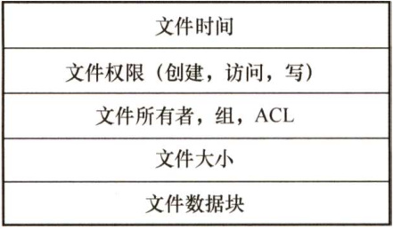  
图4.1一个典型的FCB  

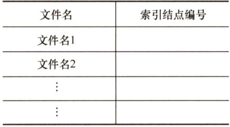  
图4.2UNIX的文件目录结构  

FCB主要包含以下信息：  

·基本信息，如文件名、文件的物理位置、文件的逻辑结构、文件的物理结构等。  
·存取控制信息，包括文件主的存取权限、核准用户的存取权限以及一般用户的存取权限。  
·使用信息，如文件建立时间、上次修改时间等。  
一个文件目录也被视为一个文件，称为目录文件。  

#### 3.索引结点  

文件目录通常存放在磁盘上，当文件很多时，文件目录会占用大量的盘块。在查找目录的过程中，要先将存放目录文件的第一个盘块中的目录调入内存，然后用给定的文件名逐一比较，若未找到指定文件，就还需要不断地将下一盘块中的目录项调入内存，逐一比较。我们发现，在检索目录的过程中，只用到了文件名，仅当找到一个目录项（其中的文件名与要查找的文件名匹配)时，才需从该目录项中读出该文件的物理地址。也就是说，在检索目录时，文件的其他描述信息不会用到，也不需要调入内存。因此，有的系统（如UNIX，图4.2）便采用了文件名和文件描述信息分开的方法，使文件描述信息单独形成一个称为索引结点的数据结构，简称i结点（inode)。在文件目录中的每个目录项仅由文件名和指向该文件所对应的i结点的指针构成。  

假设一个FCB为64B，盘块大小是1KB，则每个盘块中可以存放16个FCB（FCB必须连续存放)，若一个文件目录共有640个FCB，则查找文件平均需要启动磁盘20次。而在UNIX系统中，一个目录项仅占16B，其中14B是文件名，2B是i结点指针。在1KB的盘块中可存放64个目录项。这样，可使查找文件的平均启动磁盘次数减少到原来的1/4，大大节省了系统开销。  

（1）磁盘索引结点它是指存放在磁盘上的索引结点。每个文件有一个唯一的磁盘索引结点，主要包括以下内容：  

·文件主标识符，拥有该文件的个人或小组的标识符。  
·文件类型，包括普通文件、目录文件或特别文件。  
·文件存取权限，各类用户对该文件的存取权限。  
·文件物理地址，每个索引结点中含有13个地址项，即iaddr(0)～iaddr(12)，它们以直接或间接方式给出数据文件所在盘块的编号。  
·文件长度，指以字节为单位的文件长度。  
·文件链接计数，在本文件系统中所有指向该文件的文件名的指针计数。  
·文件存取时间，本文件最近被进程存取的时间、最近被修改的时间及索引结点最近被修改的时间。  

（2）内存索引结点  

它是指存放在内存中的索引结点。当文件被打开时，要将磁盘索引结点复制到内存的索引结点中，便于以后使用。在内存索引结点中增加了以下内容：  

·索引结点编号，用于标识内存索引结点。  
·状态，指示i结点是否上锁或被修改。  
·访问计数，每当有一进程要访问此i结点时，计数加1；访问结束减1。  
·逻辑设备号，文件所属文件系统的逻辑设备号。  
·链接指针，设置分别指向空闲链表和散列队列的指针。  

FCB 或索引结点相当于图书馆中图书的索书号，我们可以在图书馆网站上找到图书的索书号，然后根据索书号找到想要的书本。  

#### 4.1.3 文件的操作  

#### 1．文件的基本操作  

文件属于抽象数据类型。为了正确地定义文件，需要考虑可以对文件执行的操作。操作系统提供系统调用，它对文件进行创建、写、读、重定位、删除和截断等操作。  

1）创建文件。创建文件有两个必要步骤：一是为新文件分配必要的外存空间；二是在目录中为之创建一个目录项，目录项记录了新文件名、在外存中的地址及其他可能的信息。  
2）写文件。为了写文件，执行一个系统调用。对于给定文件名，搜索目录以查找文件位置。系统必须为该文件维护一个写位置的指针。每当发生写操作时，便更新写指针。  
3）读文件。为了读文件，执行一个系统调用。同样需要搜索目录以找到相关目录项，系统维护一个读位置的指针。每当发生读操作时，更新读指针。一个进程通常只对一个文件读或写，因此当前操作位置可作为每个进程当前文件位置的指针。由于读和写操作都使用同一指针，因此节省了空间，也降低了系统复杂度。  
4）重新定位文件，也称文件定位。搜索目录以找到适当的条目，并将当前文件位置指针重新定位到给定值。重新定位文件不涉及读、写文件。  
5）删除文件。为了删除文件，先从目录中检索指定文件名的目录项，然后释放该文件所占的存储空间，以便可被其他文件重复使用，并删除目录条目。  
6）截断文件。允许文件所有属性不变，并删除文件内容，将其长度置为0并释放其空间。  

这6个基本操作可以组合起来执行其他文件操作。例如，一个文件的复制，可以创建新文件从旧文件读出并写入新文件。  

#### 2.文件的打开与关闭  

当用户对一个文件实施操作时，每次都要从检索目录开始。为了避免多次重复地检索目录，大多数操作系统要求，在文件使用之前通过系统调用open被显式地打开。操作系统维护一个包含所有打开文件信息的表（打开文件表)。所谓“打开”，是指调用open 根据文件名搜索目录，将指明文件的属性（包括该文件在外存上的物理位置)，从外存复制到内存打开文件表的一个表目中，并将该表目的编号（也称索引）返回给用户。当用户再次向系统发出文件操作请求时，可通过索引在打开文件表中查到文件信息，从而节省再次搜索目录的开销。当文件不再使用时，可利用系统调用close关闭它，操作系统将会从打开文件表中删除这一条目。  

在多个不同进程可以同时打开文件的操作系统中，通常采用两级表：每个进程表和整个系统表。每个进程表根据它打开的所有文件，表中存储的是进程对文件的使用信息。系统打开文件表包含文件相关信息，如文件在磁盘的位置、访问日期和大小。一旦有进程打开了一个文件，系统表就包含该文件的条目。当另一个进程执行调用open时，只不过是在其进程打开表中增加一个条目，并指向系统表的相应条目。通常，系统打开文件表为每个文件关联一个打开计数器（OpenCount)，以记录多少进程打开了该文件。每个关闭操作close使count递减，当打开计数器为0时，表示该文件不再被使用，并且可从系统打开文件表中删除相应条目。图4.3展示了这种结构。  

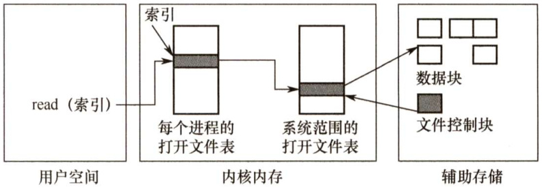  
图4.3内存中文件的系统结构  

文件名不必是打开文件表的一部分，因为一旦完成对FCB在磁盘上的定位，系统就不再使用文件名。对于访问打开文件表的索引，UNIX称之为文件描述符，而Windows 称之为文件句柄。因此，只要文件未被关闭，所有文件操作就通过打开文件表来进行。  

每个打开文件都具有如下关联信息：  

·文件指针。系统跟踪上次的读写位置作为当前文件位置的指针，这种指针对打开文件的某个进程来说是唯一的，因此必须与磁盘文件属性分开保存。  
·文件打开计数。计数器跟踪当前文件打开和关闭的数量。因为多个进程可能打开同一个文件，所以系统在删除打开文件条目之前，必须等待最后一个进程关闭文件。  
·文件磁盘位置。大多数文件操作要求系统修改文件数据。查找磁盘上的文件所需的信息保存在内存中，以便系统不必为每个操作都从磁盘上读取该信息。  
·访问权限。每个进程打开文件都需要有一个访问模式（创建、只读、读写、添加等)。该信息保存在进程的打开文件表中，以便操作系统能够允许或拒绝后续的I/O请求。  

#### 4.1.4 文件保护  

为了防止文件共享可能会导致文件被破坏或未经核准的用户修改文件，文件系统必须控制用户对文件的存取，即解决对文件的读、写、执行的许可问题。为此，必须在文件系统中建立相应的文件保护机制。文件保护通过口令保护、加密保护和访问控制等方式实现。其中，口令和加密是为了防止用户文件被他人存取或窃取，而访问控制则用于控制用户对文件的访问方式。  

#### 1．访问类型  

对文件的保护可从限制对文件的访问类型中出发。可加以控制的访问类型主要有以下几种。  

·读。从文件中读。  
·写。向文件中写。  
执行。将文件装入内存并执行。  
·添加。将新信息添加到文件结尾部分。  
·删除。删除文件，释放空间。  
·列表清单。列出文件名和文件属性。  

此外还可以对文件的重命名、复制、编辑等加以控制。这些高层的功能可以通过系统程序调用低层系统调用来实现。保护可以只在低层提供。例如，复制文件可利用一系列的读请求来完成，这样，具有读访问权限的用户同时也就具有了复制和打印权限。  

#### 2.访问控制  

解决访问控制最常用的方法是根据用户身份进行控制。而实现基于身份访问的最为普通的方法是，为每个文件和目录增加一个访问控制列表（Access-ControlList，ACL)，以规定每个用户名及其所允许的访问类型。这种方法的优点是可以使用复杂的访问方法，缺点是长度无法预计并且可能导致复杂的空间管理，使用精简的访问列表可以解决这个问题。  

精简的访问列表采用拥有者、组和其他三种用户类型。  

1）拥有者。创建文件的用户。  
2）组。一组需要共享文件且具有类似访问的用户。  
3）其他。系统内的所有其他用户。  

这样，只需用三个域即可列出访问表中这三类用户的访问权限。文件拥有者在创建文件时，说明创建者用户名及所在的组名，系统在创建文件时也将文件主的名字、所属组名列在该文件的FCB 中。用户访问该文件时，按照拥有者所拥有的权限访问文件，若用户和拥有者在同一个用户组，则按照同组权限访问，否则只能按其他用户权限访问。UNIX 操作系统即采用此种方法。  

口令和密码是另外两种访问控制方法。  

口令指用户在建立一个文件时提供一个口令，系统为其建立 FCB 时附上相应口令，同时告诉允许共享该文件的其他用户。用户请求访问时必须提供相应的口令。这种方法时间和空间的开销不多，缺点是口令直接存在系统内部，不够安全。  

密码指用户对文件进行加密，文件被访问时需要使用密钥。这种方法保密性强，节省了存储空间，不过编码和译码要花费一定的时间。  

口令和密码都是防止用户文件被他人存取或窃取，并没有控制用户对文件的访问类型。  

注意两个问题：  

1）现代操作系统常用的文件保护方法是，将访问控制列表与用户、组和其他成员访问控制方案一起组合使用。  
2）对于多级目录结构而言，不仅需要保护单个文件，而且需要保护子目录内的文件，即需要提供目录保护机制。目录操作与文件操作并不相同，因此需要不同的保护机制。  

#### 4.1.5 文件的逻辑结构  

文件的逻辑结构是从用户观点出发看到的文件的组织形式。文件的物理结构（又称文件的存储结构，见下一节）是从实现观点出发看到的文件在外存上的存储组织形式。文件的逻辑结构与  

存储介质特性无关，它实际上是指在文件的内部，数据逻辑上是如何组织起来的。  

按逻辑结构，文件可划分为无结构文件和有结构文件两大类。  

#### 1．无结构文件（流式文件）  

无结构文件是最简单的文件组织形式。无结构文件将数据按顺序组织成记录并积累、保存，它是有序相关信息项的集合，以字节（Byte）为单位。由于无结构文件没有结构，因而对记录的访问只能通过穷举搜索的方式，因此这种文件形式对大多数应用不适用。但字符流的无结构文件管理简单，用户可以方便地对其进行操作。所以，那些对基本信息单位操作不多的文件较适于采用字符流的无结构方式，如源程序文件、目标代码文件等。  

#### 2.有结构文件（记录式文件）  

有结构文件按记录的组织形式可以分为如下几种：  

#### （1）顺序文件  

文件中的记录一个接一个地顺序排列，记录通常是定长的，可以顺序存储或以链表形式存储。顺序文件有以下两种结构：第一种是串结构，记录之间的顺序与关键字无关，通常是按存入时间的先后进行排列，对串结构文件进行检索必须从头开始顺序依次查找，比较费时。第二种是顺序结构，指文件中的所有记录按关键字顺序排列，可采用折半查找法，提高了检索效率。  

在对记录进行批量操作，即每次要读或写一大批记录时，顺序文件的效率是所有逻辑文件中最高的。此外，对于顺序存储设备（如磁带)，也只有顺序文件才能被存储并能有效地工作。在经常需要查找、修改、增加或删除单个记录的场合，顺序文件的性能也比较差。  

#### （2）索引文件  

对于定长记录文件，要查找第 $i$ 条记录，可直接根据下式计算得到第 $i$ 条记录相对于第1条记录的地址： $A_{i}=i{\times}L$ 。然而，对于可变长记录的文件，要查找第 $i$ 条记录，必须顺序地查找前 $i-$ 1条记录，从而获得相应记录的长度 $L$ ，进而按下式计算出第 $i$ 条记录的首址：  

$$
A_{i}=\sum_{i=0}^{i-1}L_{i}+1
$$  

注意：假定每条记录前用一个字节指明该记录的长度。  

变长记录文件只能顺序查找，效率较低。为此，可以建立一张索引表，为主文件的每个记录在索引表中分别设置一个表项，包含指向变长记录的指针（即逻辑起始地址）和记录长度，索引表按关键字排序，因此其本身也是一个定长记录的顺序文件。这样就把对变长记录顺序文件的检索转变为对定长记录索引文件的随机检索，从而加快了记录的检索速度。图4.4所示为索引文件示意图。  

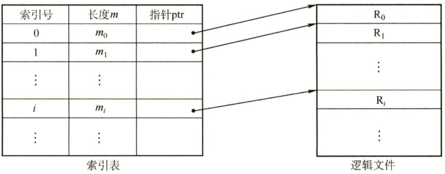  
图4.4索引文件示意图  

（3）索引顺序文件  

索引顺序文件是顺序文件和索引文件的结合。最简单的索引顺序文件只使用了一级索引。索引顺序文件将顺序文件中的所有记录分为若干组，为顺序文件建立一张索引表，在索引表中为每组中的第一条记录建立一个索引项，其中含有该记录的关键字值和指向该记录的指针。  

如图4.5所示，主文件名包含姓名和其他数据项。姓名为关键字，索引表中为每组的第一条记录（不是每条记录）的关键字值，用指针指向主文件中该记录的起始位置。索引表只包含关键字和指针两个数据项，所有姓名关键字递增排列。主文件中记录分组排列，同一个组中的关键字可以无序，但组与组之间的关键字必须有序。查找一条记录时，首先通过索引表找到其所在的组，然后在该组中使用顺序查找，就能很快地找到记录。  

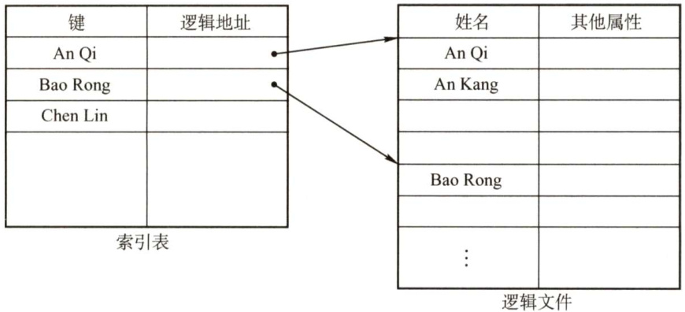  
图4.5索引顺序文件示意图  

对于含有 $N$ 条记录的顺序文件，查找某关键字的记录时，平均需要查找 $N/2$ 次。在索引顺序文件中，假设 $N$ 条记录分为 $\sqrt{N}$ 组，索引表中有 $\sqrt{N}$ 个表项，每组有 $\sqrt{N}$ 条记录，在查找某关键字的记录时，先顺序查找索引表，需要查找 $\sqrt{N}/2$ 次，然后在主文件中对应的组中顺序查找，也需要查找 $\sqrt{N}/2$ 次，因此共需查找 $\sqrt{N}/2+\sqrt{N}/2=\sqrt{N}$ 次。显然，索引顺序文件提高了查找效率，若记录数很多，则可采用两级或多级索引。这种方式就是数据结构中的分块查找。  

索引文件和索引顺序文件都提高了存取的速度，但因为配置索引表而增加了存储空间。  

（4）直接文件或散列文件（HashFile）  

给定记录的键值或通过散列函数转换的键值直接决定记录的物理地址。这种映射结构不同于顺序文件或索引文件，没有顺序的特性。  

散列文件有很高的存取速度，但是会引起冲突，即不同关键字的散列函数值相同。  

复习了数据结构的读者读到这里时，会有这样的感觉：有结构文件逻辑上的组织，是为在文件中查找数据服务的（顺序查找、索引查找、索引顺序查找、哈希查找)。  

前面介绍了文件内部的逻辑结构，下面介绍多个文件之间在逻辑上是如何组织的，这实际上是文件“外部”的逻辑结构的问题。  

#### 4.1.6 文件的物理结构  

前面说过，文件实际上是一种抽象数据类型，我们要研究它的逻辑结构、物理结构，以及关于它的一系列操作。文件的物理结构就是研究文件的实现，即文件数据在物理存储设备上是如何分布和组织的。同一个问题有两个方面的回答：一是文件的分配方式，讲的是对磁盘非空闲块的管理；二是文件存储空间管理，讲的是对磁盘空闲块的管理（详见4.3节)。  

文件分配对应于文件的物理结构，是指如何为文件分配磁盘块。常用的磁盘空间分配方法有三种：连续分配、链接分配和索引分配。有的系统（如RDOS 操作系统）对三种方法都支持，但更普遍的是一个系统只支持一种方法。对于本节的内容，读者要注意与文件的逻辑结构区分，从历年的经验来看，这是很多读者容易搞混的地方（读者复习完数据结构后，应该了解线性表、顺序表和链表之间的关系，类比到这里就不易混淆)。  

#### 1．连续分配  

连续分配方法要求每个文件在磁盘上占有一组连续的块，如图4.6所示。磁盘地址定义了磁盘上的一个线性排序，这种排序使作业访问磁盘时需要的寻道数和寻道时间最小。  

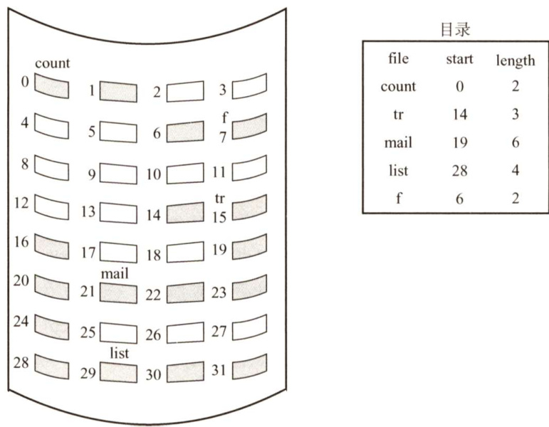  
图4.6连续分配  

采用连续分配时，逻辑文件中的记录顺序也存储在相邻接的块中。一个文件的目录项中“文件物理地址”字段应包括第一块的地址和该文件所分配区域的长度，若文件长 $n$ 块并从位置 $b$ 开始，则该文件将占有块 $b,b+1,b+2,\cdots,b+n-1$ 8  

连续分配支持顺序访问和直接访问。优点是实现简单、存取速度快。缺点是： $\textcircled{1}$ 文件长度不宜动态增加，因为一个文件末尾后的盘块可能已分配给其他文件，一旦需要增加，就需要大量移动盘块。 $\textcircled{2}$ 为保持文件的有序性，删除和插入记录时，需要对相邻的记录做物理上的移动，还会动态改变文件的长度。 $\textcircled{3}$ 反复增删文件后会产生外部碎片（与内存管理分配方式中的碎片相似)。$\textcircled{4}$ 很难确定一个文件需要的空间大小，因而只适用于长度固定的文件。  

#### 2.链接分配  

链接分配是一种采用离散分配的方式。它消除了磁盘的外部碎片，提高了磁盘的利用率。可以动态地为文件分配盘块，因此无须事先知道文件的大小。此外，对文件的插入、删除和修改也非常方便。链接分配又可分为隐式链接和显式链接两种形式。  

#### （1）隐式链接  

隐式链接方式如图4.7所示。目录项中含有文件第一块的指针和最后一块的指针。每个文件对应一个磁盘块的链表；磁盘块分布在磁盘的任何地方，除最后一个盘块外，每个盘块都含有指向文件下一个盘块的指针，这些指针对用户是透明的。  

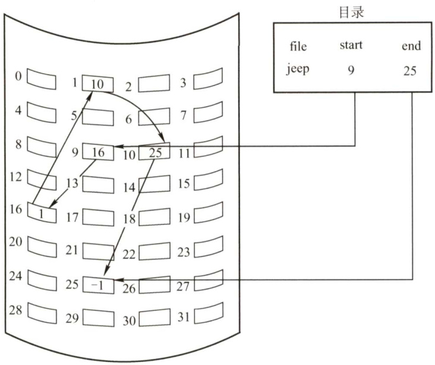  

隐式链接的缺点是只适合顺序访问，若要访问文件的第 $i$ 个盘块，则只能从第1个盘块开始通过盘块指针顺序查找到第 $i$ 块，随机访问效率很低。隐式链接的稳定性也是一个问题，系统在运行过程中由于软件或硬件错误导致链表中的指针丢失或损坏，会导致文件数据的丢失。  

通常的解决方案是，将几个盘块组成簇（cluster)，按簇而不按块来分配，可以成倍地减少查找时间。比如一簇为4块，这样，指针所占的磁盘空间比例也要小得多。这种方法的代价是增加了内部碎片。簇可以改善许多算法的磁盘访问时间，因此应用于大多数操作系统。  

#### （2）显式链接  

显式链接是指把用于链接文件各物理块的指针，从每个物理块的末尾中提取出来，显式地存放在内存的一张链接表中。该表在整个磁盘中仅设置一张，称为文件分配表（FileAllocation Table，FAT)。每个表项中存放链接指针，即下一个盘块号。文件的第一个盘块号记录在目录项“物理地址”字段中，后续的盘块可通过查FAT找到。例如，某磁盘共有100个磁盘块，存放了两个文件：  

文件“aaa”占三个盘块，依次是 $2\rightarrow8\rightarrow5$ ；文件“bbb”占两个盘块，依次是 $7{\rightarrow}1$ 。其余盘块都是空闲盘块，则该磁盘的FAT表如图4.8所示。  

不难看出，文件分配表FAT的表项与全部磁盘块一一对应，并且可以用一个特殊的数字－1表示文件的最后一块，可以用－2表示这个磁盘块是空闲的（当然也可指定为-3，-4)。因此，FAT不仅记录了文件各块之间的先后链接关系，同时还标记了空闲的磁盘块，操作系统也可以通过FAT对文件存储空间进行管理。当某进程请求操作系统分配一个磁盘块时，操作系统只需从FAT中找到－2的表项，并将对应的磁盘块分配给进程即可。  

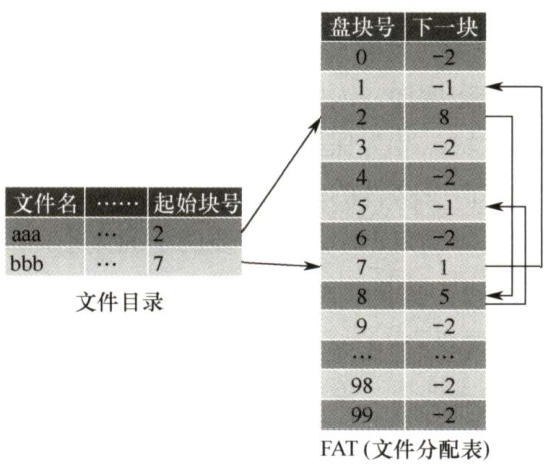  
图4.7隐式链接分配  
图4.8文件分配表  

FAT表在系统启动时就会被读入内存，因此查找记录的过程是在内存中进行的，因而不仅显著地提高了检索速度，而且明显减少了访问磁盘的次数。  

#### 3.索引分配  

链接分配解决了连续分配的外部碎片和文件大小管理的问题。但依然存在问题： $\textcircled{1}$ 链接分配不能有效支持直接访问（FAT除外)； $\textcircled{2}$ FAT需要占用较大的内存空间。事实上，在打开某个文件时，只需将该文件对应盘块的编号调入内存即可，完全没有必要将整个FAT调入内存。为此，索引分配将每个文件所有的盘块号都集中放在一起构成索引块（表)，如图4.9所示。  

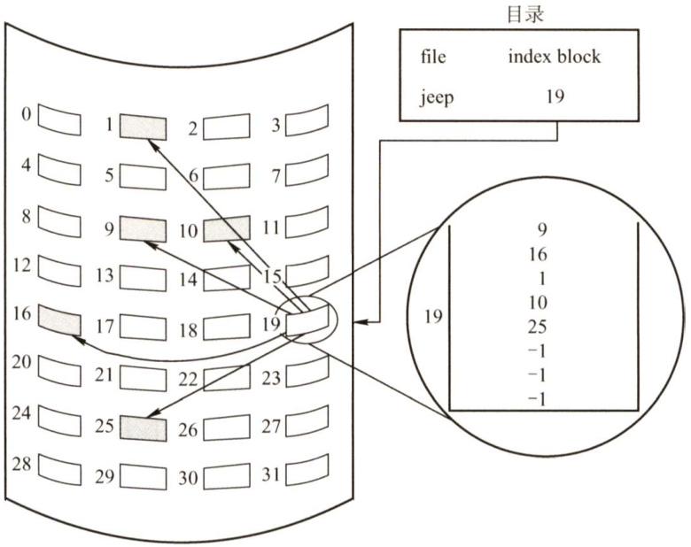  
图4.9索引分配  

每个文件都有其索引块，这是一个磁盘块地址的数组。索引块的第个条目指向文件的第i个块。要读第 $i$ 块，通过索引块的第 $i$ 个条目的指针来查找和读入所需的块。  

索引分配的优点是支持直接访问，且没有外部碎片问题。缺点是由于索引块的分配，增加了系统存储空间的开销。索引块的大小是一个重要的问题，每个文件必须有一个索引块，因此索引块应尽可能小，但索引块太小就无法支持大文件。可以采用以下机制来处理这个问题。  

·链接方案。一个索引块通常为一个磁盘块，因此它本身能直接读写。为了支持大文件，可以将多个索引块链接起来。·多层索引。通过第一级索引块指向一组第二级的索引块，第二级索引块再指向文件块。查找时，通过第一级索引查找第二级索引，再采用这个第二级索引查找所需数据块。这种方法根据最大文件大小，可以继续到第三级或第四级。例如，4096B的块，能在索引块中存入1024个4B的指针。两级索引支持1048576个数据块，即支持最大文件为4GB。·混合索引。将多种索引分配方式相结合的分配方式。例如，系统既采用直接地址，又采用单级索引分配方式或两级索引分配方式。该内容为高频考点，下面用一节专门介绍。此外，访问文件需两次访问外存，先读取索引块的内容，然后访问具体的磁盘块，因而降低了文件的存取速度。为了解决这一问题，通常将文件的索引块读入内存，以提高访问速度。  

#### 4.混合索引分配  

为了能够较全面地照顾到小型、中型、大型和特大型文件，可采用混合索引分配方式。对于小文件，为了提高对众多小文件的访问速度，最好能将它们的每个盘块地址直接放入FCB，这样就可以直接从FCB中获得该文件的盘块地址，即为直接寻址。对于中型文件，可以采用单级索引方式，需要先从FCB中找到该文件的索引表，从中获得该文件的盘块地址，即为一次间址。对于大型或特大型文件，可以采用两级和三级索引分配方式。UNIX系统采用的就是这种分配方式，在其索引结点中，共设有13个地址项，即i.addr(0)～i.addr(12)，如图4.10所示。  

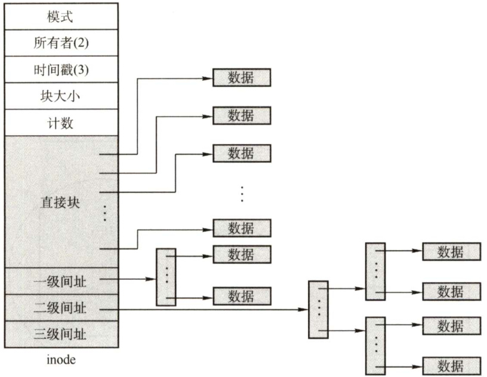  
图4.10UNIX系统的inode结构示意图  

1）直接地址。为了提高对文件的检索速度，在索引结点中可设置10 个直接地址项，即用i.addr(0)～i.addr(9)来存放直接地址，即文件数据盘块的盘块号。假如每个盘块的大小为4KB，当文件不大于40KB时，便可直接从索引结点中读出该文件的全部盘块号。  

2）一次间接地址。对于中、大型文件，只采用直接地址并不现实的。为此，可再利用索引结点中的地址项i.addr(10)来提供一次间接地址。这种方式的实质就是一级索引分配方式。图中的一次间址块也就是索引块，系统将分配给文件的多个盘块号记入其中。在一次间址块中可存放1024个盘块号，因而允许文件长达4MB。  

3）多次间接地址。当文件长度大于 $4\mathrm{MB}+40\mathrm{KB}$ （一次间接地址与10个直接地址项）时，系统还需采用二次间接地址分配方式。这时，用地址项i.addr(11)提供二次间接地址。该方式的实质是两级索引分配方式。系统此时在二次间址块中记入所有一次间址块的盘号。地址项i.addr(11)作为二次间址块，允许文件最大长度可达 4GB。同理，地址项iaddr(12)作为三次间址块，其允许的文件最大长度可达4TB。  

#### 4.1.7 本节小结  

本节开头提出的问题的参考答案如下。  

1）什么是文件？  

文件是以计算机硬盘为载体的存储在计算机上的信息集合，它的形式多样。  

2）单个文件的逻辑结构和物理结构之间是否存在某些制约关系？  

文件的逻辑结构是用户可见的结构，即从用户角度看到的文件的全貌。文件的物理结构是文件在存储器上的组织结构，它表示一个文件在辅存上安置、链接、编目的方法。它和文件的存取方法以及存储设备的特性等都有着密切的联系。单个文件的逻辑结构和物理结构之间虽无明显的制约或关联关系，但是如果物理结构选择不慎，也很难体现出逻辑结构的特点，比如一个逻辑结构是顺序结构，而物理结构是隐式链接结构的文件，即使理论上可以很快找出某条记录的地址，而实际找时仍然需要在磁盘上一块一块地找。  

学到这里时，读者应能有这样的体会：现代操作系统的思想中，到处能见到面向对象程序设计的影子。本节我们学习的一个新概念——文件，实质上就是一个抽象数据类型，也就是一种数据结构，若读者在复习操作系统之前已复习完数据结构，则遇到一种新的数据结构时，一定会有这样的意识：要认识它的逻辑结构、物理结构，以及对这种数据结构的操作。操作系统对文件的操作不是本课程重点关心的问题，无须做深入研究。  

#### 4.1.8 本节习题精选  

#### 一、单项选择题  

01.UNIX操作系统中，输入/输出设备视为（）。  

A．普通文件 B．目录文件 C.索引文件 D.特殊文件  

02．文件系统在创建一个文件时，为它建立一个（）。  

A．文件目录项 B．目录文件 C.逻辑结构 D.逻辑空间  

03．打开文件操作的主要工作是（）。  

A.把指定文件的目录复制到内存指定的区域  
B.把指定文件复制到内存指定的区域  
C．在指定文件所在的存储介质上找到指定文件的目录  
D.在内存寻找指定的文件  

04．目录文件存放的信息是（）。  

A．某一文件存放的数据信息  
B．某一文件的文件目录  
C．该目录中所有数据文件目录  
D.该目录中所有子目录文件和数据文件的目录  

05.FAT32的文件目录项不包括（）。  

A．文件名 B．文件访问权限说明C．文件控制块的物理位置 D.文件所在的物理位置  

06.有些操作系统中将文件描述信息从目录项中分离出来，这样做的好处是（）  

A．减少读文件时的I/O信息量 B.减少写文件时的IO信息量C.减少查找文件时的IO信息量 D.减少复制文件时的IO信息量  

07.操作系统为保证未经文件拥有者授权，任何其他用户不能使用该文件，所提供的解决方法是（）。  

A．文件保护 B．文件保密 C．文件转储 D．文件共享  

08．在文件系统中，以下不属于文件保护的方法是（）。  

A.口令 B．存取控制C．用户权限表 D.读写之后使用关闭命令  

09．对一个文件的访问，常由（）共同限制。  

A．用户访问权限和文件属性 B.用户访问权限和用户优先级C.优先级和文件属性 D．文件属性和口令  

10．加密保护和访问控制两种机制相比，（）。  

A.加密保护机制的灵活性更好 B.访问控制机制的安全性更高C.加密保护机制必须由系统实现 D.访问控制机制必须由系统实现  

11．为了对文件系统中的文件进行安全管理，任何一个用户在进入系统时都必须进行注册：这一级安全管理是（）。  

A.系统级 B.目录级 C.用户级 D.文件级  

12．下列说法中，（）属于文件的逻辑结构的范畴。  

A．连续文件 B．系统文件 C．链接文件 D.流式文件  

13.文件的逻辑结构是为了方便（）而设计的。  

A．存储介质特性 B.操作系统的管理方式C．主存容量 D.用户  

14.索引文件由逻辑文件和（）组成。  

A．符号表 B.索引表 C.交叉访问表 D.链接表  

15．下列关于索引表的叙述中，（）是正确的。  

A.索引表中每条记录的索引项可以有多个B．对索引文件存取时，必须先查找索引表C.索引表中含有索引文件的数据及其物理地址D.建立索引的目的之一是减少存储空间  

16．有一个顺序文件含有10000条记录，平均查找的记录数为5000个，采用索引顺序文件结构，则最好情况下平均只需查找（）次记录。  

A.1000 B.10000 C. 100 D.500  

17．用磁带做文件存储介质时，文件只能组织成（）。  

A．顺序文件 B.链接文件 C.索引文件 D．目录文件  

18．以下不适合直接存取的外存分配方式是（）。  

A．连续分配 B．链接分配C.索引分配 D.以上答案都适合  

19．在以下文件的物理结构中，不利于文件长度动态增长的是（）。  

A．连续结构 B．链接结构 C.索引结构 D．散列结构  

20．文件系统中若文件的物理结构采用连续结构，则FCB 中有关文件的物理位置的信息应包括（）。  

I．首块地址 II．文件长度 III．索引表地址A.仅I B.I、ⅡI C.、II D.I、IⅢI  

21．在磁盘上，最容易导致存储碎片发生的物理文件结构是（）。  

A.隐式链接 B．顺序存放 C.索引存放 D．显式链接  

22．文件系统采用两级索引分配方式。若每个磁盘块的大小为1KB，每个盘块号占4B，则该系统中，单个文件的最大长度是（）。  

A. 64MB B. 128MBC. 32MB D. 以上答案都不对  

23．设有一个记录文件，采用链接分配方式，逻辑记录的固定长度为100B，在磁盘上存储时采用记录成组分解技术。盘块长度为 512B。若该文件的目录项已经读入内存，则对第22个逻辑记录完成修改后，共启动了磁盘（）次。  

A.3 B.4 C.5 D.6  

24.物理文件的组织方式是由（）确定的。  

A．应用程序 B．主存容量 C．外存容量 D.操作系统  

25．文件系统为每个文件创建一张（），存放文件数据块的磁盘存放位置。  

A．打开文件表 B.位图 C.索引表 D．空闲盘块链表  

26.下面关于索引文件的叙述中，正确的是（）。  

A．索引文件中，索引表的每个表项中含有相应记录的关键字和存放该记录的物理地址B.顺序文件进行检索时，首先从FCB中读出文件的第一个盘块号；而对索引文件进行检索时，应先从FCB中读出文件索引块的开始地址C.对于一个具有三级索引的文件，存取一条记录通常要访问三次磁盘D.文件较大时，无论是进行顺序存取还是进行随机存取，通常索引文件方式都最快  

27．设某文件为链接文件，它由5个逻辑记录组成，每个逻辑记录的大小与磁盘块的大小相等，均为512B，并依次存放在50,121，75,80,63号磁盘块上。若要存取文件的第1569逻辑字节处的信息，则应该访问（）号磁盘块。  

A.3 B.80 C.75 D.63  

28.【2009统考真题】文件系统中，文件访问控制信息存储的合理位置是（）。  

A．文件控制块 B．文件分配表 C.用户口令表 D.系统注册表  

29.【2009统考真题】下列文件物理结构中，适合随机访问且易于文件扩展的是（）。  

A.连续结构 B.索引结构C.链式结构且磁盘块定长 D.链式结构且磁盘块变长  

30.【2010统考真题】设文件索引结点中有7个地址项，其中4个地址项是直接地址索引，2个地址项是一级间接地址索引，1个地址项是二级间接地址索引，每个地址项大小为4B，若磁盘索引块和磁盘数据块大小均为256B，则可表示的单个文件最大长度是（）。  

A.33KB B.519KB C. 1057KB D.16516KB  

31.【2012统考真题】若一个用户进程通过read系统调用读取一个磁盘文件中的数据，则下列关于此过程的叙述中，正确的是（）。  

I．若该文件的数据不在内存，则该进程进入睡眠等待状态ⅡI.请求read系统调用会导致CPU从用户态切换到核心态III.read系统调用的参数应包含文件的名称  

A.仅I、Ⅱ B.仅I、IⅢI C.仅Ⅱ、IⅢI D.I、Ⅱ和I  

2.【2013统考真题】用户在删除某文件的过程中，操作系统不可能执行的操作是（）。  

A．删除此文件所在的目录 B．删除与此文件关联的目录项C.删除与此文件对应的文件控制块 D.释放与此文件关联的内存缓冲区  

33.【2013统考真题】若某文件系统索引结点（inode）中有直接地址项和间接地址项，则下列选项中，与单个文件长度无关的因素是（）。  

A.索引结点的总数 B．间接地址索引的级数C.地址项的个数 D．文件块大小  

34.【2013统考真题】为支持CD-ROM中视频文件的快速随机播放，播放性能最好的文件数据块组织方式是（）。  

A．连续结构 B.链式结构 C.直接索引结构 D.多级索引结构i5.【2014统考真题】在一个文件被用户进程首次打开的过程中，操作系统需做的是（）。  

A．将文件内容读到内存中  

B.将文件控制块读到内存中  
C.修改文件控制块中的读写权限  
D.将文件的数据缓冲区首指针返回给用户进程  

36.【2015统考真题】在文件的索引结点中存放直接索引指针10个，一级和二级索引指针各1个。磁盘块大小为1KB，每个索引指针占4B。若某文件的索引结点已在内存中，则把该文件偏移量（按字节编址）为1234和307400处所在的磁盘块读入内存，需访问的磁盘块个数分别是（）。  

A.1，2 B.1，3 C.2,3 D.2，4  

37.【2017统考真题】某文件系统中，针对每个文件，用户类别分为4类：安全管理员、文件主、文件主的伙伴、其他用户；访问权限分为5种：完全控制、执行、修改、读取、写入。若文件控制块中用二进制位串表示文件权限，为表示不同类别用户对一个文件的访问权限，则描述文件权限的位数至少应为（）。  

A.5 B.9 C.12 D.20  

8.【2018统考真题】下列优化方法中，可以提高文件访问速度的是（）。  

I．提前读 ⅡI为文件分配连续的簇III.延迟写 IV.采用磁盘高速缓存  

A.仅I、Ⅱ B.仅、II C.仅I、IⅢI、IV D.I、Ⅱ、Ⅲ、IV  

39.【2020统考真题】下列选项中，支持文件长度可变、随机访问的磁盘存储空间分配方式是（）。  

A.索引分配 B．链接分配 C．连续分配 D.动态分区分配  

40.【2020统考真题】某文件系统的目录项由文件名和索引结点号构成。若每个目录项长度为64字节，其中4字节存放索引结点号，60字节存放文件名。文件名由小写英文字母构成，则该文件系统能创建的文件数量的上限为（）。  

A.226 B. $2^{32}$ C. 260 D.264  

#### 二、综合应用题  

01．简述文件的外存分配中，连续分配、链接分配和索引分配各自的主要优缺点。  

02．在实现文件系统时，为加快文件目录的检索速度，可利用“FCB分解法”。假设目录文件存放在磁盘上，每个盘块512B。FCB占64B，其中文件名占8B。通常将FCB分解成两部分，第一部分占10B（包括文件名和文件内部号），第二部分占56B（包括文件内部号和文件的其他描述信息)。  

1）假设某一目录文件共有254个FCB，试分别给出采用分解法前和分解法后，查找该目录文件的某个FCB的平均访问磁盘次数（访问每个文件的概率相同）。  
2）一般地，若目录文件分解前占用 $n$ 个盘块，分解后改用 $m$ 个盘块存放文件名和文件内部号，请给出访问磁盘次数减少的条件（假设m和 $\mathfrak{n}$ 个盘块中都正好装满)。  

03．假定磁盘块的大小为1KB，对于540MB的硬盘，其文件分配表（FAT）最少需要占用多少存储空间？  

04.在UNIX操作系统中，给文件分配外存空间采用的是混合索引分配方式，如下图所示。UNIX系统中的某个文件的索引结点指示出了为该文件分配的外存的物理块的寻找方法。在该索引结点中，有10个直接块（每个直接块都直接指向一个数据块），有1个一级间接块、1个二级间接块及1个三级间接块，间接块指向的是一个索引块，每个索引块和数据块的大小均为4KB，而UNIX系统中地址所占空间为4B（指针大小为4B），假设以下问题都建立在该索引结点已在内存中的前提下。  

现请回答：  

1）文件的大小为多大时可以只用到索引结点的直接块？  
2）该索引结点能访问到的地址空间大小总共为多大（小数点后保留2位）？  
3）若要读取一个文件的第10000B的内容，需要访问磁盘多少次？  
4）若要读取一个文件的第10MB的内容，需要访问磁盘多少次？  

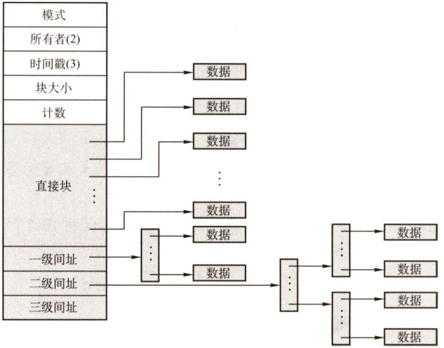  

05．某文件系统采用多级索引的方式组织文件的数据存放，假定在文件的i_node中设有13个地址项，其中直接索引10项，一次间接索引项1项，二次间接索引项1项，三次间接索引项1项。数据块的大小为4KB，磁盘地址用4B表示，试问：  

1）这个文件系统允许的最大文件长度是多少？  
2）一个2GB大小的文件，在这个文件系统中实际占用多少空间？  

06．文件采用多重索引结构搜索文件内容。设块长为512B，每个块号长2B，若不考虑逻辑块号在物理块中所占的位置，分别计算二级索引和三级索引时可寻址的文件最大长度。  

07.【2011统考真题】某文件系统为一级目录结构，文件的数据一次性写入磁盘，已写入的文件不可修改，但可多次创建新文件。请回答如下问题。1）在连续、链式、索引三种文件的数据块组织方式中，哪种更合适？说明理由。为定位文件数据块，需要在FCB中设计哪些相关描述字段？2）为快速找到文件，对于FCB，是集中存储好，还是与对应的文件数据块连续存储好？说明理由。  

08.【2012统考真题】某文件系统空间的最大容量为4TB（ $1\mathrm{TB}=2^{40}\mathrm{\bar{B}}$ )，以磁盘块为基本分配单位。磁盘块大小为1KB。文件控制块（FCB）包含一个512B的索引表区。请回答下列问题：  

1）假设索引表区仅采用直接索引结构，索引表区存放文件占用的磁盘块号，索引表项中块号最少占多少字节？可支持的单个文件的最大长度是多少字节？  
2）假设索引表区采用如下结构：第0～7字节采用<起始块号，块数 $>$ 格式表示文件创建时预分配的连续存储空间。其中起始块号占6B，块数占2B，剩余504B采用直接索引结构，一个索引项占6B，则可支持的单个文件的最大长度是多少字节？为使单个文件的长度达到最大，请指出起始块号和块数分别所占字节数的合理值并说明理由。  

09.【2014统考真题】文件F由200条记录组成，记录从1开始编号。用户打开文件后，欲将内存中的一条记录插入文件F，作为其第30条记录。请回答下列问题，并说明理由。  

1）若文件系统采用连续分配方式，每个磁盘块存放一条记录，文件F存储区域前后均有足够的空闲磁盘空间，则完成上述插入操作最少需要访问多少次磁盘块？F的文件控制块内容会发生哪些改变？  
2）若文件系统采用链接分配方式，每个磁盘块存放一条记录和一个链接指针，则完成上述插入操作需要访问多少次磁盘块？若每个存储块大小为1KB，其中4B存放链接指针，则该文件系统支持的文件最大长度是多少？  

10.【2016统考真题】某磁盘文件系统使用链接分配方式组织文件，簇大小为4KB。目录文件的每个目录项包括文件名和文件的第一个簇号，其他簇号存放在文件分配表FAT中。1)假定目录树如下图所示，各文件占用的簇号及顺序如下表所示，其中dir,dirl是目录，filel,file2是用户文件。请给出所有目录文件的内容。2）若FAT的每个表项仅存放簇号，占2B，则FAT的最大长度为多少字节？该文件系统支持的文件长度最大是多少？3）系统通过目录文件和FAT实现对文件的按名存取，说明filel的106，108两个簇号分别存放在FAT的哪个表项中。  

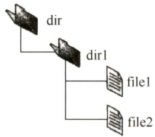  

<html><body><table><tr><td>文件名</td><td>簇号</td></tr><tr><td>dir</td><td></td></tr><tr><td>dir1</td><td>48</td></tr><tr><td>file1</td><td>100、 106、 108</td></tr><tr><td>file2</td><td>200、 201、 202</td></tr></table></body></html>  

4）假设仅FAT和dir目录文件已读入内存，若需将文件dir/dirl/filel的第5000个字节读入内存，则要访问哪几个簇？  

11.【2018统考真题】某文件系统采用索引结点存放文件的属性和地址信息，簇大小为4KB。每个文件索引结点占64B，有11个地址项，其中直接地址项8个，一级、二级和三级间接地址项各1个，每个地址项长度为4B。请回答下列问题：  

1）该文件系统能支持的最大文件长度是多少？（给出计算表达式即可）  
2）文件系统用1M（ $1\mathrm{M}=2^{20}$ ）个簇存放文件索引结点，用512M个簇存放文件数据。若一个图像文件的大小为 $5600\mathrm{B}$ ，则该文件系统最多能存放多少个这样的图像文件？  
3）若文件F1的大小为6KB，文件F2的大小为40KB，则该文系统获取F1和F2最后一个簇的簇号需要的时间是否相同？为什么？  

#### 4.1.9 答案与解析  

#### 一、单项选择题  

01.D  

UNIX操作系统中，所有设备都被视为特殊的文件，因为UNIX操作系统控制和访问外部设备的方式和访问一个文件的方式是相同的。  

02.A  

一个文件对应一个FCB，而一个文件目录项就是一个FCB。  

03.A  

打开文件操作是将该文件的FCB 存入内存的活跃文件目录表，而不是将文件内容复制到主存，找到指定文件目录是打开文件之前的操作。  

04.D  

目录文件是FCB 的集合，一个目录中既可能有子目录，又可能有数据文件，因此目录文件中存放的是子目录和数据文件的信息。  

05.C  

文件目录项即FCB，通常由文件基本信息、存取控制信息和使用信息组成。基本信息包括文件物理位置。文件目录项显然不包括FCB的物理位置信息。  

06.C  

将文件描述信息从目录项中分离，即应用了索引结点的方法，磁盘的盘块中可以存放更多的目录项，查找文件时可以大大减少其I/O信息量。  

07.A  

文件保护是针对文件访问权限的保护。  

08.D  

在文件系统中，口令、存取控制和用户权限表都是常用的文件保护方法。  

09.A  

对于这道题，只要能区分用户的访问权限和用户优先级，就能得到正确的答案。用户访问权限是指用户有没有权限访问该文件，而用户优先级是指在多个用户同时请求该文件时应该先满足谁。比如，图书馆的用户排队借一本书，某用户可能有更高的优先级，即他排在队伍的前面，但有可能轮到他时被告知他没有借阅那本书的权限。  

文件的属性包括保存在FCB中对文件访问的控制信息。  

10.D  

相对于加密保护机制，访问控制机制的安全性较差。因为访问控制的级别和保护力度较小，因此它的灵活性相对较高。若访问控制不由系统实现，则系统本身的安全性就无法保证。加密机制若由系统实现，则加密方法将无法扩展。  

11.A  

系统级安全管理包括注册和登录。另外，通过“进入系统时”这个关键词也可推测出正确答案。  

12.D  

逻辑文件有两种：无结构文件（流式文件）和有结构式文件。连续文件和链接文件都属于文件的物理结构，而系统文件是按文件用途分类的。  

13.D  

文件结构包括逻辑结构和物理结构。逻辑结构是用户组织数据的结构形式，数据组织形式来自需求，而物理结构是操作系统组织物理存储块的结构形式。  

因此说，逻辑文件的组织形式取决于用户，物理结构的选择取决于文件系统设计者针对硬件结构（如磁带介质很难实现链接结构和索引结构）所采取的策略（即A和B选项)。  

14.B  

索引文件由逻辑文件和索引表组成。文件的逻辑结构和物理结构都有索引的概念，引入逻辑索引和物理索引的目的是截然不同的。逻辑索引的目的是加快文件数据的定位，是从用户角度出发的，而物理索引的主要目的是管理不连续的物理块，是从系统管理的角度出发的。  

15.B  

索引文件由逻辑文件和索引表组成，对索引文件存取时，必须先查找索引表。索引项只包含每条记录的长度和在逻辑文件中的起始位置。因为每条记录都要有一个索引项，因此提高了存储代价。  

16.C  

最好的情况是有 $\sqrt{10000}=100$ 组，每组有100条记录，因此顺序查找时平均查找记录个数 $\mathbf{\Sigma}=\mathbf{\Sigma}$ $50+50=100$ o  

17.A  

磁带是一种顺序存储设备，用它存储文件时只能采用顺序存储结构。注意：若允许磁带来回倒带，也可组织为其他的文件形式，本题不做讨论。  

18.B  

直接存取即随机存取，采用连续分配和索引分配的文件都适合于直接存取方式，只有采用链接分配的文件不具有随机存取特性。  

19.A  

要求有连续的存储空间，所以必须事先知道文件的大小，然后根据其大小在存储空间中找出一块大小足够的存储区。如果文件动态地增长，那么会使文件所占的空间越来越大，即使事先知道文件的最终大小，在采用预分配的存储空间的方法时，也是很低效的，它会使大量的存储空间长期闲置。  

20.B  

在连续分配方式中，为了使系统能找到文件存放的地址，应在目录项的“文件物理地址”字段中，记录该文件第一条记录所在的盘块号和文件长度（以盘块数进行计量)。  

21.B  

顺序文件占用连续的磁盘空间，容易导致存储碎片（外部碎片）的发生。  

22.A  

每个磁盘块中最多有 $1\mathrm{KB}/4\mathrm{B}=256$ 个索引项，则两级索引分配方式下单个文件的最大长度为 $256{\times}256{\times}1\mathrm{KB}=64\mathrm{MB}$ o  

23.D  

第22个逻辑记录存放在第5个物理块中（ $22\times100/512=4$ ，余152)，由于文件采用的物理结构是链接文件，因此需要从目录项所指的第一个物理块开始读取，共启动磁盘5次。修改后还需要写回操作，由于写回时已获得该块的物理地址，只需启动磁盘1次，因此共需启动磁盘6次。  

24.D  

通常用户可以根据需要来确定文件的逻辑结构，而文件的物理结构是由操作系统的设计者根据文件存储器的特性来确定的，一旦确定，就由操作系统管理。  

25.C  

打开文件表仅存放已打开文件信息的表，将指名文件的属性从外存复制到内存，再使用该文件时直接返回索引，A 错误。位图和空闲盘块链表是磁盘管理方法，B、D 错误。只有索引表中记录每个文件所存放的盘块地址，C正确。  

26.B  

索引表的表项中含有相应记录的关键字和存放该记录的逻辑地址；三级索引需要访问4次磁盘；随机存取时索引文件速度快，顺序存取时顺序文件速度快。  

27.B  

因为 $1569=512\times3+33$ ，故要访问字节位于第4个磁盘块上，对应的物理磁盘块号为80。  

28.A  

为了实现“按名存取”，在文件系统中为每个文件设置用于描述和控制文件的数据结构，称之为文件控制块（FCB)。在文件控制块中，通常包含三类信息，即基本信息、存取控制信息及使用信息。  

29.B  

文件的物理结构包括连续、链式、索引三种，其中链式结构不能实现随机访问，连续结构的文件不易于扩展。因此随机访问且易于扩展是索引结构的特性。  

30.C  

每个磁盘索引块和磁盘数据块大小均为256B，每个磁盘索引块有 $256/4=64$ 个地址项。因此，4个直接地址索引指向的数据块大小为 $4\times256\mathrm{B}$ ；2个一级间接索引包含的直接地址索引数为$2\times(256/4)$ ，即其指向的数据块大小为 $2\times(256/4){\times}256\mathrm{B}$ 。1个二级间接索引所包含的直接地址索引数为 $(256/4)\times(256/4)$ ，即其所指向的数据块大小为 $(256/4)\times(256/4)\times256\mathrm{B}$ 。因此，7个地址项所指向的数据块总大小为 $4\times256+2\times(256/4)\times256+(256/4)\times(256/4)\times256=1082368{\mathrm{B}}=1057{\mathrm{KB}}=0.028368.$ 。  

31.A  

对于I，当所读文件的数据不在内存时，产生中断（缺页中断)，原进程进入阻塞态，直到所需数据从外存调入内存后，才将该进程唤醒。对于ⅡI，read系统调用通过陷入将CPU从用户态切换到核心态，从而获取操作系统提供的服务。对于III，要读一个文件，首先要用open 系统调用打开该文件。open 中的参数包含文件的路径名与文件名，而read 只需使用open返回的文件描述符，并不使用文件名作为参数。read要求用户提供三个输入参数： $\textcircled{1}$ 文件描述符fd； $\textcircled{2}$ buf缓冲区首址； $\textcircled{3}$ 传送的字节数n。read的功能是试图从fd所指示的文件中读入n个字节的数据，并将它们送至由指针buf所指示的缓冲区中。  

32.A  

此文件所在目录下可能还存在其他文件，因此删除文件时不能（也不需要）删除文件所在的目录，而与此文件关联的目录项和文件控制块需要随着文件一同删除，同时释放文件关联的内存缓冲区。  

33.A  

四个选项中，只有A选项是与单个文件长度无关的。  

34.A  

为了实现快速随机播放，要保证最短的查询时间，即不能选取链表和索引结构，因此连续结构最优。  

35.B  

一个文件被用户进程首次打开即被执行了open 操作，会把文件的FCB调入内存，而不会把文件内容读到内存中，只有进程希望获取文件内容时才会读入文件内容；C、D明显错误，选B。  

扫一扫  

36.B  

解析请扫右侧二维码查阅。  

37.D  

可以把用户访问权限抽象为一个矩阵，行代表用户，列代表访问权限。这个矩阵有4行5列，1代表true，0代表false，所以需要20位，选D。  

38.D  

解析请扫右侧二维码查阅。  

39.A  

索引分配支持变长的文件，同时可以随机访问文件的指定数据块，A正确。链接分配不支持随机访问，需要依靠指针依次访问，B错误。连续分配的文件长度固定，不支持可变文件长度（连续分配的文件长度虽然也可变，但是需要大量移动数据，代价较大，相比之下不太合适)，C 错误。动态分区分配是内存管理方式，不是磁盘空间的管理方式，D错误。  

40.B  

在总长为64字节的目录项中，索引结点占4字节，即32位。不同目录下的文件的文件名可以相同，所以在考虑系统创建最多文件数量时，只需考虑索引结点的个数，即创建文件数量上限 $\mathbf{\Sigma}=\mathbf{\Sigma}$ 索引结点数量上限。整个系统中最多存储 $2^{32}$ 个索引结点，因此整个系统最多可以表示 $2^{32}$ 个文件，B正确。  

#### 二、综合应用题  

01.【解答】  

连续分配方式的优点是可以随机访问（磁盘)，访问速度快；缺点是要求有连续的存储空间，容易产生碎片，降低磁盘空间利用率，并且不利于文件的增长扩充。  

链接分配方式的优点是不要求连续的存储空间，能更有效地利用磁盘空间，并且有利于扩充文件；缺点是只适合顺序访问，不适合随机访问；另外，链接指针占用一定的空间，降低了存储效率，可靠性也差。  

索引分配方式的优点是既支持顺序访问又支持随机访问，查找效率高，便于文件删除；缺点是索引表会占用一定的存储空间。  

02.【解答】  

目录是存放在磁盘上的，检索目录时需要访问磁盘，速度很慢。利用“FCB分解法”加快目录检索速度的原理是：将FCB的一部分分解出去，存放在另一个数据结构中，而在目录中仅留下文件的基本信息和指向该数据结构的指针，这样一来就有效地缩减了目录的体积，减少了目录所占磁盘的块数，检索目录时读取磁盘的次数也减少，于是就加快了检索目录的速度。  

因为原本整个FCB都是在目录中的，而FCB分解法将FCB的部分内容放在了目录外，所以检索完目录后还需要读取一次磁盘，以找齐FCB的所有内容。  

1）分解法前，目录的磁盘块数为 $64\times254/512=31.75$ ，即32块。前31块中每块放了512/64$=8$ 个，而最后一块放了 $254-31\times8=6$ 个。所以查找该目录文件的某个FCB的平均访问磁盘次数 $=[8\times(1+2+3+\cdots+31)+6\times32]/254=16.38$ 次。分解法后，目录的磁盘块数为 $10{\times}254/512=4.96$ ，即5块。前4块中每块放了 $512/10=51\$ 个，而最后一块放了 $254-4\times51=50$ 个。所找的目录项在第1,2,3,4,5块所需的磁盘访问次数分别为2，3，4，5，6次。所以查找该目录文件的某个FCB的平均访问磁盘次数 $\mathbf{\Sigma}=\mathbf{\Sigma}$ $[51\times(2+3+4+5)+50\times6]/254=3.99$ 次。  

2）分解法前，平均访问磁盘次数 $=(1+2+3+\cdots+n)/n=(n+1)/2$ 次。分解法后，平均访问磁盘次数 $=[2+3+4+\cdots+(m+1)]/m=(m+3)/2$ 次。为了使访问磁盘次数减少，显然需要 $(m+3)/2<(n+1)/2$ ，即 $m<n-2$ 。  

注意：第二问中的每个盘块都正好装满，相当于访问每个盘块的概率是相等的，因此计算起来比第一问方便很多。  

03.【解答】  

对于540MB的硬盘，硬盘总块数为 $540\mathbf{MB}/1\mathbf{KB}=540\mathbf{K}$ 个。  

因为540K刚好小于 $2^{20}$ ，所以文件分配表的每个表目可用20位，即 $20/8=2.5\mathrm{B}$ ，这样FAT占用的存储空间大小为 $2.5\mathrm{B}\times540\mathrm{K}=1350\mathrm{KB}$ 0  

04.【解答】  

1）要想只用到索引结点的直接块，这个文件应能全部在10个直接块指向的数据块中放下，而数据块的大小为4KB，所以该文件的大小应小于等于 $4\mathrm{KB}\times10=40\mathrm{KB}$ ，即文件的大小不超过40KB时可以只用到索引结点的直接块。  

2）只需要算出索引结点指向的所有数据块的块数，再乘以数据块的大小即可。直接块指向的数据块数 $=10$ 块。一级间接块指向的索引块里的指针数为 $4\mathrm{KB}/4\mathrm{B}=1024$ ，所以一级间接块指向的数据块数为1024块。二级间接块指向的索引块里的指针数为 $4\mathrm{KB}/4\mathrm{B}=1024$ ，指向的索引块里再拥有 $4\mathrm{KB}/4\mathrm{B}=$ 1024个指针数。所以二级间接块指向的数据块数为 $(4\mathrm{KB}/4\mathrm{B})^{2}=1024^{2}$ 8三级间接块指向的数据块数为 $\left(4\mathrm{KB}/4\mathrm{B}\right)^{3}=1024^{3}$ 。所以，该索引结点能访问到的地址空间大小为  

$$
\left[10+1\times\frac{4\mathrm{KB}}{4\mathrm{B}}+1\times\left(\frac{4\mathrm{KB}}{4\mathrm{B}}\right)^{2}+1\times\left(\frac{4\mathrm{KB}}{4\mathrm{B}}\right)^{3}\right]\times4\mathrm{KB}\approx4100.00\mathrm{GB}=4.00\mathrm{TB}
$$  

3）因为 $10000\mathrm{B}/4\mathrm{KB}=2.44$ ，所以第10000B的内容存放在第3个直接块中，若要读取一个文件的第10000B的内容，需要访问磁盘1次。  

4）因为10MB的内容需要数据块数为 $10\mathrm{MB}/4\mathrm{KB}=2.5{\times}1024$ ，直接块和一级间接块指向的数据块数 $=10+(4\mathrm{KB}/4\mathrm{B})=1034<2.5{\times}1024$ ，直接块和一级间接块及二级间接块的数据块数 $=10+(4\mathrm{KB}/4\mathrm{B})+(4\mathrm{KB}/4\mathrm{B})^{2}{>}1{\times}1024^{2}>2.5{\times}1024$ ，所以第10MB数据应该在二级间接块下属的某个数据块中，若要读取一个文件的第10MB的内容，需要访问磁盘3次。  

05.【解答】  

第一问要计算混合索引结构的寻址空间大小；第二问只要计算出存储该文件索引块的大小，然后加上该文件本身的大小即可。  

1）物理块大小为4KB，数据大小为4B，则每个物理块可存储的地址数为 $4\mathrm{KB}/4\mathrm{B}=1024$ 。最大文件的物理块数可达 $10+1024+1024^{2}+1024^{3}$ ，每个物理块大小为4KB，因此总长度为$(10+1024+1024^{2}+1024^{3}){\times}4\mathrm{KB}=40\mathrm{KB}+4\mathrm{MB}+4\mathrm{GB}+4\mathrm{TB}$ 这个文件系统允许的最大文件长度是 $4\mathrm{TB}+4\mathrm{GB}+4\mathrm{MB}+40\mathrm{KB}$ ，约为4TB。  

2）占用空间分为文件实际大小和索引项大小，文件大小为2GB，从1）中的计算知，需要使用到二次间接索引项。该文件占用 $2\mathrm{GB}/4\mathrm{KB}=512\times1024$ 个数据块。一次间接索引项使用1个间接索引块，二次间接索引项使用 $1+\big\lceil(512\times1024-10-1024)/$ $10247\approx512$ 个间接索引块（最左的1表示二次间址块)，所以间接索引块所占空间大小为  

$$
(1+512){\times}4\mathrm{KB}=2\mathbf{M}\mathbf{B}+4\mathrm{KB}
$$  

另外每个文件使用的i_node数据结构占 $13\times4\mathrm{B}=52\mathrm{B}$ ，因此该文件实际占用磁盘空间大小为 $2\mathrm{GB}+2\mathrm{MB}+4\mathrm{KB}+52\mathrm{B}$ 。  

06.【解答】  

由于块长为512B，每个块号长2B，因此一个一级索引表可容纳256个磁盘块地址。同样，一个二级索引表可容纳256个磁盘块地址，一个三级索引表也可容纳256个磁盘块地址。  

所以采用二级索引时，可寻址的文件最大长度是  

$$
256\times256\times512=32\mathrm{MB}
$$  

采用三级索引时，可寻址的文件最大长度是  

$$
256\times256\times256\times512=8\mathrm{GB}
$$  

07.【解答】  

1)在磁盘中连续存放（采取连续结构)，磁盘寻道时间更短，文件随机访问效率更高；在FCB中加入的字段为 $<$ 起始块号，块数 $>$ 或 $\mathrm{\Sigma}_{<}$ 起始块号，结束块号>。  

2）将所有的FCB集中存放，文件数据集中存放。这样在随机查找文件名时，只需访问FCB对应的块，可减少磁头移动和磁盘I/O访问次数。  

08.【解答】  

1）文件系统中所能容纳的磁盘块总数为 $4\mathrm{TB}/1\mathrm{KB}=2^{32}$ 。要完全表示所有磁盘块，索引项中的块号最少要占 $32/8\ =\ 4\mathrm{B}$ 。而索引表区仅采用直接索引结构，因此512B的索引表区能容纳 $512\mathrm{B}/4\mathrm{B}=128$ 个索引项。每个索引项对应一个磁盘块，所以该系统可支持的单个文件最大长度是 $128\times1\mathrm{KB}=128\mathrm{KB}$ 。  

2）这里考查的分配方式不同于我们熟悉的三种经典分配方式，但题目中给出了详细的解释。所求的单个文件最大长度一共包含两部分：预分配的连续空间和直接索引区。连续区块数占2B，共可表示 $2^{16}$ 个磁盘块，即 $2^{26}\mathrm{{B}}$ 。直接索引区共 $504\mathrm{B}/6\mathrm{B}=84\$ 个索引项。所以该系统可支持的单个文件最大长度是 $2^{26}\mathrm{B}+84\mathrm{KB}$ 。  

为了使单个文件的长度达到最大，应使连续区的块数字段表示的空间大小尽可能接近系统最大容量4TB。分别设起始块号和块数占4B，这样起始块号可以寻址的范围是 $2^{32}$ 个磁盘块，共4TB，即整个系统空间。同样，块数字段可以表示最多 $2^{32}$ 个磁盘块，共4TB。  

09.【解答】  

1）系统采用顺序分配方式时，插入记录需要移动其他的记录块，整个文件共有200条记录，要插入新记录作为第30条，而存储区前后均有足够的磁盘空间，且要求最少的访问存储块数，则要把文件前29条记录前移，若算访盘次数，移动一条记录读出和存回磁盘各是一次访盘，29条记录共访盘58次，存回第30条记录访盘1次，共访盘59次。F的文件控制区的起始块号和文件长度的内容会因此改变。  

2）文件系统采用链接分配方式时，插入记录并不用移动其他记录，只需找到相应的记录，修改指针即可。插入的记录为其第30条记录，因此需要找到文件系统的第29块，一共需要访盘29次，然后把第29块的下块地址部分赋给新块，把新块存回磁盘会访盘1次，然后修改内存中第29块的下块地址字段，再存回磁盘，一共访盘31次。  

4B共32位，可以寻址 $2^{32}=4\mathrm{G}$ 块存储块，每块的大小为1KB，即1024B，其中下块地址部分占4B，数据部分占1020B，因此该系统的文件最大长度是 $4\mathrm{G}{\times}1020\mathrm{B}=4080\mathrm{GB}$ 。  

10.【解答】  

1）两个目录文件dir和dir1的内容如下表所示。  

dir目录文件  

<html><body><table><tr><td colspan="2">文件名</td></tr><tr><td>dir1</td><td>48</td></tr></table></body></html>  

dir1目录文件  

<html><body><table><tr><td colspan="2">文件名</td></tr><tr><td>file1</td><td>100</td></tr><tr><td>file2</td><td>200</td></tr></table></body></html>  

2）由于FAT的簇号为2个字节，即16比特，因此在FAT表中最多允许 $2^{16}$ （65536）个表项，一个FAT文件最多包含 $2^{16}$ （65536）个簇。FAT的最大长度为 $2^{16}{\times}2\mathrm{B}=128\mathrm{KB}$ 。文件的最大长度是 $2^{16}{\times}4\mathrm{KB}=256\mathrm{MB}$ 。  

3）在FAT的每个表项中存放下一个簇号。file1的簇号106存放在FAT的100号表项中，簇号108存放在FAT的106号表项中。  

4）先在dir目录文件里找到dirl的簇号，然后读取48号簇，得到dirl目录文件，接着找到filel的第一个簇号，据此在FAT里查找file1的第5000个字节所在的簇号，最后访问磁盘中的该簇。因此，需要访问目录文件dir1所在的48号簇，及文件file1的106号簇。  

### 11.【解答】  

1）簇大小为4KB，每个地址项长度为4B，因此每簇有 $4\mathrm{KB}/4\mathrm{B}=1024$ 个地址项。最大文件的物理块数可达 $8+1{\times}1024+1{\times}1024^{2}+1{\times}1024^{3}$ ，每个物理块（簇）大小为4KB，因此最大文件长度为 $(8+1\times1024+1\times1024^{2}+1\times1024^{3})\times4\mathrm{KB}=32\mathrm{KB}+4\mathrm{MB}+4\mathrm{GB}+4\mathrm{TB}=976\times10^{4}{\mathrm{m}}^{2}$ 。  
2）文件索引结点总个数为 $1\mathrm{M}{\times}4\mathrm{KB}/64\mathrm{B}=64\mathrm{M}$ ，5600B的文件占2个簇，512M个簇可存放的文件总个数为 $512\mathbf{M}/2=256\mathbf{M}$ 。可表示的文件总个数受限于文件索引结点总个数，因此能存储64M个大小为5600B的图像文件  
3）文件F1的大小为 $6\mathrm{KB}<4\mathrm{KB}\times8=32\mathrm{KB}$ ，因此获取文件F1的最后一个簇的簇号只需要访问索引结点的直接地址项。文件F2大小为 $40\mathrm{KB}$ ， $4\mathrm{KB}\times8<40\mathrm{KB}<4\mathrm{KB}\times8+4\mathrm{KB}\times1024$ 因此获取F2的最后一个簇的簇号还需要读一级索引表。综上，需要的时间不相同。