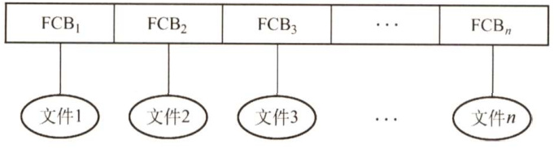
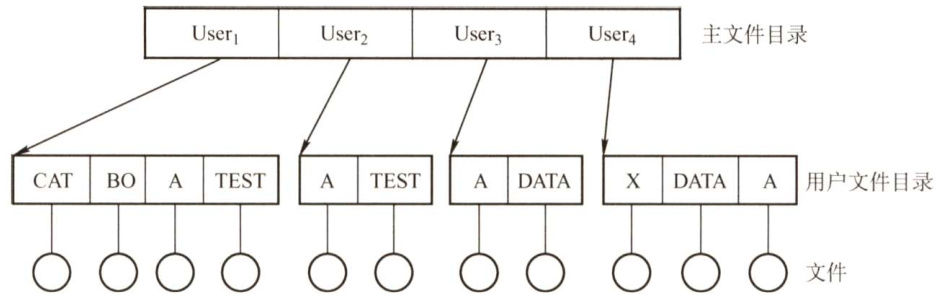
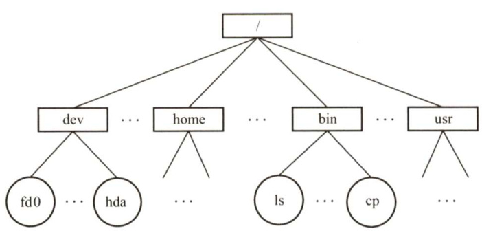
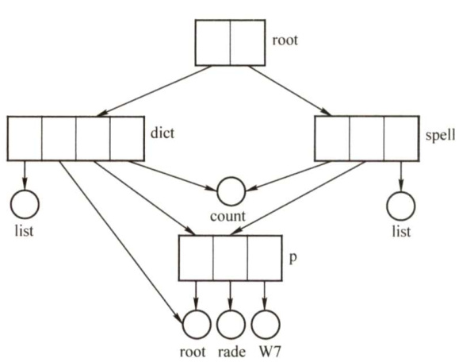
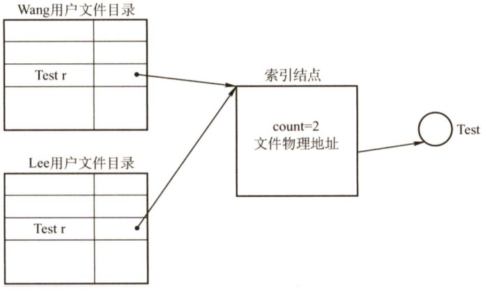
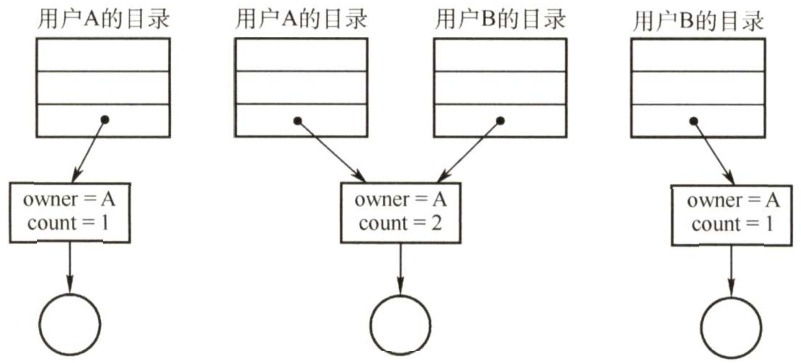
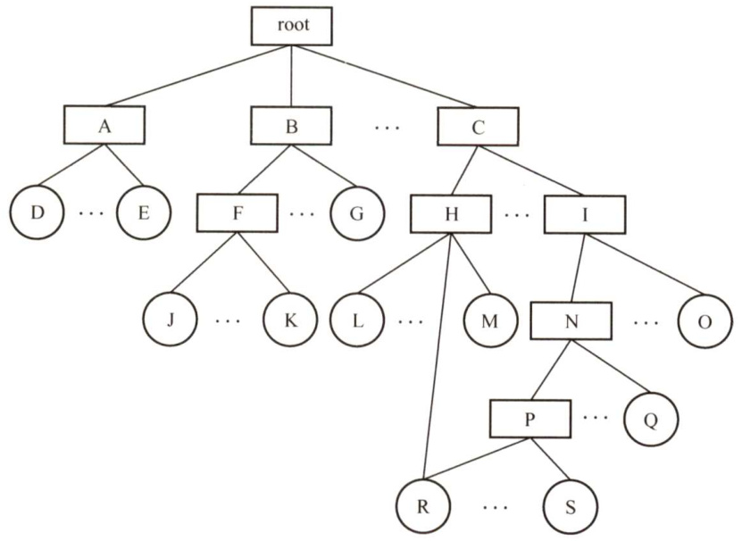
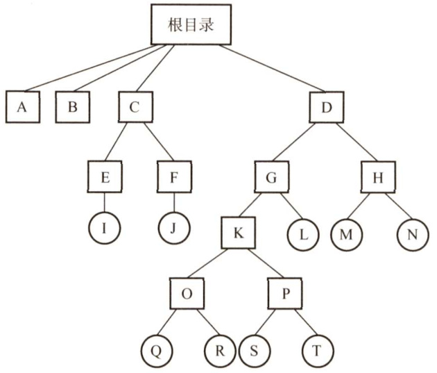
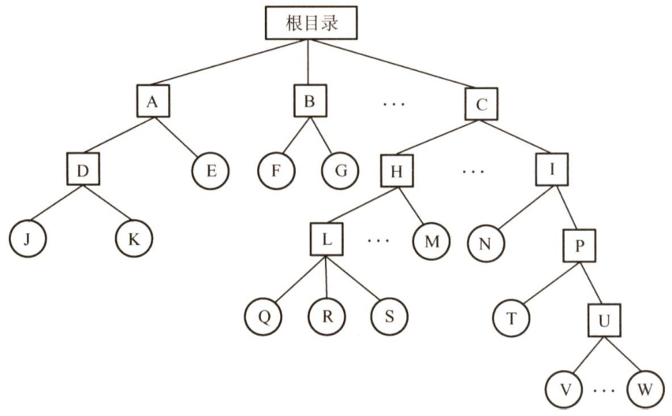
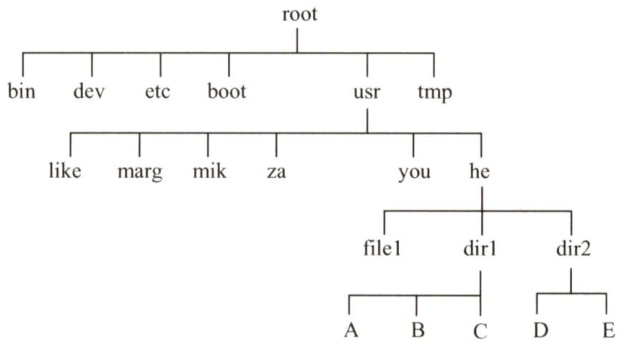

#### 4.2 目录  

在学习本节时，请读者思考以下问题：  

1）目录管理的要求是什么？  

2）在目录中查找某个文件可以使用什么方法？  

上节介绍了文件的逻辑结构和物理结构，本节将介绍目录的实现。文件目录也是一种数据结构，用于标识系统中的文件及其物理地址，供检索时使用。通常，一个文件目录也被视为一个文件。在学习本节的内容时，读者可以围绕目录管理的要求来思考。  

#### 4.2.1 目录的基本概念  

上节说过，FCB的有序集合称为文件目录，一个FCB就是一个文件目录项。与文件管理系统和文件集合相关联的是文件目录，它包含有关文件的属性、位置和所有权等。  

首先来看目录管理的基本要求：从用户的角度看，目录在用户（应用程序）所需要的文件名和文件之间提供一种映射，所以目录管理要实现“按名存取”；目录存取的效率直接影响到系统的性能，所以要提高对目录的检索速度；在多用户系统中，应允许多个用户共享一个文件，因此目录还需要提供用于控制访问文件的信息。此外，应允许不同用户对不同文件采用相同的名字，以便于用户按自己的习惯给文件命名，目录管理通过树形结构来解决和实现。  

#### 4.2.2 目录结构  

#### 1.单级目录结构  

在整个文件系统中只建立一张目录表，每个文件占一个目录项，如图4.11所示。  

  
图4.11 单级目录结构  

当访问一个文件时，先按文件名在该目录中查找到相应的FCB，经合法性检查后执行相应的操作。当建立一个新文件时，必须先检索所有目录项，以确保没有“重名”的情况，然后在该目录中增设一项，把新文件的属性信息填入到该项中。当删除一个文件时，先从该目录中找到该文件的目录项，回收该文件所占用的存储空间，然后清除该目录项。  

单级目录结构实现了“按名存取”，但是存在查找速度慢、文件不允许重名、不便于文件共享等缺点，而且对于多用户的操作系统显然是不适用的。  

#### 2.两级目录结构  

为了克服单级目录所存在的缺点，可以采用两级方案，将文件目录分成主文件目录（MasterFile Directory，MFD）和用户文件目录（User FileDirectory，UFD）两级，如图4.12所示。  

  
图4.12两级目录结构  

主文件目录项记录用户名及相应用户文件目录所在的存储位置。用户文件目录项记录该用户文件的FCB信息。当某用户欲对其文件进行访问时，只需搜索该用户对应的UFD，这既解决了不同用户文件的“重名”问题，又在一定程度上保证了文件的安全。  

两级目录结构提高了检索的速度，解决了多用户之间的文件重名问题，文件系统可以在目录上实现访问限制。但是两级目录结构缺乏灵活性，不能对文件分类。  

#### 3.树形目录结构  

将两级目录结构加以推广，就形成了树形目录结构，如图4.13所示。它可以明显地提高对目录的检索速度和文件系统的性能。当用户要访问某个文件时，用文件的路径名标识文件，文件路径名是个字符串，由从根目录出发到所找文件通路上所有目录名与数据文件名用分隔符“／”链接而成。从根目录出发的路径称为绝对路径。当层次较多时，每次从根目录查询会浪费时间，于是加入了当前目录（又称工作目录)，进程对各文件的访问都是相对于当前目录进行的。当用户要访问某个文件时，使用相对路径标识文件，相对路径由从当前目录出发到所找文件通路上所有目录名与数据文件名用分隔符“/”链接而成。  

图4.13是Linux操作系统的目录结构，“/dev/hda”就是一个绝对路径。若当前目录为“/bin”，则“./Is”就是一个相对路径，其中符号“.”表示当前工作目录。  

通常，每个用户都有各自的“当前目录”，登录后自动进入该用户的“当前目录”。操作系  

  
图4.13 树形目录结构  

统提供一条专门的系统调用，供用户随时改变“当前目录”。例如，在UNIX系统中，“/etc/passwd”文件就包含有用户登录时默认的“当前目录”，可用cd命令改变“当前目录”。  

树形目录结构可以很方便地对文件进行分类，层次结构清晰，也能够更有效地进行文件的管理和保护。在树形目录中，不同性质、不同用户的文件，可以分别呈现在系统目录树的不同层次或不同  

子树中，很容易地赋予不同的存取权限。但是，在树形目录中查找一个文件，需要按路径名逐级访问中间结点，增加了磁盘访问次数，这无疑会影响查询速度。目前，大多数操作系统如UNIX、Linux和Windows系统都采用了树形文件目录。  

#### 4.无环图目录结构  

树形目录结构能便于实现文件分类，但不便于实现文件共享，为此在树形目录结构的基础上增加了一些指向同一结点的有向边，使整个目录成为一个有向无环图，如图4.14所示。  

当某用户要求删除一个共享结点时，若系统只是简单地将它删除，则当另一共享用户需要访问时，会因无法找到这个文件而发生错误。为此，可为每个共享结点设置一个共享计数器，每当图中增加对该结点的共享链时，计数器加1；每当某用户提出删除该结点时，计数器减1。仅当共享计数器为0时，才真正删除该结点，否则仅删除请求用户的共享链。  

  
图4.14无环图目录结构  

共享文件（或目录）不同于文件拷贝（副本)。若有两个文件拷贝，则每个程序员看到的是拷贝而不是原件；然而，若一个文件被修改，则另一个程序员的拷贝不会改变。对于共享文件，只存在一个真正的文件，任何改变都会为其他用户所见。  

无环图目录结构方便地实现了文件的共享，但使得系统的管理变得更加复杂。  

#### 4.2.3 目录的操作  

在理解一个文件系统的需求前，我们首先考虑在目录这个层次上所需要执行的操作，这有助于后面文件系统的整体理解。  

·搜索。当用户使用一个文件时，需要搜索目录，以找到该文件的对应目录项。  
·创建文件。当创建一个新文件时，需要在目录中增加一个目录项。  
·删除文件。当删除一个文件时，需要在目录中删除相应的目录项。  
·创建目录。在树形目录结构中，用户可创建自己的用户文件目录，并可再创建子目录。  
·删除目录。有两种方式： $\textcircled{1}$ 不删除非空目录，删除时要先删除目录中的所有文件，并递归地删除子目录。 $\textcircled{2}$ 可删除非空目录，目录中的文件和子目录同时被删除。  
·移动目录。将文件或子目录在不同的父目录之间移动，文件的路径名也会随之改变。·显示目录。用户可以请求显示目录的内容，如显示该用户目录中的所有文件及属性。  
·修改目录。某些文件属性保存在目录中，因而这些属性的变化需要改变相应的目录项。  

#### $^{*}4.2.4$ 目录实现  

在访问一个文件时，操作系统利用路径名找到相应目录项，目录项中提供了查找文件磁盘块所需要的信息。目录实现的基本方法有线性列表和哈希表两种，要注意目录的实现就是为了查找，因此线性列表实现对应线性查找，哈希表的实现对应散列查找。  

#### 1.线性列表  

最简单的目录实现方法是，采用文件名和数据块指针的线性列表。当创建新文件时，必须首先搜索目录以确定没有同名的文件存在，然后在目录中增加一个新的目录项。当删除文件时，则根据给定的文件名搜索目录，然后释放分配给它的空间。当要重用目录项时有许多种方法：可以将目录项标记为不再使用，或将它加到空闲目录项的列表上，还可以将目录的最后一个目录项复制到空闲位置，并减少目录的长度。采用链表结构可以减少删除文件的时间。  

线性列表的优点在于实现简单，不过由于线性表的特殊性，查找比较费时。  

#### 2．哈希表  

除了采用线性列表存储文件目录项，还可以采用哈希数据结构。哈希表根据文件名得到一个值，并返回一个指向线性列表中元素的指针。这种方法的优点是查找非常迅速，插入和删除也较简单，不过需要一些措施来避免冲突（两个文件名称哈希到同一位置)。  

目录查询是通过在磁盘上反复搜索完成的，需要不断地进行I/O操作，开销较大。所以如前所述，为了减少IO 操作，把当前使用的文件目录复制到内存，以后要使用该文件时只需在内存中操作，因此降低了磁盘操作次数，提高了系统速度。  

#### 4.2.5 文件共享  

文件共享使多个用户共享同一个文件，系统中只需保留该文件的一个副本。若系统不能提供共享功能，则每个需要该文件的用户都要有各自的副本，会造成对存储空间的极大浪费。  

现代常用的两种文件共享方法如下。  

#### 1．基于索引结点的共享方式（硬链接）  

在树形结构的目录中，当有两个或多个用户要共享一个子目录或文件时，必须将共享文件或子目录链接到两个或多个用户的目录中，才能方便地找到该文件，如图4.15所示。  

  
图4.15基于索引结点的共享方式  

在这种共享方式中，诸如文件的物理地址及其他的文件属性等信息，不再放在目录项中，而放在索引结点中。在文件目录中只设置文件名及指向相应索引结点的指针。在索引结点中还应有一个链接计数count，用于表示链接到本索引结点（即文件）上的用户目录项的数目。当count $=2$ 时，表示有两个用户目录项链接到本文件上，或者说有两个用户共享此文件。  

用户A创建一个新文件时，他便是该文件的所有者，此时将count置为1。用户B要共享此文件时，在B的目录中增加一个目录项，并设置一个指针指向该文件的索引结点。此时，文件主仍然是用户A，count $=2$ 。如果用户A不再需要此文件，能否直接将其删除呢？答案是否定的。因为若删除了该文件，也必然删除了该文件的索引结点，这样便会使用户B的指针悬空，而B可能正在此文件上执行写操作，此时将因此半途而废。因此用户A不能删除此文件，只是将该文件的count减1，然后删除自己目录中的相应目录项。用户B仍可以使用该文件。当count $=0$ 时，表示没有用户使用该文件，才会删除该文件。如图4.16给出了用户B链接到文件上的前、后情况。  

  
图4.16文件共享中的链接计数  

#### 2．利用符号链实现文件共享（软链接）  

为使用户B能共享用户A的一个文件F，可以由系统创建一个LINK类型的新文件，也取名为F，并将该文件写入用户B的目录中，以实现用户B的目录与文件F的链接。在新文件中只包含被链接文件F的路径名。当用户B要访问被链接的文件F且正要读LINK类新文件时，操作系统查看到要读的文件是LINK类型，则根据该文件中的路径名去找到文件F，然后对它进行读，从而实现用户B对文件F的共享。这样的链接方法被称为符号链接。  

在利用符号链方式实现文件共享时，只有文件主才拥有指向其索引结点的指针。而共享该文件的其他用户只有该文件的路径名，并不拥有指向其索引结点的指针。这样，也就不会发生在文件主删除一共享文件后留下一悬空指针的情况。当文件主把一个共享文件删除后，若其他用户又试图通过符号链去访问它时，则会访问失败，于是将符号链删除，此时不会产生任何影响。  

在符号链的共享方式中，当其他用户读共享文件时，系统根据文件路径名逐个查找目录，直至找到该文件的索引结点。因此，每次访问共享文件时，都可能要多次地读盘。使得访问文件的开销甚大，且增加了启动磁盘的频率。此外，符号链的索引结点也要耗费一定的磁盘空间。  

利用符号链实现网络文件共享时，只需提供该文件所在机器的网络地址及文件路径名。  

硬链接和软链接都是文件系统中的静态共享方法，在文件系统中还存在着另外的共享需求，即两个进程同时对同一个文件进行操作，这样的共享称为动态共享。  

可以这样说：文件共享，“软”“硬”兼施。硬链接就是多个指针指向一个索引结点，保证只要还有一个指针指向索引结点，索引结点就不能删除；软链接就是把到达共享文件的路径记录下来，当要访问文件时，根据路径寻找文件。可见，硬链接的查找速度要比软链接的快。  

#### 4.2.6 本节小结  

本节开头提出的问题的参考答案如下。  

1）目录管理的要求是什么？  

$\textcircled{1}$ 实现“按名存取”，这是目录管理最基本的功能。 $\textcircled{2}$ 提高对目录的检索速度，从而提高对文件的存取速度。 $\textcircled{3}$ 为了方便用户共享文件，目录还需要提供用于控制访问文件的信息。 $\textcircled{4}$ 允许不同用户对不同文件采用相同的名字，以便用户按自己的习惯给文件命名。  

2）在目录中查找某个文件可以使用什么方法？  

可以采用线性列表法或哈希表法。线性列表把文件名组织成一个线性表，查找时依次与线性表中的每个表项进行比较。若把文件名按序排列，则使用折半查找法可以降低平均的查找时间，但建立新文件时会增加维护线性表的开销。哈希表用文件名通过哈希函数得到一个指向文件的指针，这种方法非常迅速，但要注意避免冲突。  

#### 4.2.7 本节习题精选  

#### 一、单项选择题  

01．一个文件系统中，其FCB占64B，一个盘块大小为1KB，采用一级目录。假定文件目录中有3200个目录项。则查找一个文件平均需要（）次访问磁盘。  

A.50 B.54 C. 100 D. 200  

02．下列关于目录检索的论述中，正确的是（）。  

A．由于散列法具有较快的检索速度，因此现代操作系统中都用它来替代传统的顺序检索方法  
B．在利用顺序检索法时，对树形目录应采用文件的路径名，且应从根目录开始逐级检索  
C．在利用顺序检索法时，只要路径名的一个分量名未找到，就应停止查找  
D．利用顺序检索法查找完成后，即可得到文件的物理地址  

03．一个文件的相对路径名是从（）开始，逐步沿着各级子目录追溯，最后到指定文件的整个通路上所有子目录名组成的一个字符串。  

A．当前目录 B．根目录 C．多级目录 D.二级目录  

04.文件系统采用多级目录结构的目的是（）。  

A.减少系统开销 B．节省存储空间 C.解决命名冲突 D.缩短传送时间  

05.若文件系统中有两个文件重名，则不应采用（）。  

A．单级目录结构 B．两级目录结构 C．树形目录结构 D.多级目录结构  

06．下面的说法中，错误的是（）。  

I．一个文件在同一系统中、不同的存储介质上的复制文件，应采用同一种物理结构ⅡI．对一个文件的访问，常由用户访问权限和用户优先级共同限制III．文件系统采用树形目录结构后，对于不同用户的文件，其文件名应该不同IV．为防止系统故障造成系统内文件受损，常采用存取控制矩阵方法保护文件  

A. B.I、III C.I、IⅢ、IV D.全选)7.【2010统考真题】设置当前工作目录的主要目的是（）。  

A．节省外存空间 B．节省内存空间C.加快文件的检索速度 D.加快文件的读/写速度  

08.【2009统考真题】设文件F1的当前引用计数值为1，先建立文件F1的符号链接（软链接）文件F2，再建立文件F1的硬链接文件F3，然后删除文件F1。此时，文件F2和文  

件F3的引用计数值分别是（）。  

A.0,1 B.1,1 C.1,2 D.2,1  

09.【2017统考真题】若文件fl的硬链接为f2，两个进程分别打开fl和f2，获得对应的文件描述符为fd1和fd2，则下列叙述中正确的是（）。  

I．f1和f2的读写指针位置保持相同  
II.f1和f2共享同一个内存索引结点  
III.fd1和fd2分别指向各自的用户打开文件表中的一项  

A.仅IⅢ B.仅Ⅱ、II C.仅I、Ⅱ D.I、Ⅱ和IⅢ  

10.【2020统考真题】若多个进程共享同一个文件F，则下列叙述中，正确的是（）。  

A．各进程只能用“读”方式打开文件FB．在系统打开文件表中仅有一个表项包含F的属性C．各进程的用户打开文件表中关于F的表项内容相同D.进程关闭F时，系统删除F在系统打开文件表中的表项  

11.【2021统考真题】若目录dir下有文件filel，则为删除该文件内核不必完成的工作是（）  

A．删除filel的快捷方式 B.释放filel的文件控制块C.释放filel占用的磁盘空间 D.删除目录dir中与filel对应的目录项  

#### 二、综合应用题  

01．设某文件系统采用两级目录的结构，主目录中有10个子目录，每个子目录中有10个目录项。在同样多目录的情况下，若采用单级目录结构，所需平均检索目录项数是两级目录结构平均检索目录项数的多少倍？  

02.对文件的目录结构回答以下问题：  

1）若一个共享文件可以被用户随意删除或修改，会有什么问题？  
2）若允许用户随意地读、写和修改目录项，会有什么问题？  
3）如何解决上述问题？  

03.有文件系统如下图所示，图中的框表示目录，圆圈表示普通文件。  

1）可否建立F与R的链接？试加以说明。  
2）能否删除R？为什么？  
3）能否删除N？为什么？  

  

04.某树形目录结构的文件系统如下图所示。该图中的方框表示目录，圆圈表示文件。  

  

1）可否进行下列操作？  

$\textcircled{1}$ 在目录D中建立一个文件，取名为A。  
$\textcircled{2}$ 将目录C改名为A。  

2）若E和G分别为两个用户的目录：  

$\textcircled{1}$ 用户E欲共享文件Q，应有什么条件？如何操作？$\textcircled{2}$ 在一段时间内用户G主要使用文件S和T。为简化操作和提高速度，应如何处理？$\textcircled{3}$ 用户E欲对文件I加以保护，不许别人使用，能否实现？如何实现？  

05.有一个文件系统如图A所示。图中的方框表示目录，圆圈表示普通文件。根目录常驻内存，目录文件组织成链接文件，不设FCB，普通文件组织成索引文件。目录表指示下一级文件名及其磁盘地址（各占2B，共4B）。下级文件是目录文件时，指示其第一个磁盘块地址。下级文件是普通文件时，指示其FCB的磁盘地址。每个目录的文件磁盘块的最后4B供拉链使用。下级文件在上级目录文件中的次序在图中为从左至右。每个磁盘块有512B，与普通文件的一页等长。  

  
图A某树形结构文件系统框图  

普通文件的FCB组织如图B所示。其中，每个磁盘地址占2B，前10个地址直接指示该文件前10页的地址。第11个地址指示一级索引表地址，一级索引表中的每个磁盘地址指示一个文件页地址；第12个地址指示二级索引表地址，二级索引表中的每个地址指示一个一级索引表地址；第13个地址指示三级索引表地址，三级索引表中的每个地址指示一个二级索引表地址。请问：  

1）一个普通文件最多可有多少个文件页？  
2）若要读文件J中的某一页，最多启动磁盘多少次？  
3）若要读文件W中的某一页，最少启动磁盘多少次？  
4）根据3），为最大限度地减少启动磁盘的次数，可采用什么  
方法？此时，磁盘最多启动多少次？  

<html><body><table><tr><td>该文件的有关描述信息</td></tr><tr><td>一 磁盘地址</td></tr><tr><td>2 磁盘地址</td></tr><tr><td>3 磁盘地址</td></tr><tr><td></td></tr><tr><td>11 磁盘地址</td></tr><tr><td>12 磁盘地址</td></tr><tr><td>13 磁盘地址</td></tr></table></body></html>  

06．某个文件系统中，外存为硬盘。物理块大小为512B，有文件A包含598条记录，每条记录占255B，每个物理块放2条记录。文件A所在的目录如下图所示。文件目录采用多级树形目录结构，由根目录结点、作为目录文件的中间结点和作为信息文件的树叶组成，每个目录项占127B，每个物理块放4个目录项，根目录的第一块常驻内存。试问：  

  
图B FCB组织  

1）若文件的物理结构采用链式存储方式，链指针地址占2B，则要将文件A读入内存，至少需要存取几次硬盘？2）若文件为连续文件，则要读文件A的第487条记录至少要存取几次硬盘？3）一般为减少读盘次数，可采取什么措施，此时可减少几次存取操作？  

#### 4.2.8 答案与解析  

#### 一、单项选择题  

01.C  

3200个目录项占用的盘块数为 $3200{\times}64\mathrm{B}/1\mathrm{KB}=200$ 个。因为一级目录平均访盘次数为1/2盘块数（顺序查找目录表中的所有目录项，每个目录项为一个FCB)，所以平均的访问磁盘次数为 $200/2=100$ 次。  

02.C  

实现用户对文件的按名存取，系统先利用用户提供的文件名形成检索路径，对目录进行检索。在顺序检索中，路径名的一个分量未找到，说明路径名中的某个目录或文件不存在，不需要继续检索，C正确。目录的查询方式有两种：顺序检索法和Hash法，通常采用顺序检索法，A错误。在树形目录中，为了加快文件检索速度，可设置当前目录，于是文件路径可以从当前目录开始查找，B错误。在顺序检索法查找完成后，得到的是文件的逻辑地址，D错误。  

03.A  

相对路径是从当前目录出发到所找文件通路上所有目录名和数据文件名用分隔符连接起来而形成的，注意与绝对路径的区别。  

04.C  

在文件系统中采用多级目录结构后，符合了多层次管理的需要，提高了文件查找的速度，还允许用户建立同名文件。因此，多级目录结构的采用解决了命名冲突。  

05.A  

在单级目录文件中，每当新建一个文件时，必须先检索所有的目录项，以保证新文件名在目录中是唯一的。所以单级目录结构无法解决文件重名问题。  

06.D  

文件在磁带上通常采用连续存放方法，在硬盘上通常不采用连续存放方法，在内存上采用随机存放方法，I错误。对文件的访问控制，常由用户访问权限和文件属性共同限制，ⅡI错误。在树形目录结构中，对于不同用户的文件，文件名可以不同也可以相同，ⅡI错误。防止文件受损常采用备份的方法，而存取控制矩阵方法用于多用户之间的存取权限保护，IV错误。  

07.C  

当一个文件系统含有多级目录时，每访问一个文件，都要使用从树根开始到树叶为止、包括各中间结点名的全路径名。当前目录又称工作目录，进程对各个文件的访问都相对于当前目录进行，而不需要从根目录一层一层地检索，加快了文件的检索速度。选项A、B都与相对目录无关；选项D，文件的读/写速度取决于磁盘的性能。  

08.B  

建立符号链接时，引用计数值直接复制；建立硬链接时，引用计数值加1。删除文件时，删除操作对于符号链接是不可见的，这并不影响文件系统，当以后再通过符号链接访问时，发现文件不存在，直接删除符号链接；但对于硬链接则不可直接删除，引用计数值减1，若值不为0，则不能删除此文件，因为还有其他硬链接指向此文件。  

当建立F2时，F1和F2的引用计数值都为1。当再建立F3时，F1和F3的引用计数值就都变成了2。当后来删除F1时，F3的引用计数值为 $2-1=1$ ，F2的引用计数值不变。  

09.B  

硬链接指通过索引结点进行链接。一个文件在物理存储器上有一个索引结点号。存在多个文件名指向同一个索引结点的情况，Ⅱ正确。两个进程各自维护自己的文件描述符，II正确，I错误。所以选择B。  

10.B  

解析请扫右侧二维码查阅。  

11.A  

删除一个文件时，会根据文件控制块回收相应的磁盘空间，将文件控制块回收，并删除目录中对应的目录项。B、C、D正确。快捷方式属于文件共享中的软连接，本质上创建的是一个链接文件，其中存放的是访问该文件的路径，删除文件并不会导致文件的快捷方式被删除，正如在Windows中删除一个程序后，其快捷方式可能仍然留在桌面上，但是已经无法打开。  

#### 二、综合应用题  

01.【解答】  

依题意，文件系统中共有 $10\times10=100$ 个目录，若采用单级目录结构，目录表中有100个目录项，在检索一个文件时，平均检索的目录项数 $\mathbf{\Psi}=\mathbf{\Psi}$ 目录项 $/2=50$ 。采用两级目录结构时，主目录有10个目录项，每个子目录均有10个目录项，每级平均检索5个目录项，即检索一个文件时平均检索10个目录项，所以采用单级目录结构所需检索目录项数是两级目录结构检索目录项数的$50/10=5\$ 倍。  

02.【解答】  

1）将有可能导致共享该文件的其他用户无文件可用，或使用了不想使用的文件，导致发生错误。  
2）用户可以通过修改目录项来改变对文件的存取权限，从而非法地使用系统的文件；另外，对目录项不负责任的修改会造成管理上的混乱。  
3）解决办法是不允许用户直接执行上述操作，而必须通过系统调用来执行这些操作。  

03.【解答】  

1）可以建立链接。因为F是目录而R是文件，所以可以建立R到F的符号链接。除了符号链接，也可以通过硬链接的方式。  
2）不一定能删除R。由于R被多个目录共享，能否删除R取决于文件系统实现共享的方法。若采用基于索引结点的共享方法，则因删除后存在指针悬空问题而不能删除R结点。若采用基于符号共享的方法，则可以删除R结点。  
3）不一定能删除N。由于N的子目录中存在共享文件R，而R结点本身不一定能被删除，所以N也不一定能被删除。  

04.【解答】  

1) $\textcircled{1}$ 由于目录D中没有已命名为A的文件，因此在目录D中，可以建立一个名为A的文件。 $\textcircled{2}$ 因为在文件系统的根目录下已存在一个名为A的目录，所以根目录下的目录C不能改名为A。  

2) $\textcircled{1}$ 用户E欲共享文件Q，需要用户E有访问文件Q的权限。在访问权限许可的情况下，用户E可通过相应路径来访问文件Q，即用户E通过自己的主目录E找到其父目录C，再访问目录C的父目录（根目录)，然后依次通过目录D,GK和O访问文件Q。若用户E的当前目录为E，则访问路径为.././D/G/K/O/Q，其中符号“..”表示父目录，符号“/”用于分隔路径中的各目录名。 $\textcircled{2}$ 用户G需要通过依次访问目录K和目录P，才能访问文件S 和文件T。为了提高文件访问速度，可在目录G下建立两个链接文件，分别链接到文件S和文件T上。这样用户G就可直接访问这两个文件。 $\textcircled{3}$ 用户E可以修改文件I的存取控制表来对文件I加以保护，不让别的用户使用。具体实现方法是：在文件I的存取控制表中，只留下用户E的访问权限，其他用户对该文件无操作权限，从而达到不让其他用户访问的目的。  

05.【解答】  

1）因为磁盘块大小为512B，所以索引块大小也为512B，每个磁盘地址大小为2B。因此，一个一级索引表可容纳 256 个磁盘地址。同样，一个二级索引表可容纳256个一级索引表地址，一个三级索引表可容纳 256个二级索引表地址。这样，一个普通文件最多可有的文件页数为 $10+256+256\times256+256\times256\times256=16843018.$ 。  

2）由图可知，目录文件A和D中的目录项都只有两个，因此这两个目录文件都只占用一个物理块。要读文件』中的某一页，先从内存的根目录中找到目录文件A的磁盘地址，将其读入内存（已访问磁盘1次)。然后从目录A中找出目录文件D的磁盘地址读入内存（已访问磁盘2次)。再从目录D中找出文件J的FCB地址读入内存（已访问磁盘3次)。在最坏情况下，该访问页存放在三级索引下，这时候需要一级级地读三级索引块才能得到文件J的地址（已访问磁盘6次)。最后读入文件J中的相应页（共访问磁盘7次)。所以，若要读文件J中的某一页，最多启动磁盘7次。  

3）由图可知，目录文件C和U的目录项较多，可能存放在多个链接在一起的磁盘块中。在最好情况下，所需的目录项都在目录文件的第一个磁盘块中。先从内存的根目录中找到目录文件C的磁盘地址并读入内存（已访问磁盘1次)。在C中找出目录文件I的磁盘地址并读入内存（已访问磁盘2次)。在I中找出目录文件P的磁盘地址并读入内存（已访问磁盘3次)。从P中找到目录文件U的磁盘地址并读入内存（已访问磁盘4次)。从U的第一个磁盘块中找出文件W的FCB地址并读入内存（已访问磁盘5次)。在最好情况下，要访问的页在FCB的前10个直接块中，按照直接块指示的地址读文件W的相应页（已访问磁盘6次)。所以，若要读文件W中的某页，最少启动磁盘6次。  

4）为了减少启动磁盘的次数，可以将需要访问的W文件挂在根目录的最前面的目录项中。此时，只需读内存中的根目录就可找到W的FCB，将FCB读入内存（已访问磁盘1次)，最差情况下，需要的W文件的那个页挂在FCB的三级索引下，因此读3个索引块需要访问磁盘3次（已访问磁盘4次）得到该页的物理地址，再去读这个页即可（已访问磁盘5次)。此时，磁盘最多启动5次。  

06.【解答】  

1）由于根目录的第一块常驻内存（即root所指的/bin,/dev,/etc,/boot等可直接获得），根目录找到文件A需要5次读盘。由 $255\times2+2=512$ 可知，一个物理块在链式存储结构下可放2条记录及下一个物理块地址，而文件A共有598条记录，因此读取A的所有记录所需的读盘次数为 $598/2=299$ ，所以将文件A读到内存至少需读盘 $299+5=304$ 次。  

2）当文件为连续文件时，找到文件A同样需要5次读盘，且知道文件A的地址后通过计算只需一次读盘即可读出第487条记录，所以至少需要 $5+1=6$ 次读盘。  

3）为减少因查找目录而读盘的次数，可采用索引结点方法。若一个目录项占16B，则一个盘块可存放 $512/16=32$ 个目录项，与本题一个盘块仅能存放4个目录相比，可使因访问目录而读盘的次数减少1/8。对查找文件的记录而言，可用一个或多个盘块来存放该文件的所有盘块号，即用链接索引方法；一个盘块可存放 $512/2-1=255$ 个盘块号，留下一个地址用来指向下一个存储盘块号（索引块）的磁盘块号。这样，就本题来说，查找目录时需启动5次磁盘。文件A共有299个盘块，则查找文件A的某一记录时需两次取得所有盘块号，再需最多启动一次磁盘即可把A中的任意一条记录读入内存。所以，查找一条记录最多需要8次访盘，而原来的链接方法查找一条记录时，读盘次数为 $6\sim304$ 0