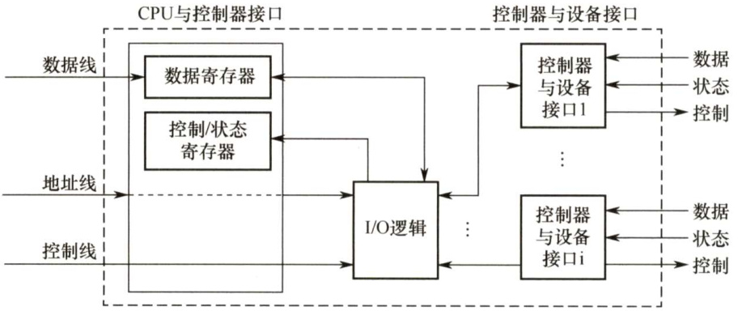
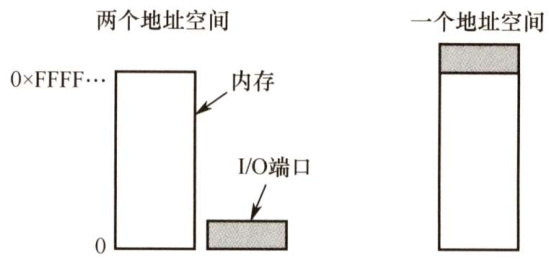
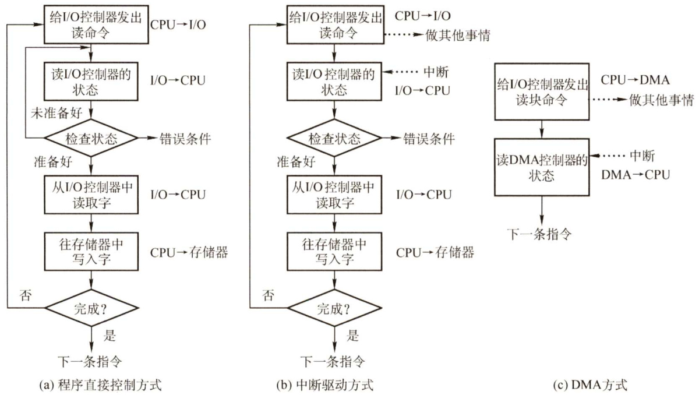
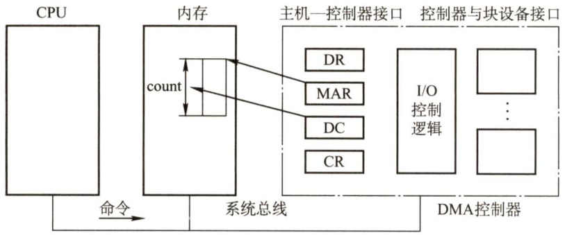
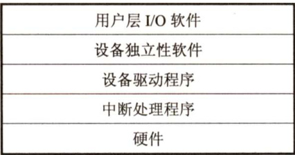

### 5.1 I/O管理概述  

#### 5.1.1 I/O设备  

I/O设备管理是操作系统设计中最凌乱也最具挑战性的部分。由于它包含了很多领域的不同设备及与设备相关的应用程序，因此很难有一个通用且一致的设计方案。  

#### 1．设备的分类  

按信息交换的单位分类，IO设备可分为：  

1）块设备。信息交换以数据块为单位。它属于有结构设备，如磁盘等。磁盘设备的基本特征是传输速率较高、可寻址，即对它可随机地读/写任一块。  

2）字符设备。信息交换以字符为单位。它属于无结构类型，如交互式终端机、打印机等。它们的基本特征是传输速率低、不可寻址，并且时常采用中断IO方式。  

按传输速率分类，I/O设备可分为：  

1）低速设备。传输速率仅为每秒几字节到数百字节的一类设备，如键盘、鼠标等。  
2）中速设备。传输速率为每秒数千字节至数万字节的一类设备，如激光打印机等。  
3）高速设备。传输速率在数百千字节至千兆字节的一类设备，如磁盘机、光盘机等。  

#### 2.I/O接口  

IO接口（设备控制器）位于CPU与设备之间，它既要与CPU通信，又要与设备通信，还要具有按CPU发来的命令去控制设备工作的功能，主要由三部分组成，如图5.1所示。  

  
图5.1设备控制器的组成  

1）设备控制器与CPU的接口。该接口有三类信号线：数据线、地址线和控制线。数据线通常与两类寄存器相连：数据寄存器（存放从设备送来的输入数据或从CPU送来的输出数据）和控制/状态寄存器（存放从CPU送来的控制信息或设备的状态信息)。  

2）设备控制器与设备的接口。一个设备控制器可以连接一个或多个设备，因此控制器中有一个或多个设备接口。每个接口中都存在数据、控制和状态三种类型的信号。  

3）IO逻辑。用于实现对设备的控制。它通过一组控制线与CPU交互，对从CPU收到的I/O命令进行译码。CPU 启动设备时，将启动命令发送给控制器，同时通过地址线把地址发送给控制器，由控制器的I/O逻辑对地址进行译码，并相应地对所选设备进行控制。  

设备控制器的主要功能有： $\textcircled{1}$ 接收和识别CPU 发来的命令，如磁盘控制器能接收读、写、查找等命令； $\textcircled{2}$ 数据交换，包括设备和控制器之间的数据传输，以及控制器和主存之间的数据传输； $\textcircled{3}$ 标识和报告设备的状态，以供CPU处理； $\textcircled{4}$ 地址识别； $\textcircled{5}$ 数据缓冲； $\textcircled{6}$ 差错控制。  

#### 3.I/O端口  

VO端口是指设备控制器中可被CPU直接访问的寄存器，主要有以下三类寄存器。  

$\bullet$ 数据寄存器：实现CPU和外设之间的数据缓冲。  

$\bullet$ 状态寄存器：获取执行结果和设备的状态信息，以让CPU知道是否准备好。  

$\bullet$ 控制寄存器：由CPU写入，以便启动命令或更改设备模式。  

为了实现CPU与I/O端口进行通信，有两种方法，如图5.2所示。  

1）独立编址。为每个端口分配一个I/O端口号，所有I/O端口形成I/O端口空间，普通用户程序不能对其进行访问，只有操作系统使用特殊的I/O指令才能访问端口。  

2）统一编址。又称内存映射 $\mathrm{I}/0$ ，每个端口被分配唯一的内存地址，且不会有内存被分配这一地址，通常分配给端口的地址靠近地址空间的顶端。  

  
图5.2独立编址I/O和内存映射I/O  

#### 5.1.2 I/O控制方式  

设备管理的主要任务之一是控制设备和内存或CPU之间的数据传送。外围设备和内存之间的输入/输出控制方式有4种，下面分别加以介绍。  

#### 1．程序直接控制方式  

如图5.3(a)所示，计算机从外部设备读取的每个字，CPU 需要对外设状态进行循环检查，直到确定该字已经在I/O控制器的数据寄存器中。在程序直接控制方式中，由于CPU的高速性和I/O设备的低速性，致使CPU的绝大部分时间都处于等待I/O设备完成数据I/O的循环测试中，造成了CPU资源的极大浪费。在该方式中，CPU之所以要不断地测试I/O设备的状态，就是因为在CPU中未采用中断机构，使I/O设备无法向CPU报告它已完成了一个字符的输入操作。  

  
图5.3I/O控制方式  

程序直接控制方式虽然简单且易于实现，但其缺点也显而易见，由于CPU和IO设备只能串行工作，导致CPU的利用率相当低。  

#### 2.中断驱动方式  

中断驱动方式的思想是，允许I/O设备主动打断CPU的运行并请求服务，从而“解放”CPU，使得其向I/O控制器发送读命令后可以继续做其他有用的工作。如图5.3(b)所示，我们从I/O控制器和CPU两个角度分别来看中断驱动方式的工作过程。  

从IO控制器的角度来看，I/O控制器从CPU接收一个读命令，然后从外部设备读数据。一旦数据读入IO控制器的数据寄存器，便通过控制线给CPU发出中断信号，表示数据已准备好，然后等待CPU请求该数据。I/O控制器收到CPU发出的取数据请求后，将数据放到数据总线上，传到CPU的寄存器中。至此，本次I/O操作完成，I/O控制器又可开始下一次I/O操作。  

从CPU的角度来看，CPU发出读命令，然后保存当前运行程序的上下文（现场，包括程序计数器及处理机寄存器)，转去执行其他程序。在每个指令周期的末尾，CPU检查中断。当有来自IO控制器的中断时，CPU保存当前正在运行程序的上下文，转去执行中断处理程序以处理该中断。这时，CPU从I/O控制器读一个字的数据传送到寄存器，并存入主存。接着，CPU恢复发出I/O命令的程序（或其他程序）的上下文，然后继续运行。  

中断驱动方式比程序直接控制方式有效，但由于数据中的每个字在存储器与IO控制器之间的传输都必须经过CPU，这就导致了中断驱动方式仍然会消耗较多的CPU时间。  

#### 3.DMA方式  

在中断驱动方式中，I/O设备与内存之间的数据交换必须要经过CPU中的寄存器，所以速度还是受限，而DMA（直接存储器存取）方式的基本思想是在I/O设备和内存之间开辟直接的数据交换通路，彻底“解放”CPU。DMA方式的特点如下：  

1）基本单位是数据块。  
2）所传送的数据，是从设备直接送入内存的，或者相反。  
3）仅在传送一个或多个数据块的开始和结束时，才需CPU干预，整块数据的传送是在DMA控制器的控制下完成的。  

图5.4列出了DMA控制器的组成。  

  
图5.4DMA控制器的组成  

要在主机与控制器之间实现成块数据的直接交换，须在DMA控制器中设置如下4类寄存器：  

1）命令/状态寄存器（CR)。接收从CPU发来的I/O命令、有关控制信息，或设备的状态。  
2）内存地址寄存器（MAR)。在输入时，它存放把数据从设备传送到内存的起始目标地址；  
在输出时，它存放由内存到设备的内存源地址。  
3）数据寄存器（DR)。暂存从设备到内存或从内存到设备的数据。  
4）数据计数器（DC)。存放本次要传送的字（节）数。  

如图5.3(c)所示，DMA方式的工作过程是：CPU接收到I/O设备的DMA请求时，它给DMA控制器发出一条命令，同时设置MAR 和DC 初值，启动DMA 控制器，然后继续其他工作。之后 CPU就把控制操作委托给DMA控制器，由该控制器负责处理。DMA 控制器直接与存储器交互，传送整个数据块，每次传送一个字，这个过程不需要CPU参与。传送完成后，DMA控制器发送一个中断信号给处理器。因此只有在传送开始和结束时才需要CPU的参与。  

DMA 方式与中断方式的主要区别是，中断方式在每个数据需要传输时中断CPU，而 DMA方式则是在所要求传送的一批数据全部传送结束时才中断CPU；此外，中断方式的数据传送是在中断处理时由CPU控制完成的，而DMA方式则是在DMA 控制器的控制下完成的。  

#### $^{\star}4$ 。通道控制方式  

I/O通道是指专门负责输入/输出的处理机。I/O通道方式是DMA方式的发展，它可以进一步减少CPU的干预，即把对一个数据块的读（或写）为单位的干预，减少为对一组数据块的读（或写）及有关控制和管理为单位的干预。同时，又可以实现CPU、通道和IO设备三者的并行操作，从而更有效地提高整个系统的资源利用率。  

例如，当CPU要完成一组相关的读（或写）操作及有关控制时，只需向I/O通道发送一条I/O指令，以给出其所要执行的通道程序的首地址和要访问的I/O设备，通道接到该指令后，执行通道程序便可完成CPU指定的I/O任务，数据传送结束时向CPU发中断请求。  

IO 通道与一般处理机的区别是：通道指令的类型单一，没有自己的内存，通道所执行的通道程序是放在主机的内存中的，也就是说通道与CPU共享内存。  

I/O 通道与DMA方式的区别是：DMA方式需要CPU来控制传输的数据块大小、传输的内存位置，而通道方式中这些信息是由通道控制的。另外，每个DMA 控制器对应一台设备与内存传递数据，而一个通道可以控制多台设备与内存的数据交换。  

下面用一个例子来总结这4种I/O方式。想象一位客户要去裁缝店做一批衣服的情形。  

采用程序控制方式时，裁缝没有客户的联系方式，客户必须每隔一段时间去裁缝店看看裁缝把衣服做好了没有，这就浪费了客户不少的时间。采用中断方式时，裁缝有客户的联系方式，每当他完成一件衣服后，给客户打一个电话，让客户去拿，与程序直接控制能省去客户不少麻烦，但每完成一件衣服就让客户去拿一次，仍然比较浪费客户的时间。采用DMA方式时，客户花钱雇一位单线秘书，并向秘书交代好把衣服放在哪里（存放仓库)，裁缝要联系就直接联系秘书，秘书负责把衣服取回来并放在合适的位置，每处理完100件衣服，秘书就要给客户报告一次（大大节省了客户的时间)。采用通道方式时，秘书拥有更高的自主权，与DMA方式相比，他可以决定把衣服存放在哪里，而不需要客户操心。而且，何时向客户报告，是处理完100件衣服就报告，还是处理完10000件衣服才报告，秘书是可以决定的。客户有可能在多个裁缝那里订了货，一位DMA类的秘书只能负责与一位裁缝沟通，但通道类秘书却可以与多名裁缝进行沟通。  

#### 5.1.3 I/O软件层次结构  

I/O 软件涉及的面很宽，往下与硬件有着密切关系，往上又与虚拟存储器系统、文件系统和用户直接交互，它们都需要I/O软件来实现I/O操作。  

为使复杂的I/O软件能具有清晰的结构、良好的可移植性和易适应性，目前已普遍采用层次式结构的I/O软件。将系统中的设备管理模块分为若干个层次，每层都是利用其下层提供的服务，完成输入/输出功能中的某些子功能，并屏蔽这些功能实现的细节，向高层提供服务。在层次式结构的IO软件中，只要层次间的接口不变，对某一层次中的软件的修改都不会引起其下层或高层代码的变更，仅最低层才涉及硬件的具体特性。  

一个比较合理的层次划分如图5.5所示。整个I/O软件可以视为具有4个层次的系统结构，各层次及其功能如下：  

  
图5.5I/O层次结构  

（1）用户层I/O软件  

实现与用户交互的接口，用户可直接调用在用户层提供的、与I/O操作有关的库函数，对设备进行操作。一般而言，大部分的I/O软件都在操作系统内部，但仍有一小部分在用户层，包括与用户程序链接在一起的库函数。用户层软件必须通过一组系统调用来获取操作系统服务。  

#### （2）设备独立性软件  

用于实现用户程序与设备驱动器的统一接口、设备命令、设备的保护及设备的分配与释放等，同时为设备管理和数据传送提供必要的存储空间。  

设备独立性也称设备无关性，使得应用程序独立于具体使用的物理设备。为实现设备独立性而引入了逻辑设备和物理设备这两个概念。在应用程序中，使用逻辑设备名来请求使用某类设备；而在系统实际执行时，必须将逻辑设备名映射成物理设备名使用。  

使用逻辑设备名的好处是： $\textcircled{1}$ 增加设备分配的灵活性； $\textcircled{2}$ 易于实现I/O重定向，所谓I/O重定向，是指用于I/O操作的设备可以更换（即重定向)，而不必改变应用程序。  

为了实现设备独立性，必须再在驱动程序之上设置一层设备独立性软件。总体而言，设备独立性软件的主要功能可分为以下两个方面： $\textcircled{1}$ 执行所有设备的公有操作，包括：对设备的分配与回收；将逻辑设备名映射为物理设备名；对设备进行保护，禁止用户直接访问设备；缓冲管理；差错控制；提供独立于设备的大小统一的逻辑块，屏蔽设备之间信息交换单位大小和传输速率的差异。 $\textcircled{2}$ 向用户层（或文件层）提供统一接口。无论何种设备，它们向用户所提供的接口应是相同的。例如，对各种设备的读/写操作，在应用程序中都统一使用read/write命令等。  

#### （3）设备驱动程序  

与硬件直接相关，负责具体实现系统对设备发出的操作指令，驱动I/O设备工作的驱动程序。通常，每类设备配置一个设备驱动程序，它是I/O进程与设备控制器之间的通信程序，常以进程形式存在。设备驱动程序向上层用户程序提供一组标准接口，设备具体的差别被设备驱动程序所封装，用于接收上层软件发来的抽象I/O要求，如read 和write命令，转换为具体要求后，发送给设备控制器，控制I/O设备工作；它也将由设备控制器发来的信号传送给上层软件，从而为IO内核子系统隐藏设备控制器之间的差异。  

#### （4）中断处理程序  

用于保存被中断进程的CPU环境，转入相应的中断处理程序进行处理，处理完毕再恢复被中断进程的现场后，返回到被中断进程。  

中断处理层的主要任务有：进行进程上下文的切换，对处理中断信号源进行测试，读取设备状态和修改进程状态等。由于中断处理与硬件紧密相关，对用户而言，应尽量加以屏蔽，因此应放在操作系统的底层，系统的其余部分尽可能少地与之发生联系。  

类似于文件系统的层次结构，I/O子系统的层次结构也是我们需要记忆的内容，但记忆不是死记硬背，我们以用户对设备的一次命令来总结各层次的功能，帮助各位读者记忆。  

例如， $\textcircled{1}$ 当用户要读取某设备的内容时，通过操作系统提供的read命令接口，这就经过了用户层。 $\textcircled{2}$ 操作系统提供给用户使用的接口，一般是统一的通用接口，也就是几乎每个设备都可以响应的统一命令，如read命令，用户发出的read命令，首先经过设备独立层进行解析，然后交往下层。 $\textcircled{3}$ 接下来，不同类型的设备对read 命令的行为会有所不同，如磁盘接收read 命令后的行为与打印机接收read命令后的行为是不同的。因此，需要针对不同的设备，把read命令解析成不同的指令，这就经过了设备驱动层。 $\textcircled{4}$ 命令解析完毕后，需要中断正在运行的进程，转而执行read命令，这就需要中断处理程序。 $\textcircled{5}$ 最后，命令真正抵达硬件设备，硬件设备的控制器按照上层传达的命令操控硬件设备，完成相应的功能。  

#### 5.1.4 应用程序I/O接口  

在IO系统与高层之间的接口中，根据设备类型的不同，又进一步分为若干接口。  

（1）字符设备接口  

字符设备是指数据的存取和传输是以字符为单位的设备，如键盘、打印机等。基本特征是传输速率较低、不可寻址，并且在输入/输出时通常采用中断驱动方式。  

get 和put操作。由于字符设备不可寻址，只能采取顺序存取方式，通常为字符设备建立一个字符缓冲区，用户程序通过get操作从缓冲区获取字符，通过put操作将字符输出到缓冲区。  

in-control指令。字符设备类型繁多，差异甚大，因此在接口中提供一种通用的in-control 指令来处理它们（包含了许多参数，每个参数表示一个与具体设备相关的特定功能)。  

字符设备都属于独占设备，为此接口中还需要提供打开和关闭操作，以实现互斥共享。  

（2）块设备接口  

块设备是指数据的存取和传输是以数据块为单位的设备，典型的块设备是磁盘。基本特征是传输速率较高、可寻址。磁盘设备的I/O常采用DMA方式。  

隐藏了磁盘的二维结构。在二维结构中，每个扇区的地址需要用磁道号和扇区号来表示。块设备接口将磁盘的所有扇区从0到 $n-1$ 依次编号，这样，就将二维结构变为一种线性序列。  

将抽象命令映射为低层操作。块设备接口支持上层发来的对文件或设备的打开、读、写和关闭等抽象命令，该接口将上述命令映射为设备能识别的较低层的具体操作。  

内存映射接口通过内存的字节数组来访问磁盘，而不提供读/写磁盘操作。映射文件到内存的系统调用返回包含文件副本的一个虚拟内存地址。只在需要访问内存映像时，才由虚拟存储器实际调页。内存映射文件的访问如同内存读写一样简单，极大地方便了程序员。  

#### （3）网络设备接口  

现代操作系统都提供面向网络的功能，因此还需要提供相应的网络软件和网络通信接口，使计算机能够通过网络与网络上的其他计算机进行通信或上网浏览。  

许多操作系统提供的网络IO接口为网络套接字接口，套接字接口的系统调用使应用程序创建的本地套接字连接到远程应用程序创建的套接字，通过此连接发送和接收数据。  

（4）阻塞/非阻塞I/O  

操作系统的I/O接口还涉及两种模式：阻塞和非阻塞。  

阻塞IO是指当用户进程调用I/O操作时，进程就被阻塞，需要等待I/O操作完成，进程才被唤醒继续执行。非阻塞I/O是指用户进程调用IO操作时，不阻塞该进程，该I/O调用返回一个错误返回值，通常，进程需要通过轮询的方式来查询I/O操作是否完成。  

大多数操作系统提供的I/O接口都是采用阻塞I/O。  

#### 5.1.5 本节小结  

本节开头提出的问题的参考答案如下。  

I/O管理要完成哪些功能？  

I/O管理需要完成以下4部分内容：  

1）状态跟踪。要能实时掌握外部设备的状态。  

2）设备存取。要实现对设备的存取操作。  

3）设备分配。在多用户环境下，负责设备的分配与回收。  

4）设备控制。包括设备的驱动、完成和故障的中断处理。  

#### 5.1.6 本节习题精选  

#### 一、单项选择题  

01．以下关于设备属性的叙述中，正确的是（）。  

A．字符设备的基本特征是可寻址到字节，即能指定输入的源地址或输出的目标地址  
B．共享设备必须是可寻址的和可随机访问的设备  
C．共享设备是指同一时间内允许多个进程同时访问的设备  
D.在分配共享设备和独占设备时都可能引起进程死锁  

02.虚拟设备是指（）。  

A.允许用户使用比系统中具有的物理设备更多的设备B．允许用户以标准化方式来使用物理设备C.把一个物理设备变换成多个对应的逻辑设备D.允许用户程序不必全部装入主存便可使用系统中的设备  

03．磁盘设备的I/O控制主要采取（）方式。  

A.位 B．字节 C.帧 D.DMA  

04.为了便于上层软件的编制，设备控制器通常需要提供（）。  

A.控制寄存器、状态寄存器和控制命令B.I/O地址寄存器、工作方式状态寄存器和控制命令C．中断寄存器、控制寄存器和控制命令D.控制寄存器、编程空间和控制逻辑寄存器  

05．在设备控制器中用于实现设备控制功能的是（）。  

A.CPU B.设备控制器与处理器的接口C.IO逻辑 D.设备控制器与设备的接口  

06．在设备管理中，设备映射表（DMT）的作用是（）。  

A．管理物理设备 B．管理逻辑设备C.实现输入/输出 D.建立逻辑设备与物理设备的对应关系  

07.DMA方式是在（）之间建立一条直接数据通路。  

A.I/O设备和主存 B．两个I/O设备C.IO设备和CPU D.CPU和主存)8．通道又称I/O处理机，它用于实现（）之间的信息传输。  

A．内存与外设 B.CPU与外设 C.内存与外存 D.CPU与外存  

09．在操作系统中，（）指的是一种硬件机制。  

A.通道技术 B.缓冲池 C. SPOOLing技术 D．内存覆盖技术  

0．若I/O设备与存储设备进行数据交换不经过CPU来完成，则这种数据交换方式是（）。  

A．程序查询 B．中断方式C.DMA方式 D．无条件存取方式  

11．计算机系统中，不属于DMA控制器的是（）。  

A.命令/状态寄存器 B．内存地址寄存器C．数据寄存器 D.堆栈指针寄存器  

12.（）用作连接大量的低速或中速I/O设备。  

A.数据选择通道 B.字节多路通道 C.数据多路通道 D.I/O处理机  

13.在下列问题中，（）不是设备分配中应考虑的问题。  

A．及时性 B．设备的固有属性 C.设备独立性 D．安全性  

14.将系统中的每台设备按某种原则统一进行编号，这些编号作为区分硬件和识别设备的代号，该编号称为设备的（）。  

A．绝对号 B．相对号 C．类型号 D.符号．关于通道、设备控制器和设备之间的关系，以下叙述中正确的是（）。  

A．设备控制器和通道可以分别控制设备  
B．对于同一组输入/输出命令，设备控制器、通道和设备可以并行工作  
C．通道控制设备控制器、设备控制器控制设备工作  
D.以上答案都不对  

16.有关设备管理的叙述中，不正确的是（）。  

A.通道是处理输入/输出的软件B．所有设备的启动工作都由系统统一来做C.来自通道的IO中断事件由设备管理负责处理D.编制好的通道程序是存放在主存中的  

17.I/O中断是CPU与通道协调工作的一种手段，所以在（）时，便要产生中断。  

A.CPU执行“启动I/O”指令而被通道拒绝接收  
B．通道接收了CPU的启动请求  
C．通道完成了通道程序的执行  
D.通道在执行通道程序的过程中  

18.一个计算机系统配置了2台绘图机和3台打印机，为了正确驱动这些设备，系统应该提供（）个设备驱动程序。  

A.5 B.3 C.2 D.1  

19.将系统调用参数翻译成设备操作命令的工作由（）完成。  

A．用户层I/O B.设备无关的操作系统软件C．中断处理 D．设备驱动程序  

20.一个典型的文本打印页面有50行，每行80个字符，假定一台标准的打印机每分钟能打印6页，向打印机的输出寄存器中写一个字符的时间很短，可忽略不计。若每打印一个字符都需要花费 $50\upmu\mathrm{s}$ 的中断处理时间（包括所有服务），使用中断驱动I/O方式运行这台打印机，中断的系统开销占CPU的百分比为（）。  

A. $2\%$ B. $5\%$ C. $20\%$ D. $50\%$  

1.【2010统考真题】本地用户通过键盘登录系统时，首先获得键盘输入信息的程序是（）  

A．命令解释程序 B．中断处理程序C.系统调用服务程序 D.用户登录程序  

22.【2011统考真题】用户程序发出磁盘I/O请求后，系统的正确处理流程是（）  

A.用户程序→系统调用处理程序→中断处理程序→设备驱动程序B．用户程序 $\rightarrow$ 系统调用处理程序 $\rightarrow$ 设备驱动程序 $\rightarrow$ 中断处理程序C．用户程序 $\rightarrow$ 设备驱动程序 $\rightarrow$ 系统调用处理程序→中断处理程序D.用户程序 $\rightarrow$ 设备驱动程序 $\rightarrow$ 中断处理程序 $\rightarrow$ 系统调用处理程序  

23.【2012统考真题】操作系统的I/O子系统通常由4个层次组成，每层明确定义了与邻近层次的接口，其合理的层次组织排列顺序是（）。  

A．用户级I/O软件、设备无关软件、设备驱动程序、中断处理程序B．用户级I/O软件、设备无关软件、中断处理程序、设备驱动程序C．用户级I/O软件、设备驱动程序、设备无关软件、中断处理程序D．用户级I/O软件、中断处理程序、设备无关软件、设备驱动程序  

24.【2013统考真题】用户程序发出磁盘I/O请求后，系统的处理流程是：用户程序→系统调用处理程序→设备驱动程序→中断处理程序。其中，计算数据所在磁盘的柱面号、磁头号、扇区号的程序是（）。  

A．用户程序 B.系统调用处理程序C．设备驱动程序 D．中断处理程序  

25.【2017统考真题】系统将数据从磁盘读到内存的过程包括以下操作：  

$\textcircled{1}$ DMA控制器发出中断请求$\textcircled{2}$ 初始化DMA控制器并启动磁盘$\textcircled{3}$ 从磁盘传输一块数据到内存缓冲区$\textcircled{4}$ 执行“DMA结束”中断服务程序正确的执行顺序是（）。  

A. $\textcircled{3}\rightarrow\textcircled{1}\rightarrow\textcircled{2}\rightarrow\textcircled{4}$ B. $\textcircled{2}\rightarrow\textcircled{3}\rightarrow\textcircled{1}\rightarrow\textcircled{4}$   
C. $\textcircled{2}\rightarrow\textcircled{1}\rightarrow\textcircled{3}\rightarrow\textcircled{4}$ D. $\textcircled{1}\to\textcircled{2}\to\textcircled{4}\to\textcircled{3}$  

#### 二、综合应用题  

01.DMA方式与中断控制方式的主要区别是什么？  

02.DMA方式与通道方式的主要区别是什么？  

03.在32位 $100\mathrm{MHz}$ 的单总线计算机系统中（10ns一个周期），磁盘控制器使用DMA以$40\mathrm{MB/s}$ 的速率从存储器中读出数据或向存储器写入数据。假设计算机在没有被周期挪用的情况下，在每个循环周期中读取并执行一个32位的指令。这样做，磁盘控制器使指令的执行速度降低了多少？  

04．某计算机系统中，时钟中断处理程序每次执行时间为2ms（包括进程切换开销），若时钟中断频率为 $60\mathrm{{Hz}}$ ，问CPU用于时钟中断处理的时间比率为多少？  

05.考虑 $56\mathrm{kb/s}$ 调制解调器的性能，驱动程序输出一个字符后就阻塞，当一个字符打印完毕后，产生一个中断通知阻塞的驱动程序，输出下一个字符，然后阻塞。若发消息、输出一个字符和阻塞的时间总和为 $0.1\mathrm{ms}$ ，则由于处理调制解调器而占用的CPU时间比率是多少？假设每个字符有一个开始位和一个结束位，共占10位。  

#### 5.1.7 答案与解析  

#### 一、单项选择题  

01.B  

可寻址是块设备的基本特征，A选项不正确；共享设备是指一段时间内允许多个进程同时访问的设备，因此C选项不正确。分配共享设备是不会引起进程死锁的，D选项不正确。  

02.C  

虚拟设备是指采用虚拟技术将一台独占设备转换为若干逻辑设备。引入虚拟设备是为了克服独占设备速度慢、利用率低的特点。这种设备并不是物理地变成共享设备，一般的独享设备也不能转换为共享设备，只是用户在使用它们时“感觉”是共享设备，是逻辑的概念。  

03.D  

DMA 方式主要用于块设备，磁盘是典型的块设备。这道题也要求读者了解什么是I/O 控制方式，A、B、C显然都不是IO控制方式。  

04.A  

中断寄存器位于计算机主机；不存在I/O地址寄存器；编程空间一般是由体系结构和操作系统共同决定的。控制寄存器和状态寄存器分别用于接收上层发来的命令并存放设备状态信号，是设备控制器与上层的接口；至于控制命令，每种设备对应的设备控制器都对应一组相应的控制命令，CPU通过控制命令控制设备控制器。  

05.C  

接口用来传输信号，I/O逻辑即设备控制器，用来实现对设备的控制。  

06.D  

设备映射表中记录了逻辑设备所对应的物理设备，体现了两者的对应关系。对设备映射表来说，不能实现具体的功能及管理物理设备。  

07.A  

DMA是一种不经过CPU而直接从主存存取数据的数据交换模式，它在I/O设备和主存之间建立了一条直接数据通路，如磁盘。当然，这条数据通路只是逻辑上的，实际并未直接建立一条物理线路，而通常是通过总线进行的。  

08.A  

设置通道后，CPU只需向通道发送一条I/O指令。通道在收到该指令后，便从内存中取出本次要执行的通道程序，然后执行该通道程序，仅当通道完成规定的I/O任务后，才向CPU发出中断信号。因此通道用于完成内存与外设的信息交换。  

09.A  

通道是一种特殊的处理器，所以属于硬件技术。SPOOLing、缓冲池、内存覆盖都是在内存的基础上通过软件实现的。  

10.C  

在DMA方式中，设备和内存之间可以成批地进行数据交换而不用CPU干预，CPU只参与预处理和结束过程。  

11.D  

命令/状态寄存器控制DMA的工作模式并给CPU反映它当前的状态，地址寄存器存放DMA作业时的源地址和目标地址，数据寄存器存放要DMA转移的数据，只有堆栈指针寄存器不需要在DMA控制器中存放。  

12.B  

字节多路通道，它通常含有许多非分配型子通道，其数量可达几十到几百个，每个通道连接一台IO设备，并控制该设备的I/O 操作。这些子通道按时间片轮转方式共享主通道。各个通道循环使用主通道，各个通道每次完成其IO设备的一个字节的交换，然后让出主通道的使用权。这样，只要字节多路通道扫描每个子通道的速率足够快，而连接到子通道上的设备的速率不太高时，便不至于丢失信息。  

13.A  

设备的固有属性决定了设备的使用方式；设备独立性可以提高设备分配的灵活性和设备的利用率；设备安全性可以保证分配设备时不会导致永久阻塞。设备分配时一般不需要考虑及时性。  

14.A  

计算机系统为每台设备确定一个编号以便区分和识别设备，这个确定的编号称为设备的绝对号。  

15.C三者的控制关系是层层递进的，只有C选项正确。  

16.A  

通道为特殊的处理器，所以不属于软件。其他几项均正确。  

17.C  

CPU 启动通道时不管启动成功与否，通道都要回答CPU，通道在执行通道程序（用来传送数据）的过程中，CPU与通道并行，通道完成通道程序的执行时，便发I/O中断向CPU报告。  

18.C  

因为绘图机和打印机属于两种不同类型的设备，系统只要按设备类型配置设备驱动程序即可，即每类设备只需一个设备驱动程序。  

19.B  

系统调用是操作系统提供给用户程序的通用接口，不会因为具体设备的不同而改变。而设备驱动程序负责执行操作系统发出的I/O命令，它因设备不同而不同。  

20.A  

这台打印机每分钟打印 $50\times80\times6=24000$ 个字符，即每秒打印400个字符。每个字符打印中断需要占用CPU时间 $50\upmu\mathrm{s}$ ，所以每秒用于中断的系统开销为 $400{\times}50\upmu\mathrm{s}=20\mathrm{ms}$ 。若使用中断驱动I/O，则CPU剩余的 $980\mathrm{{ms}}$ 可用于其他处理，中断的开销占CPU 的 $2\%$ 。因此，使用中断驱动I/O方式运行这台打印机是有意义的。  

21.B  

键盘是典型的通过中断I/O方式工作的外设，当用户输入信息时，计算机响应中断并通过中  

断处理程序获得输入信息。  

22.B  

解析请扫右侧二维码查阅。  

23.A  

考查内容同上题。设备管理软件一般分为4个层次：用户层、与设备无关的系统调用处理层、设备驱动程序及中断处理程序。  

24.C  

计算柱面号、磁头号和扇区号的工作是由设备驱动程序完成的。题中的功能因设备硬件的不同而不同，因此应由厂家提供的设备驱动程序实现。  

25.B  

在开始DMA传输时，主机向内存写入DMA命令块，向DMA控制器写入该命令块的地址，启动IO设备。然后，CPU 继续其他工作，DMA控制器则继续直接操作内存总线，将地址放到总线上开始传输。整个传输完成后，DMA控制器中断CPU。因此执行顺序是2,3,1,4，选B。  

二、综合应用题  

01.【解答】  

DMA控制方式与中断控制方式的主要区别如下：  

1）中断控制方式在每个数据传送完成后中断CPU，而DMA控制方式则在所要求传送的一批数据全部传送结束时中断CPU。  
2）中断控制方式的数据传送在中断处理时由CPU控制完成，而DMA控制方式则在DMA控制器的控制下完成。不过，在DMA控制方式中，数据传送的方向、存放数据的内存始址及传送数据的长度等仍然由CPU控制。  
3）DMA方式以存储器为核心，中断控制方式以CPU为核心。因此DMA方式能与CPU并行工作。  
4）DMA方式传输批量的数据，中断控制方式的传输则以字节为单位。  

02.【解答】  

在DMA控制方式中，在DMA控制器控制下设备和主存之间可以成批地进行数据交换而不用CPU干预，这样既减轻了CPU的负担，又大大提高了I/O数据传送的速度。通道控制方式与DMA控制方式类似，也是一种以内存为中心实现设备与内存直接交换数据的控制方式。不过在通道控制方式中，CPU只需发出启动指令，指出通道相应的操作和I/O设备，该指令就可以启动通道并使通道从内存中调出相应的通道程序执行。与DMA控制方式相比，通道控制方式所需的CPU干预更少，并且一个通道可以控制多台设备，进一步减轻了CPU的负担。另外，对通道来说，可以使用一些指令灵活改变通道程序，这一点DMA控制方式无法做到。  

03.【解答】  

在32位单总线的系统中，磁盘控制器使用DMA传输数据的速率为 $40\mathbf{MB}/\mathrm{s}$ ，即每100ns传输4B（32位）的数据。控制器每读取10个指令就挪用一个周期。因此，磁盘控制器使指令的执行速度降低了 $10\%$ 。  

04.【解答】  

时钟中断频率为 $60\mathrm{{Hz}}$ ，因此中断周期为1/60s，每个时钟周期中用于中断处理的时间为 $2\mathrm{ms}$ ，因此比率为 $0.002/(1/60)=12\%$ 。  

05.【解答】  

因为一个字符占10位，因此在 $56\mathrm{kb/s}$ 的速率下，每秒传送 $56000/10=5600$ 个字符，即产生5600次中断。每次中断需 $0.1\mathrm{ms}$ ，因此处理调制解调器占用的CPU时间共为 $5600{\times}0.1\mathrm{ms}=560\mathrm{ms}$ ，占 $56\%$ 的CPU时间。