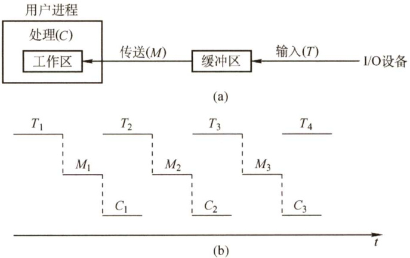
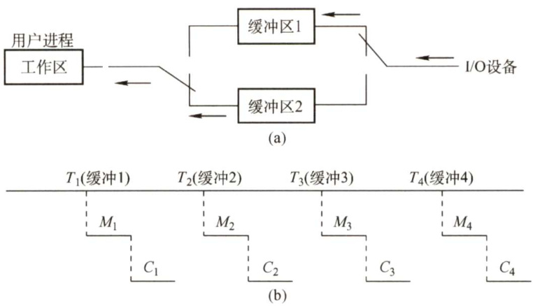
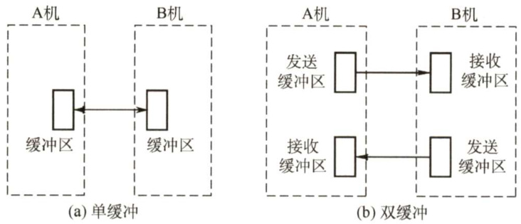
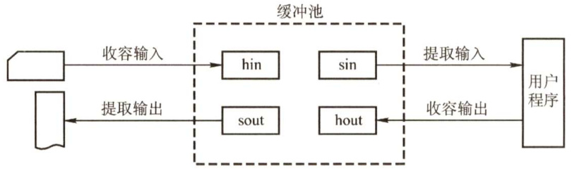
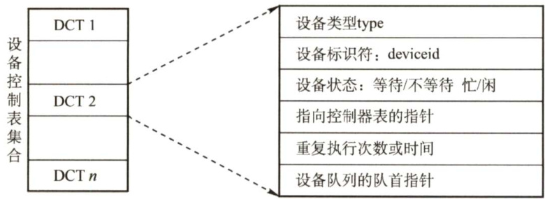
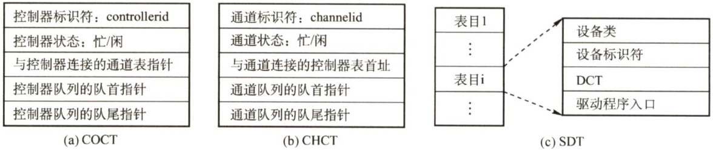
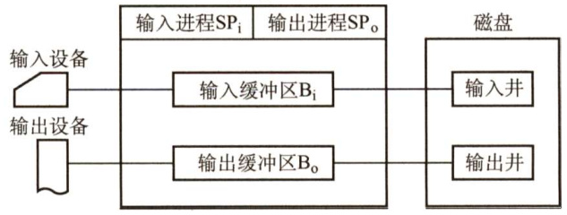
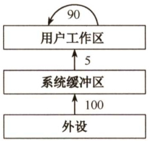
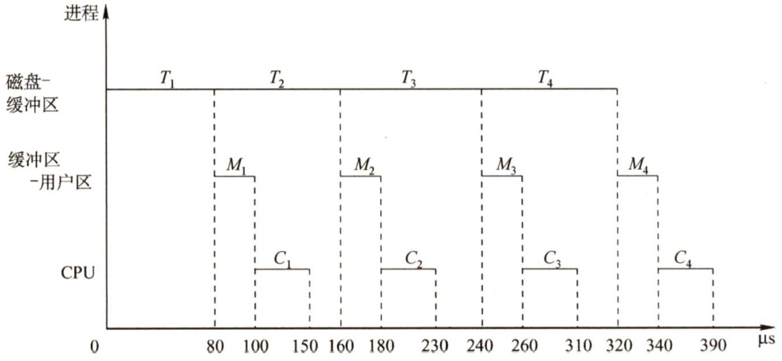
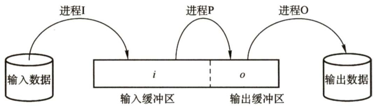

### 5.2 设备独立性软件  

在学习本节时，请读者思考以下问题：  

1）当处理机和外部设备的速度差距较大时，有什么办法可以解决问题？  
2）什么是设备的独立性？引入设备的独立性有什么好处？  

#### 5.2.1 与设备无关的软件  

与设备无关的软件是I/O系统的最高层软件，它的下层是设备驱动程序，其间的界限因操作系统和设备的不同而有所差异。比如，一些本应由设备独立性软件实现的功能，也可能放在设备驱动程序中实现。这样的差异主要是出于对操作系统、设备独立性软件和设备驱动程序运行效率等多方面因素的权衡。总体而言，设备独立性软件包括执行所有设备公有操作的软件。  

#### 5.2.2 高速缓存与缓冲区  

#### 1.磁盘高速缓存（DiskCache）  

操作系统中使用磁盘高速缓存技术来提高磁盘的I/O速度，对访问高速缓存要比访问原始磁盘数据更为高效。例如，正在运行进程的数据既存储在磁盘上，又存储在物理内存上，也被复制到CPU的二级和一级高速缓存中。不过，磁盘高速缓存技术不同于通常意义下的介于CPU与内存之间的小容量高速存储器，而是指利用内存中的存储空间来暂存从磁盘中读出的一系列盘块中的信息。因此，磁盘高速缓存逻辑上属于磁盘，物理上则是驻留在内存中的盘块。  

高速缓存在内存中分为两种形式：一种是在内存中开辟一个单独的空间作为磁盘高速缓存，大小固定；另一种是把未利用的内存空间作为一个缓冲池，供请求分页系统和磁盘IO时共享。  

#### 2.缓冲区（Buffer)  

在设备管理子系统中，引入缓冲区的目的主要如下：  

1）缓和CPU与I/O设备间速度不匹配的矛盾。  
2）减少对CPU的中断频率，放宽对CPU中断响应时间的限制。  
3）解决基本数据单元大小（即数据粒度）不匹配的问题。  
4）提高CPU和I/O设备之间的并行性。  

其实现方法如下：  

1）采用硬件缓冲器，但由于成本太高，除一些关键部位外，一般不采用硬件缓冲器。2）采用缓冲区（位于内存区域)。  
根据系统设置缓冲器的个数，缓冲技术可以分为如下几种：  

#### （1）单缓冲  

在主存中设置一个缓冲区。当设备和处理机交换数据时，先将数据写入缓冲区，然后需要数据的设备或处理机从缓冲区取走数据，在缓冲区写入或取出的过程中，另一方需等待。  

如图5.6所示，在块设备输入时，假定从磁盘把一块数据输入到缓冲区的时间为T，操作系统将该缓冲区中的数据传送到用户区的时间为 $M$ ，而CPU对这一块数据处理的时间为 $c$ 0  

  
图5.6单缓冲工作示意图  

在研究每块数据的处理时间时，有一个技巧：假设一种初始状态，然后计算下一次到达相同状态时所需要的时间，就是处理一块数据所需要的时间。在单缓冲中，这种初始状态为：工作区是满的，缓冲区是空的。如题目无明确说明，通常认为缓冲区的大小和工作区的大小相等。  

假设 $T>C$ ，从初始状态开始，当工作区数据处理完后，时间为 $c$ ，缓冲区还没充满，当缓冲区充满时，经历了 $T$ 时间，停止再冲入数据，然后缓冲区向工作区传送数据，当工作区满了后，缓冲区的数据同时也为空，用时为 $M$ ，到达下一个开始状态，整个过程用时 $M+T$ ；若 $T<C$ ，同理，整个过程用时 $M+C$ 。故单缓冲区处理每块数据的用时为 $\operatorname*{max}(C,T)+M_{\circ}$  

#### （2）双缓冲  

根据单缓冲的特点，CPU在传送时间 $M$ 内处于空闲状态，由此引入双缓冲。I/O设备输入数据时先装填到缓冲区1，在缓冲区1填满后才开始装填缓冲区2，与此同时处理机可以从缓冲区1中取出数据送入用户进程，当缓冲区1中的数据处理完后，若缓冲区2已填满，则处理机又从缓冲区2中取出数据送入用户进程，而I/O设备又可以装填缓冲区1。注意，必须等缓冲区2充满才能让处理机从缓冲区2取出数据。双缓冲机制提高了处理机和输入设备的并行程度。  

为了研究双缓冲处理一块数据的用时，我们先规定一种初始状态：工作区是空的，其中一个缓冲区是满的，另外一个缓冲区是空的；我们不妨假设缓冲区1是空的，缓冲区2是满的。  

如图5.7所示，我们假设 $T<C+M,$ 缓冲区2开始向工作区传送数据，缓冲区1开始冲入数据，当工作区充满数据后，缓冲区为空，时间为 $M_{!}$ ，然后工作区开始处理数据，缓冲区1继续冲入数据，因为此时只有一个I/O设备，所以缓冲区2虽然为空，但不能冲入数据。当缓冲区1充满数据后，工作区的数据还未处理完毕，时间为 $T$ ，当工作区数据处理完毕后，此时工作区为空，缓冲区1满，缓冲区2为空，达到下一个初始状态，用时 $C+M_{\circ}$  

  
图5.7双缓冲工作示意图  

我们再来分析 $T>C+M$ 的情况。缓冲区2开始向工作区传送数据，缓冲区1开始冲入数据，当工作区充满数据并处理完后，用时 $C+M$ ，但缓冲区1的数据还未充满；当时间为 $T$ 时，缓冲区1的数据充满，到达下一个初始状态。  

总结：双缓冲区处理一块数据的用时为 $\operatorname*{max}(C+M,T)$  

若 $M+C<T$ ，则可使块设备连续输入；若 $C+M>T$ ，则可使CPU不必等待设备输入。对于字符设备，若采用行输入方式，则采用双缓冲可使用户在输入第一行后，在CPU执行第一行中的命令的同时，用户可继续向第二缓冲区输入下一行数据。而单缓冲情况下则必须等待一行数据被提取完毕才可输入下一行的数据。  

若两台机器之间通信仅配置了单缓冲，如图5.8(a)所示，则它们在任意时刻都只能实现单方向的数据传输。例如，只允许把数据从A机传送到B机，或从B机传送到A机，而绝不允许双方同时向对方发送数据。为了实现双向数据传输，必须在两台机器中都设置两个缓冲区，一个用作发送缓冲区，另一个用作接收缓冲区，如图5.8(b)所示。  

  
图5.8双机通信时缓冲区的设置  

#### （3）循环缓冲  

包含多个大小相等的缓冲区，每个缓冲区中有一个链接指针指向下一个缓冲区，最后一个缓冲区指针指向第一个缓冲区，多个缓冲区构成一个环形。  

循环缓冲用于输入/输出时，还需要有两个指针in和out。对输入而言，首先要从设备接收数据到缓冲区中，in指针指向可以输入数据的第一个空缓冲区；当运行进程需要数据时，从循环缓冲区中取一个装满数据的缓冲区，并从此缓冲区中提取数据，out指针指向可以提取数据的第一个满缓冲区。输出则正好相反。  

#### （4）缓冲池  

由多个系统公用的缓冲区组成，缓冲区按其使用状况可以形成三个队列：空缓冲队列、装满输入数据的缓冲队列（输入队列）和装满输出数据的缓冲队列（输出队列)。还应具有4种缓冲区：用于收容输入数据的工作缓冲区、用于提取输入数据的工作缓冲区、用于收容输出数据的工作缓冲区及用于提取输出数据的工作缓冲区，如图5.9所示。  

  
图5.9缓冲池的工作方式  

当输入进程需要输入数据时，便从空缓冲队列的队首摘下一个空缓冲区，把它作为收容输入工作缓冲区，然后把输入数据输入其中，装满后再将它挂到输入队列队尾。当计算进程需要输入数据时，便从输入队列取得一个缓冲区作为提取输入工作缓冲区，计算进程从中提取数据，数据用完后再将它挂到空缓冲队列尾。当计算进程需要输出数据时，便从空缓冲队列的队首取得一个空缓冲区，作为收容输出工作缓冲区，当其中装满输出数据后，再将它挂到输出队列队尾。当要输出时，由输出进程从输出队列中取得一个装满输出数据的缓冲区，作为提取输出工作缓冲区，当数据提取完后，再将它挂到空缓冲队列的队尾。  

对于循环缓冲和缓冲池，我们只是定性地介绍它们的机理，而不去定量研究它们平均处理一块数据所需要的时间。而对于单缓冲和双缓冲，我们只要按照上面的模板分析，就可以解决任何计算单缓冲和双缓冲情况下数据块处理时间的问题，以不变应万变。  

#### 3.高速缓存与缓冲区的对比  

高速缓存是可以保存数据拷贝的高速存储器，访问高速缓存比访问原始数据更高效，速度更快。高速缓存和缓冲区的对比见表5.1。  

表5.1高速缓存和缓冲区的对比  

<html><body><table><tr><td colspan="2"></td><td>高速缓存</td><td>缓冲区</td></tr><tr><td colspan="2">相同点</td><td colspan="2">都介于高速设备和低速设备之间</td></tr><tr><td rowspan="2">区别</td><td>存放数据</td><td>存放的是低速设备上的某些数据的复制数 据，即高速缓存上有的，低速设备上面必 然有</td><td>存放的是低速设备传递给高速设备的数据(或相反)，而这 些数据在低速设备（或高速设备）上却不一定有备份，这 些数据再从缓冲区传送到高速设备（或低速设备）</td></tr><tr><td>目的</td><td>高速缓存存放的是高速设备经常要访问的 数据，若高速设备要访问的数据不在高速缓 存中，则高速设备就需要访问低速设备</td><td>高速设备和低速设备的通信都要经过缓冲区，高速设备永 远不会直接去访问低速设备</td></tr></table></body></html>  

#### 5.2.3 设备分配与回收  

#### 1．设备分配概述  

设备分配是指根据用户的I/O请求分配所需的设备。分配的总原则是充分发挥设备的使用效率，尽可能地让设备忙碌，又要避免由于不合理的分配方法造成进程死锁。从设备的特性来看，采用下述三种使用方式的设备分别称为独占设备、共享设备和虚拟设备。  

1）独占式使用设备。进程分配到独占设备后，便由其独占，直至该进程释放该设备。  
2）分时式共享使用设备。对于共享设备，可同时分配给多个进程，通过分时共享使用。  

3）以SPOOLing方式使用外部设备。SPOOLing技术实现了虚拟设备功能，可以将设备同时分配给多个进程。这种技术实质上就是实现了对设备的I/O操作的批处理。  

#### 2.设备分配的数据结构  

设备分配依据的主要数据结构有设备控制表（DCT）、控制器控制表（COCT）、通道控制表（CHCT）和系统设备表（SDT)，各数据结构功能如下。  

设备控制表（DCT)：一个设备控制表就表征一个设备，而这个控制表中的表项就是设备的各个属性，如图5.10所示。凡因请求本设备而未得到满足的进程，应将其PCB按某种策略排成一个设备请求队列，设备队列的队首指针指向该请求队列队首PCB。  

  
图5.10 设备控制表DCT  

设备控制器控制设备与内存交换数据，而设备控制器又需要请求通道为它服务，因此每个COCT［图5.11(a)］有一个表项存放指向相应通道控制表（CHCT）[图5.11(b)］的指针，而一个通道可为多个设备控制器服务，因此CHCT中必定有一个指针，指向一个表，这个表上的信息表达的是CHCT提供服务的那几个设备控制器。CHCT与COCT的关系是一对多的关系。  

系统设备表（SDT)：整个系统只有一张SDT，如图5.11(c)所示。它记录已连接到系统中的所有物理设备的情况，每个物理设备占一个表目。  

  
图5.11控制器控制表COCT、通道控制表CHCT和系统设备表SDT  

在多道程序系统中，进程数多于资源数，因此要有一套合理的分配原则，主要考虑的因素有：IO设备的固有属性、I/O设备的分配算法、I/O设备分配的安全性以及I/O设备的独立性。  

#### 3.设备分配的策略  

1）设备分配原则。设备分配应根据设备特性、用户要求和系统配置情况。既要充分发挥设备的使用效率，又要避免造成进程死锁，还要将用户程序和具体设备隔离开。  

2）设备分配方式。设备分配方式有静态分配和动态分配两种。 $\textcircled{1}$ 静态分配主要用于对独占设备的分配，它在用户作业开始执行前，由系统一次性分配该作业所要求的全部设备、控制器。一旦分配，这些设备、控制器就一直为该作业所占用，直到该作业被撤销。静态分配方式不会出现死锁，但设备的使用效率低。 $\textcircled{2}$ 动态分配在进程执行过程中根据执行需要进行。当进程需要设备时，通过系统调用命令向系统提出设备请求，由系统按某种策略给进程分配所需要的设备、控制器，一旦用完，便立即释放。这种方式有利于提高设备利用率，但若分配算法使用不当，则有可能造成进程死锁。  

3）设备分配算法。常用的动态设备分配算法有先请求先分配、优先级高者优先等。  

对于独占设备，既可以采用动态分配方式，又可以采用静态分配方式，但往往采用静态分配方式。共享设备可被多个进程所共享，一般采用动态分配方式，但在每个I/O传输的单位时间内只被一个进程所占有，通常采用先请求先分配和优先级高者优先的分配算法。  

#### 4.设备分配的安全性  

设备分配的安全性是指设备分配中应防止发生进程死锁。  

1)安全分配方式。每当进程发出I/O请求后便进入阻塞态，直到其I/O操作完成时才被唤醒。这样，一旦进程已经获得某种设备后便阻塞，不能再请求任何资源，而在它阻塞时也不保持任何资源。其优点是设备分配安全，缺点是CPU和I/O设备是串行工作的。  
2）不安全分配方式。进程在发出I/O请求后仍继续运行，需要时又发出第二个、第三个IO请求等。仅当进程所请求的设备已被另一进程占用时，才进入阻塞态。优点是一个进程可同时操作多个设备，使进程推进迅速；缺点是有可能造成死锁。  

#### 5.逻辑设备名到物理设备名的映射  

为了提高设备分配的灵活性和设备的利用率，方便实现I/O重定向，引入了设备独立性。设备独立性是指应用程序独立于具体使用的物理设备。  

为了实现设备独立性，在应用程序中使用逻辑设备名来请求使用某类设备，在系统中设置一张逻辑设备表（LogicalUnitTable，LUT)，用于将逻辑设备名映射为物理设备名。LUT表项包括逻辑设备名、物理设备名和设备驱动程序入口地址；当进程用逻辑设备名来请求分配设备时，系统为它分配一台相应的物理设备，并在LUT中建立一个表目，当以后进程再利用该逻辑设备名请求IO操作时，系统通过查找LUT来寻找对应的物理设备和驱动程序。  

在系统中可采取两种方式设置逻辑设备表：  

1)在整个系统中只设置一张LUT。这样，所有进程的设备分配情况都记录在同一张LUT中，因此不允许LUT中具有相同的逻辑设备名，主要适用于单用户系统。  
2）为每个用户设置一张LUT。每当用户登录时，系统便为该用户建立一个进程，同时也为之建立一张LUT，并将该表放入进程的PCB中。  

#### 5.2.4 SPOOLing技术（假脱机技术）  

为了缓和CPU的高速性与IO设备低速性之间的矛盾，引入了脱机输入/输出技术，它是操作系统中采用的一项将独占设备改造成共享设备的技术。该技术利用专门的外围控制机，将低速I/O设备上的数据传送到高速磁盘上，或者相反。SPOOLing系统的组成如图5.12所示。  

  
图5.12SPOOLing系统的组成  

（1）输入井和输出井  

在磁盘上开辟出的两个存储区域。输入井模拟脱机输入时的磁盘，用于收容IO设备输入的数据。输出井模拟脱机输出时的磁盘，用于收容用户程序的输出数据。一个进程的输入（或输出）数据保存为一个文件，所有进程的数据输入（或输出）文件链接成一个输入（或输出）队列。  

（2）输入缓冲区和输出缓冲区  

在内存中开辟的两个缓冲区。输入缓冲区用于暂存由输入设备送来的数据，以后再传送到输入井。输出缓冲区用于暂存从输出井送来的数据，以后再传送到输出设备。  

#### （3）输入进程和输出进程  

输入/输出进程用于模拟脱机输入/输出时的外围控制机。用户要求的数据从输入设备经过输入缓冲区送到输入井，当CPU需要输入数据时，直接从输入井读入内存。用户要求输出的数据先从内存送到输出井，待输出设备空闲时，再将输出井中的数据经过输出缓冲区送到输出设备。  

共享打印机是使用SPOOLing技术的实例。当用户进程请求打印输出时，SPOOLing系统同意打印，但是并不真正立即把打印机分配给该进程，而由假脱机管理进程完成两项任务：  

I）在磁盘缓冲区中为之申请一个空闲盘块，并将要打印的数据送入其中暂存。  

2）为用户进程申请一张空白的用户请求打印表，并将用户的打印要求填入其中，再将该表挂到假脱机文件队列上。  

这两项工作完成后，虽然还没有任何实际的打印输出，但是对于用户进程而言，其打印任务已完成。对用户而言，系统并非立即执行真实的打印操作，而只是立即将数据输出到缓冲区，真正的打印操作是在打印机空闲且该打印任务已排在等待队列队首时进行的。  

SPOOLing系统的特点如下： $\textcircled{1}$ 提高了I/O的速度，将对低速I/O设备执行的I/O操作演变为对磁盘缓冲区中数据的存取，如同脱机输入/输出一样，缓和了CPU和低速IO设备之间的速度不匹配的矛盾； $\textcircled{2}$ 将独占设备改造为共享设备，在假脱机打印机系统中，实际上并没有为任何进程分配设备； $\textcircled{3}$ 实现了虚拟设备功能，对每个进程而言，它们都认为自己独占了一个设备。  

前面我们提到过SPOOLing技术是一种以空间换时间的技术，我们很容易理解它牺牲了空间，因为它开辟了磁盘上的空间作为输入井和输出井，但它又如何节省时间呢？  

从前述内容我们了解到，磁盘是一种高速设备，在与内存交换数据的速度上优于打印机、键盘、鼠标等中低速设备。试想一下，若没有 SPOOLing技术，CPU要向打印机输出要打印的数据，打印机的打印速度比较慢，CPU就必须迁就打印机，在打印机把数据打印完后才能继续做其他的工作，浪费了CPU 的不少时间。在 SPOOLing 技术下，CPU要打印机打印的数据可以先输出到磁盘的输出井中（这个过程由假脱机进程控制)，然后做其他的事情。若打印机此时被占用，则SPOOLing系统就会把这个打印请求挂到等待队列上，待打印机有空时再把数据打印出来。向磁盘输出数据的速度比向打印机输出数据的速度快，因此就节省了时间。  

#### 5.2.5 设备驱动程序接口  

如果每个设备驱动程序与操作系统的接口都不同，那么每次出现一个新设备时，都必须为此修改操作系统。因此，要求每个设备驱动程序与操作系统之间都有着相同或相近的接口。这样会使得添加一个新设备驱动程序变得很容易，同时也便于开发人员编制设备驱动程序。  

对于每种设备类型，例如磁盘，操作系统都要定义一组驱动程序必须支持的函数。对磁盘而言，这些函数自然包含读、写、格式化等。驱动程序中通常包含一张表格，这张表格具有针对这些函数指向驱动程序自身的指针。装载驱动程序时，操作系统记录这个函数指针表的地址，所以当操作系统需要调用一个函数时，它可以通过这张表格发出间接调用。这个函数指针表定义了驱动程序与操作系统其余部分之间的接口。给定类型的所有设备都必须服从这一要求。  

与设备无关的软件还要负责将符号化的设备名映射到适当的驱动程序上。例如，在UNIX中，设备名/dev/disk0唯一确定了一个特殊文件的i结点，这个i结点包含了主设备号（用于定位相应的驱动程序）和次设备号（用来确定要读写的具体设备)。  

在UNIX和Windows中，设备是作为命名对象出现在文件系统中的，因此针对文件的常规保护规则也适用于IO设备。系统管理员可以为每个设备设置适当的访问权限。  

#### 5.2.6 本节小结  

本节开头提出的问题的参考答案如下。  

1）当处理机和外部设备的速度差距较大时，有什么办法可以解决问题？  

可采用缓冲技术来缓解CPU与外设速度上的矛盾，即在某个地方（一般为主存）设立一片缓冲区，外设与CPU的输入/输出都经过缓冲区，这样外设和CPU就都不用互相等待。  

2）什么是设备的独立性？引入设备的独立性有什么好处？  

设备独立性是指用户在编程序时使用的设备与实际设备无关。一个程序应独立于分配给它的某类设备的具体设备，即在用户程序中只指明I/O使用的设备类型即可。  

设备独立性有以下优点： $\textcircled{1}$ 方便用户编程。 $\textcircled{2}$ 使程序运行不受具体机器环境的限制。 $\textcircled{3}$ 便于程序移植。  

#### 5.2.7 本节习题精选  

#### 一、单项选择题  

01．设备的独立性是指（）。  

A．设备独立于计算机系统  
B．系统对设备的管理是独立的  
C.用户编程时使用的设备与实际使用的设备无关  
D．每台设备都有一个唯一的编号  

02.引入高速缓冲的主要目的是（）。  

A.提高CPU的利用率 B.提高I/O设备的利用率C.改善CPU与I/O设备速度不匹配的问题D．节省内存  

03.为了使并发进程能有效地进行输入和输出，最好采用（）结构的缓冲技术。  

A.缓冲池 B.循环缓冲 C.单缓冲 D.双缓冲  

04.缓冲技术中的缓冲池在（）中。  

A.主存 B.外存 C.ROM D.寄存器  

05.设从磁盘将一块数据传送到缓冲区所用的时间为 $80\upmu\mathrm{s}$ ，将缓冲区中的数据传送到用户区所用的时间为 $40\upmu\mathrm{s}$ ，CPU处理一块数据所用的时间为 $30\upmu\mathrm{s}$ 。若有多块数据需要处理，并采用单缓冲区传送某磁盘数据，则处理一块数据所用的总时间为（）。  

A. $120\upmu\mathrm{s}$ B. $110\upmu\mathrm{s}$ C. $150\upmu\mathrm{s}$ D. $70\upmu\mathrm{s}$  

06.某操作系统采用双缓冲区传送磁盘上的数据。设从磁盘将数据传送到缓冲区所用的时间为 $T_{1}$ ，将缓冲区中的数据传送到用户区所用的时间为 $T_{2}$ （假设 $T_{2}$ 远小于 $T_{1}$ )，CPU处理数据所用的时间为 $T_{3}$ ，则处理该数据，系统所用的总时间为（）。  

A. $T_{1}+T_{2}+T_{3}$ B. $\operatorname*{max}(T_{2},T_{3})+T_{1}$ C. $\begin{array}{r}{\operatorname*{max}(T_{1},T_{3})+T_{2}}\end{array}$ D. $\operatorname*{max}(T_{1},T_{3})$  

07．若I/O所花费的时间比CPU的处理时间短得多，则缓冲区（）。  

A．最有效 B．几乎无效C.均衡 D.以上答案都不对  

08.缓冲区管理着重要考虑的问题是（）。  

A.选择缓冲区的大小 B.决定缓冲区的数量C.实现进程访问缓冲区的同步 D.限制进程的数量  

09.考虑单用户计算机上的下列I/O操作，需要使用缓冲技术的是（）。  

I．图形用户界面下使用鼠标  
II．多任务操作系统下的磁带驱动器（假设没有设备预分配）  
IⅢI．包含用户文件的磁盘驱动器  
IV．使用存储器映射IO，直接和总线相连的图形卡  

A.I、IⅢI B.ⅡI、IV C.Ⅱ、II、IV D.全选  

10．以下（）不属于设备管理数据结构。  

A.PCB B.DCT C. COCT D. CHCT  

11．下列（）不是设备的分配方式。  

A.独享分配 B．共享分配 C.虚拟分配 D.分区分配  

12．下面设备中属于共享设备的是（）。  

A．打印机 B.磁带机 C.磁盘 D.磁带机和磁盘  

13．提高单机资源利用率的关键技术是（）。  

A. SPOOLing技术 B．虚拟技术C．交换技术 D．多道程序设计技术  

14．虚拟设备是靠（）技术来实现的。  

A.通道 B.缓冲 C. SPOOLing D.控制器  

15.SPOOLing技术的主要目的是（）。  

A.提高CPU和设备交换信息的速度 B.提高独占设备的利用率C.减轻用户编程负担 D．提供主、辅存接口  

16．在采用SPOOLing技术的系统中，用户的打印结果首先被送到（）。  

A.磁盘固定区域 B．内存固定区域 C.终端 D．打印机  

7．采用SPOOLing技术的计算机系统，外围计算机需要（）。  

A.一台 B.多台 C.至少一台 D.0台  

18.SPOOLing系统由（）组成。  

A．预输入程序、井管理程序和缓输出程序B．预输入程序、井管理程序和井管理输出程序C．输入程序、井管理程序和输出程序D.预输入程序、井管理程序和输出程序  

19.在SPOOLing系统中，用户进程实际分配到的是（）。  

A.用户所要求的外设 B．外存区，即虚拟设备C.设备的一部分存储区 D.设备的一部分空间  

20.下面关于SPOOLing系统的说法中，正确的是（）。  

A.构成SPOOLing系统的基本条件是有外围输入机与外围输出机B.构成SPOOLing系统的基本条件是要有大容量、高速度的硬盘作为输入井和输出井C.当输入设备忙时，SPOOLing系统中的用户程序暂停执行，待I/O空闲时再被唤醒执  

行输出操作D.SPOOLing系统中的用户程序可以随时将输出数据送到输出井中，待输出设备空闲时再由SPOOLing系统完成数据的输出操作  

21.下面关于SPOOLing的叙述中，不正确的是（）。  

A.SPOOLing系统中不需要独占设备B.SPOOLing系统加快了作业执行的速度C.SPOOLing系统使独占设备变成共享设备D.SPOOLing系统提高了独占设备的利用率  

22.（）是操作系统中采用的以空间换取时间的技术。  

A．SPOOLing技术B．虚拟存储技术 C.覆盖与交换技术 D.通道技术  

23．采用假脱机技术，将磁盘的一部分作为公共缓冲区以代替打印机，用户对打印机的操作实际上是对磁盘的存储操作，用以代替打印机的部分由（）完成。  

A．独占设备 B．共享设备 C．虚拟设备 D.一般物理设备  

24.下面关于独占设备和共享设备的说法中，不正确的是（）。  

A．打印机、扫描仪等属于独占设备  
B.对独占设备往往采用静态分配方式  
C．共享设备是指一个作业尚未撤离，另一个作业即可使用，但每个时刻只有一个作业使用  
D.对共享设备往往采用静态分配方式  

25．在采用SPOOLing技术的系统中，用户的打印数据首先被送到（）。  

A.磁盘固定区域 B．内存固定区域 C.终端 D.打印机  

26.【2009统考真题】程序员利用系统调用打开I/O设备时，通常使用的设备标识是（）  

A．逻辑设备名 B．物理设备名 C．主设备号 D．从设备号  

27.【2011统考真题】某文件占10个磁盘块，现要把该文件的磁盘块逐个读入主存缓冲区，并且送到用户区进行分析，假设一个缓冲区与一个磁盘块大小相同，把一个磁盘块读入缓冲区的时间为 $100\upmu\mathrm{s}$ ，将缓冲区的数据传送到用户区的时间是 $50\upmu\mathrm{s}$ ，CPU对一块数据进行分析的时间为 $50\upmu\mathrm{s}$ 。在单缓冲区和双缓冲区结构下，读入并分析完该文件的时间分别是（）。  

A. $1500\upmu\mathrm{s}$ 。 $1000\upmu\mathrm{s}$ B. $1550\upmu\mathrm{s}$ 。 $1100\upmu\mathrm{s}$ C. $1550\upmu\mathrm{s}$ 。 $1550\upmu\mathrm{s}$ D. $2000\upmu\mathrm{s}$ 。 $2000\upmu\mathrm{s}$  

8.【2012统考真题】下列选项中，不能改善磁盘设备I/O性能的是（）。  

A．重排I/O请求次序 B．在一个磁盘上设置多个分区C.预读和滞后写 D.优化文件物理块的分布  

29.【2013统考真题】设系统缓冲区和用户工作区均采用单缓冲，从外设读入一个数据块到系统缓冲区的时间为100，从系统缓冲区读入一个数据块到用户工作区的时间为5，对用户工作区中的一个数据块进行分析的时间为90（如下图所示）。进程从外设读入并分析2个数据块的最短时间是（）。  

  

A.200 B.295 C.300 D.390  

30.【2015统考真题】在系统内存中设置磁盘缓冲区的主要目的是（）。  

A.减少磁盘I/O次数 B.减少平均寻道时间C.提高磁盘数据可靠性 D．实现设备无关性  

31.【2016统考真题】下列关于SPOOLing技术的叙述中，错误的是（）。  

A.需要外存的支持  
B．需要多道程序设计技术的支持  
C．可以让多个作业共享一台独占式设备  
D.由用户作业控制设备与输入/输出井之间的数据传送  

32.【2020统考真题】对于具备设备独立性的系统，下列叙述中，错误的是（）  

A．可以使用文件名访问物理设备B.用户程序使用逻辑设备名访问物理设备C．需要建立逻辑设备与物理设备之间的映射关系D．更换物理设备后必须修改访问该设备的应用程序  

#### 二、综合应用题  

01.用于设备分配的数据结构有哪些？它们之间的关系是什么？  

02.输入/输出软件一般分为4个层次：用户层、与设备无关的软件层、设备驱动程序和中断处理程序。请说明以下各工作是在哪一层完成的：1）为磁盘读操作计算磁道、扇区和磁头。2）向设备寄存器写命令。3）检查用户是否有权使用设备。4）将二进制整数转换成ASCⅡI码以便打印。  

03．一个串行线能以最大 $50000\mathrm{B/s}$ 的速度接收输入。数据平均输入速率是 $20000\mathrm{B/s}$ 。若用轮询来处理输入，不管是否有输入数据，轮询例程都需要 $3\upmu\mathrm{s}$ 来执行。在下一个字节到达之前未从控制器中取走的字节将丢失。那么最大的安全的轮询时间间隔是多少？  

04．在某系统中，从磁盘将一块数据输入缓冲区需要花费的时间为 $T$ ，CPU对一块数据进行处理的时间为 $c$ ，将缓冲区的数据传送到用户区所花的时间为 $M_{\sun}$ ，那么在单缓冲和双缓冲情况下，系统处理大量数据时，一块数据的处理时间为多少？  

05．在某系统中，若采用双缓冲区（每个缓冲区可存放一个数据块），将一个数据块从磁盘传送到缓冲区的时间为 $80\upmu\mathrm{s}$ ，从缓冲区传送到用户的时间为 $20\upmu\mathrm{s}$ ，CPU计算一个数据块的时间为 $50\upmu\mathrm{s}$ 。总共处理4个数据块，每个数据块的平均处理时间是多少？  

06.一个SPOOLing系统由输入进程I、用户进程P、输出进程O、输入缓冲区、输出缓冲区组成。进程I通过输入缓冲区为进程P输入数据，进程P的处理结果通过输出缓冲区交给进程〇输出。进程间数据交换以等长度的数据块为单位。这些数据块均存储在同一磁盘上。因此，SPOOLing系统的数据块通信原语保证始终满足 $i+o\le\operatorname*{max}$ ，其中max 为磁盘容量（以该数据块为单位）， $i$ 为磁盘上输入数据块的总数， $\mathbf{\sigma}_{o}$ 为磁盘上输出数据块的总数。该SPOOLing系统运行时：只要有输入数据，进程I终究会将它放入输入缓冲区；只要输入缓冲区有数据块，进程P终究会读入、处理，并产生结果数据，写到输出缓冲区；只要输出缓冲区有数据块，进程O终究会输出它。  

请说明该SPOOLing系统在什么情况下死锁。请说明如何修正约束条件以避免死锁，同时仍允许输入数据块和输出数据块均存储在同一个磁盘上。  

#### 5.2.8 答案与解析  

#### 一、单项选择题  

01.C  

设备的独立性主要是指用户使用设备的透明性，即使用户程序和实际使用的物理设备无关。  

02.C  

CPU与I/O设备执行速度通常是不对等的，前者快、后者慢，通过高速缓冲技术来改善两者不匹配的问题。  

03.A  

缓冲池是系统的共用资源，可供多个进程共享，并且既能用于输入又能用于输出。其一般包含三种类型的缓冲： $\textcircled{1}$ 空闲缓冲区； $\textcircled{2}$ 装满输入数据的缓冲区； $\textcircled{3}$ 装满输出数据的缓冲区。为了管理上的方便，可将相同类型的缓冲区链成一个队列。B、C、D属专用缓冲。  

04.A  

输入井和输出井是在磁盘上开辟的存储空间，而输入/输出缓冲区则是在内存中开辟的，因为CPU速度比I/O设备高很多，缓冲池通常在主存中建立。  

05.A  

采用单缓冲区传送数据时，设备与处理机对缓冲区的操作是串行的，当进行第 $i$ 次读磁盘数据送至缓冲区时，系统再同时读出用户区中第i-1次数据进行计算，此两项操作可以并行，并与数据从缓冲区传送到用户区的操作串行进行，所以系统处理一块数据所用的总时间为 max( $80\upmu\mathrm{s},$ $30\upmu\mathrm{s})+40\upmu\mathrm{s}=120\upmu\mathrm{s}.$ 。  

06.D  

处理该数据所用的总时间，即可以默认初始状态缓冲区1已将数据传送到用户区。然后分情况讨论：若 $T_{3}>T_{1}$ ，即CPU处理数据块比数据传送慢，意味着I/O设备可连续输入，磁盘将数据传送到缓冲区，再传送到用户区，与CPU处理数据可视为并行处理，时间的花费取决于CPU最大花费时间，则系统所用总时间为 $T_{3}$ 。若 $T_{3}<T_{1}$ ，即CPU处理数据比数据传送快，此时CPU不必等待IO设备，磁盘将数据传送到缓冲区，与缓冲区中数据传送到用户区及CPU数据处理可视为并行执行，则花费时间取决于磁盘将数据传送到缓冲区所用时间 $T_{1}$ 。所以选D。  

07.B  

缓冲区主要解决输入/输出速度比CPU处理的速度慢而造成数据积压的矛盾。所以当I/O花费的时间比CPU处理时间短很多时，缓冲区没有必要设置。  

08.C  

在缓冲机制中，无论是单缓冲、多缓冲还是缓冲池，由于缓冲区是一种临界资源，所以在使用缓冲区时都有一个申请和释放（即互斥）的问题需要考虑。  

09.D  

在鼠标移动时，若有高优先级的操作产生，为了记录鼠标活动的情况，必须使用缓冲技术，  

I正确。由于磁盘驱动器和目标或源I/O设备间的吞吐量不同，必须采用缓冲技术，ⅡI正确。为了能使数据从用户作业空间传送到磁盘或从磁盘传送到用户作业空间，必须采用缓冲技术，III正确。为了便于多幅图形的存取及提高性能，缓冲技术是可以采用的，特别是在显示当前一幅图形又要得到下一幅图形时，应采用双缓冲技术，IV正确。  

综上所述，本题正确答案为D。  

10.A  

DCT是设备控制表；COCT是控制器控制表；CHCT是通道控制表；PCB是进程控制块，不属于设备管理的数据结构。  

11.D  

设备的分配方式主要有独享分享、共享分配和虚拟分配，D是内存的分配方式。  

12.C  

共享设备是指在一个时间间隔内可被多个进程同时访问的设备，只有磁盘满足。打印机在一个时间间隔内被多个进程访问时打印出来的文档就会乱；磁带机旋转到所需的读写位置需要较长时间，若一个时间间隔内被多个进程访问，磁带机就只能一直旋转，没时间读写。  

13.D  

在单机系统中，最关键的资源是处理器资源，最大化地提高处理器利用率，就是最大化地提高系统效率。多道程序设计技术是提高处理器利用率的关键技术，其他均为设备和内存的相关技术。  

14.C  

SPOOLing技术是操作系统中采用的一种将独占设备改造为共享设备的技术。通过这种技术处理后的设备通常称为虚拟设备。  

15.B  

SPOOLing 技术可将独占设备改造为共享设备，其主要目的是提高系统资源/独占设备的利用率。  

16.A  

输入井和输出井是在磁盘上开辟的两大存储空间。输入井模拟脱机输入时的磁盘设备，用于暂存I/O设备输入的数据；输出井模拟脱机输出时的磁盘，用于暂存用户程序的输出数据。为了缓和CPU，打印结果首先送到位于磁盘固定区域的输出井。  

17.D  

SPOOLing技术需要使用磁盘空间（输入井和输出井）和内存空间（输入/输出缓冲区)，不需要外围计算机的支持。  

18.A  

SPOOLing系统主要包含三部分，即输入井和输出井、输入缓冲区和输出缓冲区以及输入进  

程和输出进程。这三部分由预输入程序、井管理程序和缓输出程序管理，以保证系统正常运行。  

19.B  

通过SPOOLing技术可将一台物理I/O设备虚拟为I/O设备，同样允许多个用户共享一台物理I/O设备，所以SPOOLing并不是将物理设备真的分配给用户进程。  

20.D  

构成SPOOLing系统的基本条件是不仅要有大容量、高速度的外存作为输入井和输出井，而且还要有SPOOLing软件，因此A 错误、B不够全面，同时利用SPOOLing技术提高了系统和I/O设备的利用率，进程不必等待I/O操作的完成，因此C选项也不正确。  

21.A  

因为 SPOOLing技术是一种典型的虚拟设备技术，它通过将独占设备虚拟成共享设备，使得多个进程共享一个独占设备，从而加快作业的执行速度，提高独占设备的利用率。既然是将独占设备虚拟成共享设备，所以必须先有独占设备才行。  

22.A  

SPOOLing技术需有高速大容量且可随机存取的外存支持，通过预输入及缓输出来减少CPU等待慢速设备的时间，将独享设备改造成共享设备。  

23.C打印机是独享设备，利用SPOOLing技术可将打印机改造为可供多个用户共享的虚拟设备。  

24.D独占设备采用静态分配方式，而共享设备采用动态分配方式。  

25.A用户的打印数据首先被送到输出井，输出井在磁盘中。  

26.A  

用户程序对I/O设备的请求采用逻辑设备名，而程序实际执行时使用物理设备名，它们之间的转换是由设备无关软件层完成的。主设备和从设备是总线仲裁中的概念。  

27.B  

在单缓冲区中，当上一个磁盘块从缓冲区读入用户区完成时，下一磁盘块才能开始读入，也就是当最后一块磁盘块读入用户区完毕时所用的时间为 $150{\times}10=1500up\upmu\mathrm{s}$ ，加上处理最后一个磁盘块的时间 $50\upmu\mathrm{s}$ ，得 $1550\upmu\mathrm{s}$ 。双缓冲区中，不存在等待磁盘块从缓冲区读入用户区的问题，10个磁盘块可以连续从外存读入主存缓冲区，加上将最后一个磁盘块从缓冲区送到用户区的传输时间$50\upmu\mathrm{s}$ 及处理时间 $50\upmu\mathrm{s}$ ，也就是 $100{\times}10+50+50=1100up\upmu\mathrm{s}$ 8  

28.B  

解析请扫右侧二维码查阅。  

29.C  

数据块1从外设到用户工作区的总时间为105，在这段时间中，数据块2未进解析及视频讲解行操作。在数据块1进行分析处理时，数据块2从外设到用户工作区的总时间为105，这段时间是并行的。再加上数据块2进行处理的时间90，总共是300，答案为C。  

30.A  

磁盘和内存的速度差异，决定了可以将内存经常访问的文件调入磁盘缓冲区，从高速缓存中复制的访问比磁盘I/O的机械操作要快很多。  

31.D  

SPOOLing利用专门的外围控制机，将低速I/O设备上的数据传送到高速磁盘上，或者相反。SPOOLing的意思是外部设备同时联机操作，又称假脱机输入/输出操作，是操作系统中采用的一项将独占设备改造成共享设备的技术。高速磁盘即外存，A正确。SPOOLing技术需要进行输入/输出操作，单道批处理系统无法满足，B正确。SPOOLing 技术实现了将独占设备改造成共享设备的技术，C正确。设备与输入井/输出井之间数据的传送是由系统实现的，D错误。  

32.D  

设备可视为特殊文件，A正确。用户使用逻辑设备名来访问物理文件，有利于设备独立性，B正确。通过逻辑设备名访问物理设备时，需要建立逻辑设备和物理设备之间的映射关系，C正确。应用程序按逻辑设备名访问设备，再经驱动程序的处理来控制物理设备，若更换物理设备，则只需更换驱动程序，而无须修改应用程序，D错误。  

#### 二、综合应用题  

01.【解答】  

用于设备分配的数据结构有系统设备表（SDT）、设备控制表（DCT）、控制器控制表（COCT)和通道控制表（CHCT)。  

SDT 整个系统中只有一张，它记录系统中全部设备的情况，是系统范围的数据结构。每个设备有一张DCT，系统为每个设备配置一张DCT，以记录本设备的情况。每个控制器有一张COCT，系统为每个控制器都设置一张用于记录本控制器情况的COCT。系统为每个通道配置一张 CHCT，以记录通道情况。SDT中每个表目有一个指向DCT 的指针，DCT中的每个表目有一个指向 COCT的指针，COCT中有一个CHCT指针，CHCT中有一个COCT指针。  

02.【解答】  

分析：首先，我们来看这些功能是不是应该由操作系统来完成。操作系统是一个代码相对稳定的软件，它很少发生代码的变化。若1）由操作系统完成，则操作系统就必须记录逻辑块和磁盘细节的映射，操作系统的代码会急剧膨胀，而且对新型介质的支持也会引起代码的变动。若2）也由操作系统完成，则操作系统需要记录不同生产厂商的不同数据，而且后续新厂商和新产品也无法得到支持。  

因为1）和2）都与具体的磁盘类型有关，因此为了能够让操作系统尽可能多地支持各种不同型号的设备，1）和2）应由厂商所编写的设备驱动程序完成。3）涉及安全与权限问题，应由与设备无关的操作系统完成。4)应由用户层来完成，因为只有用户知道将二进制整数转换为ASCII码的格式（使用二进制还是十进制、有没有特别的分隔符等)。  

03.【解答】  

串行线接收数据的最大速度为 $50000\mathrm{B/s}$ ，即每 $20\upmu\mathrm{s}$ 接收1B，而轮询例程需 $3\upmu\mathrm{s}$ 来执行，因此最大的安全轮询时间间隔是 $17\upmu\mathrm{s}$ o  

04.【解答】  

1）在单缓冲的情况下，应先从磁盘把一块数据输入缓冲区，所花费的时间为T；然后由操作系统将缓冲区的数据传送到用户区，所花的时间为 $M$ ：接下来便由CPU对这一块数据进行计算，计算时间为 $c$ 。由于CPU的计算操作与磁盘的数据输入操作可以并行，因此一块数据的处理时间为 $\operatorname*{max}(C,T)+M_{\circ}$  

2）在双缓冲的情况下，初始时两个缓冲区都是空的。应先从磁盘把一块数据输入第一个缓冲区，当装满第一个缓冲区后，操作系统可将第一个缓冲区的数据传送到用户区并对第一块数据进行计算，与此同时可将磁盘输入数据送入第二个缓冲区；当计算完成后，若第二个缓冲区已装满数据，则又可以将第二个缓冲区中的数据传送至用户区并对第二块数据进行计算，与此同时可将磁盘输入数据送入第一个缓冲区，如此反复交替使用两个缓冲区。CPU处理一个缓冲区中的数据的耗时为 $C+M,$ ，而准备好另一个缓冲区内的数据的耗时为 $T_{\mathbf{\delta}}$ 。因此，当 $C+M>T$ 时，CPU刚处理完一个缓冲区的数据，另一个缓冲区的数据就已经准备好了，就可以紧接着处理下一块数据，因此平均来看，每处理一块数据耗时为 $C+M_{\circ}$ 而当 $C+M{<}T$ 时，CPU处理完一个缓冲区的数据，另一个缓冲区的数据还没准备好，因此每隔 $T$ 的时间，才可以开始处理下一块数据，平均来看处理一块数据耗时为 $T_{\circ}$ 综上，采用双缓冲区，处理一块数据平均耗时为 $\operatorname*{max}(C+M,T)$ 9  

注意：在无缓冲的情况下，为了读取磁盘数据，应先从磁盘把一块数据输入用户数据区，所花费的时间为 $T$ ；然后由CPU对一块数据进行计算，计算时间为 $c$ ，所以每块数据的处理时间为 $T+C$ a  

05.【解答】  

4个数据块的处理过程如下图所示，总耗时 $390\upmu\mathrm{s}$ ，每个数据块的平均处理时间为 $390\upmu\mathrm{s}/4=$ $97.5\upmu\mathrm{s}$ 。  

  

从中看到，处理 $n$ 个数据块的总耗时为 $(80n+20+50){\upmu\mathrm{s}}=(80n+70){\upmu\mathrm{s}}$ ，每个数据块的平均处理时间为 $(80n+70)/n{\upmu\mathrm{s}}$ ，当 $n$ 较大时，平均时间近似为 $\mathrm{max}(C,T)=80\upmu\mathrm{s}$ 。  

06.【解答】  

此系统的示意图如下图所示。  

  
磁盘  

下面找到一种导致该SPOOLing系统死锁的情况：当磁盘上输入数据块总数 $i=\mathrm{max}$ 时，磁盘上输出数据块的总数 $\mid o\mid$ 必然为0。此时，进程I发现输入缓冲区已满，所以不能再把输入数据放入缓冲区；进程P此时有一个处理完的数据，打算把结果数据放入缓冲区，但也发现没有空闲的空间可以放结果数据，因为 $o=0$ ；所以没有输出数据可以输出，于是进程O也无事可做。这时进程I、P、O各自都等待着一个事件的发生，若没有外力的作用，它们将一直等待下去，这种僵局显然是死锁。只需将条件修改为 $i+o\le\operatorname*{max}$ ，且 $i\le\operatorname*{max}-1$ ，就不会再发生死锁。