### 5.3 磁盘和固态硬盘  

在学习本节时，请读者思考以下问题：  

1）在磁盘上进行一次读写操作需要哪几部分时间？其中哪部分时间最长？2）存储一个文件时，当一个磁道存储不下时，剩下的部分是存在同一个盘面的不同磁道好，还是存在同一个柱面上的不同盘面好？  

本节主要介绍磁盘管理的方式。学习本节时，要重点掌握计算一次磁盘操作的时间，以及对于给定访盘的磁道序列，按照特定算法求出磁头通过的总磁道数及平均寻道数。  

#### 5.3.1 磁盘  

磁盘（Disk）是由表面涂有磁性物质的物理盘片，通过一个称为磁头的导体线圈从磁盘存取数据。在读/写操作期间，磁头固定，磁盘在下面高速旋转。如图 5.13所示，磁盘盘面上的数据存储在一组同心圆中，称为磁道。每个磁道与磁头一样宽，一个盘面有上千个磁道。磁道又划分为几百个扇区，每个扇区固定存储大小，一个扇区称为一个盘块。相邻磁道及相邻扇区间通过一定的间隙分隔开，以避免精度错误。注意，由于扇区按固定圆心角度划分，所以密度从最外道向里道增加，磁盘的存储能力受限于最内道的最大记录密度。  

磁盘安装在一个磁盘驱动器中，它由磁头臂、用于旋转磁盘的主轴和用于数据输入/输出的电子设备组成。如图5.14所示，多个盘片垂直堆叠，组成磁盘组，每个盘面对应一个磁头，所有磁头固定在一起，与磁盘中心的距离相同且一起移动。所有盘片上相对位置相同的磁道组成柱面。扇区是磁盘可寻址的最小单位，磁盘上能存储的物理块数目由扇区数、磁道数及磁盘面数决定，磁盘地址用“柱面号·盘面号·扇区号”表示。  

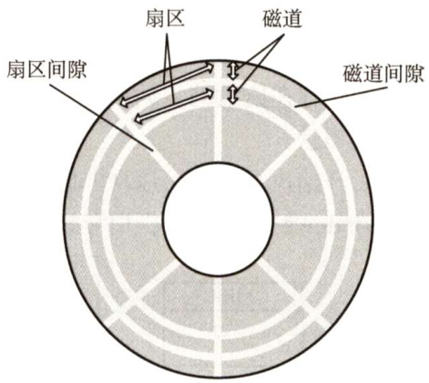  
图5.13 磁盘盘片  

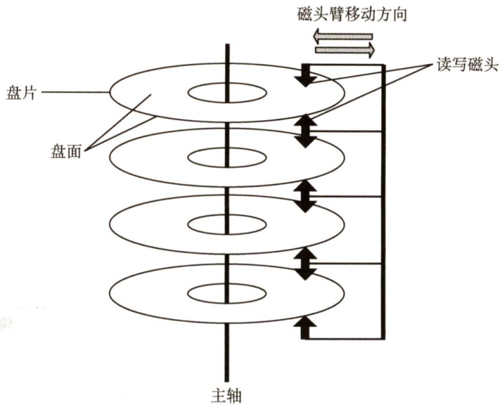  
图5.14 磁盘驱动器  

磁盘按不同的方式可分为若干类型：磁头相对于盘片的径向方向固定的，称为固定头磁盘，每个磁道一个磁头；磁头可移动的，称为活动头磁盘，磁头臂可来回伸缩定位磁道；磁盘永久固定在磁盘驱动器内的，称为固定盘磁盘；可移动和替换的，称为可换盘磁盘。  

操作系统中几乎每介绍一类资源及其管理时，都要涉及一类调度算法。用户访问文件，需要操作系统的服务，文件实际上存储在磁盘中，操作系统接收用户的命令后，经过一系列的检验访问权限和寻址过程后，最终都会到达磁盘，控制磁盘把相应的数据信息读出或修改。当有多个请求同时到达时，操作系统就要决定先为哪个请求服务，这就是磁盘调度算法要解决的问题。  

#### 5.3.2 磁盘的管理  

#### 1．磁盘初始化  

一个新的磁盘只是一个磁性记录材料的空白盘。在磁盘可以存储数据之前，必须将它分成扇区，以便磁盘控制器能够进行读写操作，这个过程称为低级格式化（或称物理格式化)。低级格式化为每个扇区使用特殊的数据结构，填充磁盘。每个扇区的数据结构通常由头部、数据区域（通常为512B大小）和尾部组成。头部和尾部包含了一些磁盘控制器的使用信息。  

大多数磁盘在工厂时作为制造过程的一部分就已低级格式化，这种格式化能够让制造商测试磁盘，并且初始化逻辑块号到无损磁盘扇区的映射。对于许多磁盘，当磁盘控制器低级格式化时，还能指定在头部和尾部之间留下多长的数据区，通常选择256或512字节等。  

#### 2.分区  

在可以使用磁盘存储文件之前，操作系统还要将自己的数据结构记录到磁盘上，分为两步：第一步是，将磁盘分为由一个或多个柱面组成的分区（即我们熟悉的C盘、D盘等形式的分区)，每个分区的起始扇区和大小都记录在磁盘主引导记录的分区表中；第二步是，对物理分区进行逻辑格式化（创建文件系统)，操作系统将初始的文件系统数据结构存储到磁盘上，这些数据结构包括空闲空间和已分配的空间以及一个初始为空的目录。  

因扇区的单位太小，为了提高效率，操作系统将多个相邻的扇区组合在一起，形成一簇（在Linux中称为块)。为了更高效地管理磁盘，一簇只能存放一个文件的内容，文件所占用的空间只能是簇的整数倍；如果文件大小小于一簇（甚至是0字节)，也要占用一簇的空间。  

#### 3．引导块  

计算机启动时需要运行一个初始化程序（自举程序)，它初始化CPU、寄存器、设备控制器和内存等，接着启动操作系统。为此，自举程序找到磁盘上的操作系统内核，将它加载到内存，并转到起始地址，从而开始操作系统的运行。  

自举程序通常存放在ROM中，为了避免改变自举代码而需要改变ROM硬件的问题，通常只在ROM中保留很小的自举装入程序，而将完整功能的引导程序保存在磁盘的启动块上，启动块位于磁盘的固定位置。具有启动分区的磁盘称为启动磁盘或系统磁盘。  

引导ROM中的代码指示磁盘控制器将引导块读入内存，然后开始执行，它可以从非固定的磁盘位置加载整个操作系统，并且开始运行操作系统。下面以Windows 为例来分析引导过程。  

Windows允许将磁盘分为多个分区，有一个分区为引导分区，它包含操作系统和设备驱动程序。Windows系统将引导代码存储在磁盘的第0号扇区，它称为主引导记录（MBR)。引导首先运行ROM中的代码，这个代码指示系统从MBR中读取引导代码。除了包含引导代码，MBR还包含：一个磁盘分区表和一个标志（以指示从哪个分区引导系统），如图5.15所示。当系统找到引导分区时，读取分区的第一个扇区，称为引导扇区，并继续余下的引导过程，包括加载各种系统服务。  

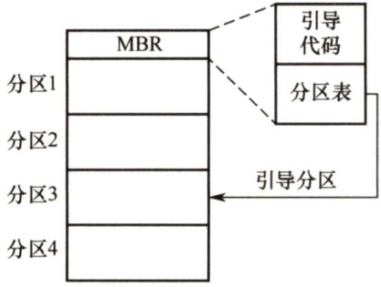  
图5.15 Windows 磁盘的引导  

#### 4．坏块  

由于磁盘有移动部件且容错能力弱，因此容易导致一个或多个扇区损坏。部分磁盘甚至在出厂时就有坏块。根据所用的磁盘和控制器，对这些块有多种处理方式。  

对于简单磁盘，如采用IDE 控制器的磁盘，坏块可手动处理，如MS-DOS 的Format命令执行逻辑格式化时会扫描磁盘以检查坏块。坏块在FAT表上会标明，因此程序不会使用它们。  

对于复杂的磁盘，控制器维护磁盘内的坏块列表。这个列表在出厂低级格式化时就已初始化，并在磁盘的使用过程中不断更新。低级格式化将一些块保留作为备用，操作系统看不到这些块。控制器可以采用备用块来逻辑地替代坏块，这种方案称为扇区备用。  

对坏块的处理实质上就是用某种机制使系统不去使用坏块。  

#### 5.3.3 磁盘调度算法  

一次磁盘读写操作的时间由寻找（寻道）时间、旋转延迟时间和传输时间决定。  

1）寻找时间 $T_{\mathrm{s}}$ 。活动头磁盘在读写信息前，将磁头移动到指定磁道所需要的时间。这个时间除跨越 $n$ 条磁道的时间外，还包括启动磁臂的时间 $s$ ，即  

$$
T_{\mathrm{s}}=m\times n+s
$$  

式中， $m$ 是与磁盘驱动器速度有关的常数，约为 $0.2\mathrm{ms}$ ，磁臂的启动时间约为 $2\mathrm{ms}$ 0  

2）旋转延迟时间 $T_{\mathrm{r}}$ 。磁头定位到某一磁道的扇区所需要的时间，设磁盘的旋转速度为 $\boldsymbol{r}$ ，则  

$$
T_{\mathrm{r}}=\frac{1}{2r}
$$  

对于硬盘，典型的旋转速度为5400 转/分，相当于一周 $11.1\mathrm{ms}$ ，则 $T_{\mathrm{r}}$ 为 $5.55\mathrm{ms}$ ；对于软盘，其旋转速度为 $300{\sim}600$ 转/分，则 $T_{\mathrm{r}}$ 为 $50\mathrm{\sim}100\mathrm{ms}$ 0  

3）传输时间 $T_{\mathrm{t}}$ 。从磁盘读出或向磁盘写入数据所经历的时间，这个时间取决于每次所读/写的字节数 $b$ 和磁盘的旋转速度：  

$$
T_{\mathrm{t}}={\frac{b}{r N}}
$$  

式中， $\boldsymbol{r}$ 为磁盘每秒的转数， $N$ 为一个磁道上的字节数。  

在磁盘存取时间的计算中，寻道时间与磁盘调度算法相关；而延迟时间和传输时间都与磁盘旋转速度相关，且为线性相关，所以在硬件上，转速是磁盘性能的一个非常重要的参数。  

总平均存取时间 $T_{\mathrm{a}}$ 可以表示为  

$$
T_{\mathrm{a}}=T_{\mathrm{s}}+\frac{1}{2r}+\frac{b}{r N}
$$  

虽然这里给出了总平均存取时间的公式，但是这个平均值是没有太大实际意义的，因为在实际的磁盘IO操作中，存取时间与磁盘调度算法密切相关。  

目前常用的磁盘调度算法有以下几种。  

（1）先来先服务（FirstComeFirstServed，FCFS）算法  

FCFS 算法根据进程请求访问磁盘的先后顺序进行调度，这是一种最简单的调度算法，如图5.16所示。该算法的优点是具有公平性。若只有少量进程需要访问，且大部分请求都是访问簇聚的文件扇区，则有望达到较好的性能；若有大量进程竞争使用磁盘，则这种算法在性能上往往接近于随机调度。所以，实际磁盘调度中会考虑一些更为复杂的调度算法。  

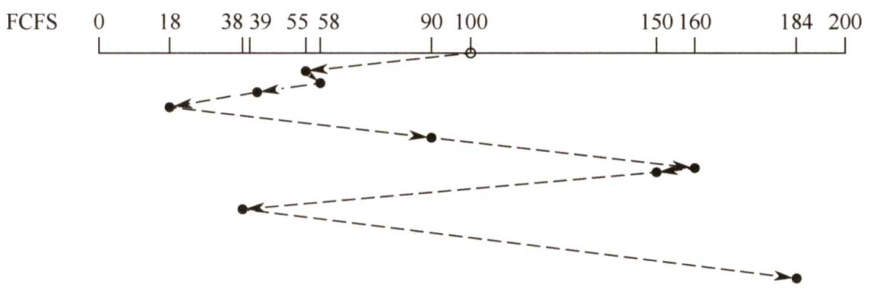  
图5.16FCFS磁盘调度算法  

例如，磁盘请求队列中的请求顺序分别为55,58,39,18,90,160,150,38,184，磁头的初始位置是磁道100，采用FCFS算法时磁头的运动过程如图5.16所示。磁头共移动了 $(45+3+19+21+$ $72+70+10+112+146)=498$ 个磁道，平均寻找长度 $=498/9=55.3$ 。  

（2）最短寻找时间优先（ShortestSeekTimeFirst，SSTF）算法  

SSTF 算法选择调度处理的磁道是与当前磁头所在磁道距离最近的磁道，以便使每次的寻找时间最短。当然，总是选择最小寻找时间并不能保证平均寻找时间最小，但能提供比FCFS 算法更好的性能。这种算法会产生“饥饿”现象。如图5.17所示，若某时刻磁头正在18号磁道，而在18号磁道附近频繁地增加新的请求，则SSTF算法使得磁头长时间在18号磁道附近工作，将使184号磁道的访问被无限期地延迟，即被“饿死”。  

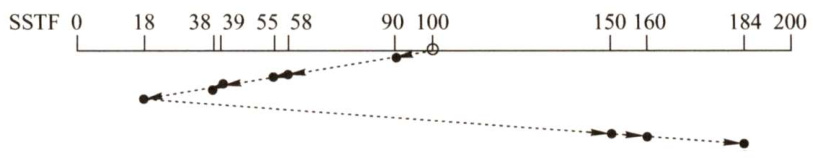  
图5.17SSTF磁盘调度算法  

例如，磁盘请求队列中的请求顺序分别为55,58,39,18,90,160,150,38,184，磁头初始位置是磁道100，采用SSTF算法时磁头的运动过程如图5.17所示。磁头共移动了 $10+32+3+16+1+$  

$20+132+10+24=248$ 个磁道，平均寻找长度 $=248/9=27.5$ o（3）扫描（SCAN）算法（又称电梯调度算法）  

SCAN算法在磁头当前移动方向上选择与当前磁头所在磁道距离最近的请求作为下一次服务的对象，实际上就是在最短寻找时间优先算法的基础上规定了磁头运动的方向，如图5.18所示。由于磁头移动规律与电梯运行相似，因此又称电梯调度算法。SCAN算法对最近扫描过的区域不公平，因此它在访问局部性方面不如FCFS算法和SSTF算法好。  

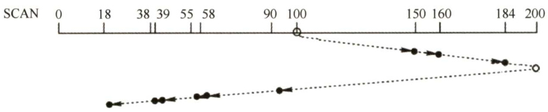  
图5.18 SCAN磁盘调度算法  

例如，磁盘请求队列中的请求顺序分别为55,58,39,18,90,160,150,38,184，磁头初始位置是磁道100。采用SCAN算法时，不但要知道磁头的当前位置，而且要知道磁头的移动方向，假设磁头沿磁道号增大的顺序移动，则磁头的运动过程如图5.18所示。移动磁道的顺序为100,150,160,184,200,90,58,55,39,38,18。磁头共移动了 $(50+10+24+16+110+32+3+16+1+20)=$ 282个磁道，平均寻道长度 $=282/9=31.33$ 。  

（4）循环扫描（CircularSCAN，C-SCAN）算法  

在扫描算法的基础上规定磁头单向移动来提供服务，回返时直接快速移动至起始端而不服务任何请求。由于SCAN算法偏向于处理那些接近最里或最外的磁道的访问请求，所以使用改进型的C-SCAN算法来避免这个问题，如图5.19所示。  

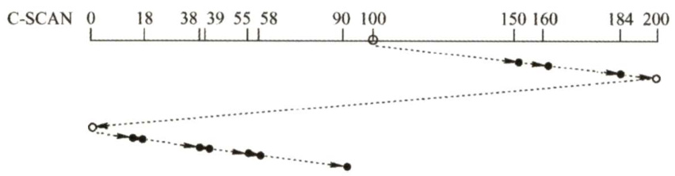  
图5.19C-SCAN磁盘调度算法  

采用SCAN 算法和C-SCAN 算法时，磁头总是严格地遵循从盘面的一端到另一端，显然，在实际使用时还可以改进，即磁头移动只需要到达最远端的一个请求即可返回，不需要到达磁盘端点。这种形式的SCAN算法和C-SCAN算法称为LOOK调度（见图5.20）和C-LOOK（见图5.21）调度，因为它们在朝一个给定方向移动前会查看是否有请求。  

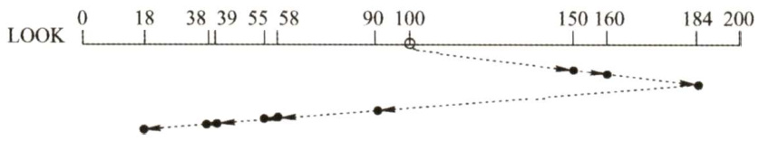  
图5.20LOOK磁盘调度算法  

注意，若无特别说明，也可以默认SCAN算法和C-SCAN算法为LOOK和C-LOOK调度（请读者认真领悟，并通过结合后面的习题进一步加深对以上相关算法的理解)。  

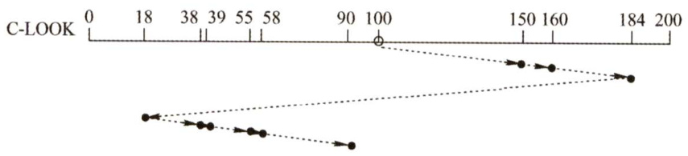  
图5.21C-LOOK磁盘调度算法  

例如，磁盘请求队列中的请求顺序为55,58,39,18,90,160,150,38,184，磁头初始位置是磁道100。采用C-SCAN算法时，假设磁头沿磁道号增大的顺序移动，则磁头的运动过程如图5.19所示。移动磁道的顺序为100,150,160,184,200,0,18,38,39,55,58,90。磁头共移动 $50+10+24+16+$ $200+18+20+1+16+3+32=390$ 个磁道，平均寻道长度 $=390/9=43.33$ 。  

不太熟悉操作系统整体框架的读者经常混淆磁盘调度算法中的循环扫描算法和页面调度算法中的CLOCK算法，请读者注意区分。  

对比以上几种磁盘调度算法，FCFS 算法太过简单，性能较差，仅在请求队列长度接近于1时才较为理想；SSTF 算法较为通用和自然；SCAN 算法和C-SCAN 算法在磁盘负载较大时比较占优势。它们之间的比较见表5.2。  

表5.2磁盘调度算法比较  

<html><body><table><tr><td></td><td>优 点</td><td>缺点</td></tr><tr><td>FCFS算法</td><td>公平、简单</td><td>平均寻道距离大，仅应用在磁盘IO较少的场合</td></tr><tr><td>SSTF算法</td><td>性能比“先来先服务”好</td><td>不能保证平均寻道时间最短，可能出现“饥饿”现象</td></tr><tr><td>SCAN算法</td><td>寻道性能较好，可避免“饥饿”现象</td><td>不利于远离磁头一端的访问请求</td></tr><tr><td>C-SCAN算法</td><td>消除了对两端磁道请求的不公平</td><td></td></tr></table></body></html>  

除减少寻找时间外，减少延迟时间也是提高磁盘传输效率的重要因素。可以对盘面扇区进行交替编号，对磁盘片组中的不同盘面错位命名。假设每个盘面有8个扇区，磁盘片组共8个盘面，则可以采用如图5.22所示的编号。  

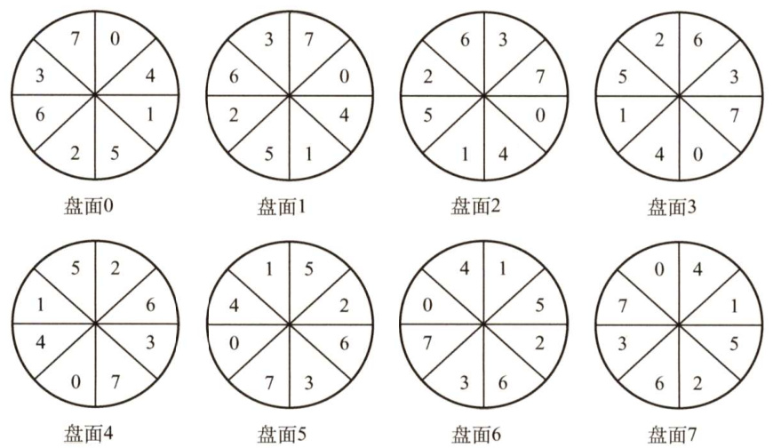  
图5.22 磁盘片组扇区编号  

磁盘是连续自转设备，磁头读/写一个物理块后，需要经过短暂的处理时间才能开始读/写下一块。假设逻辑记录数据连续存放在磁盘空间中，若在盘面上按扇区交替编号连续存放，则连续读/写多条记录时能减少磁头的延迟时间；同柱面不同盘面的扇区若能错位编号，连续读/写相邻  

两个盘面的逻辑记录时也能减少磁头延迟时间。  

以图5.22为例，在随机扇区访问情况下，定位磁道中的一个扇区平均需要转过4个扇区，这时，延迟时间是传输时间的4倍，这是一种非常低效的方式。理想的情况是不需要定位而直接连续读取扇区，没有延迟时间，这样磁盘数据存取效率可以成倍提高。但由于读取扇区的顺序是不可预测的，所以延迟时间不可避免。图5.22中的编号方式是读取连续编号扇区时的一种方法。  

磁盘寻块时间分为三个部分，即寻道时间、延迟时间和传输时间，寻道时间和延迟时间属于“找”的时间，凡是“找”的时间都可以通过一定的方法削减，但传输时间是磁盘本身性质所决定的，不能通过一定的措施减少。  

#### 5.3.4 固态硬盘  

#### 1.固态硬盘的特性  

固态硬盘（SSD）是一种基于闪存技术的存储器。它与U盘并无本质差别，只是容量更大，存取性能更好。一个 SSD 由一个或多个闪存芯片和闪存翻译层组成，如图5.23所示。闪存芯片替代传统旋转磁盘中的机械驱动器，而闪存翻译层将来自CPU的逻辑块读写请求翻译成对底层物理设备的读写控制信号，因此闪存翻译层相当于扮演了磁盘控制器的角色。  

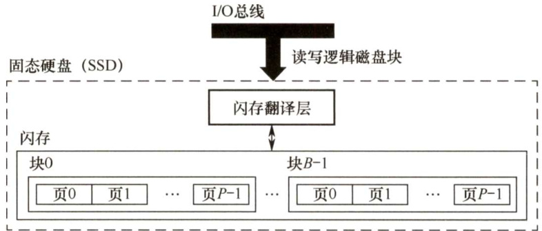  
图5.23 固态硬盘（SSD）  

在图5.23中，一个闪存由 $B$ 块组成，每块由 $P$ 页组成。通常，页的大小是 $512\mathrm{B}\mathrm{\sim}4\mathrm{KB}$ ，每块由 $32\sim128$ 页组成，块的大小为 $16\mathrm{KB}\sim512\mathrm{KB}$ 。数据是以页为单位读写的。只有在一页所属的块整个被擦除后，才能写这一页。不过，一旦擦除一块，块中的每页就都可以直接再写一次。某块进行若干次重复写后，就会磨损坏，不能再使用。  

随机写很慢，有两个原因。首先，擦除块比较慢，通常比访问页高一个数量级。其次，如果写操作试图修改包含已有数据的页 $P_{i},$ ，那么这个块中所有含有用数据的页都必须被复制到一个新（擦除过的）块中，然后才能进行对页 $P_{i}$ 的写操作。  

比起传统磁盘，SSD有很多优点，它由半导体存储器构成，没有移动的部件，因而随机访问时间比机械磁盘要快很多，也没有任何机械噪声和震动，能耗更低、抗震性好、安全性高等。  

随着技术的不断发展，价格也不断下降，SSD会有望逐步取代传统机械硬盘。  

#### 2.磨损均衡（WearLeveling）  

固态硬盘也有缺点，闪存的擦写寿命是有限的，一般是几百次到几千次。如果直接用普通闪存组装 SSD，那么实际的寿命表现可能非常令人失望—读写数据时会集中在 SSD 的一部分闪存，这部分闪存的寿命会损耗得特别快。一旦这部分闪存损坏，整块SSD也就损坏了。这种磨损不均衡的情况，可能会导致一块256GB的SSD，只因数兆空间的闪存损坏而整块损坏。  

为了弥补SSD的寿命缺陷，引入了磨损均衡。SSD磨损均衡技术大致分为两种：  

1）动态磨损均衡。写入数据时，自动选择较新的闪存块。老的闪存块先歇一歇。  

2）静态磨损均衡。这种技术更为先进，就算没有数据写入，SSD也会监测并自动进行数据分配，让老的闪存块承担无须写数据的存储任务，同时让较新的闪存块腾出空间，平常的读写操作在较新的闪存块中进行。如此一来，各闪存块的寿命损耗就都差不多。  

有了这种算法加持，SSD 的寿命就比较可观了。例如，对于一个256GB的 SSD，如果闪存的擦写寿命是500次，那么就需要写入125TB数据，才寿终正寝。就算每天写入10GB数据，也要三十多年才能将闪存磨损坏，更何况很少有人每天往SSD中写入10GB数据。  

#### 5.3.5 本节小结  

本节开头提出的问题的参考答案如下。  

1）在磁盘上进行一次读写操作需要哪几部分时间？其中哪部分时间最长？  

在磁盘上进行一次读写操作花费的时间由寻道时间、延迟时间和传输时间决定。其中寻道时间是将磁头移动到指定磁道所需要的时间，延迟时间是磁头定位到某一磁道的扇区（块号）所需要的时间，传输时间是从磁盘读出或向磁盘写入数据所经历的时间。一般来说，寻道时间因为要移动磁臂，所以占用时间最长。  

2）存储一个文件时，当一个磁道存储不下时，剩下部分是存在同一个盘面的不同磁道好，还是存在同一个柱面上的不同盘面好？  

上一问已经说到，寻道时间对于一次磁盘访问的影响是最大的，若存在同一个盘面的不同磁道，则磁臂势必要移动，这样会大大增加文件的访问时间，而存在同一个柱面上的不同盘面就不需要移动磁道，所以一般情况下存在同一个柱面上的不同盘面更好。  

#### 5.3.6 本节习题精选  

#### 一、单项选择题  

01．磁盘是可共享设备，但在每个时刻（）作业启动它。  

A．可以由任意多个 B．能限定多个C.至少能由一个 D.至多能由一个  

02．既可以随机访问又可顺序访问的有（）。  

I．光盘 II．磁带 IⅢI.U盘 IV.磁盘A.Ⅲ、IⅢ、IV B.I、IⅢ、IV C.III、IV D.仅IV  

03.磁盘调度的目的是缩短（）时间。  

A.找道 B.延迟 C.传送 D.启动  

04.磁盘上的文件以（）为单位读/写。  

A.块 B.记录 C.柱面 D.磁道  

05．在磁盘中读取数据的下列时间中，影响最大的是（）。  

A．处理时间 B.延迟时间 C.传送时间 D．寻找时间  

06．硬盘的操作系统引导扇区产生在（）。  

A.对硬盘进行分区时 B.对硬盘进行低级格式化时C.硬盘出厂时自带 D.对硬盘进行高级格式化时  

07.在下列有关旋转延迟的叙述中，不正确的是（）。  

A.旋转延迟的大小与磁盘调度算法无关B.旋转延迟的大小取决于磁盘空闲空间的分配程序  

C.旋转延迟的大小与文件的物理结构有关D.扇区数据的处理时间对旋转延迟的影响较大  

08.下列算法中，用于磁盘调度的是（）。  

A.时间片轮转调度算法 B.LRU算法C.最短寻找时间优先算法 D.优先级高者优先算法  

09.以下算法中，（）可能出现“饥饿”现象。  

A．电梯调度 B.最短寻找时间优先C.循环扫描算法 D．先来先服务  

10.在以下算法中，（）可能会随时改变磁头的运动方向。  

A．电梯调度 B．先来先服务C.循环扫描算法 D.以上答案都不对  

11.已知某磁盘的平均转速为 $\boldsymbol{r}$ 秒/转，平均寻找时间为 $T$ 秒，每个磁道可以存储的字节数为$N$ ，现向该磁盘读写 $b$ 字节的数据，采用随机寻道的方法，每道的所有扇区组成一个簇，其平均访问时间是（）。  

A. $(r+T)b/N$ B.b/NT C. $(b/N+T)r$ D. $b T/N+r$  

12.设磁盘的转速为3000转/分，盘面划分为10个扇区，则读取一个扇区的时间为（）。  

A.20ms B.5ms C. 2ms D. 1ms  

13.一个磁盘的转速为7200转/分，每个磁道有160个扇区，每扇区有512B，那么理想情况下，其数据传输率为（）。  

A. $7200{\times}160\mathrm{KB/s}$ B. $7200\mathrm{KB/s}$ C. 9600KB/s D. 19200KB/s  

14.设一个磁道访问请求序列为55,58,39,18,90,160,150,38,184，磁头的起始位置为100，若采用SSTF（最短寻道时间优先）算法，则磁头移动（）个磁道。  

A.55 B.184 C.200 D.248  

15.假定磁带的记录密度为400字符/英寸（ $1\mathrm{in}=0.0254\mathrm{m}$ )，每条逻辑记录为80字符，块间隙为0.4英寸，现有3000个逻辑记录需要存储，存储这些记录需要长度为（）的磁带，磁带利用率是（）。  

A．1500英寸， $33.3\%$ B．1500英寸， $43.5\%$ C．1800英寸， $33.3\%$ D．1800英寸， $43.5\%$  

16．下列关于固态硬盘（SSD）的说法中，错误的是（）。  

A．基于闪存的存储技术 B.随机读写性能明显高于磁盘C.随机写比较慢 D．不易磨损  

17．下列关于固态硬盘的说法中，正确是的（）。  

A.固态硬盘的写速度比较慢，性能甚至弱于常规硬盘B.相比常规硬盘，固态硬盘优势主要体现在连续存取的速度C.静态磨损均衡算法比动态磨损均衡算法的表现更优秀D.写入时，每次选择使用长期存放数据而很少擦写的存储块  

18.【2009统考真题】假设磁头当前位于第105道，正在向磁道序号增加的方向移动。现有一个磁道访问请求序列为35,45,12,68,110,180,170,195，采用SCAN调度（电梯调度）算法得到的磁道访问序列是（）。  

A.110,170,180,195,68,45,35,12 B. 110,68,45,35,12,170,180,195   
C. 110,170,180,195,12,35,45,68 D. 12,35,45,68,110,170,180, 195  

19.【2015统考真题】某硬盘有200个磁道（最外侧磁道号为0），磁道访问请求序列为130,42,180,15,199，当前磁头位于第58号磁道并从外侧向内侧移动。按照SCAN调度方法处理完上述请求后，磁头移过的磁道数是（）。  

A.208 B.287 C.325 D.382  

20.【2017统考真题】下列选项中，磁盘逻辑格式化程序所做的工作是（）。  

I．对磁盘进行分区  
ⅡI．建立文件系统的根目录  
IⅢI．确定磁盘扇区校验码所占位数  
IV．对保存空闲磁盘块信息的数据结构进行初始化  

A.仅Ⅱ B.仅ⅡI、IV C.仅III、IV D、仅I、Ⅱ、IV  

21.【2017统考真题】某文件系统的簇和磁盘扇区大小分别为1KB和512B。若一个文件的大小为1026B，则系统分配给该文件的磁盘空间大小是（）。  

A.1026B B.1536B C.1538B D.2048B  

22.【2018统考真题】系统总是访问磁盘的某个磁道而不响应对其他磁道的访问请求，这种现象称为磁臂黏着。下列磁盘调度算法中，不会导致磁臂黏着的是（）。  

A.先来先服务（FCFS） B.最短寻道时间优先（SSTF）C.扫描算法（SCAN） D.循环扫描算法（CSCAN）  

23.【2021统考真题】某系统中磁盘的磁道数为200（0～199），磁头当前在184号磁道上。用户进程提出的磁盘访问请求对应的磁道号依次为184，187,176,182，199。若采用最短寻道时间优先调度算法（SSTF）完成磁盘访问，则磁头移动的距离（磁道数）是（）。  

A.37 B.38 C.41 D.42  

#### 二、综合应用题  

01．假定有一个磁盘组共有100个柱面，每个柱面有8个磁道，每个磁道划分成8个扇区。现有一个5000条逻辑记录的文件，逻辑记录的大小与扇区大小相等，该文件以顺序结构被存放在磁盘组上，柱面、磁道、扇区均从0开始编址，逻辑记录的编号从0开始，文件信息从0柱面、0磁道、0扇区开始存放。试问，该文件编号为3468的逻辑记录应存放在哪个柱面的第几个磁道的第几个扇区上？  

02.假设磁盘的每个磁道分成9个块，现在一个文件有A,B,…，I共9条记录，每条记录的大小与块的大小相等，设磁盘转速为 $27\mathrm{ms}/$ 转，每读出一块后需要2mS的处理时间。若忽略其他辅助时间，且一开始磁头在即将要读A记录的位置，试问：  

1）若将这些记录顺序存放在一个磁道上，则顺序读取该文件要多少时间？  
2）若要求顺序读取的时间最短，则应该如何安排文件的存放位置？  

03．在一个磁盘上，有1000个柱面，编号为0～999，用下面的算法计算为满足磁盘队列中的所有请求，磁盘臂必须移过的磁道的数目。假设最后服务的请求是在磁道345上，并且读写头正在朝磁道0移动。在按FCFS顺序排列的队列中包含了如下磁道上的请求：123,874,692,475,105,376。  

1）FCFS；2）SSTF；3）SCAN；4）LOOK；5）C-SCAN；6）C-LOOK。  

04.某软盘有40个磁道，磁头从一个磁道移至相邻磁道需要6ms。文件在磁盘上非连续存放，逻辑上相邻数据块的平均距离为13磁道，每块的旋转延迟时间及传输时间分别为$100\mathrm{{ms}}$ 和 $25\mathrm{ms}$ ，问读取一个100块的文件需要多少时间？若系统对磁盘进行了整理，让同一文件的磁盘块尽可能靠拢，从而使逻辑上相邻数据块的平均距离降为2磁道，这时  

读取一个100块的文件需要多少时间？  

05.有一个交叉存放信息的磁盘，信息在其上的存放方法如右图所示。每个磁道有8个扇区，每个扇区512B，旋转速度为3000转/分，顺时针读扇区。假定磁头已在读取信息的磁道上，0扇区转到磁头下需要1/2转，且设备对应的控制器不能同时进行输入/输出，在数据从控制器传送至内存的这段时间内，从磁头下通过的扇区数为2，请回答：  

1）依次读取一个磁道上的所有扇区需要多少时间？  
2）该磁盘的数据传输速率是多少？  

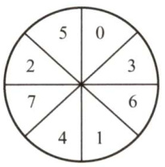  

06.【2010统考真题】如下图所示，假设计算机系统采用C-SCAN（循环扫描）磁盘调度策略，使用2KB的内存空间记录16384个磁盘块的空闲状态。  

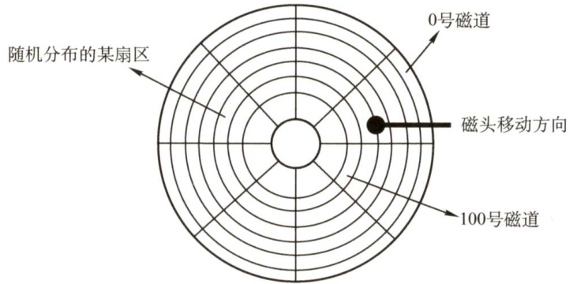  

1）请说明在上述条件下如何进行磁盘块空闲状态的管理。  

2）设某单面磁盘的旋转速度为6000转/分，每个磁道有100个扇区，相邻磁道间的平均移动时间为1ms。若在某时刻，磁头位于100号磁道处，并沿着磁道号增大的方向移动（见上图），磁道号请求队列为50,90,30,120，对请求队列中的每个磁道需读取1个随机分布的扇区，则读完这4个扇区点共需要多少时间？要求给出计算过程。  

3）若将磁盘替换为随机访问的Flash半导体存储器（如U盘、固态硬盘等），是否有比C-SCAN更高效的磁盘调度策略？若有，给出磁盘调度策略的名称并说明理由；若无，说明理由。  

07.【2019统考真题】某计算机系统中的磁盘有300个柱面，每个柱面有10个磁道，每个磁道有200个扇区，扇区大小为512B。文件系统的每簇包含2个扇区。请回答下列问题：1）磁盘的容量是多少？2）设磁头在85号柱面上，此时有4个磁盘访问请求，簇号分别为100260，60005，101660和110560。采用最短寻道时间优先SSTF调度算法，系统访问簇的先后次序是什么？3）簇号100530在磁盘上的物理地址是什么？将簇号转换成磁盘物理地址的过程由I/O系统的什么程序完成？  

08.【2021统考真题】某计算机用硬盘作为启动盘，硬盘的第一个扇区存放主引导记录，其中包含磁盘引导程序和分区表。磁盘引导程序用于选择引导哪个分区的操作系统，分区表记录硬盘上各分区的位置等描述信息。硬盘被划分成若干分区，每个分区的第一个扇区存放分区引导程序，用于引导该分区中的操作系统。系统采用多阶段引导方式，除了执行磁盘引导程序和分区引导程序，还需要执行ROM中的引导程序。回答下列问题：  

1）系统启动过程中操作系统的初始化程序、分区引导程序、ROM中的引导程序、磁盘引导程序的执行顺序是什么？  

2）把硬盘制作为启动盘时，需要完成操作系统的安装、磁盘的物理格式化、逻辑格式化、对磁盘进行分区，执行这4个操作的正确顺序是什么？  

3）磁盘扇区的划分和文件系统根目录的建立分别是在第2）问的哪个操作中完成的？  

#### 5.3.7 答案与解析  

#### 一、单项选择题  

01.D  

磁盘是可共享设备（分时共享)，是指某段时间内可以有多个用户进行访问。但某一时刻只能有一个作业可以访问。  

02.B  

顺序访问按从前到后的顺序对数据进行读写操作，如磁带。随机访问，即直接访问，可以按任意的次序对数据进行读写操作，如光盘、磁盘、U盘等。  

03.A  

磁盘调度是对访问磁道次序的调度，若没有合适的磁盘调度，则寻找时间会大大增加。  

04.A  

文件以块为单位存放于磁盘中，文件的读写也以块为单位。  

05.D  

磁盘调度中，对读/写时间影响最大的是寻找时间，寻找过程为机械运动，时间较长，影响较大。  

06.D  

操作系统的引导程序位于磁盘活动分区的引导扇区，因此必然产生在分区之后。分区是将磁盘分为由一个或多个柱面组成的分区（即C盘、D盘等形式)，每个分区的起始扇区和大小都记录在磁盘主引导记录的分区表中。而对于高级格式化（创建文件系统)，操作系统将初始的文件系统数据结构存储到磁盘上，文件系统在磁盘上布局介绍详见第4章。  

07.D  

磁盘调度算法是为了减少寻找时间。扇区数据的处理时间主要影响传输时间。选项B、C均与旋转延迟有关，文件的物理结构与磁盘空间的分配方式相对应，包括连续分配、链接分配和索引分配。连续分配的磁盘中，文件的物理地址连续；而链接分配方式的磁盘中，文件的物理地址不连续，因此与旋转延迟都有关。  

08.C  

选项A是进程调度算法；选项B是页面淘汰算法；选项D可以用于进程调度和作业调度。只有选项C是磁盘调度算法。  

09.B  

最短寻找时间优先算法中，当新的距离磁头比较近的磁盘访问请求不断被满足时，可能会导  

致较远的磁盘访问请求被无限延迟，从而导致“饥饿”现象。  

10.B  

先来先服务算法根据磁盘请求的时间先后进行调度，因而可能随时改变磁头方向。而电梯调度、循环扫描算法均限制磁头的移动方向。  

11.A  

将每道的所有扇区组成一个簇，意味着可以将一个磁道的所有存储空间组织成一个数据块组，这样有利于提高存储速度。读写磁盘时，磁头首先找到磁道，称为寻道，然后才可以将信息从磁道里读出或写入。读写完一个磁道后，磁头会继续寻找下一个磁道，完成剩余的工作，所以在随机寻道的情况下，读写一个磁道的时间要包括寻道时间和读写磁道时间，即 $T+r$ 秒。由于总的数据量是 $b$ 字节，它要占用的磁道数为 $b/N$ 个，所以总平均读写时间为 $(r+T)b/N$ 秒。  

12.C  

访问每条磁道的时间为 $60/3000\mathrm{s}=0.02\mathrm{s}=20\mathrm{ms}$ ，即磁盘旋转一圈的时间为 $20\mathrm{ms}$ ，每个盘面10个扇区，因此读取一个扇区的时间为 $20\mathrm{ms}/10=2\mathrm{ms}$ 。  

13.C  

磁盘的转速为7200转/分 $\mathbf{\varepsilon}=120$ 转/秒，转一圈经过160个扇区，每个扇区为512B，所以数据传输率 $=120{\times}160{\times}512/1024\mathrm{KB/s}=9600\mathrm{KB/s}_{\circ}$  

14.D  

对于SSTF算法，寻道序列应为100,90,58,55,39,38,18,150,160,184；移动磁道次数分别为10,32,3,16,1,20,132,10,24，故磁头移动总次数为248。另外也可以画出草图来解答，从100寻道到18需要82次，然后加上从18到184需要的 $184-18=166$ 次，共移动 $166+82=248$ 次。  

15.C  

一个逻辑记录所占的磁带长度为 $80/400=0.2\$ 英寸，因此存储3000 条逻辑记录需要的磁带长度为 $(0.2+0.4)\times3000=1800$ 英寸，利用率为 $0.2/(0.2+0.4)=33.3\%$ 。  

16.D  

固态硬盘基于闪存技术，没有机械部件，随机读写不需要机械操作，因此速度明显高于磁盘，A 和B正确。选项C已在考点讲解中解释过。SSD的缺点是容易磨损，D错误。  

17.C  

SSD 的写速度慢于读速度，但不至于比常规机械硬盘差，A错误。SSD基于闪存技术，没有机械部件，随机存取速度很快，传统机械硬盘因为需要寻道和找扇区的时间，所以随机存取速度慢；传统机械硬盘转速很快，连续存取比随机存取快得多，因此SSD的优势主要体现在随机存取的速度上，B错误。静态磨损算法在没有写入数据时，SSD监测并自动进行数据分配，因此表现更为优秀，C正确。因为闪存的擦除速度较慢，若每次都选择写入存放有数据的块，会极大地降低写入速度，选项D混淆了静态磨损均衡，静态磨损均衡是指在没有写入数据时，SSD监测并自动进行数据分配，从而使得各块的擦写更加均衡，并不是说写入时每次都选择存放老数据的块。  

18.A  

SCAN 算法的原理类似于电梯。首先，当磁头从105道向序号增加的方向移动时，便会按照从小到大的顺序服务所有大于105的磁道号（110,170,180,195)；往回移动时又会按照从大到小的顺序进行服务（68,45,35，12)，结果如下图所示。  

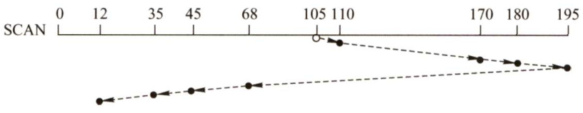  

19.C  

SCAN算法就是电梯调度算法。顾名思义，若开始时磁头向外移动，就一直要到最外侧，然后返回向内侧移动，就像电梯若往下则一直要下到底层才会再上升一样。当前磁头位于58号并从外侧向内侧移动，先依次访问130、180和199，然后返回向外侧移动，依次访问42和15，因此磁头移过的磁道数是 $(199-58)+(199-15)=325$ 8  

20.B  

解析请扫右侧二维码查阅。  

21.D绝大多数操作系统为改善磁盘访问时间，以簇为单位进行空间分配，因此答案选D。  

22.A  

当系统总是持续出现某个磁道的访问请求时，均持续满足最短寻道时间优先、扫描算法和循环扫描算法的访问条件，会一直服务该访问请求。而先来先服务按照请求次序进行调度，比较公平，因此选A。  

23.C  

最短寻道时间优先算法总是选择调度与当前磁头所在磁道距离最近的磁道。可以得出访问序列184，182，187,176,199，从而求出移动距离之和是 $0+2+5+11+23=41$ 8  

#### 二、综合应用题  

01.【解答】  

该磁盘有8个盘面，一个柱面大小为 $8\times8=64$ 个扇区，即64条逻辑记录。由于所有磁头是固定在一起的，因此在存放数据时，先存满扇区，后存满磁道，再存满柱面。  

编号为3468的逻辑记录对应的柱面号为 $3468/64=54$ ；对应的磁道号为(3468MOD64)DIV $8=$ 1；对应的扇区号为(3468M0D64)MOD $8=4$ o  

02.【解答】  

磁盘转速为 $27\mathrm{ms}/$ 转，每个磁道存放9条记录，因此读出1条记录的时间为 $27/9=3\mathrm{ms}$ o  

1）读出并处理记录A需要5ms，此时磁头已转到记录B的中间，因此为了读出记录B，必须再转接近一圈（从记录B的中间到记录B)。后续8条记录的读取及处理与此类似，但最后一条记录的读取与处理只需5ms。于是，处理9条记录的总时间为  

$$
8\times(27+3)+(3+2)=245\mathrm{ms}
$$  

【另解】注意，从开始读A到最后读完 $\mathrm{~I~}$ 一共转了9圈，即处理完前8条记录 $^+$ 读第9条记录的时间一共是 $27\times9=243\mathrm{ms}$ ，加上最后的2ms处理时间，一共是 $243+2=245\mathrm{ms}$ 。  

2）由于每读出一条记录后需要 $2\mathrm{ms}$ 的处理时间，当读出并处理记录A时，不妨设记录A放在第1个盘块中，读写头已移到第2个盘块的中间，为了能顺序读到记录B，应将它放到第3个盘块中，即应将记录按下表顺序存放：  

<html><body><table><tr><td>盘块</td><td>1</td><td>2</td><td>3</td><td>4</td><td>5</td><td>6</td><td>7</td><td>8</td><td>9</td></tr><tr><td>记录</td><td>A</td><td>F</td><td>B</td><td>G</td><td>C</td><td>H</td><td>D</td><td>I</td><td>E</td></tr></table></body></html>  

这样，处理一条记录并将磁头移到下一条记录的时间是  

3 (读出) $+2$ (处理） $+1$ (等待) $\mathrm{\Omega}=6\mathrm{ms}$  

所以，处理9条记录的总时间为  

$$
6{\times}8+(3+2)=53\mathrm{ms}
$$  

03.【解答】  

1）FCFS：移动磁道的顺序为345,123,874,692,475,105,376。磁盘臂必须移过的磁道的数 目为 $222+751+182+217+370+271=2013$ o  

2）SSTF：移动磁道的顺序为345,376,475,692,874,123,105。磁盘臂必须移过的磁道的数目为 $31+99+217+182+751+18=1298{\mathrm{,}}$ 。注意：磁盘臂必须移过的磁道的数目之和的计算没有必要像上面一样对31,99,217，182,751，18求和，仔细的读者会发现：从345到874是一路递增的，接着从874到105是一路递减的。所以仅需计算 $(874-345)+(874-105)=1298$ 。这种方法是不是要比上面得出6个数后再计算它们的和要快捷一些？若之前未注意到此法，相信聪明的读者会马上回顾刚做完的1)，并会仔细观察以下几问的“规律”，进而总结出自己的思路。  

3）SCAN：移动磁道的顺序为345,123,105,0,376,475,692,874。磁盘臂必须移过的磁道的 数目为 $222+18+105+376+99+217+182=1219$ 0  

4）LOOK：移动磁道的顺序为345,123,105,376,475,692,874。磁盘臂必须移过的磁道的数目为 $222+18+271+99+217+182=1009$ 。  

5）C-SCAN：移动磁道的顺序为345,123,105,0,999,874,692,475,376。磁盘臂必须移过的磁道的数目为 $222+18+105+999+125+182+217+99=1967.$ 。  

6）C-L00K：移动磁道的顺序为345,123,105,874,692,475,376。磁盘臂必须移过的磁道的数目为 $222+18+769+182+217+99=1507$ 。  

04.【解答】  

磁盘整理前，逻辑上相邻数据块的平均距离为13磁道，读一块数据需要的时间为  

$$
13{\times}6+100+25=203\mathrm{ms}
$$  

因此，读取一个100块的文件需要的时间为  

$$
203{\times}100=20300\mathrm{ms}
$$  

磁盘整理后，逻辑上相邻数据块的平均距离为2磁道，读一块数据需要的时间为  

$$
2{\times}6+100+25=137\mathrm{ms}
$$  

因此，读取一个100块的文件需要的时间为  

$$
137{\times}100=13700\mathrm{ms}
$$  

05.【解答】  

磁盘逆时针方向旋转按扇区来看即0,3,6…这个顺序。每个号码连续的扇区正好相隔2个扇，即数据从控制器传送到内存的时间，所以相当于磁头连续工作。  

1）由题中条件知，旋转速度为3000转/分 $=50$ 转/秒，即 $20\mathrm{ms}/$ 转。读一个扇区需要的时间为 $20/8=2.5\mathrm{ms}$ o  
读一个扇区并将扇区数据送入内存需要的时间为 $2.5{\times}3=7.5\mathrm{ms}$ 。  
故读出一个磁道上的所有扇区需要的时间为 $20/2+8{\times}7.5=70\mathrm{ms}=0.07\mathrm{s}$ Q2）每个磁道的数据量为 $8{\times}512=4\mathrm{KB}$ o  
故数据传输速率为 $4\mathrm{KB}/0.07\mathrm{s}=4\times1024\mathrm{B}/(1000\times0.07\mathrm{s})=58.5\mathrm{kB}/\mathrm{s}\mathrm{\Omega}$  

注意：表示存储容量、文件大小时K等于1024（通常用大写的K)，表示传输速率时 $\mathbf{k}$ 等于1000（通常用小写的 $\mathbf{k}$ )，注意区别。  

06.【解答】  

1）用位图表示磁盘的空闲状态。每位表示一个磁盘块的空闲状态，共需 $16~384/32=512$ 个字 $=512\times4\mathbf{B}=2\mathbf{K}\mathbf{B}$ ，正好可放在系统提供的内存中。  

2）采用C-SCAN调度算法，访问磁道的顺序和移动的磁道数如下表所示：  

<html><body><table><tr><td>被访问的下一个磁道号</td><td>移动距离 (磁道数)</td></tr><tr><td>120</td><td>20</td></tr><tr><td>30</td><td>90</td></tr><tr><td>50</td><td>20</td></tr><tr><td>90</td><td>40</td></tr></table></body></html>  

移动的磁道数为 $20+90+20+40=170$ ，因此总的移动磁道时间为 $170\mathrm{ms}$ o由于转速为6000转/分，因此平均旋转延迟为 $5\mathrm{ms}$ ，总的旋转延迟时间 $=20\mathrm{{ms}}$ 。由于转速为6000转/分，因此读取一个磁道上的一个扇区的平均读取时间为 $0.1\mathrm{{\dot{m}s}}$ ，扇区的平均读取时间为 $0.1\mathrm{ms}$ ，总的读取扇区的时间为 $0.4\mathrm{{ms}}$ 。综上，读取上述磁道上所有扇区所花的总时间为 $190.4\mathrm{{ms}}$ o3）采用先来先服务（FCFS）调度策略更高效。因为Flash半导体存储器的物理结构不需要考虑寻道时间和旋转延迟，可直接按IO请求的先后顺序服务。  

07.【解答】  

1）磁盘容量 $\mathbf{\Sigma}=\mathbf{\Sigma}$ 磁盘的柱面数 $\times$ 每个柱面的磁道数 $\times$ 每个磁道的扇区数 $\times$ 每个扇区的大小 $\mathbf{\Sigma}=\mathbf{\Sigma}$ $\mathbf{300}{\times}10{\times}200{\times}512/1024)\mathbf{K}\mathbf{B}=3{\times}10^{5}\mathbf{K}\mathbf{B}$ 0  

2）磁头在85号柱面上，对SSTF算法而言，总是访问当前柱面距离最近的地址。注意每个簇包含2个扇区，通过计算得到，85号柱面对应的簇号为 $85000{\sim}85999$ 。通过比较得出，系统最先访问离 $85000{\sim}85999$ 最近的100260，随后访问离100260最近的101660，然后访问110560，最后访问60005。顺序为100260，101660，110560，60005。  

3）第100530簇在磁盘上的物理地址由其所在的柱面号、磁头号、扇区号构成。  

柱面号 $\mathbf{\Sigma}=\mathbf{\Sigma}$ [簇号/每个柱面的簇数 $\left|~=\left\lfloor100530/(10{\times}200/2)\right\rfloor~=~100,$ 。磁头号 $\mathbf{\Sigma}=\mathbf{\Sigma}$ L(簇号%每个柱面的簇数)/每个磁道的簇数 $\big|=\big\lfloor530/(200/2)\big\rfloor=5$ 0扇区号 $\mathbf{\Sigma}=\mathbf{\Sigma}$ 扇区地址%每个磁道的扇区数 $=(530{\times}2)\%200=60$ 。将簇号转换成磁盘物理地址的过程由磁盘驱动程序完成。  

08.【解答】  

1）执行顺序依次是ROM中的引导程序、磁盘引导程序、分区引导程序、操作系统的初始化程序。启动系统时，首先运行ROM中的引导代码（bootstrap)。为执行某个分区的操作系统的初始化程序，需要先执行磁盘引导程序以指示引导到哪个分区，然后执行该分区的引导程序，用于引导该分区的操作系统。  

2）4个操作的执行顺序依次是磁盘的物理格式化、对磁盘进行分区、逻辑格式化、操作系统的安装。磁盘只有通过分区和逻辑格式化后才能安装系统和存储信息。物理格式化（又称低级格式化，通常出厂时就已完成）的作用是为每个磁道划分扇区，安排扇区在磁道中的排列顺序，并对已损坏的磁道和扇区做“坏”标记等。随后将磁盘的整体存储空间划分为相互独立的多个分区（如Windows中划分C盘、D盘等)，这些分区可以用作多种用途，如安装不同的操作系统和应用程序、存储文件等。然后进行逻辑格式化（又称高级格式化)，其作用是对扇区进行逻辑编号、建立逻辑盘的引导记录、文件分配表、文件目录表和数据区等。最后才是操作系统的安装。  

3）由上述分析可知，磁盘扇区的划分是在磁盘的物理格式化操作中完成的，文件系统根目录的建立是在逻辑格式化操作中完成的。